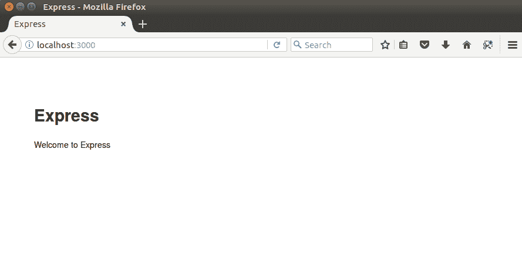
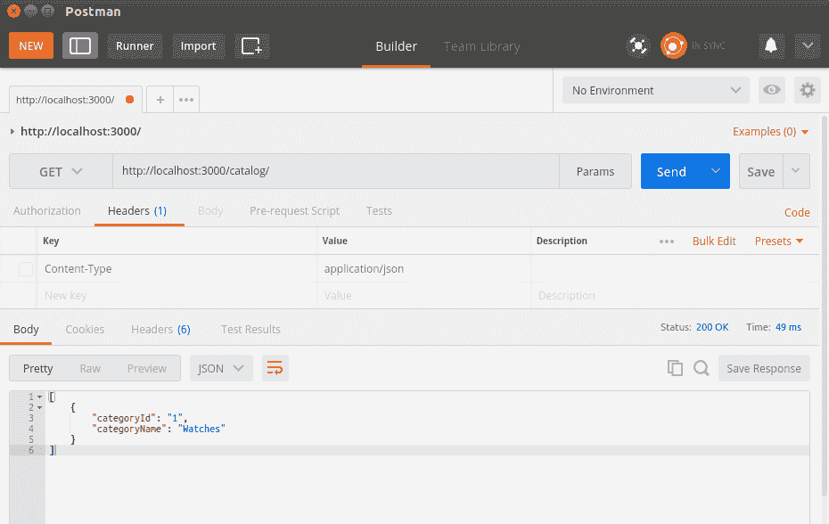
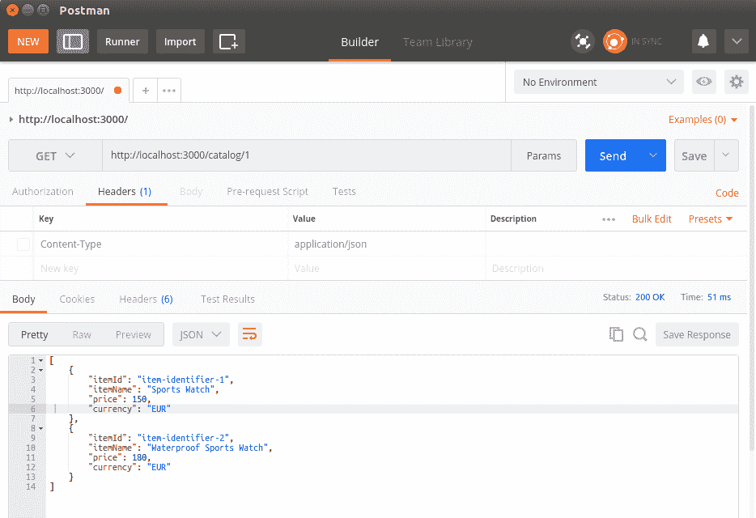
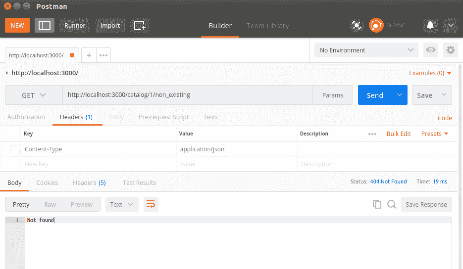

# 第三章：构建典型的 Web API

我们的第一个草案 API 将是只读版本，并且不支持创建或更新目录中的项目，就像真实世界的应用程序一样。相反，我们将集中在 API 定义本身，并且稍后会担心数据存储。当然，对于向数百万用户公开的数据使用文件存储绝非选择，因此在我们查看现代 NoSQL 数据库解决方案之后，将为我们的应用程序提供数据库层。

我们还将涵盖内容协商的主题，这是一种允许消费者指定请求数据期望格式的机制。最后，我们将看看几种暴露服务不同版本的方式，以防它以不向后兼容的方式发展。

总之，在本章中，您将学习以下内容：

+   如何指定 Web API

+   如何实现路由

+   如何查询您的 API

+   内容协商

+   API 版本控制

在本章之后，您应该能够完全指定一个 RESTful API，并且几乎准备好开始实现真实的 Node.js RESTful 服务。

# 指定 API

项目通常开始的第一件事是定义 API 将公开的操作。根据 REST 原则，操作由 HTTP 方法和 URI 公开。每个操作执行的操作不应违反其 HTTP 方法的自然含义。以下表格详细说明了我们 API 的操作：

| **方法** | **URI** | **描述** |
| --- | --- | --- |
| `GET` | `/category` | 检索目录中所有可用类别。 |
| `GET` | `/category/{category-id}/` | 检索特定类别下所有可用项目。 |
| `GET`  |  `/category/{category-id}/{item-id}`  | 通过其 ID 在特定类别下检索项目。 |
| `POST` | `/category` | 创建一个新类别；如果存在，它将对其进行更新。 |
| `POST`  | `/category/{category-id}/`  | 在指定类别中创建一个新项目。如果项目存在，它将对其进行更新。 |
| `PUT`  |  `/category/{category-id}`  | 更新类别。 |
| `PUT` | `/category/{category-id}/{item-id}` | 更新指定类别中的项目。 |
| `DELETE` | `/category/{category-id}` | 删除现有类别。 |
| `DELETE` | `/category/{category-id}/{item-id}` | 删除指定类别中的项目。 |

第二步是为我们的目录应用程序的数据选择适当的格式。JSON 对象受 JavaScript 的本地支持。它们在应用程序演变期间易于扩展，并且几乎可以被任何可用的平台消耗。因此，JSON 格式似乎是我们的逻辑选择。这是本书中将使用的项目和类别对象的 JSON 表示：

```js
{ 
    "itemId": "item-identifier-1", 
    "itemName": "Sports Watch", 
    "category": "Watches", 
    "categoryId": 1,
    "price": 150, 
    "currency": "EUR"
} 

{
    "categoryName" : "Watches",
    "categoryId" : "1",
    "itemsCount" : 100,
    "items" : [{
            "itemId" : "item-identifier-1",
            "itemName":"Sports Watch",
            "price": 150,
            "currency" : "EUR"    
     }]
}
```

到目前为止，我们的 API 已经定义了一组操作和要使用的数据格式。下一步是实现一个模块，该模块将导出为路由中的每个操作提供服务的函数。

首先，让我们创建一个新的 Node.js Express 项目。选择一个存储项目的目录，并从您的 shell 终端中执行`express chapter3`。如果您使用 Windows，您需要在生成项目之前安装`express-generator`模块。`express-generator`将在所选目录中创建初始的 express 项目布局。该布局为您提供了默认的项目结构，确保您的 Express 项目遵循标准的项目结构。这使得您的项目更容易导航。

下一步是将项目导入 Atom IDE。在项目选项卡中的任何位置右键单击，然后选择“添加项目文件夹”，然后选择 Express 为您生成的目录。

正如您所看到的，Express 已经为我们做了一些后台工作，并为我们创建了应用程序的起点：`app.js`。它还为我们创建了`package.json`文件。让我们从`package.json`开始查看这些文件中的每一个：

```js
{
  "name": "chapter3",
  "version": "1.0.0",
  "description": "",
  "main": "app.js",
  "scripts": {
    "test": "test"
  },
  "author": "",
  "license": "ISC",
  "dependencies": {
 "dependencies": {
    "body-parser": "~1.13.2",
    "cookie-parser": "~1.3.5",
    "debug": "~2.2.0",
    "express": "~4.16.1",
    "jade": "~1.11.0",
    "morgan": "~1.6.1",
    "serve-favicon": "~2.3.0"

  }
}
```

当我们创建一个空白的 Node.js Express 项目时，我们最初只依赖于 Express 框架，一些中间件模块，如`morgan`、`body-parser`和`cookie-parser`，以及 Jade 模板语言。Jade 是一种简单的模板语言，用于在模板中生成 HTML 代码。如果您对此感兴趣，可以在[`www.jade-lang.com`](http://www.jade-lang.com/)了解更多信息。

撰写时，Express 框架的当前版本是 4.16.1；要更新它，请从`chapter3`目录执行`npm install express@4.16.1 --save`。此命令将更新应用程序对所需版本的依赖。`--save`选项将更新并保存项目的`package.json`文件中的新版本依赖。

当您引入新的模块依赖项时，您需要保持`package.json`文件的最新状态，以便维护应用程序所依赖的模块的准确状态。

我们稍后会讲解中间件模块是什么。

目前，我们将忽略`public`和`view`目录的内容，因为它与我们的 RESTful 服务无关。它们包含了自动生成的样式表和模板文件，如果我们决定在以后阶段开发基于 Web 的服务消费者，这些文件可能会有所帮助。

我们已经提到 Express 项目在`app.js`中为我们的 Web 应用程序创建了一个起点。让我们深入了解一下：

```js
var express = require('express');
var path = require('path');
var favicon = require('serve-favicon');
var logger = require('morgan');
var cookieParser = require('cookie-parser');
var bodyParser = require('body-parser');

var routes = require('./routes/index');
var users = require('./routes/users');

var app = express();

// view engine setup
app.set('views', path.join(__dirname, 'views'));
app.set('view engine', 'jade');

// uncomment after placing your favicon in /public
//app.use(favicon(path.join(__dirname, 'public', 'favicon.ico')));
app.use(logger('dev'));
app.use(bodyParser.json());
app.use(bodyParser.urlencoded({ extended: false }));
app.use(cookieParser());
app.use(express.static(path.join(__dirname, 'public')));

app.use('/', routes);
app.use('/users', users);

// catch 404 and forward to error handler
app.use(function(req, res, next) {
  var err = new Error('Not Found');
  err.status = 404;
  next(err);
});

// error handlers

// development error handler
// will print stacktrace
if (app.get('env') === 'development') {
  app.use(function(err, req, res, next) {
    res.status(err.status || 500);
    res.render('error', {
      message: err.message,
      error: err
    });
  });
}

// production error handler
// no stacktraces leaked to user
app.use(function(err, req, res, next) {
  res.status(err.status || 500);
  res.render('error', {
    message: err.message,
    error: {}
  });
});

module.exports = app;
```

显然，Express 生成器为我们做了很多工作，它实例化了 Express 框架，并为其分配了完整的开发环境。它做了以下工作：

+   配置了在我们的应用程序中使用的中间件，`body-parser`、默认路由器，以及我们的开发环境的错误处理中间件

+   注入了 morgan 中间件模块的日志记录器实例

+   配置了 Jade 模板，因为它已被选为我们应用程序的默认模板

+   配置了我们的 Express 应用程序将监听的默认 URI，`/`和`/users`，并为它们创建了虚拟的处理函数

您需要安装`app.js`中使用的所有模块，以便成功启动生成的应用程序。此外，在安装它们后，请确保使用`--save`选项更新您的`package.json`文件的依赖项。

Express 生成器还为应用程序创建了一个起始脚本。它位于项目的`bin/www`目录下，看起来像下面的片段：

```js
#!/usr/bin/env node

/**
 * Module dependencies.
 */

var app = require('../app');
var debug = require('debug')('chapter3:server');
var http = require('http');

/**
 * Get port from environment and store in Express.
 */

var port = normalizePort(process.env.PORT || '3000');
app.set('port', port);

/**
 * Create HTTP server.
 */

var server = http.createServer(app);

/**
 * Listen on provided port, on all network interfaces.
 */

server.listen(port);
server.on('error', onError);
server.on('listening', onListening);

/**
 * Normalize a port into a number, string, or false.
 */

function normalizePort(val) {
  var port = parseInt(val, 10);

  if (isNaN(port)) {
    // named pipe
    return val;
  }

  if (port >= 0) {
    // port number
    return port;
  }

  return false;
}

/**
 * Event listener for HTTP server "error" event.
 */

function onError(error) {
  if (error.syscall !== 'listen') {
    throw error;
  }

  var bind = typeof port === 'string'
    ? 'Pipe ' + port
    : 'Port ' + port;

  // handle specific listen errors with friendly messages
  switch (error.code) {
    case 'EACCES':
      console.error(bind + ' requires elevated privileges');
      process.exit(1);
      break;
    case 'EADDRINUSE':
      console.error(bind + ' is already in use');
      process.exit(1);
      break;
    default:
      throw error;
  }
}

/**
 * Event listener for HTTP server "listening" event.
 */

function onListening() {
  var addr = server.address();
  var bind = typeof addr === 'string'
    ? 'pipe ' + addr
    : 'port ' + addr.port;
  debug('Listening on ' + bind);
}
```

要启动应用程序，请执行`node bin/www`；这将执行上面的脚本，并启动 Node.js 应用程序。因此，在浏览器中请求`http://localhost:3000`将导致调用默认的`GET`处理程序，它会给出一个热烈的欢迎响应：



Express 应用程序的默认欢迎消息

生成器创建了一个虚拟的`routes/users.js`；它公开了一个与`/users`位置上的虚拟模块相关联的路由。请求它将导致调用用户路由的`list`函数，该函数输出一个静态响应：`respond with a resource`。

我们的应用程序将不使用模板语言和样式表，因此让我们摆脱在应用程序配置中设置视图和视图引擎属性的行。此外，我们将实现自己的路由。因此，我们不需要为我们的应用程序绑定`/`和`/users`的 URI，也不需要`user`模块；相反，我们将利用`catalog`模块和一个路由：

```js
var express = require('express');
var path = require('path');
var favicon = require('serve-favicon');
var logger = require('morgan');
var cookieParser = require('cookie-parser');
var bodyParser = require('body-parser');

var routes = require('./routes/index');
var catalog = require('./routes/catalog')
var app = express();

//uncomment after placing your favicon in /public
//app.use(favicon(path.join(__dirname, 'public', 'favicon.ico')));
app.use(logger('dev'));
app.use(bodyParser.json());
app.use(bodyParser.urlencoded({ extended: false }));
app.use(cookieParser());
app.use(express.static(path.join(__dirname, 'public')));

app.use('/', routes);
app.use('/catalog', catalog);

// catch 404 and forward to error handler
app.use(function(req, res, next) {
  var err = new Error('Not Found');
  err.status = 404;
  next(err);
});

//development error handler will print stacktrace
if (app.get('env') === 'development') {
  app.use(function(err, req, res, next) {
    res.status(err.status || 500);
    res.render('error', {
      message: err.message,
      error: err
    });
  });
}

// production error handler no stacktraces leaked to user
app.use(function(err, req, res, next) {
  res.status(err.status || 500);
  res.render('error', {
    message: err.message,
    error: {}
  });
});

module.exports = app;

```

经过这次清理之后，我们的应用程序看起来更加整洁，我们准备继续前进。

在这之前，有一个术语需要进一步解释：中间件。它是由`Express.js`路由层调用的一组链式函数的子集，在调用用户定义的处理程序之前。中间件函数可以完全访问`request`和`response`对象，并且可以修改它们中的任何一个。中间件链总是按照定义的确切顺序调用，因此您需要确切知道特定中间件正在做什么。一旦中间件函数完成，它通过调用其下一个参数作为函数来调用链中的下一个函数。在完整的链执行完毕后，将调用用户定义的请求处理程序。

以下是适用于中间件链的基本规则：

+   中间件函数具有以下签名：`function (request, response, next)`。

+   中间件函数按照它们被添加到应用程序链中的确切顺序执行。这意味着如果您希望在特定路由之前调用您的中间件函数，您需要在声明路由之前添加它。

+   中间件函数使用它们的第三个参数`next`作为函数来指示它们已完成工作并退出。当调用链中最后一个函数的`next()`参数时，链式执行完成，并且`request`和`response`对象以中间件设置的状态到达定义的处理程序。

现在我们知道了中间件函数是什么，让我们澄清当前使用的中间件函数为我们的应用程序提供了什么。`body-parser`中间件是 Express 框架内置的解析器。它解析`request`体，并在中间件执行完成后填充`request`对象，即提供 JSON 负载处理。

现在是时候继续实现我们的用户模块，该模块将映射到我们的 URI。该模块将命名为`modules/catalog.js`：

```js
var fs = require('fs');

function readCatalogSync() {
   var file = './data/catalog.json';
   if (fs.existsSync(file)) {
     var content = fs.readFileSync(file);
     var catalog = JSON.parse(content);
     return catalog;
   }
   return undefined;
 }

exports.findItems = function(categoryId) {
  console.log('Returning all items for categoryId: ' + categoryId);
  var catalog = readCatalogSync();
  if (catalog) {
    var items = [];
    for (var index in catalog.catalog) {
        if (catalog.catalog[index].categoryId === categoryId) {
          var category = catalog.catalog[index];
          for (var itemIndex in category.items) {
            items.push(category.items[itemIndex]);
          }
        }
    }
    return items;
  }
  return undefined;
}

exports.findItem = function(categoryId, itemId) {
  console.log('Looking for item with id' + itemId);
  var catalog = readCatalogSync();
  if (catalog) {
    for (var index in catalog.catalog) {
        if (catalog.catalog[index].categoryId === categoryId) {
          var category = catalog.catalog[index];
          for (var itemIndex in category.items) {
            if (category.items[itemIndex].itemId === itemId) {
              return category.items[itemIndex];
            }
          }
        }
    }
  }
  return undefined;
}

exports.findCategoryies = function() {
  console.log('Returning all categories');
  var catalog = readCatalogSync();
  if (catalog) {
    var categories = [];
    for (var index in catalog.catalog) {
        var category = {};
        category["categoryId"] = catalog.catalog[index].categoryId;
        category["categoryName"] = catalog.catalog[index].categoryName;

        categories.push(category);
    }
    return categories;
  }
  return [];
}
```

目录模块围绕存储在`data`目录中的`catalog.json`文件构建。源文件的内容使用文件系统模块`fs`在`readCatalogSync`函数内同步读取。文件系统模块提供多个有用的文件系统操作，如创建、重命名或删除文件或目录的函数；截断；链接；`chmod`函数；以及用于读取和写入数据的同步和异步文件访问。在我们的示例应用程序中，我们旨在使用最直接的方法，因此我们实现了利用文件系统模块的`readFileSync`函数读取`catalog.json`文件的函数。它以同步调用的方式将文件内容作为字符串返回。模块的所有其他函数都被导出，并可用于根据不同的条件查询源文件的内容。

目录模块导出以下函数：

+   `findCategories`: 返回包含`catalog.json`文件中所有类别的 JSON 对象数组

+   `findItems (categoryId)`: 返回表示给定类别中所有项目的 JSON 对象数组

+   `findItem(categoryId, itemId)`: 返回表示给定类别中单个项目的 JSON 对象

现在我们有了三个完整的函数，让我们看看如何将它们绑定到我们的 Express 应用程序。

# 实现路由

在 Node.js 术语中，路由是 URI 和函数之间的绑定。Express 框架提供了对路由的内置支持。一个`express`对象实例包含了每个 HTTP 动词命名的函数：`get`、`post`、`put`和`delete`。它们的语法如下：`function(uri, handler);`。它们用于将处理程序函数绑定到在 URI 上执行的特定 HTTP 动作。处理程序函数通常接受两个参数：`request`和`response`。让我们通过一个简单的`Hello route`应用程序来看一下：

```js
var express = require('express'); 
var app = express(); 

app.get('/hello', function(request, response){ 
  response.send('Hello route'); 
}); 

app.listen(3000); 
```

在本地主机上运行此示例并访问`http://localhost:3000/hello`将调用您的处理程序函数，并且它将响应说`Hello route`，但路由可以提供更多。它允许您定义带参数的 URI；例如，让我们使用`/hello/:name`作为路由字符串。它告诉框架所使用的 URI 由两部分组成：一个静态部分（`hello`）和一个变量部分（`name`参数）。

此外，当路由字符串和处理函数与 Express 实例的`get`函数一起定义时，在处理程序函数的`request`参数中直接提供了参数集合。为了证明这一点，让我们稍微修改我们之前的例子：

```js
var express = require('express'); 
var app = express(); 

app.get('/hello:name', function(request, response){ 
  response.send('Hello ' + request.params.name); 
}); 

app.listen(3000); 
```

如您在上述代码片段中所见，我们使用冒号（`:`）将 URI 的参数部分与静态部分分开。您可以在 Express 路由中有多个参数；例如，`/category/:category-id/items/:item-id`定义了一个用于显示属于类别的项目的路由，其中`category-id`和`item-id`是参数。

现在让我们试一下。请求`http://localhost:3000/hello/friend`将导致以下输出：

```js
hello friend
```

这就是我们如何在 Express 中提供参数化的 URI。这是一个很好的功能，但通常还不够。在 Web 应用程序中，我们习惯使用`GET`参数提供额外的参数。

不幸的是，Express 框架对`GET`参数的支持并不是很好。因此，我们必须利用`url`模块。它内置在 Node.js 中，提供了一种使用 URL 解析的简单方法。让我们再次在应用程序中使用我们的`hello`结果和其他参数，但以一种方式扩展它，使其在请求`/hello`时输出`hello all`，在请求的 URI 为`/hello?name=friend`时输出`hello friend`：

```js
var express = require('express'); 
var url = require('url'); 
var app = express(); 

app.get('/hello', function(request, response){ 
   var getParams = url.parse(request.url, true).query; 

   if (Object.keys(getParams).length == 0) {       
      response.end('Hello all');    
   } else {
      response.end('Hello ' + getParams.name); 
   }    
}); 

app.listen(3000); 
```

这里有几件值得一提的事情。我们使用了`url`模块的`parse`函数。它以 URL 作为第一个参数，以布尔值作为可选的第二个参数，指定是否应解析查询字符串。`url.parse`函数返回一个关联对象。我们使用`Object.keys`将其与关联对象中的键转换为数组，以便我们可以检查其长度。这将帮助我们检查我们的 URI 是否已使用`GET`参数调用。除了以每个 HTTP 动词命名的路由函数之外，还有一个名为`all`的函数。当使用时，它将所有 HTTP 动作路由到指定的 URI。

现在我们知道了在 Node.js 和 Express 环境中路由和`GET`参数的工作原理，我们准备为`catalog`模块定义一个路由并将其绑定到我们的应用程序中。以下是在`routes/catalog.js`中定义的路由。

```js
var express = require('express');
var catalog = require('../modules/catalog.js')

var router = express.Router();

router.get('/', function(request, response, next) {
  var categories = catalog.findCategoryies();
  response.json(categories);
});

router.get('/:categoryId', function(request, response, next) {
  var categories = catalog.findItems(request.params.categoryId);
  if (categories === undefined) {
    response.writeHead(404, {'Content-Type' : 'text/plain'});
    response.end('Not found');
  } else {
    response.json(categories);
  }
});

router.get('/:categoryId/:itemId', function(request, response, next) {
  var item = catalog.findItem(request.params.categoryId, request.params.itemId);
  if (item === undefined) {
    response.writeHead(404, {'Content-Type' : 'text/plain'});
    response.end('Not found');
  } else {
  response.json(item);
  }
});
module.exports = router;

```

首先，从 Express 模块创建了一个`Router`实例。下面是一个很好描述我们刚刚实现的路由的表格。这将在我们测试 API 时很有帮助：

| **HTTP 方法** | **路由** | **目录模块函数** |
| --- | --- | --- |
| `GET` | `/catalog` | `findCategories()` |
| `GET` | `/catalog/:categoryId` | `findItems(categoryId)`  |
| `GET` | `/catalog/:categoryId/:itemId` | `findItem(categoryId, itemId)`  |

# 使用测试数据查询 API

我们需要一些测试数据来测试我们的服务，所以让我们使用项目的`data`目录中的`catalog.json`文件。这些数据将允许我们测试我们的三个函数，但为了做到这一点，我们需要一个可以针对端点发送 REST 请求的客户端。如果您还没有为测试应用程序创建 Postman 项目，现在是创建它的合适时机。

请求`/catalog`应该返回`test`文件中的所有类别：



因此，请求`/catalog/1`应该返回属于`Watches`类别的所有项目的列表：



最后，请求`http://localhost:3000/catalog/1/item-identifier-1`将仅显示由`item-identifier-1`标识的项目，请求不存在的项目将导致状态码`404`的响应：



# 内容协商

到目前为止，目录服务仅支持 JSON 格式，因此仅使用媒体类型`application/json`。假设我们的服务必须以不同的格式提供数据，例如 JSON 和 XML。然后，消费者需要明确定义他们需要的数据格式。在 REST 中进行内容协商的最佳方式长期以来一直是一个备受争议的话题。

在他关于正确实施内容协商的著名讨论中，罗伊·菲尔丁陈述了以下观点：

所有重要资源都必须有 URI。

然而，这留下了如何以不同的数据格式公开相同资源的空白，因此罗伊继续如下：

代理驱动的谈判效果更好，但我和 HTTP 工作组主席之间存在巨大分歧，我的 HTTP/1.1 的原始代理驱动设计实际上被委员会埋没了。为了正确进行谈判，客户端需要了解所有的替代方案以及应该用作书签的内容。

虽然可以选择继续使用 URI 驱动的谈判，通过提供自定义的`GET`参数来提供所需的格式，但 REST 社区选择坚持罗伊的代理驱动谈判建议。现在距离这场争论开始已经将近十年了，已经证明他们做出了正确的决定。代理驱动的谈判使用`Accept` HTTP 头。

`Accept` HTTP 头指定了消费者愿意处理的资源的媒体类型。除了`Accept`头之外，消费者还可以使用`Accept-Language`和`Accept-Encoding`头来指定结果应该提供的语言和编码。如果服务器未能以预期的格式提供结果，它可以返回默认值，或者使用`HTTP 406 Not acceptable`，以避免在客户端引起数据混淆错误。

Node.js 的 HTTP `response`对象包含一个名为`format`的方法，该方法基于`request`对象中设置的`Accept` HTTP 头执行内容协商。它使用内置的`request.accepts()`来为请求选择适当的处理程序。如果找不到，服务器将调用默认处理程序，该处理程序将返回`HTTP 406 Not acceptable`。让我们创建一个演示，演示如何在我们的路由中使用`format`方法。为此，让我们假设我们在我们的`catalog`模块中实现了一个名为`list_groups_in_xml`的函数，该函数以 XML 格式提供组数据：

```js
app.get('/catalog', function(request, response) { 
    response.format( { 
      'text/xml' : function() { 
         response.send(catalog.findCategoiesXml()); 
      }, 
      'application/json' : function() { 
         response.json(catalog.findCategoriesJson()); 
      }, 
      'default' : function() {. 
         response.status(406).send('Not Acceptable'); 
      }    
    }); 
}); 
```

这是您可以以清晰简单的方式实施内容协商的方法。

# API 版本控制

不可避免的事实是，所有应用程序 API 都在不断发展。然而，具有未知数量的消费者的公共 API 的演变，例如 RESTful 服务，是一个敏感的话题。由于消费者可能无法适当处理修改后的数据，并且没有办法通知所有消费者，我们需要尽可能保持 API 的向后兼容性。其中一种方法是为我们应用程序的不同版本使用不同的 URI。目前，我们的目录 API 在`/catalog`上可用。

当时机成熟，例如，版本 2 时，我们可能需要保留以前的版本在另一个 URI 上以实现向后兼容。最佳做法是在 URI 中编码版本号，例如`/v1/catalog`，并将`/catalog`映射到最新版本。因此，请求`/catalog`将导致重定向到`/v2/catalog`，并将使用 HTTP `3xx`状态代码指示重定向到最新版本。

另一个版本控制的选项是保持 API 的 URI 稳定，并依赖自定义的 HTTP 标头来指定版本。但这并不是一个非常稳定的方法，因为与其在请求中修改发送的标头，不如在应用程序中修改请求的 URL 更自然。

# 自测问题

为了获得额外的信心，请浏览这组陈述，并说明它们是真还是假：

1.  REST 启用的端点必须支持与 REST 原则相关的所有 HTTP 方法。

1.  当内容协商失败时，由于接受标头的值作为不支持的媒体类型，301 是适当的状态代码。

1.  在使用参数化路由时，开发人员可以指定参数的类型，例如，它是数字类型还是文字类型。

# 总结

在本章中，我们深入了一些更复杂的主题。让我们总结一下我们所涵盖的内容。我们首先指定了我们的 Web API 的操作，并定义了操作是 URI 和 HTTP 动作的组合。接下来，我们实现了路由并将它们绑定到一个操作。然后，我们使用 Postman REST 客户端请求每个操作以请求我们路由的 URI。在内容协商部分，我们处理了`Accept` HTTP 标头，以便按照消费者请求的格式提供结果。最后，我们涵盖了 API 版本的主题，这使我们能够开发向后兼容的 API。

在本章中，我们对我们的数据使用了老式的文件系统存储。这对于 Web 应用程序来说并不合适。因此，我们将在下一章中研究现代、可扩展和可靠的 NoSQL 存储。
