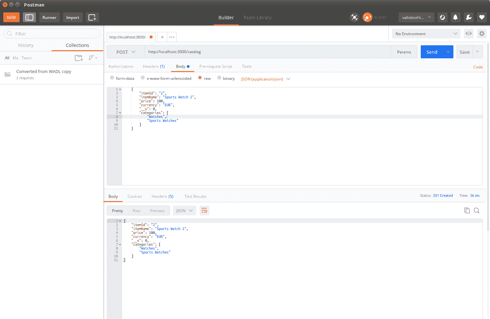

# 第四章：使用 NoSQL 数据库

在上一章中，我们实现了一个暴露只读服务的示例应用程序，提供了目录数据。为了简单起见，我们通过使用文件存储在这个实现中引入了性能瓶颈。这种存储不适合 Web 应用程序。它依赖于 33 个物理文件，阻止我们的应用程序为重负载提供服务，因为文件存储由于磁盘 I/O 操作而缺乏多租户支持。换句话说，我们绝对需要寻找更好的存储解决方案，当需要时可以轻松扩展，以满足我们的 REST 应用程序的需求。NoSQL 数据库现在在 Web 和云环境中被广泛使用，确保零停机和高可用性。它们比传统的事务 SQL 数据库具有以下优势：

+   它们支持模式版本；也就是说，它们可以使用对象表示而不是根据一个或多个表的定义填充对象状态。

+   它们是可扩展的，因为它们存储了一个实际的对象。数据演变得到了隐式支持，所以您只需要调用存储修改后对象的操作。

+   它们被设计为高度分布式和可扩展的。

几乎所有现代 NoSQL 解决方案都支持集群，并且可以随着应用程序的负载进一步扩展。此外，它们中的大多数都具有基于 HTTP 的 REST 接口，可以在高可用性场景中通过负载均衡器轻松使用。传统的数据库驱动程序通常不适用于传统的客户端语言，如 JavaScript，因为它们需要本机库或驱动程序。然而，NoSQL 的理念起源于使用文档数据存储。因此，它们中的大多数都支持 JavaScript 的本机 JSON 格式。最后但并非最不重要的是，大多数 NoSQL 解决方案都是开源的，并且可以免费使用，具有开源项目提供的所有好处：社区、示例和自由！

在本章中，我们将介绍 MongoDB NoSQL 数据库和与之交互的 Mongoose 模块。我们将看到如何为数据库模型设计和实现自动化测试。最后，在本章末尾，我们将消除文件存储的瓶颈，并将我们的应用程序移至几乎可以投入生产的状态。

# MongoDB - 一个文档存储数据库

MongoDB 是一个具有内置对 JSON 格式支持的开源文档数据库。它提供了对文档中任何可用属性的完整索引支持。由于其可扩展性特性，它非常适合高可用性场景。MongoDB，可在[`mms.mongodb.com`](https://mms.mongodb.com/)找到，具有其管理服务**MongoDB 管理服务**（MMS）。它们利用和自动化大部分需要执行的开发操作，以保持您的云数据库良好运行，负责升级、进一步扩展、备份、恢复、性能和安全警报。

让我们继续安装 MongoDB。Windows、Linux、macOS 和 Solaris 的安装程序可在[`www.mongodb.org/downloads`](http://www.mongodb.org/downloads)找到。Linux 用户可以在所有流行的发行版存储库中找到 MongoDB，而 Windows 用户可以使用用户友好的向导来指导您完成安装步骤，对于典型的安装，您只需要接受许可协议并提供安装路径。

安装成功后，执行以下命令启动 MongoDB。如果要指定数据的自定义位置，必须使用`--dbpath`参数。可选地，您可以通过`--rest`参数启动 MongoDB HTTP 控制台：

```js
mongod --dbpath ./data --rest
```

与 MongoDB 通信的默认端口是`27017`，其 HTTP 控制台隐式配置为使用比数据端口高 1,000 的端口。因此，控制台的默认端口将是`28017`。HTTP 控制台提供有关数据库的有用信息，例如日志、健康状态、可用数据库等。我强烈建议您花一些时间了解它。控制台还可以用作数据库的 RESTful 健康检查服务，因为它提供有关运行中的数据库服务和上次发生的错误的 JSON 编码信息：

```js
GET /replSetGetStatus?text=1 HTTP/1.1
Host: localhost:28017
Connection: Keep-Alive
User-Agent: RestClient-Tool

HTTP/1.0 200 OK
Content-Length: 56
Connection: close
Content-Type: text/plain;charset=utf-8

{
"ok": 0,
"errmsg": "not running with --replSet"
}
```

此 REST 接口可用于脚本或应用程序，以自动更改通知，提供数据库引擎的当前状态等。

控制台的日志部分显示您的服务器是否成功运行（如果是）。现在我们准备进一步了解如何将 Node.js 连接到 MongoDB。

# 使用 Mongoose 进行数据库建模

**Mongoose**是一个将 Node.js 连接到 MongoDB 的模块，采用**对象文档映射器**（**ODM**）风格。它为存储在数据库中的文档提供了**创建、读取、更新和删除**（也称为**CRUD**）功能。Mongoose 使用模式定义文档的结构。模式是 Mongoose 中数据定义的最小单元。模型是根据模式定义构建的。它是一个类似构造函数的函数，可用于创建或查询文档。文档是模型的实例，并表示与存储在 MongoDB 中的文档一一映射。模式-模型-文档层次结构提供了一种自描述的定义对象的方式，并允许轻松进行数据验证。

让我们从使用`npm`安装 Mongoose 开始：

```js
npm install mongoose
```

现在我们已经安装了 Mongoose 模块，我们的第一步将是定义一个将在目录中表示项目的模式：

```js
var mongoose = require('mongoose'); 
var Schema = mongoose.Schema;
var itemSchema = new Schema ({
    "itemId" : {type: String, index: {unique: true}},
    "itemName": String,
    "price": Number,
    "currency" : String,
    "categories": [String]
}); 
```

上面的代码片段创建了一个项目的模式定义。定义模式很简单，与 JSON 模式定义非常相似；您必须描述并附加其类型，并可选择为每个键提供附加属性。在目录应用程序的情况下，我们需要使用`itemId`作为唯一索引，以避免具有相同 ID 的两个不同项目。因此，除了将其类型定义为`String`之外，我们还使用`index`属性来描述`itemId`字段的值必须对于每个单独的项目是唯一的。

Mongoose 引入了术语**模型**。模型是根据模式定义编译出的类似构造函数的函数。模型的实例表示可以保存到数据库中或从数据库中读取的文档。通过调用`mongoose`实例的`model`函数并传递模型应该使用的模式来创建模型实例：

```js
var CatalogItem = mongoose.model('Item', itemSchema);
```

模型还公开了用于查询和数据操作的函数。假设我们已经初始化了一个模式并创建了一个模型，将新项目存储到 MongoDB 就像创建一个新的`model`实例并调用其`save`函数一样简单：

```js
var mongoose = require('mongoose');

mongoose.connect('mongodb://localhost/catalog');
var db = mongoose.connection;

db.on('error', console.error.bind(console, 'connection error:'));
db.once('open', function() {
  var watch = new CatalogItem({
    itemId: 9 ,
    itemName: "Sports Watch1",
    brand: 'А1',
    price: 100,
    currency: "EUR",
    categories: ["Watches", "Sports Watches"]
  });

  watch.save((error, item, affectedNo)=> {
    if (!error) {
      console.log('Item added successfully to the catalog');
    } else {
      console.log('Cannot add item to the catlog');
    }
  });
});

db.once('open', function() {
  var filter = {
    'itemName' : 'Sports Watch1',
    'price': 100
  }

  CatalogItem.find(filter, (error, result) => {
    if (error) {
      consoloe.log('Error occured');
    } else {
      console.log('Results found:'+ result.length);
      console.log(result);
    }
  });
});

```

以下是如何使用模型来查询表示属于`Watches`组的运动手表的文档的方法：

```js
db.once('open', function() {
  var filter = {
    'itemName' : 'Sports Watch1',
    'price': 100
  }
  CatalogItem.findOne(filter, (error, result) => {
    if (error) {
      consoloe.log('Error occurred');
    } else {
      console.log(result);
    }
  });
});
```

模型还公开了`findOne`函数，这是一种方便的方法，可以通过其唯一索引查找对象，然后对其进行一些数据操作，即删除或更新操作。以下示例删除了一个项目：

```js
CatalogItem.findOne({itemId: 1 }, (error, data) => { 
  if (error) {  
    console.log(error); 
    return; 
  } else { 
    if (!data) { 
    console.log('not found'); 
      return; 
    } else { 
      data.remove(function(error){ 
        if (!error) { data.remove();} 
        else { console.log(error);} 
        }); 
      } 
    } 
 });
```

# 使用 Mocha 测试 Mongoose 模型

Mocha 是 JavaScript 中最流行的测试框架之一；它的主要目标是提供一种简单的方法来测试异步 JavaScript 代码。让我们全局安装 Mocha，以便将来可以在任何 Node.js 应用程序中使用它：

```js
npm install -g mocha
```

我们还需要一个断言库，可以与 Mocha 一起使用。断言库提供了用于验证实际值与预期值的函数，当它们不相等时，断言库将导致测试失败。`Should.js`断言库模块易于使用，这将是我们的选择，因此让我们也全局安装它：

```js
npm install -g should
```

现在我们已经安装了测试模块，需要在`package.json`文件中指定我们的`testcase`文件路径。让我们通过在脚本节点中添加指向 Mocha 和`testcase`文件的`test`元素来修改它：

```js
{ 
"name": "chapter4", 
"version": "0.0.0", 
"private": true, 
"scripts": { 
"start": "node ./bin/www", 
"test": "mocha test/model-test.js" 
 }, 
"dependencies": { 
"body-parser": "~1.13.2", 
"cookie-parser": "~1.3.5", 
"debug": "~2.2.0", 
"express": "~4.16.0", 
"jade": "~1.11.0", 
"morgan": "~1.6.1", 
"serve-favicon": "~2.3.0" 
 } 
} 
```

这将告诉 npm 包管理器在执行`npm`测试时触发 Mocha。

Mongoose 测试的自动化不得受到数据库当前状态的影响。为了确保每次测试运行时结果是可预测的，我们需要确保数据库状态与我们期望的完全一致。我们将在`test`目录中实现一个名为`prepare.js`的模块。它将在每次测试运行之前清除数据库：

```js
var mongoose = require('mongoose');
beforeEach(function (done) {
  function clearDatabase() {
    for (var i in mongoose.connection.collections) {
      mongoose.connection.collections[i].remove(function() 
      {});
    }
    return done();
  }
  if (mongoose.connection.readyState === 0) {
    mongoose.connect(config.db.test, function (err) {
      if (err) {
        throw err;
      }
      return clearDatabase();
    });
  } else {
    return clearDatabase();
  }
});
afterEach(function (done) {
  mongoose.disconnect();
  return done();
});
```

接下来，我们将实现一个 Mocha 测试，用于创建一个新项目：

```js
var mongoose = require('mongoose');
var should = require('should');
var prepare = require('./prepare');

const model = require('../model/item.js');
const CatalogItem = model.CatalogItem;

mongoose.createConnection('mongodb://localhost/catalog');

describe('CatalogItem: models', function () {
  describe('#create()', function () {
    it('Should create a new CatalogItem', function (done) {

      var item = {
        "itemId": "1",
        "itemName": "Sports Watch",
        "price": 100,
        "currency": "EUR",
        "categories": [
          "Watches",
          "Sports Watches"
        ]

      };

      CatalogItem.create(item, function (err, createdItem) {
        // Check that no error occured
        should.not.exist(err);
        // Assert that the returned item has is what we expect

        createdItem.itemId.should.equal('1');
        createdItem.itemName.should.equal('Sports Watch');
        createdItem.price.should.equal(100);
        createdItem.currency.should.equal('EUR');
        createdItem.categories[0].should.equal('Watches');
        createdItem.categories[1].should.equal('Sports Watches');
        //Notify mocha that the test has completed
        done();
      });
    });
  });
});
```

现在执行`npm test`将导致针对 MongoDB 数据库的调用，从传递的 JSON 对象创建一个项目。插入后，assert 回调将被执行，确保由 Mongoose 传递的值与数据库返回的值相同。尝试一下，打破测试-只需在断言中将预期值更改为无效值-您将看到测试失败。

# 围绕 Mongoose 模型创建用户定义的模型

看到模型如何工作后，现在是时候创建一个用户定义的模块，用于包装目录的所有 CRUD 操作。由于我们打算在 RESTful web 应用程序中使用该模块，因此将模式定义和模型创建留在模块外，并将它们作为每个模块函数的参数提供。相同的模式定义在单元测试中使用，确保模块的稳定性。现在让我们为每个 CRUD 函数添加一个实现，从`remove()`函数开始。它根据其`id`查找项目并从数据库中删除它（如果存在）：

```js
exports.remove = function (request, response) {
  console.log('Deleting item with id: '    + request.body.itemId);
  CatalogItem.findOne({itemId: request.params.itemId}, function(error, data) {
      if (error) {
          console.log(error);
          if (response != null) {
              response.writeHead(500, contentTypePlainText);
              response.end('Internal server error');
          }
          return;
      } else {
          if (!data) {
              console.log('Item not found');
              if (response != null) {
                  response.writeHead(404, contentTypePlainText);
                  response.end('Not Found');
              }
              return;
          } else {
              data.remove(function(error){
                  if (!error) {
                      data.remove();
                      response.json({'Status': 'Successfully deleted'});
                  }
                  else {
                      console.log(error);
                      response.writeHead(500, contentTypePlainText);
                      response.end('Internal Server Error');
                  }
              });
          }
      }
  });
}
```

`saveItem()`函数将请求体有效负载作为参数。有效的更新请求将包含以 JSON 格式表示的`item`对象的新状态。首先，从 JSON 对象中解析出`itemId`。接下来进行查找。如果项目存在，则进行更新。否则，创建一个新项目：

```js
exports.saveItem = function(request, response)
{
  var item = toItem(request.body);
  item.save((error) => {
    if (!error) {
      item.save();
      response.writeHead(201, contentTypeJson);
      response.end(JSON.stringify(request.body));
    } else {
      console.log(error);
      CatalogItem.findOne({itemId : item.itemId    },
      (error, result) => {
        console.log('Check if such an item exists');
            if (error) {
                console.log(error);
                response.writeHead(500, contentTypePlainText);
                response.end('Internal Server Error');
            } else {
                if (!result) {
                    console.log('Item does not exist. Creating a new one');
                    item.save();
                    response.writeHead(201, contentTypeJson);
                    response.
                    response.end(JSON.stringify(request.body));
                } else {
                    console.log('Updating existing item');
                    result.itemId = item.itemId;
                    result.itemName = item.itemName;
                    result.price = item.price;
                    result.currency = item.currency;
                    result.categories = item.categories;
                    result.save();
                    response.json(JSON.stringify(result));
                }
           }
      });
    }
  });
};
```

`toItem()`函数将 JSON 有效负载转换为`CatalogItem`模型实例，即一个项目文档：

```js
function toItem(body) {
    return new CatalogItem({
        itemId: body.itemId,
        itemName: body.itemName,
        price: body.price,
        currency: body.currency,
        categories: body.categories
    });
}
```

我们还需要提供一种查询数据的方法，因此让我们实现一个查询特定类别中所有项目的函数：

```js
exports.findItemsByCategory = function (category, response) {
    CatalogItem.find({categories: category}, function(error, result) {
        if (error) {
            console.error(error);
            response.writeHead(500, { 'Content-Type': 'text/plain' });
            return;
        } else {
            if (!result) {
                if (response != null) {
                    response.writeHead(404, contentTypePlainText);
                    response.end('Not Found');
                }
                return;
            }

            if (response != null){
                response.setHeader('Content-Type', 'application/json');
                response.send(result);
            }
            console.log(result);
        }
    });
}
```

类似于`findItemsByCategory`，以下是一个按其 ID 查找项目的函数：

```js
exports.findItemById = function (itemId, response) {
    CatalogItem.findOne({itemId: itemId}, function(error, result) {
        if (error) {
            console.error(error);
            response.writeHead(500, contentTypePlainText);
            return;
        } else {
            if (!result) {
                if (response != null) {
                    response.writeHead(404, contentTypePlainText);
                    response.end('Not Found');
                }
                return;
            }

            if (response != null){
                response.setHeader('Content-Type', 'application/json');
                response.send(result);
            }
            console.log(result);
        }
    });
}
```

最后，有一个列出数据库中存储的所有目录项目的函数。它使用 Mongoose 模型的`find`函数来查找模型的所有文档，并使用其第一个参数作为过滤器。我们需要一个返回所有现有文档的函数；这就是为什么我们提供一个空对象。这将返回所有可用的项目。结果在`callback`函数中可用，它是模型`find`函数的第二个参数：

```js
exports.findAllItems = function (response) {
    CatalogItem.find({}, (error, result) => {
        if (error) {
            console.error(error);
            return null;
        }
        if (result != null) {
            response.json(result);
        } else {
      response.json({});
    }
    });
};
```

`catalog`模块将成为我们 RESTful 服务的基础。它负责所有数据操作，以及不同类型的查询。它以可重用的方式封装了所有操作。

# 将 NoSQL 数据库模块与 Express 连接起来

现在我们已经为模型和使用它们的用户定义模块自动化了测试。这确保了模块的稳定性，并使其准备好进行更广泛的采用。

是时候构建一个基于 Express 的新应用程序并添加一个路由，将新模块暴露给它：

```js
const express = require('express');
const router = express.Router();

const catalog = require('../modules/catalog');
const model = require('../model/item.js');

router.get('/', function(request, response, next) {
  catalog.findAllItems(response);
});

router.get('/item/:itemId', function(request, response, next) {
  console.log(request.url + ' : querying for ' + request.params.itemId);
  catalog.findItemById(request.params.itemId, response);
});

router.get('/:categoryId', function(request, response, next) {
  console.log(request.url + ' : querying for ' + request.params.categoryId);
  catalog.findItemsByCategory(request.params.categoryId, response);
});

router.post('/', function(request, response, next) {
  console.log('Saving item using POST method);
  catalog.saveItem(request, response);
});

router.put('/', function(request, response, next) {
  console.log('Saving item using PUT method');
  catalog.saveItem(request, response);
});

router.delete('/item/:itemId', function(request, response, next) {
  console.log('Deleting item with id: request.params.itemId);
  catalog.remove(request, response);
});

module.exports = router;
```

总之，我们将目录数据服务模块的每个函数路由到 RESTful 服务的操作：

+   `GET /catalog/item/:itemId`：这将调用`catalog.findItemById()`

+   `POST /catalog`: 这调用了`catalog.saveItem()`

+   `PUT /catalog`: 这调用了`catalog.saveItem()`

+   `DELETE / catalog/item/:id`: 这调用了`catalog.remove()`

+   `GET /catalog/:category`: 这调用了`catalog.findItemsByCategory()`

+   `GET /catalog/`: 这调用了`catalog.findAllItems()`

由于我们已经暴露了我们的操作，我们准备进行一些更严肃的 REST 测试。让我们启动 Postman 并测试新暴露的端点：



花一些时间彻底测试每个操作。这将帮助您确信目录数据服务模块确实有效，并且还会让您更加熟悉 HTTP 响应的服务和读取方式。作为一个 RESTful API 开发人员，您应该能够流利地阅读 HTTP 转储，显示不同的请求有效载荷和状态码。

# 自测问题

回答以下问题：

+   你会如何使用 Mongoose 执行多值属性的单个值的查询？

+   定义一个测试 Node.js 模块操作 NoSQL 数据库的策略。

# 摘要

在本章中，我们看了看 MongoDB，一个强大的面向文档的数据库。我们利用它并利用 Mocha 来实现对数据库层的自动化测试。现在是时候构建一个完整的 RESTful web 服务了。在下一章中，我们将通过包含对文档属性的搜索支持，添加过滤和分页功能来扩展用户定义的模块，最终演变成一个完整的 RESTful 服务实现。
