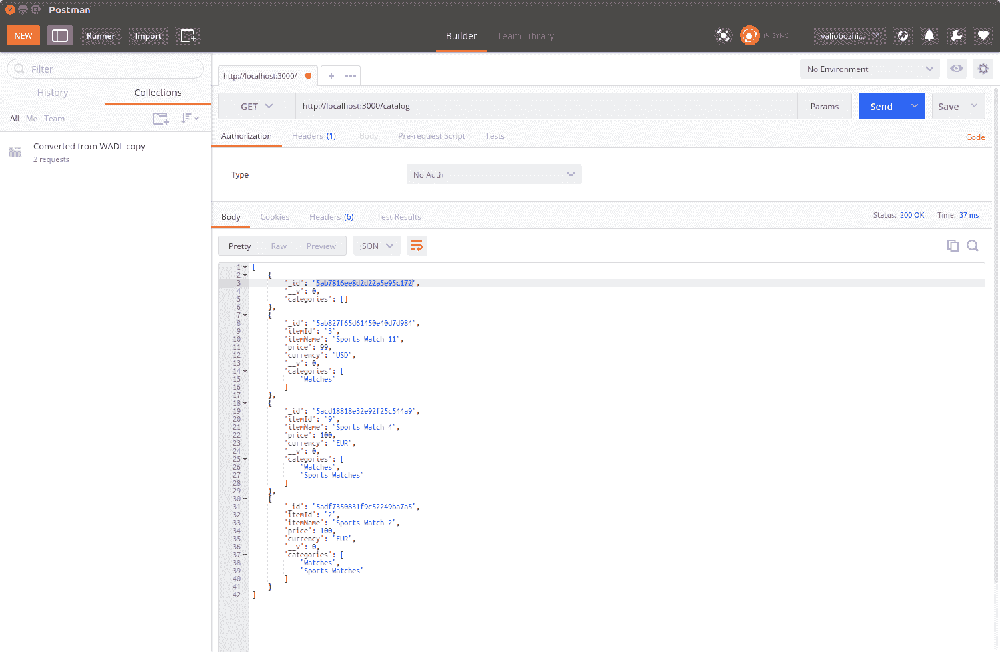
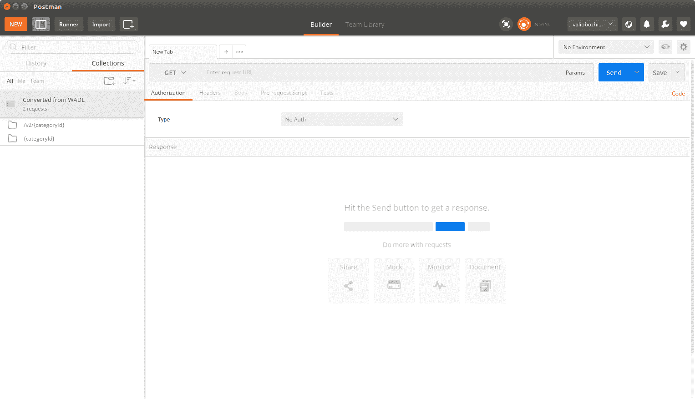

# 第五章：Restful API 设计指南

在上一章中，我们实现了一个目录模块，该模块公开了目录应用程序中项目数据操作的函数。这些函数利用了`express.js` **request**对象来解析传入的数据，并执行适当的数据库操作。每个函数都使用相关的状态码和响应主体有效载荷填充了**response**对象（如果需要）。最后，我们将每个函数绑定到一个路由，接受 HTTP 请求。

现在，是时候更仔细地查看路由的 URL 和每个操作返回的 HTTP 状态码了。

在本章中，我们将涵盖以下主题：

+   端点 URL 和 HTTP 状态码最佳实践

+   可扩展性和版本控制

+   链接数据

# 端点 URL 和 HTTP 状态码最佳实践

每个 RESTful API 操作都是针对 URL 的 HTTP 请求和适当的 HTTP 方法的组合。

执行时，每个操作将返回一个状态码，指示调用是否成功。成功的调用由 HTTP 2XX 状态码表示，而未正确执行的操作则用错误的状态码表示——如果错误发生在客户端，则为 4XX，或者当服务器无法处理有效请求时为 5xx。

拥有明确定义的 API 对于其采用至关重要。这样的规范不仅应完全列举每个操作的状态码，还应指定预期的数据格式，即其支持的媒体类型。

以下表格定义了 Express.js 路由器将如何公开 API 操作，并应作为其参考规范：

| 方法 | URI | 媒体类型 | 描述 | 状态码 |
| --- | --- | --- | --- | --- |
| GET | /catalog | application/json | 返回目录中的所有项目。 | 200 OK500 Internal Server Error |
| GET | /catalog/{categoryId} | application/json | 返回所选类别的所有项目。如果类别不存在，则返回 404。 | 200 OK,404 NOT FOUND500 Internal Server Error |
| GET | /item/{itemId} | application/json | 返回所选 itemId 的单个项目。如果没有这样的项目，则返回 404。 | 200 OK,404 NOT FOUND500 Internal Server Error |
| POST | /item/ | application/json | 创建新项目；如果具有相同标识符的项目存在，则将更新。创建项目时，将返回**Location**标头。它提供了可以访问新创建项目的 URL。 | 201 Created200 OK500 Internal Server Error |
| PUT | /item/{itemId} | application/json | 更新现有项目；如果提供的标识符不存在项目，则创建项目。创建项目时，将返回**Location**标头。它提供了可以访问新创建项目的 URL。 | 201 Created200 OK500 Internal Server Error |
| DELETE | /item/{itemId} | application/json | 删除现有项目；如果提供的标识符不存在项目，则返回 404。 | 200 OK,404 NOT FOUND500 Internal Server Error |

目录应用程序处理两种类型的实体：项目和类别。每个项目实体包含它所属的类别集合。正如你所看到的，类别只是我们应用程序中的一个逻辑实体；只要至少有一个项目引用它，它就会存在，并且当没有项目引用它时就会停止存在。这就是为什么应用程序只为项目类型的资源公开路由来公开数据操作功能，而类别的操作基本上是只读的。仔细观察暴露项目数据操作操作的 URL，我们可以看到一个清晰的模式，将 URL 与 REST 基本原则对齐——一个资源由一个单一的 URL 公开，并支持由请求的 HTTP 方法确定的资源操作。总之，以下是一个良好定义的 API 应该遵循的普遍接受的规则。它们在语义上与每个资源操作相关联：

+   当**新**资源被创建时，服务使用**201 已创建**状态码，后跟指定新创建资源的 URL 的位置标头。

+   创建资源的操作可以被实现为优雅地拒绝已经使用唯一标识符的资源的创建；在这种情况下，操作应该用适当的状态码**409 冲突**指示不成功的调用，或者更一般的**400 错误请求**。然而，通用状态码应该始终跟随一个有意义的解释，说明出了什么问题。在我们的实现中，我们选择了一种不同的方法——如果资源存在，我们会从创建操作中更新资源，并通过返回**200 OK**状态码通知调用者资源已被更新，而不是**201 已创建**。

+   **更新**操作类似于创建操作；然而，它总是期望资源标识符作为参数，如果存在具有此标识符的资源，它将使用 HTTP PUT 请求中提供的新状态对其进行更新。**200 OK**状态码表示成功的调用。实现可以决定使用**404 未找到**状态码拒绝处理不存在的资源，或者使用传递的标识符创建新资源。在这种情况下，它将返回**201 已创建**状态码，后跟指定新创建资源的 URL 的位置标头。我们的 API 使用了第二个选项。

+   成功的**删除**可以用**204 无内容**状态和进一步的有效载荷来表示，但大多数用户代理会期望**2xx**HTTP 状态后跟一个主体。因此，为了与大多数代理保持兼容，我们的 API 将用**200 OK**状态码表示成功的删除，后跟 JSON 有效载荷：`{'状态'：'成功删除'}`。状态码**404 未找到**将表示提供的标识符不存在的资源。

+   一般规则是，**5XX**不应该表示应用程序状态错误，而应该表示更严重的错误，比如应用程序服务器或数据库故障。

+   最佳实践是，`更新`和`创建`操作应该作为资源的整个状态返回有效载荷。例如，如果使用最少的属性创建资源，所有未指定的属性将获得默认值；响应主体应该包含对象的完整状态。对于更新也是一样；即使更新操作部分更新资源状态，响应也应该返回完整状态。这可能会节省用户代理额外的 GET 请求，如果他们需要检查新状态的话。

现在我们已经定义了一些关于操作应该如何行为的一般建议，是时候在 API 的新版本中实现它们了。

# 可扩展性和版本控制

我们已经在第三章*构建典型的 Web API*中定义了一些基本的版本规则。让我们将它们应用到我们在上一章中实施的 MongoDB 数据库感知模块。我们的起点将是使 API 的当前消费者能够继续在不同的 URL 上使用相同的版本。这将使他们向后兼容，直到他们采用并成功测试新版本。

保持 REST API 的稳定性不仅仅是将一个端点从一个 URI 移动到另一个 URI 的问题。进行重定向然后拥有行为不同的 API 是没有意义的。因此，我们需要确保移动端点的行为保持不变。为了确保我们不改变先前实施的行为，让我们将当前行为从`catalog.js`模块移动到一个新模块，将文件重命名为`catalogV1.js`。然后，将其复制到`catalogV2.js`模块，我们将在其中引入所有新功能；但在这之前，我们必须将版本 1 从`/, /{categoryId}, /{itemId}`重定向到`/v1, /v1/{categoryId}, /v1/{itemId}`：

```js
const express = require('express');
const router = express.Router();

const catalogV1 = require('../modules/catalogV1');
const model = require('../model/item.js');

router.get('/v1/', function(request, response, next) {
  catalogV1.findAllItems(response);
});

router.get('/v1/item/:itemId', function(request, response, next) {
  console.log(request.url + ' : querying for ' + request.params.itemId);
  catalogV1.findItemById(request.params.itemId, response);
});

router.get('/v1/:categoryId', function(request, response, next) {
  console.log(request.url + ' : querying for ' + request.params.categoryId);
  catalogV1.findItemsByCategory(request.params.categoryId, response);
});

router.post('/v1/', function(request, response, next) {
  catalogV1.saveItem(request, response);
});

router.put('/v1/', function(request, response, next) {
  catalogV1.saveItem(request, response);
});

router.delete('/v1/item/:itemId', function(request, response, next) {
  catalogV1.remove(request, response);
});

router.get('/', function(request, response) {
  console.log('Redirecting to v1');
  response.writeHead(301, {'Location' : '/catalog/v1/'});
  response.end('Version 1 is moved to /catalog/v1/: ');
});

module.exports = router;
```

由于我们的 API 的第 2 版尚未实施，对`/`执行`GET`请求将导致接收到`301 Moved Permanently`的 HTTP 状态，然后重定向到`/v1/`。这将通知我们的消费者 API 正在发展，并且他们很快将需要决定是继续使用版本 1，通过显式请求其新 URI，还是准备采用版本 2。

继续尝试吧！启动修改后的节点应用程序，并从 Postman 向`http://localhost:3000/catalog`发出 GET 请求：



您将看到您的请求被重定向到新路由位置`http://localhost:3000/catalog/v1`。

现在我们已经完成了目录的第 1 版，是时候考虑我们可以在第 2 版中添加的进一步扩展了。目录服务目前支持列出类别中的所有商品和按 ID 获取商品。是时候充分利用 MongoDB 了，作为一个面向文档的数据库，并实现一个函数，使我们的 API 消费者能够根据商品的任何属性查询商品。例如，列出具有与查询参数匹配的属性的特定类别的所有商品，如价格或颜色，或按商品名称搜索。RESTful 服务通常公开面向文档的数据。但是，它们的使用不仅限于文档。在下一章中，我们将扩展目录，使其还可以存储二进制数据——可以链接到每个商品的图像。为此，我们将在第六章的*使用任意数据*部分中使用 MongoDB 的二进制格式**二进制 JSON**（**BSON**）。

回到搜索扩展，我们已经使用了`Mongoose.js`模型的`find()`和`findOne()`函数。到目前为止，我们在 JavaScript 代码中静态地使用它们来提供要搜索的文档属性的名称。然而，`find()`的这个过滤参数只是一个 JSON 对象，其中键是文档属性，值是要在查询中使用的属性的值。这是我们将在第 2 版中添加的第一个新函数。它通过任意属性和其值查询 MongoDB：

```js
exports.findItemsByAttribute = function (key, value, response) {
      var filter = {};
      filter[key] = value;
      CatalogItem.find(filter, function(error, result) {
          if (error) {
              console.error(error);
              response.writeHead(500, contentTypePlainText);
              response.end('Internal server error');
              return;
          } else {
              if (!result) {
                  if (response != null) {
                     response.writeHead(200, contentTypeJson);
                     response.end({});
                  }
                  return;
              }
              if (response != null){
                  response.setHeader('Content-Type', 'application/json');
                  response.send(result);
              }
          }
      });
    }
```

这个函数调用模型上的 find，并将提供的属性和值作为参数。我们将把这个函数绑定到路由器的`/v2/item/` GET 处理程序。

最后，我们的目标是有`/v2/item/?currency=USD`，它只返回以美元货币出售的商品记录，由传递的 GET 参数的值指示。这样，如果我们修改模型并添加额外的属性，比如颜色和尺寸，我们可以查询具有相同颜色或任何其他商品属性的所有商品。

当在查询字符串中没有提供参数时，我们将保留返回所有可用项目的旧行为，但我们还将解析查询字符串以获取第一个提供的`GET`参数，并将其用作`findItemsByAttribute()`函数中的过滤器：

```js
router.get('/v2/items', function(request, response) {
    var getParams = url.parse(request.url, true).query;
    if (Object.keys(getParams).length == 0) {
      catalogV2.findAllItems(response);
    } else {
      var key = Object.keys(getParams)[0];
      var value = getParams[key];
      catalogV2.findItemsByAttribute(key, value, response);
    }
});
```

也许这个函数中最有趣的部分是 URL 解析。正如你所看到的，我们继续使用相同的旧策略来检查是否提供了任何`GET`参数。我们解析 URL 以获取查询字符串，然后我们使用内置的`Object.keys`函数来检查解析的键/值列表是否包含元素。如果是，我们取第一个元素并提取其值。键和值都传递给`findByAttribute`函数。

您可能希望通过多个`GET`参数提供的搜索支持来进一步改进版本 2。我将把这留给你作为一个练习。

# 发现和探索 RESTful 服务

发现 RESTful 服务的主题有着悠久而复杂的历史。HTTP 规范规定资源应该是自描述的，并且应该通过 URI 唯一标识。依赖资源应该通过其自己的唯一 URI 链接到依赖项。发现 RESTful 服务意味着从一个服务导航到另一个服务，跟随它提供的链接。

在 2009 年，发明了一种名为**Web Application Discovery Language**（**WADL**）的规范。它旨在记录从 Web 应用程序公开的每个 URI，以及它支持的 HTTP 方法和它所期望的参数。还描述了 URI 的响应媒体类型。这对于文档目的非常有用，这就是 WADL 文件在 RESTful 服务供应方面能为我们提供的一切。

不幸的是，目前还没有一个 Node.js 模块可以自动生成给定 express 路由的 WADL 文件。我们将不得不手动创建一个 WADL 文件来演示它如何被其他客户端用于发现。

以下清单显示了描述`/catalog, /catalog/v2/{categoryId}`处可用资源的示例 WADL 文件：

```js
<?xml version="1.0" encoding="UTF-8"?>
<application   >
   <grammer>
      <include href="items.xsd" />
      <include href="error.xsd" />
   </grammer>
   <resources base="http://localhost:8080/catalog/">
      <resource path="{categoryId}">
         <method name="GET">
            <request>
               <param name="category" type="xsd:string" style="template" />
            </request>
            <response status="200">
               <representation mediaType="application/xml" element="service:item" />
               <representation mediaType="application/json" />
            </response>
            <response status="404">
               <representation mediaType="text/plain" element="service:item" />
            </response>
         </method>
      </resource>
      <resource path="/v2/{categoryId}">
         <method name="GET">
            <request>
               <param name="category" type="xsd:string" style="template" />
            </request>
            <response status="200">
               <representation mediaType="application/xml" element="service:item" />
               <representation mediaType="application/json" />
            </response>
            <response status="404">
               <representation mediaType="text/plain" element="service:item" />
            </response>
         </method>
      </resource>
   </resources>
</application>
```

正如你所看到的，WADL 格式非常简单直接。它基本上描述了每个资源的 URI，提供了关于它使用的媒体类型以及在该 URI 处预期的状态码的信息。许多第三方 RESTful 客户端都理解 WADL 语言，并可以根据给定的 WADL 文件生成请求消息。

让我们在 Postman 中导入 WADL 文件。点击导入按钮并选择你的 WADL 文件：



在 Postman 中导入一个 WADL 文件以获得服务的存根。这是 Postman 的一个截图。这里个别设置并不重要。图片的目的只是为了展示窗口的外观。

正如你所看到的，导入 WADL 文件的结果是，我们有一个准备好测试 REST 服务的项目。WADL 文件中定义的所有路由现在都方便地作为右侧菜单上的单独请求实体可用。除了 WADL 标准之外，目前 swagger 文档格式也被广泛采用，并已成为描述 RESTful 服务的非正式标准，因此我们也可以使用它来简化服务的采用和发现。在下一章中，我们将把这些描述文件绑定到我们的服务上。这是生产准备阶段的重要步骤。

# 链接数据

每个目录应用程序都支持与该项目绑定的图像或一组图像。为此，在下一章中，我们将看到如何在 MongoDB 中处理二进制对象。然而，现在是决定如何在项目文档中语义链接二进制数据的时候了。以这样的方式扩展模型架构，使其包含文档中二进制数据的 base64 表示，绝非明智之举，因为在一个格式中混合文字编码和二进制数据从来都不是一个好主意。这增加了应用程序的复杂性，并使其容易出错。

```js
{
  "_id": "5a4c004b0eed73835833cc9a",
  "itemId": "1",
  "itemName": "Sports Watch",
  "price": 100,
  "currency": "EUR",
  "categories": [
    "Watches",
    "Sports Watches"
  ],
  "image":" 
iVBORw0KGgoAAAANSUhEUgAAAJEAAACRCAMAAAD0BqoRAAAAGXRFWHRTb2Z0d2FyZQBBZG9iZSBJbWFnZVJlYWR5ccllPAAAAyJpVFh0WE1MOmNvbS5hZG9iZS54bXAAAAAAADw/eHBhY2tldCBiZWdpbj0i77u/IiBpZD0iVzVNME1wQ2VoaUh6cmVTek5UY3prYzlkIj8+IDx4OnhtcG1ldGEgeG1sbnM6eD0iYWRvYmU6bnM6bWV0YS8iIHg6eG1wdGs9IkFkb2JlIFhNUCBDb3JlIDUuMC1jMDYwIDYxLjEzNDc3NywgMjAxMC8wMi8xMi0xNzozMjowMCAgICAgICAgIj4gPHJkZjpSREYgeG1sbnM6cmRmPSJodHRwOi8vd3d3LnczLm9yZy8xOTk5LzAyLzIyLXJkZi1zeW50YXgtbnMjIj4gPHJkZjpEZXNuzjcmlwdGlvbiByZGY6YWJvdXQ9IiIgeG1sbnM6eG1wPSJodHRwOi8vbnMuYWRvYmUuY29tL3hhcC8xLjAvIiB4bWxuczp4bXBNTT0iaHR0cDovL25zLmFkb2JlLmNvbS94YXAvMS4wL21tLyIgeG1sbnM6c3RSZWY9Imh0dHA6Ly9ucy5hZG9iZS5jb20veGFwLzEuMC9zVHlwZS9SZXNvdXJjZVJlZiMiIHhtcDpDcmVhdG9yVG9vbD0iQWRvYmUgUGhvdG9zaG9wIENTNSBNYWNpbnRvc2giIHhtcE1NOkluc3RhbmNlSUQ9InhtcC5paWQ6MjMwNjQ1NDdFNjJCMTFERkI5QzU4OTFCMjJCQzEzM0EiIHhtcE1NOkRvY3VtZW50SUQ9InhtcC5kaWQ6MjMwNjQ1NDhFNjJCMTFERkI5QzU4OTFCMjJCQzEzM0EiPiA8eG1wTU06RGVyaXZlZEZyb20gc3RSZWY6aW5zdGFuY2VJRD0ieG1wLmlpZDoyMzA2NDU0NUU2MkIxMURGQjlDNTg5MUIyMkJDMTMzQSIgc3RSZWY6ZG9jdW1lbnRJRD0ieG1wLmRpZDoyMzA2NDU0NkU2MkIxMURGQjlDNTg5MUIyMkJDMTMzQSIvPiA8L3JkZjpEZXNjcmlwdGlvbj4gPC9yZGY6UkRGPiA8L3g6eG1wbWV0YT4gPD94cGFja2V0IGVuZD0iciI/Px5Xq1XXhWFY1+v151/b3ij5tI/GPEVP0e8U/SPAABPLjHnaJ6XvAAAAAElFTkSuQmCC 
"} 
```

想象一下，如果所有这些项目都将图像二进制表示作为 JSON 属性的值返回，那么一个非过滤查询的结果会变得多么庞大，即使只有几百个项目。为了避免这种情况，我们将返回每个项目的图像，其 URL 在逻辑上与资源的 URL 链接在一起—`/catalog/v2/item/{itemId}/image`。

这样，如果为一个项目分配了图像，它将被提供在一个已知的位置。然而，这种方法并没有在语义上将二进制项目与其对应的资源链接起来，因为当访问`/catalog/v2/item/{itemId}`时，没有迹象表明它是否分配了图像。为了解决这个问题，让我们在项目路由的响应中使用自定义的 HTTP 头部：

```js
GET http://localhost:3000/catalog/v2/item/1 HTTP/1.1 
Host: localhost:3000 
Connection: Keep-Alive 
User-Agent: Apache-HttpClient/4.1.1 (java 1.5) 

HTTP/1.1 200 OK 
X-Powered-By: Express 
Content-Type: application/json; charset=utf-8 
Content-Length: 152 
Image-Url: http://localhost:3000/catalog/v2/item/1/image
ETag: W/"98-2nJj2mZdLV2YDME3WYCyEwIXfuA" 
Date: Thu, 01 Feb 2018 13:50:43 GMT 
Connection: keep-alive 

{
  "_id": "5a4c004b0eed73835833cc9a",
  "itemId": "1",
  "itemName": "Sports Watch",
  "price": 100,
  "currency": "EUR",
  "__v": 0,
  "categories": [
    "Watches",
    "Sports Watches"
  ]
}
```

当在响应中存在时，`Image-Url`头部指示该项目有一个额外的资源与之绑定，并且头部值提供了它可用的地址。使用这种方法，我们在语义上将一个二进制资源链接到我们的文档。

在下一章中，我们将实现处理目录中项目的任意项目的路由。

# 总结

在本章中，我们详细讨论了资源应该如何通过 RESTful API 公开；我们密切关注了 URL 最佳实践，并研究了 HTTP 状态代码的适当使用，指示我们操作的每个状态。

我们涵盖了版本控制和可扩展性的主题，我们使用`301 Moved Permanently`状态代码自动将 API 调用重定向到不同的 URL。

最后，我们找出了如何将我们的资源项目与任意二进制表示的数据语义链接起来。
