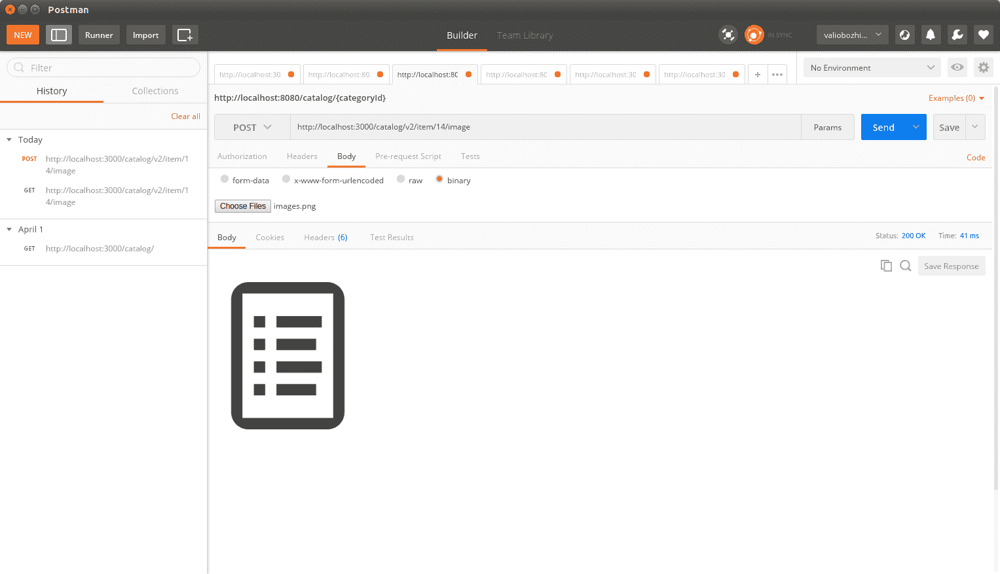
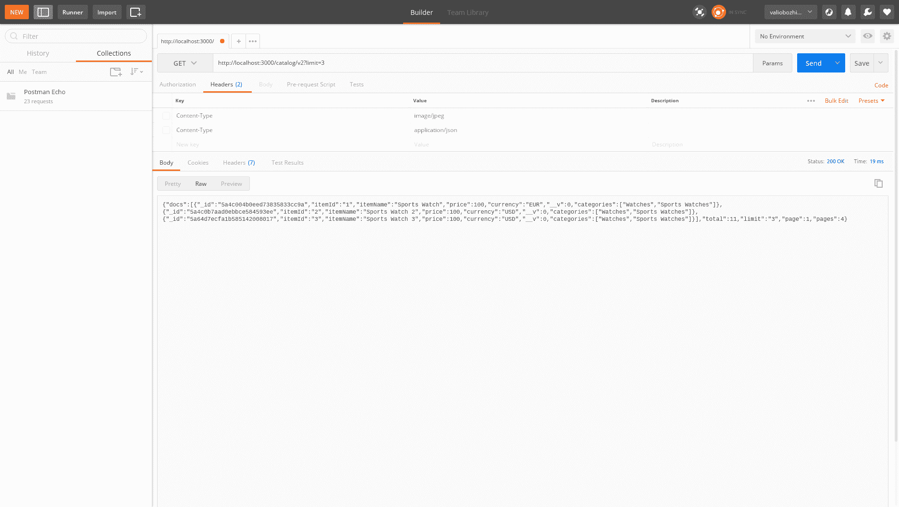
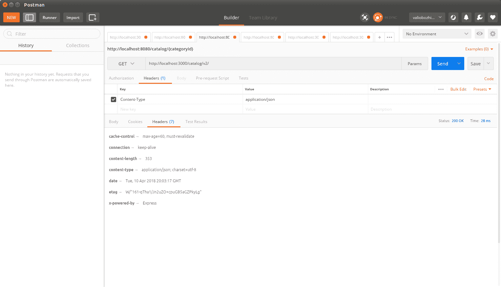

# 第六章：实现一个完整的 RESTful 服务

到目前为止，我们已经创建了我们的 RESTful 服务的第二个版本，并且通过不同的 URL 公开了这两个版本，确保向后兼容。我们为其数据库层实现了单元测试，并讨论了如何适当地使用 HTTP 状态码。在本章中，我们将通过为服务的第二个版本提供处理非文档二进制数据的功能，并相应地将其链接到相关的文档来扩展该实现。

我们将研究一种方便的方式来向消费者呈现大型结果集。为此，我们将引入分页以及进一步的过滤功能到我们的 API 中。

有些情况下，应该考虑将数据响应缓存起来。我们将研究它的好处和缺点，并在必要时决定启用缓存。

最后，我们将深入探讨 REST 服务的发现和探索。

总之，以下是应该进一步实现的内容，以将目录数据服务转变为一个完整的 RESTful 服务：

+   处理任意数据

+   在现实世界中处理关联数据

+   分页和过滤

+   缓存

+   发现和探索

# 处理任意数据

MongoDB 使用 BSON（二进制 JSON）作为主要数据格式。它是一种二进制格式，将键/值对存储在一个称为**文档**的单个实体中。例如，一个样本 JSON，`{"hello":"world"}`，在 BSON 中编码后变成`\x16\x00\x00\x00\x02hello\x00\x06\x00\x00\x00world\x00\x00`。

BSON 存储的是数据而不是文字。例如，如果一张图片要作为文档的一部分，它不需要被转换成 base64 编码的字符串；相反，它将直接以二进制数据的形式存储，而不像普通的 JSON 通常会将这样的数据表示为 base64 编码的字节，但这显然不是最有效的方式。

Mongoose 模式通过模式类型**buffer**使得能够以 BSON 格式存储二进制内容。它可以存储二进制内容（图片、ZIP 归档等）高达 16MB。相对较小的存储容量背后的原因是为了防止在传输过程中过度使用内存和带宽。

**GridFS**规范解决了 BSON 的这一限制，并使您能够处理大于 16MB 的数据。GridFS 将数据分成存储为单独文档条目的块。默认情况下，每个块的大小最多为 255KB。当从数据存储中请求数据时，GridFS 驱动程序检索所有必需的块，并按照组装的顺序返回它们，就好像它们从未被分割过一样。这种机制不仅允许存储大于 16MB 的数据，还使消费者能够以部分方式检索数据，这样就不必完全加载到内存中。因此，该规范隐含地支持流支持。

GridFS 实际上提供了更多功能——它支持存储给定二进制数据的元数据，例如其格式、文件名、大小等。元数据存储在一个单独的文件中，并且可以用于更复杂的查询。有一个非常有用的 Node.js 模块叫做`gridfs-stream`。它可以方便地在 MongoDB 中进行数据的流入和流出，就像所有其他模块一样，它被安装为一个`npm`包。因此，让我们全局安装它并看看它的使用方法；我们还将使用`-s`选项来确保项目的`package.json`中的依赖项得到更新：

```js
    npm install -g -s gridfs-stream
```

要创建一个`Grid`实例，你需要打开到数据库的连接：

```js
const mongoose = require('mongoose')
const Grid = require('gridfs-stream');

mongoose.connect('mongodb://localhost/catalog');
var connection = mongoose.connection;
var gfs = Grid(connection.db, mongoose.mongo);   
```

通过`createReadStream()`和`createWriteStream()`函数来进行流的读取和写入。流入数据库的每一部分数据都必须设置一个`ObjectId`属性。`ObjectId`唯一标识二进制数据条目，就像它在 MongoDB 中标识任何其他文档一样；使用这个`ObjectId`，我们可以通过这个标识符从 MongoDB 集合中找到或删除它。

让我们扩展目录服务，添加用于获取、添加和删除分配给项目的图像的功能。为简单起见，该服务将支持每个项目一个图像，因此将有一个负责添加图像的单个函数。每次调用时，它都将覆盖现有图像，因此适当的名称是`saveImage`：

```js
exports.saveImage = function(gfs, request, response) {

    var writeStream = gfs.createWriteStream({
            filename : request.params.itemId,
            mode : 'w'
        });

        writeStream.on('error', function(error) {
            response.send('500', 'Internal Server Error');
            console.log(error);
            return;
        })

        writeStream.on('close', function() {
            readImage(gfs, request, response);
        });

    request.pipe(writeStream);
}
```

如您所见，我们只需创建一个 GridFS 写流实例即可刷新 MongoDB 中的数据。它需要一些选项，这些选项提供了 MongoDB 条目的`ObjectId`以及一些附加的元数据，例如标题以及写入模式。然后，我们只需调用请求的 pipe 函数。管道将导致将数据从请求刷新到写入流中，以此方式将其安全存储在 MongoDB 中。存储后，与`writeStream`关联的`close`事件将发生，这时我们的函数将读取数据库中存储的任何内容，并在 HTTP 响应中返回该图像。

检索图像是另一种方式——使用选项创建`readStream`，`_id`参数的值应为任意数据的`ObjectId`，可选文件名和读取模式：

```js
function readImage(gfs, request, response) {

  var imageStream = gfs.createReadStream({
      filename : request.params.itemId,
      mode : 'r'
  });

  imageStream.on('error', function(error) {
    console.log(error);
    response.send('404', 'Not found');
    return;
  });

  response.setHeader('Content-Type', 'image/jpeg');
  imageStream.pipe(response);
}
```

在将读取流传输到响应之前，必须设置适当的`Content-Type`标头，以便可以将任意数据以适当的图像媒体类型`image/jpeg`呈现给客户端。

最后，我们从我们的模块中导出一个函数，用于从 MongoDB 中获取图像。我们将使用该函数将其绑定到从数据库中读取图像的 express 路由：

```js
exports.getImage = function(gfs, itemId, response) {
     readImage(gfs, itemId, response);
};
```

从 MongoDB 中删除任意数据也很简单。您必须从两个内部 MongoDB 集合`fs.files`和`fs.files.chunks`中删除条目，其中存放着所有文件：

```js
exports.deleteImage = function(gfs, mongodb, itemId, response) {
  console.log('Deleting image for itemId:' + itemId);

    var options = {
            filename : itemId,
    };

    var chunks = mongodb.collection('fs.files.chunks');
    chunks.remove(options, function (error, image) {
        if (error) {
            console.log(error);
            response.send('500', 'Internal Server Error');
            return;
       } else {
           console.log('Successfully deleted image for item: ' + itemId);
       }
    });

    var files = mongodb.collection('fs.files');
    files.remove(options, function (error, image) {
        if (error) {
            console.log(error);
            response.send('500', 'Internal Server Error');
            return;
        }

        if (image === null) {
            response.send('404', 'Not found');
            return;
        } else {
           console.log('Successfully deleted image for primary item: ' + itemId);
           response.json({'deleted': true});
        }
    });
}

```

让我们将新功能绑定到适当的项目路由并进行测试：

```js
router.get('/v2/item/:itemId/image',
  function(request, response){
    var gfs = Grid(model.connection.db, mongoose.mongo);
    catalogV2.getImage(gfs, request, response);
});

router.get('/item/:itemId/image',
  function(request, response){
    var gfs = Grid(model.connection.db, mongoose.mongo);
    catalogV2.getImage(gfs, request, response);
});

router.post('/v2/item/:itemId/image',
  function(request, response){
    var gfs = Grid(model.connection.db, mongoose.mongo);
    catalogV2.saveImage(gfs, request, response);
});

router.post('/item/:itemId/image',
  function(request, response){
    var gfs = Grid(model.connection.db, mongoose.mongo);
    catalogV2.saveImage(gfs, request.params.itemId, response);
});

router.put('/v2/item/:itemId/image',
  function(request, response){
    var gfs = Grid(model.connection.db, mongoose.mongo);
    catalogV2.saveImage (gfs, request.params.itemId, response);
});

router.put('/item/:itemId/image',
function(request, response){
  var gfs = Grid(model.connection.db, mongoose.mongo);
  catalogV2.saveImage(gfs, request.params.itemId, response);
});

router.delete('/v2/item/:itemId/image',
function(request, response){
  var gfs = Grid(model.connection.db, mongoose.mongo);
  catalogV2.deleteImage(gfs, model.connection,
  request.params.itemId, response);
});

router.delete('/item/:itemId/image',
function(request, response){
  var gfs = Grid(model.connection.db, mongoose.mongo);
  catalogV2.deleteImage(gfs, model.connection,  request.params.itemId, response);
});
```

由于在撰写本文时，版本 2 是我们 API 的最新版本，因此其提供的任何新功能都应在`/catalog`和`/v2/catalog`两个位置都可用。

让我们启动 Postman 并将图像发布到现有项目，假设我们有一个 ID 为 14 的项目`/catalog/v2/item/14/image`：



使用 Postman 分配图像给项目的 Post 请求。这是 Postman 的屏幕截图。这里个别设置并不重要。图像的目的只是为了展示窗口的外观。

请求处理后，二进制数据存储在网格数据存储中，并且图像在响应中返回。

# 链接

在上一章的链接数据部分，我们定义了如果目录中的项目分配了图像，则将使用名为 Image-URL 的 HTTP 标头进行指示。

让我们修改目录 V2 中的`findItemById`函数。我们将使用 GridFS 的现有功能来检查所选项目是否绑定了图像；如果项目分配了图像，则其 URL 将在响应中可用，并带有 Image-Url 标头：

```js
exports.findItemById = function (gfs, request, response) {
    CatalogItem.findOne({itemId: request.params.itemId}, function(error, result) {
        if (error) {
            console.error(error);
            response.writeHead(500,    contentTypePlainText);
            return;
        } else {
            if (!result) {
                if (response != null) {
                    response.writeHead(404, contentTypePlainText);
                    response.end('Not Found');
                }
                return;
            }

            var options = {
                filename : result.itemId,
            };
            gfs.exist(options, function(error, found) {
                if (found) {
                    response.setHeader('Content-Type', 'application/json');
                    var imageUrl = request.protocol + '://' + request.get('host') + request.baseUrl + request.path + '/image';
                    response.setHeader('Image-Url', imageUrl);
                    response.send(result);
                } else {
                    response.json(result);
                }
            });
        }
    });
}
```

到目前为止，我们将项目与其图像链接起来；但是，这使我们的数据部分链接，因为从项目到其图像有一个链接，但反之则没有。让我们改变这一点，并通过修改`readImage`函数向图像响应提供一个名为 Item-Url 的标头：

```js
function readImage(gfs, request, response) {

  var imageStream = gfs.createReadStream({
      filename : request.params.itemId,
      mode : 'r'
  });

  imageStream.on('error', function(error) {
    console.log(error);
    response.send('404', 'Not found');
    return;
  });

  var itemImageUrl = request.protocol + '://' + request.get('host') + request.baseUrl+ request.path;
  var itemUrl = itemImageUrl.substring(0, itemImageUrl.indexOf('/image'));
  response.setHeader('Content-Type', 'image/jpeg');
  response.setHeader('Item-Url', itemUrl);

  imageStream.pipe(response);
}
```

现在请求`http://localhost:3000/catalog/v2/item/3/`处的项目将以 JSON 格式返回编码的项目：

```js
GET http://localhost:3000/catalog/v2/item/3/image HTTP/1.1 
Accept-Encoding: gzip,deflate 
Host: localhost:3000 

HTTP/1.1 200 OK 
X-Powered-By: Express 
Content-Type: application/json; charset=utf-8 
Image-Url: http://localhost:3000/catalog/v2/item/3/image 
Content-Length: 137 
Date: Tue, 03 Apr 2018 19:47:41 GMT 
Connection: keep-alive 

{
   "_id": "5ab827f65d61450e40d7d984",
   "itemId": "3",
   "itemName": "Sports Watch 11",
   "price": 99,
   "currency": "USD",
   "__v": 0,
   "categories": ["Watches"]
}
```

查看响应标头，我们发现`Image-Url`标头及其值，`http://localhost:3000/catalog/v2/item/3/image`提供了与项目关联的图像的 URL。

请求该图像将产生以下结果：

```js
GET http://localhost:3000/catalog/v2/item/3/image HTTP/1.1 
Host: localhost:3000 
Connection: Keep-Alive 

HTTP/1.1 200 OK 
X-Powered-By: Express 
Content-Type: image/jpeg 
Item-Url: http://localhost:3000/catalog/v2/item/3 
Connection: keep-alive 
Transfer-Encoding: chunked 

<BINARY DATA>
```

这一次，响应提供了与项目链接的图像的有效载荷和一个特殊的标题**Item-Url**。它的值——`http://localhost:3000/catalog/v2/item/3`——是项目资源可用的地址。现在，如果项目图像出现在图像搜索结果中，与图像链接的项目的 URL 也将成为结果的一部分。通过这种方式，我们在不修改或损害有效载荷的情况下，语义上链接了这两个数据。

# 实现分页和过滤

一旦部署到网络上，每个服务都可以提供给大量的消费者使用。他们不仅会用它来获取数据，还会用它来插入新数据。在某个时候，这将不可避免地导致数据库中有大量的数据可用。为了保持服务的用户友好性并保持合理的响应时间，我们需要确保以合理的方式提供大量数据，以确保在请求`/catalog` URI 时不需要返回几十万个项目。

Web 数据消费者习惯于具有各种分页和过滤功能。在本章的前面，我们实现了`findIfindItemsByAttribute()`函数，它可以通过项目的任何属性进行过滤。现在，是时候引入分页功能，以便通过 URI 参数在`resultset`中进行导航。

`mongoose.js`模型可以利用不同的插件模块来提供额外的功能。这样一个插件模块是`mongoose-paginate`。Express 框架还提供了一个名为`express-paginate`的分页中间件。它提供了与 Mongoose 结果页面的链接和导航：

1.  在开始开发分页机制之前，我们应该安装这两个有用的模块：

```js
npm install -g -s express-paginate
npm install -g -s mongoose-paginate
```

1.  下一步将是在我们的应用程序中创建`express-paginate`中间件的实例：

```js

expressPaginate = require('express-paginate'); 
```

1.  通过调用其`middleware()`函数在应用程序中初始化分页中间件。它的参数指定了默认限制和每页结果的最大限制：

```js
app.use(expressPaginate.middleware(limit, maxLimit); 
```

1.  然后，在创建模型之前，将`mongoose-pagination`实例作为插件提供给`CatalogItem`模式。以下是`item.js`模块如何导出它以及模型：

```js
var mongoose = require('mongoose');
var mongoosePaginate = require('mongoose-paginate');
var Schema = mongoose.Schema;

mongoose.connect('mongodb://localhost/catalog');

var itemSchema = new Schema ({
    "itemId" : {type: String, index: {unique: true}},
    "itemName": String,
    "price": Number,
    "currency" : String,
    "categories": [String]
});
console.log('paginate');
itemSchema.plugin(mongoosePaginate);
var CatalogItem = mongoose.model('Item', itemSchema);

module.exports = {CatalogItem : CatalogItem, connection : mongoose.connection};
```

1.  最后，调用模型的`paginate()`函数以分页方式获取请求的条目：

```js

CatalogItem.paginate({}, {page:request.query.page, limit:request.query.limit},
    function (error, result){
        if(error) {
            console.log(error);
            response.writeHead('500',
               {'Content-Type' : 'text/plain'});
            response.end('Internal Server Error');
         } else {
           response.json(result);
         }
});
```

第一个参数是 Mongoose 应该用于其查询的过滤器。第二个参数是一个对象，指定了请求的页面和每页的条目。第三个参数是一个回调处理函数，通过其参数提供结果和任何可用的错误信息：

+   `error`：这指定了查询是否成功执行

+   `result`：这是从数据库中检索到的数据

`express-paginate`中间件通过丰富 Express 处理程序函数的`request`和`response`对象，实现了`mongoose-paginate`模块在 Web 环境中的无缝集成。

`request`对象获得了两个新属性：`query.limit`，它告诉中间件页面上的条目数，以及`query.page`，它指定了请求的页面。请注意，中间件将忽略大于初始化中指定的`maxLimit`值的`query.limit`值。这可以防止消费者覆盖最大限制，并使您完全控制应用程序。

以下是目录模块第二个版本中`paginate`函数的实现：

```js
exports.paginate = function(model, request, response) {
    var pageSize = request.query.limit;
    var page = request.query.page;
    if (pageSize === undefined) {
        pageSize = 100;
    }
    if (page === undefined) {
        page = 1;
    }

    model.paginate({}, {page:page, limit:pageSize},
            function (error, result){
                if(error) {
                    console.log(error);
                    response.writeHead('500',
                        {'Content-Type' : 'text/plain'});
                    response.end('Internal Server Error');
                }
                else {
                    response.json(result);
                }
            });
}
```

以下是查询包含 11 个项目的数据集并且每页限制为五个项目时的响应：

```js
{
  "docs": [
    {
      "_id": "5a4c004b0eed73835833cc9a",
      "itemId": "1",
      "itemName": "Sports Watch 1",
      "price": 100,
      "currency": "EUR",
      "__v": 0,
      "categories": [
        "Watches",
        "Sports Watches"
      ]
    },
    {
      "_id": "5a4c0b7aad0ebbce584593ee",
      "itemId": "2",
      "itemName": "Sports Watch 2",
      "price": 100,
      "currency": "USD",
      "__v": 0,
      "categories": [
        "Sports Watches"
      ]
    },
    {
      "_id": "5a64d7ecfa1b585142008017",
      "itemId": "3",
      "itemName": "Sports Watch 3",
      "price": 100,
      "currency": "USD",
      "__v": 0,
      "categories": [
        "Watches",
        "Sports Watches"
      ]
    },
    {
      "_id": "5a64d9a59f4dc4e34329b80f",
      "itemId": "8",
      "itemName": "Sports Watch 4",
      "price": 100,
      "currency": "EUR",
      "__v": 0,
      "categories": [
        "Watches",
        "Sports Watches"
      ]
    },
    {
      "_id": "5a64da377d25d96e44c9c273",
      "itemId": "9",
      "itemName": "Sports Watch 5",
      "price": 100,
      "currency": "USD",
      "__v": 0,
      "categories": [
        "Watches",
        "Sports Watches"
      ]
    }
  ],
  "total": 11,
  "limit": "5",
  "page": "1",
  "pages": 3
}
```

`docs`属性包含所有作为结果一部分的项目。它的大小与所选的限制值相同。`pages`属性提供了总页数；在这个例子中，它的值是 3，因为 11 个项目被安排在三页中，每页包含五个项目。`Total`属性给出了项目的总数。

启用分页的最后一步是修改`/v2/`路由，开始使用新创建的函数：

```js
  router.get('/v2/', function(request, response) {
    var getParams = url.parse(request.url, true).query;
    if (getParams['page'] !=null) {
      catalogV2.paginate(model.CatalogItem, request, response);
    } else {
      var key = Object.keys(getParams)[0];
      var value = getParams[key];
      catalogV2.findItemsByAttribute(key, value, response);
    }
});
```

我们将使用 HTTP `302 Found`状态为默认路由`/catalog`。这样，所有传入的请求都将被重定向到`/v2/`：

```js
router.get('/', function(request, response) {
  console.log('Redirecting to v2');
  response.writeHead(302, {'Location' : '/catalog/v2/'});
  response.end('Version 2 is is available at /catalog/v2/: ');
});
```

在这里使用适当的重定向状态代码对于任何 RESTful web 服务的生命周期至关重要。返回`302 Found`，然后进行重定向，确保 API 的使用者始终可以在该位置获得最新版本。此外，从开发的角度来看，使用重定向而不是代码重复也是一个很好的实践。

当你处于两个版本之间时，应始终考虑使用 HTTP `301 Moved Permanently`状态来显示先前版本已经移动到何处，以及 HTTP `302 Found`状态来显示当前版本的实际 URI。

现在，回到分页，由于请求的页面和限制数字是作为`GET`参数提供的，我们不希望将其与过滤功能混淆，因此对它们进行了明确的检查。只有在请求中有页面或限制`GET`参数时，才会使用分页。否则，将进行搜索。

最初，我们设置了 100 个结果的最大限制和 10 个默认限制，因此，在尝试新的分页功能之前，请确保将更多的项目插入到数据库中。这将使测试结果更加明显。

现在，让我们试一试。请求`/catalog?limit=3`将返回一个只包含两个项目的列表，如下所示：



启用分页结果。这是 Postman 的屏幕截图。这里个别设置并不重要。图片的目的只是展示窗口的外观。

如示例所示，总页数为四。数据库中存储的项目总数为 11。由于我们在请求中没有指定页面参数，分页隐式返回了第一页。要导航到下一页，只需在 URI 中添加`&page=2`。

另外，尝试更改`limit`属性，请求`/catalog/v2?limit=4`。这将返回前四个项目，并且响应将显示总页数为三。

# 缓存

当我们讨论罗伊·菲尔丁定义的 REST 原则时，我们提到缓存是一个相当敏感的话题。最终，我们的消费者在执行查询时会期望得到最新的结果。但是，从统计的角度来看，Web 中公开的数据更有可能被阅读而不是被更新或删除。

因此，合理的是一些公共 URL 暴露的资源成为数百万请求的对象，考虑从服务器中卸载部分负载到缓存中。HTTP 协议允许我们缓存一些响应一段时间。例如，当在短时间内收到多个请求时，查询给定组的目录中的所有项目，例如`/catalog/v2`，我们的服务可以利用特殊的 HTTP 头，强制 HTTP 服务器缓存响应一段时间。这将防止对底层数据库服务器的冗余请求。

通过特殊的响应头在 HTTP 服务器级别进行缓存。HTTP 服务器使用`Cache-Control`头来指定给定响应应该缓存多长时间。缓存需要失效之前的时间段通过其`max-age`属性设置，其值以秒为单位提供。当然，有一个很好的 Node.js 模块提供了一个用于缓存的中间件函数，称为`express-cache-control`。

# 在 Express 应用程序中提供 Cache-Control 头

让我们使用 NPM 包管理器安装它；再次，我们将全局安装它，并使用`-s`选项，这将自动更新`package.json`文件，添加新的`express-cache-control`依赖项：

```js
    npm install -g -s express-cache-control
```

使用`express-cache-control`中间件启用缓存需要三个简单的步骤：

1.  获取模块：

```js
      CacheControl = require("express-cache-control") 
```

1.  创建`CacheControl`中间件的实例：

```js
 var cache = new CacheControl().middleware;
```

1.  将中间件实例绑定到要启用缓存的路由：

```js
router.get('/v2/', cache('minutes', 1), function(request, response) {
    var getParams = url.parse(request.url, true).query;
    if (getParams['page'] !=null || getParams['limit'] != null) {
      catalogV2.paginate(model.CatalogItem, request, response);
    } else {
      var key = Object.keys(getParams)[0];
      var value = getParams[key];
      catalogV2.findItemsByAttribute(key, value, response);
    }
});
```

通常，提供许多结果条目的常见 URI 应该是缓存的主题，而不是为具体条目提供数据的 URI。在我们的应用程序中，只有`/catalog` URI 将使用缓存。`max-age`属性必须根据您的应用程序的负载进行选择，以最小化不准确的响应。

让我们通过在 Postman 中请求`/catalog/v2`来测试我们的更改：



Cache-control 头部指示缓存已启用。这是 Postman 的屏幕截图。这里不重要的是单独的设置。图片的目的只是为了展示窗口的外观。

正如预期的那样，`express-cache-control`中间件已经完成了它的工作——`Cache-Control`头现在包含在响应中。`must-revalidate`选项确保在`max-age`间隔过期后使缓存内容无效。现在，如果您对特定项目发出另一个请求，您会发现响应不使用`express-cache-control`中间件，这是因为它需要在每个单独的路由中显式提供。它不会在相互衍生的 URI 中使用。

针对任何路由`/v1/`的`GET`请求的响应将不包含`Cache-Control`头部，因为它仅在我们的 API 的第 2 版中受支持，并且`Cache-Control`中间件仅在主目录路由`/catalog/v2/`或`/catalog`中使用。

# 摘要

恭喜！在本章中，您成功地将一个样本 REST 启用的端点转换为一个完整的支持过滤和分页的 RESTful Web 服务。该服务提供任意和 JSON 数据，并且已准备好应对高负载场景，因为它在关键部分启用了缓存。应该引起您注意的一件事是在公共 API 的新旧版本之间进行重定向时，适当使用 HTTP 状态代码。

实现适当的 HTTP 状态对于 REST 应用程序非常重要，因此我们使用了相当奇特的状态，例如`301 Moved Permanently`和`302 Found`。在下一章中，我们将介绍授权概念到我们的应用程序中。
