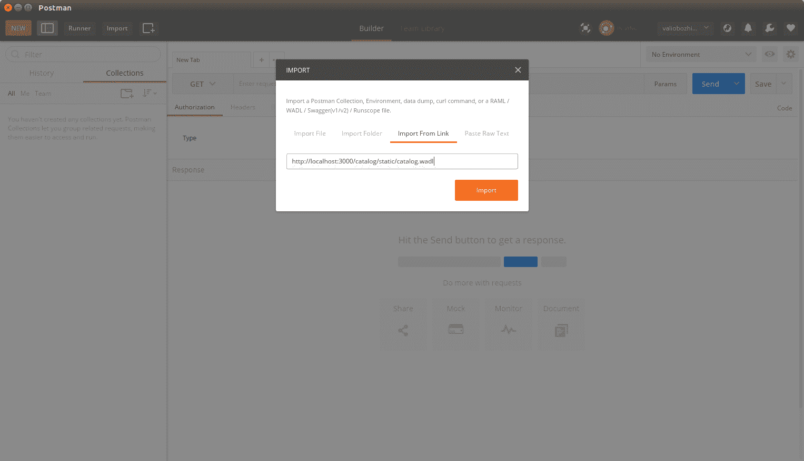
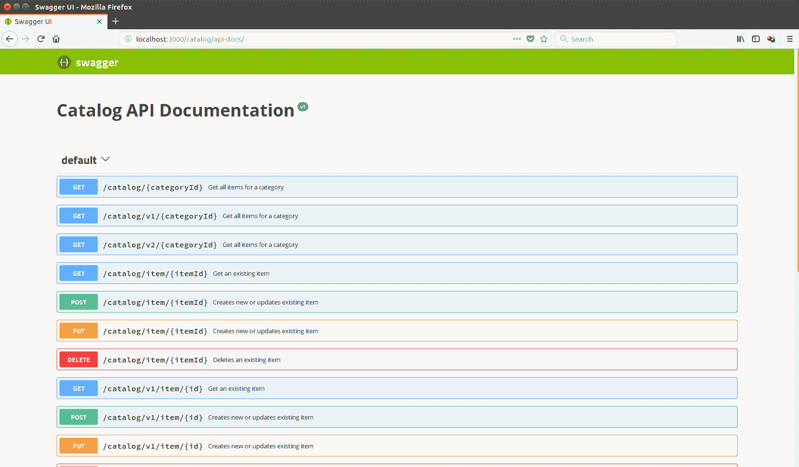
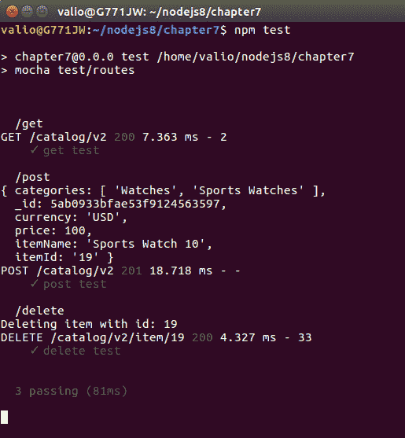

# 第七章：为生产准备 RESTful API

在上一章中，我们实现了一个完整的目录 RESTful API；然而，一个完全功能的 API 和一个可投入生产的 API 之间存在差异。在本章中，我们将介绍 API 应该如何进行全面的文档记录和测试。在投入生产之前，任何软件都必须完成这些关键要求。

总之，在本章中，我们将涵盖以下主题：

+   记录 RESTful API

+   使用 Mocha 测试 RESTful API

+   微服务革命

# 记录 RESTful API

到目前为止，我们部分地介绍了 RESTful web 服务 API 是如何由`wadl`描述和由`swagger`规范记录的。现在是时候充分利用它们，在我们的目录应用程序的 express.js 路由中公开它们的自描述元数据。这样，消费者和最终用户将有单独的 URL 来获取他们需要轻松采用服务的元数据。让我们从 wadl 定义开始。以下是`wadl`如何完全描述一个操作的方式：

```js
  <resources base="http://localhost:8080/catalog/"> 
        <resource path="/catalog/item/{itemId}">
            <method name="GET">
                <request>
                    <param name="category" type="xsd:string" style="template"/>
                </request>
                <response status="200">
                    <representation mediaType="application/json" />
                </response>
                <response status="404">
                    <representation mediaType="text/plain" />
                </response>
                <response status="500">
                    <representation mediaType="text/plain" />
                </response>
            </method>
            <method name="PUT">
                <request>
                    <param name="itemId" type="xsd:string" style="template"/>
                </request>
                <response status="200">
                    <representation mediaType="application/json" />
                </response>
                <response status="201">
                    <representation mediaType="application/json" />
                </response>
                <response status="404">
                    <representation mediaType="text/plain" />
                </response>
                <response status="500">
                    <representation mediaType="text/plain" />
                </response>
            </method>
            <method name="POST">
                <request>
                    <param name="itemId" type="xsd:string" 
                     style="template"/>
                </request>
                <response status="200">
                    <representation mediaType="application/json" />
                </response>
                <response status="201">
                    <representation mediaType="application/json" />
                </response>
                <response status="404">
                    <representation mediaType="text/plain" />
                </response>
                <response status="500">
                    <representation mediaType="text/plain" />
                </response>
            </method>
            <method name="DELETE">
                <request>
                    <param name="itemId" type="xsd:string" 
                     style="template"/>
                </request>
                <response status="200">
                    <representation mediaType="application/json" />
                </response>
                <response status="404">
                    <representation mediaType="text/plain" />
                </response>
                <response status="500">
                    <representation mediaType="text/plain" />
                </response>
            </method>
        </resource>
      </resources>
```

每个路由都彻底描述了它所暴露的所有操作；这样，它们将被符合`wadl`规范的客户端索引和发现。一旦你描述了所有的操作，只需将`wadl`文件存储在你的`express.js`项目的`static`目录中，并从应用程序中公开它：`app.use('/catalog/static', express.static('static'));`

在本地启动应用程序后，你的`wadl`文件将准备好在`http://localhost:3000/catalog/static/catalog.wadl`上为客户端提供服务。

让我们试试并将其导入到 Postman 中：



将 wadl 文件导入到 Postman。这是 Postman 的截图。这里个别设置并不重要。图片的目的只是展示窗口的外观。

静态地提供`wadl`文件将有助于你的应用程序被搜索引擎索引；这进一步增加了你的 API 的采用率。

然而，`wadl`正逐渐失去地位，而`swagger`则更受青睐。JavaScript REST-enabled 应用程序的发展导致了对非 XML 标准的 RESTful 服务发现的需求。这就是为什么`swagger`成为事实上的标准的原因，不仅用于记录 RESTful 服务，还用于其广泛采用的发现格式。虽然 XML-aware 平台仍然依赖于`wadl`，但 JavaScript 和其他非 XML 本地平台在`swagger`规范上有很大依赖，不仅用于描述，还用于发现和消费，其采用速度正在迅速增加。因此，你应该考虑使用`swagger`描述你的 API，以确保它能够轻松地被任何平台采用。以下是`swagger`方言中如何完全描述一个操作的方式：

```js
{
    "swagger": "2.0",
    "info": {
      "title": "Catalog API Documentation",
      "version": "v1"
    },
    "paths": {"/catalog/item/{itemId}": {
        "get": {
          "operationId": "getItemV2",
          "summary": "Get an existing item",
          "produces": ["application/json"],
          "responses": {
            "200": {
              "description": "200 OK",
              "examples": {
                "application/json": {
                    "_id": "5a4c004b0eed73835833cc9a",
                    "itemId": "1",
                    "itemName": "Sports Watch",
                    "price": 100,
                    "currency": "EUR",
                    "__v": 0,
                    "categories": [ "Watches", "Sports Watches"]
                  }
              }
            },
            "404": {"description": "404 Not Found"},
            "500": {"description": "500 Internal Server Error"}
          }
        },
        "post": {
          "404": {"description": "404 Not Found"},
          "500": {"description": "500 Internal Server Error"},
          "operationId": "postItemV2",
          "summary": "Creates new or updates existing item",
          "produces": ["application/json"],
          "responses": {
            "200": {
              "itemId": 19,
              "itemName": "Sports Watch 19",
              "price": 100,
              "currency": "USD",
              "__v": 0,
              "categories": [
                "Watches",
                "Sports Watches"
              ]
            },
            "201": {
              "itemId": 19,
              "itemName": "Sports Watch 19",
              "price": 100,
              "currency": "USD",
              "__v": 0,
              "categories": [ "Watches", "Sports Watches"]
            },
            "500": "text/html"
          }
        },
        "put": {
          "404": {"description": "404 Not Found"},
          "500": {"description": "500 Internal Server Error"},
          "operationId": "putItemV2",
          "summary": "Creates new or updates existing item",
          "produces": ["application/json"],
          "responses": {
            "200": {
              "itemId": 19,
              "itemName": "Sports Watch 19",
              "price": 100,
              "currency": "USD",
              "__v": 0,
              "categories": [ "Watches","Sports Watches"]
            },
            "201": {
              "itemId": 19,
              "itemName": "Sports Watch 19",
              "price": 100,
              "currency": "USD",
              "__v": 0,
              "categories": ["Watches", "Sports Watches"]
            },
            "500": "text/html"
          }
        },
        "delete": {
          "404": {"description": "404 Not Found"},
          "500": {"description": "500 Internal Server Error"},
          "operationId": "deleteItemV2",
          "summary": "Deletes an existing item",
          "produces": ["application/json"],
          "responses": {"200": {"deleted": true },
            "500": "text/html"}
        }
      }
   }
  consumes": ["application/json"]
  }
 }
```

最后，在`swagger.json`文件中描述了所有 API 的操作后，它应该被静态地公开，类似于`wadl`文件。由于应用程序已经有了静态目录的路由，只需将`swagger.json`文件放在那里，它就可以为消费者提供服务并促进发现。`Swagger`主要是一个文档工具，但主要面向开发者；因此，它需要一个使文档易于阅读和理解的前端。有一个`npm`模块——`swagger-ui`——为我们提供了默认的 swagger 前端。我们将在我们的应用程序中采用它，所以让我们使用包管理器来安装它——`npm install swagger-ui`。安装完成后，只需要求模块的一个实例以及静态`swagger.json`文件的一个实例，并在一个单独的路由中使用它们：

```js
const swaggerUi = require('swagger-ui-express');
const swaggerDocument = require('./static/swagger.json');

app.use('/catalog/api-docs', swaggerUi.serve, swaggerUi.setup(swaggerDocument));
```

在浏览器中启动你的应用程序并请求`http://localhost:3000/catalog/api-docs/`：



正如你所看到的，swagger-ui 模块为你提供了标准的 swagger 前端。

记住，作为开发者，保持你的 API 文档的完整和最新是你的责任。

# 使用 Mocha 测试 RESTful API

你是否注意到`app.js` express 应用程序是用`express-generator`创建的，实际上是一个导出 express 实例的`node.js`模块？如果你有，你一定会问自己为什么需要这样做。嗯，将 express 实例导出为模块使其能够进行单元测试。我们已经在第四章中使用了`mocha`框架，*使用 NoSQL 数据库*，在那里我们为`CatalogItem`模块开发了一个单元测试。我们将再次使用`mocha`，并为 API 公开的每个操作包装一个单元测试。要对 express 应用程序进行单元测试，我们需要执行以下操作：

1.  需要一个带有路由的`express.js`应用程序实例，利用其作为模块导出

1.  在单元测试环境中启动`express.js`实例

1.  通过测试库调用其操作并断言结果

1.  最后，执行`npm test`命令来触发单元测试

在继续实施 mocha 测试之前，我们需要一个库来从单元测试中发送 HTTP 请求；我们将利用`chai`模块。它提供了方便的函数来发送 HTTP 请求，还捆绑了`should.js`断言库来验证预期结果。要安装`chai`，只需执行`npm install chai`，然后执行`npm install chai-http`来安装其 HTTP 插件，我们就可以开始单元测试了！

与任何其他 mocha 测试一样，我们将不得不执行以下步骤：

1.  描述每个测试用例

1.  准备测试装置；这次，我们将使用`chai-http`来调用 REST 操作

1.  断言返回的结果

涵盖创建、访问和删除资源操作的基本单元测试如下：

```js
var expressApp = require('../../app');
var chai = require('chai');
var chaiHttp = require('chai-http');
var mongoose = require('mongoose');
var should = chai.should();

mongoose.createConnection('mongodb://localhost/catalog-test');

chai.use(chaiHttp);

describe('/get', function() {
  it('get test', function(done) {
    chai.request(expressApp)
      .get('/catalog/v2')
      .end(function(error, response) {
        should.equal(200  , response.status);
        done();
      });
    });
  });

describe('/post', function() {
     it('post test', function(done) {
       var item ={
          "itemId":19,
          "itemName": "Sports Watch 10",
          "price": 100,
          "currency": "USD",
          "__v": 0,
          "categories": [
              "Watches",
              "Sports Watches"
          ]
      };
     chai.request(expressApp)
           .post('/catalog/v2')
           .send(item )
           .end(function(err, response){
               should.equal(201, response.status)
             done();
           });
     });
   });

   describe('/delete', function() {
        it('delete test', function(done) {
          var item ={
             "itemId":19,
             "itemName": "Sports Watch 10",
             "price": 100,
             "currency": "USD",
             "__v"cd .: 0,
             "categories": [
                 "Watches",
                 "Sports Watches"
             ]
         };
        chai.request(expressApp)
              .delete('/catalog/v2/item/19')
              .send(item )
              .end(function(err, response){
                  should.equal(200, response.status)
                done();
              });
        });
      });
```

将此文件存储在项目的测试目录中；默认情况下，该目录在`package.json`中被定义为测试目录，因此要运行单元测试，只需执行`npm test`：



恭喜！现在你的 API 已经覆盖了单元测试，注意测试并没有模拟任何东西！它们正在运行 express 应用程序；当应用程序变得生产时，它们将以完全相同的方式运行，确保稳定性和向后兼容性！目前，单元测试仅断言状态码。花一些时间并进一步扩展它们，以便对响应主体进行断言。这将是一个很好的练习。

# 微服务革命

RESTful API 疯狂开始并且几乎每个人都决定 RESTful API 是正确的方式，是不是？随着`Linux`容器的出现，结果表明转向 REST 方法只是一半的路。目前，每个人都从容器中受益。它们提供了更好、更快、更便宜的开发和运营模式，但是微服务只是 RESTful 服务的另一个炒作术语吗？嗯，不，完全不是；RESTful 服务只是微服务的基础。

微服务是小型和独立的进程，公开了一个简单的接口，允许与它们进行通信并构建复杂的应用程序，而不依赖于库工件。这些服务类似于小型构建块，高度解耦并专注于执行小任务，促进了系统构建的模块化方法。

虽然 REST 强调资源及其自然处理，但微服务架构强调简单性、故障安全性和隔离性。RESTful API 没有每个操作的单独状态；要么整个 API 可用，要么完全不可用。微服务试图解决这个问题，提供了在单独的容器上托管每个操作，或者容器的子集，确保最大的容错能力和灵活性。

微服务预期提供单一简单的操作，没有更多。这使开发人员可以按照他们想要的方式对它们进行分组和使用。处理策略、治理、安全和监控通常不在微服务处理范围内，主要是因为它们需要某种上下文。总的来说，将上下文绑定到服务会增加其依赖性并使其可重用性降低；这就是为什么微服务将上下文留给 API 管理网关的原因，它允许您创建微服务的组合，然后将策略绑定到它，并监视网关上的每个活动。这种分布式开发模型使程序员能够快速构建一系列微服务，而无需考虑治理和安全等复杂主题。

微服务世界是一个改变游戏规则的世界，受益于 Linux 容器。目前，类似于 AWS 和 Azure 的所有基于云的服务都提供微服务托管。

# 摘要

在本章中，我们稍微偏离了与`Express.js`相关的主题。相反，我们集中讨论了如何通过提供最新的 API 文档以及 API 本身来使我们的代码基础投入生产。我们让我们的应用程序投资于预防措施，以确保通过实施更复杂的单元测试来实现向后兼容性。最后，我们决定展望未来，这一切都与微服务有关。确保您将这一热门话题保持在您的技能清单中；它将不可避免地在不久的将来发展，您对它了解得越多，就越好！
