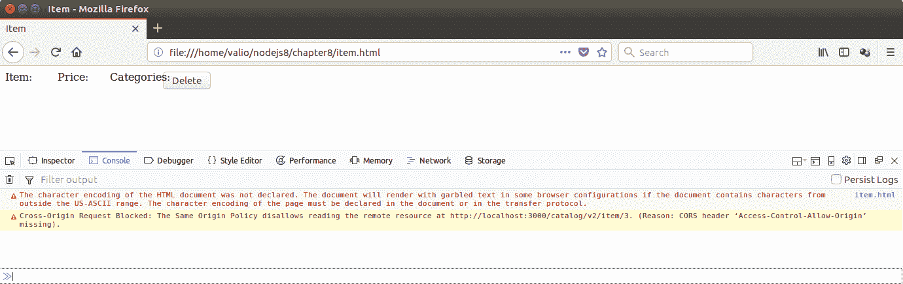
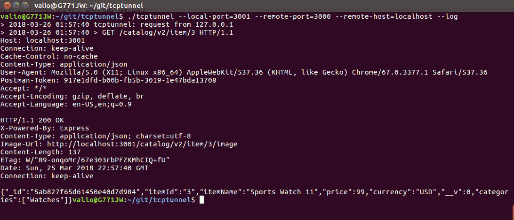
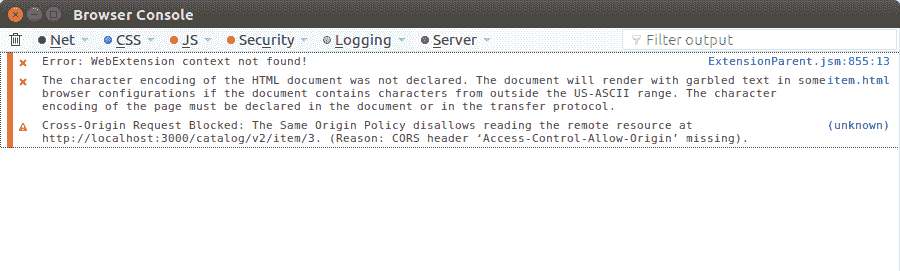
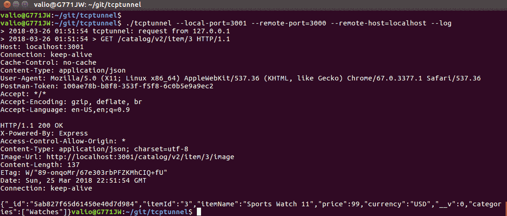

# 第八章：消费 RESTful API

为了演示与我们的 API 相关的一些更高级的主题，我们将实现一个非常简单的 Web 客户端。这将帮助我们涵盖这些主题，并且可以作为目录消费者的参考实现。对于这个前端客户端，我们将使用著名的 JavaScript 库 jQuery。利用它将帮助我们涵盖以下内容：

+   使用 jQuery 消费 RESTful 服务

+   内容交付网络

+   在线故障排除和识别问题

+   跨域资源共享策略

+   客户端处理不同的 HTTP 状态码

# 使用 jQuery 消费 RESTful 服务

JQuery 是一个快速、轻量级和强大的 JavaScript 库；它通过在 DOM 三加载后直接访问 HTML 元素来消除与 DOM 相关的复杂性。要在 HTML 文档中使用 jQuery，您必须导入它：

`<script type="text/javascript" src="img/jquery-3.3.1.min.js "></script>`

假设在 HTML 文档的某处，有一个定义为`<input type="button" id="btnDelete" value="Delete"/>`的按钮。

使用 JQuery 为此按钮分配一个点击事件的函数意味着我们需要执行以下操作：

1.  在 HTML 文档中导入 jquery 库

1.  确保 HTML 文档的 DOM 文档完全加载

1.  使用 ID 属性定义的标识符访问按钮

1.  将处理程序函数作为`click`事件的参数提供：

```js
$(document).ready(function() {
    $('#btn').click(function () {
       alert('Clicked');
    });
});
```

`$('#identifier')`表达式直接访问 DOM 三中的元素，`$`表示引用一个对象，括号内的值，前缀为`#`指定了它的标识符。只有在整个文档加载后，jQuery 才能访问元素；这就是为什么元素应该在`${document).ready()`块范围内访问。

同样，您可以通过标识符`txt`访问文本输入的值：

```js
  $(document).ready(function() {
    var textValue = $('#txt').val();
    });
  });
```

`$(document)`对象在 jQuery 中预定义，并表示 HTML 页面的整个 DOM 文档。类似地，jQuery 预定义了一个用于启用 AJAX 通信的函数，即向 HTTP 端点发送 HTTP 请求。这个函数被命名为**异步 JavaScript + XML-** AJAX，这是一种事实标准，使 JavaScript 应用程序能够与启用 HTTP 的后端进行通信。如今，**JSON**被广泛使用；然而，AJAX 的命名转换仍然被用作异步通信的术语，无论数据格式如何；这就是为什么 jQuery 中的预定义函数被称为`$.ajax(options, handlers)`。

要使用`$.ajax`函数发送 http 请求，通过提供端点 URL、请求的 http 方法和其内容类型来调用它；结果将在回调函数中返回。以下示例显示了如何从我们的目录请求标识为 3 的项目：

```js
  $.ajax({
      contentType: 'application/json',
      url: 'http://localhost:3000/catalog/v2/item/3',
      type: 'GET',
      success: function (item, status, xhr) {
          if (status === 'success') {
              //the item is successfully retrieved load & display its details here
          }
      }
      ,error: function (xhr, options, error) {
        //Item was not retrieved due to an error handle it here
      }
    });
  });
```

将数据发布到端点相当相似：

```js
  $.ajax({
    url: "http://localhost:3000/catalog/v2/",
    type: "POST",
    dataType: "json",
    data: JSON.stringify(newItem),
     success: function (item, status, xhr) {
       if (status === 'success') {
         //item was created successfully
       }
     },
     error: function(xhr, options, error) {
       //Error occurred while creating the iteam
     }
   });

```

只需使用适当的选项`type`设置为 POST，`dateType`设置为 JSON。这些将指定以 JSON 格式向端点发送 POST 请求。对象的有效负载作为`data`属性的值提供。

调用`delete`方法非常相似：

```js
      $.ajax({
        contentType: 'application/json',
        url: 'http://localhost:3000/catalog/v2/item/3',
        type: 'DELETE',
        success: function (item, status, xhr) {
            if (status === 'success') {
              //handle successful deletion
            }
        }        
        ,error: function (xhr, options, error) {
            //handle errors on delete
        }
      });
```

对于这本书的范围来说，对 jQuery 的基本理解就足够了。现在，让我们把所有这些粘合在一起，创建两个 HTML 页面；这样，我们将处理在我们的目录中创建、显示和删除项目，首先是显示项目并允许删除的页面。该页面使用`GET`请求从目录加载项目，然后以表格方式在 HTML 页面中显示项目的属性：

```js
<html>
<head><title>Item</title></head>
<body>
    <script type="text/javascript" src="img/jquery-3.3.1.min.js "></script>
  <script>
  $(document).ready(function() {
    $('#btnDelete').click(function () {
      $.ajax({
        contentType: 'application/json',
        url: 'http://localhost:3000/catalog/v2/item/3',
        type: 'DELETE',
        success: function (item, status, xhr) {
            if (status === 'success') {
              $('#item').text('Deleted');
              $('#price').text('Deleted');
              $('#categories').text('Deleted');
            }
        }
        ,error: function (xhr, options, error) {
          alert('Unable to delete item');
        }
      });
    });
    $.ajax({
      contentType: 'application/json',
      url: 'http://localhost:3000/catalog/v2/item/3',
      type: 'GET',
      success: function (item, status, xhr) {
          if (status === 'success') {
            $('#item').text(item.itemName);
            $('#price').text(item.price + ' ' + item.currency);
            $('#categories').text(item.categories);
          }
      }
      ,error: function (xhr, options, error) {
        alert('Unable to load details');
      }
    });
  });
  </script>
  <div>
    <div style="position: relative">
      <div style="float:left; width: 80px;">Item: </div>
      <div><span id="item"/>k</div>
    </div>
    <div style="position: relative">
      <div style="float:left; width: 80px;">Price: </div>
      <div><span id="price"/>jjj</div>
    </div>
    <div style="position: relative">
      <div style="float:left; width: 80px;">Categories: </div>
      <div><span id="categories"/>jjj</div>
    </div>
    <div><input type="button" id="btnDelete" value="Delete"/></div>
  </div>
</body>
</html>
```

处理创建的页面非常相似。但是，它提供了文本输入，而不是用于加载项目属性的 span 标签，视图页面将显示加载项目属性的数据。JQuery 提供了一个简化的访问模型来访问输入控件，而不是 DOM——只需按如下方式访问输入元素：

```js
<html>
<head><title>Item</title></head>
<body>
  <script type="text/javascript" src="img/jquery-3.3.1.min.js "></script>
  <script>
  $(document).ready(function() {
    $('#btnCreate').click(function(){
      var txtItemName = $('#txtItem').val();
      var txtItemPrice = $('#txtItemPrice').val();
      var txtItemCurrency = $('#txtItemCurrency').val();
      var newItem = {
        itemId: 4,
        itemName: txtItemName,
        price: txtItemPrice,
        currency: txtItemCurrency,
        categories: [
          "Watches"
        ]
      };
      $.ajax({
        url: "http://localhost:3000/catalog/v2/",
        type: "POST",
        dataType: "json",
        data: JSON.stringify(newItem),
        success: function (item, status, xhr) {
              alert(status);
            }
      });
    })
  });
  </script>
  <div>
    <div style="position: relative">
      <div style="float:left; width: 80px;">Id: </div>
      <div><input type="text" id="id"/></div>

      <div style="float:left; width: 80px;">Item: </div>
      <div><input type="text" id="txtItem"/></div>
    </div>
    <div style="position: relative">
      <div style="float:left; width: 80px;">Price: </div>
      <div><input type="text" id="price"/></div>
    </div>
    <div style="position: relative">
      <div style="float:left; width: 80px;">Categories: </div>
      <div><input type="text" id="categories"/></div>
    </div>
    <div><input type="button" id="btnCreate" value="Create"/></div>
  </div>
</body>
</html>
```

让我们试试，通过在所选的浏览器中直接从文件系统打开我们的静态页面，加载视图页面中的现有项目。看起来我们似乎有某种问题，因为没有显示任何内容。使用浏览器的开发者套件启用客户端调试也没有提供更多信息：



它指出内容部分被阻止；但是，目前还不太清楚这是由于后端错误，还是客户端出了问题。我们将在下一节中看看如何排除这种问题。

# 在线故障排除和问题识别

有时客户端和服务器之间的交互失败，而这些失败的原因通常需要分析；否则，它们的根本原因将不为人知。我们发现我们的客户端应用程序无法加载，因此无法显示现有项目的数据。让我们尝试通过在客户端和服务器之间设置`http`隧道来调查其根本原因。这将是一种 MiM（中间人）调查，因为我们将监听一个端口并将传入请求重定向到另一个端口，以查看服务器是否返回正确的响应，或者它的管道是否在中间某处中断。有各种 TCP 隧道可用；我一直在使用 GitHub 上可用的一个简单的开源隧道，网址是[`github.com/vakuum/tcptunnel`](https://github.com/vakuum/tcptunnel)。其作者还维护着一个单独的网站，您可以在该网站上下载最常见操作系统的预构建二进制文件；网址是[`www.vakuumverpackt.de/tcptunnel/`](http://www.vakuumverpackt.de/tcptunnel/)。

在构建或下载隧道的副本之后，启动如下：

`./tcptunnel --local-port=3001 --remote-port=3000 --remote-host=localhost --log`

这将启动应用程序监听端口 3001，并将每个传入请求转发到位置端口 3000；`--log`选项指定应在控制台中记录通过隧道传递的所有数据流。最后，修改 HTML 页面以使用端口 3001 而不是 3000，然后让我们看看在端口`3001`上发出新的 GET 请求获取 id 为 3 的项目后，隧道会显示我们什么：`http://localhost:3001/catalog/v2/item/3`：



令人惊讶的是，隧道显示服务器正常响应`200 OK`和相关有效负载。因此，问题似乎不在服务器端。

嗯，既然错误显然不在服务器端，让我们尝试深入调查客户端发生了什么。如今，所有流行的浏览器都有所谓的 Web 开发者工具。它们提供对`http`日志、动态渲染的代码、HTML 文档的 DOM 树等的访问。让我们使用 Mozilla Firefox 调用我们的 RESTful GET 操作，看看它的 Web 控制台会记录我们的请求的什么信息。打开 Mozilla Firefox 菜单，选择`Web Developer`，然后选择`Browser Console`：



啊哈！看起来我们找到了：`跨域请求被阻止：同源策略不允许读取远程资源...`。

这个错误在客户端级别阻止了服务器端的响应。在下一节中，我们将看看这实际上意味着什么。

# 跨域资源共享

跨站点 HTTP 请求是指引用要从与最初请求它们的域不同的域加载的资源的请求。在我们的情况下，我们从我们的文件系统启动了客户端，并请求了来自网络地址的资源。这被认为是潜在的**跨站点脚本**请求，根据**W3C 推荐**在[`w3.org/cors/TR/cors`](http://w3.org/cors/TR/cors)中应该小心处理。这意味着如果请求外部资源，则应该在标头中明确指定请求来源的域—其来源，只要不允许一般外部资源加载。这种机制可以防止跨站脚本（XSS）攻击，它是基于 HTTP 标头的。

以下 HTTP 请求标头指定了客户端端如何处理外部资源：

+   `Origin`定义了请求的来源

+   `Access-Control-Request-Method`定义了用于请求资源的 HTTP 方法

+   `Access-Control-Request-Header`定义了与外部资源请求结合使用的任何标头

在服务器端，以下标头指示响应是否符合 CORS 启用的客户端请求：

+   `Access-Control-Allow-Origin`：此标头要么（如果存在）通过重复指定请求者的主机来指定，要么可以通过返回通配符'*'来指定允许所有远程来源

+   `Access-Control-Allow-Methods`：此标头指定服务器允许从跨站点域接受的 HTTP 方法

+   `Access-Control-Allow-Headers`：此标头指定服务器允许从跨站点域接受的 HTTP 标头

还有一些`Access-Control-*`标头可用于进一步细化处理传入的 XSS 请求，或者根据凭据和请求的最大年龄来确定是否提供服务，但基本上，最重要的是允许的来源、允许的方法和允许的标头。

有一个节点模块在服务器端处理`CORS`配置；通过`npm install -g cors`进行安装，并且可以通过中间件模块轻松在我们的应用程序中启用。只需在所有公开的路由中使用它，通过将其传递给应用程序：

```js
app.use(cors());
```

在启用了`cors`中间件后使用隧道，可以看到服务器现在通过将"Access-Control-Allow-Origin'标头设置为'*'"优雅地处理来自不同来源的请求：



# 内容交付网络

当我们将 jQuery 库导入我们的客户端应用程序时，我们直接引用了其优化的源自其供应商的位置，如`<script type="text/javascript" src="img/jquery-3.3.1.min.js "/>`。

现在，想象一下，由于某种原因，这个网站要么暂时关闭，要么永久关闭；这将使我们的应用程序无法使用，因为导入功能将无法正常工作。

内容交付网络在这些情况下会提供帮助。它们作为库或其他静态媒体内容的存储库，确保所需的资源在没有停机时间的情况下可用，即使与其供应商出现问题。最受欢迎的 JavaScript CDN 之一是[`cdnjs.com/`](https://cdnjs.com/)；它提供了最常见的 JS 库。我们将把我们的客户端切换到从这个 CDN 而不是从其供应商网站引用 jquery 库。

虽然直接下载 JS 库并将其放置在 node.js 项目的静态目录中几乎没有什么问题，但这可能导致本地更改和修复直接在库依赖项中。这很容易导致不兼容的更改，并且可能会阻止您的应用程序轻松切换到将来的新版本。只要您的依赖项是开源的，您应该努力通过贡献修复或报告错误来改进它们，而不是在自己的本地分支中进行修复。但是，如果不幸遇到一个您可以轻松解决的错误，您可以分叉库以更快地解决问题。但是，始终考虑向社区贡献修复。一旦被接受，切换回官方版本；否则，下次遇到另一个问题时，您会发现自己处于困境之中，如果从分叉版本报告，社区将更难追踪。这就是开源的美丽之处，这就是为什么您应该始终考虑使用 JavaScript API 的内容交付网络。它们将为您提供您在应用程序生命周期的任何时候可能需要的稳定性和支持。

# 在客户端处理 HTTP 状态代码。

我们花了相当多的时间来解决 RESTful 服务应该如何优雅地表示每个状态，包括错误状态。一个定义良好的 API 应该要求其消费者优雅地处理所有错误，并根据需要提供尽可能多的状态信息，而不仅仅是声明“发生了错误”。这就是为什么它应该查找返回的状态代码，并清楚区分客户端请求，比如`400 Bad Request`或`415 Unsupported media types`，这些请求是由于错误的有效负载、错误的媒体类型或身份验证相关错误，比如`401 Unauthorized`。

错误响应的状态代码可以在 jQuery 回调函数的`error`回调中获得，并应该用于向请求提供详细信息：

```js
 $.ajax({
        url: "http://localhost:3000/catalog/v2/",
        type: "POST",
        dataType: "json",
        data: JSON.stringify(newItem),
        success: function (item, status, jqXHR) {
            alert(status);
        },
        error: function(jqXHR, statusText, error) {
            switch(jqXHR.status) {
               case 400: alert('Bad request'); break;
               case 401: alert('Unauthroizaed'); break;
               case 404: alert('Not found'); break;
               //handle any other client errors below
               case 500: alert('Internal server error); break;
               //handle any other server errors below
            }
        }
      });
```

错误请求由错误回调函数处理。它提供`jqXHR` - `XmlHttpRequest` JavaScript*—*对象作为其第一个参数。它携带了所有请求/响应相关的信息，如状态代码和标头。使用它来确定所请求的服务器返回了什么，以便您的应用程序可以更细致地处理不同的错误。

# 摘要

在本章中，我们使用了 jQuery 库实现了一个简单的基于 Web 的客户端。我们利用这个客户端来演示跨域资源共享策略的工作原理，并使用了中间人手段来解决线上问题。最后，我们看了一下客户端应该如何处理错误。这一章使我们离旅程的终点又近了一步，因为我们得到了我们服务的第一个消费者。在下一章中，我们将带您走完将服务带入生产之前的最后一步——选择其安全模型。
