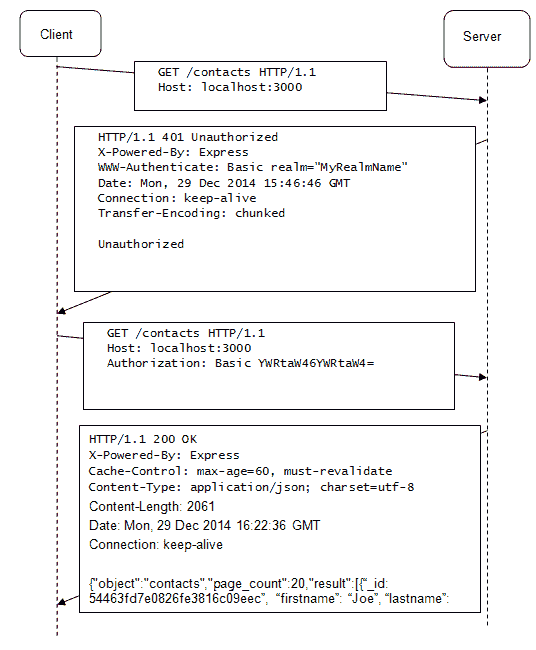
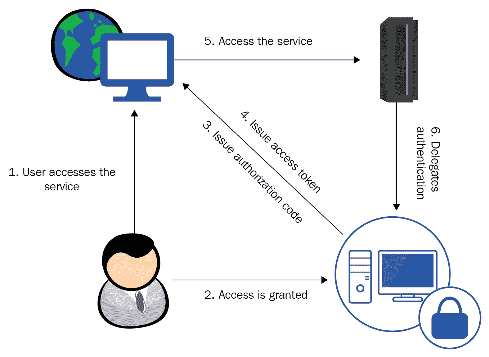
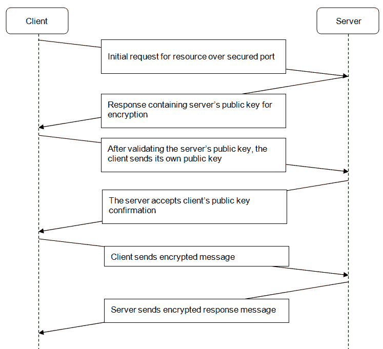

# 第九章：保护应用程序

一旦在生产环境中部署，应用程序将面临大量请求。不可避免地，其中一些将是恶意的。这就需要明确授予访问权限，只有经过身份验证的用户才能访问服务，即，对已选择的消费者进行身份验证，以便他们能够访问您的服务。大多数消费者只会使用服务进行数据提供。然而，少数消费者需要能够提供新的或修改现有的目录数据。为了确保只有适当的消费者能够执行`POST`、`PUT`和`DELETE`请求，我们将不得不在应用程序中引入授权的概念，该授权将仅授予明确选择的用户修改权限。

数据服务可能提供敏感的私人信息，例如电子邮件地址；HTTP 协议作为一种文本协议，可能不够安全。通过它传输的信息容易受到**中间人**攻击，这可能导致数据泄露。为了防止这种情况，应使用**传输层安全**（**TLS**）。HTTPS 协议加密传输的数据，确保只有具有正确解密密钥的适当消费者才能使用服务提供的数据。

在本章中，我们将看看 Node.js 如何实现以下安全功能：

+   基本身份验证

+   基于护照的基本身份验证

+   基于护照的第三方身份验证

+   授权

+   传输层安全

# 身份验证

应用程序在成功针对受信任存储验证其身份后，将用户视为已经通过身份验证。这样的受信任存储可以是任何一种特别维护的数据库，存储应用程序的凭据（基本身份验证），或者是第三方服务，该服务检查给定的身份是否与其自己的受信任存储匹配（第三方身份验证）。

# 基本身份验证

HTTP 基本身份验证是目前最流行和直接的身份验证机制之一。它依赖于请求中的 HTTP 头，提供用户的凭据。可选地，服务器可能会回复一个头部，强制客户端进行身份验证。以下图显示了在进行基本身份验证时客户端和服务器的交互：



每当向由 HTTP 基本身份验证保护的端点发送 HTTP 请求时，服务器都会以 HTTP `401 Unauthorized`状态代码进行回复，并且可选地附带`WWW-Authenticate`头。此头部强制客户端发送另一个请求，其中包含`Authorization`头，该头指定身份验证方法为`basic`。此请求后跟一个 base64 编码的键/值对，提供要进行身份验证的用户名和密码。可选地，服务器可以使用`realm`属性向客户端指定消息。

该属性指定具有相同`realm`值的资源应支持相同的身份验证方式。在上图中，`realm`消息是`MyRealmName`。客户端通过发送具有`Basic YWRtaW46YWRtaW4`值的`Authentication`头来进行身份验证，指定使用`Basic`身份验证，然后是 base64 编码的值。在图中，base64 解码的文字`YWRtaW46YWRtaW4`代表`admin:admin`文字。如果成功验证了这样的用户名/密码组合，HTTP 服务器将用所请求项目的 JSON 有效负载进行响应。如果身份验证失败，服务器将以`401 Unauthorized`状态代码进行响应，但这次不包括`WWW-Authenticate`头。

# 护照

现在有很多身份验证方法可供选择。也许最流行的方法是基本身份验证，每个用户都有自己的用户名和密码，以及第三方身份验证，用户可以使用他们已经存在的外部公共服务账户进行身份识别，例如个人社交服务，如 LinkedIn、Facebook 和 Twitter。

选择 Web API 的最合适的身份验证类型主要取决于其消费者。显然，使用 API 获取数据的应用程序不太可能使用个人社交账户进行身份验证。当 API 直接由人类使用前端直接使用时，这种方法更加合适。

实现一个能够轻松切换不同身份验证方法的解决方案是一个复杂且耗时的任务。事实上，如果在应用程序的初始设计阶段没有考虑到这一点，这几乎是不可能的。

**Passport**是专为 Node.js 设计的身份验证中间件，特别适用于身份验证方式需要轻松切换的用例。它具有模块化架构，可以使用特定的身份验证提供者，称为**策略**。该策略负责实现所选择的身份验证方法。

有很多身份验证策略可供选择，例如常规的基本身份验证策略或基于社交平台的策略，用于 Facebook、LinkedIn 和 Twitter 等服务。请参考官方 Passport 网站[`www.passportjs.org/`](http://www.passportjs.org/)，获取可用策略的完整列表。

# Passport 的基本身份验证策略

现在是时候看看如何利用 Passport 的策略了；我们将从基本身份验证策略开始；现在我们知道基本身份验证的工作原理，这是一个合乎逻辑的选择。

像往常一样，我们将使用 NPM 包管理器安装相关模块。我们需要`passport`模块，它提供了允许您插入不同身份验证策略的基本功能，以及由`passport-http`模块提供的基本身份验证的具体策略：

```js
  npm install passport
  npm install passport-http
```

接下来，我们需要实例化 Passport 中间件和基本身份验证策略。`BasicStrategy`以回调函数作为参数，检查提供的用户名/密码组合是否有效。最后，将 passport 的 authenticate 方法作为中间件函数提供给 express 路由，确保未经身份验证的请求将以适当的“401 未经授权”状态被拒绝：

```js
const passport = require('passport');
const BasicStrategy = require('passport-http').BasicStrategy;

passport.use(new BasicStrategy(function(username, password, done) {
  if (username == 'user' && password=='default') {
    return done(null, username);
  }
}));

router.get('/v1/', 
  passport.authenticate('basic', { session: false }), 
     function(request,    response, next) {
       catalogV1.findAllItems(response);
});
router.get('/v2/', 
  passport.authenticate('basic', { session: false }), 
     function(request,    response, next) {
       catalogV1.findAllItems(response);
});

router.get('/', 
  passport.authenticate('basic', { session: false }), 
     function(request,    response, next) {
       catalogV1.findAllItems(response);
});
```

`BasicStrategy`构造函数以处理程序函数作为参数。它使我们能够访问客户端提供的用户名和密码，以及 Passport 中间件的“done（）”函数，该函数通知 Passport 用户是否已成功验证。调用“done（）”函数并将`user`作为参数以授予身份验证，或者将`error`参数传递给它以撤销身份验证：

```js
passport.use(new BasicStrategy(
function(username, password, done) {
  AuthUser.findOne({username: username, password: password}, 
    function(error, user) {
      if (error) {
        return done(error);
      } else {
        if (!user) {
          console.log('unknown user');
          return done(error);
        } else {
          console.log(user.username + ' 
          authenticated successfully');
          return done(null, user);
        }
      }
    });  
  })
); 
```

最后，在路由器中间件中使用`passort` `authenticate（）`函数将其附加到特定的 HTTP 方法处理程序函数。

在我们的情况下，我们指定不希望在会话中存储任何身份验证细节。这是因为，在使用基本身份验证时，没有必要在会话中存储任何用户信息，因为每个请求都包含提供登录详细信息的`Authorization`标头。

# Passport 的 OAuth 策略

OAuth 是第三方授权的开放标准，它定义了一种委托协议，用于对抗第三方认证提供者。OAuth 使用特殊令牌，一旦发行，就用于标识用户，而不是用户凭据。让我们更仔细地看一下 OAuth 的工作流程，以一个示例场景为例。场景中的主要角色是-一个**用户**与一个**Web 应用程序**进行交互，该应用程序从**后端**系统中提供某种数据的 RESTful 服务。Web 应用程序将其授权委托给一个单独的**第三方授权服务器**。



1.  用户请求一个需要进行身份验证以与后端服务建立通信的 Web 应用程序。这是初始请求，因此用户仍未经过身份验证，因此他们被重定向到一个登录页面，要求提供相关第三方账户的凭据。

1.  成功认证后，认证服务器向 Web 应用程序发放授权代码。这个授权代码是由提供者发行的客户端 ID 和秘密的组合。它们应该从 Web 应用程序发送到认证服务器，并且用于交换具有有限生命周期的访问令牌。

1.  Web 应用程序使用认证令牌进行身份验证，直到它过期。之后，它必须使用授权代码请求新的令牌。

Passport.js 通过一个单独的策略模块隐藏了这个过程的复杂性，自动化了 OAuth 的工作流程。它可以在`npm`存储库中找到。

```js
npm install passport-oauth
```

创建策略的实例并为其提供请求令牌和认证的 URL，以及您的个人消费者密钥和您选择的秘密短语。

```js
var passport = require('passport')
  , OAuthStrategy = require('passport-oauth').OAuthStrategy;

passport.use('provider', new OAuthStrategy({
    requestTokenURL: 'https://www.provider.com/oauth/request_token',
    accessTokenURL: 'https://www.provider.com/oauth/access_token',
    userAuthorizationURL: 'https://www.provider.com/oauth/authorize',
    consumerKey: '123-456-789',
    consumerSecret: 'secret'
    callbackURL: 'https://www.example.com/auth/provider/callback'
  }, function(token, tokenSecret, profile, done) {  
    //lookup the profile and authenticate   and call done
  }
));
```

Passport.js 提供了包装不同提供者的单独策略，如 linkedin 或 github。它们确保您的应用程序与发放令牌的 URL 保持最新。一旦您确定要支持的提供者，就应该为它们检查特定的策略。

# Passport 的第三方认证策略

如今，几乎每个人都至少拥有一个个人公共社交媒体账户，如 Twitter、Facebook 和 LinkedIn。最近，让访问者通过点击一个图标来绑定他们的社交服务账户到一个服务内部自动生成的账户，已经变得非常流行。

这种方法非常方便，适用于通常至少有一个账户保持登录状态的网页用户。如果他们当前没有登录，点击图标将重定向他们到他们的社交服务登录页面，成功登录后，又会发生另一个重定向，确保用户获取他们最初请求的内容。但是，当涉及通过 Web API 公开数据时，这种方法并不是一个真正的选择。

公开的 API 无法预测它们是由人还是应用程序使用。此外，API 通常不会直接由人使用。因此，当您作为 API 作者确信公开的数据将直接通过互联网浏览器的前端手动请求的最终用户直接使用时，第三方认证是唯一的选择。一旦他们成功登录到他们的社交账户，唯一的用户标识符将被存储在会话中，因此您的服务需要能够适当地处理这样的会话。

要使用 Passport 和 Express 存储用户登录信息的会话支持，必须在初始化 Passport 及其会话中间件之前初始化 Express 会话中间件：

```js
app.use(express.session()); 
app.use(passport.initialize()); 
app.use(passport.session()); 
```

然后，指定 Passport 应将哪个用户的详细信息序列化/反序列化到会话中。为此，Passport 提供了`serializeUser()`和`deserializeUser()`函数，它们在会话中存储完整的用户信息：

```js
passport.serializeUser(function(user, done) { done(null, user); }); passport.deserializeUser(function(obj, done) { done(null, obj); });
```

初始化 Express 和 Passport 中间件的会话处理的顺序很重要。Express 会话应该首先传递给应用程序，然后是 Passport 会话。

启用会话支持后，您必须决定依赖哪种第三方身份验证策略。基本上，第三方身份验证是通过第三方提供商创建的插件或应用程序启用的，例如社交服务网站。我们将简要介绍如何创建一个允许通过 OAuth 标准进行身份验证的 LinkedIn 应用程序。

通常，这是通过与社交媒体应用程序关联的公钥和密钥（令牌）对来完成的。创建 LinkedIn 应用程序很容易——您只需登录[`www.linkedin.com/secure/developer`](http://www.linkedin.com/secure/developer)并填写简要的应用程序信息表。您将获得一个秘钥和一个令牌来启用身份验证。执行以下步骤来启用 LinkedIn 身份验证：

1.  安装`linkedin-strategy`模块—`npm install linkedin-strategy`

1.  获取 LinkedIn 策略的实例，并在启用会话支持后通过`use()`函数将其初始化为 Passport 中间件：

```js
      var passport = require('passport')
        , LinkedInStrategy = require('passport-
        linkedin').Strategy;

        app.use(express.session());
        app.use(passport.initialize());
        app.use(passport.session());

      passport.serializeUser(function(user, done) {
        done(null, user);
      });

      passport.deserializeUser(function(obj, done) {
        done(null, obj);
      });

        passport.use(new LinkedInStragety({
          consumerKey: 'api-key',
          consumerSecret: 'secret-key',
          callbackURL: "http://localhost:3000/catalog/v2"
        },
          function(token, tokenSecret, profile, done) {
            process.nextTick(function () {
              return done(null, profile);
            });
          })
        ); 
```

1.  明确指定 LinkedIn 策略应该作为每个单独路由的 Passport 使用，确保启用会话处理：

```js
      router.get('/v2/', 
        cache('minutes',1), 
        passport.authenticate('linked', { session: true}), 
        function(request, response) {
          //...
        }
      });
```

1.  提供一种方式让用户通过暴露注销 URI 来注销，利用`request.logout`：

```js
      router.get('/logout', function(req, res){
      request.logout();
        response.redirect('/catalog');
      });

```

提供的第三方 URL 和服务数据可能会发生变化。在提供第三方身份验证时，您应始终参考服务政策。

# 授权

到目前为止，目录数据服务使用基本身份验证来保护其路由免受未知用户的侵害；然而，目录应用程序应该只允许少数白名单用户修改目录中的项目。为了限制对目录的访问，我们将引入授权的概念，即，一组经过身份验证的用户，允许适当的权限。

当调用 Passport 的`done()`函数来验证成功的登录时，它以`user`用户的实例作为参数。`done()`函数将该用户模型实例添加到`request`对象中，并通过`request.user`属性提供对其的访问，以便在成功验证后执行授权检查。我们将利用该属性来实现一个在成功验证后执行授权检查的函数。

```js
function authorize(user, response) {
  if ((user == null) || (user.role != 'Admin')) {
    response.writeHead(403, { 'Content-Type' : 
    'text/plain'});
    response.end('Forbidden');
    return;
  }
} 
```

HTTP 403 Forbidden 状态码很容易与 405 Not allowed 混淆。然而，405 Not Allowed 状态码表示请求的资源不支持特定的 HTTP 动词，因此只能在该上下文中使用。

`authorize()`函数将关闭`response`流，返回`403 Forbidden`状态码，表示已识别登录用户但权限不足。这将撤销对资源的访问。此函数必须在执行数据操作的每个路由中使用。

以下是一个`post`路由实现授权的示例：

```js
app.post('/v2', 
  passport.authenticate('basic', { session: false }), 
    function(request, response) {
      authorize(request.user, response);
      if (!response.closed) {
        catalogV2.saveItem(request, response);
      }
    }
); 
```

调用`authorize()`后，我们通过检查`response`对象的 closed 属性的值来检查其输出是否仍然允许写入。一旦`response`对象的 end 函数被调用，closed 属性将返回`true`，这正是当用户缺少管理员权限时`authorize()`函数所做的。因此，我们可以在我们的实现中依赖 closed 属性。

# 传输层安全

网上公开的信息很容易成为不同类型的网络攻击的对象。通常仅仅把所谓的“坏人”挡在门外是不够的。有时，他们甚至不会费心获得认证，而是更喜欢进行**中间人**（**MiM**）攻击，假装是消息的最终接收者，并窃听传输数据的通信渠道，甚至更糟糕的是在数据流动时修改数据。

作为一种基于文本的协议，HTTP 以人类可读的格式传输数据，这使得它很容易成为 MiM 攻击的受害者。除非以加密格式传输，否则我们服务的所有目录数据都容易受到 MiM 攻击的威胁。在本节中，我们将把我们的传输方式从不安全的 HTTP 协议切换到安全的 HTTPS 协议。

HTTPS 由非对称加密，也称为**公钥加密**，来保护。它基于数学相关的一对密钥。用于加密的密钥称为**公钥**，用于解密的密钥称为**私钥**。其思想是自由提供加密密钥给必须发送加密消息的合作伙伴，并用私钥执行解密。

两个方，*A* 和 *B* 之间的典型的公钥加密通信场景如下：

1.  Party *A* 组成一条消息，用 *B* 方的公钥加密，然后发送

1.  Party *B* 用自己的私钥解密消息并处理它

1.  Party *B* 组成一个响应消息，用 *A* 方的公钥加密，然后发送

1.  Party *A* 用自己的私钥解密响应消息

现在我们知道公钥加密是如何工作的，让我们通过 HTTPS 客户端-服务器通信的示例来了解一下：



客户端对 SSL 安全端点发送初始请求。服务器对该请求做出响应，发送其公钥以用于加密进一步的传入请求。然后，客户端必须检查接收到的密钥的有效性并验证其身份。在成功验证服务器的公钥之后，客户端必须将自己的公钥发送回服务器。最后，在密钥交换过程完成后，两个方可以开始安全地通信。

HTTPS 依赖于信任；因此，有一种可靠的方式来检查特定的公钥是否属于特定的服务器是至关重要的。公钥在 X.509 证书中交换，具有分层结构。这种结构使客户端能够检查给定的证书是否是由受信任的根证书生成的。客户端应该只信任由已知的**证书颁发机构**（**CA**）颁发的证书。

在将我们的服务切换到使用 HTTPS 传输之前，我们需要一个公钥/私钥对。由于我们不是证书颁发机构，我们将不得不使用 OpenSSL 工具为我们生成测试密钥。

OpenSSL 可以在[`www.openssl.org/`](http://www.openssl.org/)下载，那里提供了所有流行操作系统的源代码分发。OpenSSL 可以按照以下方式安装：

1.  二进制分发可供 Windows 下载，Debian 和 Ubuntu 用户可以通过执行以下命令使用打包的分发：

```js
sudo apt-get install openssl
```

Windows 用户需要设置一个环境变量 OPENSSL_CNF，指定`openssl.cnf`配置文件的位置，通常位于安装存档的共享目录中。

1.  现在让我们用 OpenSSL 生成一个测试的键/值对：

```js
opensslreq -x509 -nodes -days 365 -newkey rsa:2048-keyoutcatalog.pem -out catalog.crt
```

OpenSSL 将提示生成证书所需的一些细节，例如国家代码、城市和完全合格的域名。之后，它将在`catalog.pem`文件中生成一个私钥，并在`catalog.crt`文件中生成一个有效期为一年的公钥证书。我们将使用这些新生成的文件，所以将它们复制到目录数据服务目录中的一个名为`ssl`的新子目录中。

现在我们拥有了修改我们的服务以使用 HTTPS 所需的一切：

1.  首先，我们需要切换并使用 HTTPS 模块而不是 HTTP，并指定要使用的端口以启用 HTTPS 通信：

```js
var https = require('https');
var app = express();
app.set('port', process.env.PORT || 3443); 
```

1.  然后，我们需要将`catalog.cem`文件中的私钥和`catalog.crt`中的证书读入数组中：

```js
var options = {key : fs.readFileSync('./ssl/catalog.pem'),
                cert : fs.readFileSync('./ssl/catalog.crt')
}; 
```

1.  最后，我们将包含密钥对的数组传递给创建服务器的 HTTPS 实例，并通过指定的端口开始监听：

```js
https.createServer(options, app).listen(app.get('port'));
```

这就是为 Express 应用程序启用 HTTPS 所需做的一切。保存您的更改，并尝试在浏览器中请求`https://localhost:3443/catalog/v2`。您将看到一个警告消息，告诉您正在连接的服务器正在使用由不受信任的证书颁发机构颁发的证书。这是正常的，因为我们自己生成了证书，而且我们肯定不是 CA，所以只需忽略该警告。

在将服务部署到生产环境之前，您应始终确保使用由受信任的 CA 颁发的服务器证书。

# 自测问题

回答以下问题：

+   HTTP 基本身份验证是否安全防范中间人攻击？

+   传输层安全性有哪些好处？

# 摘要

在本章中，您学会了如何通过启用身份验证和授权手段来保护暴露的数据。这是任何公开可用数据服务的关键方面。此外，您还学会了如何使用服务和用户之间的安全层传输协议来防止中间人攻击。作为这类服务的开发人员，您应该始终考虑应用程序应支持的最合适的安全功能。

希望这是一个有用的经验！您获得了足够的知识和实际经验，这应该使您更加自信地理解 RESTful API 的工作原理以及它们的设计和开发方式。我强烈建议您逐章阅读代码演变。您应该能够进一步重构它，使其适应您自己的编码风格。当然，它的一些部分可以进一步优化，因为它们经常重复。这是一个故意的决定，而不是良好的实践，因为我想强调它们的重要性。您应该始终努力改进您的代码库，使其更易于维护。

最后，我想鼓励您始终关注您在应用程序中使用的`Node.js`模块的发展。Node.js 拥有一个迅速增长的非凡社区。那里总是有一些令人兴奋的事情发生，所以确保您不要错过。祝你好运！
