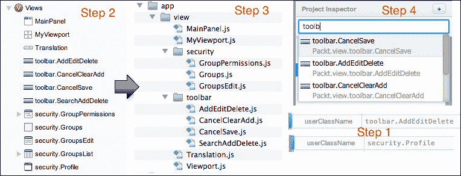

# 第四章.技巧与窍门

在本章中，我们将学习如何使用 Sencha Architect 的一些功能。换句话说，我们将学习一些简短的食谱，了解如何完成一些可以帮助我们在开发 Sencha Architect 项目时受益的任务，例如：

+   使用第三方插件（非原生插件）

+   将 HTML 代码添加到 index HTML 页面

+   导入现有项目

+   创建可重用自定义组件（团队项目）

+   多语言应用

+   Sencha Architect + Eclipse

在我们开始之前，我们将把本章将要创建的示例保存在 `sencha-architect/chapter04` 文件夹中。

# 导出和导入现有项目

假设你正在处理一个非常酷的项目，并想与某人分享。你不需要压缩整个项目文件夹并发送它。Sencha Architect 有更好的方法来做这件事。

例如，假设我们想要将第一章中开发的项目（`extBooks`）通过电子邮件发送给朋友。因此，在用 Sencha Architect 打开项目后，我们将选择 **文件** | **归档项目** (*步骤 1*)。Sencha Architect 将询问您希望将项目保存到何处；让我们选择我们创建的 `chapter04` 文件夹，并将文件保存为 `ExtBooksChp02` (*步骤 2*)。Sencha Architect 将以 `.xda` 扩展名保存文件 (*步骤 3*)。

此文件包含 `extBooks` 项目的所有文件，包括 `php` 文件：


现在，让我们假设我们已将文件通过电子邮件发送给朋友，而这个朋友也想使用 Sencha Architect 打开项目。因此，我们的朋友需要打开 Sencha Architect，转到 **文件** | **导入归档** (*步骤 4*) 并选择我们发送的 `.xda` 文件 (*步骤 5*)。项目将被打开，如果这个朋友想将项目保存到本地运行，他/她只需点击 **保存**，并给它起一个名字——例如：**chap02** (*步骤 6*)：


如果我们进入项目目录，我们将看到如下截图所示的完整项目：


`.xda` 文件非常紧凑。这是共享 Sencha 项目文件的好方法。对于源代码控制，建议将所有项目文件放在您的源代码控制系统（`.git`、`.svn` 等）下。

# 使用 Sencha Architect 与 Eclipse

Sencha Architect 是一个优秀的 IDE，尽管它是为 Sencha 框架定制的，但这并不意味着你不能与你的 favorite IDE（如 Eclipse、Netbeans、Visual Studio、Aptana 等）一起使用。在本主题中，我们将演示如何使用 Sencha Architect 与 Eclipse，你可以用同样的逻辑来使用任何其他 IDE。

假设我们正在开发一个 Java 项目，前端将使用 Ext JS 开发，因此我们将使用 Sencha Architect 来为我们处理所有的 Ext JS 代码。如果我们查看使用 Eclipse 创建的 Java Web 项目的结构，我们将看到如下所示的截图：


在 **WebContent** 中，我们将添加我们的 JSS、CSS 和 HTML（或 JSP）文件，因此 Ext JS 代码必须位于 `WebContent` 文件夹内。我们如何保存 Sencha Architect 项目，以便我们能够得到我们需要的 exactly what we need？当我们保存 Sencha Architect 项目时，我们需要选择 Eclipse 项目作为根文件夹（`Save Path:`），而 `Project Name:` 将如以下截图所示：


这样所有 Ext JS 代码都将位于 `WebContent` 内，我们可以使用 Eclipse 作为 Java 代码的代码编辑器，而使用 Sencha Architect 作为 Ext JS 代码的编辑器。项目将看起来如下所示截图，这正是从 Java 网络项目中期望得到的样子：


# 创建可重用自定义组件

您使用 Sencha Architect 创建了一个非常酷的组件，现在您想与世界分享它，以便其他开发人员也可以在他们的项目中使用此组件。这是否可能？答案是肯定的！

您也可以使用此功能与您的开发团队共享组件，甚至在其他 Senha Architect 项目中重用相同的组件。由于 Ext JS 和 Sencha Touch 共享部分 API，特别是数据包，您还可以使用此功能将模型和存储从 Ext JS 项目导入到 Sencha Touch 项目，反之亦然！

要做到这一点，您需要选择 **模型**、**存储**、**视图**或**控制器**，右键单击它，然后单击 **导出到文件…** 选项。在以下截图中，我们正在从 `extBooks` 项目（`chap02`）导出 **Book** **模型**（*步骤 1*）。接下来，我们需要保存它——我们将将其命名为 `BookModel`（*步骤 2*）。一旦保存，Sencha Architect 将以 `.xdc` 扩展名保存它（*步骤 3*）：


要导入它，我们需要转到 **编辑** | **导入组件…** 并选择 `BookModel.xdc` 文件（*步骤 4*）。Sencha Architect 将组件保存到工具箱中，因此我们可以给它一个 `名称` 并为其选择一个 `类别`（*步骤 5*）。然后我们可以转到工具箱并像使用任何其他工具箱组件一样使用它（*步骤 6*）：


如果您想在未来的项目中重用 **视图**，您也可以使用 **保存到工具箱…** 选项（*步骤 7*）。它也会询问您要将视图保存到哪个 **名称** 和哪个 **类别**（*步骤 8*）。然后，**BooksGrid** 也将可在工具箱中使用（*步骤 9*）：


正如我们在第二章中已经学到的，*创建 Ext JS 应用*和第三章，*创建 Sencha Touch 应用*，要使用工具箱中的组件，我们可以从项目检查器中选择**视图**、**模型**、**存储**或**控制器**，当我们双击工具箱组件时，它将作为项目检查器所选项目的子项创建，或者如果我们选择包，它将作为**模型**、**存储**、**视图**或**控制器**创建。

# 将 HTML 代码添加到 app.html 文件中

到目前为止，我们已经了解到，除非是为了函数或模板，否则我们无法在 Sencha Architect 中编辑代码。如果我们查看 Sencha Ext JS 示例([`www.sencha.com/products/extjs/examples/`](http://www.sencha.com/products/extjs/examples/))，我们会看到许多示例在示例的 `index.html` 中包含 HTML 标签（DIV、P）。如果我们想创建类似的应用程序，这是可能的吗？答案是肯定的。

您将无法手动编辑 `app.html` 文件以添加您想要的 HTML 代码。正如我们在第二章中看到的，*创建 Ext JS 应用*和第三章，*创建 Sencha Touch 应用*，如果您更改了 Sencha Architect 生成的任何文件，当您在 Sencha Architect 中打开相同的项目时，它将用原始代码覆盖您所有的更改。

但我们如何添加 HTML 代码呢？答案是使用 Sencha 代码（也称为 Ext Core）进行 DOM 操作，这在 Ext JS 和 Sencha Touch 框架中都是可用的。

要这样做，当我们创建 Sencha Architect 应用程序（Ext JS 或 Sencha Touch）时，从项目检查器中选择**应用程序**图标（*步骤 1*），转到配置面板，找到**启动**函数，并单击**+**图标（*步骤 2*）。然后，将出现一个绿色菱形图标，我们可以单击箭头图标（*步骤 3*），如下面的截图所示：


代码编辑器将打开，我们可以使用 Ext Core 来操作 DOM。在这种情况下，我们正在将 HTML 标签追加到 HTML 主体中：


如果我们运行项目，输出将如下面的截图所示：


# 使用第三方插件（非原生插件）

当我们想要开发 Sencha API 中不可用的东西时，插件非常有帮助。已经原生支持的插件在 Sencha Architect 中作为选项提供，但还有许多其他开发者共享的插件，我们可以在 Sencha 论坛上找到。

我们在这里想关注一个特定的案例，因为我们已经看到了如何添加一个新属性，并且对于某些组件，我们可以轻松地添加插件或功能属性，然后添加插件配置。但是，API 支持原生插件的组件不允许我们这样做，例如，Ext JS 的网格面板：


我们只能在 Sencha Architect 内部使用的插件和功能。如果我们想使用第三方插件或功能，比如 Filter 插件呢？这是可能的，但我们需要使用 Sencha Architect 的一个高级功能，即“创建覆盖”。关于覆盖的声明：这必须避免。只要可能，使用设置方法来更改属性。覆盖应该是你的最后选择，并且应该非常小心地使用，因为如果你不谨慎使用，你可能会改变组件的行为，导致某些功能停止工作。但我们将演示如何以安全的方式完成它！

我们将在这个主题中使用 **BooksGrid** 作为示例。假设我们需要在它上使用 Filter 插件，因此我们需要首先创建一个覆盖。为此，从项目检查器中选择 **BooksGrid**，打开代码编辑器，然后单击 **创建覆盖** 按钮（*步骤 1*）。Sencha Architect 将显示一个警告（*步骤 2*）。我们可以单击 **是** 继续操作：


代码编辑器将打开（*步骤 3*）覆盖类，这样我们就可以输入我们的代码。在这种情况下，我们将对这个文件有完全的自由去做我们需要做的任何事情。所以让我们添加 `features()` 函数，其中包含插件的声明，以及 `initComponent()` 函数，如以下截图所示（*步骤 4*）：


有一件事非常重要，那就是我们必须调用 `callParent()` 函数（`callOverriden()` 在 Ext JS 4.1 及以后的版本中已经弃用）以确保我们继续拥有组件的所有原始行为（在这种情况下是 `BooksGrid` 类）。我们唯一想要做的是向其中添加一个新功能。

我们已经完成了覆盖！要回到原始类，我们可以使用以下截图所示的导航器：


注意到 `requires` 已经添加到 `Packt.view.override.BooksGrid` 类中，这是我们刚刚编写的类。下一步是在需要类中添加插件。为此，我们需要选择 **BooksGrid**，转到配置面板，并添加具有插件名称的 `requires`（**Ext.ux.grid.FiltersFeature**）：


一些开发者喜欢直接将插件文件作为 JavaScript 文件添加到`app.html`/`index.html`中。Sencha 提供了动态加载功能，所以让我们利用它并使用它！首先，我们不能忘记在项目根目录中添加包含插件的`ux`文件夹，如下面的截图所示：


接下来，我们需要设置应用程序加载器。从项目检查器中选择**应用程序**（*步骤 5*），然后转到配置面板，找到**加载器配置**属性，点击**+**图标（*步骤 6*），然后点击箭头图标（*步骤 7*）。加载器的详细信息将在配置面板上显示。定位到**paths**属性并点击它（*步骤 8*）。代码编辑器将以加载器路径的默认值打开，该默认值为**{"Ext": "."}**（*步骤 9*）。不要删除它；只需添加`Ext.ux`命名空间的路劲，即`ux`文件夹的路劲（*步骤 10*）：


我们几乎完成了！我们需要在每个我们希望用户能够过滤其值的列中添加`filterable`选项（*步骤 11*）：我们可以使用配置面板添加一个新属性（首先我们需要从项目检查器中选择所需的列——始终记得这样做）。然后，我们可以选择我们想要添加的属性类型（*步骤 12*和*步骤 14*）。例如，我们可以为`id`列添加`filterable: true`（*步骤 13*）以及为`Name`列添加`filterable:` `{type: 'string'}`（*步骤 15*和*步骤 16*），如下面的截图所示：


插件已经准备好使用！

# 创建多语言应用程序

另一个非常有用的功能是拥有一个多语言应用程序，许多开发者尝试在 Sencha Architect 中实现它。问题是，我们通常有一个 JavaScript 对象，其中包含我们想要应用于应用程序上文本的翻译。例如，假设我们想要翻译`BooksGrid`；首先我们需要创建一个包含所需翻译的 JavaScript 文件（每个网格列一个）：

```js
translation = {
    books: 'Livros',
    id: 'Id',
    name: 'Nome',
    author: 'Autor(a)',
    language: 'Língua',
    paperback: 'Folhas',
    release: 'Lançamento',
    isbn: 'ISBN',
    isbn13: 'ISBN13'    
};
```

上述代码包含葡萄牙语翻译。我们想要使用的方式是将翻译值应用于特定列，而我们需要使用的列标签如下面的代码所示：

```js
xtype: 'gridcolumn',
dataIndex: 'author',
text: translation.author

```

发生的事情是，Sencha Architect 上的文本属性只允许你输入一个字符串，你不能将对象作为文本属性值输入；我们如何解决这个问题？我们有两种选择：每当用户更改语言时，我们可以调用`setText()`或`setTitle()`方法，为应用程序上的所有组件传递新的值。但这太麻烦了。或者，我们可以使用覆盖。在我们的情况下，因为我们已经从一个先前的主题中有了覆盖，我们只需要向其中添加以下代码：

```js
columns: [
    {
        xtype: 'gridcolumn',
        width: 53,
        dataIndex: 'id',
        text: translation.id
    },
    {
        xtype: 'gridcolumn',
        dataIndex: 'name',
        text: translation.name,
        flex: 1
    }
    // other columns
]
```

然后多语言应用程序也准备好了。

# 创建 util 和自定义类

在你将要参与的大多数项目中，你可能需要创建带有可重用函数或被视为常量的属性的`util`类。你还可以在 Sencha Architect 中使用它们。所以假设我们需要创建一个函数，该函数将两个给定的值相加并返回结果。这个函数可以在你的项目的多个地方使用，并且与任何业务逻辑无关。因此，我们需要创建一个类。Sencha Architect 提供了创建存储、模型、控制器和视图的能力，但我们想创建另一种类型的类。我们可以通过项目检查器顶部的**+**图标创建一个 Ext 类（*步骤 1*）。然后，点击**类**，并选择你想要创建此类的包。

让我们在**控制器**包内创建。Sencha Architect 将列出新的类，并在所需包下显示 ext 图标（*步骤 2*）。接下来，你可以给你的类命名，一个别名，并选择其他选项，例如**单例**：true（*步骤 3*）：


在这样的类中，你可以添加属性和函数，但你将受到所有更改都必须通过配置面板进行的限制。这不是一个你可以完全控制的覆盖文件。

例如，让我们创建我们之前提到的求和函数。我们需要转到**函数**并点击**+**图标（*步骤 4*——在配置面板上），为我们的函数命名，然后点击**下一步**（*步骤 5*），然后输入参数（*步骤 6*），然后会出现一个箭头图标（*步骤 7*），如果我们点击它，代码编辑器将打开，我们可以输入我们的代码（*步骤 8*）。如果我们需要更改任何配置，例如函数名或添加、编辑或删除参数，我们可以使用配置面板（*步骤 9*）来完成。并且像往常一样，我们将拥有由 Sencha Architect 生成的代码（*步骤 10*）：


如果我们想使用`sum()`函数，我们可以简单地调用`Packt.controller.Utils.sum(1,2)`，返回值将是`3`！

如果你真的想对代码有完全的控制权，可以创建一个`Ext`类，然后创建一个覆盖。这样，它将类似于使用任何代码编辑器。但在这个情况下，你将无法使用 Sencha Architect 的功能。

如果你尝试更改扩展类（默认为`Ext.Base`）为`Ext.grid.Panel`等，Sencha Architect 将识别这个类是受工具支持的，并将询问你是否想要转换（如果回答是，它将类似于从工具箱中选择组件）。如果不是，你将拥有自由创建每个属性或函数（Sencha Architect 将不会在配置面板上列出可用的属性，但你将能够添加自己的功能和插件，例如）：


# 与子包一起工作

当我们在 MVC 架构和 Sencha 项目中工作时，我们已经在使用四个帮助我们更好地组织应用程序的包：`model`、`view`、`controller` 和 `store`。但是当我们的应用程序开始增长并且我们有很多类时，在每个包内部进一步组织类是正常的。

在 Sencha Architect 中创建子包非常简单。让我们假设我们想要创建一个名为 `Profile` 的新视图。如果我们命名类为 `Profile` (`userClassName`)，则此类将在 `app/view` 目录内创建。但如果我们想让它创建在 `app/view/security` 中，我们需要命名 ID 为 `security.Profile` (*步骤 1*)：



在项目检查器中，类不会由子文件夹分开；我们将只看到点 (`.`) 将类的名称与其子包分开 (*步骤 2*)。但在项目的文件夹中，我们可以看到 Sencha Architect 为我们创建了子文件夹 (*步骤 3*)。如果我们需要快速搜索，我们始终可以使用项目检查器顶部的快速打开选项 (*步骤 4*)。

我们可以创建我们需要的任意数量的子包。我们只需要用点 (`.`) 分隔子包的名称，如下例所示：`package1.package2.package3.NameOfTheClass`。

# 摘要

在本章中，我们学习了一些有用的技巧，这些技巧可以帮助我们在使用 Sencha Architect 处理 Sencha 项目时完成日常任务。我们学习了高级主题，例如创建覆盖以使用第三方插件和功能，以及实现多语言应用程序。我们了解到可以使用 Sencha Architect 与我们喜欢的 IDE 一起使用，创建自定义组件以在开发团队内部或甚至其他开发者之间共享，以及如何将组件保存到工具箱中以便在其他项目中重复使用。我们还学习了如何在 Sencha Architect 中操作 DOM，以便向 `app.html` 页面添加 HTML 标签，并创建类似于 Ext JS 示例中的项目。

在下一章中，我们将学习如何处理资源。我们将学习如何更改 SDK 路径，创建新的 CSS 和 JS 文件，处理 Google Maps 以及其他示例。
