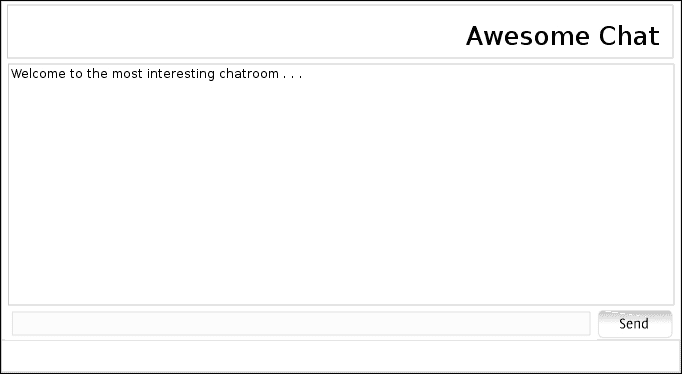
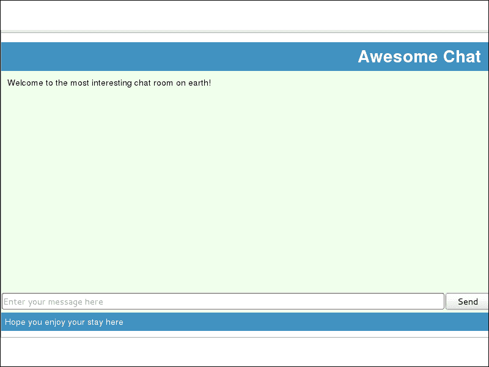

# 第三章。让我们聊天

从 2000 年初的 Yahoo! Chat 到今天流行的 Google Talk 或 Facebook Chat，聊天一直是互联网上最受欢迎的实时通信形式。在本章中，我们将使用我们在上一章中学到的 node 和 express 以及本章将要学习的 socket.io 库来构建一个聊天室。

# 创建应用程序

与我们在上一章中创建应用程序的方式类似，我们将通过在命令行中执行以下命令来创建一个新的 `awesome-chat` 应用程序：

```js
$ express awesome-chat
$ cd awesome-chat
$ npm install

```

这将创建我们的应用程序并安装 express 应用程序依赖项。打开 `package.json` 文件，将其名称更改为 `awesome-chat`，如下所示：

```js
{ 
  "name": "awesome-chat", 
  "version": "0.0.1", 
  "private": true, 
  "scripts": { 
    "start": "node app" 
  }, 
  "dependencies": { 
    "express": "3.0.0rc2express": "3.x", 
    "jade": "*" 
  } 
}
```

# 设计聊天室

让我们修改视图，使其看起来像聊天室。我们需要一个区域来显示消息，一个文本输入框供用户输入消息，以及一个发送消息的按钮。我们将添加一些美学元素，如页眉、横幅和页脚。完成之后，我们的聊天室用户界面应该看起来像以下截图所示：



令人惊叹的聊天 UI

让我们从编辑 `layout.jade` 开始，向其中添加页眉和页脚：

```js
doctype 5 
html 
 block head 
    title= title 
    link(rel='stylesheet', href='/stylesheets/style.css') 
  body 
 header#banner 
 h1 Awesome Chat 
    block content 
    footer Hope you enjoy your stay here
```

我们做的第一个更改是在 `head` 前添加 `block` 关键字。这使得 `head` 成为一个块，我们可以从中添加扩展页面的内容。

另一个变化是添加了新的页眉和页脚。请注意，我们正在使用 HTML5 中的 `header` 和 `footer` 标签。此代码还向我们介绍了一种新的 jade 语法。当我们写 `header#banner` 时，它将生成具有 `banner` 作为 `id` 值的页眉。生成的 HTML 代码如下：

```js
<!DOCTYPE html>
<html>
  <head>
    <title>{TITLE}</title>
    <link rel="stylesheet" href="/stylesheets/style.css" />
  </head>
  <body>
    <header id="banner">
      <h1>Awesome Chat</h1>
    </header>
    {CONTENT}
    <footer>
      Hope you enjoy your stay here
    </footer>
  </body>
</html>
```

接下来，我们将编辑 `index.jade` 以添加消息区域、消息输入和 **发送** 按钮：

```js
extends layout 
block content 
  section#chatroom
    div#messages 
    input#message(type='text', placeholder='Enter your message here') 
    input#send(type='button', value='Send')
```

让我们运行一下，看看我们的 `awesome-chat` 应用程序看起来怎么样。使用 `npm` 执行应用程序，并在浏览器中打开 `http://localhost:3000/`：

```js
npm start

```

嘿，所有元素都在那里，但看起来不太对！没错；为了改善应用程序的外观和感觉，我们需要编辑样式表，它位于 `public/stylesheets/style.css`。

我们可以根据自己的喜好进行编辑。这里有一个对我来说效果很好的例子：

```js
html { 
  height: 100%; 
} 

body { 
  font: 14px "Lucida Grande", Helvetica, Arial, sans-serif; 
  margin: 0px; 
  padding: 0px; 
  height: -moz-calc(100% - 20px); 
  height: -webkit-calc(100% - 20px); 
  height: calc(100% - 20px); 
} 

section#chatroom { 
  height: -moz-calc(100% - 80px); 
  height: -webkit-calc(100% - 80px); 
  height: calc(100% - 80px); 
  background-color: #EFFFEC; 
} 

div#messages { 
  height: -moz-calc(100% - 35px); 
  height: -webkit-calc(100% - 35px); 
  height: calc(100% - 35px); 
  padding: 10px; 
  -moz-box-sizing:border-box; 
  -webkit-box-sizing:border-box; 
  box-sizing:border-box; 
} 

input#message { 
  width: -moz-calc(100% - 80px); 
  width: -webkit-calc(100% - 80px); 
  width: calc(100% - 80px); 
} 

input#send { 
  width: 74px; 
} 

header{ 
  background-color:#4192C1; 
  text-align: right; 
  margin-top: 15px; 
} 

header h1{ 
  padding: 5px; 
  padding-right: 15px; 
  color: #FFFFFF; 
  margin: 0px; 
} 
footer{ 
  padding: 6px; 
  background-color:#4192C1; 
  color: #FFFFFF; 
  bottom: 0; 
  position: absolute; 
  width: 100%; 
  margin: 0px; 
  margin-bottom: 10px; 
  -moz-box-sizing:border-box; 
  -webkit-box-sizing:border-box; 
  box-sizing:border-box; 
} 

a { 
  color: #00B7FF; 
}
```

保存此 CSS 并刷新页面后，聊天室看起来是这样的：



令人惊叹的聊天室

# 引入 jQuery

jQuery 在 JavaScript 库中几乎是无处不在的，我们也将它在我们的应用程序中使用。要将 jQuery 添加到我们的应用程序中，让我们从 [`www.jquery.com/`](http://www.jquery.com/) 下载最新版本并将其保存到 `public/javascript/jquery.min.js`。然后，我们在 `layout.jade` 中添加脚本以将 jQuery 拉入我们的应用程序页面：

```js
    script(type='text/javascript', src='/javascripts/jquery.min.js')
```

# Socket.IO

自从 Web 应用程序的兴起以来，开发者们一直在寻找不同的方法来实现服务器和浏览器之间的全双工通信。无论是使用 Java、Flash、Comet 还是许多其他解决方案，所有这些目标都是相同的。但第一次，有一个规范可以通过使用 HTML5 WebSockets 来构建全双工通信系统。**WebSocket**是 HTML5 规范中的一项革命性的新通信功能，它定义了一个通过单个 socket 在 Web 上操作的全双工通信通道。

虽然 WebSocket RFC 已经发布，但它并不，也永远不会在仍在使用的旧浏览器上可用。Socket.io 是 WebSocket 的一个抽象层，具有 Flash、XHR、JSONP 和 HTMLFile 后备方案。Socket.io 提供了一个简单易用的服务器和客户端库，用于在 Web 服务器和浏览器客户端之间进行实时、流式更新。

Socket.io 是通过 npm 提供的 node 模块，我们将将其添加到我们的包依赖项中。socket.io 的当前版本是`0.9.10`。要将此添加到依赖项中，请将以下行添加到`package.json`中的依赖项对象：

```js
    "socket.io": "0.9.10"
```

使用 npm 安装它：

```js
$ npm install
```

这将把 socket.io 放入`node_modules`文件夹中。现在让我们看看我们将如何使用它。

# 事件处理

由于 socket.io 框架同时包含服务器和客户端的组件，我们将使用这些组件在双方进行通信编码。在一侧 socket 上发出的事件将由另一侧相应的事件处理器处理。Socket.io 就是这样构建的，使得双方都可以发送消息或附加处理器来处理传入的消息。

让我们先了解消息的流动方式。重要的是要记住，“消息”在这里并不是聊天系统用户实际发送和接收的消息，而是客户端和服务器用于通信的消息。将有两种类型的消息，如下所示：

+   **系统消息**：这些消息将由我们的聊天系统发送到客户端，比如当用户连接、其他人连接或用户断开连接时。让我们用`serverMessage`来标识它。

+   **用户消息**：这些消息将由客户端发送到服务器，实际上会在负载中携带用户的消息内容。我们可能想要区分我们发送的消息和其他用户发送的消息。所以让我们分别称它们为`myMessage`和`userMessage`。

当用户第一次连接时，服务器将发送一条欢迎消息给用户，作为`serverMessage`消息。

当用户输入一条消息并按下**发送**按钮时，我们将从浏览器发送一条`userMessage`消息到服务器。

接收到用户消息后，服务器将向所有其他用户广播这条消息。它还会将相同的信息作为`myMessage`发送回最初发送消息的用户。

当从服务器接收到任何消息时，浏览器将在消息区域显示消息的内容。

# 服务器

现在我们将实现服务器，它将执行之前提到的中继消息的任务。在`routes`文件夹中创建一个名为`sockets.js`的文件，并将以下代码插入其中：

```js
var io = require('socket.io'); 

exports.initialize = function(server) { 
  io = io.listen(server); 
  io.sockets.on("connection", function(socket){ 
    socket.send(JSON.stringify(
      {type:'serverMessage', 
        message: 'Welcome to the most interesting chat room on earth!'})); 
    socket.on('message', function(message){ 
      message= JSON.parse(message); 
      if(message.type == "userMessage"){ 
        socket.broadcast.send(JSON.stringify(message)); 
        message.type = "myMessage"; 
        socket.send(JSON.stringify(message)); 
      } 
    }); 
  }); 
};
```

在第一行代码（你现在应该已经熟悉了），我们导入`socket.io`模块；我们将通过`io`变量来识别这个模块。

由于 socket.io 与通信层一起工作，我们需要将其设置为监听 HTTP 服务器。HTTP 服务器只能从主应用程序模块访问，因此我们必须在我们模块之前将`server`传递给我们的模块，这样我们的模块才能执行任何操作。因此，我们从我们的模块中导出一个名为`initialize`的方法，该方法将设置 socket.io 服务器并绑定所有消息处理程序：

```js
exports.initialize = function(server) { 
  //work to do
}
```

`initialize`方法将接受 HTTP `server`对象作为参数。这是 socket.io 所必需的：

```js
  io = io.listen(server);
```

在方法的第一行，我们将服务器传递给 socket.io 模块的`listen`方法。服务器是 node HTTP 服务器模块的一个实例；socket.io 将在该服务器上配置各种处理程序。这是设置 socket.io 所需的唯一模板代码。接下来，我们需要设置我们的 socket.io 消息处理程序。

我们的服务器将接收到的第一个事件是来自新客户端的新连接。这通过`io.sockets`对象的`connection`事件来识别，并通知我们的应用程序一个新客户端已经打开了一个新的连接，并且所有协议协商（对我们来说是透明的）已经完成，现在我们有一个可以与这个客户端通信的套接字：

```js
  io.sockets.on("connection", function(socket){ 
  //Add other event handlers to the socket
  }); 
```

`connection`事件处理程序将被触发，传递刚刚建立的套接字。套接字是一个事件发射器，可以根据它接收到的消息触发不同的事件，我们也将使用这个套接字与为它创建的客户端进行通信。有多个事件被公开，例如`connection`事件来处理服务器上的事件。让我们快速看一下这些事件：

+   `io.sockets.on('connection', function(socket) {})`：客户端的初始连接。`socket`参数应在后续与客户端的通信中使用。

+   `socket.on('message', function(message, callback) {})`：当通过`socket.send`发送的消息被接收时，`message`处理程序被触发。`message`参数是发送的消息，`callback`是一个可选的确认函数。

+   `socket.on('anything', function(data) {})`：`anything`事件可以是任何事件，除了保留事件。

+   `socket.on('disconnect', function() {})`：当套接字断开连接时，此事件被触发。

现在我们已经看到了如何处理套接字事件，让我们看看我们如何从服务器向客户端发送消息：

```js
    socket.send(JSON.stringify(
      {type:'serverMessage', 
        message: 'Welcome to the most interesting chat room on earth!'})); 
```

`socket.send` 方法将在套接字上发送消息，这将触发客户端上的 `message` 事件。发送的消息必须是一个字符串，所以我们将使用 `JSON.stringify` 将消息数据作为字符串发送。在这里，我们的消息有两个部分，一个类型和一个消息。

我们的任务的一部分已经完成，我们现在能够欢迎用户。下一个任务是处理当用户消息到来时的用户消息。为此，我们在套接字上设置了一个 `message` 事件处理器：

```js
  socket.on('message', function(message){ 
      message= JSON.parse(message); 

      if(message.type == "userMessage"){ 
        socket.broadcast.send(JSON.stringify(message)); 
        message.type = "myMessage"; 
        socket.send(JSON.stringify(message)); 
      } 
    }); 
```

就像任何其他事件连接器一样，`socket.on` 将接受两个参数，即要处理的事件和相应的事件处理器。在这种情况下，与 `io.sockets.on` 事件不同，这个事件处理器将接收消息作为参数，而不是套接字。

由于消息是一个字符串，我们将解析消息的 JSON 字符串来创建一个 `message` 对象。如果这是一个用户发送的消息，这个消息将是 `userMessage` 类型，这就是我们要检查的。

现在，我们必须将这条消息发送给所有已连接的用户。为此，socket.io 为我们提供了一个 `broadcast` 对象。当我们使用 `broadcast` 对象发送消息时，它将被发送到所有已连接的客户端，除了创建此套接字的客户端。在这里发送消息的语法是相同的；区别在于它是在 `broadcast` 对象上调用的，在 socket.io 中被称为消息标志，而不是套接字本身。

此外，我们还想将相同的内容发送回发送此消息的客户端，但只需将类型更改为 `myMessage`。为此，我们直接在套接字上发送消息。

就这样。我们已经为服务器编写了代码；但现在我们必须实际初始化这个服务器。为此，修改 `app.js` 中的服务器创建，设置 `server` 变量，如下面的代码片段所示：

```js
var server = http.createServer(app).listen(app.get('port'),
 function(){ 
    console.log("Express server listening on port " + app.get('port')); 
});
```

既然我们已经修改了 HTTP 服务器，我们可以调用套接字模块的 `initialize` 方法，并将这个服务器作为参数传递给它。将以下行添加到 `app.js` 的末尾：

```js
require('./routes/sockets.js').initialize(server);
```

# 客户端

既然我们已经看到了服务器的工作方式，让我们看看客户端会做什么。socket.io 的最好之处在于它为服务器和客户端提供了相同的 API。对于客户端的聊天逻辑，让我们在 `public/javascripts` 文件夹中创建一个名为 `chat.js` 的文件，并将以下代码添加到其中：

```js
var socket = io.connect('/'); 

socket.on('message', function (data) { 
  data = JSON.parse(data); 
  $('#messages').append('<div class="'+data.type+'">' + data.message + '</div>'); 
}); 

$(function(){ 
  $('#send').click(function(){ 
    var data = { 
      message: $('#message').val(), 
      type:'userMessage' 
    }; 
    socket.send(JSON.stringify(data)); 
    $('#message').val(''); 
  }); 
}); 
```

开始聊天的第一步是连接到服务器：

```js
var socket = io.connect('/'); 
```

这将从加载页面的服务器发送一个连接请求。这还将协商实际的传输协议，并最终在服务器应用程序上触发 `connection` 事件。

以下代码片段连接了 `message` 事件的处理器：

```js
socket.on('message', function (data) { 
  data = JSON.parse(data); 
  $('#messages').append('<div class="'+data.type+'">' + data.message + '</div>'); 
}); 
```

我们需要做的只是将收到的消息追加到`messages`区域。我们在这里添加了一个额外的细节，通过设置新追加的`div`标签的`class`属性与消息类型相同。我们稍后可以使用这个属性来为不同类型的消息提供不同的外观。

在客户端最后要做的就是发送用户的消息。这将在用户在消息框中写下他的/她的消息并点击**发送**按钮时完成。因此，让我们给**发送**按钮添加一个事件处理器。关于 UI 元素的事件处理器，重要的是它们应该在元素被添加到文档中后附加，也就是说，在它被创建并准备好之后。jQuery 提供了一个方便的方法来检测文档何时准备好，并将处理函数添加到执行。有两种方法可以做到这一点；一种如下所示：

```js
$(document).ready(function(){
  //Execute once the document is ready
});
```

同样的快捷方式如下所示：

```js
$(function(){
  //Execute once the document is ready
});
```

一旦文档准备好，我们就将事件处理器附加到**发送**按钮的`click`事件上：

```js
$(function(){ 
  $('#send').click(function(){ 
    var data = { 
      message: $('#message').val(), 
      type:'userMessage' 
    }; 
    socket.send(JSON.stringify(data)); 
    $('#message').val(''); 
  }); 
}); 
```

在点击**发送**按钮时，我们创建我们的`data`对象，将消息框的内容设置为`message`，并将`type`设置为`userMessage`。然后我们可以使用`socket.send`方法将此数据发送到服务器。正如您从前面的代码片段中可以看到，从客户端发送消息的语法与服务器相同，并且在这里消息也将以字符串的形式发送，我们使用`JSON.stringify(data)`创建这个字符串。

就像服务器上的`connection`事件和其他预定义事件一样，客户端也有一些预定义的事件。这些如下所示：

+   `socket.on('connect', function () {})`：当套接字成功连接时，会触发`connect`事件。

+   `socket.on('connecting', function () {})`：当套接字尝试与服务器连接时，会触发`connecting`事件。

+   `socket.on('disconnect', function () {})`：当套接字断开连接时，会触发`disconnect`事件。

+   `socket.on('connect_failed', function () {})`：当 socket.io 无法与服务器建立连接且没有更多传输可以回退时，会触发`connect_failed`事件。

+   `socket.on('error', function () {})`：当发生错误且无法由其他事件类型处理时，会触发`error`事件。

+   `socket.on('message', function (message, callback) {})`：当通过`socket.send`发送的消息被接收时，会触发`message`事件。`message`参数是发送的消息，`callback`是一个可选的确认函数。

+   `socket.on('anything', function(data, callback) {})`：`anything`事件可以是任何事件，除了保留的事件。`data`参数表示数据，`callback`可以用来发送回复。

+   `socket.on('reconnect_failed', function () {})`：当 socket.io 在连接断开后无法重新建立有效连接时，会触发`reconnect_failed`事件。

+   `socket.on('reconnect', function () {})`: 当 socket.io 成功重新连接到服务器时，会触发`reconnect`事件。

+   `socket.on('reconnecting', function () {})`: 当套接字尝试重新连接到服务器时，会触发`reconnecting`事件。

在客户端的最后任务是添加 socket.io 和聊天脚本到我们的聊天室页面。由于这些脚本不会在每一个页面上使用，我们不会将它们添加到`layout.jade`中，而是将它们添加到`index.jade`中。

记得我们对`layout.jade`所做的更改，将代码从`head`更改为`block head`？这将允许我们将`index.jade`中的内容追加到`head`标签：

```js
block append head 
      script(type='text/javascript', src='/socket.io/socket.io.js') 
      script(type='text/javascript', src='/javascripts/chat.js')
```

在下一行代码中，我们使用 Jade 的功能将内容追加到从子元素继承的模板中的块。这是通过使用`append`关键字完成的。语法如下：

```js
block append <blockname>
```

简短形式如下：

```js
append <blockname>
```

以下两行代码通过将`socket.io.js`和`chat.js`添加到我们的页面中，添加了脚本标签。你可能想知道`/socket.io/socket.io.js`文件从何而来，因为我们既没有添加它，它也不存在于文件系统中。这是服务器上`io.listen`所做魔法的一部分。它会在服务器上创建一个处理程序来提供`socket.io.js`脚本文件。

我们已经准备好了。重新启动 node 服务器，并浏览到`http://localhost:3000` `/`以打开聊天室。你将看到欢迎信息**欢迎来到地球上最有趣的聊天室**在消息区域显示。

要了解我们的聊天应用程序是如何工作的，请同时在两个不同的浏览器实例中打开它。现在你可以在一个浏览器中的消息框中输入你的消息，并点击**发送**。你将看到它在两个浏览器的消息区域显示。

恭喜！我们现在有一个聊天室了。如果你将其部署到服务器上，或者允许系统上的端口`3000`访问，你可以邀请你的朋友来聊天。

# 摘要

在本章中，我们学习了 socket.io，并探讨了 socket.io 提供的一些非常基本的概念和 API。我们还看到了如何在服务器和客户端上设置 socket.io，以及如何发送和接收消息。在这个过程中，我们还使用我们到目前为止所学的一切构建了一个聊天室应用程序。

在下一章中，我们将基于我们创建的应用程序添加其他功能，例如会话数据、多个聊天室、命名空间和身份验证，同时熟悉 socket.io 的相关功能。
