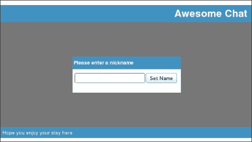
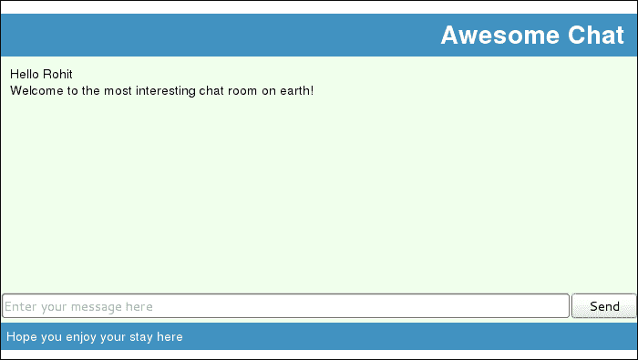
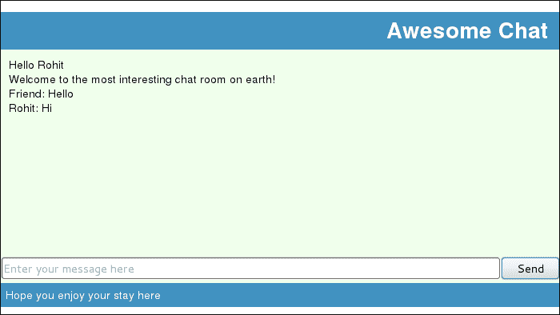
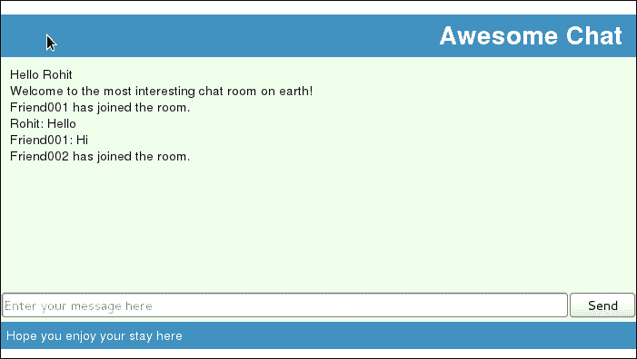
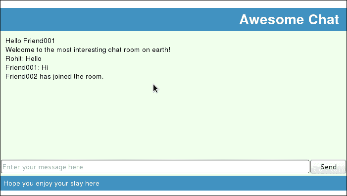
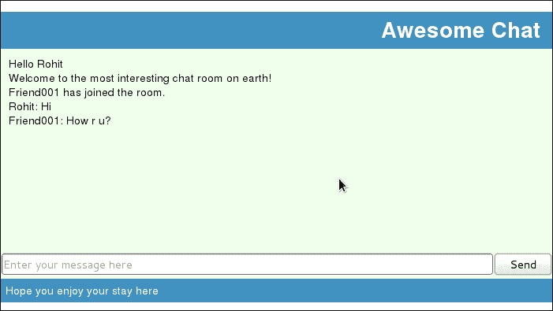
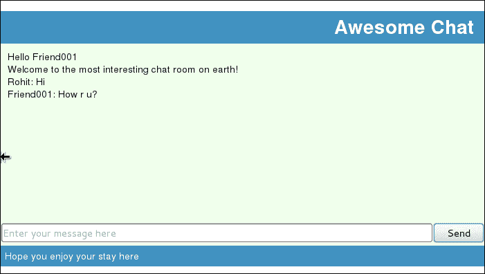
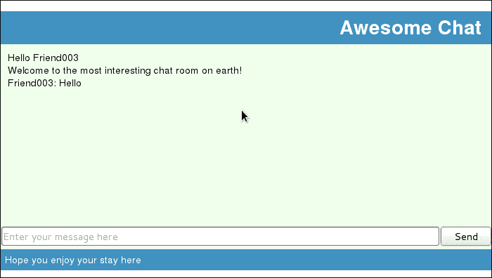
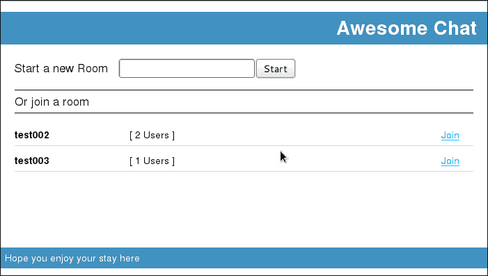

# 第四章：让它更有趣！

在上一章中，我们创建了一个聊天室。在本章中，我们将通过给我们的用户提供名字、拥有多个聊天室以及集成 express 和 socket.io 会话来改进这个聊天室。

# 为用户命名

如果我们的用户没有名字，聊天就会变得困难。无法识别谁发送了消息。所以让我们提供一个方法，让我们的用户可以为自己设置昵称，这样他们的消息就可以通过他们的名字来识别。

我们已经使用 socket.io 的`message`事件来发送和接收消息。我们还看到了 socket.io 模块的预定义事件。在本节中，我们将了解更多关于这些事件的信息，并了解我们如何处理我们自己的事件。我们还将了解如何为会话保存一些信息。

让我们首先创建一个用户界面，当用户来到我们的聊天室时，可以接受他们的名字。为此，我们将通过向其中添加以下代码来修改`index.jade`文件：

```js
//EXISTING LAYOUT
  section#nameform.modal
    div.backdrop
    div.popup
      div.pophead Please enter a nickname
      div.popbody
        input#nickname(type='text')
        input#setname(type='button', value='Set Name')
```

我们在这里所做的就是在`modal`覆盖层中添加一个新的部分。这个部分有一个背景`div`标签，然后是一个实际的表单`div`标签。这个外观和感觉将在`style.css`文件中定义，所以让我们也更新一下。在修改样式表时，请参考以下代码块：

```js
//EXISTING CSS
.modal{
  -moz-box-sizing: border-box;
  -webkit-box-sizing: border-box;
  box-sizing: border-box;
  -moz-box-sizing: border-box;
  height: -moz-calc(100% - 102px);
  height: -webkit-calc(100% - 102px);
  height: calc(100% - 102px);
  left: 0;
  position: absolute;
  top: 62px;
  width: 100%;
  z-index: 1000;
}

.backdrop{
  width: 100%;
  height:100%;
  background-color: #777777;
}

.popup {
  position: absolute;
  height: 100px;
  width: 300px;
  left: -moz-calc(50% - 150px);
  left: -webkit-calc(50% - 150px);
  left: calc(50% - 150px);
  top: -moz-calc(50% - 50px);
  top: -webkit-calc(50% - 50px);
  top: calc(50% - 50px);
  background: #FFFFFF;
}

.pophead {
  background-color: #4192C1;
  color: #FFFFFF;
  font-weight: bold;
  padding: 8px 3px;
  vertical-align: middle;
}

.popbody {
  padding: 10px 5px;
}
```

现在我们刷新 UI，它将看起来像这样：



用户名表单

接下来，我们想要做的是，当用户输入一个名字并点击**设置名字**按钮时，将名字发送到服务器，将其存储在那里，并在该用户发送的每条消息前加上名字前缀。首先，我们将更改文档就绪处理程序，为**设置名字**按钮附加一个事件处理器。为此，编辑`public/javascripts/chat.js`：

```js
$(function(){
  $('#setname').click(function(){
 socket.emit("set_name", {name: $('#nickname').val()});
  });
});
```

在之前的代码中，我们看到了一个新的 socket.io API 和概念，即`socket.emit`。这是用来触发自定义事件的。对`emit`的调用如下：

```js
socket.emit(<event_name>, <event_data>);
```

我们触发一个`set_name`事件，并将用户在用户名框中输入的值传递过去。我们还从`socket.emit`声明中移除了发送消息的事件处理器。我们稍后会回到这个话题。

在一个 socket 上发出的事件（服务器端）将在 socket 的另一侧（客户端）被处理。在我们的案例中，即在之前的代码片段中，我们在客户端触发`set_name`事件，所以我们将它在服务器端处理。为此，我们将编辑`routes/sockets.js`如下：

```js
var io = require('socket.io');

exports.initialize = function(server) {

  io = io.listen(server);

  io.sockets.on("connection", function(socket){

    socket.on('message', function(message){

      message= JSON.parse(message);

      if(message.type == "userMessage"){

        socket.get('nickname', function(err, nickname){

          message.username=nickname;

          socket.broadcast.send(JSON.stringify(message));

          message.type = "myMessage";

          socket.send(JSON.stringify(message));

        });        

      }

    });

 socket.on("set_name", function(data){

 socket.set('nickname', data.name, function(){

 socket.emit('name_set', data);

 socket.send(JSON.stringify({type:'serverMessage', 
 message: 'Welcome to the most interesting chat room on earth!'})); 

 });

 });

  });

}
```

在保持简单易用的实践中，socket.io 使用了相同的`socket.on` API，这是我们之前用来处理`connection`或`message`事件的，来处理自定义事件。传递给处理函数的数据将包含我们在触发事件时发送的数据。

这带我们来到了 socket.io 的一个新特性，即向会话中的 socket 附加额外的信息。这是通过使用`socket.set`函数实现的。对该函数的调用如下：

```js
socket.set(<name>, <value>, <optional_callback>);
```

在上一行代码中，`<name>` 是我们想要设置的键的名称，而 `<value>` 是我们想要设置的值。对 `set` 的调用是异步的；它不会在值被设置之前阻塞。为了执行一个需要确保值已经被设置的动作，我们可以向 `set` 方法传递一个回调函数。在之前的代码中，我们传递了一个 `callback` 函数，该函数将触发另一个 `name_set` 自定义事件，并且还会发送欢迎信息。就像 `set_name` 事件一样，`name_set` 事件将在套接字的另一端被处理，在这种情况下是客户端。

这太棒了。现在名字已经设置，让我们通过在每条消息中显示它来真正地使用它，这样我们聊天室中的人就知道是谁发送了消息。

要从套接字获取设置的值，socket.io 提供了一个 `get` 方法。我们将使用这个 `get` 方法从套接字获取用户名并将其附加到之前的消息上。

让我们重新整理 `public/javscripts/chat.js` 以处理 `name_set` 事件，然后开始实际的通信：

```js
var socket = io.connect('/');

socket.on('name_set', function(data){
 $('#nameform').hide();
 $('#messages').append('<div class="systemMessage">' + 
 'Hello '+data.name+'</div>');
  $('#send').click(function(){
    var data = {
      message: $('#message').val(),
      type:'userMessage'
    };
    socket.send(JSON.stringify(data));
    $('#message').val('');
  });
  socket.on('message', function (data) {
    data = JSON.parse(data);
 if(data.username){
 $('#messages').append('<div class="'+data.type+
 '"><span class="name">' + 
 data.username + ":</span> " + 
 data.message + '</div>');
    }else{
      $('#messages').append('<div class="'+data.type+'">' + 
                                                     data.message + '</div>');
    }
  });
});

$(function(){

  $('#setname').click(function(){

    socket.emit("set_name", {name: $('#nickname').val()});

  });

});
```

在之前的代码片段中，我们添加了两行新代码来隐藏覆盖层并将问候语附加到 `messages` 区域。除此之外，我们还把处理发送和接收消息的代码移动到这个处理器中，这样它就只在用户设置了名字之后设置，避免了人们使用 Firebug 或其他类似工具仅隐藏覆盖层。在消息接收处理器中还有一个最后的更改；我们需要检查传入数据中是否存在用户名，如果存在，则将其作为前缀附加到显示的消息中。

要看到代码的实际效果，让我们重新启动我们的 node 服务器并刷新浏览器。一旦你输入名字，它就会弹出聊天室并显示你刚刚输入的名字以及欢迎信息：



用名字打招呼

在另一个浏览器窗口中打开我们的聊天室，这次以 **Friend** 的身份登录。在新消息框中输入一条消息并点击 **发送**。消息会出现在两个浏览器中的消息区域。从你打开的第一个聊天室尝试：



命名聊天

# 更多关于事件

在上一节中，我们看到了如何通过套接字使用自定义事件。有趣的是，就像你的消息一样，事件也可以被广播。让我们看看我们如何使用事件广播来宣布聊天室中参与者的加入。

对于这个，我们首先要做的事情是从服务器开始触发一个新的 `user_entered` 事件，一旦用户加入聊天，数据中就包含用户的名字。让我们将我们的 `routes/socket.js` 文件更改一下以实现这一点。我们将在用户名设置后添加代码来广播 `user_entered` 事件。

```js
    socket.on("set_name", function(data){
      socket.set('nickname', data.name, function(){
         socket.emit('name_set', data);
     socket.send(JSON.stringify({type:'serverMessage', 
                  message: 'Welcome to the most interesting" +  
                                              "chat room on earth!'}));
 socket.broadcast.emit('user_entered', data);
      });
    });
```

要向连接到这个套接字的所有客户端发送广播，我们使用 `emit` 方法，但是在 `socket.broadcast` 而不是在 `socket` 本身上。该方法的签名是相同的。

现在，`user_entered`事件将被发送给所有已连接的客户端，因此我们需要在客户端的`chat.js`文件中添加一个事件处理器。

```js
socket.on('name_set', function(data){

  // EXISTING CODE

 socket.on("user_entered", function(user){
 $('#messages').append('<div class="systemMessage">' + 
 user.name + ' has joined the room.' + '</div>');
 });
});
```

在这里，我们为`user_entered`事件添加了一个事件处理器，并向用户显示消息。让我们再次启动我们的服务器并登录到我们的聊天室：



第一个用户的聊天室

现在打开另一个浏览器窗口，并使用不同的名字登录：



第二个用户的聊天室

如您将注意到的，在第一个用户的窗口中，我们将看到**Friend001**和**Friend002**的进入消息，以及在第二个用户（**Friend001**）的窗口中的**Friend002**。

# 与命名空间一起工作

在本节中，我们不会向我们的聊天室添加任何新的功能，而是仅仅使用 socket.io 的一个特性来使我们的应用程序设计更好，代码更容易维护。

我们在客户端和服务器之间发送不同的消息，并通过`type`来区分它们。如果我们能在不同的消息通道上发送不同的消息会更好吗？我们当前的方法也并不完美，可能会在应用程序或模块是更大系统的一部分时引起冲突。但是，也存在一些问题，打开多个连接的成本是什么？这将对性能产生什么影响？

这就是命名空间发挥作用的地方。命名空间提供了一种方式来扩展 socket.io 连接，这样我们就可以为不同类型的消息获得不同的通道，而不会给系统及其性能带来很大的开销。让我们看看我们如何在我们的聊天系统中使用命名空间。

在我们的聊天应用程序中，我们发送了两种不同类型的消息或事件。这些是基础设施性的，例如设置名字和欢迎消息，以及用户之间的通信。

因此，让我们继续创建两个命名空间，即`chat_com`和`chat_infra`。我们将在`chat_com`上发送通信消息（用户消息），在`chat_infra`上发送基础设施消息（欢迎、用户进入等）。为此，让我们首先编辑服务器上的`socket.js`文件：

```js
var io = require('socket.io');

exports.initialize = function (server) {
  io = io.listen(server);

 var chatInfra = io.of("/chat_infra")
 .on("connection", function(socket){
        socket.on("set_name", function (data) {
          socket.set('nickname', data.name, function () {
            socket.emit('name_set', data);
            socket.send(JSON.stringify({type:'serverMessage',
              message:'Welcome to the most interesting ' +
              'chat room on earth!'}));
            socket.broadcast.emit('user_entered', data);
          });
        });
      });

 var chatCom = io.of("/chat_com")
 .on("connection", function (
socket) {
        socket.on('message', function (message) {
          message = JSON.parse(message);
          if (message.type == "userMessage") {
            socket.get('nickname', function (err, nickname) {
              message.username = nickname;
              socket.broadcast.send(JSON.stringify(message));
              message.type = "myMessage";
              socket.send(JSON.stringify(message));
            });
          }
        });
      });
}
```

从前面的代码中我们可以看出，大部分代码保持不变，除了突出显示的片段和一些代码重组。

我们在这里所做的，是将消息和事件分离成两个与它们的命名空间相对应的代码块。我们使用`io.of`方法创建一个新的命名空间。在命名空间创建后，它可以像任何 socket 对象一样使用。

在我们的情况下，我们创建了两个命名空间，并为它们各自添加了一个`connection`事件处理器。一个用于`chat_infra`，如下面的代码片段所示：

```js
 var chatInfra = io.of("/chat_infra")
      .on("connection", function(socket){
```

以及另一个用于`chat_com`：

```js
 var chatCom = io.of("/chat_com")
      .on("connection", function (socket) {
```

一旦建立连接，我们将在`connection`事件处理程序中获得一个`socket`对象，我们将像之前一样使用它。对于`chat_infra`，我们添加所有不属于用户间通信的消息和事件：

```js
 socket.on("set_name", function (data) {
          socket.set('nickname', data.name, function () {
 socket.emit('name_set', data);
 socket.send(JSON.stringify({type:'serverMessage',
              message:'Welcome to the most interesting ' +
              'chat room on earth!'}));
 socket.broadcast.emit('user_entered', data);
          });
        });
```

因此，我们将`set_name`处理程序、`name_set`的事件发射器、`serverMessage`的消息以及`user_entered`的事件广播器移动到`chat_infra`命名空间。

```js
 socket.on('message', function (message) {
          message = JSON.parse(message);
          if (message.type == "userMessage") {
            socket.get('nickname', function (err, nickname) {
              message.username = nickname;
 socket.broadcast.send(JSON.stringify(message));
              message.type = "myMessage";
 socket.send(JSON.stringify(message));
            });
          }
        });
```

这就只留下了`chat_com`命名空间上的标准`User`消息组件。

让我们现在看看这如何影响我们的客户端代码：

```js
var chatInfra = io.connect('/chat_infra'),
 chatCom = io.connect('/chat_com');

chatInfra.on('name_set', function (data) {
 chatInfra.on("user_entered", function (user) {
    $('#messages').append('<div class="systemMessage">' + user.name
        + ' has joined the room.' + '</div>');
  });

 chatInfra.on('message', function (message) {
    var message = JSON.parse(message);
    $('#messages').append('<div class="' + message.type + '">'
        + message.message + '</div>');
  });

 chatCom.on('message', function (message) {
    var message = JSON.parse(message);
      $('#messages').append('<div class="' + 
    message.type + '"><span class="name">' +
     message.username + ':</span> ' +
           message.message + '</div>');
  });

  $('#nameform').hide();
  $('#messages').append('<div class="systemMessage">Hello ' +
     data.name + '</div>');

  $('#send').click(function () {
    var data = {
      message:$('#message').val(),
      type:'userMessage'
    };
 chatCom.send(JSON.stringify(data));
    $('#message').val('');
  });
});

$(function () {
  $('#setname').click(function () {
 chatInfra.emit("set_name", {name:$('#nickname').val()});
  });
});
```

在前面的代码中，我们看到的第一件和最重要的事情是我们正在连接两个套接字：

```js
var chatInfra = io.connect('/chat_infra'),
    chatCom = io.connect('/chat_com');
```

实际上，socket.io 将建立一个单一的套接字连接，并在其上多路复用两个命名空间。但建立这两个连接将使我们能够分别处理`chat_infra`和`chat_com`命名空间的消息或事件。

在下面的代码片段中，我们添加了对应于我们在服务器上添加的`chat_infra`发射器的处理程序。`name_set`处理程序将位于`chat_infra`命名空间：

```js
chatInfra.on('name_set', function (data) {
```

我们也将对`user_entered`处理程序做同样的事情：

```js
 chatInfra.on("user_entered", function (user) {
    $('#messages').append('<div class="systemMessage">' + user.name
        + ' has joined the room.' + '</div>');
  });
```

接下来，我们添加`on`处理程序以监听`chat_infra`上的消息；这将接收所有服务器消息：

```js
 chatInfra.on('message', function (message) {
    var message = JSON.parse(message);
    $('#messages').append('<div class="' + message.type + '">'
        + message.message + '</div>');
  });
```

我们还在`chat_infra`上发射`set_name`事件：

```js
    chatInfra.emit("set_name", {name:$('#nickname').val()});
```

在`chat_com`命名空间上，我们发送用户消息，如下面的代码所示：

```js
$('#send').click(function () {
    var data = {
      message:$('#message').val(),
      type:'userMessage'
    };
    chatCom.send(JSON.stringify(data));
```

此外，我们将使用以下代码片段将处理程序附加到接收从服务器中继的用户消息：

```js
 chatCom.on('message', function (message) {
    var message = JSON.parse(message);
      $('#messages').append('<div class="' + 
     message.type + '"><span class="name">' +
     message.username + ':</span> ' +
           message.message + '</div>');
  });
```

现在我们已经理解了命名空间并利用它们来清理我们的设计和代码，让我们继续添加一些新功能。

# 房间

在本节中，我们将使用 socket.io 的另一个多路复用功能，称为**房间**。我们将使用它来完成名字所描述的事情，创建房间。如果网络中的每个人都同一个聊天室聊天，聊天室将会非常嘈杂和混乱。因此，作为第一步，让我们将我们的聊天从网站首页移动到`/chatroom`。为此，我们应该将我们的代码从`index.jade`移动到`chatroom.jade`，并在`index.jade`中放入以下代码：

```js
extends layout

block content
  section#welcome
    div Welcome
    a#startchat(type="button", class="btn", href="/chatroom") Start now
```

基本上，我们将创建一个带有欢迎信息和进入聊天室链接的首页。让我们也在`style.css`中添加以下样式：

```js
#welcome div{
  font-family: fantasy;
  font-size: 100px;
  margin-left: 20px;
  margin-top: 100px;
}

.btn {
    background-color: #5BB75B;
    background-image: linear-gradient(to bottom, #62C462, #51A351);
    background-repeat: repeat-x;
    border-color: rgba(0, 0, 0, 0.1) rgba(0, 0, 0, 0.1) rgba(0, 0, 0, 0.25);
    color: #FFFFFF;
    text-shadow: 0 -1px 0 rgba(0, 0, 0, 0.25);
    border-image: none;
    border-radius: 4px 4px 4px 4px;
    border-style: solid;
    border-width: 1px;
    box-shadow: 0 1px 0 rgba(255, 255, 255, 0.2) inset, 
          0 1px 2px rgba(0, 0, 0, 0.05);
    cursor: pointer;
    display: inline-block;
    font-size: 14px;
    line-height: 20px;
    margin-bottom: 0;
    padding: 4px 12px;
    text-align: center;
    vertical-align: middle;
    position: absolute;
    right: 40px;
    bottom: 80px;
    text-decoration: none;
}
```

现在，我们的首页将如下所示：


首页

**立即开始**链接将带您进入聊天室，但目前那里还没有任何内容。因此，让我们修改我们的`routes/index.js`文件以提供`chatroom`服务。将以下片段添加到文件末尾：

```js
exports.chatroom = function(req, res){
  res.render('chatroom', { title: 'Express Chat' });
}
```

我们还必须在`app.js`中添加映射：

```js
app.get('/chatroom', routes.chatroom);
```

现在我们有了首页，我们准备添加多个房间。我们现在将添加对聊天室页面的支持，使其能够接受一个`room`参数，并在请求时连接到该房间。因此，连接到聊天室以进入的调用将如下所示：

```js
http://localhost:3000/chatroom?room=jsconf 
```

为了做到这一点，我们需要编辑我们的`chat.js`客户端脚本文件：

```js
var chatInfra = io.connect('/chat_infra'),
    chatCom = io.connect('/chat_com');

var roomName = decodeURI(
 (RegExp("room" + '=' + '(.+?)(&|$)').exec(location.search) 
 || [, null])[1]);

if (roomName) {
  chatInfra.on('name_set', function (data) {
 chatInfra.emit('join_room', {'name':roomName});

    //EXISTING CODE
  });
}

$(function () {
  $('#setname').click(function () {
    chatInfra.emit("set_name", {name:$('#nickname').val()});
  });
});
```

第一件事是解析 URL 查询以获取房间名称，以下是这样做的方式：

```js
var roomName = decodeURI(
 (RegExp("room" + '=' + '(.+?)(&|$)').exec(location.search) 
    || [, null])[1]);
```

在前面的代码中，我们创建了一个正则表达式来解析出`room=`和`&`之间或内容末尾之间的值。在下一行中，我们检查是否提供了房间名称，一旦用户输入了名称，我们就会加入房间。

要加入房间，我们通过`roomName`作为参数发出`join_room`事件。此事件将在服务器上被处理：

```js
if (roomName) {
  chatInfra.on('name_set', function (data) {
    chatInfra.emit('join_room', {'name':roomName});
```

由于我们只使用房间来限制广播消息（其他消息无论如何只发送到接收者的套接字），所以这就是我们在客户端需要做的所有事情。

现在，我们将编辑服务器上的`sockets.js`文件，以处理`chat_infra`上的`join_room`事件，并将广播更改以发送到它们打算发送的房间。让我们看看`sockets.js`中的更改：

```js
var io = require('socket.io');

exports.initialize = function (server) {
  io = io.listen(server);
 var self = this;

 this.chatInfra = io.of("/chat_infra");
 this.chatInfra.on("connection", function (socket) {
    //EXISTING CODE
    });
 socket.on("join_room", function (room) {
 socket.get('nickname', function (err, nickname) {
 socket.join(room.name);
 var comSocket = self.chatCom.sockets[socket.id];
 comSocket.join(room.name);
 comSocket.room = room.name;
 socket.in(room.name).broadcast
 .emit('user_entered', {'name':nickname});
 });
 });
  });

 this.chatCom = io.of("/chat_com");
 this.chatCom.on("connection", function (socket) {
    socket.on('message', function (message) {
      message = JSON.parse(message);
      if (message.type == "userMessage") {
        socket.get('nickname', function (err, nickname) {
          message.username = nickname;
 socket.in(socket.room).broadcast.send(JSON.stringify(message));
          message.type = "myMessage";
          socket.send(JSON.stringify(message));
        });
      }
    });
  });
}
```

因此，这带来了一些小的结构变化。由于我们需要在`chatInfra`中引用`chatCom`，我们将它们两个都添加到当前对象中，该对象也存储为自身，以便在闭包中可以访问。在`chat_infra`连接处理器中，我们为`join_room`注册了一个新的事件处理器：

```js
 socket.on("join_room", function (room) {
 socket.get('nickname', function (err, nickname) {
 socket.join(room.name);
 var comSocket = self.chatCom.sockets[socket.id];
 comSocket.join(room.name);
 comSocket.room = room.name;
 socket.in(room.name).broadcast
 .emit('user_entered', {'name':nickname});
 });
 });

```

在处理器中，我们接收到的`room`对象将包含要加入的房间名称。接下来，我们将`chat_infra`套接字连接到该房间。这是通过使用`socket`对象的`join`方法来完成的：

```js
        socket.join(room.name);
```

`join`方法接受一个表示房间的名称字符串。如果不存在，房间将被创建，否则套接字将连接到现有房间。

现在，一旦我们的客户端加入房间，它将获取`chat_infra`命名空间中针对特定房间的所有消息。但是，这在我们也在`chat_com`命名空间中加入房间之前是没有用的。为此，我们需要获取与`chat_com`命名空间中当前`socket`对象相对应的`socket`对象，然后在其上调用相同的`join`方法：

```js
 var comSocket = self.chatCom.sockets[socket.id];
        comSocket.join(room.name);
```

要获取`chat_com`上的相应`socket`对象，我们使用当前`socket`对象的 ID（因为它将是相似的）从`chatCom`命名空间对象的`sockets`数组中检索它。下一行只是调用它的`join`方法。现在，在两个命名空间中，两者都已加入房间。但是，当我们从`chat_com`命名空间接收消息时，我们需要知道这个套接字连接到的房间名称。为此，我们将`room`属性设置在`comSocket`对象上，指向它连接到的房间：

```js
    comSocket.room = room.name;
```

现在一切都已经设置好了，我们将在房间中宣布用户已加入：

```js
 socket.in(room.name).broadcast
 .emit('user_entered', {'name':nickname});
      });
```

如我们之前所做的那样，我们仍然使用`broadcast.emit`，但不是在套接字上调用它，而是限制它只发送到房间中，使用`in(room.name)`。我们做出的另一个改变将是通过限制广播消息只发送到房间来再次广播用户消息：

```js
  socket.in(socket.room).broadcast.send(JSON.stringify(message));
```

现在，您可以通过访问以下 URL 来打开聊天室：

```js
http://localhost:3000/chatroom?room=test001 
```

在两个浏览器窗口中打开此链接并使用不同的名称登录。在另一个浏览器窗口中使用以下链接打开另一个聊天房间：

```js
http://localhost:3000/chatroom?room=test002
```

只在房间 `test001` 中发送的消息和警报将在前两个浏览器中可见，而连接到 `test002` 的用户将无法看到它们：



用户一连接到房间 test001

这是第二个用户连接到房间 `test001` 的截图：



用户二连接到房间 test001

在下面的屏幕截图中，可以看到第三个用户已连接到房间 `test002`：



用户三连接到房间 test002

# 列出房间

既然我们支持创建多个房间，让我们继续添加一个页面来列出、加入和创建新的房间。我们将首先添加一个名为 `rooms.jade` 的 Jade 视图，其代码如下：

```js
extends layout

block append head
  script(type='text/javascript', src='/socket.io/socket.io.js')
  script(type='text/javascript', src='/javascripts/rooms.js')

block content
  section#chatrooms
    div#new_room
      span Start a new Room
      input#new_room_name(type="text")
      input#new_room_btn(type="button", value="Start")
    div#allrooms
      div#header Or join a room
      div#rooms_list
```

此视图有一个输入框用于接受新的房间名称，以及一个 `div` 标签用于添加现有房间的列表。我们还添加了 `socket.io.js` 的脚本以及一个新的客户端代码脚本文件，用于列出房间，名为 `rooms.js`。接下来，创建 `rooms.js` 脚本文件，其代码如下：

```js
var chatInfra = io.connect('/chat_infra');

chatInfra.on("connect", function(){
 chatInfra.emit("get_rooms", {});
 chatInfra.on("rooms_list", function(rooms){
    for(var room in rooms){
      var roomDiv = '<div class="room_div"><span class="room_name">'     + room + '</span><span class="room_users">[ ' 
           + rooms[room] + ' Users ] </span>'
           + '<a class="room" href="/chatroom?room=' + room 
           + '">Join</a></div>';

      $('#rooms_list').append(roomDiv);
    }
  });
});

$(function(){
  $('#new_room_btn').click(function(){
 window.location = '/chatroom?room=' + 
 $('#new_room_name').val();
  });
});
```

在前面的代码中，我们基于 `chat_infra` 命名空间进行连接，请求其上的聊天房间，并在视图中渲染它们。让我们快速看一下这里发生的一个重要步骤：

```js
  chatInfra.emit("get_rooms", {});
```

如前述代码所示，连接后我们首先向 `get_rooms` 发射一个事件。这将请求从服务器获取房间列表。接下来，我们设置一个监听器来接收房间列表并将其渲染：

```js
   chatInfra.on("rooms_list", function(rooms){
```

在处理程序中，如以下代码块所示，我们正在遍历房间及其中的用户数量映射，并将其追加到房间列表中：

```js
for(var room in rooms){
      var roomDiv = '<div class="room_div"><span class="room_name">'     + room + '</span><span class="room_users">[ ' 
           + rooms[room] + ' Users ] </span>'
           + '<a class="room" href="/chatroom?room=' + room 
           + '">Join</a></div>';

      $('#rooms_list').append(roomDiv);
    }
```

最后，我们有创建新房间的代码。要创建新房间，我们只需将聊天房间重定向到带有新房间名称的 URL 参数：

```js
  $('#new_room_btn').click(function(){
 window.location = '/chatroom?room=' + 
 $('#new_room_name').val();
  });
```

接下来，我们需要在服务器上添加一个 `get_rooms` 处理程序来返回房间列表。为此，我们将在 `sockets.js` 中的 `chat_infra` 命名空间上添加处理程序：

```js
this.chatInfra.on("connection", function (socket) {
    //EXISTING CODE

    socket.on("get_rooms", function(){
      var rooms = {};
 for(var room in io.sockets.manager.rooms){
        if(room.indexOf("/chat_infra/") == 0){
          var roomName = room.replace("/chat_infra/", "");
 rooms[roomName] = io.sockets.manager
 rooms[room].length;
        }
      }
 socket.emit("rooms_list", rooms);
    });
  });
```

我们可以使用 `io.sockets.manager` 获取所有房间的列表，然后我们可以通过遍历列表来构建客户端期望的映射。在我们的例子中，我们过滤以仅获取 `chat_infra` 中的房间，因为它们也将创建在 `chat_com` 中，我们不希望有重复。一旦我们有了映射，我们将将其作为 `rooms_list` 发射。在此之后，我们需要将条目添加到我们的 `routes/index.js` 文件中，如下所示：

```js
exports.rooms = function(req, res){
  res.render('rooms', { title: 'Express Chat' });
}
```

我们还需要在 `app.js` 中添加映射，以便将服务器房间添加到 `/rooms`：

```js
app.get('/rooms', routes.rooms);
```

最后，让我们在我们的新房间页面 `style.css` 中添加一些 CSS 样式：

```js
#chatrooms{
    margin: 20px;
}

#new_room {
    font-size: 17px;
}

#new_room span{
    padding-right: 15px;
}

#allrooms #header{
    border-bottom: 1px solid;
    border-top: 1px solid;
    font-size: 17px;
    margin-bottom: 10px;
    margin-top: 16px;
    padding: 5px 0;
}

.room_div {
    border-bottom: 1px solid #CCCCCC;
    padding-bottom: 5px;
    padding-top: 12px;
}

.room_name {
    display: inline-block;
    font-weight: bold;
    width: 165px;
}

.room_div a{
    position: absolute;
    right: 40px;
}
```

前往 `/rooms` 并创建一些房间，然后当你在新浏览器中打开房间页面时，你会看到如下类似的内容：



我们聊天服务器上的房间列表

# 分享会话

现在我们支持多个房间，但每次进入房间时都输入昵称非常麻烦。让我们修改我们的系统，在进入系统时只接受一次昵称，并在所有房间中使用它。

为了这个目的，让我们首先修改登录页面，添加一个输入框来接受昵称，并添加一个 JavaScript 文件来添加逻辑：

```js
extends layout

block append head
 script(type='text/javascript', src='/javascripts/landing.js')

block content
  section#welcome
    div Welcome
 span
 input#nickname(type="text", 
 placeholder="Enter a nickname")
      a#startchat(class="btn") Login
```

在这里，在之前的代码中，我们添加了一个脚本条目来添加 `landing.js`，并将**立即开始**按钮替换为输入名字的字段和**登录**按钮。接下来，让我们看一下 `landing.js`：

```js
$(function(){
   $('#startchat').click(function(){
 document.cookie = "nickname=" + $('#nickname').val() 
 + ";; path=/";
     window.location = "/rooms";
   });
});
```

在之前的代码中，我们为 `startchat` 按钮附加了一个 `click` 处理器。在处理器中，我们将用户输入的昵称添加到 cookie 中，并将用户重定向到 `/rooms`。在连接 socket 时，我们将读取这个 cookie 信息，并将其设置在 socket 上。在 socket 连接中可以访问这个 cookie 信息之前，我们需要做一些准备工作来在 Express.js 应用程序中启用 cookies。为此，通过以下代码块编辑 `app.js` 代码：

```js
var express = require('express')
  , routes = require('./routes')
  , http = require('http')
  , path = require('path')
 , connect = require('connect');

var app = express();

var sessionStore = new connect.session.MemoryStore();

app.configure(function(){
  //EXISTING CODE
  app.use(express.bodyParser());
 app.use(express.cookieParser('somesuperspecialsecrethere'));
 app.use(express.session({ key: 'express.sid', 
 store: sessionStore}));
  app.use(express.methodOverride());
  app.use(app.router);
  app.use(express.static(path.join(__dirname, 'public')));
});

//EXISTING CODE
```

第一步是在 `package.json` 文件中添加 `connect` 作为依赖项，并在 `app.js` 中添加 `require` 关键字。`connect` 关键字用于创建会话存储；在这种情况下，一个内存会话存储：

```js
var sessionStore = new connect.session.MemoryStore();
```

我们还在 Express 应用程序中启用了 `cookieParser` 中间件和 `session` 模块。Express 的 `cookieParser` 中间件将接受一个 `secret` 参数，该参数将用于加密 cookies。Express 的 `session` 模块在传递给它密钥（`express.sid` 是会话的密钥）和会话应该维护的存储位置时初始化。在下面的代码中，我们传递给它一个内存存储，这是我们之前步骤中创建的：

```js
  app.use(express.bodyParser());
 app.use(express.cookieParser('somesuperspecialsecrethere'));
 app.use(express.session({ key: 'express.sid', 
 store: sessionStore}));
  app.use(express.methodOverride());
  app.use(app.router);
```

关于之前代码的一个重要注意事项是添加这两个中间件组件的顺序。这些应该在添加 `bodyParser` 中间件之后和添加 `router` 中间件之前添加。如果你现在打开浏览器并浏览到登录页面，你可以在浏览器调试工具的 **Cookies** 选项卡下看到带有 `express.sid` 键的 cookie。如果你输入一个名字并点击**进入**按钮，你将再次看到一个新的 cookie，其名称为你的昵称：

```js
var io = require('socket.io');

exports.initialize = function (server) {
  io = io.listen(server);

 io.set('authorization', function (data, accept) {
 if (data.headers.cookie) {
 data.cookie = require('cookie').parse(data.headers.cookie);
 data.sessionID = data.cookie['express.sid'].split('.')[0];
 data.nickname = data.cookie['nickname'];
 } else {
 return accept('No cookie transmitted.', false);
 }
 accept(null, true);
 });

  var self = this;

  this.chatInfra = io.of("/chat_infra");
  this.chatInfra.on("connection", function (socket) {
 socket.on("join_room", function (room) {
 var nickname = socket.handshake.nickname;
 socket.set('nickname', nickname, function () {
 socket.emit('name_set', {'name':
 socket.handshake.nickname});
 socket.send(JSON.stringify({type:'serverMessage',
 message:'Welcome to the most interesting ' +
 'chat room on earth!'}));
         socket.join(room.name);
         var comSocket = self.chatCom.sockets[socket.id];
         comSocket.join(room.name);
         comSocket.room = room.name;
         socket.in(room.name).broadcast.emit('user_entered', 
                      {'name':nickname});
      });
    });

    //EXISTING CODE
}
```

之前代码块中的第一个更改介绍了 socket.io 中的一个新功能；这个更改在以下突出显示的代码块中显示：

```js
 io.set('authorization', function (data, accept) {
 if (data.headers.cookie) {
 data.cookie = require('cookie').parse(data.headers.cookie);
 data.sessionID = data.cookie['express.sid'].split('.')[0];
 data.nickname = data.cookie['nickname'];
 } else {
 return accept('No cookie transmitted.', false);
 }
 accept(null, true);
  });
```

在这个代码片段中，我们为 socket 设置了一个 `authorization` 方法。这个方法将获取两个参数，包含所有 HTTP 请求信息的数据和 `accept` 方法回调。当请求 socket.io 连接但尚未建立连接时，将调用 `authorization` 方法。

我们可以使用这个方法来实际执行授权，但在这个案例中，我们只是用它来从 cookies 中获取昵称，因为这是唯一一个带有 HTTP 数据的 socket.io 方法。

我们正在从 HTTP 数据中读取 cookie 头信息，并使用`cookie`模块的`parse`方法对其进行解析。从 cookie 中，我们提取`sessionID`值和昵称，并将其设置到`data`对象中。这个对象作为`handshake`属性在 socket 上可用。最后，我们将调用`accept`回调函数，该函数接受两个参数，第一个是消息，另一个是布尔变量，指示授权是否成功。

我们将移除`set_name`处理器，因为这个处理器不需要被调用，因为我们已经拥有了这个名字。我们将把`set_name`处理器中的逻辑移动到`join_room`处理器：

```js
 socket.on("join_room", function (room) {
 var nickname = socket.handshake.nickname;
 socket.set('nickname', nickname, function () {
 socket.emit('name_set', {'name': nickname});
 socket.send(JSON.stringify({type:'serverMessage',
 message:'Welcome to the most interesting ' +
 'chat room on earth!'}));
         socket.join(room.name);
         var comSocket = self.chatCom.sockets[socket.id];
         comSocket.join(room.name);
         comSocket.room = room.name;
         socket.in(room.name).broadcast.emit('user_entered', 
                      {'name':nickname});
      });
    });
```

在`join_room`处理器中，我们将从`socket.handshake`映射中获取昵称，并将其设置为 socket 上的一个属性。在设置`nickname`属性时，我们仍然会触发`name_set`事件，以将客户端上的更改保持在最小：

```js
var chatInfra = io.connect('/chat_infra'),
    chatCom = io.connect('/chat_com');

var roomName = decodeURI((RegExp("room" + '=' + '(.+?)(&|$)').exec(location.search) || [, null])[1]);

if (roomName) {
 chatInfra.emit('join_room', {'name':roomName});

  chatInfra.on('name_set', function (data) {
  //EXISTING CODE
  });
}
```

由于`join_room`处理器是服务器上房间的初始化器，我们将它从`name_set`处理器中移除，并在页面加载期间直接调用它。其余的代码保持不变。

要尝试这段代码，您需要打开两个不同的浏览器或在不同匿名会话中的浏览器，因为对于同一浏览器，cookie/sessions 将会被共享。

# 摘要

在本章中，我们学习了如何为会话设置数据，如何处理命名空间和房间，以及如何与 express 会话集成。在这里，我们已经完成了一个良好且可工作的聊天系统。基于我们在这里学到的概念，构建更多功能将是一个很好的练习。可以构建的一些有趣的功能包括用户存在警报、房间用户列表、私密聊天等。在下一章中，我们将探讨 socket.io 协议及其工作原理。
