# 第七章。获取资源

在本章中，我们将涵盖以下主题：

+   获取远程资源

+   使用 `FetchEvent` 获取

+   在服务工作者安装期间获取 JSON 文件

+   代理

+   预加载

# 简介

在本章中，我们将探讨如何从不同的来源请求文件和资源，这在更技术性的术语中是对不同资源执行获取操作。我们将查看在服务工作者安装期间获取 JSON 文件，使用服务工作者作为代理中间件，并在安装过程中预加载一系列特定的资源 URL，以便在加载页面之前手头就有这些资源。

让我们从查看一个简单的例子开始，这个例子展示了从两个不同的资源中获取资源。

# 获取远程资源

获取远程资源可以通过不同的方式完成。在本食谱中，我们将探讨使用服务工作者以两种标准方式获取远程资源，一种是有**跨源 HTTP 请求**（**CORS**），另一种则没有。

你可以在以下链接中了解更多关于 CORS 的信息：

[`developer.mozilla.org/en-US/docs/Web/HTTP/Access_control_CORS`](https://developer.mozilla.org/en-US/docs/Web/HTTP/Access_control_CORS)

## 准备工作

要开始使用服务工作者，你需要在浏览器设置中开启服务工作者实验功能。如果你还没有这样做，请参考第一章的第一个食谱，*学习服务工作者基础*：*设置服务工作者*。服务工作者仅在 HTTPS 上运行。要了解如何设置支持此功能的发展环境，请参考第一章的*设置 GitHub 页面以支持 SSL*食谱。

## 如何操作...

按照以下说明设置你的文件结构：

1.  从以下位置复制 `index.html`、`index.js`、`service-worker.js` 和 `style.css` 文件：

    [`github.com/szaranger/szaranger.github.io/blob/master/service-workers/07/01/`](https://github.com/szaranger/szaranger.github.io/blob/master/service-workers/07/01/)

1.  打开浏览器并转到 `index.html`。你会看到两个来自不同协议（`https` 和 `https-acao`）的图片：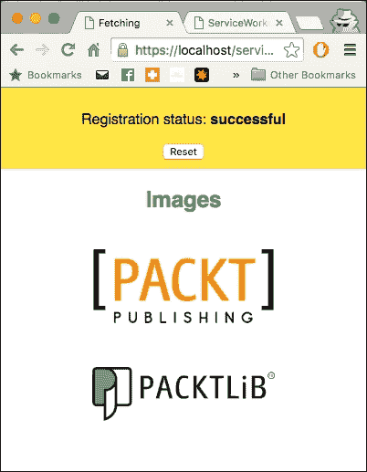

## 它是如何工作的...

在 `index.js` 文件的开始部分，我们正在测试两种不同的协议来加载资源：

+   `https`：带有**安全套接字层**（**SSL**）协议的 HTTP

+   `https-acao`: 带有 `Access-Control-Origin=*` 头的 SSL 协议

我们将使用两个不同的 URL，这些 URL 将被多次加载：

```js
var protocols = {
  'https-acao': 'https://i942.photobucket.com/albums/ad261/szaranger/Packt/packt-logo.png',
  'https': 'https://dz13w8afd47il.cloudfront.net/sites/all/themes/packt_v4/images/packtlib-logo-dark.png'
};
```

我们还将使用两种不同的方法来获取资源，一种是有 CORS，另一种则没有：

```js
navigator.serviceWorker.getRegistration().then(function(registration) {
  var fetchModes = ['cors', 'no-cors'];
```

接下来，我们将检查服务工作者是否已注册：

```js
if (!registration || !navigator.serviceWorker.controller) {  
    navigator.serviceWorker.register(
    './service-worker.js').then(function() {
      console.log('Service worker registered, reloading the page');
      window.location.reload();
    });
```

如果不是这样，我们将注册它并重新加载页面以确保客户端处于服务工作者的控制之下：

```js
for (var protocol in protocols) {
  if (protocols.hasOwnProperty(protocol)) {
    buildImage(protocol, protocols[protocol]);

    for (var i = 0; i < fetchModes.length; i++) {
      var fetchMode = fetchModes[i],
      init = { 
        method: 'GET',
        mode: fetchMode,
        cache: 'default' 
      };

    }
  }
}
```

两个 `for` 循环遍历提供的协议数组并对每个协议进行请求。它们还使用每个 URL 构建一个 DOM 图像元素，并遍历 `fetchModes` 数组的每个模式。

`init` 对象包含你可能想要应用于请求的任何自定义设置。让我们看看 `init` 对象的属性：

+   `method`: 请求方法，例如，`GET` 和 `POST`

+   `mode`: 你想要用于请求的模式，例如，`cors`、`no-cors` 或 `same-origin`

+   `cache`: 你想要用于请求的缓存模式，例如 `default`、`no-store`、`reload`、`no-cache`、`force-cache` 或 `only-if-cached`

`buildImage` 函数接受两个参数，`protocol` 和 `url`。它动态创建一个图像元素，并将 URL 作为该图像的源。然后它继续将该图像添加到 DOM 树中，其中 ID 是 `https-acao-image`、`https-image` 或 `http–image` 之一。在此点，JavaScript 对 URL 处理没有控制权；浏览器处理 URL：

```js
function buildImage(protocol, url) {
  var element = protocol + '-image',
    image = document.createElement('img');

  image.src = url;
  document.getElementById(element).appendChild(image);
}
```

只有 HTTPS 请求的图像将被渲染，因为服务工作者只支持通过 SSL 的连接。

带有 `Access-Control-Origin=*` 头部（访问控制允许源）的 SSL 请求将成功返回结果。

默认情况下，如果第三方 URL 不支持 CORS，则从第三方 URL 获取资源将失败。你可以在请求中添加非 CORS 选项来克服这一点。然而，这将导致一个不透明的响应，这意味着你将无法判断响应是否成功。

`fireRequest` 函数接受三个参数，`fetchMode`、`protocol` 和 `init`。此函数返回另一个函数，我们可以将其作为组合调用。我们从直接从远程资源获取指定的资源开始：

```js
 fetch(url, init).then(function(response) {
    printSuccess(response, url, section);
 }).catch(function(error) {
    printError(error, url, section);
 });
```

如果获取成功，我们将它打印到控制台并在网页上记录。如果请求失败，也适用同样的方法，只是这次我们打印错误。

辅助函数 log 通过 ID 查找 DOM 元素，并添加一个段落元素以及一个类属性来描述消息的类型：

```js
function log(id, message, type) {
  var type = type || 'success',
    sectionElement = document.getElementById(id),
    logElement = document.createElement('p');

  if (type) {
    logElement.classList.add(type);
  }
  logElement.textContent = message;
  sectionElement.appendChild(logElement);
}
```

在 `index.html` 文件中，我们在头部部分有样式声明：

```js
<style>
.error {
     color: #FF0000;
   }
   .success {
     color: #00FF00;
   }
</style>
```

在我们的 `log()` 函数中，我们将未定义类型设置为成功，以便当我们将其添加到 `classList` 时，它将显示绿色。错误类型将显示红色，如前面声明的样式。

# 使用 FetchEvent 进行获取

`FetchEvent` 类是一个在服务工作者上分发的获取动作。它包含有关请求以及响应的详细信息。它提供了所有重要的 `FetchEvent.reponseWith()` 方法，我们可以使用这些方法向由服务工作者控制页面提供响应。

## 准备中

要开始使用服务工作者，你需要在浏览器设置中开启服务工作者实验功能。如果你还没有这样做，请参考第一章的第一个菜谱，*学习服务工作者基础*：*设置服务工作者*。服务工作者仅在 HTTPS 上运行。要了解如何设置支持此功能的发展环境，请参考第一章的以下菜谱，*学习服务工作者基础*：*设置 GitHub 页面以支持 SSL*，*在 Windows 上设置 SSL*，和*在 Mac 上设置 SSL*。

## 如何操作...

按照以下说明设置你的文件结构：

1.  从以下位置复制`index.html`，`index.js`，`service-worker.js`，`adeobe-log.png`和`style.css`文件：

    [`github.com/szaranger/szaranger.github.io/blob/master/service-workers/07/02/`](https://github.com/szaranger/szaranger.github.io/blob/master/service-workers/07/02/)

1.  打开浏览器并转到`index.html`：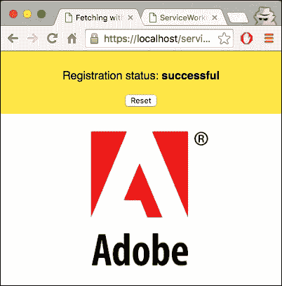

1.  打开开发者工具栏（*Cmd* + *Alt* + *I* 或 *F12*）。现在刷新页面并查看控制台中的消息。你将看到 fetch 请求被记录在控制台中：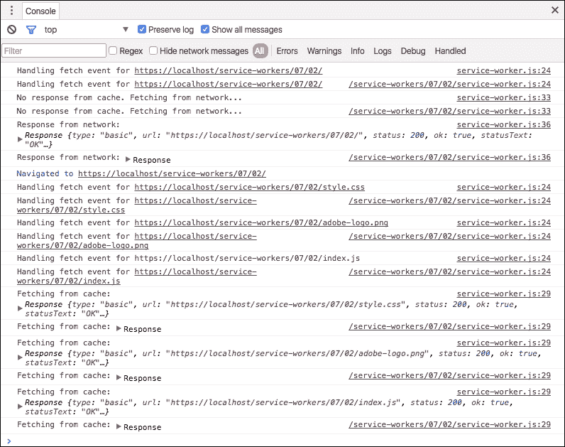

## 它是如何工作的...

我们只是将服务工作者 fetch 事件处理程序中的不同阶段打印到控制台。我们的`service-worker.js`文件的 fetch 方法看起来如下：

```js
var cacheName= 'fetch-event-cache';

self.addEventListener('install', function(event) {
  event.waitUntil(
    caches.open(cacheName)
      .then(function(cache) {
        return cache.addAll([
          'adobe-logo.png',
          'style.css',
          'index.html',
          'index.js',
          'style.css'
        ]);
      })
      .then(function() {
        return self.skipWaiting();
      })
  );
});

self.addEventListener('fetch', function(event) {
  console.log('Handling fetch event for', event.request.url);

  event.respondWith(
    caches.match(event.request).then(function(res) {
      if (res) {
        console.log('Fetching from cache:', res);

        return res;
      }
      console.log('No response from cache. Fetching from network...');

      return fetch(event.request).then(function(res) {
        console.log('Response from network:', res);

        return res;
      }).catch(function(error) {
        console.error('ERROR: Fetching failed:', error);

        throw error;
      });
    })
  );
});
```

让我们更详细地讨论一些这些 API 方法。

### Cache.addAll()

此方法接受一个 URL 数组，检索响应，然后将该结果添加到指定的缓存。在我们的例子中，指定的缓存是`'fetch-event-cache'`：

```js
var cacheName= 'fetch-event-cache';
```

### ExtendableEvent.waitUntil()

此方法延长了事件的寿命。在我们的例子中，我们等待资源被缓存：

```js
.then(function(cache) {
        return cache.addAll([
          'adobe-logo.png',
          'style.css',
          'index.html',
          'index.js',
          'style.css'
        ]);
      })
```

### FetchEvent.respondWith()

此方法通过返回一个`Response`对象或网络错误到`Fetch`对象来解析：

```js
event.respondWith(
    caches.match(event.request).then(function(res) {
```

# 在服务工作者安装期间获取 JSON 文件

在这个菜谱中，我们将学习如何通过指定 JSON 文件中资源文件的名称来使用 JSON 文件缓存资源文件。通常，这是通过在服务工作者 JavaScript 文件中保持一个数组来完成的，但你可能希望它们位于单独的位置，例如出于版本控制的原因。

## 准备工作

要开始使用服务工作者，你需要在浏览器设置中开启服务工作者实验功能。如果你还没有这样做，请参考第一章的第一个配方，*学习服务工作者基础*：*设置服务工作者*。服务工作者仅在 HTTPS 上运行。要了解如何设置支持此功能的发展环境，请参考第一章的以下配方：*设置 GitHub 页面以支持 SSL*，*在 Windows 上设置 SSL*，以及*在 Mac 上设置 SSL*。

## 如何操作...

按照以下说明设置你的文件结构：

1.  从以下位置下载所有文件：

1.  [`github.com/szaranger/szaranger.github.io/blob/master/service-workers/07/03/`](https://github.com/szaranger/szaranger.github.io/blob/master/service-workers/07/03/)

1.  打开浏览器并转到`index.html`文件：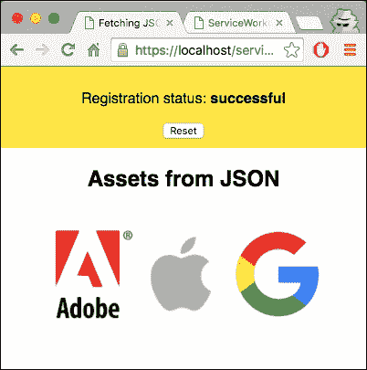

1.  现在打开开发者工具（*Cmd* + *Alt* + *I* 或 *F12*）并确保点击了**保留日志**复选框。现在刷新页面，你会看到从缓存检索文件的日志消息：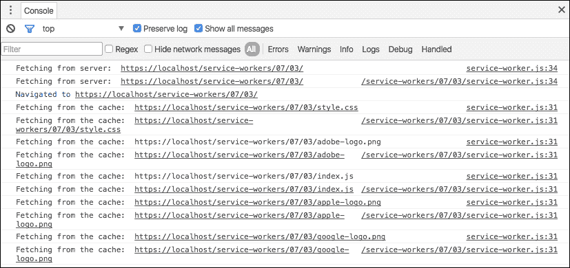

1.  如果你查看**资源**选项卡，你会看到缓存的资源：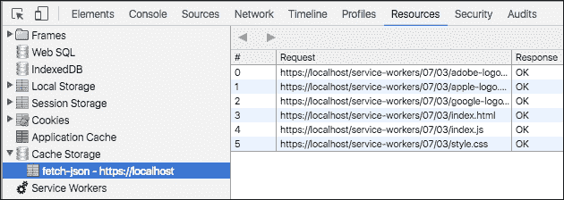

## 它是如何工作的...

我们只需要执行一个动作，即在初始加载时缓存资源和注册服务工作者。因此，在安装时，我们加载 JSON 文件，解析 JSON，并将文件添加到缓存中。我们的`service-worker.js`文件看起来像这样：

```js
var cacheName= 'fetch-json';

self.addEventListener('install', function(event) {
  event.waitUntil(
    caches.open(cacheName)
      .then(function(cache) {
        return fetch('files.json').then(function(response) {
          return response.json();
        }).then(function(files) {
          console.log('Installing files from JSON file: ', files);
          return cache.addAll(files);
        });
      })
      .then(function() {
        console.log(
          'All resources cached'
        );

        return self.skipWaiting();
      })
  );
});
```

如果在缓存中找到响应，则返回：

```js
self.addEventListener('fetch', function(event) {
  event.respondWith(
    caches.match(event.request)
      .then(function(response) {
        if (response) {
          console.log('Fetching from the cache: ', event.request.url);
          return response;
        } else {
          console.log('Fetching from server: ', event.request.url);
        }
       return fetch(event.request);
     }
   )
 );
});
```

客户端声明服务工作者：

```js
self.addEventListener('activate', function(event) {
   console.log('Activating the service worker!');
   event.waitUntil(self.clients.claim());
}); 
```

我们将在`files.json`文件中列出资源文件名：

```js
[
  "adobe-logo.png",
  "apple-logo.png",
  "google-logo.png",
  "style.css",
  "index.html",
  "index.js",
  "style.css"
]
```

我们将在`index.html`文件中添加一个用于图像的部分：

```js
<section>
    <h2>Assets from JSON</h2>
    
    
    
</section>
```

# 代理

代理是网络浏览器和互联网之间的中介。在本教程中，我们将学习如何使用服务工作者作为代理中间件。

## 准备工作

要开始使用服务工作者，你需要在浏览器设置中开启服务工作者实验功能。如果你还没有这样做，请参考第一章的第一个配方，*学习服务工作者基础*：*设置服务工作者*。服务工作者仅在 HTTPS 上运行。要了解如何设置支持此功能的发展环境，请参考以下配方：*设置 GitHub 页面以支持 SSL*，*在 Windows 上设置 SSL*，以及*在 Mac 上设置 SSL*。

## 如何操作...

按照以下说明设置你的文件结构：

1.  从以下位置下载所有文件：

    [`github.com/szaranger/szaranger.github.io/blob/master/service-workers/07/04/`](https://github.com/szaranger/szaranger.github.io/blob/master/service-workers/07/04/)

1.  打开浏览器并转到`index.html`：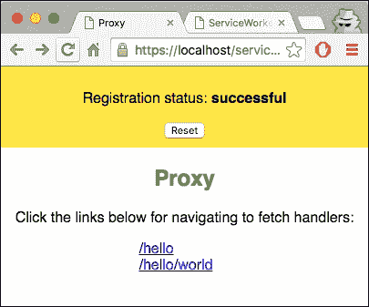

1.  现在点击第一个链接导航到`/hello`链接：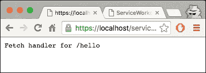

1.  现在打开开发者工具(*Cmd* + *Alt* + *I* 或 *F12*)，在**控制台**标签页查看日志消息：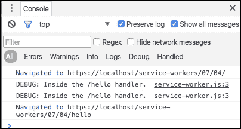

1.  现在点击第一个链接导航到`/hello/world`链接：

## 它是如何工作的...

我们在计划创建代理的`index.html`文件中添加了两个链接：

```js
<section >
    <h1>Proxy</h1>
    <p>Click the links below for navigating to fetch handlers:</p>
    <div class="links">
      <a href="/service-workers/07/04/hello">/hello</a><br />
      <a href="/service-workers/07/04/hello/world">/hello/world</a>
    </div>
</section>
```

我们在`service-worker.js`文件中为请求本地 URL 创建了一个代理，包含一个`hello`字符串以及`hello/world`。客户端会将其识别为本地资源：

```js
var helloFetchHandler = function(event) {
  if (event.request.url.indexOf('/hello') > 0) {
    console.log('DEBUG: Inside the /hello handler.');
    event.respondWith(new Response('Fetch handler for /hello'));
  }
};

var helloWorldFetchHandler = function(event) {
  if (event.request.url.endsWith('/hello/world')) {
    console.log('DEBUG: Inside the /hello/world handler.');
    event.respondWith(new Response('Fetch handler for /hello/world'));
  }
};
```

我们将这些处理程序作为回调函数传递给 fetch 事件监听器：

```js
var fetchHandlers = [helloWorldFetchHandler, helloFetchHandler];

fetchHandlers.forEach(function(fetchHandler) {
  self.addEventListener('fetch', fetchHandler);
}); 
```

# 预取

在服务工作者安装阶段预取资源可以轻松实现网站的离线查看。在本食谱中，我们将探讨预取包括页面和图像在内的资源。

## 准备工作

要开始使用服务工作者，你需要在浏览器设置中开启服务工作者实验功能。如果你还没有这样做，请参考第一章的第一个食谱，*学习服务工作者基础*：*设置服务工作者*。服务工作者仅在 HTTPS 上运行。要了解如何设置支持此功能的发展环境，请参考以下食谱：*设置 GitHub 页面以支持 SSL*，*设置 Windows 的 SSL*，和*设置 Mac 的 SSL*。

## 如何操作...

按照以下说明设置你的文件结构：

1.  从以下位置下载所有文件：

1.  [`github.com/szaranger/szaranger.github.io/blob/master/service-workers/07/05/`](https://github.com/szaranger/szaranger.github.io/blob/master/service-workers/07/05/)

1.  打开浏览器并转到`index.html`文件：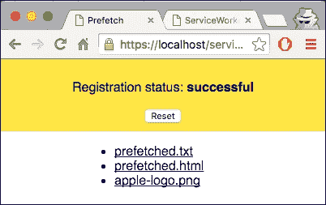

1.  打开开发者工具栏(*Cmd* + *Alt* + *I* 或 *F12*)，查看控制台中的消息。你会看到资源已被成功缓存：

1.  现在通过在开发者工具的**网络**标签页选择离线来离线：

1.  现在点击**prefetched.txt**链接。链接的文本文件将在新标签页中打开：

1.  点击**prefetched.html**链接。链接的页面将在新标签页中打开：

1.  点击**apple-log.png**链接。链接的图片将在新标签页中打开：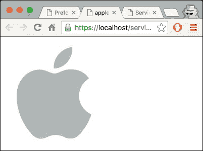

1.  如果你检查控制台，你会找到链接是从缓存中提供的：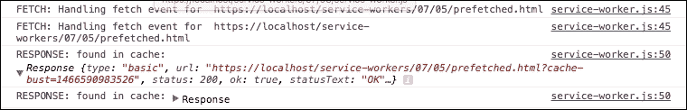

## 它是如何工作的...

在`index.html`文件中，我们添加了一个包含指向预取文件的链接的部分：

```js
  <section id="prefetched">
    <ul>
      <li><a href="prefetched.txt" target="_blank">prefetched.txt</a></li>
      <li><a href="prefetched.html" target="_blank">prefetched.html</a></li>
      <li><a href="apple-logo.png" target="_blank">apple-logo.png</a></li>
    </ul>
  </section>
```

在 `service-worker.js` 文件中，我们在顶部声明缓存版本，以防您需要强制服务工作者控制的页面使用新的缓存：

```js
var cacheName= 'cache';
var currentCaches = {
  prefetch: 'prefetch-' + cacheName
};
```

我们还列出了要缓存的资源：

```js
var prefetchedURLs = [
    'prefetched.txt',
    'prefetched.html',
    'apple-logo.png'
];
```

以下行将根据我们提供的列表构建一个新的 URL，使用服务工作者脚本的当前位置作为其基础：

```js
  var url = new URL(prefetchedURLs, location.href);
```

接下来，我们在查询字符串中添加一个缓存破坏时间戳：

```js
url.search += (url.search ? '&' : '?') + 'cache-bust=' + Date.now();
```

如果有可能服务器不支持 CORS，则必须确保指定 `{mode: 'no-cors'}`：

```js
var request = new Request(url, {mode: 'no-cors'});
```

接下来，我们获取资源并将它们缓存起来：

```js
return fetch(request).then(function(res) {
    if (res.status >= 400) {
        throw new Error('FAIL: request for ' + prefetchedURLs +
        ' failed, status ' + res.statusText);
    }
    console.log('CACHING: Caching');
    return cache.put(prefetchedURLs, res);
}).catch(function(err) {
    console.error('CACHING: Not caching ' + prefetchedURLs + ' due to ' + err);
});
```

现在让我们看看激活事件处理器。我们确保删除所有不在我们最初声明的 `currentChaches` 对象中的缓存：

```js
    self.addEventListener('activate', function(evt) {
        var expectedCacheNames = Object.keys(currentCaches).map(function(key) {
            return currentCaches[key];
        });

        evt.waitUntil(
            caches.keys().then(function(cacheNames) {
              return Promise.all(
                cacheNames.map(function(cacheName) {
                  if (expectedCacheNames.indexOf(cacheName) === -1) {
                    console.log('DELETE: out of date cache:', cacheName);
                    return caches.delete(cacheName);
                  }
                })
              );
            })
        );
    });
```

获取事件监听器是服务工作者查找缓存资源的地方：

```js
self.addEventListener('fetch', function(evt) {
  console.log('FETCH: Handling fetch event for ', evt.request.url);

  evt.respondWith(
    caches.match(evt.request).then(function(res) {
      if (res) {
        console.log('RESPONSE: found in cache:', res);

        return res;
      }

      console.log('RESPONSE: not found in cache. Fetching from network.');

      return fetch(evt.request).then(function(res) {
        console.log('RESPONSE: from network:', res);

        return res;
      }).catch(function(error) {
        console.error('FAIL: fetching :', error);

        throw error;
      });
    })
  );
});
```
