# 第九章. 查看通用用法

在本章中，我们将涵盖以下主题：

+   立即控制页面

+   处理缓慢的响应

+   传递消息

+   使用服务工作者作为代理中间件

+   使用带有实时流程图的服务工作者

# 简介

在本章中，我们将探讨一些服务工作者可能变得有用的场景。这些场景可能属于通用类别。我们将在此处查看的示例可以用作构建其他服务工作者功能的基础。

# 立即控制页面

这个简单的配方将演示如何让服务工作者立即控制页面，而无需等待导航事件。

## 准备工作

要开始使用服务工作者，你需要在浏览器设置中开启服务工作者实验功能。如果你还没有这样做，请参考第一章中的*设置服务工作者*配方，*学习服务工作者基础*。服务工作者仅在 HTTPS 上运行。要了解如何设置支持此功能的发展环境，请参考第一章中的*设置 GitHub 页面以支持 SSL*配方，*学习服务工作者基础*。

## 如何操作...

按照以下说明设置你的文件结构：

1.  从以下位置复制 `index.html`、`index.js`、`service-worker.js` 和 `style.css` 文件：

    [`github.com/szaranger/szaranger.github.io/blob/master/service-workers/09/01/`](https://github.com/szaranger/szaranger.github.io/blob/master/service-workers/09/01/)

1.  打开浏览器并访问 `index.html`。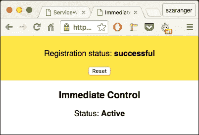

1.  刷新页面。服务工作者的状态将显示在屏幕上。

## 它是如何工作的...

在我们的 `index.html` 文件中，我们将添加一个部分来显示服务工作者的状态。

```js
<section>
    <h3>Immediate Control</h3>
    <p>Status: 
        <strong><span id="control-status"></span></strong>
    </p>
</section>
```

在 `index.js` 文件的开始处，我们将检查注册状态并将其打印到屏幕上。

```js
if (registration.installing) {
    serviceWorker = registration.installing;
    document.querySelector('#control-status')
    .textContent = 'Installing';
} else if (registration.waiting) {
    serviceWorker = registration.waiting;
    document.querySelector('#control-status')
    .textContent = 'Waiting';
} else if (registration.active) {
    serviceWorker = registration.active;
    document.querySelector('#control-status')
    .textContent = 'Active';
}
```

接下来，在 `service-worker.js` 文件中，我们将调用 `skipWaiting()` 以启用更新的服务工作者在存在与更新版本不同的现有服务工作者时立即激活。

```js
if (typeof self.skipWaiting === 'function') {
  console.log('self.skipWaiting()');
  self.addEventListener('install', function(evt) {
    evt.waitUntil(self.skipWaiting());
  });
} else {
  console.log('self.skipWaiting() is unsupported.');
}

if (self.clients && (typeof self.clients.claim === 'function')) {
  console.log('self.clients.claim()');
  self.addEventListener('activate', function(evt) {
    evt.waitUntil(self.clients.claim());
  });
} else {
  console.log('self.clients.claim() is unsupported.');
}
```

# 处理缓慢的响应

服务工作者缓慢的更新是模拟服务器缓慢响应时间的好方法。在这个配方中，我们将使用超时来模拟缓慢的响应。

## 准备工作

要开始使用服务工作者，你需要在浏览器设置中开启服务工作者实验功能。如果你还没有这样做，请参考第一章中的第一个配方，*学习服务工作者基础*：*设置服务工作者*。服务工作者仅在 HTTPS 上运行。要了解如何设置支持此功能的发展环境，请参考第一章中的以下配方：*为 GitHub 页面设置 SSL*、*为 Windows 设置 SSL*和*为 Mac 设置 SSL*。

## 如何做...

按照以下说明设置你的文件结构：

1.  从以下位置复制 `index.html`、`index.js`、`service-worker.js`、`manifest.json`、`server.js`、`package.json` 和 `style.css` 文件：

    [`github.com/szaranger/szaranger.github.io/blob/master/service-workers/09/02/`](https://github.com/szaranger/szaranger.github.io/blob/master/service-workers/09/02/)

1.  打开浏览器并转到 index.html。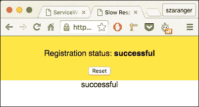

1.  打开开发者工具栏（*Cmd* + *Alt* + *I* 或 *F12*）。现在刷新页面，查看控制台中的消息。你会看到服务工作者生命周期方法被记录到控制台中。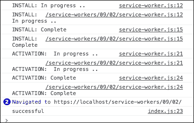

1.  刷新页面。服务工作者将显示在屏幕上的消息。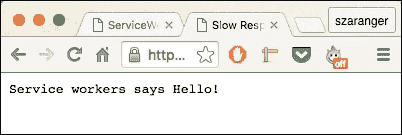

## 它是如何工作的...

在 `index.js` 文件中，我们将在服务工作者注册的点将控制台消息附加到屏幕上。

```js
function printStatus(status) {
    document.querySelector('#status').innerHTML = status;
    document.body.appendChild(document.createTextNode(Array.prototype.join.call(arguments, ", ") + '\n'));

    console.log.apply(console, arguments); 
}
```

接下来，在 `service-worker.js` 文件中，我们将创建一个函数来延迟我们接收到的任何新承诺。

```js
function wait(ms) {
  return new Promise(function(resolve) {
    setTimeout(resolve, ms);
  });
}
```

常规的生命周期方法将调用 `wait` 函数来延迟 `install`、`activate` 和 `fetch` 状态。

```js
self.addEventListener('install', function(evt) {
  console.log('INSTALL: In progress ..');
  evt.waitUntil(
    wait(DELAY).then(function() {
      console.log('INSTALL: Complete');
    })
  );
});

self.addEventListener('activate', function(evt) {
  console.log('ACTIVATION: In progress ..');
  evt.waitUntil(
    wait(DELAY).then(function() {
      console.log('ACTIVATION: Complete');
    })
  );
});

self.addEventListener('fetch', function(evt) {
  evt.respondWith(new Response("Service workers says Hello!"));
});
```

# 中继消息

服务工作者可以用来在你的浏览器中构建一个小型聊天消息功能。这个配方展示了如何通过在将要用于构建我们的小型聊天应用之间的页面中中继消息，通过页面和服务工作者之间进行通信。

## 准备工作

要开始使用服务工作者，你需要在浏览器设置中开启服务工作者实验功能。如果你还没有这样做，请参考第一章中的*设置服务工作者*配方，*学习服务工作者基础*。服务工作者仅在 HTTPS 上运行。要了解如何设置支持此功能的发展环境，请参考第一章中的*为 GitHub 页面设置 SSL*配方，*学习服务工作者基础*。

## 如何做...

按照以下说明设置你的文件结构：

1.  从以下位置复制 `index.html`、`index.js`、`service-worker.js`、`manifest.json`、`package.json` 和 `style.css` 文件：

    [`github.com/szaranger/szaranger.github.io/blob/master/service-workers/09/03/`](https://github.com/szaranger/szaranger.github.io/blob/master/service-workers/09/03/)

1.  打开浏览器并访问 `index.html`。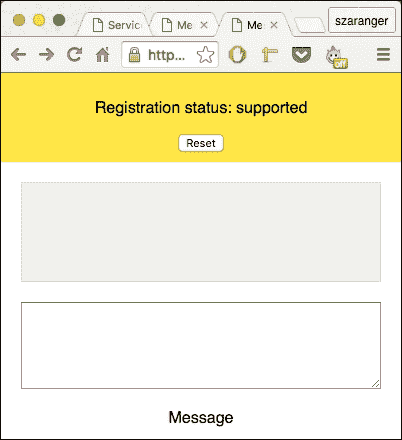

1.  现在打开另一个浏览器并访问 `index.html`。在文本区域中输入一些内容。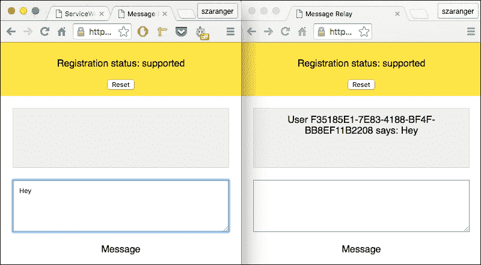

1.  现在打开另一个浏览器并访问 `index.html`。在文本区域中输入一些内容。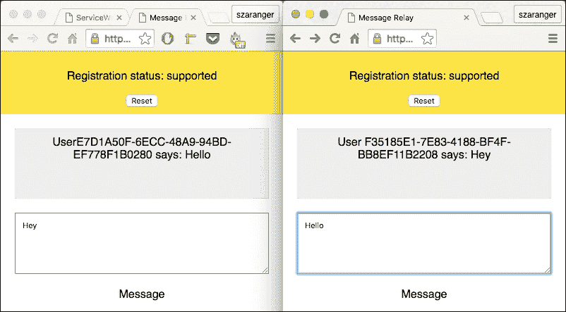

## 它是如何工作的...

在 `index.js` 文件的开始处，我们查询 UI 的 DOM 节点。

```js
  if (navigator.serviceWorker) {
    var message = document.querySelector('#message');
    var received = document.querySelector('#received');
    var status = document.querySelector('#status');
    var inbox = {};
```

我们然后监听任何服务工作者消息。当收到消息时，我们指定一个 DOM 元素来显示它。

```js
navigator.serviceWorker.addEventListener('message', function(evt) {

      var userId = evt.data.client;
      var node;

      if (!inbox[userId]) {
        node = document.createElement('div');
        received.appendChild(node);
        inbox[userId] = node;
      }

      node = inbox[userId];
      node.textContent = 'User ' + userId + ' says: ' + evt.data.message;
});
```

当页面强制重新加载时，例如，服务工作者将不会发送任何消息。

```js
message.addEventListener('input', function() {
      if (!navigator.serviceWorker.controller) {
        status.textContent = 'ERROR: no controller';
        return;
      }

      navigator.serviceWorker.controller.postMessage(message.value);
});
```

`service-worker.js` 文件包含消息的事件处理器。

```js
self.addEventListener('message', function(event) {

  var promise = self.clients.matchAll()
  .then(function(clientList) {
    var senderID = event.source ? event.source.id : 'unknown';

    if (!event.source) {
      console.log('Unsure about the sender');
    }

    clientList.forEach(function(client) {
      if (client.id === senderID) {
        return;
      }
      client.postMessage({
        client: senderID,
        message: event.data
      });
    });
  });

  if (event.waitUntil) {
    event.waitUntil(promise);
  }
});
```

立即声明将确保用户不必刷新页面。

```js
self.addEventListener('activate', function(event) {
  event.waitUntil(self.clients.claim());
});
```

在 `index.html` 文件中，我们添加一个 div、一个文本区域和一个段落标签用于消息。

```js
<section class="message">
    <div id="received"></div>

    <textarea id="message" style="width: 90%;padding: 10px;" rows="5"></textarea>
    <p>Message</p>
</section>
```

# 使用服务工作者作为代理中间件

代理是网络浏览器和互联网之间的中介。在这个菜谱中，你将学习如何使用服务工作者作为代理中间件。

## 准备工作

要开始使用服务工作者，你需要在浏览器设置中开启服务工作者实验功能。如果你还没有这样做，请参考 第一章 的第一个菜谱，*学习服务工作者基础*：*设置服务工作者*。服务工作者仅在 HTTPS 上运行。要了解如何设置支持此功能的发展环境，请参考 第一章 中的以下菜谱，*学习服务工作者基础*：*设置 GitHub pages for SSL*、*设置 Windows 的 SSL* 和 *设置 Mac 的 SSL*。

## 如何操作...

按照以下说明设置你的文件结构：

1.  从以下位置下载所有文件：

    [`github.com/szaranger/szaranger.github.io/blob/master/service-workers/09/04/`](https://github.com/szaranger/szaranger.github.io/blob/master/service-workers/09/04/)

1.  打开浏览器并访问 `index.html`。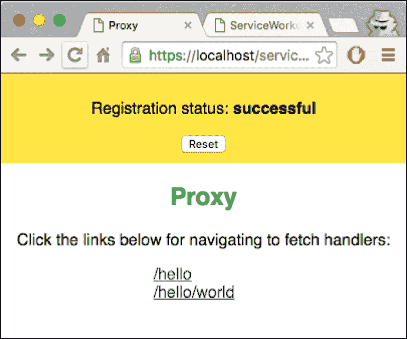

1.  现在点击第一个链接以导航到 `/hello` 链接。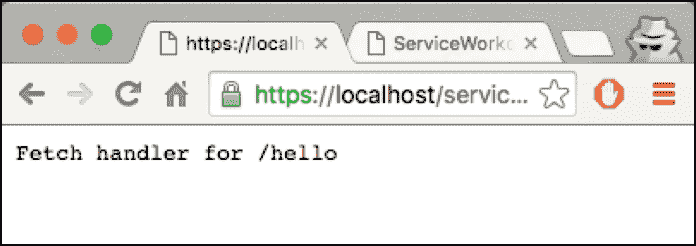

1.  现在打开开发者工具 (*Cmd* + *Alt* + *I* 或 *F12*)，在 **控制台** 选项卡上查看日志消息。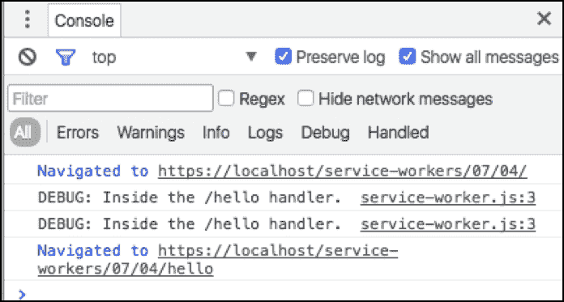

1.  现在点击第一个链接以导航到 `/hello/world` 链接。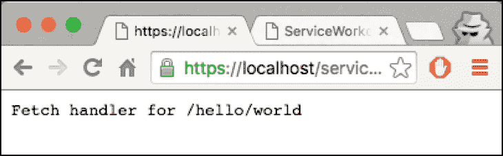

## 它是如何工作的...

我们将在计划创建代理的 `index.html` 文件中添加两个链接。

```js
<section >
    <h1>Proxy</h1>
    <p>Click the links below for navigating to fetch handlers:</p>
    <div class="links">
      <a href="/service-workers/07/04/hello">/hello</a><br />
      <a href="/service-workers/07/04/hello/world">/hello/world</a>
    </div>
</section>
```

我们将在 `service-worker.js` 文件中创建一个代理，该文件包含一个 `hello` 字符串以及 `hello/world`。客户端将将其识别为本地资源。

```js
var helloFetchHandler = function(event) {
  if (event.request.url.indexOf('/hello') !== -1) {
    console.log('DEBUG: Inside the /hello handler.');
    event.respondWith(new Response('Fetch handler for /hello'));
  }
};

var helloWorldFetchHandler = function(event) {
  if (event.request.url.endsWith('/hello/world')) {
    console.log('DEBUG: Inside the /hello/world handler.');
    event.respondWith(new Response('Fetch handler for /hello/world'));
  }
};
```

我们将这些处理程序作为回调传递给 fetch 事件监听器。

```js
var fetchHandlers = [helloWorldFetchHandler, helloFetchHandler];

fetchHandlers.forEach(function(fetchHandler) {
  self.addEventListener('fetch', fetchHandler);
}); 
```

# 使用带有实时流程图的服务工人

在本配方中，你将通过演示工作流程并记录步骤来学习如何使用服务工人，以便我们可以跟随流程。

我们将要实现的功能如下：

+   一个用于注册服务工人的按钮

+   一个用于重新加载文档的按钮

+   一个用于注销服务工人的按钮

按钮可以按任何顺序按下。你也可以指定服务工人脚本 URL 和作用域来模拟不同的测试用例。

## 准备工作

要开始使用服务工人，你需要在浏览器设置中开启服务工人实验功能。如果你还没有这样做，请参考第一章的*设置服务工人*配方，*学习服务工人基础*。服务工人仅在 HTTPS 上运行。要了解如何设置支持此功能的发展环境，请参考第一章的*设置 GitHub 页面以支持 SSL*配方，*学习服务工人基础*。

## 如何操作...

按照以下说明设置你的文件结构：

1.  从以下位置下载文件：

    [`github.com/szaranger/szaranger.github.io/blob/master/service-workers/08/05/`](https://github.com/szaranger/szaranger.github.io/blob/master/service-workers/08/05/)

1.  打开浏览器并转到`index.html`。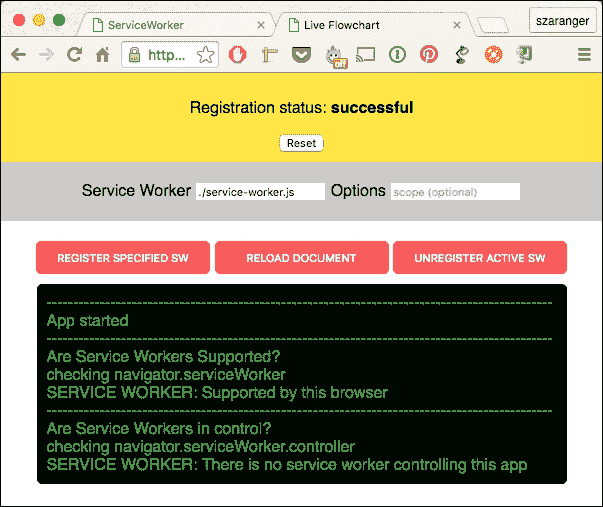

1.  现在打开开发者工具 (*Cmd* + *Alt* + *I* 或 *F12*) 以查看**控制台**选项卡上的日志消息。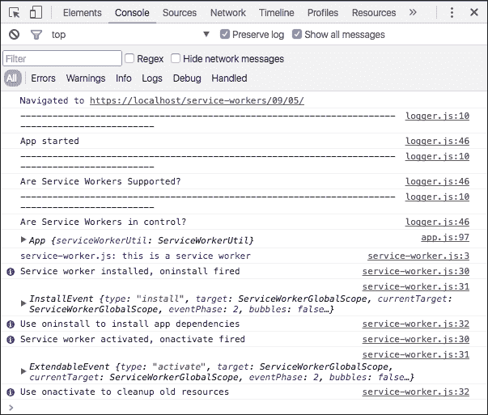

1.  现在点击**注册指定 SW**按钮。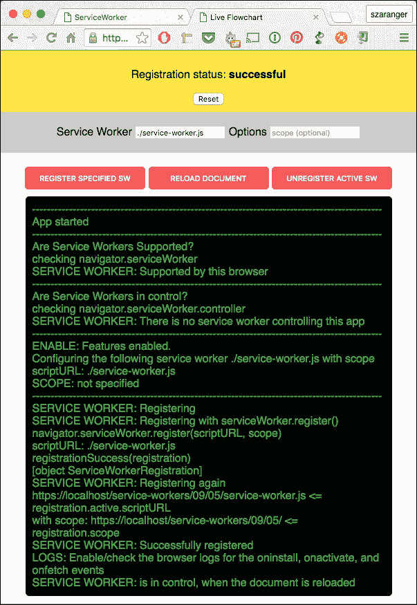

1.  现在打开开发者工具 (*Cmd* + *Alt* + *I* 或 *F12*) 以查看**控制台**选项卡上的日志消息。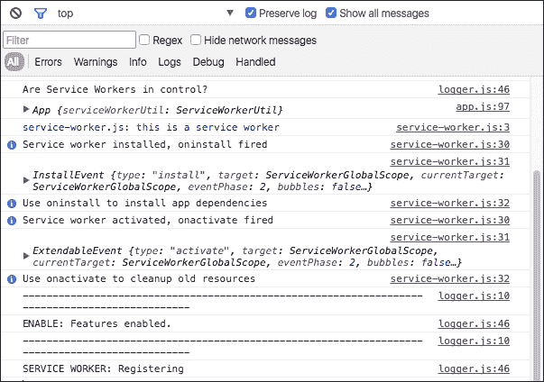

1.  现在点击**重新加载文档**按钮。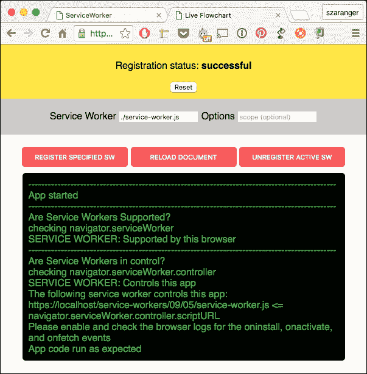

1.  现在打开开发者工具 (*Cmd* + *Alt* + *I* 或 *F12*) 以查看**控制台**选项卡上的日志消息。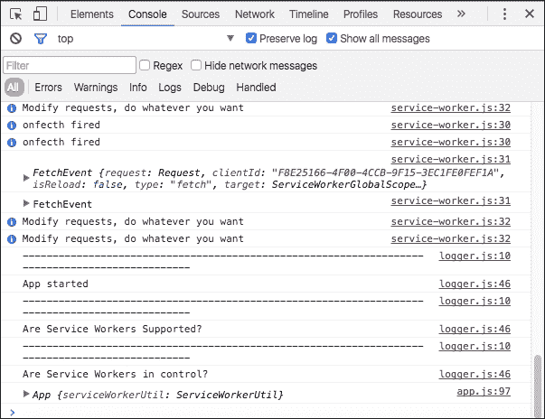

1.  现在点击**注销活动 SW**按钮。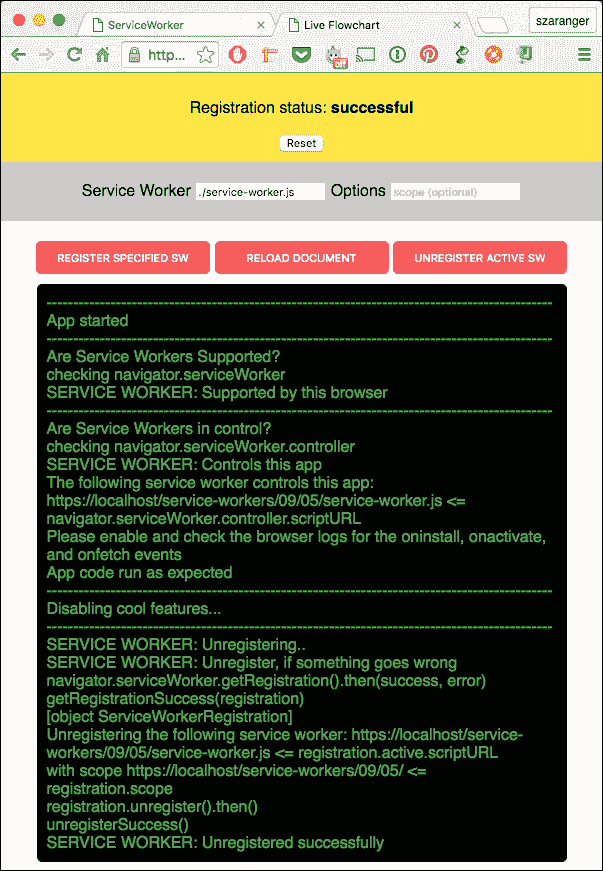

1.  现在打开开发者工具 (*Cmd* + *Alt* + *I* 或 *F12*) 以查看**控制台**选项卡上的日志消息。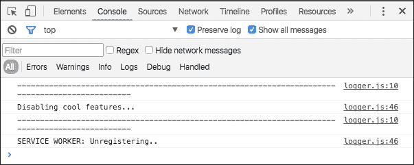

## 它是如何工作的...

在`app.js`文件的开始处，我们初始化服务工人的辅助工具。

```js
this.serviceWorkerUtil = new ServiceWorkerUtil();
```

要注册服务工人，我们执行以下步骤：

```js
document.getElementById('reloadapp').addEventListener('click', function() {
    window.location.reload();
  });
```

然后，我们检查是否支持服务工人。

```js
if (this.serviceWorkerUtil.isServiceWorkerSupported()) {
    document.getElementById('swinstall').addEventListener('click',
      function() {
        self.enableFeatures();
      }
    );

    document.getElementById('swuninstall').addEventListener('click',
      function() {
        self.disableFeatures();
      }
    );
```

接下来，我们检查服务工人是否处于控制状态。

```js
if (this.serviceWorkerUtil.isServiceWorkerControllingThisApp()) {
      Logger.info('App code run as expected');

      this.disableSWRegistration();
    } else {
      this.enableSWRegistration();
    }
```

现在我们尝试注册服务工人以启用功能。

```js
App.prototype.enableFeatures = function enableFeatures() {
  var scriptURL;
  var scope;

  Logger.newSection();
  Logger.log('ENABLE: Features enabled.');

  scriptURL = document.getElementById('swscripturl');
  scope = document.getElementById('swscope');

  Logger.debug(
    'Configuring the following service worker ' + scriptURL.value +
    ' with scope ' + scope.value
  );

  if (scriptURL.value !== '') {
    Logger.debug('scriptURL: ' + scriptURL.value);
  } else {
    Logger.error('No SW scriptURL specified');
    return;
  }

  if (scope.value !== '') {
    Logger.debug('SCOPE: ' + scope.value);
  } else {
    Logger.warn('SCOPE: not specified');
  }

  this.serviceWorkerUtil.registerServiceWorker(scriptURL.value, scope.value).then(
      this.disableSWRegistration,
      this.enableSWRegistration
  );
};
```

我们将禁用用户注销服务工人的可能性。

```js
App.prototype.enableSWRegistration = function() {
  document.getElementById('swinstall').disabled = false;
  document.getElementById('swuninstall').disabled = true;
};

App.prototype.disableSWRegistration = function() {
  document.getElementById('swinstall').disabled = true;
  document.getElementById('swuninstall').disabled = false;
};
```

因此，应用程序开始运行。

```js
var app = new App();

console.debug(app);
```

在`service-worker.js`文件中，我们接收有效负载并为注册推送事件添加事件监听器。

```js
'use strict';

self.addEventListener('push', function(event) {
  event.waitUntil(
    self.clients.matchAll().then(function(clients) {

      var focused = clients.some(function(client) {
        return client.focused;
      });

      var notificationMessage;

      if (focused) {
        notificationMessage = 'Same Page';
      } else if (clients.length > 0) {
        notificationMessage = 'Diffrerent Page, ' +
                              'click here to gain focus';
      } else {
        notificationMessage = 'Page Closed, ' +
                              'click here to re-open it!';
      }

      return self.registration.showNotification('ServiceWorker Cookbook', {
        body: notificationMessage,
      });
    })
  );
});
```

在`index.html`文件中，我们将添加一个部分来显示按钮和控制台。

```js
<section class="playground">
    <div class="inputs">
        <span class="title">Service Worker</span>
        <input id="swscripturl" placeholder="SW path" value="./service-worker.js" />
        <span class="title">Options </span>
        <input id="swscope" placeholder="scope (optional)" />
    </div>
    <div class="actions">
        <button id="swinstall" disabled>Register specified SW</button>
        <button id="reloadapp">Reload document</button>
        <button id="swuninstall" disabled>Unregister active SW</button>
    </div>
    <div id="log" class="log"></div>
</section>
```
