# 第十章. 提高性能

在本章中，我们将涵盖以下主题：

+   从缓存执行网络请求

+   从网络执行网络请求

+   测试`waitUntil`

+   实现后台同步

+   发送转发请求

+   避免模型获取和渲染时间

# 简介

在本章的最后，我们将探讨如何通过服务工作者来提高性能。现在，我们将探讨提高从缓存和网络中执行网络请求的领域，实现后台同步，发送转发请求，以及避免模型获取和渲染时间。

# 从缓存中执行网络请求

如果你经常访问某个网站，那么你可能会从你的缓存而不是服务器本身加载大部分资源，如 CSS 和 JavaScript 文件。这为我们节省了服务器必要的带宽以及网络请求。控制我们从缓存和服务器中提供哪些内容是一个巨大的优势。服务器工作者通过给我们程序性地控制内容来提供这个强大的功能。在本食谱中，我们将探讨通过创建性能艺术事件查看器网络应用程序来实现这一目标的方法。

## 准备工作

要开始使用服务工作者，你需要在浏览器设置中开启服务工作者实验功能。如果你还没有这样做，请参考第一章中的*设置服务工作者*食谱，*学习服务工作者基础*。服务工作者仅在 HTTPS 上运行。要了解如何设置开发环境以支持此功能，请参考以下第一章中的食谱：*设置 GitHub 页面以支持 SSL*，*在 Windows 上设置 SSL*，以及*在 Mac 上设置 SSL*。

## 如何做...

按照以下说明设置你的文件结构。

1.  从以下位置下载文件：

    [`github.com/szaranger/szaranger.github.io/blob/master/service-workers/10/01/`](https://github.com/szaranger/szaranger.github.io/blob/master/service-workers/10/01/)

1.  打开浏览器并转到`index.html`。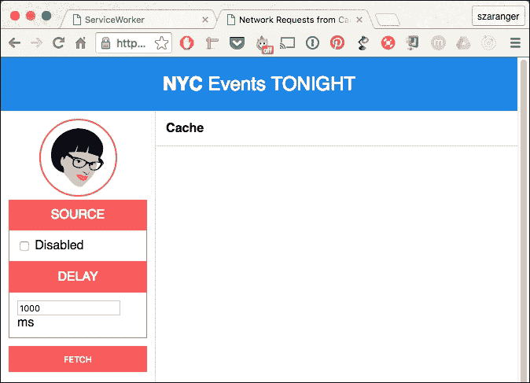

1.  首先，我们将启用缓存从网络请求数据。点击**获取**按钮。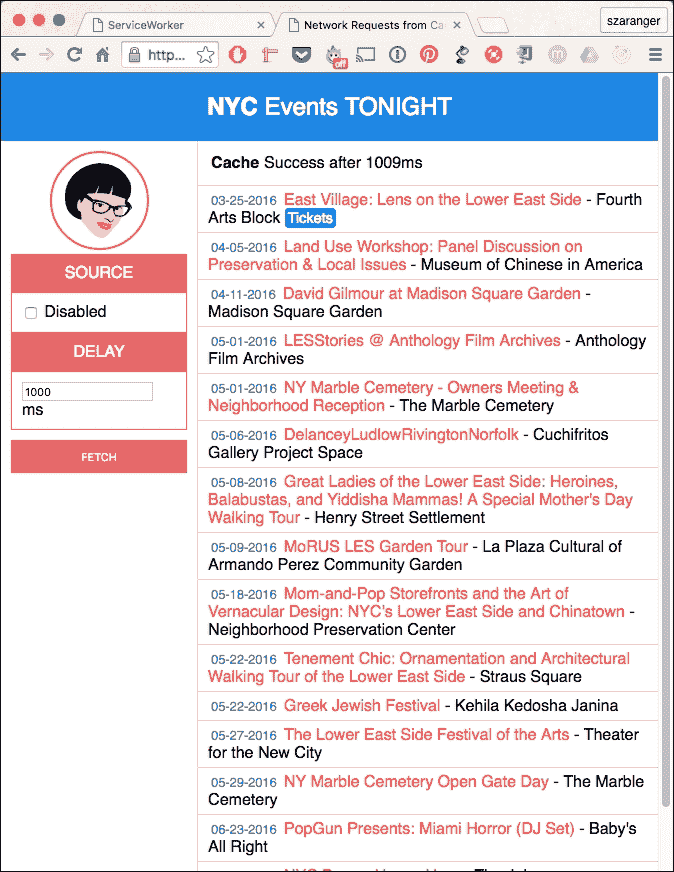

1.  现在，我们将选择**禁用**选项卡下的**源**标签下的**禁用**复选框，然后再次点击**获取**按钮，以便只从缓存中获取数据。页面上将显示错误。由于缓存已禁用，无法获取数据。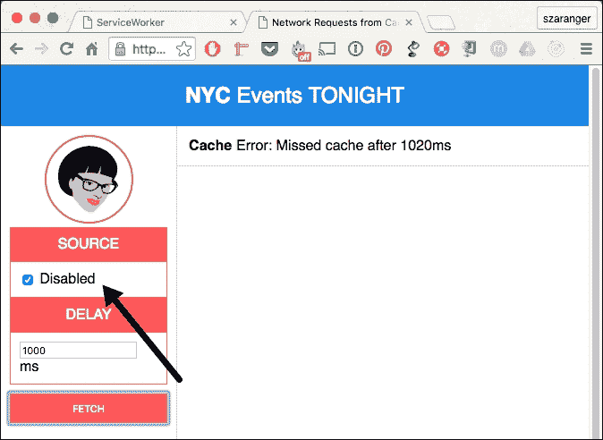

## 它是如何工作的...

在`index.js`文件中，我们将为缓存设置一个特定页面的名称，因为缓存是基于源的，并且没有其他页面应该使用相同的缓存名称。

```js
var CACHE_NAME = cache-only';
```

如果你检查开发工具的 **资源** 选项卡，你可以在 **缓存存储** 中找到缓存。

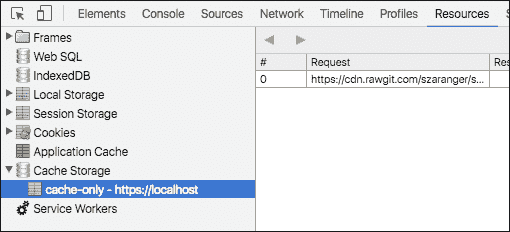

我们将存储缓存的经过时间到变量中。

```js
var cacheFetchStartTime;
```

源 URL，例如，通过 RawGit 指向 GitHub 中的文件位置。

```js
var SOURCE_URL = 'https://cdn.rawgit.com/szaranger/szaranger.github.io/master/service-workers/10/01/events';
```

如果你想要设置自己的源 URL，你可以通过在 GitHub 中创建一个 gist 或仓库，并创建一个包含你的数据的 JSON 格式文件（不需要 `.json` 扩展名）来轻松地做到这一点。一旦完成，复制文件的 URL 并前往 [`rawgit.com`](https://rawgit.com)。

将链接粘贴到那里以获取一个包含内容类型头部的链接，如下截图所示：

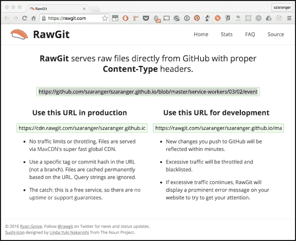

在我们点击获取按钮和所有数据接收之间，我们必须确保用户不会更改搜索标准或再次点击获取按钮。为了处理这种情况，我们将禁用控件。

```js
function clear() {
  outlet.textContent = '';
  cacheStatus.textContent = '';
}

function disableEdit(enable) {
  fetchButton.disabled = enable;
  cacheDelayText.disabled = enable;
  cacheDisabledCheckbox.disabled = enable;

  if(!enable) {
    clear();
  }
}
```

返回的数据将以行形式渲染到屏幕上。

```js
function displayEvents(events) {

  events.forEach(function(event) {
    var tickets = event.ticket ?
      '<a href="' + event.ticket + '" class="tickets">Tickets</a>' : '';

    outlet.innerHTML = outlet.innerHTML +
      '<article>' +
      '<span class="date">' + formatDate(event.date) + '</span>' +
      ' <span class="title">' + event.title + '</span>' +
      ' <span class="venue"> - ' + event.venue + '</span> ' +
      tickets +
      '</article>';
  });

}
```

`events` 数组的每个项目都将作为行打印到屏幕上。


`handleFetchComplete` 函数是缓存的回调。

因为请求体只能读取一次，我们必须克隆响应。

```js
cloned = response.clone();
```

我们将使用 `cache.put` 将克隆的响应作为键值对放入缓存。这有助于后续的缓存获取找到这些更新的数据。

```js
caches.open(CACHE_NAME).then(function(cache) {
   cache.put(SOURCE_URL, cloned); // cache.put(URL, response)
});
```

现在我们将读取以 JSON 格式返回的响应。

```js
response.json().then(function(data) {
    displayEvents(data);
});
```

当用户点击获取按钮时，我们将几乎同时从缓存中请求数据。这在现实世界的应用程序中会在页面加载时发生，而不是由用户操作引起的。

```js
fetchButton.addEventListener('click', function handleClick() {
...
}
```

为了模拟缓存延迟，我们在调用缓存获取回调之前等待。如果回调出错，我们将确保从原始调用中得到的 `Promise` 被拒绝以匹配。

```js
return new Promise(function(resolve, reject) {
        setTimeout(function() {
          try {
            handleCacheFetchComplete(response);
            resolve();
          } catch (err) {
            reject(err);
          }
        }, cacheDelay);
});
```

`formatDate` 函数是我们将接收到的响应中的日期格式转换为屏幕上更易读格式的辅助函数。

```js
function formatDate(date) {
  var d = new Date(date),
      month = (d.getMonth() + 1).toString(),
      day = d.getDate().toString(),
      year = d.getFullYear();
  if (month.length < 2) month = '0' + month;
  if (day.length < 2) day = '0' + day;

  return [month, day, year].join('-');
}
```

如果你喜欢不同的日期格式，你可以通过在返回语句中调整数组的顺序来达到你喜欢的格式。

## 相关内容

+   在第三章“访问离线内容”的 *显示缓存内容首先* 菜谱中，*访问离线内容*

# 从网络执行网络请求

在上一个菜谱中，我们探讨了如何从缓存中获取请求。在这个菜谱中，我们将演示如何使用服务工作者从服务器/网络中获取请求。为了演示网络获取，我们将构建一个类似于上一个菜谱的界面，但专门用于展示网络交互。

## 准备工作

要开始使用服务工作者，你需要在浏览器设置中开启服务工作者实验功能。如果你还没有这样做，请参考第一章的第一个食谱，*学习服务工作者基础*，*设置服务工作者*。服务工作者仅在 HTTPS 上运行。要了解如何设置支持此功能的发展环境，请参考第一章的以下食谱：*设置 GitHub 页面以支持 SSL*，*在 Windows 上设置 SSL*，以及*在 Mac 上设置 SSL*。

## 如何操作...

按照以下说明设置你的文件结构：

1.  从以下位置下载文件：

    [`github.com/szaranger/szaranger.github.io/blob/master/service-workers/10/02/`](https://github.com/szaranger/szaranger.github.io/blob/master/service-workers/10/02/)

1.  打开浏览器并转到`index.html`。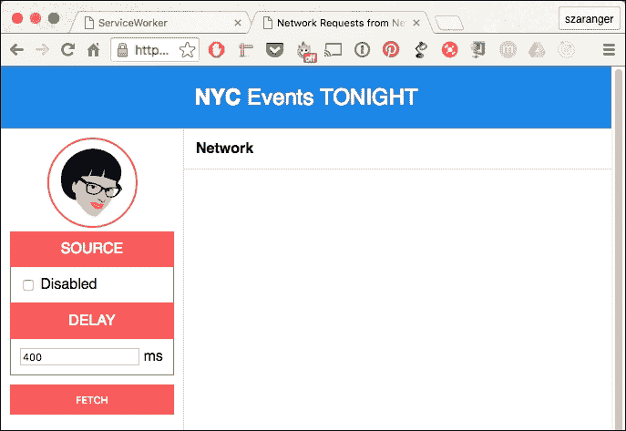

1.  首先，我们将启用缓存从网络请求数据。点击**获取**按钮。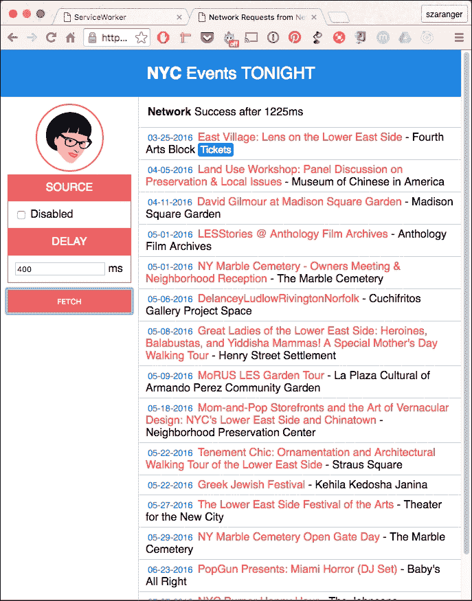

1.  现在我们将选择**源**标签下的**禁用**复选框，然后再次点击**获取**按钮，以便只从缓存中获取数据。页面上将显示错误。由于缓存已禁用，无法获取数据。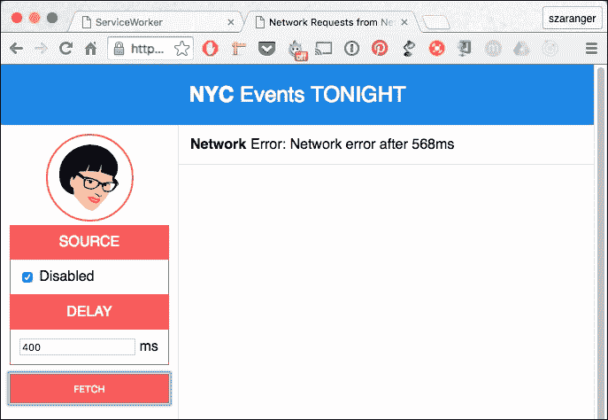

## 工作原理...

在`index.js`文件中，我们将为缓存设置一个特定于页面的名称，因为缓存是基于源的，并且没有其他页面应该使用相同的缓存名称。

```js
var CACHE_NAME = 'network-only';
```

如果你检查开发工具的**资源**标签页，你可以在**缓存存储**中找到缓存。

我们将存储两个网络的时间差到变量中。

```js
var networkFetchStartTime;
```

源 URL，例如，通过 RawGit 指向 GitHub 上的文件位置。

```js
var SOURCE_URL = 'https://cdn.rawgit.com/szaranger/szaranger.github.io/master/service-workers/10/02/events';
```

如果你想要设置自己的源 URL，你可以通过在 GitHub 中创建一个 gist 或仓库并创建一个包含你的数据的 JSON 格式的文件（不需要`.json`扩展名）轻松地做到这一点。一旦你这样做，复制文件的 URL 并转到[`rawgit.com`](https://rawgit.com)。将链接粘贴到那里以获取另一个带有内容类型头的链接，如下面的截图所示：


在我们点击获取按钮和所有数据接收之间，我们必须确保用户不会更改搜索标准或再次点击获取按钮。为了处理这种情况，我们将禁用控件。

```js
function clear() {
  outlet.textContent = '';
  networkStatus.textContent = '';
  networkDataReceived = false;
}

function disableEdit(enable) {
  fetchButton.disabled = enable;
  networkDelayText.disabled = enable;
  networkDisabledCheckbox.disabled = enable;

  if(!enable) {
    clear();
  }
}
```

返回的数据将以行形式渲染到屏幕上。

```js
function displayEvents(events) {

  events.forEach(function(event) {
    var tickets = event.ticket ?
      '<a href="' + event.ticket + '" class="tickets">Tickets</a>' : '';

    outlet.innerHTML = outlet.innerHTML +
      '<article>' +
      '<span class="date">' + formatDate(event.date) + '</span>' +
      ' <span class="title">' + event.title + '</span>' +
      ' <span class="venue"> - ' + event.venue + '</span> ' +
      tickets +
      '</article>';
  });

}
```

`events`数组中的每个项目都将作为行打印到屏幕上。


`handleFetchComplete`函数是缓存和网络的双向回调。

如果勾选了**禁用**复选框，我们将通过抛出错误来模拟网络错误。

```js
var shouldNetworkError = networkDisabledCheckbox.checked,
    cloned;

  if (shouldNetworkError) {
    throw new Error('Network error');
  }
```

由于请求体只能读取一次，我们必须克隆响应。

```js
cloned = response.clone();
```

现在我们将以 JSON 格式读取响应。

```js
response.json().then(function(data) {
    displayEvents(data);
    networkDataReceived = true;
});
```

当用户点击获取按钮时，我们将从网络和缓存几乎同时请求数据。这在现实世界的应用程序中会在页面加载时发生，而不是用户操作的结果。

```js
fetchButton.addEventListener('click', function handleClick() {
...
}
```

我们将开始禁用在网络获取请求发起期间的所有用户输入。

```js
disableEdit(true);

networkStatus.textContent = 'Fetching events...';
networkFetchStartTime = Date.now();
```

我们将使用带有缓存破坏 URL 以及无缓存选项的 fetch API 请求数据，以支持尚未实现缓存选项的 Firefox。

```js
networkFetch = fetch(SOURCE_URL + '?cacheBuster=' + now, {
   mode: 'cors',
   cache: 'no-cache',
   headers: headers
})
```

为了模拟网络延迟，我们在调用网络获取回调之前会等待。在回调出错的情况下，我们必须确保我们拒绝从原始获取中接收到的`Promise`。

```js
return new Promise(function(resolve, reject) {
      setTimeout(function() {
        try {
          handleFetchComplete(response);
          resolve();
        } catch (err) {
          reject(err);
        }
      }, networkDelay);
});
```

`formatDate`函数是我们将接收到的响应中的日期格式转换为屏幕上更易读格式的辅助函数。

```js
function formatDate(date) {
  var d = new Date(date),
      month = (d.getMonth() + 1).toString(),
      day = d.getDate().toString(),
      year = d.getFullYear();

  if (month.length < 2) month = '0' + month;
  if (day.length < 2) day = '0' + day;

  return [month, day, year].join('-');
}
```

如果你更喜欢不同的日期格式，你可以调整返回语句中数组的顺序以符合你的偏好格式。

## 相关内容

+   第三章中的*首先显示缓存内容*配方，*访问离线内容*

# 测试 waitUntil

在这个配方中，我们将使用服务工作者来测试`waitUntil`方法，这将延迟服务工作者生命周期的安装方法，直到打开缓存并将页面保存到缓存的过程。

## 准备工作

要开始使用服务工作者，你需要在浏览器设置中开启服务工作者实验功能。如果你还没有这样做，请参考第一章的*设置服务工作者*配方，*学习服务工作者基础*。服务工作者仅在 HTTPS 上运行。要了解如何设置开发环境以支持此功能，请参考以下第一章的配方：*设置 GitHub 页面以支持 SSL*，*在 Windows 上设置 SSL*，和*在 Mac 上设置 SSL*。

## 如何操作...

按照以下说明设置你的文件结构：

1.  从以下位置下载文件：

    [`github.com/szaranger/szaranger.github.io/blob/master/service-workers/10/03/`](https://github.com/szaranger/szaranger.github.io/blob/master/service-workers/10/03/)

1.  打开浏览器并转到`index.html`。你会看到**注册状态：成功**的消息。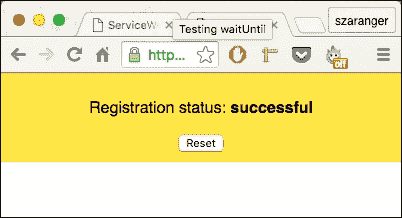

1.  现在打开开发者工具（*Cmd* + *Alt* + *I* 或 *F12*），转到**网络**标签页，点击显示**无限制**的下拉菜单，并选择**离线**。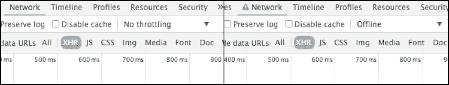

1.  现在刷新你的浏览器，你会看到离线消息和图片。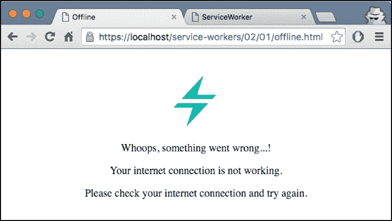

## 工作原理...

`waitUntil`事件延长了安装事件的生存期，直到所有缓存都已填充。换句话说，它将处理安装中的工作者视为已安装的操作延迟到我们指定的所有资源都已缓存并且传递的承诺成功解决。

我们看到当我们的网站离线时，HTML 文件和图片文件被缓存，然后被检索。我们还可以缓存其他资源，包括 CSS 和 JavaScript 文件。

```js
caches.open(currentCache.offline)
.then(function(cache) {
        return cache.addAll([
              'offline.html',
              '/assets/css/style.css',
              '/assets/js/index.js'
            ]);
        })
);
```

当注册成功时，我们将指示服务工作者拦截请求，并使用 fetch 事件从缓存内容中提供资源。

在`index.html`文件内部，当注册成功时，我们将检查注册状态并将其打印到浏览器。否则，我们将打印服务工作者返回的错误信息。

```js
navigator.serviceWorker.register(
      'service-worker.js',
      { scope: './' }
   ).then(function(serviceWorker) {
      document.getElementById('status').innerHTML = 
          'successful';
   }).catch(function(error) {
      document.getElementById('status').innerHTML = error;
});
```

服务工作者脚本文件将拦截网络请求，检查连接性，并为用户提供内容。

我们将在安装事件上添加事件监听器，并在回调函数中发起一个请求以获取此离线页面及其资源，当结果成功时，这些资源将被添加到缓存中。

```js
self.addEventListener('install', function(event) {
  event.waitUntil(
    caches.open(currentCache.offline)
    .then(function(cache) {
         return cache.addAll([
        offlineUrl
          ]);
          })
    );
});
```

现在我们可以随时检索此页面，因为离线页面已存储在缓存中。如果我们没有连接性，我们需要在同一个服务工作者中添加逻辑以返回离线页面。

```js
self.addEventListener('fetch', function(event) {
  var request = event.request,
    isRequestMethodGET = request.method === 'GET';

  if (request.mode === 'navigate' || isRequestMethodGET) {
    event.respondWith(
      fetch(createRequestWithCacheBusting(request.url)).catch(function(error) {
        console.log('OFFLINE: Returning offline page.', error);
        return caches.match(offlineUrl);
      })
    );
  } else {
    event.respondWith(caches.match(request)
        .then(function (response) {
        return response || fetch(request);
      })
    );
  }
});
```

我们正在监听前面源代码中的 fetch 事件，如果我们检测到用户试图导航到另一个页面并导致错误，我们简单地从缓存中返回离线页面。现在我们的离线页面已经工作。

# 实现背景同步

服务工作者（service worker）的背景同步功能负责管理后台同步过程。截至撰写本书时，此功能仍是非标准的，你应该避免在生产环境中使用它。

## 准备工作

要开始使用服务工作者，你需要在浏览器设置中开启服务工作者实验功能。如果你还没有这样做，请参阅第一章中的*设置服务工作者*配方，*学习服务工作者基础*。服务工作者仅在 HTTPS 上运行。要了解如何设置支持此功能的发展环境，请参阅第一章中的*设置 GitHub 页面以支持 SSL*配方，*学习服务工作者基础*。

## 如何操作...

按照以下说明设置你的文件结构：

1.  从以下位置复制文件：

    [`github.com/szaranger/szaranger.github.io/blob/master/service-workers/10/04/`](https://github.com/szaranger/szaranger.github.io/blob/master/service-workers/10/04/)

1.  打开浏览器并访问`index.html`。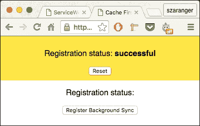

1.  点击**注册背景同步**按钮。底部将出现一条消息显示**同步已注册**。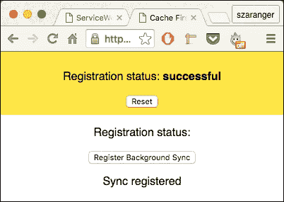

1.  屏幕上也会出现通知消息。

## 它是如何工作的...

在我们的`index.html`文件中，我们将添加一个用于按钮和消息的部分。

```js
  <section>
    <p>Registration status: <strong id="status"></strong></p>
    <button id="register">Register Background Sync</button>
    <div id="console"></div>
  </section>
```

我们将在`index.js`文件中处理按钮点击。通知需要权限，因此我们也将在这里处理。

```js
document.getElementById('register').addEventListener('click', function(event) {
      event.preventDefault();

      new Promise(function(resolve, reject) {
        Notification.requestPermission(function(result) {
          if (result !== 'granted') {
            return reject(Error('Notification permission denied'));
          }
          resolve();
        })
      }).then(function() {
        return navigator.serviceWorker.ready;
      }).then(function(reg) {
        return reg.sync.register('syncTest');
      }).then(function() {
        print('Sync registered');
      }).catch(function(err) {
        print('It broke');
        print(err.message);
      });
});
```

我们的`service-worker.js`文件相当简单。当同步事件处理器被调用时，我们显示通知。

```js
self.addEventListener('sync', function(event) {
  self.registration.showNotification('Sync\'d');
});
```

# 发送转发请求

在这个菜谱中，我们将实现一个发送转发请求的服务工作者。当你想要临时将请求转发到不同的资源时，请求转发非常有用。

## 准备工作

要开始使用服务工作者，你需要在浏览器设置中开启服务工作者实验功能。如果你还没有这样做，请参考第一章的第一个菜谱，*学习服务工作者基础*，*设置服务工作者*。服务工作者仅在 HTTPS 上运行。要了解如何设置支持此功能的发展环境，请参考第一章的以下菜谱：*设置 GitHub 页面以支持 SSL*，*在 Windows 上设置 SSL*，以及*在 Mac 上设置 SSL*。

## 如何操作...

按照以下说明设置你的文件结构：

1.  从以下位置下载所有文件：

    [`github.com/szaranger/szaranger.github.io/blob/master/service-workers/10/05/`](https://github.com/szaranger/szaranger.github.io/blob/master/service-workers/10/05/)

1.  打开浏览器并访问`index.html`。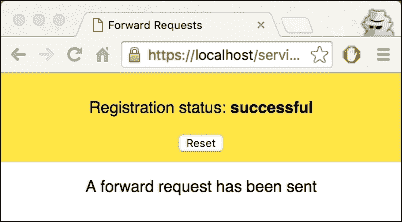

1.  现在打开开发者工具(*Cmd* + *Alt* + *I* 或 *F12*)，在**控制台**标签页上查看日志消息。转发消息将在一秒后出现。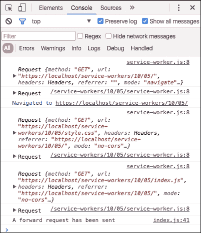

## 它是如何工作的...

我们将在`index.html`文件中添加一个`div`元素，我们计划在这里记录一条消息。

```js
<section>
     <div id="console"></div>
</section>
```

我们将在`service-worker.js`文件中处理`active`和`fetch`事件。

```js
self.addEventListener('activate', _ => {
  clients.claim();
});

self.addEventListener('fetch', event => {
  console.log(event.request);
  event.respondWith(fetch(event.request));
});
```

将消息记录到屏幕上的辅助函数在`index.js`文件中。

```js
var consoleEl = document.getElementById('console');

function print(message) {
  var p = document.createElement('p');

  p.textContent = message;
  consoleEl.appendChild(p);
  console.log(message);
}
```

# 避免模型获取和渲染时间

为了避免在连续请求时模型获取和渲染时间，我们保存了一个包含顺序插值模板的缓存，我们称之为渲染**存储**。

根据 Mozilla 的说法，渲染存储的目的是保存/恢复特定视图的序列化版本，主要是为了性能。

## 准备工作

要开始使用服务工作者，你需要在浏览器设置中开启服务工作者实验功能。如果你还没有这样做，请参考第一章中的*设置服务工作者*配方，*学习服务工作者基础*。服务工作者仅在 HTTPS 上运行。要了解如何设置支持此功能的发展环境，请参考第一章中的*设置 GitHub 页面以支持 SSL*配方，*学习服务工作者基础*。

## 如何操作...

按照以下说明设置你的文件结构：

1.  从以下位置下载文件：

    [`github.com/szaranger/szaranger.github.io/blob/master/service-workers/10/06/`](https://github.com/szaranger/szaranger.github.io/blob/master/service-workers/10/06/)

1.  打开浏览器并访问`index.html`。如何操作...

1.  点击列表中的任何链接进入商店。

## 它是如何工作的...

在`index.js`文件的开始处，我们指定了宝可梦 API 端点以及一个安全源。

```js
var proxy = 'https://crossorigin.me/';
var pokedex = proxy + 'http://pokeapi.co/api/v1/pokedex/1/';
…
```

接下来，从`pokedex`获取宝可梦列表并创建一个链接列表。

```js
function fetchPokemonList() {
  fetch(pokedex)
    .then(function(response) {
      return response.json();
    })
    .then(function(info) {
      populatePokemonList(info.pokemon);

      if (window.parent !== window) {
        window.parent.document.body
          .dispatchEvent(new CustomEvent('iframeresize'));
      }
    });
}
```

随后，填充列表并为宝可梦列表创建链接。这些链接将被服务工作者拦截。

```js
function populatePokemonList(pokemonList) {
  var el = document.querySelector('#pokemon');
  var buffer = pokemonList.map(function(pokemon) {
    var tokens = pokemon.resource_uri.split('/');
    var id = tokens[tokens.length - 2];
    return '<li><a href="pokemon.html?id=' + id + '">' + pokemon.name +
           '</a></li>';
  });
  el.innerHTML = buffer.join('\n');
} 
```

接下来，让我们看看`service-worker.js`文件。它试图恢复文档的缓存副本。如果没有找到，它将从网络响应。

```js
function getResponse(request) {
  return self.caches.open('render-store').then(function(cache) {
    return cache.match(request).then(function(match) {
      return match || fetch(request);
    });
  });
}
```

`cacheResponseInRenderStore`函数从`pokemon.js`获取`PUT`请求的插值 HTML 内容，并为插值结果创建 HTML 响应。

```js
function cacheResponseInRenderStore(request) {
  return request.text().then(function(contents) {
    var headers = { 'Content-Type': 'text/html' };
    var response = new Response(contents, { headers: headers });

    return self.caches.open('render-store').then(function(cache) {
      return cache.put(request.referrer, response);
    });
  });
}
```

在`pokemon.js`文件中，我们初始化计时器以开始。

```js
var startTime = performance.now();
var interpolationTime = 0;
var fetchingModelTime = 0;
```

我们将创建一个用于渲染的宝可梦模板，该模板通过从 URL 的查询字符串中获取数据来负责渲染。这个模板将获取指定的宝可梦并填充模板。一旦模板被填充，我们将文档标记为已缓存，然后通过将内容发送到服务工作者来将其发送到渲染存储。

```js
if (document.documentElement.dataset.cached) {
  logTime();
} else {
  var pokemonId = window.location.search.split('=')[1];

  getPokemon(pokemonId).then(fillCharSheet).then(logTime).then(cache);
}

function getPokemon(id) {
  var fetchingModelStart = getStartTime();

  return fetch(getURL(id)).then(function(response) {
    fetchingModelTime = getStartTime() - fetchingModelStart;
    return response.json();
  });
}
```

接下来，我们将文档标记为已缓存，获取所有 HTML 内容，并使用`PUT`请求将内容发送到`./render-store/` URL 以发送到服务工作者。

```js
function interpolateTemplate(template, pokemon) {
  var interpolationStart = performance.now();
  var result = template.replace(/{{(\w+)}}/g, function(match, field) {
    return pokemon[field];
  });
  interpolationTime = performance.now() - interpolationStart;
  return result;
}
```
