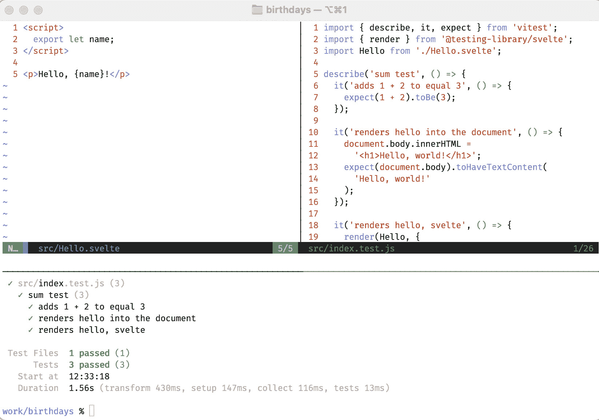
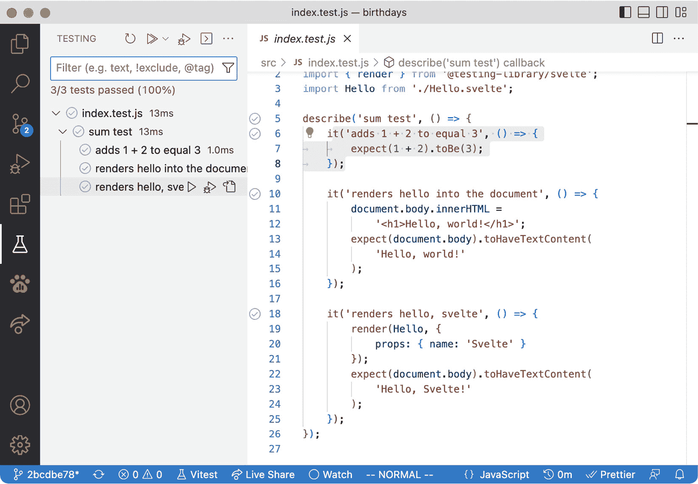

# 第一章：测试设置

在您还是一个小学生的时候，您可能通过在纸上使用铅笔来学习写作。现在您长大了，您可能更喜欢钢笔。对于学习者来说，铅笔在纠正错误方面比钢笔有明显的优势，因为当您刚开始书写字母和单词时，您会犯很多错误。铅笔对小孩子来说也更安全——没有盖子或混乱的墨水需要担心。

但铅笔仍然是一种有效的书写工具，您可能仍然更喜欢铅笔而不是钢笔。铅笔是完成这项工作的完美工具。

**测试驱动开发**（**TDD**）是一种可以以类似方式为您服务的工具。这是作为开发者学习和成长的好方法。许多经验丰富的开发者更喜欢它，而不是任何替代方案。

在本章中，您将配置一个旨在帮助您充分利用 TDD 技术的工作环境。由于 TDD 要求您执行一系列小型重复性任务——编写测试、运行测试、尽早和经常提交，以及在测试代码和应用代码之间切换——因此，每个任务都应易于且快速完成。

因此，一个重要的个人修养是客观地评价您的开发工具。对于您使用的每一个工具，问自己这个问题：这个工具是否为我服务得很好？它是否易于使用且快速？

这可能是您的 **集成开发环境**（**IDE**），您的操作系统，您的源代码仓库，您的笔记程序，您的时间管理工具，等等。您在日常工作中使用的任何和所有东西。审视您的工具。丢弃那些对您不起作用的工具。

这是非常个人化的事情，很大程度上取决于经验和个性。而且，您的偏好也可能随着时间的推移而改变。

我经常使用非常简单、简单的键盘驱动工具，这些工具对我始终有效，无论我正在使用哪种编程语言，比如文本编辑器 Vim。它不提供关于 JavaScript 编程语言或 Svelte 框架的知识，但它使我非常有效地编辑文本。

但如果您关心学习 JavaScript 或程序设计，那么您可能更喜欢一个提供 JavaScript 自动完成建议和有帮助的项目辅助的 IDE。

本章将指导您设置一个新的 SvelteKit 项目，并突出您需要做出的所有个人选择，以及为了练习有效的 TDD 需要的额外功能。

它涵盖了以下主题：

+   创建一个新的 SvelteKit 项目

+   准备您的开发环境以进行频繁的测试运行

+   配置对 Svelte 组件测试的支持

+   您可能想要尝试的配置选项

到本章结束时，您将知道如何创建一个适合测试驱动功能构建的新 Svelte 项目。

# 技术要求

本章的代码可以在网上找到，地址为 [`github.com/PacktPublishing/Svelte-with-Test-Driven-Development/tree/main/Chapter01/Start`](https://github.com/PacktPublishing/Svelte-with-Test-Driven-Development/tree/main/Chapter01/Start)。

你需要安装一个较新的 Node.js 版本。有关如何在你的平台上安装和更新 Node.js 的说明，请参阅 [`nodejs.org`](https://nodejs.org)。

# 创建一个新的 SvelteKit 项目

在本节中，你将使用创建新 SvelteKit 项目的默认方法，该方法使用 `npm create` 命令。（作为参考，你还可以查看官方文档 [`kit.svelte.dev/docs/creating-a-project`](https://kit.svelte.dev/docs/creating-a-project)。）

我们正在构建的项目被称为 *Birthdays*，npm 包名为 `birthdays`。它将在 *第二章*，*介绍红-绿-重构工作流程* 中详细介绍。

SvelteKit 1.0

这些说明在撰写本书时是有效的，针对 SvelteKit 1.0。随着时间的推移，事情可能会得到改善，因此你可能会发现一些后续说明将变得不再必要或可能不再适用。请查看本书的 GitHub 仓库以获取最新说明。

现在，我们将专注于构建新项目的机制：

1.  首先，在你的常规工作位置打开一个终端窗口（对我来说，这是我的 Mac 上的 `~/work`）。然后输入以下命令：

    ```js
    mkdir birthdays
    cd birthdays
    npm create svelte@latest
    ```

如果你这是创建的第一个 Svelte 项目，npm 将显示以下消息：

```js
Need to install the following packages:
  create-svelte@2.1.0
Ok to proceed? (y)
```

1.  对该问题回答 `y`。你会看到更多问题，我们将逐一解答：

    ```js
    create-svelte version 2.1.0
    Welcome to SvelteKit!
    ? Where should we create your project?
      (leave blank to use current directory) ›
    ```

1.  由于你已经在 `birthdays` 目录中，只需留空，然后按 *Enter*。接下来，你将被询问你想要使用哪个应用程序模板：

    ```js
    ? Which Svelte app template? › - Use arrow-keys. Return to submit.
    SvelteKit demo app
    ❯   Skeleton project - Barebones scaffolding for your new SvelteKit app
        Library skeleton project
    ```

1.  选择 `骨架项目`。接下来，你将被询问关于 TypeScript 的问题：

    ```js
    ? Add type checking with TypeScript? › - Use arrow-keys. Return to submit.
        Yes, using JavaScript with JSDoc comments
        Yes, using TypeScript syntax
    ❯   No
    ```

1.  对于这个问题，我选择了 `No`。这是因为这本书是关于测试技术，而不是类型技术。这并不是说这本书不适用于 TypeScript 项目——当然适用——只是类型不是这本书的主题。

如果你想要使用 TypeScript

如果你是一位经验丰富的 TypeScript 开发者，请随时选择该选项。本书中的代码示例不需要太多修改，除了需要提供的额外类型定义。

1.  最后，你将被询问额外的包依赖项：

    ```js
    ? Add ESLint for code linting? › No / Yes
    ? Add Prettier for code formatting? › No / Yes
    ? Add Playwright for browser testing? › No / Yes
    ✔ Add Vitest for unit testing? … No / Yes
    ```

1.  对所有这些问题回答 `Yes`。尽管我们在这本书中不会提到 ESLint，但它总是好的。我们还需要 Playwright 和 Vitest。

然后，你将看到所有选择的摘要，随后是一个 `Next` `步骤` 列表：

```js
Your project is ready!
✔ ESLint
https://github.com/sveltejs/eslint-plugin-svelte3
✔ Prettier
  https://prettier.io/docs/en/options.xhtml
  https://github.com/sveltejs/prettier-plugin-svelte#options
✔ Playwright
  https://playwright.dev
✔ Vitest
  https://vitest.dev
Install community-maintained integrations:
  https://github.com/svelte-add/svelte-adders
Next steps:
  1: npm install (or pnpm install, etc)
  2: git init && git add -A && git commit -m "Initial commit" (optional)
  3: npm run dev -- --open
```

我们将执行以下步骤，但在这样做之前，我们将运行一些额外的验证步骤。检查你的工作总是好的。

在终端中输入 `npm install` 并确认一切安装正确。然后，继续提交你的更改。（如果你已经 fork 了 GitHub 仓库，你不需要使用 `git` `init` 命令。）

提前频繁提交

经常检查你的工作是个好主意。当你学习 TDD 测试方法时，每次测试后都进行检查可能会有所帮助。这可能会显得有些多，但它将帮助你回溯，以防你遇到难题。

然后，运行 `npm run dev – –open`。它应该会打开你的网页浏览器并显示一个 `"欢迎来到` `SvelteKit"` 的消息。

你可以关闭浏览器，并在终端中按 *Ctrl* + *C* 来停止 web 服务器。

接下来，让我们验证 Playwright 和 Vitest 的依赖项。

## 安装和运行 Playwright

虽然我们在这章中不会使用 Playwright，但安装它并验证它是否工作是个好主意。

首先在命令行中运行 `npm test`：

```js
work/birthdays % npm test
> birthdays@0.0.1 test
> playwright test
Running 1 test using 1 worker
[WebServer]
[WebServer]
[WebServer] Generated an empty chunk: "hooks".
[WebServer]
  ✘  1 test.js:3:1 › index page has expected h1 (7ms)
  1) test.js:3:1 › index page has expected h1 =============================================
    browserType.launch: Executable doesn't exist at /Users/daniel/Library/Caches/ms-playwright/chromium-1041/chrome-mac/Chromium.app/Contents/MacOS/Chromium
    ...
  1 failed
    test.js:3:1 › index page has expected h1 ============================================
```

如果你以前从未安装过 Playwright，你会看到前面提到的消息。

Playwright 有其自己的环境设置要做，例如在你的机器上安装 Chromium。你可以使用以下命令安装它：

```js
npx playwright install
```

然后，再次尝试 `npm test` 应该会给出以下输出，显示包含的一个示例测试正在通过：

```js
> birthdays@0.0.1 test
> playwright test
Running 1 test using 1 worker
[WebServer]
[WebServer]
[WebServer] Generated an empty chunk: "hooks".
[WebServer]
  ✓  1 test.js:3:1 › index page has expected h1 (307ms)
  1 passed (4s)
```

这个测试，`index 页面有预期的 h1`，是对你在浏览器中启动应用程序时看到的 `"欢迎来到 SvelteKit"` 消息的测试。

## 运行 Vitest

运行 `npm run test:unit` 是运行 Vitest 测试的默认方式。现在试试看：

```js
work/birthdays % npm run test:unit
> birthdays@0.0.1 test:unit
> vitest
 DEV  v0.25.8 /Users/daniel/work/birthdays
 ✓ src/index.test.js (1)
 Test Files  1 passed (1)
      Tests  1 passed (1)
   Start at  15:56:18
   Duration  737ms (transform 321ms, setup 0ms, collect 16ms, tests 2ms)
 PASS  Waiting for file changes...
       press h to show help, press q to quit
```

这会自动将你置于监视模式，这意味着文件系统中的任何更改都会导致测试重新运行。按 *q* 退出此模式。我个人不使用监视模式，我们在这本书中也不会使用它。请参阅 *创建 shell 别名* 部分以了解为什么。

在下一节中，我们将使项目的操作更加便捷。

# 为频繁的单元测试准备你的开发环境

在本节中，我们将采取一些配置操作，这将使我们的测试驱动生活变得更加简单。

## 选择你的编辑器

让我们从你选择的代码编辑器开始。很可能这意味着在 IDE，如 Visual Studio Code，或纯文本编辑器，如 Vim 或 Emacs 之间做出选择。

IDE 通常有很多功能，其中之一是内置的测试运行器，它会为你运行测试并将测试输出集成到编辑器本身。另一方面，纯文本编辑器将需要你有一个单独的终端窗口来直接输入测试命令，就像你在上一节中所做的那样。

*图 1**.1* 展示了我的个人设置，使用 Vim 和 tmux 来分割窗口。屏幕的上半部分是我编辑源文件的地方，当我准备好运行测试时，我可以切换到下半部分并输入 `test` 命令。



图 1.1 – 使用 tmux 和 Vim

*图 1**.2* 展示了安装了 Vitest 扩展的 Visual Studio Code 中的相同项目。注意测试运行器有许多整洁的功能，例如能够过滤测试输出，以及通过测试通过行的数字旁边的绿色勾选标记。



图 1.2 – 使用 Visual Studio Code 运行测试

我认为从使用纯编辑器和终端设置中可以学到很多东西，但如果您对此感到不舒服，那么现在最好坚持使用您最喜欢的 IDE。

您想要确保的一件事是测试运行既简单又快捷。因此，如果您正在编写一个新的测试，您希望立即运行它并看到它失败。如果您正在使测试通过或重构测试，请确保您可以快速重新运行测试以检查您的进度。

## 创建 shell 别名

如果您选择使用终端来运行测试，那么您几乎肯定想要设置一个别名，以便更简单地运行 Vitest 单元测试。您会记得，您使用两个命令来运行测试：`npm test` 用于 Playwright 测试，以及 `npm run test:unit` 命令用于 Vitest 单元测试。

本书展示的测试风格遵循经典的 *测试金字塔* 测试方法，该方法指出我们应该有很多小的单元测试（在 Vitest 中）和很少的系统测试（在 Playwright 中）。

既然我们将更频繁地使用 Vitest，那么让 `test` 命令运行单元测试不是更合理吗？

我使用的解决方案是一个 shell 别名 `v`，它调用 Vitest。如果您想使用标准的监视模式，您需要设置 shell 别名为运行此命令：

```js
npx vitest
```

然而，因为我不想使用监视模式，所以我将其设置为使用此命令：

```js
npx vitest run
```

我建议您使用这个版本，至少在您阅读这本书的时候。我发现监视模式往往会静默地崩溃，尤其是在您处于设置项目的初期阶段。为了避免混淆，最好在准备好时再调用测试命令。

在我的 Mac 上，我的默认 shell 是 `zsh`，它在其配置的 shell 别名在 `~/.zshrc` 文件中。您可以使用以下命令将该别名添加到文件中：

```js
echo 'alias v="npx vitest run"' >> ~/.zshrc
source ~/.zshrc
```

现在，您只需输入 `v` 命令即可运行您的 Vitest 单元测试。您也可以使用此命令运行单个测试文件，如下所示：

```js
v src/index.tests.js
```

这是一种方便的方法来运行您测试套件的一小部分。

## 将测试运行器更改为报告每个测试名称

回想一下，当我们运行我们的 Vitest 单元测试时，测试报告告诉我们运行的测试套件的文件名，以及一些摘要信息：

```js
 DEV  v0.25.8 /Users/daniel/work/birthdays
 ✓ src/index.test.js (1)
 Test Files  1 passed (1)
      Tests  1 passed (1)
   Start at  15:56:18
   Duration  737ms (transform 321ms, setup 0ms, collect 16ms, tests 2ms)
```

结果发现这还不够——我们还想看到测试名称，就像 Playwright 测试告诉我们通过测试的描述一样。

打开 `vite.config.js` 文件，并添加一个新的 `reporter` 属性，将其设置为 `verbose`，如下面的代码块所示：

```js
 const config = {
   plugins: [sveltekit()],
   test: {
     ...,
     reporter: 'verbose'
   }
 };
```

小心

如果你之前在监视模式下运行测试运行器，此时你需要重新启动它，以及在任何修改配置的其他时刻。

现在，使用`v`命令在命令行运行测试将给出以下结果：

```js
 RUN  v0.25.8 /Users/daniel/work/birthdays
 ✓ src/index.test.js (1)
   ✓ sum test (1)
     ✓ adds 1 + 2 to equal 3
 Test Files  1 passed (1)
      Tests  1 passed (1)
   Start at  11:02:05
   Duration  905ms (transform 320ms, setup 1ms, collect 16ms, tests 2ms)
```

太好了！

## 观察测试失败

我们几乎完成了 Vitest 的配置，但在继续之前，让我们检查一下测试实际上是否测试了我们想要测试的内容。这是 TDD 中的一个重要概念：如果你从未见过失败的测试，你怎么知道它测试了正确的内容？

打开`src/index.test.js`并查看：

```js
import { describe, it, expect } from 'vitest';
describe('sum test', () => {
  it('adds 1 + 2 to equal 3', () => {
    expect(1 + 2).toBe(3);
  });
});
```

对`expect`语句进行更改，就像这里显示的那样：

```js
expect(2 + 2).toBe(3);
```

现在如果你运行测试，你应该会看到失败：

```js
❯ src/index.test.js:5:17
      3| describe('sum test', () => {
      4|  it('adds 1 + 2 to equal 3', () => {
      5|   expect(2 + 2).toBe(3);
       |                 ^
      6|  });
      7| });
  - Expected   "3"
  + Received   "4"
```

太棒了 – 我们的测试运行器似乎一切正常。你可以继续撤销对测试的更改，并再次看到它变绿。这就是基本编辑器配置的全部内容。

### 测试文件位置 – 在`src`还是`test`？

在许多其他编程环境中，测试文件与应用程序源文件分开。一个名为`tests`或`specs`的单独目录用于存放所有可执行测试脚本。

这样做有几个优点。首先，它可以在构建可部署单元时避免将测试与应用程序代码打包在一起。然而，Svelte（以及 JavaScript）并不存在这个问题，因为只有由应用程序入口点引用的模块才会被打包。

第二，拥有一个单独的目录可以避免“每个模块一个测试文件”的思维模式。并非所有模块都需要单元测试：如果一个单元作为更大单元的一部分存在，我们通常会只为顶层单元编写测试，这些测试也将为低层单元提供覆盖率。相反，有时为单个模块拥有两个（或更多！）测试文件是有帮助的。

这尤其在使用会清除整个模块的组件模拟时成立。你可能需要一个模拟组件的测试文件，以及另一个没有模拟组件的测试文件。我们将在*第十二章*中探讨组件模拟，*使用组件模拟来澄清测试*。

当前 SvelteKit 的方法是将 Vitest 测试文件保存在`src`目录中。部分原因是避免与位于单独目录`tests`中的 Playwright 测试混淆，Playwright 测试确实位于单独的目录中。（我们将在*第三章*中看到 Playwright 测试，*将数据加载到路由中*）。

这本书将继续采用这种风格，但我鼓励你探索并采用你感觉最舒适的风格。

在下一节中，我们将添加对本书中将编写的各种测试的支持。

# 配置 Svelte 组件测试支持

Svelte *组件测试*是一种测试 Svelte 组件的测试。为此，我们需要访问**文档对象模型**（**DOM**），它不是 Node.js 标准环境的一部分。我们还需要一些额外的包来编写针对 DOM 的单元测试期望。

## 安装 jsdom 和测试库助手

在终端中，运行以下命令来安装我们将用于单元测试的`jsdom`包和`@testing-library`包：

```js
npm install --save-dev \
  jsdom \
  @testing-library/svelte \
  @testing-library/jest-dom \
  @testing-library/user-event
```

如果你正在使用 TypeScript，此时你可能希望添加包含类型定义的包。

接下来，创建一个名为`src/vitest/registerMatchers.js`的新文件，内容如下。它确保我们将使用的匹配器可以通过`expect`函数使用：

```js
import matchers from '@testing-library/jest-dom/matchers';
import { expect } from 'vitest';
expect.extend(matchers);
```

然后，更新`vite.config.js`以添加一个新的`environment`属性，正确安装`jsdom`，以及一个`setupFiles`属性，确保之前定义的文件在测试套件加载前（和调用）被加载（和调用）：

```js
 const config = {
   plugins: [sveltekit()],
   test: {
     ...,
     reporter: 'verbose',
     environment: 'jsdom',
     setupFiles: ['./src/vitest/registerMatchers.js']
   }
 };
```

基本设置到此结束。现在让我们测试一下。

## 编写对 DOM 的测试

打开`src/index.test.js`文件，在`describe`块内添加以下测试定义。这个测试使用了`jsdom`包为我们创建的`document`对象，以及由`@testing-library/jest-dom`包提供的`toHaveTextContent`匹配器：

```js
it('renders hello into the document', () => {
  document.body.innerHTML =
    '<h1>Hello, world!</h1>';
  expect(document.body).toHaveTextContent(
    'Hello, world!'
  );
});
```

现在，如果你运行测试，你应该看到它通过。但，就像你第一次测试那样，确认测试实际上测试了它所说的内容非常重要。通过注释掉或删除测试的第一行来更改测试，然后重新运行测试运行器。

你应该看到以下输出：

```js
 FAIL  src/index.test.js > sum test > renders hello into the document
Error: expect(element).toHaveTextContent()
Expected element to have text content:
  Hello, world!
Received:
 ❯ src/index.test.js:9:25
      7|
      8|  it('renders hello into the document', () => {
      9|   expect(document.body).toHaveTextContent(
       |                         ^
     10|    'Hello, world!'
     11|   );
```

这证明了测试正在工作。你可以继续撤销你做的破坏性更改。

## 编写第一个 Svelte 组件测试

接下来，让我们编写一个实际的 Svelte 组件并对其进行测试。创建一个名为`src/Hello.svelte`的新文件，内容如下：

```js
<script>
  export let name;
</script>
<p>Hello, {name}!</p>
```

然后，回到`src/index.test.js`文件，重构你的测试以使用这个新组件。为此，将`document.outerHTML`的调用替换为对`render`函数的调用，如下所示：

```js
it('renders hello into the document', () => {
  render(Hello, { name: 'world' });
  expect(document.body).toHaveTextContent(
    'Hello, world!'
  );
});
```

这个`render`函数来自`@testing-library/svelte`包。现在导入它，以及一个`Hello`组件的导入，将其放置在文件顶部：

```js
import { render } from '@testing-library/svelte';
import Hello from './Hello.svelte';
```

确认重构后的测试仍然通过。

然后，添加第三个测试，它验证组件中的`name`属性是否被用来验证输出：

```js
it('renders hello, svelte', () => {
  render(Hello, { name: 'Svelte' });
  expect(document.body).toHaveTextContent(
    'Hello, Svelte!'
  );
});
```

运行测试并确保它通过。

现在，请先注释掉最后一个测试中的`render`调用。你可能认为测试会因为屏幕上没有渲染任何内容而失败。但让我们看看会发生什么：

```js
Error: expect(element).toHaveTextContent()
Expected element to have text content:
  Hello, Svelte!
Received:
  Hello, world!
```

等一下，这是我们所期望的吗？这个测试从未打印出`Hello, world!`消息，那么为什么测试期望会捕捉到它？

结果表明，我们的测试共享同一个`document`对象，这显然不利于测试的独立性。想象一下，如果第二个测试也期望看到`Hello, world!`而不是`Hello, Svelte!`，它就会因为第一个测试的运行而通过。我们需要对此采取措施。

## 确保在每次测试运行后清除 DOM

我们想确保每个测试都得到其自己的干净 DOM 版本。我们可以通过使用`cleanup`函数来实现这一点。

创建一个名为`src/vitest/cleanupDom.js`的新文件：

```js
import { afterEach } from 'vitest';
import { cleanup } from '@testing-library/svelte';
afterEach(cleanup);
```

然后，将其插入`vite.config.js`中的`setupFiles`属性：

```js
const config = {
  ...,
  test: {
    ...,
    setupFiles: [
'./src/vitest/cleanupDom.js',
      './src/vitest/registerMatchers.js'
    ]
  }
};
```

现在，如果你再次运行你的失败测试，你应该会看到`Hello, world!`消息不再出现。

在继续之前，取消注释`render`调用并检查你的测试是否回到了全绿色状态。

## 自动恢复模拟

我们还需要在`vite.config.js`中进行最后的配置。添加`restoreMocks`属性，如下所示：

```js
const config = {
  ...,
  test: {
    ...,
    restoreMocks: true
  }
};
```

这对于测试的独立性也很重要，在*第十一章*中，*用并排实现替换行为*，当我们开始使用`vi.fn`函数构建测试替身时，这一点将变得很重要。

这涵盖了本书其余部分所需的所有配置。下一节简要介绍了你可能想要考虑的一些可选配置。

# 可选配置

在本节中，我们将查看配置 Prettier 并在终端上设置更合适的制表符宽度。这些设置与本书中使用的打印设置相匹配。

## 配置 Prettier 的打印宽度

由于本书的物理页面限制，我已经将 Prettier 的`printWidth`设置设置为 54 个字符，并且所有代码示例都是使用该设置格式化的。

我也认为默认值，`100`，太高了。我喜欢短文本列，因为我觉得它们在各种环境中更容易分享和阅读——比如在移动设备上，垂直滚动比水平滚动要容易得多。

此外，当你与其他开发者配对并想要参考特定的行号时（假设你已经打开了行号），额外的垂直空间也很有用。

在`.prettierrc`中，你可以通过以下方式设置打印宽度：

```js
{
  "printWidth": 54,
  ...
}
```

你可能更喜欢`60`到`80`范围内的某个值。

## 在终端中减少制表符宽度

Svelte 社区更喜欢使用制表符而不是空格，因为制表符对屏幕阅读器更好。不幸的是，很多终端和 shell 程序默认的制表符宽度是八个字符，这对我来说太多了。

尽管每个终端都不相同，但我有一个坚定的建议，那就是将`git config`设置为使用`less`作为其分页器，制表符位置在`1`、`3`、`5`和`7`：

```js
git config --global core.pager 'less -x1,3,5,7'
```

这使得`git diff`和`git show`更加可忍受，这两个命令我使用得非常频繁。

# 摘要

本章详细探讨了基础 SvelteKit 项目的各个部分，展示了如何添加 Playwright 和 Vitest，以及您编写 Svelte 组件测试所需的额外依赖项。

我们还探讨了您如何设置开发环境的一些方法，以帮助您提高工作效率。

您现在可以开始探索 TDD 实践了，下一章将从*红-绿-重构周期 -> 工作流程*开始。
