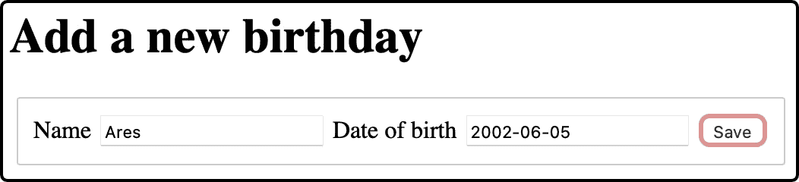

# 第四章：保存表单数据

前一章介绍了 Playwright 和 SvelteKit 路由。我们 `/birthdays` 路由中的数据是硬编码的。在这一章中，我们将通过添加将新生日添加到系统中的功能来强制实现 `load` 函数的真正实现。

*图 4**.1* 显示了我们将要构建的新表单。它附加在 `/``birthdays` 路由的生日列表底部：



图 4.1 – 添加新生日的表单

本章涵盖了以下关键主题：

+   为数据输入添加 Playwright 测试

+   驱动 SvelteKit 表单

+   驱动 SvelteKit 表单操作

到本章结束时，你将很好地理解如何驱动 SvelteKit 表单。

# 技术要求

本章的代码可以在网上找到，地址为 [`github.com/PacktPublishing/Svelte-with-Test-Driven-Development/tree/main/Chapter04/Start`](https://github.com/PacktPublishing/Svelte-with-Test-Driven-Development/tree/main/Chapter04/Start)。

# 为数据输入添加 Playwright 测试

将此测试添加到 `tests/birthdays.test.js` 中。它包括将新生日添加到系统所需的所有步骤：

```js
test('saves a new birthday', async ({ page }) => {
  await page.goto('/birthdays');
  await page.getByLabel('Name').fill('Persephone');
  await page
    .getByLabel('Date of birth')
    .fill('1985-01-01');
  await page.getByRole('button').click();
  await expect(
    page.getByText('Persephone')
  ).toBeVisible();
});
```

在导航到 `/birthdays` 端点后，它使用 `getByLabel` 定位函数来查找一个带有 `Name` 标签的 `input` 字段。这是标准的 HTML 功能，使用 `label` 和 `input` 元素，我们将在下一节中看到。

我们使用 `fill` 函数将值输入到这个字段中，然后重复这个过程为 `Date of birth` 字段。然后，我们点击按钮（任何按钮！），最后检查 `Persephone` 文本是否出现在页面的某个位置。

这里需要区分的一个重要观点是，`getByText` 检查页面文本，而不是例如 `input` 字段的值。因此，我们不能只是填写 `Name` 字段，然后期待期望神奇地通过。

Playwright 测试的目的是展示以下步骤被执行：

1.  用户填写姓名和出生日期。

1.  用户按下 **保存** 按钮。

1.  系统在其系统中记录生日。

1.  浏览器刷新页面，新的生日作为加载的页面数据的一部分显示出来。

考虑到所有这些，我们将使用以下过程来使测试通过：

1.  首先，我们将构建一个新的 `BirthdayForm` 组件，该组件显示一个带有两个输入字段和一个按钮的基本 HTML 表单。

1.  然后，我们将将其添加到上一章中构建的现有 `+page.svelte` 文件中。

1.  最后，我们将添加一个表单操作来添加这个生日，包括在服务器中引入一个新的数据结构来存储我们的生日。

这就涵盖了我们的前期设计，所有这些都包含在 Playwright 测试中。接下来，我们可以开始驱动表单。

# 驱动 SvelteKit 表单

在本节中，你将构建一个名为`BirthdayForm`的新组件，以及其测试套件。这个组件是一个 HTML 表单，包含两个文本字段：`name`和`dob`。每个`input`元素都有一个相应的`label`元素。还有一个名为**保存**的按钮用于提交表单。

SvelteKit 处理从客户端到服务器的表单数据提交。我们不会在我们的 Vitest 测试套件中测试这种行为，而是将其留给 Playwright 测试以确保所有部分正确对接。

按照以下步骤构建新的表单：

1.  创建一个名为`src/routes/birthdays/BirthdayForm.test.js`的新文件，并添加以下第一个测试。这个测试使用了`queryByRole`查询函数来在页面上查找具有`form`角色的元素：

    ```js
    import { describe, it, expect } from 'vitest';
    import {
      render,
      screen
    } from '@testing-library/svelte';
    import BirthdayForm from './BirthdayForm.svelte';
    describe('BirthdayForm', () => {
      it('displays a form', () => {
        render(BirthdayForm);
        expect(screen.queryByRole('form')).toBeVisible();
      });
    });
    ```

1.  确保你运行测试并观察它失败。

1.  然后，创建一个名为`src/routes/birthdays/BirthdayForm.svelte`的新文件，并添加以下内容：

    ```js
    <form />
    ```

1.  如果你现在运行测试，你会看到测试仍然没有通过。那是因为`form`角色只有在给表单命名后才会可用。按照以下方式更新实现：

    ```js
    <form name="birthday" />
    ```

1.  测试现在应该通过了。添加下一个测试，如下面的代码块所示。这个测试简单地检查我们是否通过`POST`请求提交表单，这是向服务器提交新数据的常用机制：

    ```js
    it('has a form method of POST', () => {
      render(BirthdayForm);
      expect(screen.getByRole('form').method).toEqual(
        'post'
      );
    });
    ```

1.  通过添加`method`属性使其通过，如下所示：

    ```js
    <form method="post" name="birthday" />
    ```

1.  然后，添加第三个测试，如下面的代码块所示：

    ```js
    it('displays a button to save the form', () => {
      render(BirthdayForm);
      expect(
        screen.queryByRole('button')
      ).toBeVisible();
    });
    ```

1.  要使其通过，请向表单中添加一个`type`属性设置为`submit`的`input`元素。你也可以给它一个`value`属性为`Save`，这将用作按钮名称：

    ```js
    <form method="post" name="birthday">
      <input type="submit" value="Save" />
    </form>
    ```

1.  对于下一个测试，我们将引入一个嵌套的`describe`块，称为`name field`。我们可以在这里添加一个块以供分组，预期会有更多对这个字段的测试。我们将在*第五章*，*验证* *表单数据*中添加一些：

    ```js
    describe('name field', () => {
      it('displays a text field for the contact name', ()
      => {
        render(BirthdayForm);
        const field = screen.queryByLabelText('Name', {
          selector: 'input[type=text]'
        });
        expect(field).toBeVisible();
        expect(field.name).toEqual('name');
      });
    });
    ```

这个测试使用了`queryByLabelText`函数。这与在 Playwright 测试中使用的`page.getByLabel`函数类似。

在这个测试中还有其他一些重要的内容：`input[type=text]`。从测试中看不太清楚，但这个测试的第一个预期检查以下所有内容：

+   存在一个带有`Name`文本的`label`元素

+   存在一个带有`type`属性设置为`text`的`input`元素

+   `label`元素与`input`元素相关联

这些检查的一部分来自选择器表达式本身。没有解释或对选择器语法的理解，很难知道这个预期的意图。

其中还有一个第二个预期检查，确保`name`属性已设置。这很重要，这样 SvelteKit 表单操作就可以正确地返回命名参数。我们将添加这个参数`name`，在下一个测试中，我们将添加另一个名为`dob`的参数。

在*第八章*，“创建匹配器以简化测试”中，我们将重构这些期望以提高其可读性。

让我们继续下一步：

1.  要使测试通过，请继续添加`label`和`input`元素，如下面的代码块所示：

    ```js
    <form method="post" name="birthday">
      <label>
        Name
    <input type="text" name="name" />
      </label>
      <input type="submit" value="Save" />
    </form>
    ```

1.  现在，我们可以用同样的方法对`出生日期`字段重复同样的操作：

    ```js
    describe('date of birth field', () => {
      it('displays a text field for the date of birth', ()
      => {
        render(BirthdayForm);
        const field = screen.queryByLabelText(
          'Date of birth',
          {
            selector: 'input[type=text]'
          }
        );
        expect(field).toBeVisible();
        expect(field.name).toEqual('dob');
      });
    });
    ```

1.  要使那个测试通过，添加一个用于出生日期的字段：

    ```js
    <form method="post" name="birthday">
      <label>
        Name
        <input type="text" name="name" />
      </label>
      <label>
        Date of birth
        <input type="text" name="dob" />
      </label>
      <input type="submit" value="Save" />
    </form>
    ```

这完成了`BirthdayForm`组件。

## 将表单组件添加到页面组件中

接下来，我们将`BirthdayForm`添加到现有的`/birthdays`路由的页面组件中：

1.  首先，在`src/routes/birthdays/page.test.js`中添加这个测试，如下所示。我们通过检查具有`form`角色的 HTML 元素的存在来测试`BirthdayForm`：

    ```js
    it('displays a form for adding new birthdays', () => {
      render(Page, { data: { birthdays } });
      expect(screen.getByRole('form')).toBeVisible();
    });
    ```

使用先前准备的工作来使测试通过

我们*可以*通过仅添加一个新的`form`元素来使这个测试通过，但鉴于我们已经在`BirthdayForm`中准备了`form`，使用它是有意义的。我们将在*第十一章*，“用*并行实现*替换行为”中看到如何使用组件模拟来使这个测试更具体。

1.  要使这个测试通过，首先将新的`import`语句插入到`src/routes/birthdays/+page.svelte`中：

    ```js
    <script>
       import Birthday from './Birthday.svelte';
    import BirthdayForm from './BirthdayForm.svelte';
       export let data;
    </script>
    ```

1.  然后，添加对`BirthdayForm`组件的引用，以及一个标题。由于标题将保持静态数据，我们不需要为它编写测试。我们的 Vitest 测试仅针对*行为*——当 props 改变或**文档对象模型**（**DOM**）事件触发时发生变化的事物：

    ```js
    <ol>
      ...
    </ol>
    <h1>Add a new birthday</h1>
    <div>
      <BirthdayForm />
    </div>
    ```

1.  当你在这里时，你还可以更新标签以确保`div`具有与`li`元素相同的样式：

    ```js
    <style>
      ...
      li,
    div {
        ...
      }
    </style>
    ```

你现在已经学会了如何测试驱动表单组件以及如何将其连接到你的`page`组件。这就是新的`BirthdayForm`组件的全部内容，如果你现在加载开发服务器并浏览到`/birthdays` URL，你应该会在页面上看到表单。

在下一节中，我们将连接**保存**按钮，以便将新的生日数据添加到系统中。

# 测试驱动 SvelteKit 表单操作

`form`操作是 SvelteKit 在表单提交时调用的东西。它在`+page.server.js`文件中定义为一个名为`actions`的对象。一般形式如下所示。现在不要添加这个；我们稍后会讨论它：

```js
export const actions = {
  default: async ({ request }) => {
    const data = await request.formData();
    // ... do something with data here ...
  }
};
```

这是我们现在要测试驱动的内容。有几个需要注意的点：

+   首先，Vitest 单元测试可以检查`form`操作的行为，但它不会检查调用该操作的 SvelteKit 框架代码。你会记得我们用同样的方法对 HTML 表单进行了测试：我们没有测试`submit`操作，因为这种魔法是由 SvelteKit 管理的。为了测试框架集成，我们需要 Playwright 测试。

+   其次，如果你看一下前面的代码示例，表单操作有一个带有`formData`函数的动作参数。这个函数返回一个`FormData`类型的项，这是一个内置的 DOM 类型。

+   如果我们要测试 `form` 操作，我们需要一种方法来构建这些 `FormData` 对象。

我们要做的就是创建工厂方法来生成用于测试的示例对象。之后，我们将构建我们的表单操作。然而，为了做到这一点，我们需要用 *真实* 实现替换我们的硬编码加载函数。

## 构建 FormData 对象的工厂

创建一个名为 `src/factories/formDataRequest.js` 的新文件，并添加以下函数：

```js
const createFormDataFromObject = (obj) => {
  const formData = new FormData();
  Object.keys(obj).forEach((k) =>
    formData.append(k, obj[k])
  );
  return formData;
};
```

此函数接受一个纯 JavaScript 对象，并通过反复调用 `append` 方法将每个 `obj` 键值对转换为 `FormData` 对象。

接下来，添加 `createFormDataRequest` 函数，如下面的代码块所示。它返回一个与 SvelteKit 相同行为的 SvelteKit 请求对象：

```js
export const createFormDataRequest = (obj) => ({
  formData: () =>
    new Promise((resolve) =>
      resolve(createFormDataFromObject(obj))
    )
});
```

你现在可以使用这个在 Vitest 测试的表单操作中。

## 为表单操作构建 Vitest 测试套件

打开 `src/routes/birthdays/page.server.test.js` 文件，并更新 `load import` 以导入 `actions` 对象：

```js
import { load, actions } from './+page.server.js';
```

在那下面，添加一个新的 `import` 语句，用于你刚刚定义的 `createFormDataRequest` 工厂：

```js
import {
  createFormDataRequest
} from 'src/factories/formDataRequest.js';
```

然后，在文件的底部，在一个新的顶级 `describe` 块中，添加以下测试：

```js
describe('/birthdays - default action', () => {
  it('adds a new birthday into the list', async () => {
    const request = createFormDataRequest({
      name: 'Zeus',
      dob: '2009-02-02'
    });
    await actions.default({ request });
    expect(load().birthdays).toContainEqual(
      expect.objectContaining({
        name: 'Zeus',
        dob: '2009-02-02'
      })
    );
  });
});
```

此测试构建一个请求，用此调用我们的表单操作，然后使用 `load` 函数检查它是否成功返回。但这里有一个困难。因为前一章中的 `load` 函数有一个硬编码的实现，我们无法在那里添加任何新数据。

在我们可以使这个测试通过之前，我们需要将我们的硬编码 `load` 函数替换为一个版本，这样就可以使这个测试容易通过。

跳过测试作为 TDD 工作流程的一部分

有时，我们会编写一个 *Red* 测试并准备好将其变为 *Green*。但使其 *Green* 的方法涉及大量的重构。在这些情况下，最好通过标记新的 *Red* 测试为跳过来回退。然后你可以在 *Green* 的状态下安全地进行重构。一旦你的重构完成，取消跳过你的测试，你就可以回到 *Red*。现在，在所有重构工作完成后，使测试通过。

为什么要经历这个舞蹈？因为你有完全 *Green* 测试套件的安全感，可以告诉你你的重构是否正确完成。

首先，像这样跳过你刚刚添加的测试：

```js
it.skip('adds a new birthday into the list', async () => {
  ...
});
```

重新运行所有测试以检查它们是否通过，除了跳过的测试：

```js
✓ src/routes/birthdays/page.server.test.js (2)
   ✓ /birthdays - load (1)
     ✓ returns a fixture of two items
   ↓ /birthdays - default action (1) [skipped]
     ↓ adds a new birthday into the list [skipped]
...
 Test Files  5 passed (5)
      Tests  15 passed | 1 skipped (16)
```

现在在 `src/routes/birthdays/+page.server.js` 文件中，更新实现如下：

```js
const db = [];
const addNew = (item) => db.push(item);
addNew({ name: 'Hercules', dob: '1994-02-02' });
addNew({ name: 'Athena', dob: '1989-01-01' });
export const load = () => ({
    birthdays: Array.from(db)
});
```

这个新实现给我们提供了一个 `addNew` 函数，我们可以在最新的测试中使用它。

重新运行所有测试并检查它们是否通过。然后，你可以取消跳过最新的测试并重新运行它。你应该会得到一个失败，如下面的代码块所示：

```js
 FAIL  src/routes/birthdays/page.server.test.js > /birthdays - default action > adds a new birthday into the list
TypeError: Cannot read properties of undefined (reading 'default')
 ❯ src/routes/birthdays/page.server.test.js:22:17
     20|   });
     21|
     22|   await actions.default({ request });
```

好吧；我们可以添加一个空的 `default` 函数开始。将以下内容添加到 `src/routes/birthdays/+page.server.js` 文件的底部：

```js
export const actions = {
  default: async ({ request }) => {
  }
};
```

如果你再次运行测试，你会从失败中看到所有管道似乎都正常；只是我们遗漏了添加生日的重要调用：

```js
FAIL  src/routes/birthdays/page.server.test.js > /birthdays - default action > adds a new birthday into the list
AssertionError: expected [ { name: 'Hercules', …(1) }, …(1) ] to deep equally contain ObjectContaining{ …(3) }
 ❯ src/routes/birthdays/page.server.test.js:24:28
     22|   await actions.default({ request });
     23|
     24|   expect(load().birthdays).toContainEqual(
       |                            ^
     25|    expect.objectContaining({
     26|     name: 'Zeus',
  - Expected  - 4
  + Received  + 10
  - ObjectContaining {
  -   "dob": "2009-02-02",
  -   "name": "Zeus",
  - }"
...
```

最后，通过添加对已存在的 `addNew` 函数的调用使测试通过：

```js
export const actions = {
  default: async ({ request }) => {
    const data = await request.formData();
    addNew({
      name: data.get('name'),
      dob: data.get('dob')
    });
  }
};
```

重新运行你的测试；现在所有测试都应该通过了。如果你运行 Playwright 测试，也应该发现它也通过了：

```js
[WebServer]
  ✓  1 test.js:3:1 › index page has expected h1 (499ms)
  ✓  2 birthdays.test.js:3:1 › lists all birthday (507ms)
  ✓  3 birthdays.test.js:13:1 › saves a new birthday (309ms)
  3 passed (5s)
```

现在是启动开发服务器并真正尝试表单的好时机。

你现在已经学会了如何测试驱动 SvelteKit 表单操作，完成了全面测试整个路由所需工作的最后阶段。

# 摘要

本章介绍了如何使用 Playwright 端到端测试和 Vitest 单元测试来测试驱动 SvelteKit 表单和表单操作。

你已经看到了 Vitest 在测试单个 Svelte 组件的所有特殊性方面是有用的，但并不擅长测试 SvelteKit 的框架代码，例如处理 HTML 表单提交事件、构建服务器请求并调用你的表单操作的代码。为此，你需要一个 Playwright 测试。

在下一章中，你将通过添加一些服务器端表单验证来扩展这个表单。
