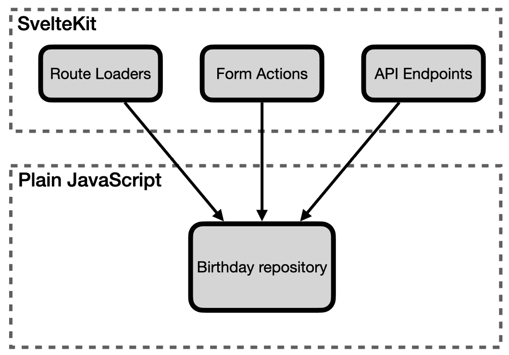

# 第十章：测试驱动 API 端点

SvelteKit 使得创建 API 端点变得轻而易举。本章将探讨如何使用测试来驱动和证明你的 API 端点。

在前面的章节中，你看到了我们如何将业务逻辑从 SvelteKit 推送到纯 JavaScript。我们可以利用提取的 `birthdayRepository` 对象在新 API 端点中使用。现在我们将添加用于创建、更新和获取生日的端点，使用存储库中的 `addNew`、`replace` 和 `getAll` 函数。

*图 10.1* 展示了我们的系统设计是如何形成的。在本章中我们将创建的端点非常轻量级，这得益于完全指定的 `birthdayRepository` 对象：



图 10.1 – SvelteKit 组件流入内部系统

本章我们将涵盖以下关键主题：

+   使用 Playwright 创建服务测试

+   添加用于检索数据的 API 端点

+   添加用于保存数据的 API 端点

+   添加用于更新数据的 API 端点

到本章结束时，你将学会如何使用测试驱动开发来实现 API 端点。

# 技术要求

本章的代码可以在网上找到，链接为 [`github.com/PacktPublishing/Svelte-with-Test-Driven-Development/tree/main/Chapter10/Start`](https://github.com/PacktPublishing/Svelte-with-Test-Driven-Development/tree/main/Chapter10/Start)。

# 使用 Playwright 创建服务测试

你已经看到了如何使用 Playwright 创建端到端测试，通过网页浏览器界面驱动应用程序。它也可以直接驱动 API 端点，这正是本节你要学习的内容。编写前置 Playwright API 测试的好处是我们可以非常仔细地规划我们的 API 将如何呈现。

我们将编写一个名为 `creating and reading a birthday` 的单个测试。它将做两件事：首先，创建一个向 `/api/birthdays` 发送 `POST` 请求的请求，以创建一个生日。然后我们将调用 `GET` `/api/birthdays` 并检查之前创建的生日是否在响应中返回：

1.  创建一个名为 `tests/api/birthdays.test.js` 的新文件，内容如下，这是测试的一半：

    ```js
    import { expect, test } from '@playwright/test';
    test('creating and reading a birthday', async ({
      request
    }) => {
      const newBirthday = await request.post(
        '/api/birthdays',
        {
          data: {
            name: 'Nyx',
            dob: '1993-02-04'
          }
        }
      );
      expect(newBirthday.ok()).toBeTruthy();
    });
    ```

上述代码片段使用了测试的请求参数。它有一个 `request.post` 方法，我们调用它来发送 API 请求。`data` 属性是我们想要发送的 JSON 对象。Playwright 会负责将其转换为 HTTP 请求和响应。请求看起来是这样的：

```js
POST http://localhost:1234/api/birthdays
{
  "name": "Nyx",
  "dob": "1993-02-04"
}
```

返回的对象，我们称之为 `newBirthday`，有一个 `ok` 方法，我们调用它来确定端点是否返回了 `200` 响应。

将断言混合到测试操作中

在前面的章节中，我们所有的测试都按照 *安排-行动-断言* 的格式进行结构化。当涉及到 Playwright 测试时，偶尔会有重复的 *行动-断言* 循环，最终可能变成 *安排-行动-断言-行动-断言…* 的样子。

我不会在我的单元测试中这样做，但在端到端和服务测试中，有时这样做是有意义的，因为它们有助于测试模拟 **用户场景**。测试遵循典型用户会采取的步骤。测试中散布的断言充当检查点，以检查测试是否在正确的路径上。

1.  接下来，通过调用 `/api/birthdays` 端点的 `GET` 请求来完成测试。这里值得注意的是，使用 `expect.anything()` 来表示 *我期望返回一个 ID，但我并不关心它是什么*：

    ```js
    test('creating and reading a birthday', async ({
      request
    }) => {
      ...
      const birthdays = await request.get(
        '/api/birthdays'
      );
      expect(birthdays.ok()).toBeTruthy();
      expect(await birthdays.json()).toEqual({
        birthdays: expect.arrayContaining([
          {
            name: 'Nyx',
            dob: '1993-02-04',
            id: expect.anything()
          }
        ])
      });
    });
    ```

这样就完成了测试；请运行测试并检查它目前是否失败（因为端点尚不存在）。

避免在 Playwright 测试中数据冲突

之前的例子在测试示例中使用了 `Nyx` 这个名字。这个名字之前没有被使用过，但如果你使用了之前的名字之一，比如 `Hercules` 或 `Athena`，你可能会看到其他测试失败。

当前 Playwright 测试套件在单个测试运行之间不会清除测试数据库。在这里，我们通过确保我们的每个测试都使用独立的数据来解决此问题。

另一种方法是在每次测试或测试套件之前始终清理数据库，类似于 Vitest 单元测试的编写方式。

然而，第一种方法有一个优点：你可以将 Playwright 指向已经用你无法控制的数据预置的已部署环境，并仍然期望测试通过。

1.  添加第二个测试，使用 `PUT` HTTP 动词更新生日。请求看起来像这样：

    ```js
    PUT http://localhost:1234/api/birthday/abc123
    {
      "name": "Nyx",
      "dob": "1992-01-02"
    }
    ```

从以下给出的测试的第一部分开始。注意，这是如何提取返回的 `id` 字段，以便我们可以在测试的第二部分中使用它：

```js
test('updating a birthday', async ({ request }) => {
  const newBirthday = await request.post(
    '/api/birthdays',
    {
      data: {
        name: 'Nyx',
        dob: '1993-02-04'
      }
    }
  );
  expect(newBirthday.ok()).toBeTruthy();
  const { id } = await newBirthday.json();
});
```

1.  然后添加测试的第二部分，它使用 `id` 执行 `PUT` 请求并检查结果：

    ```js
    test('updating a birthday', async ({ request }) => {
      ...
      const birthdays = await request.put(
        `/api/birthday/${id}`,
        {
          data: {
            name: 'Nyxx',
            dob: '1992-01-03'
          }
        }
      );
      expect(birthdays.ok()).toBeTruthy();
      const updatedBirthdays = await request.get(
        '/api/birthdays'
      );
      expect(await updatedBirthdays.json()).toEqual({
        birthdays: expect.arrayContaining([
          {
            name: 'Nyxx',
            dob: '1992-01-03',
            id
          }
        ])
      });
    });
    ```

这个最后的期望并没有使用 `expect.anything`。相反，它检查 `id` 是否保持不变。

这样就完成了两个 Playwright 测试，涵盖了三个新的端点。在下一节中，我们将使用 `GET` 请求从系统中检索所有生日。

# 添加用于检索数据的 API 端点

现在我们进入有趣的部分：介绍 API 的新功能。在 SvelteKit 应用程序中，一个 `GET` 请求可以通过在路由内部创建一个名为 `GET` 的函数来非常直接地指定。

虽然我们不会在我们的端点中使用它，但这个函数有一个包含 `route` 参数的 `params` 参数。你将在本章后面实现 `PUT` 请求的 *添加用于更新数据的 API 端点* 部分时看到这一点。

来自端点的有效响应必须是正确的响应对象。我们可以使用 SvelteKit 的 JSON 辅助工具来定义有效的 JSON 响应。错误响应通过抛出一个由调用 SvelteKit 的错误辅助工具构建的异常来处理。我们现在将使用这两个工具。

在 Node 版本低于 18 的版本中，json 辅助工具

调用`json`函数可能会失败，并出现`Response is not defined`错误。如果您在实现以下测试时遇到此错误，您可以安装**node-fetch**包（[`github.com/node-fetch/node-fetch`](https://github.com/node-fetch/node-fetch)），并确保它作为您的 Vitest 设置文件的一部分加载。

让我们先定义一个新的测试套件：

1.  创建一个新的测试文件，`src/routes/api/birthdays/server.test.js`，它以以下`import`语句开始。导入`birthdayRepository`模块，以便在调用`GET`函数之前填充存储库：

    ```js
    import {
      describe, it, expect, beforeEach
    } from 'vitest';
    import {
      createBirthday
    } from 'src/factories/birthday.js';
    import
       as birthdayRepository
    from '$lib/server/birthdayRepository.js';
    import { GET } from './+server.js';
    ```

1.  接下来定义以下辅助方法，`bodyOfResponse`，我们将在第一个测试中使用它来从 HTTP 响应中提取数据。这可以放在导入下面：

    ```js
    const bodyOfResponse = (response) => response.json();
    ```

1.  然后，创建一个新的`describe`块，包含以下测试。它创建两个生日，并检查它们是否被返回：

    ```js
    describe('GET', () => {
      it('returns all the birthdays from the store', async
      () => {
        birthdayRepository.addNew(
          createBirthday('Hercules', '2010-04-05')
          );
        birthdayRepository.addNew(
          createBirthday('Ares', '2008-03-02')
        );
        const { birthdays } = await bodyOfResponse(GET());
        expect(birthdays).toEqual([
          expect.objectContaining(
            createBirthday('Hercules', '2010-04-05')
          ),
          expect.objectContaining(
            createBirthday('Ares', '2008-03-02')
          )
        ]);
      });
    });
    ```

测试数组响应

我发现，在测试数组对象时，使用列表中的两个（有时是三个）项目而不是只有一个项目总是最好的。这样，可以清楚地看出测试是在操作项目列表，而不仅仅是单个项目。

1.  为了使该测试通过，创建一个名为`src/routes/api/birthdays/+server.js`的新文件，并包含以下内容。实现方式如下：它直接使用`getAll`函数将请求传递到存储库，然后通过调用 SvelteKit 的`json`函数包装响应：

    ```js
    import {
      getAll
    } from '$lib/server/birthdayRepository.js';
    import { json } from '@sveltejs/kit';
    export const GET = () =>
      json({ birthdays: getAll() });
    ```

这完成了`GET`请求。接下来，我们将处理`POST`和`PUT`请求。

# 添加用于保存数据的 API 端点

在本节中，我们将首先添加用于保存数据的`POST`请求处理函数，然后继续在它自己的路由文件中添加`PUT`函数，用于更新数据。

让我们从定义一个测试辅助函数开始：

1.  创建一个新文件，`src/factories/request.js`，包含以下内容。这将由`POST`和`PUT`函数共同使用，以读取请求的数据。SvelteKit 将传递一个`Request`参数。我们只需要提供这个参数的`json`方法，如下所示：

    ```js
    export const createRequest = (json) => ({
      json: () => Promise.resolve(json)
    });
    ```

提供协作对象的最低版本

SvelteKit 将`Request`对象传递到我们的请求处理函数中。但对我们来说，单元测试不需要完整的`Request`对象，我们只需要一个实现我们使用的接口部分的简单对象。我们的应用程序代码除了用于以 JSON 格式读取请求体之外，不使用任何其他方法，因此我们只需要这个方法。

1.  现在转到`src/api/birthdays/server.test.js`，并添加一个`import`语句用于`createRequest`方法。同时，更新`+server.js`的导入以包括`POST`请求处理函数：

    ```js
    import {
      createRequest
    } from 'src/factories/request.js';
    import { GET, POST } from './+server.js';
    ```

1.  接下来，在`GET`函数的`describe`块下方添加一个新的`describe`块，并包含以下测试：

    ```js
    describe('POST', () => {
      beforeEach(birthdayRepository.clear);
      it('saves the birthday in the store', async () => {
        await POST({
          request: createRequest(
            createBirthday('Hercules', '2009-03-01')
          )
        });
        expect(birthdayRepository.getAll()).toHaveLength(1
          );
        expect(birthdayRepository.getAll()[0]).toContain(
          createBirthday('Hercules', '2009-03-01')
        );
      });
    });
    ```

1.  为了使该测试通过，首先更新`src/api/birthdays/+server.js`中的导入以包括`addNew`函数：

    ```js
    import {
      addNew,
      getAll
    } from '$lib/server/birthdayRepository.js';
    ```

1.  继续添加对 `POST` 的定义，如下面的代码块所示。在此更改后，你的测试应该通过：

    ```js
    export const POST = async ({ request }) => {
      const { name, dob } = await request.json();
      addNew({ name, dob });
    };
    ```

1.  现在我们已经将数据保存到仓库中，是时候检查 HTTP 响应了。我们希望任何 API 调用者都能收到相同的数据。以下测试使用了 `toContain` 匹配器而不是 `toEqual`。这是因为我们已经知道响应将包含一个与本次测试无关的 `id` 字段：

    ```js
    it('returns a json response with the data', async () => {
      const response = await POST({
        request: createRequest(
          createBirthday('Hercules', '2009-03-01')
        )
      });
      expect(await bodyOfResponse(response)).toContain(
        createBirthday('Hercules', '2009-03-01')
      );
    });
    ```

测试 id 字段的存在

为什么 `id` 字段没有被包含在本次测试的期望中？因为它与其他数据有不同的生命周期。这个测试验证了用户提供的信息已被存储。但 `id` 字段是自动生成的，因此它属于另一个测试。我在这里省略了它，因为它已经在仓库和 Playwright API 测试中测试过了，但你可能觉得包括这个测试会更舒服。

1.  为了使测试通过，向函数中添加一个使用 `json` 函数导入的 `return` 值：

    ```js
    export const POST = async ({ request }) => {
      const { name, dob } = await request.json();
      const result = addNew({ name, dob });
      return json(result);
    };
    ```

1.  `POST` 请求处理函数的最终测试是检查如果数据无效，函数是否会抛出异常。抛出错误可能会使测试复杂化：在这里，测试使用对 `expect.hasAssertions` 的调用确保如果调用 *不* 抛出错误，Vitest 将失败测试：

    ```js
    it('throws an error if the data is invalid', async () => {
      expect.hasAssertions();
      try {
        await POST({
          request: createRequest(
            createBirthday('Ares', '')
          )
        });
      } catch (error) {
        expect(error.status).toEqual(422);
        expect(error.body).toEqual({
          message:
            'Please provide a date of birth in the YYYY-
              MM-DD format.'
        });
      }
    });
    ```

现在尝试运行这个测试：你会看到 `expected any number of assertions, but got none` 的失败。这是测试顶部 `hasAssertions` 语句的功劳。

理解 hasAssertions 辅助函数

尝试从测试中删除 `expect.hasAssertions` 行。你会注意到测试已经通过了。这是因为期望从未被满足。这就是 `hasAssertions` 调用的目的：它在依赖于在 `catch` 块中有期望的测试中很有用，这些期望直到你在应用程序代码中实现抛出异常的行为才会被调用。

1.  为了使其通过，首先更新 `src/api/birthdays/+server.js` 中的 `import` 语句以包含 `error` 辅助函数：

    ```js
    import { json, error } from '@sveltejs/kit';
    ```

1.  然后更新 `POST` 函数，将仓库中的任何错误重新打包成一个 `error` 对象，然后抛出：

    ```js
    export const POST = async ({ request }) => {
      const { name, dob } = await request.json();
      const result = addNew({ name, dob });
      if (result.error) throw error(422, result.error);
      return json(result);
    };
    ```

这样就完成了插入新生日信息的 `POST` 请求处理函数；下一节通过添加更新现有生日的 `PUT` 请求处理函数来完成本章。

# 添加用于更新数据的 API 端点

最后一步是添加一个用于处理更新的 `PUT` 请求处理函数。类似于 `POST` 函数，我们必须使用 `createRequest` 辅助函数提供请求体。

我们的 `PUT` 请求的形式意味着 `id` 作为参数传递到 URL 中，如下所示：

这里是一个关于如何传递 URL 的提醒：

```js
PUT http://localhost:1234/api/birthday/abc123
```

为了让 SvelteKit 将 `abc123` 值注册为参数，我们需要在 `src/routes/api/birthday/[id]` 创建一个新的路由目录。SvelteKit 将知道 `abc123` 匹配目录路径中的 `[id]` 部分。该目录本身将包含 `+server.js` 文件及其测试。

让我们从测试开始：

1.  创建一个名为`src/routes/api/birthday/[id]/server.test.js`的新文件，并添加以下导入。这包括了之前用于`GET`和`POST`函数的所有内容，以及`PUT`函数的导入：

    ```js
    import {
      describe,
      it,
      expect,
      beforeEach
    } from 'vitest';
    import
       as birthdayRepository
    from '$lib/server/birthdayRepository.js';
    import {
      createBirthday
    } from 'src/factories/birthday.js';
    import {
      createRequest
    } from 'src/factories/request.js';
    import { PUT } from './+server.js';
    ```

1.  然后，创建这个新的`describe`块。它包含一个`beforeEach`块，不仅清除仓库，还插入一个新项目，以便编辑：

    ```js
    describe('PUT', () => {
      beforeEach(() => {
        birthdayRepository.clear();
        birthdayRepository.addNew(
          createBirthday('Hercules', '2009-03-01')
        );
      });
    });
    ```

1.  在我们到达第一个测试之前，添加以下辅助函数：

    ```js
    const storedId = () =>
      birthdayRepository.getAll()[0].id;
    ```

1.  现在添加第一个测试，如下所示。它通过向处理程序传递一个新的`params`对象来模仿 SvelteKit 的调用语义：

    ```js
    it('updates the birthday in the store', async () => {
      await PUT({
        request: createRequest(
          createBirthday('Hercules', '1999-03-01')
        ),
        params: { id: storedId() }
      });
      expect(birthdayRepository.getAll()).toHaveLength(1);
      expect(birthdayRepository.getAll()[0]).toContain(
        createBirthday('Hercules', '1999-03-01')
      );
    });
    ```

1.  为了使其通过，创建一个名为`src/routes/api/birthday/[id]/+server.js`的新文件，并包含以下内容。这应该会立即使测试通过：

    ```js
    import {
      replace
    } from '$lib/server/birthdayRepository.js';
    export const PUT = async ({
      request,
      params: { id }
    }) => {
      const { name, dob } = await request.json();
      const result = replace(id, { name, dob });
    };
    ```

1.  对于下一个测试，我们将从重复`GET`测试中的一个辅助函数开始。添加`bodyOfResponse`函数，如下所示：

    ```js
    const bodyOfResponse = (response) => response.json();
    ```

1.  然后，添加下一个测试，该测试使用此函数来检查响应：

    ```js
    it('returns a json response with the data', async () => {
      const response = await PUT({
        request: createRequest(
          createBirthday('Hercules', '1999-03-01')
        ),
        params: { id: storedId() }
      });
      expect(await bodyOfResponse(response)).toContain(
        createBirthday('Hercules', '1999-03-01', {
          id: storedId()
        })
      );
    });
    ```

1.  为了使其通过，首先在应用程序代码中添加对`json`的导入：

    ```js
    import { json } from '@sveltejs/kit';
    ```

1.  然后，更新`PUT`函数以返回仓库操作的结果，就像我们处理`POST`请求处理函数一样：

    ```js
    export const PUT = async ({
      request,
      params: { id }
    }) => {
      const { name, dob } = await request.json();
      const result = replace(id, { name, dob });
      return json(result);
    };
    ```

1.  最后一个测试重复了最后一个`POST`测试的机制，检查数据无效时会发生什么：

    ```js
    it('throws an error if the data is invalid', async () => {
      expect.hasAssertions();
      try {
        await PUT({
          request: createRequest(
            createBirthday('Hercules', '')
          ),
          params: { id: storedId() }
        });
      } catch (error) {
        expect(error.status).toEqual(422);
        expect(error.body).toEqual({
          message:
            'Please provide a date of birth in the YYYY-
              MM-DD format.'
        });
      }
    });
    ```

1.  为了使其通过，首先更新应用程序代码中的`import`语句以包含`error`函数：

    ```js
    import { json, error } from '@sveltejs/kit';
    ```

1.  最后，在`PUT`函数中包含守卫子句，如下所示：

    ```js
    export const PUT = async ({
      request,
      params: { id }
    }) => {
      const { name, dob } = await request.json();
      const result = replace(id, { name, dob });
      if (result.error) throw error(422, result.error);
      return json(result);
    };
    ```

就这样。如果你现在运行 Vitest 和 Playwright 测试，你应该会发现它们都通过了。

# 摘要

本章展示了如何快速处理 API 端点。Playwright 测试可以用来指定 API 应该如何表现，单元测试可以用来驱动设计并确保我们最终得到最小化的实现。

下一章完成了 API 故事弧：我们将更新表单操作以使用新的 API 端点，而不是直接访问仓库。
