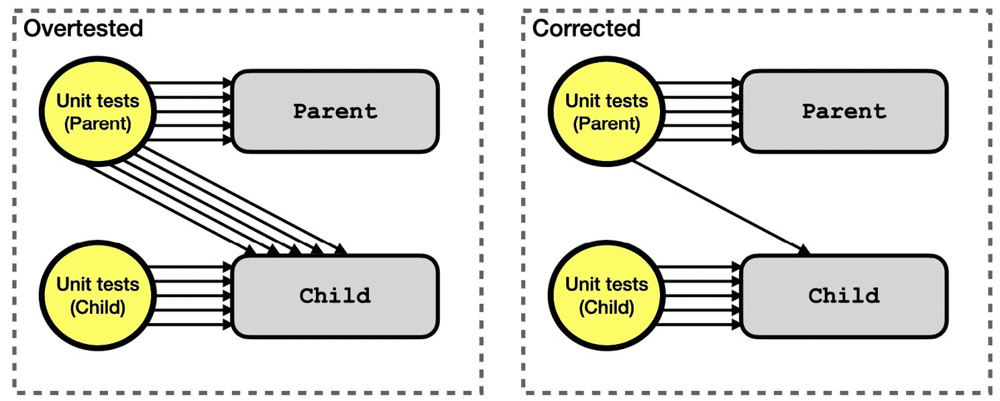

# 第十二章：使用组件模拟来澄清测试

前一章介绍了测试替身（test double）的概念，并展示了如何使用`vi.fn`在 Vitest 测试套件中替换掉不希望的行为。同样的技术也可以用于 Svelte 组件，但稍微复杂一些。

假设你正在为一个名为`Parent`的组件编写单元测试，而这个组件本身渲染了另一个开发者定义的组件，名为`Child`。默认情况下，当你的测试渲染`Parent`时，`Child`也会被渲染。但使用组件模拟可以阻止这种情况发生。它会用测试替身替换掉真实的`Child`。

你可能想要这样做的原因有很多：

+   `Child`组件已经有了自己的单元测试套件，你不想重复测试（这是过度测试的一种形式，在*避免组件模拟*部分有详细描述）

+   `Child`组件在挂载时有一些行为，例如通过 Fetch API 获取数据，你更希望避免在测试中运行这些行为

+   `Child`组件来自第三方库，验证它渲染的属性比验证第三方组件本身的行为更重要

使用组件模拟的缺点是它们很复杂，如果你不小心，它们可能会成为负担。

使用测试替身保持安全

使用组件模拟以及测试替身的一般规则是避免在它们中构建任何控制逻辑（`if`语句和循环）。相反，当你使用`mockReturnValue`或`mockResolvedValue`来指定返回的值时，始终优先返回固定值。

确保这一点的一个简单方法是为每个单元测试获取其自己的测试替身实例。换句话说，避免在`beforeEach`块中设置测试替身并在所有测试中重复使用它。

如果你发现难以保持测试替身简单，这可能意味着应用程序代码设计过于复杂。尝试重新配置待测试的对象，例如将其拆分为多个单独的对象。

本章涵盖了以下主题：

+   在可能的情况下避免使用组件模拟

+   使用手工制作的组件存根

+   使用组件模拟库

到本章结束时，你将能够自信地使用组件模拟技术，并知道何时使用它们。

# 技术要求

本章的代码可以在网上找到，地址为[`github.com/PacktPublishing/Svelte-with-Test-Driven-Development/tree/main/Chapter12/Start`](https://github.com/PacktPublishing/Svelte-with-Test-Driven-Development/tree/main/Chapter12/Start)。

# 避免使用组件模拟

本节介绍了如何在不需要使用组件模拟的情况下构建应用程序。当然，我们到目前为止构建的应用程序没有使用任何组件模拟，所以你已经知道这是可能的。

我们构建的 SvelteKit 应用程序有一个页面路由组件，它渲染一个 `Birthday` 组件列表和一个 `BirthdayForm` 组件。这两个组件都有自己的测试套件，因此它们当然适合使用组件模拟。页面路由组件只需检查它是否以正确的方式渲染了 `Birthday` 和 `BirthdayForm`，并避免测试任何生日本身。

但这样做并没有多大意义。这两个组件在挂载时都没有任何行为，所以让它们渲染没有问题。

不使用组件模拟的最大风险是 `Birthday` 组件测试套件在页面路由测试套件中的重复。

*图 12.1* 显示了如何在不过度测试的情况下开发 `Parent` 和 `Child` 组件的测试套件。`Parent` 测试套件只需要测试一个到 `Child` 的单一流程，以证明连接。如果有任何有趣的数据回流从 `Child` 返回到 `Parent`（例如组件事件绑定），那么它们也应该被测试。



图 12.1 – 组件层次结构中两个级别的重复测试导致的过度测试

幸运的是，TDD 有几条规则可以避免过度测试的问题。

## 使用 TDD 避免过度测试

想象一下，你首先使用自下而上的方法构建你的应用程序，这正是本书所采用的方法。这意味着你在编写 `Parent` 组件及其测试套件之前先编写 `Child` 组件及其测试套件。

当你开始测试驱动 `Parent` 组件时，你会编写一个测试来引入 `Child` 组件。（测试描述可能类似于 *显示生日信息*。）回想一下 TDD 规则中的 *进行可能的最简单更改*。由于你已经有现成的 `Child` 组件，那么最简单的更改就是直接引入 `Child` 组件。

然后，*红* 测试的规则开始发挥作用，这是避免过度测试的关键规则。除非你看到测试失败，否则你不能进行测试。但是，如果你的第一个测试引入了 `Child` 组件，你突然会免费获得 `Child` 的所有行为。所以，如果你遵循 TDD，你不可能为 `Child` 的所有行为编写 *红* 测试，因为它已经通过了。

现在想象一下，你开始构建 `Parent` 组件，并在某个时刻产生了提取 `Child` 组件的冲动（你可能将其视为自顶向下的方法）。你如何进行提取 `Child`？如果你非常严格，你可能会从重写 `Child` 组件的测试开始，就像我们在 *第九章* 中所做的那样，*从框架中提取逻辑*，当时我们提取了生日存储库。但通常，你不会就此停止：你还会想回去删除 `Parent` 中的那些额外测试。

你可以将这视为 TDD 循环中的 *重构* 步骤。实际上，我们在前一章中就是这样做的，当我们改变系统功能时，我们最终删除了一大堆测试。

再次强调本节的内容：你并不总是需要使用模拟。如果你只有一个测试来证明 `Parent` 和 `Child` 之间的连接，这通常就足够了。此外，使用 TDD 可以自然地引导你采用这种方法。

# 使用手工组件存根

在本节中，我们将探讨一种简单但有效的方法来模拟组件，即通过构建手工组件存根。这并不像使用组件模拟库那样聪明，但它更简单，更容易理解。通常，最简单的方法是最好的选择。

为了回顾我们试图做什么：我们有一个我们想要避免渲染的子组件，可能是因为它有挂载行为或者它是一个复杂的第三方组件。

手工组件存根依赖于 Vitest 的 `vi.mock` 函数以及一个特殊的 `__mocks__` 目录。你创建一个与你的组件同名但位于同一级别的 `__mocks__` 目录中的存根组件。然后，你通过在测试文件顶部放置 `vi.mock` 语句来指示 Vitest 使用模拟。这意味着整个测试套件都将使用模拟。

我们可以通过使用页面路由组件测试套件来演示这一点，为 `Birthday` 和 `BirthdayForm` 组件构建模拟。这些组件在挂载时没有副作用，它们也不是第三方组件，但它们有自己的测试套件。因此，尽管感觉没有必要进行这种更改，但这样做并不危险。

由于这项工作不是必需的，我们将在名为 `page.mocks.test.js` 的测试文件中构建一个示例测试套件。虽然这并不是我在现实世界中会这样做的方式，但它确实突出了你如何在同一个代码库中既有模拟又有非模拟的单元测试。

我们将从如何使用存根组件验证 props 开始，然后检查实例的顺序，接着处理复杂的 prop 验证，最后看看如何分发组件事件。

## 在组件存根中渲染所有 props

在前一章中，你看到了验证传递给测试替代的 props 的重要性。组件存根也不例外。我们这样做的方式是确保组件存根渲染所有 props，然后使用标准的 DOM 匹配器来验证它们的存在。

让我们首先创建一个 `Birthday` 组件的手工组件存根：

1.  创建一个名为 `src/routes/birthdays/__mocks__` 的新目录。这个特殊的名称会被 Vitest 自动识别为存放你的模拟文件的位置。

1.  创建一个名为 `src/routes/birthdays/__mocks__/Birthday.svelte` 的新文件，内容如下。它什么也不做，只是渲染传入的所有 props：

    ```js
    <script>
      export let name;
      export let dob;
    </script>
    <div>
      {name}
      {dob}
    </div>
    ```

1.  现在创建一个名为`src/routes/birthdays/page.mock.test.js`的新测试文件，并从常用的`import`语句开始。注意`vi`是如何被包含在内的；我们将在下一步中使用它：

    ```js
    import {
      describe,
      it,
      expect,
      vi
    } from 'vitest';
    import {
      render,
      screen
    } from '@testing-library/svelte';
    import { click } from '@testing-library/user-event';
    import {
      createBirthday
    } from 'src/factories/birthday.js';
    import Page from './+page.svelte';
    ```

1.  接下来，在`import`语句下方，添加对`vi.mock`的调用。提供的路径必须与`实际`的`Birthday`组件路径匹配。Vitest 将拾取模拟并加载该组件：

    ```js
    vi.mock('./Birthday.svelte');
    ```

1.  现在，开始一个新的`describe`块，以及一个示例`birthdays`数组。我们所有的测试都将使用这个：

    ```js
    describe('/birthdays', () => {
      const birthdays = [
        createBirthday('Hercules', '1994-02-02', {
          id: '123'
        }),
        createBirthday('Athena', '1989-01-01', {
          id: '234'
        })
      ];
    });
    ```

1.  进行第一次测试的时间。这将检查给定之前定义的两个生日，每个正确的信息片段都显示在屏幕上：

    ```js
    it('displays a Birthday component for each birthday', () => {
      render(Page, { data: { birthdays } });
      expect(
        screen.queryByText(/Hercules/)
      ).toBeVisible();
      expect(
        screen.queryByText(/1994-02-02/)
      ).toBeVisible();
      expect(
        screen.queryByText(/Athena/)
      ).toBeVisible();
      expect(
        screen.queryByText(/1989-01-01/)
      ).toBeVisible();
    });
    ```

测试组件列表

此测试检查**两个**生日，而不是一个：因为我们感兴趣的是列表行为——每个条目一个`Birthday`组件——所以测试确实给出了生日列表的`Birthday`组件列表很重要。单个生日不足以证明列表。

1.  由于我们的实现已经存在，此测试应该已经通过。但证明测试有效很重要，这次我们还想验证模拟已被拾取。所以，首先删除*实际*的`Birthday`组件的内容（不是模拟）。测试应该*仍然*通过。（确保您使用`v src/routes/birthdays/page.mocks.test.js`命令运行测试，否则您将看到来自其他测试套件的全部失败。）这应该让您相信模拟已被拾取。

1.  撤销对`Birthday`组件的更改，现在让我们进行一个更改以使测试失败。在页面路由组件`src/routes/birthday/+page.svelte`中，注释掉`Birthday`组件的渲染，如下所示：

    ```js
    <!--Birthday
      name={birthday.name}
      dob={birthday.dob}
    /-->
    ```

1.  使用`v src/routes/birthdays/page.mocks.test.js`运行测试，并验证测试现在失败。然后，撤销您的更改。

您现在已经了解了组件存根的基本用法。

## 检查组件实例的排序

有时候，当我们处理组件列表时，我们想检查实例的排序。我们可以使用`data-testid`属性来获取每个特定实例以进行检查。

有一个普遍的建议是避免在测试中使用`data-testid`。这是一个好建议，但您的组件存根是测试套件的一部分，而不是应用程序代码，所以在这里使用它们是安全的。

何时使用列表排序测试

本节中的测试并不非常符合 TDD（测试驱动开发）的风格；它证明了我认为的*默认*列表排序。如果您已经有了一个检查数据是否列出的测试，就像前一个节中的*步骤 6*中的那样，那么使那个测试通过的最简单方法就是实现默认排序。所以，编写一个像您即将看到的测试一样，可能会默认通过，因此是一个无效的测试。

让我们开始：

1.  更新组件存根以添加一个`data-testid`属性，如下所示：

    ```js
    <script>
      export let name;
      export let dob;
    </script>
    <div data-testid="Birthday">
      {name}
      {dob}
    </div>
    ```

1.  现在，编写一个测试来证明排序。它使用`queryAllByTestId`来返回一个匹配特定`data-testid`属性值的元素列表，按照它们在文档中的顺序：

    ```js
    it('displays the Birthdays in the same order as the props passed in', () => {
      render(Page, { data: { birthdays } });
      const birthdayEls =
        screen.queryAllByTestId('Birthday');
      expect(birthdayEls[0]).toHaveTextContent(
        /Hercules/
      );
      expect(birthdayEls[1]).toHaveTextContent(
        /Athena/
      );
    });
    ```

1.  这将通过，但请确保你通过使用之前提到的注释技巧来验证它不会通过。

还值得指出的是，还有一种编写排序测试的方法，不涉及使用`data-testid`属性。你可以获取页面上的`ol`元素，然后将每个`li`元素映射到它们的文本内容，并检查它是否按照你预期的顺序是一个数组。

## 处理复杂属性

有时候，你的组件的属性是对象或数组，如果你要在组件存根中渲染它们，你会在存根中结束于一大堆代码。有一种更短的方法来输出属性值，那就是使用`JSON.stringify`函数。

现在我们为`BirthdayForm`组件做这件事：

1.  创建一个名为`src/routes/birthdays/__mocks__/BirthdayForm.svelte`的新文件，内容如下：

    ```js
    <script>
      export let form;
    </script>
    <div>
      Editing {JSON.stringify(form)}
    </div>
    ```

1.  在你的测试套件中，添加一个新的`vi.mock`调用，以获取这个组件，紧邻之前的`vi.mock`调用：

    ```js
    vi.mock('./BirthdayForm.svelte');
    ```

1.  接下来，在测试套件的顶部添加以下辅助函数：

    ```js
    const firstEditButton = () =>
      screen.queryAllByRole('button', {
        name: 'Edit'
      })[0];
    ```

1.  然后，添加下一个测试，如图所示；它也调用了`JSON.stringify`。这应该会通过，但请确保在完成之前进行验证：

    ```js
    it('passes the currently edited birthday to the BirthdayForm component', async () => {
      render(Page, { data: { birthdays } });
      await click(firstEditButton());
      expect(
        screen.queryByText(
          `Editing ${JSON.stringify(birthdays[0])}`
        )
      ).toBeInTheDocument();
    });
    ```

你会注意到组件存根和测试套件之间的耦合。我发现，只要它是你用来检查复杂属性的唯一模式，并且开发者之间使用一致，那么利用`JSON.stringify`的技术通常是可行的。

## 派发组件事件

我们将要探讨的最后一个组件存根技术是派发组件事件的机制。正如上一节所述，这是尴尬的，因为在没有在存根本身中定义派发对象的情况下，不可能在手工制作的存根上引发组件事件。

处理这个问题的一种方法是将一个按钮放入存根中并使用它来派发事件：

警告

以下示例在我们应用程序的上下文中并没有太多意义：实际的`BirthdayForm`组件没有这个*取消*行为，而且如果这个功能*确实*存在，可能更有意义的是在页面路由中放置**取消**按钮，避免需要组件事件。

1.  更新`BirthdayForm`组件存根以包含一个派发`cancel`事件的`button`元素：

    ```js
    <script>
      import { createEventDispatcher } from 'svelte';
      const dispatcher = createEventDispatcher();
      export let form;
    </script>
    <div data-testid="BirthdayForm">
      Editing {JSON.stringify(form)}
      <button on:click={() => dispatcher('cancel')} />
    </div>
    ```

1.  现在，你可以添加一个测试来检查当派发`cancel`事件时会发生什么：

    ```js
    it('cancels editing', async () => {
      render(Page, { data: { birthdays } });
      await click(firstEditButton());
      const button = screen
        .getByTestId('BirthdayForm')
        .querySelector('button');
      await click(button);
      expect(
        screen.queryByText(
          `Editing ${JSON.stringify(birthdays[0])}`
        )
      ).not.toBeInTheDocument();
    });
    ```

1.  为了使这个测试通过，更新`page`组件以响应`cancel`事件：

    ```js
    <BirthdayForm
      form={editing}
      on:cancel={() => (editing = null)}
    />
    ```

记住，*真正的* `BirthdayForm` 组件没有这种行为，这暴露了模拟组件的一个大问题：保持模拟与实际实现一致是具有挑战性的。

避免手工制作模拟并使用库是处理此问题的方法之一，我们将在下一节中看到。

# 使用组件模拟库

在上一章中，你看到了如何使用`vi.fn`来监视函数。`svelte-component-double` npm 包可以以类似的方式使用，实现你刚刚学到的手工制作模拟的相同效果。

该包包括`toBeRendered`和`toBeRenderedWithProps`等匹配器，用于检查组件是否确实以你想要的方式渲染。

让我们将这个分成几个部分：安装库和编写测试。

## 安装库

该库需要一些设置来将相关的匹配器放置到位：

1.  运行以下命令来安装包：

    ```js
    npm install --save-dev svelte-component-double
    ```

1.  然后，创建一个名为`src/vitest/registerSvelteComponentDouble.js`的新文件，内容如下。它注册了匹配器，并使我们能够全局访问`componentDouble`函数，这不是必需的，但使模拟设置更容易：

    ```js
    import { expect } from 'vitest';
    import
      as matchers
    from 'svelte-component-double/vitest';
    expect.extend(matchers);
    import {
      componentDouble
    } from 'svelte-component-double';
    globalThis.componentDouble = componentDouble;
    ```

1.  然后，更新你的`vite.config.js`文件，包括新的设置文件：

    ```js
    setupFiles: [
      ...,
      './src/vitest/registerSvelteComponentDouble.js'
    ],
    ```

你现在可以使用库进行测试了。

## 使用`componentDouble`函数编写测试

现在，我们将重写模拟测试套件，使用库而不是手工制作的组件占位符：

1.  首先，重新定义对`vi.mock`的两个调用，如下所示。每个`componentDouble`调用都得到一个字符串标识符。这出现在你的 DOM 输出中，并在期望失败时使用：

    ```js
    vi.mock('./Birthday.svelte', async () => ({
      default: componentDouble('Birthday')
    }));
    vi.mock('./BirthdayForm.svelte', async () => ({
      default: componentDouble('BirthdayForm')
    }));
    ```

1.  你还需要在文件顶部添加两个`import`语句，以便你可以访问模拟对象。虽然看起来你正在导入实际的组件，但实际上你会得到组件占位符：

    ```js
    import Birthday from './Birthday.svelte';
    import BirthdayForm from './BirthdayForm.svelte';
    ```

1.  之间也很重要重置组件占位符。这是因为`vi.mock`在每个测试套件中只会生成一个占位符。在`describe`块顶部添加以下两个调用到`beforeEach`：

    ```js
    describe('/birthdays', () => {
      beforeEach(Birthday.reset);
      beforeEach(BirthdayForm.reset);
      ...
    });
    ```

1.  你还需要更新`import`语句，以引入`beforeEach`函数：

    ```js
    import {
      ...,
      beforeEach
    } from 'vitest';
    ```

1.  现在进行第一次测试。这次测试使用的是`toBeRendered`匹配器，它检查组件是否出现在文档的某个位置。更新第一个测试，使其看起来如下所示：

    ```js
    it('displays a Birthday component for each birthday, () => {
      render(Page, { data: { birthdays } });
      expect(Birthday).toBeRendered();
    });
    ```

1.  要运行此测试，将其标记为`it.only`，然后运行 Vitest 测试套件。你应该看到它通过；你可以通过以下方式验证它，即在页面路由组件中注释掉`Birthday`组件实例。这次，你会看到以下失败信息打印出来：

    ```js
    Error: Expected "Birthday" component double to be rendered but it was not
    ```

1.  撤销该更改，以便测试再次通过。

1.  我们知道显示的不仅仅是`Birthday`组件一个，而是两个。我们可以使用`toBeRenderedWithProps`匹配器来检查组件的单独实例。更新相同的测试，使用该匹配器，如下所示：

    ```js
    it('displays a Birthday component for each birthday', () => {
      render(Page, { data: { birthdays } });
      expect(Birthday).toBeRenderedWithProps({
        name: 'Hercules',
      dob: '1994-02-02'
      });
      expect(Birthday).toBeRenderedWithProps({
        name: 'Athena',
        dob: '1989-01-01'
      });
    });
    ```

注意到`toBeRenderedWithProps`的调用不需要指定完整的属性集。如果给定的子集匹配，则期望通过。这意味着我们可以避免检查`id`字段，这对于测试目的来说是不必要的细节。

1.  如果你注释掉组件中`Birthday`的渲染，你会看到这个匹配器失败的样子：

    ```js
    Error: Expected "Birthday" component double to have been rendered once with props but it was not
    Expected: Object {
      "dob": "1994-02-02",
      "name": "Hercules",
    }
    Received:
    ```

1.  本测试套件的第二个测试检查组件的顺序。我们可以通过使用存在于双实例上的`propsOfAllInstances`函数来实现这一点。更新测试如下：

    ```js
    it('displays the Birthdays in the same order as the props passed in', () => {
      render(Page, { data: { birthdays } });
      expect(Birthday.propsOfAllInstances()).toEqual([
        expect.objectContaining({ name: 'Hercules' }),
        expect.objectContaining({ name: 'Athena' })
      ]);
    });
    ```

1.  对于`BirthdayForm`的第一个测试不再需要任何`JSON.stringify`魔法。我们只需直接测试对象属性即可。更新测试如下：

    ```js
    it('passes the currently edited birthday to the BirthdayForm component', async () => {
      render(Page, { data: { birthdays } });
      await click(firstEditButton());
      expect(BirthdayForm).toBeRenderedWithProps({
        form: birthdays[0]
      });
    });
    ```

1.  最后，最后一个测试可以利用`dispatch`双函数将事件分发给父组件。注意这比手动编写的模拟要简单得多：

    ```js
    it('cancels editing', async () => {
      render(Page, { data: { birthdays } });
      await click(firstEditButton());
      await BirthdayForm.dispatch('cancel');
      expect(BirthdayForm).not.toBeRenderedWithProps({
        form: birthdays[0]
      });
    });
    ```

最后这两个测试展示了使用组件模拟库而不是手动编写的模拟可以多么简单。这完成了本节的内容。你现在已经发现了使用`svelte-component-double`库简化测试套件的全部内容。

# 摘要

本章详细探讨了组件模拟。我们首先探讨了在大多数情况下通常可以避免使用组件模拟，这很重要，因为组件模拟是测试套件复杂性的主要原因之一。

然后，你看到了如何使用利用 Vitest 的`vi.mock`函数和特别命名的`__mocks__`目录中的组件存根的手动编写的模拟。你也看到了它们如何迅速变得复杂。

最后，我们探讨了使用`svelte-component-double`库来避免使用手动编写的模拟。这提供了一些简单的匹配器和一些辅助函数，以帮助你编写测试。

这完成了本书中所有单元测试主题。下一章将增加一种测试技术：使用 Cucumber.js 为团队编写**行为驱动开发**（**BDD**）风格的测试。
