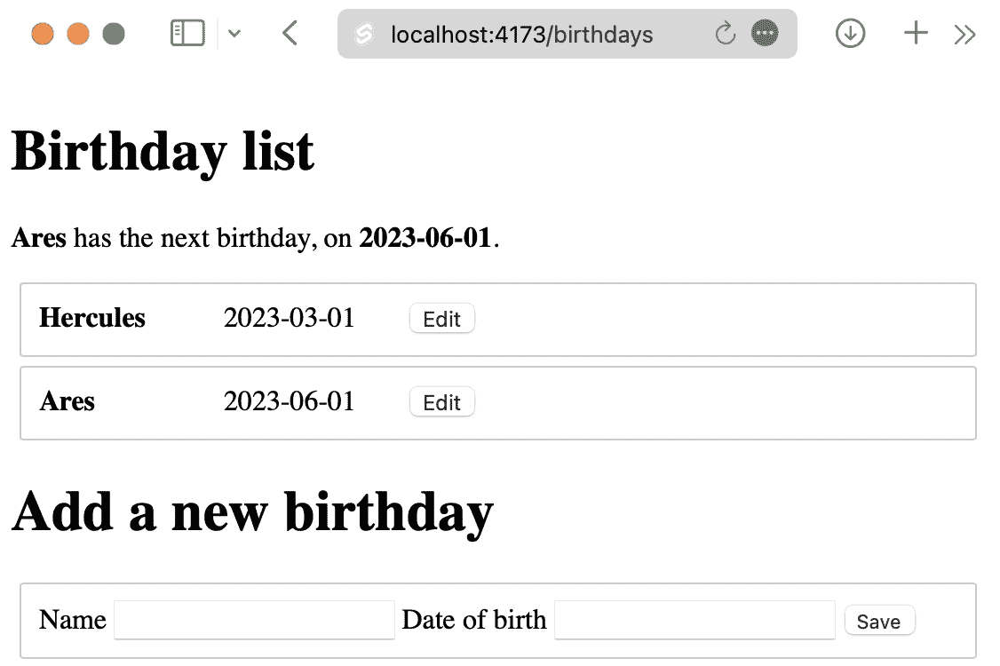

# 第十五章：测试驱动 Svelte 存储

`subscribe` 机制 – 该机制有助于确保所有组件保持对每个变量当前值的持续视图。

当涉及到编写涉及存储的组件的测试时，你必须为存储的两个部分编写测试：第一部分是存储值的 *观察*，第二部分是存储值的 *设置*。

由于存储是一个内部设计决策，因此不需要为存储的引入编写特定的 Playwright 测试。

本章涵盖了以下关键主题：

+   为生日设计存储

+   为读取存储值编写测试

+   为更新存储值编写测试

到本章结束时，你将很好地理解为 Svelte 存储对象编写单元测试。

# 技术要求

该章节的代码可以在网上找到，地址为 [`github.com/PacktPublishing/Svelte-with-Test-Driven-Development/tree/main/Chapter15/Complete`](https://github.com/PacktPublishing/Svelte-with-Test-Driven-Development/tree/main/Chapter15/Complete)。

# 为生日设计存储

本章的代码包括 `src/stores/birthdays.js` 文件中的一个存储，其内容如下：

```js
import { writable } from 'svelte/store';
export const birthdays = writable([]);
```

`birthdays` 存储的想法是存储从 SvelteKit 页面加载返回的所有生日。它通过页面路由组件保持更新。

此外，还有一个新的 `NextBirthday` 组件，该组件读取存储并显示页面顶部的消息，提醒用户即将到来的生日。

对于这个变更，存储不是必需的

这个功能可以通过将 `birthdays` 作为属性传递给 `NextBirthday` 来简单地编写。如果你可以简单地使用组件属性来避免存储，这当然值得。本章的代码旨在仅用于教育目的；在现实中，我不会为这个用例使用存储。



图 15.1 – 带有新警报的生日应用

`NextBirthday` 组件的代码并不简单，因此你可能对在线查看它感兴趣。特别是，单元测试使用了 `vi.useFakeTimers` 和 `vi.setSystemTime` 函数来确保测试检查不受真实时间流逝的影响。

需要的设计就这么多。让我们看看测试。

# 为读取存储值编写测试

读取存储值时至少需要两个测试：首先，当组件加载时的初始值，其次，当更新到来时。

以下是一个示例，你可以在 `src/routes/birthdays/NextBirthday.test.js` 中找到它。注意我们如何使用名称 `birthdaysStore` 导入 `birthdays` 存储，这使得在测试中非常清楚地表明导入的对象是存储。测试的 *Arrange* 阶段随后调用 `birthdayStore.set` 来在组件挂载之前用其初始值初始化存储：

```js
import {
  birthdays as birthdaysStore
} from '../../stores/birthdays.js';
...
describe('NextBirthday', () => {
  it('displays a single birthday', () => {
    birthdaysStore.set([
      createBirthday('Hercules', '2023-09-01')
    ]);
    render(NextBirthday);
    expect(document.body).toHaveTextContent(
      'Hercules has the next birthday, on 2056-09-01'
    );
  });
});
```

你可能好奇为什么期望中提到了年份`2056`。那是因为我们使用了`vi.setSystemTime`将当前日期设置为固定日期：

```js
const julyOfYear = (year) => {
  const date = new Date();
  date.setFullYear(year, 6, 1);
  return date;
};
describe('NextBirthday', () => {
  beforeEach(() => {
    vi.useFakeTimers();
    vi.setSystemTime(julyOfYear(2056));
  });
  afterEach(() => {
    vi.useRealTimers();
  });
  ...
});
```

第二个测试有相同的初始设置，但现在`render`调用移动到了*安排*阶段，而*行动*阶段现在是对`birthdayStore.set`的第二次调用。注意，这个调用需要标记为`await`，以便组件有机会重新渲染：

```js
it('updates the displayed data when the store is updated', async () => {
  birthdaysStore.set([
    createBirthday('Hercules', '2023-09-01')
  ]);
  render(NextBirthday);
  await birthdaysStore.set([
    createBirthday('Hercules', '2023-09-01'),
    createBirthday('Ares', '2023-08-01')
  ]);
  expect(document.body).toHaveTextContent(
    'Ares has the next birthday, on 2056-08-01'
  );
});
```

只有当组件设置为观察存储时，这个测试才会通过。你可以在`src/routes/birthdays/NextBirthday.svelte`中看到这一点：

```js
$: nextBirthday = findNextBirthday($birthdays);
```

如果函数的参数是`birthdays`而不是`$birthdays`，测试将失败。

接下来，让我们看看设置值的测试。

# 编写更新存储值的测试

页面路由组件负责确保传递给它的生日被保存在存储中。

下面是来自`src/routes/birthdays/page.test.js`文件的第一个测试，它使用`birthdaysStore.subscribe`在测试中设置一个`storedBirthdays`值。在渲染组件后，它期望`storedBirthdays`值包含生日：

```js
it('saves the loaded birthdays into the birthdays store', () => {
  let storedBirthdays;
  birthdaysStore.subscribe(
    (value) => (storedBirthdays = value)
  );
  render(Page, { data: { birthdays } });
  expect(storedBirthdays).toEqual(birthdays);
});
```

需要第二个测试来确保组件属性更改时存储值会更新。这个测试利用了返回的组件上的`$set`函数来更新组件的属性：

```js
it('updates the birthdays store when the component props change', async () => {
  let storedBirthdays;
  birthdaysStore.subscribe(
    (value) => (storedBirthdays = value)
  );
  const { component } = render(Page, {
    data: { birthdays }
  });
  await component.$set({ data: { birthdays: [] } });
  expect(storedBirthdays).toEqual([]);
});
```

这就是全部内容。

# 摘要

这短短的一章涵盖了测试 Svelte 存储的一些重要概念：首先，如何测试观察和设置 Svelte 存储值的两个部分，其次，你如何重命名存储导入，使其在测试中更具可读性。在我们的例子中，这意味着将`birthdays`重命名为`birthdaysStore`。

你也已经看到了如何在测试中调用存储的`set`和`subscribe`方法，以及如何在组件实例上使用 Svelte 的`$set`函数来更新先前渲染的组件的属性。

总的来说，这些技术突出了如果需要的话，Svelte 的高级特性在单元测试级别仍然是可测试的。当然，你可能也会从编写可以愉快地忽略 Svelte 存储内部机制的 Playwright 测试中获得同样多的价值。

下一章将涵盖一个更复杂的话题：**服务工作者**。
