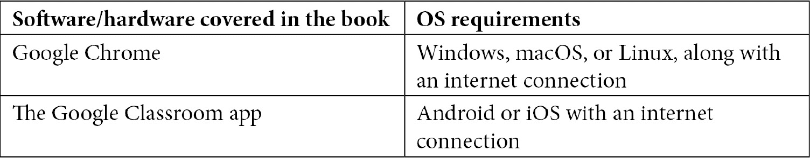

# 前言

Google Classroom 旨在帮助你创建在线课程并以互动的方式授课。使用 Google Classroom 可以节省你用于组织信息并与学生和家长沟通的时间。本更新的第二版《使用 Google Classroom 教学》涵盖了满足当前在线教学需求的 Google Classroom 的现代功能。

本书从高中教学的角度编写，但适用于所有年龄段的教育工作者。如果你是 Google Classroom 的新用户，或者你是希望探索更多高级方法的资深用户，这本书适合你。

通过实践教程、项目和自我评估问题，你将学习如何创建班级，将学生添加到这些班级中，发送公告，并分配课堂作业。本书还展示了如何与学生开始在线讨论。稍后，你将发现如何通过邀请他们接收监护人电子邮件和共享带有 URL 的 Google 日历来让家长参与。这将帮助他们查看作业截止日期和其他重要信息。本版新增了两章，其中你将学习如何使用 Google 的在线视频会议工具 Google Meet 以及在线教学的策略。本书逐步介绍所有功能，并提供如何最佳使用它们的示例来管理你的课堂。

到本书结束时，你将能够更有效地使用 Google Classroom，管理你的在线或面对面学校课程。

# 本书面向的对象

这本 Google Classroom 书籍是由一位教育工作者为教育工作者编写的。它面向任何希望有效地使用 Google Classroom 进行教学的人。本书提供了丰富的示例、清晰的说明和启发性的解释，帮助你充分利用这个平台。

# 本书涵盖的内容

*第一章*，*了解 Google Classroom*，是 Google Classroom 布局和功能的介绍。它为后续章节做准备。到本章结束时，你将能够在 Google Classroom 中创建班级，更改其主题，并添加文件。

*第二章*，*邀请学生进入他们的虚拟教室*，向学生介绍 Google Classroom。它涵盖了将学生添加到他们的班级以及将他们的设备连接到 Google Classroom 的内容。到本章结束时，你将能够指导学生加入班级，直接将学生添加到班级中，并在桌面和移动设备上访问 Google Classroom。

*第三章*，*发布第一条公告*，是你首次在 Google Classroom 中与学生互动。它探讨了班级流和公告帖子的功能。到本章结束时，你将能够在 Google Classroom 中向学生发送公告。

*第四章*，*通过问题开始在线讨论*，探讨了最简单的作业类型——问题。它涵盖了提出讨论问题和为学生答案提供同伴和教师反馈。到本章结束时，你将能够分配问题、提供反馈，并对学生的答案进行评分。

*第五章*，*分发和提交作业*，将关注如何将文件附加到作业帖子中，以及在使用 Google Classroom 分发作业时的最佳实践。它包括指导学生提交已完成作业和设置截止日期的说明。到本章结束时，你将能够将文件添加到作业中，分发给学生，并指导学生如何提交已完成的工作。

*第六章*，*快速批改书面作业*，涵盖了内置的评分功能，如评分工具、评分标准和原创性报告。到本章结束时，你将能够使用评分标准设置和批改书面作业。

*第七章*，*使用 Google Forms 创建多项选择和填空题*，承接上一章内容。本章重点介绍如何使用 Google Forms 创建多项选择和填空题，并利用测验功能自动评分。到本章结束时，你将能够创建 Google Forms 中的作业，将其分配到 Google Classroom 中，并对答案进行评分。

*第八章*，*让家长保持关注*，讨论了 Google Classroom 无法授予没有 Google G Suite for Education 账户的家长和其他人的访问权限。它解释了 Google Classroom 的作业如何与 Google 日历连接。它提供了共享 Google 日历的策略，以便家长可以查看作业截止日期和其他重要信息。到本章结束时，你将能够通过 URL 或 Google 网站共享 Google 日历。

*第九章*，*根据您的学科进行定制*，提供了特定学科第三方应用程序、插件和扩展的示例，这些扩展了可用的在线作业类型。本章涵盖的学科包括人文学科、第二语言、数学和科学。到本章结束时，你将能够从 Chrome 商店添加和删除应用程序和扩展，以及在 Google Docs 中的插件。

*第十章*，*使用 Google Meet 在线举办课程*，探讨了在线教室的教学。它涵盖了学生如何加入会议，如何向学生展示内容，以及参与功能。到本章结束时，您将能够使用 Google Meet 进行在线教学。

*第十一章*，*成功在线课程的策略*，讨论了超越 Google Classroom 和 Google Meet 的概念和技术，以提升在线教学的质量。它包括音频和视频推荐以及从 COVID-19 疫情期间在线教学中学到的经验教训。到本章结束时，您将能够提高您在线教学的音频和视频质量，并对虚拟教室的设置、管理和评估有更深入的理解。

# 为了充分利用本书

为了有效地使用本书，您需要一个谷歌账户，并且应该了解通过网页浏览器的基本导航。虽然标准的`@gmail.com`账户可以使用本书中找到的许多功能，但要访问所有功能，需要一个 Google Workspace for Education 账户。此外，此类账户有多个层级。因此，了解您的学校部门订阅的层级将有助于您确定哪些功能可供您使用。

虽然不是必需的，但熟悉其他谷歌应用，如 Gmail、Google Calendar、Google Drive 和 Google Docs，会有所帮助。这些应用以及 Google Classroom 仅可通过网页浏览器访问。探索任何这些应用都需要可靠的互联网连接。

**无论您使用的是数字版还是纸质版的书，我们鼓励您在 Google Classroom 中跟随学习。创建一个班级来测试一些功能，可以避免在向学生进行类似活动时出现潜在的错误。**

由于 Google Classroom 具有教师界面和学生界面，成为专业学习社区的一员或与同事一起探索本书可以帮助您在尝试功能时。同事可以作为一个学生报名参加实践课程，这样您和您的同事就可以看到两个界面。

# 下载彩色图像

我们还提供了一份包含本书中使用的截图/图表彩色图像的 PDF 文件。您可以从这里下载：`static.packt-cdn.com/downloads/9781800565920_ColorImages.pdf`。

# 使用的约定

本书中使用了多种文本约定。

`文本中的代码`：表示文本中的代码单词、数据库表名、文件夹名、文件名、文件扩展名、路径名、虚拟 URL、用户输入和 Twitter 昵称。以下是一个示例：“将下载的`WebStorm-10*.dmg`磁盘映像文件作为系统中的另一个磁盘挂载。”

**粗体**：表示新术语、重要单词或屏幕上看到的单词。例如，菜单或对话框中的单词在文本中显示如下。以下是一个示例：“从**管理**面板中选择**系统信息**。”

小贴士或重要注意事项

如此显示。

# 联系我们

我们始终欢迎读者的反馈。

`customercare@packtpub.com`。

**勘误表**：尽管我们已经尽最大努力确保内容的准确性，但错误仍然可能发生。如果您在这本书中发现了错误，我们将非常感激您能向我们报告。请访问 [www.packtpub.com/support/errata](http://www.packtpub.com/support/errata)，选择您的书籍，点击勘误表提交表单链接，并输入详细信息。

`copyright@packt.com` 并附有材料链接。

**如果您想成为一名作者**：如果您在某个领域有专业知识，并且对撰写或参与一本书籍感兴趣，请访问 [authors.packtpub.com](http://authors.packtpub.com)。

# 评论

请留下评论。一旦您阅读并使用过这本书，为什么不在这家购买它的网站上留下评论呢？潜在读者可以看到并使用您的客观意见来做出购买决定，Packt 公司可以了解您对我们产品的看法，我们的作者也可以看到他们对书籍的反馈。谢谢！

请访问 [packt.com](http://packt.com) 了解更多关于 Packt 的信息。
