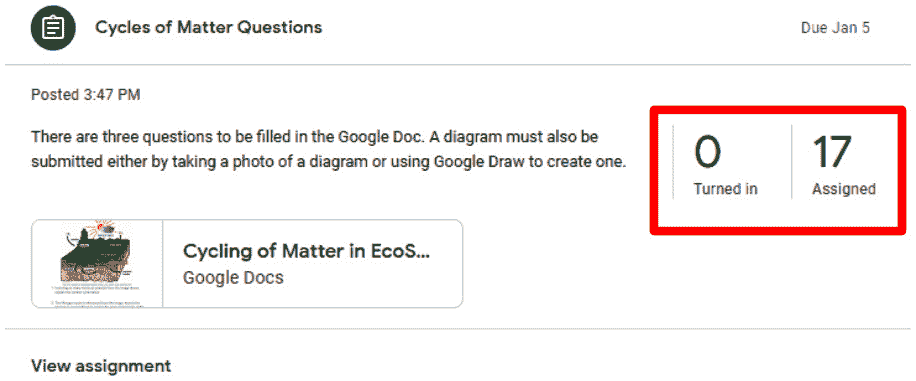

# 第五章：*第五章*：分发和接收作业

在前面的章节中，你已经学习了如何在**流**中使用**公告**帖子，在**课程作业**中使用**问题**帖子。在本章中，你将了解在**课程作业**中找到的下一个帖子类型：**作业**帖子。此帖子允许你分配存储在 Google Drive 中的文档，然后让学生编辑文件，然后提交给评分。

本章将重点介绍分配和接收作业，因为评分过程与评分**问题**帖子相似。然而，在评分作业而不是问题时，还有一些额外的功能，下一章将探讨。此外，这些问题类型大量使用了 Google Docs 和 Google Drive，它们是 Google Workspace for Education 中的附加应用程序。

在本章中，我们将探讨以下主题：

+   创建作业帖子

+   在作业中共享文件

+   查看学生文件

+   提交作业

+   作业的文件所有权

# 创建作业帖子

与**问题**帖子类似，**作业**帖子的许多功能都包含在前三种帖子类型中。

注意

如果你不是按顺序阅读章节，请考虑阅读*第一章*，*了解 Google Classroom*；*第三章*，*发送你的第一条公告*；以及*第四章*，*通过问题开始在线讨论*。

要创建一个**作业**帖子，执行以下步骤：

1.  在**课程作业**部分，点击**+ 创建**图标，然后点击**作业**：

    图 5.1 – 课程作业中的作业选项

1.  填写**标题**和**说明**字段：

    图 5.2 – 作业帖子的标题和说明字段

1.  在右侧列中，选择班级、班级内的学生、作业的分数、截止日期和作业的主题：

    图 5.3 – 作业帖子的班级、学生、分数、截止日期和主题选项

1.  使用**添加**菜单图标将文件添加到作业中（此步骤在*第三章*，*发送你的第一条公告*）中进行了详细说明：

    图 5.4 – 从 Google Drive 或你的电脑添加文件

1.  如果需要，在此步骤中添加额外的网站和 YouTube 视频链接。

1.  点击**分配**按钮发布作业：

    图 5.5 – 准备分配的已完成作业帖子

1.  虽然不是必需的，但将文件附加到**作业**帖子可以将它的功能与**问题**帖子区分开来。**问题**帖子允许评分学生对帖子的回复，而**作业**帖子允许评分附加到作业的文件。在下面的屏幕截图中，您将看到**作业**帖子，就像**问题**帖子一样，在**作业**部分查看时也会跟踪已提交作业的学生数量：

图 5.6 – 查看已提交作业的学生数量

**作业**帖子还包括评分标准和查重设置。这两个设置在*第六章*中探讨，*快速评分书面作业*。

在面对面教学时，你可能需要在项目中展示文档、允许每位学生批注的文档以及为每位学生复印的文档。当将文件附加到**作业**帖子时，Google Docs 有类似每个用例的额外设置。

下一个部分概述了如何设置学生权限，以便他们只能查看文件、编辑文件或为每位学生创建单独的副本。

# 在作业中共享文件

如果你从你的电脑或 Google Drive 中附加文件，你将注意到文件旁边有一个额外的选项，这在其他帖子类型中不存在。这个新选项在下面的屏幕截图中显示，允许你选择学生如何接收此文件：

图 5.7 – 作业特定的 Google Docs 共享设置

每个共享选项都允许不同级别的学生互动：

+   **学生可查看文件**不允许学生与此文件互动。他们只能阅读、下载或打印文件。

+   **学生可编辑文件**允许所有学生编辑相同的文件。因此，你和你的学生将实时看到彼此的更改。

+   **为每位学生创建副本**将为每位学生创建一个文件副本到你的 Google Drive 中。学生将看不到其他学生在文档中写的内容。

    注意

    你可以进一步防止学生下载或打印文件。然而，这些是 Google Drive 中的高级设置，超出了本书的范围。

选择何时使用哪种共享权限取决于文件的目的。例如，如果学生正在练习编辑文档，作业可以类似于以下屏幕截图所示：

图 5.8 – 学生编辑文件的作业示例

另一个例子是如果您希望学生对作业进行批判性回应。您可以使用**学生可以查看文件****选项**附加一些文件，然后使用**为每个学生创建副本****选项**附加您希望他们完成的文档：

图 5.9 – 学生拥有单独文件的作业示例

要充分利用**作业**帖子的全部功能，请确保您选择**为每个学生创建副本**选项的文件是在 Google Docs 中创建的或已转换为 Google Docs 格式。学生只能编辑 Docs、Sheets 和 Slides 的 Google Docs 文件格式。

注意

在发布作业之前决定文件权限很重要。如果文件的权限设置为查看或编辑，则之后无法更改以创建每个学生的副本。

现在您已经发布了**作业**帖子，学生将能够提交他们的作业。在下一节中，您将能够轻松地看到他们对作业的回应。

# 查看学生文件

**作业**帖子比其他帖子更复杂，因为与作业相关联有文件。有两个不同的位置可以访问学生提交的文件 – Google Classroom 和 Google Drive。

## 在 Google Classroom 中查看学生文件

要访问 Google Classroom 中的学生文件，无论他们是否提交了作业，请按照以下步骤操作：

1.  在**作业**部分，点击帖子的标题，然后点击**查看作业**：

    图 5.10 – 在作业标签页打开作业

1.  您现在将位于**学生作业**页面。此页面仅显示每个学生的第一个附件的缩略图。要查看学生提交的所有文件，请点击左侧列中的学生姓名：

    图 5.11 – 选择学生查看附件

    注意

    如果您在 2018 年主要更新之前使用过 Google Classroom 或来自本书的先前版本，点击**作业**帖子通知中的标题也会带您到**学生作业**页面。

1.  点击您想查看的文件：

    图 5.12 – 选择学生的作业附件

1.  将打开一个新的标签页，显示**评分工具**。此页面允许您在学生之间切换，查看学生文件，评分作业，并留下评论。以下屏幕截图突出了页面内的导航工具：

    图 5.13 – 评分工具页面上的导航

1.  当您使用**为每个学生创建副本**设置附加文件时，文件副本将不会在学生访问作业之前创建。因此，当您查看**学生作业**页面时，可能有一些学生还没有创建作业文件：

    图 5.14 – Aiden 尚未打开作业

1.  如果文件可用，查看学生文件的另一种方法是点击**学生作业**页面主部分中的文件缩略图，如下截图所示：

图 5.15 – 学生作业文件缩略图

Google Classroom 移动应用是查看学生文件的另一种方法。

### 在 Google Classroom 移动应用中查看学生文件

如果您有智能手机或平板电脑，在上课时间查看学生文件是进行多任务处理的好方法。我无数次在我的移动设备上打开学生文件，同时管理课堂。更改会实时可见，这样您就可以看到学生所做的更改，而无需回头查看。以下步骤将使用 Google Android 设备上的 Google Classroom 应用。在 Apple iOS 设备上使用应用将使用类似的步骤：

1.  在主屏幕上，点击**Classroom**应用：

    图 5.16 – Google Classroom 应用

1.  点击班级：

    图 5.17 – Google Classroom 应用中的班级

1.  点击应用底部的**作业**图标：

    图 5.18 – Google Classroom 应用中的作业图标

1.  点击作业帖子的标题：

    图 5.19 – 在“作业”标签页中的作业帖子

1.  点击学生的名字：

    图 5.20 – 在学生作业中选择学生

1.  点击文件以查看它：

    图 5.21 – 点击文件查看已提交的学生作业

1.  文件将在 Google Docs 中打开：

图 5.22 – 学生提交文件的预览

在苹果的 iOS 系统中，您第一次从 Google Classroom 打开文件时，在*步骤 5*之后会出现对话框，请求允许访问 iPad 或 iPhone 上的 Google Drive 和 Google Docs 应用。

在苹果的 iOS 和谷歌的 Android 上，Google Drive 和 Google Docs 应用必须存在于设备上。如果尚未安装，请参阅*第二章*，*邀请学生进入他们的虚拟教室*，以获取详细的说明。

如果**作业**帖子最近被分配，点击**流**中的通知将节省几个步骤。就像在网站上一样，**流**是应用中首先可见的部分。以下截图展示了移动设备上的**流**：

Fug 5.23 – 流中的作业帖子通知

如果您有一台带有 Apple Pencil 或支持笔的 Android 平板电脑的 Apple iPad，这种移动视图也将有助于留下教师反馈，这将在下一章中介绍。

文件也可以在 Google Drive 应用中查看，下一节将探讨这一点。

## 在 Google Drive 中查看学生文件

Google Drive 是一个在线文件存储和管理应用，用于 Google Apps。所有上传或创建在 Google Classroom 中的文件都存储在 Google Drive 中。由于可以直接从 Google Drive 应用查看学生文件，如果您经常使用 Google Drive，那么在那里访问学生文件会更方便。通常，如果我在查看图片或其他非 Google 文件，我会使用 Google Drive。

对于 Google Apps for Education 和 Google Apps for Work 账户，Google Drive 中可以存储的数据量没有限制；然而，标准 Google 账户（以 `@gmail.com` 结尾的电子邮件）有 15 GB 的总存储限制。对于标准 Google 账户，Google Docs、Sheets 和 Slides 文件不计入 15 GB 的最大限制。

使用以下步骤从 Google Drive 应用查看学生文件：

1.  在 **Google Chrome** 中，导航到 [`drive.google.com`](https://drive.google.com)。另一种方法是点击另一个 Google 应用（如 Gmail 或 Google 日历）中的应用启动器，然后点击 **Drive** 图标：

    图 5.24 – 应用启动器中的“驱动”图标

1.  点击名为 **Classroom** 的文件夹：

    图 5.25 – Google Drive 中的 Classroom 文件夹

1.  点击带有班级名称的文件夹：

    图 5.26 – 班级文件夹

1.  点击与作业帖子标题相同的文件夹：

    图 5.27 – 作业帖子文件夹

1.  点击您要查看的作业：

    图 5.28 – 学生文件缩略图预览

1.  文件将在 Google Docs 的新标签页中打开：

图 5.29 – 在 Google Docs 中打开的学生文件

由于 Google Drive 默认为文件缩略图视图，您可以通过详细列表查看文件。在以下截图中，您可以看到文件名被截断，遮挡了学生姓名。在菜单中单击 **列表视图** 图标：

图 5.30 – 列表视图图标

您的文件将不再显示第一页的缩略图。相反，只显示文件格式图标和文件名。此外，还将出现包含更多文档细节的两列。以下截图显示了 Google Drive 的 **列表视图**：

图 5.31 – 列表视图中学生文件

### 从 Google Drive 下载学生文件

根据您的使用情况，下载作业文件夹中的所有文件并使用计算机上的程序查看文件可能更有效率。这种情况的一个例子是，如果学生主要附加图像文件。在 COVID-19 大流行期间，我学校的许多数学和艺术教师指示学生附加他们的数学问题解答和艺术作品的图片。

教师随后将下载文件并在计算机图像查看器中打开图像，在那里他们可以更有效地在图像之间切换。

为文件名提供清晰的说明

如果您计划使用此方法下载文件，请确保向学生提供关于文件命名方式的清晰说明。由于我学校的评分软件按姓氏字母顺序排序，我指示学生在下载他们的作业文件时，将文件命名为 *姓氏，名 – 作业名称*。

要下载 Google Classroom 文件夹的 ZIP 文件，请转到 Google Drive 中的文件夹，然后单击文件夹路径中的菜单并选择 **下载**：

图 5.32 – 从 Google Drive 下载文件夹

Windows 和 macOS 都内置了软件，可以从 ZIP 文件中提取学生文件文件夹。在 macOS 中双击 ZIP 文件将自动将 ZIP 文件内容提取到文件夹中，而在 Windows 中，它将在 Windows 资源管理器中打开 ZIP 文件。要从 Windows 中的 ZIP 文件中提取文件，请单击此处显示的选项卡上的 **提取所有** 按钮：

图 5.33 – 文件资源管理器中 ZIP 文件的 **提取所有** 按钮

# 提交作业

如果学生是第一次使用 Google Classroom，他们可能还需要指导如何通过 Google Classroom 提交作业。在我的教学期间，我了解到，如果我没有明确地展示学生如何提交作业，我可能会收到不完整的作业或通过电子邮件收到的作业。为了节省收集作业的额外工作，在第一几个作业的开始时花几分钟时间向学生展示如何正确提交作业。在分配作业后，让一个学生登录到一个连接到投影仪的电脑上，这样你就可以向学生展示正确提交作业的步骤。

对于带有 Google Docs 的作业，使用 **Make a copy for each student** 设置共享文件是学生提交作业最简单的方法。以豆芽实验室为例，作业包含一个学生需要编辑的 Google Doc。由于它是通过 **Make a copy for each student** 设置共享的，当学生打开 Google 文档时，菜单中会出现一个 **TURN IN** 按钮如图下截图所示：

![Figure 5.34 – TURN IN button in a Google document]

![Figure 5.34_B16846.jpg]

图 5.34 – Google 文档中的 TURN IN 按钮

当学生完成作业后，他们可以点击 Google 文档中的 **TURN IN** 按钮，并在出现的对话框中确认提交：

![Figure 5.35 – Confirmation dialog box in Google Classroom]

![Figure 5.35_B16846.jpg]

图 5.35 – Google Classroom 中的确认对话框

对于前几个作业，仅使用这种方法。这是学生提交作业最容易的方法，因为学生需要完成的步骤较少。一旦学生对使用 **Make a copy for each student** 设置提交 Google Docs 作业感到舒适，那么我就提供更复杂的作业，学生可以在作业中添加额外的文件。

当学生提交作业时，**Classwork** 部分中作业旁边的图标从彩色变为灰色。因此，学生可以轻松地看到 **Classwork** 部分中哪些作业仍然需要提交：

![Figure 5.36 – Icon color change beside an Assignment/Question post in the Classwork section]

![Figure_5.36_B16846.jpg]

图 5.36 – **Classwork** 部分中 Assignment/Question 帖子旁边的图标颜色变化

在 **Stream** 中的 **Assignment** 帖子通知旁边的图标不会改变。

## 添加额外的文件到作业中

随着学生在 Google Classroom 中提交作业的熟练程度提高，他们将能够完成更复杂的作业。学生在提交作业之前可以为他们的作业创建额外的 Google Docs 文件。为此，引导他们完成以下步骤：

1.  在 **Classwork** 部分中，让学生点击作业标题，然后点击 **View assignment**：![Figure 5.37 – Open the Assignment post]

    ![Figure 5.37_B16846.jpg]

    图 5.37 – 打开作业帖子

1.  点击**添加或创建**下拉菜单。然后，点击**文档**图标或文本：

图 5.38 – 在作业中创建 Google 文档

一个空白 Google 文档将在新标签页中打开。因为它是在**作业**帖子中创建的，所以它的工具栏中也会有**提交**按钮。

尽管 Google Docs 经常引用文档编辑应用，但它也可以引用包括 Google Slides 和 Google Sheets 在内的整个办公套件应用。

学生还可以直接从 Google Drive 或他们的电脑中附加文件。在**添加**菜单中，他们可以选择**Google Drive**或**添加文件**来添加额外的文件。

### 使用移动设备进行作业

如果学生使用 Google Classroom 应用，他们将能够使用在 Google Classroom 移动应用中找到的附加功能。学生可以直接从应用中拍照和录制视频，并将它们附加到作业中：

1.  在移动应用中，学生可以点击**课业**或**流**部分中的**作业**帖子标题：

    

    图 5.39 – Classroom 移动应用中的作业帖子

1.  从**你的工作**部分向上点击或滑动：

    

    图 5.40 – Classroom 应用中作业帖子的“你的工作”部分

1.  点击**添加附件**按钮：

    

    图 5.41 – 添加附件按钮

1.  根据需要点击**拍照**或**录制视频**选项：

    

    图 5.42 – 应用特定的图片和视频附加选项

1.  使用这个相机功能，学生可以拍照或录制视频，并将它们附加到作业中：

图 5.43 – 附加到作业帖子的图片和视频文件

使用带有 Google Classroom 的移动设备可以促进创新学习和评估。如果课堂上有多足够的移动设备，学生可以通过直接从智能手机或平板电脑拍照或录制视频来提交短剧、歌曲、口头分析、实验室演示、图表等内容。如果没有足够的移动设备，可以考虑将这些作业融入小组工作中。学生可能会忘记附加文件或在提交作业后想要更新文件。

下一个部分将探讨学生如何进行这些更改。

## 取消提交和重新提交作业

学生在提交作业后，可以随时对其作业进行修改。首先，学生需要取消提交作业，他们可以通过点击**流**中的**作业**帖子标题来完成此操作。在其工作下方将有一个**未提交**按钮，如下面的截图所示：

图 5.44 – 作业帖子中的未提交按钮

一旦取消提交作业，学生将能够在再次提交之前对其文件进行修改。如果学生在截止日期后取消提交并提交作业，Google Classroom 仍然将作业标记为迟交。在撰写本文时，没有方法可以禁用**未提交**按钮。

一旦学生取消提交作业，你将能够看到学生何时提交新的提交。在作业的**学生作品**标签页中，点击**查看历史**，如下面的截图所示，将显示学生提交作业的时间列表：

图 5.45 – 查看历史链接

## 交迟作业

学生可以交迟作业。然而，如果他们这样做，Google Classroom 将将作业标记为迟交：

图 5.46 – 交迟的作业指示

在撰写本文时，没有简单的方法可以创建一个硬性截止日期，使得学生在截止日期后无法提交作业。

在*第八章* *让家长了解情况* 中，你将学习如何设置 Google Classroom，以便定期通过电子邮件向家长发送即将到来的和缺失的作业。

在学生提交作业后，下一节将探讨当作业被提交时，作业文件的权限如何改变。

# 作业的文件所有权

就像物理作业一样，当学生提交作业时，作业的所有权从学生转移到教师。因此，如果你在 Google Drive 中查看学生的文件，已提交的作业将显示**我**作为所有者，而不是学生的名字：

图 5.47 – Google Drive 文件夹中的所有者列

虽然看似无关紧要，但学生对已提交的文件拥有有限的权限。例如，他们不会看到任何对作业的更改或评论，直到作业返回给他们。

如果学生在你评分后但在你返回之前取消提交作业，学生将能够看到你的更改或评论，但看不到分数。分数只有在作业返回给学生时才可见。

对于学生来说，另一个限制是他们只能查看已提交的文件，除非他们取消提交作业，否则无法进行任何更改。因此，在评分和返回作业之前，将所有权转交给你是确保评分过程中没有意外惊喜的保证。

# 摘要

**作业**帖子允许你在单个位置管理和整合你的作业。你不必跟踪哪些学生已经提交了作业或哪些学生还没有提交；也不必担心在家、教室或两者之间丢失作业。此外，你不再局限于文本。现在你能够附加任何类型的文件，例如图片和视频或链接到网站或 YouTube 视频。

你现在可以创建作业帖子，并且了解如何在帖子中添加内容，学生如何提交作业，以及你可以在 Google Classroom 和 Google Drive 中找到所有作业的位置。你已经学会了如何识别学生未提交作业或提交作业晚的情况。

在接下来的两章中，我们将介绍在 Google Classroom 中评分作业的各种方法。我们将重点介绍提供有意义的反馈和加快评分过程的工具。
