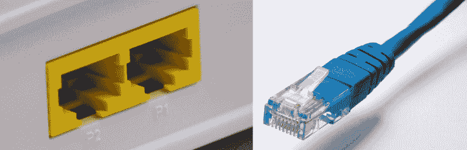
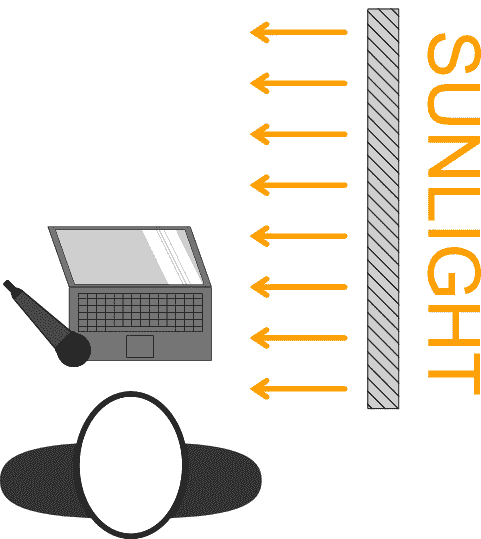
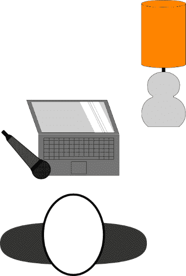
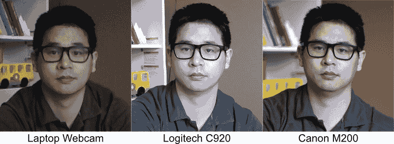
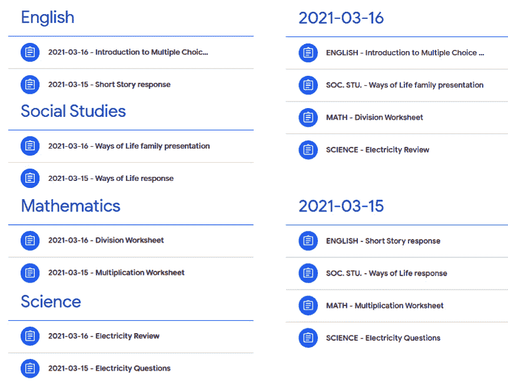
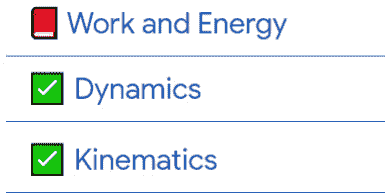

# 第十一章：*第十一章*：成功在线课程的策略

在 COVID-19 大流行期间，我教授的课程中，我有学生是现场上课的，也有在线上课的。当病例激增时，所有学生不得不在家学习一个月。我的一个学生因为在大流行早期糟糕的在线学习体验而感到担忧。

然而，当我在线教学一周后联系这位学生时，他们愉快地回应说，我的课无论是线上还是线下都感觉没有区别。在新的学期里，既有线上又有现场学生的学生中，我的几位现场学生选择在线上课，原因相同。我与学生的这些互动不断加强了我的信念，即当使用正确的工具时，在线学习可以与面对面学习一样有效。

上一章概述了 Google Meet 中的各种功能。与任何工具一样，其有效性取决于使用者的知识和经验。Google Meet 提供了使用 Google Classroom 进行在线教学的手段；然而，虚拟教学与面对面教学是完全不同的范式。虽然有些原则是相似的，但在线环境中教学有一些独特的考虑因素。既然你（或你的学校）已经投入资金购买了这本书，我犹豫是否推荐购买更多东西。

然而，有许多有效的面对面教学品质并不容易转移到在线教学，除非需要一些额外的设备。一旦在线内容的质量达到最佳，将提供额外的建议来改善课程的架构。在本章中，你将探索以下策略：

+   你演示文稿的音频质量

+   你演示文稿的视频质量

+   在线课程的教学法策略

+   Google Classroom 中的内容组织

+   在线评估实践

# 连接到互联网

如果你的学校人口统计与我相似，大多数教师和学生都拥有家用笔记本电脑。家用台式电脑的家庭越来越少。（别担心，我可不是要建议你购买一台全新的电脑。）在家中有更多笔记本电脑而不是台式电脑的情况下，另一个常见的趋势是使用 Wi-Fi 将电脑连接到互联网。然而，由于 Wi-Fi 不使用物理连接，它容易受到干扰。

这种干扰可能导致连接速度变慢，甚至信号丢失。此外，通过 Wi-Fi 连接到互联网的设备越多，每个设备就必须分享 Wi-Fi 信号的速率。因此，为了确保你有一个更稳定的互联网连接，你应该通过物理连接将电脑连接到互联网。大多数互联网服务提供商提供互联网路由器，路由器后面有以太网端口，可以物理连接设备：

图 11.1 – 以太网端口和电缆

使用以太网线将你的电脑直接连接到路由器。如果你的电脑没有以太网端口，你可以在当地的电子产品店购买 USB-to-Ethernet 适配器。使用有线连接将电脑连接到互联网可以比使用 Wi-Fi 提高互联网速度高达 10 倍。有了稳定快速的网络连接，学生将能够更好地看到和听到你。在下一节中，我们将探讨额外的音频和视频技术以及硬件，这些可以帮助你看起来和听起来最好。

# 在 Google Meet 中看起来最好

在互联网时代，你的学生将能够区分专业视频和业余视频。此外，人类大脑可以判断出某些事物并不完全自然，例如电影场景中包含令人不安的 CGI 图形。即使你的学生无法识别出问题所在，低质量的声音和视频也会打断你的教学和学习流程。

更糟糕的是，无论是面对面还是在线，对课程的持续干扰都会导致许多学生失去兴趣和分心。在面对面课程中，着装得体只是一个小问题。然而，在摄像机前则需要使用摄像机、灯光和麦克风来达到同样的效果。

一些同学可能已经在想，“学生们知道我们不是视频制作专业人士”，这是真的。然而，我们精心设计我们的面对面课堂，以减少干扰，促进创造力，并集中学生的注意力。难道提高我们在线内容交付的质量不属于这些类别吗？

如果你的答案是肯定的，那么请继续阅读！在接下来的小节中，我们将探讨可以帮助改善你外观和声音的策略。但在我们查看灯光和摄像机之前，让我们从一个好的麦克风开始。

## 你的声音比你的外表更重要

乔治·卢卡斯曾名言，声音和音乐是电影娱乐的 50%。很多时候，观看画质低但音质清晰的视频比观看画质高但音质嘈杂的视频更容易。因此，使用高质量的麦克风比使用高质量的摄像机更重要（而且幸运的是更便宜）。如果你使用笔记本电脑或网络摄像头，内置麦克风可以工作，但它们不能提供高质量的声音。

什么是高质量的声音？

**高质量的声音**意味着麦克风只接收你的声音，并使其听起来自然。如果麦克风捕捉到键盘敲击声、房间回声、过度处理你的声音或背景嘶嘶声，学生将难以长时间倾听。

提高音频的一种方法是将你使用的麦克风尽可能靠近你的嘴。理想情况下，它应该离你的嘴 3 到 6 英寸，并且以 45 度角。这个位置确保麦克风离你足够近，以至于它比其他东西（如你的键盘）拾取你的声音更响亮，同时防止你在说**P**和**T**单词时吹气进入麦克风：

图 11.2 – 麦克风位置

如果你使用的是笔记本电脑，其中麦克风通常直接位于屏幕上方，提高其声音的一个简单方法就是使用笔记本电脑支架或一摞书来抬高笔记本电脑。另一个你可以尝试的无成本方法是使用现有的智能手机耳机或耳塞。你可以将它们插入电脑的耳机插孔，或者通过蓝牙无线连接。

### 购买麦克风

如果你想要购买麦克风，Logitech Blue Yeti 或 Audio Technica ATR2100X-USB 是常见的、高质量的 USB 麦克风，价格约为 100 美元。另一个更便宜的替代品是 Samson Go Mic，价格约为 50 美元，但需要夹在笔记本电脑或显示器顶部或支架上。

在另一端，Shure MV7，价格约为 250 美元，提供了出色的声音质量。所有这些麦克风都可以通过电脑的 USB 端口插入，并且将被电脑自动检测。

重要

无论何时你使用外置麦克风，都要确保它在 Google Meet 中已被选中。

另一个提高生活质量的购买是麦克风的升降臂。升降臂连接到桌子的侧面，将麦克风抬得离你的嘴更近。它还释放了桌面空间，因为它可以连接到桌子的侧面。预算替代方案是将麦克风放在一摞书上。

不要害怕在学生面前尝试不同的麦克风，看看哪些比其他麦克风声音更好。虽然他们可能无法告诉你为什么他们喜欢一个麦克风而不是另一个，但他们能够分辨出差异，并指出他们最喜欢哪一个。现在我们已经涵盖了音频，让我们来看看视频。

## 灯光！摄像机！行动！

与音频质量一样，有许多因素会影响你在学生眼中的表现。在视频制作中，影响质量的主要因素是正确的照明。在我们讨论网络摄像头和替代设备之前，我们应该谈谈照明。正确的光线位置可以像正确的麦克风位置一样提高你的视频质量。（而且可能是免费的！）当你选择座位时，找到一个位置，那里有一个大窗户在你的左侧或右侧：

图 11.3 – 坐在大型阳光照射的窗户旁边

在上一章中，你可以看到提供的许多图像中我右侧的窗户百叶窗。

在寻找良好照明时，人们常犯的一些错误包括将窗户直接放在他们后面或前面。在这些情况下，光线可能会使你的脸太亮或使背景太亮。这两种情况都会导致可见性降低，如下面的图片所示：

如果你的教学空间没有大窗户，或者如果你在晚上授课，你需要使用另一个光源。尽管如我们上段所述，点拍式相机和智能手机的闪光灯直接对着被拍摄对象，但如果光源直接在你面前，将会创造出不自然的外观。为了模仿通过大窗户进入的光线，光源必须在地平线或略高于地平线处创造漫射光。

什么是漫射光？

漫射光，通常被称为柔光，是从光源扩散出来的光。带有罩子的台灯会创造漫射光，因为罩子会扩散来自灯泡的光线。如果没有罩子，灯泡会创造出更亮、更刺眼的光。

在外出购买灯光之前，如果你有台灯，可以尝试将它们放置在 45 度角和眼睛水平的位置。指向天花板并设置为最大亮度的落地灯也可以提供很好的照明：

![图 11.5 – 台灯放置在教师前方 45 度角通常情况下，应避免使用吊灯。由于它们通常直接向下照射，坐在它们正下方会投射出眼睛周围的阴影。最好的情况是看起来很疲惫；最坏的情况是看起来像浣熊。如果你只有吊灯作为光源，尽量坐在离吊灯尽可能远的地方，同时仍然在屏幕上可见。### 购买灯光在购买灯光时，你可能会陷入一个深不见底的兔子洞。单盏摄影棚灯光可能只需几千美元。这些昂贵的灯光可能并不需要，而业余或专业级灯光将绰绰有余。在线零售商如亚马逊有包含两盏灯、柔光箱扩散器和支架的照明套件，售价为 150 美元。如果空间有限，Elgato Key light 是一个很好的多功能解决方案，可以连接到你的桌子上。然而，单盏灯的价格是 200 美元。一个预算替代方案是去当地的家具店购买一个 100 瓦的暖色灯泡和中国灯笼纸。根据你所在的市场，这个解决方案可能只需花费 25 美元。暖色光和冷色光灯光的温度描述了灯光中黄色或蓝色色调的量。不同的光源产生不同温度的光。例如，钨丝灯泡倾向于有更多黄色或更暖的照明，而荧光灯管倾向于有更蓝或更冷的照明。暖色照明往往感觉更舒适，而冷色照明往往感觉更临床。在放置灯光时，你必须考虑很多因素。查看 YouTube 和其他网站上的教程和提示，了解各种照明设置。### 购买摄像头与他们的麦克风一样，许多内置笔记本电脑或台式网络摄像头的质量较低。外置摄像头几乎总是优于你拥有的任何内置摄像头。重要在撰写本文时，正值 COVID-19 大流行期间，网络摄像头的需求和价格急剧上升。虽然本书将使用许多这些设备的当前价格，但希望在你阅读这一章时，价格已经下降。在深入推荐之前，以下截图显示了使用不同相机拍摄的图片的比较。除了裁剪之外，对图片没有进行任何后期处理：

图 11.6 – 摄像头质量比较

Logitech C920 是 USB 网络摄像头的黄金标准。它售价 80 美元，但由于其受欢迎程度，常常缺货。Logitech C920S 和 Logitech C922X 是 C920 的新型号，但提供与 C920 相同的视频质量。这两个新型号的价格分别为 100 美元和 130 美元。在 USB 网络摄像头中获得最佳视频质量，Avermedia 的 Live Streamer CAM 513 将花费你 250 美元。

如果你预算有限但有一部旧智能手机，你可以使用智能手机上的摄像头作为网络摄像头。第三方应用程序，如 EpocCam 和 DroidCam，可以通过 Wi-Fi 或 USB 发送 iPhone 和 Android 摄像头信号。这两个应用程序都包含免费版本，以便你可以测试你的旧手机。一个需要测试的领域是计算机麦克风是否与智能手机网络摄像头不同步，因为这些应用程序可能会在视频中引入延迟。两者都有付费版本（低于 10 美元），可以去除广告并添加额外功能。

如果你正在购买价格较低的网络摄像头（低于 40 美元），请谨慎行事。我们学校犯了一个错误，购买了这些便宜的摄像头，它们通常在几分钟后就冻结或断开连接。确保有退货政策，并彻底测试设备，以便在出现任何问题时可以退货。

在成本谱的另一端，许多运动相机、单反相机、数码单反相机和无反相机可以使用它们的 USB 连接作为网络摄像头。这些相机的价格可以从售价 320 美元的 GoPro Hero 8 运动相机到售价 5000 美元的 Canon EOS R5 不等。许多 DSLR 和无反相机也具有可更换镜头，这增加了额外的成本。

另一个需要考虑的因素是摄像头的电池寿命。许多这些摄像头也可以从 USB 连接中获取电力，或者可能使用电池连接器，通常称为假电池，将摄像头插入插座。如果你选择购买摄像头作为网络摄像头，考虑在你不教学时的使用情况。由于我有一个三岁的孩子，购买 GoPro 和后来的无反相机意味着我可以在孩子成长的过程中拍出更好的照片。

在教学我的在线学生时，我使用的是佳能 EOS M200（550 美元）和佳能 EF-M 22mm 镜头（250 美元）。另一个不错的选择是佳能 EOS M50 Mark II（700 美元），它的视频制作功能比 M200 更好。虽然摄像头选择是个人喜好，但佳能相机具有快速自动对焦和色彩准确性，这就是我推荐它们的原因。

就像麦克风一样，在确定你在在线课程中使用的摄像头解决方案之前，考虑测试一两个解决方案。

### 考虑背景

摄像头设置好后，剩下的就是背景了。你的背景类似于面对面课程中的桌子；它向你的学生提供了关于你的背景信息。与这一节中的其他主题一样，创建一个引人入胜的背景可以简单到复杂到你觉得合适。

一个简单且免费的解决方案是使用 Google Meet 内置的背景更换功能。拥有单调的背景，例如一面空墙，将有助于背景更换功能区分你和你的背景。使用背景更换功能的一个缺点是，它有时会移除你试图向学生展示的东西。以下图片展示了这个问题的一个例子：

![Figure 11.7 – 我手中的物品已从视频中移除

![img/Figure_11.7_B16846.jpg]

Figure 11.7 – The item in my hand has been removed from the video

如果你确实有一个单调的背景，而不是使用背景更换功能，你可以用你在在线教学中使用的物品来填充它。例如，挂上图片或用于课程的木偶。或者，你可以在圣诞节或复活节等节假日装饰背景。如果你和墙之间有足够的空间，另一种向背景添加的方法是放置一个架子并填充它，放些物品或书籍。

一些教师甚至在墙上挂上圣诞灯！这些小细节可以让学生在看到你在线时感到更受欢迎，准备好学习。

你还可以使用绿色屏幕来更改背景。这种单色背景使得替换它，称为**键控**，更加均匀。此外，其他软件如 OBS Studio 可以叠加图像或其他输入以创建画中画效果，如下面的截图所示：

![Figure 11.8 – Webcam and screen picture-in-picture effect

![img/Figure_11.8_B16846.jpg]

图 11.8 – 网络摄像头和屏幕画中画效果

现在既然你的学生可以轻松地看到和听到你，让我们看看我们可以如何保持他们在在线学习中的参与度。

# 在线课程中的教学法

回到 2011 年，我的大学教授警告全班，教学职业将在我们整个职业生涯中发生变化，并且有一天，我们可能都会在电脑屏幕前教学。尽管我已经对教育技术有热情，但他的信息鼓励我在 COVID-19 大流行迫使每个人都在线教学之前几年就深思熟虑在线教学会是什么样子。

通过探索如 Moodle 等在线平台，以及能够以不同格式教授各种在线课程，本节将讨论我在在线教学中学到的一些策略。这些建议基于我的经验和与我的专业学习社区中教师的对话。并非所有这些策略都一定适合你的教学法，但一两个可能有助于使你的在线教学体验更容易。

在深入探讨这些策略之前，有一些术语我们必须定义。在线教学有许多不同的格式，你的学校可能使用不同的术语来描述类似的格式。以下是我将在本节中引用的术语：

+   **同步**教学和学习是指教师正在实时向学生传递内容。这种在线教学格式与面对面教学相似，教师和学生持续互动。通常，互动是通过 Google Meet 进行的，教师和学生会在特定时间连接。

    这种在线教学的主要优势是它与面对面教学和学习相似；一些缺点包括技术问题发生的可能性更高，这会阻碍教学，以及学生必须在指定的时间可用。

+   **异步**教学和学习是指教师不是在实时传递内容。通常，教师会发布一个学生观看的视频。这种方法通常包括自我评估问题。教师可以使用 Google Meet 录制课程，为学生的自我评估创建 Google 表格，并在 Google Classroom 上发布这些资源。

    这种在线教学的主要优势是学生可以按自己的节奏学习；然而，缺点是这种方法依赖于学生的动机，而且如果提供的资源不足，学习有困难的学生获取支持会更困难。

+   **并发**教学和学习是指教师在同一时间向面对面和在线学生传授内容。你可以使用 Google Meet 将在线学生连接到面对面教室。根据课程结构，教师可以站在一个站点上投影内容，以便它出现在面对面学生的屏幕上，并为在线学生共享，或者教师可以携带笔记本电脑或 Chromebook 在教室里移动。

    在小学阶段，另一种已经部署的策略是将在线学生与面对面学生配对，然后让一个学生移动并管理 Chromebook，以便他们的在线伙伴可以看到他们的面对面伙伴看到的内容。

你的在线教学格式将影响你的教学方法。许多教师可能会为他们的学生采用同步和异步策略的结合。例如，我学校的在线教师在 Google Meet 上课时间播放预先录制的课程。当视频播放完毕后，这位教师会向学生提出关于课程的问题，他们也有机会请求澄清。

为了减少他们必须做的准备时间，他们在学生观看当前视频的同时录制第二天的课程。结合同步和异步策略可以减轻每种教学格式的一些缺点。在线教学可能影响教学方法的另一个方面是班级规模。在线课程的学生人数超过面对面课程的情况并不少见。

在英语课上对 45 名学生提供有意义的反馈比对 30 名学生更耗时。因此，当你确定如何构建你的在线课程时，要深思熟虑你可能需要如何调整你的教学方法，以便它适合你在线课程的格式和组成。

## 一致性

班级管理的大部分内容是为学生制定可预测的常规。在面对面环境中，这个过程通常意味着座位安排、晨间常规、每周课程表和一致的教学格式。在线课程中，许多这些特征需要调整，而有些则不再适用。

虽然座位安排对在线课程来说无关紧要，但对学生在线互动的明确期望很重要。向学生明确说明在课程中是否需要将摄像头打开，以及学生如何提问或使用聊天。通常，教师会在第一天通过在线课程程序，例如静音麦克风、举手、进入和离开小组讨论室、回答民意调查问题等。

当学生知道如何使用功能时，他们更有可能使用它们。当学生偏离那个在线结构时，指导他们回到正轨很重要。例如，学生偶尔会在课外时间给我发邮件提问。由于我的课程有一个供学生提问的部分，在下一节课中，我会回答问题，但会提醒全班使用 Classroom 中的问题部分，否则他们的问题可能得不到回答。

设定清晰的界限

虽然你可以在家里与学生联系，但这并不意味着他们应该能够随时与你互动。明确沟通期望，这样你就不会觉得有义务回答学生的电子邮件。我的课堂期望是学生可以（面对面）给我发邮件提问或（在线）在 Classroom 中提问，如果不是紧急情况，我将在下一节课的开始回答。

另一个可以通过一致性鼓励在线课程学生的领域是每天同一时间发布信息。当我教授在线异步课程时，我的学生知道每天下午 3 点，课程会在 Google Classroom 上发布。他们对这个时间非常熟悉，以至于我的学生在下午 3:15 时会涌进我的电子邮件收件箱，询问是否没有新的视频。此外，每天都会有一个**作业**帖子或一个讨论问题（通过包含视频课堂评论部分的**公告**帖子），供学生回应视频。

重要

在教授包含同步和异步组件的课程时，要明确告知学生何时需要在线。

对于我的同步和异步在线课程，考试总是在每周的同一天进行。因为我的异步课程比典型的课程晚（每天下午 3 点到 4:30），保持每周的日期一致很重要，这样我的学生就可以围绕其他下午的承诺进行工作。

最后，就像面对面课程一样，前几节课要保持课程格式的一致性。随着学生对你的在线课程功能熟悉起来，你可以开始添加新的课程格式。虽然多样化教学风格以吸引尽可能多的学生很重要，但确保学生能够预测课堂中会发生什么，从而在教与学环境中感到舒适也很重要。

## 在在线课程中组织资源

就像在线课堂的期望可以指导学生的学习一样，Google Classroom 中的课程设置方式会影响学生查找信息和资源是否容易。最终，Google Classroom 是一个网站。因为你的课程是向在线学生传达信息的主要方式，所以许多网站设计概念适用于组织内容，以便学生能够找到它。

例如，应该能够轻松找到学生经常使用的信息。如果学生不得不无限滚动你的**流**来找到包含关键文档的那篇帖子，许多学生在找到它之前就会放弃。此外，内容应该易于导航，这意味着学生应该能够相对容易地找到他们想要的东西。

下面的截图显示了我们可以组织**课堂作业**标签的两种方式。虽然按主题的方法使得查看一个主题的所有作业更容易，但如果学生错过了一天的课程，那么这名学生现在必须在不同位置的**课堂作业**中查找信息：

图 11.9 – 课堂作业帖子按主题组织与按日期组织的对比

由于**课堂作业**页面比**流**更容易组织，因此在在线课程中尽可能多地使用**课堂作业**。平均网络冲浪者会在页面上花费 15 秒钟来寻找信息。由于 Google Classroom 在**课堂作业**顶部创建主题，因此重新排列重要主题（如数据手册和其他资源）靠近顶部非常重要，因为当添加新主题时，它们会逐渐向下移动。然后，学生可以通过最少的点击次数快速找到信息。

重要

在**流**和**课堂作业**中每篇帖子都以日期开始也可以帮助学生找到页面上的项目。

虽然按主题或单元组织信息可能看起来更容易，但许多已经提供多年在线课程的大学通常使用按周组织结构而不是基于主题的结构。（如果你每天分享很多项目，你可能甚至会选择按日系统。）我发现这种方法对于主要是线上和/或异步教学来说效果最好，因为学生可以更容易地跟踪他们的进度。

你可以使用在主题和帖子中使用表情符号的最终策略来帮助在 Classroom 中组织内容。通常，当我想要突出某个特定帖子时，我会使用星号表情符号。对于主题，我会使用笔记本表情符号表示仍在进行中的主题，以及绿色勾选标记表示已完成的主题，如下面的截图所示：

图 11.10 – 主题标题中的表情符号

使用表情符号可以是一种有趣的分类内容的方式。不要忘记在不再需要时从帖子中删除表情符号。你可以尝试的一种策略是每周为每篇帖子加星号，然后在周一早上，首先删除所有的星号，以便新的一周有一个新的开始。

你可以以无数种不同的方式组织你的**课堂作业**标签。现在你知道确保相关信息易于查找的重要性，调整你的**课堂作业**帖子的组织可以在学生访问课程资源时产生重大差异。

## 学生在哪里可以找到支持？

尽管有规律的课程安排和结构良好的课堂，但学生仍然需要个别支持。教学是一种可能会迅速侵犯个人时间且没有界限的职业。我听到过许多在线教师的经历，学生会在一天中的任何时间发邮件，期望立即得到回复。可能加剧这种情况的是，如果没有明确期望，家长也可能期望教师随时待命。因此，在学年早期就进行沟通并建立学生支持系统，以避免这些问题是很重要的。

有几种策略为学生提供了在线资源来提问。当我教授异步在线课程时，我的学生每天在课程作业中会收到两到三篇帖子：一个包含讨论问题的视频课程，一个日常作业，偶尔会替换讨论问题，以及一个供学生提问关于讲座的问题的帖子。然后，当我录制第二天的课程时，我会查看学生提出的问题，并在视频课程的开始部分回答这些问题。

对于每天有很多帖子发布的课程，添加另一个用于提问的每日帖子可能会使**课程作业**页面变得杂乱。另一个替代方案是使用 Google 表单并将其放置在**课程作业**页面的顶部附近。由于 Google 表单可以自动记录提交的日期和时间以及学生的电子邮件地址，因此很容易看到新问题。根据问题的频率，**表单通知**插件可以在 Google 表单收到新提交时自动发送电子邮件给你。

在教授线上同步课程时，你可以让学生将他们的作业问题放在**问答**部分，学生们可以对问题进行投票。然后，你可以回答获得最多点赞的问题。这种策略对于有练习题的课程效果最佳，例如数学和科学课程。另一个优点是，你仍然有未回答问题的记录。你可以在课程中稍后解决这些问题。

无论你使用本节中的建议之一还是创建自己的建议，学生和家长都会知道在哪里以及何时可以获得支持。当我在课程开始时回答问题（这样可能有类似问题的其他学生也能听到答案），如果问题紧急，我还会在晚上回复学生的电子邮件。我也知道有些老师有晚上工作时间，他们也会回复学生的电子邮件。无论你决定使用哪种方法，如果学生和家长知道如何联系以获得额外支持，那么在整个课程中沟通不畅和错误假设的问题将会减少。

## 评估

在在线教学策略中，评估是教学方法的一个组成部分，在在线课堂环境中引起了重大争议。在进入这一部分之前，我想强调，本章中的观点和意见来自我的教学、与教师同事的合作以及与加拿大、美国及其他地区教育者的对话。

然而，这些观点和意见仅仅是观点和意见。随着在线教学和学习的爆炸式增长，探索在线评估有效性的相关同行评审期刊文章少之又少。在大流行期间的网络搜索将出现学校部门暂停标准化考试、在线监考协议侵犯隐私和压力大的头条新闻，以及一些机构因为一些学生在考试中过度使用在线资源，强迫数百名学生重新编写主要在线评估。

在我的学校，教师领导时间被花费了数小时来讨论真实的在线评估。从所有这些小时中，只有一个结论：

**没有真正的在线评估**。

无论在高风险考试期间实施什么协议，总会有方法来击败在线安全措施。无论如何，我仍可以从我的经验和同事的经验中传达一些关于隐私考虑、在线评估类型以及在线评估工具的优缺点方面的智慧。

今年，我的许多数学和科学同事为在线环境创建了新的评估。这些新考试的主要原因是因为他们以前使用的面对面考试需要花费数年才能开发。在花费无数小时创建问题、将考试蓝图化到课程中，然后在线上微调和发布这些考试是不可能的。在完成高风险考试时，有多种方式可以截图、屏幕录制或简单地写下问题。然后，那些精心制作的面对面考试就不再安全了。学生可以通过各种社交媒体渠道分发这些问题。

高风险考试的一个可能的替代方案是调整考试权重，并创建几个中低风险的评估。一些在线教师已经转向 20 或 30 分钟的每周测验，这些测验构成了考试的大部分，而不是一两个高风险考试。学生不太可能分发这些问题，因为他们可以访问这些问题的时长较短，而且创建不同版本的较小测验更容易。采用这种解决方案，我看到了课程权重从 20%测验、50%单元考试、30%其他变为 50%测验、20%单元考试、30%其他。这种格式很好地适应了按周历组织的在线课程。

另一种替代方案是引入更多高风险项目而不是考试。基于项目的学习让学生参与到学习的综合过程中。通常，项目会产生难以抄袭的产品。一些项目例子包括短视频和视频论文。短视频是 1 到 3 分钟的短视频，学生可以解释一个主题或概念。在数学或科学等科目中，每个学生可以分配一个不同的计算问题来完成。

一旦所有学生都提交了他们的视频，班级将包含一个视频教程库。视频论文是较长的视频，可以替代书面论文；然而，它们需要学生具备更多的技术技能。短视频可以通过录制 Google Meet、使用手机摄像头或使用 Screencastify 等免费在线工具轻松创建。对于视频编辑功能，他们可以使用 WeVideo，这是一个免费的在线视频编辑器。

Screencastify 和 WeVideo 的免费层都有 5 分钟的视频限制。有时间限制不一定是一个缺点，因为你仍然必须观看所有视频。如果视频制作对你来说是一个艰巨的任务，那么通过 Google Meet 使用 Google Slides 进行现场演示是另一个解决方案。

如果你坚持在在线环境中使用高风险考试，那么你仍然可以采取一些策略来减轻作弊。对于考试结构，考虑开放书籍考试和狭窄的时间限制。然后，时间限制——而不是缺乏资源——有助于评估的真实性。这是我成功适应我的在线学生的结构。此外，提高评估真实性的另一个策略是让学生使用备用设备，如手机，在 Google Meet 上登录。

学生将设备放在他们旁边，以便他们的视野包括他们的显示器、键盘、面部和双手。在该设备上，学生还取消静音他们的麦克风。这种设置允许你在学生考试时更好地观察他们在做什么，同时也允许学生看到和听到你，而无需戴上耳机。如果你的学生正在使用 Google Docs 在课堂上写论文，而你对他们在考试期间的活动表示怀疑，你可以同时查看他们的 Google 文档和摄像头。

高风险考试的最后一种策略是定期要求学生在整个过程中执行任务。一些例子包括触摸头顶、拍手、站起来和坐下、进行 10 秒伸展休息等。在随机时间让学生移动可以确保他们没有使用视频录制作为网络摄像头的来源。用户可以使用免费软件将视频模拟成网络摄像头。因此，学生可以预先录制自己**写考试**的视频，然后在实际考试时播放，这样学生就可以在考试期间做任何他们想做的事情。

关于在线高风险考试预防措施的不幸真相是，它们可以相对容易地被击败。任何学生都可以使用的最简单的方法就是在考试期间请求使用洗手间。即使是昂贵的监考软件或监考服务也无法保证在线评估的真实性。因此，适应在线环境的评估实践比严格坚持传统评估实践更有可能准确地量化学生的理解。

# 摘要

本章超越了之前我们介绍的 Google Classroom 和 Google Meet 的基本功能，通过探索可以改善在线教学的额外因素。这些策略包括设置更好的音频和视频，以便学生能够轻松地跟随你的课程；设置一致的课程结构，以便学生可以预测课程的流程；在 Classroom 中组织内容，使其更容易查找；以及在线评估的考虑。许多这些建议只是一个起点。随着你开始负责你的在线课程，你的教学方法将继续发展。

当面对面的教学和学习时，有许多方面是我们视为理所当然的。如果一个学生听不到老师的声音，老师就会提高音量；如果一个学生被手机分心，我们可以要求他们把手机收起来或没收；在考试期间，教室是一个安全的地方。转向在线环境带来了许多挑战，这些挑战在面对面教室中并不存在。因此，对自己宽容一些。即使你只应用了本章的一些建议，我也希望它能展示在线教学为教学方法带来的几个额外方面。总的来说，学生也知道在线学习与面对面学习不同。你付出的任何努力，即使他们从不承认，也会得到学生的赞赏。

在教育技术不断变化的领域中，我希望这本书能帮助你导航 Google Classroom 以及如何将其整合到你的教学方法中。通过实施这个学习管理系统工具的一小部分，你可以减少日常教学行政事务的时间，有更多时间与学生、家人或自己相处。祝你在使用 Google Classroom 教学中一切顺利！
