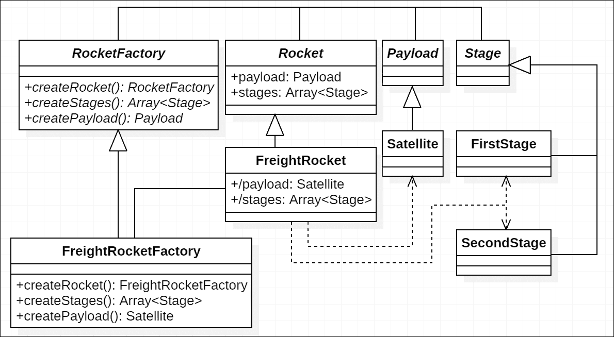
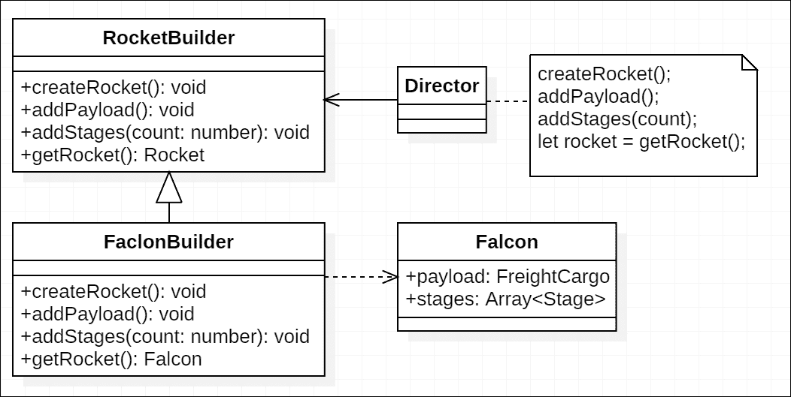

# 第三章。创建型设计模式

在面向对象编程中，创建型设计模式是在对象实例化期间应用的设计模式。在本章中，我们将讨论这一类别的模式。

假设我们正在建造一个具有有效载荷和一个或多个阶段的火箭：

```js
class Payload { 
  weight: number; 
} 

class Engine { 
  thrust: number; 
} 

class Stage { 
  engines: Engine[]; 
} 

```

在传统的 JavaScript 中，有两种主要的方法来构建这样的火箭：

+   使用`new`运算符的构造函数

+   工厂函数

对于第一种方法，事情可能如下所示：

```js
function Rocket() { 
  this.payload = { 
    name: 'cargo ship' 
  }; 

  this.stages = [ 
    { 
      engines: [ 
        // ... 
      ] 
    } 
  ]; 
} 

var rocket = new Rocket(); 

```

对于第二种方法，它可能如下所示：

```js
function buildRocket() { 
  var rocket = {}; 

  rocket.payload = { 
    name: 'cargo ship' 
  }; 

  rocket.stages = [ 
    { 
      thrusters: [ 
        // ... 
      ] 
    } 
  ]; 

  return rocket; 
} 

var rocket = buildRocket(); 

```

从某个角度来看，它们几乎在做同样的事情，但在语义上差异很大。构造函数方法建议构建过程与最终产品之间有很强的关联。另一方面，工厂函数则暗示了其产品的接口，并声称有能力构建这样的产品。

然而，上述两种实现都没有提供根据特定需求模块化组装火箭的灵活性；这正是创建型设计模式所涉及的。

在本章中，我们将介绍以下创建型模式：

+   **工厂方法**：通过使用工厂的抽象方法而不是构造函数来构建实例，这允许子类通过实现或覆盖这些方法来改变构建的内容。

+   **抽象工厂**：定义兼容工厂及其**产品**的接口。因此，通过更改传递的工厂，我们可以更改构建产品的家族。

+   **Builder**：定义构建复杂对象的**步骤**，并通过改变步骤的顺序或使用不同的 Builder 实现来改变构建的内容。

+   **Prototype**：通过克隆参数化的原型来创建对象。因此，通过替换这些原型，我们可以构建不同的产品。

+   **单例**：确保（在某个范围内）只创建一个实例。

很有趣的是，尽管在 JavaScript 中创建对象的工厂函数方法看起来很原始，但它确实与我们将要讨论的一些模式有共同之处（尽管应用于不同的范围）。

# 工厂方法

在某些情况下，一个类无法准确预测它将创建哪些对象，或者其子类可能想要创建这些对象的更具体的版本。然后，可以应用工厂方法模式。

下图显示了将工厂方法模式应用于创建火箭的可能结构：



**工厂方法**是一种工厂构建对象的方法。以建造火箭为例；一个工厂方法可以是构建整个火箭或单个组件的方法。一个工厂方法可能依赖于其他工厂方法来构建其目标对象。例如，如果我们有一个在`Rocket`类下的`createRocket`方法，它可能会调用像`createStages`和`createPayload`这样的工厂方法来获取必要的组件。

工厂方法模式在合理的复杂性上提供了一定的灵活性。它通过实现（或覆盖）特定的工厂方法来允许可扩展的使用。以`createStages`方法为例，我们可以通过提供不同的`createStages`方法来创建单级火箭或双级火箭，分别返回一个或两个阶段。

## 参与者

典型工厂方法模式实现的参与者包括以下内容：

+   产品：`Rocket`

定义一个将要创建为产品的火箭的抽象类或接口。

+   具体产品：`FreightRocket`

实现特定的火箭产品。

+   创建者：`RocketFactory`

定义可选的抽象工厂类以创建产品。

+   具体创建者：`FreightRocketFactory`

实现或覆盖特定的工厂方法以按需构建产品。

## 模式范围

工厂方法模式将`Rocket`与其构造函数实现解耦，并使得工厂的子类可以根据需要进行相应的构建更改。具体的创建者仍然关心其组件的确切内容和构建方式。但实现或覆盖通常更多地关注每个组件，而不是整个产品。

## 实现

让我们从构建一个简单的单级火箭开始，该火箭携带一个默认的 0 重量有效载荷作为基本实现：

```js
class RocketFactory { 
  buildRocket(): Rocket { } 

  createPayload(): Payload { } 

  createStages(): Stage[] { } 
} 

```

我们从创建组件开始。对于工厂方法`createPayload`，我们将简单地返回一个重量为 0 的有效载荷，对于工厂方法`createStages`，我们将返回一个单级，带有一个单独的引擎：

```js
createPayload(): Payload { 
  return new Payload(0); 
} 

createStages(): Stage[] { 
  let engine = new Engine(1000); 
  let stage = new Stage([engine]); 

  return [stage]; 
} 

```

在实现了创建火箭组件的方法之后，我们将使用工厂方法`buildRocket`将它们组合在一起：

```js
buildRocket(): Rocket { 
  let rocket = new Rocket(); 

  let payload = this.createPayload(); 
  let stages = this.createStages(); 

  rocket.payload = payload; 
  rocket.stages = stages; 

  return rocket; 
} 

```

现在我们有了简单火箭工厂的蓝图，但具有一定的可扩展性。要构建一个火箭（目前什么也不做），我们只需要实例化这个工厂并调用它的`buildRocket`方法：

```js
let rocketFactory = new RocketFactory(); 
let rocket = rocketFactory.buildRocket(); 

```

接下来，我们将构建双级货运火箭，将卫星送入轨道。因此，与基本工厂实现相比，有一些不同之处。

首先，我们有不同的有效载荷、卫星，而不是一个 0 重量的占位符：

```js
class Satellite extends Payload { 
  constructor( 
    public id: number 
  ) { 
    super(200); 
  } 
} 

```

第二，我们现在有两个阶段，可能具有不同的规格。第一级将配备四个引擎：

```js
class FirstStage extends Stage { 
  constructor() { 
    super([ 
      new Engine(1000), 
      new Engine(1000), 
      new Engine(1000), 
      new Engine(1000) 
    ]); 
  } 
} 

```

而第二级只有一个：

```js
class SecondStage extends Stage { 
  constructor() { 
    super([ 
      new Engine(1000) 
    ]); 
  } 
} 

```

现在我们已经心中有数，这个新的货运火箭将是什么样子，让我们扩展工厂：

```js
type FreightRocketStages = [FirstStage, SecondStage]; 

class FreightRocketFactory extends RocketFactory { 
  createPayload(): Satellite { } 

  createStages(): FreightRocketStages { } 
} 

```

### 小贴士

在这里，我们使用*tuple*的类型别名来表示货运火箭的阶段序列，即第一级和第二级。要了解更多关于类型别名的信息，请参阅[`www.typescriptlang.org/docs/handbook/advanced-types.html`](https://www.typescriptlang.org/docs/handbook/advanced-types.html)。

由于我们为`Satellite`添加了`id`属性，我们可能需要为工厂的每个实例提供一个计数器，然后为每个卫星创建一个唯一的 ID：

```js
nextSatelliteId = 0; 

createPayload(): Satellite { 
  return new Satellite(this.nextSatelliteId++); 
} 

```

让我们继续并实现`createStages`方法，该方法构建火箭的第一级和第二级：

```js
createStages(): FreightRocketStages { 
  return [ 
    new FirstStage(), 
    new SecondStage() 
  ]; 
} 

```

与原始实现相比，你可能已经注意到，我们已经自动将特定阶段构建过程与将它们组装成不同阶段的构造函数解耦。如果有助于的话，也可以应用另一个创建模式来初始化每个阶段。

## 后果

在前面的实现中，工厂方法`buildRocket`处理了构建步骤的大纲。我们很幸运，货运火箭与最初定义的第一个火箭在结构上是相同的。

但这种情况并不总是发生。如果我们想改变产品类（`Rocket`），我们就必须重写整个`buildRocket`，除了类名之外的所有内容。这看起来很令人沮丧，但可以通过将火箭实例的创建与构建过程解耦来解决：

```js
buildRocket(): Rocket { 
  let rocket = this.createRocket(); 

  let payload = this.createPayload(); 
  let stages = this.createStages(); 

  rocket.payload = payload; 
  rocket.stages = stages; 

  return rocket; 
} 

createRocket(): Rocket { 
  return new Rocket(); 
} 

```

因此，我们可以通过重写`createRocket`方法来改变火箭类。然而，子类（例如`FreightRocketFactory`）的`buildRocket`方法的返回类型仍然是`Rocket`而不是像`FreightRocket`这样的类型。但是，由于创建的对象实际上是`FreightRocket`的实例，通过类型断言进行类型转换是有效的：

```js
let rocket = FreightRocketFactory.buildRocket() as FreightRocket; 

```

权衡是略微牺牲类型安全，但可以使用泛型来消除。不幸的是，在 TypeScript 中，从泛型类型参数中得到的只是一个类型而没有实际值。这意味着我们可能需要另一个抽象级别或其他可以使用类型推断帮助确保一切的图案。

前一个选项将引导我们走向抽象工厂模式。

### 注意

类型安全可能是选择模式时需要考虑的一个因素，但通常，它不会是决定性的。请注意，我们并不是试图仅仅因为这个单一原因就切换模式，我们只是在探索。

# 抽象工厂

抽象工厂模式通常定义了一组工厂方法的接口，而不指定具体产品。这允许整个工厂可替换，以便按照相同的生产大纲生产不同的产品：


产品（组件）的细节在图中省略，但请注意，这些产品属于两个平行的家族：`ExperimentalRocket`和`FreightRocket`。

与工厂方法模式不同，抽象工厂模式提取了另一个称为**客户端**的部分，负责塑造构建过程的大纲。这使得工厂部分更专注于生产每个组件。

## 参与者

典型抽象工厂模式实现的参与者包括以下内容：

+   **抽象工厂**：`RocketFactory`

定义工厂的*工业标准*，该工厂提供制造组件或复杂产品的接口。

+   **具体工厂**：`ExperimentalRocketFactory`，`FreightRocketFactory`

实现由抽象工厂定义的接口并构建具体产品。

+   **抽象产品**：`Rocket`，`Payload`，`Stage[]`

定义工厂将要构建的产品接口。

+   **具体产品**：`ExperimentalRocket`/`FreightRocket`，`ExperimentalPayload`/`Satellite`等等。

展示由具体工厂制造的实际情况产品。

+   **客户端**：

在工厂之间安排生产过程（仅当这些工厂符合*工业标准*时）。

## 模式范围

抽象工厂模式在多个具体工厂之上进行了抽象。在单个工厂或单个工厂分支的范围内，它就像工厂方法模式一样工作。然而，这个模式的高光之处在于使整个产品系列可互换。一个很好的例子可以是 UI 实现的主题组件。

## 实现

在抽象工厂模式中，客户端与具体工厂交互以构建整体产品。然而，在设计时，产品的具体类与客户端解耦，而客户端只关心工厂及其产品的外观，而不是它们确切是什么。

让我们先简化相关的类到接口：

```js
interface Payload { 
  weight: number; 
} 

interface Stage { 
  engines: Engine[]; 
} 

interface Rocket { 
  payload: Payload; 
  stages: Stage[]; 
} 

```

当然，抽象工厂本身是：

```js
interface RocketFactory { 
  createRocket(): Rocket; 
  createPayload(): Payload; 
  createStages(): Stage[]; 
} 

```

建造步骤从工厂抽象出来并放入客户端，但我们仍然需要实现它：

```js
class Client { 
  buildRocket(factory: RocketFactory): Rocket { 
    let rocket = factory.createRocket(); 

    rocket.payload = factory.createPayload(); 
    rocket.stages = factory.createStages(); 

    return rocket; 
  } 
} 

```

现在我们遇到了我们在实现工厂方法模式时遇到的问题。由于不同的具体工厂构建不同的火箭，产品的类发生了变化。然而，现在我们有泛型来拯救我们。

首先，我们需要一个带有泛型类型参数的`RocketFactory`接口，该参数描述了一个具体的火箭类：

```js
interface RocketFactory<T extends Rocket> { 
  createRocket(): T; 
  createPayload(): Payload; 
  createStages(): Stage[]; 
} 

```

其次，更新客户端的`buildRocket`方法以支持泛型工厂：

```js
  buildRocket<T extends Rocket>( 
    factory: RocketFactory<T> 
  ): T { } 

```

因此，借助类型系统，我们将根据具体工厂的类型推断出火箭类型，从`ExperimentalRocket`和`ExperimentalRocketFactory`开始：

```js
class ExperimentalRocket implements Rocket { } 

class ExperimentalRocketFactory 
implements RocketFactory<ExperimentalRocket> { } 

```

如果我们用一个`ExperimentalRocketFactory`的实例调用客户端的`buildRocket`方法，返回类型将自动是`ExperimentalRocket`：

```js
let client = new Client(); 
let factory = new ExperimentalRocketFactory(); 
let rocket = client.buildRocket(factory); 

```

在我们完成`ExperimentalRocketFactory`对象的实现之前，我们需要为家族产品定义具体的类：

```js
class ExperimentalPayload implements Payload { 
  weight: number; 
} 

class ExperimentalRocketStage implements Stage { 
  engines: Engine[]; 
} 

class ExperimentalRocket implements Rocket { 
  payload: ExperimentalPayload; 
  stages: [ExperimentalRocketStage]; 
} 

```

### 注意

为了使内容更紧凑，省略了有效载荷和阶段的简单初始化。如果它们对于这本书不是必要的，可以应用相同类型的省略。

现在我们可以定义这个具体工厂类的工厂方法：

```js
class ExperimentalRocketFactory 
implements RocketFactory<ExperimentalRocket> { 
  createRocket(): ExperimentalRocket { 
    return new ExperimentalRocket(); 
  } 

  createPayload(): ExperimentalPayload { 
    return new ExperimentalPayload(); 
  } 

  createStages(): [ExperimentalRocketStage] { 
    return [new ExperimentalRocketStage()]; 
  } 
} 

```

让我们继续探讨另一个具体的工厂，该工厂制造货运火箭及其家族产品，从火箭组件开始：

```js
class Satellite implements Payload { 
  constructor( 
    public id: number, 
    public weight: number 
  ) { } 
} 

class FreightRocketFirstStage implements Stage { 
  engines: Engine[]; 
} 

class FreightRocketSecondStage implements Stage { 
  engines: Engine[]; 
} 

type FreightRocketStages = 
  [FreightRocketFirstStage, FreightRocketSecondStage]; 

```

继续讨论火箭本身：

```js
class FreightRocket implements Rocket { 
  payload: Satellite; 
  stages: FreightRocketStages; 
} 

```

在定义了货运火箭家族的结构或类之后，我们就可以实现其工厂了：

```js
class FreightRocketFactory 
implements RocketFactory<FreightRocket> { 
  nextSatelliteId = 0; 

  createRocket(): FreightRocket { 
    return new FreightRocket(); 
  } 

  createPayload(): Satellite { 
    return new Satellite(this.nextSatelliteId++, 100); 
  } 

  createStages(): FreightRocketStages { 
    return [ 
      new FreightRocketFirstStage(), 
      new FreightRocketSecondStage() 
    ]; 
  } 
} 

```

现在，我们再次拥有两个火箭家族及其工厂，并且我们可以通过传递不同的工厂来使用相同的客户端构建不同的火箭：

```js
let client = new Client(); 

let experimentalRocketFactory = new ExperimentalRocketFactory(); 
let freightRocketFactory = new FreightRocketFactory(); 

let experimentalRocket = 
  client.buildRocket(experimentalRocketFactory); 

let freightRocket = client.buildRocket(freightRocketFactory); 

```

## 后果

抽象工厂模式使得改变整个产品家族变得容易且顺畅。这是工厂级别抽象带来的直接好处。因此，它也带来了其他好处，同时也带来了一些缺点。

一方面，它提供了在特定家族产品内的更好兼容性。由于单个工厂构建的产品通常旨在协同工作，我们可以假设它们更容易合作。

但另一方面，它依赖于构建过程的共同轮廓，尽管对于良好的抽象构建过程，这通常不会成为问题。我们还可以在具体工厂和客户端上参数化工厂方法，使过程更加灵活。

当然，抽象工厂不一定是纯接口或没有实现任何方法的抽象类。实际实现应根据详细上下文来决定。

尽管抽象工厂模式和工厂方法模式具有不同级别的抽象，但它们封装的内容是相似的。对于构建具有多个组件的产品，工厂将产品分解为组件以获得灵活性。然而，固定家族的产品及其内部组件可能并不总是满足要求，因此我们可以考虑将建造者模式作为另一种选择。

# 建造者

当工厂模式暴露内部组件（如火箭的负载和阶段）时，建造者模式通过仅暴露构建步骤来封装它们，并直接提供最终产品。同时，建造者模式还封装了产品的内部结构。这使得更灵活地抽象和实现构建复杂对象成为可能。

建造者模式还引入了一个新的角色，称为**导演**，如下面的图所示。它与抽象工厂模式中的客户端非常相似，尽管它只关心构建步骤或管道：



现在从`RocketBuilder`对子类产品施加的唯一约束是`Rocket`的整体形状。这可能不会带来很多好处，因为我们之前定义的`Rocket`接口暴露了一些火箭的细节，而客户端（我指的是那些想要将卫星或其他类型的有效载荷送入太空的人）可能不太关心这些细节。对于这些客户端，他们可能想知道的只是火箭能够将有效载荷送入哪个轨道，而不是火箭有多少级以及具体是哪些级。

## 参与者

典型建造者模式实现的参与者包括以下内容：

+   **建造者**：`RocketBuilder`

定义了一个构建产品的构建器接口。

+   **具体建造者**：`FalconBuilder`

实现构建产品部分的方法，并跟踪当前的构建状态。

+   **导演**

定义步骤并与构建者协作以构建产品。

+   **最终产品**：`Falcon`

由构建者构建的产品。

## 模式范畴

建造者模式与抽象工厂模式具有相似的范畴，它从将最终启动产品的完整操作集合中提取抽象。与抽象工厂模式相比，建造者模式在构建步骤及其关联上更加关注，而抽象工厂模式将这部分放在客户端，并使工厂专注于生产组件。

## 实现

由于我们现在假设阶段不是想要购买火箭以携带其有效载荷的客户所关心的问题，我们可以从通用`Rocket`接口中删除`stages`属性：

```js
interface Rocket { 
  payload: Payload; 
} 

```

有一个名为“ sounding rocket”的火箭家族，它将探测器发送到近太空。这意味着我们甚至不需要有阶段的概念。`SoundingRocket`将只有一个`engine`属性（除了`payload`，它将是一个`Probe`），唯一的发动机将是一个`SolidRocketEngine`：

```js
class Probe implements Payload { 
  weight: number; 
} 

class SolidRocketEngine extends Engine { } 

class SoundingRocket implements Rocket { 
  payload: Probe; 
  engine: SolidRocketEngine; 
} 

```

但我们仍然需要火箭来发送卫星，这些卫星通常使用`LiquidRocketEngine`：

```js
class LiquidRocketEngine extends Engine { 
  fuelLevel = 0; 

  refuel(level: number): void { 
    this.fuelLevel = level; 
  } 
} 

```

我们可能还想有一个相应的`LiquidRocketStage`抽象类来处理加注：

```js
abstract class LiquidRocketStage implements Stage { 
  engines: LiquidRocketEngine[] = []; 

  refuel(level = 100): void { 
    for (let engine of this.engines) { 
      engine.refuel(level); 
    } 
  } 
} 

```

现在我们可以将`FreightRocketFirstStage`和`FreightRocketSecondStage`更新为`LiquidRocketStage`的子类：

```js
class FreightRocketFirstStage extends LiquidRocketStage { 
  constructor(thrust: number) { 
    super(); 

    let enginesNumber = 4; 
    let singleEngineThrust = thrust / enginesNumber; 

    for (let i = 0; i < enginesNumber; i++) { 
      let engine = 
        new LiquidRocketEngine(singleEngineThrust); 
      this.engines.push(engine); 
    } 
  } 
} 

class FreightRocketSecondStage extends LiquidRocketStage { 
  constructor(thrust: number) { 
    super(); 
    this.engines.push(new LiquidRocketEngine(thrust)); 
  } 
} 

```

`FreightRocket`将保持不变：

```js
type FreightRocketStages = 
  [FreightRocketFirstStage, FreightRocketSecondStage]; 

class FreightRocket implements Rocket { 
  payload: Satellite; 
  stages = [] as FreightRocketStages; 
} 

```

当然，还有构建者。这次，我们将使用一个抽象类，该类部分实现了构建器，并应用了泛型：

```js
abstract class RocketBuilder< 
  TRocket extends Rocket, 
  TPayload extends Payload 
> { 
  createRocket(): void { } 

  addPayload(payload: TPayload): void { } 

  addStages(): void { } 

  refuelRocket(): void { } 

  abstract get rocket(): TRocket; 
} 

```

### 注意

在这个抽象类中实际上没有抽象方法。其中一个原因是特定步骤可能对某些构建者来说是可选的。通过实现 no-op 方法，子类可以简单地留出它们不关心的步骤为空。

这里是`Director`类的实现：

```js
class Director { 
  prepareRocket< 
    TRocket extends Rocket, 
    TPayload extends Payload 
  >( 
    builder: RocketBuilder<TRocket, TPayload>, 
    payload: TPayload 
  ): TRocket { 
    builder.createRocket(); 
    builder.addPayload(payload); 
    builder.addStages(); 
    builder.refuelRocket(); 
    return builder.rocket; 
  } 
} 

```

### 注意

谨慎起见，如果没有明确提供构建上下文，构建实例将依赖于构建管道正在排队（无论是同步还是异步）。避免风险的一种方法（尤其是在异步操作中）是每次准备火箭时都初始化一个构建实例。

现在是时候实现具体的构建器了，从`SoundingRocketBuilder`开始，它使用只有一个`SolidRocketEngine`构建`SoundingRocket`：

```js
class SoundingRocketBuilder 
extends RocketBuilder<SoundingRocket, Probe> { 
  private buildingRocket: SoundingRocket; 

  createRocket(): void { 
    this.buildingRocket = new SoundingRocket(); 
  } 

  addPayload(probe: Probe): void { 
    this.buildingRocket.payload = probe; 
  } 

  addStages(): void { 
    let payload = this.buildingRocket.payload; 
    this.buildingRocket.engine = 
      new SolidRocketEngine(payload.weight); 
  } 

  get rocket(): SoundingRocket { 
    return this.buildingRocket; 
  } 
} 

```

在这个实现中，有几个值得注意的地方：

+   `addStages`方法依赖于之前添加的有效载荷来添加具有正确推力规格的发动机。

+   `refuel`方法没有被重写（因此它仍然是 no-op），因为固体火箭发动机不需要加注。

我们已经对构建者提供的一些上下文有所了解，这可能会对结果产生重大影响。例如，让我们看看`FreightRocketBuilder`。如果我们不考虑`addStages`和`refuel`方法，它可能与`SoundingRocket`相似：

```js
class FreightRocketBuilder 
extends RocketBuilder<FreightRocket, Satellite> { 
  private buildingRocket: FreightRocket; 

  createRocket(): void { 
    this.buildingRocket = new FreightRocket(); 
  } 

  addPayload(satellite: Satellite): void { 
    this.buildingRocket.payload = satellite; 
  } 

  get rocket(): FreightRocket { 
    return this.buildingRocket; 
  } 
} 

```

假设重量小于`1000`的有效载荷只需要一个阶段就能送入太空，而重量更大的有效载荷需要两个或更多阶段：

```js
addStages(): void { 
  let rocket = this.buildingRocket; 
  let payload = rocket.payload; 
  let stages = rocket.stages; 

  stages[0] = new FreightRocketFirstStage(payload.weight * 4); 

  if (payload.weight >= FreightRocketBuilder.oneStageMax) { 
    stages[1] = FreightRocketSecondStage(payload.weight); 
  } 
} 

static oneStageMax = 1000; 

```

当涉及到加油时，我们甚至可以根据有效载荷的重量来决定加油量：

```js
refuel(): void { 
  let rocket = this.buildingRocket; 
  let payload = rocket.payload; 
  let stages = rocket.stages; 

  let oneMax = FreightRocketBuilder.oneStageMax; 
  let twoMax = FreightRocketBuilder.twoStagesMax; 

  let weight = payload.weight; 

  stages[0].refuel(Math.min(weight, oneMax) / oneMax * 100); 

  if (weight >= oneMax) { 
    stages[1] 
      .refuel((weight - oneMax) / (twoMax - oneMax) * 100); 
  } 
} 

static oneStageMax = 1000; 
static twoStagesMax = 2000; 

```

现在我们可以准备不同制造商的不同火箭，准备发射：

```js
let director = new Director(); 

let soundingRocketBuilder = new SoundingRocketBuilder(); 
let probe = new Probe(); 
let soundingRocket 
  = director.prepareRocket(soundingRocketBuilder, probe); 

let freightRocketBuilder = new FreightRocketBuilder(); 
let satellite = new Satellite(0, 1200); 
let freightRocket 
  = director.prepareRocket(freightRocketBuilder, satellite); 

```

## 后果

由于建造者模式对产品结构和构建步骤如何相互影响有更大的控制权，它通过自身子类化建造者提供了最大的灵活性，而不改变导演（在抽象工厂模式中扮演类似客户端的角色）。

# 原型

由于 JavaScript 是一种基于原型的编程语言，你可能会在不自知的情况下一直使用与原型相关的模式。

我们在抽象工厂模式中讨论了一个例子，部分代码如下：

```js
class FreightRocketFactory 
implements RocketFactory<FreightRocket> { 
  createRocket(): FreightRocket { 
    return new FreightRocket(); 
  } 
} 

```

有时我们可能需要添加一个子类，只是为了在执行相同的`new`操作时更改类名。单类实例通常共享相同的方法和属性，因此我们可以克隆一个现有实例以创建新的实例。这就是原型的概念。

但在 JavaScript 中，由于内置了原型概念，`new Constructor()`基本上会做克隆方法会做的事情。所以实际上构造函数可以在某种程度上扮演具体工厂的角色：

```js
interface Constructor<T> { 
  new (): T; 
} 

function createFancyObject<T>(constructor: Constructor<T>): T { 
  return new constructor(); 
} 

```

利用这个特权，我们可以将产品或组件类作为其他模式的一部分进行参数化，使创建更加灵活。

在讨论 JavaScript 中的原型模式时，可能会容易忽略一些东西：带有状态的克隆。随着 ES6 中引入的`class`语法糖，它隐藏了原型修改，我们有时可能会忘记我们实际上可以直接修改原型：

```js
class Base { 
  state: number; 
} 

let base = new Base(); 
base.state = 0; 

class Derived extends Base { } 
Derived.prototype = base; 

let derived = new Derived(); 

```

现在，`derived`对象将保持`base`对象的`state`。当你想要创建特定实例的副本但又不希望这些副本的原型属性成为克隆对象的*自有属性*时，这可能很有用。

# Singleton

有一些场景中，应该只存在特定类的单个实例，这导致了单例模式。

## 基本实现

JavaScript 中最简单的单例是一个对象字面量；它提供了一种快速且经济的方式创建一个唯一的对象：

```js
const singleton = { 
  foo(): void { 
    console.log('bar'); 
  } 
}; 

```

但有时我们可能需要私有变量：

```js
const singleton = (() => { 
  let bar = 'bar'; 

  return { 
    foo(): void { 
      console.log(bar); 
    } 
  }; 
})(); 

```

或者我们想利用 ES6 中的匿名构造函数或类表达式：

```js
const singleton = new class { 
  private _bar = 'bar'; 

  foo(): void { 
    console.log(this._bar); 
  } 
} (); 

```

### 注意

请记住，`private`修饰符仅在编译时有效，编译成 JavaScript 后（尽管当然其可访问性将保留在`.d.ts`中）将简单地消失。

然而，有时可能需要创建“单例”新实例的要求。因此，一个普通的类仍然是有帮助的：

```js
class Singleton { 
  bar = 'bar'; 

  foo(): void { 
    console.log(bar); 
  } 

  private static _default: Singleton; 

  static get default(): Singleton { 
    if (!Singleton._default) { 
      Singleton._default = new Singleton(); 
    } 

    return Singleton._default; 
  } 
} 

```

这种方法带来的另一个好处是延迟初始化：对象仅在第一次访问时才被初始化。

## 条件单例

有时我们可能希望根据某些条件获取“单例”。例如，每个国家通常只有一个首都，因此首都可以在特定国家的范围内被视为单例。

条件也可能是上下文的结果，而不是显式的参数。假设我们有一个类`Environment`及其派生类`WindowsEnvironment`和`UnixEnvironment`，我们希望通过使用`Environment.default`在各个平台上访问正确的环境单例，显然，可以通过`default`获取器进行选择。

对于更复杂的场景，我们可能需要一个基于注册的实现来使其可扩展。

# 摘要

在本章中，我们讨论了包括工厂方法、抽象工厂、建造者、原型和单例在内的几个重要的创建型设计模式。

从工厂方法模式开始，它以有限的复杂性提供灵活性，我们还探讨了抽象工厂模式、建造者模式和原型模式，这些模式具有相似级别的抽象，但关注不同的方面。这些模式比工厂方法模式具有更大的灵活性，但同时也更复杂。了解每个模式背后的理念，我们应该能够相应地选择和应用模式。

在比较不同创建型模式之间的差异时，我们也发现了它们之间许多共同之处。这些模式不太可能孤立于其他模式之外，其中一些甚至可以相互协作或补充。

在下一章中，我们将继续讨论有助于形成具有复杂结构的对象的组合型模式。
