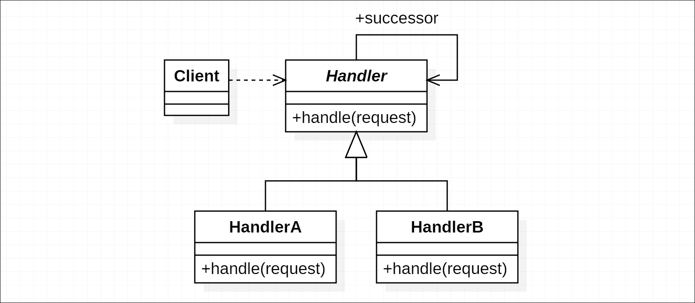
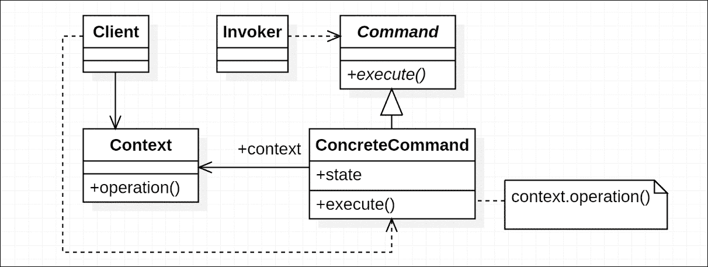
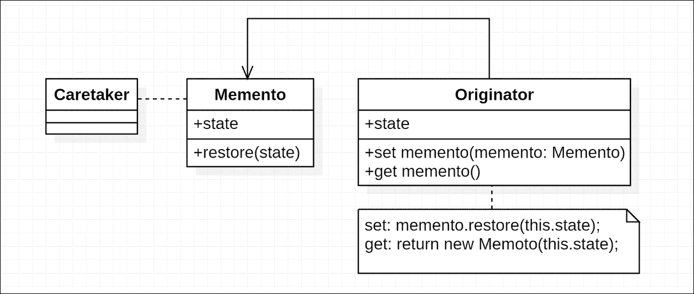
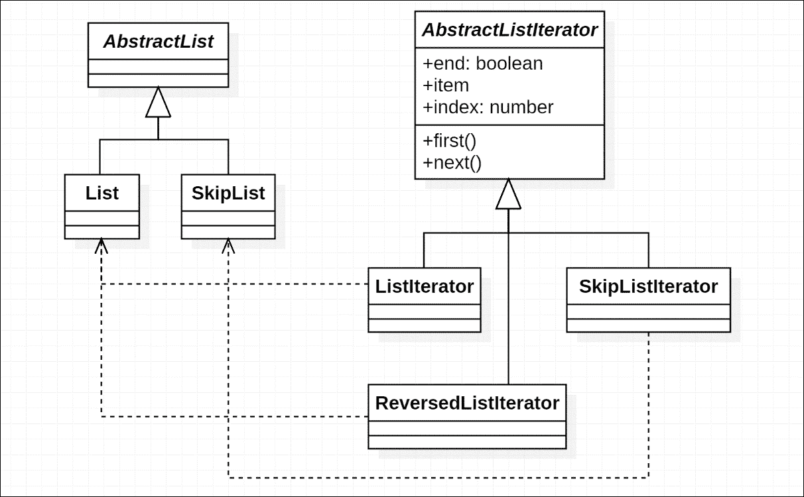
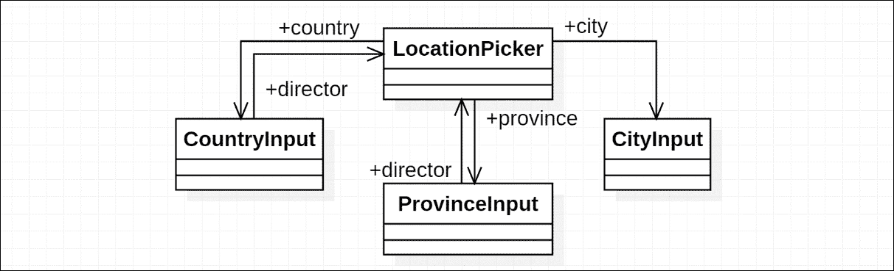

# 第五章。行为设计模式

如其名所示，行为设计模式是关于对象或类如何相互交互的模式。行为设计模式的实现通常需要某些数据结构来支持系统中的交互。然而，当应用时，行为模式和结构模式关注不同的方面。因此，你可能会发现行为设计模式类别中的模式通常比结构设计模式更简单或更直接。

在本章中，我们将讨论以下一些常见的模式：

+   **责任链**：组织不同范围的行为

+   **命令**：通过封装的上下文暴露内部命令

+   **备忘录**：提供一种管理状态的方法，这些状态不在其所有者之外，而不暴露详细的实现

+   **迭代器**：提供遍历的通用接口

+   **中介者**：它将耦合和逻辑上相关的对象分组，并在管理许多对象的系统中使互连更清晰

# 责任链模式

在许多场景下，我们可能希望应用某些可以从详细范围回退到更一般范围的动作。

一个很好的例子是 GUI 应用程序的帮助信息：当用户请求用户界面某部分的帮助信息时，期望显示尽可能具体的信息。这可以通过不同的实现来完成，对于一个网络开发者来说，最直观的实现可能是事件冒泡。

考虑一个 DOM 结构如下：

```js
<div class="outer"> 
  <div class="inner"> 
    <span class="origin"></span> 
  </div> 
</div> 

```

如果用户点击`span.origin`元素，一个`click`事件将从`span`元素冒泡到文档根（如果`useCapture`为`false`）：

```js
$('.origin').click(event => { 
  console.log('Click on `span.origin`.'); 
}); 

$('.outer').click(event => { 
  console.log('Click on `div.outer`.'); 
}); 

```

默认情况下，它将触发前面代码中添加的所有事件监听器。为了在事件被处理时立即停止传播，我们可以调用其`stopPropagation`方法：

```js
$('.origin').click(event => { 
  console.log('Click on `span.origin`.'); 
 event.stopPropagation(); 
}); 

$('.outer').click(event => { 
  Console.log('Click on `div.outer`.'); 
}); 

```

虽然点击事件并不完全等同于帮助信息请求，但在自定义事件的支持下，处理带有必要详细或一般信息的帮助信息相当容易。

责任链模式的一个重要实现与错误处理相关。一个原始的例子可能是使用`try...catch`。考虑以下代码：我们有三个函数：`foo`、`bar`和`biu`，`foo`被`bar`调用，而`bar`被`biu`调用：

```js
function foo() { 
  // throw some errors. 
} 

function bar() { 
  foo(); 
} 

function biu() { 
  bar(); 
} 

biu(); 

```

在函数`bar`和`biu`内部，我们可以做一些错误捕获。假设函数`foo`抛出两种类型的错误：

```js
function foo() { 
  let value = Math.random(); 

  if (value < 0.5) { 
    throw new Error('Awesome error'); 
  } else if (value < 0.8) { 
    throw new TypeError('Awesome type error'); 
  } 
} 

```

在函数`bar`中，我们希望处理`TypeError`，并让其他错误抛出：

```js
function bar() { 
  try { 
    foo(); 
  } catch (error) { 
    if (error instanceof TypeError) { 
      console.log('Some type error occurs', error); 
    } else { 
      throw error; 
    } 
  } 
} 

```

在函数`biu`中，我们希望添加更通用的处理，捕获所有错误，以便程序不会崩溃：

```js
function biu() { 
  try { 
    bar(); 
  } catch (error) { 
    console.log('Some error occurs', error); 
  } 
} 

```

因此，通过使用`try...catch`语句，你可能一直在不断地使用责任链模式，而没有注意到它。就像你可能一直在使用其他众所周知的设计模式一样。

如果我们将责任链模式的结构抽象为对象，我们可能会有如图所示的某种结构：



## 参与者

责任链模式的参与者包括：

+   **处理器**：定义了处理器与后继者之间的接口以及处理请求的方法。这通过`EventEmitter`类和`try...catch`语法隐式完成。

+   **具体处理器**：`EventListener`、`catch`块和类版本中的`HandlerA`/`HandlerB`。以回调函数、代码块和类等形式定义处理器。

+   **客户端**：启动通过链传递的请求。

## 模式作用域

责任链模式本身可以应用于程序中的许多不同作用域。它需要一个多级链来工作，但这个链可以有不同的形式。我们已经玩过事件以及具有结构级别的`try...catch`语句，这个模式也可以应用于具有逻辑级别的场景。

使用字符串标记不同作用域的对象：

```js
let objectA = { 
  scope: 'user.installation.package' 
}; 

let objectB = { 
  scope: 'user.installation' 
}; 

```

现在我们有两个对象，它们的作用域由字符串指定，通过向这些作用域字符串添加过滤器，我们可以将特定操作应用于一般操作。

## 实现部分

在这部分，我们将实现我们在责任链模式介绍中提到的类版本。考虑可能请求帮助信息或反馈提示的请求：

```js
type RequestType = 'help' | 'feedback'; 

interface Request { 
  type: RequestType; 
} 

```

### 注意

我们在这里使用字符串字面量类型与联合类型。这是 TypeScript 提供的一个非常有用的特性，它与现有的 JavaScript 编码风格兼容。更多信息请见以下链接：[`www.typescriptlang.org/docs/handbook/advanced-types.html`](http://www.typescriptlang.org/docs/handbook/advanced-types.html)。

这个模式的关键过程之一是遍历处理器的链，并找出对请求可用的最具体的处理器。实现这一目标有几种方法：通过递归调用后继者的`handle`方法，或者通过单独的逻辑遍历处理器后继链，直到确认请求已被处理。

第二种遍历链的逻辑需要确认请求是否被正确处理。这可以通过请求对象上的状态指示器或`handle`方法的返回值来完成。

在这部分，我们将采用递归实现。首先，我们希望处理器默认的处理行为是将请求转发给其后继者（如果有的话）：

```js
class Handler { 
  private successor: Handler; 

  handle(request: Request): void { 
    if (this.successor) { 
      this.successor.handle(request); 
    } 
  } 
} 

```

现在对于`HelpHandler`，它处理帮助请求，但转发其他请求：

```js
class HelpHandler extends Handler { 
  handle(request: Request): void { 
    if (request.type === 'help') { 
      // Show help information. 
    } else { 
      super.handle(request); 
    } 
  } 
} 

```

`FeedbackHandler`的代码类似：

```js
class FeedbackHandler extends Handler { 
  handle(request: Request): void { 
    if (request.type === 'feedback') { 
      // Prompt for feedback. 
    } else { 
      super.handle(request); 
    } 
  } 
} 

```

因此，可以通过某种方式构建一个处理程序链。如果请求进入这个链，它将被传递，直到处理程序识别并处理它。然而，在处理请求后，并不一定需要处理所有请求。处理程序可以始终将请求传递下去，无论这个请求是否被处理程序处理。

## 后果

责任链模式解耦了发出请求的对象与处理这些请求的逻辑之间的连接。发送者假设其请求可能，但不一定，能够得到适当的处理，而无需了解细节。对于某些实现，向链上的特定处理程序添加新的责任也非常容易。这为处理请求提供了显著的灵活性。

除了我们之前提到的例子之外，还有一个重要的`try...catch`变异，它可以在责任链模式中处理 - Promise。在更小的范围内，链可以表示为：

```js
promise 
  .catch(TypeError, reason => { 
    // handles TypeError. 
  }) 
  .catch(ReferenceError, reason => { 
    // handles ReferenceError. 
  }) 
  .catch(reason => { 
    // handles other errors. 
  }); 

```

### 注意

ES Promise 对象上的标准`catch`方法不提供接受错误类型作为参数的重载，但许多实现都做到了。

在更大的范围内，这个链通常出现在代码与第三方库交互时。一种常见的用法是将其他库产生的错误转换为当前项目已知的错误。我们将在本书的后面部分更多地讨论异步代码的错误处理。

# 命令模式

命令模式涉及将操作封装为可执行的命令，在 JavaScript 中可以是对象或函数的形式。通常情况下，我们可能希望使操作依赖于某些调用者无法访问的上下文和状态。通过将这部分信息与命令一起存储并传递出去，这种情况可以得到妥善处理。

考虑一个极其简单的例子：我们想要提供一个名为`wait`的函数，它返回一个`cancel`处理程序：

```js
function wait() { 
  let $layer = $('.wait-layer'); 

  $layer.show(); 

  return () => { 
    $layer.hide(); 
  }; 
} 

let cancel = wait(); 

setTimeout(() => cancel(), 1000); 

```

上述代码中的`cancel`处理程序正是我们刚才提到的命令。它使用闭包存储上下文（`$layer`），并以函数`wait`的返回值的形式传递出去。

JavaScript 中的闭包提供了一种非常简单的方式来存储命令上下文和状态，然而，直接的缺点是上下文/状态与命令函数之间的灵活性会受到影响，因为闭包是词法确定的，无法在运行时更改。如果命令只预期在固定的上下文和状态下调用，这将是可行的，但对于更复杂的情况，我们可能需要将它们构建为具有适当数据结构的对象。

下图显示了命令模式中参与者之间的整体关系：



通过命令对象正确地分离上下文和状态，命令模式也可以很好地与享元模式协同工作，如果你想要多次重用命令对象的话。

基于命令模式的其他常见扩展包括撤销支持和具有多个命令的宏。我们将在实现部分稍后玩转这些内容。

## 参与者

命令模式的参与者包括：

+   **命令**：定义传递命令的一般接口，如果命令以函数的形式存在，则可以是函数签名。

+   **具体命令**：定义特定的行为和相关数据结构。它也可以是一个与声明为`Command`的签名匹配的函数。在第一个例子中，`cancel`处理程序就是一个具体命令。

+   **上下文**：命令关联的上下文或接收者。在第一个例子中，它是`$layer`。

+   **客户端**：创建具体的命令及其上下文。

+   **调用者**：执行具体命令。

## 模式范围

命令模式建议在单个应用程序或更大的系统中建议两个独立的部分：*客户端*和*调用者*。在简化的示例`wait`和`cancel`中，可能很难区分这些部分之间的差异。但界限是清晰的：*客户端*知道或控制要执行的命令的上下文，而*调用者*没有访问或不需要关心这些信息。

命令模式的关键是通过存储上下文和状态的命令在这两部分之间进行分离和桥接。

## 实现

对于编辑器来说，向第三方扩展公开命令以修改文本内容是很常见的。考虑一个包含有关正在编辑的文本文件信息的`TextContext`和一个与该上下文关联的抽象`TextCommand`类：

```js
class TextContext { 
  content = 'text content'; 
} 

abstract class TextCommand { 
  constructor( 
    public context: TextContext 
  ) { } 

  abstract execute(...args: any[]): void; 
} 

```

当然，`TextContext`可以包含更多像语言、编码等信息。您可以在自己的实现中添加它们以获得更多功能。现在我们将创建两个命令：`ReplaceCommand`和`InsertCommand`。

```js
class ReplaceCommand extends TextCommand { 
  execute(index: number, length: number, text: string): void { 
    let content = this.context.content; 

    this.context.content = 
      content.substr(0, index) + 
      text + 
      content.substr(index + length); 
  } 
} 

class InsertCommand extends TextCommand { 
  execute(index: number, text: string): void { 
    let content = this.context.content; 

    this.context.content = 
      content.substr(0, index) + 
      text + 
      content.substr(index); 
  } 
} 

```

这两个命令具有相似的逻辑，实际上`InsertCommand`可以被视为`ReplaceCommand`的一个子集。或者如果我们有一个新的删除命令，那么替换命令可以被视为删除和插入命令的组合。

现在让我们用客户端和调用者组装这些命令：

```js
class Client { 
  private context = new TextContext(); 

  replaceCommand = new ReplaceCommand(this.context); 
  insertCommand = new InsertCommand(this.context); 
} 

let client = new Client(); 

$('.replace-button').click(() => { 
  client.replaceCommand.execute(0, 4, 'the'); 
}); 

$('.insert-button').click(() => { 
  client.insertCommand.execute(0, 'awesome '); 
}); 

```

如果我们更进一步，实际上可以有一个执行其他命令的命令。也就是说，我们可以有宏命令。尽管前面的例子单独来看并不需要创建宏命令，但会有一些场景中宏命令会很有帮助。由于这些命令已经与它们的上下文相关联，宏命令通常不需要有显式的上下文：

```js
interface TextCommandInfo { 
  command: TextCommand, 
  args: any[]; 
} 

class MacroTextCommand { 
  constructor( 
    public infos: TextCommandInfo[] 
  ) { } 

  execute(): void { 
    for (let info of this.infos) { 
      info.command.execute(...info.args); 
    } 
  } 
} 

```

## 后果

命令模式将客户端（知道或控制上下文的人）和调用者（没有访问或不需要关心详细上下文的人）解耦。

它与组合模式配合得很好。考虑我们上面提到的宏命令示例：一个宏命令可以有其他宏命令作为其组件，因此我们将其视为一个组合命令。

命令模式的另一个重要案例是添加对撤销操作的支持。一种直接的方法是将 `undo` 方法添加到每个命令中。当请求撤销操作时，以相反的顺序调用命令的 `undo` 方法，我们只能希望每个命令都能正确撤销。然而，这种方法高度依赖于 `undo` 方法的完美实现，因为每个错误都会累积。为了实现更稳定的撤销支持，可以存储冗余信息或快照。

# Memento 模式

在上一节关于命令模式的讨论中，我们提到了一个撤销支持实现，并发现仅基于反转所有操作来实现机制并不容易。然而，如果我们把对象的快照作为它们的历史，我们可能能够避免累积错误并使系统更加稳定。但随后我们遇到了一个问题：我们需要在对象的状态被封装在对象本身时存储对象的状态。

Memento 模式有助于这种情况。当一个备忘录携带了对象在某个时间点的状态时，它还控制了将状态设置回对象的过程。这使得以下示例中的内部状态实现隐藏在撤销机制之后：



在前面的结构中，我们有备忘录实例控制状态恢复。它也可以由保管人，即撤销机制，控制，用于简单的状态恢复情况。

## 参与者

Memento 模式的参与者包括：

+   **Memento**：存储对象的当前状态并定义 `restore` 或其他用于将状态恢复到特定对象的 API

+   **Originator**：处理需要存储其内部状态的对象

+   **保管人**：管理备忘录而不干预其内部内容

## 模式范围

Memento 模式主要做两件事：它防止保管人了解内部状态实现，并将状态检索和恢复过程从由 `Caretaker` 或 `Originator` 管理的状态中解耦。

当状态检索和恢复过程很简单时，如果你已经考虑了解耦的想法，拥有分离的备忘录并不会带来太多帮助。

## 实现

从一个空的 `State` 接口和 `Memento` 类开始。由于我们不希望 `Caretaker` 了解 `Originator` 或 `Memento` 内部状态的细节，我们希望将 `Memento` 的 `state` 属性设置为私有。在 `Memento` 中包含恢复逻辑也有助于这一点，因此我们需要 `restore` 方法。这样我们就不需要公开接口来读取备忘录内部的状态。

由于 JavaScript 中的对象赋值仅分配其引用，我们希望对状态进行快速复制（假设状态对象是单层的）：

```js
interface State { } 

class Memento { 
  private state: State; 

  constructor(state: State) { 
    this.state = Object.assign({} as State, state); 
  } 

  restore(state: State): void { 
    Object.assign(state, this.state); 
  } 
} 

```

对于 `Originator`，我们使用 getter 和 setter 来创建和恢复特定的备忘录：

```js
class Originator { 
  state: State; 

  get memento(): Memento { 
    return new Memento(this.state); 
  } 

  set memento(memento: Memento) { 
    memento.restore(this.state); 
  } 
} 

```

现在，`Caretaker`将管理与备忘录一起积累的历史：

```js
class Caretaker { 
  originator: Originator; 
  history: Memento[] = []; 

  save(): void { 
    this.history.push(this.originator.memento); 
  } 

  restore(): void { 
    this.originator.memento = this.history.shift(); 
  } 
} 

```

在某些 Memento 模式的实现中，为`Originator`的实例提供了一个`getState`方法，以便从备忘录中读取状态。但为了防止除`Originator`之外的类访问`state`属性，它可能依赖于诸如*友元修饰符*之类的语言特性来限制访问（TypeScript 中尚未提供）。

## 后果

Memento 模式使看护者更容易管理发起者的状态，并使扩展状态检索和恢复成为可能。然而，一个完美的实现可能依赖于我们之前提到的语言特性。使用备忘录也可能带来性能成本，因为它们通常包含冗余信息以换取稳定性。

# 迭代模式

迭代模式提供了一个通用的接口，用于访问聚合体的内部元素，而不暴露底层的数据结构。典型的迭代器包含以下方法或获取器：

+   `first()`: 将光标移动到聚合体中的*第一个*元素

+   `next()`: 将光标移动到*下一个*元素

+   `end`: 一个获取器，返回一个布尔值，指示光标是否在末尾

+   `item`: 一个获取器，返回当前光标位置的元素

+   `index`: 一个获取器，返回当前光标所在元素的位置索引

对于具有不同接口或底层结构的聚合体，它们的迭代器通常会有不同的实现，如下面的图示所示：



虽然客户端不需要担心聚合体的结构，但迭代器肯定需要。假设我们拥有构建迭代器所需的一切，可能会有多种创建迭代器的方法。在创建迭代器时，工厂方法被广泛使用，或者如果没有参数要求，则使用*工厂获取器*。

从 ES6 开始，添加了语法糖`for...of`，适用于所有具有`Symbol.iterator`属性的属性对象。这使得开发人员使用自定义列表和其他可迭代的类变得更加容易和舒适。

## 参与者

迭代模式的部分包括：

+   **迭代器**: `AbstractListIterator`

    定义了通用的迭代器接口，该接口将遍历不同的聚合体。

+   **具体迭代器**: `ListIterator`、`SkipListIterator`和`ReversedListIterator`

    实现特定的迭代器，用于遍历并跟踪特定的聚合体。

+   **聚合体**: `AbstractList`

    定义了聚合体的基本接口，迭代器将与之协同工作。

+   **具体聚合体**: `List`和`SkipList`

    定义了数据结构和工厂方法/获取器，用于创建关联的迭代器。

## 模式范围

迭代器模式为遍历聚合提供了统一的接口。在一个不依赖于迭代器的系统中，迭代器提供的主要功能可以很容易地被简单的辅助工具所取代。然而，随着系统的增长，这些辅助工具的可重用性可能会降低。

## 实现

在这部分，我们将实现一个简单的数组迭代器，以及一个 ES6 迭代器。

### 简单数组迭代器

让我们从为 JavaScript 数组创建一个迭代器开始，这应该非常简单。首先，是通用接口：

```js
interface Iterator<T> { 
  first(): void; 
  next(): void; 
  end: boolean; 
  item: T; 
  index: number; 
} 

```

### 注意

请注意，TypeScript 对 ES6 已经声明了一个名为 `Iterator` 的接口。考虑将这段代码放入一个命名空间或模块中，以避免冲突。

简单数组迭代器的实现可以是：

```js
class ArrayIterator<T> implements Iterator<T> { 
  index = 0; 

  constructor( 
    public array: T[] 
  ) { } 

  first(): void { 
    this.index = 0; 
  } 

  next(): void { 
    this.index++; 
  } 

  get end(): boolean { 
    return this.index >= this.array.length; 
  } 

  get item(): T { 
    return this.array[this.index]; 
  } 
} 

```

现在我们需要扩展原生 `Array` 的原型以添加一个 `iterator` 属性：

```js
Object.defineProperty(Array.prototype, 'iterator', { 
  get() { 
    return new ArrayIterator(this); 
  } 
}); 

```

为了使 `iterator` 成为 `Array` 实例的有效属性，我们还需要扩展 `Array` 的接口：

```js
interface Array<T> { 
  iterator: IteratorPattern.Iterator<T>; 
} 

```

### 注意

这应该写在全球作用域下的命名空间之外。或者如果你在一个模块或环境模块中，你可能想尝试使用 `declare global { ... }` 来向现有的全局接口添加新属性。

### ES6 迭代器

ES6 提供了 `for...of` 语法糖和其他辅助工具来支持 *可迭代* 对象，即实现了以下 `Iterable` 接口的对象：

```js
interface IteratorResult<T> { 
  done: boolean; 
  value: T; 
} 

interface Iterator<T> { 
  next(value?: any): IteratorResult<T>; 
  return?(value?: any): IteratorResult<T>; 
  throw?(e?: any): IteratorResult<T>; 
} 

interface Iterable<T> { 
  [Symbol.iterator](): Iterator<T>; 
} 

```

假设我们有一个具有以下结构的类：

```js
class SomeData<T> { 
  array: T[]; 
} 

```

我们希望使其可迭代。更具体地说，我们希望它反向迭代。正如 `Iterable` 接口所建议的，我们只需要添加一个具有特殊名称 `Symbol.iterator` 的方法来创建一个 `Iterator`。让我们称这个迭代器为 `SomeIterator`：

```js
class SomeIterator<T> implements Iterator<T> { 
  index: number; 

  constructor( 
    public array: T[] 
  ) { 
    this.index = array.length - 1; 
  } 

  next(): IteratorResult<T> { 
    if (this.index <= this.array.length) { 
      return { 
        value: undefined, 
        done: true 
      }; 
    } else { 
      return { 
        value: this.array[this.index--], 
        done: false 
      } 
    } 
  } 
} 

```

然后定义 `iterator` 方法：

```js
class SomeData<T> { 
  array: T[]; 

 [Symbol.iterator]() {
 return new SomeIterator<T>(this.array); 
 } 
} 

```

现在，我们会有 `SomeData` 与 `for...of` 一起工作。

### 注意

迭代器也与生成器配合得很好；有关更多示例，请参阅以下链接：[`developer.mozilla.org/en-US/docs/Web/JavaScript/Reference/Iteration_protocols`](https://developer.mozilla.org/en-US/docs/Web/JavaScript/Reference/Iteration_protocols)。

## 影响

迭代器模式将迭代的使用与被迭代的 数据结构解耦。这种做法的直接好处是允许使用可互换的数据类，这些数据类可能具有完全不同的内部结构，例如数组和二叉树。此外，一个数据结构可以通过不同的迭代器以不同的遍历机制进行迭代，从而产生不同的顺序和效率。

在一个系统中实现统一的迭代器接口也可以帮助开发者面对不同的聚合时不会感到困惑。正如我们之前提到的，一些语言（比如你钟爱的 JavaScript）为迭代器提供了语言级别的抽象，使得生活更加简单。

# 中介者模式

UI 组件和相关对象之间的连接可能非常复杂。面向对象编程将功能分布在对象之间。这使得编码更加容易，逻辑更清晰、更直观；然而，这并不保证可重用性，有时在几天后再次查看代码时可能会感到困难（你可能仍然理解每个单独的操作，但如果网络变得非常复杂，你可能会对相互连接感到困惑）。

考虑一个用于编辑用户资料的页面。这里有独立的输入，如昵称和标语，以及相互关联的输入。以位置选择为例，可能会有一个树状级别的位置，较低级别的选项由较高级别的选择决定。然而，如果这些对象直接由一个巨大的控制器管理，将导致页面可重用性有限。在这种情况下形成的代码也倾向于具有人们难以理解的层次结构。

中介者模式试图通过将耦合元素和对象作为组进行分离，并在一组元素和其他对象之间添加一个*导演*来解决这个问题，如下面的图所示：



这些对象与其同事形成一个中介者，可以作为一个单一对象与其他对象交互。通过适当的封装，中介者将具有更好的可重用性，因为它具有合适的大小和合理划分的功能。在 Web 前端开发的世界中，有一些概念或实现非常适合中介者模式，如*Web 组件*和*React*。

## 参与者

中介者模式涉及到的参与者包括：

+   **中介者**：

    通常，框架预先定义的抽象或骨架。定义了中介者同事之间通过该接口进行通信的接口。

+   **具体中介者**：`LocationPicker`

    管理同事并使他们合作，为外部对象提供更高层次的接口。

+   **同事类**：`CountryInput`, `ProvinceInput`, `CityInput`

    定义对其中介者的引用，并通知中介者其变化，并接受中介者发出的修改。

## 模式范围

中介者模式可以连接项目的许多部分，但不会对轮廓产生直接或巨大的影响。大部分的赞誉归功于中介者带来的可用性提高和更清晰的连接。然而，随着良好的整体架构，中介者模式可以在代码质量优化和项目维护方面提供很大帮助。

## 实现

使用像 React 这样的库将使实现中介者模式变得非常容易，但到目前为止，我们正在采用一种相对原始的方法，并手动处理更改。让我们考虑我们之前讨论的`LocationPicker`想要的结果，并希望它包括`country`、`province`和`city`字段：

```js
interface LocationResult { 
  country: string; 
  province: string; 
  city: string; 
} 

```

现在我们可以勾勒出类 `LocationPicker` 的整体结构：

```js
class LocationPicker { 
  $country = $(document.createElement('select')); 
  $province = $(document.createElement('select')); 
  $city = $(document.createElement('select')); 

  $element = $(document.createElement('div')) 
    .append(this.$country) 
    .append(this.$province) 
    .append(this.$city); 

  get value(): LocationResult { 
    return { 
      country: this.$country.val(), 
      province: this.$province.val(), 
      city: this.$city.val() 
    }; 
  } 
} 

```

在我们能够告诉同事们如何合作之前，我们希望添加一个辅助方法 `setOptions` 用于更新 `select` 元素中的选项：

```js
private static setOptions( 
  $select: JQuery, 
  values: string[] 
): void { 
  $select.empty(); 

  let $options = values.map(value => { 
    return $(document.createElement('option')) 
      .text(value) 
      .val(value); 
  }); 

  $select.append($options); 
} 

```

我个人倾向于编写不依赖于特定实例的方法，即静态方法，并且这适用于 `getCountries`、`getProvincesByCountry` 和 `getCitiesByCountryAndProvince` 这些方法，它们简单地通过函数参数提供的信息返回一个列表（尽管我们实际上不会实现那部分）：

```js
private static getCountries(): string[] { 
  return ['-'].concat([/* countries */]); 
} 

private static getProvincesByCountry(country: string): string[] { 
  return ['-'].concat([/* provinces */]); 
} 

private static getCitiesByCountryAndProvince( 
  country: string, 
  province: string 
): string[] { 
  return ['-'].concat([/* cities */]); 
} 

```

现在我们可以添加更新 `select` 元素选项的方法：

```js
updateProvinceOptions(): void { 
  let country: string = this.$country.val(); 

  let provinces = LocationPicker.getProvincesByCountry(country); 
  LocationPicker.setOptions(this.$province, provinces); 

  this.$city.val('-'); 
} 

updateCityOptions(): void { 
  let country: string = this.$country.val(); 
  let province: string = this.$province.val(); 

  let cities = LocationPicker 
    .getCitiesByCountryAndProvince(country, province); 
  LocationPicker.setOptions(this.$city, cities); 
} 

```

最后，将这些同事编织在一起，并为 `change` 事件添加监听器：

```js
constructor() { 
  LocationPicker 
    .setOptions(this.$country, LocationPicker.getCountries()); 
  LocationPicker.setOptions(this.$province, ['-']); 
  LocationPicker.setOptions(this.$city, ['-']); 

  this.$country.change(() => { 
    this.updateProvinceOptions(); 
  }); 

  this.$province.change(() => { 
    this.updateCityOptions(); 
  }); 
} 

```

## 后果

调解器模式，就像许多其他设计模式一样，将一个 100 级的问题降级为两个 10 级的问题，并分别解决。一个设计良好的调解者通常具有适当的大小，并且通常倾向于在未来被重用。例如，我们可能不想将昵称输入与国家、省份和城市输入放在一起，因为这个组合在其他情况下不太可能出现（这意味着它们不是强相关的）。

随着项目的演变，调解者可能增长到一个不再高效的大小。因此，一个设计良好的调解者也应该考虑时间的维度。

# 摘要

在本章中，我们讨论了不同范围和不同场景的一些常见行为模式。责任链模式（Chain of Responsibility Pattern）和命令模式（Command Pattern）可以应用于相对广泛的范围，而本章中提到的其他模式通常更关注与对象和类直接相关的范围。

在本章中，我们讨论的行为模式与之前走过的创建型模式和结构型模式相比，彼此之间更不相似。一些行为模式可能相互竞争，但许多模式可以相互合作。例如，我们讨论了使用备忘录模式实现撤销支持的命令模式。许多其他模式可能并行合作，并完成自己的部分。

在下一章中，我们将继续讨论其他有用且广泛使用的其他行为设计模式。
