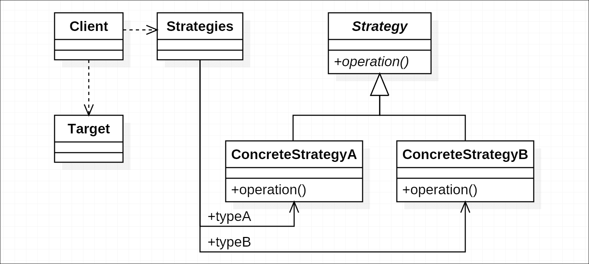
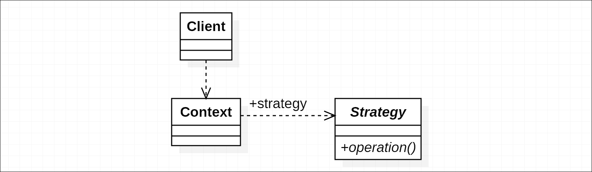
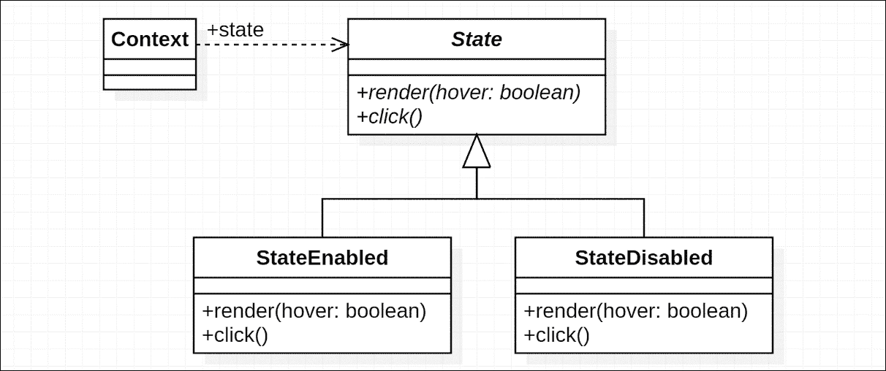
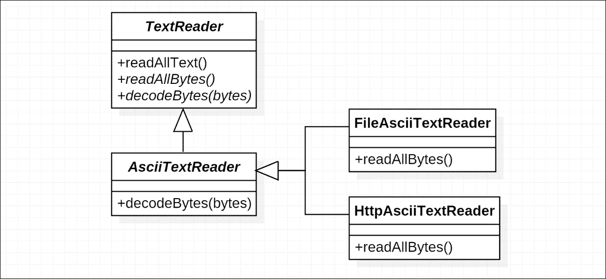
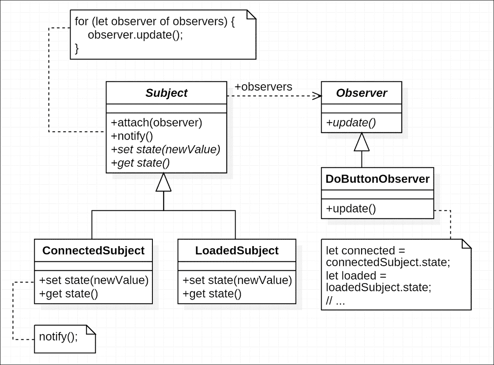
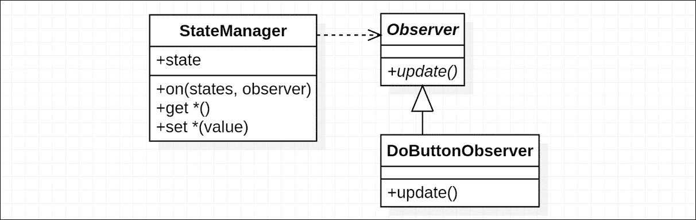
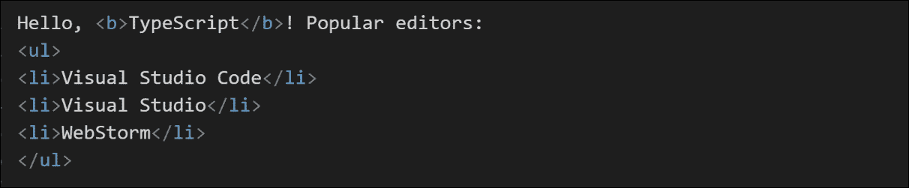
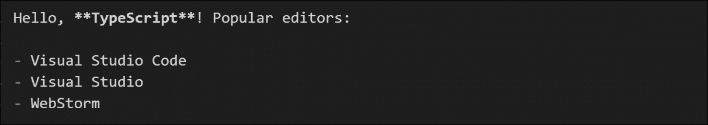
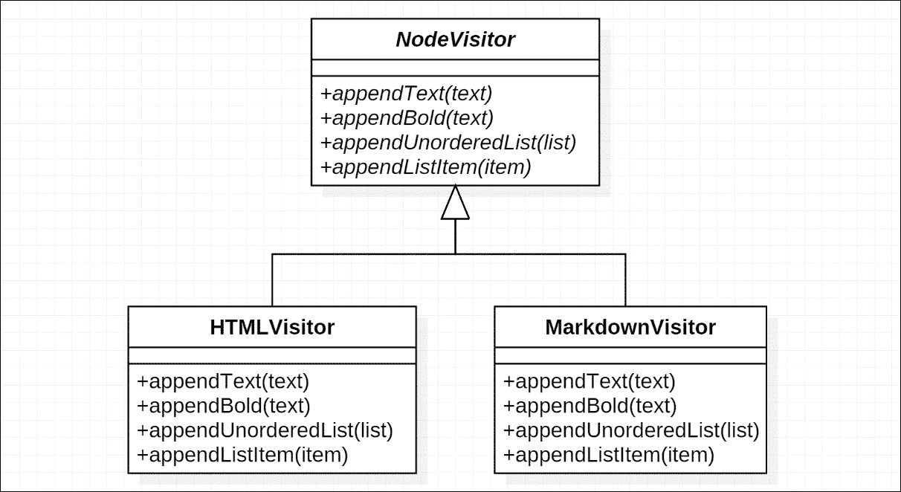
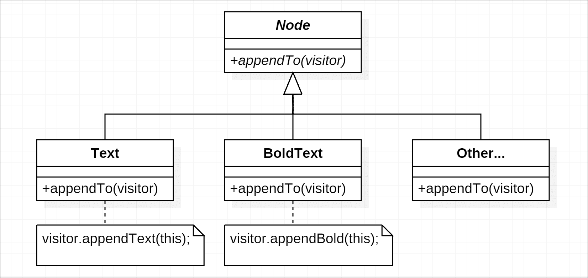

# 第六章. 行为设计模式：持续

在上一章中，我们已经讨论了一些行为设计模式。在本章中，我们将继续讨论这一类别中的更多模式，包括：策略模式、状态模式、模板方法模式、观察者模式和访问者模式。

许多这些模式都共享同一个理念：统一形状，变化细节。以下是一个简要概述：

+   **策略模式** 和 **模板模式**: 定义了相同的算法轮廓

+   **状态模式**: 为具有相同接口的不同状态的对象提供不同的行为

+   **观察者模式**: 提供处理主题变化和通知观察者的统一过程

+   **访问者模式**: 有时与策略模式做相似的工作，但避免了策略模式处理许多不同类型对象可能需要的过于复杂的接口

本章将要讨论的这些模式可以在不同的范围内应用，就像其他类别中的许多模式一样。

# 策略模式

程序通常会有类似的轮廓来处理不同的目标，使用不同的详细算法。策略模式封装了这些算法，并在共享轮廓中使它们可互换。

考虑数据同步中冲突的合并过程，这是我们之前在第二章中讨论的，即《增加复杂性的挑战》。在重构之前，代码是这样的：

```js
if (type === 'value') { 
  // ... 
} else if (type === 'increment') { 
  // ... 
} else if (type === 'set') { 
  // ... 
} 

```

但后来我们发现，我们可以从同步过程的不同阶段提取相同的轮廓，并将它们封装为不同的策略。重构后，代码的轮廓如下：

```js
let strategy = strategies[type]; 
strategy.operation(); 

```

有时在 JavaScript 中，我们有很多种方式来组合和组织这些策略对象或类。策略模式的可能结构可以是：



在这个结构中，客户端负责从表中获取特定的策略并应用当前阶段的操作。

另一种结构是使用上下文对象，并让它们控制自己的策略：



因此，客户端只需要将特定的上下文与相应的策略相连接。

## 参与者

我们已经提到了策略模式的两种可能结构，因此让我们分别讨论参与者。对于第一种结构，参与者包括以下内容：

+   **策略**

    定义策略对象或类的接口。

+   **具体策略**: `ConcreteStrategyA` 和 `ConcreteStrategyB`

    实现`Strategy`接口定义的具体策略操作。

+   **策略管理器**: `策略`

    定义一个数据结构来管理策略对象。在示例中，它只是一个简单的哈希表，使用数据类型名称作为键，策略对象作为值。根据需求，它可能更复杂：例如，使用匹配模式或条件。

+   **目标**

    应用策略对象中定义的算法的目标。

+   **客户端**

    使目标和策略合作。

第二个结构的参与者包括以下内容：

+   **策略**和**具体策略**

    与上一节相同。

+   **上下文**

    定义应用策略对象的引用。为客户端提供相关的方法或属性获取器以进行操作。

+   **客户端**

    管理上下文对象。

## 模式范围

策略模式通常应用于小或中型的范围。它提供了一种封装算法的方法，使得在相同的轮廓下管理这些算法变得更加容易。有时，策略模式也可以是整个解决方案的核心，一个很好的例子是我们一直在使用的同步实现。在这种情况下，策略模式构建了插件之间的桥梁，使得系统可扩展。但大多数时候，策略模式的基本工作是将具体的策略、上下文或目标解耦。

## 实现方式

实现开始于定义我们将要使用的对象的接口。我们有两种目标类型，字符串字面量类型`'a'`和`'b'`。类型`'a'`的目标有一个类型为`string`的`result`属性，而类型`'b'`的目标有一个类型为`number`的`value`属性。

我们将拥有的接口看起来是这样的：

```js
type TargetType = 'a' | 'b'; 

interface Target { 
  type: TargetType; 
} 

interface TargetA extends Target { 
  type: 'a'; 
  result: string; 
} 

interface TargetB extends Target { 
  type: 'b'; 
  value: number; 
} 

interface Strategy<TTarget extends Target> { 
  operationX(target: TTarget): void; 
  operationY(target: TTarget): void; 
} 

```

现在我们将定义没有构造函数的具体策略对象：

```js
let strategyA: Strategy<TargetA> = { 
  operationX(target) { 
    target.result = target.result + target.result; 
  }, 
  operationY(target) { 
    target.result = target 
      .result 
      .substr(Math.floor(target.result.length / 2)); 
  } 
}; 

let strategyB: Strategy<TargetB> = { 
  operationX(target) { 
    target.value = target.value * 2; 
  }, 
  operationY(target) { 
    target.value = Math.floor(target.value / 2); 
  } 
}; 

```

为了让客户端更容易获取这些策略，我们将它们放入哈希表中：

```js
let strategies: { 
  [type: string]: Strategy<Target> 
} = { 
  a: strategyA, 
  b: strategyB 
}; 

```

现在我们可以让它们与不同类型的目标一起工作：

```js
let targets: Target[] = [ 
  { type: 'a' }, 
  { type: 'a' }, 
  { type: 'b' } 
]; 

for (let target of targets) { 
  let strategy = strategies[target.type]; 

  strategy.operationX(target); 
  strategy.operationY(target); 
} 

```

## 后果

策略模式使得在新的类别下为上下文或目标添加算法变得更容易可预见。它还通过隐藏行为选择中的琐碎分支，使流程的轮廓更加清晰。

然而，`Strategy`接口定义的算法的抽象可能会在尝试添加更多策略并满足它们的参数要求时不断增长。这对于管理目标和策略的客户端来说可能是一个问题。但对于其他结构，其中策略对象的引用是由上下文本身存储的，我们可以设法权衡可互换性。这会导致我们将在本章后面讨论的访问者模式。

正如我们之前提到的，如果有一个可扩展的策略管理器可用，或者上下文的客户端被设计为可扩展的，策略模式也可以提供显著的扩展性。

# 状态模式

当对象处于不同状态时，它们的行为可能完全不同。让我们先考虑一个简单的例子。考虑在两种状态下渲染和与自定义按钮交互：启用和禁用。当按钮处于启用状态时，它会亮起并改变鼠标悬停时的样式为活动状态，当然，它也处理点击事件；当禁用时，它会变暗并且不再关心鼠标事件。

我们可以想象一个具有两个操作的抽象：`render`（带有表示鼠标是否悬停的参数）和`click`；以及两个状态：*启用*和*禁用*。我们甚至可以进一步细分，拥有*活动*状态，但在我们的情况下这并不必要。



现在我们可以实现具有`render`和`click`方法的`StateEnabled`，同时实现只有`render`方法的`StateDisabled`，因为它不关心`hover`参数。在这个例子中，我们期望每个状态的方法都是可调用的。因此，我们可以有一个抽象类`State`，其中包含空的`render`和`click`方法。

## 参与者

状态模式的参与者包括以下内容：

+   **状态**

    定义了正在内部切换的状态对象的接口。

+   **具体状态**：`StateEnabled`和`StateDisabled`

    实现与上下文特定状态相对应的行为的`State`接口。可能有一个可选的对其上下文的引用。

+   **上下文**

    管理对不同状态的引用，并执行在活动状态上定义的操作。

## 模式范围

状态模式通常适用于具有功能规模的代码范围。它不指定谁要转移上下文的状态：这可能既可以是上下文本身，也可以是状态方法，或者控制上下文的代码。

## 实现

从`State`接口开始（如果存在要共享的操作或逻辑，它也可以是一个抽象类）：

```js
interface State { 
  render(hover: boolean): void; 
  click(): void; 
} 

```

定义了`State`接口后，我们可以转向`Context`并勾勒其轮廓：

```js
class Context { 
  $element: JQuery; 

  state: State; 

  private render(hover: boolean): void { 
    this.state.render(hover); 
  } 

  private click(): void { 
    this.state.click(); 
  } 

  onclick(): void { 
    console.log('I am clicked.'); 
  } 
} 

```

现在我们将实现两个状态，`StateEnabled`和`StateDisabled`。首先，让我们处理`StateEnabled`，它关心`hover`状态并处理`click`事件：

```js
class StateEnabled implements State { 
  constructor( 
    public context: Context 
  ) { } 

  render(hover: boolean): void { 
    this 
      .context 
      .$element 
      .removeClass('disabled') 
      .toggleClass('hover', hover); 
  } 

  click(): void { 
    this.context.onclick(); 
  } 
} 

```

接下来，对于`StateDisabled`，它只是忽略`hover`参数，当`click`事件发生时什么也不做：

```js
class StateDisabled implements State { 
  constructor( 
    public context: Context 
  ) { } 

  render(): void { 
    this 
      .context 
      .$element 
      .addClass('disabled') 
      .removeClass('hover'); 
  } 

  click(): void { 
    // Do nothing. 
  } 
} 

```

现在我们已经准备好了*启用*和*禁用*的状态类。由于这些类的实例与上下文相关联，因此每当一个新的`Context`被初始化时，我们需要初始化每个状态：

```js
class Context { 
  ... 

  private stateEnabled = new StateEnabled(this); 
  private stateDisabled = new StateDisabled(this); 

  state: State = this.stateEnabled; 

  ... 
} 

```

在调用活动状态的每个操作时传递上下文，也可以使用轻量级对象。

现在让我们通过监听和转发适当的事件来完成`Context`：

```js
constructor() { 
  this 
    .$element 
    .hover( 
      () => this.render(true), 
      () => this.render(false) 
    ) 
    .click(() => this.click()); 

  this.render(false); 
} 

```

## 后果

状态模式减少了上下文对象可能多个方法中的条件分支。作为权衡，引入了额外的状态对象，尽管这通常不会是一个大问题。

状态模式中的上下文对象通常将操作委托给当前状态对象并转发它们。因此，具体状态定义的操作可能可以访问上下文本身。这使得使用轻量级对象重用状态对象成为可能。

# 模板方法模式

当我们谈论子类化或继承时，建筑通常是自下而上建造的。子类继承基础并提供更多功能。然而，有时反转结构也可能很有用。

考虑策略模式，它定义了过程的轮廓，并具有可互换的算法作为策略。如果我们在这个类层次结构下应用这种结构，我们将得到模板方法模式。

模板方法是一个抽象方法（可选带有默认实现），在更大过程轮廓下充当占位符。子类覆盖或实现相关方法以修改或完成行为。想象一下 `TextReader` 的骨架，我们期望其子类能够处理来自不同存储介质的文本文件，检测不同的编码并读取所有文本。我们可能考虑以下结构：



在这个例子中，`TextReader` 有一个名为 `readAllText` 的方法，通过两个步骤读取资源中的所有文本：从资源中读取所有字节（`readAllBytes`），然后使用特定的编码对这些字节进行解码（`decodeBytes`）。

结构还暗示了在实现模板方法的具体类之间共享实现的可能性。我们可能创建一个扩展 `TextReader` 并实现 `decodeBytes` 方法的抽象类 `AsciiTextReader`。然后构建扩展 `AsciiTextReader` 并实现 `readAllBytes` 方法的具体类 `FileAsciiTextReader` 和 `HttpAsciiTextReader`，以处理不同存储介质上的资源。

## 参与者

模板方法模式的参与者包括以下内容：

+   **抽象类**: `TextReader`

    定义模板方法的签名，以及将一切编织在一起的算法的轮廓。

+   **具体类**: `AsciiTextReader`, `FileAsciiTextReader` 和 `HttpAsciiTextReader`

    实现抽象类中定义的模板方法。在这个例子中，典型的具体类是 `FileAsciiTextReader` 和 `HttpAsciiTextReader`。然而，与定义算法轮廓相比，*定义算法轮廓*在分类中更为重要。

## 模式范围

模板方法模式通常应用于相对较小的范围。它提供了一种可扩展的方式来实现功能，并避免一系列算法的上层结构中的冗余。

## 实现

继承层次结构有两个级别：`AsciiTextReader` 将作为另一个抽象类子类化 `TextReader`。它实现了 `decodeBytes` 方法，但将 `readAllBytes` 留给其子类。从 `TextReader` 开始：

```js
abstract class TextReader { 
  async readAllText(): Promise<string> { 
    let bytes = await this.readAllBytes(); 
    let text = this.decodeBytes(bytes); 

    return text; 
  } 

  abstract async readAllBytes(): Promise<Buffer>; 

  abstract decodeBytes(bytes: Buffer): string; 
} 

```

### 提示

我们正在使用`async`和`await`与 Promise 一起，这些功能将在 ECMAScript 中到来。请参阅以下链接以获取更多信息：[`github.com/Microsoft/TypeScript/issues/1664`](https://github.com/Microsoft/TypeScript/issues/1664) [`tc39.github.io/ecmascript-asyncawait/`](https://tc39.github.io/ecmascript-asyncawait/)

现在，让我们将`TextReader`子类化为`AsciiTextReader`，它仍然保持抽象：

```js
abstract class AsciiTextReader extends TextReader { 
  decodeBytes(bytes: Buffer): string { 
    return bytes.toString('ascii'); 
  } 
} 

```

对于`FileAsciiTextReader`，我们需要导入 Node.js 的文件系统（`fs`）模块来执行文件读取：

```js
import * as FS from 'fs'; 

class FileAsciiTextReader extends AsciiTextReader { 
  constructor( 
    public path: string 
  ) { 
    super(); 
  } 

  async readAllBytes(): Promise<Buffer> { 
    return new Promise<Buffer>((resolve, reject) => { 
      FS.readFile(this.path, (error, bytes) => { 
        if (error) { 
          reject(error); 
        } else { 
          resolve(bytes); 
        } 
      }); 
    }); 
  } 
} 

```

对于`HttpAsciiTextReader`，我们将使用流行的`request`包来发送 HTTP 请求：

```js
import * as request from 'request'; 

class HttpAsciiTextReader extends AsciiTextReader { 
  constructor( 
    public url: string 
  ) { 
    super(); 
  } 

  async readAllBytes(): Promise<Buffer> { 
    return new Promise<Buffer>((resolve, reject) => { 
      request(this.url, { 
        encoding: null 
      }, (error, bytes, body) => { 
        if (error) { 
          reject(error); 
        } else { 
          resolve(body); 
        } 
      }); 
    }); 
  } 
} 

```

### 小贴士

两个具体的读取实现都将解析函数传递给 Promise 构造函数，以将异步 Node.js 风格回调转换为 Promise。有关更多信息，请阅读有关 Promise 构造函数的更多内容：[`developer.mozilla.org/en-US/docs/Web/JavaScript/Reference/Global_Objects/Promise`](https://developer.mozilla.org/en-US/docs/Web/JavaScript/Reference/Global_Objects/Promise)。

## 后果

与策略模式相比，模板方法模式为在现有系统之外构建具有相同算法轮廓的对象提供了便利。这使得模板方法模式成为构建工具类而不是内置固定过程的有用方式。

但模板方法模式由于没有`*manager*`，运行时灵活性较低。它还依赖于使用这些对象的客户端来完成工作。并且由于模板方法模式的实现依赖于子类化，它很容易导致在不同分支上有类似代码的层次结构。尽管可以通过使用像*mixin*这样的技术来优化。

# 观察者模式

观察者模式是一个重要的模式，它背后有一个在软件工程中非常重要的想法。它通常是 MVC 架构及其变体的关键部分。

如果你曾经编写过没有 Angular 或 React 等框架的丰富用户界面应用程序，或者编写过解决方案，你可能会在更改 UI 元素的类名和其他属性时遇到困难。更具体地说，控制同一组元素属性的相关代码位于与相关事件监听器相关的每个分支中，只是为了确保元素被正确更新。

考虑一个“执行”按钮，其`disabled`属性应由连接到服务器的`WebSocket`连接的状态以及当前活动项是否完成来决定。每当连接或活动项的状态更新时，我们都需要相应地更新按钮。最“方便”的方法可能是将两个有些相似的代码组放入两个事件监听器中。但这样，随着更多相关对象的参与，相似代码的数量会不断增加。

在这个“执行”按钮的例子中，问题在于，控制按钮的代码的行为是由原始事件驱动的。管理不同事件之间的连接和行为的大量工作直接由编写该代码的开发者承担。不幸的是，在这种情况下，复杂性呈指数增长，这意味着它可能很容易超过我们的脑容量。以这种方式编写代码可能会导致更多错误，并使维护更容易引入新的错误。

但美妙的是，我们可以找到乘积因子并输出所需的结果，而那些因子的参考是相关状态的一组。仍然以“执行”按钮的例子来说，按钮所关心的是：连接状态和活动项状态（假设它们是布尔值`connected`和`loaded`）。我们可以将代码分为两部分：一部分改变这些状态，另一部分更新按钮：

```js
let button = document.getElementById('do-button'); 

let connected = false; 
let loaded = false; 

function updateButton() { 
  let disabled = !connected && !loaded; 
  button.disabled = disabled; 
} 

connection.on('statuschange', event => { 
  connected = event.connected; 
  updateButton(); 
}); 

activeItem.on('statuschange', event => { 
  loaded = event.loaded; 
  updateButton(); 
}); 

```

之前的示例代码已经包含了观察者模式的胚胎：主体（状态`connected`和`loaded`）和观察者（`updateButton`函数），尽管我们仍然需要在任何相关状态改变时手动调用`updateButton`。改进的结构可能看起来像以下图示：



但就像我们一直在讨论的例子一样，在许多情况下，观察者关心不止一个状态。单独将观察者附加到主体上可能不太令人满意。

解决这个问题的方法可以是多状态观察对象，为了实现这一点，我们可以形成一个包含子观察对象的复合观察对象。如果一个观察对象收到`notify`调用，它会唤醒其观察者，并同时通知其父对象。因此，观察者可以为多个状态的变化通知附加一个复合观察对象。

然而，创建复合对象本身的过程仍然可能令人烦恼。在动态编程语言如 JavaScript 中，我们可能有一个包含特定状态处理通知和直接通过隐式创建观察对象的状态管理器：

```js
let stateManager = new StateManager({ 
  connected: false, 
  loaded: false, 
  foo: 'abc', 
  bar: 123 
}); 

stateManager.on(['connected', 'loaded'], () => { 
  let disabled = 
    !stateManager.connected && !stateManager.loaded; 
  button.disabled = disabled; 
}); 

```

### 注意

在许多 MV*框架中，要观察的状态是通过内置解析器或类似机制从相关表达式自动分析的。

现在结构变得更简单了：



## 参与者

我们已经讨论了观察者模式的基本结构，包括主体和观察者，以及具有隐式主体的变体。基本结构的参与者包括以下内容：

+   **主体**

    观察对象。定义了`attach`或`notify`观察者的方法。观察对象也可以是一个包含子观察对象的复合对象，这允许使用相同的接口观察多个状态。

+   **具体观察对象**：`ConnectedSubject`和`LoadedSubject`

    包含与主体相关的状态，并实现获取和设置其状态的方法或属性。

+   **观察者**

    定义了一个对象接口，当观察者通知时，该对象会做出反应。在 JavaScript 中，它也可以是一个函数的接口（或签名）。

+   **具体观察者**：`DoButtonObserver`

    定义了对观察的主题通知做出反应的动作。可以是一个与定义的签名匹配的回调函数。

在变体版本中，参与者包括以下内容：

+   **状态管理器**

    管理一个复杂、可能的多级状态对象，包含多个状态。定义了将观察者附加到主题的接口，并在主题发生变化时通知这些观察者。

+   **具体主题**

    特定状态的关键。例如，字符串`"connected"`可能代表状态`stateManager.connected`，而字符串`"foo.bar"`可能代表状态`stateManager.foo.bar`。

*观察者*和*具体观察者*基本上与前面结构中描述的相同。但现在观察者是由状态管理器而不是主题对象来通知的。

## 模式范围

观察者模式是一种可以轻松构建项目一半的模式。在 MV*架构中，观察者模式可以将视图与业务逻辑解耦。视图的概念也可以应用于其他与显示信息相关的场景。

## 实现

我们提到的这两种结构都不难实现，但在生产代码中应该考虑更多细节。我们将采用具有中央状态管理器的第二种实现。

### 注意

为了简化实现，我们将使用`get`和`set`方法通过键访问特定的状态。但许多可用的框架可能通过 getter 和 setter 或其他机制来处理这些。

### 注意

要了解像 Angular 这样的框架如何处理状态变化，请阅读它们的文档或源代码（如有必要）。

我们将让`StateManager`继承`EventEmitter`，这样我们就不必过多关注像多个监听器这样的问题。但因为我们接受多个状态键作为主题，所以将为`on`方法添加一个重载。因此，`StateManager`的轮廓将如下所示：

```js
type Observer = () => void; 

class StateManager extends EventEmitter{ 
  constructor( 
    private state: any 
  ) { 
    super(); 
  } 

  set(key: string, value: any): void { } 

  get(key: string): any { } 

  on(state: string, listener: Observer): this; 
  on(states: string[], listener: Observer): this; 
  on(states: string | string[], listener: Observer): this { } 
} 

```

### 小贴士

你可能已经注意到方法`on`的返回类型是`this`，这可能意味着会持续引用当前实例的类型。类型`this`对于链式调用方法非常有帮助。

键将是`"foo"`和`"foo.bar"`，我们需要将键分割成单独的标识符，以便从`state`对象中访问值。让我们有一个私有方法`_get`，它接受一个`identifiers`数组作为输入：

```js
private _get(identifiers: string[]): any { 
  let node = this.state; 

  for (let identifier of identifiers) { 
    node = node[identifier]; 
  } 

  return node; 
} 

```

现在，我们可以在`_get`上实现方法`get`：

```js
get(key: string): any { 
  let identifiers = key.split('.'); 
  return this._get(identifiers); 
} 

```

对于方法`set`，我们可以获取要设置的属性最后一个标识符的父对象，这样就可以像这样工作：

```js
set(key: string, value: any): void { 
  let identifiers = key.split('.'); 
  let lastIndex = identifiers.length - 1; 

  let node = this._get(identifiers.slice(0, lastIndex)); 

  node[identifiers[lastIndex]] = value; 
} 

```

但还有一件事，我们需要通知正在观察特定主题的观察者：

```js
set(key: string, value: any): void { 
  let identifiers = key.split('.'); 
  let lastIndex = identifiers.length - 1; 

  let node = this._get(identifiers.slice(0, lastIndex)); 

  node[identifiers[lastIndex]] = value; 

  for (let i = identifiers.length; i > 0; i--) { 
    let key = identifiers.slice(0, i).join('.'); 
    this.emit(key); 
  } 
} 

```

当我们完成通知部分后，让我们为`on`方法添加一个重载以支持多个键：

```js
on(state: string, listener: Observer): this; 
on(states: string[], listener: Observer): this; 
on(states: string | string[], listener: Observer): this { 
  if (typeof states === 'string') { 
    super.on(states, listener); 
  } else { 
    for (let state of states) { 
      super.on(state, listener); 
    } 
  } 

  return this; 
} 

```

问题解决。现在我们有一个适用于简单场景的状态管理器。

## 后果

观察者模式解耦了主题和观察者。虽然观察者可能同时观察主题的多个状态，但它通常不关心哪个状态触发了通知。因此，观察者可能会进行不必要的更新，实际上对视图没有任何作用。

然而，对性能的影响在大多数情况下可能是微不足道的，甚至不需要提及它带来的好处。

通过将视图和逻辑分开，观察者模式可以显著减少可能的分支。这将有助于消除视图和逻辑耦合部分产生的错误。因此，通过正确应用观察者模式，项目将变得更加健壮且易于维护。

然而，还有一些细节我们需要注意：

1.  更新状态的观察者可能导致循环调用。

1.  对于像集合这样的更复杂的数据结构，重新渲染所有内容可能会很昂贵。在这种情况下，观察者可能需要更多关于变化的信息，以便只执行必要的更新。像 React 这样的视图实现以另一种方式做这件事；它们引入了一个称为**虚拟 DOM**的概念。通过在重新渲染实际的 DOM（这通常可能是性能瓶颈）之前更新和比较虚拟 DOM，它为不同的数据结构提供了一个相对通用的解决方案。

# 访问者模式

访问者模式提供了一个统一的接口来**访问**不同的数据或对象，同时允许具体访问者中的详细操作有所不同。访问者模式通常与组合一起使用，并且它被广泛用于遍历数据结构，如**抽象语法树**（**AST**）。但为了使那些不熟悉编译器内容的人更容易理解，我们将提供一个更简单的例子。

考虑一个包含多个要渲染元素的类似 DOM 的树：

```js
[ 
  Text { 
    content: "Hello, " 
  }, 
  BoldText { 
    content: "TypeScript" 
  }, 
  Text { 
    content: "! Popular editors:\n" 
  }, 
  UnorderedList { 
    items: [ 
      ListItem { 
        content: "Visual Studio Code" 
      }, 
      ListItem { 
        content: "Visual Studio" 
      }, 
      ListItem { 
        content: "WebStorm" 
      } 
    ] 
  } 
] 

```

在 HTML 中的渲染结果将如下所示：



虽然在 Markdown 中看起来是这样的：



访问者模式允许同一类操作在相同的地方进行编码。我们将有具体的访问者，`HTMLVisitor`和`MarkdownVisitor`，它们分别通过遍历和递归地转换不同的节点来承担转换不同节点的责任。被访问的节点有一个`accept`方法，用于接受访问者以执行转换。访问者模式的整体结构可以分为两部分，第一部分是访问者抽象及其具体子类：



第二部分是待访问节点的抽象及其具体子类：



## 参与者

访问者模式的参与者包括以下内容：

+   **访问者**: `NodeVisitor`

    定义与每个元素类对应的操作接口。在具有静态类型和方法重载的语言中，方法名可以统一。但在 JavaScript 中，它需要额外的运行时检查，因此我们将使用不同的方法名来区分它们。操作方法通常以 `visit` 命名，但在这里我们使用 `append`，因为它与上下文更相关。

+   **具体访问者**：`HTMLVisitor` 和 `MarkdownVisitor`

    实现具体访问者的每个操作，并处理任何内部状态。

+   **元素**：`Node`

    定义接受访问者实例的元素接口。方法通常命名为 `accept`，尽管在这里我们使用 `appendTo` 以更好地匹配上下文。元素本身可以是复合的，并通过其子元素传递访问者。

+   **具体元素**：`Text`、`BoldText`、`UnorderedList` 和 `ListItem`

    实现 `accept` 方法，并从与元素实例对应的访问者实例调用该方法。

+   **客户端**：

    列出元素并对其应用访问者。

## 模式范围

访问者模式可以在系统中形成一个大型功能。对于某些分类的程序，它也可能形成核心架构。例如，*Babel* 使用访问者模式进行 AST 转换，而 Babel 的插件实际上是一个可以访问和转换它关心的元素的访问者。

## 实现

我们将实现 `HTMLVisitor` 和 `MarkdownVisitor`，它们可以将节点转换为文本，正如我们之前讨论的那样。从上层抽象开始：

```js
interface Node { 
  appendTo(visitor: NodeVisitor): void; 
} 

interface NodeVisitor { 
  appendText(text: Text): void; 
  appendBold(text: BoldText): void; 
  appendUnorderedList(list: UnorderedList): void; 
  appendListItem(item: ListItem): void; 
} 

```

继续使用执行类似操作的具体系列节点，`Text` 和 `BoldText`：

```js
class Text implements Node { 
  constructor( 
    public content: string 
  ) { } 

  appendTo(visitor: NodeVisitor): void { 
    visitor.appendText(this); 
  } 
} 

class BoldText implements Node { 
  constructor( 
    public content: string 
  ) { } 

  appendTo(visitor: NodeVisitor): void { 
    visitor.appendBold(this); 
  } 
} 

```

然后列出内容：

```js
class UnorderedList implements Node { 
  constructor( 
    public items: ListItem[] 
  ) { } 

  appendTo(visitor: NodeVisitor): void { 
    visitor.appendUnorderedList(this); 
  } 
} 

class ListItem implements Node { 
  constructor( 
    public content: string 
  ) { } 

  appendTo(visitor: NodeVisitor): void { 
    visitor.appendListItem(this); 
  } 
} 

```

现在我们有了要访问的结构元素，我们将开始实现具体的访问者。这些访问者将有一个 `output` 属性用于转换后的字符串。`HTMLVisitor` 首先开始：

```js
class HTMLVisitor implements NodeVisitor { 
  output = ''; 

  appendText(text: Text) { 
    this.output += text.content; 
  } 

  appendBold(text: BoldText) { 
    this.output += `<b>${text.content}</b>`; 
  } 

  appendUnorderedList(list: UnorderedList) { 
    this.output += '<ul>'; 

    for (let item of list.items) { 
      item.appendTo(this); 
    } 

    this.output += '</ul>'; 
  } 

  appendListItem(item: ListItem) { 
    this.output += `<li>${item.content}</li>`; 
  } 
} 

```

注意 `appendUnorderedList` 中的循环，它处理其自己的列表项的访问。

类似的结构也适用于 `MarkdownVisitor`：

```js
class MarkdownVisitor implements NodeVisitor { 
  output = ''; 

  appendText(text: Text) { 
    this.output += text.content; 
  } 

  appendBold(text: BoldText) { 
    this.output += `**${text.content}**`; 
  } 

  appendUnorderedList(list: UnorderedList) { 
    this.output += '\n'; 

    for (let item of list.items) { 
      item.appendTo(this); 
    } 
  } 

  appendListItem(item: ListItem) { 
    this.output += `- ${item.content}\n`; 
  } 
} 

```

现在基础设施已经就绪，让我们创建从开始就想象中的树状结构：

```js
let nodes = [ 
  new Text('Hello, '), 
  new BoldText('TypeScript'), 
  new Text('! Popular editors:\n'), 
  new UnorderedList([ 
    new ListItem('Visual Studio Code'), 
    new ListItem('Visual Studio'), 
    new ListItem('WebStorm') 
  ]) 
]; 

```

最后，使用访问者构建输出：

```js
let htmlVisitor = new HTMLVisitor(); 
let markdownVisitor = new MarkdownVisitor(); 

for (let node of nodes) { 
  node.appendTo(htmlVisitor); 
  node.appendTo(markdownVisitor); 
} 

console.log(htmlVisitor.output); 
console.log(markdownVisitor.output); 

```

## 后果

策略模式和访问者模式都可以应用于处理对象的场景。但策略模式依赖于客户端处理所有相关参数和上下文，如果不同对象的预期行为差异很大，这会使抽象变得难以精致。访问者模式通过解耦访问动作和要执行的操作来解决这个问题。

通过传递不同的访问者，访问者模式可以对对象应用不同的操作，而无需更改其他代码，尽管这通常意味着添加新元素，并会导致向抽象访问者和所有其具体子类添加相关操作。

像前一个示例中的 `NodeVisitor` 这样的访问者可能自身存储状态（在那个例子中，我们存储了转换后节点的输出）并且可以根据累积的状态应用更高级的操作。例如，可以确定已经添加到输出中的内容，因此我们可以根据当前正在访问的节点应用不同的行为。

然而，为了完成某些操作，可能需要从元素中暴露额外的公共方法。

# 摘要

在本章中，我们已经讨论了其他行为设计模式，作为前一章的补充，包括策略（Strategy）、状态（State）、模板方法（Template Method）、观察者（Observer）和访问者（Visitor）模式。

策略模式非常常见且有用，它可能在一个项目中出现多次，形式各异。你可能不知道你每天都在一个日常框架中使用观察者模式。

在了解了那些模式之后，你可能会发现每个模式背后都有许多共同的想法。值得思考这些想法背后的东西，甚至让这些想法在你的脑海中形成轮廓。

在下一章中，我们将继续介绍一些与 JavaScript 和 TypeScript 相关的实用模式，以及这些语言的重要场景。
