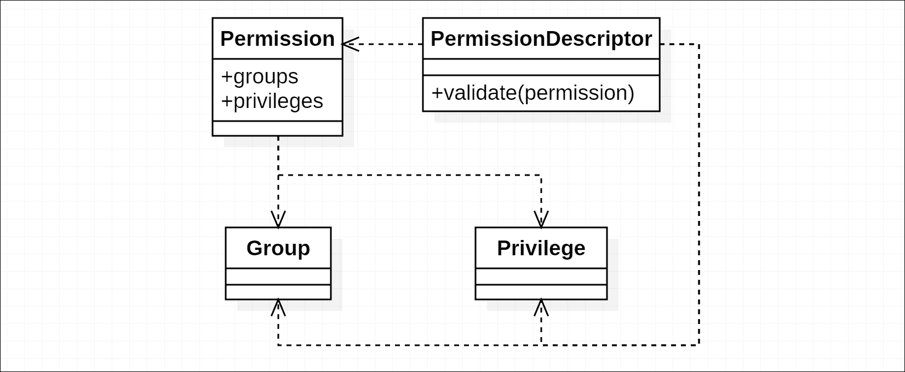

# 第七章. JavaScript 和 TypeScript 中的模式和架构

在前四章中，我们介绍了常见的和经典的设计模式，并在 JavaScript 或 TypeScript 中讨论了一些变体。在本章中，我们将继续探讨一些与语言紧密相关且具有常见应用的架构和模式。我们没有很多页面来扩展，当然也不能在一章中涵盖所有内容，所以请把它当作开胃菜，并自由探索更多。

本章中的许多主题都与异步编程相关。我们将从基于 Promise 的 Node.js Web 架构开始。这是一个较大的主题，其中包含有趣的想法，包括响应和权限的抽象以及错误处理技巧。然后我们将讨论如何使用**ECMAScript**（**ES**）模块语法组织模块。本章将以几个有用的异步技术结束。

总体来说，本章将涵盖以下主题：

+   与 Promise 相关的架构和技术

+   Web 应用程序中响应和权限的抽象

+   将项目模块化以实现扩展

+   其他有用的异步技术

### 注意

再次强调，由于篇幅有限，一些相关代码被大大简化，实际上只能应用其理念本身。

# 基于 Promise 的 Web 架构

为了更好地理解 Promise 与传统回调之间的区别，考虑以下异步任务：

```js
function process(callback) { 
  stepOne((error, resultOne) => { 
    if (error) { 
      callback(error); 
       return; 
      } 

  stepTwo(resultOne, (error, resultTwo) => { 
    if (error) { 
      callback(error); 
        return; 
    } 

    callback(undefined, resultTwo + 1); 
    }); 
  }); 
} 

```

如果我们以上述方式用 Promise 风格编写，将会如下所示：

```js
function process() { 
  return stepOne() 
    .then(result => stepTwo(result)) 

.then(result => result + 1); 
}

```

正如前面的例子所示，Promise 使得使用扁平链而不是嵌套回调来编写异步操作变得简单且*自然*。但 Promise 最令人兴奋的事情可能是它为错误处理带来的好处。在基于 Promise 的架构中，抛出错误可以是安全和愉快的。你不必在链式调用异步操作时显式处理错误，这使得错误发生的可能性降低。

随着与 ES6 兼容运行时的使用日益增长，Promise 已经作为默认选项存在。实际上，我们有很多 Promise 的 polyfills（包括我用 TypeScript 编写的`*ThenFail*`），因为编写 JavaScript 的人大致上指的是创造了轮子的人群。

Promise 与其他 Promise 协同工作得很好：

+   一个与*Promises/A+* 兼容的实现应该与其他*Promises/A+* 兼容的实现一起工作

+   Promise 在基于 Promise 的架构中表现最佳

如果你刚开始接触 Promise，你可能会抱怨在使用基于回调的项目中使用 Promise。使用 Promise 库提供的异步助手，如`Promise.each`（非标准），是人们尝试 Promise 的常见原因，但结果证明他们有更好的替代方案（对于基于回调的项目），例如流行的`async`库。

使你决定切换的原因不应该是这些辅助工具（因为老式的回调也有很多），而应该是一个更容易处理错误或利用基于承诺的 ES `async`/`await` 功能的方法，这是基于承诺的。

## 承诺化现有模块或库

虽然承诺在基于承诺的架构中表现最好，但仍然可以通过承诺化现有模块或库以较小的范围开始使用承诺。

让我们以 Node.js 风格的回调为例：

```js
import * as FS from 'fs'; 

FS.readFile('some-file.txt', 'utf-8', (error, text) => { 
  if (error) { 
    console.error(error); 
    return; 
  } 

  console.log('Content:', text); 
});  

```

你可能期望被承诺化的 `readFile` 函数看起来像以下这样：

```js
FS 
  .readFile('some-file.txt', 'utf-8') 
  .then(text => { 
    console.log('Content:', text); 
  }) 
  .catch(reason => { 
    Console.error(reason); 
  }); 

```

实现被承诺化的函数 `readFile` 可以很简单：

```js
function readFile(path: string, options: any): Promise<string> { 
  return new Promise((resolve, reject) => { 
    FS.readFile(path, options, (error, result) => { 
      if (error) { 
        reject(error); 
      } else { 
        resolve(result); 
      } 
    }); 
  }); 
} 

```

### 注意

我在这里使用类型 `any` 来减少代码示例的大小，但在实际操作中，我建议尽可能不要使用 `any`。

有一些库能够自动承诺化方法。不过，不幸的是，如果没有可用的承诺化版本，你可能需要自己编写声明文件来承诺化这些方法。

## Express 中的视图和控制器

我们中的许多人可能已经与 **Express** 等框架一起工作过。这就是我们在 Express 中使用 JSON 渲染视图或响应的方式：

```js
import * as Path from 'path'; 
import * as express from 'express'; 

let app = express(); 

app.set('engine', 'hbs'); 
app.set('views', Path.join(__dirname, '../views')); 

app.get('/page', (req, res) => { 
  res.render('page', { 
    title: 'Hello, Express!', 
    content: '...' 
  }); 
}); 

app.get('/data', (req, res) => { 
  res.json({ 
    version: '0.0.0', 
    items: [] 
  }); 
}); 

app.listen(1337); 

```

我们通常会分离控制器和路由配置：

```js
import { Request, Response } from 'express'; 

export function page(req: Request, res: Response): void { 
  res.render('page', { 
    title: 'Hello, Express!', 
    content: '...' 
  }); 
} 

```

因此，我们可能对现有路由有更好的了解，并且更容易管理控制器。此外，可以引入自动化路由，这样我们就不必总是手动更新路由：

```js
import * as glob from 'glob'; 

let controllersDir = Path.join(__dirname, 'controllers'); 

let controllerPaths = glob.sync('**/*.js', { 
    cwd: controllersDir 
}); 

for (let path of controllerPaths) { 
    let controller = require(Path.join(controllersDir, path)); 
    let urlPath = path.replace(/\\/g, '/').replace(/\.js$/, ''); 

    for (let actionName of Object.keys(controller)) { 
        app.get( 
            `/${urlPath}/${actionName}`, 
            controller[actionName] 
        ); 
    } 
} 

```

上述实现当然过于简单，不足以覆盖日常使用，但它展示了自动化路由可能如何工作：基于文件结构的约定。

现在，如果我们正在使用承诺编写的异步代码，控制器中的操作可能如下所示：

```js
export function foo(req: Request, res: Response): void { 
    Promise 
        .all([ 
            Post.getContent(), 
            Post.getComments() 
        ]) 
        .then(([post, comments]) => { 
            res.render('foo', { 
                post, 
                comments 
            }); 
        }); 
} 

```

### 注意

我们在一个参数内部解构数组。`Promise.all` 返回一个承诺，该承诺是一个数组，其元素对应于传入的可解析值的值。（可解析意味着一个普通值或可能解析为普通值的类似承诺的对象。）

但这还不够；我们仍然需要正确处理错误，或者在某些承诺实现中，如果承诺链没有被拒绝处理程序（这很糟糕）处理，前面的代码可能会静默失败。在 Express 中，当发生错误时，你应该使用错误对象调用 `next`（传递给回调的第三个参数）：

```js
import { Request, Response, NextFunction } from 'express'; 

export function foo( 
  req: Request, 
  res: Response, 
  next: NextFunction 
): void { 
  Promise 
    // ... 
    .catch(reason => next(reason)); 
} 

```

现在，我们对这种方法的正确性感到满意，但这并不是承诺的工作方式。在控制器范围内，可以通过显式使用回调来处理错误，并且最简单的方法是返回承诺链并将其交给之前执行路由逻辑的代码。因此，控制器可以写成这样：

```js
export function foo(req: Request, res: Response) { 
  return Promise 
    .all([ 
      Post.getContent(), 
      Post.getComments() 
    ]) 
    .then(([post, comments]) => { 
      res.render('foo', { 
        post, 
        comments 
            }); 
        }); 
}

```

但，我们能否让它更好？

## 响应的抽象

我们已经返回了一个 Promise 来告诉是否发生错误。所以现在返回的 Promise 表示响应的状态：成功或失败。但为什么我们仍然调用`res.render()`来渲染视图？返回的 promise 对象可以是响应本身，而不仅仅是错误指示器。

再次思考控制器：

```js
export class Response { }

export class PageResponse extends Response {    
  constructor(view: string, data: any) { }
}

export function foo(req: Request) { 
  return Promise 
    .all([ 
      Post.getContent(), 
      Post.getComments() 
    ]) 
    .then(([post, comments]) => { 
      return new PageResponse('foo', { 
        post, 
        comments 
      }); 
    }); 
} 

```

返回的响应对象可能因不同的响应输出而异。例如，它可以是类似于前一个示例中的`PageResponse`，`JSONResponse`，`StreamResponse`，甚至简单的`Redirection`。

由于在大多数情况下，`PageResponse`或`JSONResponse`被应用，并且`PageResponse`的视图通常可以通过控制器路径和动作名称隐含，因此从普通数据对象自动生成具有适当视图的这两个响应是有用的：

```js
export function foo(req: Request) { 
  return Promise 
    .all([ 
      Post.getContent(), 
      Post.getComments() 
    ]) 
    .then(([post, comments]) => { 
      return { 
        post, 
        comments 
      }; 
    }); 
} 

```

这就是基于 Promise 的控制器应该如何响应。有了这个想法，让我们用响应的抽象更新路由代码。之前，我们直接将控制器动作作为 Express 请求处理程序传递。现在我们需要通过解析返回值对动作进行一些包装，并基于解析结果应用操作：

1.  如果它实现，并且是`Response`的实例，则将其应用于 Express 传入的`res`对象。

1.  如果它实现，并且是一个普通对象，如果没有找到视图，则构建一个`PageResponse`或`JSONResponse`，并将其应用于`res`对象。

1.  如果它拒绝，则使用原因调用`next`函数。

之前，它看起来是这样的：

```js
app.get(`/${urlPath}/${actionName}`, controller[actionName]); 

```

现在它多了几行：

```js
let action = controller[actionName]; 

app.get(`/${urlPath}/${actionName}`, (req, res, next) => { 
  Promise 
    .resolve(action(req)) 
    .then(result => { 
      if (result instanceof Response) { 
        result.applyTo(res); 
      } else if (existsView(actionName)) { 
        new PageResponse(actionName, result).applyTo(res); 
      } else { 
        new JSONResponse(result).applyTo(res); 
      } 
    }) 
    .catch(reason => next(reason)); 
}); 

```

然而，到目前为止，我们只能处理`GET`请求，因为我们硬编码了`app.get()`在我们的路由实现中。糟糕的视图匹配逻辑在实践中也几乎无法使用。我们需要使操作可配置，并且 ES 装饰器可以在这里做得很好：

```js
export default class Controller { 
  @get({ 
    view: 'custom-view-path' 
  }) 
    foo(req: Request) { 
      return { 
        title: 'Action foo', 
        content: 'Content of action foo' 
      }; 
    } 
} 

```

我将把实现留给你，并自由地让它变得很棒。

## 权限抽象

权限在项目中扮演着重要的角色，尤其是在有不同用户组的系统中，例如论坛。权限的抽象应该可扩展以满足不断变化的需求，并且应该易于使用。

在这里，我们将讨论控制器动作层面的权限抽象。将执行一个或多个动作的可读性视为**权限**。用户的权限可能由几个权限组成，并且通常同一级别的用户通常会有相同的权限集合。因此，我们可能有一个更大的概念，即**组**。

抽象可以基于组和权限同时工作，或者仅基于权限（此时组只是权限集合的别名）：

+   同时基于权限和组进行验证的抽象更容易构建。您不需要创建一个包含哪些操作可以由特定用户组执行的大列表；只有在必要时才需要细粒度的权限。

+   基于权限验证的抽象在描述权限方面具有更好的控制和更大的灵活性。例如，您可以轻松地从用户的权限中移除一小部分权限。

然而，这两种方法在高级抽象方面相似，主要区别在于实现。我们讨论过的权限抽象的一般结构如下：



参与者包括以下内容：

+   **权限**：描述与特定操作对应的详细权限

+   **组**：定义一组权限

+   **权限**：描述用户能够做什么；由用户所属的组和用户拥有的权限组成

+   **权限描述符**：描述用户的权限如何足够；由*可能的*组和权限组成

## 预期错误

使用 Promise 消除的一个重大担忧是，我们不需要担心在`callback`中抛出错误会大多数情况下导致应用程序崩溃。错误将通过 Promise 链流动，如果没有被捕获，将由我们的路由器处理。错误可以大致分为**预期错误**和**意外错误**。预期错误通常是由错误的输入或可预见的异常引起的，而意外错误通常是由项目依赖的 bug 或其他库引起的。

对于预期错误，我们通常希望提供用户友好的响应，带有可读的错误消息和代码，以便用户可以自行找到解决方案或向我们提供有用的上下文进行报告。对于意外错误，我们也会想要合理的响应（通常描述为未知错误），详细的客户端日志（包括真实错误名称、消息、堆栈信息等），甚至警报以尽快通知团队。

### 定义和抛出预期错误

路由器需要处理不同类型的错误，而实现这一点的一个简单方法是从通用的`ExpectedError`类派生子类，并抛出其实例：

```js
import ExtendableError from 'extendable-error'; 

class ExpectedError extends ExtendableError { 
  constructor( 
    message: string, 
    public code: number 
  ) { 
    super(message); 
  } 
} 

```

### 注意

`extendable-error`是我处理堆栈跟踪和`message`属性的包。您也可以直接扩展`Error`类。

因此，当接收到预期错误时，我们可以安全地将错误消息作为响应的一部分输出。如果不是`ExpectedError`的实例，我们可以输出预定义的`unknown`错误消息，并将详细的错误信息记录下来。

### 错误转换

一些错误，如由不稳定网络或远程服务引起的错误，是预期的；我们可能想要捕获这些错误并将它们再次作为预期错误抛出。但这实际上相当简单。然后可以应用集中的错误转换过程，以减少管理这些错误所需的工作量。

转换过程包括两个部分：过滤（或匹配）和转换。有许多方法可以过滤错误，例如以下方法：

+   **按错误类过滤**：许多第三方库会抛出特定类的错误。以流行的 Node.js ORM Sequelize 为例，它抛出`DatabaseError`、`ConnectionError`、`ValidationError`等。通过检查它们是否是特定错误类的实例来过滤错误，我们可以轻松地从错误堆中挑选出目标错误。

+   **按字符串或正则表达式过滤**：有时一个库可能会抛出错误，这些错误本身就是`Error`类的实例，而不是其子类；这使得这些错误与其他错误区分起来更困难。在这种情况下，我们可能通过它们的消息、关键词或正则表达式来过滤这些错误。

+   **按作用域过滤**：可能存在具有相同错误消息的同一错误类的实例应该导致不同的响应。其中一个原因可能是抛出特定错误的操作处于较低级别，但被不同作用域中的上层结构使用。因此，可以为这些错误添加一个`scope`标记，使它们更容易被过滤。

可能还有更多过滤错误的方法，并且它们通常能够相互协作。通过恰当地应用这些过滤器和转换错误，我们可以减少分析系统内部发生情况时的噪音，并在问题出现时更快地定位它们。

# 模块化项目

在 ES6 之前，JavaScript 有很多模块解决方案，其中最著名的两个是 AMD 和 commonjs。AMD 是为异步模块加载而设计的，主要应用于浏览器，而 commonjs 则同步加载模块，这正是 Node.js 模块系统的工作方式。

要使其异步工作，编写 AMD 模块需要更多的字符。而且由于 browserify 和 webpack 等工具的流行，commonjs 甚至对于浏览器项目也变得流行起来。

内部模块的正确粒度可以帮助项目保持其结构健康。考虑以下项目结构：

```js
project 
├─controllers 
├─core 
│  │ index.ts 
│  │ 
│  ├─product 
│  │   index.ts 
│  │   order.ts 
│  │   shipping.ts 
│  │ 
│  └─user 
│      index.ts 
│      account.ts 
│      statistics.ts 
│ 
├─helpers 
├─models 
├─utils 
└─views 

```

假设我们正在编写一个控制器文件，该文件将导入由`core/product/order.ts`文件定义的模块。以前，使用 commonjs 的`require`风格，我们可能想要编写以下内容：

```js
const Order = require('../core/product/order'); 

```

现在，使用新的 ES `import`语法，它将是以下这样：

```js
import * as Order from '../core/product/order'; 

```

等等，这不是本质上是一样的吗？有点像。但你可能已经注意到我放入文件夹中的几个`index.ts`文件。现在，在`core/product/index.ts`文件中，我们可以有如下所示：

```js
import * as Order from './order'; 
import * as Shipping from './shipping'; 

export { Order, Shipping } 

```

或者，我们可以有如下所示：

```js
export * from './order'; 
export * from './shipping'; 

```

有什么区别？这两种**重新导出**模块的方法背后的思想可能不同。第一种风格在我们将`Order`和`Shipping`视为命名空间时效果更好，在这个命名空间下，实体名称可能不容易区分不同组。采用这种风格，文件是构建这些命名空间的自然边界。第二种风格削弱了两个文件的命名空间属性，并使用它们作为组织同一更大类别下对象和类的工具。

使用这些文件作为命名空间的好处是，多级重导出是可行的，而命名空间的弱化使得随着重导出级别的增加，理解不同的标识符名称变得更加困难。

# 异步模式

当我们用网络或文件系统 I/O 编写 JavaScript 时，有 95%的可能性我们在做异步操作。然而，异步代码可能会在时间维度上极大地降低可确定性。但幸运的是，JavaScript 通常是单线程的；这使得我们能够在大多数情况下无需使用锁等机制来编写可预测的代码。

## 编写可预测的代码

可预测的代码依赖于可预测的工具（如果你在使用任何的话）。考虑以下这样的辅助工具：

```js
type Callback = () => void; 

let isReady = false; 
let callbacks: Callback[] = []; 

setTimeout(() => { 
  callbacks.forEach(callback => callback()); 
  callbacks = undefined; 
  }, 100); 
export function ready(callback: Callback): void { 
  if (!callbacks) { 
    callback(); 
  } else { 
    callbacks.push(callback); 
  } 
} 

```

此模块导出了一个`ready`函数，该函数将在`ready`时调用传入的回调函数。它将确保即使在该之后添加的回调也会被调用。然而，你无法确定回调是否会在当前的事件循环中被调用：

```js
import { ready } from './foo'; 

let i = 0; 

ready(() => { 
  console.log(i); 
}); 

i++; 

```

在前面的例子中，当回调被调用时，`i`可以是 0 或 1。再次强调，这并不错，甚至不坏，它只是让代码的可预测性降低。当其他人阅读这段代码时，他们需要考虑程序如何运行的两种可能性。为了避免这个问题，我们可以简单地用`setImmediate`（在旧浏览器中可能会回退到`setTimeout`）包装同步调用：

```js
export function ready(callback: Callback): void { 
  if (!callbacks) { 
    setImmediate(() => callback()); 
  } else { 
    callbacks.push(callback); 
  } 
}

```

编写可预测的代码实际上不仅仅是编写可预测的异步代码。上面的高亮行也可以写成`setImmediate(callback)`，但这会让阅读你代码的人三思：`callback`将如何被调用以及`arguments`是什么？

考虑以下代码行：

```js
let results = ['1', '2', '3'].map(parseInt); 

```

数组`results`的值是多少？当然不是`[1, 2, 3]`。因为传递给`map`方法回调函数的参数有几个：当前项的值、当前项的索引和整个数组，而`parseInt`函数接受两个参数：要解析的字符串和基数。因此`results`实际上是以下代码片段的结果：

```js
[parseInt('1', 0), parseInt('2', 1), parseInt('3', 2)]; 

```

然而，直接编写`setImmediate(callback)`实际上是可行的，因为这些函数的 API（包括`setTimeout`、`setInterval`、`process.nextTick`等）被设计成这样使用。而且可以合理假设将要维护此项目的人也知道这一点。但对于签名不太为人所知的其他异步函数，建议使用显式参数来调用它们。

## 异步创建型模式

我们在第三章中讨论了许多创建型模式，*创建型设计模式*。虽然构造函数不能是异步的，但其中一些模式可能存在应用于异步场景的问题。但其他模式只需稍作修改即可用于异步使用。

在 第四章 中，我们通过一个打开数据库并异步创建存储对象的示例，探讨了适配器模式。

```js
class Storage { 
  private constructor() { } 

  open(): Promise<Storage> { 
    return openDatabase()             
      .then(db => new Storage(db)) 
  } 
} 

```

在代理模式中，我们使存储对象从其构造函数立即可用。当调用对象的方法时，它等待初始化完成并完成操作：

```js
class Storage { 
  private dbPromise: Promise<IDBDatabase>; 

  get dbReady(): Promise<IDBDatabase> {         
    if (this.dbPromise) { 
      return this.dbPromise; 
    } 

    // ...     } 

  get<T>(): Promise<T> { 
    return this             
      .dbReady 
      .then(db => { 
        // ... 
      }); 
  } 
} 

```

这种方法的缺点是，所有依赖初始化的成员都必须是异步的，尽管大多数情况下它们只是异步的。

## 异步中间件和钩子

中间件的概念在 Express 等框架中得到了广泛的应用。中间件通常按顺序处理其目标。在 Express 中，中间件的添加顺序大致与添加的顺序相同，而没有不同的阶段。然而，一些其他框架提供了不同时间阶段的钩子。例如，有在 *安装前*、*安装后*、*卸载后* 等触发的事件。

### 注意

Express 的中间件机制实际上是一种责任链模式的变体。根据要使用的具体中间件，它可能更像钩子而不是责任链，其作用程度有所不同。

实现中间件或钩子的原因多种多样。可能包括以下内容：

+   **可扩展性**：大多数情况下，它们的应用是由于可扩展性的需求。新的规则和流程可以通过新的中间件或钩子轻松添加。

+   **解耦与业务逻辑的交互**：一个只应关注业务逻辑的模块可能需要与接口进行潜在交互。例如，我们可能期望在处理操作时能够输入或更新凭据，而无需重启一切。因此，我们可以创建一个中间件或钩子，这样我们就不需要将它们紧密耦合。

异步中间件的实现可能很有趣。以 Promise 版本为例：

```js
type Middleware = (host: Host) => Promise<void>; 

class Host { 
  middlewares: Middleware[] = []; 

  start(): Promise<void> { 
    return this 
      .middlewares 
      .reduce((promise, middleware) => { 
        return promise.then(() => middleware(this)); 
      }, Promise.resolve()); 
  } 
} 

```

在这里，我们使用 `reduce` 来完成这个任务。我们传递了一个以 `undefined` 作为初始值的已解决的 Promise，并将其与 `middleware(this)` 的结果链式连接。实际上，这正是许多 Promise 库中 `Promise.each` 辅助函数的实现方式。

## 基于事件的流解析器

当创建一个依赖于套接字的应用程序时，我们通常需要一个轻量级的“协议”供客户端和服务器进行通信。与已经处理所有事情的 XHR 不同，使用套接字时，你需要定义边界，以防止数据混淆。

通过套接字传输的数据可能会连接或拆分，但 TCP 连接确保字节传输的顺序和正确性。考虑一个只包含两个部分的微小协议：一个 4 字节的无符号整数，后面跟着一个与 4 字节无符号整数匹配的字节长 JSON 字符串。

例如，对于 JSON `"{}"`，数据包可能如下所示：

```js
Buffer <00 00 00 02 7b 7d> 

```

要构建这样的数据包，我们只需要将 JSON 字符串转换为`Buffer`（使用如`utf-8`这样的编码，这是 Node.js 的默认编码），然后在其前面添加其长度：

```js
function buildPacket(data: any): Buffer { 
  let json = JSON.stringify(data); 
  let jsonBuffer = new Buffer(json); 

  let packet = new Buffer(4 + jsonBuffer.length); 

  packet.writeUInt32BE(jsonBuffer.length, 0); 
  jsonBuffer.copy(packet, 4, 0); 

  return packet; 
} 

```

当套接字客户端接收到新的缓冲区时，它会触发一个`data`事件。假设我们将发送以下 JSON 字符串：

```js
// 00 00 00 02 7b 7d 
{} 

// 00 00 00 0f 7b 22 6b 65 79 22 3a 22 76 61 6c 75 65 22 7d 
{"key":"value"} 

```

我们可能会像这样接收它们：

+   分别获取两个缓冲区；每个缓冲区都是一个完整的包，包含长度和 JSON 字节

+   通过连接两个缓冲区获得一个单独的缓冲区

+   获取两个或更多缓冲区；至少有一个之前发送的包被分割成几个。

整个过程都是异步发生的。但是，就像套接字客户端会触发一个`data`事件一样，当解析器解析完一个完整的包后，它也可以触发自己的`data`事件。用于解析我们的小协议的解析器可能只有两个状态，对应于头部（JSON 字节长度）和主体（JSON 字节），并且`data`事件的触发发生在成功解析主体之后：

```js
class Parser extends EventEmitter { 
  private buffer = new Buffer(0); 
  private state = State.header; 

  append(buffer: Buffer): void { 
    this.buffer = Buffer.concat([this.buffer, buffer]); 
    this.parse(); 
  } 

  private parse(): void { } 

  private parseHeader(): boolean { } 

  private parseBody(): boolean { } 
} 

```

由于长度限制，我无法在这里放置解析器的完整实现。对于完整的代码，请参阅第七章代码包中的`src/event-based-parser.ts`文件，*JavaScript 和 TypeScript 中的模式和架构*。

因此，这样的解析器的使用方法如下：

```js
import * as Net from 'net'; 

let parser = new Parser(); 
let client = Net.connect(port); 

client.on('data', (data: Buffer) => { 
  parser.append(data); 
}); 

parser.on('data', (data: any) => { 
  console.log('Data received:', data); 
});  

```

# 摘要

在本章中，我们讨论了一些有趣的想法和由这些想法形成的架构。大多数主题都集中在小范围内，并完成自己的任务，但也有一些想法是将整个系统组合起来。

实现诸如预期错误和项目模块管理方法等技术所需的代码并不难应用。但是，如果应用得当，它可以为整个项目带来显著的便利。

然而，正如我在本章开头已经提到的，JavaScript 和 TypeScript 中有太多美好的事物无法在一个章节中涵盖或提及。请不要在这里停止，继续探索。

许多模式和架构是软件工程中一些基本原理的结果。这些原理可能并不总是适用于每个场景，但当你感到困惑时，它们可能会有所帮助。在下一章中，我们将讨论面向对象设计中的 SOLID 原则，并找出这些原则如何帮助形成有用的模式。
