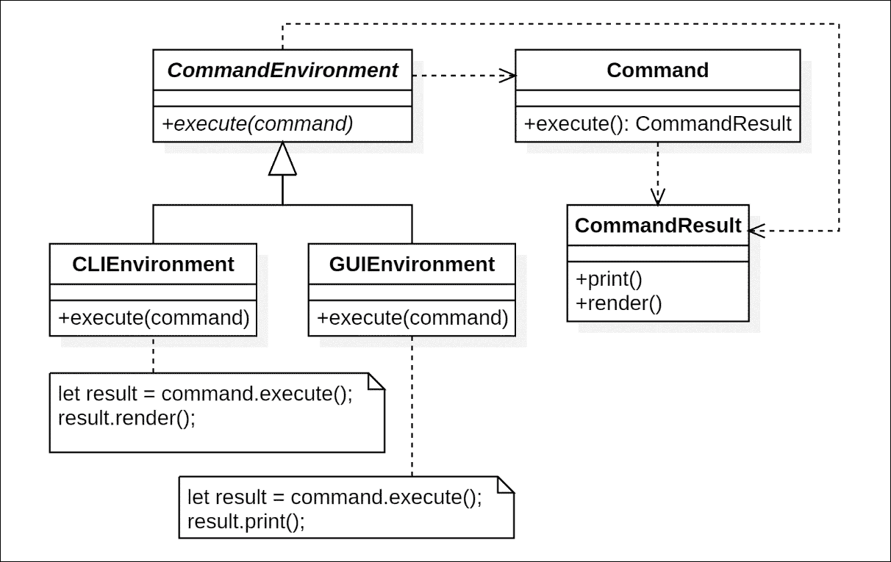
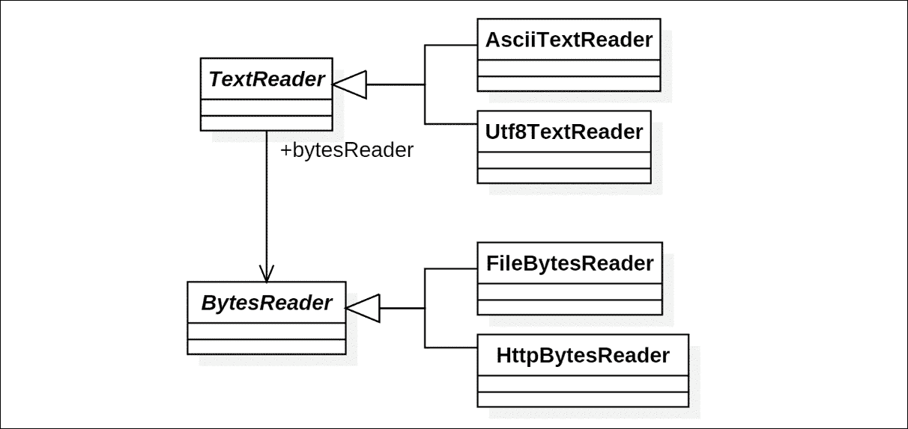
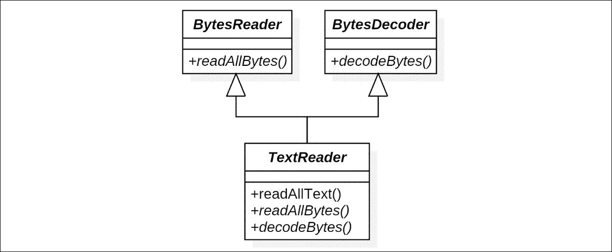
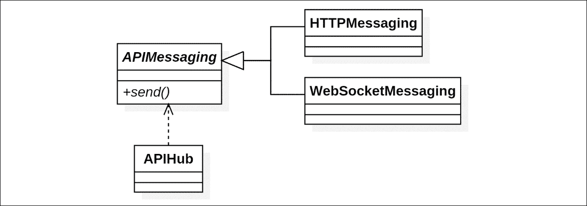

# 第八章. SOLID 原则

SOLID 原则是由 Uncle Bob（罗伯特·C·马丁）总结的知名面向对象设计（**OOD**）原则。SOLID 这个词来源于它所代表的五个原则的首字母缩写，包括**单一职责原则**、**开闭原则**、**里氏替换原则**、**接口隔离原则**和**依赖倒置原则**。这些原则彼此之间紧密相关，并在实践中可以提供很好的指导。

这里是 Uncle Bob 广泛使用的 SOLID 原则总结：

+   **单一职责原则**：一个类应该只有一个，且仅有一个改变的理由

+   **开闭原则**：你应该能够扩展一个类的行为，而不需要修改它

+   **里氏替换原则**：派生类必须可替换其基类

+   **接口隔离原则**：创建细粒度的、特定于客户端的接口

+   **依赖倒置原则**：依赖于抽象，而不是具体实现

在本章中，我们将逐一探讨这些原则，并了解这些原则如何帮助形成一个“闻起来”很好的设计。

但在我们继续之前，我想提到，这些原则存在的一些原因可能与它们被提出时的时代、人们使用的语言以及他们的构建或分发过程有关，甚至与计算资源有关。当应用于当今的 JavaScript 和 TypeScript 项目时，其中的一些细节可能不是必要的。更多地思考这些原则想要防止人们陷入的问题，而不是一个原则应该如何遵循的直文字面描述。

# 单一职责原则

单一职责原则声明，一个类应该只有一个，且仅有一个改变的理由。在这句话中，“理由”这个词的定义很重要。

## 示例

考虑一个`Command`类，它被设计成可以与命令行界面和图形用户界面一起工作：

```js
class Command { 
  environment: Environment; 

  print(items: ListItem[]) { 
    let stdout = this.environment.stdout; 

    stdout.write('Items:\n'); 

    for (let item of items) { 
      stdout.write(item.text + '\n'); 
    } 
  } 

  render(items: ListItem[]) { 
    let element = <List items={items}></List>; 
    this.environment.render(element); 
  } 

  execute() { } 
} 

```

要使这真正工作，`execute`方法需要处理命令执行和结果显示：

```js
class Command { 
  .. 

 execute() {
 let items = ...; 
 if (this.environment.type === 'cli') { 
 this.print(items); 
 } else { 
 this.render(items); 
 } 
 } 
} 

```

在这个例子中，有两个改变的理由：

1.  命令是如何被执行的。

1.  命令的结果如何在不同的环境中显示。

这些原因导致在不同维度上的变化，并违反了单一职责原则。这可能会导致随着时间的推移出现混乱的情况。更好的解决方案是将这两个职责分开，并由`CommandEnvironment`来管理：



这看起来熟悉吗？因为它是一种访问者模式的变体。现在，是环境在执行特定命令并基于具体环境类处理其结果。

## 选择一个轴

你可能会想，`CommandResult`不是通过在不同的环境中显示内容的能力而违反了单一职责原则吗？是的，也不是。当这个原因的轴线设置为显示内容时，它没有；但如果轴线设置为在特定环境中显示，它就做到了。但考虑到整体结构，命令的结果预期是一个可以适应不同环境的输出。因此，这个原因是单维的，并证实了这个原则。

# 开放封闭原则

开放封闭原则声明，你应该能够扩展一个类的行为，而不需要修改它。这个原则是由 Bertrand Meyer 在 1988 年提出的：

> *软件实体（类、模块、函数等）应该对扩展开放，但对修改封闭*。

一个程序依赖于它所使用的所有实体，这意味着改变这些实体已经被使用的部分可能会使整个程序崩溃。因此，开放封闭原则的想法很简单：我们最好有那些除了自我扩展外不会以任何方式改变的实体。

这意味着一旦编写并通过测试，理想情况下，它应该永远不会因为新添加的功能而改变（当然，它需要继续通过测试）。再次强调，理想情况下。

## 示例

考虑一个处理服务器请求和响应的 API 中心。我们将有几个以模块形式编写的文件，包括`http-client.ts`、`hub.ts`和`app.ts`（但在这个例子中，我们实际上不会编写`http-client.ts`，你需要发挥一些想象力）。

将下面的代码保存为文件`hub.ts`。

```js
import { HttpClient, HttpResponse } from './http-client'; 

export function update(): Promise<HttpResponse> { 
  let client = new HttpClient(); 

  return client.get('/api/update'); 
} 

```

将下面的代码保存为文件`app.ts`。

```js
import Hub from './hub'; 

Hub 
  .update() 
  .then(response => JSON.stringify(response.text)) 
  .then(result => { 
    console.log(result); 
}); 

```

勇敢地完成了！现在我们有了`app.ts`与`http-client.ts`严重耦合。如果我们想将这个 API 中心适配到像 WebSocket 这样的东西，BANG。

那么我们如何创建那些对扩展开放但对修改封闭的实体呢？关键在于一个*稳定的抽象，能够适应变化*。考虑我们在第四章中使用的适配器模式示例，*结构型设计模式*中，我们有一个`Storage`接口，它将数据库操作的实现与客户端隔离开。假设该接口设计得很好，能够满足即将到来的功能需求，那么它可能永远不会改变，或者在整个程序生命周期中只需要扩展。

## JavaScript 和 TypeScript 中的抽象

猜猜看，我们心爱的 JavaScript 没有接口，它是动态类型的。我们甚至无法实际编写一个接口。然而，我们仍然可以写下关于抽象的文档，并仅通过遵守该描述来创建新的具体实现。

但 TypeScript 提供了接口，我们当然可以利用它。考虑前一个章节中的`CommandResult`类。我们将其编写为一个具体类，但它可能有子类会覆盖`print`或`render`方法以实现定制输出。然而，TypeScript 中的类型系统只关心类型的形状。这意味着，当你声明一个类型为`CommandResult`的实体时，该实体不需要是`CommandResult`的一个实例：任何具有兼容类型（在这种情况下即具有具有适当签名的`print`和`render`方法的任何对象）都可以完成这项工作。

例如，以下代码是有效的：

```js
let environment: Environment; 

let command: Command = { 
  environment, 
  print(items) { }, 
  render(items) { }, 
  execute() { } 
}; 

```

## 早期重构

我再次强调，开放封闭原则只有在理想情况下才能完美遵循。这可能有两个原因：

1.  *并非系统中的所有实体都能同时开放于扩展而封闭于修改*。总会有需要打破现有实体封闭性以完成其功能性的变化。当我们设计接口时，我们需要针对不同可预见的情境采取不同的策略来创建稳定的封闭。但这需要显著的经验，而且没有人能做得完美。

1.  *我们中没有谁是设计出持久且健康程序的高手*。即使经过深思熟虑，最初设计的抽象在面对不断变化的需求时也可能显得粗糙。

所以当我们期望实体对修改封闭时，并不意味着我们应该只是站在那里看着它被封闭。相反，当事情还在控制之下时，我们应该重构，并在重构时*保持抽象处于开放于扩展和封闭于修改的状态*。

# Liskov 替换原则

开放封闭原则是保持代码可维护和可重用的基本原则。而开放封闭原则的关键在于抽象的多态性。像实现接口或扩展类这样的行为会形成多态的*形状*，但这可能还不够。

Liskov 替换原则声明，派生类必须可替换为其基类。或者用提出这一原则的 Barbara Liskov 的话说：

> *我们想要的类似于以下替换属性：如果对于类型 S 的每个对象 o1，都有一个类型 T 的对象 o2，对于所有以 T 定义的程序 P，当用 o1 替换 o2 时，P 的行为保持不变，那么 S 是 T 的子类型*。

无关紧要。让我们再试一个：*任何可预见的类实例的使用都应该与该类的派生类的实例一起工作*。

## 示例

下面我们用一个直接的违反示例来开始。考虑`Noodles`和`InstantNoodles`（`Noodles`的一个子类）被烹饪的情况：

```js
function cookNoodles(noodles: Noodles) { 
  if (noodles instanceof InstantNoodles) { 
    cookWithBoiledWaterAndBowl(noodles); 
  } else { 
    cookWithWaterAndBoiler(noodles); 
  } 
} 

```

现在如果我们想要一些炒面... `cookNoodles`函数似乎无法处理这种情况。显然，这违反了 Liskov 替换原则，但这并不意味着它是一个糟糕的设计。

让我们考虑 Uncle Bob 在其关于此原则的文章中写的另一个例子。我们正在创建一个名为`Square`的类，它是`Rectangle`的子类，但不是添加新功能，而是给`Rectangle`添加了一个约束：正方形的宽度和高度应该始终相等。假设我们有一个允许设置宽度和高度的`Rectangle`类：

```js
class Rectangle { 
  constructor( 
    private _width: number; 
    private _height: number; 
  ) { } 

  set width(value: number) { 
    this._width = value; 
  } 

  set height(value: number) { 
    this._height = value; 
  } 
} 

```

现在我们遇到了其子类`Square`的问题，因为它从`Rectangle`获得了`width`和`height`设置器，而它不应该这样做。我们当然可以覆盖这些设置器并使它们同时更新宽度和高度。但在某些情况下，客户端可能并不希望这样做，因为这样做会使程序更难预测。

`Square`和`Rectangle`示例违反了 Liskov 替换原则。不是因为我们没有找到一种好的继承方式，而是因为`Square`不符合`Rectangle`的行为，它一开始就不应该成为它的子类。

## 替换约束

类型是编程语言中的一个重要部分，即使在 JavaScript 中也是如此。但拥有相同的*形状*，处于相同的层次结构并不意味着它们可以在不引起痛苦的情况下相互替换。不仅仅是*形状*，完整的行为了解 Liskov 替换原则所坚持的实现才是真正重要的。

# 接口隔离原则

我们已经讨论了抽象在面向对象设计中所扮演的重要角色。通常，抽象及其未分离的派生类会形成层次树结构。这意味着当你选择创建一个分支时，你为另一个分支上的所有对象创建了一个并行抽象。

对于只有一层继承的类族，这并不是问题：因为这正是你希望那些类从其派生出来的。但对于深度更大的层次结构，这可能会成为问题。

## 示例

考虑我们在第六章中用到的`TextReader`示例，在行为设计模式：连续中，我们有`FileAsciiTextReader`和`HttpAsciiTextReader`从`AsciiTextReader`派生出来。但如果我们想要其他理解 UTF-8 编码的读取器怎么办？

为了实现这个目标，我们有两个常见的选择：将接口分离成两个，用于不同对象之间的协作，或者将接口分离成两个，然后由单个类实现。

对于第一种情况，我们可以通过两个抽象类`BytesReader`和`TextReader`来重构代码：



对于第二种情况，我们可以将`readAllBytes`和`decodeBytes`方法分离到两个接口上，例如，`BytesReader`和`BytesDecoder`。因此，我们可以分别实现它们，并使用混入等技术将它们组合在一起：



关于这个例子的一个有趣的观点是，上面的`TextReader`本身就是一个抽象类。为了使这个混入（mixin）真正工作，我们需要创建一个`TextReader`的具体类（实际上不需要实现`readAllBytes`和`decodeBytes`），然后混入两个`BytesReader`和`BytesDecoder`的具体类。

## 合适的粒度

据说，通过创建更小的接口，我们可以避免客户端使用它不需要功能的庞大类。这可能会导致不必要的资源使用，但在实践中，这通常不会成为问题。接口分离原则最重要的部分仍然是关于保持代码的可维护性和可重用性。

然后问题再次出现，接口应该有多小？我不认为我有一个简单的答案。但我确信，太小可能不会有所帮助。

# 依赖倒置原则

当我们谈论依赖时，自然的理解是从下到上的依赖，就像建筑物的建造过程一样。但与可以持续数十年几乎不变化的建筑物不同，软件在其生命周期中不断变化。每一次变化都有成本，或多或少。

依赖倒置原则声明，实体应该依赖于抽象，而不是具体实现。高级代码不应该直接依赖于低级实现，而应该依赖于导致这些实现的抽象。这就是为什么它是“倒置”的。

## 示例

仍然以 HTTP 客户端和 API 中心为例，这显然违反了依赖倒置原则，考虑到可预见的应用，API 中心应该依赖于一个连接客户端和服务器的信息传递机制，而不是裸露的 HTTP 客户端。这意味着我们应该在 HTTP 客户端的具体实现之前有一个信息传递的抽象层：



## 分离层

与本章讨论的其他原则相比，依赖倒置原则更关注模块或包的范围。由于抽象通常比具体实现更稳定，遵循依赖倒置原则，我们可以最小化低级变化对高级行为的影响。

但对于 JavaScript（或 TypeScript）项目来说，由于语言是动态类型的，这个原则更多的是一种指导性的思想，它引导不同层代码实现之间形成稳定的抽象。

最初，遵循这一原则的一个重要好处是，如果模块或包相对较大，通过抽象分离它们可以在编译过程中节省大量时间。但对于 JavaScript，我们不必担心这一点；而对于 TypeScript，我们也不必为了对分离的模块进行更改而重新编译整个项目。

# 摘要

在本章中，我们通过简单的示例介绍了众所周知的 SOLID 原则。有时，遵循这些原则可能会引导我们到一个有用的设计模式。我们还发现，这些原则之间有着强烈的联系。通常，违反其中之一可能表明存在其他违规行为。

这些原则对于面向对象设计（OOD）可能非常有帮助，但如果应用不当，也可能过度。一个设计良好的系统应该恰好确认这些原则，否则可能会造成伤害。

在下一章中，我们将有更多时间来探讨一个完整的流程，其中包括测试和持续集成。
