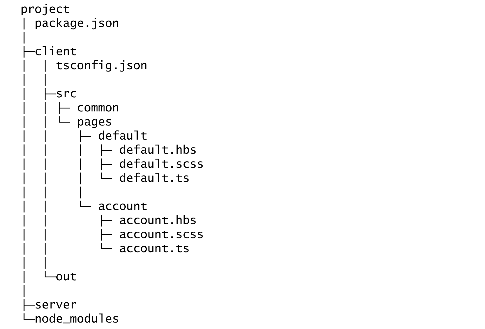
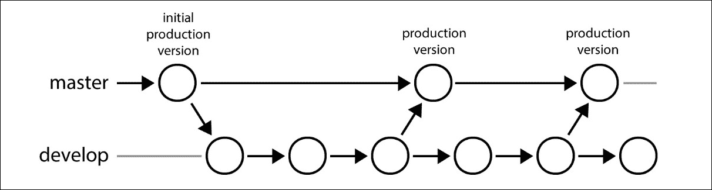
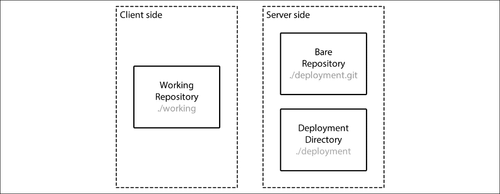

# 第九章. 企业应用程序之路

在了解了常见的设计模式之后，我们现在有了代码设计的基石。然而，软件工程更多的是关于编写优美的代码。当我们试图保持代码健康和健壮时，我们仍然有很多工作要做，以确保项目和团队健康、健壮，并准备好扩展。在本章中，我们将讨论 Web 应用程序工作流程中的流行元素，以及如何设计适合您团队的工作流程。

第一部分将是设置我们的演示项目的构建步骤。我们将快速介绍如何使用 *webpack*（目前最受欢迎的打包工具之一）构建前端项目。然后我们将配置测试、代码检查器，并设置持续集成。

在工作流程集成方面有很多不错的选择。我个人更喜欢为私人项目使用 Team Foundation Server，或者为开源项目使用 GitHub 和 Travis-CI 的组合。虽然 Team Foundation Server（或其基于云的版本 Visual Studio Team Services）为整个应用程序生命周期提供了一站式解决方案，但 GitHub 和 Travis-CI 的组合在 JavaScript 社区中更为流行。在本章中，我们将使用 GitHub 和 Travis-CI 提供的服务来构建我们的工作流程。

这里是我们将要介绍的内容：

+   使用 webpack 打包前端资源。

+   设置测试和代码检查器。

+   掌握 Git 分支模型和其他 Git 相关的工作流程。

+   将 GitHub 仓库与 Travis-CI 连接。

+   自动部署的简要介绍。

# 创建应用程序

我们在 第一章 *工具和框架* 中讨论了为前端和后端项目创建 TypeScript 应用程序。现在我们将创建一个同时包含两个 TypeScript 项目的应用程序。

## 在 SPA 和“常规”Web 应用程序之间做出决定

不同目的的应用程序会导致不同的选择。单页应用（SPA）在加载后通常提供更好的用户体验，但也可能导致 SEO 方面的权衡，并可能依赖于更复杂的 MV* 框架，如 Angular。

一种构建 SEO 友好型 SPA 的解决方案是构建一个在前后端都运行 *相同* 代码的通用（或同构）应用程序，但这可能会引入更多的复杂性。或者可以配置反向代理，利用像 *Phantom* 这样的工具自动渲染自动生成的页面。

在这个演示项目中，我们将选择一个更传统的多页面 Web 应用程序来构建。以下是客户端项目的文件结构：



## 考虑团队协作

在我们实际开始创建真实世界的应用程序之前，我们需要提出一个合理的应用程序结构。适当的应用程序结构不仅仅是代码编译和运行的地方。它应该是一个结果，考虑到团队成员如何一起工作。

例如，在前面展示的此演示客户端结构中涉及到了一个命名约定：页面资源以页面名称命名，而不是它们的类型（例如，`style.scss`）或像`index.ts`这样的名称。这个约定的背后考虑是使文件通过键盘导航更加友好。

当然，只有当你们团队中相当一部分开发者对键盘导航感到满意时，这种考虑才是有效的。除了操作偏好之外，团队的体验和背景也应该被认真考虑：

+   应该为你们团队启用“全栈”模式吗？

+   应该为你们团队中的每位工程师启用“全栈”模式吗？

+   你应该如何在前后端之间分配工作？

通常，限制前端工程师访问客户端开发的访问权限既不必要也不高效。如果可能的话，前端工程师可以接管后端的控制器层，将核心业务模型和逻辑留给更专注于后端开发的工程师。

我们在同一个存储库中拥有客户端和服务器端项目，以便在开发期间更容易集成。但这并不意味着前端或后端代码库中的所有内容都应该在这个单一存储库中。相反，在实践中，多个模块可以由不同的开发者提取和维护。例如，你可以将数据库模型和业务逻辑模型从后端的控制器中分离出来。

# 构建和测试项目

我们已经在本书的开头讨论了构建和测试 TypeScript 项目。在本节中，我们将进一步探讨前端项目，包括使用 Webpack 加载静态资产以及**代码检查**的基础。

## 使用 webpack 进行静态资源打包

模块化有助于代码保持健康结构，并使其易于维护。然而，如果开发时在*小*模块中编写的代码直接部署到生产使用而没有打包，可能会导致性能问题。因此，静态资源打包成为前端工程的一个严肃话题。

回到过去，打包 JavaScript 文件仅仅是*丑化*源代码并将文件连接在一起。项目可能也会进行模块化，但以*全局*的方式。然后我们有了像 Require.js 这样的库，模块不再自动暴露到全局作用域。

但是，正如我之前提到的，让客户端分别下载模块文件对于性能来说并不理想；很快我们就有了像 browserify 这样的工具，后来还有 webpack——目前最受欢迎的前端打包工具之一。

### webpack 简介

Webpack 是一个针对前端项目集成的打包工具（至少最初是针对前端项目的）。它旨在打包不仅限于 JavaScript，还包括前端项目中的其他静态资源。Webpack 内置了对 **异步模块定义**（**AMD**）和 commonjs 的支持，并且可以通过插件加载 ES6 或其他类型的资源。

### 注意

ES6 模块支持将在 webpack 2.0 中内置，但到本章编写时，你仍然需要像 `babel-loader` 或 `ts-loader` 这样的插件来使其工作。当然，我们稍后也会使用 `ts-loader`。

要通过 `npm` 安装 webpack，请执行以下命令：

```js
$ npm install webpack -g

```

### 将 JavaScript 打包

在我们实际使用 webpack 加载 TypeScript 文件之前，我们将快速浏览 JavaScript 打包的过程。

首先，让我们在 `client/src/` 目录下创建名为 `index.js` 的文件，并在其中包含以下代码：

```js
var Foo = require('./foo'); 

Foo.test(); 

```

然后在同一文件夹中创建名为 `foo.js` 的文件，内容如下：

```js
exports.test = function test() { 
  console.log('Hello, Webpack!'); 
}; 

```

现在我们可以使用 webpack 命令行界面将它们打包成一个单独的文件：

```js
$ webpack ./client/src/index.js ./client/out/bundle.js

```

通过查看 webpack 生成的 `bundle.js` 文件，你会看到 `index.js` 和 `foo.js` 的内容都被封装进那个单独的文件中，以及 webpack 的引导代码。当然，我们更愿意每次都不在命令行中输入这些文件路径，而是使用配置文件。

Webpack 以 JavaScript 文件的形式提供配置文件支持，这使得它能够更灵活地自动生成必要的数据，如捆绑条目。让我们创建一个简单的配置文件，执行之前命令的功能。

创建文件 `client/webpack.config.js`，包含以下行：

```js
'use strict'; 

const Path = require('path'); 

module.exports = { 
  entry: './src/index', 
  output: { 
    path: Path.join(__dirname, 'out'), 
    filename: 'bundle.js' 
  } 
}; 

```

这里有两件事需要提及：

1.  `entry` 字段的值不是文件名，而是模块 ID（大多数情况下这是未解析的）。这意味着你可以省略 `.js` 扩展名，但在引用文件时默认需要以 `./` 或 `../` 前缀。

1.  输出路径必须是绝对路径。使用 `__dirname` 构建绝对路径可以确保如果我们不在与配置文件相同的目录下执行 webpack，它也能正常工作。

### 加载 TypeScript

现在我们将使用 webpack 插件 `ts-loader` 加载和转换我们喜爱的 TypeScript。在更新配置之前，让我们安装必要的 npm 包：

```js
$ npm install typescript ts-loader --save-dev

```

如果一切顺利，你应该已经安装了 TypeScript 编译器和 `ts-loader` 插件。我们可能还想将 `index.js` 和 `foo.js` 文件重命名并更新为 TypeScript 文件。

将 `index.js` 重命名为 `index.ts` 并更新模块导入语法：

```js
import * as Foo from './foo'; 

Foo.test(); 

```

将 `foo.js` 重命名为 `foo.ts` 并更新模块导出语法：

```js
export function test() { 
  console.log('Hello, Webpack!'); 
} 

```

当然，我们还想为 TypeScript 文件添加 `tsconfig.json` 文件（在 `client` 文件夹中）：

```js
{ 
  "compilerOptions": { 
    "target": "es5", 
    "module": "commonjs" 
  }, 
  "exclude": [ 
    "out", 
    "node_modules" 
  ] 
} 

```

### 注意

编译器选项 `outDir` 在这里被省略了，因为它在 webpack 配置文件中管理。

要使 webpack 通过 `ts-loader` 与 TypeScript 一起工作，我们需要在配置文件中告诉 webpack 一些信息：

1.  Webpack 需要解析具有 `.ts` 扩展名的文件。Webpack 有一个默认的扩展名列表用于解析，包括 `''`（空字符串）、`'.webpack.js'`、`'.web.js'` 和 `'.js'`。我们需要将 `'.ts'` 添加到这个列表中，以便它能够识别 TypeScript 文件。

1.  Webpack 需要使用 `ts-loader` 加载 `.ts` 模块，因为它本身不编译 TypeScript。

这里是更新后的 `webpack.config.js`:

```js
'use strict'; 

const Path = require('path'); 

module.exports = { 
  entry: './src/index', 
  output: { 
    path: Path.join(__dirname, 'bld'), 
    filename: 'bundle.js' 
  }, 
 resolve: { 
    extensions: ['', '.webpack.js', '.web.js', '.ts', '.js'] 
  }, 
  module: { 
    loaders: [ 
      { test: /\.ts$/, loader: 'ts-loader' } 
    ] 
  } 
}; 

```

现在再次在 `client` 文件夹下执行 `webpack` 命令，我们应该得到预期的编译和打包输出。

在开发期间，我们可以启用 TypeScript 的 *转译模式*（对应于编译器的 `isolatedModules` 选项），以在编译更改文件时获得更好的性能。但这意味着我们需要依赖 IDE 或编辑器来提供错误提示。并且记得在调试后禁用转译模式进行另一次编译，以确保一切仍然正常工作。

要启用转译模式，添加一个 `ts` 字段（由 `ts-loader` 插件定义），并将 `transpileOnly` 设置为 `true`:

```js
module.exports = { 
  ... 
  ts: { 
      transpileOnly: true 
  } 
}; 

```

### 代码拆分

为了利用跨页面的代码缓存，我们可能想要将打包的模块拆分为通用组件。webpack 提供了一个名为 `CommonsChunkPlugin` 的内置插件，可以提取公共模块并将它们单独打包。

例如，如果我们创建另一个名为 `bar.ts` 的文件，它像 `index.ts` 一样导入 `foo.ts`，则 `foo.ts` 可以被视为一个公共块并单独打包：

```js
module.exports = { 
  entry: ['./src/index', './src/bar'], 
  ... 
  plugins: [ 
    new Webpack.optimize.CommonsChunkPlugin({ 
      name: 'common', 
      filename: 'common.js' 
    }) 
  ] 
}; 

```

对于多页面应用程序，通常不同的页面有不同的入口脚本。我们不必手动更新配置文件中的 `entry` 字段，可以利用它是 JavaScript 的特性来自动生成适当的入口。为此，我们可能需要 npm 包 `glob` 的帮助来匹配页面入口：

```js
$ npm install glob --saved-dev

```

然后更新 webpack 配置文件：

```js
const glob = require('glob'); 

module.exports = { 
 entry: glob 
    .sync('./src/pages/*/*.ts') 
    .filter(path => 
      Path.basename(path, '.ts') === 
      Path.basename(Path.dirname(path)) 
    ), 
  ... 
}; 

```

代码拆分可能是一个相当复杂的深入主题，所以我们在这里停止，并让您去探索。

### 加载其他静态资源

正如我们所提到的，webpack 还可以用来加载其他静态资源，如样式表及其扩展。例如，您可以使用 `style-loader`、`css-loader` 和 `sass-loader`/`less-loader` 的组合来加载 `.sass`/`.less` 文件。

配置与 `ts-loader` 类似，因此我们不会额外花费页面来介绍它们。更多信息，请参考以下网址：

+   Webpack 中的嵌入式样式表：[`webpack.github.io/docs/stylesheets.html`](https://webpack.github.io/docs/stylesheets.html)

+   Webpack 的 SASS 加载器：[`github.com/jtangelder/sass-loader`](https://github.com/jtangelder/sass-loader)

+   Webpack 的 LESS 加载器：[`github.com/webpack/less-loader`](https://github.com/webpack/less-loader)

## 将 TSLint 添加到项目中

一致的代码风格是代码质量的重要因素，当涉及到代码风格时，linters 是我们的最佳拍档（它们也帮助我们避免常见的错误）。对于 TypeScript 的 linting，TSLint 目前是最佳选择。

TSLint 的安装和配置很简单。首先，让我们全局安装`tslint`命令：

```js
$ npm install tslint -g

```

然后，我们需要在项目根目录下使用以下命令初始化一个配置文件：

```js
$ tslint --init

```

然后，TSLint 将生成一个名为`tslint.json`的默认配置文件，你可以根据自己的喜好进行自定义。现在我们可以用它来检查我们的 TypeScript 源代码：

```js
$ tslint */src/**/*.ts

```

## 将 webpack 和 tslint 命令与 npm 脚本集成

正如我们之前提到的，使用 npm 脚本的一个优点是它们可以通过将`node_modules/.bin`添加到`PATH`来正确处理带有可执行文件的本地包。为了使我们的应用程序更容易被其他开发者构建和测试，我们可以将`webpack`和`tslint`作为开发依赖项安装，并将相关的脚本添加到`package.json`中：

```js
"scripts": { 
  "build-client": "cd client && webpack", 
  "build-server": "tsc --project server", 
  "build": "npm run build-client && npm run build-server", 
  "lint": "tslint ./*/src/**/*.ts", 
  "test-client": "cd client && mocha", 
  "test-server": "cd server && mocha", 
  "test": "npm run lint && npm run test-client && npm run test-server" 
} 

```

# 版本控制

回想起我的高中时代，我对版本控制工具一无所知。我能做的最好的事情就是每天将我的代码存档到 U 盘上。是的，我确实丢失过一次！

现在，随着 Git 等版本控制工具的兴起以及 GitHub 和 Visual Studio Team Services 等多家免费服务的可用性，使用版本控制工具管理代码已经成为每个开发者的日常工作。

作为最受欢迎的版本控制工具，Git 已经在你的工作或个人项目中扮演着重要的角色。在本节中，我们将讨论在团队中使用 Git 的流行实践。

### 注意

注意，我假设你已经具备了 Git 的基本知识，并且知道如何进行`init`、`commit`、`push`、`pull`和`merge`等操作。如果不是这样，请在继续之前动手尝试理解这些操作。

### 注意

请查看这个快速教程：[`try.github.io/`](https://try.github.io/)。

## Git flow

版本控制扮演着非常重要的角色，它不仅影响源代码管理过程，还塑造了整个产品开发和交付的工作流程。因此，一个*成功*的分支模型成为一个严肃的选择。

Git flow 是一组 Git 扩展，它为 Vincent Driessen 提出的分支模型提供了高级的仓库操作。*Git flow*这个名字通常也指代分支模型。

在这个分支模型中，有两个主要的分支：`master`和`develop`，以及三种不同类型的支持分支：`feature`、`hotfix`和`release`。

在 Git flow 扩展的帮助下，我们可以轻松地应用这个分支模型，而无需记住和输入详细的命令序列。要安装，请查看 Git flow 的安装指南：[`github.com/nvie/gitflow/wiki/Installation`](https://github.com/nvie/gitflow/wiki/Installation)。

在我们能够使用 Git flow 创建和合并分支之前，我们需要进行初始化：

```js
$ git flow init -d

```

### 注意

其中 `-d` 表示使用默认的分支命名约定。如果您想自定义，可以省略 `-d` 选项并回答有关 `git flow init` 命令的问题。

这将创建（如果不存在）`master` 和 `develop` 分支，并将 Git flow 相关配置保存到本地仓库。

### 主分支

分支模型定义了两个主要分支：`master` 和 `develop`。这两个分支存在于当前仓库的生命周期中：



### 注意

前面的图显示了 `develop` 和 `master` 分支之间简化的关系。

+   **分支 master**：`master` 分支的 *HEAD* 应始终包含生产就绪的源代码。这意味着在这个分支模型中，`master` 分支上不进行日常开发，只有经过完全测试并且可以快速前向合并的提交才能合并到这个分支。

+   **分支 develop**：`develop` 分支的 *HEAD* 应包含交付的开发源代码。对 `develop` 分支的更改最终将合并到 `master`，但通常不是直接合并。我们将在讨论 `release` 分支时再详细说明。

### 支持分支

在 Git flow 的分支模型中，有三种类型的支持分支：`feature`、`hotfix` 和 `release`。它们大致的功能已经由它们的名字暗示，我们将在后续的细节中了解更多。

#### 功能分支

功能分支只与 `develop` 分支有直接交互，这意味着它从 `develop` 分支检出并合并回 `develop` 分支。功能分支可能是三种分支中最简单的一种。

要使用 Git flow 创建功能分支，只需执行以下命令：

```js
$ git flow feature start <feature-name>

```

现在 Git flow 将自动检出以 `feature/<feature-name>` 命名的新分支，您就可以开始开发和偶尔提交更改了。

完成功能开发后，Git flow 可以通过以下命令自动将内容合并回 `develop` 分支：

```js
$ git flow feature finish <feature-name>

```

功能分支通常由被分配开发该特定功能的开发者启动，并由该开发者本人或 `develop` 分支的所有者（例如，如果需要代码审查）合并。

#### 发布分支

在产品的单个迭代中，在完成功能开发后，我们通常需要一个阶段来全面测试一切、修复错误，并实际上准备好发布。这个阶段的工作将在发布分支上完成。

与功能分支不同，一个仓库通常一次只有一个活跃的发布分支，并且通常由仓库所有者创建。当开发分支即将达到发布状态并且即将开始全面测试时，我们可以使用以下命令创建一个发布分支：

```js
$ git flow release start <version>

```

从现在起，本迭代将要发布的错误修复应该合并或提交到`release/<version>`分支，并且对当前`release`分支的更改可以随时合并回`develop`分支。

如果测试顺利并且重要错误已被修复，我们就可以完成这次发布并将其上线：

```js
$ git flow release finish <version>

```

执行此命令后，Git flow 会将当前发布分支合并到`master`和`develop`分支。所以在标准的 Git flow 分支模型中，`develop`分支不会直接合并到`master`，尽管在发布完成后，`develop`和`master`分支上的内容可能相同（如果在发布阶段没有对`develop`分支进行更多更改）。

### 注意

完成当前发布通常意味着迭代的结束，这个决定应该经过认真考虑。

#### hotfix 分支

不幸的是，在开发者的世界中存在一种现象：在代码上线之前，总是更难找到错误。发布后，如果发现了严重的错误，我们就必须使用 hotfix 来纠正问题。

`hotfix`分支有点像发布分支，但持续时间更短（因为你可能希望尽快将其合并）。与从`develop`分支检出功能分支不同，`hotfix`分支是从`master`分支检出的。完成工作后，它应该像发布分支一样合并回`master`和`develop`分支。

要创建一个`hotfix`分支，同样可以执行以下命令：

```js
$ git flow hotfix start <hotfix-name>

```

最后，执行以下命令：

```js
$ git flow hotfix finish <hotfix-name>

```

### Git flow 总结

在 Git flow 中，除了分支模型本身之外，我认为最有价值的想法是，一个迭代的清晰概述。你可能不需要遵循迄今为止提到的每个步骤来使用 Git flow，但只需让它适应你的工作。例如，对于可以在单个提交中完成的小功能，你可能实际上不需要一个功能分支。但相反，如果迭代本身变得混乱，Git flow 可能不会带来太多价值。

## 基于 pull request 的代码审查

**代码审查**可能是团队合作中非常重要的环节。它确保代码本身的质量可接受，并帮助新成员纠正对项目的误解，快速积累经验而不会走错路。

如果你尝试向 GitHub 上的开源项目贡献代码，你一定熟悉 pull requests 或 PR。实际上有一些工具或 IDE 内置了代码审查工作流程。但使用 GitHub 和其他自托管的如 GitLab 服务，我们可以顺利完成任务，而不依赖于特定的工具。

### 配置分支权限

对`master`和`develop`等特定分支的访问限制在技术上不是必需的。但没有这些限制，开发者可以轻易地跳过代码审查，因为他们能够这样做。在 Visual Studio Team Foundation Server 提供的服务中，我们可以在策略中添加自定义检查来强制代码审查。但在 GitHub 和 GitLab 等较轻量级的服务中，可能更难实现类似的功能。

最简单的方法可能是让更合格且熟悉当前项目的开发者拥有写入`develop`分支的权限，并口头限制该组的代码审查。对于其他在此项目上工作的开发者，现在强制进行拉取请求以获取他们合并的更改。

### 注意

GitHub 要求指定分支的推送权限的组织账户。除此之外，GitHub 提供状态 API，可以添加合并限制，以便只有具有有效状态的分支才能合并。

### 合并前的评论和修改

那些流行的 Git 服务的一个好处是，审阅者以及可能的其他同事可以对您的拉取请求或甚至特定的代码行进行评论，以提出他们的关注或建议。相应地，您可以修改活动拉取请求，使事情更接近完美。

此外，问题与拉取请求之间的引用在对话中显示。这连同评论和修改记录一起，使当前拉取请求的上下文清晰且可追溯。

## 提交前的测试

理想情况下，我们希望我们做出的每个提交都能通过测试和代码检查。但因为我们都是人类，我们很容易忘记在提交更改之前运行测试。然后，如果我们已经设置了项目的持续集成（我们很快就会谈到），推送更改会使它变红。如果你的同事设置了带有警报的 CI 轻量级服务，你将使它闪烁并发出声音。

为了避免不断破坏构建，您可能希望向您的本地仓库添加一个`pre-commit`钩子。

### Git 钩子

Git 为操作或事件的特定阶段提供了各种钩子。在初始化 Git 仓库后，Git 将在`.git/hooks`目录下创建钩子样本。

现在让我们在`.git/hooks`目录下创建一个名为`pre-commit`的文件，并包含以下内容：

```js
#!/bin/sh
npm run test

```

### 注意

钩子文件不一定要是 bash 文件，它可以是任何可执行文件。例如，如果你想使用 Node.js 钩子，你可以更新 shebang 为`#!/usr/bin/env node`，然后使用 JavaScript 编写钩子。

现在 Git 将在每次提交更改之前运行测试。

### 自动添加 pre-commit 钩子

将钩子手动添加到本地仓库可能很简单，但幸运的是，我们有像`pre-commit`这样的 npm 包，当安装时它会自动添加 pre-commit 钩子（因为您通常可能需要运行`npm install`）。

要使用 `pre-commit` 包，只需将其作为开发依赖项安装：

```js
$ npm install pre-commit --save-dev

```

它将读取您的 `package.json` 并执行带有 `pre-commit` 或 `precommit` 字段的 npm 脚本：

```js
{ 
  .. 
  "script": { 
    "test": "istanbul cover ..." 
  }, 
  "pre-commit": ["test"] 
} 

```

### 注意

在撰写本文时，npm 包 `pre-commit` 使用符号链接创建 Git 钩子，这需要在 Windows 上具有管理员权限。但创建符号链接失败不会阻止 `npm install` 命令完成。因此，如果你使用 Windows，你可能需要确保 `pre-commit` 正确安装。

# 持续集成

**持续集成**（**CI**）是指定期将项目或解决方案的多个部分集成在一起的做法。根据项目的大小，集成可以是每次单个更改或按时间表进行。

持续集成的主要目标是避免集成问题，它还强制执行频繁的自动化测试的纪律，这有助于更早地发现错误并防止功能的退化。

有许多具有持续集成支持的解决方案或服务。例如，自托管的 TFS 和 Jenkins 服务，或基于云的 Visual Studio Team Services、Travis-CI 和 AppVeyor 服务。我们将通过我们的演示项目来介绍 Travis-CI 的基本配置。

## 将 GitHub 仓库与 Travis-CI 连接

我们将使用 GitHub 作为持续集成背后的 Git 服务。首先，让我们准备好我们的 GitHub 仓库和 Travis-CI 设置：

1.  创建一个对应的远程仓库作为 origin，并将本地仓库推送到 GitHub：

    ```js
     $ git remote add origin https://github.com/<username>/<repo>.git
     $ git push -u origin master

    ```

1.  使用您的 GitHub 账户登录 Travis-CI：[`travis-ci.org/auth`](https://travis-ci.org/auth)。

1.  前往账户页面，找到我们正在工作的项目，然后切换到仓库。

现在我们需要做的唯一一件事是创建一个合适的 Travis-CI 配置文件，以使持续集成设置生效。Travis-CI 对许多语言和运行时提供了内置支持。它提供了多个版本的 Node.js，使得测试 Node.js 项目变得极其简单。

在项目的根目录下创建文件 `.travis.yml`，内容如下：

```js
language: node_js 
node_js: 
  - "4" 
  - "6" 
before_script: 
  - npm run build 

```

此配置文件告诉 Travis-CI 使用 Node.js v4 和 v6 进行测试，并在测试前执行命令 `npm run build`（它将自动运行 `npm test` 命令）。

几乎准备好了！现在添加并提交新的 `.travis.yml` 文件，并将其推送到 `origin`。如果一切顺利，我们应该会看到 Travis-CI 短时间内开始构建此项目。

### 注意

现在，你可能到处都能看到构建状态徽章，并且很容易将其添加到自己的项目的 `README.md` 中。在 Travis-CI 的项目页面上，你应该会在项目名称旁边看到一个徽章。复制其 URL 并将其作为图片添加到 `README.md` 中：

```js
 

```

# 部署自动化

除了版本控制工具外，Git 还因其相对简单的部署自动化而受到欢迎。在本节中，我们将动手配置基于 Git 的自动化部署。

## 基于 Git 服务器端钩子的被动部署

被动部署的想法很简单：当客户端将提交推送到服务器上的裸仓库时，Git 的 `post-receive` 钩子将被触发。因此，我们可以添加检查出更改并启动部署的脚本。

客户端和服务器端 Git 部署解决方案中涉及到的元素包括：



为了使此机制工作，我们需要执行以下步骤：

1.  使用以下命令在服务器上创建一个裸仓库：

    ```js
     $ mkdir deployment.git
     $ cd deployment.git
     $ git init --bare

    ```

    ### 注意

    一个裸仓库通常具有 `.git` 扩展名，可以作为共享的集中式位置。与普通仓库不同，裸仓库没有源文件的副本，其结构与普通仓库的 `.git` 目录内部结构非常相似。

1.  将 `deployment.git` 添加为项目的远程仓库，并尝试将 `master` 分支推送到 `deployment.git` 仓库：

    ```js
     $ cd ../demo-project
     $ git remote add deployment ../deployment.git
     $ git push -u deployment master

    ```

    ### 注意

    在本例中，我们将添加一个本地裸仓库作为远程仓库。创建真正的远程仓库可能需要额外的步骤。

1.  为 `deployment.git` 仓库添加一个 `post-receive` 钩子。我们已经与客户端 Git 钩子 `pre-commit` 一起工作过，服务器端钩子的工作方式相同。

但是，当涉及到严肃的生产部署时，如何编写钩子可能是一个难以回答的问题。例如，我们如何最小化部署新构建的影响？

如果我们已经设置了具有高可用性负载均衡的应用程序，那么其中之一离线几分钟可能不是大问题。但当然，在这种情况下，不是所有这些都会离线。因此，以下是客户端和服务器端部署脚本的一些基本要求：

+   部署应按照一定的顺序进行

+   部署应温柔地停止运行服务

我们可以通过以下方式做得更好：

+   在之前的部署目录外构建

+   只有在新的部署应用准备好立即启动后，才尝试停止正在运行的服务

## 基于定时器或通知的主动部署

我们可以使用其他工具自动拉取和构建应用程序，而不是使用 Git 钩子。这样，我们就不再需要客户端分别将更改推送到服务器。相反，服务器上的程序将从远程仓库拉取更改并完成部署。

虽然首选通知机制以避免频繁抓取，但已经存在像 PM2 这样的工具，它们内置了自动化部署。您也可以考虑使用基于云或自托管 Git 服务提供的钩子构建自己的工具。

# 摘要

在这一章的最后，我们从构建和测试开始，构建了完整工作流程的概要，直到持续集成和自动化部署。我们介绍了一些流行的服务或工具，并为读者提供了其他发现和探索的选项。

在众多选择中，你可能会同意最适合你团队的工作流程是那个最适合的工作流程。仅从人的角度而不是仅从技术角度考虑是软件工程的一个重要部分，这同样是保持团队高效（也许还有快乐）的关键。

团队或人群的悲哀之处在于，通常只有其中的一小部分人能够保持热情。我们谈论过寻找平衡点，但那正是我们需要练习的。在大多数情况下，期望团队中的每个人都找到正确的点是不切实际的。当涉及到团队项目时，我们最好有可以自动验证的规则，而不是不可测试的惯例。

在阅读这本书之后，我希望读者能够了解构建步骤、工作流程的概要，以及当然的常见设计模式的知识。但与不同术语和模式的冷冰冰的解释相比，我更想传达一些更重要的想法：

+   我们作为人类是平凡的，应该始终将我们的工作划分为可控的部分，而不是像天才一样行事。这也是我们需要*设计*软件来使我们的生活更轻松的原因。

+   我们也并不可靠，尤其是在一些规模较大的集体（比如一个团队）中。

+   作为一名学习者，始终尝试理解结论背后的原因或现象背后的机制。
