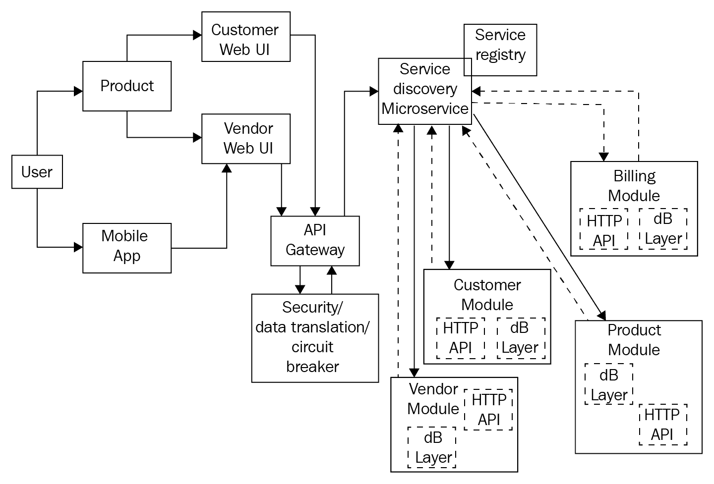
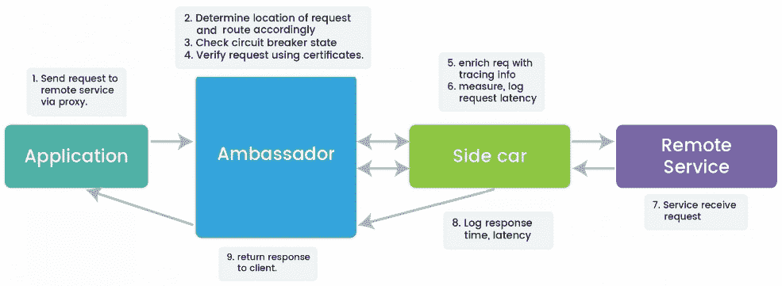
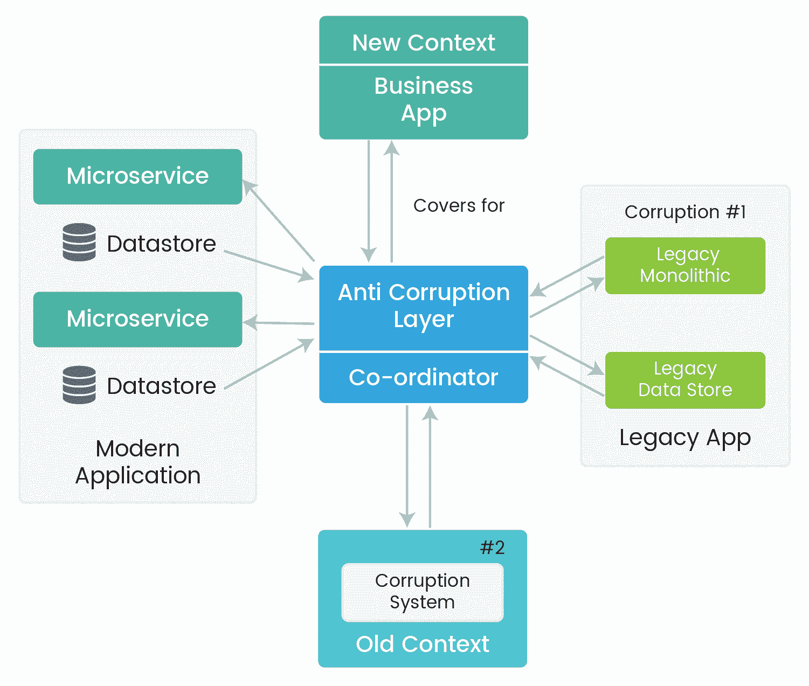
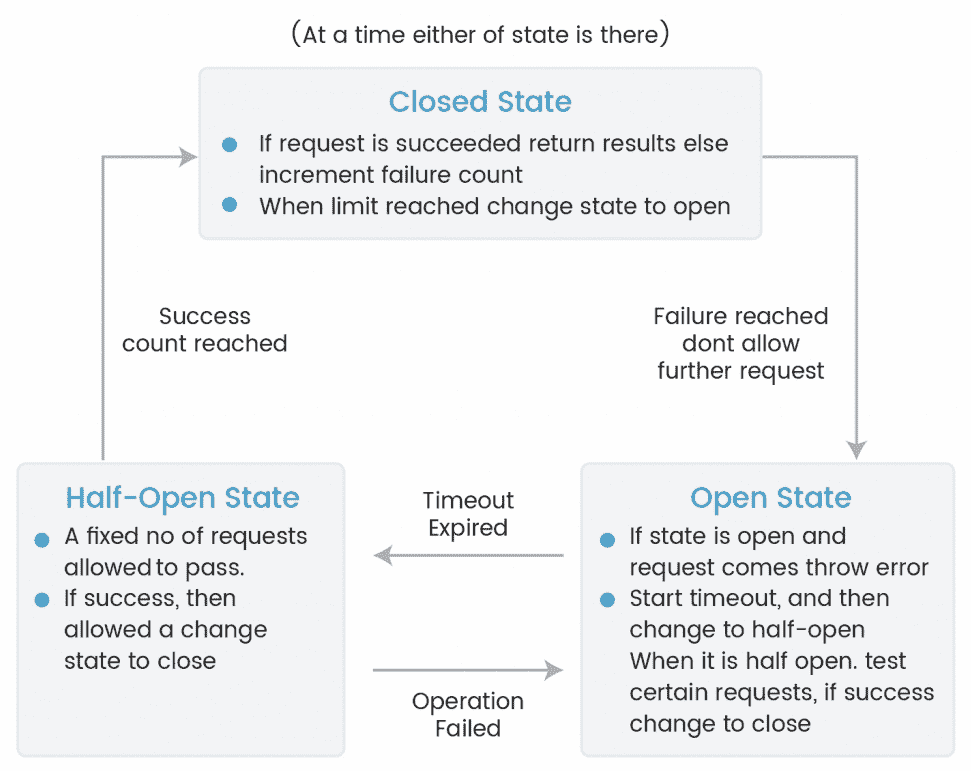

# 第一章：揭秘微服务

“如果我问人们他们想要什么，他们会说更快的马。”

- 亨利·福特

无论您是技术负责人、开发人员还是渴望适应新的现代网络标准的技术专家，上述内容都概括了您当前的生活状况。今天成功业务的口号是，快速失败，快速修复和迅速崛起，更快的交付，频繁的变化，适应不断变化的技术和容错系统是一些日常要求。出于同样的原因，最近技术世界已经看到了架构设计的快速变化，这导致行业领袖（如 Netflix、Twitter、亚马逊等）放弃了单片应用程序，转向了微服务。在本章中，我们将揭秘微服务，研究它们的解剖学，并了解它们的概念、特点和优势。我们将了解微服务设计方面，并了解一些微服务设计模式。

在本章中，我们将讨论以下主题：

+   揭秘微服务

+   微服务的关键考虑因素

+   微服务常见问题解答

+   微服务如何满足应用程序的十二因素

+   当前世界的微服务

+   微服务设计方面

+   微服务设计模式

# 揭秘微服务

微服务开发的核心思想是，如果应用程序被分解为更小的独立单元，每个组都能很好地执行其功能，那么构建和维护应用程序就变得简单。整体应用程序只是各个单元的总和。让我们开始揭秘微服务。

# 微服务的崛起

今天的世界正在呈指数级增长，并且需要一种能够满足以下问题的架构，这些问题使我们重新思考传统的架构模式，并催生了微服务。

# 根据需求选择多种语言

技术独立性的需求非常迫切。在任何时候，语言和采用率都会发生变化。像沃尔玛这样的公司已经放弃了 Java 堆栈，转向了 MEAN 堆栈。今天的现代应用程序不仅仅局限于网络界面，还需要移动和智能手表应用程序。因此，用一种语言编写所有内容根本不是可行的选择。我们需要一种架构或生态系统，可以让多种语言共存并相互通信。例如，我们可以在 Go、Node.js 和 Spring Boot 中暴露 REST API，一个网关作为前端的单一联系点。

# 易于处理所有权

今天的应用程序不仅包括单一的网络界面，还涉及到移动设备、智能手表和虚拟现实（VR）。将逻辑分离成单独的模块有助于控制每个团队拥有一个单独的单元。此外，多个事物应该能够并行运行，从而实现更快的交付。团队之间的依赖关系应该降低到零。追踪正确的人来解决问题并使系统重新运行需要微服务架构。

# 频繁的部署

应用程序需要不断发展，以适应不断发展的世界。当 Gmail 开始时，它只是一个简单的邮件工具，现在它已经发展成了更多。这些频繁的变化要求频繁的部署，以便最终用户甚至不知道新版本正在发布。通过分成更小的单元，团队可以处理频繁的部署和测试，并迅速将功能交付给客户。应该有优雅的退化，即快速失败并解决问题。

# 自我维护的开发单元

不同模块之间的紧密依赖很快就会影响整个应用程序。这就需要更小的独立单元，以便如果一个单元不可操作，整个应用程序也不会受到影响。

现在让我们深入了解微服务，它们的特点，优势以及在实施微服务架构时所面临的所有挑战。

# 什么是微服务？

微服务没有通用的定义。简单地说——*微服务可以是任何操作块或单元，它可以非常有效地处理其单一责任*。

**微服务**是构建自主、自我维持、松耦合的业务能力的现代风格，这些能力汇总成一个整个系统。我们将深入了解微服务的原则和特征，微服务提供的好处，以及需要注意的潜在风险。

# 原则和特征

有一些原则和特征定义了微服务。任何微服务模式都可以通过这些要点进一步区分和解释。

# 没有单片模块

微服务只是满足单个操作业务需求的另一个新项目。微服务与业务单元的变化相关联，因此必须松耦合。微服务应该能够持续满足不断变化的业务需求，而不受其他业务单元的影响。对于其他服务来说，只是一种消费方式，消费方式不应改变。实现可以在后台更改。

# 愚蠢的通信管道

微服务促进基本、经过时间考验的微服务之间的异步通信机制。根据这一原则，业务逻辑应保留在端点内，而不应与通信渠道混合在一起。通信渠道应该是愚蠢的，并且只在决定的通信协议中进行通信。HTTP 是一种受欢迎的通信协议，但更具反应性的方法——队列如今更为普遍。**Apache Kafka**和**RabbitMQ**是一些普遍的愚蠢通信管道提供者。

# 去中心化或自我治理

在使用微服务时，经常会出现故障。一个应急计划最终可以阻止故障传播到整个系统。此外，每个微服务可能都有自己的数据存储需求。去中心化管理了这一需求。例如，在我们的购物模块中，我们可以将客户及其交易相关信息存储在 SQL 数据库中，但由于产品数据高度非结构化，我们将其存储在 NoSQL 相关数据库中。每个服务都应该能够在故障情况下做出决策。

# 服务合同和无状态性

微服务应通过服务合同进行明确定义。**服务合同**基本上提供了有关如何使用服务以及需要传递给该服务的所有参数的信息。**Swagger**和**AutoRest**是一些广泛采用的用于创建服务合同的框架。另一个显著的特征是微服务不存储任何东西，也不维护任何状态。如果需要持久化某些东西，那么它将被持久化在缓存数据库或某些数据存储中。

# 轻量级

微服务作为轻量级，有助于在任何托管环境中轻松复制设置。容器比虚拟化更受青睐。轻量级应用容器帮助我们保持较低的占用空间，从而将微服务绑定到某个上下文。设计良好的微服务应该只执行一个功能，并且执行得足够好。容器化的微服务易于移植，从而实现轻松的自动扩展。

# 多语种

在微服务架构中，服务 API 后面的一切都是抽象和未知的。在前面的购物车微服务示例中，我们可以将我们的支付网关完全作为云中部署的服务（无服务器架构），而其余服务可以使用 Node.js。内部实现完全隐藏在微服务后面，唯一需要关注的是通信协议在整个过程中应该是相同的。

现在，让我们看看微服务架构为我们提供了哪些优势。

# 微服务的优点

采用微服务有许多优势和好处。我们将看看在使用微服务时获得的好处和更高的商业价值。

# 自主团队

微服务架构使我们能够独立扩展任何操作，按需提供可用性，并在零到非常少的配置下非常快速地引入新服务。技术依赖也大大减少。例如，在我们的购物微服务架构中，库存和购物模块可以独立部署和处理。库存服务只会假设产品存在并相应地工作。只要库存和产品服务之间的通信协议得到满足，库存服务可以用任何语言编码。

# 服务的优雅降级

任何系统的故障都是自然的，优雅降级是微服务的一个关键优势。故障不会级联到整个系统。微服务设计成遵守约定的服务水平协议；如果服务水平协议未能达到，则服务将被丢弃。例如，回到我们的购物微服务示例，如果我们的支付网关宕机，那么对该服务的进一步请求将停止，直到服务恢复运行。

# 支持多语言体系结构和 DevOps

微服务根据需要利用资源或有效地创建多语言体系结构。例如，在购物微服务中，您可以将产品和客户数据存储在关系数据库中，但任何审计或日志相关数据都可以存储在 Elasticsearch 或 MongoDB 中。由于每个微服务都在其有界上下文中运行，这可以促进实验和创新。变更影响的成本将会非常低。微服务使得 DevOps 达到了全面水平。成功的微服务架构需要许多 DevOps 工具和技术。小型微服务易于自动化，易于测试，如果需要，易于污染故障，并且易于扩展。Docker 是容器化微服务的主要工具之一。

# 事件驱动架构

一个良好设计的微服务将支持异步事件驱动架构。事件驱动架构有助于追踪任何事件，每个动作都是任何事件的结果，我们可以利用任何事件来调试问题。微服务设计采用发布-订阅模式，这意味着添加任何其他服务只需订阅该事件即可。例如，您正在使用一个购物网站，有一个用于添加到购物车的服务。现在，我们想要添加新功能，以便每当产品添加到购物车时，库存应该更新。然后，可以准备一个只需订阅添加到购物车服务的库存服务。

现在，我们将研究微服务架构引入的复杂性。

# 微服务的不好和具有挑战性的部分

伟大的力量带来了更大的挑战。让我们看看设计微服务的具有挑战性的部分。

# 组织和编排

这是在适应微服务架构时面临的最大挑战之一。这更多是一个非功能性挑战，新的组织团队需要被组建，并且他们需要在采用微服务、敏捷和 Scrum 方法论方面得到指导。他们需要在这样的环境中进行模拟，以便能够独立工作。他们开发的结果应该以松耦合的方式集成到系统中，并且可以轻松扩展。

# 平台

创建完美的环境需要一个合适的团队，以及跨所有数据中心的可扩展的故障安全基础设施。选择正确的云服务提供商（**AWS**、**GCP**或**Azure**），添加自动化、可扩展性、高可用性，管理容器和微服务实例是一些关键考虑因素。此外，微服务还需要其他组件需求，如企业服务总线、文档数据库、缓存数据库等。在处理微服务时，维护这些组件成为了一个额外的任务。

# 测试

完全独立地测试具有依赖关系的服务是极具挑战性的。当微服务引入生态系统时，需要适当的治理和测试，否则它将成为系统的单点故障。任何微服务都需要多个级别的测试。它应该从服务能否访问横切关注点（缓存、安全、数据库、日志）开始。应该测试服务的功能，然后测试它将要进行通信的协议。接下来是与其他服务协同测试微服务。之后是可扩展性测试，然后是故障安全测试。

# 服务发现

在分布式环境中定位服务可能是一项繁琐的任务。不断变化和交付是当今不断发展的世界的迫切需求。在这种情况下，服务发现可能具有挑战性，因为我们希望团队独立并且团队之间的依赖最小化。服务发现应该是这样的，可以为微服务提供动态位置。服务的位置可能会根据部署、自动扩展或故障而不断变化。服务发现还应该密切关注已经停止或性能不佳的服务。

# 微服务示例

以下是我们将在整本书中实施的购物微服务的图表。正如我们所看到的，每个服务都是独立维护的，有独立的模块或较小的系统——**计费模块**、**客户模块**、**产品模块**和**供应商模块**。为了与每个模块协调，我们有**API 网关**和**服务注册表**。添加任何额外的服务变得非常容易，因为服务注册表将维护所有动态条目，并相应地进行更新。

# 采用微服务时的关键考虑因素

微服务架构引入了明确定义的边界，这使得在边界内隔离故障成为可能。但与其他分布式系统一样，应用级别可能存在故障的可能性。为了最小化影响，我们需要设计容错的微服务，对某些类型的故障有预定义的反应。在适应微服务架构时，我们增加了一个网络层来进行通信，而不是内存中的方法调用，这引入了额外的延迟和需要管理的另一个层。以下是一些需要在设计微服务时小心处理的考虑因素，这将对系统产生长期利益。

# 服务降级

微服务架构允许您隔离故障，从而使您能够隔离故障并获得优雅的降级，因为故障被包含在服务的边界内，不会被级联。例如，在社交网络网站上，消息服务可能会中断，但这不会阻止最终用户使用社交网络。他们仍然可以浏览帖子，分享状态，签到位置等。服务应该被制定以符合某些 SLA。如果微服务停止满足其 SLA，那么该服务应该被恢复备份。**Netflix 的 Hystrix**就是基于同样的原则。

# 适当的变更治理

在没有任何治理的情况下引入变化可能会是一个巨大的问题。在分布式系统中，服务相互依赖。因此，当您引入新变化时，应该给予最大的考虑，以确保不会引入任何副作用或不良影响，其影响应该是最小的。应该提供各种变更管理策略和自动部署选项。此外，代码管理中应该有适当的治理。开发应该通过 TDD 或 BDD 进行，只有在达成约定的百分比后才应该进行部署。发布应该逐渐进行。一个有用的策略是*蓝绿*或*红黑*部署策略，其中您运行两个生产环境。您只在一个环境中部署变化，并在验证变化后将负载均衡器指向更新的版本。这在维护一个分级环境时更有可能。

# 健康检查、负载均衡和高效的网关路由

根据业务需求，微服务实例可能会在某些故障、内存不足、自动扩展等情况下启动、重新启动、停止，这可能会使其暂时或永久不可用。因此，架构和框架应相应设计。例如，Node.js 服务器是单线程的，在故障情况下会立即停止，但使用**PM2**等优雅的工具可以使其一直运行。应该引入一个网关，这将是微服务消费者的唯一联系点。网关可以是一个负载均衡器，应该跳过不健康的微服务实例。负载均衡器应该能够收集健康信息指标并相应地路由流量，它应该能够智能分析任何特定微服务上的流量，并在需要时触发自动扩展。

# 自愈

**自愈设计**可以帮助系统从灾难中恢复。微服务实现应该能够自动恢复丢失的服务和功能。诸如 Docker 之类的工具在服务失败时会重新启动服务。Netflix 提供了广泛的工具作为编排层来实现自愈。Eureka 服务注册表和 Hystrix 断路器是常用的。断路器使您的服务调用更具弹性。它们跟踪每个微服务端点的状态。每当遇到超时时，Hystrix 会断开连接，触发对该微服务的治疗需求，并恢复到一些安全策略。**Kubernates**是另一个选择。如果一个 pod 或者 pod 内的任何容器宕机，Kubernates 会启动系统并保持副本集完整。

# 故障转移缓存

故障转移缓存有助于在临时故障或一些故障时提供必要的数据。缓存层应设计得能够智能决定在正常情况下或故障转移情况下缓存可以使用多长时间。可以使用在 HTTP 中设置缓存标准响应头。max-age 头部指定资源被视为新鲜的时间。stale-if-error 头部确定资源应该从缓存中提供的时间。您还可以使用诸如**Memcache**、**Redis**等库。

# 重试直到

由于其自我修复能力，微服务通常可以在很短的时间内启动并运行。微服务架构应该具有*重试逻辑直到条件*的能力，因为我们可以预期服务将恢复，或者负载均衡器将将服务请求重定向到另一个健康的实例。频繁的重试也可能对系统产生巨大影响。一个常见的想法是在每次失败后增加重试之间的等待时间。微服务应该能够处理幂等性问题；比如说你正在重试购买订单，那么客户不应该出现重复购买。现在，让我们花点时间重新审视微服务的概念，并了解关于微服务架构的最常见问题。

# 微服务常见问题

在理解任何新术语时，我们经常会遇到一些问题。以下是我们在理解微服务时经常遇到的一些最常见的问题：

+   **微服务不就像面向服务的架构（SOA）吗？我不是已经有了吗？我应该何时开始？**

如果你在软件行业工作了很长时间，那么看到微服务可能会让你想起 SOA。微服务确实从 SOA 中借鉴了模块化和基于消息的通信的概念，但它们之间有很多不同之处。虽然 SOA 更注重代码重用，微服务遵循“在自己的捆绑上下文中发挥作用”的规则。微服务更像是 SOA 的一个子集。微服务可以根据需求进行扩展。并非所有的微服务实现都相同。在医疗领域使用 Netflix 的实现可能是一个坏主意，因为医疗报告中的任何错误都可能值得一个人的生命。一个有效的微服务的简单答案可能是明确服务的操作目标，如果不能执行操作，则在失败时应该做什么。关于何时以及如何开始使用微服务，有各种不同的答案。*Martin Fowler*，微服务的先驱之一，建议从单体架构开始，然后逐渐转向微服务。但问题是——*在这个技术创新时代，是否有足够的投资再次进行相同的阶段？*简短的答案是早期使用微服务有巨大的好处，因为它将从一开始就解决所有问题。

+   **我们将如何处理所有的部分？谁负责？**

微服务引入了本地化和自主规则。本地化意味着之前由中央团队完成的大量工作将不再由中央团队完成。拥抱自主规则意味着信任所有团队让他们自己做决定。这样，软件的更改甚至迁移变得非常容易和快速。话虽如此，并不意味着根本没有中央机构。随着更多的微服务，架构变得更加复杂。然后中央团队应该处理所有集中控制，如安全性、设计模式、框架、企业安全总线等。应该引入某些自我治理流程，如 SLA。每个微服务都应该遵守这些 SLA，系统设计应该聪明地设计，以便如果 SLA 未达到，那么微服务应该被丢弃。

+   **我如何引入变化或者如何开始微服务开发？**

几乎所有成功的微服务故事都始于一个变得太大而无法管理并被分解的单体架构。突然改变架构的某个部分将产生巨大影响，应该逐渐引入一种“分而治之”的方式。考虑以下问题来决定要在单体架构中分解哪个部分——我的应用是如何构建和打包的？我的应用代码是如何编写的？我可以有不同的数据源，当我引入多个数据源时，我的应用将如何运行？——根据这些部分的答案，重构该部分并测量和观察该应用的性能。确保应用保持在其边界上下文中。另一个可以开始的部分是当前单体架构中性能最差的部分。发现阻碍变化的瓶颈对组织来说是有益的。引入集中化操作最终将允许多个事情并行运行，并使公司受益匪浅。

+   需要什么样的工具和技术？

在设计微服务架构时，应该对任何特定阶段的技术或框架选择进行适当的思考。例如，微服务特性、云基础设施和容器的理想环境。容器提供了异构和易于移植或迁移的系统。使用 Docker 可以在微服务中按需提供弹性和可伸缩性。微服务的任何部分，如 API 网关或服务注册表，都应该是 API 友好的，适应动态变化，而不是单点故障。容器需要在服务器上进行开关，跟踪所有应用程序升级，为此需要适当的框架，如 Swarm 或 Kubernetes 来进行框架部署。最后，一些监控工具可以对所有微服务进行健康检查并采取必要的行动。Prometheus 就是这样一个著名的工具。

+   如何管理微服务系统？

有很多并行服务开发正在进行，有一个集中的管理政策是一个原始的需求。我们不仅需要关注认证和服务器审计，还需要关注集中的问题，如安全性、日志记录、可伸缩性，以及团队所有权、在各种服务之间共享问题、代码检查器、特定于服务的问题等分布式问题。在这种情况下，可以制定一些标准指南，例如每个团队应提供一个 Docker 配置文件，该文件从获取依赖项到构建软件并生成具有服务特定信息的容器。然后可以以任何标准方式运行 Docker 镜像，或者使用诸如 Amazon EC2、GCP 或 Kubernetes 之类的编排工具。

+   所有微服务都应该用相同的语言编码吗？

对这个问题的一般回答是这不是一个先决条件。微服务通过预定义的协议进行相互交互，例如 HTTP、Sockets、Thrift、RPC 等，我们稍后将更详细地看到。这意味着不同的服务可以使用完全不同的技术堆栈编写。微服务的内部语言实现并不重要，重要的是外部结果，即端点和 API。只要保持通信协议，语言实现就不重要，虽然不仅拥有一种语言是一个优势，但添加太多语言也会导致系统开发人员维护语言环境需求的复杂性增加。整个生态系统不应该是一个你可以种植任何东西的野生丛林。

基于云的系统现在有一套标准的指导方针。我们将看一下著名的十二要素应用程序以及微服务如何遵循这些指导方针。

# 微服务的十二要素应用

“当你没有一个好的流程和平台来帮助你时，好的代码会失败。当你没有一个拥抱 DevOps 和微服务的良好文化时，好的团队也会失败。”

- Tim Spann

**十二要素应用程序**是一种**软件即服务（SaaS）**或部署在云中的 Web 应用程序或软件的方法论。它告诉我们关于这些应用程序期望的输出特征。它基本上只是概述了制作结构良好且可扩展的云应用程序的必要条件：

+   **代码库**：我们为每个微服务维护一个单一的代码库，具有特定于它们自己的环境的配置，如开发、QA 和生产。每个微服务都将在版本控制系统（如 Git、mercurial 等）中拥有自己的存储库。

+   **依赖关系**：所有微服务都将它们的依赖项作为应用程序包的一部分。在 Node.js 中，有一个`package.json`，其中列出了所有的开发依赖和总体依赖。我们甚至可以有一个私有仓库，从中获取依赖项。

+   **配置**：所有配置应该是外部化的，基于服务器环境。应该将配置与代码分离。您可以在 Node.js 中设置环境变量，或者使用 Docker compose 来定义其他变量。

+   **后备服务**：任何通过网络消耗的服务，如数据库、I/O 操作、消息查询、SMTP、缓存，都将作为微服务暴露出来，并使用 Docker compose，并独立于应用程序。

+   **构建、发布和运行**：我们将在分布式系统中使用 Docker 和 Git 等自动化工具。使用 Docker，我们可以使用其推送、拉取和运行命令来隔离所有三个阶段。

+   **进程**：设计的微服务将是无状态的，并且不共享任何东西，因此实现零容错和轻松扩展。卷将用于持久化数据，从而避免数据丢失。

+   **端口绑定**：微服务应该是自治的和自包含的。微服务应该将服务监听器嵌入到服务本身中。例如，在 Node.js 应用程序中使用 HTTP 模块，服务网络公开服务以处理所有进程的端口。

+   **并发性**：微服务将通过复制进行扩展。微服务是通过扩展而不是扩大规模的。微服务可以根据工作负载的流动进行扩展或缩小。并发性将得到动态维护。

+   **可处置性**：最大限度地提高应用程序的健壮性，实现快速启动和优雅关闭。各种选项包括重启策略，使用 Docker swarm 进行编排，反向代理以及使用服务容器进行负载平衡。

+   **开发/生产一致性**：保持开发/生产/暂存环境完全相同。使用容器化的微服务通过*构建一次，随处运行*策略有所帮助。相同的镜像部署在各种 DevOps 阶段。

+   **日志**：为日志创建单独的微服务，使其集中化，将其视为事件流，并将其发送到诸如**弹性堆栈**（**ELK**）之类的框架。

+   **管理进程**：管理或任何管理任务应该作为其中一个进程打包，这样它们可以轻松执行、监视和管理。这将包括诸如数据库迁移、一次性脚本、修复错误数据等任务。

# 当前世界中的微服务

现在，让我们来看看当前世界中微服务的先驱实施者，他们获得的优势以及未来的路线图。这些公司采用微服务的共同目标是摆脱单片地狱。微服务甚至在前端看到了它的采用。像**Zalando**这样的公司也使用微服务原则在 UI 层面进行组合。

# Netflix

**Netflix**是微服务采用的先驱之一。Netflix 每天处理数十亿次观看事件。它需要一个强大和可扩展的架构来管理和处理这些数据。Netflix 使用多语言持久性来获得他们采用的每种技术解决方案的优势。他们使用**Cassandra**进行高容量和较低延迟的写操作，以及具有调整配置的手工模型进行中等容量的写操作。他们在缓存级别使用**Redis**进行高容量和较低延迟的读取。Netflix 定制的几个框架现在是开源的，可供使用：

| **Netflix Zuul** | 用于外部世界的边缘服务器或门卫。它不允许未经授权的请求通过。这是外部世界的唯一联系点。 |
| --- | --- |
| **Netflix Ribbon** | 服务消费者用于在运行时查找服务的负载均衡器。如果找到多个微服务实例，ribbon 使用负载平衡来均匀分配负载。 |
| **Netflix Hystrix** | 用于保持系统运行的断路器。Hystrix 会断开那些最终会失败的服务的连接，只有当服务恢复正常时才会重新连接。 |
| **Netflix Eureka** | 用于服务发现和注册。它允许服务在运行时注册自己。 |
| **Netflix Turbine** | 用于检查运行中微服务的健康状况的监控工具。 |

仅仅检查这些存储库上的星星就可以给出使用 Netflix 工具采用微服务的速度的想法。

# 沃尔玛

沃尔玛是黑色星期五上最受欢迎的公司之一。在黑色星期五期间，每分钟有超过 600 万次页面浏览。**沃尔玛**采用了微服务架构，以适应 2020 年的世界，以合理的成本实现 100%的可用性。迁移到微服务架构给公司带来了巨大的提升。转化率提高了 20%。他们在黑色星期五没有停机时间。他们节省了 40%的计算能力，整体节省了 20-50%的成本。

# Spotify

**Spotify**每月有 7500 万活跃用户，平均会话长度为 23 分钟。他们采用了微服务架构和多语言环境。Spotify 是一个拥有 90 个团队、600 名开发人员和两个大陆上的五个办公室的公司，所有人都在同一个产品上工作。这在尽可能减少依赖关系方面起到了重要作用。

# Zalando

**Zalando**在前端实施了微服务。他们引入了作为前端的独立服务的片段。片段可以根据提供的模板定义在运行时组合在一起。与 Netflix 类似，他们外包了使用库：

| **Tailor** | 这是一个布局服务，它由各种片段组成页面，因为它进行异步和基于流的获取，所以具有出色的**首字节时间**（**TTFB**）。 |
| --- | --- |
| **Skipper** | 用于通信的 HTTP 路由器，更像是 HTTP 拦截器，它具有修改请求和响应的能力。 |
| **Shaker** | 用于在多个团队开发片段时提供一致用户体验的 UI 组件库。 |
| **Quilt** | 带有 REST API 的模板存储和管理器。 |
| **Innkeeper** | 路由的数据存储。 |
| **Tesselate** | 服务器端渲染器和组件树构建器。 |

现在它服务于 1500 多个时尚品牌，创造了超过 34.3 亿美元的收入，开发团队有 700 多人。

在下一节中，我们将从设计的角度来揭示微服务。我们将看到微服务设计中涉及的组件，并了解广泛存在的微服务设计模式。

# 微服务设计方面

在设计微服务时，需要做出各种重要决策，例如微服务之间如何通信，如何处理安全性，如何进行数据管理等。现在让我们看看微服务设计中涉及的各种方面，并了解其可用的各种选项。

# 微服务之间的通信

让我们通过一个真实世界的例子来理解这个问题。在购物车应用程序中，我们有产品微服务、库存微服务、结账微服务和用户微服务。现在用户选择购买一个产品；对于用户来说，产品应该被添加到他们的购物车中，支付金额，在成功支付后，结账完成，并更新库存。现在如果支付成功，那么只有结账和库存应该被更新，因此服务需要相互通信。现在让我们看一些微服务可以用来相互通信或与任何外部客户端通信的机制。

# 远程过程调用（RPI）

简而言之，远程过程调用是一种协议，任何人都可以使用它从网络中远程访问其他提供者的服务，而无需了解网络细节。客户端使用请求和回复协议来请求服务，这是大数据搜索系统中最可行的解决方案之一。它具有序列化时间的主要优势之一。提供 RPI 的一些技术包括**Apache Thrift**和**Google 的 gRPC**。gRPC 是一个广泛采用的库，每天从 Node.js 下载量超过 23,000 次。它具有一些很棒的实用程序，如可插拔身份验证、跟踪、负载平衡和健康检查。它被 Netflix、CoreOS、Cisco 等公司使用。

这种通信模式具有以下优势：

+   请求和回复很容易

+   维护简单，因为没有中间代理

+   使用基于 HTTP/2 的双向流传输方法

+   在微服务风格的架构生态系统中高效地连接多语言服务

这种模式的通信对以下挑战和问题需要考虑：

+   调用方需要知道服务实例的位置，即维护客户端注册表和服务器端注册表

+   它只支持请求和回复模式，不支持其他模式，如通知、异步响应、发布/订阅模式、发布异步响应、流等

RPI 使用二进制而不是文本来保持有效负载非常紧凑和高效。这些请求在单个 TCP 连接上进行多路复用，这可以允许多个并发消息在不牺牲网络消耗的情况下进行传输。

# 消息传递和消息总线

当服务必须处理来自各种客户端接口的请求时，就会使用这种通信模式。服务需要相互协作来处理一些特定的操作，为此它们需要使用进程间通信协议。异步消息传递和消息总线就是其中之一。微服务通过在各种消息通道上交换消息来相互通信。**Apache Kafka**、**RabbitMQ**、**ActiveMQ**、**Kestrel**是一些广泛可用的消息代理，可用于微服务之间的通信。

消息代理最终执行以下功能集：

+   将来自各种客户端的消息路由到不同的微服务目的地。

+   根据需要将消息更改为所需的转换。

+   能够进行消息聚合，将消息分隔成多个消息，并根据需要发送到目的地并重新组合它们。

+   响应错误或事件。

+   使用发布-订阅模式提供内容和路由。

+   使用消息总线作为微服务之间的通信手段具有以下优势：

+   客户端与服务解耦；它们不需要发现任何服务。整体上松散耦合的架构。

+   消息代理具有高可用性，因为它会持久保存消息，直到消费者能够对其进行操作。

+   它支持各种通信模式，包括广泛使用的请求/回复、通知、异步响应、发布-订阅等。

虽然这种模式提供了几个优点，但增加了添加消息代理的复杂性，该代理应该具有高可用性，因为它可能成为单点故障。这也意味着客户端需要发现消息代理的位置，即联系点。

# protobufs

**协议缓冲区**或**protobufs**是由谷歌创建的二进制格式。谷歌将 protobufs 定义为一种语言和平台中立的序列化结构化数据的广泛方式，可用作通信协议之一。 Protobufs 还定义了一组定义消息结构的一些语言规则。一些演示有效地表明 protobufs 比 JSON 快六倍。它非常容易实现，包括三个主要阶段，即创建消息描述符、消息实现和解析和序列化。在微服务中使用 protobufs 具有以下优势：

+   protobufs 的格式是自解释的-正式的格式。

+   它具有 RPC 支持；您可以将服务器 RPC 接口声明为协议文件的一部分。

+   它具有结构验证的选项。由于它具有在 protobufs 上序列化的较大数据类型消息，因此可以由负责交换它们的代码自动验证。

虽然 protobuf 模式提供了各种优势，但也有一些缺点，如下所示：

+   这是一种新兴的模式；因此您不会找到许多资源或详细的 protobuf 实现文档。如果您只在 Stack Overflow 上搜索 protobuf 标签，您只会看到大约 1 万个问题。

+   由于它是二进制格式，与 JSON 相比，它是不可读的，而 JSON 在另一方面是简单易读和分析的。下一代 protobuf 和 flatbuffer 现在已经可用。

# 服务发现

接下来要注意的明显方面是任何客户端接口或任何微服务将发现任何服务实例的网络位置的方法。基于微服务的现代应用程序在虚拟化或容器化环境中运行，其中包括服务实例的数量和位置动态变化。此外，基于自动扩展、升级等，服务实例集会动态变化。我们需要一个详细的服务发现机制。下面讨论的是广泛使用的模式。

# 服务注册表用于服务-服务通信

不同的微服务和各种客户端接口需要知道服务实例的位置，以便发送请求。通常，虚拟机或容器具有不同或动态的 IP 地址，例如，应用自动扩展的 EC2 组，它根据负载自动调整实例的数量。有多种选项可用于在任何地方维护注册表，例如客户端端或服务器端注册。客户端或微服务查找该注册表以查找其他微服务进行通信。

让我们以 Netflix 的真实例子为例。Netflix Eureka 是一个服务注册提供者。它有各种选项用于注册和查询可用的服务实例。使用公开的`POST API`告知服务实例的网络位置。必须每 30 秒使用公开的`PUT API`进行不断更新。任何接口都可以使用`GET API`获取该实例并根据需求使用。一些广泛可用的选项如下：

+   `etcd`：用于共享配置和服务发现的键值存储。诸如 Kubernates 和 Cloud Foundry 之类的项目都基于`etcd`，因为它可以是高可用的、基于键值的和一致的。

+   `consul`：另一个用于服务发现的工具。它具有广泛的选项，如公开的 API 端点，允许客户端注册和发现服务，并执行健康检查以确定服务的可用性。

+   `ZooKeeper`：非常广泛使用，高可用性和高性能的协调服务，用于分布式应用程序。Zookeeper 最初是 Hadoop 的一个子项目，是一个广泛使用的顶级项目，并且预配置了各种框架。

一些系统具有隐式内置的服务注册表，作为其框架的一部分内置。例如，Kubernates、Marathon 和 AWS ELB。

# 服务器端发现

对任何服务的所有请求都通过已知客户端接口的位置运行的路由器或负载均衡器路由。然后，路由器查询维护的注册表，并根据查询响应转发请求。**AWS 弹性负载均衡器**是一个经典示例，它具有处理负载平衡、处理内部或外部流量和作为服务注册表的能力。EC2 实例可以通过公开的 API 调用或自动扩展注册到 ELB。其他选项包括 NGINX 和 NGINX Plus。还有可用的 consul 模板，最终从 consul 服务注册表生成`nginx.conf`文件，并根据需要配置代理。

使用服务器端发现的一些主要优势如下：

+   客户端不需要知道不同微服务的位置。他们只需要知道路由器的位置，服务发现逻辑完全抽象化，客户端端没有任何逻辑。

+   一些环境免费提供此组件功能。

虽然这些选项有很大的优势，但也有一些需要处理的缺点：

+   它有更多的网络跳数，即来自客户端服务注册表和另一个来自服务注册表微服务。

+   如果负载均衡器不是由环境提供的，那么就必须设置和管理它。如果处理不当，它可能成为单点故障。

+   选定的路由器或负载均衡器必须支持不同的通信协议以进行通信模式。

# 客户端发现

在这种发现模式下，客户端负责处理可用微服务的网络位置，并在它们之间负载平衡传入请求。客户端需要查询服务注册表（在客户端维护的可用服务的数据库）。然后，客户端根据算法选择服务实例，然后发出请求。Netflix 广泛使用此模式，并已开源其工具 Netflix OSS、Netflix Eureka、Netflix Ribbon 和 Netflix Prana。使用此模式具有以下优势：

+   高性能和可用性，因为转换跳数较少，也就是说，客户端只需调用注册表，注册表将根据其需求重定向到微服务。

+   这种模式相当简单且高度具有弹性，因为除了服务注册表外没有其他移动部分。由于客户端了解可用的微服务，他们可以轻松地做出智能决策，例如何时使用哈希，何时触发自动扩展等。

+   使用此服务发现模式的一个重大缺点是，必须在服务客户端使用的每种编程语言的框架中实现客户端端服务发现逻辑。例如，Java、JavaScript、Scala、Node.js、Ruby 等。

# 注册模式-自注册

在使用此模式时，任何微服务实例都负责从维护的服务注册表中注册和注销自己。为了维护健康检查，服务实例发送心跳请求以防止其注册表过期。Netflix 使用了类似的方法，并已外包了他们的 Eureka 库，该库处理了服务注册和注销的所有方面。它在 Java 中有自己的客户端，也有 Node.js。Node.js 客户端（`eureka-js-client`）每月下载量超过 12,000 次。自注册模式具有重大优势，例如任何微服务实例都将知道自己的状态，因此可以轻松实现或切换到其他模式，例如**启动**、**可用**等。

但它也有以下缺点：

+   它将服务紧密耦合到自服务注册表，这迫使我们在框架中使用的每种语言中启用服务注册代码

+   任何运行中但无法处理请求的微服务通常会不知道要追求哪种状态，并且通常最终会忘记从注册表中注销

# 数据管理

微服务设计方面的另一个重要问题是微服务应用程序中的数据库架构。我们将看到各种选项，例如是否维护私有数据存储，管理事务以及在分布式系统中轻松查询数据存储。最初的想法可能是使用单个数据库，但是如果我们深入思考，很快就会发现这是一个不明智且不合适的解决方案，因为它会导致紧密耦合、不同的需求以及任何服务的运行时阻塞。

# 每个服务一个数据库

在分布式微服务架构中，不同的服务具有不同的存储需求和使用情况。关系型数据库在维护关系和进行复杂查询时是一个完美的选择。当存在非结构化复杂数据时，NoSQL 数据库如 MongoDB 是最佳选择。有些可能需要图形数据，因此使用 Neo4j 或 GraphQL。解决方案是将每个微服务的数据保持私有，并且只能通过 API 访问。每个微服务都维护其数据存储，并且是该服务实现的私有部分，因此其他服务无法直接访问。

在实施这种数据管理模式时，您可以选择以下一些选项：

+   每个微服务都有一组定义的表或集合，只能由该服务访问

+   每个服务都有一个模式，只能通过其绑定的微服务访问

+   每个微服务维护自己的数据库，根据自己的需求和要求

当考虑到，每个服务维护一个模式似乎是最合乎逻辑的解决方案，因为它将具有较低的开销，并且所有权可以清晰可见。如果一些服务具有高使用率和吞吐量，并且具有不同的使用情况，那么维护单独的数据库是合乎逻辑的选择。一个必要的步骤是添加障碍，以限制任何微服务直接访问数据。添加此障碍的各种选项包括分配具有受限权限的用户 ID 或访问控制机制，例如授予。这种模式具有以下优点：

+   松散耦合的服务可以独立运行；对一个服务的数据存储的更改不会影响任何其他服务。

+   每个服务都有自由选择所需的数据存储。每个微服务都可以根据需要选择关系型或非关系型数据库。例如，任何需要对文本进行密集搜索结果的服务可能会选择 Solr 或 Elasticsearch，而任何需要结构化数据的服务可能会选择任何 SQL 数据库。

这种模式具有以下需要小心处理的缺点和优点：

+   处理涉及跨多个服务的事务的复杂场景。CAP 定理指出，在分布式数据存储中不可能同时满足一致性、可用性和分区中的三个保证中的超过两个，因此通常避免事务。

+   跨多个数据库的查询具有挑战性且消耗资源。

+   管理多个 SQL 和非 SQL 数据存储的复杂性。

为了克服缺点，在维护每个服务的数据库时使用以下模式：

+   **Saga**：一个 saga 被定义为一批本地事务的序列。批中的每个条目都会更新指定的数据库，并通过发布消息或触发下一个批次中的事件来继续。如果批中的任何条目在本地失败，或者违反了任何业务规则，那么 saga 将执行一系列补偿事务，以补偿或撤消批次更新所做的更改。

+   **API 组合**：这种模式坚持认为应用程序应该执行连接而不是数据库。举个例子，一个服务专门用于查询组合。因此，如果我们想要获取每月产品分布，那么我们首先从产品服务中检索产品，然后查询分布服务以返回检索到的产品的分布信息。

+   **命令查询责任分离（CQRS）**：这种模式的原则是有一个或多个不断发展的视图，通常这些视图的数据来自各种服务。基本上，它将应用程序分为两部分——命令或操作方和查询或执行方。这更像是一个发布-订阅模式，其中命令方操作创建/更新/删除请求，并在数据发生变化时发出事件。执行方监听这些事件，并通过维护视图来处理这些查询，这些视图根据命令或操作方发出的事件的订阅而保持最新。

# 共享关注点

分布式微服务架构中的下一个重要问题是如何处理共享关注点。诸如 API 路由、安全性、日志记录和配置等一般事务将如何工作？让我们逐一看看这些要点。

# 外部化配置

一个应用程序通常会使用一个或多个基础设施的第三方服务，比如服务注册表、消息代理、服务器、云部署平台等等。任何服务都必须能够在多个环境中运行，而不需要进行任何修改。它应该具有获取外部配置的能力。这种模式更多地是一个指导方针，建议我们将所有配置外部化，包括数据库信息、环境信息、网络位置等，创建一个启动服务来读取这些信息并相应地准备应用程序。有各种可用的选项。Node.js 提供设置环境变量；如果您使用 Docker，那么它有`docker-compose.yml`文件。

# 可观测性

重新审视应用程序所需的十二要素，我们可以观察到，即使是分布式的，任何应用程序都需要一些集中的功能。这些集中的功能帮助我们在出现问题时进行适当的监控和调试。让我们看一些常见的可观测性参数。

# 日志聚合

每个服务实例都会以标准化格式生成有关其正在执行的操作的信息，其中包含各种级别的日志，如错误、警告、信息、调试、跟踪、致命等。解决方案是使用集中式日志服务，从每个服务实例收集日志并将其存储在用户可以搜索和分析日志的某个常见位置。这使我们能够为某些类型的日志配置警报。此外，集中式服务还将有助于进行审计日志记录、异常跟踪和 API 指标。可用且广泛使用的框架包括 Elastic Stack（Elasticsearch、Logstash、Kibana）、AWS CloudTrail 和 AWS CloudWatch。

# 分布式跟踪

下一个重大问题是理解行为和应用程序，以便在需要时解决问题。这种模式更像是一个设计指南，指出要维护一个由微服务维护的唯一外部请求 ID。这个外部请求 ID 需要传递给处理该请求的所有服务以及所有日志消息。另一个指南是在微服务执行操作时包括请求和操作的开始时间和结束时间。

基于前述的设计方面，我们将看到常见的微服务设计模式，并深入了解每种模式。我们将看到何时使用特定模式，它解决了什么问题，以及在使用该设计模式时要避免的陷阱。

# 微服务设计模式

随着微服务的发展，其设计原则也在不断发展。以下是一些常见的设计模式，可以帮助设计高效和可扩展的系统。Facebook、Netflix、Twitter、LinkedIn 等公司遵循了一些模式，提供了一些最可扩展的架构。

# 异步消息传递微服务设计模式

在分布式系统中需要考虑的最重要的事情之一是**状态**。尽管 REST API 功能强大，但它有一个非常原始的缺陷，即同步和阻塞。这种模式是关于实现非阻塞状态和异步性，以可靠地在整个应用程序中保持相同的状态，避免数据损坏，并允许应用程序快速变化的速度：

+   **问题**：在特定上下文中，如果我们遵循单一责任原则，应用程序中的模型或实体可能对不同的微服务意味着不同的东西。因此，每当发生任何更改时，我们需要确保不同的模型与这些更改同步。这种模式通过异步消息传递来解决这个问题。为了确保整个过程中的数据完整性，需要在微服务或数据存储之间复制关键业务数据和业务事件的状态。

+   **解决方案：**由于这是异步通信，客户端或调用者假设消息不会立即收到，继续并将回调附加到服务。回调是为了在接收到响应时进行进一步操作。最好使用轻量级消息代理（不要与 SOA 中使用的编排器混淆）。消息代理是愚蠢的，也就是说，它们对应用程序状态一无所知。它们与处理事件的服务通信，但它们从不处理事件。一些广泛采用的示例包括 RabbitMQ、Azure 总线等。Instagram 的动态由这个简单的 RabbitMQ 提供动力。根据项目的复杂性，您可以引入单个接收器或多个接收器。单个接收器虽然不错，但很快就可能成为单点故障。更好的方法是采用响应式并引入发布-订阅通信模式。这样，发送方的通信将一次性提供给订阅微服务。实际上，当我们考虑常规情况时，对模型的任何更新都将触发所有订阅者的事件，这可能进一步触发它们自己模型的更改。为了避免这种情况，事件总线通常在这种类型的模式中引入，可以充当微服务之间的通信角色并充当消息代理。一些常见的可用库包括**AMQP**、**RabbitMQ**、**NserviceBus**、**MassTransit**等，用于可扩展的架构。

以下是使用 AMQP 的示例：[`gist.github.com/parthghiya/114a6e19208d0adca7bda6744c6de23e`](https://gist.github.com/parthghiya/114a6e19208d0adca7bda6744c6de23e)。

+   **注意：**要成功实现这个设计，应考虑以下几个方面：

+   当您需要高可伸缩性，或者您当前的领域已经是基于消息的领域时，应优先考虑基于消息的命令而不是 HTTP。

+   在微服务之间发布事件，以及在原始微服务中更改状态。

+   确保事件是跨越通信的；模仿事件将是一个非常糟糕的设计模式。

+   保持订阅者的消费者位置以提高性能。

+   何时进行 REST 调用，何时使用消息调用。由于 HTTP 是同步调用，只有在需要时才应使用。

+   **何时使用：**这是最常用的模式之一。根据以下用例，您可以根据自己的需求使用这种模式或其变体：

+   当您想要使用实时流时，使用*Event Firehouse*模式，其中*KAFKA*是其关键组件之一。

+   当您的复杂系统是由各种服务编排时，该系统的变体之一，RabbitMQ，非常有帮助。

+   通常，直接订阅数据存储而不是服务订阅是有利的。在这种情况下，使用*GemFire*或*Apache GeoCode*遵循这种模式是有帮助的。

+   **不适用于：**在以下情况下，不推荐使用这种模式：

+   当事件传输期间有大量数据库操作时，因为数据库调用是同步的。

+   当您的服务是耦合的

+   当您没有定义处理数据冲突情况的标准方式时

# 前端后端

当前的世界要求在任何地方都采用移动优先的方法。服务可能会对移动设备和网页作出不同的响应，在移动设备上，它可能只显示少量内容，因为内容很少。在网页上，它可能要显示大量内容，因为有很多空间。根据设备，情景可能会有很大的不同。例如，在移动应用中，我们可能允许条形码扫描，但在桌面上，这不是一个明智的选择。这种模式解决了这些问题，并有助于有效地设计跨多个接口的微服务：

+   **问题**：随着支持多个接口的服务的发展，管理一个服务中的所有内容变得非常痛苦。任何单个接口的不断变化都可能很快成为一个瓶颈和难以维护的问题。

+   **解决方案**：与维护通用 API 不同，为每个用户体验或接口设计一个后端，更好地称为前端的后端（**BFFs**）。BFF 与单个接口或特定用户体验紧密相关，并由其特定团队维护，以便轻松适应新变化。在实施这种模式时，经常出现的一个问题是维护 BFF 的数量。更通用的解决方案是分离关注点，并让每个 BFF 处理自己的责任。

+   **注意**：在实施这种设计模式时，应注意以下几点，因为它们是最常见的陷阱：

+   要考虑要维护的 BFF 数量。只有在可以将通用服务的关注点分离出特定接口时，才应创建新的 BFF。

+   BFF 应该只包含客户端/接口特定的代码，以避免代码重复。

+   在团队之间分配 BFF 的维护责任。

+   这不应该与**Shim**混淆，它是一个转换器，用于将转换为特定接口格式所需的类型接口。

+   **何时使用**：在以下情况下，这种模式非常有用：

+   通用后端服务在多个接口之间存在差异，并且在单个接口中可能会有多个更新。

+   您希望优化单个接口，而不会干扰其他接口的效用。

+   有各种团队，并且要为特定接口实现另一种语言，并且希望将其单独维护。

+   **不适用于以下情况**：虽然这种模式解决了许多问题，但在以下情况下不建议使用这种模式：

+   不要使用此模式来处理通用参数问题，如身份验证、安全性或授权。这只会增加延迟。

+   如果部署额外服务的成本太高。

+   当接口发出相同的请求并且它们之间没有太大的区别时。

+   当只有一个接口，不支持多个接口时，BFF 就没有太多意义。

# 网关聚合和卸载

将专门的、常见的服务和功能转储或移动到网关。通过将共享功能移入单一部分，这种模式可以引入简单性。共享功能可以包括 SSL 证书的使用、身份验证和授权。网关还可以用于将多个请求合并为单个请求。这种模式简化了客户端必须对不同的微服务进行多次调用的需求：

+   **问题**：通常，为了执行简单的任务，客户端可能需要向各种不同的微服务发出多个 HTTP 调用。向服务器发出太多调用会增加资源、内存和线程，从而对性能和可伸缩性产生不利影响。许多功能通常在多个服务中共同使用；身份验证服务和产品结账服务都会以相同的方式使用登录。这种服务需要配置和维护。此类服务还需要额外的关注，因为它们是必不可少的。例如，令牌验证、HTTPS 证书、加密、授权和身份验证。随着每次部署，跨整个系统进行管理变得困难。

+   **解决方案**：这种设计模式中的两个主要组件是网关和网关聚合器。网关聚合器应始终放置在网关后面。因此，实现了单一责任，每个组件都执行其预定的操作。

+   **网关：**它将一些常见操作，如证书管理，认证，SSL 终止，缓存，协议转换等，转移到一个地方。它简化了开发，并将所有这些逻辑抽象到一个地方，加快了在一个大型组织中的开发，不是每个人都能访问网关，只有专门的团队才能使用它。它在整个应用程序中保持一致性。网关可以确保最少量的日志记录，从而帮助找到有问题的微服务。这很像面向对象编程中的外观模式。它的作用如下：

+   过滤器

+   暴露各种微服务的单一入口点

+   解决常见操作，比如授权，认证，中央配置等，将这些逻辑抽象成一个地方

+   路由器用于流量管理和监控

Netflix 使用了类似的方法，他们能够处理超过每小时 50,000 个请求，并且他们开源了 ZuuL：

+   **网关聚合器：**它接收客户端请求，然后决定要将客户端请求分派给哪些不同的系统，获取结果，然后将它们聚合并发送回客户端。对于客户端来说，这只是一个请求。客户端和服务器之间的总往返次数减少了。

这里有一个聚合器的例子：[`gist.github.com/parthghiya/3f1c3428b1cf3cc6d76ddd18b4521e03.js`](https://gist.github.com/parthghiya/3f1c3428b1cf3cc6d76ddd18b4521e03.js)

+   **注意**：为了成功实现微服务中的这种设计模式，应该正确处理以下陷阱：

+   不要引入服务耦合，也就是说，网关可以独立存在，没有其他服务消费者或服务实现者。

+   在这里，每个微服务都将依赖于网关。因此，网络延迟应该尽可能低。

+   确保网关有多个实例，因为只有一个网关实例可能会引入单点故障。

+   每个请求都经过网关。因此，应该确保网关具有高效的内存和足够的性能，并且可以轻松扩展以处理负载。进行一轮负载测试，确保它能够处理大量负载。

+   引入其他设计模式，如舱壁、重试、节流和超时，以实现高效的设计。

+   网关应该处理逻辑，比如重试次数，等待服务直到。

+   应该处理缓存层，这可以提高性能。

+   网关聚合器应该在网关后面，因为请求聚合器将有另一个。将它们合并在一个网关中可能会影响网关及其功能。

+   在使用异步方法时，你会发现自己被太多的回调地狱所困扰。采用响应式方法，更具有声明性风格。响应式编程在从 Java 到 Node.js 到 Android 都很普遍。你可以查看这个链接，了解不同链接上的响应式扩展：[`github.com/reactivex`](https://github.com/reactivex)。

+   业务逻辑不应该在网关中。

+   **何时使用**：在以下情况下应该使用这种模式：

+   有多个微服务，客户端需要与多个微服务通信。

+   当客户端在较小范围的网络或蜂窝网络中时，想要减少频繁的网络调用。将其分解为一个请求是有效的，因为这样前端或网关只需要缓存一个请求。

+   当你想要封装内部结构或向你组织中存在的大团队引入一个抽象层时。

+   **不适用于**：以下情况是这种模式不适合的情况：

+   当你只想减少网络调用时。你不能为了满足这个需求引入整个层级的复杂性。

+   网关的延迟太大。

+   您在网关中没有异步选项。您的系统对网关中的操作进行了太多同步调用。这将导致阻塞系统。

+   您的应用程序无法摆脱耦合的服务。

# 代理路由和节流

当您有多个微服务想要跨单个端点公开，并且该单个端点根据需要路由到服务时。当您需要处理即将发生的瞬态故障并在操作失败时进行重试循环时，这种应用是有帮助的，从而提高了应用的稳定性。当您想要处理微服务使用的资源消耗时，这种模式也是有帮助的。

这种模式用于满足约定的 SLA，并在需求增加时处理资源负载和资源分配消耗：

+   **问题**：当客户端必须消耗大量微服务时，很快就会出现挑战，例如客户端管理每个端点并设置单独的端点。如果您重构任何服务中的任何部分，则客户端也必须更新，因为客户端直接与端点联系。此外，由于这些服务在云中，它们必须具有容错能力。故障包括临时失去连接或服务不可用。这些故障应该是自我纠正的。例如，正在处理大量并发请求的数据库服务应该在内存负载和资源利用率减少之前限制进一步的请求。在重试请求时，操作完成。任何应用程序的负载在时间段上都会有很大的变化。例如，社交媒体聊天平台在高峰办公时间负载很小，而购物门户在节日季销售期间负载很大。为了使系统高效运行，必须满足约定的 LSA，一旦超过，需要停止后续请求，直到负载消耗减少。

+   **解决方案**：将网关层放置在微服务前面。该层包括节流组件以及一旦失败的重试组件。通过添加这一层，客户端只需与该网关交互，而不是与每个不同的微服务交互。它允许您将后端调用从客户端抽象出来，从而使客户端端简单，因为客户端只需与网关交互。任意数量的服务可以添加，而无需在任何时间点更改客户端。这种模式还可以用于有效处理版本控制。可以并行部署微服务的新版本，并且网关可以根据传递的输入参数进行路由。只需在网关级别进行配置更改即可轻松维护新更改。这种模式可以用作自动扩展的替代策略。该层应该仅允许网络请求达到一定限制，然后节流请求并在资源释放后进行重试。这将有助于系统维护 SLA。在实施节流组件时应考虑以下几点：

+   节流的考虑参数之一是用户请求或租户请求。假设特定租户或用户触发了节流，那么可以安全地假设调用者存在某些问题。

+   节流并不一定意味着停止请求。如果有低质量的资源可用，可以提供，例如，移动友好的网站，低质量的视频等。谷歌也是这样做的。

+   优先考虑微服务。根据优先级，它们可以放置在重试队列中。作为理想的解决方案，可以维护三个队列——取消、重试和稍后重试。

+   **注意**：在成功实施这种模式时，以下是一些常见的陷阱：

+   网关可能是单点故障。在开发过程中必须采取适当的步骤，确保它具有容错能力。此外，应该运行多个实例。

+   网关应该有适当的内存和资源分配，否则会引入瓶颈。应该进行适当的负载测试，以确保故障不会级联。

+   可以根据 IP、标头、端口、URL、请求参数等进行路由。

+   重试策略应该根据业务需求非常小心地制定。在某些地方，可以选择“请重试”而不是等待一段时间和重试。重试策略也可能影响应用程序的响应性。

+   为了有效应用，这种模式应该与**断路器应用程序**相结合。

+   如果服务是幂等的，那么只有在这种情况下才应该重试。在其他服务上尝试重试可能会产生不良后果。例如，如果有一个支付服务等待其他支付网关的响应，重试组件可能会认为它失败，然后发送另一个请求，导致客户被收取两次费用。

+   根据异常情况，应该相应地处理重试逻辑。

+   重试逻辑不应干扰事务管理。应根据重试策略使用。

+   所有触发重试的失败都应该被记录并妥善处理，以备将来的情况。

+   需要考虑的一个重要点是，这并不是异常处理的替代品。始终应该优先考虑异常，因为它们不会引入额外的层并增加延迟。

+   限流应该尽早添加到系统中，因为一旦系统实施，就很难添加；它应该被精心设计。

+   限流应该快速执行。它应该足够智能，能够检测活动增加并采取适当措施做出相应反应。

+   根据业务需求决定限流和自动扩展之间的考虑。

+   应该根据优先级有效地将被限流的请求放入队列中。

+   **何时使用：**这种模式在以下情况下非常有用：

+   确保维护约定的 LSA。

+   避免单个微服务消耗大部分资源池，并避免单个微服务耗尽资源。

+   处理微服务消耗突然增加的情况。

+   处理瞬态和短暂的故障。

+   **何时不使用：**在以下情况下，不应该使用这种模式：

+   限流不应该被用作处理异常的手段。

+   当故障持续时间很长时。如果在这种情况下应用这种模式，它将严重影响应用程序的性能和响应性。

# 大使和边车模式

当我们想要分离常见的连接功能，如监视、日志记录、路由、安全性、身份验证、授权等时，就会使用这种模式。它创建了充当大使和边车的辅助服务，以实现代表服务发送请求的目标。它只是位于进程外部的另一个代理。专门的团队可以在此上工作，让其他人不必担心它，以提供封装和隔离。它还允许应用程序由多个框架和技术组成。

这种模式中的边车组件就像连接到摩托车上的边车一样。它与父微服务具有相同的生命周期，与父微服务一样退役，并且执行基本的外围任务：

+   **解决方案**：找到一组在不同微服务中通用的操作，并将它们放在它们自己的容器或进程中，从而为整个系统中的所有框架和平台服务提供相同的接口。添加一个充当应用程序和微服务之间代理的大使层。这个大使可以监视性能指标，比如延迟量、资源使用等。大使内的任何内容都可以独立于应用程序进行维护。大使可以部署为容器、常见进程、守护进程或 Windows 服务。大使和侧车不是微服务的一部分，而是连接到微服务的一部分。这种模式的一些常见优势如下：

+   与语言无关的开发侧车和大使，也就是说，你不必为架构中的每种语言构建侧车和大使。

+   只是主机的一部分，因此它可以访问与任何其他微服务相同的资源。

+   由于与微服务的连接，几乎没有延迟

Netflix 使用了类似的方法，并且他们已经开源了他们的工具**Prana** ([`github.com/Netflix/Prana`](https://github.com/Netflix/Prana))。看一下下面的图表：

+   **注意事项**：应该注意以下几点，因为它们是最常见的陷阱：

+   大使可能会引入一些延迟。应该深思熟虑是否使用代理或将通用功能暴露为库。

+   在大使和侧车中添加通用功能是有益的，但对于所有情况都是必需的吗？例如，考虑向服务重试的次数，这可能并不适用于所有用例。

+   大使和侧车将构建、管理和部署的语言或框架的策略。根据需要创建单个实例或多个实例的决定。

+   灵活性，可以从服务传递一些参数到大使和代理，反之亦然。

+   部署模式：当大使和侧车部署在容器中时，这是非常合适的。

+   微服务之间的通信模式应该是框架无关或语言无关的。这在长期来看是有益的。

+   **何时使用**：这种模式在以下情况下非常有帮助：

+   当涉及多个框架和语言，并且您需要一组通用功能，例如客户端连接、日志记录等，贯穿整个应用程序。大使和侧车可以被应用程序中的任何服务使用。

+   服务由不同的团队或不同的组织拥有。

+   您需要独立的服务来处理这些横切功能，并且它们可以独立维护。

+   当您的团队庞大，您希望专门的团队来处理、管理和维护核心横切功能时。

+   您需要支持遗留应用程序或难以更改的应用程序中的最新连接选项。

+   您希望监视整个应用程序的资源消耗，并在其资源消耗巨大时切断微服务。

+   **不适用于**：虽然这种模式解决了许多问题，但在以下情况下不建议使用这种模式：

+   当网络延迟至关重要时。引入代理层会带来一些开销，这将导致轻微延迟，这对实时情况可能不利。

+   当连接功能无法通用化，并且需要与另一个服务进行另一级别的集成和依赖时。

+   当创建客户端库并将其作为软件包分发给微服务开发团队时。

+   对于引入额外层实际上是一种负担的小型应用程序。

+   当一些服务需要独立扩展时；如果是这样，更好的选择是将其单独部署和独立运行。

# 反腐微服务设计模式

通常，我们需要在传统和现代应用程序之间进行互操作或共存。通过在现代和传统应用程序之间引入一个外观，这种设计为此提供了一个简单的解决方案。这种设计模式确保了应用程序的设计不会受到传统系统依赖的阻碍或阻挠：

+   **问题：**新系统或正在迁移过程中的系统通常需要与传统系统进行通信。新系统的模型和技术可能会有所不同，考虑到旧系统通常比较薄弱，但仍然可能需要传统资源进行某些操作。通常，这些传统系统的设计和模式设计都很差。为了实现互操作性，我们可能仍然需要支持旧系统。这种模式是为了解决这种腐败，并且仍然拥有一个更清洁、更整洁、更易于维护的微服务生态系统。

+   **解决方案：**为了避免使用传统代码或传统系统，设计一个层，完成以下任务：作为与传统代码通信的唯一层，防止直接访问传统代码，不同的人可能以不同的方式处理它们。核心概念是通过放置一个 ACL 来分离传统或腐败应用程序，从而避免改变传统层，并且避免妥协其方法或主要技术变更。

+   **反腐层**（**ACL**）应该包含根据新需求从旧模型进行翻译的所有逻辑。这一层可以作为一个独立的服务或翻译器组件引入到需要的任何地方。组织 ACL 设计的一般方法是将外观、适配器、翻译器和通信器结合起来，以与系统进行通信。ACL 用于防止外部系统的意外行为泄漏到现有上下文中：

+   **注意：**在有效实施这种模式时，应考虑以下几点，因为它们是一些主要的陷阱：

+   ACL 应该被适当地扩展，并提供更好的资源池，因为它会增加两个系统之间的通话延迟。

+   确保您引入的腐败层实际上是一种改进，而不是引入另一层腐败。

+   ACL 添加了额外的服务；因此必须进行有效的管理、维护和扩展。

+   有效地确定 ACL 的数量。引入 ACL 可能有很多原因——将对象的不良格式转换为所需格式的手段，在不同语言之间进行通信等等。

+   有效措施确保在两个系统之间保持事务和数据一致性，并且可以进行监控。

+   ACL 的持续时间，它会是永久的吗，通信将如何处理。

+   虽然 ACL 应该成功处理来自腐败层的异常，但不应完全处理，否则将非常难以保留有关原始错误的任何信息。

+   **何时使用：**在以下情况下，强烈推荐使用反腐模式，并且极其有用：

+   有一个大型系统需要从单片到微服务进行重构，计划进行分阶段迁移，而不是一次性迁移，其中传统系统和新系统需要共存并相互通信。

+   如果您正在处理任何数据源的系统，其模型是不良的或与所需模型不同步，可以引入这种模式，并且它将完成从不良格式到所需格式的翻译任务。

+   每当需要链接两个有界上下文时，也就是说，一个系统是由完全不同的其他人开发的，对它的理解非常有限，这种模式可以作为系统之间的链接引入。

+   **不适用于：**在以下情况下，强烈不建议使用这种模式：

+   新系统和传统系统之间没有主要区别。新系统可以在没有传统系统的情况下共存。

+   您有大量的事务操作，并且在 ACL 和损坏层之间维护数据一致性会增加太多的延迟。在这种情况下，可以将此模式与其他模式合并。

+   您的组织没有额外的团队来在需要时维护和扩展 ACL。

# 分隔设计模式

将微服务应用程序中的不同服务分开到各种池中，以便如果其中一个服务失败，其他服务将继续运行而不受失败的影响。为每个微服务创建一个不同的池以最小化影响：

+   **问题**：这种模式受到船体的分隔部分的启发。如果一艘船的船体受损，那么只有受损的部分会进水，这将防止船沉没。假设您正在连接各种使用共同线程池的微服务。如果其中一个服务开始显示延迟，那么所有池成员都会过度等待响应。逐渐地，来自一个服务的大量请求会耗尽可用资源。这就是这种模式建议为每个单独的服务提供专用池的地方。

+   **解决方案**：根据负载和网络使用情况将单独的服务实例分成不同的组。这样可以隔离系统故障并防止连接池资源耗尽。这个系统的主要优势是防止故障传播和能够配置资源池的容量。对于优先级较高的服务，可以分配更高的池。

例如，给出了一个示例文件，我们可以看到服务购物管理的池分配：[`gist.github.com/parthghiya/be80246cc5792f796760a0d43af935db`](https://gist.github.com/parthghiya/be80246cc5792f796760a0d43af935db)。

+   **注意**：确保注意以下几点，以确保正确实施分隔设计：

+   根据业务和技术要求在应用程序中定义适当的独立分区。

+   分隔可以以线程池和进程的形式引入。决定哪种适合您的应用程序。

+   在微服务的部署中进行隔离。

+   **何时使用**：在以下情况下，分隔模式具有优势：

+   应用程序庞大，您希望保护它免受级联或传播故障的影响

+   您可以将关键服务与标准服务隔离，并为它们分配单独的池

+   **何时不使用**：不建议在以下情况下使用这种模式：

+   当你没有足够的预算来维护成本和管理方面的独立开销时

+   维护单独的池的额外复杂性是不必要的

+   您的资源使用是意外的，您无法隔离您的租户并对其进行限制，因为当您将多个租户放在一个分区中时是不可接受的

# 断路器

有时服务需要相互协作处理请求。在这种情况下，另一个服务不可用、显示高延迟或不可用的可能性非常高。这种模式通过引入断路器来解决这个问题，停止整个架构中的传播：

+   **问题**：在微服务架构中，当服务之间进行通信时，需要调用远程调用而不是内存调用。可能会出现远程调用失败或达到超时限制而挂起没有任何响应的情况。在这种情况下，如果有很多调用者，那么所有这些被锁定的线程可能会耗尽资源，整个系统将变得无响应。

+   **解决方案**：解决这个问题的一个非常原始的想法是引入一个保护函数调用的包装器，它监视失败。现在，这个包装器可以通过任何触发，比如失败的特定阈值、数据库连接失败等。所有进一步的调用都将返回错误并停止灾难性的传播。这将打开断路器，并且在断路器打开时，它将避免进行受保护的调用。实现分为以下三个阶段，就像电路一样。它有三个阶段：**关闭状态**、**打开状态**和**半开状态**，如下图所示：

以下是 Node.js 中实现的示例：Netflix 开源了 Hystrix [`gist.github.com/parthghiya/777c2b423c9c8faf0d427fd7a3eeb95b`](https://gist.github.com/parthghiya/777c2b423c9c8faf0d427fd7a3eeb95b)

+   **注意事项**：当您想应用断路器模式时，需要注意以下事项：

+   由于您正在调用远程调用，并且可能有许多远程调用异步和反应性原则，因此必须使用未来、承诺、异步和等待。

+   维护一个请求队列；当您的队列过度拥挤时，您可以轻松地触发断路器。始终监视断路器，因为您经常需要再次激活它以获得高效的系统。因此，准备好重置和故障处理程序的机制。

+   您有一个持久存储和网络缓存，比如**Memcache**或**Redis**来记录可用性。

+   记录、异常处理和转发失败的请求。

+   **何时使用**：在以下用例中，您可以使用断路器模式：

+   当您不希望耗尽资源时，也就是说，一个注定会失败的操作在修复之前不应该尝试。您可以使用它来检查外部服务的可用性。

+   当您可以在性能上做出一些妥协，但希望获得系统的高可用性并且不耗尽资源。

+   **不适用的情况**：在以下情景中，不建议使用断路器模式：

+   您没有一个有效的缓存层，用于在集群节点之间维护服务状态的给定时间内的请求。

+   用于处理内存结构或作为业务逻辑中异常处理的替代方案。这会增加性能开销。

# 窒息器模式

今天的世界是一个技术不断发展的世界。今天写的东西，明天就成了遗留代码。这种模式在迁移过程中非常有帮助。这种模式是关于通过逐步用新的微服务应用程序和服务替换特定功能的遗留系统。最终引入一个代理，将流量重定向到遗留系统或新的微服务，直到迁移完成，最后可以关闭窒息器或代理：

+   **问题**：随着老化系统、新兴的开发工具和托管选项，云和无服务器平台的发展，维护当前系统变得非常痛苦，因为需要增加新功能和功能。完全替换一个系统可能是一项艰巨的任务，需要逐步迁移，以便仍然处理尚未迁移的部分。这种模式解决了这个问题。

+   **解决方案**：窒息器解决方案类似于一根藤蔓，它缠绕在树上窒息。随着时间的推移，迁移的应用程序窒息原始应用程序，直到您可以关闭单片应用程序。因此，整个过程如下：

+   **重构**：构建一个新的应用程序或站点（基于现代原则的无服务器或 AWS 云）。以敏捷的方式逐步重构功能。

+   **共存**：保留旧应用程序不变。引入一个最终充当代理并根据当前迁移状态决定路由请求的外观。这个外观可以根据 IP 地址、用户代理或 cookie 等各种参数在 Web 服务器级别或编程级别引入。

+   **终止**：将所有内容重定向到现代迁移的应用程序，并解除与旧应用程序的所有联系。

可以在此链接找到充当外观的`.htaccess`的示例要点：[`gist.github.com/parthghiya/a6935f65a262b1d4d0c8ac24149ce61d`](https://gist.github.com/parthghiya/a6935f65a262b1d4d0c8ac24149ce61d)。

解决方案指示我们创建一个具有拦截请求能力的外观或代理，该请求将发送到后端旧系统。然后，外观或代理决定是将其路由到旧应用程序还是新的微服务。这是一个渐进的过程，两个系统可以共存。最终用户甚至不会知道迁移过程何时完成。它的附加优势是，如果采用的微服务方法不起作用，有一种非常简单的方法可以更改它。

+   **注意**：有效应用窒息模式需要注意以下要点：

+   外观或代理需要随着迁移而更新。

+   外观或代理不应该是单点故障或瓶颈。

+   迁移完成后，外观将作为适配器适用于旧应用程序。

+   新编写的代码应该易于拦截，这样将来我们可以在迁移中替换它。

+   **何时使用**：当要用微服务替换旧的单片应用程序时，窒息应用程序非常有用。该模式在以下情况下使用：

+   当您想要遵循测试驱动或行为驱动开发，并快速运行全面测试，以便访问代码覆盖率并适应 CI/CD 时。

+   您的应用程序可以在区域内应用有界上下文。例如，在购物车应用程序中，产品模块将是一个上下文。

+   **不适用于**：在以下情况下，此模式可能不适用：

+   当您无法拦截用户代理请求，或者无法在架构中引入外观时。

+   当您考虑一次一页页迁移或一次全部迁移时。

+   当您的应用程序更多地受前端驱动时；这就是您必须完全改变并重新设计基于前端与服务交互的框架的地方，因为您不希望暴露用户代理与服务交互的各种方式。

# 总结

在本章中，我们揭示了微服务，以了解微服务的演变、微服务的特点和优势。我们讨论了微服务的各种设计原则，从单片应用程序到微服务的重构过程，以及各种微服务设计模式。

在下一章中，我们将开始我们的微服务之旅。我们将了解微服务之旅所需的所有设置。我们将学习与本书始终相关的 Node.js 和 TypeScript 相关的概念。我们还将创建我们的第一个微服务`Hello World`。
