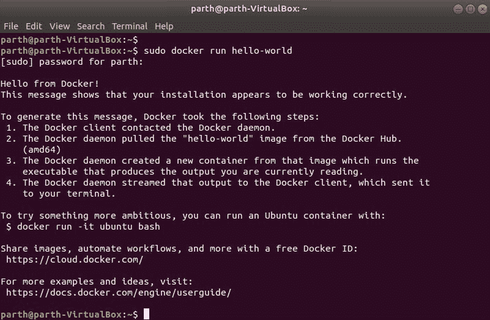
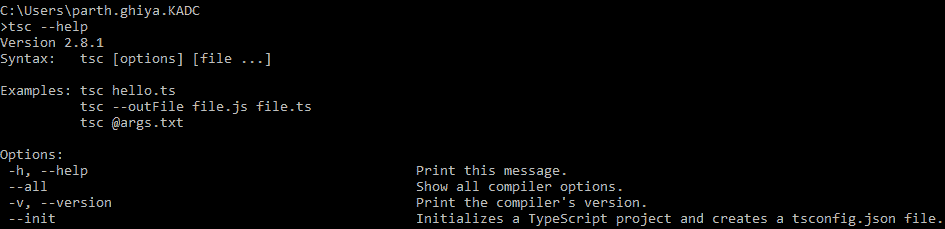
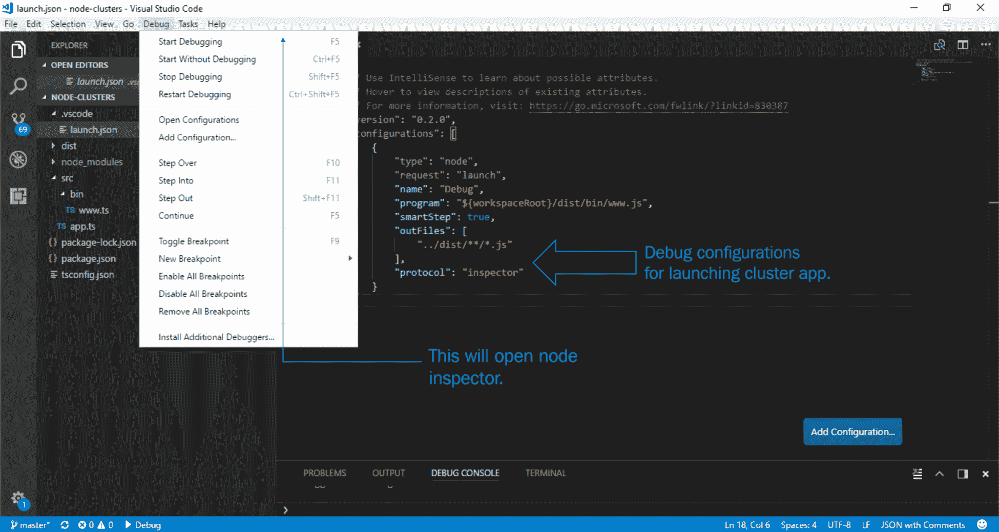
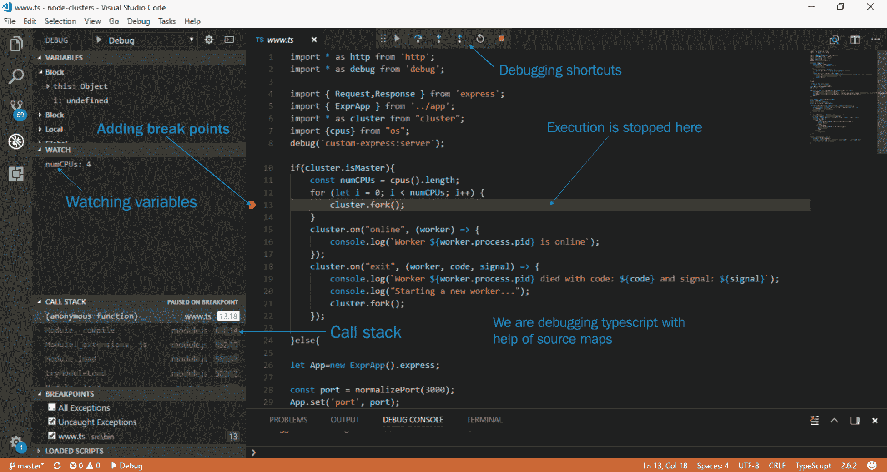
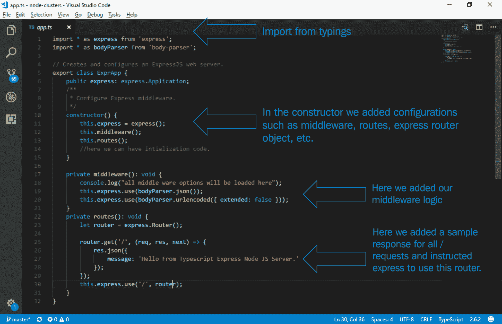
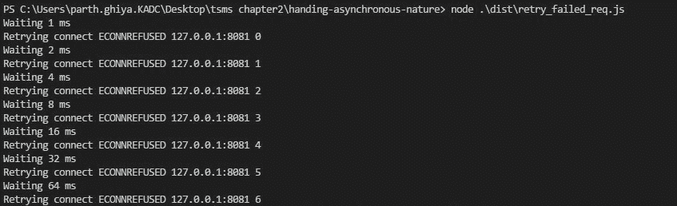
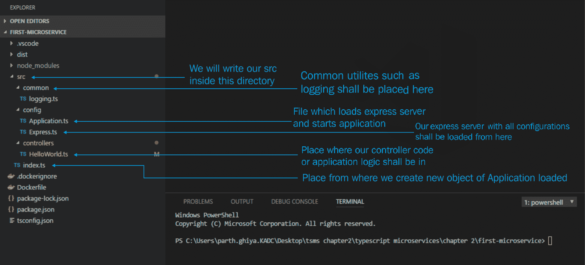
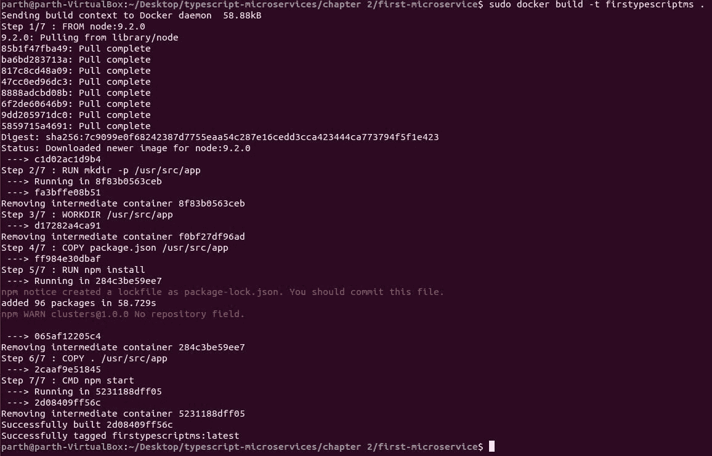

# 第二章：为旅程做好准备

在学习了关于微服务的理论之后，我们现在将转向实际实现。本章将为前进的旅程奠定基础，并重新审视对本书至关重要的 Node.js 和 TypeScript 概念。它将告诉您关于这两种语言的趋势和采纳率。我们将通过所有必需的安装，并准备好我们的开发环境。我们将通过实现传统的`Hello World`微服务来测试开发环境。在本章中，我们将重点关注以下主题：

+   **设置主要开发环境**：我们将设置一个带有所有必需先决条件的主要环境。我们将了解微服务开发所需的所有方面。

+   **TypeScript 入门**：在本节中，我们将介绍一些我们将在整本书中使用的主要 TypeScript 主题。我们将证明在 Node.js 中使用 TypeScript 作为我们的语言，并了解如何使用 TypeScript 和 Node.js 编写应用程序。

+   **Node.js 入门**：在本节中，我们将介绍一些高级的 Node.js 主题，如 Node.js 中的集群、最近引入的 async/await 等。我们将了解事件循环，并简要介绍 Node 流和 Node.js 的最新趋势。

+   **微服务实现**：我们将编写一个`Hello World`微服务，该微服务将使用我们的开发环境。

# 设置主要环境

在这一部分，我们将设置我们前进旅程所需的环境。您已经全局安装了 Node.js 和 TypeScript。在撰写本文时，Node.js 的可用版本是**9.2.0**，TypeScript 的版本是**2.6.2**。

# Visual Studio Code（VS Code）

**VS Code**是目前最好的 TypeScript 编辑器之一。默认情况下，VS Code TypeScript 会显示有关不正确代码的警告，这有助于我们编写更好的代码。VS Code 提供了 Linter、调试、构建问题、错误等功能。它支持 JSDoc、sourcemaps、为生成的文件设置不同的输出文件、隐藏派生的 JavaScript 文件等。它支持自动导入，直接生成方法骨架，就像 Java 开发人员的 Eclipse 一样。它还提供了版本控制系统的选项。因此，它将是我们作为 IDE 的首选。您可以从[`code.visualstudio.com/download`](https://code.visualstudio.com/download)下载它。

在 Windows 上安装它是最简单的，因为它是一个`.exe`文件，您只需选择一个路径并按照步骤操作即可。在 Unix/Ubuntu 机器上安装它涉及下载`deb`文件，然后执行以下命令行：

```ts
sudo dpkg -i <file>.deb
sudo apt-get install -f # Install dependencies
```

一旦 VS Code 可用，打开扩展并下载[`marketplace.visualstudio.com/items?itemName=pmneo.tsimporter`](https://marketplace.visualstudio.com/items?itemName=pmneo.tsimporter)和[`marketplace.visualstudio.com/items?itemName=steoates.autoimport`](https://marketplace.visualstudio.com/items?itemName=steoates.autoimport)。我们将使用这些扩展的优势，这将有助于轻松管理代码、预构建骨架等。

# PM2

它是 Node.js 的高级处理器管理器。Node.js 是单线程的，需要一些附加工具来进行服务器管理，如重新启动服务器、内存管理、多进程管理等。它有一个内置的负载均衡器，并允许您使应用程序永久运行。它具有零停机时间和其他简化生活的系统管理选项。它还作为一个模块暴露出来，因此我们可以在 Node.js 应用程序的任何阶段运行时触发各种选项。要安装 PM2，请打开终端并输入以下命令：

```ts
npm install pm2 -g
```

更详细的选项和 API 可以在[`pm2.keymetrics.io/docs/usage/pm2-api/`](http://pm2.keymetrics.io/docs/usage/pm2-api/)找到。

# NGINX

**NGINX**是最受欢迎的 Web 服务器之一。它可以用作负载均衡器、HTTP 缓存、反向代理和减震器。它具有处理超过 10,000 个同时连接的能力，占用空间非常小（大约每 10,000 个非活动连接占用 2.5 MB [`en.wikipedia.org/wiki/HTTP_persistent_connection`](https://en.wikipedia.org/wiki/HTTP_persistent_connection)）。它专门设计用来克服 Apache。它大约可以处理比 Apache 多四倍的每秒请求。NGINX 可以以各种方式使用，例如以下方式：

+   独立部署

+   作为 Apache 的前端代理，充当网络卸载设备

+   充当减震器，防止服务器突然出现的流量激增或慢的互联网连接

它是我们微服务应用程序的完美选择，因为容器化的微服务应用程序需要一个前端，能够隐藏和处理其后运行的应用程序的复杂和不断变化的特性。它执行一些重要的功能，如将 HTTP 请求转发到不同的应用程序，减震保护，路由，日志记录，Gzip 压缩，零停机时间，缓存，可伸缩性和容错性。因此，它是我们理想的应用交付平台。让我们开始 NGINX 101。

从这个网站[`nginx.org/en/download.html`](http://nginx.org/en/download.html)下载最新版本，根据你的操作系统。在撰写本文时，主线版本是**1.13.7**。

解压后，您可以按照以下方式简单地启动 NGINX：

```ts
start nginx
```

要检查 NGINX 是否启动，可以在 Windows 中输入以下命令：

```ts
tasklist /fi "imagename eq nginx.exe"
```

在 Linux 的情况下，您可以使用以下命令行：

```ts
ps waux | grep nginx
```

以下是其他有用的 NGINX 命令：

| `nginx -s stop` | 快速关闭 |
| --- | --- |
| `nginx -s quit` | 优雅关闭 |
| `nginx -s reload` | 更改配置，使用新配置启动新的工作进程，并优雅地关闭旧的工作进程 |
| `nginx -s reopen` | 重新打开日志文件 |

# Docker

**Docker**是一个开源平台，用于开发、发布和运行应用程序，其主要优势是将应用程序与基础架构分离，因此您可以轻松快速地适应重大变化。Docker 提倡容器的理念。**容器**是任何配置图像的可运行实例。容器与其他容器和主机完全隔离。这非常类似于我们的微服务理念。当我们进行部署时，我们将更详细地了解 Docker。让我们在系统上安装 Docker。

Windows 的 Docker 需要 Windows 10 专业版和 Hyper-V。因此，作为一个普遍可用的替代方案，我们将选择 Linux。Windows 用户可以下载 Oracle VM VirtualBox，下载任何 Linux 镜像，然后按照相同的过程进行。请按照这里给出的步骤进行操作：[`docs.docker.com/engine/installation/linux/docker-ce/ubuntu/`](https://docs.docker.com/engine/installation/linux/docker-ce/ubuntu/)。

要检查安装情况，请输入以下命令：

```ts
sudo docker run hello-world
```

您应该看到如下输出：



Docker 安装

# TypeScript 入门

**TypeScript**起源于 JavaScript 开发中的缺陷，随着将 JavaScript 用于大规模应用的出现。TypeScript 引入了一个 JavaScript 编译器，具有语法语言扩展的预设、基于类的编程和将扩展转换为常规 JavaScript 的方法。TypeScript 因引入了 JavaScript 的类型安全而变得极为流行，而 JavaScript 恰好是最灵活的语言之一。这使 JavaScript 成为了一种更面向对象和编译安全的语言。TypeScript 更像是 ES 标准的超集，它使开发人员能够编写更清晰、易于重构和可升级的代码。在本节中，我们将介绍 TypeScript 的各种主要主题，这对我们未来的旅程至关重要。TypeScript 是带有类型注释的 JavaScript。TypeScript 具有一个转译器和类型检查器，如果类型不匹配，则会抛出错误，并将 TypeScript 代码转换为 JavaScript 代码。我们将简要介绍以下主题，这些主题基本上将帮助我们编写 TypeScript 中的 Node.js：

+   理解`tsconfig.json`

+   理解类型

+   在 Node.js 中调试 TypeScript

# 理解 tsconfig.json

添加`tsconfig.json`文件表示有一个 TypeScript 项目的目录，并且需要一个配置文件来将 TypeScript 编译成 JavaScript。您可以使用`tsc`命令将 TypeScript 编译成 JavaScript。调用它，编译器会搜索在`tsconfig.json`中加载的配置。您可以指定对整个项目（从当前目录到父目录）的编译，或者您可以为特定项目指定`tsc`。您可以使用以下命令找到所有可能的选项：

```ts
tsc --help 
```

让我们看看这个命令做了什么：



tsc 帮助命令

截至撰写时，TypeScript 的版本为**2.6.2**，所有上下文都将基于相同的版本进行。如果您没有更新的版本，请运行以下命令：

`npm uninstall typescript -g`

`npm install typescript@latest -g`

现在让我们看一下示例`tsconfig.json`文件和所有可用的选项：

```ts
{ 
   "compilerOptions":{ 
      "target":"es6",
      "moduleResolution":"node",
      "module":"commonjs",
      "declaration":false,
      "noLib":false,
      "emitDecoratorMetadata":true,
      "experimentalDecorators":true,
      "sourceMap":true,
      "pretty":true,
      "allowUnreachableCode":true,
      "allowUnusedLabels":true,
      "noImplicitAny":true,
      "noImplicitReturns":false,
      "noImplicitUseStrict":false,
      "outDir":"dist/",
      "baseUrl":"src/",
      "listFiles":false,
      "noEmitHelpers":true
   },
   "include":[ 
      "src/**/*"
   ],
   "exclude":[ 
      "node_modules"
   ],
   "compileOnSave":false
}
```

现在让我们解析这个文件，并了解最常用的选项。

# compilerOptions

这里提到了编译项目所需的所有设置。可以在此网站找到所有编译器选项的详细列表，以及默认值：[`www.typescriptlang.org/docs/handbook/compiler-options.html`](https://www.typescriptlang.org/docs/handbook/compiler-options.html)。如果我们不指定此选项，那么将选择默认值。这是我们指示 TypeScript 如何处理各种事物的文件，例如各种装饰器、支持 JSX 文件和转译纯 JavaScript 文件。以下是一些最常用的选项，我们可以根据前面的示例代码了解：

| `noImplicitAny` | 这告诉`tsc`编译器，如果发现变量声明具有接受任何类型的声明，但缺少任何类型的显式类型定义，则会发出警告。 |
| --- | --- |
| `experimentalDecorators` | 此选项启用在 TypeScript 项目中使用装饰器。ES 尚未引入装饰器，因此默认情况下它们是禁用的。装饰器是可以附加到类声明、方法、访问器、属性或参数的任何声明。使用装饰器简化了编程。 |
| `emitDecoratorMetaData` | TypeScript 支持为具有装饰器的任何声明发出某些类型的元数据。要启用此选项，必须在`tsconfig.json`中将其设置为 true。 |
| `watch` | 此选项更像是`livereload`；每当源文件中的任何文件更改时，编译过程将重新触发，以再次生成转译文件。 |
| `reflect-metadata` | 它保留对象元数据中的类型信息。 |
| `module` | 这是输出模块类型。Node.js 使用 CommonJS，所以模块中有 CommonJS。 |
| `target` | 我们正在针对的输出预设；Node.js 使用 ES6，所以我们使用 ES6。 |
| `moduleResolution` | 此选项将告诉 TypeScript 使用哪种解析策略。Node.js 用户需要一个模块策略，因此 TypeScript 使用此行为来解析这些依赖项。 |
| `sourceMap` | 这告诉 TypeScript 生成源映射，可以像调试 JavaScript 一样轻松地用于调试 TypeScript。 |
| `outDir` | 应该保存转换后文件的位置。 |
| `baseUrl` 和 `paths` | 指导 TypeScript 在哪里可以找到类型文件。我们基本上告诉 TypeScript 对于每个（`*`）在 `.ts` 文件中找到的内容，它需要在文件位置 `<base_url> + src/types/*` 中查找。 |

# 包括和排除

在这里，我们定义了项目的上下文。它基本上采用了一个需要包含在编译路径中的全局模式数组。您可以包含或排除一组全局模式，以添加或删除文件到转换过程中。请注意，这不是最终值；还有属性文件，它们接受文件名数组，并覆盖包含和排除。

# extends

如果我们想要扩展任何基本配置，那么我们可以使用此选项并指定它必须扩展的文件路径。您可以在 [`json.schemastore.org/tsconfig`](http://json.schemastore.org/tsconfig) 找到 `tsconfig.json` 的完整模式。

# 理解类型

如果我们想要有效地和全局地使用 TypeScript，TypeScript 需要跨越其他 JavaScript 库。TypeScript 使用 `.d.ts` 文件来提供未在 ES6 或 TypeScript 中编写的 JavaScript 库的类型。一旦定义了 `.d.ts` 文件，就可以很容易地看到返回类型并提供简单的类型检查。TypeScript 社区非常活跃，并为大多数文件提供类型：[`github.com/DefinitelyTyped/DefinitelyTyped/tree/master/types`](https://github.com/DefinitelyTyped/DefinitelyTyped/tree/master/types)。

重新审视我们的 `tsconfig.json` 文件，我们已经指定了选项 `noImplicitAny: true`，并且我们需要为我们使用的任何库都有一个强制的 `*.d.ts` 文件。如果将该选项设置为 false，`tsc` 将不会给出任何错误，但这绝对不是推荐的做法。为我们使用的每个库都有一个 `index.d.ts` 文件是标准做法之一。我们将看看各种主题，比如如何安装类型，如果类型不可用怎么办，如何生成类型，以及类型的一般流程是什么。

# 从 DefinitelyTyped 安装类型

任何库的类型都将是一个 `dev` 依赖项，您只需从 `npm` 安装它。以下命令安装 express 类型：

```ts
npm install --save-dev @types/express
```

此命令将下载 express 类型到 `@types` 文件夹，并且 TypeScript 会在 `@types` 文件夹中查找以解析该类型的映射。由于我们只在开发时需要它，所以我们添加了 `--save-dev` 选项。

# 编写自己的类型

许多时候，我们可能需要编写自己的 `.d.ts` 文件，以便有效地使用 TypeScript。我们将看看如何生成我们自己的类型，并指导 TypeScript 从哪里找到这些类型。我们将使用自动化工具，并学习如何手动编写我们自己的 `.d.ts` 文件，然后告诉 TypeScript 在哪里找到自定义类型的位置。

# 使用 dts-gen 工具

这是微软提供的一个开源实用工具。我们将使用它为任何项目生成我们的类型。作为管理员启动终端，或者使用 `sudo su -` 并输入以下内容：

```ts
npm install -g dts-gen
```

对于所有全局模块，我们将在 Windows 上使用命令提示符作为管理员，而在 Linux/Mac 上，我们将使用 root 用户或 `sudo su -`。

我们将使用一个全局可用的模块并生成其类型。安装 `lusca` 并使用以下命令生成其类型：

```ts
dts-gen -m lusca
```

你应该看到输出，比如`Wrote 83 Lines to lusca.d.ts`，当你检查时，你可以看到所有的方法声明，就像一个接口一样。

# 编写你自己的*.d.ts 文件

当你编写自己的`*.d.ts`文件时，风险非常高。让我们为任何模块创建我们自己的`*.d.ts`文件。比如我们想为`my-custom-library`编写一个模块：

1.  创建一个名为`my-custom-library.d.ts`的空文件，并在其中写入以下内容：

```ts
declare module my-library
```

这将使编译器静音，不会抛出任何错误。

1.  接下来，你需要在那里定义所有的方法以及每个方法期望的返回类型。你可以在这里找到几个模板：[`www.typescriptlang.org/docs/handbook/declaration-files/templates.html`](http://www.typescriptlang.org/docs/handbook/declaration-files/templates.html)。在这里，我们需要定义可用的方法以及它们的返回值。例如，看一下以下代码片段：

```ts
declare function myFunction1(a: string): string; 
declare function myFunction2(a: number): number;
```

# 调试

下一个重要的问题是如何调试返回 TypeScript 的 Node.js 应用程序。调试 JavaScript 很容易，为了提供相同的体验，TypeScript 有一个名为**sourcemaps**的功能。当 TypeScript 中启用 sourcemaps 时，它允许我们在 TypeScript 代码中设置断点，当命中等效的 JavaScript 行时会暂停。sourcemaps 的唯一目的是将生成的源映射到生成它的原始源。我们将简要看一下在我们的编辑器 VS Code 中调试 Node.js 和 TypeScript 应用程序。

首先，我们需要启用 sourcemaps。首先，我们需要确保 TypeScript 已启用 sourcemaps 生成。打开你的`tsconfig.json`文件，并写入以下内容：

```ts
"compilerOptions":{
    "sourceMap": true  
}
```

现在当你转译你的项目时，你会在生成的每个 JavaScript 文件旁边看到一个`.js.map`文件。

接下来要做的是配置 VS Code 进行调试。创建一个名为`.vscode`的文件夹，并添加一个名为`launch.json`的文件。这与使用`node-inspector`非常相似。我们将调试`node-clusters`项目，你可以在源代码中找到。在 VS Code 中打开该项目；如果没有`dist`文件夹，则在主级别执行`tsc`命令生成一个分发，这将创建`dist`文件夹。

接下来，创建一个名为`.vscode`的文件夹，在其中创建一个名为`launch.json`的文件，并进行以下配置：



VS Code 调试

当你点击开始调试时，会出现以下屏幕。看一下屏幕，其中有关调试点的详细描述：



VS 调试器

# Node.js 入门

Node.js 经过多年的发展，现在已成为任何想要拥抱微服务的人的首选技术。Node.js 是为了解决大规模 I/O 扩展问题而创建的，当应用于我们的微服务设计时，将会产生一种天作之合。Node.js 的包管理器比 Maven、RubyGems 和 NuGet 拥有更多的模块，可以直接使用并节省大量的生产时间。异步性质、事件驱动 I/O 和非阻塞模式等特性使其成为创建高端、高效性能、实时应用程序的最佳解决方案之一。当应用于微服务时，它将能够处理极大量的负载，响应时间低，基础设施低。让我们来看一下 Node.js 和微服务的成功案例之一。

**PayPal**看到 Node.js 的趋势，决定在他们的账户概览页面使用 Node.js。他们对以下结果感到困惑：

+   Node.js 应用程序开发的速度是 Java 开发的两倍，而且人手更少

+   代码的**行数**（**LOC**）减少了 33%，文件减少了 40%

+   单核 Node.js 应用程序处理的请求每秒是五核 Java 应用程序设置的两倍

Netflix、GoDaddy、Walmart 等许多公司都有类似的故事。

让我们看一些对 Node.js 开发至关重要的主要和有用的概念，这些概念将贯穿我们的旅程。我们将涉及各种主题，如事件循环、如何实现集群、异步基础知识等。

# 事件循环

由于 Node.js 的单线程设计，它被认为是最复杂的架构之一。作为完全事件驱动的，理解事件循环对于掌握 Node.js 至关重要。Node.js 被设计为一个基于事件的平台，这意味着在 Node.js 中发生的任何事情都只是对事件的反应。在 Node.js 中进行的任何操作都会经过一系列的回调。完整的逻辑被开发人员抽象出来，并由一个名为`libuv`的库处理。在本节中，我们将对事件循环有一个全面的了解，包括它的工作原理、常见误解、各种阶段等。

以下是关于事件循环的一些常见谬误以及实际工作的简要介绍：

+   **谬误#1—事件循环在与用户代码不同的线程中工作**：有两个线程，一个是用户相关代码或用户相关操作运行的父线程，另一个是事件循环代码运行的线程。任何时候执行操作，父线程将工作传递给子线程，一旦子线程操作完成，就会通知主线程执行回调：

+   **事实**：Node.js 是单线程的，一切都在单个线程内运行。事件循环维护回调的执行。

+   **谬误#2—线程池处理异步事件**：所有异步操作，如回调到数据库返回的数据，读取文件流数据和 WebSockets 流，都会从`libuv`维护的线程池中卸载：

+   **事实**：`libuv`库确实创建了一个包含四个线程的线程池来传递异步工作，但今天的操作系统已经提供了这样的接口。因此，作为一个黄金法则，`libuv`将使用这些异步接口而不是线程池。线程池只会被用作最后的选择。

+   **谬误#3—事件循环像 CPU 一样维护操作的堆栈或队列**：事件循环按照*FIFO 规则*维护一系列异步任务的队列，并执行队列中维护的定义的回调：

+   **事实**：虽然`libuv`中涉及类似队列的结构，但回调并不是通过堆栈处理的。事件循环更像是一个阶段执行器，任务以循环方式处理。

# 理解事件循环

现在我们已经排除了关于 Node.js 中事件循环的基本误解，让我们详细了解事件循环的工作原理以及事件循环阶段执行周期中的所有阶段。Node.js 在以下阶段处理环境中发生的所有事情：

+   **定时器**：这是所有`setTimeout()`和`setInterval()`回调被执行的阶段。这个阶段会尽早运行，因为它必须在调用函数中指定的时间间隔内执行。当定时器被安排时，只要定时器是活动的，Node.js 事件循环将继续运行。

+   **I/O 回调**：除了定时器、关闭连接事件、`setImmediate()`之外，大多数常见的回调都在这里执行。I/O 请求既可以是阻塞的，也可以是非阻塞的。它执行更多的事情，比如连接错误，无法连接到数据库等。

+   **轮询**：当阈值已经过去时，这个阶段执行定时器的脚本。它处理轮询队列中维护的事件。如果轮询队列不为空，事件循环将同步迭代整个队列，直到队列为空或系统达到硬峰值大小。如果轮询队列为空，事件循环将继续下一个阶段——检查并执行那些定时器。如果没有定时器，轮询队列是空闲的，它将等待下一个回调并立即执行它。

+   **检查**：当轮询阶段处于空闲状态时，将执行检查阶段。现在将执行使用`setImmediate()`排队的脚本。`setImmediate()`是一个特殊的计时器，它使用`libuv` API，并且安排在轮询阶段之后执行回调。它被设计成在轮询阶段之后执行。

+   **关闭回调**：当任何句柄、套接字或连接突然关闭时，将在此阶段发出关闭事件，例如`socket.destroy()`，连接`close()`，也就是说，所有(`close`)事件回调都在此处处理。虽然不是事件循环的技术部分，但另外两个主要阶段是`nextTickQueue`和其他微任务队列。`nextTickQueue`在当前操作完成后处理，不管事件循环的阶段如何。它会立即触发，在调用它的同一阶段，并且独立于所有阶段。`nextTick` 函数可以包含任何任务，它们只是按照以下方式调用：

```ts
process.nextTick(() => {
  console.log('next Tick')
})
```

接下来重要的部分是微任务和宏任务。`NextTickQueue`的优先级高于微任务和宏任务。任何在`nextTickQueue`中的任务都将首先执行。微任务包括已解决的 promise 回调等函数。一些微任务的例子可以是`promise.resolve`，`Object.resolve`。这里有一个有趣的地方要注意，原生 promise 只属于微任务。如果我们使用`q`或`bluebird`等库，我们会看到它们首先被解决。

# Node.js 集群和多线程

任何 Node.js 实例都在单个线程中运行。如果发生任何错误，线程会中断，服务器会停止，你需要重新启动服务器。为了利用系统中所有可用的核心，Node.js 提供了启动一组 Node.js 进程的选项，以便负载均衡。有许多可用的工具可以做同样的事情。我们将看一个基本的例子，然后学习关于**PM2**这样的自动化工具。让我们开始吧：

1.  第一步是创建一个 express 服务器。我们需要`express`，`debug`，`body-parser`和`cookie-parser`。打开终端并输入以下命令：

```ts
npm install body-parser cookie-parser debug express typescript --save
```

1.  接下来，我们下载这些模块的类型：

```ts
npm install @types/debug @types/node @types/body-parser @types/express
```

1.  然后，我们创建我们的`app.ts`和`www.ts`文件。构建你的`app.ts`文件如下：



表达 TypeScript 的方式

1.  对于`www.ts`，我们将使用`cluster`模块，并创建可用作核心数量的工作进程。我们的逻辑将分为以下几部分：

```ts
import * as cluster from "cluster";
import { cpus } from "os";
if (cluster.isMaster) {
  /* create multiple workers here cpus().length will give me number of   cores available
  */
  cluster.on("online", (worker) => { /*logic when worker becomes online*/ });
  cluster.on("exit", (worker) => { /*logic when worker becomes online*/ });
} else {
  //our app intialization logic 
}
```

1.  现在当我们转译源代码并运行`www.js`时，我们会看到多个工作进程在线。

完整的文件可以在`node-clusters/src/bin/www.ts`中找到。去运行应用程序。现在你应该看到多个工作进程在线了。

另一种方法是使用*PM2* ([`www.npmjs.com/package/pm2`](https://www.npmjs.com/package/pm2))。PM2 有各种选项，如`livereload`，零停机重新加载和集群启动模式。PM2 中可用的一些示例命令如下：

| `pm2 start www.js -i 4` | 在集群模式下启动应用程序的四个实例。它将平衡负载到每个节点。 |
| --- | --- |
| `pm2 reload www.js` | 重新加载`www.js`并进行零停机时间。 |
| `pm2 scale www.js 10` | 将集群应用程序扩展到 10 个进程。 |

# 异步/等待

由于 JavaScript 是异步的，一旦一个进程完成，就很难维护任务的执行。曾经以回调开始，很快就转向了 promises、async 模块、生成器和 yield，以及 async 和 await。让我们从 async/await 101 开始：

+   异步/等待是编写异步代码的现代方式之一

+   建立在 promise 之上，不能与普通回调或 Node promises 一起使用

+   异步/等待是非阻塞代码，尽管它看起来是同步的，这是它的主要优势

+   基于`node-fibers`，它是轻量级的，并且对 TypeScript 友好，因为类型已嵌入其中

现在让我们看一下 async/await 的实际实现。曾经作为巨大的回调地狱和嵌套的`.then()`链的东西现在可以简化为以下内容：

```ts
let asyncReq1=await axios.get('https://jsonplaceholder.typicode.com/posts/1');
console.log(asyncReq1.data);
let asyncReq2=await axios.get('https://jsonplaceholder.typicode.com/posts/1');
console.log(asyncReq2.data);
```

现在我们将研究两种常见的 async/await 设计模式。

# 重试失败的请求

通常，我们在系统中添加安全或重试请求，以确保如果服务返回错误，我们可以在服务暂时关闭时重试服务。在此示例中，我们有效地使用了异步/等待模式作为指数重试参数，即 1、2、4、8 和 16 秒后重试。可以在源代码中的`retry_failed_req.ts`中找到一个工作示例：

```ts
wait(timeout: number){
  return new Promise((resolve) => {
    setTimeout(() => {
      resolve()
    }, timeout)
  })
 } 
async requestWithRetry(url: string){
  const MAX_RETRIES = 10;
  for (let i = 0; i <= MAX_RETRIES; i++) {
    try { return await axios.get(url); }
    catch (err) {
      const timeout = Math.pow(2, i);
      console.log('Waiting', timeout, 'ms');
      await this.wait(timeout);
      console.log('Retrying', err.message, i);
    }
  }
}
```

您将看到以下输出：



指数重试请求

# 并行多个请求

使用 async/await 执行多个并行请求变得非常简单。在这里，我们可以同时执行多个异步任务，并在不同的地方使用它们的值。完整的源代码可以在`src`中的`multiple_parallel.ts`中找到：

```ts
async function executeParallelAsyncTasks() {
  const [valueA, valueB, valueC] = await
    Promise.all([
            await axios.get('https://jsonplaceholder.typicode.com/posts/1')
            await axios.get('https://jsonplaceholder.typicode.com/posts/2'),
            await axios.get('https://jsonplaceholder.typicode.com/posts/3')])
            console.log("first response is ", valueA.data);
            console.log(" second response is ", valueB.data);
            console.log("third response is ", valueC.data);
      }
```

# 流

简而言之，**流**是 Node.js 中用于连续流式传输数据的抽象接口。流可以是从源头不断传输数据到目的地的数据序列。源头可以是任何东西——5000 万条记录的数据库，大小为 4.5GB 的文件，一些 HTTP 调用等等。流不是一次性全部可用的；它们不适合内存，它们只是一次传输一些数据块。流不仅用于处理大文件或大量数据，而且它们通过管道和链接提供了一个很好的组合选项。流是响应式编程的一种方式，我们将在下一章中更详细地讨论。Node.js 中有四种流可用：

+   **可读流**：只能从中读取数据的流；也就是说，这里只能消耗数据。可读流的示例可以是客户端上的 HTTP 响应、`zlib`流和`fs`读取流。该流中的任何阶段的数据都处于流动状态或暂停状态。在任何可读流上，可以附加各种事件，如数据、错误、结束和可读。

+   **可写流**：可以写入数据的流。例如，`fs.createWriteStream()`。

+   **双工流**：可读可写的流。例如，`net.socket`或 TCP 套接字。

+   **转换流**：基本上是一个双工流，可以在写入或读取数据时用于转换数据。例如，`zlib.createGzip`是用于使用 gzip 压缩大量数据的流之一。

现在，让我们通过一个示例来了解流的工作原理。我们将创建一个自定义的`Transform`流，并扩展`Transform`类，从而一次看到读取、写入和转换操作。在这里，转换流的输出将从其输入中计算出来：

+   **问题**：我们有用户的信息，我们想隐藏敏感部分，如电子邮件地址、电话号码等。

+   **解决方案**：我们将创建一个转换流。转换流将读取数据并通过删除敏感信息来进行转换。所以，让我们开始编码。创建一个空项目，使用`npm init`，添加一个文件夹`src`和之前部分的`tsconfig.json`文件。现在，我们将从`DefinitelyTyped`中添加 Node.js 类型。打开终端并输入以下内容：

```ts
npm install @types/node --only=dev
```

现在，我们将编写我们自定义的过滤器转换流。创建一个`filter_stream.ts`文件，在其中编写转换逻辑：

```ts
import { Transform } from "stream";
export class FilterTransform extends Transform {
  private filterProps: Array<String>;
  constructor(filterprops: Array<String>, options?: any) {
    if (!options) options = {};
    options.objectMode = true;
    super(options);
    this.filterProps = filterprops;
  }
  _transform(chunk: any, encoding?: string, callback?: Function) {
    let filteredKeys = Object.keys(chunk).filter((key) => {
      return this.filterProps.indexOf(key) == -1;
    });
    let filteredObj = filteredKeys.reduce((accum: any, key: any) => {
    accum[key] = chunk[key];
      return accum;
    }, {})
    this.push(filteredObj);
    callback();
  }
  _flush(cb: Function) {
    console.log("this method is called at the end of all transformations");
  }
}
```

我们刚刚做了什么？

+   我们创建了一个自定义的转换并导出它，这样它可以在其他文件中的任何地方使用。

+   如果构造函数中的选项不是必需的，我们可以创建默认选项。

+   默认情况下，流期望缓冲区/字符串值。有一个`objectMode`标志，我们必须在流中设置它，以便它可以接受任何 JavaScript 对象，这是我们在构造函数中做的。

+   我们重写了 transform 方法以适应我们的需求。在 transform 方法中，我们删除了在过滤选项中传递的那些键，并创建了一个经过过滤的对象。

接下来，我们将创建一个过滤器流的对象，以测试我们的结果。并行创建一个名为`stream_test.ts`的文件，添加以下内容：

```ts
import { FilterTransform } from "./filter_stream";
//we create object of our custom transformation & pass phone and email as sensitive properties
let filter = new FilterTransform(['phone', 'email']);
//create a readable stream that reads the transformed objects.
filter.on('readable', function () { console.log("Transformation:-", filter.read()); });
//create a writable stream that writes data to get it transformed
filter.write({ name: 'Parth', phone: 'xxxxx-xxxxx', email: 'ghiya.parth@gmail.com', id: 1 });
filter.write({ name: 'Dhruvil', phone: 'xxxxx-xxxxx', email: 'dhruvil.thaker@gmail.com', id: 2 });
filter.write({ name: 'Dhaval', phone: 'xxxxx-xxxxx', email: 'dhaval.marthak@gmail.com', id: 3 });
filter.write({ name: 'Shruti', phone: 'xxxxx-xxxxx', email: 'shruti.patel@gmail.com', id: 4 });
filter.end();
```

打开您的`package.json`文件，并在`scripts`标签中添加`"start":"tsc && node .\\dist\\stream_test.js"`。现在当您运行`npm start`时，您将能够看到转换后的输出。

请注意，如果您使用的是 Linux/macOS，请用`//`替换`\\`。

# 编写您的第一个 Hello World 微服务

让我们从编写我们的第一个微服务开始。基于之前的主题，我们将使用最佳实践和广泛使用的`node_modules`构建我们的第一个微服务。我们将使用：

| **CORS** ([`www.npmjs.com/package/cors`](https://www.npmjs.com/package/cors)) | 添加 CORS 标头，以便跨应用程序可以访问它。 |
| --- | --- |
| **Routing Controllers** ([`www.npmjs.com/package/routing-controllers`](https://www.npmjs.com/package/routing-controllers)) | 此模块提供了美丽的装饰器，帮助我们轻松编写 API 和路由。 |
| **Winston** ([`www.npmjs.com/package/winston`](https://www.npmjs.com/package/winston)) | 具有许多高级功能的完美日志记录模块。 |

因此，打开终端并创建一个带有默认`package.json`的 Node 项目。按照以下步骤进行。可在提取源中的`first-microservice`文件夹中找到用于参考的完整源代码：

1.  首先，我们将下载前面的依赖项和基本的 express 依赖项。输入以下命令行：

```ts
npm install body-parser config cookie-parser cors debug express reflect-metadata rimraf routing-controllers typescript winston --save
```

1.  按照以下方式下载必要模块的类型：

```ts
npm install @types/cors @types/config @types/debug @types/node @types/body-parser @types/express @types/winston --only=dev
```

1.  现在，我们将创建我们的应用程序结构，如下截图所示：



文件夹结构

1.  因此，让我们创建我们的 express 文件，并使用`routing_controllers`模块进行配置。创建一个 express 配置类，并指示它使用我们的目录控制器作为可以找到路由的源：

```ts
export class ExpressConfig {
  app: express.Express;
  constructor() {
    this.app = express();
    this.app.use(cors());
    this.app.use(bodyParser.json());
    this.app.use(bodyParser.urlencoded({ extended: false }));
    this.setUpControllers();
  }
  setUpControllers() {
    const controllersPath = path.resolve('dist', 'controllers');
    /*useExpressServer has lots of options, can be viewed at node_modules\routing-controllers\RoutingControllersOptions.d.ts*/
    useExpressServer(this.app, {
      controllers: [controllersPath + "/*.js"]
    }
    );
  }
}
```

1.  现在，让我们在`application.ts`中编写我们的应用程序启动逻辑：

```ts
export class Application {
  server: any; express: ExpressConfig;
  constructor() {
  this.express = new ExpressConfig();
    const port = 3000; this.server =
      this.express.app.listen(port, () => {
        logger.info(`Server Started! Express: http://localhost:${port}`);
      });
  }
}
```

1.  下一步是编写我们的控制器并返回 JSON：

```ts
@Controller('/hello-world')
export class HelloWorld {
  constructor() { }
  @Get('/')
  async get(): Promise<any> {
    return { "msg": "This is first Typescript Microservice" }
  }
}
```

1.  下一步是在`index.ts`中创建我们的`Application`文件的新对象：

```ts
'use strict';
/* reflect-metadata shim is required, requirement of routing-controllers module.*/
import 'reflect-metadata';
import { Application } from './config/Application';
export default new Application();
```

1.  您已经完成了；编译您的 TypeScript 并启动`index.ts`的转译版本。当您访问`localhost:3000/hello-world`时，您将看到 JSON 输出—`{"msg":"This is first Typescript Microservice"}`。

1.  为了在启动服务器时自动执行所有任务，我们在`package.json`中定义脚本。第一个脚本是始终在转译之前进行清理：

```ts
"clean":"node ./node_modules/rimraf/bin.js dist",
```

下一个脚本是使用`node`模块中可用的`typescript`版本构建 TypeScript：

```ts
"build":"node ./node_modules/typescript/bin/tsc"
```

最后一个基本上指示它清理、构建并通过执行`index.js`启动服务器：

```ts
"start": "npm run clean && npm run build && node ./dist/index.js".
```

1.  下一步是创建 Docker 构建。创建一个`Docker`文件，让我们编写 Docker 镜像脚本：

```ts
#LATEST NODE Version -which node version u will use.
FROM node:9.2.0
# Create app directory
RUN mkdir -p /usr/src/app
WORKDIR /usr/src/app
#install depedencies
COPY package.json /usr/src/app
RUN npm install
#bundle app src
COPY . /usr/src/app
CMD [ "npm" , "start" ]
```

1.  我们将在以后的章节中更详细地学习 Docker。现在，继续并输入以下命令：

```ts
sudo docker build -t firstypescriptms .
```

在构建镜像时，不要忘记命令的末尾加上点。点表示我们在本地目录中使用 Dockerfile。

您的 Docker 镜像将被构建。您将看到以下类似的输出：



Docker 创建镜像

1.  您可以使用`sudo docker images`命令来检查镜像，稍后您可以在任何地方使用它。要运行镜像，只需使用以下命令行：

```ts
sudo docker run -p 8080:3000 -d firstypescriptms:latest
```

1.  之后，您可以访问`localhost:8080/hello-world`来检查输出。

虽然我们只是暴露了 REST API，对外部世界来说，它只是 8080 端口上的另一个服务；内部实现对消费者来说是抽象的。这是 REST API 和微服务之间的主要区别之一。容器内的任何内容都可以随时更改。

# 总结

在本章中，我们首先介绍了一些 Node.js 和 TypeScript 的最基本概念，这些概念对于开发适合企业需求的可扩展应用程序至关重要。我们搭建了我们的主要环境，并学习了 Docker、PM2 和 NGINX。最后，我们用 Node.js 的 TypeScript 方式创建了我们传统的`Hello World`微服务。

在下一章中，我们将学习响应式编程的基本原理、响应式编程的优势，以及如何在 Node.js 中进行响应式编程。我们将了解响应式编程中提供的各种操作符，这些操作符可以简化我们日常开发工作。我们将结合传统的基于 SOA 的编排和响应式流程，通过各种情况来看看哪种方法适用于哪里。
