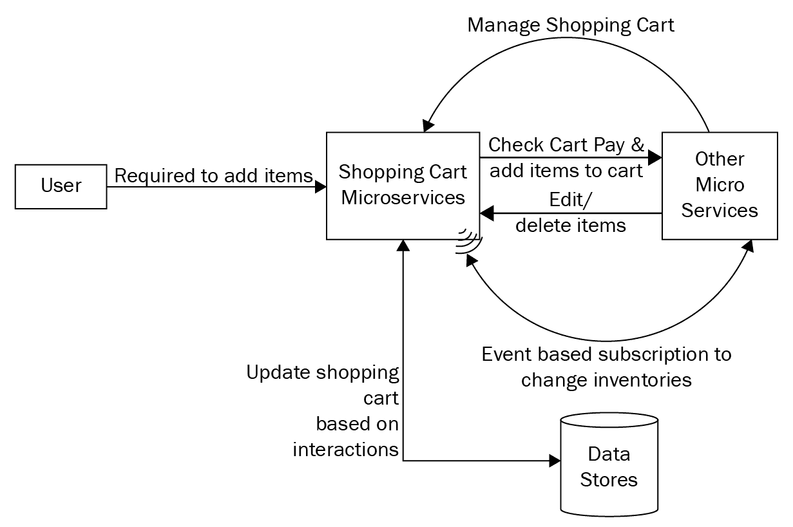
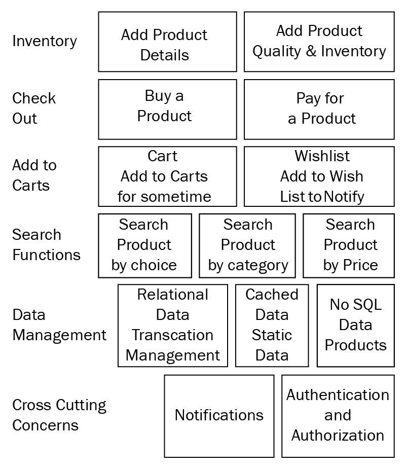
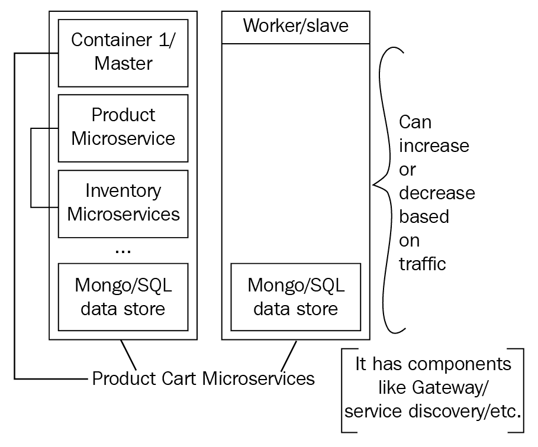
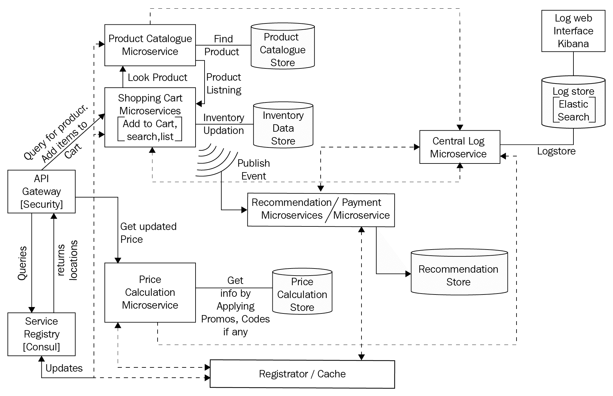
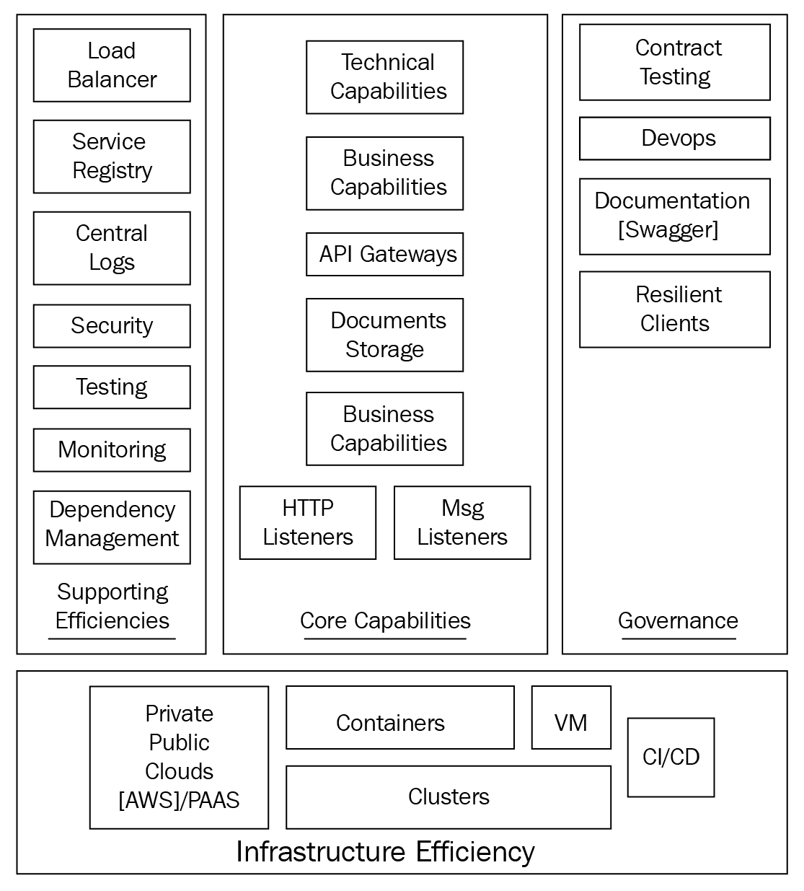
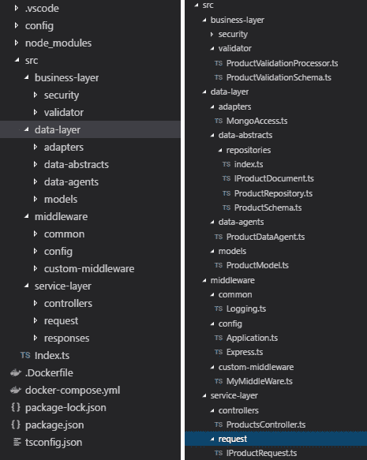
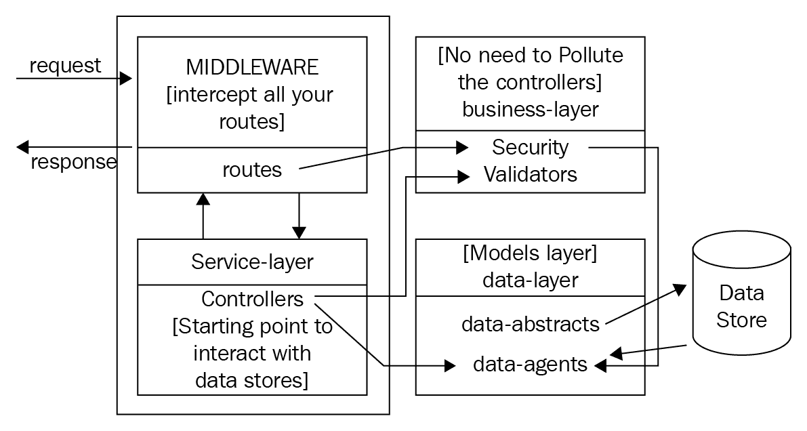

# 第四章：开始您的微服务之旅

微服务是企业中最具体的解决方案之一，可以快速、有效和可扩展地构建应用程序。然而，如果它们没有得到正确的设计或理解，错误的实施和解释可能导致灾难性或无法挽回的失败。本章将通过深入实际实施来开始我们的微服务之旅。

本章将以对购物微服务的描述开始，这是我们将在整个旅程中开发的微服务。我们将学习如何将系统切分为一组相互连接的微服务。我们将设计购物车微服务的整体架构，定义分层，添加缓存级别等。

本章将涵盖以下主题：

+   购物车微服务概述

+   购物车微服务的架构设计

+   购物车微服务的实施计划

+   模式设计和数据库选择

+   微服务前期开发方面

+   为购物车开发一些微服务

+   微服务设计最佳实践

# 购物车微服务概述

在处理新系统时最重要的方面就是它的设计。一个糟糕的初始设计总是导致更多挑战的主要原因。与其之后抱怨、解决错误或应用补丁来掩盖糟糕的设计，总是明智的不要急于通过设计过程，花足够的时间，并拥有一个灵活的防错设计。这只能通过清楚地理解需求来实现。在本节中，我们将简要概述购物车微服务；我们需要通过微服务解决的问题；以及业务流程、功能视图、部署和设计视图的概述。

# 业务流程概述

我们的场景用例非常简单明了。以下流程图显示了我们需要转换为微服务的端到端购物流程。用户将商品添加到购物车，更新库存，用户支付商品，然后可以结账。基于业务规则，涉及了几个验证。例如，如果用户的支付失败，那么他们就不应该能够结账；如果库存不可用，那么商品就不应该被添加到购物车等等。看一下以下流程图：



业务流程概述

# 功能视图

每个业务能力及其子能力都显示在一行中，这基本上构成了购物车微服务。一些子能力涉及到多个业务能力，因此我们需要管理一些横切关注点。例如，库存服务既用作独立流程，也用于用户结账产品。以下图显示了购物车微服务的功能视图：



功能视图

该图将业务能力结合成一张图片。例如，库存服务说明有两个子功能——添加产品详情和添加产品数量和库存项目。这总结了库存服务的目标。为我们的系统创建一个功能视图可以让我们清楚地了解所有涉及其中的业务流程和相关事项。

# 部署视图

部署的要求非常简单。根据需求，我们需要随时添加新的服务来支持各种业务能力。比如，现在支付方式是**PayPal**，但将来可能需要支持一些本地支付选项，比如银行钱包。那时，我们应该能够轻松地添加新的微服务，而不会破坏整个生态系统。以下图表显示了部署视图。现在有两个节点（一个主节点和一个从节点），但根据需求，节点的数量可能会根据业务能力、流量激增和其他要求而增加或减少：



部署视图

在这一部分，我们简要概述了我们的购物车微服务系统。我们了解了它的功能、业务流程和部署视图。在下一节中，我们将看到购物车微服务的架构设计。

# 我们系统的架构设计

在这一部分，我们将看一下分布式微服务涉及的架构方面。我们将看一下我们将在整本书中制作的整体架构图，并关注诸如分离关注点、如何应用反应式模式以及微服务效率模型等方面。所以，让我们开始吧。

现在我们知道了我们的业务需求，让我们设计我们的架构。根据我们对微服务和其他概念的了解，我们有最终的整体图表，如下所示：



微服务架构

我们将在后面的章节中更详细地研究 API 网关、服务注册表和发现等组件。在这里，它们只是作为整体视图的一部分提到。

让我们了解前面图表中的关键组件，以更好地了解我们的架构。

# 不同的微服务

如果我们正确理解了我们的业务需求，我们将得出以下业务能力：

+   产品目录

+   价格目录

+   折扣

+   发票

+   支付

+   库存

根据我们的业务能力和单一责任，我们将我们的微服务简要地划分为各种较小的应用程序。在我们的设计中，我们确保每个业务能力由一个单独的微服务实现，我们不会将一个微服务过载超过一个微服务。我们将整个系统简要地划分为各种微服务，如购物车微服务、产品微服务、支付微服务、消费者微服务、缓存微服务、价格计算和建议微服务等。整体的细粒度流程可以在前面的图表中看到。另一个重要的事情是，每个微服务都有自己的数据存储。不同的业务能力有不同的需求。例如，当一个人结账时，如果交易失败，那么所有的交易，比如将产品添加到客户的购买项目中，从产品库存中扣除数量等，都应该被回滚。在这种情况下，我们需要能够处理事务的关系型数据库，而在产品的情况下，我们的元数据不断变化。一些产品可能比其他产品具有更多的功能。在这种情况下，拥有固定的关系模式是不明智的，我们可以选择 NoSQL 数据存储。

在撰写本书时，MongoDB 4.0 尚未推出。它提供了以下事务加 NoSQL 的优势。

# 缓存微服务

接下来我们要看的是集中式缓存存储。这个微服务直接与所有微服务进行交互，我们可以使用这个服务在需要时缓存我们的响应。通常情况下，可能会出现一个服务停止运行，但我们仍然可以通过显示缓存数据来保留应用程序（例如产品信息和元数据很少改变；我们可以将它们缓存一段时间，从而避免额外的数据库访问）。拥有缓存可以提高系统的性能和可用性，最终导致成本优化。它提供了极快的用户体验。由于微服务不断移动，通常它们可能无法被访问。在这种情况下，当访问可用性区域失败时，拥有缓存响应总是有利的。

# 服务注册表和发现

在图表的开始，我们包括了服务注册表。这是一个动态数据库，记录了所有微服务的启动和关闭事件。服务订阅注册表并监听更新，以了解服务是否已经停止。整个过程通过服务注册表和发现完成。当服务停止或启动时，注册器会更新注册表。这个注册表被所有订阅注册表的客户端缓存，所以每当一个服务需要交互时，地址都是从这个注册表中获取的。我们将在《第六章》*服务注册表和发现*中详细讨论这个过程。

# Registrator

接下来我们要看的是与缓存一起提供的**Registrator** ([`gliderlabs.github.io/registrator/latest/`](http://gliderlabs.github.io/registrator/latest/))。Registrator 是一个第三方服务注册工具，基本上监视微服务的启动和关闭事件，并根据这些事件的输出动态更新集中式服务注册表。不同的服务可以直接与注册表通信，以获取服务的更新位置。Registrator 确保注册和注销代码在系统中不会重复。我们将在《第六章》*服务注册表和发现*中更详细地讨论这个问题，其中我们将 Registrator 与 consul 集成。

# 日志记录器

任何应用程序的一个重要方面是日志。当使用适当的日志时，分析任何问题变得非常容易。因此，这里我们有一个基于著名的 Elastic 框架的集中式日志记录器微服务。Logstash 监视日志文件，并在推送到 Elasticsearch 之前将其转换为适当的 JSON 格式。我们可以通过 Kibana 仪表板可视化日志。每个微服务都将有其独特的 UUID 或一些日志模式配置。我们将在《第九章》*部署、日志记录和监控*中更详细地讨论这个问题。

# 网关

这是我们微服务的最重要部分和起点。这是我们将处理诸如身份验证、授权、转换等横切关注点的中心点。在不同服务器上创建不同的微服务时，我们通常会将主机和端口的信息从客户端中抽象出来。客户端只需向网关发出请求，网关通过与服务注册表和负载均衡器的交互，并将请求重定向到适当的服务，来处理其余的事情。这是微服务中最重要的部分，应该使其高度可用。

在通过架构图之后，现在让我们了解一些与架构相关的方面，这些方面我们以后会用到。

# 涉及的设计方面

在实际编码之前，我们需要了解“如何”和“为什么”。比方说，如果我必须砍树（PS：我是一个热爱大自然的人，我不支持这个），我宁愿先磨削斧头，而不是直接砍树。我们将做同样的事情，先磨削我们的斧头。在这一部分，我们将看看设计微服务所涉及的各个方面。我们将看看要经历哪些通信模型，微服务中包括什么，以及为了实现高效的微服务开发而需要注意的哪些方面。

# 微服务效率模型

根据各种需求和要求，我们已经定义了微服务效率模型。任何微服务的适当实现必须遵守它并提供一套标准的功能，如下所示：

+   通过 HTTP 和 HTTP 监听器进行通信

+   消息或套接字监听器

+   存储能力

+   适当的业务/技术能力定义

+   服务端点定义和通信协议

+   服务联系人

+   安全服务

+   通过 Swagger 等工具的服务文档

在下图中，我们总结了我们的微服务效率模型：



微服务效率模型

现在让我们看看前面图表的四个部分。

# 核心功能

核心功能是微服务本身的一部分。它们包括以下功能：

+   技术能力：任何需要的技术功能，如与服务注册表交互，向事件队列发送事件，处理事件等，都涉及在这里。

+   业务能力：编写微服务以实现业务能力或满足业务需求。

+   HTTP 监听器：技术能力的一部分；在这里，我们为外部消费者定义 API。在启动服务器时，将启动 HTTP 监听器，消除任何其他需求。

+   消息监听器：事件驱动通信的一部分，发送方不必担心消息监听器是否已实现。

+   API 网关：终端客户端的通信单一点。API 网关是处理任何核心关注点的单一位置。

+   文档存储或数据存储：我们应用程序的数据层。根据我们的需求，我们可以使用任何可用的数据存储。

# 支持效率

这些是帮助实现核心微服务的解决方案。它们包括以下组件：

+   负载均衡器：应用程序负载均衡器，根据服务器拓扑的变化进行重定向。它处理动态服务的上线或下线。

服务注册表：服务的运行时环境，如果服务上线或下线，需要发布到其中。它维护所有服务的活动日志以及可用实例。

中央日志：核心的集中式日志记录解决方案，以观察所有地方的日志，而不是单独打开容器并在那里寻找日志。

安全：通过常用的可用机制（如 OAuth，基于令牌，基于 IP 等）检查真实的客户端请求。

测试：测试微服务和基本功能，如微服务间通信，可伸缩性等。

# 基础设施角色

以下是实现高效微服务所需的基础设施期望：

+   服务器层：选择部署我们的微服务的有效机制。众所周知的选项包括亚马逊 EC2 实例，红帽 OpenShift 或无服务器。

+   容器：将应用程序容器化，以便在任何操作系统上轻松运行，而无需安装太多。

+   CI/CD：维护简单部署周期的过程。

+   集群：服务器负载均衡器，以处理应用程序中的负载或峰值。

# 治理

流程和参考信息，以简化我们在应用程序开发中的整体生命周期，包括以下内容：

+   **合同测试**：测试微服务的期望和实际输出，以确保频繁的更改不会破坏任何东西

+   **可扩展性**：根据需求产生新实例并在需求减少时移除这些实例以处理负载峰值

+   **文档**：生成文档以便轻松理解别人实际在做什么

在接下来的部分，我们将为我们的微服务开发制定一个实施计划。

# 购物车微服务的实施计划

微服务开发中的一个关键挑战是确定微服务的范围：

+   如果一个微服务太大，你最终会陷入单体地狱，难以添加新功能和实施错误修复

+   如果一个微服务太小，要么我们会在服务之间出现紧密耦合，要么会出现过多的代码重复和资源消耗

+   如果微服务的大小合适，但有界上下文并不固定，比如服务共享数据库，会导致更高的耦合和依赖

在这一部分，我们将为我们的购物车微服务制定一个实施计划。我们将制定一个通用的工作流程或计划，并根据计划设计我们的系统。我们还将看看当我们的范围不清晰时该怎么办，以及如何在这种情况下继续，最终达到我们的微服务目标。我们将看看如何潜在地避免上述的漏洞。

# 当范围不清晰时该怎么办

到目前为止，我们已经设计了基于微服务范围的架构计划，但那是在我们的需求非常明确的情况下。我们清楚地知道我们需要做什么。但在大多数情况下，你可能不会有类似的情景。你要么是从单体系统迁移到微服务，要么是被不断变化的需求或业务能力所困扰，或者可能是技术能力的复杂性在初期无法估计，使得确定微服务的范围变得困难。接下来的部分是针对这种情况的，你可以执行以下步骤：

1.  **梦想大，从大开始**：决定微服务的范围总是一个巨大的任务，因为它定义了整体的有界上下文。如果这不明确，我们最终会陷入单体地狱。然而，如果范围过于狭窄，也有其缺点。你将遇到困难，因为你最终会在两个微服务之间出现数据重复，责任不清晰，以及难以独立部署服务。从现有微服务中划分出微服务要比管理范围过窄的微服务容易得多。

1.  **从现有微服务中分离出微服务**：一旦你觉得一个微服务太大，你需要开始分离服务。首先，需要根据业务和技术能力为现有和新的微服务确定范围。任何与新微服务有关的内容都放入自己的模块。然后，现有模块之间的任何通信都移动到公共接口，比如 HTTP API/基于事件的通信等等。微服务也可以计划以后开发；如果有疑问，总是创建一个单独的模块，这样我们可以轻松地将其移出去。

1.  **确定技术能力**：技术能力是支持其他微服务的任何东西，比如监听事件队列发出的事件，注册到服务注册表等等。将技术能力保留在同一个微服务中可能是一个巨大的风险，因为它很快会导致紧密耦合，同样的技术能力可能也会被许多其他服务实现。

1.  **基于业务和技术能力的微服务遵循标准**：微服务遵循固定的标准——自给自足、弹性、透明、自动化和分布。每个点都可以简要陈述为：

+   微服务提供单一的业务能力（模块化是关键）。

+   微服务可以很容易地单独部署。每个服务都将有自己的构建脚本和 CI/CD 流水线。共同点将是 API 网关和服务注册表。

+   你可以很容易地找出微服务的所有者。它们将是分布式的，每个团队可以拥有一个微服务。

+   微服务可以很容易地被替换。我们将通过服务注册表和发现有共同的注册选项。我们的每个服务都可以通过 HTTP 访问。

通过遵循这些步骤，最终将达到微服务级别，其中每个服务将提供单一的业务能力。

# 模式设计和数据库选择

任何应用程序的主要部分是其数据库选择。在本节中，我们将看看如何为微服务设计我们的数据库，是将其保持独立，还是共享，以及选择哪种数据库——SQL 还是 NoSQL？我们将根据数据类型和业务能力来分类数据存储。有很多选择。微服务支持多语言持久性。根据业务能力和需求选择特定数据存储的方法称为多语言持久性。以下几点讨论了基于用例选择哪种数据库：

+   我们可以利用 Apache Cassandra 来支持表格数据，例如库存数据。它具有分布式一致性和轻量级事务的选项，以支持 ACID 事务。

+   我们可以利用 Redis 来支持缓存数据，其中数据模型只是一个键值对。Redis 中的读操作非常快。

+   我们可以利用 MongoDB 来支持以非结构化形式存储的产品数据，并具有在任何特定字段上建立索引的能力。像 MongoDB 这样的面向文档的数据库具有强大的选项，比如在特定属性上建立索引以实现更快的搜索。

+   我们可以利用 GraphQL 来支持复杂的关系。GraphQL 对于多对多关系非常有用，例如我们的购物车推荐系统。Facebook 使用 GraphQL。

+   我们可以使用关系数据库来支持传统系统或需要维护结构化关系数据的系统。我们在数据不经常更改的地方使用关系数据。

在本节中，我们将详细了解这些要点，并了解微服务中数据层应该如何。然后，我们将了解数据库类型及其优缺点和用例。所以，让我们开始吧。

# 如何在微服务之间划分数据

微服务最困难的是我们的数据。每个微服务都应该通过拥有自己的数据库来维护数据。数据不应通过数据库共享。这条规则有助于消除导致不同微服务之间紧密耦合的常见情况。如果两个微服务共享相同的数据库层，并且第二个服务不知道第一个服务更改了数据库模式，它将失败。由于这个原因，服务所有者需要保持不断联系，这与我们的微服务路径不同。

我们可能会想到一些问题，比如数据库在微服务世界中如何保持？服务是否会共享数据库？如果是的话，共享数据会有什么后果？让我们回答这些问题。我们都知道这句话，“拥有就意味着责任”。同样，如果一个服务拥有数据存储，那么它就是唯一负责保持其最新的。此外，为了实现最佳性能，微服务需要的数据应该是附近或本地的，最好是在微服务容器内部，因为微服务需要经常与其进行交互。到目前为止，我们已经了解了如何划分数据的两个原则：

+   数据应该被划分，以便每个微服务（满足某种业务能力）可以轻松确保数据库是最新的，并且不允许任何其他服务直接访问。

+   与该微服务相关的数据应该在附近。将其放得太远会增加数据库成本和网络成本。

对数据进行分离的一般过程之一是建立一个包含实体、对象和聚合的领域模型。假设我们有以下用例——允许客户搜索产品，允许客户购买特定类型的产品，以及允许客户购买产品。我们有三个功能——搜索、购买和库存。每个功能都有自己的需求，因此产品数据库存储在产品目录服务中，库存以不同的方式存储，搜索服务查询产品目录服务，这些结果被缓存。

在本节中，我们将通过一个例子详细讨论这些规则，这将帮助我们决定在哪里保留数据层以及如何划分数据层以获得最大优势。

# 假设 1 - 数据所有权应通过业务能力进行规范

在决定数据在微服务系统中属于哪里的一个主要想法是基于业务能力进行决定。微服务只是满足业务能力的服务，而没有数据存储是不可能的。业务能力定义了微服务的包含区域。属于处理该能力的一切东西都应该驻留在微服务内部。例如，只有一个微服务应该拥有客户的个人详细信息，包括送货地址和电子邮件地址。另一个微服务可以拥有客户的购买历史，第三个微服务可以拥有客户的偏好。负责业务能力的微服务负责存储数据并保持其最新状态。

# 假设 2 - 为了速度和鲁棒性而复制数据库

在选择在微服务系统中存储数据的位置时，第二个因素是基于范围或局部性来决定。即使我们谈论的是相同的数据，如果数据存储在微服务附近或远离微服务，都会有很大的变化。微服务可以查询自己的数据库获取数据，或者微服务可以查询另一个微服务获取相同的数据。后者当然会带来缺点和紧密的依赖关系。在本地邻域查找比在不同城市查找要快得多。一旦你决定了数据的范围，你会意识到微服务需要经常彼此交流。

这种微服务通常会创建非常紧密的依赖关系，这意味着我们被困在同样的旧式单片系统中。为了解除这种依赖，耦合缓存数据库或者维护缓存存储通常会很有用。你可以将响应缓存下来，或者你可以添加一个读取模型来在一定时间间隔后使缓存失效。拥有本地数据的微服务应该处于最佳位置，根据业务能力来决定何时特定的代码变得无效。应该使用 HTTP 缓存头来控制缓存。管理缓存就是简单地控制缓存控制头。例如，`cache-control: private, max-age:3600`这一行将响应缓存 3,600 秒。

在下一节中，我们将根据以下标准来选择最佳数据库：

+   我的数据是什么？是一堆表、一个文档、一个键值对还是一个图？

+   我的数据写入和读取频率有多高？我的写入请求是随机的还是在时间上均匀分布的？是否存在一次性读取所有数据的情况？

+   写操作多还是读操作多？

# 如何为你的微服务选择数据存储

在设计微服务时最基本的问题之一是*如何选择正确的数据存储？*我们将在第七章的*服务状态和服务间通信*部分中更详细地讨论这个问题，但在这里，让我们先搞清楚基本原理。

选择任何理想数据存储的首要步骤是找出我们微服务数据的性质。根据数据的性质，我们可以简要定义以下类别：

+   **短暂或短暂的数据**：缓存服务器是短暂数据的经典示例。它是一个临时存储，其目标是通过实时提供信息来增强用户体验，从而避免频繁的数据库调用。这在大部分操作都是读取密集的情况下尤为重要。此外，此存储没有额外的耐久性或安全性问题，因为它没有数据的主要副本。然而，这不应被轻视，因为它必须具有高可用性。故障可能导致用户体验不佳，并随后使主数据库崩溃，因为它无法处理如此频繁的调用。此类数据存储的示例包括 Redis、Elasticsearch 等。

+   **瞬态或瞬时数据**：例如日志和消息等数据通常以大量和频率出现。摄取服务在将信息传递到适当的目的地之前处理这些信息。这种数据存储需要高频率的写入。时间序列数据或 JSON 格式等功能是额外的优势。瞬态数据的支持要求更高，因为它主要用于基于事件的通信。

+   **运营或功能性数据**：运营数据侧重于从用户会话中收集的任何信息，例如用户配置文件、用户购物车、愿望清单等。作为主要数据存储，这种微服务提供了更好的用户体验和实时反馈。为了业务连续性，这种数据必须被保留。这种数据的耐久性、一致性和可用性要求非常高。根据我们的需求，我们可以根据需要提供以下任何一种结构的数据存储：JSON、图形、键值、关系等。

+   **事务性数据**：从一系列流程或交易中收集的数据，例如支付处理、订单管理，必须存储在支持 ACID 控制以避免灾难的数据库中（我们将主要使用关系数据库来处理事务性数据）。在撰写本书时，仍然没有支持事务性数据的 MongoDB 4.0。一旦普遍可用，NoSQL 数据存储甚至可以用于事务管理。

# 产品微服务的设计

根据我们的需求，我们可以将数据分类为以下各种部分：

| **微服务** | **数据存储类型** |
| --- | --- |
| 缓存 | 短暂（例如：ELK） |
| 用户评论、评分、反馈和畅销产品 | 瞬态 |
| 产品目录 | 运营 |
| 产品搜索引擎 | 运营 |
| 订单处理 | 事务性 |
| 订单履行 | 事务性 |

对于我们的产品目录数据库，我们将按照以下设计进行。

在当前章节中，我们将使用产品目录服务，这要求我们使用运营数据存储。我们将使用 MongoDB。产品至少包括以下项目：变体、价格、层次结构、供应商、反馈电子邮件、配置、描述等。我们将使用以下模式设计，而不是在单个文档中获取所有内容：

```ts
{"desc":[{"lang":"en","val":"TypescriptMicroservicesByParthGhiya."}],"name":"TypescriptMicroservices","category":"Microservices","brand":"PACKT","shipping":{"dimensions":{"height":"13.0","length":"1.8","width":"26.8"},"weight":"1.75"},"attrs":[{"name":"microservices","value":"exampleorientedbook"},{"name":"Author","value":"ParthGhiya"},{"name":"language","value":"Node.js"},{"name":"month","value":"April"}],"feedbackEmail":"ghiya.parth@gmail.com","ownerId":"parthghiya","description":"thisistestdescription"}
```

这种模式设计的一些优点包括：

+   可以进行快速毫秒级的分面搜索

+   每个索引都将以`_id`结尾，使其对分页非常有用

+   可以对各种属性进行高效的排序

# 微服务预开发方面

在本节中，我们将了解一些通常的开发方面，这些方面将贯穿整本书。我们将了解一些常见的方面，例如使用哪种 HTTP 消息代码，如何设置日志记录，保留哪些类型的日志记录，如何使用 PM2 选项，以及如何跟踪请求或附加唯一标识符到微服务。让我们开始吧。

# HTTP 代码

HTTP 代码主导着标准 API 通信，并且是任何通用 API 的通用标准之一。它解决了向服务器发出的每个请求的常见问题，无论请求是否成功，是否产生服务器错误等等。HTTP 使用代码范围来指示代码的性质。HTTP 代码是基于各种代码和响应行为采取相应措施的标准（[`www.w3.org/Protocols/rfc2616/rfc2616-sec10.html`](http://www.w3.org/Protocols/rfc2616/rfc2616-sec10.html)），因此在这里基本上适用于不重复造轮子的概念。在本节中，我们将看一些标准代码范围以及它们的含义。

# 1xx – 信息

1xx 代码提供原始功能，例如后台操作、切换协议或初始请求的状态。例如，`100 Continue`表示服务器已收到请求头，并正在等待请求体，`101 Switching Protocols`表示客户端已请求从服务器更改协议，并且请求已获批准，`102`表示操作正在后台进行，需要一些时间来完成。

# 2xx – 成功

这是为了指示在 HTTP 请求中使用了一定程度的成功信息成功代码。它将多个响应打包成特定代码。例如，`200 Ok`表示一切正常，GET 或 POST 请求成功。`201 Created`表示 GET 或 POST 请求已完成，并为客户端创建了一个新资源。`202 Accepted`表示请求已被接受并正在处理。`204 No Content`表示服务器没有返回内容（与`200`非常相似）。`206 Partial Content`通常用于分页响应，表示还有更多数据要返回。

# 3xx – 重定向

3xx 范围涉及资源或端点的状态。它指示必须采取哪些额外操作才能完成该请求，因为服务器仍然接受通信，但所联系的端点不是系统中的正确入口点。最常用的代码包括`301 Moved Permanently`，表示未来的请求必须由不同的 URI 处理，`302 Found`，表示出于某种原因需要临时重定向，`303 See other`，告诉浏览器查看另一个页面，以及`308 Permanent Redirect`，表示该资源的永久重定向（与`301`相同，但不允许 HTTP 方法更改）。

# 4xx – 客户端错误

这一范围的代码是最为人熟知的，因为传统的`404 Not found`错误是一个众所周知的占位符，用于表示 URL 格式不正确。这一范围的代码表示请求存在问题。其他众所周知的代码包括`400 Bad Request`（语法错误的请求），`401 Unauthorized`（客户端缺乏身份验证），以及`403 Forbidden`（用户没有权限）。另一个常见的代码是`429 Too Many Requests`，用于限制请求速率，表示特定客户端的流量被拒绝。

# 5xx – 服务器错误

这些代码范围表示服务器上发生了处理错误或服务器出现了问题。每当发出**5xx**代码时，它表示服务器出现了某种问题，客户端无法解决，必须相应地处理。一些广泛使用的代码包括`500 Internal Server Error`（表示服务器软件发生错误，未披露任何信息），`501 Not Implemented`（表示尚未实现的端点，但仍在请求），以及`503 Service Unavailable`（表示服务器由于某种原因宕机，无法处理更多请求）。收到`503`时，必须采取适当措施重新启动服务器。

# 为什么 HTTP 代码在微服务中至关重要？

微服务是完全分布式且不断移动的。因此，如果没有标准的通信手段，我们将无法触发相应的故障转移措施。例如，如果我们实现了断路器模式，断路器应该知道每当它收到**5xx**系列代码时，它应该保持断路器打开，因为服务器不可用。同样，如果它收到`429`，那么它应该阻止来自该特定客户端的请求。完整的微服务生态系统包括代理、缓存、RPC 和其他服务，其中 HTTP 是共同的语言。根据上述代码，它们可以相应地采取适当的行动。

在下一节中，我们将学习有关日志记录方面以及如何处理微服务中的日志记录。

# 通过日志审计

到目前为止，我们听说微服务是分布式的，服务不断变化。我们需要跟踪所有服务和它们产生的输出。使用`console.log()`是一个非常糟糕的做法，因为我们无法跟踪所有服务，因为`console.log()`没有固定的格式。此外，每当出现错误时，我们需要堆栈跟踪来调试可能的问题。为了进行分布式日志记录，我们将使用`winston`模块（[`github.com/winstonjs/winston`](https://github.com/winstonjs/winston)）。它具有各种选项，如日志级别、日志格式等。对于每个微服务，我们将传递一个唯一的微服务 ID，这将在我们聚合日志时对其进行标识。对于聚合，我们将使用著名的 ELK Stack，详见第九章，*部署、日志记录和监控*。以下是按优先级排序的各种日志类型，通常使用：

+   严重/紧急（0）：这是最灾难性的级别，当系统无法恢复或正常运行时使用。这会强制执行关机或其他严重错误。

+   警报（1）：收到这个严重的日志后，必须立即采取行动以防止系统关闭。这里的关键区别在于系统仍然可用。

+   关键（2）：在这里，不需要立即采取行动。此级别包括诸如无法连接到套接字、无法获取最新聊天消息等情况。

+   错误（3）：这是一个应该调查的问题。系统管理员必须被通知，但我们不需要把他从床上拽起来，因为这不是紧急情况。通常用于跟踪整体质量。

+   警告（4）：当可能存在错误或可能不存在错误时使用此级别。警告条件接近错误，但它们不是错误。它们指示可能有害的情况或事件，可能会导致错误。

+   通知（5）：这个级别是一个正常的日志，但具有一些重要的条件。例如，您可能会收到诸如在...中捕获到 SIGBUS 尝试转储核心之类的消息。

+   **Info(6)**: 这个级别用于不可察觉的信息，比如服务器已经运行了 *x* 小时和有趣的运行时事件。这些日志立即在控制台上可见，因为这些日志的目的是保守。这些日志应该保持最少。

+   **Debug(7)**: 这用于详细了解系统的流程。它包括用于调试的消息，例如，像“打开文件…”或“获取产品的产品 ID 47”。

需要启用日志。如果启用了致命日志，那么所有日志都将被看到。如果启用了信息日志，那么只有信息和调试日志会被看到。所有级别的日志都有自己的 Winston 自定义方法，我们可以添加我们自己的格式。

# PM2 进程管理器

Node.js 是单线程的，这意味着任何对 JavaScript `throw` 语句的使用都会引发一个必须使用 `try...catch` 语句处理的异常。否则，Node.js 进程将立即退出，导致无法处理任何进一步的请求。由于 Node.js 运行在单进程未捕获异常上，需要小心处理。如果不处理，它将崩溃并导致整个应用程序崩溃。因此，在 Node.js 中的黄金法则是 *如果任何异常未经处理冒泡到顶部，我们的应用程序就会死掉*。

**PM2** 是一个旨在永远保持我们服务运行的进程管理器。它是一个带有内置负载均衡器的生产进程管理器，是微服务的完美候选者。PM2 非常方便，因为它允许我们使用简单的 JSON 格式声明每个微服务的行为。PM2 是一个带有内置监控和零停机工具的高级任务运行器。扩展 PM2 命令只是简单地输入我们想要生成或减少的实例数量。使用 PM2 启动一个新进程将启动一个进程的分叉模式，并让负载均衡器处理其余部分。PM2 在主进程和进程工作线程之间进行轮询，以便我们可以同时处理额外的负载。PM2 提供的一些标准部署功能如下：

| `pm2 start <process_name>` | 以分叉模式启动进程，并在服务器宕机时自动重启 |
| --- | --- |
| `pm2 stop <process_name>` | 停止 PM2 进程 |
| `pm2 restart <process_name>` | 重新启动一个带有更新代码的进程 |
| `pm2 reload <process_name>` | 重新加载 PM2 进程，零停机时间 |
| `pm2 start <process_name> -i max` | 以最大分叉模式启动一个 PM2 进程；也就是说，它将根据可用的 CPU 数量生成最大数量的实例 |
| `pm2 monit` | 监控一个 PM2 进程 |
| `pm2 start ecosystem.config.js --env staging` | 启动一个进程，使用 `ecosystem.config.js` 中的配置 |

PM2 也可以用作部署工具或高级的 CI/CD 手段。你只需要在 `ecosystem.config.js` 文件中定义你的部署脚本，如下所示：

```ts
"deploy": {
    "production": {
        "key": "/path/to/key.pem", // path to the private key to authenticate
        "user": "<server-user>", // user used to authenticate, if its AWS than ec2-user
        "host": "<server-ip>", // where to connect
        "ref": "origin/master",
        "repo": "<git-repo-link>",
        "path": "<place-where-to-check-out>",
        "post-deploy": "pm2 startOrRestart ecosystem.config.js --env production"
    },
}
```

然后，我们只需要输入以下命令：

```ts
pm2 deploy ecosystem.config.js production
```

这个命令作为一个本地部署工具。添加路径、PEM 文件密钥等步骤是我们可以连接到服务器的步骤。一旦使用指定用户连接到服务器，PM2 进程就会启动，我们可以运行我们的应用程序。最新的 Git 存储库将被克隆，然后 PM2 将在 forever 选项中启动 `dist/Index.js` 文件。

# 追踪请求

追踪请求的来源非常重要，因为有时我们需要重构客户在我们系统中的整个旅程。它提供了有关系统的有用信息，例如延迟的来源。它还使开发人员能够观察如何通过搜索所有聚合日志来处理单个请求，使用一些唯一的微服务 ID，或者通过传递时间范围来找出用户的整个旅程。以下是通过 Winston 生成的示例日志：

```ts
{ level: 'info', serviceId: 'hello world microservice' , 
  message: 'What time is the testing at?', 
  label: 'right meow!', timestamp: '2017-09-30T03:57:26.875Z' }
```

所有重要数据都可以从日志中看到。我们将使用 ELK Stack 进行日志记录。ELK 具有巨大的优势，因为它结合了以下三个工具的功能——**Logstash**（配置为从各种来源读取日志或注册事件并将日志事件发送到多个来源）、**Kibana**（可配置的 Web 仪表板，用于查询 Elasticsearch 的日志信息并呈现给用户）和**Elasticsearch**（基于 Lucene 的搜索服务器，用于收集日志、解析日志并将其存储以供以后使用，提供 RESTful 服务和无模式的 JSON 文档）。它具有以下优势：

+   每个**Winston**实例都配置了 ELK。因此，我们的日志服务是外部化的，日志的存储是集中的。因此，有一个单一的数据源可以追踪请求。

+   由于 Winston 的自动模式定义和正确格式，我们拥有日志结构化数据。例如，如果我想查询从`4:40`到`4.43`的所有日志，我只需通过 Elasticsearch 查询，因为我知道我的所有日志在 JSON 中的固定级别上都有时间组件。

+   Winston 日志格式负责创建和传递跨所有请求的相关标识符。因此，如果需要，可以通过查询特定参数轻松追踪特定服务器的日志。

+   我们可以通过 Elasticsearch 搜索我们的日志。Elasticsearch 提供 Kibana 以及 REST API，可以随时调用以查看数据源中的所有数据。基于 Lucene 的实现有助于更快地获取结果。

+   Winston 中的日志级别可以在运行时更改。我们可以有各种日志级别，并根据日志的优先级，可能会或可能不会看到较低级别的日志。这在解决生产级别的问题时非常有帮助。

在本节中，我们看了日志记录以及它如何解决了解客户行为（客户在页面上花费多少时间，每个页面上的操作花费多少时间，可能存在的一些问题等）等问题。在下一节中，我们将开始开发购物车微服务。

# 为购物车开发一些微服务

在本节中，我们将为购物车开发一些微服务，这些微服务以其业务能力而独特标识。因此，在动手之前，让我们快速概述一下我们当前的问题。购物车单体应用程序进展顺利，但随着数字化的出现，交易量大幅增加——比原始估计增加了 300-500 倍。端到端架构经过审查，发现了以下限制，基于这些限制引入了微服务架构：

+   **坚固性和稳固性**：由于错误和线程阻塞，系统的坚固性受到了很大的影响，这迫使 Node.js 应用服务器不接受任何新的事务并进行强制重启。内存分配问题和数据库锁线程是主要问题。某些资源密集型操作影响整个应用程序，资源分配池总是被消耗。

+   **部署中断**：由于添加了越来越多的功能，服务器中断窗口大大增加，因为服务器启动时间增加。由于`node_modules`的大小，导致了这个问题。由于整个应用程序被打包为单体应用，整个应用程序需要一遍又一遍地安装`node`模块，然后启动我们的 node-HTTP 服务器。

+   **锐度**：随着时间的推移，代码的复杂性呈指数增长，工作的分布也是如此。团队之间形成了紧密的耦合依赖关系。因此，实施和部署变得更加困难。影响分析变得过于复杂。结果就是，修复一个 bug，就会出现 13 个其他 bug。这样的复杂性导致`node_modules`的大小超过 1GB。这样的复杂性最终停止了**持续集成**（**CI**）和单元测试。最终，产品的质量下降了。

这样的情况和问题需要一种进化的方法。这样的情况需要一种微服务开发方法。在这一部分，我们将看到微服务设置方法，这将给我们带来各种优势，比如选择性服务扩展、技术独立性（易于迁移到新技术）、容错等等。

# 行程

让我们快速浏览一下我们将在本次练习中执行的行程：

+   **开发设置和先决模块**：在这一部分，我们将总结项目中将使用的开发工具和`npm`模块。我们将关注应用程序属性、自定义中间件、依赖注入等先决条件。

+   **应用程序目录配置**：我们将分析我们将在其他微服务中使用的结构，并了解我们将需要的所有文件以及在哪里编写逻辑。

+   **配置文件**：我们将查看所有配置文件，通过这些文件我们可以指定各种设置，比如数据库主机名、端口 URL 等等。

+   **处理数据**：我们将简要总结代码模式以及它们如何支持最佳开发者产出，并使开发者的生活更轻松。

+   **准备服务**：我们将分析`package.json`和 Docker 文件，并看看如何使用这两个文件使我们的微服务准备好为任何服务请求提供服务。

所以，让我们开始我们的行程。

# 开发设置和先决模块

在这一部分，我们将看到在开发和创建我们的**开发沙盒**时需要注意的几个方面。我们将概述将使用的所有 node 模块以及每个`node`模块将满足的核心方面。所以，现在是动手的时候了。

注意：我们在第二章中看到了如何为任何不是用 ES6 编写的 node 模块编写自定义类型，为任何在`DefinitelyTyped`存储库中没有可用类型的模块利用这一点。

# 存储库模式

在这一部分，我们将了解存储库模式，它赋予我们将代码放在一个地方的能力。TypeScript 引入了泛型（就像 Java 中的特性），我们将充分利用这一点在我们的微服务中。存储库模式是创建企业级应用程序最广泛使用的模式之一。它使我们能够通过为数据库操作和业务逻辑创建一个新层直接在应用程序中处理数据。

结合泛型和存储库模式，可以带来无数的优势。在处理 JavaScript 应用程序时，我们需要解决诸如应用程序之间的代码共享和模块化等问题。泛型存储库模式通过在具有泛型的抽象类（或根据业务能力的多个抽象类）中给我们写入数据的抽象来解决这个问题，并且可以独立于数据模型重用实现层，只需将类型传递给某些类。当我们谈论存储库模式时，它是一个存储库，我们可以将数据库的所有操作（CRUD）集中在一个地方，适用于任何通用业务实体。当您需要在数据库中执行操作时，您的应用程序调用存储库方法，从而使调用者能够透明地进行调用。将这与泛型结合使用会导致一个抽象，一个具有所有常用方法的基类。我们的`EntityRepository`只扩展了具有所有数据库操作实现的基类。

此模式遵循开闭原则，其中基类对扩展开放但对修改关闭。

它有各种优势，如下：

+   它可以用作可扩展性措施，您只需为所有常见操作编写一个类，例如 CRUD，当所有其他实体应具有类似操作时

+   业务逻辑可以在不触及数据访问逻辑的情况下进行单元测试

+   数据库层可以被重用

+   数据库访问代码是集中管理的，以实施任何数据库访问策略，就像缓存一样简单

# 配置应用程序属性

根据十二要素标准（回想一下，*微服务的十二要素应用程序*，第一章中的*揭秘微服务*），一个代码库应该适用于多个环境，如 QA、开发、生产等。确保我们在应用程序中有应用程序属性文件，在其中可以指定环境名称和与环境相关的内容。Config（[`www.npmjs.com/package/config`](https://www.npmjs.com/package/config)）就是这样一个模块，它可以帮助您组织所有配置。此模块只需读取`./config`目录中的配置文件（它应该与`package.json`处于同一级别）。

配置的显着特点如下：

+   它可以支持 YAML、YML、JSON、CSV、XML 等格式。

+   它可以创建一个与`package.json`并行的 config 目录，并在其中创建一个文件`default.ext`（这里，`.ext`可以是前述格式之一）。

+   要从配置文件中读取，只需使用以下代码行：

```ts
import * as config from 'config';
const port = config.get('express.port');
```

+   它支持各种配置文件，维护层次结构以支持各种环境。

+   它甚至支持多个节点实例；非常适合微服务。

# 自定义健康模块

有时，向应用程序添加新模块会导致应用程序失序。我们需要自定义健康模块来实际监视服务并警告我们服务失序（服务发现正是这样做的，我们将在第六章中看到，*服务注册表和发现*）。我们将使用`express-ping`（[`www.npmjs.com/package/express-ping`](https://www.npmjs.com/package/express-ping)）来查看我们节点的健康状况。通过在我们的中间件中引入此模块，我们可以公开一个简单的 API，告诉操作员和其他应用程序有关其内部健康状况的信息。

`express-ping`的显着特点如下：

+   这是一个零配置模块，只需将其注入中间件即可公开一个健康端点。

+   要使用此模块，只需使用以下代码行：

```ts
import * as health from 'express-ping';
this.app.use(health.ping());
```

+   仅添加先前的 LOCs 将公开一个`<url>/health`端点，我们可以用于健康检查目的。我们可以添加授权访问，甚至使用中间件来使用我们公开的`/ping` API，这只是普通的 express：

```ts
app.get('/ping', basicAuth('username', 'password'));
app.use(health.ping('/ping'));
```

+   此端点可用于任何地方，只需检查应用程序的健康状况。

# 依赖注入和控制反转

在本节中，我们将看到如何使用基本原则，如依赖注入和控制反转。来自 Java 背景，我倾向于在任何应用程序中使用这些原则，以使我的开发过程更加顺畅。幸运的是，我们有与我们的要求完全匹配的模块。我们将使用`inversify`（[`www.npmjs.com/package/inversify`](https://www.npmjs.com/package/inversify)）作为控制反转容器，`typedi`（[`www.npmjs.com/package/typedi`](https://www.npmjs.com/package/typedi)）用于依赖注入。

# Inversify

**控制反转**（**IOC**）是关于获得自由、更灵活，减少对他人的依赖。比如你正在使用一台台式电脑，你是被奴役的（或者说受控制）。你必须坐在屏幕前，使用键盘输入和鼠标导航。糟糕的软件也会让你类似地被奴役。如果你用笔记本电脑替换台式电脑，那么你就实现了控制反转。你可以轻松携带它并四处移动。所以，现在你可以控制你的电脑在哪里，而不是电脑控制它。软件中的 IOC 非常类似。传统上来说，IOC 是一个设计原则，根据这个原则，计算机程序的自定义部分从一个通用框架中接收控制流。我们有`inversifyJS`作为`npm`模块可用。根据官方文档：

*InversifyJS 是一种轻量级的 TypeScript 和 JavaScript 应用程序的控制反转容器。IOC 容器将使用类构造函数来识别和注入其依赖项。它具有友好的 API，并鼓励使用最佳的面向对象编程和 IoC 实践，遵循 SOLID 原则。*

# Typedi

依赖注入是一种类、组件和服务指定其依赖库的方式。通过简单地将依赖项注入到微服务中，服务就能够直接引用依赖项，而不是在服务注册表中查找它们或使用服务定位器。封装任何服务、发现它并分发负载的能力对于微服务来说是一个非常有价值的补充。**Typedi**是 JavaScript 和 TypeScript 的依赖注入工具。使用 Typedi 非常容易。你所要做的就是创建一个容器，并开始在该容器上使用依赖注入原则。Typedi 提供各种注解，如`@Service`、`@Inject`等。你甚至可以创建自己的自定义装饰器。

# TypeORM

受 hibernate 和 doctrine 等框架的启发，Entity Framework **TypeORM**（[`www.npmjs.com/package/typeorm`](https://www.npmjs.com/package/typeorm)）是一个支持活动记录和数据映射器模式的 ORM 框架，不同于所有其他 JavaScript ORM。这使我们能够以最高效的方式编写高质量、松散耦合、可扩展和可维护的应用程序。它具有以下优势：

+   使用多个数据库连接

+   适用于多种数据库类型

+   查询缓存

+   钩子，如订阅者和监听器

+   用 TypeScript 编写

+   支持数据映射器和活动记录模式

+   复制

+   连接池

+   流式原始结果（响应式编程）

+   急切和懒惰的关系

+   支持 SQL 和 NoSQL 数据库

# 应用程序目录配置

该应用程序的目录结构侧重于基于关注点分离的架构方法。每个文件夹结构将具有专门与文件夹名称相关的文件。在下面的截图中，您可以看到整体结构和详细结构：



配置结构

在前面的屏幕截图中，您可以看到两个文件夹结构。第一个是高级和整体的文件夹结构，突出显示重要的文件夹，而第二个是`src`文件夹的详细扩展视图。文件夹结构遵循*关注点分离*的方法，以消除代码重复并在控制器之间共享单例服务。

在计算机科学中，**关注点分离**（**SoC**）是将计算机程序分成不同的部分或功能的设计原则，以便每个部分都处理一个单独的关注点，并且独立于其他部分。关注点是影响任何应用程序代码的一组信息。

让我们了解我们的文件夹结构及其包含的文件，以及该文件夹实际上解决的问题。

# src/data-layer

这个文件夹负责数据的整体组织、存储和访问方法。模型定义和 iridium 文件可以在这里找到。它包括以下文件夹：

+   **适配器**：这实现了连接到 MongoDB 数据库的连接方法，并在连接、错误、打开、断开连接、重新连接和强制退出方法上添加事件

+   **数据抽象**：这里有表示每个 MongoDB 集合结构的模式和表示集合中每组数据的文档

+   **数据代理**：这里有针对每个 MongoDB 集合的数据存储的查询事务

+   **模型**：这里有一个由 MongoDB 文档描述的数据的 TypeScript 类表示

# src/business-layer

这个文件夹包含了服务层或中间件层所需的业务逻辑和其他资源的实现，如下所示：

+   **安全**：如果我们想在特定的微服务级别上添加一些安全性或令牌，这就是我们将添加我们的身份验证逻辑的地方（通常，我们不会在单个服务级别编写身份验证层）。相反，我们会在 API 网关级别编写它，我们将在第五章中看到，*理解 API 网关*。在这里，我们将编写用于服务注册/注销、验证、内部安全、微服务与服务注册表、API 网关等通信的代码。

+   **验证器**：这里将包含用于验证 API 请求发送的数据的模式和处理逻辑。我们将在这里编写我们的 class-validator ([`www.npmjs.com/package/class-validator`](https://www.npmjs.com/package/class-validator)) 模式，以及一些自定义验证函数。

# src/service-layer

这个文件夹包括建立 API 端点的过程，以路由的形式处理所有数据请求的响应。它包括以下文件夹：

+   `控制器`：这用作处理与路由相关的任何数据请求的基础。自定义`控制器`由`npm`模块`routing-controllers`（[`www.npmjs.com/package/routing-controllers`](https://www.npmjs.com/package/routing-controllers)）提供，使用内置装饰器，如`@Get`、`@Put`、`@Delete`、`@Param`等。这些函数实现了基本的 GET、POST、DELETE 和 PUT 方法，用于通过 RESTful API 与数据库进行交互。我们甚至可以有套接字初始化代码等。我们将使用依赖注入来注入一些服务，这些服务将在这里使用。

+   `请求`：这里有 TypeScript 接口定义和展示控制器中每种不同请求类型的属性。

+   `响应`：这里有 TypeScript 接口定义和展示控制器中每种不同响应类型的属性。

# src/middleware

这包含了任何服务器配置的资源，以及一个可以在整个应用程序中共享的某些实用程序过程的存储位置。我们可以有集中的配置，比如`logger`、`cache`、`elk`等等：

+   `common`：这里有一个日志记录模块的实例化，可以在整个应用程序中共享。这个模块基于`winston` ([`www.npmjs.com/package/winston`](https://www.npmjs.com/package/winston))。

+   `config`：这里有特定于供应商的实现。我们将在这里定义 express 配置和 express 中间件，以及组织 REST API 端点的所有重要配置。

+   `custom-middleware`：这个文件夹将包含我们所有自定义的中间件，我们可以在任何控制器类或任何特定方法中使用它们。

在下一节中，我们将查看一些配置文件，这些文件配置和定义了应用程序，并确定它将如何运行。例如，它将运行在哪个端口，数据库连接到哪个端口，安装了哪些模块，编译配置等等。

# 配置文件

让我们看一些我们将在整个项目中使用的配置文件，并使用它们来管理不同环境下的项目或根据用例：

+   **`default.json`**：Node.js 有一个很棒的模块，`node-config`。你可以在`package.json`旁边的`config`文件夹中找到`config`文件。在这里，你可以有多个配置文件，可以根据环境进行选择。例如，首先加载`default.json`，然后是`{deployment}.json`，依此类推。以下是一个示例文件：

```ts
{
    "express": {
        "port": 8081,
        "debug": 5858,
        "host": "products-service"
    }
 }
}
```

+   **`src/Index.ts`**：这将通过创建一个在`middleware`/`config`/`application`中定义的应用程序的新对象来初始化我们的应用程序。它导入了反射元数据，初始化了我们的依赖注入容器。

+   **`package.json`**：这在所有 Node.js 应用程序中作为清单文件。它将外部库分为两个部分，`dependencies`和`devDependencies`。这提供了一个`scripts`标签，其中包含用于构建、运行和打包模块的外部命令。

+   `tsconfig.json`：这为 TypeScript 提供了选项，当它执行转换为 JavaScript 的任务时。例如，如果我们有`sourceMaps:true`，我们将能够通过生成的 sourcemaps 调试 TypeScript 代码。

+   `src/data-layer/adapters/MongoAccess.ts`：这将连接到 MongoDB 数据库，并附加到 MongoDB 的各种事件的各种事件处理程序，比如`open`、`connected`、`error`、`disconnected`、`reconnected`等等：

```ts
export class MongooseAccess {
  static mongooseInstance: any;
  static mongooseConnection: Mongoose.Connection;
  constructor() {
    MongooseAccess.connect();
  }
  static connect(): Mongoose.Connection {
    if (this.mongooseInstance) {
      return this.mongooseInstance;
    }
    let connectionString = config.get('mongo.urlClient').toString();
    this.mongooseConnection = Mongoose.connection;
    this.mongooseConnection.once('open', () => {
      logger.info('Connect to an mongodb is opened.');
    });
    //other events
  }
```

+   `src/middleware/config/Express.ts`：这是我们的 express 中间件所在的地方。我们将附加标准配置，比如`helmet`、`bodyparser`、`cookieparser`、`cors origin`等等，并设置我们的`controllers`文件夹如下：

```ts
setUpControllers(){
  const controllersPath = 
       path.resolve('dist', 'service-layer/controllers');
  useContainer(Container);
  useExpressServer(this.app,
    {
      controllers: [controllersPath + "/*.js"],
      cors: true
    }
  );
}
```

# 处理数据

与大多数接受并处理来自客户端的请求的 Web 服务器一样，我们在这里有一个非常相似的东西。我们只是在宏观层面上将事物细分。整个流程的概述如下图所示：

处理数据

通过将任何示例端点通过前面图表中的每个部分来理解该过程。你可以在`chapter-4/products-catalog service`中找到整个示例：

1.  向服务器发送一个基于产品属性的特定产品的 API 请求，`http://localhost:8081/products/add-update-product`：

```ts
body: {//various product attributes}
```

1.  使用`/products`路径注册的控制器捕获基于`URI /products/`的请求。如果在`Express.ts`中注册了中间件，它将首先被触发；否则，将调用控制器方法。注册中间件很简单。创建一个中间件类，其中包含以下代码：

```ts
import { ExpressMiddlewareInterface } from "routing-controllers";
export class MyMiddleware implements ExpressMiddlewareInterface {

  use(request: any, response: any, next?: (err?: any) => any): any {
    console.log("custom middleware gets called, here we can do anything.");
    next();
  }
}
```

1.  要在任何控制器中使用此中间件，只需在任何方法/控制器的顶部使用`@UseBefore`和`@UseAfter`装饰器。

1.  由于我们想执行一些核心逻辑（例如从缓存中选择响应或记录），因此`middleware`函数首先执行。这位于`middleware/custom-middleware/MyMiddleWare.ts`中。使用 Node.js 的`async`功能，该方法将执行必要的操作，然后继续进行下一个请求，使用`next()`。

1.  在自定义中间件中，我们可以进行各种检查；例如，我们可能只想在存在有效的`ownerId`时才公开 API。如果请求没有有效的`ownerId`，则请求将不再通过应用程序的其余部分，并且我们可以抛出一个错误，指示真实性或无效的`productId`。但是，如果`ownerId`有效，则请求将继续通过路由进行。这是`MyMiddleWare.ts`的作用。接下来将介绍控制器的部分。

1.  接下来是由路由控制器提供的装饰器定义的`@JsonControllers`。我们定义了我们的路由控制器和用于添加和更新产品的 post API：

```ts
@JsonController('/products')
@UseBefore(MyMiddleware)
export class ProductsController {
  constructor() { }

  @Put('/add-update-product')
  async addUpdateProduct( @Body() request: IProductCreateRequest,
    @Req() req: any, @Res() res: any): Promise<any> {
    //API Logic for adding updating product
  }
}
```

这将为`API <host:url>/products/add-update-product`创建一个 PUT 请求。`@Body`注释将请求体的转换转换为`IProductCreateRequest (src/service-layer/request/IProductRequest.ts)`，并将其放入变量请求（如在`addIpdateProduct`方法的参数中所见），该变量将在整个方法中可用。`request`和`responses`文件夹包含各种`request`和`response`对象的转换。

1.  控制器的第一部分是验证请求。验证和安全逻辑将位于`src/business-layer`文件夹中。在`validator`文件夹中，我们将有`ProductValidationSchema.ts`和`ProductValidatorProcessor.ts`。在`ProductValidationSchema.ts`中，使用`class-validator`（[`www.npmjs.com/package/class-validator`](https://www.npmjs.com/package/class-validator)）内置装饰器（`@MinLength,` `@MaxLength`, `@IsEmail`等）添加验证模式规则（通过这些验证消息，我们希望识别请求是否正确或是否包含垃圾数据）：

```ts
export class ProductValidationSchema {
  @Length(5, 50)
  name: string;

  @MinLength(2, { message: "Title is too Short" })

  @MaxLength(500, { message: "Title is too long" })
  description: string;

  @Length(2, 15)
  category: string;

  @IsEmail()
  feedbackEmail: string;
  //add other attributes.
}
```

1.  接下来，我们将使用这些消息来验证我们的请求对象。在`ProductValidationProcessor.ts`中，创建一个验证器方法，返回一个合并的消息数组：

```ts
async function validateProductRequest(productReqObj: any): Promise<any> {
  let validProductData = new ProductValidationSchema(productReqObj);
  let validationResults = await validate(validProductData);
  let constraints = []
  if (validationResults && validationResults.length > 0) {
    forEach(validationResults,
      (item) => {
        constraints.push(pick(item, 'constraints', 'property'));
      });
  }
  return constraints;
}
```

1.  在`ProductsController.ts`中，调用该方法。如果请求中存在错误，则请求将在那里停止，并且不会传播到 API 的其余部分。如果响应有效，则它将通过数据代理传递数据到 MongoDB：

```ts
let validationErrors: any[] = await validateProductRequest(request);
logger.info("total Validation Errors for product:-", validationErrors.length);
if (validationErrors.length > 0) {
  throw {
    thrown: true,
    status: 401,
    message: 'Incorrect Input',
    data: validationErrors
  }
}
let result = await this.productDataAgent.createNewProduct(request);
```

1.  当请求有效时，控制器`ProductController.ts`调用数据层中的`ProductDataAgent.ts`方法`createNewProduct(..)`，以将数据放入 MongoDB。此外，基于 Mongoose 模式定义，它将自动维护重复检查条目：

```ts
@Put('/add-update-product')
async addUpdateProduct(@Body() request: IProductCreateRequest,
                       @Req() req: any, @Res() res: any): Promise < any > {
  let validationErrors: any[] = await validateProductRequest(request);
  logger.info("total Validation Errors for product:-", validationErrors.length);
  if(validationErrors.length> 0) {
    throw {
      thrown: true,
      status: 401,
      message: 'Incorrect Input',
      data: validationErrors
    }
  }
  let result = await this.productDataAgent.createNewProduct(request);
  if(result.id) {
    let newProduct = new ProductModel(result);
    let newProductResult = Object.assign({ product: newProduct.getClientProductModel() });
    return res.json(<IProductResponse>(newProductResult));
  }else{
    throw result;
  }
}
```

服务层中的控制器不仅通过用于协商与数据存储的查询的数据代理提供对数据层的访问，而且还提供了访问业务层以处理其他业务规则的入口，例如验证产品输入。`ProductDataAgent.ts`方法返回 MongoDB 返回的对象。它还有其他方法，例如`deleteProduct`，`findAllProducts`，`findProductByCategory`等。

1.  在与`ProductDataAgent.ts`中的数据存储完成交易后，以普通对象的形式返回一个承诺给`ProductController.ts`，指示失败或成功。当成功将产品添加到数据库时，将返回插入的对象以及 MongoDB 的`ObjectID()`。与产品相关的数据构造为`ProductModel`，并将解析为`IProductResponse`到`ProductController.ts`：

```ts
async createNewProduct(product: any): Promise < any > {
  let newProduct = <IProductDocument>(product);
  if(newProduct.id) {
    let productObj = await ProductRepo.findOne({ productId: newProduct.id });
    if (productObj && productObj.ownerId != newProduct.ownerId) {
      return { thrown: true, success: false, status: 403, message: "you are not the owner of Product" }
    }
  }
  let addUpdateProduct = await ProductRepo.create(newProduct);
  console.log(addUpdateProduct);
  if(addUpdateProduct.errors) {
    return { thrown: true, success: false, status: 422, message: "db is currently unable to process request" }
  }
  return addUpdateProduct;
}
```

如果在`ProductDataAgent.ts`中处理查询时发生了一些意外，比如与数据存储的连接中断，将返回一个错误消息形式的结果。如果同名对象已经存在，将抛出类似的错误响应。

这完成了数据如何在应用程序中流动的示例。基于许多后端应用程序和交叉因素，这是为了实现流畅的流程并消除冗余代码而设计的。

同样，该项目将具有其他 API，如下所示：

+   通过 GET 请求获取所有产品

+   通过 ID 获取产品的 GET 请求

+   通过 GET 请求按产品类型获取产品

+   通过 DELETE 请求删除单个产品

# 准备好提供服务（package.json 和 Docker）

在本节中，我们将看看如何在`package.json`中编写脚本，然后使用 Docker 自动化整个过程。

# package.json

现在我们知道数据如何流动，让我们了解如何使其准备好提供服务。安装 TypeScript 和`rimraf`作为依赖项，并在`scripts`标签内添加以下内容：

```ts
"scripts": {
  "start": "npm run clean && npm run build && node ./dist/index.js",
  "clean": "node ./node_modules/rimraf/bin.js dist",
  "build": "node ./node_modules/typescript/bin/tsc"
},
```

要运行整个过程，请执行以下命令：

```ts
npm run start
```

这将首先删除`dist`文件夹（如果存在），然后基于`src`文件夹，它将转译文件夹并生成`dist`文件夹。一旦生成了`dist`，我们就可以使用`node ./dist/Index.js`和`npm run start`的组合来运行我们的服务器。

在后面的章节中，我们将在这里做更多的事情，包括测试覆盖和生成 swagger 文档。我们的构建脚本应该涵盖以下内容：

+   通过`swagger-gen`生成文档

+   调用`Express.ts`，其中将配置所有路由以及中间件和依赖注入

+   `tsc`命令将使用`tsconfig.json`中的“outputDirectory”：“./dist”属性将 TypeScript 文件转译为 JavaScript 文件，以确定 JavaScript 文件应放置的位置

+   SwaggerUI 将生成文档，可在网络上使用

现在，要测试 API，请创建以下顺序的产品 JSON，并使用以下有效负载进行 POST 请求：

```ts
{"desc":[{"lang":"en","val":"TypescriptMicroservicesByParthGhiya."}],"name":"TypescriptMicroservices","category":"Microservices","brand":"PACKT","shipping":{"dimensions":{"height":"13.0","length":"1.8","width":"26.8"},"weight":"1.75"},"attrs":[{"name":"microservices","value":"exampleorientedbook"},{"name":"Author","value":"ParthGhiya"},{"name":"language","value":"Node.js"},{"name":"month","value":"April"}],"feedbackEmail":"ghiya.parth@gmail.com","ownerId":"parthghiya","description":"thisistestdescription"}
```

您将看到一个成功的响应，响应代码为 200，以及 MongoDB 的 ObjectId。它看起来像这样：“id”：“5acac73b8bd4f146bcff9667”。

这是我们将如何编写我们的微服务的一般方法。它向我们展示了控制分离的更多行为，以及如何使用 TypeScript 和一些企业设计模式来实现它，薄控制器位于服务层，依赖于业务层和数据层的引用，以实现可以消除冗余代码并使控制器之间共享服务的过程。同样，您可以基于相同的方法编写无数的服务。假设您想编写一个支付微服务，您可以使用`typeorm`模块进行 SQL 操作，并具有相同的代码结构。

# Docker

现在我们的应用程序已经启动运行，让我们将其容器化，这样我们就可以将我们的镜像推送给任何人。诸如 Docker 之类的容器帮助我们打包整个应用程序，包括库、依赖项、环境以及应用程序运行所需的任何其他内容。容器很有用，因为它们将应用程序与基础架构隔离开来，这样我们就可以轻松地在不同平台上运行它，而不必担心我们正在运行的系统。

我们的目标如下：

1.  通过运行`docker-compose up`来启动我们的产品目录微服务的工作版本，Mongo 微服务

1.  Docker 工作流应该是我们使用包括转译和服务`dist`文件夹的 Node.js 工作流

1.  使用数据容器初始化 MongoDB

所以，让我们开始吧。我们将创建我们的`container`文件，并通过执行以下步骤在其中编写启动脚本。您可以在`Chapter 4/products-catalog -with-docker`文件夹中找到源代码：

1.  首先，创建`.dockerignore`文件以忽略我们不希望出现在构建容器中的内容：

```ts
Dockerfile
Dockerfile.dev
./node_modules
./dist
```

1.  现在，我们将编写我们的`Dockerfile`。镜像由我们在`Dockerfile`中定义的一组层和指令组成。我们将在这里初始化我们的 Node.js 应用程序代码。

```ts
#LATEST NODE Version -which node version u will use.
FROM node:9.2.0
# Create app directory
RUN mkdir -p /usr/src/app
WORKDIR /usr/src/app
#install dependencies
COPY package.json /usr/src/app
RUN npm install
#bundle app src
COPY . /usr/src/app
#3000 is the port which we want to expose for outside container world.
EXPOSE 3000 
CMD [ "npm" , "start" ]
```

1.  我们已经完成了 Node.js 部分。现在，我们需要配置我们的 MongoDB。我们将使用`docker compose`，这是一个用于运行多个容器应用程序的工具，它将启动并运行我们的应用程序。让我们添加一个`docker-compose.yml`文件来添加我们的 MongoDB：

```ts
version: "2"
services:
  app:
    container_name: app
    build: ./ 
  restart: always
    ports:
      - "3000:8081"
    links:
      - mongo
  mongo:
    container_name: mongo
    image: mongo
    volumes:
      - ./data:/data/db
    ports:
      - "27017:27017"
```

在单个容器内运行多个容器是不可能的。我们将利用 Docker Compose up 工具（[`docs.docker.com/compose/overview/`](https://docs.docker.com/compose/overview/)），可以通过运行`sudo curl -L https://github.com/docker/compose/releases/download/1.21.0/docker-compose-$(uname -s)-$(uname -m) -o/usr/local/bin/docker-compose`来下载。我们将在第九章中查看`docker compose`，*部署、日志和监控*。

分解此文件后，我们看到以下内容：

+   我们有一个名为`app`的服务，为产品目录服务添加了一个容器。

+   我们指示 Docker 在容器自动失败时重新启动容器。

+   构建应用程序服务（我们的 TypeScript Node.js 应用程序），我们需要告诉`Dockerfile`的位置，它可以找到构建说明。`build ./`命令告诉 Docker，`Dockerfile`与`docker-compose.yml`在同一级别。

+   我们映射主机和容器端口（这里我们保持两者相同）。

+   我们已经添加了另一个服务 Mongo，它从 Docker Hub 注册表中拉取标准的 Mongo 镜像。

+   接下来，我们通过挂载`/data/db`和本地数据目录`/data`来定义数据目录。

+   这将具有类似于启动新容器时的优势。Docker compose 将使用先前容器的卷，从而确保没有数据丢失。

+   最后，我们将应用程序容器链接到 Mongo 容器。

+   端口`3000:8081`基本上告诉我们，Node.js 服务暴露给外部容器世界可以在端口`3000`访问，而在内部应用程序在端口`8081`上运行。

1.  现在，只需在父级别打开终端并输入以下命令：

```ts
docker-compose up
```

这将启动两个容器并聚合两个容器的日志。我们现在已经成功地将我们的应用程序 Docker 化。

5. 运行`docker-compose up`将给出一个错误，无法连接到 MongoDB。我们可能做错了什么？我们通过`docker-compose`选项运行多个容器。Mongo 在其自己的容器内运行；因此，它无法通过`localhost:27017`访问。我们需要更改我们的连接 URL，将其指向 Docker 服务而不是 localhost。在`default.json`中更改以下行：

```ts
"mongo":{"urlClient": "mongodb://127.0.0.1:27017/products"}, to 
"mongo":{"urlClient": "mongodb://mongo:27017/products"}
```

6. 现在，运行`docker-compose` up，您将能够成功地启动和运行服务。

通过将我们的微服务 Docker 化，我们已经完成了开发和构建周期。在下一节中，我们将快速回顾我们到目前为止所做的工作，然后转向下一个主题，*微服务最佳实践*。

# 概要

在本节中，我们将快速查看我们使用的一些模块，并描述它们的目的：

| `routing-controllers` | 具有各种选项，基于 ES6。它有许多装饰器，如`@GET`，`@POST`和`@PUT`，可以帮助我们设计无需配置的服务。 |
| --- | --- |
| `config` | 从中我们可以根据不同环境编写各种文件的配置模块，从而帮助我们遵守十二要素应用程序。 |
| `typedi` | 用作依赖注入容器。然后我们可以使用它将服务（`@Service`）注入到任何控制器中。 |
| `winston` | 用于日志记录模块。 |
| `typeORM` | 用 TypeScript 编写的用于处理关系数据库的模块。 |
| `mongoose` | 用于处理 MongoDB 的流行 Mongoose ORM 模块。 |
| `cors` | 为我们的微服务启用 CORS 支持。 |
| `class-validator` | 用于根据我们配置的规则验证任何输入请求。 |

同样，基于这个文件夹结构和模块，我们可以创建支持任何数据库的任意数量的微服务。现在我们已经清楚了如何设计微服务，在下一节中我们将看一些微服务设计最佳实践。

# 微服务设计最佳实践

现在我们已经开发了一些微服务，是时候了解一些围绕它们的模式和设计决策。为了获得更广泛的视角，我们将看看微服务应该处理什么，以及不应该处理什么。在设计微服务时需要考虑许多因素，要牢记最佳实践。微服务完全是基于单一责任原则设计的。我们需要定义边界并包含我们的微服务。以下部分涵盖了需要考虑的所有因素和设计原则，以便有效地开发微服务。

# 建立适当的微服务范围

设计微服务的一个最重要的决定是微服务的大小。大小和范围对微服务设计有很大影响。与传统方法相比，我们可以说每个容器或执行单一责任的任何组件应该有一个 REST 端点。我们的微服务应该是面向领域的，其中每个服务都与该领域中的特定上下文绑定，并将处理特定的业务能力。业务能力可以定义为为实现业务目标而做出的贡献。在我们的购物车微服务系统中，付款、加入购物车、推荐产品和发货是不同的业务能力。每个不同的业务能力应该由一个单独的微服务实现。如果我们采用这种模式，我们将在我们的微服务列表中得到产品目录服务、价格目录服务、发票服务、付款服务等。如果有的话，每个技术能力应该作为单独的微服务捆绑在一起。技术能力不直接为实现业务目标做出贡献，而是作为支持其他服务的简化。一个例子包括集成服务。我们应该遵守的主要要点可以总结为：

+   微服务应该负责单一的能力（无论是技术还是业务）

+   微服务应该可以单独部署和扩展

+   微服务应该由一个小团队轻松维护，并且可以随时替换

# 自我管理的功能

在确定微服务范围时的另一个重要因素是决定何时提取功能。如果功能是自给自足的，即它对外部功能的依赖很少，它处理给定的输出并产生一些输出。那么它可以被视为微服务边界，并作为单独的微服务保留。常见的例子包括缓存、加密、授权、认证等。我们的购物车有许多这样的例子。例如，它可以是一个中央日志服务，或者是一个价格计算微服务，接受各种输入，如产品名称、客户折扣等，然后根据促销折扣计算产品的价格。

# 多语言架构

支持多语言架构是产生微服务的一个关键需求。不同的业务能力需要不同的处理方式。"一刀切"的原则不再适用。需要不同的技术、架构和方法来处理所有的业务和技术能力。当我们规划微服务时，这是另一个需要注意的关键因素。例如，在我们的购物微服务系统中，产品搜索微服务不需要关系数据库，但是添加到购物车和支付服务需要 ACID 兼容性，因为在那里处理交易是一个非常独特的需求。

# 独立可部署组件的大小

分布式微服务生态系统将充分利用当前不断增长的 CI/CD 流程进行自动化。自动化各种步骤，如集成、交付、部署、单元测试、扩展和代码覆盖，然后创建可部署单元，可以让生活更轻松。如果我们在一个单一的微服务容器中包含太多东西，那将带来巨大的挑战，因为涉及到很多过程，比如安装依赖项、自动文件复制或从 Git 下载源代码、构建、部署，然后启动。随着微服务的复杂性增加，微服务的大小将增加，这很快会增加管理的麻烦。一个设计良好的微服务可以确保部署单元保持可管理性。

# 根据需要分发和扩展服务

在设计微服务时，根据各种参数对微服务进行分解是很重要的，比如对业务能力的深入分析，基于所有权的服务划分，松散耦合的架构等等。以这种方式设计的微服务在长期内是有效的，因为我们可以根据需求轻松扩展任何服务，并隔离我们的故障点。在我们的产品微服务中，大约 60%的请求将基于搜索。在这种情况下，我们的搜索微服务容器必须单独运行，以便在需要时单独扩展。Elasticsearch 或 Redis 可以在这个微服务之上引入，这将提供更好的响应时间。这将带来各种优势，比如成本降低，资源的有效利用，业务利益，成本优化等等。

# 敏捷

随着需求的动态变化，敏捷开发方法已经被广泛采用。在规划微服务时，一个重要的考虑因素是以每个团队可以开发饼图的不同部分的方式进行开发。每个团队构建不同的微服务，然后我们构建完整的饼图。例如，在我们的购物车微服务中，我们可以有一个推荐服务，专门针对用户的偏好和历史来定位受众。这可以通过考虑用户的跟踪历史、浏览器历史等来开发，这可能导致复杂的算法。这就是为什么它将作为一个单独的微服务开发，可以由不同的团队处理。

# 单一业务能力处理程序

与传统的单一责任原则有些偏离，一个微服务应该处理一个业务能力或技术能力。一个微服务不应该承担多个责任。根据设计模式，一个业务能力可以被划分为多个微服务。例如，在我们的购物车微服务中的库存管理中，我们可以引入 CQRS 模式来实现一些质量属性，其中我们的读写将分布在不同的服务容器中。当每个服务映射到一个有界上下文，处理一个业务能力时，更容易管理它们。每个服务可以作为单独的产品存在，针对特定的社区。它们应该是可重用的，易于部署等等。

# 适应不断变化的需求

微服务应该被设计成可以很容易地从系统中分离出来，而不需要进行大量的重写。这使我们可以很容易地添加实验性功能。例如，在我们的购物车微服务中，我们可以根据收到的反馈添加一个产品排名服务。如果服务不起作用或者业务能力没有达到预期，这个服务可以被抛弃或者很容易地替换为另一个服务。在这里，微服务的范围起着重要的作用，因为可以制作一个最小可行产品，然后根据需求添加或删除功能。

# 处理依赖和耦合

在确定服务范围的另一个重要因素是服务的依赖和引入的耦合。必须评估微服务中的依赖关系，以确保系统中没有引入紧密耦合。为了避免高度耦合的系统，将系统分解为业务/技术/功能能力，并创建功能依赖树。过多的请求-响应调用、循环依赖等因素可能会破坏微服务。设计健壮的微服务的另一个重要方面是具有事件驱动架构；也就是说，微服务应该在接收到事件后立即做出反应，而不是等待响应。

# 决定微服务中端点的数量

虽然这可能看起来是设计微服务时需要考虑的重要点，但实际上并不是设计考虑的一部分。微服务容器可以承载一个或多个端点。更重要的考虑是微服务的边界。根据业务或技术能力，可能只有一个端点，而在许多情况下，一个微服务可能有多个端点。例如，回到我们的购物车服务和库存管理中引入了 CQRS 模式，我们有单独的读和写服务，每个包含单个端点。另一个例子可以是多语言体系结构，我们可以有多个端点以便在各种微服务之间进行通信。我们通常根据部署和扩展的需求将服务分解为容器。对于我们的结账服务，所有服务都连接并使用相同的关系数据库。在这种情况下，没有必要将它们分解为不同的微服务。

# 微服务之间的通信风格

在设计微服务时需要考虑的另一个重要因素是微服务之间的通信方式。可以有同步模式（发送请求，接收响应）或异步通信模式（发送并忘记）。这两种模式都有各自的优缺点，以及它们可以使用的特定用例。为了拥有可扩展的微服务，需要结合这两种方法。除此之外，现在“实时性”是新的趋势。基于套接字的通信促进了实时通信。另一种划分通信风格的方式是基于接收者的数量。对于单个接收者，我们有基于命令的模式（如前几章中所见的 CQRS）。对于多个接收者，我们有基于事件驱动架构，它基于发布和订阅模式的原则，其中使用服务总线。

# 指定和测试微服务契约

合同可以被定义为消费者和提供者之间的一组协议、请求体、地址等协议，这有助于平滑地进行它们之间的交互。微服务应该被设计成可以独立部署，而不依赖于彼此。为了实现这种完全的独立性，每个微服务都应该有良好编写、版本化和定义的合同，所有它的客户（其他微服务）都必须遵守。在任何时候引入破坏性变化可能会成为一个问题，因为客户可能需要合同的先前版本。只有在适当的沟通之后，才能停用或关闭合同。一些最佳实践包括并行部署新版本，并在 API 中包含版本信息。例如，`/product-service/v1`，然后`/product-service/v2`。使用**消费者驱动的合同**（**CDCs**）是测试微服务的现代方式之一，与集成测试相比。此外，在本书中，我们将使用 Pact JS 来测试我们的合同（第八章，*测试、调试和文档*）。

# 容器中微服务的数量

将您的微服务容器化是部署微服务的最推荐方式之一。容器为您的系统提供了灵活性，并简化了开发和测试体验。容器在任何基础设施上都是可移植的，并且也可以轻松地部署在 AWS 上。决定容器中可以包含多少微服务是至关重要的，并且取决于各种因素，例如容器容量、内存、选择性扩展、资源需求、每个服务的流量量等。基于这些事实，我们可以决定是否可以将部署合并在一起。即使服务被合并在一起，也必须确保这些服务是独立运行的，它们不共享任何东西。选择性扩展也是决定容器中微服务数量的关键因素之一。它应该是这样的，即部署是自管理的，例如 AWS Lambda。以下是可用的模式和每种模式的限制：

+   **每个虚拟机一个服务实例**：在这里，您将每个服务打包为虚拟机镜像（传统方法），例如 Amazon EC2 EMI。在这里，每个服务都是一个单独的 VM，它在单独的 VM 镜像中启动：

+   **限制**：

+   资源利用效率低

+   您需要为整个 VM 付费；因此，如果您没有利用整个 VM，您将为无用的费用付费

+   在服务上部署新版本非常慢

+   管理多个 VM 很快就会成为一个巨大的痛苦和耗时的活动

+   **每个容器一个服务实例**：在这里，每个服务都在自己的容器上运行。容器是一种便携式的虚拟化技术。它们有自己的根文件系统和便携式命名空间。您可以限制它们的 CPU 资源和内存。

+   **限制**：

+   容器不像 VM 那样成熟

+   处理负载的激增是一个额外的任务

+   监控 VM 基础设施和容器基础设施又是一个额外的任务

+   **无服务器**：最新的“无忧趋势”之一是无服务器架构，您可以将微服务打包为 ZIP 文件，并部署到无服务器平台，如 AWS Lambda。您只需根据所用时间和内存消耗对每个请求进行计费。例如，Lambda 函数是无状态的。

+   **限制**：

+   这种方法不适用于长期运行的服务。一个例子是一个服务依赖于另一个服务或第三方代理。

+   请求必须在 300 秒内完成。

+   服务必须是无状态的，因为每个单独的实例都是为每个请求运行的。

+   服务必须快速启动，否则它们将超时。

+   服务必须在支持的语言中运行。例如，AWS Lambda 支持 Java、Node.js 和 Python。

# 微服务中的数据源和规则引擎

另一个重要因素是应用规则引擎，并在我们的分布式系统中决定数据源。规则是任何系统的重要部分，因为它们帮助我们管理整个系统。许多组织使用集中式规则引擎或遵循 BPMN 标准示例的工作流程，比如 Drools。嵌入式规则引擎可以放置在服务内部，也可以根据使用情况放置在服务外部。如果存在复杂规则，具有嵌入式引擎的中央编写存储库将是最佳选择。由于它是集中分布的，可能存在技术依赖性，规则在某些应用服务器边界内运行规则等。

业务流程建模符号（BPMN）是标准化符号，其目标是创建任何业务或组织流程的可视模型。在业务能力中，我们经常需要一个明确定义的工作流程，可以根据需求进行更改。我们从不硬编码任何流程或编写自己的引擎，而是利用 BPMN 工具进行操作。

就像规则引擎一样，在微服务中决定数据存储也是至关重要的。事务边界应该在我们定义的业务能力内设置。例如，在我们的购物车微服务中，在结账时，我们需要维护事务，并且我们可以选择关系型数据库作为数据源，以确保完整性并遵循 ACID 原则。然而，产品目录数据库没有任何事务，我们可以为其使用 NoSQL 数据库。

# 总结

在本章中，我们开始为购物车服务设计我们的微服务。我们根据技术、功能和业务能力分析了我们的需求，这些是微服务范围的主要驱动因素。我们设计了我们的模式，分析了我们的微服务结构，并在 Docker 上运行了它。最后，我们研究了一些微服务设计的最佳实践，并学习了如何根据我们的业务能力来确定微服务的范围。

在下一章中，我们将学习如何向我们的微服务引入网关，并了解网关解决的问题。我们将看到 API 网关如何解决分布式系统中的集中式问题。我们将熟悉一些 API 网关设计模式，并为购物车微服务设计我们的网关。
