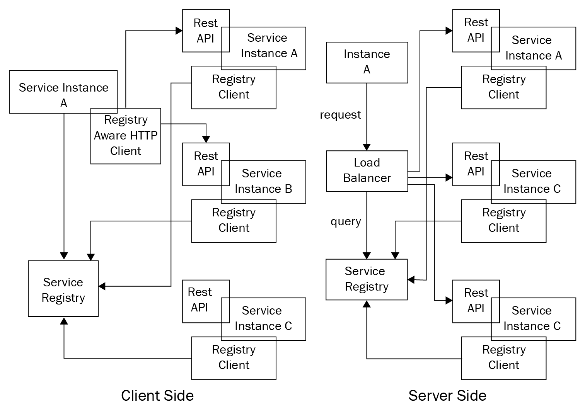
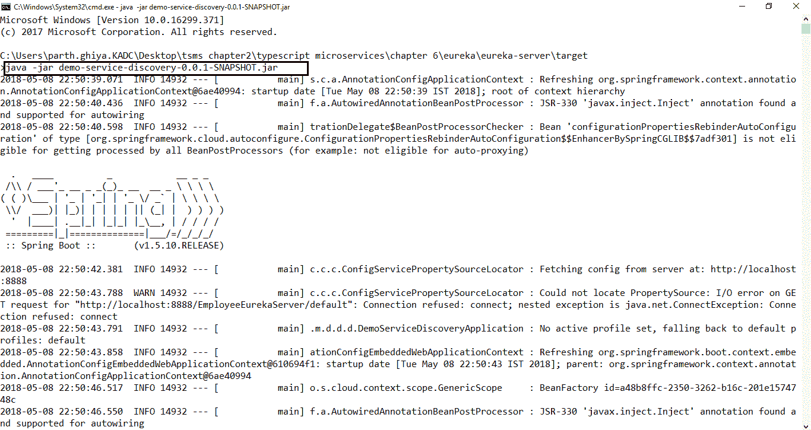
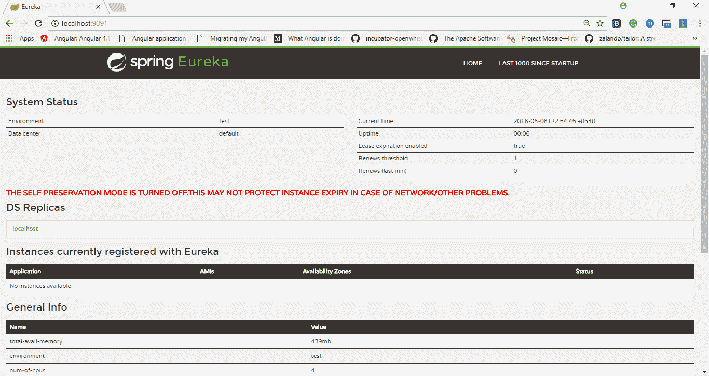
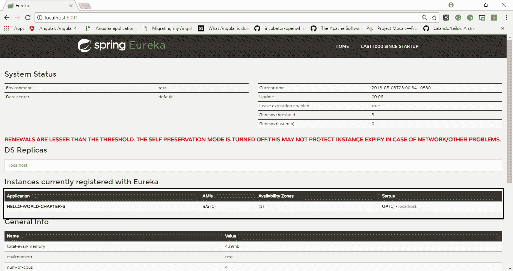

# 第六章：服务注册表和发现

通过网关处理我们分布式系统的核心问题后，我们现在将在本章中讨论服务注册表和发现。我们拥有的服务越多，仅使用预定义端口来处理它们就变得越复杂。在上一章中，我们看到网关与服务注册表进行交互，后者在数据库中维护服务位置。客户端请求根据数据库中的信息分派到服务。在本章中，我们将看到服务注册表是如何填充的，以及服务、客户端和网关如何与之交互。

本章将从理解服务发现开始，了解动态维护服务注册表的方式，注册服务到注册表的不同方式以及每种方式的利弊。我们将了解维护服务注册表的端到端流程，以及根据注册表发现服务的方式。我们将看到设计服务注册表的可用选项，熟悉每个步骤，然后使用可用的最佳实践设计我们的动态服务注册表。在本章中，我们将研究以下主题：

+   服务注册表的介绍

+   服务注册表和发现的什么、为什么和如何

+   服务发现模式

+   服务注册表模式

+   服务注册表和发现选项

+   如何选择服务注册表和发现

# 服务注册表的介绍

在本节中，我们将看到服务发现的需求以及服务注册表的需求，并尝试理解服务注册表和发现之间的区别。我们已经设置了一些购物车微服务，但是核心依赖于静态的网络位置。我们的代码从配置文件中读取一个值，并在服务位置发生任何变化时，在我们的配置中进行更新。在实际世界中，很难维护这一点，因为服务实例是动态分配位置的。此外，服务实例根据自动扩展、故障处理和更新过程的需要动态变化，这些过程是在微服务世界中从消费者客户端中抽象出来的。因此，客户端需要使用更加强大的服务发现机制。

服务发现可以定义为：

在一个中心位置（API 网关或数据库）注册服务的完整端到端流程，并通过在服务注册表中查找来到达目标服务的消费。

在微服务世界中，不同的微服务通常分布在平台即服务（PaaS）环境中。基础设施通常是不可变的，因为我们通常有容器或不可变的虚拟机镜像。服务通常可以根据流量和预设的指标进行扩展或缩减。由于一切都是不断变化的，直到服务准备好被使用和部署之前，服务的确切地址可能是未知的。这种动态性是微服务世界中需要处理的最重要的方面之一。一个逻辑和显而易见的解决方案是将这些端点持久化在某个地方，这本身就是服务注册表的基础。在这种方法中，每个微服务都向一个中央代理（我们在第五章中看到的组件，*理解 API 网关*）注册，并提供有关该微服务的所有详细信息，如端点地址、合同细节、通信协议等。消费服务通常会查询代理以查找该服务的可用位置，然后根据检索到的位置调用它。这方面一些常见的选项包括 Zookeeper、Consul、Netflix Eureka 和 Kubernetes，我们很快将更详细地了解它们。

# 服务注册表和发现的什么、为什么和如何

在简要了解了服务注册表之后，我们将在本节中了解服务注册和发现的原因、目的和方法。从理解服务发现的需求开始，然后了解涉及该过程的过程和组件。

# 服务注册和发现的原因

无论我们选择哪种容器技术，在生产环境中，我们总是会有三四个主机和每个主机内的多个容器。一般来说，我们在所有可用主机上分发我们的服务的方式是完全动态的，取决于业务能力，并且可以随时更改，因为主机只是服务器，它们不会永远持续下去。这就是服务发现和注册的作用。我们需要一个外部系统来解决常见 Web 服务器的限制，始终关注所有服务，并维护 IP 和端口的组合，以便客户端可以无缝地路由到这些服务提供者。

为了理解服务注册和发现的需求，我们将举一个经典的例子。假设我们有 10 个产品目录微服务的实例在任意数量的节点上运行。现在，为了拥有一个弹性系统，有人需要跟踪这 10 个节点，因为每当需要消费产品目录服务时，至少应该有一个正确的 IP 地址或主机名可用，否则消费者必须查询一个中央位置，找到产品目录服务的位置。这种方法非常类似于 DNS，不同之处在于这只是用于内部服务之间的通信。大多数基于微服务的架构都是动态变化的。服务根据开发、折旧和流量进行扩展和缩减。每当服务端点发生变化时，注册表都需要知道这个变化。服务注册表就是为了维护关于如何到达每个服务的所有信息。

市场上有很多可用的工具来解决这个问题，作为架构师，我们需要根据我们的需求来决定合适的工具。我们需要考虑诸如可以做多少自动化以及我们对工具有多少控制等因素。从低级工具如 Consul 到高级工具如 Kubernetes 或 Docker swarm，都可以满足高级需求，比如负载均衡容器和容器调度能力。

# 服务注册和发现是如何工作的？

今天，服务注册和发现有三种基本方法：

+   首先，最基本和初步的方法是使用现有的 DNS 基础设施。一个良好部署的 DNS 将是高度可用和分布式的。这种方法的例子包括`httpd`，`confd`，`systemd`等。在这种方法中，标准的 DNS 库被用作注册客户端。每个微服务条目在 DNS 区域文件中接收一个条目，并进行 DNS 查找以连接或定位微服务。另一种方法是使用诸如 NGINX 之类的代理，它们定期轮询 DNS 以进行服务发现。这种方法的优点包括语言不可知性：它可以与任何语言一起工作，几乎不需要或零改变。然而，它也有一些缺点，比如 DNS 不能提供实时视图，管理服务注册和注销时的新区域文件，以及维护此组件的高可用性以实现弹性。

+   第二种方法更加动态，更适合使用一致性键值数据存储的微服务，比如 Hashicorp 的 Consul、Apache Zookeeper、etcd 等。这些工具是高度分布式系统。通过键值存储和边车模式，解决了在使用 DNS 时遇到的所有问题。这种方法旨在对任何编写代码的开发人员完全透明。开发人员可以使用任何编程语言编写代码，而不必考虑微服务如何与其他服务交互。它也有一些限制，比如边车仅限于主机的服务发现，而不是更精细的路由。它还通过引入额外的跳跃为每个微服务增加了额外的延迟。

+   服务发现的最终方法是采用诸如 Netflix Eureka 之类的现成框架，专门为服务发现而设计和优化。这种模型直接向最终开发人员公开功能。

无论选择哪种工具，每个微服务都需要一个中央客户端进行服务发现通信，其主要功能是允许服务注册和解析。每当一个服务启动时，服务发现就会使用注册过程向其他服务表明其可用性。一旦可用，其他服务就会使用服务解析来定位网络上的服务。涉及的两个过程如下。

# 服务注册

在启动和关闭时，服务会自行注册，或者通过第三方注册，服务注册客户端还会发送持续的心跳，以便客户端知道服务是活动的。心跳是定期发送给其他服务的消息，表明服务正在运行并且活动。它们应该是异步发送或者作为基于事件的实现，以避免性能问题。其他方法包括不断轮询服务。服务注册阶段还负责设置服务的契约，即服务名称、协议、版本等。

# 服务解析

这是返回微服务的网络地址的过程。理想的服务发现客户端具有缓存、故障转移和负载均衡等关键功能。为了避免网络延迟，缓存服务地址至关重要。缓存层订阅来自服务发现的更新，以确保它始终是最新的。典型的微服务实现层部署在各个位置以实现高可用性；服务解析客户端必须知道如何根据负载可用性和其他因素返回服务实例的地址。

# 服务注册和发现的内容

在这一部分，我们将看一下服务注册和发现的内容。我们将看到服务注册的所有方面，并查看关于维护它的所有可能选项。

# 维护服务注册表

在这一部分，我们将看到消费者最终如何找到服务提供者。我们将看到所有可用的方法，并查看每个选项的利弊：

+   **通过套接字进行更新**：定期轮询很快就会成为一个问题，因为消费者最不关心向发现服务注册自己，对于发现服务来说，维护消费者列表也变得困难。更好的解决方案是客户端与发现服务建立套接字连接，并持续获取所有服务更改的最新列表。

+   **服务发现作为代理**：这更多是一个服务器端的实现，路由逻辑存在于发现服务中，使得客户端不需要维护任何列表。他们只需向发现服务发出出站请求，发现服务将请求转发给适当的服务提供者，并将结果返回给提供者。

# 及时的健康检查

有两种方法可以进行及时的发现健康检查。一种方法是服务应该向集中式发现服务发送消息，而另一种方法是发现服务向服务提供者发送请求：

+   **服务轮询注册器：**在这种方法中，服务提供者会定期向注册发现服务发送消息。发现服务会跟踪上次接收请求的时间，并且如果超过一定时间阈值，就会认为服务提供者已经失效。

+   **注册器轮询服务：**这是一种中央发现服务向服务提供者发送请求的方法。然而，这种方法的一个缺点是，集中式发现服务可能会因为执行太多的出站请求而耗尽资源。此外，如果服务提供者消失，那么注册器就必须进行大量的失败健康查找，这将是网络资源的浪费。

# 服务发现模式

发现是客户端视角下的服务注册的对应物。每当客户端想要访问一个服务时，它必须找到关于服务的详细信息，它的位置以及其他合同信息。这通常使用两种方法来完成，即客户端发现和服务器端发现。服务发现可以简要总结如下：

+   微服务或消费者对其他服务的物理位置没有任何先验知识。他们不知道服务何时下线或另一个服务节点何时上线。

+   服务广播它们的存在和消失。

+   服务能够基于其他广播的元数据找到其他服务实例。

+   实例故障会被检测到，并且任何对于失败节点的请求都会被阻止并作废。

+   服务发现不是单点故障。

在本节中，我们将研究服务发现的模式，并了解每种模式的优缺点。

# 客户端发现模式

在使用客户端模式时，客户端或网关的职责是确定可用服务实例的位置，并在它们之间进行负载均衡。客户端查询服务注册表，这只是一组可用的服务实例，存储其响应，然后根据响应中的位置地址路由请求。客户端使用一些著名的负载平衡算法来选择一个服务实例，并向该实例发出请求。每当服务启动时，该服务实例的物理网络位置会在注册表中注册，并在服务关闭时注销。服务实例的注册会使用心跳机制、轮询或通过实时更新的套接字来刷新。

**优势：**

+   该模式除了服务注册表之外相当静态，因此更容易维护

+   由于客户端知道服务实例，客户端可以做出智能的、特定于应用程序的、情境依赖的负载均衡决策，比如不断使用哈希

**痛点：**

+   客户端与服务注册表紧密耦合

+   需要在每种服务客户端使用的编程语言和框架中实现客户端服务发现

一个著名的客户端注册工具是 Netflix Eureka。它提供了一个用于管理服务实例注册和查询可用实例的 REST API。可以在[`github.com/Netflix/eureka/wiki/Eureka-REST-operations`](https://github.com/Netflix/eureka/wiki/Eureka-REST-operations)找到完整的 API 列表和可用选项，其中包含所有可用的操作。

# 服务器端发现模式

对此的反对意见是为注册表单独设置一个组件，这就是服务器端发现模式。在这种方法中，客户端通过负载均衡器向服务发出请求。负载均衡器然后查询服务注册表，并将每个请求路由到可用的服务实例，以向消费者提供服务响应。这种方法的一个典型例子是内置的 AWS 负载均衡器。Amazon **弹性负载均衡器**（**ELB**）通常用于处理来自互联网的大量外部流量，并在传入流量中进行负载均衡，但 ELB 的用途远不止于此。ELB 也可以用于将流量负载均衡到虚拟机的内部流量。当客户端通过其 DNS 向 ELB 发出请求时，ELB 会将流量在一组注册的 EC2 实例或容器之间进行负载均衡。

维护服务器端发现的方法之一是在每个主机上使用代理。这个代理扮演着服务器端发现负载均衡器的角色。代理透明地将请求转发到服务器上任何地方运行的可用服务实例。Kubernetes 采用了类似的方法。一些可用的工具是 NGINX 和 Consul 模板。这些工具配置了反向代理并重新加载 NGINX 或 HAProxy 服务器。

服务器端发现模式的优势：

+   在服务器端的客户端发现中，代码更简单，因为我们不必为每个服务编写发现代码，而且它完全与客户端抽象无关

+   通过这种方法来处理负载均衡等功能

服务器端发现模式的缺点：

+   路由器是另一个需要在服务器上维护的组件。如果环境是集群的，那么它需要在每个地方进行复制。

+   除非路由器是 TCP 路由器，否则路由器应该支持诸如 HTTP、RPC 等协议。

+   与客户端发现相比，它需要更多的网络跳数。

让我们在这个图表中看看这两种方法：



客户端与服务器端服务发现

# 服务注册表模式

在分布式系统中发现服务的一个关键方面是服务注册表。服务注册表只是一个包含所有服务实例的网络位置的数据库。由于它包含关键信息，因此必须在高效的系统上保持高可用性并保持最新。根据系统客户端（在我们的情况下是 API 网关），我们甚至可以缓存从服务注册表获取的网络位置。然而，它必须每天更新，否则客户端将无法发现服务实例并按服务进行通信。为了保持高可用性，服务注册表由集群组成，其中使用复制协议来保持一致性。服务注册表保存微服务实例的元数据，其中包括实际位置、主机端口、通信协议等。微服务的启动和关闭过程会不断受到监控。在本节中，我们将看看服务注册表和常见的服务注册选项。我们将分析每种方法的优缺点。

所有服务实例必须在中央注册表中注册和注销，以建立一个容错系统。有各种方法来处理这个注册和注销的过程。一种选择是服务注册表提供端点，服务实例自行注册，即自注册。另一种选择是使用其他系统组件来管理服务实例的注册。让我们深入了解这两种模式的细节。

# 自注册模式

在使用自注册过程时，服务实例本身负责在服务注册表中注册和注销。此外，服务实例必须不断发送心跳请求，以便让注册表知道服务的状态。如果注册表没有收到心跳，它可以假定服务不再存在，并注销或停止监听该服务。自注册模式迫使微服务自己与服务注册表通信。每当服务启动或关闭时，它都必须与注册表通信，告知其状态。微服务处理单一关注点，因此在任何地方引入另一个关注点可能是额外的负担，可能看起来是一种反模式；但是，它的优势在于服务维护自己的状态模型，知道当前状态，即**STARTING**，**AVAILABLE**，**SHUTDOWN**，而不依赖于任何其他第三方服务。

自注册过程的一个著名例子是 Netflix OSS Eureka 客户端。Eureka 客户端处理客户端注册和注销的所有方面。我们将在后面的章节中看到 Eureka 的详细实现。

自注册模式的缺点：

+   该服务与服务注册表耦合。它必须不断与服务器通信，告诉它有关服务状态的信息。

+   服务注册逻辑不是集中的，必须在我们生态系统中的每种语言中实现。

# 第三方注册模式

在使用第三方注册过程和服务实例时，微服务遵循单一责任原则，不再负责向服务注册表注册自己。相反，我们在系统中引入一个新组件，*服务注册器*，它负责维护服务注册表。为了维护注册表，服务注册器通过轮询环境或订阅启动和关闭事件来跟踪实例。每当它注意到一个新的可用服务时，它就会将该实例注册到注册表中。同样，如果它无法收到健康检查，那么它就会从注册表中注销该服务。与自注册模式不同，微服务代码要简单得多，因为它不负责注册自己，但它也有缺点。如果注册器没有经过精心选择，它就会成为必须安装、配置、维护和高可用的另一个组件，因为它是系统的关键组件。在工业界，第三方注册通常是首选，因为它可以自动管理注册表。注册表所需的额外数据可以以策略或合同的形式提供，并可以在数据库中更新。Apache Zookeeper 或 Netflix Eureka 等工具通常与其他工具结合使用。

第三方注册有各种优势。比如，如果一个服务宕机，第三方注册器可以采取适当的措施，如提供安全回退，触发自我修复机制等。如果某个服务的流量很大，注册过程可以通过请求新的微服务实例自动添加新的端点。对服务执行的这些健康检查可以帮助自动注销，以阻止故障级联到整个系统。一个著名的例子是 Registrator，我们将在本章后面看到。

一些著名的第三方注册模式的例子包括：

+   Netflix Prana：由 Netflix 外包，Netflix OSS Prana 专门针对非 JVM 语言。它是边车模式的实现，与服务实例并行运行，并通过 HTTP 公开它们。Prana 使用 HTTP 与 Netflix Eureka 注册和注销服务实例。

+   **内置组件，如 ELB：**大多数部署环境都有内置组件。通过自动扩展创建的 EC2 实例会自动注册到 ELB。同样，Kubernetes 服务会自动注册并可供发现（我们将在第十章的扩展部分中更详细地了解这一点，*加固您的应用*）。

第三方注册模式的优势如下：

+   代码较少复杂，因为每个服务不必为自己的注册和注销编写代码

+   中央注册器还包含执行健康检查的代码，这不需要在所有地方复制。

第三方注册模式的缺点如下：

+   除非由服务发现工具提供，否则它是另一个需要维护并保持高可用性的组件

# 服务注册和发现选项

在本节中，我们将研究市场上一些常见的服务发现和注册选项。选项范围从提供高度控制的低级解决方案（如 CoreOS 的 etcd 和 HashiCorp 的 Consul）到提供容器调度解决方案的高端解决方案（如 Google 的 Kubernetes、Docker swarm 等）。在本节中，我们将了解各种选项，并查看每种选项的优缺点。

# Eureka

Eureka 是由 Netflix 外包的服务注册和发现框架，需要主要用于定位服务以进行负载平衡和故障转移。在本节中，我们将使用 Eureka 进行服务发现和注册。

整体 Eureka 架构由两个组件组成：Eureka 服务器和客户端。Eureka 服务器是一个独立的服务器应用程序，负责：

+   管理服务实例的注册表

+   提供注册任何服务、注销任何微服务和查询实例作为服务发现的一部分的手段

+   将实例的注册传播到其他 Eureka 服务器和客户端，提供类似心跳的机制来不断监视服务

Eureka 客户端是生态系统的一部分，具有以下责任：

+   在启动、关闭等过程中向 Eureka 服务器注册和注销绑定的微服务

+   通过不断发送心跳来保持与 Eureka 服务器的连接

+   检索其他服务实例信息，缓存并每天更新

我们将经常在 Eureka 中使用以下术语：

| **Eureka 服务器** | 它是发现服务器。它通过注册和注销任何服务以及发现任何服务的 API 来拥有所有服务的注册表及其当前状态。 |
| --- | --- |
| **Eureka 服务** | Eureka 服务注册表中发现的任何内容，以及为其他服务注册并且意图被发现的任何内容。每个服务都有一个逻辑标识符，可以引用该应用程序的实例 ID，称为 VIP 或服务 ID。 |
| **Eureka 实例** | 注册到 Eureka 服务器的任何应用程序，以便其他服务可以发现它。 |
| **Eureka 客户端** | 可以注册和发现任何微服务的任何微服务应用程序。 |

在本节中，我们将设置 Eureka 服务器注册一个示例微服务，并在其他微服务中找到该微服务的位置。所以，让我们开始吧。

# 设置 Eureka 服务器

Eureka 服务器是 Netflix OSS 产品，是一种服务发现模式的实现，其中每个微服务都注册，客户端在服务器上查找依赖的微服务。Eureka 服务器在 JVM 平台上运行，因此我们将直接使用可用模板。

要运行 Eureka 服务器，您需要安装 Java 8 和 Maven。

让我们来看看设置 Eureka 服务器的步骤：

1.  转到本章节的提取源代码中的`eureka`文件夹。您将找到一个名为`euraka-server`的 Eureka 服务器的现成 Java 项目。

1.  在根目录中，打开终端并运行以下命令：

```ts
mvn clean install
```

1.  您应该看到依赖项正在安装，最后，您将收到一条确认成功构建的消息，并生成`target`文件夹。

1.  打开`target`文件夹，您将能够看到 Eureka 服务器的`.jar`文件(`demo-service-discovery-0.0.1-SNAPSHOT.jar`)。

1.  打开终端并输入以下命令。您应该会看到服务器启动：

```ts
java -jar demo-service-discovery-0.0.1-SNAPSHOT.jar
```

以下是上述命令的输出截图：



启动 Spring Eureka 服务器

1.  访问`http://localhost:9091/`，您应该能够看到 Eureka 服务器已启动。您应该会看到类似于这样的内容：



Spring Eureka 服务器

现在我们已经启动了 Eureka 服务器，我们将向其注册我们的服务。在注册到 Eureka 服务器后，我们将能够在 Eureka 当前注册的实例下看到我们的服务。

# 向 Eureka 服务器注册

现在我们的 Eureka 服务器已经启动并准备好接受微服务的注册，我们将注册一个演示微服务并在 Eureka 仪表板上看到它。您可以跟随源文件中附带的源代码(`first-microservice-register`)。让我们开始吧：

1.  从第二章中提取我们的第一个微服务代码，*为旅程做准备*。我们将在项目中使用`eureka-js-client`([`www.npmjs.com/package/eureka-js-client`](https://www.npmjs.com/package/eureka-js-client))模块，这是 Netflix OSS Eureka 的 JavaScript 实现。

1.  打开终端并安装`eureka-js-client`：

```ts
npm i eureka-js-client --save
```

1.  接下来，我们将安装`eureka-js-client`的类型，以在我们的 TypeScript 项目中使用。在撰写本文时，`DefinitelyTyped`存储库中的类型尚未更新。因此，我们现在将编写我们自定义的类型。

1.  创建一个名为`custom_types`的文件夹，并在其中添加`eureka-js-client.d.ts`。可以从附加的源代码或我的 gist（[`gist.github.com/insanityrules/7461385aa561db5835c5c35279eb12bf`](https://gist.github.com/insanityrules/7461385aa561db5835c5c35279eb12bf)）中复制内容

1.  接下来，我们将使用 Eureka 注册我们的 Express 应用程序。打开`Application.ts`并在其中编写以下代码：

```ts
let client = new Eureka(
  {
    instance: {
      app: 'hello-world-chapter-6',
      hostName: 'localhost',
      ipAddr: '127.0.0.1',
      statusPageUrl: `http://localhost:${port}`,
      healthCheckUrl: `http://localhost:${port}/health`,
      port: {
        '$': port,
        '@enabled': true
      },
      vipAddress: 'myvip',
      dataCenterInfo: {
        '@class': 'com.netflix.appinfo.InstanceInfo$DefaultDataCenterInfo',
        'name': 'MyOwn',
      },
    }, eureka: {
      host: 'localhost',
      port: 9091,
      servicePath: '/eureka/apps/'
    }
  })
```

我们刚刚做了什么？请查看以下要点，以便更好地理解：

+   +   我们使用名称为`hello-world-chapter-6`的应用实例注册了一个名为`myvip`的键和数据中心`myOwn`到 Eureka

+   我们提供了`statusPageURL`和`IpAddress`

+   我们添加了 Eureka 信息，包括主机、端口和服务路径

+   可以在此处找到完整的配置列表([`www.npmjs.com/package/eureka-js-client`](https://www.npmjs.com/package/eureka-js-client))

1.  接下来，我们将从客户端开始；只需添加以下内容：

```ts
client.start()
```

1.  我们的注册已经准备就绪；现在我们可以使用`npm start`启动我们的服务。现在，转到`localhost:9091`检查服务器实例：



在 Eureka 服务器中注册的服务

1.  我们的服务将不断获取服务注册表并发送心跳以告知服务正在运行。当我们的微服务被终止时，让我们停止并注销服务。只需将以下代码添加到`Application.ts`中：

```ts
process.on('SIGINT', function() {client.stop(); });
```

现在我们的服务已与 Eureka 同步，在下一节中我们将看到如何发现服务。

# 使用 Eureka 服务器进行发现

在本节中，我们将在另一个微服务中发现我们注册的服务。我们将从该服务获取响应，而不知道服务地址或在任何地方硬编码位置。从第二章中复制`first-microservice`的结构，*为旅程做准备*。由于我们将在各处需要 Eureka 客户端，我们将创建`EurekaService.ts`。您可以在项目的`eureka/eureka-service-discovery/src`文件夹中找到完整的源代码。

让我们来看看发现我们注册服务的步骤：

1.  创建一个名为`EurekaService.ts`的文件，并创建用于初始化客户端的静态方法：

```ts
static getClient(): Eureka{
  if (!this._client) {
    this._client = new Eureka({
      instance: {}, //set instance specific parameters,
      Eureka: {} //set Eureka parameters
    })
  }
```

1.  在`Application.ts`中，启动您的客户端并添加停止进程如下：

```ts
EurekaService.getClient().start();
…
process.on('SIGINT', () => {
  /*stop client*/
 EurekaService.getClient().stop();
  this.server.close()
 });
```

1.  在我们的`HelloWorld.ts`中，我们将调用`first-microservice-register`中的服务并获取其响应。我们不会硬编码位置。在`HelloWorld.ts`中添加以下 LOCs：

```ts
let instances: any =
  EurekaService.getClient().getInstancesByAppId("HELLO-WORLD-CHAPTER-6");
let instance = null;
let msg = "404 Not Available";
if (instances != null && instances.length > 0) {
  instance = instances[0];
  let protocol = instances[0].securePort["@enabled"] == "true" ? "https" : "http";
  let url = protocol + "://" + instance.ipAddr + ":" + 
                       instances[0].port.$ + "/";
  const { res, payload } = await Wreck.get(url);
  msg = payload.toString();
} 
```

正如您所看到的，我们从我们的服务注册表中选择了协议、端口和 IP 地址。

1.  运行您的应用程序，您将能够看到来自`first-microservice-register`的响应。

# Eureka 的关键点

在进行 Eureka 服务注册和发现的练习之后，让我们来看看 Eureka 的一些要点：

+   Eureka 包括服务器组件和客户端组件。服务器组件是所有微服务通信的组件。它们通过不断发送心跳来注册其可用性。消费服务还使用服务器组件来发现服务。

+   当使用我们的 Eureka 服务引导微服务时，它会联系 Eureka 服务器并广播其存在以及合同细节。注册后，服务端点每 30 秒发送心跳请求以更新其租约期。如果服务端点未能这样做一定次数，它将从服务注册表中移除。

+   您可以通过设置以下选项之一来启用调试日志：

+   `NODE_DEBUG=request`

+   ``client.logger.level('debug');``

+   客户端不断地在每个预定义的点获取注册表并对其进行缓存。因此，当它想要发现另一个服务时，就可以防止额外的网络跳跃。

+   Eureka 客户端提供了可用服务的列表，并提供了按主机名或实例名提供它们的选项。

+   Eureka 服务器具有区域感知功能。在相同区域注册服务时可以提供区域信息。为了进一步引入负载均衡器，我们可以使用一个等同于 Netflix Ribbon 的弹性客户端([`www.npmjs.com/package/resilient`](https://www.npmjs.com/package/resilient))。

+   它具有健康检查、状态页面、注册、注销、最大重试次数等选项。

+   Eureka 是服务器端客户端注册和自注册选项的典型示例。

# Consul

我们用于服务注册和发现的另一个选项是 HashiCorp Consul ([`www.consul.io/`](https://www.consul.io/))。Consul 是分布式键值存储和其他服务发现和注册功能的开源实现。它可以作为主节点或代理运行。主节点编排整个网络并维护注册表。Consul 代理充当主节点的代理，并将所有请求转发到主节点。在本节中，我们将了解使用 Consul 进行服务发现和注册。

在这个练习中，我们将使用 Consul 进行服务注册和发现。我们将看看使用 Consul 进行自注册/注销的方法。让我们开始吧；在这个练习中，我们将使用 Linux 操作系统。

# 设置 Consul 服务器

让我们来看看设置 Consul 服务器的步骤：

1.  设置 Consul 服务器非常简单。只需从[`www.consul.io/downloads.html`](https://www.consul.io/downloads.html)下载可执行文件，并将其解压缩到您选择的位置。解压缩后，输入以下命令使其可用于二进制执行：

```ts
cp consul /usr/local/bin/
```

1.  通过打开终端并输入`consul -v`来测试您的 Consul 安装；您应该能够看到版本 1.0.7。

1.  现在，我们将打开 Consul UI 终端。Consul 默认带有一个 UI 仪表板；要启动带有 UI 仪表板的 Consul 终端，请输入以下命令：

```ts
consul agent -server -bootstrap-expect=1 -data-dir=consul-data -ui -bind=<Your_IPV4_Address>
```

1.  打开`localhost:8500`；您应该能够看到类似于这样的东西：

！[](img/f80d0fe1-1a21-440a-931b-9d1e4cb7e0af.png)

Consul 服务器

我们已经成功启动了 Consul 服务器；接下来我们将在 Consul 中注册一些服务。

# 与 Consul 服务器交谈

与 Eureka 一样，Consul 也暴露了一些 REST 端点，可以用来与 Consul 服务器交互。在本节中，我们将看到如何：

+   注册服务实例

+   发送心跳并进行健康检查

+   注销服务实例

+   订阅更新

# 注册服务实例

让我们从第二章的第一个微服务开始克隆，*为旅程做准备*。您可以在`chapter-6/consul/consul-producer`文件夹中找到整个源代码：

1.  打开终端并输入以下命令：

```ts
npm install consul  @types/consul --save
```

1.  现在在`Application.ts`中，我们将初始化我们的 Consul 客户端。写下这段代码：

```ts
import * as Consul from 'consul';
import { ConsulOptions } from 'consul';
…
let consulOptions: ConsulOptions =
  { host: '127.0.0.1', port: '8500', secure: false, promisify: false }
….
let details =
  {
    name: 'typescript-microservices-consul-producer',
    address: HOST,
    check: { ttl: '10s', deregister_critical_service_after: '1m' },
    port: appPort, id: CONSUL_ID
  };
let consul = new Consul(consulOptions);
```

1.  接下来，我们将在 Consul 中注册我们的服务：

```ts
consul.agent.service.register(
  details, err => {
    if (err) {
      throw new Error(err.toString());
    }
    console.log('registered with Consul');
  }
```

1.  运行程序，您应该能够看到成功的日志。您将能够看到类似以下的输出：

！[](img/f200cf26-9b2b-44ce-9acf-950dc9d45f23.png)

与 Consul 和 Consul 仪表板的服务注册

# 发送心跳并进行健康检查

现在，我们将添加一个调度程序，不断发送心跳以告诉我们的 Consul 服务器它是活动的。在与上一个练习相同的代码中，只需添加以下代码行：

```ts
  setInterval(() => {
   consul.agent.check.pass({id:`service:${CONSUL_ID}`}, 
   (err:any) => {
        if (err) throw new Error(err); 
        console.log('Send out heartbeat to consul');
        });
   }, 5 * 1000);
```

我们做了什么？

+   每五秒钟，我们向 Consul 发送心跳，以确保我们生成的`CONSUL_ID`的服务是活动的。

+   定期心跳被发送出去，以确保 Consul 知道我们的服务是活动的，并且不会断开我们的服务。早些时候，我们在设置中保留了 TTL 值为 10 秒，这意味着如果 Consul 服务器在 10 秒后没有收到心跳，它将假定服务已经停止。

+   较高的 TTL 值意味着 Consul 将在应用程序死亡或无法提供请求时知道得很晚。另一方面，较短的 TTL 值意味着我们在网络上传输了太多数据，这可能会淹没 Consul，因此这个值应该谨慎选择。

+   您总是需要传递一个唯一的 ID，所以在这个练习中，我们生成了 UUID，并将主机和端口混合在一起。

+   健康检查 API 可通过 HTTP 获得。我们所要做的就是输入以下内容：

```ts
GET /agent/check/pass/service:<service_id>
```

# 注销应用程序

在本节中，我们将在服务器终止或有人杀死服务器时注销我们的应用程序。这确保 Consul 不必等到 TTL 期限才真正知道服务已经停止。只需在`Application.ts`中添加以下代码行：

```ts
   process.on('SIGINT', () => {
  console.log('Process Terminating. De-Registering...');
  let details = { id: CONSUL_ID };
  consul.agent.service.deregister(details,
    (err) => {
      console.log('de-registered.', err);
      process.exit();
    });
```

现在，当您在优雅地终止应用程序时检查 Consul 服务器时，您将无法看到我们的 Consul 生产者已注册。

# 订阅更新

就像 Eureka 一样，我们将不断获取 Consul 注册表，所以每当我们需要与另一个注册表通信时，我们就不需要进行另一个注册表调用，因为注册表已经在我们这边缓存了。Consul 通过提供一个名为`watch`的功能来处理这个问题。对服务的响应将有一个索引号，可以用于将来的请求进行比较。它们只是一个用来跟踪我们离开的位置的光标。让我们向我们的应用程序添加观察者：

1.  通过添加以下代码来创建一个新的观察者。在这里，我们在 Consul 中的名为`data`的服务上创建了一个观察者：

```ts
let watcher = consul.watch({
  method: consul.health.service,
  options: {
    service: 'data',
    passing: true
  }
});
```

1.  接下来，我们将在我们的观察者上添加一个更改事件，所以每当它接收到新的更新时，我们将只是缓存我们的服务数据的注册表。创建一个数组，并在观察时持久化它接收到的条目：

```ts
let known_data_instances: string[];
..
watcher.on('change', (data, res) => {
  console.log('received discovery update:', data.length);
  known_data_instances = [];
  data.forEach((entry: any) => {
    known_data_instances.push(`http://${entry.Service.Address}:
    ${entry.Service.Port}/`);
  });
  console.log(known_data_instances);
});
```

1.  添加一个错误处理程序：

```ts
watcher.on('error', err => {
  console.error('watch error', err);
});
```

1.  就是这样。现在，使用`npm start`运行程序，并使用名称`data`注册另一个服务（注册新服务的步骤与注册新服务相同）。然后，您应该能够看到以下输出：

```ts
received discovery update: 1
 [ 'http://parth-VirtualBox:8081/' ]
```

就是这样。我们刚刚进行了服务注册，并与 Eureka 服务器进行了交互。每当数据服务关闭时，此值也将动态更新。现在我们有了动态地址和端口，我们随时可以使用它来发现服务的位置。

# Consul 的关键点

完成了对 Consul 的练习后，现在让我们总结一下 Consul 的关键点：

1.  Consul 使用 gossip 协议（告诉每个活着并与其他人保持不断联系的人）来形成动态集群。

1.  它具有内置的键值存储，不仅存储数据，还用于注册观察，可用于许多任务，如通知其他人有关数据更改、运行不同的健康检查以及根据用例运行一些自定义命令。

1.  服务发现是内置的，因此我们不需要任何第三方工具。它具有内置功能，如健康检查、观察等。

它具有对多个数据中心的开箱即用支持，gossip 协议也适用于所有数据中心。它还可以用于发现有关其他部署服务和它们所在节点的信息。它具有内置的健康检查、TTL 和自定义命令支持，我们可以在其中添加自己的中间件函数。

# Registrator

虽然 Consul 似乎是服务发现和注册的一个很好的选择，但存在一个相当大的缺点，即每个服务都需要维护它们的启动和关闭代码，这似乎在各处都有相当多的重复代码。我们需要一个工具，根据监听它们的启动和关闭事件，自动将服务注册到 Consul 服务器。Registrator 正是这样的工具。它是一个用于 Docker 的服务注册桥接器，具有根据需要插入适配器的选项。当服务上线或下线时，Registrator 会自动注册和注销服务。它具有可插拔的服务注册选项，这意味着它可以与各种其他服务注册客户端一起使用，如 Consul、etcd 等。

让我们开始使用 Registrator。在这个练习中，我们将使用 Consul 的服务注册表，将其插入 Registrator，然后启动一个服务，让 Registrator 在 Consul 服务器中自动注册它：

1.  首先，使用以下命令启动 Consul 服务器：

```ts
consul agent -server -bootstrap-expect=1 -data-dir=consul-data -ui -bind=<Your_IPV4_Address>
```

1.  现在，我们将拉取 Registrator 的 Docker 镜像，并指定将其插入到 Consul 注册表中，这样当 Registrator 发现任何服务时，它们将自动添加到 Consul 服务器。打开终端并输入以下命令：

```ts
sudo docker run -d 
 --name=registrator
 --net=host 
 --volume=/var/run/docker.sock:/tmp/docker.sock 
 gliderlabs/registrator:latest 
 consul://localhost:8500
```

我们以分离模式运行容器并对其命名。我们以主机网络模式运行，以确保 Registrator 具有实际主机的主机名和 IP 地址。最后一行是我们的注册 URI。Registrator 需要在每个主机上运行；对于我们的练习，我们选择了单个主机。要启动 Registrator，我们需要提供的基本配置是如何连接到注册表，在这种情况下是 Consul。

1.  为了确保 Registrator 已成功启动，请输入以下命令，您应该能够看到日志流和消息`Listening for Docker events ...`：

```ts
sudo  docker logs registrator
```

1.  现在，我们只需使用 Docker 启动任何服务，我们的服务将自动注册到 Consul。打开终端，只需使用以下命令在 Docker 中启动我们的服务：

```ts
sudo docker run -p 8080:3000 -d firsttypescriptms:latest
```

或者您可以只是启动任何服务，比如`redis`，只需输入以下命令：

```ts
sudo docker run -d -P --name=redis redis 
```

1.  打开 Consul 用户界面，您将能够在那里看到我们的服务已注册。

在这里，我们使用 Registrator 和 Consul 有效地实现了自动发现。它可以作为自动发现。

# Registrator 的关键点

让我们讨论 Registrator 的关键要点：

1.  Registrator 充当自动发现代理，它监听 Docker 的启动和关闭事件。

1.  Registrator 具有以下内置选项，取自他们的 GitHub`Readme`文件：

```ts
Usage of /bin/registrator:
   /bin/registrator [options] <registry URI>
   -cleanup=false: Remove dangling services
   -deregister="always": Deregister exited services "always" or "on- 
    success"
   -internal=false: Use internal ports instead of published ones
   -ip="": IP for ports mapped to the host
   -resync=0: Frequency with which services are resynchronized
   -retry-attempts=0: Max retry attempts to establish a connection  
    with the backend. Use -1 for infinite retries
   -retry-interval=2000: Interval (in millisecond) between retry-
    attempts.
   -tags="": Append tags for all registered services
   -ttl=0: TTL for services (default is no expiry)
   -ttl-refresh=0: Frequency with which service TTLs are refreshed
```

1.  使用 Consul 与 Registrator 可以为我们的服务发现和注册提供非常可行的解决方案，而无需在各处重复编写代码。

这些是目前广泛使用的一些解决方案。除此之外，还有其他解决方案，比如 ELB、Kubernetes 等。

在本节中，我们看到了使用 Eureka、Consul 和 Registrator 进行服务注册表和发现，并根据我们的服务发现和注册表模式看到了一些其他选项。在下一节中，我们将了解如何选择正确的服务注册表和发现解决方案。

# 如何选择服务注册表和发现

之前，我们根据服务注册表和发现模式看到了各种服务注册表和发现选项。因此，接下来显而易见的问题是，选择哪种解决方案？这个问题非常广泛，实际上取决于需求。您的需求很可能与大多数其他公司的需求不同，因此与其选择最常见的解决方案，不如根据您的需求进行评估，并基于此制定自己的策略。为了制定策略，应该适当评估以下问题：

+   系统是否只使用一种语言编码，还是使用多语言环境？在不同语言中编写相同的代码非常麻烦。在这种情况下，Registrator 非常有帮助。

+   是否涉及旧系统？这两个系统是否会运行一段时间？在这种情况下，自注册解决方案可能非常有帮助。

+   服务发现过程有多简化？是否会有网关？是否会有负载均衡器在中间？

+   是否需要为服务发现提供 API？个别微服务是否需要与其他微服务通信？在这种情况下，基于 HTTP 或 DNS 的解决方案非常有帮助。

+   服务发现解决方案是否嵌入到每个微服务中，还是需要将逻辑集中嵌入？

+   我们是否需要单独的应用程序配置，还是可以将其存储在诸如 Redis 或 MongoDB 之类的键值存储中？

+   部署策略是什么？是否需要像蓝绿策略这样的部署策略？应根据适当的服务发现选择解决方案。

蓝绿是一种部署策略，通过运行两个名为蓝色和绿色的相同生产环境来减少停机时间。

+   系统将如何运行？是否会有多个数据中心？如果是这样，那么运行 Eureka 是最合适的。

+   如何维护您的确认？访问控制列表如何维护？如果是这样，那么 Consul 有内置解决方案。

+   有多少支持？它是否开源并且有广泛的支持？有太多问题吗？

+   如何决定自动扩展解决方案？

根据这些问题，并经过适当评估后，我们可以决定适当的解决方案。在仔细评估这些之后，我们可以选择任何解决方案。以下是在选择任何解决方案时需要注意的一些要点。

在选择 Consul 或 Eureka 时，请注意这些要点。

# 如果选择 Consul

虽然 Consul 有很多好处，但在选择 Consul 时需要注意以下几点：

+   客户端需要编写自己的负载均衡、超时和重试逻辑。为了避免编写完整的逻辑，我们可以利用以下`node`模块：[`www.npmjs.com/package/resilient`](https://www.npmjs.com/package/resilient)。

+   客户端需要单独实现获取逻辑、缓存和 Consul 故障处理，除非我们使用了 Registrator。这些需要分别为生态系统中的每种语言编写。

+   无法为服务器设置优先级；需要编写自定义逻辑。

# 如果选择 Eureka

虽然 Eureka 有许多附加优势，但在选择 Eureka 时需要注意以下几点：

+   客户端必须添加自己的负载均衡、超时和重试逻辑，因此我们需要将其与 Netflix Ribbon 等外部工具集成。

+   文档非常贫乏。如果您使用非 JVM 环境，将无法使用 Eureka。Eureka 服务器需要在 JVM 平台上运行。对于非 JVM 客户端，文档非常模糊。

+   Web UI 非常单调且缺乏信息。

在本节中，我们了解了在选择 Eureka 或 Consul 时的主要要点。我们总结了一些重要观点，以帮助我们实际决定服务注册和发现解决方案。

# 摘要

在本章中，我们了解了服务注册和发现。我们深入了解了服务发现的时间、内容和原因，并了解了服务注册和发现模式。我们看到了每种模式的优缺点以及它们的可用选项。然后，我们使用 Eureka、Consul 和服务注册器实现了服务发现和注册。最后，我们看到了如何选择服务发现和注册解决方案，以及在选择 Eureka 或 Consul 时的关键要点。

在下一章中，我们将看到服务状态以及微服务之间的通信。我们将学习更多的设计模式，如基于事件的通信和发布-订阅模式，看到服务总线的运作，共享数据库依赖等等。我们将通过一些实际示例了解有状态和无状态的服务。
