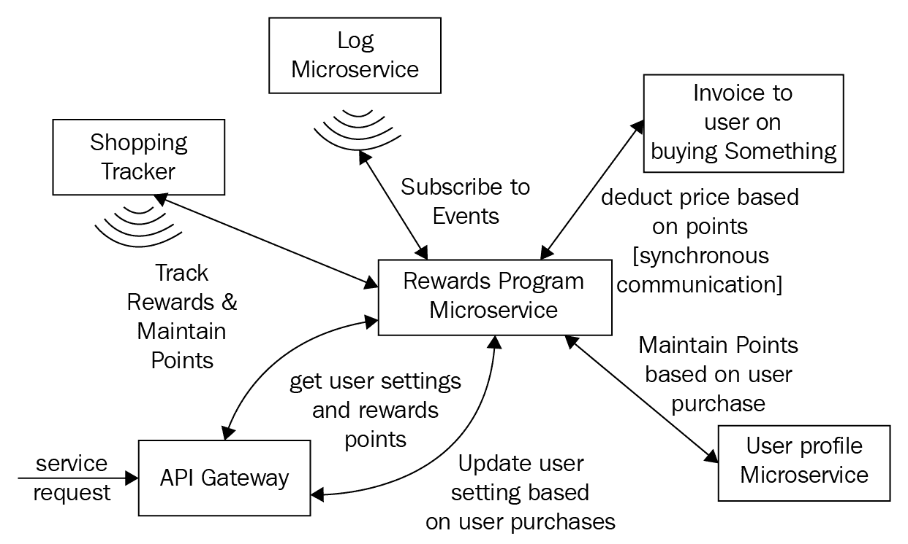
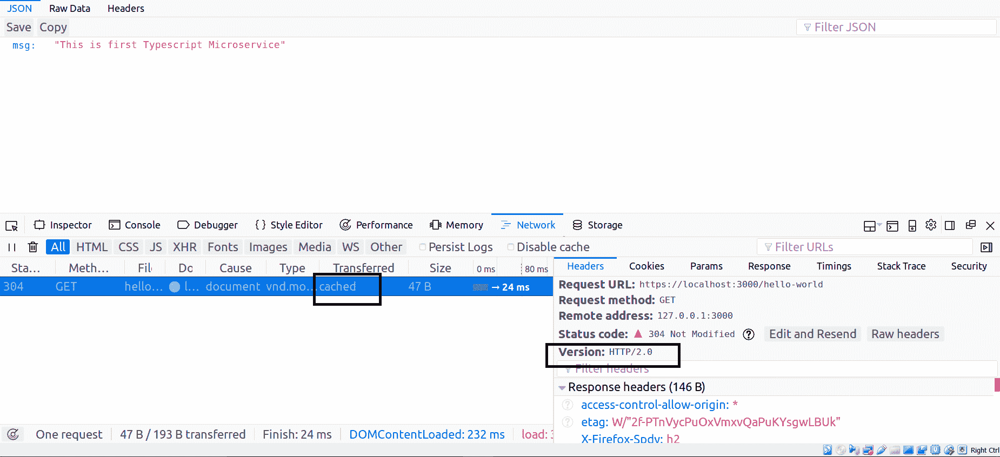
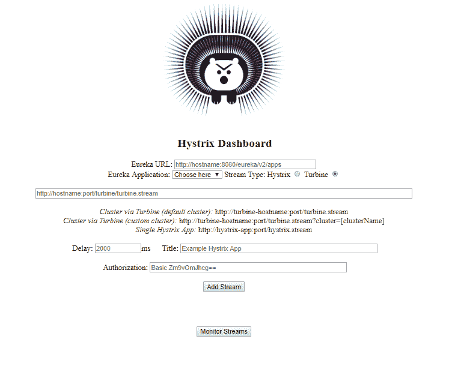
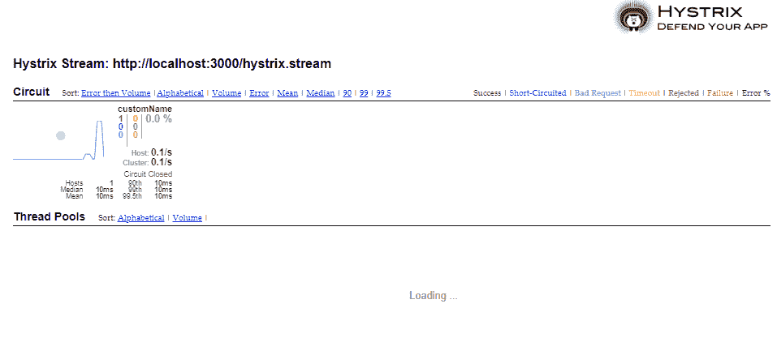
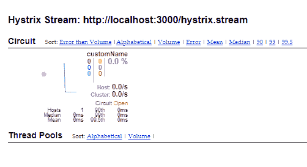
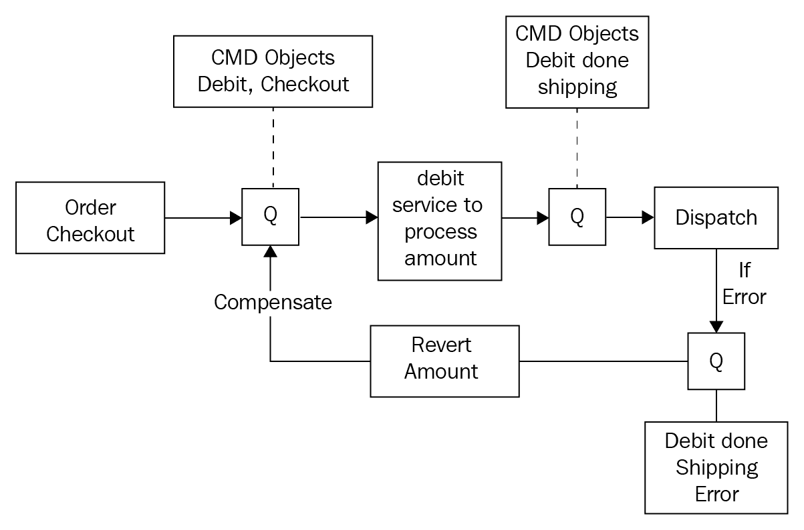
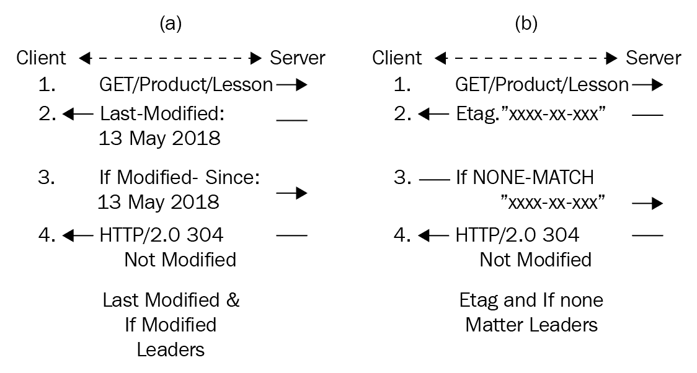

# 第七章：服务状态和服务间通信

现在我们已经开发了一些微服务，看到了 API 网关，并了解了服务注册表和发现，现在是时候深入了解微服务，并从单个微服务的角度了解系统。为了从微服务架构中获得最大的好处，系统中的每个组件都必须以恰当的方式进行协作，这种方式可以确保微服务之间几乎没有耦合，这将使我们能够灵活应对。

在本章中，我们将了解微服务之间的各种通信方式，以及服务之间如何交换数据。然后我们将转向服务总线，这是系统组件之间如何通信的企业方式。许多服务需要以一种形式或另一种形式持久化一些状态。我们将看到如何使我们的服务无状态。我们将了解当前的数据库格局并理解服务状态。我们将了解发布-订阅模式，并了解诸如 Kafka 和 RabbitMQ 之类的工具，以了解事件驱动架构。本章涵盖以下主题：

+   核心概念-状态、通信和依赖关系

+   通信方式

+   同步与异步的数据共享方式

+   微服务版本控制和故障处理

+   服务总线

+   微服务之间的数据共享

+   通过 Redis 进行缓存

+   发布-订阅模式

# 核心概念-状态、通信和依赖关系

每个微服务实现一个单一的能力，比如发货和从库存中扣除。然而，为了向最终用户交付一个服务请求，比如业务能力、用户需求或用户特定请求；可能是一组业务能力，也可能不是。例如，从用户的角度来看，想要购买产品的人是一个单一的服务请求。然而，这里涉及到多个请求，比如加入购物车微服务、支付微服务、发货微服务。因此，为了交付，微服务需要相互协作。在本节中，我们将看到微服务协作的核心概念，如服务状态、通信方式等。选择正确的通信方式有助于设计一个松散耦合的架构，确保每个微服务都有清晰的边界，并且它保持在其有界上下文内。在本节中，我们将看一些核心概念，这些概念将影响我们的微服务设计和架构。所以，让我们开始吧。

# 微服务状态

虽然我们确实应该努力使服务尽可能无状态，但有些情况下我们确实需要有状态的服务。状态只是在任何特定时间点的任何条件或质量。有状态的服务是依赖于系统状态的服务。有状态意味着依赖于这些时间点，而无状态意味着独立于任何状态。

在需要调用一些 REST 服务的工作流中，有状态的服务是必不可少的，我们需要在失败时支持重试，需要跟踪进度，存储中间结果等。我们需要在我们的服务实例边界之外的某个地方保持状态。这就是数据库出现的地方。

数据库是一个重要且有趣的思考部分。在微服务中引入数据库应该以这样一种方式进行，即其他团队不能直接与我们的数据库交谈。事实上，他们甚至不应该知道我们的数据库类型。当前的数据库格局对我们来说有各种可用的选项，包括 SQL 和 NoSQL 类别。甚至还有图数据库、内存数据库以及具有高读写能力的数据库。

我们的微服务可以既有无状态的微服务，也有有状态的微服务。如果一个服务依赖于状态，它应该被分离到一个专用容器中，这个容器易于访问，不与任何人共享。无状态的微服务具有更好的扩展性。我们扩展容器而不是扩展虚拟机。因此，每个状态存储应该在一个容器中，可以随时进行扩展。我们使用 Docker 来扩展数据库存储，它创建一个独立的持久化层，与主机无关。新的云数据存储，如 Redis、Cassandra 和 DynamoDB，最大程度地提高了可用性，同时最小化了一致性的延迟。设计具有异步和可扩展性特性的有状态微服务需要在问题上进行一些思考——找到一些通信状态的方法，以确保任何连续消息之间的通信状态，并确保消息不会混淆到任何不属于它们的上下文中。在本章中，我们将看到各种同步模式，如 CQRS 和 Saga，以实现这一点。

维护状态不仅仅是在服务层面上可以完成的事情。实际上，在网络中有三个地方可以维护状态：

+   **HTTP**：这实际上是应用层，大部分维护状态都是基于会话或持久化在数据库中。一般来说，通过在客户端和应用程序或服务之间维护通信层来维护状态。

+   **TCP**：这实际上是传输层。在这里维护状态的目的是确保客户端和应用程序或服务之间有一个可靠的传递通道。

+   **SSL**：这是在 TCP 和 HTTP 层之间没有家的层。它提供数据的机密性和隐私性。在这里维护状态，因为加密和解密完全依赖于客户端和应用程序或服务之间的连接的唯一信息。

因此，即使我们的服务是无状态的，TCP 和 SSL 层也需要维护状态。所以你永远不是纯粹的无状态。无论如何，我们将仅限于本书的范围内的应用层。

# 服务间通信

微服务因为粒度细和与范围紧密相关，需要以某种方式相互协作，以向最终用户提供功能。它们需要共享状态或依赖关系，或者与其他服务进行通信。让我们看一个实际的例子。考虑频繁购买者奖励计划微服务。这个微服务负责频繁购买者业务能力的奖励。该计划很简单——每当客户购买东西时，他们的账户中就会积累一些积分。现在，当客户购买东西时，他可以使用这些奖励积分来获得销售价格的折扣。奖励微服务依赖于客户购买微服务和其他业务能力。其他业务能力依赖于奖励计划。如下图所示，微服务需要与其他微服务协作：



微服务的需求

如前图所示，微服务被细分为业务能力。然而，最终用户功能需要多个业务能力，因此微服务必须需要相互协作，以向最终用户提供用例。当任何微服务协作时，协作方式主要分为三类——**命令**、**查询**和**事件**。让我们通过一些例子来了解这三类。

# 命令

命令在任何微服务想要另一个微服务执行操作时使用。它们是同步的，通常使用 HTTP POST 或 PUT 请求来实现。例如，在前面的图中，奖励计划微服务向用户配置文件微服务或发票微服务发送命令，关于基于奖励的促销优惠。当发送命令失败时，发送者将不知道接收者是否处理了命令。如果发送方和接收方没有遵循一组规则，这可能导致错误或一些功能降级。

# 查询

与命令类似，查询在一个微服务需要从另一个微服务获取一些信息时使用。例如，在我们的购物车微服务中的发票过程中，我们需要有关奖励积分总数的信息，以便提供促销折扣，因此发票微服务查询奖励积分微服务。这是一种同步的通信模式，通常使用 HTTP GET 请求。每当查询失败时，调用者将无法获取所需的数据。如果调用者能够很好地处理异常，那么影响将很小，但功能可能会有所降级。如果处理错误不够好，错误将在整个系统中传播。

# 事件

在偏离标准方法的同时，第三种方法更多地是一种反应性方法。事件通常在一个微服务需要对另一个微服务中发生的事情做出反应时使用。自定义日志微服务监听所有其他服务的日志条目，以便它可以将日志推送到 Elasticsearch。类似地，奖励微服务监听购物追踪微服务，以便根据用户购物相应地更新用户奖励。当订阅者轮询任何事件源，如果调用失败，影响非常有限。订阅者仍然可以稍后轮询事件源，直到事件源恢复，并随时开始接收事件。一些事件将被延迟，但这不应该是一个问题，因为一切都是异步完成。

# 交换数据格式

微服务之间通信的本质或基本是以任何格式交换消息。消息通常包含数据，因此数据格式是非常重要的设计方面。这可以极大地影响通信的效率、可用性和变化，以及随时间演变的服务。选择跨消息格式非常必要。有两种消息格式——文本和二进制。在本节中，我们将看看两者。

# 基于文本的消息格式

常用的消息格式，如 JSON 和 XML，是人类可读的并且是自描述的。这些格式使用户能够挑选出消费者感兴趣的值并丢弃其余部分。对模式格式的任何更改都可以很容易地向后兼容。使用基于文本的格式的缺点包括其本质上过于冗长以及解析整个文本的开销。为了更高效，建议使用二进制格式。

# 二进制消息格式

这些格式为消息定义了一个结构的类型标识语言。然后编译器为我们生成序列化和反序列化消息的代码（我们将在本章后面看到 Apache Thrift）。如果客户端使用的是静态类型的语言，那么编译器会检查 API 是否被正确使用。Avro、Thrift 和 Google 的 protobuf 是著名的二进制消息格式。

现在我们对通信要点有了清晰的了解，我们可以继续下一节的依赖性。在继续之前，让我们总结一下要点。

如果满足以下用例，可以选择使用命令和查询：

+   为了处理服务请求，服务客户端需要响应以进一步推进其流程。例如，对于支付微服务，我们需要客户信息。

+   情况需要异步操作。例如，只有在付款已经完成并且产品已经处理好准备交付给客户时，才应扣减库存。

+   对其他服务的请求是一个简单的查询或命令，即可以通过 HTTP `GET`、`PUT`、`POST`和`DELETE`方法处理的内容。

如果满足以下用例，可以选择使用事件：

+   当您需要扩展应用程序时，纯命令和查询无法扩展到更大的问题集。

+   生产者或发送方不关心接收方或消费者端进行了多少额外的处理，这对生产者端没有影响。

+   当多个客户端读取单个消息时。例如，订单已开具发票，然后需要执行多个流程，如准备发货、更新库存、发送客户通知等。

# 依赖关系

现在我们已经意识到微服务中的通信风格，我们将学习开发中的下一个显而易见的事情——依赖关系和避免依赖地狱。随着越来越多的微服务的开发，你会发现多个微服务之间存在代码重复。为了解决这些问题，我们需要理解依赖关系以及如何分离支持代码。Node.js 拥有包管理器 NPM，可以获取应用程序的依赖项（以及依赖项的依赖项）。NPM 支持私有存储库，可以直接从 GitHub 下载，设置自己的存储库（如 JFrog、Artifactory），这不仅有助于避免代码重复，还有助于部署过程。

然而，我们不应忘记**微服务 101**。我们创建微服务是为了确保每个服务都可以独立发布和部署，因此我们必须避免依赖地狱。要理解依赖地狱，让我们考虑以下示例，购物车微服务具有列出产品的 API，现在已升级为具有特定品牌产品列表的 API。现在购物车微服务的所有依赖关系可能会发送消息到最初用于列出产品的特定品牌产品列表。如果不处理向后兼容性，那么这将演变成依赖地狱。为了避免依赖地狱，可以使用的策略包括——API 必须是前向和后向兼容的，它们必须有准确的文档，必须进行合同测试（我们将在第八章中看到，*测试、调试和文档*，在*PACT*下），并使用一个具有明确目标的适当工具库，如果遇到未知字段，则会抛出错误。为了确保我们要避免依赖地狱，我们必须简单地遵循这些规则：

+   微服务不能调用另一个微服务，也不能直接访问其数据源

+   微服务只能通过基于事件的机制或某些微服务脚本（脚本可以是任何东西，如 API 网关、UI、服务注册表等）调用另一个微服务

在下一节中，我们将研究微服务通信风格，看看它们如何相互协作。我们将研究基于不同分类因素的广泛使用的模式，并了解在什么时候使用哪种模式的场景。

# 通信风格

微服务生态系统本质上是在多台机器上运行的分布式系统。每个服务实例只是另一个进程。我们在之前的图表中看到了不同的进程通信。在本节中，我们将更详细地了解通信风格。

服务消费者和服务响应者可以通过许多不同类型的通信风格进行通信，每种通信风格都针对某些场景和预期结果。通信类型可以分为两个不同的方面。

第一个方面涉及协议类型，即同步或异步：

+   通过命令和查询（如 HTTP）调用的通信是同步的。客户端发送请求等待服务端响应。这种等待是与语言相关的，即可以是同步的（例如 Java 等语言），也可以是异步的（响应可以通过回调、承诺等方式处理，在我们的例子中是 Node.js）。重要的是，只有客户端收到正确的 HTTP 服务器响应后，服务请求才能得到服务。

+   其他协议，如 AMQP、sockets 等，都是异步的（日志和购物跟踪微服务）。客户端代码或消息发送者不会等待响应，只需将消息发送到任何队列或消息代理即可。

第二个方面涉及接收者的数量，无论是只有一个接收者还是有多个接收者：

+   对于单个接收者，每个请求只能由一个接收者或服务处理。命令和查询模式就是这种通信的例子。一对一的交互包括请求/响应模型，单向请求（如通知）以及请求/异步响应。

+   对于多个接收者，每个请求可以由零个或多个服务或接收者处理。这是一种异步的通信模式，以发布-订阅机制为例，促进事件驱动架构。多个微服务之间的数据更新通过通过某些服务总线（Azure 服务总线）或任何消息代理（AMQP、Kafka、RabbitMQ 等）实现的事件进行传播。

# 下一代通信风格

虽然我们看到了一些常见的通信风格，但世界在不断变化。随着各处的进化，甚至基本的 HTTP 协议也发生了变化，现在我们有了 HTTP 2.X 协议，带来了一些额外的优势。在本节中，我们将看看下一代通信风格，并了解它们所提供的优势。

# HTTP/2

HTTP/2 提供了显著的增强，并更加关注改进 TCP 连接的使用。与 HTTP/1.1 相比，以下是一些主要的增强：

+   **压缩和二进制帧**：HTTP/2 内置了头部压缩，以减少 HTTP 头部的占用空间（例如，cookies 可能增长到几千字节）。它还控制了在多个请求和响应中重复的头部。此外，客户端和服务器维护一个频繁可见字段的列表，以及它们的压缩值，因此当这些字段重复时，个体只需包含对压缩值的引用。除此之外，HTTP/2 使用二进制编码进行帧。

+   **多路复用**：与单一请求和响应流（客户端必须在发出下一个请求之前等待响应）相比，HTTP/2 通过实现流（哇，响应式编程！）引入了完全异步的请求多路复用。客户端和服务器都可以在单个 TCP 连接上启动多个请求。例如，当客户端请求网页时，服务器可以启动一个单独的流来传输该网页所需的图像和视频。

+   **流量控制**：随着多路复用的引入，需要有流量控制来避免在任何流中出现破坏性行为。HTTP/2 为客户端和服务器提供了适用于任何特定情况的适当流量控制的构建模块。流量控制可以让浏览器只获取特定资源的一部分，通过将窗口减小到零来暂停该操作，并在任何时间点恢复。此外，还可以设置优先级。

在本节中，我们将看看如何在我们的微服务系统中实现 HTTP/2。您可以查看`第七章`下的`示例 http2`，并跟随实现的源代码。

1.  Node.js 10.XX 支持 HTTP/2，但也有其他方法可以实现支持，而无需升级到最新版本，该版本是在写作时刚刚推出的（Node.js 10.XX 在写作时刚刚推出了两周）。我们将使用`spdy`节点模块，为我们的`Express`应用程序提供 HTTP/2 支持。从第二章中复制我们的`first-microservice`骨架，*为旅程做准备*，并使用以下命令将`spdy`安装为节点模块：

```ts
npm install spdy --save
```

1.  为了使 HTTP/2 正常工作，必须启用 SSL/TLS。为了使我们的开发环境正常工作，我们将自动生成 CSR 和证书，这些证书可以在生产环境中轻松替换。要生成证书，请按照以下命令进行操作：

```ts
// this command generates server pass key.
openssl genrsa -des3 -passout pass:x -out server.pass.key 2048
//we write our RSA key and let it generate a password
openssl rsa -passin pass:x -in server.pass.key -out server.key
rm server.pass.key //this command removes the pass key, as we are just on dev env
//following commands generates the csr file
openssl req -new -key server.key -out server.csr
//following command generates server.crt file
openssl x509 -req -sha256 -days 365 -in server.csr -signkey server.key -out server.crt
```

所有这些步骤的结果将产生三个文件：`server.crt`、`server.csr`和`server.key`。

1.  接下来，我们需要更改启动 express 服务器的方式。我们需要使用`spdy`提供的方法，而不是使用默认方法。在`Application.ts`中进行以下更改。用以下代码替换`this.express.app.listen`：

```ts
import * as spdy from 'spdy';
 const certsPath = path.resolve('certs');
 const options={         
     key:fs.readFileSync(certsPath+"/server.key"),
     cert:fs.readFileSync(certsPath+"/server.crt")
 }...
this.server=spdy.createServer(options,this.express.app)
                  .listen(port,(error:any)=>{                       
                  if(error){
                      logger.error("failed to start 
                      server with ssl",error);
                      return process.exit(1);}else{
                      logger.info(`Server Started! Express:                 
                      http://localhost:${port}`); }})
```

1.  我们已经准备好开始处理 HTTP/2 请求了。启动服务器并打开`https://localhost:3000/hello-world`。打开开发者控制台，您应该能够看到 HTTP/2，就像以下截图中一样：



HTTP 支持

这些是 HTTP 调用。在下一节中，我们将看一下 RPC 机制，这是微服务之间协作的另一种方式。

# 使用 Apache Thrift 的 gRPC

**gRPC**是一个专为编写跨语言 RPC（远程过程调用）客户端和服务器而设计的框架。它使用二进制格式，并专注于以 API 优先的方式设计任何服务。它提供固定的 IDL（交互式数据语言固定格式），以后可以生成符合该固定 IDL 格式的客户端存根和服务器端骨架。编译器可以为大多数语言生成代码，并且它们使用 HTTP/2 进行数据交换，这在长期内是有益的。Apache Thrift 是编写跨语言 RPC 客户端和服务器的一个很好的替代方案。它具有 C 风格的 IDL 定义语言。编译器可以为各种语言生成代码，包括 C++、Java，甚至 TypeScript。Thrift 定义与 TypeScript 接口非常类似。Thrift 方法可以输出任何值，或者它们可以只是单向通信。具有返回类型的方法实现请求/响应模型，而没有返回类型的方法被定义为实现通知模型。Thrift 还支持 JSON 和二进制。让我们从一个示例开始。您可以在提取的源代码中的第七章中的`thrift-rpc`文件夹中跟随。

我们要做的整个过程如下：

+   编写一个`.thrift`文件，描述我们的产品微服务和受欢迎度微服务

+   为我们将要编写的服务通信生成 TypeScript 的源代码

+   导入生成的代码并开始编写我们的服务

+   将受欢迎度的生成源包含在产品中并编写我们的服务

+   创建 API 网关作为单一入口点

尽管 Thrift 提供了 Node.js 和 TypeScript 库，但我们将使用**CreditKarma**（[`github.com/creditkarma`](https://github.com/creditkarma)）的`npm`模块，因为原始模块在生成严格类型方面存在不足。所以让我们开始吧。

现在，让我们执行以下步骤：

1.  初始化一个 Node.js 项目。我将使用`npm`模块而不是下载 Thrift。因此，将以下模块安装为依赖项：

```ts
npm install  @creditkarma/dynamic-config  @creditkarma/thrift-client @creditkarma/thrift-server-core @creditkarma/thrift-server-express @creditkarma/thrift-typescript --save
```

1.  创建一个名为`thrift`的文件夹，在其中创建两个 Thrift 文件——`PopularityService.thrift`（`thrift/popularity/PopularityService.thrift`）和`ProductService.thrift`（`thrift/product/ProductService.thrift`）。Thrift 文件就像 TypeScript 接口：

```ts
namespace js com.popularity
struct Popularity {
    1: required i32 id
    2: required i32 totalStars
    3: required string review
    4: required i32 productId}
exception PopularityServiceException {
    1: required string message}
service PopularityService {
    Popularity getPopularityByProduct(4: i32 productId) 
    throws (1: PopularityServiceException exp)}
```

由于我们需要在产品中使用流行度，我们将在`ProductService.thrift`中导入它，您可以在此处检查其他默认语法[`thrift.apache.org/docs/idl`](https://thrift.apache.org/docs/idl)。

1.  现在，我们将使用在前一步中定义的 IDL 文件生成我们的代码。打开`package.json`并在`scripts`标签内添加以下脚本：

```ts
"precodegen": "rimraf src/codegen",
"codegen": "npm run precodegen && thrift-typescript --target thrift-server --sourceDir thrift --outDir src/codegen"
```

这个脚本将为我们生成代码，我们只需要输入`npm run codegen`。

1.  下一部分涉及编写`findByProductId`和`findPopularityOfProduct`方法。在提取的源代码中查看`src/popularity/data.ts`和`src/product/data.ts`以获取虚拟数据和虚拟查找方法。

1.  我们现在将编写代码来启动`PopluarityThriftService`和`ProductThriftService`。在`src/popularity/server.ts`内创建一个`serviceHandler`如下：

```ts
const serviceHandler: PopularityService.IHandler<express.Request> = {
    getPopularityByProduct(id: number, context?:  
    express.Request): Popularity {
        //find method which uses generated models and types.
},
```

1.  通过将`ThriftServerExpress`添加为中间件，将此`server.ts`作为`express`启动：

```ts
app.use(serverConfig.path,bodyParser.raw(),
ThriftServerExpress({
    serviceName: 'popularity-service',
    handler: new PopularityService.Processor(serviceHandler),
}), ) 
app.listen(serverConfig.port, () => {//server startup code)})
```

1.  现在，在`src/product/server.ts`内，添加以下代码，将对`PopularityService`进行 RPC 调用以获取`productId`的流行度：

```ts
const popularityClientV1: PopularityService.Client = createHttpClient(PopularityService.Client, clientConfig)
const serviceHandler: ProductService.IHandler<express.Request> = {
    getProduct(id: number, context?: express.Request):      
    Promise<Product> {
        console.log(`ContentService: getProduct[${id}]`)
        const product: IMockProduct | undefined = findProduct(id)
        if (product !== undefined) {
            return       
            popularityClientV1.getPopularityByProduct(product.id)
            .then((popularity: Popularity) => {
            return new Product({
            id: product.id,
            feedback:popularity,
            productInfo: product.productInfo,
            productType: product.productType,
        })
})} else {
throw new ProductServiceException({
    message: `Unable to find product for id[${id}]`,
})}},}
```

1.  同样，`create gateway/server.ts`。为`/product/: productId`定义一个路由，并将其作为 RPC 调用`ProductMicroservice`来获取传递的`productId`的数据。

1.  运行程序并向`localhost:9000/product/1`发出请求，您将能够通过 RPC 调用看到组合通信响应。

在本节中，我们亲身体验了一些微服务通信风格以及一些实践。在下一节中，我们将看到如何对微服务进行版本控制，并使我们的微服务具有故障安全机制。

# 微服务版本控制和故障处理

进化是必要的，我们无法阻止它。每当我们允许其中一个服务进化时，服务版本控制就是维护的一个最重要的方面。在本节中，我们将看到与系统变化处理和克服系统中引入的任何故障相关的各种方面。

# 版本控制 101

首先应该考虑服务版本控制，而不是将其作为开发后的练习。API 是服务器和消费者之间的公开合同。维护版本帮助我们发布新服务而不会破坏现有客户的任何内容（并非每个人都在第一次尝试中接受变化）。新版本和旧版本应该并存。

流行的版本控制风格是使用语义版本。任何语义版本都有三个主要组成部分——**major**（每当有重大变化时），**minor**（每当有向后兼容的行为时），和**patch**（向后兼容的任何错误修复）。当微服务中有多个服务时，版本控制是极其棘手的。推荐的方法是在服务级别而不是在操作级别对任何服务进行版本控制。如果在任何操作中有单个更改，服务将升级并部署到**Version2**（**V2**），这适用于服务中的所有操作。我们可以以三种方式对任何服务进行版本控制：

+   **URI 版本控制**：服务的版本号包含在 URL 本身中。我们只需要担心这种方法的主要版本，因为那会改变 URL 路由。如果有次要版本或任何可用的补丁，消费者无需担心变化。保持最新版本的别名为非版本化的 URI 是需要遵循的良好实践之一。例如，URL `/api/v5/product/1234`应该被别名为`/api/product/1234`—别名为`v5`。此外，传递版本号也可以这样做：

```ts
 /api/product/1234?v=1.5
```

+   **媒体类型版本控制**：媒体类型版本控制采用略有不同的方法。这里，版本由客户端在 HTTP Accept 标头上设置。其结构与`Accept: application/vnd.api+json`类似。Accept 标头为我们提供了一种指定通用和不太通用的内容类型以及提供回退的方法。例如，`Accept: application/vnd.api.v5+json`命令明确要求 API 的`v5`版本。如果省略了 Accept 标头，消费者将与最新版本交互，这可能不是生产级别的。GitHub 使用这种版本控制。

+   **自定义标头**：最后一种方法是维护我们自己的自定义标头。消费者仍然会使用 Accept 标头，并在其上添加一个新的标头。它可能是这样的：`X-my-api-version:1`。

当比较前面三种方法时，客户端在 URI 方法中消费服务很简单，但在 URI 方法中管理嵌套的 URI 资源可能会很复杂。与媒体类型版本控制相比，基于 URI 的方法在迁移客户端时更复杂，因为我们需要维护多个版本的缓存。然而，大多数大公司，如谷歌、Salesforce 等，都采用 URI 方法。

# 当开发人员的噩梦成真

所有系统都会经历故障。微服务是分布式的，故障的概率非常高。我们如何处理故障和应对故障是定义开发人员的关键。虽然使整体产品生态系统具有弹性是令人惊叹的（活动包括集群服务器、设置应用程序负载均衡器、在多个位置之间分配基础设施以及设置灾难恢复），但我们的工作并不止于此。这部分只涉及系统的完全丢失。然而，每当服务运行缓慢或存在内存泄漏时，由于以下原因，极其难以检测问题：

+   服务降级开始缓慢，但迅速获得动力并像感染一样传播。应用程序容器完全耗尽其线程池资源，系统崩溃。

+   太多的同步调用，调用者必须无休止地等待服务返回响应。

+   应用程序无法处理部分降级。只要任何服务完全停机，应用程序就会继续调用该服务，很快就会出现资源耗尽。

这种情况最糟糕的是，这种故障会像传染病一样级联并对系统产生不利影响。一个性能不佳的系统很快就会影响多个依赖系统。有必要保护服务的资源，以免因其他性能不佳的服务而耗尽。在下一节中，我们将看一些模式，以避免系统中的故障级联并引起连锁效应。

# 客户端弹性模式

客户端弹性模式允许客户端快速失败，不会阻塞数据库连接或线程池。这些模式在调用任何远程资源的客户端层中实现。有以下四种常见的客户端弹性模式：

+   舱壁和重试

+   客户端负载均衡或基于队列的负载平衡

+   断路器

+   回退和补偿交易

这四种模式可以在下图中看到：

！[](img/236387ce-c92c-4ff1-a1e8-04fadc93b610.png)

客户端弹性模式

# 舱壁和重试模式

舱壁模式类似于建造船舶的模式，其中船被分成完全隔离和防水的舱壁。即使船体被刺穿，船也不会受到影响，因为它被分成防水的舱壁。舱壁将水限制在发生刺穿的船体特定区域，并防止船沉没。

类似的概念也适用于与许多远程资源交互的隔离模式。通过使用这种模式，我们将对远程资源的调用分解为它们自己的隔离区（自己的线程池），减少风险并防止应用因远程资源缓慢而崩溃。如果一个服务缓慢，那么该类型服务的线程池将变得饱和，以阻止进一步处理请求。对另一个服务的调用不会受到影响，因为每个服务都有自己的线程池。重试模式帮助应用程序处理任何预期的临时故障，每当它尝试连接到服务或任何网络资源时，通过透明地重试先前由于某些条件而失败的操作。它不是等待，而是进行固定次数的重试。

# 客户端负载均衡或基于队列的负载均衡模式

我们在第六章中看到了客户端负载均衡，*服务注册和发现*。它涉及客户端从任何服务发现代理（Eureka/Consul）查找所有服务的各个实例，然后缓存可用服务实例的位置。每当有进一步的请求时，客户端负载均衡器将从维护在客户端的服务位置池中返回一个位置。位置会根据一定的间隔定期刷新。如果客户端负载均衡器检测到任何服务位置存在问题，它将从池中移除它，并阻止任何进一步的请求命中该服务。例如，Netflix Ribbon。另一种弹性方法包括添加一个队列，作为任何任务和/或服务调用之间的缓冲，以便平稳处理任何间歇性负载，并防止数据丢失。

# 断路器模式

我们已经在第一章中看到了这种模式，*揭秘微服务*。让我们快速回顾一下。每当我们安装了断路器并调用远程服务时，断路器会监视调用。如果调用时间过长，断路器将终止调用并打开断路，使进一步的调用变得不可能。这就是快速失败，快速恢复的概念。

# 备用和补偿事务模式

在这种模式中，每当远程服务调用失败时，消费者会尝试以替代方式执行该操作，而不是生成异常。通常实现这一点的方法包括从备用数据源（比如缓存）获取数据，或将用户的输入排队以供将来处理。用户将被通知他们的请求将在以后处理，如果所有路由失败，系统会尝试补偿已经处理的任何操作。我们使用的一些常见的备用方法（由 Netflix 强调）包括：

+   **缓存**：如果实时依赖项丢失，则从本地或远程缓存获取数据，定期刷新缓存数据以避免旧数据

+   **最终一致性**：在服务可用时将数据持久化到队列中以进一步处理

+   **存根数据**：保留默认值，并在个性化或服务响应不可用时使用

+   **空响应**：返回空值或空列表

现在，让我们看一些实际案例研究，以处理故障并防止它们级联或造成连锁反应。

# 案例研究 - NetFlix 技术栈

在这个案例研究中，我们将拥抱 Netflix 堆栈并将其应用于我们的微服务。自时间开始以来，我们听说过：多语言开发环境。我们将在这里做同样的事情。在本节中，我们将使用 ZUUL 设置 API 网关，使用 Java 和 Typescript 添加自动发现。用户将不知道实际请求命中了哪里，因为他只会访问网关。案例研究的第一部分涉及介绍 Zuul、Eureka 并在其中注册一些服务，以及通过中央网关进行通信。下一部分将涉及更重要的事情，比如如何处理负载平衡、安全等。所以让我们开始吧。您可以在`Chapter 7/netflix`云文件夹中跟随示例。除非非常必要，否则我们不会重新发明轮子。让我们尽可能地利用这些资源。以下案例研究支持并鼓励多语言架构。所以让我们开始吧。

# 第一部分 - Zuul 和多语言环境

让我们看看以下步骤：

1.  首先我们需要的是一个网关（第五章，*理解 API 网关*）和服务注册和发现（第六章，*服务注册和发现*）解决方案。我们将利用 Netflix OSS 的 Zuul 和 Eureka。

1.  首先我们需要一个 Eureka 服务器，将源代码从`Chapter-6/ eureka/eureka-server`复制到一个新文件夹，或者按照第六章中的步骤，在 Eureka 部分创建一个新的服务器，该服务器将在 JVM 上运行。

1.  没有什么花哨的，只需在相关位置添加注释`@EnableEurekaServer`和`@SpringBootApplication`—`DemoServiceDiscoveryApplication.java`。

1.  通过添加以下内容在`application.properties`文件中配置属性，如端口号、健康检查：

```ts
eureka:
  instance:
    leaseRenewalIntervalInSeconds: 1         
    leaseExpirationDurationInSeconds: 2
  client:
  serviceUrl:
    defaultZone: http://127.0.0.1:8761/eureka/
    registerWithEureka: false
    fetchRegistry: true
  healthcheck:
    enabled: true
  server:
    port: 8761
```

1.  通过以下命令运行 Eureka 服务器：

```ts
mvn clean install && java -jar target\demo-service-discovery-0.0.1-SNAPSHOT.jar
```

您应该能够在端口`8761`上看到 Eureka 服务器正在运行。

1.  接下来是 Zuul 或我们的 API 网关。Zuul 将作为任何服务请求的路由点，同时它将与 Eureka 服务器保持不断联系。我们将启用服务与 Zuul 的自动注册，也就是说，如果任何服务注册或注销，我们不必重新启动 Zuul。将我们的网关放在 JVM 中而不是 Node.js 中也将显著提高耐用性。

1.  打开[`start.spring.io/`](https://start.spring.io/)并通过添加 Zuul 和 Eureka 发现作为依赖项来生成项目。（您可以在`Chapter 7/netflix cloud`下找到`zuuul-server`）。

1.  打开`NetflixOsssApplication`并在顶部添加以下注释。

```ts
@SpringBootApplication
@EnableDiscoveryClient
@EnableZuulProxy
public class NetflixOsssApplication { ...}
```

1.  接下来，我们将使用应用程序级属性配置我们的 Zuul 服务器：

```ts
server.port=8762
spring.application.name=zuul-server
eureka.instance.preferIpAddress=true
eureka.client.registerWithEureka=true
eureka.client.fetchRegistry=true
eureka.serviceurl.defaultzone=http://localhost:9091/eureka/
```

1.  通过`mvn clean install && java -jar target\netflix-osss-0.0.1-SNAPSHOT.jar`运行应用程序

1.  您应该能够在 Eureka 仪表板中看到您的 Zuul 服务器已注册，这意味着 Zuul 已经成功运行起来。

1.  接下来，我们将在 Node.js 和 Java 中创建一个服务，并在 Eureka 中注册它，因为 Zuul 已启用自动注册，我们的服务将直接路由，无需其他配置。哇！

1.  所以首先让我们创建一个 Node.js 微服务。通过在`Application.ts`（初始化 Express 的地方）中添加以下代码将您的微服务注册到 Eureka：

```ts
 let client=new Eureka({
     instance: {
         instanceId:'hello-world-chapter-6',
         app: 'hello-world-chapter-6',
         //other attributes
     }, vipAddress: 'hello-world-chapter-6',
     eureka: {
         host: 'localhost',
         port: 8761,
         servicePath: '/eureka/apps/',
     }
 });
```

我们没有做任何新的事情，这是我们在第六章中的相同代码。只需记住`instanceId`，`vipAddress`应该相同。

1.  现在通过`npm start`运行服务。它将在端口`3001`上打开，但我们的 Zuul 服务器正在端口`8762`上监听。因此，访问 URL `http://localhost:8762/hello-world-chapter-6`，其中`hello-world-chapter-6`是`vipAddress`或应用程序名称。您将能够看到相同的输出。这证实了我们 Zuul 服务器的工作。

1.  为了进一步了解微服务，我在 Java 中添加了一个微服务(`http://localhost:8080/product`)（没有花哨的东西，只是一个 GET 调用，请检查文件夹`java-microservice`）。在注册运行在端口`8080`的微服务之后，当我通过我的网关(`http://localhost:8762/java-microservice-producer/product`)进行检查时，它就像魅力一样运行。

我们的另一个可行选项包括使用 Netflix Sidecar。14.让我们休息一下，给自己鼓掌。我们已经实现了可以处理任何语言服务的自动注册/注销。我们已经创建了一个多语言环境。

# B 部分- Zuul，负载平衡和故障恢复

哇！！*A 部分*太棒了。我们将继续同样的轨道。我们盘子里的下一部分是，当交通繁忙时会发生什么。在这一部分中，我们将看到如何利用 Zuul，它具有内置的 Netflix Ribbon 支持，以在没有太多麻烦的情况下负载平衡请求。每当请求到达 Zuul 时，它会选择其中一个可用的位置，并将服务请求转发到那里的实际服务实例。整个过程都是缓存实例的位置并定期刷新它和

将请求转发到实际位置是无需任何配置即可获得的。在幕后，Zuul 使用 Eureka 来管理路由。此外，我们将在此示例中看到断路器，并在 Hystrix 仪表板中配置它以查看实时分析。在本节中，我们将配置断路器并将这些流发送到 Hystrix。所以让我们开始吧。您可以在`第七章/ hystrix`中跟随示例：

1.  在提取的源代码中抓取`standalone-hystrix-dashboard-all.jar`并输入`java -jar standalone-hystrix-dashboard-all.jar`命令。这将在端口`7979`上打开 Hystrix 仪表板。验证 URL`http://localhost:7979/hystrix-dashboard`以检查：



1.  是时候编写一个简单的程序，在某个时间点打开一个电路。我们将利用`opossum`模块([`www.npmjs.com/package/opossum`](https://www.npmjs.com/package/opossum))来打开一个电路。通过`npm install opossum --save`命令安装 opossum 模块，并写下其自定义类型，因为它们尚不可用。

1.  我们将编写一个简单的逻辑。我们将初始化一个数字，如果达到阈值，那么电路将被打开-打开状态，我们的回退函数将触发。让我们做必要的事情。

1.  让我们定义我们的变量：

```ts
private baseline:number;
private delay:number;
private circuitBreakerOptions = {
    maxFailures: 5,
    timeout: 5000,
    resetTimeout: 10000, //there should be 5 failures
    name: 'customName',
    group: 'customGroupName'
};
```

1.  我们从计数 20 开始，并使用两个变量在时间上进行比较：

```ts
this.baseline=20;
 this.delay = this.baseline;
```

1.  我们定义`circuitBreaker`并指示我们的 express 应用程序使用它：

```ts
import * as circuitBreaker from 'opossum';
    const circuit = circuitBreaker(this.flakeFunction,   
    this.circuitBreakerOptions);
    circuit.fallback(this.fallback);
    this.app.use('/hystrix.stream', 
    hystrixStream(circuitBreaker));
    this.app.use('/', (request:any, response:any) => {
        circuit.fire().then((result:any) => {
            response.send(result);
        }).catch((err:any) => {
            response.send(err);
    });
});
```

1.  我们定义一个随时间增加的函数，直到它打开。并且我们定义一个类似的回退函数，比如糟糕！服务中断：

```ts
flakeFunction= ()=> {
    return new Promise((resolve, reject) => {
        if (this.delay > 1000) {
            return reject(new Error('Flakey Service is Flakey'));
        }
        setTimeout(() => {
            console.log('replying with flakey response 
            after delay of ', this.delay);
            resolve(`Sending flakey service. Current Delay at   
              ${this.delay}`);
            this.delay *= 2;
        }, this.delay);
    });
 }
 callingSetTimeOut(){
     setInterval(() => {
         if (this.delay !== this.baseline) {
              this.delay = this.baseline;
              console.log('resetting flakey service delay',    
              this.delay);
         }
     }, 20000);
 }
 fallback () => { return 'Service Fallback'; }
```

1.  就是这样！打开 Hystrix，输入 URL`http://localhost:3000/hystrix.stream`到 Hystrix 流中，您将能够看到电路的实时监控：



一旦达到峰值阶段，它将自动打开：



在预先配置的时间之后，它将再次处于关闭状态，并准备好为请求提供服务。可以在这里找到完整的详细 API[`www.npmjs.com/package/opossum`](https://www.npmjs.com/package/opossum)。

# 消息队列和代理

消息队列是应用程序间通信问题的解决方案。无论我的应用程序或数据在哪里，无论我是在同一台服务器上，独立的服务器上，带有不同操作系统的服务器上或类似的地方，这种通信都会发生。消息队列是为诸如任务列表或工作队列之类的场景而构建的。消息队列通过队列传递和发送数据来解决问题。然后应用程序利用消息中的信息进行进一步交互。所提供的平台是安全可靠的。而消息代理是为了扩展消息队列的功能而构建的，它能够理解通过代理传递的每条消息的内容。对每条消息定义的一组操作被处理。与消息代理一起打包的消息处理节点能够理解来自各种来源的消息，如 JMS、HTTP 和文件。在本节中，我们将详细探讨消息总线和消息代理。流行的消息代理包括 Kakfa、RabbitMQ、Redis 和 NSQ。我们将在下一节中更详细地了解 Apache Kakfa，这是消息队列的高级版本。

# 发布/订阅模式介绍

与消息队列一样，发布/订阅（发布-订阅）模式将信息从生产者传递给消费者。然而，这里的主要区别在于这种模式允许多个消费者在一个主题中接收每条消息。它确保消费者按照消息系统中接收消息的确切顺序接收主题中的消息。通过采用一个真实的场景，可以更好地理解这种模式。考虑股票市场。它被大量的人和应用程序使用，所有这些人和应用程序都应该实时发送消息，并且只有确切的价格顺序。股票上涨和下跌之间存在巨大的差异。让我们看一个例子，Apache Kafka 是在发布/订阅模式下的一个出色解决方案。根据 Apache Kafka 的文档，Kafka 是一个分布式、分区、复制的提交日志服务。它提供了消息系统的功能，但具有独特的设计。

Kafka 是一个允许应用程序获取和接收消息的流平台。它用于制作实时数据管道流应用程序。让我们熟悉一下 Kafka 的术语：

+   生产者是向 Kafka 发送数据的人。

+   消费者是从 Kafka 读取数据的人。

+   数据以记录的形式发送。每个记录都与一个主题相关联。主题有一个类别，它由一个键、一个值和一个时间戳组成。

+   消费者通常订阅特定的主题，并获得一系列记录，并在新记录到达时收到通知。

+   如果消费者宕机，他们可以通过跟踪最后的偏移量重新启动流。

消息的顺序是有保证的。

我们将分三个阶段开始这个案例研究：

1.  本地安装 Kakfa：

1.  要在本地设置 Kakfa，下载捆绑包并将其提取到所选位置。提取后，我们需要设置 Zookeeper。为此，请使用以下命令启动`zookeeper` - `bin\windows\zookeeper-server-start.bat config\zookeeper.properties`。对于这个案例研究，Java 8 是必不可少的。由于我在 Windows 上进行这个例子，我的命令中有`Windows`文件夹。一定要注意`.sh`和`.bat`之间的区别。

2. 接下来我们将启动 Kakfa 服务器。输入以下命令-

`bin\windows\kafka-server-start.bat config\server.properties`。

3. 我们将创建一个名为 offers 的主题，只有一个分区和一个副本 - `bin\windows\kafka-topics.bat --create --zookeeper localhost:2181 --replication-factor 1 --partitions 1 --topic offers`。您将收到提示 Created topic offers。要查看主题，我们可以输入`bin\windows\kafka-topics.bat --list --zookeeper localhost:2181`。

4. Kakfa 在`localhost:2181`上运行。我们甚至可以通过我们的代理或 Node.js 客户端创建主题。

1.  创建 Kafka 生产者

1.  我们将利用`kakfa-node`模块（[`www.npmjs.com/package/kafka-node`](https://www.npmjs.com/package/kafka-node)）。根据需要，我们可以设置一个单独的服务或集成到现有的应用服务中。

1.  现在我们将在两个不同的项目中编写两个单独的文件来测试我们的应用程序。

1.  您可以检查`Chapter-8/kakfka/node-producer`以查看源代码：

```ts
const client = new kafka.Client("http://localhost:2181", "kakfka-client", {
     sessionTimeout: 300,
     spinDelay: 100,
     retries: 2
 });
 const producer = new kafka.HighLevelProducer(client);
 producer.on("ready", function() {
     console.log("Kafka Producer is ready.");
 });
 // For this demo we just log producer errors
 producer.on("error", function(error:any) {
     console.error(error);
 });
 const KafkaService = {
     sendRecord: ({ type, userId, sessionId, data }:any,  
       callback = () => {}) => {
         if (!userId) {
             return callback(new Error(`A userId
                has to be provided.`));
         }
         const event = {
             id: uuid.v4(),
             timestamp: Date.now(),
             userId: userId,
             sessionId: sessionId,
             type: type,
             data: data
         };
         const buffer:any = new    
           Buffer.from(JSON.stringify(event));
         // Create a new payload
         const record = [
         {
             topic: "offers",
             messages: buffer,
             attributes: 1
         }
         ];
         //Send record to Kafka and log result/error
         producer.send(record, callback);
     }
 };
```

1.  您可以像这样绑定消息事件。通过相同的模块，我们可以创建一个客户端，他将监听报价消息并相应地处理事件：

```ts
const consumer = new kafka.HighLevelConsumer(client, topics, options);
 consumer.on("message", function(message:any) {
     // Read string into a buffer.
     var buf = new Buffer(message.value, "binary");
     var decodedMessage = JSON.parse(buf.toString());
     //Events is a Sequelize Model Object.
     return Events.create({
         id: decodedMessage.id,
         type: decodedMessage.type,
         userId: decodedMessage.userId,
         sessionId: decodedMessage.sessionId,
         data: JSON.stringify(decodedMessage.data),
         createdAt: new Date()
     });
 });
```

Kafka 是一个强大的工具，可以用于各种需要实时数据处理的场景。发布/订阅模式是实现事件驱动通信的一种很好的方式。

# 共享依赖

当构建可独立部署的可扩展代码库时，微服务非常出色，分离关注点，具有更好的弹性，多语言技术和更好的模块化，可重用性和开发生命周期。然而，模块化和可重用性是有代价的。更多的模块化和可重用性往往会导致高耦合或代码重复。将许多不同的服务连接到相同的共享库将很快使我们回到原点，最终我们将陷入单块地狱。

在本节中，我们将看到如何摆脱这种困境。我们将看到一些具有实际实现的选项，并了解共享代码和通用代码的过程。所以让我们开始吧。

# 问题和解决方案

在微服务之间共享代码总是棘手的。我们需要确保共同的依赖不会限制我们微服务的自由。我们在共享代码时要实现的主要目标是：

+   在我们的微服务之间共享通用代码，同时确保我们的代码是**不重复自己**（**DRY**）——这是一个编码原则，其主要目标是减少代码的重复

+   通过任何共享的共同库避免紧密耦合，因为它会消除微服务的自由。

+   使同步我们可以在微服务之间共享的代码变得简单

微服务会引入代码重复。为任何业务用例创建一个新的`npm`包是非常不切实际的，因为这将产生大量的开销，使维护任何代码更加困难。

我们将使用**bit**（[`bitsrc.io/`](https://bitsrc.io/)）来解决我们的依赖问题并实现我们的目标。Bit 的运作理念是组件是构建块，你是架构师。使用 bit，我们不必创建新的存储库或添加包来共享代码，而不是重复。您只需定义任何现有微服务的可重用部分，并将其共享到其他微服务作为任何包或跟踪的源代码。这样，我们可以轻松地使任何服务的部分可重用，而无需修改任何一行代码，也不会在服务之间引入紧密耦合。Bit 的主要优势在于它为我们提供了灵活性，使我们能够对与任何其他服务共享的代码进行更改，从而使我们能够在微服务生态系统中的任何地方开发和修改代码。

# 开始使用 bit

通过共同的库耦合微服务是非常糟糕的。Bit 提倡构建组件。我们只需隔离和同步任何可重用的代码，让 bit 处理如何在项目之间隔禅和跟踪源代码。这仍然可以通过 NPM 安装，并且可以从任何端口进行更改。假设您正在创建一些具有顶级功能的出色系统，这些功能在任何地方都很常见。您希望在这些服务之间共享代码。您可以在第七章的`bit-code-sharing`文件夹中跟随代码，*服务状态和服务间通信*：

1.  Bit 将作为全局模块安装。通过输入以下内容安装`bit`：

```ts
npm install bit-bin -g
```

1.  在这个例子中，查看`demo-microservice`，它具有常见的实用程序，比如从缓存中获取、常见的日志实用程序等。我们希望这些功能在任何地方都可以使用。这就是我们将使用`bit`使我们的文件`common/logging.ts`在任何地方都可用的地方。

1.  是时候初始化`bit`并告诉`bit`在跟踪列表中添加`logging.ts`。在终端中打开`demo-microservice`，然后输入`bit init`命令。这将创建一个`bit.json`文件。

1.  接下来，我们将告诉`bit`开始跟踪`common`文件夹。在终端中输入以下命令：

```ts
bit add src/common/*
```

在这里，我们使用`*`作为全局模式，这样我们就可以跟踪相同路径上的多个组件。它将跟踪`common`文件夹中的所有组件，你应该能够看到一个跟踪两个新组件的消息。

1.  Bit 组件已添加到我们的 bit 跟踪列表。我们可以简单地输入`bit status`来检查我们微服务中 bit 的当前状态。它将在“新组件”部分下显示两个组件。

1.  接下来，我们将添加构建和测试环境，以便在分享组件之前不会引入任何异常。首先是我们的构建环境。构建环境本质上是一个构建任务，由 bit 用于运行和编译组件，因为我们的文件是用 TypeScript 编写的。要导入依赖项，你需要在[`bitsrc.io`](https://bitsrc.io)创建一个账户，并注册公共层。

1.  通过添加以下行来导入 TypeScript 编译器：

```ts
bit import bit.envs/compilers/typescript -c
```

你需要输入刚刚创建的账户的用户凭据。安装后，我们将使用公共作用域。

1.  输入命令`bit build`，查看带有我们生成文件的`distribution`文件夹。你可以类似地编写测试来检查单元测试用例是否通过。Bit 内置支持 mocha 和 jest。我们现在只是创建一个`hello-world`测试。我们需要明确告诉 bit 对于哪个组件，哪个将是`test`文件。因此，让我们取消跟踪先前添加的文件，因为我们需要传递我们的规范文件：

```ts
bit untrack --all
```

1.  在`src`文件夹内创建一个`test`文件夹，并通过以下命令安装测试库：

```ts
npm install mocha chai @types/mocha @types/chai --save
```

1.  在`tests`文件夹内创建`logging.spec.ts`，并添加以下代码。类似地，创建`cacheReader.spec.ts`：

```ts
import {expect} from 'chai';
describe("hello world mocha test service", function(){
    it("should create the user with the correct name",()=>{
        let helloDef=()=>'hello world';
        let helloRes=helloDef();
        expect(helloRes).to.equal('hello world');
    });});
```

我们将在第八章中看到详细的测试概念，*测试、调试和文档*。

1.  要告诉`bit`我们的测试策略，输入以下命令：

```ts
bit import bit.envs/testers/mocha --tester
bit add src/common/cacheReader.ts  --tests 'src/tests/cacheReader.spec.ts'
bit add src/common/logging.ts --tests 'src/tests/logging.spec.ts'
```

1.  输入命令`bit test`，它将打印针对每个添加的组件的测试结果。

1.  我们已经完成了。是时候与世界分享我们全新的组件了。首先，我们将锁定一个版本，并将其与此项目的其他组件隔离开来。输入以下命令：

```ts
bit tag --all 1.0.0
```

你应该能够看到一个输出，指出已添加组件`common/logging@1.0.0`和`common@cache-reader@1.0.0`。当你执行`bit status`时，你将能够看到这些组件已从新组件移动到了暂存组件。

1.  为了与其他服务共享，我们使用`bit export`导出它。我们将把它推送到远程作用域，这样它就可以从任何地方访问。转到[`bitsrc.io/`](http://bitsrc.io/)，登录，然后在那里创建一个新的作用域。现在我们将把我们的代码推送到那个作用域：

```ts
bit export <username>.<scopename>
```

你可以登录你的账户，然后检查推送存储库中的代码。

1.  要在其他工作区中导入，可以按照以下步骤进行：

1.  我们需要告诉节点，bit 是我们的一个注册表之一，从中下载模块。因此，在`npm config`中添加`bit`仓库作为带有别名`@bit`的注册表之一：

```ts
npm config set '@bit:registry' https://node.bitsrc.io
```

1.  要从任何其他项目中下载，请使用以下命令：

```ts
npm i @bit/parthghiya.tsms.common.logging
```

该命令类似于`npm i <我们创建的别名>/<用户名>.<作用域名称>.<用户名>`。安装后，你可以像使用任何其他节点模块一样使用它。查看`chapter 9/bit-code-sharing/consumer`。

你还可以使用`bit import`和其他实用程序，比如进行更改、同步代码等。

共享代码对于开发和维护提供了必要的。然而，通过共享库紧密耦合服务破坏了微服务的意义。为任何新的常见用例在 NPM 中创建新的存储库是不切实际的，因为我们必须进行许多更改。像 bit 这样的工具拥有两全其美。我们可以轻松共享代码，还可以从任何端点进行制作和同步更改。

# 共享数据的问题

在微服务之间共享常见数据是一个巨大的陷阱。首先，不一定能满足所有微服务的需求。此外，它增加了开发时间的耦合。例如，`InventoryService`将需要与使用相同表的其他服务的开发人员协调模式更改。它还增加了运行时的耦合。例如，如果长时间运行的`ProductCheckOut`服务在`ORDER`表上持有锁定，那么使用相同表的任何其他服务都将被阻塞。每个服务必须有自己的数据库，并且数据不能直接被任何其他服务访问。

然而，有一个巨大的情况需要我们注意。事务问题以及如何处理它们。即使将与事务相关的实体保留在同一个数据库中并利用数据库事务似乎是唯一的选择，我们也不能这样做。让我们看看我们应该怎么做：

+   **选项 1**：如果任何更新只发生在一个微服务中，那么我们可以利用异步消息/服务总线来处理。服务总线将保持双向通信，以确保业务能力得到实现。

+   **选项 2**：这是我们希望处理事务数据的地方。例如，只有在付款完成后才能进行结账。如果没有，那么它不应该继续进行任何操作。要么我们需要合并服务，要么我们可以使用事务（类似于 Google Spanner 用于分布式事务）。我们卡在两个选项上，要么通过事务解决，要么相应地处理情况。让我们看看如何以各种方式处理这些情况。

为了管理数据一致性，最常用的模式之一是 saga 模式。让我们了解一个我们拥有的实际用例。我们有一个客户奖励积分服务，用于维护允许购买的总积分。应用程序必须确保新订单不得超过客户允许的奖励积分。由于订单和客户奖励积分存储在不同的数据库中，我们必须保持数据一致性。

根据 saga 模式，我们必须实现跨多个服务的每个业务交易。这将是一系列本地事务。每个单独的事务更新数据库并发布一个消息或事件，该消息或事件将触发 saga 中的下一个本地事务。如果本地事务失败，那么 saga 将执行一系列补偿事务，实际上撤消了上一个事务所做的更改。以下是我们将在我们的案例中执行的步骤。这是通过事件维护一致性的一个案例：

+   奖励服务创建一个处于挂起状态的订单并发布一个积分处理的事件。

+   客户服务接收事件并尝试阻止该订单的奖励。它发布了一个奖励被阻止的事件或奖励被阻止失败的事件。

+   订单服务接收事件并相应地更改状态。

最常用的模式如下：

+   **状态存储**：一个服务记录状态存储中的所有状态更改。当发生任何故障时，我们可以查询状态存储以找到并恢复任何不完整的事务。

+   **流程管理器**：一个监听任何操作生成的事件并决定是否完成事务的流程管理器。

+   **路由滑动**: 另一种主流方法是使所有操作异步进行。一个服务使用两个请求命令（借记和发货指令）创建一条称为路由滑动的滑动。这条消息从路由滑动传递到借记服务。借记服务执行第一个命令并填写路由滑动，然后将消息传递给完成发货操作的发货服务。如果出现故障，消息将被发送回错误队列，服务可以观察状态和错误状态以进行补偿。以下图表描述了相同的过程：



路由滑动

微服务中的数据共享如果处理不当，总是会成为一个痛点。有各种解决方案可以处理微服务之间的分布式事务。我们看到了广泛使用的解决方案，比如 saga，并且了解了处理数据最终一致性的各种方法。

# 缓存

现在我们基本上掌握了微服务开发的主导权。我们已经开发了微服务，通过网关连接它们，并在它们之间建立了通信层。由于我们已经将代码分布到各种服务中，可能会出现的问题之一是在正确的时间访问所需的数据。使用内存具有一系列挑战，我们绝不希望引入（例如，需要引入负载均衡器、会话复制器等）。我们需要一种方式在服务之间访问临时数据。这将是我们的缓存机制：一个服务创建并将数据存储在缓存中，而其他服务可能根据需要和情况或失败情况使用它。这就是我们将引入 Redis 作为我们的缓存数据库的地方。著名的缓存解决方案包括 Redis 和 Hazelcast。

# 缓存的祝福和诅咒

每当我们被要求优化应用程序的性能方面时，首先想到的就是缓存。缓存可以被定义为暂时将检索或计算的数据保存在数据存储（服务器的 RAM，像 Redis 这样的键值存储）中，希望将来访问这些信息会更快。更新这些信息可以被触发，或者这个值可以在一定的时间间隔后失效。缓存的优势一开始看起来很大。计算资源一次，然后从缓存中获取（读取有效资源）可以避免频繁的网络调用，因此可以缩短加载时间，使网站更具响应性，并提供更多的收入。

然而，缓存并不是一劳永逸的解决方案。缓存确实是静态内容和可以容忍到一定程度的过时数据的 API 的有效策略，但在数据非常庞大和动态的情况下并不适用。例如，考虑我们购物车微服务中给定产品的库存。对于热门产品，这个数量会变化得非常快，而对于其他一些产品，它可能会变化。因此，在这里确定缓存的合适年龄是一个难题。引入缓存还需要管理其他组件（如 Redis、Hazelcast、Memcached 等）。这增加了成本，需要采购、配置、集成和维护的过程。缓存还可能带来其他危险。有时从缓存中读取可能会很慢（缓存层未得到良好维护，缓存在网络边界内等）。使用更新的部署维护缓存也是一个巨大的噩梦。

以下是一些需要保持的实践，以有效使用缓存，即使我们的服务工作量减少：

+   使用 HTTP 标准（如 If-modified-Since 和 Last-Modified 响应头）。

+   其他选项包括 ETag 和 If-none-match。在第一次调用后，将生成并发送唯一的**实体标签**（**ETag**）到服务请求，客户端在*if-none-match-header*中发送。当服务器发现 ETag 未更改时，它会发送一个带有`304 Not Modified`响应的空主体。

+   HTTP Cache-Control 头可以用于帮助服务控制所有缓存实体。它具有各种属性，如**private**（如果包含此头，则不允许缓存内容），**no-cache**（强制服务器重新提交以进行新的调用），**public**（标记任何响应为可缓存），以及**max-age**（最大缓存时间）。

查看以下图表以了解一些缓存场景：



缓存场景

# Redis 简介

Redis 是一个专注于简单数据结构（键值对）的简单 NoSQL 数据库，具有高可用性和读取效率。Redis 是一个开源的，内存数据结构存储，可以用作数据库，缓存或消息代理。它具有内置数据结构的选项，如字符串，哈希，列表，集合，范围查询，地理空间索引等。它具有开箱即用的复制，事务，不同级别的磁盘持久性，高可用性和自动分区的选项。我们还可以添加持久性存储，而不是选择内存存储。

当 Redis 与 Node.js 结合使用时，就像天作之合一样，因为 Node.js 在网络 I/O 方面非常高效。NPM 仓库中有很多 Redis 包可以使我们的开发更加顺畅。领先的包有`redis` ([`www.npmjs.com/package/redis`](https://www.npmjs.com/package/redis))，`ioredis` ([`www.npmjs.com/package/ioredis`](https://www.npmjs.com/package/ioredis))和`hiredis` ([`www.npmjs.com/package/hiredis`](https://www.npmjs.com/package/hiredis))。`hiredis`包具有许多性能优势。要开始我们的开发，我们首先需要安装`redis`。在下一节中，我们将在项目中设置我们的分布式缓存。

# 使用 redis 设置我们的分布式缓存

为了理解缓存机制，让我们举一个实际的例子并实现分布式缓存。我们将围绕购物车的例子进行演变。将业务能力划分到不同的服务是一件好事，我们将我们的库存服务和结账服务划分为两个不同的服务。所以每当用户添加任何东西到购物车时，我们都不会持久化数据，而是将其临时存储，因为这不是永久的或功能性改变的数据。我们会将这种短暂的数据存储到 Redis 中，因为它的读取效率非常棒。我们对这个问题的解决方案将分为以下步骤：

1.  首先，我们专注于设置我们的`redis`客户端。像所有其他东西一样，通过`docker pull redis`拉取一个 docker 镜像。

1.  一旦镜像在我们的本地，只需运行`docker run --name tsms -d redis`。还有持久性存储卷的选项。您只需附加一个参数`docker run --name tsms -d redis redis-server --appendonly yes`。

1.  通过命令`redis-cli`验证 redis 是否正在运行，您应该能够看到输出 pong。

1.  是时候在 Node.js 中拉取字符串了。通过添加`npm install redis --save`和`npm install @types/redis --save`来安装模块。

1.  通过`import * as redis from 'redis'; let client=redis.createClient('127.0.0.1', 6379);`创建一个客户端。

1.  像任何其他数据存储一样使用 Redis：

```ts
redis.get(req.userSessionToken + '_cart', (err, cart) => { if (err) 
 { 
    return next(err); 
 } 
//cart will be array, return the response from cache }
```

1.  同样，您可以根据需要随时使用 redis。它甚至可以用作命令库。有关详细文档，请查看此链接 ([`www.npmjs.com/package/redis`](https://www.npmjs.com/package/redis))。

我们不得不在每个服务中复制 Redis 的代码。为了避免这种情况，在后面的部分中，我们将使用 Bit：一个代码共享工具。

在下一节中，我们将看到如何对微服务进行版本控制，并使我们的微服务具有故障安全机制。

# 摘要

在本章中，我们研究了微服务之间的协作。有三种类型的微服务协作。基于命令的协作（其中一个微服务使用 HTTP POST 或 PUT 来使另一个微服务执行任何操作），基于查询的协作（一个微服务利用 HTTP GET 来查询另一个服务的状态），以及基于事件的协作（一个微服务向另一个微服务公开事件源，后者可以通过不断轮询源来订阅任何新事件）。我们看到了各种协作技术，其中包括发布-订阅模式和 NextGen 通信技术，如 gRPC、Thrift 等。我们看到了通过服务总线进行通信，并了解了如何在微服务之间共享代码。

在下一章中，我们将研究测试、监控和文档的方面。我们将研究我们可以进行的不同类型的测试，以及如何编写测试用例并在发布到生产环境之前执行它们。接下来，我们将研究使用 PACT 进行契约测试。然后，我们将转向调试，并研究如何利用调试和性能分析工具有效监视我们协作门户中的瓶颈。最后，我们将使用 Swagger 为我们的微服务生成文档，这些文档可以被任何人阅读。
