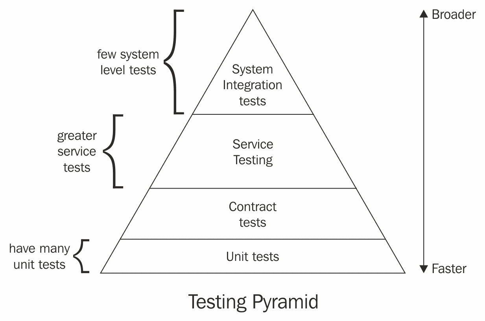
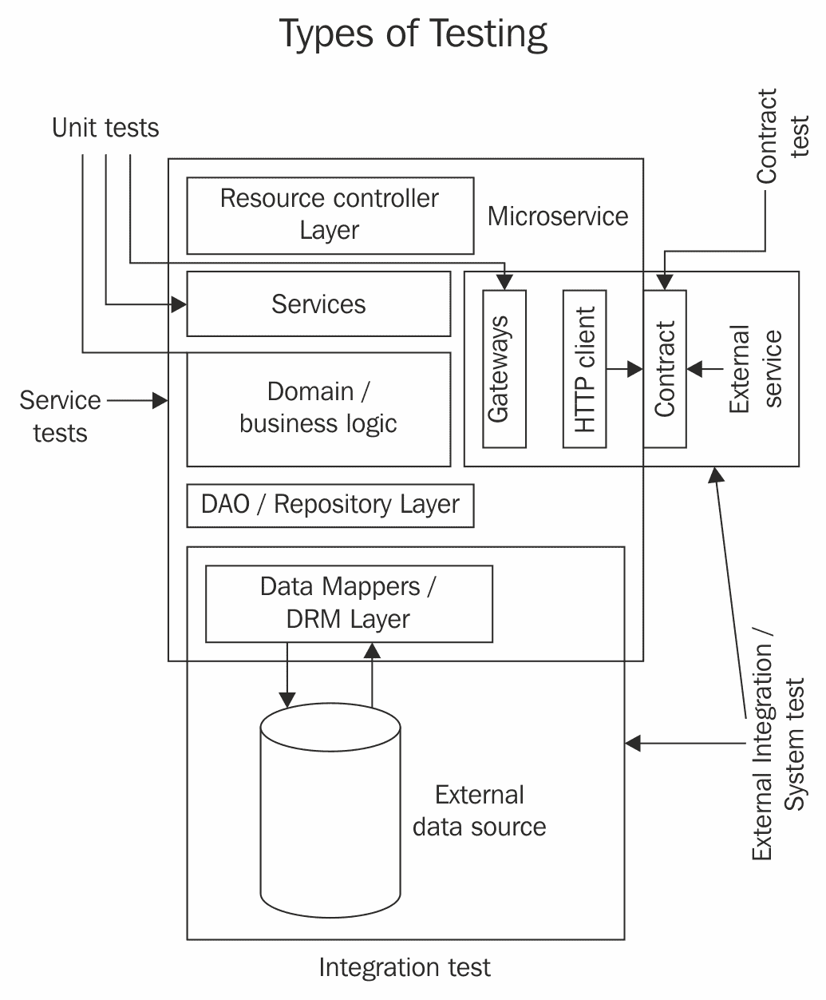
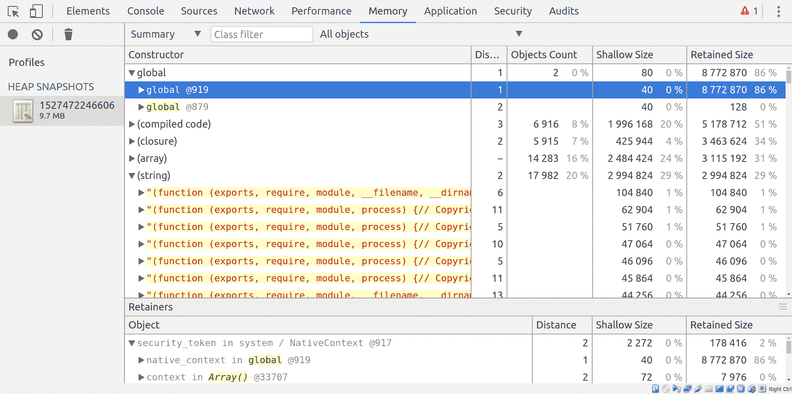
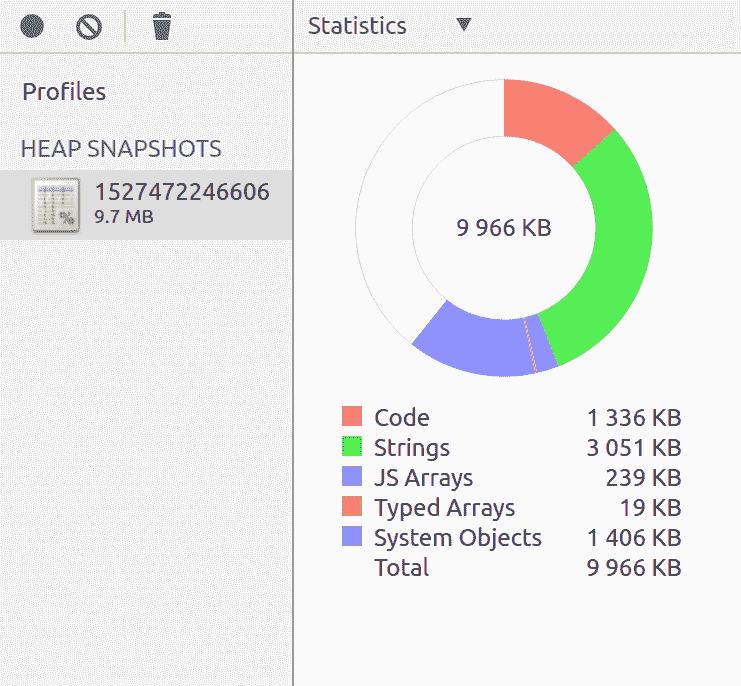
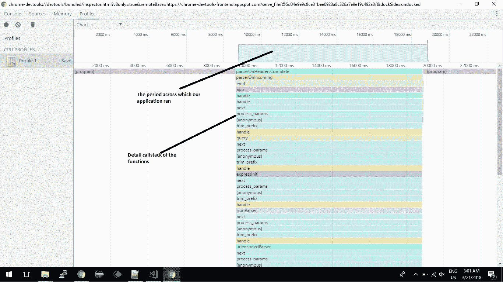
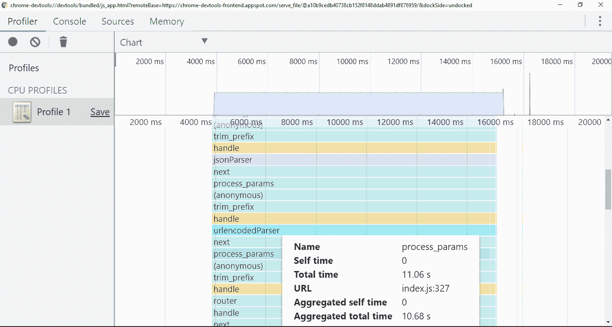
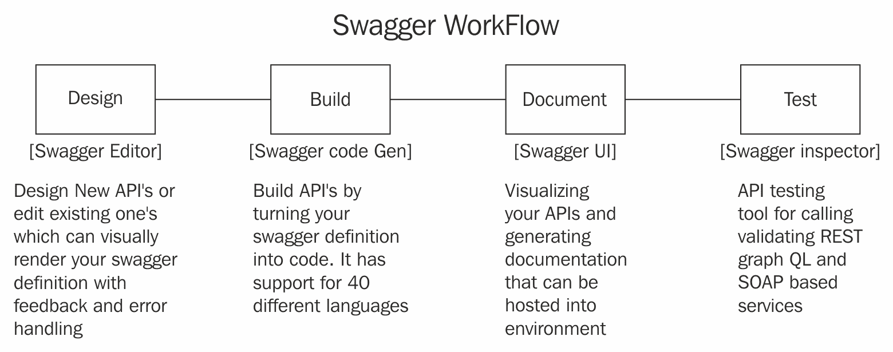
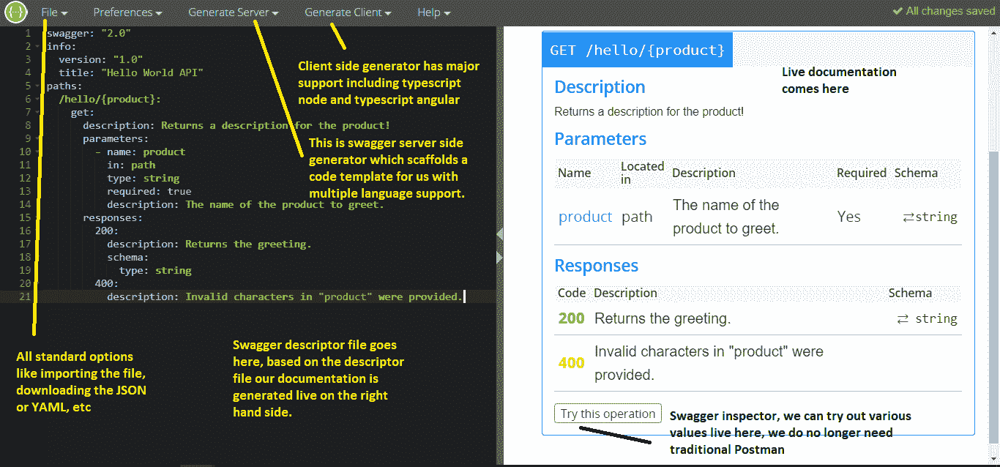
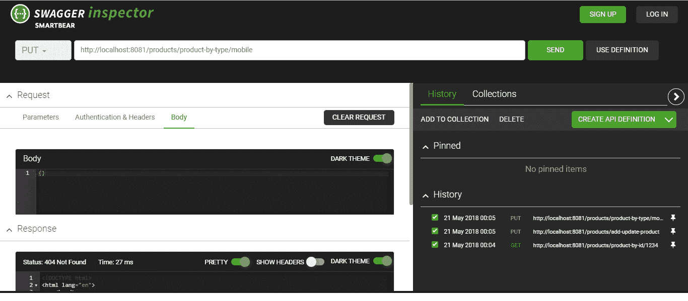

# 第八章：测试、调试和记录

到目前为止，我们已经编写了一些微服务实现（第四章，*开始您的微服务之旅*）；建立了一个单一的接触点，API 网关（第五章，*理解 API 网关*）；添加了一个注册表，每个服务都可以记录其状态（第六章，*服务注册表和发现*）；建立了微服务之间的协作（第七章，*服务状态和服务间通信*）；并编写了一些实现。从开发者的角度来看，这些实现似乎很好，但是现在没有测试就没有人会接受。这是行为驱动开发和测试驱动开发的时代。随着我们编写越来越多的微服务，开发没有自动化测试用例和文档的系统变得难以管理和痛苦。

本章将从理解测试金字塔开始，深入描述微服务中涉及的所有不同类型的测试。我们将了解测试框架，并了解基本的单元测试术语。然后我们将学习调试微服务的艺术，最后学习如何使用 Swagger 记录我们的微服务。

本章涵盖以下主题：

+   编写良好的自动化测试用例

+   理解测试金字塔并将其应用于微服务

+   从外部测试微服务

+   调试微服务的艺术

+   使用 Swagger 等工具记录微服务

# 测试

测试是任何软件开发的基本方面。无论开发团队有多么优秀，总会有改进的空间或者他们的培训中有遗漏的地方。测试通常是一项耗时的活动，根本没有得到应有的关注。这导致了行为驱动开发的普及，开发人员编写单元测试用例，然后编写代码，然后运行覆盖率报告以了解测试用例的状态。

# 什么和如何测试

由于微服务是完全分布式的，首先要考虑的问题是要测试什么以及如何测试。首先，让我们快速了解定义微服务并需要测试的主要特征：

+   **独立部署**：每当

+   当一个微服务部署了一个小的或安全的更改后，该微服务就准备好部署到生产环境了。但是我们如何知道更改是否安全呢？这就是自动化测试用例和代码覆盖率发挥作用的地方。有一些活动，比如代码审查、代码分析和向后兼容性设计，可能会起作用，但是测试是一项可以完全信任适应变化的活动。

+   **可以随意替换**：一组良好的测试总是有助于了解新实现是否等同于旧实现。任何新实现都应该针对具有正常工作流程的等效实现进行测试。

+   **小团队的所有权**：微服务是小型的，专注于一个团队，以满足单一的业务需求。我们可以编写覆盖微服务所有方面的测试。

测试过程必须快速、可重复，并且应该是自动化的。接下来的问题是如何测试以及测试时要关注什么。通常，所有测试被分为以下四个部分：

+   **理解用户**：主要的测试模式是发现用户需要什么以及他们遇到了什么问题。

+   **功能检查**：这种测试模式的目标是确保功能正确并符合规格。它涉及用户测试、自动化测试等活动。

+   **防止不必要的更改**：此测试的目标是防止系统中不必要的更改。每当部署新更改时，都会运行几个自动化测试，生成代码覆盖率报告，并可以决定代码覆盖级别。

+   测试金字塔 - 测试什么？

**服务测试（中层）**：这些测试检查系统业务能力的完整执行。它们检查特定的业务需求是否已经实现。它们不关心背后需要多少服务来满足需求。

# 系统测试

测试金字塔是一个指导我们编写何种测试以及在哪个级别进行测试的工具。金字塔顶部的测试表明需要较少的测试，而金字塔底部需要更多的测试。

**系统测试（顶层）**：这些测试跨越完整的分布式微服务系统，并通常通过 GUI 实现。

测试金字塔由四个级别组成，如下所述：



+   **防止运行时行为**：此测试的目标是检查系统存在哪些运行时问题。在这里，我们通过压力测试、负载测试和监控来保护系统。

+   我们将在接下来的部分中更详细地讨论所有这些级别。

+   **单元测试（底层）**：这些测试在微服务中执行非常小的功能片段。几个较低级别的单元测试组合成一个微服务。单元测试仅涉及微服务内的一个小方面，或者我们可以说它们在宏观级别上运行。例如，我们的产品目录服务有许多服务。为其编写单元测试将涉及传递产品 ID 并确保我获得正确的产品。

+   在我们的购物车微服务中，系统测试的一个示例将是完整的结账流程。它使用添加到购物车系统的 Web UI，在那里我们添加多个项目，生成发票，应用折扣代码，并使用测试信用卡付款。如果测试通过，我们可以断言折扣代码可以应用并且可以收到付款。如果断言失败，任何事情都可能导致失败，例如商品的价格错误，可能添加了额外费用，或者可能支付服务失败。为了解决此问题，我们需要测试所有微服务以找到确切的罪魁祸首。

**合同测试（较低级别）**：这些测试在外部服务的边界上进行，以验证是否符合消费服务期望的合同。

# 在接下来的部分中，我们将讨论微服务中的测试金字塔。

位于金字塔顶部的是系统测试或端到端测试。它们具有非常广泛的范围，或者我们可以说它们具有 5 万英尺的范围，并试图在很少的测试中涵盖很多内容。它们不会降到宏观级别。每当系统测试失败时，很难确定问题所在，因为它的范围很大。测试覆盖整个分布式系统，因此问题可能出现在任何地方，任何组件中。

覆盖大量服务和更广泛的领域，系统测试通常倾向于缓慢和不精确（因为我们无法确定失败的确切服务）。而不是使用模拟系统，实际进行服务请求，将事物写入真实数据存储，并甚至轮询真实事件源以监视系统。

一个重要的问题是关于需要运行多少系统测试。系统测试成功时可以给予很大的信心，但它们也缓慢且不精确；我们只能为系统的最重要的用例编写系统级测试。这可以让我们覆盖系统中所有重要业务能力的成功路径。

对于完整的端到端测试，我们可以采取以下行动之一：

+   使用 JSON 请求测试我们的 API

+   使用 Selenium 测试 UI，模拟对 DOM 的点击。

+   使用行为驱动开发，将用例映射到我们应用程序中的操作，并在我们构建的应用程序上执行

我的建议是只编写面向业务的重要业务能力系统测试，因为这样可以对完全部署的系统进行大量练习，并涉及利用生态系统中的所有组件，如负载均衡器、API 网关等。

# 服务测试

这些测试处于测试金字塔的中间层，它们专注于与一个微服务的完整交互，并且是独立的。这个微服务与外部世界的协作被模拟 JSON 所取代。服务级测试测试场景，而不是进行单个请求。它们进行一系列请求，共同形成一个完整的图片。这些是真正的 HTTP 请求和响应，而不是模拟的响应。

例如，信用计划的服务级测试可以执行以下操作：

1.  发送命令以触发信用类别中的用户（这里的命令遵循 CQRS 模式，见第一章，“揭秘微服务”）。CQRS 遵循同步通信模式，因此，它的测试代码是相同的。我们发送命令以触发其他服务来满足我们的服务测试标准。

1.  根据用户的月度消费决定最佳的忠诚度优惠。这可以是硬编码的，因为它是一个不同的微服务。

1.  记录发送给用户的优惠，并发送响应以检查服务的功能。

当所有这些方面都通过时，我们可以断言信用计划微服务成功运行，如果任何一个功能失败，我们可以肯定问题出在信用计划微服务中。

服务级测试比系统级测试更精确，因为它们只涵盖一个单一的微服务。如果这样的测试失败，我们可以肯定地断言问题出在微服务内部，假设 API 网关没有错误，并且它提供了与模拟中写的完全相同的响应。另一方面，服务级测试仍然很慢，因为它们需要通过 HTTP 与被测试的微服务进行交互，并且需要与真实数据库进行交互。

我的建议是，应该为最重要的可行故障场景编写这些测试，要牢记编写服务级测试是昂贵的，因为它们使用微服务中的所有端点，并涉及基于事件的订阅。

# 合同测试

在分布式系统中，微服务之间有很多协作。协作需要作为一个微服务对另一个微服务的请求来实现。端点的任何更改都可能破坏调用该特定端点的所有微服务。这就是合同测试的作用所在。

当任何微服务进行通信时，发出请求的微服务对另一个微服务的行为有一些期望。这就是协作的工作方式：调用微服务期望被调用的微服务实现某个固定的合同。合同测试是为了检查被调用的微服务是否按照调用微服务的期望实现了合同的测试。

尽管契约测试是调用方微服务代码库的一部分，但它们也测试其他微服务中的内容。由于它们针对完整系统运行，因此有利于针对 QA 或分阶段环境运行它们，并配置在每次部署时自动运行契约测试。当契约失败时，意味着我们需要更新我们的测试替身或更改我们的代码以适应契约所做的新更改。这些测试应该根据外部服务的更改数量来运行。契约测试的任何失败都不会像普通测试失败那样破坏构建。这表明消费者需要跟上变化。我们需要更新测试和代码以使一切保持同步。这将引发与生产者服务的对话，讨论该变化如何影响其他方面。

我的结论是，契约测试与服务测试非常相似，但区别在于契约测试侧重于满足与服务通信的先决条件。契约测试不设置模拟协作者，实际上会向正在测试的微服务发出真实的 HTTP 请求。因此，如果可能的话，它们应该针对每个微服务进行编写。

# 单元测试

这些是测试金字塔底部的测试。这些测试也涉及单个微服务，但与服务测试不同，它们不关注整个微服务，也不通过 HTTP 工作。单元测试直接与正在测试的微服务的部分/单元进行交互，或通过内存调用。单元测试看起来就像您正在进行真实的 HTTP 请求，只是您在处理模拟和断言。通常涉及两种类型的单元测试：一种涉及数据库调用，另一种直接涉及内存调用。如果测试的范围非常小，并且测试代码和微服务中的生产代码在同一个进程中运行，那么测试可以被称为单元测试。

单元测试的范围非常狭窄，因此在识别问题时非常精确。这有助于有效处理故障和错误。有时，您可以通过直接实例化对象然后对其进行测试，使微服务的范围更窄。

对于我们的信用计划，我们需要几个单元测试来测试端点和业务能力。我们需要测试用户设置，包括有效和无效数据。我们需要测试读取现有和不存在的用户，以检查我们的忠诚度和月度福利。

我的建议是，我们应该决定最窄的单元测试可以有多窄。从测试应该覆盖的内容开始，然后逐渐添加更精细的细节。一般来说，我们可以使用两种单元测试风格：经典的（基于状态的行为测试）或模拟的（通过模拟实际行为支持的交互测试）。

在下图中，我们可以看到应用于微服务的所有测试类型：



测试类型

现在我们知道了微服务级别需要的所有测试类型，是时候看看我们的微服务测试框架了。在下一节中，我们将看到不同类型测试的实际实现，并进行微服务的代码覆盖率。让我们开始吧。

# 实践测试

现在是时候动手使用微服务测试框架了。在本节中，我们将首先了解测试基础知识，然后继续编写一些单元测试、合同测试和服务级测试。编写测试有很大的优势。我们被迫思考如何将代码分解为子函数，并根据单一职责原则编写代码。全面的测试覆盖率和良好的测试使我们了解应用程序的工作原理。在本节中，我们将使用一些著名的工具集：Mocha，Chai，Sinon 和 Ava。Ava 将是我们的测试运行器，Chai 将是我们的断言库，Sinon 将是我们的模拟库。

# 我们的库和测试工具类型

测试工具可以分为各种功能。为了充分利用它们，我们总是使用它们的组合。让我们根据它们的功能来看看可用的最佳工具：

+   提供测试基础：Mocha，Jasmine，Jest，Cucumber

+   提供断言函数：Chai，Jasmine，Jest，Unexpected

+   生成、显示和观察测试结果：Mocha，Jasmine，Jest，Karma

+   生成和比较组件和数据结构的快照：Jest，Ava

+   提供模拟、间谍和存根：Sinon，Jasmine，Enzyme，Jest，test double

+   生成代码覆盖报告：Istanbul，Jest，Blanket

+   E2E 测试：Casper，Nightwatch

在本节中，我们将快速浏览 Ava，Chai，Mocha 和 Sinon，并了解它们对我们有什么提供。

尽管 Mocha 是一个标准库，但我选择了 Ava，因为它与 Mocha 相比非常快，它将每个测试作为单独的 Node.js 进程运行，从而节省 CPU 使用率和内存。

# 柴

这是一个基本的断言库，遵循 TDD/BDD，可以与任何其他库一起使用，以获得高质量的测试。一个断言 i

任何必须实现的语句，否则应该抛出错误并停止测试。这是一个非常强大的工具，可以编写易于理解的测试用例。

它提供了以下三个接口，使测试用例更易读和更强大：

+   `should`

+   `expect`

+   `assert`

除了这三个接口，我们还可以使用各种自然语言词汇。完整列表可以在[`www.chaijs.com/api/bdd/`](http://www.chaijs.com/api/bdd/)找到。

你一定想知道`should`和`expect`之间的区别是什么。嗯，这是一个自然的问题。尽管`should`和`expect`做同样的事情，但根本区别在于`assert`和`expect`接口不修改`Object.prototype`，而`should`则会。

# Mocha

Mocha 是最著名和广泛使用的库之一，遵循行为驱动开发测试。在这里，测试描述了任何服务的用例，并且它使用另一个库的断言来验证执行代码的结果。Mocha 是一个测试运行器。它被用来

组织和运行测试通过`describe`和它的操作符。 Mocha 提供了各种功能，比如：

+   `beforeEach()`: 在测试文件中的每个规范之前调用一次，从中运行测试

+   `afterEach()`: 在测试文件中的每个规范之后调用一次

+   `before ()`: 这在任何测试之前运行代码

+   `after()`: 这在所有测试运行后运行代码

# Ava

Ava，像 Mocha 一样，是一个测试运行器。Ava 利用 Node.js 的并行和异步特性，并通过单独的进程并行处理运行测试文件。根据统计数据，在`pageres`（一个捕获屏幕截图的插件）中从 Mocha 切换到 Ava，将测试时间从 31 秒降至 11 秒（[`github.com/avajs/ava/blob/master/readme.md`](https://github.com/avajs/ava/blob/master/readme.md)）。它有各种选项，如快速失败、实时监视（在更改文件时以监视模式重新运行测试）、存储快照等。

Ava 是为未来设计的，完全使用 ES6 编写。测试可以并行运行，可以选择同步或异步进行测试。默认情况下，测试被认为是同步的，除非它们返回一个 promise 或一个 observable。它们大量使用异步函数：

```ts
import test from 'ava';
const fn = async () => Promise.resolve('typescript-microservices');
test(
  async (t) => {
    t.is(await fn(), 'typescript-microservices');
  });
```

它有各种选项，如：

+   报告（显示测试覆盖率的美观报告）

+   快速失败（在第一个失败的测试用例后停止）

+   跳过测试

+   未来的测试

# Sinon

通常，微服务需要调用其他微服务，但我们不想调用实际的微服务；我们只想关注方法是否被调用

或者不。为此，我们有 Sinon，一个框架，它给我们提供了模拟和间谍的选项，通过提供模拟响应或创建间谍服务来实现我们的目的。它提供以下功能：

+   **Stub**：存根是一个带有预先记录和特定响应的虚拟对象。

+   **Spy**：间谍是真实对象和模拟对象之间的混合体。一些方法被间谍对象遮蔽。

+   **Mock**：模拟是替换实际对象的虚拟对象。

# 伊斯坦布尔

这是一个代码覆盖工具，用于跟踪语句、分支和功能覆盖。模块加载器可以在不需要配置的情况下即时对代码进行检测。它提供多种报告格式，如 HTML、LCOV 等。它也可以用于命令行。通过将其嵌入为自定义中间件，它可以用作 Node.js 的服务器端代码覆盖工具。

# 使用 Pact.js 进行合同测试

每个微服务都有自己独立的实现；比如我们的类别服务（产品目录服务）。它有一个用于获取类别列表、获取与这些类别相关的产品列表、添加任何新类别等的端点。现在我们的购物车微服务（消费者）利用这个服务，但在任何时候，类别微服务（提供者）可能会发生变化。

在任何时候：

+   提供者可能会将端点`/categories/list`更改为`/categories`

+   提供者可能会更改有效负载中的几个内容

+   提供者可能会添加新的强制参数或引入新的身份验证机制

+   提供者可能会删除消费者所需的端点

任何这些情况都可能导致潜在的灾难！这些类型的测试不会被单元测试处理，传统方法是使用集成测试。但是，我们可以看到集成测试的潜在缺点，例如以下内容：

+   集成测试很慢。它们需要设置集成环境，满足提供者和消费者的依赖关系。

+   它们很脆弱，可能因其他原因而失败，比如基础设施。集成测试的失败并不一定意味着代码有问题。由于集成测试的范围很广，要找出实际问题变得非常痛苦。

因此，我们需要进行合同测试。

# 什么是消费者驱动的合同测试？

合同测试意味着我们根据一组期望（我们定义为合同的内容）来检查我们的 API，这些期望是要实现的。这意味着我们想要检查，当收到任何 API 请求时，我们的 API 服务器是否会返回我们在文档中指定的数据。我们经常忽略关于我们的 API 客户需求的精确信息。为了解决这个问题，消费者可以定义他们的期望集作为模拟，在单元测试中使用，从而创建他们期望我们实现的合同。我们收集这些模拟，并检查我们的提供者在以与模拟设置相同的方式调用时是否返回相同或类似的数据，从而测试服务边界。这种完整的方法被称为消费者驱动的合同测试。

消费者驱动的合同的想法只是为了规范消费者和提供者之间的任何或所有交互。消费者创建一个合同，这只是消费者和提供者之间关于将发生的交互量或简单地陈述消费者对提供者的期望的协议。一旦提供者同意了合同，消费者和提供者都可以拿到合同的副本，并使用测试来验证系统的任何一端不会发生合同违反。这种测试的主要优势是它们可以独立和本地运行，速度非常快，而且可以毫不费力地运行。同样，如果提供者有多个消费者，我们需要验证多个合同：每个消费者一个。这将帮助我们确保对提供者的更改不会破坏任何消费者服务。

Pact 是一个著名的开源框架，可以进行消费者驱动的合同测试。 Pact 有各种平台的不同实现，例如 Ruby、JVM 和.NET。我们将使用 JavaScript 版本的 Pact JS。所以让我们开始吧。让我们开始 Pact 之旅。

# Pact.js 简介

我们将利用 NPM 中可用的`pact`模块（[`www.npmjs.com/package/pact`](https://www.npmjs.com/package/pact)）。整个过程将如下所示，我们将

需要在消费者和提供者两个级别进行操作。

我们将把我们的实现分为两部分。我们将建立一个提供者以及一个客户端，以测试服务是否相互通信：

+   **在消费者端**：

1.  我们将创建一个模拟的网络服务器，它将充当服务提供者，而不是进行实际调用。 Pact.js 提供了这个功能。

1.  对于我们想要检查的任何请求，我们将定义模拟服务需要返回的预期响应，以检查是否有任何突然的变化。在 Pact 语言中，我们称这些为交互；也就是说，对于给定的请求，消费者希望提供者返回什么？

1.  接下来，我们创建单元测试，我们将运行我们的服务客户端与模拟提供者进行检查，以确保客户端返回这些预期值。

1.  最后，我们将创建一个包含消费者期望的合同的`pact`文件。

+   **在提供者端**：

1.  提供者端从消费者那里获取 pact 文件。

1.  它需要验证它不违反消费者的预期交互。`Pact.js`将读取`pact`文件，执行每个交互的请求，并确认服务是否返回消费者期望的有效负载。

1.  通过检查提供者不违反任何消费者的合同，我们可以确保对提供者代码的最新更改不会破坏任何消费者代码。

1.  这样，我们可以避免集成测试，同时对我们的系统充满信心。

在了解了整个过程之后，现在让我们来实现它。我们将依次遵循关于消费者和提供者的前述步骤。完整的示例可以在`chapter-8/pact-typescript`中找到。我们的示例项目是类别微服务，我们将围绕它进行操作。所以，让我们开始吧：

1.  我们首先创建一个提供者。我们将创建一个返回一些动物的服务以及一个在传递 ID 时给我动物的特定动物服务。

1.  按照提供者的代码，通过从`packt-typescript/src/provider`添加`provider.ts`、`providerService.ts`、`repository.ts`以及从`pact-typescript/data`添加`data.json`。

1.  添加以下依赖项：

```ts
npm install @pact-foundation/pact --save
```

1.  现在我们将创建一个消费者。消费者从提供者那里获取文件。我们将创建一个 Pact 服务器：

```ts
const provider = new Pact({
  consumer: "ProfileService",
  provider: "AnimalService",
  port: 8989,
  log: path.resolve(process.cwd(), "logs", "pact.log"),
  dir: path.resolve(process.cwd(), "pacts"),
  logLevel: "INFO",
  spec: 2
});
```

1.  接下来，我们定义我们的期望，我们将说：

```ts
const EXPECTED_BODY = [{..//JSON response here ...//…..}]
```

1.  接下来，我们编写通常的测试，但在添加测试之前，我们在 Pact 中添加这些交互：

```ts
describe('and there is a valid listing', () => {
     before((done) => {
       // (2) Start the mock server
       provider.setup()
         // (3) add interactions to the Mock Server, 
                as many as required
         .then(() => {
           return provider.addInteraction({//define interactions here })
                          .then(() => done())
```

1.  接下来，我们编写通常的测试：

```ts
// write your test(s)
     it('should give a list for all animals', () => {
  // validate the interactions you've registered 
     and expected occurrance
           // this will throw an error if it fails telling you 
              what went wrong
});
```

1.  关闭模拟服务器：

```ts
after(() => {provider.finalize()})
```

1.  现在我们已经完成了提供者方面的工作，我们需要验证我们的提供者。启动`provider`服务，并在其测试文件中添加以下代码：

```ts
const { Verifier } = require('pact');
let opts = { //pact verifier options};
new Verifier().verifyProvider(opts)
              .then(function () {
                 // verification complete.
});
```

# 奖励（容器化 pact broker）

在动态环境中，我们需要跨应用程序共享 Pacts，而不是在单个应用程序中工作。为此，我们将利用 Pact broker 的功能。您可以从[`hub.docker.com/r/dius/pact-broker/`](https://hub.docker.com/r/dius/pact-broker/)简单地下载它。您可以使用`docker pull dius/pact-broker`通过 Docker 下载它。一旦启动，您可以使用`curl -v http://localhost/9292 #`访问经纪人，您也可以在浏览器中访问！您还可以使用数据库配置它，并运行一个组合的`docker-compose.yml`文件。可以在[`github.com/DiUS/pact_broker-docker/blob/master/docker-compose.yml`](https://github.com/DiUS/pact_broker-docker/blob/master/docker-compose.yml)找到配置为 Postgres 的 pact-broker 的演示配置。通过执行`docker-compose up`命令配置后，可以在端口 80 或端口 443 上访问`pact` broker，具体取决于是否启用了 SSL。

# 重新审视测试关键点

在继续本书的下一部分之前，让我们回顾一下测试的关键点：

+   测试金字塔表示每种测试所需的测试数量。金字塔顶部的测试数量应该比它们下面的级别少。

+   由于其更广泛的范围，系统级测试应该是缓慢和不精确的。

+   系统级测试应该只用于为重要的业务功能提供一些测试覆盖。

+   服务级测试比系统级测试更快，更精确，因为它们只需处理较小的范围。

+   应该遵循一种实践，即为成功和重要的失败场景编写服务级测试。

+   合同测试很重要，因为它们验证一个微服务对另一个微服务的 API 和行为的假设。

+   单元测试应该快速，并且通过只包括一个单元或使用单一职责原则来保持快速。

+   为了拥有更广泛的测试覆盖范围，总是先编写服务测试，当编写服务测试变得难以管理时再编写单元测试。

+   我们使用 Sinon，Ava，Chai 和 Istanbul 来测试我们的微服务。

+   要编写服务级测试：

+   编写被测试微服务的模拟端点

+   编写与微服务交互的场景

+   对来自微服务的响应和它对协作者的请求进行断言

+   通过使用 Pact，您可以编写合同级别的测试，从而避免集成测试。

+   合同测试非常有帮助，因为它们确保微服务遵守其预先制定的合同，并且服务的任何突然变化都不会破坏任何业务功能。

+   **高级：** 有时您可能需要在实时环境中尝试代码片段，无论是为了重现问题还是在真实环境中尝试代码。Telepresence ([`telepresence.io/`](http://telepresence.io/)) 是一个工具，允许您在 Kubernetes 中交换运行的代码。

+   **高级：** Ambassador ([`www.getambassador.io/`](https://www.getambassador.io/)) 是一个 API 网关，允许微服务轻松注册其公共端点。它有各种选项，例如有关流量的统计信息，监控等。

+   **高级：** Hoverfly ([`hoverfly.io/`](https://hoverfly.io/)) 是实现微服务虚拟化的一种方式。我们可以通过它模拟 API 中的延迟和故障。

经过测试流程后，现在是时候通过调试解决问题了。我们将学习有关调试和分析微服务的内容。

# 调试

调试是任何系统开发中最重要的方面之一。调试或解决问题的艺术在软件开发中至关重要，因为它帮助我们识别问题、对系统进行分析，并确定导致系统崩溃的罪魁祸首。有一些关于调试的经典定义：

“调试就像解决一起谋杀案，而你是凶手。如果调试是消除错误的过程，那么软件开发就是将这些错误放入其中的过程”

- Edsgar Dijkstra。

调试 TypeScript 微服务与调试任何 Web 应用程序非常相似。在选择开源免费替代方案时，我们将选择 node-inspector，因为它还提供非常有用的分析工具。

我们已经在第二章《为旅程做准备》中通过 VS Code 进行了调试。

在下一节中，我们将学习如何使用 node-inspector 对我们的应用程序进行分析和调试。我们将看看远程调试的各个方面，以及如何构建一个代理来调试我们的微服务。所以，让我们开始吧。

# 构建一个代理来调试我们的微服务

微服务是基于业务能力分布的。对于最终用户来说，它们可能看起来像是单一功能，比如购买产品，但在幕后，涉及到许多微服务，比如支付服务、加入购物车服务、运输服务、库存服务等等。现在，所有这些服务不应该驻留在单个服务器内。它们根据设计和基础设施进行分布和分发。在某些情况下，两个服务器会相互协作，如果这些服务没有受到监控，就可能在任何级别出现不良行为。这是微服务中一个非常常见的问题，我们将使用`http-proxy`和隧道来解决。我们将创建一个非常简单的示例，记录任何请求的原始标头。这些信息可以为我们提供有关网络实际发生了什么的宝贵信息。这个概念与我们在 API 网关中使用的非常相似。通常，API 网关是所有请求的代理；它查询服务注册表动态获取微服务的位置。这个代理层，我们的网关，有各种优势，我们在第五章《理解 API 网关》中看到了。我们将使用 node 模块`http-proxy`（[`www.npmjs.com/package/http-proxy`](https://www.npmjs.com/package/http-proxy)）并在那里记录请求标头。初始化一个 Node.js 项目，添加`src`、`dist`和`tsconfig.json`文件夹，添加`http-proxy`模块及其类型。然后，在 index.ts 中输入以下代码以创建代理服务器。完整的代码可以在提取的源代码中找到，位于`第八章/ts-http-proxy`下：

```ts
export class ProxyServer {
  private proxy: any;
  constructor() {
    this.registerProxyServer();
    this.proxy = httpProxy.createProxyServer({});
    //we are passing zero server options, but we can pass lots of options such as buffer, target, agent, forward, ssl, etc. 
  }
  registerProxyServer(): void {
    http.createServer((req: IncomingMessage, res: ServerResponse) => {
      console.log("===req.rawHeaders====", req.rawHeaders);
      this.proxy.web(req, res, {
        target: 'http://127.0.0.1:3000/
            hello-world'})
        }).listen(4000)
    }}
  //after initializing make an object of this class
  new ProxyServer();
```

接下来，当您访问`localhost:4000`时，它将打印所有原始标头，您可以在源代码中检查并查看服务的响应。

在下一节中，我们将看看 Chrome 调试扩展和分析工具。

# 分析过程

在分析服务性能方面，分析是一个关键过程。Node.js 有一些原生工具可以对任何正在运行的 V8 进程进行分析。这些只是包含有关 V8 处理过程的统计信息的有效摘要的快照，以及 V8 在编译时如何处理该过程以及在优化运行热代码时所做的操作和决策。

我们可以通过传递`--prof`标志在任何进程中生成 v8 日志。`prof`代表配置文件。例如`node --prof index.js`。那不会是一个可读的格式。要创建一个更可读的格式，运行`node --prof-process <v8.logfilename>.log >`命令的配置文件。

在本节中，我们将学习如何使用配置文件日志进行分析、获取堆快照，并利用 Chrome 的 CPU 分析来进行微服务。所以，让我们开始吧。您可以使用`node --prof <file_name>.js`处理任何文件的日志。

# 转储堆

堆是一个巨大的内存分配。当我们谈论我们的情况时，它是分配给 V8 进程的内存（回想一下 Node.js 的工作原理-事件循环和内存分配）。通过检查内存使用情况，您可以跟踪诸如内存泄漏之类的问题，或者只是检查服务的哪个部分消耗最多，根据这一点，您可以相应地调整代码。我们有一个非常好的`npm`模块（[`github.com/bnoordhuis/node-heapdump`](https://github.com/bnoordhuis/node-heapdump)），它可以生成一个稍后用于检查的转储。让我们熟悉读取转储过程以及何时进行转储，尽管以下步骤：

1.  我们安装 Heap Dump 并创建一个准备好使用的转储。打开任何项目，并使用以下命令安装`heapdump`模块：

```ts
npm install heapdump --save and npm install @types/heapdump --save-dev
```

1.  接下来，将以下代码行复制到您想要创建快照的任何进程中。我将它们保留在`Application.ts`中，只是一个例子。您可以在`chapter8/heapdump_demo`中遵循代码：

```ts
import * as heapdump from 'heapdump';
import * as path from 'path';
heapdump.writeSnapshot(path.join(__dirname, `${Date.now()}.heapsnapshot`),
  (err, filename) => {
    if (err) {
      console.log("failed to create heap snapshot");
    } else {
      console.log("dump written to", filename);
    }
  }
);
```

1.  现在，当您运行程序时，您可以在我们运行前面的代码行的目录中找到快照。您将找到类似于转储写入到`/home/parth/chapter 8/heapdump_demo/../<timestamp>.heapsnapshot`的输出。

1.  我们必须有类似`<current_date_in_millis>.heapsnapshot`的东西。它将以不可读的格式存在，但这就是我们将利用 Chrome 的 DevTools 的地方。打开 Chrome DevTools 并转到 Memory | Select profiling type | Load 选项。打开快照文件，您将能够看到以下屏幕截图：



1.  单击 Statistics，您将能够看到这个：



您可以通过以下链接深入了解性能分析：

+   [`developers.google.com/web/tools/chrome-devtools/memory-problems/memory-101`](https://developers.google.com/web/tools/chrome-devtools/memory-problems/memory-101)[h](https://addyosmani.com/blog/taming-the-unicorn-easing-javascript-memory-profiling-in-devtools/)

+   [ttps://addyosmani.com/blog/taming-the-unicorn-easing-javascript-memory-profiling-in-devtools/](https://addyosmani.com/blog/taming-the-unicorn-easing-javascript-memory-profiling-in-devtools/)

我们可以定期进行转储，或者在发生错误时进行转储，这将有助于找到微服务中的问题。接下来，我们将看看如何进行 CPU 分析。

# CPU 分析

Chrome 开发者工具有一些非常好的选项，不仅限于调试。我们还可以利用内存分配、CPU 分析等。让我们深入研究 CPU 分析。为了理解工具，我们将启动一个消耗大量 CPU 的程序：

1.  创建任何 express 应用程序并创建一个随机路由，基本上迭代 100 次并在内存中分配 10⁸的缓冲区。您可以在`chapter 8/cpu-profiling-demo`中遵循代码：

```ts
private $alloc(){
  Buffer.alloc(1e8, 'Z');
}

router.get('/check-mem',
  (req, res, next) => {
    let check = 100;
    while (check--) {
      this.$alloc()
    }
    res.status(200).send('I am Done');
  }
)
```

1.  下一步是在 Chrome DevTools 中运行 Node.js 进程。要这样做，只需在`node --inspect ./dist/bin/www.js`中添加`--inspect`标志。

Chrome 调试协议包含在 Node.js 核心模块中，我们不需要在每个项目中都包含它。

1.  打开`chrome://inspect`，我们将能够在其中看到我们的进程。单击 inspect，我们就可以像标准 Web 应用程序一样调试 Node.js 应用程序。

1.  单击 Profiler，这是我们将调试 CPU 行为的地方。单击 Start，打开任何选项卡，然后点击`localhost:3000/check-mem`。回到我们的选项卡。当您能够看到 I am done 时，单击 Stop。您应该能够看到类似于图中的分析和分析详细信息：



性能分析

1.  现在，将鼠标悬停在单行上，您将能够看到这样的详细视图：



分析细节

# 实时调试/远程调试

倒数第二个重要功能是实时调试问题。随着 Node.js 内部引入检查器协议，这变得非常容易，因为我们所要做的就是创建一个运行进程的`--inspect`版本。这将打印出调试打开的进程的 URL，类似于这样：

```ts
Debugger listening on ws://127.0.0.1:9229/1309f374-d358-4d41-9878-8448b721ac5c
```

您可以安装 Chrome 扩展程序 Node.js V8 --inspector Manager (NiM)，从[`chrome.google.com/webstore/detail/nim-node-inspector-manage/gnhhdgbaldcilmgcpfddgdbkhjohddkj`](https://chrome.google.com/webstore/detail/nim-node-inspector-manage/gnhhdgbaldcilmgcpfddgdbkhjohddkj)用于调试远程应用程序，或者您甚至可以生成一个用于调试的进程并指定一个端口。

```ts
node inspect --port=xxxx <file>.js
```

您可以在这里找到其他选项：[`nodejs.org/en/docs/guides/debugging-getting-started/#command-line-options`](https://nodejs.org/en/docs/guides/debugging-getting-started/#command-line-options)。当使用`--inspect`开关启动任何进程时，Node.js 通过套接字侦听它，以诊断命令唯一地标识主机和端口。每个进程都被分配一个唯一的 UUID 以进行跟踪。Node-Inspector 还提供了一个 HTTP 端点来提供有关调试器的元数据，包括其 WebSocket URL、UUID 和 Chrome DevTools URL。我们可以通过访问`<host:port>/json/list`来获取这些信息。

调试很棒，但我们应该确保它不会带来副作用。调试意味着打开一个端口，这将带来安全隐患。应该特别注意以下几点：

+   公开暴露调试端口是不安全的

+   在内部运行的本地应用程序可以完全访问应用程序检查器

+   应该保持同源策略

这结束了我们的调试和分析会话。在下一节中，我们将重新讨论关键点，然后转向文档编制。

# 调试的关键点

在本节中，我们看到了调试和与分析相关的核心方面。我们学习了如何诊断泄漏或观察堆转储内存以分析服务请求。我们看到了代理通常可以帮助，即使它增加了网络跳数：

+   为了避免过载，我们有一个提供`503`中间件的模块。有关实现细节，请参阅[`github.com/davidmarkclements/overload-protection`](https://github.com/davidmarkclements/overload-protection)。

+   Chrome Inspector 是调试 Node.js 微服务的非常有用的工具，因为它不仅提供了调试界面，还提供了堆快照和 CPU 分析。

+   VS Code 也是一个非常用户友好的工具。

+   Node.js 拥抱了 node-inspector 并将其包含在核心模块中，从而使远程调试变得非常容易。

现在我们知道了调试的基本方面，让我们继续进行开发人员生活的最后一部分。是的，你猜对了：适当的文档，这不仅为技术团队节省了一天，也为非技术人员节省了一天。

# 文档编制

**文档**是后端和前端之间的一种约定，它负责管理两侧之间的依赖关系。如果 API 发生变化，文档需要快速适应。开发中最容易出错的之一就是缺乏对其他人工作的可见性或意识。通常，传统的方法是编写服务规范文档或使用一些静态服务注册表来维护不同的内容。无论我们如何努力，文档总是过时的。

# 需要文档

开发文档和组织对系统的理解增加了开发人员的技能和速度，同时处理微服务采用中出现的两个最常见的挑战——技术和组织变革。彻底、更新的文档的重要性不容小觑。每当我们问别人在做任何新事物时面临的问题时，答案总是一样。我们都面临同样的问题：我们不知道这个东西是如何工作的，它是一个新的黑匣子，给出的文档毫无价值。

依赖项或内部工具的文档不完善会使开发人员的生活变成一场噩梦，并减慢他们的能力和服务的生产就绪性。这浪费了无数的时间，因为唯一剩下的方法是重新设计系统，直到我们找到解决方案。爱迪生确实说过，“我找到了 2000 种不制造灯泡的方法”，但我更愿意把时间花在找到让自己更出色的 2000 种方法上。服务的文档不完善也会影响到为其做出贡献的开发人员的生产力。

生产就绪文档的目标是制作和组织关于服务的知识的集中存储库。分享这些信息有两个方面：服务的基本部分以及服务对实现哪一部分功能的贡献。解决这两个问题需要标准化共享微服务理解的文档方法。我们可以总结以下文档要点：

+   任何服务都应该有全面和详细的文档（应该包括服务是什么以及它对什么做出了贡献）

+   文档应该定期更新（所有新方法和维护的版本）

+   所有人都应该理解，而不仅仅是技术团队

+   其架构每隔一段固定的时间进行审查和审核

在接近微服务时，随着我们将每个业务能力划分为不同的服务，痛苦呈指数级增加。我们需要一种更通用的方法来记录微服务。Swagger 目前是文档的领先者。

有了 Swagger，您将得到以下内容：

+   不再有不一致的 API 描述。这些将被更新为完整的合同细节和参数信息。

+   您将不再需要编写任何文档；它将自动生成。

+   当然，再也不会有关于文档不完善的争论了。

本节将探讨如何使用 Swagger，了解其核心工具、优势和工作实现。所以，让我们开始吧。

# Swagger 101

Swagger 是您的微服务或者任何 RESTful API 的强大表示。成千上万的开发人员支持 Swagger 几乎在每一种编程语言和环境中。有了 Swagger-enabled 环境，我们可以得到交互式文档、客户端 SDK 生成、可发现性和测试。

Swagger 是 Open API 倡议的一部分（一个标准化 REST API 应该如何描述的委员会）。它提供了一组工具来描述和记录 RESTful API。Swagger 最初是一个 API 文档工具，现在还可以通过 Swagger Codegen（https://github.com/wcandillon/swagger-js-codegen）生成样板代码。Swagger 有一个庞大的工具生态系统，但主要我们将使用以下一组工具。我们将了解如何将 Swagger 与现有应用程序集成，或者编写符合 Swagger 标准的 API，通过这些 API 我们的文档将自动生成。从以下图表中可以了解到涉及的整个过程：



Swagger_workflow

现在让我们看一下涉及过程的整体工具，以便全面了解其中涉及的所有方面。

# Swagger 编辑器和描述符

Swagger Descriptor 采用了设计驱动开发的方法。在这里，我们通过在 YML/YAML 文件或 JSON 文件中描述它们来设计我们端点的行为。（当然，作为开发人员，我甚至懒得写这个文件，我更希望它是自动生成的，我们将在后面的部分中看到。）这是最重要的部分，因为它是有关服务的上下文信息。

查看`第八章/hello_world_swagger.yaml`以了解描述文件的内容。

# Swagger 和描述符的关键点

+   您的 URL 路由、参数和描述都在`.yaml`文件中定义。

+   无论参数是否必需，您都可以使用 required true 进行传递，这将在测试参数时进行验证

+   它还可以返回响应代码及其描述

+   Swagger 读取这个`.yaml`文件来生成其 Swagger UI 并使用 Swagger 检查器测试服务

# Swagger Editor

Swagger Editor 是一个在线工具，可以帮助您

您可以通过在浏览器中预览实时文档来编辑 Swagger API 规范。这样，我们可以看到应用最新更改后文档的实际外观。编辑器具有清晰的界面，易于使用，并具有许多功能，可设计和记录各种微服务。它可以在线访问：[`editor2.swagger.io/#!/`](https://editor2.swagger.io/#!/)。只需编写或导入一个`swagger.yaml`文件，我们就可以实时查看 Swagger UI。

让我们通过 Swagger Editor 和 Swagger Descriptor 动手：

1.  打开[`editor2.swagger.io`](https://editor2.swagger.io)，并输入我们之前的描述符（`hello_world_swagger.yaml`）。

1.  您将能够在右侧看到实时文档：



Swagger Editor

1.  尝试在描述符文件中插入更多代码，并查看交互式文档。另外，尝试运行“尝试此操作”。它将提供 HTTP 请求的描述以及所有标头和响应。

# Swagger Codegen

Swagger Codegen 是一个脚手架引擎，它可以根据 Swagger 定义生成交互式文档、API 客户端和服务器存根。我们在 Swagger Editor 中看到的以前的选项（生成服务器和生成客户端）类似于 Swagger Codegen 的实现。它支持许多语言。

客户端脚手架工具，支持 TypeScript Angular、TypeScript Node、JavaScript、Python、HTML、Java 和 C#等语言。服务器端脚手架工具支持 Haskell、Node.js、Go 语言和 Spring 等语言。

**Swagger CodeGen** ([`swagger.io/swagger-codegen/`](https://swagger.io/swagger-codegen/))帮助我们更快地构建 API，并通过遵循 OpenAPI 定义的规范来提高质量。它生成服务器存根和客户端 SDK，因此我们可以更专注于 API 实现和业务逻辑，而不是代码创建和采用标准：

+   **Swagger CodeGen 的优势**：

+   它生成服务器代码、客户端代码和文档

+   它允许更快地更改 API

+   生成的代码是开源的

+   **Swagger CodeGen 的缺点**：

+   通过添加额外的工具和库以及管理这些工具的复杂性，项目复杂性增加了

+   它可能会生成用户无法消化的大量代码

您可以查看`第八章/typescript-node-client/api.ts`，以查看基于我们最初的 Swagger 描述符定义生成的自动生成代码。

# Swagger UI

Swagger UI 允许我们可视化 RESTful API。可视化是从 Swagger 规范自动生成的。Swagger UI 接收 Swagger 描述文件并在 UI 中使用 Swagger 检查器创建文档。Swagger UI 就是我们在前面截图中右侧看到的内容。此外，这可以根据权限进行访问。Swagger UI 是一组 HTML、JavaScript 和 CSS 资源，可以从符合 Swagger 的 API 动态生成美丽的文档。我们将为我们的产品目录微服务生成文档，并在其中使用 Swagger UI 组件。

# Swagger 检查器

这是一种基于 OpenAPI 规范生成文档的无痛方式。一旦您检查了 SWAGGER 检查器的工作原理，然后您可以创建文档并与世界分享。我们可以通过选择历史记录中先前测试过的端点来轻松自动生成文档，然后发出创建 API 定义的命令。这在网上很像 Postman。您可以将 Swagger 检查器作为 Chrome 扩展程序下载。它具有以下选项：



Swagger 检查器

现在我们已经熟悉了 Swagger，让我们看看如何在微服务中使用 Swagger 为我们生成美丽的文档。接下来的部分讨论了我们可以集成 Swagger 的可能方法。

# 使用 Swagger 的可能策略

Swagger 主要用于记录服务和测试服务。在实施 Swagger 时有两种基本方法。它们如下：

+   **自上而下或设计优先方法：**在这里，使用 Swagger 编辑器创建 Swagger 定义，然后使用 Swagger Code-gen 生成客户端和服务器的代码。在编写任何代码之前，Swagger 将用于设计 API 和源。

+   **自下而上方法：**在这里，对于任何现有的 API，Swagger 用于生成文档。

我们将研究这两种方法以及我们可以使用的最佳实践。 

# 自上而下或设计优先方法

通常，通过添加几行代码来生成有效的 Swagger 文件和文档似乎是一个好主意。我们已经编写了所有的代码，然后我们记得：*天哪，我要如何向其他人解释这个？我需要记录每一个 API 吗？*在这种情况下，通过添加注释来实时生成文档似乎是一个梦想成真。TSOA（[`www.npmjs.com/package/tsoa`](https://www.npmjs.com/package/tsoa)）就是基于这样的原则设计的。根据 TSOA 的 README 文件，它从编写的控制器和包括以下内容的模型生成有效的 Swagger 规范。这本质上是一种自下而上的方法，我们已经有了现有的 REST API，并且利用 Swagger 来记录现有的 API。

TSOA 从控制器和模型生成有效的 Swagger `spec`文件，其中包括：

+   各种 REST URL 的路径（例如：`获取用户：- server_host/users/get_users`）

+   基于 TypeScript 接口的定义（这些是模型文件或属性描述符）

+   参数类型；也就是说，根据 TypeScript 语法，模型属性标记为必需或可选（例如，`productDescription?: string`在 Swagger 规范中标记为可选）

+   jsDoc 支持对象描述（大多数其他元数据可以从 TypeScript 类型中推断出）

与 routing-controllers 类似，路由可以为我们选择的任何中间件生成。选项包括 Express、Hapi 和 Koa。与 routing-controllers 类似，TSOA 内置了类验证器。TSOA 尽可能地减少样板代码，并提供了大量的注释。您可以在`npm`中查看文档，以详细了解各种可用的选项。我们主要关注`@Route`注释，它将为我们生成 Swagger 文档。在示例中，我们将使用 TSOA 并生成文档。

请参阅自上而下方法的提取源，示例非常简单，严格遵循文档。

# 自下而上的方法

哇！经过自上而下的方法，似乎是完美的计划。但是当我们已经开发了项目，现在我们想要生成我们的文档时怎么办呢？我们陷入了困境。我们该怎么办呢？幸运的是，我们有解决方案。我们将利用`swagger-ui-express` ([`www.npmjs.com/package/swagger-ui-express`](https://www.npmjs.com/package/swagger-ui-express))来生成文档。它每周有超过 45,000 次下载。这是一个由社区驱动的包，为您的 express 应用程序提供中间件，根据 Swagger 文档文件提供 Swagger UI。我们需要添加一个路由，用于托管 Swagger UI。文档很好，一切都在那里——我们需要的一切。所以，让我们开始吧。您可以在`Chapter 8/bottom-up-swagger`文件夹中跟随源代码。

1.  从`npm`中安装模块作为依赖项：

```ts
npm install swagger-ui-express --save
```

1.  接下来，我们需要添加一个路由，用于托管 Swagger UI。我们需要生成 Swagger 定义，并在每次部署时更新它。

1.  我们有两种选项来生成 Swagger 文档。要么我们在每个路由处理程序中添加注释，要么我们使用 Swagger inspector 来测试所有 REST API，将它们合并，并生成一个定义文件。

1.  无论我们选择哪种路线，我们的目标都是相同的：生成`swagger.json`文件。采用第一种方法，我们将使用`swagger-jsdoc` ([`www.npmjs.com/package/swagger-jsdoc`](https://www.npmjs.com/package/swagger-jsdoc))。通过以下命令将模块作为依赖项下载：

```ts
npm install swagger-jsdoc --save
```

1.  让我们开始配置。首先，我们需要在 Express 启动时初始化 Swagger JS Doc。创建一个类`SwaggerSpec`，并在其中添加以下代码：

```ts
export class SwaggerSpec {
  private static swaggerJSON: any;
  constructor() { }
  static setUpSwaggerJSDoc() {
    let swaggerDefinition = {
      info: {
        title: 'Bottom up approach Product Catalog',
        version: '1.0.0',
        description: 'Demonstrating TypeScript microservice bottom up approach'
      },
      host: 'localhost:8081',
      basePath: '/'
    };
    let options = {
      swaggerDefinition: swaggerDefinition,
      apis: ['./../service-layer/controllers/*.js']
    }
    this.swaggerJSON = swaggerJSDoc(options);
  }

  static getSwaggerJSON() {
    return this.swaggerJSON;
  }
}
```

在这里，我们初始化了 JSDoc，并将`swagger.json`存储在私有静态变量`swaggerJSON:any`中，这样在需要提供 JSON 时就可以使用它。我们在`JSDoc`对象中保留了通常的配置。

1.  接下来，在 express 启动时，我们需要初始化`setUpSwaggerJSDoc`方法，这样我们就可以在服务器启动时填充 JSON。

1.  创建一个新的`Controller`，它会给我们提供`swagger.json`作为 HTTP 端点。

```ts
@JsonController('/swagger')
export class SwaggerController {
  constructor() { }
  @Get('/swagger.json')
  async swaggerDoc( @Req() req, @Res() res) {
    return SwaggerSpec.getSwaggerJSON();
  }
}
```

1.  访问`http://localhost:8081/swagger/swagger.json`以查看初始的 Swagger JSON。

1.  现在，我们需要在每个路由中添加 JSDoc 风格的注释以生成 Swagger 规范，并在路由处理程序中添加 YAML 注释。添加适当的注释将填充我们的`swagger.json`：

```ts
/**
* @swagger
* definitions:
* Product:
* properties:
* name:
* type:string
* /products/products-listing:
* get:
* tags:
* - Products
* description: Gets all the products
* produces:
* - application/json
* responses:
* 200:
* description: An array of products
* schema:
* $ref: '#/definitions/Product'
*/
getProductsList() {
 //
}
```

1.  另一个选择是使用 Swagger inspector 生成文档。现在我们已经完成了 Swagger 生成，我们需要生成 Swagger UI。在`Express.ts`中添加以下内容：

```ts
app.use('/api-docs', swaggerUi.serve, swaggerUi.setup(swaggerDocument));
app.use('/api/v1', router);
```

Swagger 是一个很好的文档工具，可以满足我们所有的需求。无论是从一开始使用还是在开发之后使用，它都是满足我们文档需求的好选择。`./api/v1`文件将为您生成 Swagger 文档。

# 从 Swagger 定义生成项目

到目前为止，我们是从我们的源代码中生成 swagger 定义。反过来也是成立的。我们可以轻松地从 Swagger 定义和语言类型中生成项目（我们在第七章中看到了类似的内容，*服务状态和服务间通信*。有印象吗？没错。rPC 和代码生成）。让我们下载 swagger-code-generate 并创建我们的项目：

1.  检查提取的 src `chapter 8/swagger-code-gen`中更新的`hello_world_swagger.yml`。它增加了一个用于更新产品信息的 API 路由/端点。

1.  下一步是从[`github.com/swagger-api/swagger-codegen`](https://github.com/swagger-api/swagger-codegen)下载 swagger-code-gen，这样我们甚至可以将其配置为自动化或根据需要使用，而不是每次都去在线 Swagger 编辑器。你也可以在本书的提取源中找到 swagger-code-gen。

1.  由于这是一个在 JVM 上运行的项目，我们构建项目以便运行它。输入命令`mvn package`来构建 JAR。

1.  接下来，我们将生成源代码：

```ts
java -jar modules/swagger-codegen-cli/target/swagger-codegen-cli.jar generate -i  ..\hello_world_swagger.yaml -l typescript-node -o ../typescript-nodejs
```

1.  你可以在`chapter-8/swagger-code-gen`中探索`typescript-nodejs`，以了解生成的结构并进行实际操作。同样，你也可以选择任何其他语言。更多文档可以在这里找到[`github.com/swagger-api/swagger-codegen/blob/master/README.md`](https://github.com/swagger-api/swagger-codegen/blob/master/README.md)。

Swagger 是一个很棒的工具，可以按需生成文档。生成的文档即使对于产品经理或合作伙伴也是易懂的，可读性强，且易于调整。它不仅使我们的生活变得更加轻松，而且使 API 更易消费和管理，因为它符合 OpenAPI 规范。Swagger 被 Netflix、Yelp、Twitter 和 GitHub 等领先公司广泛使用。在本节中，我们看到了它的各种用途以及其周期和各种方法。

# 总结

在本章中，我们讨论了测试、调试和文档编制。我们研究了测试的一些基本方面。我们研究了测试金字塔以及如何进行单元测试、集成测试和端到端测试。我们使用 Pact 进行了契约测试。然后，我们看了一下调试和分析过程，这对解决关键问题非常有帮助。我们看到了在关键故障发生时如何进行调试。最后，我们看了一下文档工具 Swagger，它有助于保持中央文档，并且我们研究了引入 Swagger 到我们的微服务的策略。

在下一章中，我们将讨论部署。我们将看到如何部署我们的微服务，介绍 Docker，并了解 Docker 的基础知识。然后，我们将了解一些监控工具和日志选项。我们将集成 ELK 堆栈以进行日志记录。
