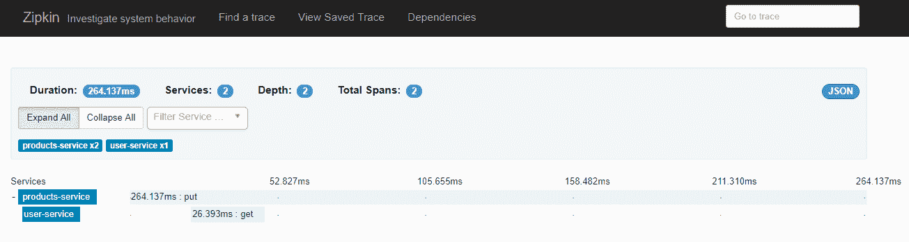

# 第九章：部署、日志记录和监控

“没有战略的战术是失败前的噪音。”

- 孙子

在上线生产并开始赚取收入之前，我们需要一个非常强大的部署策略。缺乏计划总是会导致意外紧急情况，从而导致严重的失败。这就是我们在本章中要做的事情。现在我们已经完成了开发工作，并通过测试和提供文档添加了双重检查，我们现在要着手进行*上线阶段*。我们将看到部署中涉及的所有方面，包括当前流行的术语——持续集成、持续交付和新的无服务器架构。然后我们将看到日志的需求以及如何创建自定义的集中式日志解决方案。更进一步，我们将看看**Zipkin**——一个用于分布式系统日志记录的新兴工具。最后，我们将看到监控的挑战。我们将研究两个著名的工具——**Keymetrics**和**Prometheus**。

本章涵盖以下主题：

+   部署 101

+   构建流水线

+   Docker 简介

+   无服务器架构

+   日志记录 101

+   使用 ELK 进行定制日志记录

+   使用 Zipkin 进行分布式跟踪

+   监控 101

+   使用 Keymetrics、Prometheus 和 Grafana 等工具进行监控

# 部署

在生产环境中发布一个应用程序，有足够的信心它不会崩溃或让组织损失资金，这是开发者的梦想。即使是手动错误，比如没有加载正确的配置文件，也会造成巨大问题。在本节中，我们将看到如何自动化大部分事情，并了解持续集成和持续交付（CI 和 CD）。让我们开始了解整体构建流水线。

# 决定发布计划

自信是好事，但过分自信是不好的。在部署到生产环境时，我们应该随时准备好回滚新的更改，以防出现重大关键问题。需要一个整体的构建流水线，因为它可以帮助我们规划整个过程。在进行生产构建时，我们将采用这种技术：


构建流水线

整个构建过程始于**开始**块。每当发生任何提交时，WebHooks（由 Bitbucket 和 GitHub 提供）会触发构建流水线。Bitbucket 也有构建流水线工具（[`bitbucket.org/product/features/pipelines`](https://bitbucket.org/product/features/pipelines)）。这个构建流水线可以在主分支合并时触发。一旦到达构建阶段，我们首先运行一些代码覆盖分析和单元测试。如果测试结果不符合要求的 SLA，我们会中止流程。如果符合整体 SLA，我们就会根据它创建一个镜像，并在暂存服务器上构建它（如果我们没有暂存服务器，我们可以直接移动到生产服务器）。一旦你有一个准备好的 Docker 镜像，你就根据你部署的位置设置环境。之后，运行一些理智检查以确保我们不部署破损的代码。在流水线的所有级别上运行它们是一个极好的想法，可以最大程度地减少错误的机会。现在，一旦服务符合 SLA，现在是时候在真实环境中部署它了。我通常遵循的一个良好实践是生产服务器不应该有版本控制。根据我们使用的任何工具（OpenShift、Kubernetes、Docker 等），我们将这些工具传递给它们来启动镜像。然后我们需要开始集成测试，其中包括检查容器是否健康以及与服务注册表和 API 网关检查服务是否注册。为了确保没有任何破坏，我们需要进行滚动更新，其中我们逐个部署新实例并移除旧实例。我们的代码库应该能够处理旧/遗留代码，并且只有在每个依赖方都接受后才能废弃它。完成集成测试后，下一个任务涉及运行契约测试和验收测试。一旦这些测试成功运行，我们就可以从暂存环境移动到生产环境或上线。如果流水线失败，上一个成功的源代码将作为回滚策略部署回来。

整个过程应该是自动化的，因为我们更容易出错。我们将研究 CI/CD 以及它们如何让我们的生活变得更加轻松。CI/CD 承诺，我们可以在功能完成时部署它，并且仍然相当有信心它不会破坏产品。我们所看到的流水线有大量与之相关的任务和阶段。让我们看看以下阶段：

+   **开发阶段/功能分支**：我们通过创建功能分支来开始开发。我们保持主分支不变，并且只在主分支中保留经过验证和测试的代码。这样，我们的生产环境就是主分支的复制品，我们可以在开发分支中进行任意数量的实验。如果某些东西失败了，我们总是可以回到主分支并丢弃或删除一个分支。

+   **测试阶段/QA 分支**：一旦我们的开发完成，我们将代码推送到 QA 分支。现代开发方法更进一步，我们采用 TDD/BDD。每当我们将代码推送到 QA 时，我们运行测试用例以获得精确的代码覆盖率。我们运行一些代码检查工具，这些工具给我们一个关于代码质量的想法。在所有这些之后，如果这些测试成功，那么我们才将代码推送到 QA 分支。

+   **发布阶段/主分支**：一旦我们的 QA 完成并且我们的测试用例覆盖通过了，我们将代码推送到主分支，希望将其推送到生产环境。我们再次运行我们的测试用例和代码覆盖工具，并检查是否有任何破坏。一旦成功，我们将代码推送到生产服务器并运行一些冒烟测试和契约测试。

+   **发布/标签**：一旦代码推送到生产环境并成功运行，我们会为发布创建一个分支/标签。这有助于确保我们可以在不久的将来返回到这一点。

在每个阶段手动进行这样的过程是一个繁琐的过程。我们需要自动化，因为人类容易出错。我们需要一个持续交付机制，其中我的代码中的一个提交可以确保我部署的代码对我的生态系统是安全的。在下一节中，我们将看看持续集成和持续交付：

+   **持续集成：**这是将新功能从其他分支集成或合并到主分支，并确保新更改不会破坏现有功能的实践。一个常见的 CI 工作流程是，除了代码，您还编写测试用例。然后创建代表更改的拉取请求。构建软件可以运行测试，检查代码覆盖率，并决定拉取请求是否可接受。一旦**拉取请求**（PR）合并，它就进入 CD 部分，即持续交付。

+   **持续交付：**这是一种方法，我们旨在随时无缝交付一小块可测试且易于部署的代码。CD 是高度可自动化的，在某些工具中，它是高度可配置的。这种自动化有助于快速将组件、功能和修复程序分发给客户，并让任何人对生产环境中有多少以及有什么有一个确切的想法。

随着 DevOps 的不断改进和容器的兴起，出现了许多新的自动化工具来帮助 CI/CD 流水线。这些工具与日常工具集成，例如代码存储库管理（GitHub 可以与 Travis 和 CircleCI 一起使用，Bitbucket 可以与 Bitbucket pipelines 一起使用）以及跟踪系统，如 slack 和 Jira。此外，出现了一个新的趋势，即无服务器部署，开发人员只需关注他们的代码和部署，其他问题将由提供者解决（例如，亚马逊有 AWS，谷歌有 GCP 函数）。在下一节中，我们将看看各种可用的部署选项。

# 部署选项

在这一部分，我们将看一些著名的可用部署选项，并了解它们各自的优势和劣势。我们将从容器的世界开始，看看为什么现在所有东西都是 docker 化的。所以，让我们开始吧。

在开始之前，让我们先了解一下 DevOps 101，以便理解我们将要使用的所有术语。

# DevOps 101

在这一部分，我们将了解一些基本的 DevOps 基础知识。我们将了解什么是容器以及它有什么优势。我们将看到容器和虚拟机之间的区别。

# 容器

随着云计算的进步，世界正在看到容器系统的重新进入。由于技术的简化（Docker 遵循与 GIT 相同的命令），容器已被广泛采用。容器在操作系统之上提供私有空间。这种技术也被称为系统中的虚拟化。容器是构建、打包和运行隔离的机制（软件仅驻留和限制在该容器中）。容器处理自己的文件系统、网络信息、内置内部进程、操作系统实用程序和其他应用程序配置。容器内部装载多个软件。

容器具有以下优势：

+   独立的

+   轻量级

+   易于扩展

+   易于移动

+   更低的许可和基础设施成本

+   通过 DevOps 自动化

+   像 GIT 一样进行版本控制

+   可重复使用

+   不可变的

# 容器与虚拟机（VMs）

虽然鸟瞰图似乎两者都在说同样的事情，但容器和虚拟机（VM）有很大的不同。虚拟机提供硬件虚拟化，例如 CPU 数量、内存存储等。虚拟机是一个独立的单元，还有操作系统。虚拟机复制完整的操作系统，因此它们很重。虚拟机为在其上运行的进程提供完全隔离，但它限制了可以启动的虚拟机数量，因为它很重且消耗资源，并且需要维护。与虚拟机不同，容器共享内核和主机系统，因此容器的资源利用率非常低。容器作为在主机操作系统之上提供隔离层，因此它们是轻量级的。容器镜像可以公开使用（有一个庞大的 Docker 存储库），这使得开发人员的生活变得更加轻松。容器的轻量特性有助于自动化构建、在任何地方发布构件、根据需要下载和复制等。

# Docker 和容器世界

虚拟化是 DevOps 中目前最大的趋势之一。虚拟化使我们能够在各种软件实例之间共享硬件。就像微服务支持隔离一样，Docker 通过创建容器来提供资源隔离。使用 Docker 容器进行微服务可以将整个服务以及其依赖项打包到容器中，并在任何服务器上运行。哇！安装软件在每个环境中的日子已经过去了。Docker 是一个开源项目，用于在新环境中轻松打包、运输和运行任何应用程序作为轻量级容器，而无需安装所有东西。Docker 容器既不依赖于平台也不依赖于硬件，这使得可以轻松地在任何地方运行容器，从笔记本电脑到任何服务器，而无需使用任何特定的语言框架或打包软件。当今，容器化通常被称为 dockerization。我们已经从第二章开始进行了 docker 化，*为旅程做准备*。因此，让我们了解涉及的整个过程和概念。

我们已经在第二章中看到了 Docker 的安装，*为旅程做准备*。现在，让我们深入了解 Docker。

# Docker 组件

Docker 有以下三个组件：

+   **Docker 客户端**：Docker 客户端是一个命令行程序，实际上通过套接字通信或 REST API 与 Docker 主机内的 Docker 守护程序进行通信。使用具有 CLI 选项的 Docker 客户端来构建、打包、运输和运行任何 Docker 容器。

+   **Docker 主机**：Docker 主机基本上是一个服务器端组件，包括一个 Docker 守护程序、容器和镜像：

+   Docker 守护程序是在主机机器上运行的服务器端组件，包含用于构建、打包、运行和分发 Docker 容器的脚本。Docker 守护程序为 Docker 客户端公开了 RESTful API，作为与其交互的一种方式。

+   除了 Docker 守护程序，Docker 主机还包括在特定容器中运行的容器和镜像。无论哪些容器正在运行，Docker 主机都包含这些容器的列表，以及启动、停止、重启、日志文件等选项。Docker 镜像是那些从公共存储库构建或拉取的镜像。

+   **Docker 注册表**：注册表是一个公开可用的存储库，就像 GitHub 一样。开发人员可以将他们的容器镜像推送到那里，将其作为公共库，或者在团队之间用作版本控制。

在下图中，我们可以看到所有三个 Docker 组件之间的整体流程：


Docker 组件和流程

以下是典型的 Docker 流程：

1.  每当我们运行诸如`sudo docker run ubuntu /bin/echo 'hello carbon five!'`的命令时，该命令会传递给守护进程。它会尝试搜索是否存在具有名称 Ubuntu 的现有镜像。如果没有，它会转到注册表并在那里找到镜像。然后它将在主机内下载该容器镜像，创建一个容器，并运行`echo`命令。它会将 Ubuntu 镜像添加到 Docker 主机内可用的镜像列表中。

1.  我们的大多数镜像都将基于 Docker Hub 存储库（[`hub.docker.com/`](https://hub.docker.com/)）中的可用镜像。除非非常需要，我们不会重新发明轮子。Docker pull 会向 Docker 主机发出命令，从存储库中拉取特定镜像，并使其在 Docker 主机的镜像列表中可用。

1.  `docker build`命令从 Dockerfile 和可用的上下文构建 Docker 镜像。构建的上下文是指在 Dockerfile 中指定的路径或 URL 中的文件集。构建过程可以引用上下文中的任何文件。例如，在我们的情况下，我们下载了 Node.js，然后根据`package.json`执行了`npm install`。Docker 构建创建一个镜像，并使其在 Docker 主机内的镜像列表中可用。

# Docker 概念

现在我们已经了解了核心的 Docker 流程，让我们继续了解 Docker 涉及的各种概念。这些概念将使我们更容易编写 Docker 文件并创建自己的微服务容器镜像：

+   **Docker 镜像**：Docker 镜像只是 Docker 业务能力组成部分的快照。它是操作系统库、应用程序及其依赖项的只读副本。一旦创建了镜像，它将在任何 Docker 平台上运行而不会出现任何问题。例如，我们的微服务的 Docker 镜像将包含满足该微服务实现的业务能力所需的所有组件。在我们的情况下，Web 服务器（NGINX）、Node.js、PM2 和数据库（NoSQL 或 SQL）都已配置为运行时。因此，当有人想要使用该微服务或在某处部署它时，他们只需下载镜像并运行它。该镜像将包含从 Linux 内核（`bootfs`）到操作系统（Ubuntu/CentOS）再到应用程序环境需求的所有层。

+   **Docker 容器**：Docker 容器只是 Docker 镜像的运行实例。您可以下载（或构建）或拉取 Docker 镜像。它在 Docker 容器中运行。容器使用镜像所在的主机操作系统的内核。因此，它们基本上与在同一主机上运行的其他容器共享主机内核（如前图所示）。Docker 运行时确保容器具有其自己的隔离的进程环境以及文件系统和网络配置。

+   **Docker Registry**：Docker Registry 就像 GitHub 一样，是 Docker 镜像发布和下载的中心位置。[`hub.docker.com`](https://hub.docker.com)是 Docker 提供的中央可用的公共注册表。就像 GitHub（提供版本控制的存储库），Docker 也提供了一个特定于需求的公共和私有镜像存储库（我们可以将我们的存储库设为私有）。我们可以创建一个镜像并将其注册到 Docker Hub。因此，下次当我们想在任何其他机器上使用相同的镜像时，我们只需引用存储库来拉取镜像。

+   **Dockerfile**：Dockerfile 是一个构建或脚本文件，其中包含了构建 Docker 镜像的指令。可以记录多个步骤，从获取一些公共镜像到在其上构建我们的应用程序。我们已经编写了 Docker 文件（回想一下第二章中的`.Dockerfile`，*为旅程做准备*）。

+   **Docker Compose**：Compose 是 Docker 提供的一个工具，用于在一个容器内运行多容器 Docker 应用程序。以我们的产品目录微服务为例，我们需要一个 MongoDB 容器以及一个 Node.js 容器。Docker compose 正是为此而设计的。Docker compose 是一个三步过程，我们在 Docker 文件中定义应用程序的环境，在`docker-compose.yml`中使其他服务在隔离的环境中运行，然后使用`docker-compose up`运行应用程序。

# Docker 命令参考

现在我们已经了解了 Docker 的概念，让我们来学习 Docker 命令，以便我们可以将它们添加到我们的实验中：

| **命令** | **功能** |
| --- | --- |
| `docker images` | 查看我的机器上所有可用的 Docker 镜像。 |
| `docker run <options> <docker_image_name>:<version> <operation>` | 将 Docker 镜像启动到容器中。 |
| `docker ps` | 检查 Docker 容器是否正在运行。 |
| `docker exec -ti <container-id> bash` | 通过实际在 bash 提示符上运行来查看 Docker 镜像内部的内容。能够使用诸如`ls`和`ps`之类的命令。 |
| `docker exec <container_id> ifconfig` | 查找 Docker 容器的 IP 地址。 |
| `docker build` | 根据`.DockerFile`中的指令构建镜像。 |
| `docker kill <containername> && docker rm <containername>` | 终止正在运行的 Docker 容器。 |
| `docker rmi <imagename>` | 从本地存储库中删除 Docker 镜像。 |
| `docker ps -q &#124; x args docker kill &#124; xargs docker rm` | 终止所有正在运行的 Docker 容器。 |

# 使用 NGINX、Node.js 和 MongoDB 设置 Docker

现在我们知道了基本命令，让我们为一个带有 NGINX 的产品目录服务编写 Dockerfile 和 Docker compose 文件，以处理负载平衡，就像我们在第四章中为 MongoDB 和 Node.js 编写`docker compose up`一样，*开始您的微服务之旅*。您可以按照`第九章/Nginx-node-mongo`中的示例进行操作，该示例只是在产品目录微服务的副本上添加了 NGINX，以便服务只能通过 NGINX 访问。创建以下结构：


NGINX-mongodb-node.js 文件结构

现在让我们写一些规则：

1.  我们将为 Node.js 创建 Dockerfile。它将与我们之前使用的内容相同。

1.  我们将为 NGINX 编写 Dockerfile。我们基本上告诉 NGINX 启用`sites-enabled`文件夹中定义的应用程序的规则：

```ts
FROM tutum/nginx
RUN rm /etc/nginx/sites-enabled/default
COPY nginx.conf /etc/nginx.conf
RUN mkdir /etc/nginx/ssl
COPY certs/server.key /etc/nginx/ssl/server.key
COPY certs/server.crt /etc/nginx/ssl/server.crt
ADD sites-enabled/ /etc/nginx/sites-enabled
```

1.  接下来，我们在 NGINX 中定义一些加固规则，以便处理我们的负载平衡以及缓存和其他需求。我们将在两个地方编写我们的规则——`nodejs_project`和`nginx.conf`。在`nodejs_project`中，我们定义所有代理级别设置和 NIGINX 服务器设置。在`nodejs_project`中写入以下代码：

```ts
server {
listen 80;
server_name product-catalog.org;
access_log /var/log/nginx/nodejs_project.log;
charset utf-8;
location / {
proxy_pass http://chapter9-app:8081;
proxy_set_header Host $host;
proxy_set_header X-Real-IP $remote_addr;
proxy_set_header X-Forwarded-For $proxy_add_x_forwarded_for;
}}
```

1.  让我们看一些用于配置 NGINX 以用于生产级别（加固我们的 Web 服务器）的示例规则。我们将这些规则写在`nginx.conf`中。为了压缩发送到我们的 NGINX 服务器的所有输入和输出请求，我们使用以下代码：

```ts
http {...
gzip on;
gzip_comp_level 6;
gzip_vary on;
gzip_min_length 1000;
gzip_proxied any;
gzip_types text/plain text/html text/css application/json application/x-javascript text/xml application/xml application/xml+rss text/javascript;
gzip_buffers 16 8k;
...
}
```

前面的参数只是配置了任何入站或出站的 HTTP 请求，具有这些属性。例如，它将对响应进行 gzip 压缩，对所有类型的文件进行 gzip 压缩等。

1.  无论服务器之间交换了什么资源，我们都有选项将其缓存，这样每次都不需要再次查询。这是在 Web 服务器层进行缓存：

```ts
http {
proxy_cache_path /var/cache/nginx levels=1:2 keys_zone=one:8m max_size=3000m inactive=600m;
proxy_temp_path /var/tmp;
}
```

1.  最后，我们创建我们的`docker compose`文件来启动 MongoDB、Node.js 和 NGINX 来定义。从源中复制`docker-compose.yml`文件以执行构建。

1.  打开终端，输入`docker-compose up --build`，看看我们的部署实际运行情况。

所有内部端口现在都将被阻止。唯一可访问的端口是默认端口`80`。访问`localhost/products/products/products-listing`URL 以查看我们的部署实时运行。再次访问 URL，将从缓存中加载响应。请参阅以下屏幕截图：


缓存响应

现在我们已经使用包含 Web 层的容器映像运行起来了，在接下来的部分中，我们将看一下我们的构建流水线以及 WebHooks 在其中扮演的重要角色。

# 我们构建流水线中的 WebHooks

WebHooks 是项目中可以用来绑定事件的东西，无论何时发生了什么。比如一个拉取请求被合并，我们想立即触发一个构建 - WebHooks 就可以做到这一点。WebHook 本质上是一个 HTTP 回调。您可以通过转到设置并添加 WebHook 来在存储库中配置 WebHook。典型的 WebHook 屏幕如下所示：


WebHook

如前面的屏幕截图所示，它有各种触发器，例如推送、分叉、更新、拉取请求、问题等。我们可以根据这个 WebHook 设置警报并触发各种操作。

在下一节中，我们将看到微服务开发中出现的新趋势，即无服务器部署。

请检查提取的源/流水线，以查看端到端流水线的运行情况。

# 无服务器架构

这些天出现的新趋势是无服务器拓扑结构。这并不实际上意味着无服务器或没有服务器。服务器被用户抽象化，用户只关注开发方面，其他一切都交给供应商。AWS Lambda 就是无服务器架构的一个例子，您只需将微服务打包为 ZIP 并上传到 AWS Lambda。亚马逊会处理其他事情，包括启动足够的实例来处理大量服务请求。

Lambda 函数是一个无状态函数。它通过调用 AWS 服务来处理请求。我们只需根据请求次数和提供这些请求所花费的时间来计费。同样，Google 也有云函数。但是，这种模式有以下优点和缺点：

+   **优点：**

+   我们只关注代码，不需要担心底层基础设施的细节。AWS 具有内置的网关，可与 Lambda 函数一起使用。

+   极具弹性的架构。它自动处理负载请求。

+   您只需为每个请求付费，而不是租用整个虚拟机并每月付费。

+   **缺点：**

+   仅支持少数语言。没有多语言环境的自由。

+   这些始终是无状态的应用程序。AWS Lambda 不能用于像 RabbitMQ 这样的队列处理。

+   如果应用程序启动不够快，无服务器架构就不适合我们。

这基本上就是部署的内容。在下一节中，我们将看一下日志记录以及如何创建定制的集中式日志记录解决方案。

# 日志记录

微服务完全分布式，作为单个请求可以触发对其他微服务的多个请求，跟踪失败或故障的根本原因或跨所有服务的请求流程变得困难。

在本节中，我们将学习如何通过正确的方式记录不同的 Node.js 微服务。回顾我们在第四章中看到的日志记录概念和日志类型，*开始您的微服务之旅*。我们将朝着这个方向前进，并创建一个集中式日志存储。让我们首先了解在分布式环境中我们的日志记录需求以及我们将遵循的一些最佳实践来处理分布式日志。

# 日志记录最佳实践

一旦在开发后出现任何问题，我们将完全迷失，因为我们不是在处理单个服务器。我们正在处理多个服务器，整个系统不断移动。哇！我们需要一个完整的策略，因为我们不能随意到处走动，检查每个服务的日志。我们完全不知道哪个微服务在哪个主机上运行，哪个微服务提供了请求。要在所有容器中打开日志文件，搜索日志，然后将其与所有请求相关联，这确实是一个繁琐的过程。如果我们的环境启用了自动扩展功能，那么调试问题将变得非常复杂，因为我们实际上必须找到提供请求的微服务实例。

以下是微服务日志记录的一些黄金规则，这将使生活更轻松。

# 集中和外部化日志存储

微服务分布在生态系统中，以简化开发并实现更快的开发。由于微服务在多个主机上运行，因此在每个容器或服务器级别都记录日志是不明智的。相反，我们应该将所有生成的日志发送到一个外部和集中的位置，从那里我们可以轻松地从一个地方获取日志信息。这可能是另一个物理系统或任何高可用性存储选项。一些著名的选项包括以下内容：

+   **ELK 或弹性堆栈**：ELK 堆栈（[`www.elastic.co/elk-stack`](https://www.elastic.co/elk-stack)）由 Elasticsearch（一个分布式、全文可扩展搜索数据库，允许存储大量数据集）、Logstash（它从多种来源收集日志事件，并根据需要进行转换）、和 Kibana（可视化存储在 Elasticsearch 中的日志事件或任何其他内容）组成。使用 ELK 堆栈，我们可以在由**Kibana**和**Logstash**提供的 Elasticsearch 中拥有集中的日志。

+   **CloudWatch（仅当您的环境在 AWS 中时）**：Amazon CloudWatch（[`aws.amazon.com/cloudwatch/`](https://aws.amazon.com/cloudwatch/)）是用于监视在 AWS 环境中运行的资源和应用程序的监控服务。我们可以利用 Amazon CloudWatch 来收集和跟踪指标，监视日志文件，设置一些关键警报，并自动对 AWS 资源部署中的更改做出反应。CloudWatch 具有监视 AWS 资源的能力，其中包括 Amazon EC2 实例、DynamoDB 表、RDS 数据库实例或应用程序生成的任何自定义指标。它监视所有应用程序的日志文件。它提供了系统级别的资源利用情况可见性，并监视性能和健康状况。

# 日志中的结构化数据

日志消息不仅仅是原始消息，还应包括一些内容，如时间戳；日志级别类型；请求所花费的时间；元数据，如设备类型、微服务名称、服务请求名称、实例名称、文件名、行号；等等，从中我们可以在日志中获取正确的数据来调试任何问题。

# 通过相关 ID 进行标识

当我们进行第一次服务请求时，我们会生成一个唯一标识符或相关 ID。生成的唯一 ID 会传递给其他调用的微服务。这样，我们可以使用来自响应的唯一生成的 ID 来获取指定于任何服务请求的日志。为此，我们有一个所谓的相关标识符或唯一生成的 UUID，将其传递给事务经过的所有服务。要生成唯一 ID，NPM 有模块 UUID（[`www.npmjs.com/package/uuid`](https://www.npmjs.com/package/uuid)）。

# 日志级别和日志机制

根据应用程序的不同方面，我们的代码需要不同的日志级别，以及足够的日志语句。我们将使用`winston`（[`www.npmjs.com/package/winston`](https://www.npmjs.com/package/winston)），它将能够动态更改日志级别。此外，我们将使用异步日志附加器，以便我们的线程不会被日志请求阻塞。我们将利用**异步钩子**（[`nodejs.org/api/async_hooks.html`](https://nodejs.org/api/async_hooks.html)），它将帮助我们跟踪我们的进程中资源的生命周期。异步钩子使我们能够通过向任何生命周期事件注册回调来监听任何生命周期事件。在资源初始化时，我们会得到一个唯一的标识符 ID（`asyncId`）和创建资源的父标识符 ID（`triggerAsyncId`）。

# 可搜索的日志

在一个地方收集的日志文件应该是可搜索的。例如，如果我们得到任何 UUID，我们的日志解决方案应该能够根据它来查找请求流程。现在，让我们看看我们将要实现的定制日志解决方案，并了解它将如何解决我们的日志问题：


日志定制流

图表解释了核心组件及其定义的目的。在进入实施部分之前，让我们先看看所有组件及其目的：

+   日志仪表板：它是我们定制的中央日志解决方案的 UI 前端。我们将在 Elasticsearch 数据存储之上使用 Kibana（[`www.elastic.co/products/kibana`](https://www.elastic.co/products/kibana)），因为它提供了许多开箱即用的功能。我们将能够使用已记录的任何参数搜索索引日志。

+   日志存储：为了实现实时日志记录和存储大量日志，我们将使用 Elasticsearch 作为我们定制日志解决方案的数据存储。Elasticsearch 允许任何客户端根据基于文本的索引查询任何参数。另一个著名的选项是使用 Hadoop 的`MapReduce`程序进行离线日志处理。

+   日志流处理器：日志流处理器分析实时日志事件，用于快速决策。例如，如果任何服务持续抛出 404 错误，流处理器在这种情况下非常有用，因为它们能够对特定的事件流做出反应。在我们的情况下，流处理器从我们的队列获取数据，并在发送到 Elasticsearch 之前即时处理数据。

+   日志发货人：日志发货人通常收集来自不同端点和来源的日志消息。日志发货人将这些消息发送到另一组端点，或将它们写入数据存储，或将它们推送到流处理端点进行进一步的实时处理。我们将使用 RabbitMQ 和 ActiveMQ 等工具来处理日志流。现在我们已经看到了我们定制实现的架构，在下一节中我们将看到如何在我们当前的应用程序中实现它。所以，让我们开始吧。

# 集中式定制日志解决方案实施

在本节中，我们将看到定制日志架构的实际实施，这是我们在上一节中看到的。所以，让我们开始我们的旅程。作为一组先决条件，我们需要安装以下软件：

+   Elasticsearch 6.2.4

+   Logstash 6.2.4

+   Kibana 6.2.4

+   Java 8

+   RabbitMQ 3.7.3

# 设置我们的环境

我们在上一节讨论了相当多的软件。我们需要确保每个软件都已正确安装并在各自的端口上正常运行。此外，我们需要确保 Kibana 知道我们的 Elasticsearch 主机，Logstash 知道我们的 Kibana 和 Elasticsearch 主机。让我们开始吧：

1.  从[`www.elastic.co/downloads/elasticsearch`](https://www.elastic.co/downloads/elasticsearch)下载 Elasticsearch 并将其提取到所选位置。提取后，通过`eitherelasticsearch.bat`或`./bin/elasticsearch`启动服务器。访问`http://localhost:9200/`，您应该能够看到 JSON 标语：You Know, for Search，以及 Elasticsearch 版本。

1.  接下来是 Kibana。从[`www.elastic.co/downloads/kibana`](https://www.elastic.co/downloads/kibana)下载 Kibana 并将其提取到所选位置。然后打开`<kibana_home>/config/kibana.yml`并添加一行`elasticsearch.url: "http://localhost:9200"`。这告诉 Kibana 关于 Elasticsearch。然后从`bin`文件夹启动 Kibana 并导航到`http://localhost:5601`。您应该能够看到 Kibana 仪表板。

1.  从[`www.elastic.co/downloads/logstash`](https://www.elastic.co/downloads/logstash)下载 Logstash。将其提取到所选位置。我们将通过编写一个简单的脚本来检查 Logstash 的安装。创建一个文件`logstash-simple.conf`，并编写以下代码。您可以在`第九章/logstash-simple.conf`中找到此片段：

```ts
input { stdin { } }
output { elasticsearch { hosts => ["localhost:9200"] }
stdout { codec => rubydebug }}
```

现在运行`logstash -f logstash-simple.conf`。

您应该能够看到 Elasticsearch 信息的打印输出。这确保了我们的 Logstash 安装正常运行。

1.  接下来，我们需要安装 RabbitMQ。RabbitMQ 是用 Erlang 编写的，需要安装 Erlang。安装 Erlang 并确保环境变量`ERLANG_HOME`已设置。然后安装 RabbitMQ。安装完成后，按以下步骤启动`rabbitmq`服务：

```ts
rabbitmq-service.bat stop
rabbitmq-service.bat install
rabbitmq-service.bat start
```

1.  现在访问`http://localhost:15672`。您应该能够使用默认的 guest/guest 凭据登录，并且能够看到 RabbitMQ 仪表板。

如果您无法看到服务器，则可能需要启用插件，如下所示：

`rabbitmq-plugins.bat enable rabbitmq_management rabbitmq_web_mqtt rabbitmq_amqp1_0`

我们已成功安装了 RabbitMQ、Logstash、Elasticsearch 和 Kibana。现在我们可以继续我们的实施。

请检查提取的源代码`/customlogging`，以查看我们解决方案的运行情况。该解决方案利用了我们之前解释的架构。

# Node.js 中的分布式跟踪

分布式跟踪就像跟踪跨越涉及提供该请求的所有服务的特定服务请求一样。这些服务构建了一个图形，就像它们形成了一个以启动初始请求的客户端为根的树。Zipkin 提供了一个仪表层，用于为服务请求生成 ID，基于这个 ID，我们可以通过使用该 ID 跟踪所有应用程序的数据。在本节中，我们将看看如何使用 Zipkin。您可以在`第九章/Zipkin`中找到完整的源代码：

1.  从第四章 *开始您的微服务之旅*中启动我们的第一个微服务或任何单个微服务项目。我们将向其添加`zipkin`依赖项：

```ts
npm install zipkin zipkin-context-cls zipkin-instrumentation-express zipkin-instrumentation-fetch zipkin-transport-http node-fetch --save
npm install @types/zipkin-context-cls --save-dev
```

1.  现在我们需要一个 Zipkin 服务器。我们将配置它以使用 Zipkin 服务器以及其默认设置，并只安装其 jar。从[https:](https://search.maven.org/remote_content?g=io.zipkin.java&a=zipkin-server&v=LATEST&c=exec)[//search.maven.org/remote_content?g=io.zipkin.java&a=zipkin-server&v=LATEST&c=exec](https://search.maven.org/remote_content?g=io.zipkin.java&a=zipkin-server&v=LATEST&c=exec)下载`jar`，或者您可以在`第九章/zipkin`的`server`文件夹下找到它。下载完成后，按以下步骤打开 Zipkin 服务器：

```ts
java -jar zipkin-server-2.7.1-exec.jar
```

以下屏幕截图显示了一个 Zipkin 服务器：


记录 Zipkin

如屏幕截图所示，Zipkin 服务器有很多选项，包括提供用于接收跟踪信息的收集器、存储和 UI 选项以检查它。

1.  现在，我们将配置多个 Express 服务器，以观察 Zipkin 如何仪器化整个过程。我们将首先在单个微服务上设置 Zipkin，然后稍后在多个微服务上设置。我们在上一章的代码中将任何产品信息添加到我们的 MongoDB 数据库中。我们将在这里配置 Zipkin。我们需要告诉 Zipkin 要发送跟踪数据的位置（这是显而易见的！这将是运行在`9411`上的我们的 Zipkin 服务器）以及如何发送跟踪数据（这是个问题——Zipkin 有三种支持选项 HTTP、Kafka 和 Fluentd。我们将使用 HTTP）。因此，基本上我们向 Zipkin 服务器发送一个 POST 请求。

1.  我们需要一些导入来配置我们的 Zipkin 服务器。打开`Express.ts`并添加以下代码行：

```ts
import {Tracer} from 'zipkin';
import {BatchRecorder} from 'zipkin';
import {HttpLogger} from 'zipkin-transport-http';
const CLSContext = require('zipkin-context-cls');
```

+   `Tracer`用于提供诸如何在哪里以及如何发送跟踪数据的信息。它处理生成`traceIds`并告诉传输层何时记录什么。

+   `BatchRecorder`格式化跟踪数据以发送到 Zipkin 收集器。

+   `HTTPLogger`是我们的 HTTP 传输层。它知道如何通过 HTTP 发布 Zipkin 数据。

+   `CLSContext`对象是指 Continuation Local Storage。Continuation passing 是指函数调用链中的下一个函数使用它需要的数据的模式。其中一个例子是 Node.js 自定义中间件层。

1.  我们现在正在将所有部分放在一起。添加以下代码行：

```ts
const ctxImpl=new CLSContext();
const logRecorder=new BatchRecorder({
logger:new HttpLogger({
endpoint:`http://loclhost:9411/api/v1/spans` }) })
const tracer=new Tracer({ctxImpl:ctxImpl,recorder:logRecorder})
```

这将设置 Zipkin 基本要素以及将生成 64 位跟踪 ID 的跟踪器。现在我们需要为我们的 Express 服务器进行仪器化。

1.  现在，我们将告诉我们的`express`应用程序在其中间件层中使用`ZipkinMiddleware`：

```ts
import {expressMiddleware as zipkinMiddleware} from 'zipkin-instrumentation-express';
...
this.app.use(zipkinMiddleware({tracer,serviceName:'products-service'}))
```

在我们的情况下，服务的名称`'products-service'`实际上将出现在跟踪数据中。

1.  让我们调用我们的服务，看看实际结果是什么。运行程序，向`products/add-update-product`发出 POST 请求，并打开 Zipkin。您将能够在服务名称下拉菜单中看到`products-service`（我们在 Zipkin 服务器下注册的服务名称）。当您进行搜索查询时，您将能够看到类似以下内容的东西：


Zipkin 服务日志

这就是当我们处理一个微服务时的情况。您在这里也会得到有关成功和失败服务调用的跟踪，就像图中所示的那样。我们希望能够理解涉及多个微服务的服务。

对于直接运行代码的人，请确保在`ProductsController.tslet`文件中注释掉以下行—`userRes= await this.zipkinFetch('http://localhost:3000/users/user-by-id/parthghiya');`和`console.log("user-res",userRes.text());`。

1.  假设在我们的情况下，我们还涉及另一个微服务，基于我们的业务能力，它与所有者的真实性有关。因此，每当添加产品时，我们希望检查所有者是否是实际用户。

我们将只创建两个带有虚拟逻辑的项目。

1.  创建另一个带有用户的微服务项目，并使用`@Get('/user-by-id/:userId')`创建一个 GET 请求，该请求基本上返回用户是否存在。我们将从现有项目中调用该微服务。您可以从`chapter-9/user`中跟随。

1.  在现有项目中，我们将 Zipkin 的配置移出到外部文件中，以便在整个项目中重复使用。查看`ZipkinConfig.ts`的源代码

1.  在`ProductController.ts`中，实例化一个新的 Zipkin 仪器化 fetch 对象，如下所示：

```ts
import * as wrapFetch from 'zipkin-instrumentation-fetch';
this.zipkinFetch = wrapFetch(fetch, {
tracer,
serviceName: 'products-service'
});
```

1.  进行 fetch 请求，如下所示：

```ts
let userRes= await this.zipkinFetch('http://localhost:3000/users/user-by-id/parthghiya');
```

1.  打开 Zipkin 仪表板，您将能够看到以下内容：



Zipkin 组合

点击请求即可查看整体报告：


跟踪报告

追踪是一个无价的工具，它可以通过跟踪整个微服务生态系统中的任何请求来帮助诊断问题。在下一节中，我们将了解监控微服务。

# 监控

微服务是真正分布式系统，具有庞大的技术和部署拓扑。如果没有适当的监控，运营团队可能很快就会遇到管理大规模微服务系统的麻烦。为了给我们的问题增加复杂性，微服务根据负载动态改变其拓扑。这需要一个适当的监控服务。在本节中，我们将了解监控的需求，并查看一些监控工具。

# 监控 101

让我们从讨论监控 101 开始。一般来说，监控可以被定义为一些指标、预定义的**服务水平协议**（SLAs）、聚合以及它们的验证和遵守预设的基线值的集合。每当服务水平出现违规时，监控工具必须生成警示并发送给管理员。在本节中，我们将查看监控，以了解系统的用户体验方面的行为，监控的挑战，以及了解 Node.js 监控所涉及的所有方面。

# 监控挑战

与记录问题类似，监控微服务生态系统的关键挑战在于有太多的动态部分。由于完全动态，监控微服务的主要挑战如下：

+   统计数据和指标分布在许多服务、多个实例和多台机器或容器上。

+   多语言环境增加了更多的困难。单一的监控工具无法满足所有所需的监控选项。

+   微服务部署拓扑在很大程度上不同。诸如可伸缩性、自动配置、断路器等多个参数会根据需求基础改变架构。这使得不可能监控预配置的服务器、实例或任何其他监控参数。

在接下来的部分，我们将看一下监控的下一个部分，即警示。由于错误，我们不能每次都发出警示。我们需要一些明确的规则。

# 何时警示何时不警示？

没有人会因为某些事情阻止客户使用系统并增加资金而在凌晨 3 点被吵醒而感到兴奋。警示的一般规则可以是，如果某事没有阻止客户使用您的系统并增加您的资金，那么这种情况不值得在凌晨 3 点被吵醒。在本节中，我们将查看一些实例，并决定何时警示何时不警示：

+   **服务宕机**：如果是单体化，这肯定会是一个巨大的打击，但作为一个优秀的微服务编码人员，您已经设置了多个实例和集群。这只会影响一个用户，该用户会在服务请求后再次获得功能，并防止故障级联。但是，如果许多服务宕机，那么这绝对值得警示。

+   内存泄漏：内存泄漏是另一件令人痛苦的事情，只有经过仔细监控，我们才能真正找到泄漏。良好的微服务实践建议设置环境，使其能够在实例超过一定内存阈值后停用该实例。问题将在系统重新启动时自行解决。但是，如果进程迅速耗尽内存，那么这是值得警示的事情。

+   **服务变慢**：一个慢的可用服务不值得警示，除非它占用了大量资源。良好的微服务实践建议使用基于事件和基于队列的异步架构。

+   **400 和 500 的增加**：如果 400 和 500 的数量呈指数增长，那么值得警示。4xx 代码通常表示错误的服务或配置错误的核心工具。这绝对值得警示。

在下一节中，我们将看到 Node.js 社区中可用的监控工具的实际实现。我们将在 Keymetrics 和 Grafana 中看到这些工具的实际示例。

# 监控工具

在这一节中，我们将看一些可用的监控工具，以及这些工具如何帮助我们解决不同的监控挑战。在监控微服务时，我们主要关注硬件资源和应用程序指标：

| **硬件资源** |
| --- |
| 内存利用率指标 | 应用程序消耗的内存量，比如 RAM 利用率、硬盘占用等等。 |
| CPU 利用率指标 | 在给定时间内使用了多少百分比的总可用 CPU 内存。 |
| 磁盘利用率指标 | 硬盘中的 I/O 内存，比如交换空间、可用空间、已用空间等等。 |
| **应用程序指标** |
| 每单位时间抛出的错误 | 应用程序抛出的关键错误的数量。 |
| 每单位时间的调用次数/服务占用率 | 这个指标基本上告诉我们服务的流量情况。 |
| 响应时间 | 用于响应服务请求所使用的时间。 |
| 服务重启次数 | Node.JS 是单线程的，这个事情应该被监控。 |

LINUX 的强大使得查询硬件指标变得容易。Linux 的`/proc`文件夹中包含了所有必要的信息。基本上，它为系统中运行的每个进程都有一个目录，包括内核进程。那里的每个目录都包含其他有用的元数据。

当涉及到应用程序指标时，很难使用一些内置工具。一些广泛使用的监控工具如下：

+   AppDynamics、Dynatrace 和 New Relic 是应用程序性能监控领域的领导者。但这些都是商业领域的。

+   云供应商都有自己的监控工具，比如 AWS 使用 Amazon Cloudwatch，Google Cloud 平台使用 Cloud monitoring。

+   Loggly、ELK、Splunk 和 Trace 是开源领域中的热门候选者。

现在我们将看一些 Node.js 社区中可用的工具。

# PM2 和 keymetrics

我们已经看到了 PM2 的强大之处，以及它如何帮助我们解决各种问题，比如集群、使 Node.js 进程永远运行、零停机时间等等。PM2 也有一个监控工具，可以维护多个应用程序指标。PM2 引入了 keymetrics 作为一个完整的工具，具有内置功能，如仪表板、优化过程、来自 keymetrics 的代码操作、异常报告、负载均衡器、事务跟踪、CPU 和内存监控等等。它是一个基于 SAAS 的产品，有免费套餐选项。在这一节中，我们将使用免费套餐。所以，让我们开始吧：

1.  我们需要做的第一件事是注册免费套餐。创建一个账户，一旦你登录，你就能看到主屏幕。注册后，我们将来到一个屏幕，在那里我们配置我们的 bucket。

一个 bucket 是一个容器，上面连接了多个服务器和多个应用程序。一个 bucket 是 keymetrics 定义上下文的东西。例如，我们的购物车微服务有不同的服务（支付、产品目录、库存等等）托管在某个地方，我们可以监控一个 bucket 中的所有服务器，这样一切都很容易访问。

1.  一旦我们创建了我们的 bucket，我们将会得到一个像下面这样的屏幕。这个屏幕上有所有启动 keymetrics 所需的信息和必要的文档：


创建 bucket 后的 Keymetrics

我们可以看到连接 PM2 到 keymetrics 和 Docker 与 keymetrics 的命令，我们将在接下来使用：

```ts
pm2 link <your_private_key> <your_public_key>
docker run -p 80:80 -v my_app:/app keymetrics/pm2 -e "KEYMETRICS_PUBLIC=<your_public_key>" -e "KEYMETRICS_SECRET=<your_secret_key>" 
```

作为安装的一部分，你将需要 PM2 监视器。一旦安装了 PM2，运行以下命令：

```ts
pm2 install pm2-server-monit
```

1.  下一步是配置 PM2 将数据推送到 keymetrics。现在，为了启用服务器和 keymetrics 之间的通信，需要打开以下端口：需要打开端口 80（TCP 输出）和 43554（TCP 输入/输出）。PM2 将数据推送到 keymetrics 的端口`80`，而 keymetrics 将数据推送回端口`43554`。现在，我们将在我们的产品目录微服务中配置 keymetrics。

1.  确保在您的系统中安装了 PM2。如果没有，请执行以下命令将其安装为全局模块：

```ts
npm install pm2 -g
```

1.  然后通过执行以下命令将您的 PM2 与 keymetrics 连接起来：

```ts
pm2 link 7mv6isclla7z2d0 0rb928829xawx4r
```

1.  一旦打开，只需更改您的`package.json`脚本，以使用 PM2 而不是简单的 node 进程启动。只需在`package.json`中添加以下脚本：

```ts
"start": "npm run clean && npm run build && pm2 start ./dist/index.js",
```

一旦作为 PM2 进程启动，您应该能够看到进程已启动和仪表板 URL：


使用 keymetrics 启动 PM2

1.  转到 keymetrics，您将能够看到实时仪表板：


Keymetrics 仪表板

1.  它为我们提供了有趣的指标，比如 CPU 使用率、可用内存、HTTP 平均响应时间、可用磁盘内存、错误、进程等等。在接下来的部分，我们将看看如何利用 keymetrics 来解决我们的监控挑战。

# Keymetrics 监控应用程序异常和运行时问题

尽管 PM2 在保持服务器运行良好方面做得很好，但我们需要监视所有发生的未知异常或潜在的内存泄漏源。PMX 正好提供了这个模块。您可以在`第九章/pmx-utilities`中查看示例。像往常一样初始化`pmx`。只要有错误发生，就用`notify`方法通知`pmx`：

```ts
pmx.notify(new Error("Unexpected Exception"));
```

这足以向 keymetrics 发送错误，以便提供有关应用程序异常的信息。您也将收到电子邮件通知。

PMX 还监视服务的持续使用，以便检测内存泄漏。例如，检查路由`/memory-leak`。

以下显示了几个重要的 keymetrics 亮点：


Pmx 实用程序

# 添加自定义指标

最后，我们将看到如何根据我们的业务能力和需求添加自定义指标。大多数情况下，我们经常需要一些定制，或者我们无法使用现成的功能。Keymetrics 为我们提供了用于此目的的探针。在 keymetrics 中，探针是以编程方式发送到 keymetrics 的自定义指标。我们将看到四种探针及其示例：

+   **简单指标**：可以立即读取的值，用于监视任何变量值。这是一个非常基本的指标，开发人员可以为推送到 keymetrics 的数据设置一个值。

+   **计数器**：递增或递减的事物，比如正在处理的下载、已连接的用户、服务请求被命中的次数、数据库宕机等。

+   **计量器**：被视为事件/间隔进行测量的事物，比如 HTTP 服务器每分钟的请求次数等。

+   **直方图**：它保留了一个与统计相关的储备，特别偏向于最后五分钟，以探索它们的分布，比如监控最近五分钟内查询执行的平均时间等。

我们将使用`pmx`（[`www.npmjs.com/package/pmx`](https://www.npmjs.com/package/pmx)）来查看自定义指标的示例。PMX 是 PM2 运行器的主要模块之一，允许公开与应用程序相关的指标。它可以揭示有用的模式，有助于根据需求扩展服务或有效利用资源。

# 简单指标

设置 PM2 指标值只是初始化一个探针并在其中设置一个值的问题。我们可以通过以下步骤创建一个简单的指标。您可以在`第九章/简单指标`中查看源代码：

1.  从第二章复制我们的`first microservice`骨架，*为旅程做准备*。我们将在这里添加我们的更改。安装`pm2`和`pmx`模块作为依赖项：

```ts
npm install pm2 pmx -save
```

1.  在`HelloWorld.ts`中，使用以下代码初始化`pmx`。我们将添加一个简单的度量名称`'Simple Custom metric'`以及变量初始化：

```ts
constructor(){
this.pmxVar=pmx.init({http:true,errors:true, custom_probes:true,network:true,ports:true});
this.probe=this.pmxVar.probe();
this.metric=this.probe.metric({ name:'Simple custom metric' });}
```

我们用一些选项初始化了 pmx，比如以下内容：

+   `http`：HTTP 路由应该被记录，并且 PM2 将被启用来执行与 HTTP 相关的度量监视

+   `errors`：异常日志记录

+   `custom_probes`：JS 循环延迟和 HTTP 请求应该自动公开为自定义度量

+   `端口`：它应该显示我们的应用正在监听的端口

1.  现在你可以在任何地方使用以下方法初始化这个值：

```ts
this.metric.set(new Date().toISOString());
```

现在你可以在 keymetrics 仪表板中看到它，如下所示：


简单度量

# 计数器度量

这个度量是非常有用的，可以看到事件发生的次数。在这个练习中，我们将看到我们的`/hello-world`被调用的次数。你可以在`Chapter 9/counter-metric`中的示例中跟着做：

1.  像往常一样初始化项目。添加`pmx`依赖项。创建一个带有路由控制器选项的`CustomMiddleware`：

```ts
import { ExpressMiddlewareInterface } from "routing-controllers";
 const 
 pmx=require('pmx').init({http:true,errors:true, custom_probes:true,network:true,ports:true}); 

const pmxProbe=pmx.probe();
 const pmxCounter=pmxProbe.counter({
    name:'request counter for Hello World Controller',
    agg_type:'sum'}) 

export class CounterMiddleWare implements ExpressMiddlewareInterface {
    use(request: any, response: any, next: (err?: any) => any ):any {
        console.log("custom middle ware");
        pmxCounter.inc();
      next();   }} 
```

1.  在`HelloWorld.ts`之前添加注释并运行应用程序：

```ts
@UseBefore(CounterMiddleWare)
@Controller('/hello-world')
export class HelloWorld { ... }
```

你应该能够看到类似以下的东西：


计数器度量

# 计量

这个度量允许我们记录事件实际发生的时间以及每个时间单位内事件发生的次数。计算平均值非常有用，因为它基本上给了我们一个关于系统负载的想法。在这个练习中，我们将看一下如何利用计量度量：

1.  像往常一样初始化项目。安装`pmx`和`pm2`依赖项。它包括以下关键字：

+   **样本：**此参数对应于我们想要测量指标的间隔。在我们的案例中，这是每分钟的呼叫次数，因此是`60`。

+   **时间范围：**这是我们想要保存 keymetrics 数据的时间长度，它将被分析的总时间范围。

在构造函数中添加以下代码以初始化计量器度量依赖项：

```ts
this.pmxVar=pmx.init({http:true,errors:true,custom_probes:true,network:true,ports:true});
  this.probe=this.pmxVar.probe();
 this.metric=this.probe.meter({
 name: 'averge per minute',
 samples:60,
 timeframe:3600 }) 
```

1.  在路由中，`@Get('/')`将初始化这个标记。这将给我们一个路由`<server_url>/hello-world`每分钟平均呼叫次数。

1.  现在运行这个度量。你将能够在 keymetrics 仪表板中看到这个值。同样，你可以使用直方图度量。

在下一节中，我们将看一下更高级的可用工具。

# Prometheus 和 Grafana

Prometheus 是一个著名的开源工具，它为 Node.js 监控提供了强大的数据压缩选项以及快速的时间序列数据查询。Prometheus 具有内置的可视化方法，但它的可配置性不足以在仪表板中利用。这就是 Grafana 的作用。在本节中，我们将看一下如何使用 Prometheus 和 Grafana 监控 Node.js 微服务。所以让我们开始动手编码吧。你可以在源代码中的`Chapter 9/prometheus-grafana`中的示例中跟着做：

1.  像往常一样，从`chapter-2/first microservice`初始化一个新项目。添加以下依赖项：

```ts
npm install prom-client response-time --save
```

这些依赖项将确保我们能够监控 Node.js 引擎，并能够从服务中收集响应时间。

1.  接下来，我们将编写一些中间件，用于跨微服务阶段使用，比如在 Express 中注入，并在后期使用中间件。创建一个`MetricModule.ts`文件，并添加以下代码：

```ts
import * as promClient from 'prom-client';
 import * as responseTime from 'response-time';
 import { logger } from '../../common/logging'; 

export const Register=promClient.register;
 const Counter=promClient.Counter;
 const Histogram=promClient.Histogram;
 const summary=promClient.Summary; 
```

1.  接下来我们将创建一些自定义函数用作中间件。在这里，我们将创建一个函数；你可以在`Chapter 9/prometheus-grafana/config/metrics-module/MetricModule.ts`中查看其他函数：

```ts
//Function 1
 export var numOfRequests=new Counter({
    name:'numOfRequests',
    help:'Number of requests which are made through out the service',
    labelNames:['method']
 }) 
/*Function 2  to start metric collection */
 export var startCollection=function(){
    logger.info(" Metrics can be checked out at /metrics");
    this.promInterval=promClient.collectDefaultMetrics(); } 

/*THis function 3 increments the counters executed */
 export var requestCounters=function(req:any,res:any,next:any){
    if(req.path!='metrics'){
        numOfRequests.inc({method:req.method});
        totalPathsTakesn.inc({path:req.path});
   }   next();} 
//Function 4: start collecting metrics 
export var startCollection=function(){
  logger.info(" Metrics can be checked out at /metrics");
    this.promInterval=promClient.collectDefaultMetrics();} 
```

看一下前面代码中提到的以下函数：

+   第一个函数启动一个新的计数器变量

+   第二个功能启动 Prometheus 指标

+   第三个功能是一个中间件，用于增加请求的数量

+   除了指标路由之外的功能计数器

1.  接下来，我们添加指标路由：

```ts
@Controller('/metrics')
 export class MetricsRoute{
    @Get('/')
    async getMetrics(@Req() req:any,@Res() res:any):Promise<any> {
        res.set('Content-Type', Register.contentType);
        res.end(Register.metrics());   };} 
```

1.  接下来，我们在`express`应用程序中注入中间件。在`express.ts`中，只需添加以下 LOC：

```ts
..
this.app.use(requestCounters);
this.app.use(responseCounters)
..
startCollection()
```

1.  Node.js 设置完成。现在是启动 Prometheus 的时候了。创建一个名为`prometheus-data`的文件夹，在其中创建一个`yml 配置`文件：

```ts
Scrape_configs:
 - job_name: 'prometheus-demo'
   scrape_interval: 5s
   Static_configs:
     - targets: ['10.0.2.15:4200']
       Labels:
         service: 'demo-microservice'
         group: 'production'
```

1.  通过运行以下命令来启动 Docker 进程：

```ts
sudo docker run -p 9090:9090 -v /home/parth/Desktop/prometheus-grafana/prometheus-data/prometheus.yml prom/prometheus
```

1.  您的 Prometheus 应该已经启动并运行，并且您应该看到以下屏幕：


Prom 仪表板

1.  在应用程序上执行一些操作，或者使用一些压力测试工具，如 JMeter 或[`www.npmjs.com/package/loadtest`](https://www.npmjs.com/package/loadtest)。然后打开 Prometheus，在查询 shell 中写入`sum(numOfRequests)`。您将能够看到实时图形和结果。这些结果与我们访问`<server_url>/metrics`时看到的结果相同。尝试使用以下查询来查看 Node.js 内存使用情况`avg(nodejs_external_memory_bytes / 1024 / 1024) by (service)`。

1.  Prometheus 很棒，但不能用作仪表板。因此，我们使用 Grafana，它具有出色的可插拔可视化平台功能。它具有内置的 Prometheus 数据源支持。输入以下命令以打开 Grafana 的 Docker 镜像：

```ts
docker run -i -p 3000:3000 grafana/grafana
```

一旦启动，转到`localhost:3000`，并在用户名/密码中添加`admin/admin`以登录。

1.  登录后，添加一个类型为 Prometheus 的数据源（打开“添加数据源”屏幕），并在 HTTP URL（您的 Prometheus 运行 URL）中输入 IP 地址：`9090`，在“访问”文本框中输入“服务器（默认）”（您访问 Prometheus 的方式），以配置 Prometheus 作为数据源。单击保存并测试以确认设置是否有效。您可以查看以下屏幕截图以更好地理解：


Grafana

1.  一旦配置了数据源，您可以通过 GUI 工具自定义图形或其他内容，并设计自己的自定义仪表板。它将如下所示：


Grafana

Prometheus 不仅是监控单个 Node.js 应用程序的强大工具，还可以在多语言环境中使用。使用 Grafana，您可以创建最适合您需求的仪表板。

这些是在 Node.js 监控部署中使用的重要工具。还有其他工具，但整合它们需要多语言环境。例如，[Simian Army](https://github.com/Netflix/SimianArmy/wiki/Chaos-Monkey)。它被 Netflix 广泛使用和推广，用于处理各种云计算挑战。它构建了各种类猴工具来维护网络健康，处理流量，并定位安全问题。

# 可投入生产的微服务标准

我们将快速总结一个可投入生产的微服务及其标准：

+   一个可投入生产的微服务对服务请求是可靠和稳定的：

+   它遵循符合 12 因素应用标准的标准开发周期（回顾第一章，*揭秘微服务*）

+   它的代码经过严格的测试，包括 linter、单元测试用例、集成、合同和端到端测试用例

+   它使用 CI/CD 流水线和增量构建策略

+   在服务失败的情况下，有备份、替代、回退和缓存

+   它具有符合标准的稳定的服务注册和发现过程

+   一个可投入生产的微服务是可扩展和高可用的：

+   它根据任何时间到来的负载自动扩展

+   它有效利用硬件资源，不会阻塞资源池

+   它的依赖随着应用程序的规模而扩展

+   它的流量可以根据需要重新路由

+   它以高性能的非阻塞和最好是异步的反应方式处理任务和进程

+   一个可以立即投入生产的微服务应该准备好应对任何未经准备的灾难：

+   它没有任何单点故障

+   它经过足够的代码测试和负载测试来测试其弹性

+   故障检测，阻止故障级联，以及故障修复都已经自动化，并且具备自动扩展能力

+   一个可以立即投入生产的微服务应该得到适当的监控：

+   它不仅在微服务级别不断监控其识别的关键指标（自定义指标，错误，内存占用等），还扩展到主机和基础设施级别

+   它有一个易于解释的仪表板，并且具有所有重要的关键指标（你打赌，PM2 是我们唯一的选择）

+   通过信号提供阈值（Prometheus 和时间序列查询）定义可操作的警报

+   一个可以立即投入生产的微服务应该有文档支持：

+   通过 Swagger 等工具生成的全面文档

+   架构经常审计和审查，以支持多语言环境

# 总结

在本章中，我们了解了部署过程。我们看到了一些上线标准，部署流水线，并最终熟悉了 Docker。我们看到了一些 Docker 命令，并熟悉了 Docker 化的世界。然后，我们看到了处理大型分布式微服务时涉及的一些日志记录和监控方面的挑战。我们探索了各种日志记录的解决方案，并实施了使用著名的 ELK 堆栈的自定义集中式日志记录解决方案。在本章的后半部分，我们看到了一些监控工具，比如 keymetrics 和 Prometheus。

下一章将探讨我们产品的最后部分：安全性和可扩展性。我们将看到如何保护我们的 Node.js 应用程序免受暴力攻击，以及我们的安全计划应该是什么。然后，我们将研究可扩展性，并通过 AWS 实现微服务的自动扩展。
