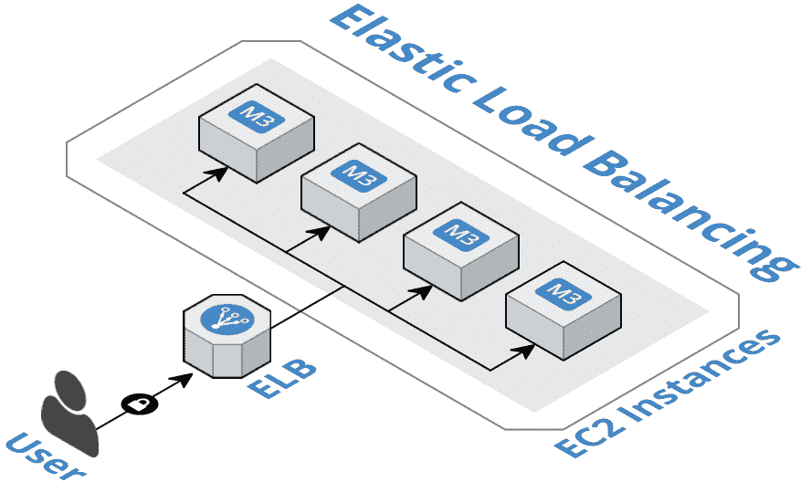
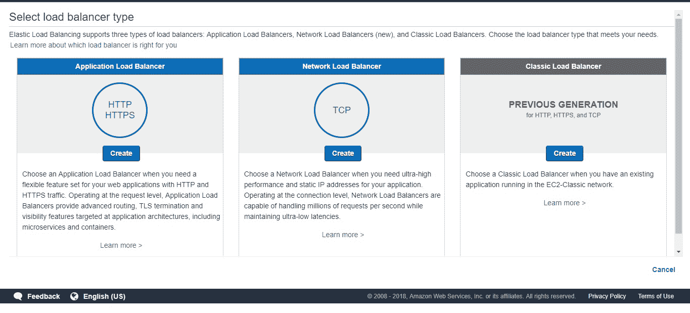
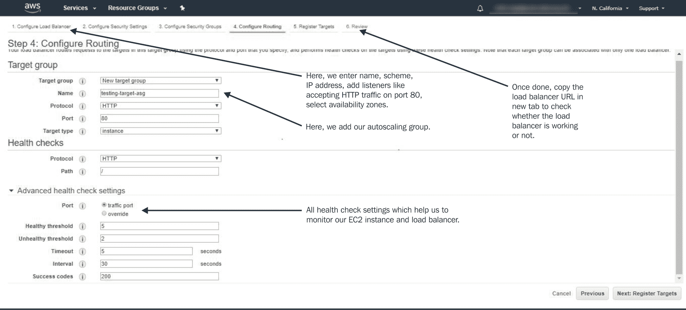
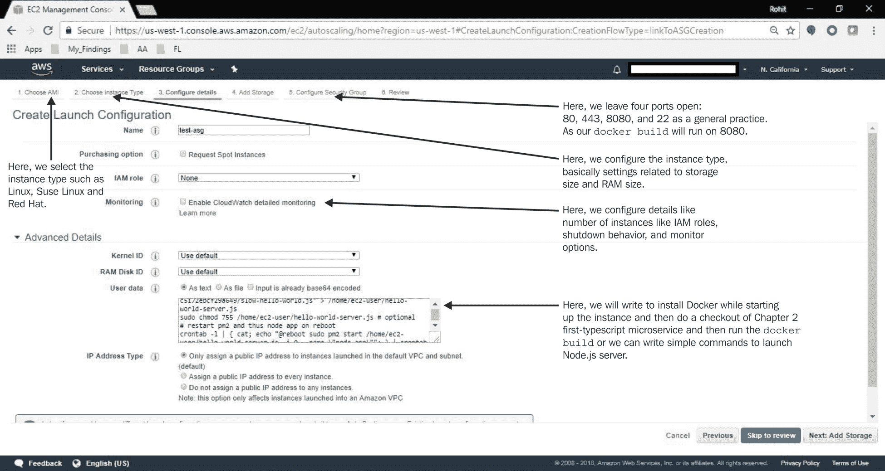
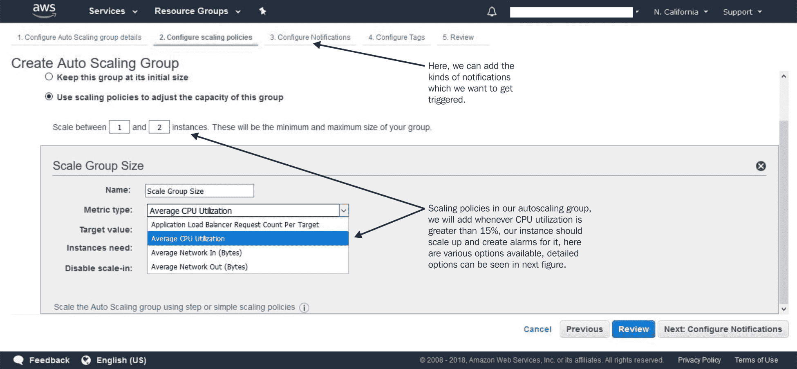
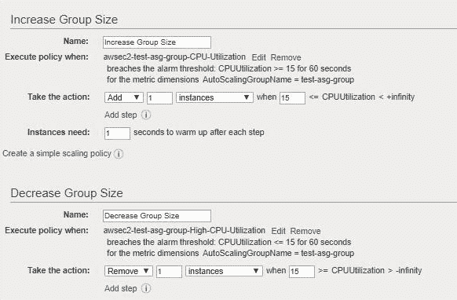
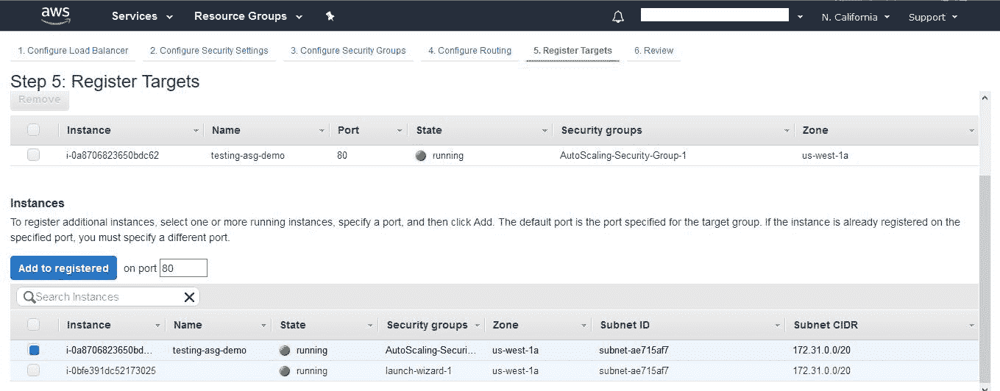

# 第十章：加固您的应用程序

要做好安全性是非常困难的。总是似乎有一些开放的门让入侵者溜进来。安全错误一直都在发生，比如著名的**WannaCry 勒索软件攻击**（造成 50 亿美元的损失）、**以太坊盗窃**（3,200 万美元的抢劫）等等。这些攻击总是让我们采取额外的步骤来加强安全，以避免这样的灾难。由于微服务是动态的，任何实例都可能崩溃导致业务损失。

本章重点关注处理安全性和自动扩展，探讨了一些安全基础知识和微服务最佳实践，以使系统更安全和健壮，并使其能够轻松处理任何数量的流量。随着容器的出现，我们还将关注容器级别的安全性，以及应用程序级别的安全性。本章还着重介绍了自动扩展，旨在使应用程序随时可用以处理任何负载，在新部署期间实现零停机。本章涵盖以下内容：

+   在应用安全机制时应该问的问题

+   个别服务/应用程序的安全最佳实践

+   容器的安全最佳实践

+   扩展您的应用程序

# 在应用安全时应该问的问题

在不断发展的世界中，我们不能有一套预定义的规则来应用于微服务设计。相反，我们可以提出一些预定义的问题，以评估整个系统和流程。以下各节列出了各个级别的所有标准问题，我们可以将其用作评估检查表。稍后，我们将根据这些问题的解决方案升级我们的安全性。

# 核心应用程序/核心微服务

我们将从最核心的地方开始——我们的微服务。每当我们编写任何微服务来满足任何业务能力时，一旦设计完成，我们需要注意服务是否暴露给任何漏洞。以下问题可以用来对应用程序级别的安全性进行一般了解：

+   系统是否在所有地方都得到了适当的安全保障，还是只在边界处？

+   如果入侵者溜进来，系统是否足够强大以侦测到并将其驱逐出去？

+   入侵者有多容易通过模仿正常行为、获取流量访问或过载流量来进入网络？

+   即使它们也经常调用它们，每个微服务是否都信任其他微服务？

+   您的服务契约是否有身份验证，还是网络处理身份验证？

+   调用者的身份是否传递给每个微服务，还是仅在网关处丢失？

+   确保不发生 SQL 注入的措施是什么？

+   系统是否更新到足以以加密形式存储密码？

+   如果我们需要升级任何密码存储算法，是否可以在不造成大规模中断用户的情况下进行？

+   系统中如何处理私人和敏感数据？

+   您的日志记录解决方案是否能够检测和分析安全漏洞？

# 中间件

下一个级别是我们的**中间件**。这是所有服务都将通过的中心位置或起点。我们需要确保中间件是安全的，不能暴露给任何风险，因为它有各种参数，如消息中间件、数据库访问配置等等：

+   我们是否遵循最小权限原则（即，跨所有服务只有一个数据库登录）？

+   每个服务只能访问它需要的数据吗？

+   如果入侵者获得了服务数据库凭据，他们将获得多少数据访问权限？

+   我们是否在所有服务中都有一个单一的消息中间件？

+   消息中间件或服务总线是否有登录凭据？

+   传统系统是否将微服务系统置于风险之中？

# API 网关

下一个级别是我们的 API 网关。网关在微服务中扮演着重要的角色，因为它是任何请求的起点，并且被所有微服务用作它们之间的通信手段。因此，它不应该暴露给任何其他安全漏洞：

+   是否有 TLS 实现？

+   TLS 实现是否消除了降级攻击或弱密码攻击？

+   您如何确保内部网站和管理员 URL 被抽象到互联网上？

+   通过您的网关服务的身份验证 API 传播了哪些信息？

+   其余的服务是否过于信任网关，或者他们能否发现网关被攻破了？

# 团队和运营活动

最后阶段是团队和运营活动。由于分布式的性质，每个团队都是独立工作的。在这种情况下，每个团队都有足够的安全培训成为一个必要的先决条件。以下问题有助于我们评估运营层面的安全性：

+   如何将安全活动融入到每个开发团队中？

+   您如何确保每个人都了解常见的安全原则？

+   您给团队提供了什么安全培训，并且是否会及时更新他们的漏洞信息？

+   您使用什么自动化级别来确保安全控制始终存在？

在下一节中，我们将看看如何加固应用程序和容器，并了解各种安全最佳实践。

# 个别服务/应用的安全最佳实践

微服务架构改变了复杂性。与单一的非常复杂的系统不同，有一堆简单的服务和复杂的交互。我们的目标是确保复杂性受到控制并在范围内。安全确实很难做到。有无数种方法可以侵入应用程序。Node.js 也不例外。在本节中，我们将看看如何防止安全漏洞。本节旨在作为一个基本的检查表，以确保我们的微服务解决了一些最大的安全威胁。所以，让我们开始吧。

# 检查已知的安全漏洞

由于`npm`中有大量的模块可用，我们可以直接在应用程序上工作，并依赖生态系统提供现成的解决方案。然而，由于庞大的模块，即使对于成熟的流行框架，也可能随时出现较大的安全漏洞。在本节中，我们将看看一些有价值的工具，以确保应用程序依赖的软件包中没有漏洞，甚至在更新时也没有漏洞：

# Auditjs

一个简单的实用程序，使用 OSS index v2 REST API 对`npm`项目进行审计，以识别已知的漏洞和过时的软件包版本。

使用它非常简单：

1.  将其作为`dev`依赖项安装`npm install auditjs --save-dev`。

1.  在`npm`脚本中添加审计脚本：

```ts
scripts:{ … "audit":"auditjs" ...}
```

1.  运行`npm run audit`命令。完整的示例可以在`chapter 10/auditjs`文件夹下的提取文件夹中看到。

有关更多信息，您可以访问链接[`www.npmjs.com/package/auditjs`](https://www.npmjs.com/package/auditjs)。

# Snyk.io

这是另一个模块，我们可以用来对抗`synk.io`维护的漏洞数据库中的任何模块进行审查。这个模块的主要优势是我们不需要安装它进行审计。这个模块可以在使用任何第三方模块之前作为预检查使用：

1.  全局安装——`npm install snyk -g`

1.  安装后，您需要通过点击`snyk auth`来进行身份验证

1.  一旦设置好`snyk`，现在可以使用`synk test <module_name>`来审查任何模块

有关更多信息，您可以访问链接[`www.npmjs.com/package/snyk`](https://www.npmjs.com/package/snyk)。

以下是一些有用的命令：

| `snyk wizard` | 查找并修复项目中已知的漏洞 |
| --- | --- |
| `snyk protect` | 应用补丁并抑制漏洞 |
| `snyk monitor` | 记录依赖项的状态，因此每当推出新的漏洞或补丁时，我们都可以收到警报 |

以下是一些进一步阅读材料：

+   还有许多其他可用的模块（我们之前看到了 Node 安全性）

+   `retire.js`（[`retirejs.github.io/retire.js/`](https://retirejs.github.io/retire.js/)）是另一个执行类似漏洞检查的模块，甚至可以用作命令行扫描器、`grunt`/`gulp`插件、Chrome 或 Firefox 扩展程序等。

# 通过添加速率限制器来防止暴力攻击或洪水攻击

暴力攻击是常见的，通常作为黑客的最后手段。他们系统地枚举所有可能的解决方案，并检查每个候选解决方案是否满足问题陈述。为了防止这种攻击，我们必须实施某种速率限制算法，这将有效地阻止 IP 地址发出大量请求，从而阻止意外崩溃应用程序的可能性。

您可以在`Chapter 10/rate-limiter`文件夹下找到速率限制的实现，我们在其中使用了与 Redis 数据库一起使用的速率限制算法。

现在，让我们按照以下步骤进行：

1.  安装`express-limiter`和`redis`：

```ts
npm install express-limiter redis --save
```

1.  创建 redis 客户端并设置 express-limiter：

```ts
let client = require('redis').createClient()
..
let limiter = require('express-limiter')(this.app, client)
..
//limits requests to 100 per hour ip ip address
    limiter({
        lookup:['connection.remoteAddress'],
        total:100,
        expire:1000*60*60
    });
```

1.  现在运行程序。它将限制每小时的请求次数为`100`次，之后将开始抛出`429: Too Many Requests`。

# 防止恶意正则表达式

最常见的漏洞之一是格式不正确的正则表达式。如果正则表达式在应用于非匹配输入时花费指数时间，则被称为恶意正则表达式，应该予以防止。恶意正则表达式包含具有重复的分组、具有重叠的替换和重复组内的单词。让我们看一个例子，`Regex : (b+)+, ([a-zA-Z]+)*,(a|aa)+`，等等。

所有这些正则表达式都暴露给输入`bbbbbbbbbbbbbbbbbbbbbbbbbbbbbbbbbbbb!`。这些重复可能会成为障碍，因为可能需要几秒甚至几分钟才能完成。由于 Node.js 的事件循环，执行不会继续进行，这将有效地导致服务器冻结，因为应用程序完全停止运行。为了防止这样的灾难，我们应该使用 safe-regex 工具（[`www.npmjs.com/package/safe-regex`](https://www.npmjs.com/package/safe-regex)）。它可以检测潜在的灾难性指数时间正则表达式。

您可以在`safe-regex`文件夹中查看源代码。您可以通过输入`node safe.js '<whatever-my-regex>'`来检查正则表达式。

# 阻止跨站点请求伪造

入侵应用程序的常见方法是通过不安全的站点将数据输入应用程序，通过一种称为跨站点请求伪造的常见网络钓鱼技术。试图进行网络钓鱼的入侵者可以通过表单或其他输入发起请求，通过应用程序暴露的输入创建应用程序的请求。

为了加强应用程序对这种攻击的防范，我们可以使用 CSRF 令牌实现。每当用户发出请求时，都会生成一个新的 CSRF 令牌并添加到用户的 cookie 中。此令牌应添加为应用程序模板中输入的值，并将根据用户发送信息时 CSRF 库生成的令牌进行验证。NPM 提供了`csurf`模块（[`www.npmjs.com/package/csurf`](https://www.npmjs.com/package/csurf)），可以直接在 express 中间件中使用，并且我们可以根据`csurf`令牌进行相应操作。

# 加强会话 cookie 和有效的会话管理

在应用程序中，安全使用 cookie 的重要性不容忽视。这尤其适用于需要在无状态协议（如 HTTP）中保持状态的有状态服务。Express 具有默认的 cookie 设置，可以进行配置或手动加强以增强安全性。有各种选项：

+   `secret`：cookie 必须用其盐化的秘密字符串。

+   `name`：cookie 的名称。

+   `httpOnly`：基本上标记 cookie，以便它们可以被发出 web 服务器访问，以防止会话劫持。

+   `secure`：这要求 TLS/SSL，以便 cookie 仅在 HTTPS 请求中使用。

+   `domain`：这表示只能从中访问 cookie 的特定域。

+   `path`：从应用程序域接受 cookie 的路径。

+   `expires`：正在设置的 cookie 的到期日期。如果没有及时的到期日期，资源消耗将非常高，资源将永远不会被释放。

在下面的例子中，我们将使用 express-session 安全地设置 cookie，从而实现有效的会话管理。您可以在`typescript-express-session`下跟着例子进行：

1.  从第二章克隆`first-microservice`，并安装`express-session`和`@types/express-session`。

1.  在`express.ts`中添加以下代码，这将使我们的应用程序使用具有以下安全参数的 cookie：

```ts
this.app.use(
  session({
    secret: 'mySecretCookieSalt',
    name: 'mycookieSessionid',
    saveUninitialized: true,
    resave: false,
    cookie: {
      httpOnly: true,
      secure: true,
      domain: 'typescript-microservices.com',
      path: '/hello-world',
      expires: new Date(Date.now() + 60 * 60 * 1000)
    }
  }))
```

该模块有效地帮助我们通过提供各种选项（如 cookie 标志、cookie 范围等）来处理有状态的会话。

# 添加 helmet 以配置安全标头

`helmet`模块（[`www.npmjs.com/package/helmet`](https://www.npmjs.com/package/helmet)）是一个包含 11 个安全模块的集合，可以防止针对 express 微服务的各种攻击。它很容易使用，我们只需添加两行代码。添加一些基本配置可以帮助保护应用程序免受可能的安全意外。您可以通过简单添加 helmet 来使用：

```ts
this.app.use(helmet())
```

此代码可以在`chapter-10/typescript-express-session`中找到。

`helmet`模块有 12 个包，作为一些中间件来阻止恶意方破坏或使用应用程序。这些标头包括`helmet-csp`（内容安全策略 HTTP 标头的标头）、`dns-prefetch`协议、`frameguards`、`hide-powered-by`、`hpkp`、`hsts`、`ienoopen`、`nocache`、`dont-sniff-mimetype`、`referrer-policy`、`x-xss protections`、`frameguard`以防止`clickjackings`等。

保护标头的另一个选项是`lusca`（[`www.npmjs.com/package/lusca`](https://www.npmjs.com/package/lusca)），可以与 express-session 结合使用。示例可以在`chapter-10/express-lusca`目录中找到。

# 避免参数污染

在 Node.js 中，如果没有为处理相同名称的多个参数定义标准，那么事实上的标准是将这些值视为数组。这非常有用，因为对于单个名称，如果预期结果是字符串，那么如果传递了具有相同名称的多个参数，则类型将更改为数组。如果在查询处理中没有考虑到这一点，应用程序将崩溃并使整个系统崩溃，从而成为可能的 DoS 向量。例如，检查此链接：`http://whatever-url:8080/my-end-point?name=parth&name=ghiya`。[](http://whatever-url:8080/my-end-point?name=parth&name=ghiya)

在这里，当我们尝试读取`req.query.name`时，我们期望它是一个字符串，但实际上我们得到的是一个数组，`['parth'，'ghiya']`，如果不小心处理，这将使应用程序崩溃。为了确保应用程序不会失败，我们可以做以下事情：

+   各种策略以不同的方式实现污染机制；例如，有些可能采用第一次出现，有些可能采用最后一次出现

+   使用 TypeScript 类型来验证请求。如果类型失败，通过提供参数错误来停止请求

+   确保对 HTTP GET、PUT 或 POST 中的参数进行编码。

+   URL 重写必须遵循严格的正则表达式。

你可以在[`www.owasp.org/index.php/Testing_for_HTTP_Parameter_pollution_(OTG-INPVAL-004)`](https://www.owasp.org/index.php/Testing_for_HTTP_Parameter_pollution_(OTG-INPVAL-004))上查看完整列表以及如何处理。

# 传输安全

如果应用程序有任何移动部分（如 POST、PUT 和 DELETE 等 HTTP 方法），包括从客户端记录或发送推文等会改变信息的操作，使用 HTTPs 是确保信息在传输过程中不被修改的重要实施。成本可能是不投资 SSL 证书的一个简单借口。但现在有新的、完全免费的 SSL 证书资源，比如**Let's Encrypt**（[`letsencrypt.org/`](https://letsencrypt.org/)）。此外，Node.js 应用程序不应直接暴露在互联网上，SSL 终止应在请求到达 Node.js 之前处理。使用 NGINX 来做这个是一个非常推荐的选择，因为它专门设计用于比 Node.js 更有效地终止 SSL。要有效地将 express 应用程序设置在代理后面，请参考此链接：[`expressjs.com/en/4x/api.html#trust.proxy.options.table`](http://expressjs.com/en/4x/api.html#trust.proxy.options.table)。一旦 HTTP 设置好了，我们可以使用`nmap`、`sslyze`或`OpenSSL`来测试 HTTP 证书传输。

# 防止命令注入/SQL 注入

注入攻击可能发生在入侵者发送利用解释器语法的基于文本的攻击时。SQL 注入包括通过用户输入注入部分或完整的 SQL 查询，这可能会暴露敏感信息，也可能具有破坏性。同样，命令注入是攻击者在远程 Web 服务器上运行 OS 命令的一种技术。通过这种方法，甚至密码也可能会被暴露。为了防范这些攻击，我们应该始终过滤和清理用户输入。使用`eval`等 JavaScript 语句也是注入攻击的另一种方式。为了防止这些攻击，如果你使用`postgres`，可以使用`node-postgres`（[`www.npmjs.com/package/pg`](https://www.npmjs.com/package/pg)），它提供了位置查询参数。防御注入的常见技术包括以下内容：

+   为了避免 SQL 注入，可以使用一种技术来转义用户输入。许多库都提供了这个功能。

+   参数化 SQL 查询是避免 SQL 注入的另一种方法，其中你使用位置查询参数创建一个查询，并用值填充位置查询参数。

+   `eval()`与用户输入是注入命令的一种方式，根本不应该使用（在下一节中，我们将编写一个`linter`，它将避免这种情况）。

+   同样，express 应用程序容易受到 MongoDB 攻击。如果不明确设置查询选择器，我们的数据将容易受到简单查询的攻击。

我们有`db.users.find({user: user, pass: pass})`，其中`user`和`pass`来自 POST 请求体。现在，由于没有类型，我们可以简单地在这个查询中传递查询参数，比如`{"user": {"$gt": ""},"pass": {"$gt": ""}}`，这将返回所有用户及其密码。为了解决这个问题，我们需要明确传递查询选择器，这将使我们的查询变为`db.users.find({user: { $in: [user] }, pass: { $in: [pass] }})`。

# TSLint/静态代码分析器

在本节中，我们将看一种分析所有编写的代码并根据安全漏洞列表进行检查的方法之一。我们将把这作为我们部署计划的一个阶段。我们将编写一个`linter`，有一个`.tslint`文件，其中提到了要检查的所有规则，然后我们将运行 lint。所以，让我们开始吧。**TsLint**是一种检查和验证源代码的方法。它是一个静态分析代码工具，运行在 Node.js 上，以保持您的源代码清洁，找到可能的错误，发现安全问题，并强制执行所有团队的一致风格：

1.  从第二章中克隆我们的`first-typescript-microservices`，*为旅程做准备*，并在其中添加以下命令：

```ts
npm install tslint --save
npm install tslint-microsoft-contrib --save
```

1.  接下来，我们将编写`tslint.json`，其中包含我们要根据的基本规则。从[`github.com/Microsoft/tslint-microsoft-contrib/blob/master/recommended_ruleset.js`](https://github.com/Microsoft/tslint-microsoft-contrib/blob/master/recommended_ruleset.js)复制规则。

1.  接下来，我们将编写一个初始化脚本：

```ts
 "analyze":"node ./node_modules/tslint/bin/tslint 
            -r node_modules/tslint-microsoft-contrib/
            -c tslint.json
            -s src/**/*.ts"
```

1.  现在我们可以在任何地方利用这个脚本，因为当我们运行它时，它将输出所有根据该规则集评估时发现的错误。

1.  我们可以在前面的脚本中添加一个`--fix`标志，这将在大多数情况下自动采取必要的措施。

您可以在`第十章/tslinter`文件夹下找到源代码。在本节中，我们看了一些在加固我们的应用程序针对各种可能的攻击时需要做的事情。在下一节中，我们将看一些可以应用的容器级安全性。

# 容器的安全最佳实践

随着容器的出现，云原生应用程序和基础设施需要一种完全不同的安全方法。让我们看看最佳实践。这是**云原生**方法的时代。云原生方法是指将软件打包成称为容器的标准单元，并将这些单元排列成相互通信的微服务，以形成应用程序的过程。它确保运行的应用程序完全自动化，以实现更大的好处-标准速度、灵活性和可伸缩性。让我们看看需要解决的安全考虑，以建立一个全面的安全计划。

# 保护容器构建和标准化部署

这个阶段侧重于对开发人员工作流程和持续集成和部署流水线应用控制，以减轻容器启动后可能发生的安全问题。以下是标准的实践方法：

+   即使在容器级别，也要应用单一责任规则。容器图像应该只包含启动每个容器所需的基本软件和应用程序代码，以最小化攻击面。

+   应扫描已知漏洞和曝光的图像。我们可以在其中验证图像的公共漏洞和曝光数据库（就像应用程序级别一样）。

+   构建图像后，应进行数字签名。使用私钥对图像进行签名提供了确保每个用于启动容器的图像都是由受信任方创建的保证。

+   由于在主机上运行的容器共享相同的操作系统，因此它们以受限的能力集开始是非常重要的。使用诸如 SELinux 之类的模块。

+   使用秘密管理技术（一种通过该技术只在需要时将秘密（如敏感数据）分发给使用它们的容器的技术）。

# 在运行时保护容器

对于运行时阶段的安全性，我们需要检查以下事项——可见性、检测、响应、预防、停止违反政策的容器等。以下是需要注意的一些重要因素：

+   分析微服务和容器的行为

+   关联分布式威胁指标，并确定单个容器是否被污染，或者它是否传播到许多容器中

+   拦截以阻止未经授权的容器引擎命令

+   自动化响应操作

这些是我们需要做的一些基本工作，以确保我们的容器不受任何漏洞的影响。在下一节中，我们将看到一个可以在整个微服务开发阶段使用的一般清单。

# 安全清单

微服务开发是一组标准工具和大量支持工具的平台，一切都在不断变化。在这一部分，我们将看一下一个总体清单，我们可以用它来验证我们的开发，或者它可以给我们一个关于我们微服务开发的一般想法。

# 服务必需品

开发的第一和主要级别是个体微服务开发，满足一些业务能力。在开发微服务时可以使用以下清单：

+   服务应该独立开发和部署

+   服务不应该有共享数据；它们应该有自己的私有数据

+   服务应该足够小，以便专注并能够提供巨大价值

+   数据应该存储在数据库中，服务实例不应该被存储

+   尽可能将工作卸载到异步工作者

+   应该引入负载均衡器来分发工作

+   安全应该是分层的，我们不需要重新发明轮子；例如，OAuth 可以用来维护用户身份和访问控制

+   安全更新应该是自动化的

+   应该使用具有集中控制的分布式防火墙（如 Project Calico）

+   应该使用监控工具，比如 Prometheus

+   应该为容器使用安全扫描器

# 服务交互

下一个级别是微服务之间的通信。当微服务相互通信时，应该遵循一个清单。这个清单有助于确保如果任何服务失败，那么失败是被包含的，不会传播到整个系统：

+   数据应该以序列化格式传输，比如 JSON 或 protobuf

+   应该谨慎使用错误代码，并相应地采取行动。

+   API 应该简单、有效，并且合同应该清晰

+   应该实施服务发现机制以便轻松找到其他服务

+   分散的交互优于集中的编排器

+   API 应该有版本

+   断路器有助于阻止错误在整个系统中传播

+   服务交互应该只通过公开的端点

+   对所有 API 进行身份验证并通过中间件传递，可以更清晰地了解使用模式

+   连接池可以减少突然请求激增的下游影响

# 开发阶段

接下来要注意的是开发过程。这个清单遵循 12 个因素的标准。以下是开发标准的清单，有助于更顺畅的开发过程：

+   应该使用一个共同的源代码控制平台

+   应该有单独的生产环境

+   应该遵循无发布，快速发布的原则

+   共享库很难维护

+   简单的服务易于替换

# 部署

部署清单侧重于部署时代。它指示容器和图像如何帮助更快地部署。它建议关键值和属性配置来管理不同环境中的部署：

+   应该使用图像和容器

+   配置一个机制，可以在任何环境中部署任何服务的任何版本（CI/CD 加适当的 Git 分支和标签）

+   配置应该在部署包之外进行管理，例如环境变量、键值存储、外部 URL 链接等。

# 操作

运营清单包含在运营级别执行的最佳实践清单，以使系统在发布后的生活更加轻松。它建议使用集中日志、监控软件等。它展示了自动化如何可以使生活更轻松：

+   所有日志应该放在一个地方（ELK 堆栈）。

+   所有服务的常见监控平台

+   无状态服务可以轻松进行自动扩展，因为我们不必在所有地方复制会话。

+   自动化是快速开发的关键。

基本上就是这样！在下一节中，我们将介绍可伸缩性，并查看一些可用的可伸缩性工具，然后结束本书。

# 可伸缩性

今天，在竞争激烈的营销世界中，一个组织的关键点是让他们的系统正常运行。任何故障或停机直接影响业务和收入；因此，高可用性是一个不容忽视的因素。由于技术的深度使用和我们使用技术的多种方式，每天信息量不断增加。因此，负载平均值超过了预期。每天，数据呈指数增长。

在某些情况下，数据不能超过某个限制或者各种用户不会超出边界是不可预测的。可伸缩性是处理和满足任何时间点的意外需求的首选解决方案。可伸缩性可以水平扩展（通过向资源池添加更多机器来扩展）和垂直扩展（通过向现有机器添加更多 CPU/RAM 来扩展）。在数据方面，跨数据库和多台服务器上的应用程序查询。我们可以添加实例来处理负载，在一段时间后进行缩减等。向集群添加计算能力以处理负载是很容易的。集群服务器可以立即处理故障并管理故障转移部分，以使系统几乎始终可用。如果一个服务器宕机，它将重定向用户的请求到另一个节点并执行请求的操作。在本节中，我们将介绍两个最著名的工具——Kubernetes 和 AWS 负载均衡器。

# AWS 负载均衡器

对于负载平衡，我们应该了解**亚马逊网络服务弹性负载均衡器**（**ELB**），它可以帮助我们实现负载均衡。我们应该特别了解 AWS ELB；然而，对于其他可用的负载平衡替代方案，大部分概念仍然是相同的。有各种可用的替代方案来实现负载平衡。其中一些是 HAProxy、Apache Web 服务器、NGINX Http 服务器、Pound、Google Cloud 负载均衡、F5 负载均衡器、Barracuda 负载均衡器等。一般来说，以下是描述负载平衡流程的架构：



负载均衡器。

ELB 是 AWS 提供的众多服务之一，它可以自动将传入的网络流量或应用程序流量分发到网络中可用的 EC2 实例。ELB 还会监视 EC2 实例的健康状况，通过自动添加或删除 EC2 实例来为应用程序提供高可用性。它只会将流量发送到可用且健康的实例。您还可以配置 ELB 进行内部负载均衡或面向公众的负载均衡。ELB 成为了应用程序所在的地方后面运行的 EC2 实例的面孔。根据实例的状态或可用性，健康检查会将其标记为`InService`——如果它处于健康状态，或`OutOfService`——如果它处于不健康状态。负载均衡器只会将流量路由到健康的实例。借助这种健康检查，负载均衡器为我们提供了一个容错的应用程序，并根据我们配置的参数（高流量、高资源利用率等）确保应用程序全天候的高可用性。

# 使用负载均衡器的好处

负载均衡器帮助我们提供一个容错的应用程序，更好的高可用性，应用程序的灵活性，以及安全性，因为我们不会直接将后端系统暴露给用户。让我们快速浏览一下拥有负载均衡器的一些好处。

# 容错性

负载均衡器有助于监视后端实例的健康状况。如果其中一个实例不可用，它将被标记为不可用。同样，如果实例健康，它将可用于处理请求。流量只会路由到可用的健康实例。这提供了一个容错的应用程序，因此当后端有不可用的实例时，到达应用程序的流量不会受到影响。然而，如果后端没有系统不可用来处理请求，负载均衡器会将所有实例标记为不健康，用户将受到不可用应用程序的影响。

# 高可用性

如果我们没有负载均衡器运行的应用程序呢？如果对应用程序的请求数量增加，我们的实例可能无法处理请求的负载，应用程序的性能会下降。不仅如此，这也可能影响应用程序的可用性。如果我们有一个负载均衡器，它可以根据轮询方法将流量路由到所有实例，并可以轻松地分配负载到各个实例。这有助于克服高可用性的情况，不限制有限的实例被意外的高峰所淹没，这可能会影响业务。

# 灵活性

尽管我们讨论了容错性和高可用性，但我们的请求可能超出了应用程序的预期限制。事实上，它们也可能低于限制。其中任何一种情况都可能导致业务损失，无论是额外运行实例的成本还是降低的应用程序性能。为了管理这些情况，许多负载均衡器，特别是在 AWS ELB、Google Cloud Load Balancing 等公共云中，提供了根据特定标准（如内存或 CPU 利用率）自动扩展实例的灵活性，当它扩展或缩减时，可以增加或删除负载均衡器中的实例数量。具有这些功能的负载均衡有助于确保我们管理意外的高效或低效的高峰。

# 安全性

负载均衡器还可以配置为不仅是面向公共的实例；它们也可以配置为面向私有的实例。这在存在安全网络或站点到站点 VPN 隧道的情况下会有所帮助。这有助于保护我们的实例免受公共接口的影响，并将它们限制在私有网络中。借助面向私有的负载均衡器，我们还可以配置后端系统的内部路由，而不将其暴露给互联网。

负载均衡器具有各种功能，例如配置协议、粘性会话、连接排空、空闲连接超时、指标、访问日志、基于主机的路由、基于路径的路由、将负载均衡到同一实例上的多个端口以及 HTTP/2 支持。

我们已经看了很多负载均衡器的功能，但还有一个重要的功能要看。是的，你说对了；它就是健康检查。健康检查作为负载均衡器和我们的应用的心跳。让我们更详细地了解一下健康检查，以了解它们为什么是负载均衡器的心跳。

# 健康检查参数

为了发现和维护 EC2 实例的可用性，负载均衡器定期发送 ping（尝试连接）或发送测试请求来测试 EC2 实例。这些检查称为健康检查参数。以下是所有健康检查参数的列表。健康检查帮助我们确定实例是否健康或不健康。让我们看看大多数负载均衡器中可用的健康检查的一些常见配置选项。

# 不健康阈值

在不健康的尝试中，预计通过负载均衡器从后端未收到积极响应的次数来验证。例如，如果我们配置了五次不健康的尝试，只有在负载均衡器从实例未收到五次健康响应时，负载均衡器才会将实例标记为不健康。

# 健康阈值

这与不健康的尝试完全相反；预计通过负载均衡器从后端收到积极响应的次数来验证。例如，如果我们配置了两次健康的尝试，只有在负载均衡器从实例收到两次健康响应时，负载均衡器才会将实例标记为可用。

# 超时

健康检查可以配置为检查 URI。比如说，负载均衡器应该检查`/login.html`以获取健康响应，但在超时指定的时间内没有响应。这将被视为不健康的响应。如果有一个实例由于受限的系统资源可用性而受影响，并且未按预期时间响应，这种配置将对我们有所帮助。理想情况下，建议将超时配置为接近实例实际响应时间，以实现有效使用。

# 健康检查协议

我们可以以多种方式配置健康协议类型。我们可以基于 HTTP 响应、HTTPS 响应、TCP 响应或 HTTP/HTTPS 主体响应进行健康检查。这些是大多数负载均衡器中最常见的健康检查类型。

# 健康检查端口

我们还可以配置健康检查端口。我们可以根据刚刚讨论的各种协议来配置健康检查，但如果我们的应用有自定义端口，负载均衡器可以相应地进行配置。例如，如果我们的后端实例上运行的 HTTP 服务器在端口`81`上而不是默认端口`80`上，我们可以在健康检查端口中定义自定义端口`81`，并将 HTTP 配置为健康检查协议。

# 间隔

此配置参数确定健康检查应在多长时间后计算我们的后端实例的心跳。一般来说，它以秒为单位配置，因此，如果我们配置为 10 秒的间隔，负载均衡器将每 10 秒重复一次检查。

# 配置负载均衡器

现在我们知道了我们的健康检查参数，让我们配置一个负载均衡器。您需要在 AWS 上创建一个帐户并启动一个实例：

1.  打开您的实例，然后转到负载平衡|负载均衡器选项卡。

1.  创建一个负载均衡器。您可以选择应用负载均衡器、网络负载均衡器或经典负载均衡器。这些的用途在以下截图中显示：



负载均衡器的类型

1.  下一步是配置负载均衡器，并根据您的要求添加健康检查。所有步骤都可以在以下截图中看到：



配置 ELB 负载均衡器

1.  您可以根据讨论的理论指定健康参数。健康检查确保请求流量从失败的实例中转移。

# 自动扩展-与 AWS 一起实际操作

现在，我们将使用*AWS 自动扩展组*、负载均衡器和配置属性进行**自动扩展**。所以，让我们开始吧。以下是我们将要遵循的整个过程：

1.  创建一个启动配置，从第二章运行我们的`first-typescript microservice`，*为旅程做准备*，启动 HTTP 服务器

1.  创建一个自动扩展组

1.  创建一个自动扩展策略，当 CPU 负载大于 20%一分钟时，增加两个实例

1.  添加删除自动扩展组的标准。

1.  自动终止实例

所以，让我们动手吧。

# 创建启动配置

登录到 AWS 控制台，转到 EC2 仪表板。选择启动配置以启动向导。根据向导创建启动配置：



启动配置

我们应该准备好 EC2 实例来托管我们的`first-typescript-microservices`应用程序。

# 创建自动扩展组并配置自动扩展策略

现在我们有一个准备好的蓝图，我们需要的是我们的自动扩展组。创建一个自动扩展组，然后会出现以下实例。输入适当的值：



创建一个自动扩展组

这是配置扩大和缩小策略的向导外观：



自动扩展和自动终止策略

审核后，点击“确定”，您的 AWS 扩展组现在已准备就绪。

# 创建一个应用负载均衡器并添加目标组

下一步是创建一个应用负载均衡器并将目标组附加到它。因此，创建一个新的 ELB（我们可以使用之前为健康检查配置创建的 ELB）。为目标组添加名称，并在图 5 的第 5 步（配置 ELB 负载均衡器）中，注册由自动扩展组启动的实例：



将实例附加到负载均衡器

下一步是将此目标组与我们的自动扩展组关联。要做到这一点，编辑您的自动扩展组，并按名称添加目标组（应该有一个自动完成下拉菜单）。我们已经完成了 AWS 的配置。

# 测试时间

为了进行负载测试，我更喜欢使用一个简单的负载测试模块（[`www.npmjs.com/package/loadtest`](https://www.npmjs.com/package/loadtest)），而不是设置完整的 Jmeter。只需通过`npm install loadtest -g`安装该模块。

接下来，只需运行压力测试，我们可以使用以下命令：

```ts
loadtest -c 100 --rps 250 <my-aws-load-balancer-url>
```

在这里，`-c`表示并发请求，`--rps`表示每个客户端的每秒请求。这将触发一个警报，增加 2 个 CPU 计数。在警报时间/等待期过去后，转到 AWS 控制台检查您新创建的实例。当负载增加时，您将能够看到实例，负载减少后，它将自动开始排水和终止。

我们成功地根据策略自动扩展了我们的实例。

AWS 有一个有趣的术语——spot 实例。这使我们能够重用未使用的 EC2 实例，这可以显著降低我们的 EC2 实例。由于自动缩放实例的跨度不是很大，在扩展时使用 spot 实例是非常有利的，从货币角度来看也是有利的。

# 使用 Kubernetes 进行扩展

Kubernetes 是用于自动化部署、扩展和管理容器化应用程序的开源系统。在撰写本书时，Kubernetes 版本为**1.9.2**。在本节中，我们将看一些 Kubernetes 提供的基本功能和其中使用的术语。所以，让我们开始吧。

# Kubernetes 解决了什么问题？

使用 Docker，我们有诸如`docker run`、`docker build`或`docker stop`之类的命令。与这些命令不同，这些命令在单个容器上执行操作，没有像 docker deploy 这样的命令来将新镜像推送到一组主机。为了解决这个问题，Kubernetes 是最有前途的工具之一。Kubernetes 提供了强大的抽象，完全解耦了应用程序操作，如部署和扩展。Kubernetes 将底层基础设施视为一组计算机，我们可以在其中放置容器。

# Kubernetes 概念

Kubernetes 具有客户端-服务器架构，Kubernetes 服务器在我们部署应用程序的集群上运行。我们使用*kubectl CLI*与 Kubernetes 服务器进行交互。

+   **Pods：**我们正在运行的容器化应用程序，具有磁盘等环境变量。Pods 在部署时会迅速产生和死亡。

+   **节点：**节点是运行 Kubernetes 的物理或虚拟机，可以在其中调度 Pod。

+   **秘密：**我们将凭据与环境变量分开。

+   **服务：**通过将其标记为其他应用程序或所需 IP 和端口的外部世界，这将暴露我们正在运行的 Pod。

+   Kubernetes 流程

对于开发目的，我们可以使用*minikube*和*kubectl*。在生产级别上，理想的方式是使用**GCP**（Google Cloud Platform）内置的 Kubernetes。在 VMBox 中尝试运行`minikube`和`kubectl`是不可能的，因为它将成为嵌套虚拟化。您可以根据此处找到的说明下载 Kubernetes 在 NativeOS 上运行[`kubernetes.io/docs/setup/`](https://kubernetes.io/docs/setup/)。

在本节中，我们将在结束之前使用 Kubernetes 运行我们的应用程序。您需要一个 Google Cloud Platform 帐户来进行此练习。Google 提供了 300 美元的免费信用额度。所以，让我们开始吧：

1.  Kubectl 是针对 Kubernetes 运行命令的 CLI 工具，我们需要 Google Cloud SDK。安装 Google Cloud SDK 和 Kubectl，并使用`gcloud init`命令初始化您的 SDK。

1.  下一步是设置一个项目，在 Web UI 中创建一个项目，并在使用 CLI 时设置默认项目 ID，方法是运行：

```ts
 gcloud config set project <project_id>
```

1.  重新查看第二章，*为旅程做准备*，以获取本地的`docker build`和`docker run`命令：

```ts
sudo docker build -t firstypescriptms
sudo docker run -p 8080:3000 -d firsttypescriptms:latest
```

1.  接下来，我们将创建一个包含三个实例的集群，我们将在其中部署我们的应用程序：

```ts
gcloud container clusters create <name> --zone <zone>
```

例如，`gcloud container clusters create hello-world-cluster --zone us-east1-b --machine-type f1-micro`。`F1-mico`是最小的可用单位。我们可以使用以下命令将`kubectl`客户端连接到 Kubernetes 服务器：

```ts
gcloud container clusters get-credentials hello-world-cluster --zone us-east1-b
```

1.  现在，我们有了一个 Docker 镜像和服务器集群，我们希望部署该镜像并启动容器。因此，请使用以下代码构建并上传镜像：

```ts
docker build -t gcr.io/<PROJECT_ID>/hello-world-image:v1 .
gcloud docker -- push gcr.io/<PROJECT_ID>/hello-world-image:v1
```

1.  要部署，请从以下 `gist` ([`gist.github.com/insanityrules/ef1d556721173b7815e09c24bd9355b1`](https://gist.github.com/insanityrules/ef1d556721173b7815e09c24bd9355b1)) 创建以下 `deployment.yml` 文件，这将创建两个 pod。要应用此文件，请运行以下命令：

```ts
kubectl create -f deployment.yml --save-config
```

现在，当您执行 `kubectl get pods` 命令时，您将获得三个 pod。要检查系统日志，我们可以使用 `kubectl logs {pod-name}` 命令。

要将其暴露到互联网并为负载均衡器添加可伸缩性，请执行以下命令：

```ts
kubectl expose deployment hello-world-deployment --type="LoadBalancer"
```

在本节中，我们在 Kubernetes 上部署了我们的应用程序，有三个副本，我们可以自动扩展或关闭不需要的实例，就像 AWS 一样。

# 总结

在本章中，我们经历了我们的加固层。我们查看了我们的服务面临的所有漏洞，并学习了如何解决它们。我们了解了一些基本原理，比如速率限制、会话处理、如何防止参数污染等等。我们熟悉了容器级别的安全性，并学习了在处理微服务安全性之前的所有最佳实践，然后转向可伸缩性。我们研究了 Kubernetes 和亚马逊负载均衡器，并且对两者都有了实际操作。

到目前为止，您已经学会了如何在 Node.js 平台上使用 TpeScript 构建微服务，并了解了微服务开发的各个方面，从开发、API 网关、服务注册表、发现、服务间通信、Swagger、部署和测试等。本书的目标是为您提供一个实用的微服务开发指南，以及对基本方面的理解，让您可以立即上手。我真的希望这本书填补了 Node.js 社区与 Spring Cloud 和 Java 社区相比所缺少的空白。
