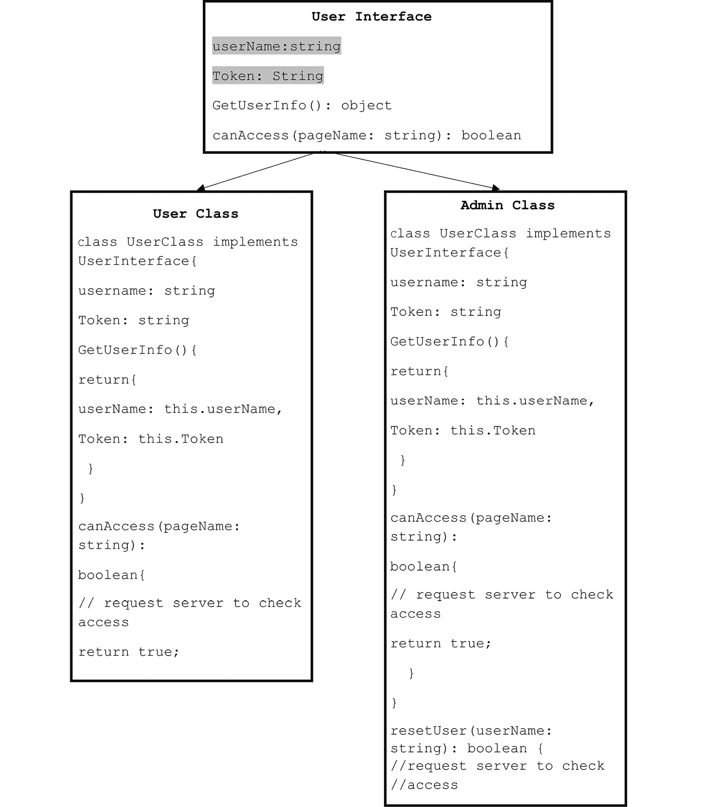
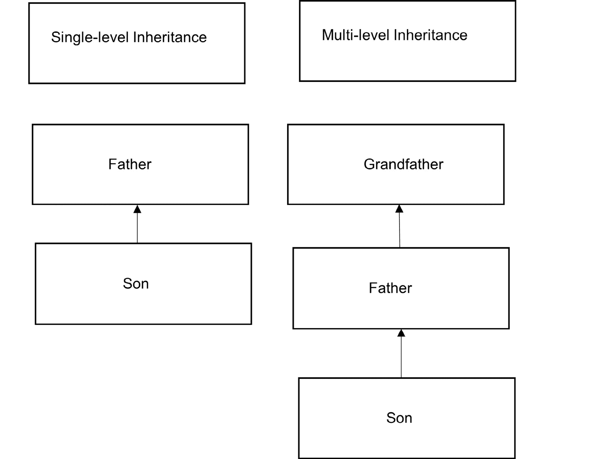

# 第六章：5. 接口和继承

概述

本章将向你介绍接口和继承。你将学习如何使用接口来塑造你的类、对象和函数。你还将了解接口如何帮助你编写更好的代码。在本章结束时，你将能够编写更好、更易于维护的代码，具有结构良好的函数、类和对象，并且能够有效地重用现有代码。

# 简介

上一章讨论了类和对象。你了解到类定义了对象及其功能。类是构建这些对象时遵循的蓝图。现在，我们将抽象层次提高一级。我们现在将构建接口。接口是描述符，允许你定义对象的形状。接口允许你定义契约，即规定数据形状的规则。

接口之所以重要，是因为它们使你的对象能够具有强类型，这让你能够编写更干净的代码。在小型应用程序中，定义对象的形状可能不是一个大问题，但当与大型应用程序一起工作时，接口将证明其价值，因为它们将使你的应用程序能够扩展，而不会使你的代码变得混乱且难以支持。

继承允许新对象继承现有对象的属性，使你能够在不重新定义公共属性的情况下扩展代码功能。继承将帮助你更好地理解如何结构化你的代码，以使你的方法更高效和逻辑。本章将首先介绍接口，并为你提供使用它们的技能，然后继续讨论继承这一主题。

# 接口

这里有一个定义用户对象形状的简单接口示例：

```js
interface UserInterFace {
    email: string,
    token: string,
    resetPassword: ()=> boolean   
}
```

在前面的代码中，我们定义了一个接口，我们可以在任何应该遵循接口中定义的规则的对象上实现它。这种优势使我们与其他网络语言（如纯 JavaScript）相比具有优势，即所有实现此接口的对象都必须遵循接口定义的结构。这意味着我们的对象现在是强类型的，并且具有语言支持，如语法高亮、自动完成以及在实现错误时抛出异常。如果你是一位在大型应用程序上工作的开发者，这非常重要，因为你可以定义规则，现在可以确信所有实现`UserInterface`的对象都将具有接口中定义的相同属性。

这里是一个实现`UserInterface`接口的对象示例：

```js
const User: UserInterFace = {
    email: 'home@home.com',
    token: '12345678',
    resetPassword(): boolean{
        return true
    }
}
```

如前例所示，我们现在能够实现一个遵守 `UserInterFace` 接口定义的指南的对象。当与大型团队或复杂网络应用程序一起工作时，拥有透明、易于理解的代码规则非常重要。

接口允许为你的对象创建一个共同的参考点，一个定义对象应该如何构建的规则的地方。在下一节中，我们将深入探讨 TypeScript 中的接口。

当你想为你的对象、类和函数的实施设置规则时，会使用接口。它们是一个合同，它规定了结构但不规定功能。这里有一个图表示接口及其与两个类（`User` 和 `Admin`）的关系：




图 5.1：接口与类之间的关系

在图中，我们有一个用户界面，描述了属于此接口的类应该如何实现。正如你所看到的，我们在两个类中提供了一些属性（用户界面中突出显示的代码）和方法。接口只为属性的名称、类型、方法结构和返回类型（如果不是 void）提供基本信息。请注意，接口不提供与方法工作相关的规则，只提供它们的结构。方法的实际功能是在类本身中定义的。如前所述，TypeScript 中的接口为你提供规则，你可以根据需要实现它们。这从前面的图中很明显。`AdminUser` 类有一个在 `UserInterface` 中未定义的方法；然而，这不是问题，因为该类符合接口的所有元素。没有规则说你不能向你的类中添加内容，只是你需要满足你的类实现的接口的要求。

## 案例研究 – 编写你的第一个接口

假设你正在与一个应用开发团队一起工作，为仓库地面工作人员开发应用程序。你的任务是构建产品创建类和函数。你已经根据应用程序的功能需求为你的类制定了一个计划。你首先创建了一个名为 `ProductTemplate` 的产品接口。`ProductTemplate` 定义了我们的产品对象的结构和基本要求。请注意，我们也可以以相同的方式使用类型对象，这可能更可取，因为这是一个简单的对象，不是一个类，不能由类型表示。然而，为了这个示例，并且为了让你明白接口也可以在定义简单对象时用作类型，我们已经构建了 `ProductTemplate` 接口：

```js
Example_Interface_1.ts
1 //first interface
2 interface ProductTemplate {
3     height: number
4     width: number
5     color: string
6 }
Link to the preceding example: https://packt.link/wYJis.
```

在定义接口时，我们首先使用接口关键字，然后是接口的名称，`ProductTemplate`，如前文代码片段所示。我们的产品需要三个属性 – 高度、宽度和颜色。现在我们已经描述了我们的产品数据应该是什么样子，让我们使用它：

```js
7 //make product function
8 const productMaker = (product: ProductTemplate) => {
9     return product
10 }
```

我们已经创建了一个名为 `productMaker` 的函数，它接受一个产品对象作为参数。为了确保只有符合我们 `productMaker` 函数所需属性的对象被传递给该函数，我们使用了我们的 `ProductTemplate` 接口，如前文代码片段所示。现在，我们只需要定义我们的产品对象；我们也将使用该接口：

```js
11 // implement interface
12 const myProduct: ProductTemplate = {
13     height: 10,
14     width: 12,
15     color: 'red',
16 }
```

我们已经声明了一个名为 `myProduct` 的产品对象，并使用 `ProductTemplate` 接口添加了接口所需的属性。使用接口这种方式确保我们在创建产品对象时完全符合要求。现在，如果我们添加一个未定义的属性或删除 `ProductTemplate` 接口中定义的属性，IDE 或 TypeScript 编译器将抛出一个有用的错误信息。IDE 突出显示将取决于你的 IDE 和对 TypeScript 的支持程度。VS Code 应该突出显示前两种情况下的以下错误信息。

当你添加一个接口中未定义的属性 `length` 时，会出现以下错误信息：

```js
(property) length: number
Type '{ height: number; width: number; color: string; length: number; }' is not assignable to type 'ProductTemplate'.
  Object literal may only specify known properties, and 'length' does not exist in type 'ProductTemplate'.ts(2322)
```

当你没有使用接口中定义的颜色属性时，会出现以下错误信息：

```js
const myProduct: ProductTemplate
Property 'color' is missing in type '{ height: number; width: number; }' but required in type 'ProductTemplate'.ts(2741)
Example_Interface.ts(5, 5): 'color' is declared here.
```

现在我们有了产品对象，让我们将其传递给 `productMaker` 函数：

```js
// call the function using console log to show the output
console.log(productMaker(myProduct));
```

一旦你使用 `npx` `ts-node` `Example_Interface.ts` 运行文件，你将获得以下输出：

```js
{ height: 10, width: 12, color: 'red' }
```

这是理想的情况。但是，如果你传递一个不符合 `ProductTemplate` 接口的对象会发生什么呢？考虑以下代码表示这种情况：

```js
const myBadProduct = {
    height: '20',
    color: 1
}
console.log (productMaker(myBadProduct))
```

当你使用 `tsc` 运行文件 `[filename].ts` 时，你会收到以下错误信息：

```js
error TS2345: Argument of type '{ height: string; color: number; }' is not assignable to parameter of type 'ProductTemplate'.
  Property 'width' is missing in type '{ height: string; color: number; }' but required in type 'ProductTemplate'.
```

VS Code 会阻止你犯这样的错误。如果你在 VS Code 窗口中将鼠标悬停在红色下划线代码上，你会看到一个类似于前文错误信息的警告。

让我们回到我们的接口示例 (`Example_Interface.ts`)。现在，我们为产品定义了一个接口。让我们为 `productMaker` 函数做同样的事情。我们希望确保每次一个函数以我们的产品作为参数时，它都是按照正确的方式构建的。因此，我们构建了以下接口 – `productInterfaceFunction`：

```js
Example_Interface_2.ts
1 // first interface
2 interface ProductTemplate {
3     height: number
4     width: number
5     color: string
6 }
7 //function interface
8 interface productInterfaceFunction {
9     (product: ProductTemplate): ProductTemplate
10 }
Link to the preceding example: https://packt.link/Dzogj.
```

我们在 `ProductTemplate` 之后添加了函数接口 `productInterfaceFunction`。正如你所见，语法很简单，只是定义了函数可以接受哪些参数以及它应该返回什么。现在我们可以在函数声明中使用函数接口，如下所示：

```js
//make product function
const productMaker: productInterfaceFunction = (product: ProductTemplate) => {
    return product }
```

你应该再次得到之前相同的输出：

```js
{ height: 10, width: 12, color: 'red' }
```

我们现在已经以两种方式使用了接口：用于塑造一个对象和一个函数。这里唯一的问题是这种方式并不非常高效。作为优秀的开发者，我们希望尽可能高效，并遵守面向对象编程的标准。为此，我们现在将重构我们的代码，定义一个类来封装我们的产品属性和方法：

```js
Example_Interface_3.ts
9  //product class interface
10 interface ProductClassInterface {
11    product: ProductTemplate
12    makeProduct(product: ProductTemplate) :ProductTemplate
13 }
Link to the preceding example: https://packt.link/kF4Ee.
```

在前面的代码片段中，我们为我们的类构建了一个接口，其中我们定义了一个`product`属性和`makeProduct`方法。

我们也在我们的产品对象和`makeProduct`上很好地使用了之前创建的接口。接下来，我们将使用新的接口`ProductClassInterface`来实例化一个新的类：

```js
16 //class that implements product class interface 
17 class ProductClass implements ProductClassInterface  {
18    product: ProductTemplate
19    constructor(product: ProductTemplate){
20        this.product = product
21    }
22    makeProduct():ProductTemplate {
23        return this.product;
24    }
25 }
26
27 //new product object
28 const product: ProductTemplate = {height:100, width:200, color: 'pink'}
```

在前面的代码片段中，我们使用了`implements`关键字将接口规则应用到我们的`ProductClass`上。语法结构如下：`class` `ProductClass`后面跟着`implements`关键字，然后是您希望应用到类上的接口：`class ProductClass implements ProductClassInterface`。如您所见，这段代码更加简洁，易于管理。使用接口来定义我们的产品类使我们能够更加详细地描述，因为我们不仅可以定义我们的类，还可以定义与之相关的方法和属性。

类型别名也可以以类似的方式使用，但类型更多的是一个验证器而不是描述符，因此建议更多地使用类型来验证函数返回的对象或函数接收的参数。

接口和类型可以一起使用，而且应该这样使用。然而，它们的使用方式、使用位置以及如何在代码中应用，取决于您，因为它们在许多方面相似，尤其是在 TypeScript 语言的最新更新中。现在，让我们创建一个产品对象并使用我们的类实例`newProduct`：

```js
27 //new product object
28 const product: ProductTemplate = {height:100, width:200, color: 'pink'}
29 
30 //call make Product function
31 // instantiate product class with new product object 
32 const newProduct = new ProductClass(product)
33 // console our new product instance
34 console.log(newProduct.product)
```

在前面的代码片段中，我们构建了一个产品对象，并将其传递给我们的类的`makeProduct`函数。然后我们在控制台输出结果，与之前相同，但现在我们的功能代码被封装在类中。

您将得到以下输出：

```js
{ height: 100, width: 200, color: 'pink' }
```

现在我们已经基本了解了如何在 TypeScript 中实现接口，让我们在接下来的练习中构建一个更现实的产品创建过程。

## 练习 5.01：实现接口

在这个练习中，我们将在一个对象、函数和类上实现一个接口。部分代码可能较为冗长，你可能在现实世界的应用中不会这样实现。然而，这个练习将让你了解在代码中实现接口的不同方式。我们将构建一个管理产品对象的类，并使用接口来强制实施与类实现相关的规则。我们还将使用接口来塑造我们的产品对象和类方法。在一个典型的 Web 应用中，这段代码可能属于产品管理接口的一部分——例如库存管理应用。或者，它也可能是产品创建过程的一部分，其中有一个表单用于接收用户数据并处理它：

注意

这个练习的代码文件可以在以下链接找到：[`packt.link/SR8eg`](https://packt.link/SR8eg)。为了运行本章中的任何 TypeScript 文件，你需要进入文件目录并执行`npx ts-node filename.ts`。

1.  创建一个名为`ProductObjectTemplate`的接口：

    ```js
    interface ProductObjectTemplate {
        height: number
        width: number
        color: string
    }
    ```

    当创建一个接口或类型对象时，你应该考虑你的接口或类型需要哪些共同元素。这可能基于应用需求，或者仅依赖于应用所需的功能。`ProductObjectTemplate`是一个简单的对象，在大多数情况下应该是一个类型，但为了展示接口也可以这样使用，我们选择将其作为一个接口。正如你所见，我们只定义了一些可能的产品基本属性——`高度`、`宽度`和`颜色`。

1.  使用前面步骤中定义的接口，定义一个名为`ProductClassTemplate`的函数：

    ```js
    interface ProductFunctionTemplate {
        (product: ProductObjectTemplate)
    }
    ```

    在前面的步骤中，我们使用接口定义了一个函数，通过这样做，我们提供了函数可以接受哪些参数的规则。这将确保任何对这个函数的实现都只会接受`ProductObjectTemplate`作为参数。

1.  为名为`ProductClassTemplate`的类构建一个接口。在你的新类中重用`ProductFunctionTemplate`和`ProductObjectTemplate`：

    ```js
    interface ProductClassTemplate {
        makeProduct: ProductFunctionTemplate
        allProducts():ProductObjectTemplate[]
    }
    ```

    在前面的步骤中，我们正在重用*步骤 1 和 2*中定义的函数和产品接口来构建我们的类接口。我们可以简化这一步骤的代码，因为我们正在重用我们在前两个步骤中创建的接口。*步骤 3*是一个很好的例子，说明了你如何在构建复杂性的同时使代码更加简洁。

1.  创建一个`Product`类并实现我们的类接口：

    ```js
    class Product implements ProductClassTemplate {
        products: ProductObjectTemplate []
        constructor() {
            this.products = []
        }
        makeProduct(product: ProductObjectTemplate) {
            this.products.push(product)
        }

        allProducts():ProductObjectTemplate[] {
            return this.products
        }}
    ```

    在此之前的步骤中，我们创建了一个实现`ProductClassTemplate`接口的类。这将确保我们的类遵守接口中定义的规则。我们还重用了`ProductTemplate`接口来验证我们的类方法是否接受正确的参数并返回正确的数据。在前面的步骤中，我们做了一些准备工作来设置接口，现在我们可以在代码库中重用它们，使整体代码更容易编写、更容易支持和理解。

1.  按如下方式实例化我们的类：

    ```js
    const productInstance: ProductClassTemplate = new Product()const productInstance: ProductClassTemplate = new Product()
    productInstance.makeProduct({})
    ```

    在这里，我们再次使用接口`ProductClassTemplate`来确保我们实现的类符合我们的规则集。

    如果我们尝试使用空对象调用`makeProduct`，我们会得到一个有用的错误消息，我们可以用它来解决我们的问题。请随意进行测试以确保你的接口按预期工作。在这里，我们有我们类实例方法`makeProduct`的正确实现。

1.  调用`makeProduct`方法并提供一个符合我们产品接口定义的有效产品对象：

    ```js
    productInstance.makeProduct(
        {
        color: "red", 
        height: 10, 
        width: 14
        }
    )
    ```

1.  调用`allProducts`方法并将结果输出到控制台：

    ```js
    console.log(productInstance.allProducts())
    ```

    `allProducts`方法返回一个产品数组。这相当于一个 API 调用，返回产品列表到你的前端。

1.  现在，输出`allProducts`方法的结果：

    ```js
    console.log(productInstance.allProducts())
    ```

1.  通过执行`npx ts-node Exercise01.ts`来运行文件。

    你将获得以下输出：

    ```js
     [ { color: 'red', height: 10, width: 14 } ]
    ```

    一旦正确遵循了步骤，你的输出应该是一个数组或产品对象，如前一张截图所示。接口为你提供了定义合约的手段，这些合约规定了你的代码应该如何实现，这正是强类型语言如 TypeScript 及其相对于 JavaScript 的主要优势所在。通过在练习中使用接口，我们现在有了更不容易出错且在处理大型应用程序或大型团队时更容易支持的代码。如果正确实现，接口对于开发过程可能非常有价值。

## 练习 5.02：实现接口 – 创建原型博客应用程序

想象一下，你是一名正在社交网站上工作的开发者。你被分配了一个任务，即设置一个博客系统，允许用户在网站上发布内容。该项目旨在全球范围内扩展，因此它将非常大。因此，你的代码需要定义得很好，包含所有必要的上下文。这里的主要主题是上下文。你正在编写代码的方式将导致无错误的代码，且易于支持和理解。

首先，我们从主对象开始——博客帖子。为了构建一个博客系统，我们需要定义什么是博客帖子。因为这个对象很简单，我们创建了一个类型别名，`BlogPost`。如前所述，我们可以使用接口来定义此对象，但对于简单、非复杂对象来说，类型更合适。类型更像是描述某个单元的描述符，例如，一个数字或一个字符串，而接口更像是如何与某个东西交互的指示，而不是它是什么：

注意

此代码文件的代码可以在此处找到：[`packt.link/6uFmG`](https://packt.link/6uFmG)。

1.  按照以下代码片段定义博客类型：

    ```js
    type BlogPost = {
        post: string,
        timeStamp: number,
        user: string
    }
    ```

1.  创建一个名为`AddToPost`的接口：

    ```js
    interface AddToPost {
         (post: BlogPost): BlogPost []
    }
    ```

    此接口将作为我们将用于添加到我们的博客列表的方法的主要接口。正如我们在前面的练习中所阐述的，`AddToPost`接口定义了我们将如何与我们的主要方法交互，以及当调用时它将返回什么。

1.  创建一个接口来定义一个类，`BlogPostClass`：

    ```js
    interface IBlogPost {
        allPost: BlogPost [],
        addToPost: AddToPost
    }
    ```

    在这里，我们定义我们的类接口。我们知道我们需要一个地方来存放我们的博客，因此我们定义了一个`allPost`全局对象，它是一个`BlogPost`类型数组。我们还定义了一个方法，`addToPost`，它实现了`AddPost`接口。

1.  创建一个名为`blogPostClass`的类，该类实现了`blogPostClass`接口：

    ```js
    class blogPostClass implements IBlogPost{
        allPost: BlogPost [] = []
        addToPost(post: BlogPost): BlogPost[] {
            this.allPost = [
                ...this.allPost,
                post
            ]
            return this.allPost
        }
    }
    ```

    在前面的类中，我们重用我们的类型来强制和验证。`addToPost`方法的逻辑取决于你，开发者。在此步骤中，代码通过接受一个`BlogPost`类型的参数并返回一个`BlogPost`数组来实现方法，一旦它符合接口。

1.  创建`blogPostClass`的实例：

    ```js
    const blog = new blogPostClass();
    ```

1.  构建`BlogPost`类型的三个对象：

    ```js
    let post1: BlogPost = {post: 'Goodbye, 2020', timeStamp: 12345678, user: 'Rayon'}
    let post2: BlogPost = {post: 'Welcome, 2021', timeStamp: 12345678, user: 'Mark'}
    let post3: BlogPost = {post: 'What happened to 1999?', timeStamp: 12345678, user: 'Will'}
    ```

    此步骤模拟用户向您的博客网站发布帖子。在实际应用中，这将是一个表单，当提交时创建对象。

1.  调用`addToPost`方法三次，并传递你在*步骤 6*中创建的帖子对象：

    ```js
    blog.addToPost(post1)
    blog.addToPost(post2)
    blog.addToPost(post3)
    ```

    在实际的 Web 应用中，对`addToPost`的调用将涉及向应用程序的后端发送更新数据的 API 调用，但在此练习中，我们只是更新一个数组。例如，如果你正在使用某种前端状态管理，前面的代码可以非常类似于处理后端更新的状态管理。

1.  从创建的类实例中控制台输出`allPost`全局对象，*步骤 5*：

    ```js
    console.log(blog.allPost)
    ```

1.  通过执行`npx ts-node Exercise02.ts`来运行文件。

    你应该看到以下输出：

    ```js
    [
      { post: 'Goodbye, 2020', timeStamp: 12345678, user: 'Rayon' },
      { post: 'Welcome, 2021', timeStamp: 12345678, user: 'Mark' },
      { post: 'What happened to 1999?', timeStamp: 12345678, user: 'Will' }
    ]
    ```

## 练习 5.03：为更新用户数据库的函数创建接口

作为网络应用开发团队的一员，你被分配了一个任务，即构建一个用于更新用户数据库的接口。在现实世界的应用中，这个函数可能是用户注册表单的一部分，通过 API 调用更新用户数据库。要求很简单：该函数应接受一个`User`类型的参数，该类型包含`email`和`userId`属性。

为了这个练习，假设你只是在处理函数的逻辑，并且代码只是在你将其实现到你的工作应用之前的测试目的。因此，我们将有一个表示数据库的数组，它将预先加载一些用户对象：

注意

此练习的代码文件可以在以下位置找到：[`packt.link/XLIz9`](https://packt.link/XLIz9)。

1.  创建一个具有`email`和`userId`属性的`User`类型，如下所示：

    ```js
    type User = {
        email: string,
        userId: number
    }
    ```

    创建一个用户类型可以简化你的函数接口。现在，你可以在定义下一步的接口时重用`User`类型。

1.  建立一个名为`SuperAddMe`的函数接口，如下所示：

    ```js
    interface SuperAddMe {
        (user: User): User[]
    };
    ```

    通过这样做，我们定义了我们如何与我们的函数交互。这是一件小事，但现在，所有此类函数都将有明确的规则。我们将知道它需要什么以及它将返回什么。

1.  初始化一个`User`类型的数组，并填充一些用户：

    ```js
    let allUsers: User[] = [
        { email: 'home@home.com', userId: 1 },
        { email: 'out@side.com', userId: 2 }
    ];
    ```

    此数组将模拟我们将要添加的用户数据库。

1.  定义一个`SuperAddMe`接口类型的函数：

    ```js
    let adduser: SuperAddMe
    adduser = function (user: User): User[] {
        return [
            ...allUsers,
            user
        ]
    }
    ```

    以这种方式实现函数时，你必须首先将其声明为接口类型，在这个例子中是`SuperAddMe`接口。接下来，使用函数变量，并分配一个符合我们接口规范的函数给它。这种实现与类型赋值非常相似，但由于函数的复杂性，使用了接口。此外，请注意，此代码可以通过在一行中完成声明和赋值来简化，但为了展示过程并使其更易于阅读，赋值被分部分实现。

1.  显示对新函数`adduser`的调用结果，并传递一个`User`类型的用户对象。将结果输出到控制台以显示代码正在工作：

    ```js
    console.log(
        adduser(
            { email: 'slow@mo', userId: allUsers.length }
        )
    )
    ```

1.  使用`npx ts-node`命令运行代码。你应该看到以下输出：

    ```js
    [
      { email: 'home@home.com', userId: 1 },
      { email: 'out@side.com', userId: 2 },
      { email: 'slow@mo', userId: 2 }
    ]
    ```

## 活动 5.01：使用接口构建用户管理组件

想象你正在开发一个网络应用，并被分配构建用户管理组件的任务。你需要构建一个类来封装应用的用户管理方面，并且作为一个优秀的开发者，你会使用接口来确保你的代码易于重用和支持。对于这个活动，你可以假设你的用户接口至少有三个属性：email、token 和 loginAt。这些属性与用户的电子邮件 ID、网络令牌以及用户登录系统的时间相关。

注意

此活动的代码文件可以在以下位置找到：[`packt.link/xsOhv`](https://packt.link/xsOhv)。

以下是一些帮助你完成此活动的步骤：

1.  创建一个具有以下属性的`user`对象接口：`email : string`、`loginAt : number`和`token: string`。`loginAt`和`token`属性应该是可选属性。

1.  创建一个具有全局属性`user`的类接口，并使用上一步创建的接口应用用户对象规则。

    你需要定义一个`getUser`方法，该方法返回`user`对象，然后使用接口确保返回的对象是用户对象。最后，定义一个接受`user`对象和`password(type string)`作为参数的`login`方法。使用`user`对象接口作为`user`参数类型。

1.  声明一个名为`UserClass`的类，该类实现了先前的步骤中的类接口。你的登录方法应将本地函数的`user`参数赋值给全局`user`属性，并返回全局`user`。`getUser`方法应返回全局`user`。

1.  创建你在*步骤 2*中声明的类的实例。

1.  创建一个`user`对象实例。

1.  将我们的方法输出到控制台，以确保它们按预期工作。

预期的输出如下：

```js
{ email: 'home@home.com', loginAt: 1614068072515, token: '123456' }
{ email: 'home@home.com', loginAt: 1614068072515, token: '123456' }
```

注意

此活动的解决方案可以通过此链接找到。

TypeScript 的诞生源于构建更不令人困惑、定义更清晰的代码的需求。接口允许你以最结构化的方式构建代码。一切都有规则，没有混淆，这与纯 JavaScript 不同。

要总结接口的重要性，你可以这样说：现在你可以生成结构更好、第三方更容易使用的代码。

例如，假设你像在先前的活动中做的那样构建了一个`user`类，现在你需要继续进行项目的另一部分。你构建的接口将对接管应用程序用户部分的开发者或可能其他开发者想要构建与你的用户类具有相似结构的用户类非常有帮助。通过使用你定义的接口，他们可以构建一个遵循你设定的所有规则的架构。这也对调试很有帮助，因为他们现在知道事情应该如何工作，并且可以通过使用接口作为指南来找到问题所在。

本章的下一节将专门介绍 TypeScript 中的继承。

# TypeScript 继承

我们现在将深入探讨继承，这是面向对象编程的核心原则之一。它允许我们遵循 DRY（不要重复自己）原则。继承还允许我们通过抽象功能来实现多态。继承使你能够从原始类扩展到子类，这允许你保留父类或原始类的功能，并添加或覆盖你不需要的部分。

子类可以覆盖其父类的方法，并拥有自己的方法和对象。继承只允许你在父类的基础上构建；如何实现你的子类取决于你。然而，规则是，在子类中必须有一些需要从父类重用的代码，或者你应该创建一个新的类，因为没有必要扩展你不想使用任何代码的类。

假设你有一个用户类，用于管理你的应用程序中的用户。你正在开发一个 Web 应用程序，在规划阶段，你意识到你需要不止一种用户类型，因为不同的用户将具有不同的访问级别，并且能够根据他们的角色执行不同的操作。这正是使用继承的完美案例。每次你有通用属性和功能时，你都可以扩展而不是重复代码。在这种情况下，我们有几种用户类型，它们都具有用户的通用属性：电子邮件、创建日期、最后登录和令牌等。

因为这些属性对所有用户都是通用的，我们可以将它们全部放入一个用户类中。用户类将作为基类，我们可以将其扩展到子类中。现在，你的子类将拥有所有通用属性，而无需为每个子类单独声明它们。正如你所见，这是一种更有效的方法；它阻止了代码重复，并允许功能的整合。

首先，让我们回顾一下 TypeScript 中继承的一些基本规则：

TypeScript 只支持两种继承方式：单级和多级。因此，在 TypeScript 中，子类可以继承自父类（单级继承），或者子类可以继承自另一个子类（多级继承）。

注意

他们是其他类型的继承，但由于 TypeScript 不支持这些模式，本章将不会涉及这些类型。

这里，我们有一个 TypeScript 支持的两种继承类型的图示——单级和多级：



图 5.2：单级和多级继承的示例

单级继承发生在子类直接从父类继承时，如前图所示。Son 子类是从 Father 父类派生出来的，并具有所有其属性。它也可以有自己的属性和函数，这些属性和函数是子类独有的。继承的一个目标是在现有基础上构建，因此，仅仅创建类的副本将是毫无意义的。多级继承与单级继承的工作方式相同，除了子类从另一个子类继承，而不是直接从父类继承，如前图所示。换句话说，单级继承直接从基类继承，该基类没有父类，而多级子类从派生类继承。如您所见，Grandfather 类是基类，因此没有父类。Father 是从 GrandFather 派生出来的，但在这个例子中，Son 是从 Father 派生出来的，这使得这个例子是多级的。

TypeScript 使用 `private` 和 `public` 关键字来允许您隐藏子类中的代码，并控制子类如何通过 getter 和 setter 方法访问类属性。您可以使用 `super` 关键字覆盖父类公开的任何方法，`super` 是指向父类的直接链接。`super` 还允许您访问父类的属性和方法，即使它们在子类中被覆盖。

要了解代码中的继承是如何工作的，让我们回到本节引言中我们讨论过的用户示例。任何给定应用程序的用户都有一些共同的属性，例如电子邮件、创建日期、最后登录时间和令牌。我们将使用这些共同元素来构建基用户类：

```js
Examples_Inheritance_1.ts
1 class UserOne {
2     email: string = "";
3     createDate: number = 0;
4     lastLogin: number = 0;
5     token: string = ""
6 
7     setToken(token: string): void {
8         // set user token
9        this.token = token;
10     }
11     resetPassword(password: string):string {
12         // return string of new password
13         return password;
14     }
15 }
Link to the preceding example: https://packt.link/23ts2.
```

这里有一些关于在基类中使用的属性的信息。这也有助于您理解为什么这些属性存在于基类中：

+   `email`: 这个属性作为唯一标识符。

+   `createDate`: 这个属性允许您知道用户何时被添加到系统中。

+   `lastLogin`: 这个属性让我们知道用户上次在系统上活跃的时间。

+   `token`: 这个属性将验证用户对应用程序 API 的请求。

+   `setToken`: 这个属性允许我们设置和重置令牌属性；例如，用户从应用程序注销，令牌需要被设置为 null。

+   `resetPassword`: 这个属性允许我们重置当前用户的密码。

我们还在 `setToken` 函数中使用 `this` 关键字来访问我们的类级别令牌。我们还在基类中提供了一些默认值，例如将电子邮件设置为空字符串，将 `createDate` 设置为零。这只是为了使创建类的实例更容易，因为我们不需要每次初始化类实例时都提供值。

现在，让我们继续讨论继承。我们将现在创建一个子类，`AdminUser`：

```js
16 class AdminUser extends UserOne {
17     // pages admin has access to
18     adminPages: string [] = ["admin", "settings"];
19 
20     // method that allows the admin to reset other users
21    resetUserPassword(email: string):string {
22         // return default user password
23         return "password123";
24     }
25 }
```

为了我们能够创建一个子类，我们必须使用`extends`关键字后跟父类，正如前面片段所示。语法结构如下：使用`class`关键字后跟子类的名称，然后是`extends`关键字，最后是你想要扩展的父类的名称：`class AdminUser extends UserOne`。

在我们继续一些示例之前，让我们列出一些在 TypeScript 中使用类继承时不能做的事情：

+   你不能使用除了单级和多级继承之外的其他类型的继承。

+   如果你声明一个属性或方法为私有，你无法在派生类中直接访问它。

+   除非你在派生类的构造函数中调用`super`，否则你不能覆盖基类的构造方法。

现在，让我们回到我们的子类`AdminUser`。请注意，我们为我们的子类添加了一些独特的属性和方法。对`AdminUser`独特的是`adminPages`，这是一个只有管理员用户可以访问的页面列表，以及`resetUserPassword`，它接受一个用户的电子邮件地址并返回一个默认密码：

注意

你也可以通过在子类中使用`this`关键字直接引用父类的属性和方法，因为`AdminUser`现在是一个组合类。

现在，考虑以下片段：

```js
26 // create a instance of our child class
27 const adminUser: AdminUser = new AdminUser() 
28
29 // create a string to hold our props
30 let propString = ''
31
32 // loop through your props and appends prop names to propString
33 for(let u in adminUser) {
34     propString += u + ','
35 }
```

在前面的片段中，我们创建了一个子类`AdminUser`的实例。我们还声明了一个字符串`propString`，它是一个空字符串。这个字符串将保存你的类属性列表。使用`for`循环，我们遍历我们的类实例并将属性追加到`propString`。

现在，输出我们子类的一个实例以验证我们是否已成功从基类继承：

```js
36 // console out the results
37 console.log(propString)
```

你应该在控制台上看到我们子类和父类的属性和方法被打印出来：

```js
email,createDate,lastLogin,token,adminPages,constructor,resetUserPassword,setToken,resetPassword,
```

前面的输出是预期的结果。你现在有一个`UserOne`和`AdminUser`的组合属性列表，这表明我们已经成功将`UserOne`类扩展到`AdminUser`，换句话说，我们已经证明了`AdminUser`从`UserOne`继承。

现在，让我们通过从`AdminUser`类派生一个新的类来将继承提升一级。将派生类命名为`SuperAdmin`，因为并非所有管理员都是平等的：

```js
Examples_Inheritance_2.ts
class SuperAdmin extends AdminUser {
    superPages: string[] = ["super", "ultimate"]
    createAdminUser(adminUser: AdminUser ): AdminUser {
        return adminUser
    }
}
Link to the preceding example: https://packt.link/XcFR6.
```

如前所述的片段所示，我们现在正在扩展`AdminUser`类以创建一个`SuperAdmin`类。这意味着我们现在具有多级继承，因为我们的当前类正在从派生类继承。我们还添加了一个新的属性`superPages`和一个方法`createAdmin`。

多级继承在构建复杂性的同时，还能保持你的代码易于管理。

接下来，我们将在`SuperAdmin`子类中重载`resetPassword`方法。

我们想在`SuperAdmin`类中创建一个新的方法来重置密码。我们需要一个方法来添加哈希，使用户密码更安全，因为这将是管理员超级用户的密码：

```js
26 class SuperAdmin extends AdminUser {
27     superPages: string[] = ["super", "ultimate"]
28     readonly myHash: string
29 
30     constructor() {
31         super()
32         this.myHash = '1234567'
33     }
34 
35     createAdminUser(adminUser: AdminUser ): AdminUser {
36         return adminUser
37     }
38     resetPassword(password: string): string {
39         // add hash to password
40         return password + this.myHash; 
41     }
42 }
```

前面的代码片段创建了一个新的方法 `resetPassword` 并向 `SuperAdmin` 类添加了一个新的 `myHash` 属性。我们给我们的新方法取了与祖父类 `UserOne` 中的 `resetPassword` 方法相同的名字，即 `resetPassword`。然而，这个新方法返回了一个附加了我们的哈希属性的密码。

这被称为方法重写，因为方法具有相同的名称和签名，这意味着它们接受相同的参数。祖父类中的方法被重写，新的方法将优先于 `SuperAdmin` 类的实例。

当你需要向子类中的方法添加一些功能，但又不想改变签名时，这很有用，因为新方法做的是类似但不完全相同的事情。你的代码的消费者将能够使用相同的方法，但根据他们调用的派生子类，得到不同的结果。

在下面的代码片段中，我们将输出 `SuperAdmin` 和 `AdminUser` 类的实例以及 `resetPassword` 方法的结果：

```js
43 const superAdmin = new SuperAdmin()
44 const newAdmin = new AdminUser()
45 console.log( superAdmin.resetPassword('iampassword'))
46 console.log( newAdmin.resetPassword('iampassword'))
```

你将得到以下输出：

```js
iampassword1234567 
iampassword   
```

如您从输出中看到的，我们调用了相同的方法，但得到了不同的输出。这表明我们成功地重写了来自父类 `UserOne` 的 `resetPassword` 方法。

你还可以向我们的类添加一些访问修饰符，以显示它们将如何影响我们的子类：

```js
class UserOne {
    email: string = "";
    createDate: number = 0;
    lastLogin: number = 0;
    private token: string = ""
    setToken(token: string): void {
        // set user token
        this.token = token;
    }
    resetPassword(password: string):string {
        // return string of new password
        return password;
}}
```

在前面的代码片段中，我们向 `token` 属性添加了 `private` 访问修饰符。现在，我们只能通过公共的 `setToken` 方法访问 `token` 属性，而所有派生类都有权访问 `setToken` 方法。这在你想限制在子类中授予哪些方法和属性访问权限的情况下很有用。这也有助于抽象功能，从而使得消费者与你的代码交互更加容易。

我们想要确保每个 `AdminUser` 类的实例都初始化了一个电子邮件地址。因此，我们决定在我们的 `AdminUser` 类中添加一个构造函数方法，以便在创建 `AdminUser` 类实例时为我们的管理员用户创建一个电子邮件地址。

然而，我们不能仅仅创建一个构造函数，因为这是一个子类，这意味着我们已经有了一个带有构造函数方法的父类，并且我们不能在不调用基类构造函数方法的情况下重写构造函数方法。

要调用基类的构造函数方法，我们使用 `super()`，这是对基类构造函数方法的直接引用：

```js
// adminUserTwo
class AdminUserTwo extends UserOne {
    // pages admin has access to
    constructor(email: string) {
        super()
        this.email = email;
      }

      adminPages: string [] = ["admin", "settings"];

      resetUserPassword():string {
          // return default user password
          return "password123";
      }
```

如您在前面的代码片段中看到的，我们有一个接受电子邮件地址并设置全局电子邮件地址的构造函数方法。我们还调用了 `super` 方法，这样我们就可以在父类上调用构造函数方法。

现在，你可以在创建 `AdminUserTwo` 类的实例时传递一个电子邮件地址。这对我们的 `AdminUser` 类的用户来说是完全透明的：

```js
const adminUserTwo = new AdminUserTwo('home@home.com');
```

现在我们已经涵盖了继承，我们将把所学到的知识应用到即将到来的练习中。

## 练习 5.04：创建基类和两个扩展子类

假设您是开发团队的一员，正在为一家超市连锁店开发一个网络应用程序。您有建立一个表示应用程序中用户的类的任务。因为您是一位优秀的开发者，并且知道您不应该尝试为所有用例创建一个类，所以您将构建一个基类，其中包含您认为应用程序中所有用户都应该拥有的常见属性，然后根据需要扩展它为子类：

注意

该练习的代码文件可以在此处找到：[`packt.link/hMd62`](https://packt.link/hMd62)。

1.  创建一个 `User` 类，如下面的代码片段所示：

    ```js
    class User {
        private userName: string; 
        private token: string = ''
        readonly timeStamp: number = new Date().getTime()
        constructor(userName: string, token: string) {
            this.userName =  userName
            this.token = token
        }
        logOut():void {
            this.userName = ''
            this.token = ''
        }
        getUser() {
            return {
                userName: this.userName,
                token: this.token,
                createdAt: this.timeStamp
            }
        }
        protected renewToken (newToken: string) {
            this.token = newToken
        }}
    ```

    应用程序要求所有用户在创建用户对象时都必须有 `username` 和 `token`，因此我们添加了这些属性，并在构造函数中初始化它们。

    我们还把它们设置为 `private`，因为我们不希望子类直接访问我们的属性。我们还有一个 `timestamp` 属性，我们将用它来为用户对象设置创建日期。这个属性被设置为 `readonly`，因为它在类实例化时创建，我们不希望它被修改。

    您的应用程序的不同部分也需要访问用户对象的属性。因此，我们添加了 `getUser` 方法，该方法返回您的用户属性。`getUser` 方法还将允许派生或子类以间接方式访问私有属性。应用程序允许用户在一定时间内登录，之后用户令牌过期。为了使用户能够在应用程序中继续工作，我们需要更新他们的令牌，因此我们添加了 `renewToken` 方法，允许设置用户令牌属性，而不直接访问属性。

1.  从 `User` 类派生一个 `Cashier` 类：

    ```js
    class Cashier extends User {
        balance: number = 0
        float: number = 0
        start(balance: number, float: number): void {
            this.balance= balance
            this.float = float
        }
    }
    ```

    现在我们有一个新的用户类 `Cashier`，它是从 `User` 类派生出来的，具有一些独特的特性。`Cashier` 类型的用户需要在我们的应用程序中发挥作用。然而，我们没有访问父类中所有属性的权限。您不能直接访问 `userName` 和 `token`。您能够访问 `renewToken` 方法，但不是通过 `Cashier` 类的实例。然而，您可以在构建 `Cashier` 类时调用该方法，作为您对收银员用户管理的部分。

    为什么我们要在子类中修改访问权限，而不是在父类中修改？这是因为封装和标准化：我们希望当我们的代码被他人使用时，降低代码的复杂性。

    例如，你一直在开发一个有用的函数库。你希望你的同事能够使用它，但他们不需要了解你的`User`类的内部工作原理。他们只需要能够通过公开的方法和属性访问该类。这允许你在不是扩展或实现代码的人的情况下引导这个过程。一个很好的例子是 JavaScript 中的`Date`类。你不需要知道它是如何工作的。你只需实例化它并按指示使用它。

1.  从`User`类派生一个`Inventory`类：

    ```js
    class Inventory extends User {
        products: string [] = []
        // override constructor method, add new prop
        constructor(userName: string, token: string, products: string[]) {
            // call parent constructor method
            super(userName, token)
            // set new prop
            this.products = products
    }}
    ```

    我们的新用户类型`Inventory`需要在声明新的库存用户时初始化产品，因为这个用户将直接处理产品，并且当用户登录应用程序时，他们应该在用户队列中拥有一些产品。

    为了实现这一点，我们在子类中重写了父类的构造函数方法。我们的构造函数现在接受一个新的参数`products`，它是一个字符串类型的数组。这意味着我们已经根据在父类中定义的内容改变了构造函数应该接受的参数数量。每次我们重写构造函数时，都需要调用`super`，这是对父类的引用。

    如您所见，这允许我们访问父构造函数方法，因此我们现在可以初始化`userName`和`token`，并在这样做的同时满足子类的父类要求。从这个例子中我们可以吸取的主要教训是，我们所有的代码更改都是在子类中进行的。你为`Inventory`类编写的新代码不会影响从`User`类派生的其他类。你已经扩展并定制了你的代码以处理独特的情况，而不必为这个用户案例编写新代码，这节省了你的时间并使你的代码库保持简单。

    到目前为止，我们已经从我们的`User`类派生了两个类，这是单继承，因为我们所创建的子类直接从基类派生。下一步涉及到多层继承。

1.  创建一个新的派生类`FloorWorker`：

    ```js
    class FloorWorker extends Inventory {
        floorStock: string [] = []
        CheckOut(id: number) {
            if(this.products.length >=0) {
                this.floorStock.push(
                    this.products[id]
                )
            }
        }
    }
    ```

    这就是多层继承。这个类考虑了楼层工作人员。这些是处理商店货架库存的用户，因此他们需要从库存中访问产品。他们还需要有一个移除产品的数量，以填充商店货架。他们需要能够访问`User`类的属性，以及访问`Inventory`类的`Products`数组。

    在下面的代码片段中，我们将实例化我们的不同用户类，并输出我们迄今为止所做的工作的结果。

1.  实例化你的基本用户并输出结果：

    ```js
    const basicUser = new User('user1', '12345678ttt')
    console.log(basicUser) 
    ```

    你将获得以下输出：

    ```js
    User {
      token: '12345678ttt',
      timeStamp: 1614074754797,
      userName: 'user1'
    }
    ```

1.  实例化`Cashier`类用户并输出结果：

    ```js
    const cashUser = new Cashier('user2', '12345678')
    console.log(cashUser)
    cashUser.start(10, 1.5)
    console.log(cashUser)
    ```

    你将获得以下输出：

    ```js
    Cashier {
      token: '12345678',
      timeStamp: 1614074754802,
      userName: 'user2',
      balance: 0,
      float: 0
    }
    Cashier {
      token: '12345678',
      timeStamp: 1614074754802,
      userName: 'user2',
      balance: 10,
      float: 1.5
    ```

1.  实例化`Inventory`类用户并输出结果：

    ```js
    // init inventory
    const iUser = new Inventory('user3', '123456789', [
        'orange', 'mango', 'playStation 2'
    ])
    console.log(iUser) 
    ```

    你将获得以下输出：

    ```js
    Inventory {
      token: '123456789',
      timeStamp: 1614074754819,
      userName: 'user3',
      products: [ 'orange', 'mango', 'playStation 2' ]
    }
    ```

1.  实例化`FloorWorker`类用户并输出结果：

    ```js
    // FloorWorker
    const fUser = new FloorWorker('user4', '12345678', [
        'orange', 'mango', 'playStation 2'
    ])
    fUser.CheckOut(0)
    console.log(fUser.products) 
    console.log(fUser.floorStock)
    ```

    你将获得以下输出：

    ```js
    [ 'orange', 'mango', 'playStation 2' ]
    [ 'orange' ]
    ```

    注意

    对于*步骤 5-8*，你也可以一次性实例化和控制台输出属于不同类别的所有用户，而不是单独输出，如下所示。

在这个练习中，你创建了一个基类、子类，并处理了多层和单层继承。你还使用了`super`和访问修饰符。

## 练习 5.05：使用多层继承创建基类和扩展类

你是一家手机公司的开发者，你被分配了一个构建手机模拟应用程序的任务。该公司制造两种类型的手机——智能手机和标准手机。测试部门希望能够展示他们手机的一些功能，并需要能够在实际设备更新时向这两种手机类型添加更多功能。在查看需求后，你意识到你需要能够模拟两种类型的手机，并且你还希望使更新你的代码变得容易，而无需进行大量的重构和破坏你的手机模型可能使用的其他代码。你还知道这两种手机有很多共同之处——它们都有通过语音和文本数据通信的基本功能。

注意

代码文件可以在这里找到：[`packt.link/pyqDK`](https://packt.link/pyqDK)。

1.  创建一个作为我们子类基类的`Phone`类，如下所示：

    ```js
    class Phone {
    powerButton: boolean;
    mic: boolean;
    speaker: boolean;
    serialNumber: string;
    powerOn: boolean = false;
    restart: boolean = false;
    constructor(
    powerButton: boolean,
    mic: boolean,
    speaker: boolean,
    serialNumber: string,
    ) {
    this.powerButton = powerButton
    this.mic = mic;
    this.speaker = speaker;
    this.serialNumber = serialNumber;
    }

    togglePower(): void {
    this.powerOn ? this.powerOn = false : this.powerOn = true
    }

    reboot(): void {
    this.restart = true
    }
    }
    ```

    `Phone`类是我们将存储所有手机通用元素的地方。这将使我们能够简化子类，只处理它们特有的元素。

1.  创建一个扩展在*步骤 1*中创建的基类或父类的`Smart`类：

    ```js
    class Smart extends Phone {
    touchScreen: boolean = true;
    fourG: boolean = true;
    constructor(serial: string) {
    super(true, true, true, serial)
    }
    playVideo(fileName: string): boolean {
    return true
    }
    }
    ```

    `Smart`子类使我们能够隔离`Smart``Phone`类的所有方法和属性。

1.  创建一个扩展在*步骤 1*中创建的父类的`Standard`类，如下所示：

    ```js
    class Dumb extends Phone {
    dialPad: boolean = true;
    threeG: boolean = true;
    constructor(serial: string) {
    super(true, true, true, serial)
    }
    NumberToLetter(number: number): string {
    const letter = ['a', 'b', 'c', 'd']
    return letter[number]
    }
    }
    ```

    第 2 步和第 3 步处理创建我们的子类，这使我们能够在不出现问题的情况下更新我们的代码，并保持我们的代码整洁和易于维护。因为我们在这个阶段计划得很好，如果我们需要向我们的`Smart`手机添加功能，我们只需更新一个子类即可。对于`Standard`手机类也是如此。此外，如果我们需要在两个子类中都使用的方法或属性，我们只需更新`Phone`父类。通过类继承，我们工作得聪明，而不是辛苦。

1.  创建我们子类的两个实例并初始化它们：

    ```js
    const smartPhone = new Smart('12345678')
    const standardPhone = new Standard('67890')
    ```

1.  在控制台输出并调用我们类实例的独特方法，以验证我们的子类是否按预期工作：

    ```js
    console.log(smartPhone.playVideo('videoOne'))
    console.log(standardPhone.NumberToLetter(3))
    ```

    你将获得以下输出：

    ```js
    true
    d
    ```

    如果你回顾`Smart`和`Standard`类的相应类定义，你将能够确认前面的输出确实是类按预期工作的证据。

1.  显示子类实例以表明我们拥有父类和子类的所有属性和方法：

    ```js
    console.log(smartPhone)
    console.log(standardPhone)
    ```

    你将获得以下输出：

    ```js
    Smart {
      powerOn: false,
      restart: false,
      powerButton: true,
      mic: true,
      speaker: true,
      serialNumber: '12345678',
      touchScreen: true,
      fourG: true
    }
    Dumb {
      powerOn: false,
      restart: false,
      powerButton: true,
      mic: true,
      speaker: true,
      serialNumber: '67890',
      dialPad: true,
      threeG: true
    }
    ```

    对于前面的输出，重新查看`Smart`和`Dumb`类的相应类定义应该足以证明在这个练习中应用的继承是正确的。

现在你已经了解了 TypeScript 中继承的工作原理，我们将通过以下活动来测试我们的技能。

## 活动 5.02：使用继承创建一个原型车辆展厅的 Web 应用程序

你被要求创建一个车辆展厅的 Web 应用程序。你决定使用你在继承方面的新技能来构建出我们将需要的车辆对象类和子类。请注意，展厅有几种类型的车辆。然而，所有这些类型都将有一些共同的属性。例如，所有车辆都有轮子和车身。你可以使用这些信息来构建你的基类。

以下步骤将帮助你完成此活动：

注意

本练习的代码文件可以在此处找到：[`packt.link/6Xp8H`](https://packt.link/6Xp8H)。

1.  创建一个父类，它将包含所有基础车辆共有的方法和属性。定义一个构造函数方法，允许你初始化这个类的基类属性，并添加一个方法，该方法返回你的属性作为一个对象。

1.  如果需要，可以向希望控制访问权限的属性和类方法添加访问修饰符。

1.  从父类派生两个子类，例如`Car`和`Truck`，作为车辆类型。

1.  重写你的构造函数，根据车辆类型向子类添加一些独特的属性。

1.  从第 3 步中创建的子类之一派生一个类，例如`Suv`，它将具有一些卡车可能具有的属性，因此扩展`Truck`是合理的。

1.  实例化你的子类，并用数据初始化它们。

1.  在控制台输出子类实例。

1.  预期输出如下：

    ```js
    Car { name: 'blueBird', wheels: 4, bodyType: 'sedan', rideHeight: 14 }
    Truck { name: 'blueBird', wheels: 4, bodyType: 'sedan', offRoad: true }
    Suv {
      name: 'xtrail',
      wheels: 4,
      bodyType: 'box',
      offRoad: true,
      roofRack: true,
      thirdRow: true
    }
    ```

    注意

    本活动的解决方案可以通过此链接找到。

# 摘要

在本章中，我们介绍了 TypeScript 中的接口。你学习了接口如何让你围绕对象、类和方法构建契约。你还了解到接口是概述代码实现规则的规则。本章介绍了使用接口如何使代码更容易理解，并且在大型团队中工作时，你和其他开发者都能得到更好的支持。

本章还向你介绍了继承，这是面向对象编程的核心原则之一。你学习了 TypeScript 支持的继承类型以及如何使用继承在代码中构建复杂性，而不会使代码变得更加复杂。本章阐明，将简单结构堆叠以形成更复杂的结构是一种良好的实践，因为它允许你重用代码，每次需要构建类时不必重新发明轮子。这也使得代码支持更好，因为你将只编写所需的代码，并拥有在整个应用程序中保持恒定的公共父类，从而使得错误和漏洞更容易被发现。

你现在对接口和继承有了很好的理解，这两个构建块将在你继续阅读本书以及使用 TypeScript 进行 Web 开发时发挥重要作用。

你在这里学到的概念将使你成为一个更好的开发者，因为你现在有了编写良好支持、干净、无错误的代码的工具。

在下一章中，你将学习高级类型，并了解类型别名、类型字面量、联合类型和交叉类型。
