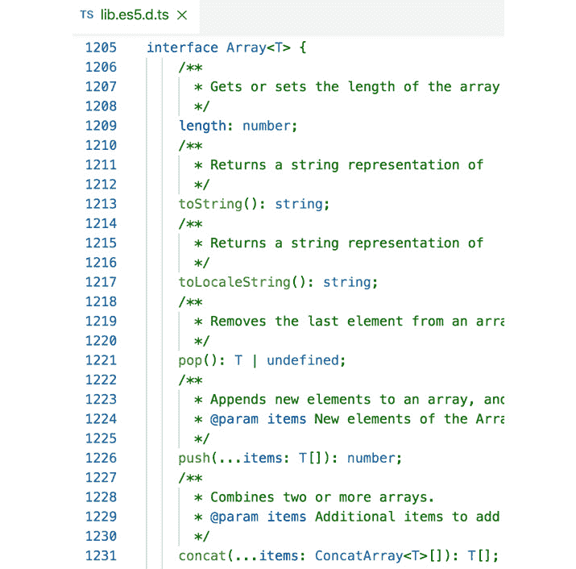
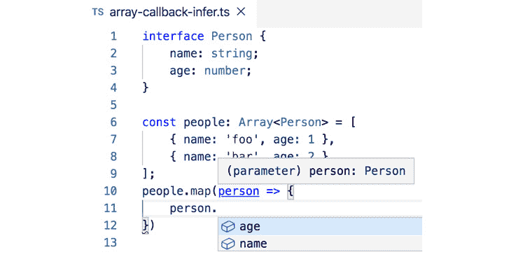

# 第十章：9. 泛型和条件类型

概述

本章介绍了泛型和条件类型。本章首先教你了解泛型是什么，以及在不同上下文（如接口、类、函数等）中的一些基本泛型用法。接下来，你将学习泛型约束，以及如何在使用泛型时使你的代码更安全，以避免运行时错误。最后，你将学习条件类型以及它们如何通过在编译时引入类型级别的*逻辑*使泛型更加强大。

到本章结束时，你将能够将泛型应用于实际用例。

# 简介

在上一章中，我们看到了如何在 TypeScript 中使用依赖注入。在本章中，我们将介绍 TypeScript 类型系统提供的两个更高级的功能，这些功能主要用于高级应用程序或构建库时——泛型和条件类型。

TypeScript 包含一个非常强大的类型系统，涵盖了大量的用例和高级类型。在早期章节中，我们看到了一些更基本的方法，在构建应用程序时可以利用类型系统。

泛型是许多语言（如 Java、C#、Rust 和当然还有 TypeScript）的构建块之一，它们的目的是允许开发者在编写代码时使用未知类型（但稍后在使用这些泛型代码时会指定）来编写动态和可重用的*泛型*代码片段。换句话说，泛型在创建应用程序时不知道具体类型时是一种“占位符”。

例如，如果你想编写一个泛型*List*数据结构，其实现在乎存储什么类型的项都是相同的，但实际存储的项类型在编写*List*类时是*未知的*。然后我们可以使用泛型作为编写时的“占位符”类型，而*List*类的使用者将在知道它将使用的具体类型时指定它，从而填充这个“占位符”。

条件类型允许我们将*逻辑*引入 TypeScript 的类型系统，这将在*编译时*进行检查。这意味着我们的类型可以更安全，我们可以使代码更严格，并将一些逻辑从运行时移动到编译时，这意味着服务器或用户浏览器上需要运行的代码更少。此外，条件类型允许我们编写更复杂的类型，它们之间有更复杂的关系。

例如，如果我们想从一个字符串字面量联合中删除一些选项，我们可以使用`Extract`类型只取其中的一些：

```js
type Only FooAndBar = Extract<"foo" | "bar" | "baz", "foo" | "bar">;  // "foo" | "bar"
```

虽然不限于与泛型类型一起使用，但条件类型通常在这些情况下使用，因为你想在未知类型上编写一些逻辑，并且提前编写，否则你可以自己明确地编写它。

在本章中，我们将探讨泛型和条件类型，并了解它们如何使您的代码更加健壮，对变化具有更强的抵抗力，并在外部使用时提供更好的开发者体验。

# 泛型

如前所述，泛型帮助我们编写在编写时类型未知但在稍后使用时类型已知的代码。它们允许我们在其他情况下会使用具体类型的地方放置“占位符”，并且这些占位符可以在稍后由我们代码的使用者填充。泛型允许我们编写一次代码，并用于多个**类型**，而不会在过程中失去类型安全，甚至可以提高与不使用泛型所能达到的类型安全相比的类型安全。

让我们看看泛型如何帮助我们更正确地进行类型化，从一个非常基本的函数——`identity`——开始：

```js
// identity.ts
function identity(x: number): number {
    return x;
}
```

`identity`函数接受一个`number`类型的`x`，并仅返回`x`。现在，假设我们还想为字符串提供相同的功能：

```js
// identityString.ts
function identityString(x: string) {
    return x;
}
```

由于类型信息仅用于编译时，这两个函数在编译后的 JavaScript 输出中是完全相同的：

```js
// identity.js
function identity(x) {
    return x;
}
// identityString.js
function identityString(x) {
    return x;
}
```

由于输出 JavaScript 代码相同，并且鉴于 TypeScript 只是在现有 JavaScript 的基础上添加类型，因此有一种方法可以对现有的`identity`函数进行类型化，使其支持这两种用例。我们可以以多种方式对`identity`进行类型化——最简单的方式是将`x`类型化为`any`。然而，这意味着我们在函数内部以及`return`类型中都会失去类型安全：

```js
function identity(x: any): any {
    return x;
}
const result = identity('foo');
result.toFixed();
```

这可能不是我们想要的。由于`result`的类型是`any`，TypeScript 无法知道前面的代码中的`result.toFixed()`将在运行时抛出错误（因为字符串没有`toFixed()`方法）：


图 9.1：运行此代码会在运行时引发 TypeError

相反，我们可以利用泛型——我们将`x`类型化为一个泛型类型`T`，并从函数中返回相同的类型。考虑以下代码：

```js
function identity<T>(x: T): T {
	return x;
}
```

在 TypeScript 中，泛型使用尖括号编写，并在其中放置一个占位符类型名称。在前面的代码中，`T`是泛型，并充当“占位符”。现在，如果我们用以下详细信息更新代码，我们将得到一个编译时错误，如下所示（红色下划线）：


图 9.2：由于使用了泛型而导致的编译时错误

注意

占位符类型名称可以是任何名称，其名称仅对使用代码的开发者有用——因此请尝试为泛型类型提供有意义的名称，这些名称在它们使用的上下文中是有意义的。

注意，我们只有一个（恒等）函数实现，它可以同时用于字符串和数字。TypeScript 还能自动识别返回类型，并在编译时提供有用的错误信息。此外，我们可以将任何其他类型传递给`identity`函数，而无需对其进行任何修改。

注意

在调用 `identity()` 时，我们甚至不需要告诉 TypeScript 泛型的类型。TypeScript 通常可以从参数中推断泛型（s）的类型。

通常，在调用函数时必须手动指定泛型的类型是一个代码异味（一个潜在代码可能存在更大问题的信号），当可以从参数中推断出来时（尽管也有例外）。

泛型可以以各种形式出现——从我们刚才看到的函数，到接口、类型和类。它们的行为都是一样的，只是在其各自的范围内——所以函数泛型只适用于该函数，而类泛型适用于该类的实例，也可以在其方法/属性中使用。在接下来的几节中，我们将探索这些泛型类型中的每一种。

## 泛型接口

泛型接口是具有一些附加类型的接口，这些类型在接口的作者之前是未知的，这些类型“附加”到接口上。这种附加类型为接口提供了“上下文”，并在使用它时提供了更好的类型安全性。

实际上，如果你以前使用过 TypeScript，你可能已经与泛型交互过，也许甚至没有意识到。它们无处不在——只需看看这段基本的代码：

```js
const arr = [1, 2, 3];
```

如果你将鼠标悬停在 `arr` 上，你会看到它的类型是 `number[]`：

![图 9.3：arr 的类型被推断为 number[]]


图 9.3：`arr` 的类型被推断为 `number[]`

`number[]` 只是 `Array<number>` 的简写——泛型再次发挥作用。

在数组中，泛型用于数组持有的元素类型。没有泛型，`Array` 就必须用 `any` 类型在所有地方进行类型化，或者为每种可能的类型（包括非内置类型）都有一个单独的 `interface`，这是不可能的。

让我们看看 `Array<T>` 接口定义：

![图 9.4：`Array<T>` 接口的一部分，其中泛型被大量使用]



图 9.4：`Array<T>` 接口的一部分，其中泛型被大量使用

正如你所见，`pop`、`push` 和 `concat` 方法都使用 `T` 泛型类型来知道它们返回什么，或者它们可以接受什么作为参数。这就是为什么以下代码无法编译：

![图 9.5：尝试将不兼容的类型推送到具有特定泛型的数组时出现的错误]

一个特定的泛型类型


图 9.5：尝试将不兼容的类型推送到具有特定泛型的数组时出现的错误

这也是 TypeScript 如何推断 `map`、`filter` 和 `forEach` 的回调中 `value` 的类型的方式：

![图 9.6：使用 Array 的 map 方法时的类型推断]



图 9.6：使用 `Array` 的 `map` 方法时的类型推断

## 泛型类型

泛型可以用于普通类型，例如，创建一个 `Dictionary<V>` 类型，也可以用来描述一个在类型 `V` 的任何值（在事先未知的情况下）和字符串之间的映射，因此是**泛型**的：

```js
type Dictionary<V> = Record<string, V>;
```

泛型类型还有更多用例，但大多数情况下，你将要么与泛型约束（在本章后面解释）一起使用它们，要么用接口描述它们（尽管几乎任何`interface`能做的事情，`type`也能做到）。

## 泛型类

泛型对于类也非常有用。正如我们在本章前面看到的，内置的`Array`类使用了泛型。这些泛型在类的定义中指定，并应用于该类的实例。类的属性和方法可以利用这个泛型类型来定义它们自己的类型。

例如，让我们创建一个简单的`Box<T>`类，它可以存储任何类型的`T`值，并允许稍后检索它：

```js
class Box<T>  {
    private _value: T;
    constructor(value: T) {
        this._value = value
    }
    get value(): T {
        return this.value;
    }
}
```

`_value`属性、构造函数和`value`获取器使用类定义中的`T`泛型类型作为它们的类型。如果这个类中还有其他方法，这个类型也可以用于这些方法。

此外，类的方法可以添加它们自己的泛型，这只会应用于该方法的作用域——例如，如果我们想向`Box`类添加一个`map`方法，我们可以这样编写：

```js
class Box<T>  {
    ...
    map<U>(mapper: (value: T) => U): U {
        return mapper(this.value)
    }
}
```

`U`泛型类型可以在`map`方法声明及其实现中使用，但不能在其他类成员中使用（例如，与之前提到的`value`获取器不同），与`T`不同——`T`的作用域是整个类。

# 练习 9.01：泛型集合类

在这个练习中，我们将创建一个`Set<T>`类，它实现了`Set`数据结构——一种可以存储项目，没有特定顺序，且没有重复的数据结构，使用泛型。

按照以下步骤实现这个练习：

注意

这个练习的代码文件可以在以下链接找到：[`packt.link/R336a`](https://packt.link/R336a)。

1.  首先，创建一个具有泛型`T`类型的`Set`类。这个类型将是集合中项目的类型：

    ```js
    class Set<T> {
    }
    ```

1.  接下来，让我们添加一个构造函数，它接受一些可选的初始值。这些值需要是一个包含类型`T`的项目的数组，以匹配我们的`Set`项目：

    ```js
    class Set<T> {
      private items: T[];
      constructor(initialItems: T[] = []) {
        this.items = initialItems;
      }
    }
    ```

    我们使用默认参数来初始化`initialItems`为一个空数组，如果我们没有提供，这使得这个参数是可选的，同时在构造函数实现中仍然方便使用。

1.  让我们添加一个`size`获取器，它返回集合的大小。这将是我们的`items`长度的简单表示：

    ```js
    class Set<T> {
      private items: T[];
      //...
      get size(): number {
        return this.items.length;
      }
    }
    ```

1.  接下来，让我们添加一个`has`方法，它检查给定项目是否已经在集合中：

    ```js
    class Set<T> {
      private items: T[];
      //...
      has(item: T): boolean {
        return this.items.includes(item);
      }
    }
    ```

    注意，我们在`has`定义中使用`T`类型——我们可以使用它，因为它是类的作用域内，其中`T`被声明。

1.  最后，我们还需要一种方法来向我们的集合中添加和删除项目——让我们添加这些方法：

    ```js
    class Set<T> {
      ...
      add(item: T): void {
        if (!this.has(item)) {
          this.items.push(item);
        }
      }
      remove(item: T): void {
        const itemIndex = this.items.indexOf(item);
        if (itemIndex >= 0) {
          this.items.splice(itemIndex, 1);
        }
      }
    }
    ```

    对于`add`方法，我们首先检查给定的`item`是否已经存在，如果不存在，则添加它。

    对于`remove`方法，我们寻找给定项目的索引。如果它存在，我们就从数组中删除它。

1.  现在，编写以下两行代码：

    ```js
    const set = new Set <number>([1,2,3]);  
    set.add(1) // works – since 1 is a number
    set.add('hello') //Error – since 'hello' is not a number
    ```

    在你的集成开发环境（IDE）中，你会看到以下内容：

    

    图 9.7：由于泛型而实现的 Set 类中的类型安全

    我们可以看到如何使用 `Set` 类，以及它是如何保持自身类型安全的，不允许在同一个类中将多种类型的项混合在一起，例如在以下 *步骤 7* 中。

1.  最后，如果你回到 `Set` 类的实现，你会注意到类中 `items` 的类型是 `T[]`，所以如果我们尝试向 `items` 数组添加 TypeScript 不认识的类型为 `T` 的项，我们会得到一个错误：


图 9.8：由于泛型而实现的 Set 类中的类型安全

这是预期的，因为 `T` 可以是任何类型，而不仅仅是字符串——正如我们在前面的例子中创建 `Set<number>` 所见——一个只能包含数字的集合。

## 泛型函数

我们已经在本章开头简要地看到了泛型函数，即 `identity<T>()` 函数。但是，让我们看看一个更实际、更有用的用例——比如说，你想围绕 `fetch()` 编写一个包装器来获取 JSON 数据，这样用户就不必在响应上调用 `.json()`。考虑以下代码：

```js
interface FetchResponse {
	status: number;
	headers: Headers;
	data: any;
}
async function fetchJson(url: string): Promise<FetchResponse> {
	const response = await fetch(url);
	return {
		headers: response.headers,
		status: response.status,
		data: await response.json(),
	};
}
```

这里，我们使用浏览器的 `fetch` 函数向给定的 `url` 发起 `GET` 调用，然后返回一个包含响应主要部分的对象——`headers`、状态码（`status`）和解析后的主体（`data`）。

注意

`fetch()` 不是 ECMAScript 的一部分，因此它不是语言的一部分。它在所有现代浏览器中都是原生的，并且可以通过 `node-fetch`、`isomorphic-fetch` 等包在 Node.js 中使用。

`json()` 方法返回 `Promise<any>`。这意味着如果返回的对象没有 `title` 属性，或者不是 `string` 类型，以下代码在运行时可能会抛出异常：

```js
	const { data } = await fetchJson('https://jsonplaceholder.typicode.com/todos/1');
	console.log(data.title.toUpperCase()); // does data have a title property? What type is it?..
```

如果调用 `fetchJson` 函数的消费者能够知道 `data` 的类型，那将是有用的。为此，我们可以在 `fetchJson` 函数中添加一个泛型类型，同时我们还需要在返回类型中以某种方式指示——这就是 `interface` 和 `type` 泛型再次发挥作用的地方。考虑以下 `fetchJson.ts` 的代码：

```js
// fetchJson.ts
interface FetchResponse<T> {
    status: number;
    headers: Headers;
    data: T;
}
async function fetchJson<T>(url: string): Promise<FetchResponse<T>> {
    const response = await fetch(url);
    return {
        headers: response.headers,
        status: response.status,
        data: await response.json(),
    };
}
```

这与之前看到的 `fetchJson` 的第一个声明非常相似。实际上，生成的 JavaScript 代码完全相同。然而，这个声明现在使用泛型来允许函数的用户指定从 `GET` 调用中期望的返回类型。

现在考虑 `usage.ts` 的代码：

```js
// usage.ts
(async () => {
    interface Todo {
        userId: number;
        id: number;
        title: string;
        completed: boolean;
    }
    const { data } = await fetchJson<Todo>('https://jsonplaceholder.typicode.com/todos/1');
    console.log(data.title); // ✅ title is of type 'string'
    console.log(data.doesntExist); // ❌ 'doesntExist' doesn't compile
})();
```

在这里，我们允许用户向 `fetchJson<T>()` 传递一个 `T` 泛型类型，该函数声明随后将其传递给 `FetchResponse<T>` 接口，从而将事物联系起来。

注意

就像接口一样，泛型只存在于编译时。所以，你在那里写的任何内容都和你让编译器理解的一样安全。例如，如果你要输入 `Todo` 的方式不同，或者传递不同的类型，那么实际的结果——TypeScript 中没有内置的守卫来在运行时验证它（没有用户/库代码——见第五章，*继承和接口*中的用户类型守卫）。

注意，在前面的例子中，`T` 泛型是一个 *便利泛型*——它只是为了用户的便利——它只使用一次，并不比简单的类型断言提供更多的类型安全性：

```js
const response = await fetchJson('https://jsonplaceholder.typicode.com/todos/1');
const todo = response.data as Todo;
```

注意，泛型，就像变量一样，有作用域，你可以在多个级别上定义泛型，让用户按需提供它们。例如，注意我们如何在内部函数中使用在 `map` 函数中声明的 `T` 泛型类型（在以下代码片段的第 2 行）：

```js
function map<T, U>(fn: (item: T) => U) {
    return (items: T[]) => {
        return items.map(fn);
    };
}
const multiplier = map((x: number) => x * 2);
const multiplied = multiplier([1, 2, 3]); // returns: [2, 4, 6]
```

这也适用于接口和类等。在 `Array<T>` 接口中，`map` 函数接受一个额外的泛型作为输出类型，如 TypeScript 中 `Array<T>` 接口声明所示：

```js
interface Array<T> {
    // ...
    map<U>(callbackfn: (value: T, index: number, array: T[]) => U, thisArg?: any): U[];
    // ...
}
```

考虑以下截图：

![图 9.9：Array<T> 的映射方法基于从 callbackfn 返回的类型推断返回类型]

](img/B14508_09_09.jpg)

图 9.9：Array<T> 的映射方法基于从 callbackfn 返回的类型推断返回类型

一旦我们添加了上面的代码，再次，我们不需要明确告诉 TypeScript `U` 是 `string` ——它可以从回调函数的返回类型中 *推断* 它。在这种情况下，`Array<T>` 的 `map` 方法基于从 `callbackfn` 返回的类型推断返回类型，推断为 `string[]`。

## 泛型约束

有时你想要定义一个泛型，使其约束在类型的一个子集中。在本章的开头，我们看到了 `identity` 函数——在那里支持 *任何* 类型既简单又合理。但关于 `getLength` 函数的打字——它只对数组和字符串有意义。接受 *任何* 类型都没有意义——`getLength(true)` 的输出会是什么？为了约束函数可以接受值的类型，我们可以使用泛型约束。考虑以下代码：

```js
function getLength<T extends any[] | string>(x: T): number {
	return x.length;
}
```

这个定义 *约束* 给定的 `T` 类型成为 `any[]`（任何东西的数组——`string[]`、`number[]` 或任何 `Foo[]` 都会是有效的类型）或 `string` 的子类型。如果我们传递一个无效的类型，我们会得到一个编译错误，就像你在这里看到的那样：

![图 9.10：当传递给 getLength 函数无效类型时，会给出编译时错误]

传递给 getLength 函数

](img/B14508_09_10.jpg)

图 9.10：当传递给 getLength 函数无效类型时，会给出编译时错误

通用约束有许多用例，而且通常在使用泛型时，你会在代码中设置一些这些约束，因为当你编写代码时，你可能会假设一些底层类型。此外，使用泛型约束可以让 TypeScript 窄化泛型类型的可能类型，并为你提供更好的建议和类型检查。

例如，在一个更现实的情况下，我们可能有一些函数返回给我们普通的日期，而其他函数返回纪元。我们希望始终使用日期，因此我们可以创建一个函数 `toDate`，它接受这些类型并将它们转换为 `Date` 函数：

```js
function toDate<T extends Date | number>(value: T) {
    if (value instanceof Date) {
        return value;
    }
    return new Date(value);
}
```

在这里，我们首先检查给定的值是否是日期。如果是，我们可以直接返回它。否则，我们使用 `value` 创建一个新的 `Date` 函数并返回它。

通用约束在创建高阶函数时特别强大，因为输入函数的类型可能很难编写，而保持类型安全对于代码的可维护性是一个很大的好处。在下一个练习中，我们将看到通用约束在现实世界应用中的更多用途，以及它如何为我们的代码带来更好的类型。

注意

高阶函数是接受另一个函数作为参数或返回一个函数的函数。我们将在 *第十二章*，*TypeScript 中的 Promise 指南* 中进一步探讨这些内容。

## 练习 9.02：泛型缓存函数

在这个练习中，我们将创建一个 `memoize` 函数，它使用泛型，将完全类型安全——它接受一个函数并返回一个相同类型的函数。

注意

缓存是一种优化性能的方法，通过减少某些操作执行的次数。缓存函数是一个高阶函数，它缓存了传递给它的内部函数的结果。

按照以下步骤实现这个练习：

注意

本练习的代码文件可以在此处找到：[`packt.link/zUx6H`](https://packt.link/zUx6H)。

1.  首先实现一个简单的函数定义。我们稍后会添加类型：

    ```js
    function memoize(fn: Function, keyGetter?: (args: any[]) => string) {
        // TODO: we'll implement the function in the next steps
    }
    ```

    `memoize` 函数接受一个要缓存的函数 `fn`，以及一个可选的 `keyGetter`，用于将参数序列化为键，用于后续查找。

1.  接下来，让我们实现这个函数本身：

    ```js
    function memoize(fn: Function, keyGetter?: (args: any[]) => string) {
        const cache: Record<string, any> = {};
        return (...args: any[]) => {
            const key = (keyGetter || JSON.stringify)(args);
            if (!(key in cache)) {
                cache[key] = fn(...args);
            }
            return cache[key];
        };
    }
    ```

    在 `memoize` 函数中，我们创建一个空的 `cache` 字典——键是序列化的参数，值是运行 `fn` 函数对这些参数的结果。

    然后，我们返回一个函数，给定一些参数 `args`，将检查运行 `fn` 并使用这些参数的结果是否已经被缓存。如果没有，我们将使用这些参数运行 `fn` 并缓存结果。最后，我们返回存储在缓存中的值，这可能是之前的计算结果或我们刚刚运行并缓存的结果。

1.  为了测试这一点，我们将编写一个“昂贵”的函数，该函数在添加两个数字之前会循环 10 秒钟：

    ```js
    function expensiveCalculation(a: number, b: number) {
        const timeout = 10000;
        const start = Date.now();
        while (Date.now() <= start + timeout);
        return a + b;
    }
    ```

    注意

    由于缓存旨在减少调用次数，它通常在运行时间较长的函数中非常有效——为了说明这一点，我们创建了一个 `expensiveCalculation` 函数，它需要不必要地长时间运行（10 秒）。

1.  接下来，让我们 `memoize` 它：

    ```js
    const memoizedExpensiveCalculation = memoize(expensiveCalculation);
    ```

    注意到，缓存的版本不是类型安全的。它确实验证了我们提供了一个 `function`，但返回的值是一个类型非常松散的函数，如果类型不正确，可能在运行时失败或出现意外的行为——你可以向它传递任意数量的任意类型的参数，它仍然可以编译通过，尽管在运行时该函数期望只接受两个参数，这两个参数都应该是 `number` 类型。

    这里我们使用以下方式来缓存：

    ```js
    expensiveCalculation("not-a-number", 1); 
    memoizedExpensiveCalculation("not-a-number", 1); 
    ```

1.  在你的集成开发环境（IDE）中，将鼠标悬停在前面两行代码上。你会注意到以下内容：

    图 9.11：IDE 上的消息

    如前一个屏幕截图所示，缓存的 `expensiveCalculation` 版本不是类型安全的——它允许传递一个字符串作为第一个参数，而它应该只接受一个数字。

1.  返回文件顶部，然后添加泛型约束，并使我们的 `memoize` 函数更加类型安全。首先，我们需要定义几个辅助类型：

    ```js
    type AnyFunction = (...args: any[]) => any;
    type KeyGetter<Fn extends AnyFunction> = (...args: Parameters<Fn>) => string;
    ```

    第一个类型 `AnyFunction` 描述了一个接受任意数量参数并返回任意内容的函数。第二个类型 `KeyGetter` 描述了一个接受泛型约束函数 `Fn` 的参数并返回一个字符串的函数。注意，我们将 `Fn` 约束为 `AnyFunction` 类型。这确保了我们得到一个函数，并允许我们使用内置的 `Parameters<T>` 类型，它接受一个函数的类型并返回它接受的参数。

1.  接下来，使用我们刚刚定义的两个类型使我们的 `memoize` 函数定义更加类型安全——以更好的方式对两个参数进行类型化：

    ```js
    function memoize<Fn extends AnyFunction>(fn: Fn, keyGetter?: KeyGetter<Fn>) {
    ```

    再次，我们将 `Fn` 约束为 `AnyFunction` 类型以确保我们得到一个函数，就像之前一样，同时也为了能够稍后使用特定的函数类型，作为我们的返回类型。

    现在我们有一个更安全的函数，因为 `keyGetter` 现在是类型安全的，但它仍然不返回一个类型化的函数。

1.  让我们通过使实现更加类型安全来修复这个问题：

    ```js
    function memoize<Fn extends AnyFunction>(fn: Fn, keyGetter?: KeyGetter<Fn>) {
        const cache: Record<string, ReturnType<Fn>> = {};
        return (...args: Parameters<Fn>) => {
            const key = (keyGetter || JSON.stringify)(args);
            if (!(key in cache)) {
                cache[key] = fn(...args);
            }
            return cache[key];
        };
    }
    ```

    我们使用 `ReturnType<Fn>` 来表示缓存中的值，而不是 `any`。`ReturnType<T>` 是另一个内置类型，它接受一个函数的类型并返回该函数的返回类型。我们在这里再次使用 `Parameters<T>` 类型，来描述从 `memoize` 返回的函数。

1.  将鼠标悬停在 `memoizedExpensiveCalculation('not-a-number')` 上。现在，我们的 `memoize` 实现是完全类型安全的，并且在 *步骤 4* 中没有导致编译时错误的代码现在可以正确运行：


图 9.12：memoizedExpensiveCalculation 类型的类型与原始的 expensiveCalculation 函数相同

这个练习展示了如何在函数和类型中使用泛型，以及它们是如何相互集成的。在这里使用泛型使得 `memoize` 函数完全类型安全，因此我们的代码在运行时遇到错误的几率更小。

## 泛型默认值

有时，你想要*允许*泛型，但*不要求*它们——你想要提供一些合理的默认值，但允许根据需要覆盖它们。例如，考虑以下 `Identifiable` 接口的定义：

```js
interface Identifiable<Id extends string | number = number> {
    id: Id;
}
```

这可以被其他接口使用，如下所示：

```js
interface Person extends Identifiable<number> {
    name: string;
    age: number;
}
interface Car extends Identifiable<string> {
    make: string;
}
declare const p: Person; // typeof p.id === 'number'
declare const c: Car; // typeof c.id === 'string';
```

当前实现要求每个 `Identifiable` 接口的实现者指定其 `Id` 的类型。但也许我们想要提供一个默认值，这样你只有在不想使用该默认类型时才需要指定它。考虑以下代码：

```js
interface Identifiable<Id extends string | number = number> {
    id: Id;
}
```

注意 `Id` 泛型类型有一个默认类型 `number`，这简化了此接口实现者的代码：

```js
interface Person extends Identifiable {
    name: string;
    age: number;
}
interface Car extends Identifiable<string> {
    make: string;
}
```

注意现在 `Person` 不必指定 `Id` 的类型，代码与之前相同。

另一个更贴近现实世界的场景是与 React 组件相关——每个 React 组件*可能*有属性和*可能*有状态，你可以在声明组件时指定这些（通过扩展 React 的 `Component` 类型），但它们不必都有，因此为这两个泛型类型提供了一个默认的 `{}`：

![图 9.13：@types/react 包的部分片段

![图片 B14508_09_13.jpg]

```js
@types/react package
```

这使得 React 组件默认没有属性和状态，但如果需要，可以指定它们。

# 条件类型

条件类型是在 TypeScript 2.8 中引入的，允许复杂的类型表达式，其中一些驱动了我们在之前看到的内置类型。它们非常强大，因为它们允许我们在类型中编写*逻辑*。这种语法的格式是 `T extends U ? X : Y`。这与常规的 JavaScript 三元运算符非常相似，允许内联条件，唯一的语法区别是你必须使用 `extends` 关键字，并且这个检查是在编译时进行的，而不是在运行时。

这允许我们编写一个 `NonNullable<T>` 类型：

```js
type NonNullable<T> = T extends null | undefined ? never : T; 
```

这已经内建到语言中，但它是由你可以在你的应用程序中编写的相同代码驱动的。

这意味着你可以在编译时检查一个类型是否可以为 null，并根据这个检查来更改类型签名或推断。一个这样的用例可能是 `isNonNullable` 函数。考虑以下代码：

```js
function isNonNullable<T>(x: T): x is NonNullable<T> {
    return x !== null && x !== undefined;
}
```

前面的代码与 `Array` 的 `filter` 方法一起使用，可以让你过滤出相关项。例如，考虑以下混合类型项的数组定义：

![图 9.14：arr 的类型是一个数组，其中每个元素是数字，

null 或 undefined

![图片 B14508_09_14.jpg]

图 9.14：arr 的类型是一个数组，其中每个元素是数字、null 或 undefined

当我们调用`arr.filter(isNonNullable)`时，我们可以得到一个正确类型的数组：

![图 9.15：nonNullalbeArr 的类型被推断为 number[]]

](img/B14508_09_15.jpg)

图 9.15：nonNullalbeArr 的类型被推断为 number[]

最后，TypeScript 2.8 中添加了另一个新特性`infer`关键字，它允许你在*推断*某个类型时从另一个类型中获得编译器的帮助。

这里有一个简单的例子：

```js
type ArrayItem<T extends any[]> = T extends Array<infer U> ? U : never;
```

在这里，我们希望得到数组的内部类型（例如，对于类型为`Person[]`的数组，你希望得到`Person`）。因此，我们检查传递的泛型类型`T extends Array<infer U>`，`infer`关键字建议编译器尝试理解类型，并将其分配给`U`，然后我们将其用作从这个条件类型返回的值。

注意

这个特定的类型示例在之前的版本中也可以通过`type ArrayItem<T extends any[]> = T[number]`实现。

另一个非常有用的例子是，以前在数组之外不可能的“解包”类型。例如，给定`Promise<Foo>`类型，我们希望得到`Foo`类型。现在这可以通过`infer`关键字实现。

类似于上一个例子，其中我们提取了数组内部类型，我们可以使用相同的技巧处理任何其他“包装”另一个类型的泛型类型：

```js
type PromiseValueType<T> = T extends Promise<any> ? T : never;
```

这将在 IDE 中产生以下类型信息：

![图 9.16：UnpromisedPerson 的类型是 Person]

](img/B14508_09_16.jpg)

图 9.16：UnpromisedPerson 的类型是 Person

在下一个活动中，我们将探讨条件类型的更多实际用例，以及`infer`关键字的用法。

## 活动 9.01：创建 DeepPartial<T>类型

在这个活动中，我们将使用本章学到的概念——泛型、条件类型和`infer`关键字——来创建`DeepPartial<T>`类型。这个类型类似于内置的`Partial<T>`类型。但我们将递归地工作，并使对象中的每个属性都是可选的，递归地。

这将允许你正确地类型化变量等，以便它们的属性在任意级别都可以是可选的。例如，一个`REST`服务器将提供资源，并允许使用`PATCH`请求修改它们，这应该得到原始资源的部分结构，以便修改。

注意

这个活动的代码文件可以在以下位置找到：[`packt.link/YQUex`](https://packt.link/YQUex)。

要创建这个类型，我们需要处理几个情况：

1.  原始类型——字符串、数字和其他原始类型，以及日期，都不是我们可以应用`Partial`的。所以`DeepPartial<string> === string`。

1.  对于像对象、`Array`、`Set`和`Map`这样的结构，我们希望“深入”到结构中，并将`DeepPartial`应用于它们的值。

1.  对于其他所有内容，我们只想应用`Partial`。

执行以下步骤以实现此活动：

1.  创建一个`PartialPrimitive`类型。

1.  在顶级定义一个基本的`DeepPartial<T>`类型，它可以处理原始类型和对象。

1.  通过定义一个`DeepPartialArray<T>`类型并在此`DeepPartial<T>`类型中添加对其的处理，来支持数组的支持。

1.  通过定义一个`DeepPartialSet<T>`类型并在此`DeepPartial<T>`类型中添加对其的处理，来支持集合的支持。

1.  通过定义一个`DeepPartialMap<T>`类型并在此`DeepPartial<T>`类型中添加对其的处理，来支持映射的支持。

1.  通过在每个属性上应用`?`属性修饰符，并传递其值包裹在`DeepReadonly`中，来支持普通对象的支持。

    注意

    该活动的解决方案可以通过这个链接找到。

# 摘要

本章使你开始了解泛型和条件类型的基础。我们学习了泛型在许多不同的用例中的使用，为什么它们是有用的，以及它们基本使用的一些扩展——泛型默认值和条件类型。我们进行了一些练习，以展示你如何将泛型包含到你的代码中，使其类型安全并避免运行时错误。

泛型在所有类型的应用程序中都很有用，无论是前端还是后端，并且被广泛使用，尤其是在库中，因为在很多情况下，你希望公开一个利用应用程序类型的 API，而这些类型你可能事先不知道。

在下一章中，你将学习关于异步开发的内容，其中一些内容你在本章中在输入外部 API 时已经简要接触过。
