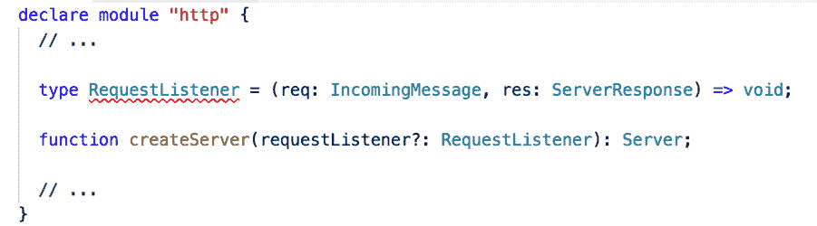
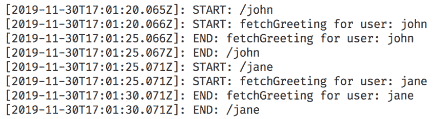
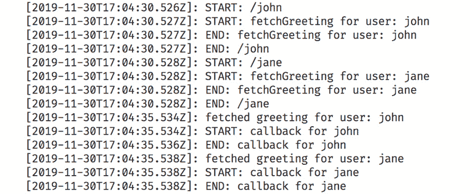

# 第十二章：11. 高阶函数和回调

概述

本章介绍了 TypeScript 中的高阶函数和回调。你将首先了解什么是高阶函数，它们为什么有用，以及如何在 TypeScript 中正确地给它们类型化。然后，本章将教你什么是回调，为什么它们被使用，以及在什么情况下使用。你还将了解到为什么回调被广泛使用，尤其是在 Node.js 中。

此外，本章还将为你提供一个关于事件循环的基本介绍。你不仅将了解“回调地狱”，还将学习如何避免它。到本章结束时，你将能够创建一个类型化的高阶 `pipe` 函数。

# 简介

你已经在 *第三章* *函数* 中了解了 TypeScript 中函数的使用。本章将介绍 TypeScript 中的高阶函数。到目前为止，你在这本书中使用的所有函数，要么向它们传递参数或参数，要么通过扩展，TypeScript 有许多编写代码的组合方式。在本章中，我们将探讨其中一种模式——高阶函数/回调（以下简称 HOCs）是那些要么接受另一个函数作为参数，要么返回一个函数（或两者都是）的函数。

此外，本章还探讨了回调的概念。在 Node.js 以及其他 JavaScript 运行时中，回调是必需的，因为语言是单线程的，并在事件循环中运行，因此，为了不阻塞主线程，我们让其他代码运行，并在需要时调用我们的代码。本章还将涉及“回调地狱”，并为你提供避免它的技能。

## HOCs 简介——示例

HOCs 在 JavaScript 中经常被使用，尤其是在 Node.js 中，即使是最简单的后端服务器应用程序也包含它。以下是一个示例：

```js
const http = require("http");
http.createServer((req, res) => {
  res.write("Hello World");
  res.end();
}).listen(3000, () => {
  console.log("🚀 running on port 3000");
});
```

注意到 `createServer` 函数接受一个请求监听 *函数*，该函数将用于处理任何传入的请求。这个函数将接受两个参数，`req` 和 `res` 分别代表请求对象和响应对象：



RequestListener 的结构


图 11.1：Node.js 中 http 模块描述 RequestListener 回调结构的部分

此外，`listen` 方法还接受一个可选的函数，当服务器准备好监听请求时，该函数将被执行。

`createServer` 和 `listen` 都是高阶组件（HOC），因为它们接受函数作为参数。这些参数函数通常被称为 *回调函数*，因为我们的代码可以通过这种方式在发生某些事情时被“回调”（通知），并且如果需要，可以适当地处理它。在前面的示例中，HTTP 服务器需要知道如何处理传入的请求，因此它调用我们提供的 `requestListener` 函数，该函数提供了相应的逻辑。稍后，`listen` 函数想要让我们知道它何时准备好接受请求，并且它会调用我们提供的回调函数。

另一个例子是 `setTimeout` 函数，它接受另一个 *函数* 作为参数，稍后（超时后）调用：

```js
setTimeout(() => {
    console.log('5 seconds have passed');
},  5000);
function setTimeout(callback: (...args: any[]) => void, ms: number, ...args: any[]): NodeJS.Timeout;
```

另一个不接收回调函数的高阶组件（HOC）示例是 `memoize` 函数。它接受一个要 `memoize` 的函数作为参数，并返回一个具有相同签名的函数：

```js
function memoize<Fn extends AnyFunction>(fn: Fn, keyGetter?: KeyGetter<Fn>): Fn;
```

注意

`memoize` 函数接受一个函数，并返回一个具有相同类型签名的函数；然而，返回的函数会缓存原始函数的结果。这对于运行时间较长且对相同参数返回相同输出的昂贵函数通常很有用。*第九章*，*泛型和条件类型*，*练习 9.01* 实现了这样的 `memoize` 函数。

在接下来的章节中，我们将更详细地探讨这两种高阶组件（HOC），并看看我们如何避免它们引入的一些陷阱。

# 高阶函数

高阶函数是遵循以下两个原则之一的常规函数：

1.  它们接受一个或多个函数作为参数。

1.  它们返回一个函数作为结果。

例如，假设我们想要编写一个 `greet` 函数：

```js
Example01.ts
1 function greet(name: string) {
2   console.log(`Hello ${name}`);
3 }
4
5 greet('John'); 
Link to the preceding example: https://packt.link/GCFjN
```

以下是对应的输出：

```js
Hello John
```

这是一个很好的函数，但它非常有限——如果每个人都有一句喜欢的问候语怎么办？考虑以下示例：

```js
Example02.ts
1 const favoriteGreetings: Record<string, string> = {
2   John: 'Hey',
3   Jane: 'Hello',
4   Doug: 'Howdy',
5   Sally: 'Hey there',
6 };
Link to this example: https://packt.link/CXBrV
```

我们可以将它放在 `greet` 函数内部：

```js
function greet(name: string) {
  const greeting = favoriteGreetings[name] || 'Hello';
  console.log(`${greeting} ${name}`);
}
greet('John'); 
```

以下是对应的输出：

```js
Hey John
```

但这意味着 `greet` 函数本身就不再可重用了，因为如果我们使用它，我们还需要带上 `favoriteGreetings` 映射。相反，我们可以将其作为参数传递：

```js
Example03.ts
1 function greet(name: string, mapper: Record<string, string>) {
2   const greeting = mapper[name] || 'Hello';
3   console.log(`${greeting} ${name}`);
4 }
5
6 greet('John', favoriteGreetings); // prints 'Hey John'
7 greet('Doug', favoriteGreetings); // prints 'Howdy Doug'
Link to this example: https://packt.link/bG0p7
```

以下是对应的输出：

```js
Hey John
Howdy Doug
```

这可行，但每次调用时传递 `favoriteGreetings` 对象非常繁琐。

我们可以通过使 `greet` 函数接受一个函数来改进这一点，该函数将作为解决喜欢的问候语问题的更通用解决方案——它将接受名字并返回要使用的问候语：

```js
Example04.ts
1 function greet(name: string, getGreeting: (name: string) => string) {
2   const greeting = getGreeting(name);
3   console.log(`${greeting} ${name}`);
4 }
5 
6 function getGreeting(name: string) {
7   const greeting = favoriteGreetings[name];
8   return greeting || 'Hello';
9 }
10
11 greet('John', getGreeting); // prints 'Hey John'
12 greet('Doug', getGreeting); // prints 'Howdy Doug'
Link to this example: https://packt.link/uRe2r
```

以下是对应的输出：

```js
Hey John
Howdy Doug
```

这可能感觉和我们的上一个解决方案一样，该解决方案接受映射器对象作为参数，但传递函数要强大得多。我们可以用函数做很多事情，而不仅仅是静态对象。例如，我们可以根据一天中的时间来设置问候语：

```js
Example05.ts
1  function getGreeting(name: string) {
2    const hours = new Date().getHours();
3   if (hours < 12) {
4     return 'Good morning';
5   }
6   
7   if (hours === 12) {
8     return 'Good noon';
9   }
10  
11  if (hours < 18) {
12    return 'Good afternoon';
13  }
14 
15  return 'Good night';
16  }
17 
18  greet('John', getGreeting); // prints 'Good morning John' if it's morning
19  greet('Doug', getGreeting); // prints 'Good morning Doug' if it's morning
Link to this example: https://packt.link/xSYDF
```

一个示例输出可能如下所示：

```js
Good afternoon John
Good afternoon Doug
```

我们甚至可以更进一步，使函数返回一个随机问候语，从远程服务器获取，等等，这是没有在`greet`函数中传递函数无法做到的。

通过使`greet`接受一个函数，我们打开了无限的可能性，同时保持了`greet`的可重用性。

这很好，但每次调用时传递`getGreeting`函数仍然感觉有些繁琐。我们可以通过将`greet`函数改为同时接受一个函数并返回一个函数来改变这一点。让我们看看这是如何实现的：

```js
Example06.ts
1 function greet(getGreeting: (name: string) => string) {
2   return function(name: string) {
3     const greeting = getGreeting(name);
4     console.log(`${greeting} ${name}`);
5   };
6 }
Link to this example: https://packt.link/8nHeD
```

你会注意到逻辑与上一个解决方案相同，但我们拆分了函数，首先接受`getGreeting`函数，然后返回另一个接受`name`参数的函数。这允许我们像这样调用`greet`：

```js
const greetWithTime = greet(getGreeting);
greetWithTime('John'); // prints 'Good morning John' if it's morning
greetWithTime('Doug'); // prints 'Good morning Doug' if it's morning
```

以这种方式拆分`greet`使我们具有更大的灵活性——因为我们现在只需要`getGreeting`函数一次，就可以将其内联，如果它在其他地方使用不合理的话：

```js
8  const greetWithTime = greet(function(name: string) {
9   const hours = new Date().getHours();
10   if (hours < 12) {
11     return 'Good morning';
12   }
13 
14   if (hours === 12) {
15     return 'Good noon';
16   }
17 
18   if (hours < 18) {
19     return 'Good afternoon';
20   }
21 
22   return 'Good night';
23 });
```

我们还可以使用它来使用`Array`的`forEach`方法问候一个人员（名字）数组：

```js
const names = ['John', 'Jane', 'Doug', 'Sally'];
names.forEach(greetWithTime);
```

以下是输出：

```js
Good afternoon John
Good afternoon Jane
Good afternoon Doug
Good afternoon Sally
```

高阶函数，尤其是接受其他函数的函数，非常普遍且有用，尤其是在操作数据集时。我们甚至在之前的章节中使用过它们。例如，`Array`的`map`、`filter`、`reduce`和`forEach`方法接受函数作为参数。

## 练习 11.01：使用高阶函数编排数据过滤和操作

在此练习中，我们获取一个学生列表，并希望获取 2010 年毕业的学生的平均分数。此练习将使用高阶函数来完成此任务。

学生列表如下所示：

```js
interface Student {
  id: number;
  firstName: string;
  lastName: string;
  graduationYear: number;
  score: number;
}
const students: Student[] = [
  { id: 1, firstName: 'Carma', lastName: 'Atwel', graduationYear: 2010, score: 88 },
  { id: 2, firstName: 'Shaun', lastName: 'Knoller', graduationYear: 2011, score: 84 },
  // ...
];
```

注意

您可以参考以下起始文件以获取学生界面代码：[`packt.link/6Jmeu`](https://packt.link/6Jmeu)。

实施此练习的步骤如下：

注意

此练习的代码文件可以在以下位置找到：[`packt.link/fm3O4`](https://packt.link/fm3O4)。请确保从之前提到的学生界面代码开始。

1.  创建一个函数`getAverageScore`，它将接受一个`Student[]`参数，并返回一个`number`：

    ```js
    function getAverageScoreOf2010Students(students: Student[]): number {
      // TODO: implement
    }
    ```

1.  首先，我们希望只获取**2010 年毕业的学生**。为此，我们可以使用数组的`filter`方法——这是一个接受谓词的高阶函数，它接受一个从数组中获取项的函数，并返回`true`或`false`，这取决于该项是否应包含在结果中。`filter`返回一个新数组，该数组包含根据谓词的一些原始数组项。新数组的长度小于或等于原始数组的长度。

1.  使用以下代码更新你的函数：

    ```js
    function getAverageScoreOf2010Students(students: Student[]): number {
      const relevantStudents = students.filter(student => student.graduationYear === 2010);
    }
    ```

    接下来，我们只关心每个学生的分数。我们可以使用数组的`map`方法来做到这一点——这是一个接受映射函数的更高阶函数，该函数接受数组中的一个项，并为每个项返回一个新的、转换后的值（你选择的类型）。`map`返回一个包含转换后项的新数组。

1.  按照以下方式使用`map`方法：

    ```js
    function getAverageScoreOf2010Students(students: Student[]): number {
      const relevantStudents = students.filter(student => student.graduationYear === 2010);
      const relevantStudentsScores = relevantStudents.map(student => student.score);
    }
    ```

    最后，我们想要从分数数组中获取平均值。我们可以使用数组的`reduce`方法来做到这一点——这是一个接受减法函数和初始值的更高阶函数。

1.  按照以下方式使用`reduce`方法更新函数：

    ```js
    function getAverageScoreOf2010Students(students: Student[]): number {
      const relevantStudents = students.filter(student => student.graduationYear === 2010);
      const relevantStudentsScores = relevantStudents.map(student => student.score);
      const relevantStudentsTotalScore = relevantStudentsScores.reduce((acc, item) => acc + item, 0);
      return relevantStudentsTotalScore / relevantStudentsScores.length;
    }
    ```

    减法函数接受累加器和当前值，并返回一个累加器。`reduce`遍历数组中的项，在每次迭代中调用减法函数，使用当前项和之前返回的累加器（或第一次运行的初始值）。最后，它返回遍历整个数组后的结果累加器。在这种情况下，我们想要计算数组中数字的平均值，因此我们的减法函数将求和所有项，然后除以女性学生的数量。然后我们可以用任何数据集调用该函数，得到平均分数。

1.  使用`npx` `ts-node`运行文件。你应该在你的控制台看到以下输出：

    ```js
    The average score of students who graduated in 2010 is: 78.5
    ```

    注意

    在这个练习中，我们还可以将传递给`filter`、`map`和`reduce`的每个函数提取出来，作为一个有名称的非内联函数，如果它在当前上下文之外使用是有意义的；例如，如果我们想在`getAverageScoreOf2010Students`之外测试过滤逻辑。

# 回调函数

回调函数是我们传递给其他函数的函数，它们在需要时会被调用。例如，在客户端，如果你想监听特定 DOM 元素上的点击事件，你可以通过`addEventListener`附加一个事件处理器。当你点击该元素时，传递进去的函数就会被调用：

```js
const btnElement = document.querySelector<HTMLButtonElement>('.my-button');
function handleButtonClick(event: MouseEvent) {
  console.log('.my-button was clicked!');
}
btnElement.addEventListener('click', handleButtonClick);
```

在这个例子中，`handleButtonClick`是传递给`addEventListener`的*回调函数*。每当有人点击`.my-button`元素时，它就会被调用。

注意

你也可以内联`handleButtonClick`函数，但之后你将无法调用`removeEventListener`，这在某些情况下是必需的，以避免内存泄漏。

在服务器上，回调函数被广泛使用。即使是 Node.js 的`http`模块中最基本的请求处理器也需要传递一个回调函数：

```js
import http from 'http';
function requestHandler(req: http.IncomingMessage, res: http.ServerResponse) {
  res.write('Hello from request handler');
  res.end();
}
http
  .createServer(requestHandler)
  .listen(3000);
```

在这个例子中，`requestHandler`是传递给`createServer`的回调函数。每当有请求到达服务器时，它就会被调用，这就是我们定义我们想要做什么，以及我们想要如何响应的地方。

# 事件循环

由于 JavaScript 是单线程的，因此需要回调函数来保持主线程空闲——基本思想是，你给引擎一个函数来调用，当发生某些事情时，你可以处理它，然后返回控制权给需要运行的任何其他代码。

注意

在更近期的浏览器和 Node.js 版本中，你可以在浏览器中使用 *Web Workers* 或者在 Node.js 中使用 *Worker Threads* 来创建线程。然而，这些通常用于 CPU 密集型任务，并且它们不像回调或其他替代方案（例如，Promises – 在第十三章中更详细地探讨了，*TypeScript 中的 Async Await*）那样容易使用。

为了说明这一点，让我们看看一段没有回调的 JavaScript 代码版本，我们想要创建一个简单的服务器，通过用户的名字来问候用户：

```js
// server.ts
function logWithTime(message: string) {
  console.log(`[${new Date().toISOString()}]: ${message}`);
}
http
  .createServer((req, res) => {
    logWithTime(`START: ${req.url}`);
    const name = req.url!.split('/')[1]!;
    const greeting = fetchGreeting(name);
    res.write(greeting);
    res.end();
    logWithTime(`END: ${req.url}`);
  })
  .listen(3000);
```

`fetchGreeting` 模拟了一个网络操作，它是同步执行的，以说明问题：

```js
function fetchGreeting(name: string) {
  const now = Date.now();
  const fakeRequestTime = 5000;
  logWithTime(`START: fetchGreeting for user: ${name}`);

  while (Date.now() < now + fakeRequestTime);

  logWithTime(`END: fetchGreeting for user: ${name}`);
  return `Hello ${name}`;
}
```

在一个更贴近现实世界的例子中，`fetchGreening` 可以被替换为从数据库中获取用户数据的调用。

如果我们运行服务器并尝试同时请求几个问候语，你会注意到它们每个都要等待前一个请求完成后再开始请求当前的数据。我们可以通过多次调用 fetch 来模拟几个并发请求，而不必先等待前一个请求完成：

```js
// client.ts
fetch('http://localhost:3000/john');
fetch('http://localhost:3000/jane');
```

你在服务器控制台看到的输出是：



图 11.2：同时进行多个请求时运行同步服务器的输出

如你所见，简必须等待约翰的请求完成（在这个例子中是 5 秒）之后，服务器才开始处理她的请求。问候两个用户所需的总时间是 10 秒。你能想象在一个真实的服务器上，同时处理数百或更多请求会发生什么吗？

让我们看看回调如何解决这个问题。

我们首先将 `fetchGreeting` 更改为使用回调 API – 在这种情况下，`setTimeout` 执行与之前的 `while` 循环相同的功能，而不会阻塞主线程：

```js
function fetchGreeting(name: string, cb: (greeting: string) => void) {
  const fakeRequestTime = 5000;
  logWithTime(`START: fetchGreeting for user: ${name}`);
  setTimeout(() => {
    logWithTime(`fetched greeting for user: ${name}`);
    cb(`Hello ${name}`);
  }, fakeRequestTime);
  logWithTime(`END: fetchGreeting for user: ${name}`);
}
```

然后，将请求处理器更改为使用新的实现：

```js
// server.ts
http
  .createServer((req, res) => {
    logWithTime(`START: ${req.url}`);
    const name = req.url!.split('/')[1]!;
    fetchGreeting(name, greeting => {
      logWithTime(`START: callback for ${name}`);
      res.write(greeting);
      res.end();
      logWithTime(`END: callback for ${name}`);
    });
    logWithTime(`END: ${req.url}`);
  })
  .listen(3000);
```

再次运行客户端代码。这导致以下输出：



同时进行多个请求


图 11.3：同时进行多个请求时运行异步服务器的输出

如你所见，服务器首先处理了约翰的请求，因为那是第一个到达的，但随后立即切换到处理简的请求，同时等待约翰的问候语准备好。当 5 秒后约翰的问候语准备好时，服务器发送了问候语，然后等待简的问候语在几毫秒后准备好，并将其发送给她。

总结来说，现在的 *相同流程* 只用了 5 秒来响应 *两个用户*，而不是之前的 10 秒。此外，大部分时间都是空闲的 – 等待接收更多请求来处理。这与回调之前的流程相反，那时服务器被卡住，大部分时间无法回答任何请求。

## Node.js 中的回调

由于回调在 Node.js 中非常常见，而且整个生态系统依赖于使用外部包来处理许多事情，因此任何异步函数都有一个标准的回调 API 结构：

1.  回调函数将是最后一个参数。

1.  回调函数将`err`作为第一个参数，它可能是`null`（或`undefined`），响应数据作为第二个参数。

还允许有更多的参数，但这两个是强制性的。这导致处理回调的结构具有可预测性，以下是一个从文件系统中读取文件的示例：

```js
import fs from "fs";
fs.readFile("some-file", (err, file) => {
  if (err) {
    // handle error...
    return;
  }
  // handle file...
});
```

## 回调地狱

很不幸，使用回调的代码可能会使得代码的可读性、理解性和推理性变得非常困难。每一个异步操作都需要另一个回调层级，如果你想要连续运行多个异步操作，你必须嵌套这些回调。

例如，假设我们想要构建一个社交网络，它有一个端点，你可以根据用户名请求特定用户的好友。获取这个好友列表需要多个操作，每个操作都需要一个依赖于前一个操作结果的异步操作：

1.  从数据库中获取请求用户的 ID（给定他们的用户名）。

1.  获取用户的隐私设置，以确保他们允许其他人查看他们的好友列表。

1.  获取用户的好友（来自外部服务或其他方式）。

这里有一些示例代码，展示了如何使用回调来实现这一点。我们在这里使用`express`来设置一个基本的服务器，监听端口`3000`。服务器可以接受一个`GET`请求到`/:username/friends`（其中`:username`将被实际请求的用户名替换）。在接收请求后，我们从数据库中获取用户的 ID，然后使用用户的 ID 获取用户隐私偏好（这可以是在外部服务中，或其他方式），以检查他们是否允许其他人查看他们的好友列表，然后获取用户的好友，最后返回结果：

```js
import express from 'express';
import request from 'request';
import sqlite from 'sqlite3';
const db = new sqlite.Database('db.sql', err => {
  if (err) {
    console.error('Error opening database:', err.message);
  }
});
const app = express();
app.get('/:username/friends', (req, res) => {
  const username = req.params.username;
  db.get(
    `SELECT id
    FROM users
    WHERE username = username`,
    [username],
    (err, row) => {
      if (err) {
        return res.status(500).end();
      }
      getUserPrivacyPreferences(row.id, (err, privacyPreferences) => {
        if (err) {
          return res.status(500).end();
        }
        if (!privacyPreferences.canOthersViewFriends) {
          return res.status(403).end();
        }
        getFriends(row.id, (err, friends) => {
          if (err) {
            return res.status(500).end();
          }
          return res
            .status(200)
            .send({ friends })
            .end();
        });
      });
    }
  );
});
app.get('*', (req, res) => {
  res.sendFile('index.html');
});
app.listen(3000);
```

还要注意，在每一个回调中，我们都得到了一个`err`参数，并且必须检查它是否为真，如果没有合适的错误代码，就提前退出。

前面的例子并不不切实际，很多情况需要比这更多的层级才能获取完成任务所需的所有数据。因此，“回调地狱”变得更加明显，理解和推理起来也更加困难，因为，如前所述，由于 JavaScript 的工作方式，Node.js 中的许多 API 都使用回调，这在事件循环部分有解释。

## 避免回调地狱

对于回调地狱问题，有相当多的解决方案。我们将查看最突出的几个，展示前述代码片段在每个变化中的样子：

1.  将回调函数提取到文件级别的函数声明中，然后使用它们——这意味着你只有一层具有业务逻辑的函数，回调地狱函数变得更短。

1.  使用高阶函数来链式连接回调，这意味着实际上只有一个回调层级。

1.  使用可以在其上链式调用的`Promise`，如第十三章中所述，*TypeScript 中的 Async Await*。

1.  使用`async`/`await`（这是在`Promise`之上的语法糖），如第十三章中所述，*TypeScript 中的 Async Await*。

## 在文件级别将回调处理程序拆分为函数声明

简化回调地狱的最简单方法是将一些回调提取到它们自己的顶级函数中，并让每个函数调用逻辑链中的下一个函数。

我们的主要端点处理程序将像之前一样调用`db`的`get`方法，但随后只需调用`handleDatabaseResponse`函数并传递响应，让它处理任何错误等。这就是为什么我们也将响应对象传递给函数，以防它需要将数据或错误返回给用户：

```js
app.get('/:username/friends', (req, res) => {
  const username = req.params.username;
  db.get(
    `SELECT id
    FROM users
    WHERE username = username`,
    [username],
    (err, row) => {
      handleDatabaseResponse(res, err, row);
    }
  );
});
```

`handleDatabaseResponse`函数将执行之前的相同逻辑，但现在将`getUserPrivacyPreferences`响应的处理传递给`handleGetUserPrivacyPreferences`：

```js
function handleDatabaseResponse(res: express.Response, err: any, row: { id: string }) {
  if (err) {
    return res.status(500).end();
  }
  getUserPrivacyPreferences(row.id, (err, privacyPreferences) => {
    handleGetUserPrivacyPreferences(res, row.id, err, privacyPreferences);
  });
}
```

`handleGetUserPrivacyPreferences`将再次执行之前的相同逻辑，并将`getFriends`响应的处理传递给`handleGetFriends`：

```js
function handleGetUserPrivacyPreferences(
  res: express.Response,
  userId: string,
  err: any,
  privacyPreferences: PrivacyPreferences
) {
  if (err) {
    return res.status(500).end();
  }
  if (!privacyPreferences.canOthersViewFriends) {
    return res.status(403).end();
  }
  getFriends(userId, (err, friends) => handleGetFriends(res, err, friends));
}
```

最后，`handleGetFriends`将通过响应将数据返回给用户：

```js
function handleGetFriends(res: express.Response, err: any, friends: any[]) {
  if (err) {
    return res.status(500).end();
  }
  return res
    .status(200)
    .send({ friends })
    .end();
}
```

现在我们只有一个嵌套层级，没有更多的回调地狱。

这里的主要权衡是，虽然代码的嵌套程度降低了，但它被分散到多个函数中，可能更难理解，尤其是在调试或快速浏览以了解高层次发生的事情时。

## 链式连接回调

有库可以帮助我们通过将回调链式连接来消除回调地狱问题，从而人为地从我们的代码中移除嵌套层级。其中之一是 async.js ([`github.com/caolan/async`](https://github.com/caolan/async))，它公开了一些函数来组合回调函数，例如`parallel`、`series`和`waterfall`。在我们的先前的代码示例中，我们可以使用`waterfall`函数将回调链式连接，使它们依次发生：

1.  我们实现一个函数数组和一个最终处理程序。`async`将依次调用我们的函数，当我们每个函数中的回调被调用时，如这里所示：

    ```js
    ...
    import async from 'async';
    ...
    type CallbackFn = <T extends any[]>(err: any, ...data: T) => void;
    class ServerError extends Error {
      constructor(public readonly statusCode: number, message?: string) {
        super(message);
      }
    }
    app.get('/:username/friends', (req, res) => {
      const username = req.params.username;
    ```

1.  从数据库中获取用户 ID：

    ```js
      async.waterfall(
        [
          // 1\. Get the user id from the database
          (cb: CallbackFn) => {
            db.get(
              `SELECT id
                FROM users
                WHERE username = username`,
              [username],
              (err, row) => {
                if (err) {
                  return cb(err);
                }
                return cb(null, row);
              }
            );
          },
    ```

1.  获取用户的隐私设置：

    ```js
          (row: { id: string }, cb: CallbackFn) => {
            getUserPrivacyPreferences(row.id, (err, privacyPreferences) => {
              if (err) {
                return cb(err);
              }
              return cb(null, privacyPreferences, row.id);
            });
          },
    ```

1.  检查用户的隐私设置是否允许他人查看他们的好友：

    ```js
          (privacyPreferences: PrivacyPreferences, userId: string, cb: CallbackFn) => {
            if (!privacyPreferences.canOthersViewFriends) {
              return cb(new ServerError(403, "User doesn't allow others to view their friends"));
            }
            return cb(null, userId);
          },
    ```

1.  获取用户的好友：

    ```js
          (userId: string, cb: CallbackFn) => {
            getFriends(userId, (err, friends) => {
              if (err) {
                return cb(err);
              }
              return cb(null, friends);
            });
          },
        ],
    ```

1.  最后，处理发生的任何错误或最后一个回调返回的数据：

    ```js
        (error, friends) => {
          if (error) {
            if (error instanceof ServerError) {
              return res
                .status(error.statusCode)
                .send({ message: error.message })
                .end();
            }
            return res.status(500).end();
          }
          return res
            .status(200)
            .send({ friends })
            .end();
        }
      );
    });
    ```

现在代码更容易理解——我们只有一个与响应对象相关联的错误处理程序，我们从上到下跟随代码，中间没有太多的嵌套，至少不是由于回调造成的。

## `Promise`

Promises 允许你通过类似于 async.js 的 waterfall 方法来本质上扁平化回调树，但它更加无缝，是语言本身内置的，还允许承诺被“压缩”。

我们在这里不会过多深入——有关承诺的深入解释，请参阅 *第十三章*，*TypeScript 中的 Async Await*。

```js
...
app.get('/:username/friends', (req, res) => {
  const username = req.params.username;
  promisify<string, string[], { id: string }>(db.get)(
    `SELECT id
  FROM users
  WHERE username = username`,
    [username]
  )
    .then(row => {
      return getUserPrivacyPreferences(row.id).then(privacyPreferences => {
        if (!privacyPreferences.canOthersViewFriends) {
          throw new ServerError(403, "User doesn't allow others to view their friends");
        }
        return row.id;
      });
    })
    .then(userId => {
      return getFriends(userId);
    })
    .then(friends => {
      return res
        .status(200)
        .send({ friends })
        .end();
    })
    .catch(error => {
      if (error instanceof ServerError) {
        return res
          .status(error.statusCode)
          .send({ message: error.message })
          .end();
      }
      return res.status(500).end();
    });
});
```

## async/await

Async/await 在承诺的基础上构建，并在其之上提供了进一步的语法糖，以便使承诺看起来和读起来像同步代码，尽管在幕后它仍然是异步的。你可以在 *第十三章*，*TypeScript 中的 Async Await* 中找到对它们的更深入解释，但使用承诺的前述代码等同于以下使用 async/await 的代码：

```js
...
app.get('/:username/friends', async (req, res) => {
  const username = req.params.username;
  try {
    const row = await promisify<string, string[], { id: string }>(db.get)(
      `SELECT id
       FROM users
       WHERE username = username`,
      [username]
    );
    const privacyPreferences = await getUserPrivacyPreferences(row.id);
    if (!privacyPreferences.canOthersViewFriends) {
      throw new ServerError(403, "User doesn't allow others to view their friends");
    }
    const friends = await getFriends(row.id);
    return res
      .status(200)
      .send({ friends })
      .end();
  } catch (error) {
    if (error instanceof ServerError) {
      return res
        .status(error.statusCode)
        .send({ message: error.message })
        .end();
    }
    return res.status(500).end();
  }
});
```

## 活动 11.01：高阶管道函数

在此活动中，你被要求实现一个 `pipe` 函数——一个接受其他函数以及一个值的更高阶函数，并将它们组合——返回一个接受组合中第一个函数的参数的函数，运行它通过函数——将每个函数的输出作为输入（并将第一个函数的初始值作为输入），并返回最后一个函数的结果。

这样的函数存在于 Ramda 等实用库中（[`ramdajs.com/docs/#pipe`](https://ramdajs.com/docs/#pipe)），以及其他库如 Lodash ([`lodash.com/docs#chain`](https://lodash.com/docs#chain)) 和 RxJS ([`rxjs.dev/api/index/function/pipe`](https://rxjs.dev/api/index/function/pipe)) 中的变体。

注意

你可以在[`packt.link/CQLfx`](https://packt.link/CQLfx)找到活动的起始文件和解决方案。

执行以下步骤以实现此活动：

1.  创建一个接受函数作为参数并将它们组合的 `pipe` 函数，从左到右。

1.  确保返回函数的返回类型正确——它应该接受类型为 `T` 的参数，其中 `T` 是链中第一个函数的参数，并返回类型为 `R` 的结果，其中 `R` 是链中最后一个函数的返回类型。

    注意，由于当前 TypeScript 的限制，你必须手动为想要支持的参数数量进行类型注解。

1.  你的 `pipe` 函数应该可以通过多种方式调用——支持最多五个函数的组合，并且将仅支持组合具有单个参数的函数，以简化。

    这是你可以使用的 `pipe` 函数的结构：

    ```js
    const func = pipe(
      (x: string) => x.toUpperCase(),
      x => [x, x].join(','),
      x => x.length,
      x => x.toString(),
      x => Number(x),
    );
    console.log('result is:', func('hello'));
    ```

在解决前面的步骤之后，此代码的预期输出如下所示：

```js
result is: 11 
```

奖励：作为一个挑战，尝试扩展 `pipe` 函数以支持更多函数的组合，或者更多参数。

注意

通过此链接可以找到此活动的解决方案。

# 概述

在本章中，我们介绍了 TypeScript 中的两个关键概念——高阶函数和回调函数。本章首先定义了高阶组件（HOCs），并通过多个示例来阐述这一概念。您还使用高阶函数进行了数据过滤和操作。最后，您还通过创建一个高阶管道函数来测试了自己的技能。

关于回调函数，本章首先通过一些通用示例介绍了回调函数的定义，并辅以 Node.js 中与回调函数相关的示例。您还了解到如何轻易陷入回调地狱以及如何避免这种情况。尽管要掌握高阶函数和回调需要采取几个额外的步骤，但本章已经为您开启了这段旅程。下一章将探讨 TypeScript 中的另一个重要概念——Promise。
