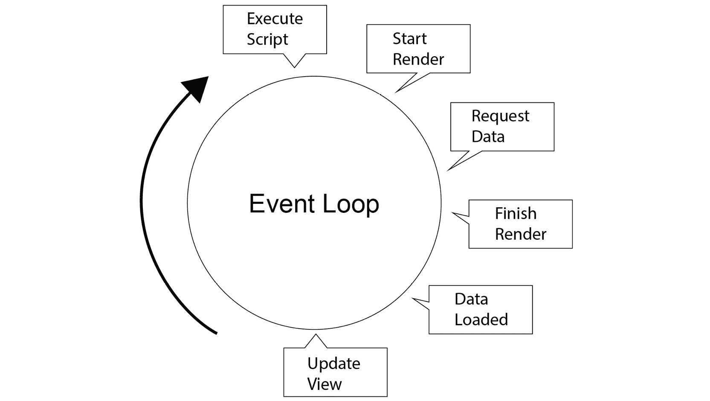
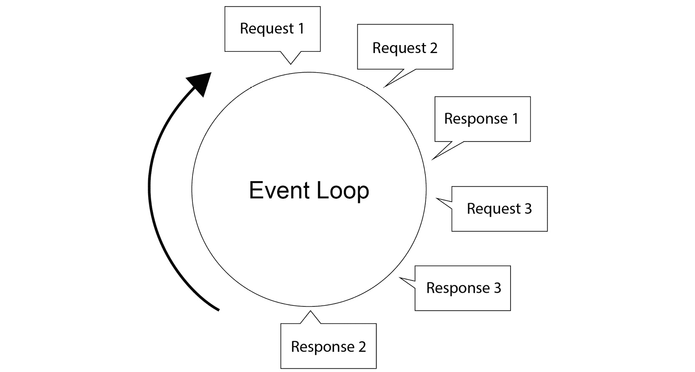
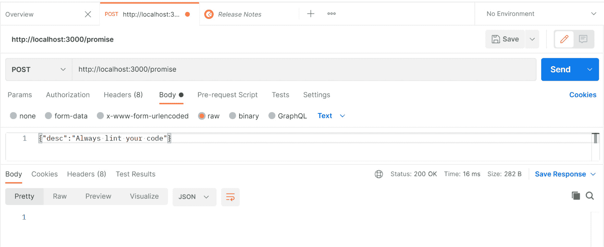
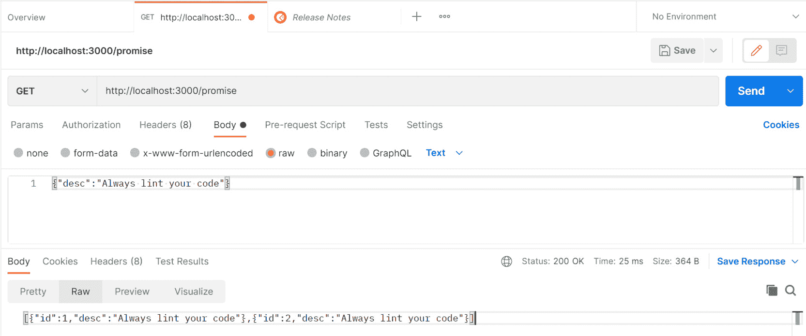
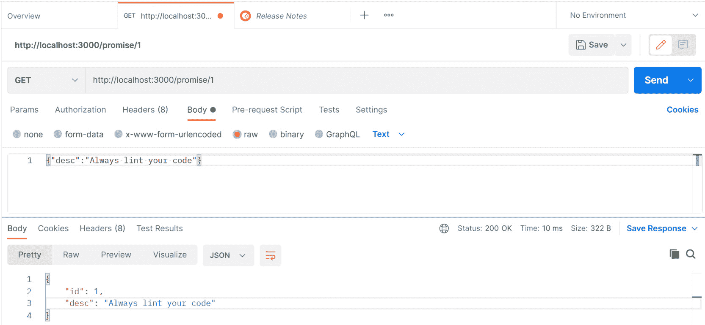
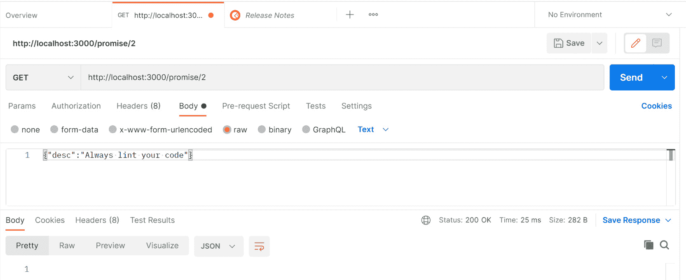
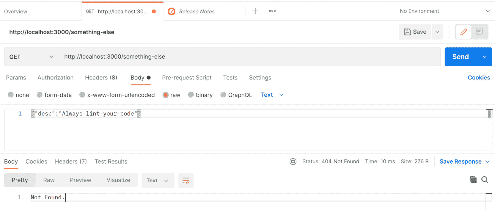
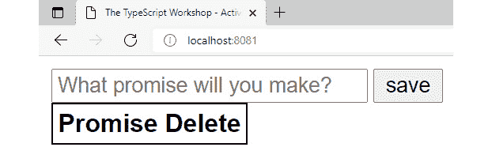

# 第十三章：12. TypeScript 中 Promise 的指南

概述

本章将探讨使用 Promise 在 TypeScript 中的异步编程，并讨论异步编程的用途以及如何在单线程 JavaScript 和事件循环中实现。到本章结束时，你应该对 Promise 的工作原理以及 TypeScript 如何增强它们有一个牢固的理解。你还将能够使用本章教授的概念构建一个基于 Promise 的应用程序。

# 简介

在上一章中，我们学习了使用回调函数进行异步编程。有了这些知识，我们可以管理并发请求，并编写非阻塞代码，使我们的应用程序能够更快地渲染网页或在一个 Node.js 服务器上处理并发请求。

在本章中，我们将学习 Promise 如何使我们能够编写更易于阅读和简洁的代码，以更好地管理异步过程，并永远摆脱深层次的回调嵌套，有时也称为“回调地狱”。我们将探讨 `Promise` 对象的演变以及它最终成为 JavaScript 语言的一部分。我们将查看 TypeScript 的不同转译目标以及 TypeScript 如何增强 Promise 并允许开发者利用泛型来推断返回类型。

我们将进行一些实际练习，例如管理来自网站的多个 API 请求以及管理 Node.js 中的并发。我们将使用 Node.js 文件系统 API 对文件执行异步操作，并看到异步编程有多么强大。

# Promise 的演变及其动机

正如我们所学的，回调是一个作为另一个函数参数给出的函数，实际上是在说：“当你完成时做这个。”这种能力自 1995 年 JavaScript 诞生以来就存在，并且可以工作得很好，但随着 JavaScript 应用程序在 2000 年代的复杂性增长，开发者发现回调模式和嵌套尤其混乱且难以阅读，正如以下示例所示：

```js
doSomething(function (err, data) {
  if(err) {
    console.error(err);
  } else {
    request(data.url, function (err, response) {
      if(err) {
        console.error(err);
      } else {
        doSomethingElse(response, function (err, data) {
          if(err) {
            console.error(err);
          } else {
            // ...and so it goes!
          }
        })
      }
    })
  }
});
```

除了使代码更易于阅读和简洁外，Promise 在回调之外还有优势，因为 Promise 是包含解决异步函数状态的对象。这意味着 Promise 可以被存储，并且可以在任何时间查询其当前状态，或者通过其 `then()` 或 `catch()` 方法调用以获取 Promise 的解决状态。我们将在本章后面讨论这些方法，但在这里值得指出的是，Promise 不仅仅是语法糖。它们开辟了全新的编程范式，其中事件处理逻辑可以通过将事件存储在 Promise 中来与事件本身解耦。

Promise 并非 JavaScript 独有，但最初在 20 世纪 70 年代作为一个计算机编程概念被提出。

注意

更多信息，请参阅弗里德曼，丹尼尔；大卫·怀斯（1976）。*应用编程对并行处理的影响*。国际并行处理会议。第 263-272 页。

随着 Web 框架的流行，Promise 的提案始于 2009 年，jQuery 等库在 2011 年开始实现类似 Promise 的对象。

注意

如需更多信息，请参阅以下链接：[`groups.google.com/g/commonjs/c/6T9z75fohDk`](https://groups.google.com/g/commonjs/c/6T9z75fohDk) 和 [`api.jquery.com/category/version/1.5/`](https://api.jquery.com/category/version/1.5/)。

不久之后，Node.js 也开始拥有了一些 Promise 库。Google 的 AngularJS 捆绑了 Q 库。所有这些库都将回调封装在高级 API 中，这些 API 对开发者有吸引力，并帮助他们编写更干净、更易读的代码。

2012 年，Promise 被正式提出作为一项规范，以标准化 API。该规范于 2015 年获得批准，并自那时起在所有主要浏览器以及 Node.js 中得到了实现。

注意

更多详情，请参阅[`www.ecma-international.org/ecma-262/6.0/#sec-promise-constructor`](http://www.ecma-international.org/ecma-262/6.0/#sec-promise-constructor)。

“Promise 化”，即能够将现有的异步函数包裹在 Promise 中，这一功能被添加到许多库中，并成为了 Node.js 标准库中`util`包的一部分，自 8.0 版本（2017 年发布）起。

作为 JavaScript 的超集，TypeScript 将始终支持原生语言特性，如 Promise；然而，TypeScript 不提供 polyfills，因此如果目标环境不支持原生的 Promise，则需要一个库。

大多数 JavaScript 运行时（如网页浏览器或 Node.js 服务器）都是单线程执行环境。这意味着主 JavaScript 进程一次只能做一件事。多亏了事件循环，只要我们编写非阻塞代码，运行时就会看起来能够同时做很多事情。事件循环能够识别异步事件，并在等待这些事件解决的同时转向其他任务。

以一个需要调用 API 将数据加载到表格中的网页为例。如果该 API 调用是阻塞的，那么这意味着页面渲染无法完成，直到数据加载完毕。我们的用户将不得不盯着一个空白的页面，直到所有数据加载完毕，页面元素渲染完成。但是，由于事件循环，我们可以注册一个监听器，允许网站渲染继续进行，然后在我们的数据最终返回时加载表格。这将在以下图中展示：

![图 12.1：典型的事件循环]



图 12.1：典型的事件循环

这可以通过回调或承诺来实现。事件循环使得这一点成为可能。Node.js 的工作方式类似，但现在我们可能需要响应来自众多客户端的请求。在这个简单的例子中，正在发出三个不同的请求：



图 12.2：多个请求

API 不是阻塞的，因此即使初始请求尚未被处理，也可以进来额外的请求。请求按照工作完成的顺序被处理。

# 承诺的构成

一个承诺（promise）是 JavaScript 对象，它可以存在于三种状态：*待定（pending）*、*已解决（fulfilled）*或*已拒绝（rejected）*。尽管承诺可以立即解决或拒绝，但最典型的情况是承诺在待定状态下创建，然后根据操作的成功或失败被解决为已解决或已拒绝。承诺是可链式的，并实现了几个方便的方法，我们将在后面介绍。

为了更好地理解承诺的状态，重要的是要知道承诺的状态不能被查询。作为程序员，我们不会检查承诺的状态并根据该状态采取行动。相反，我们提供一个函数回调，当承诺达到该状态时将被调用。例如，我们向我们的后端服务器发出 HTTP 请求并得到一个承诺作为响应。现在我们已经设置了事件，我们只需要告诉承诺接下来要做什么以及如何处理任何错误。以下是一些示例。

## 承诺回调

可以使用`new`关键字和`Promise`构造函数来实例化一个承诺。以这种方式实例化时，`Promise`期望一个包含实际要执行的工作的回调参数。该回调有两个自己的参数，`resolve`和`reject`。这些参数可以被显式调用以解决或拒绝承诺。例如，我们可以创建一个在 100 毫秒后解决的承诺，如下所示：

```js
new Promise<void>((resolve, reject) => {
  setTimeout(() => resolve(), 100);
});
```

我们还可以创建一个在 100 毫秒后拒绝的承诺：

```js
new Promise<void>((resolve, reject) => {
  setTimeout(() => reject(), 100);
});
```

## then 和 catch

可以使用`then`和`catch`将承诺链入它们自己的回调函数。`then`提供的回调函数只有在承诺被解决后才会触发，而`catch`提供的回调函数只有在承诺被拒绝时才会触发。大多数返回承诺的库会自动调用`resolve`和`reject`，所以我们只需要提供`then`和`catch`。以下是一个使用 Fetch API 的示例：

```js
fetch("https://my-server.com/my-resource")
  .then(value => console.log(value))
  .catch(error => console.error(error));
```

这段代码将调用我们的后端服务器并记录结果。如果调用失败，它也会记录下来。

如果这是一个真实的应用程序，我们可能有一些函数，如`showData`和`handleError`，可以管理应用程序如何处理来自服务器的响应。在这种情况下，使用`fetch`可能如下所示：

```js
fetch("https://my-server.com/my-resource")
  .then(data => showData(data))
  .catch(error => handleError(error));
```

使用承诺（promises）这种方式展示了我们如何将异步过程与业务逻辑和显示元素解耦。

## 待定状态

挂起承诺是指尚未完成其工作的承诺。创建一个永远处于挂起状态的承诺很简单：

```js
const pendingPromise = new Promise((resolve, reject) => {});
console.log(pendingPromise);
```

这个承诺永远不会做任何事情，因为`resolve`和`reject`从未被调用。承诺将保持挂起状态。如果我们执行此代码，它将输出`Promise { <pending> }`。如上所述，我们并不查询承诺的状态，而是提供一个回调以供承诺最终解决。上面的示例代码包含一个永远无法解决的承诺，因此可以被视为无效代码。无法解决的承诺没有用例。

## 完成状态

我们可以创建一个立即解决的承诺：

```js
const fulfilledPromise = new Promise(resolve => {
  resolve("fulfilled!");
});
console.log(fulfilledPromise);
```

这将输出`Promise { 'fulfilled!' }`。

与挂起状态不同，创建一个立即解决的承诺有更多实际用途。立即解决承诺的主要用途是在与期望承诺的 API 一起工作时。

## 拒绝状态

我们可以创建一个立即解决的承诺：

```js
const rejectedPromise = new Promise((resolve, reject) => {
  reject("rejected!");
});
console.log(rejectedPromise);
```

这将输出`Promise { <rejected> 'rejected!' }`，然后抛出一个未处理的承诺拒绝警告。拒绝的承诺总是需要被捕获。未能捕获承诺拒绝可能会导致我们的程序崩溃！

与完成状态一样，立即拒绝承诺的主要用例是当与期望承诺的 API 一起工作时。但可能有次要用例，在异步工作流程中，某些过程在执行过程中抛出错误，返回一个拒绝的承诺可能是有意义的。这种情况最有可能发生在与第三方库一起工作时，其中 API 并不完全符合我们的喜好，我们需要用更符合我们应用程序架构的东西来包装它。

## 链式

与回调相比，承诺的主要优势之一是能够将承诺链式连接起来。考虑一个等待 1 秒、生成 0 到 99 之间的随机数并将其添加到前一个结果的函数。虽然写递归函数有更好的方法，但这里是为了模拟一个网站对后端进行多次调用的过程：

```js
Example01.ts
1  const getTheValue = async (val: number, cb: Function) => {
2    setTimeout(() => {
3      const number = Math.floor(Math.random() * 100) + val;
4      console.log(`The value is ${number}`);
5      cb(number);
6    }, 1000);
7  };
8  
9  getTheValue(0, (output: number) => {
10    getTheValue(output, (output: number) => {
11      getTheValue(output, (output: number) => {
12        getTheValue(output, (output: number) => {
13          getTheValue(output, (output: number) => {
14            getTheValue(output, (output: number) => {
15              getTheValue(output, (output: number) => {
16                getTheValue(output, (output: number) => {
17                  getTheValue(output, (output: number) => {
18                    getTheValue(output, () => {});
19                  });
20                });
21              });
22            });
23          });
24        });
25      });
26    });
27  });
Link to the example: https://packt.link/VHZJc
```

该程序的以下是一个示例输出：

```js
The value is 49
The value is 133
The value is 206
The value is 302
The value is 395
The value is 444
The value is 469
The value is 485
The value is 528
The value is 615
```

每次我们调用`getTheValue`时，我们等待 1 秒，然后生成一个随机数并将其添加到我们传入的值中。在现实世界的场景中，我们可以将其视为一个完成多个异步任务的程序，其中一个任务的输出作为下一个任务的输入。

注意

由于程序的起点是一个随机数，你的输出将与上面展示的不同。

之前程序中的所有内容都工作正常；然而，回调嵌套看起来并不美观，可能难以维护或调试。接下来的练习将教你如何使用承诺编写更易读和可维护的代码。

## 练习 12.01：链式连接承诺

在这个练习中，我们将重构前面的示例，并链式连接承诺以消除嵌套，使代码更易读：

注意

本练习的代码文件可以在此处找到：[`packt.link/IO8Pz`](https://packt.link/IO8Pz)。

1.  编写以下程序，该程序使用承诺重构了前面的示例：

    ```js
    const getTheValue = async (val: number): Promise<number> => {
      return new Promise(resolve => {
        setTimeout(() => {
          const number = Math.floor(Math.random() * 100) + val;
          console.log(`The value is ${number}`);
          resolve(number);
        }, 1000);
      });
    };
    getTheValue(0)
      .then((result: number) => getTheValue(result))
      .then((result: number) => getTheValue(result))
      .then((result: number) => getTheValue(result))
      .then((result: number) => getTheValue(result))
      .then((result: number) => getTheValue(result))
      .then((result: number) => getTheValue(result))
      .then((result: number) => getTheValue(result))
      .then((result: number) => getTheValue(result))
      .then((result: number) => getTheValue(result));
    ```

    嵌套消失了，代码的可读性也大大提高。我们的`getTheValue`函数现在返回一个承诺而不是使用回调。因为它返回一个承诺，所以我们可以对承诺调用`.then()`，这可以链入另一个承诺调用。

1.  运行程序。承诺链将依次解决每个承诺，我们将得到与上一个程序类似的输出：

    ```js
    The value is 50
    The value is 140
    The value is 203
    The value is 234
    The value is 255
    The value is 300
    The value is 355
    The value is 395
    The value is 432
    The value is 451
    ```

    注意，你将得到一个与上面显示的不同输出，因为程序使用一个随机数作为起始点。

在处理错误条件时，链式调用也可以大有帮助。如果我的`getTheValue`函数拒绝承诺，我可以通过在链的末尾链式调用一个`catch`来捕获错误：

```js
Example02.ts
1  const getTheValue = async (val: number): Promise<number> => {
2   return new Promise((resolve, reject) => {
3      setTimeout(() => {
4        const number = Math.floor(Math.random() * 100) + val;
5        if (number % 10 === 0) {
6          reject("Bad modulus!");
7        } else {
8          console.log(`The value is ${number}`);
9          resolve(number);
10        }
11      }, 1000);
12    });
13  };
14  
15  getTheValue(0)
16    .then((result: number) => getTheValue(result))
17    .then((result: number) => getTheValue(result))
18    .then((result: number) => getTheValue(result))
19    .then((result: number) => getTheValue(result))
20    .then((result: number) => getTheValue(result))
21    .then((result: number) => getTheValue(result))
22    .then((result: number) => getTheValue(result))
23    .then((result: number) => getTheValue(result))
24    .then((result: number) => getTheValue(result))
25    .catch(err => console.error(err));
Link to the example: https://packt.link/sBTgk
```

我们在每个迭代中引入了 10%的概率（即我们的数字除以 10 后余数为 0 的概率）来抛出错误。平均而言，我们的程序现在失败的概率将比成功执行的概率更高：

```js
The value is 25
The value is 63
The value is 111
Bad modulus!
```

## finally

除了`then`和`catch`方法外，`Promise`对象还公开了一个`finally`方法。这是一个无论是否抛出或捕获错误都会被调用的回调函数。这对于记录日志、关闭数据库连接或简单地清理资源来说非常棒，无论最终承诺是如何解决的。

我们可以在上面的承诺中添加一个`finally`回调：

```js
Example03.ts
1  const getTheValue = async (val: number) => {
2    return new Promise<number>((resolve, reject) => {
3      setTimeout(() => {
4        const number = Math.floor(Math.random() * 100) + val;
5        if (number % 10 === 0) {
6          reject("Bad modulus!");
7        } else {
8          console.log(`The value is ${number}`);
9          resolve(number);
10      }
11     }, 1000);
12   });
13 };
14 
15 getTheValue(0)
16   .then(result => getTheValue(result))
17   .then(result => getTheValue(result))
18   .then(result => getTheValue(result))
19   .then(result => getTheValue(result))
20   .then(result => getTheValue(result))
21   .then(result => getTheValue(result))
22   .then(result => getTheValue(result))
23   .then(result => getTheValue(result))
24   .then(result => getTheValue(result))
25   .catch(err => console.error(err))
26   .finally(() => console.log("We are done!"));
Link to the example: https://packt.link/izqwS
```

现在，“`We are done!`”将无论是否触发“`Bad modulus!`”错误条件都会被记录：

```js
The value is 69
The value is 99
Bad modulus!
We are done!
```

## Promise.all

`Promise.all`是`Promise`提供最有用的实用方法之一。即使使用 async/await 语法编写的代码（见*第十三章，Async/Await*）也可以很好地使用`Promise.all`。此方法接受一个承诺的可迭代参数（可能是数组），并解决所有承诺。让我们看看我们如何使用`Promise.all`改变我们的示例承诺：

```js
Example04.ts
1  const getTheValue = async (val: number = 0) => {
2    return new Promise<number>((resolve, reject) => {
3      setTimeout(() => {
4        const number = Math.floor(Math.random() * 100) + val;
5        if (number % 10 === 0) {
6          reject("Bad modulus!");
7        } else {
8          console.log(`The value is ${number}`);
9          resolve(number);
10       }
11     }, 1000);
12   });
13 };
14
15 Promise.all([
16   getTheValue(),
17   getTheValue(),
18   getTheValue(),
19   getTheValue(),
20   getTheValue(),
21   getTheValue(),
22   getTheValue(),
23   getTheValue(),
24   getTheValue(),
25   getTheValue()
26 ])
27   .then(values =>
28     console.log(
29       `The total is ${values.reduce((prev, current) => prev + current, 0)}`
30     )
31   )
32   .catch(err => console.error(err))
33   .finally(() => console.log("We are done!"));
Link to the example: https://packt.link/8pzx4
```

输出应该与前面示例中获得的输出类似。在这个例子中，我们调用了同一个函数 10 次，但想象一下，这些是 10 个不同的 API 调用，我们需要达到并求和。每个调用大约需要 1 秒钟。如果我们链式调用一系列承诺，这个操作将需要超过 10 秒钟。通过使用`Promise.all`，我们能够并行运行这些操作，现在完成函数只需要 1 秒钟。

`Promise.all`在任何你可以并行运行两个或更多异步过程时都很有用。它可以用于将数据持久化到多个数据库表，让多个独立组件在网页浏览器中独立渲染，或者进行多个 HTTP 请求。一个并行进行多个 HTTP 请求的好例子是监控其他服务正常运行时间和 ping 持续时间的服务。这种操作没有必要是同步的，`Promise.all`让我们在同一个过程中等待多个网络请求。

## 练习 12.02：递归 Promise.all

在这个练习中，我们不是重复相同的函数调用 10 次，而是将前一个示例中的程序优化，使其更加 DRY（不要重复自己）。我们可以加载一个承诺数组，然后使用`Promise.all`并行解决所有承诺，并使用`catch`和`finally`解决错误并确保我们返回一些输出：

注意

这个练习的代码文件也可以在这里找到：[`packt.link/KNpqx`](https://packt.link/KNpqx)。

1.  以下代码将是这次重构的起点：

    ```js
    const getTheValue = async (val: number = 0) => {
      return new Promise<number>((resolve, reject) => {
        setTimeout(() => {
          const number = Math.floor(Math.random() * 100) + val;
          if (number % 10 === 0) {
            reject('Bad modulus!');
          } else {
            console.log(`The value is ${number}`);
            resolve(number);
          }
        }, 1000);
      });
    };
    Promise.all([
      getTheValue(),
      getTheValue(),
      getTheValue(),
      getTheValue(),
      getTheValue(),
      getTheValue(),
      getTheValue(),
      getTheValue(),
      getTheValue(),
      getTheValue(),
    ])
      .then((values) =>
        console.log(
          `The total is ${values.reduce((prev, current) => prev + current, 0)}`
        )
      )
      .catch((err) => console.error(err))
      .finally(() => console.log('We are done!'));
    ```

    为了捕获错误并使程序递归，我们需要将`Promise.all`包裹在一个函数中。递归是一种模式，其中同一个函数可以在同一执行中多次调用。

1.  要添加递归，创建一个新的函数并将`Promise.all`语句作为该函数的主体。然后调用该函数：

    ```js
    const doIt = () => {
      Promise.all([
        getTheValue(),
        getTheValue(),
        getTheValue(),
        getTheValue(),
        getTheValue(),
        getTheValue(),
        getTheValue(),
        getTheValue(),
        getTheValue(),
        getTheValue(),
    ])
      .then((values) =>
          console.log(
            `The total is ${values.reduce((prev, current) => prev + current, 0)}`
          )
      )
      .catch((err) => console.error(err))
      .finally(() => console.log('We are done!'));
    ```

    我们可以使用一些函数式编程技术，而不是在数组中重复`getTheValue()` 10 次，程序化地构建一个包含 10 个元素的数组，其中所有元素都是该函数调用。这样做不会改变我们的程序操作方式，但会使它更容易处理。

1.  将前一步骤中给出的代码更新如下：

    ```js
      Promise.all(
      Array(10)
        .fill(null)
        .map(() => getTheValue())
    )
    ```

    这里的逻辑是`Array(10)`创建一个新的包含 10 个元素的数组，`fill(null)`将初始化数组，然后`map`将重新映射数组元素为`getTheValue()`函数调用。

    上述代码实际上调用了函数，并将挂起的承诺返回到已经包裹在`Promise.all`中的数组。

    现在我们希望在出现错误的情况下使用递归。我们将改变我们的`catch()`回调，从简单地记录错误到重新开始整个过程。在这种情况下，我们的业务规则是希望整个计算集完成，如果有错误我们将重新启动。执行此操作的代码非常简单，因为`catch()`期望一个函数作为其回调，所以我们可以再次将我们的`doIt`函数传递给它。

1.  将`doIt`函数传递回`catch()`：

    ```js
      .catch(doIt)
    ```

    注意，我们在这里没有调用回调函数。我们想要传递一个函数，它将在出现错误时被调用。

1.  我们现在想要稍微清理一下错误消息，以便我们可以有一个干净的运行：

    ```js
    const getTheValue = async (val: number = 0) => {
      return new Promise<number>((resolve, reject) => {
        setTimeout(() => {
          const number = Math.floor(Math.random() * 100) + val;
          if (number % 10 === 0) {
            reject('Bad modulus!');
          } else {
            // console.log(`The value is ${number}`);
            resolve(number);
          }
        }, 1000);
      });
    };
    let loopCount = 0;
    const doIt = () => {
      Promise.all(
        Array(10)
          .fill(null)
          .map(() => getTheValue())
      )
        .then((values) =>
          console.log(
            `The total is ${values.reduce((prev, current) => prev + current, 0)}`
          )
        )
        .catch(doIt)
        .finally(() => console.log(`completed loop ${++loopCount}`));
    };
    doIt();
    ```

    当我们运行程序时，我们会看到程序循环的几个迭代。输出可能如下所示：

    ```js
    completed loop 1
    The total is 438
    completed loop 2
    ```

    注意，根据迭代次数的不同，你可能会得到与上面显示不同的输出。

## Promise.allSettled

这种方法是对 `Promise.all` 的一个变体，当一些承诺可以成功解析而另一些被拒绝时，它是非常理想的。让我们看看它与 `Promise.all` 有什么不同：

```js
const getTheValue = async (val: number = 0) => {
  return new Promise<number>((resolve, reject) => {
    setTimeout(() => {
      const number = Math.floor(Math.random() * 100) + val;
      // Arbitrary error condition - if the random number is divisible by 10.
      if (number % 10 === 0) {
        reject("Bad modulus!");
      } else {
        console.log(`The value is ${number}`);
        resolve(number);
      }
    }, 1000);
  });
};
const generateTheNumber = (iterations: number): void => {
  Promise.allSettled(
    // Produces an array of `iterations` length with the pending promises of `getTheValue()`.
    Array(iterations)
      .fill(null)
      .map(() => getTheValue())
  )
    .then((settledResults) => {
      // Map all the results into the failed, succeeded and total values.
      const results = settledResults.reduce(
        (prev, current) => {
          return current.status === "fulfilled"
            ? {
                ...prev,
                succeeded: prev.succeeded + 1,
                total: prev.total + current.value,
              }
            : { ...prev, failed: prev.failed + 1 };
        },
        {
          failed: 0,
          succeeded: 0,
          total: 0,
        }
      );
      console.log(results);
    })
    .finally(() => console.log("We are done!"));
};
generateTheNumber(10);
```

程序将生成如下输出：

```js
current { status: 'fulfilled', value: 85 }
current { status: 'fulfilled', value: 25 }
current { status: 'fulfilled', value: 11 }
current { status: 'fulfilled', value: 43 }
current { status: 'rejected', reason: 'Bad modulus!' }
current { status: 'fulfilled', value: 41 }
current { status: 'fulfilled', value: 81 }
current { status: 'rejected', reason: 'Bad modulus!' }
current { status: 'rejected', reason: 'Bad modulus!' }
current { status: 'fulfilled', value: 7 }
{ failed: 3, succeeded: 7, total: 293 } 
We are done!
```

我们在这里做了一些增强。一方面，我们现在将数组大小传递给 `generateTheNumber`，这可以为我们的程序增添一些风味或变化。现在的主要改进是使用 `Promise.allSettled`。现在，`Promise.allSettled` 允许我们有一个成功和失败混合的结果，而 `Promise.all` 则不同，如果所有的承诺都成功解析，它将调用 `then()` 方法；如果任何一个失败，它将调用 `catch()` 方法。`Promise.allSettled` 的输出可能看起来像这样：

```js
settledResults [
  { status: 'fulfilled', value: 85 },
  { status: 'fulfilled', value: 25 },
  { status: 'fulfilled', value: 11 },
  { status: 'fulfilled', value: 43 },
  { status: 'rejected', reason: 'Bad modulus!' },
  { status: 'fulfilled', value: 41 },
  { status: 'fulfilled', value: 81 },
  { status: 'rejected', reason: 'Bad modulus!' },
  { status: 'rejected', reason: 'Bad modulus!' },
  { status: 'fulfilled', value: 7 }
]
```

每个已解析的承诺都将包含一个状态字符串，如果承诺成功解析，则为 `'fulfilled'`；如果发生错误，则为 `'rejected'`。满足的承诺将有一个包含承诺解析到的值的 `value` 属性，而被拒绝的承诺将有一个包含错误的 `reason` 属性。

在给出的示例中，我们将拒绝的承诺进行总计，并将满足的承诺的值相加，然后返回一个新的对象。为了执行这个操作，我们使用内置的数组函数 `reduce()`。现在，`reduce()` 将遍历数组的每个元素，并在累加器中收集转换后的结果，该累加器由函数返回。`MapReduce` 函数在函数式编程范式中被广泛使用。

注意，`Promise.allSettled` 是 ECMAScript 中相对较新的一个功能，它在 Node.js 12.9 版本中首次出现。为了使用它，你需要在你的 `tsconfig.json` 文件中将 `compilerOptions` 的目标设置为 `es2020` 或 `esnext`。大多数现代浏览器都支持这个方法，但在使用这个新功能之前验证其支持性是个好主意。

## 练习 12.03：Promise.allSettled

我们已经看到了使用 `Promise.allSettled` 来产生已满足和被拒绝的承诺的混合结果的例子。现在让我们将 `Promise.allSettled` 和 `Promise.all` 结合起来，以聚合 `getTheValue()` 运行的多个结果：

注意

这个练习的代码文件也可以在这里找到：[`packt.link/D8jIQ`](https://packt.link/D8jIQ)。

1.  从上面的示例代码开始。我们打算调用 `generateTheNumber()` 三次。一旦我们得到所有结果，我们可以对它们进行排序，以打印出最高和最低的结果。我们可以使用上面描述的相同的 `Array().fill().map()` 技巧来创建一个新的 `generateTheNumber()` 调用数组：

    ```js
    Promise.all(
      Array(3)
        .fill(null)
        .map(() => generateTheNumber(10))
    );
    ```

1.  现在我们能够解析三个独立的调用，我们需要管理输出。首先，我们可以输出结果以查看下一步需要做什么：

    ```js
    Promise.all(
      Array(3)
        .fill(null)
        .map(() => generateTheNumber(10))
    ).then((result) => console.log(result));
    ```

    我们记录了 `[undefined, undefined, undefined]`。这不是我们想要的。原因在于 `generateTheNumber` 实际上没有返回其承诺——在先前的例子中它不需要这样做。

1.  我们可以通过添加一个 `return` 语句并移除 `void` 返回类型来解决这个问题。我们还需要我们的回调函数返回结果而不是简单地将其记录出来。所有这些更改都将帮助此类程序集成到更大的应用程序中：

    ```js
    const generateTheNumber = (iterations: number) => {
      return Promise.allSettled(
        Array(iterations)
          .fill(null)
          .map(() => getTheValue())
      )
        .then((settledResults) => {
          const results = settledResults.reduce(
            (prev, current) => {
              return current.status === 'fulfilled'
                ? {
                    ...prev,
                    succeeded: prev.succeeded + 1,
                    total: prev.total + current.value,
                  }
                : { ...prev, failed: prev.failed + 1 };
            },
            {
              failed: 0,
              succeeded: 0,
              total: 0,
            }
          );
          return results;
        })
        .finally(() => console.log('Iteration done!'));
    };
    With that done we can get our output.
    [
      { failed: 0, succeeded: 10, total: 443 },
      { failed: 1, succeeded: 9, total: 424 },
      { failed: 2, succeeded: 8, total: 413 },
    ]
    ```

1.  完成这个练习的最后一步是我们只想输出最高和最低的总数。为了实现这一点，我们可以使用 `Array.map()` 函数从输出中提取仅包含总数的部分，并使用 `Array.sort()` 函数将上述输出从低到高排序，然后打印第一和最后条目的总数：

    ```js
      const totals = results.map((r) => r.total).sort();
      console.log(`The highest total is ${totals[totals.length - 1]}.`);
      console.log(`The lowest total is ${totals[0]}.`);
    ```

    你可能会得到以下类似的输出：

    ```js
    The value is 62
    The value is 77
    The value is 75
    The value is 61
    The value is 61
    The value is 61
    The value is 15
    The value is 83
    The value is 4
    The value is 23
    Iteration done!
    .
    .
    .
    The highest total is 522.
    The lowest total is 401.
    ```

    注意，为了便于展示，这里只显示了实际输出的部分内容。

    这个练习向我们展示了我们如何过滤和排序许多承诺的结果，并创建准确反映应用程序状态的数据库结构。

## Promise.any

与 `Promise.allSettled` 相比，另一端是 `Promise.any`。此方法接受一个承诺的可迭代对象（或数组），但它不会解决所有承诺，而是将解析为第一个成功解决的承诺的值。`Promise.any` 非常新，尚未在所有浏览器中实现，在撰写本文时，它尚未在 Node.js 的 LTS 版本中可用。在使用之前，你应该检查兼容性和可用性。

## Promise.race

`Promise.race` 已经存在一段时间了，并且与 `Promise.any` 类似。现在，`Promise.race` 再次接受一个承诺的可迭代对象并执行它们。第一个解决或拒绝的承诺将解决或拒绝比赛。这与 `Promise.any` 相反，因为如果 `Promise.any` 中的第一个承诺拒绝，其他承诺仍然有机会成功解决：

```js
const oneSecond = new Promise((_resolve, reject) => {
  setTimeout(() => reject("Too slow!"), 1000);
});
const upToTwoSeconds = new Promise(resolve => {
  setTimeout(() => resolve("Made it!"), Math.random() * 2000);
});
Promise.race([oneSecond, upToTwoSeconds])
  .then(result => console.log(result))
  .catch(err => console.error(err));
```

在这个例子中，一个承诺在 1 秒后总是拒绝，而另一个承诺在 0 到 2 秒之间的随机间隔内解决。如果 `oneSecond` 承诺赢得比赛，整个承诺将被拒绝。如果 `upToTwoSeconds` 小于 1 秒，那么承诺将成功解决，并带有消息 `"Made It!"`。

使用 `Promise.race` 的一个实际例子可能是超时和回退功能，如果主网络服务在预期时间内无法响应，应用程序将切换到次要数据源或表现出其他行为。或者，我们可能想要处理浏览器中的慢速渲染问题，如果在预期时间内屏幕绘制未完成，我们将切换到更简单的视图。在 TypeScript 中处理异步操作时，`Promise.race` 可以简化许多情况。

# 通过类型增强承诺

我们正在处理的示例指定了承诺的输入类型，但我们必须在链的每个步骤中为结果提供类型。这是因为 TypeScript 不了解承诺可能解析为什么类型，因此我们必须告诉它我们得到的结果的类型。

换句话说，我们错过了一个 TypeScript 最强大的功能：*类型推断*。类型推断是 TypeScript 能够知道某物的类型应该是什么，而无需被告知的能力。类型推断的一个非常简单的例子如下：

```js
const hello = "hello";
```

没有指定类型。这是因为 TypeScript 理解变量 `hello` 被分配了一个字符串，并且不能重新分配。如果我们尝试将这个变量作为参数传递给期望另一种类型的函数，我们将得到编译错误，即使我们从未指定过类型。让我们将类型推断应用于承诺。

首先，让我们看看 `Promise` 对象的类型定义：

```js
new <T>(executor: (resolve: (value?: T | PromiseLike<T>) => void, reject: (reason?: any) => void) => void): Promise<T>;
```

`T` 是所谓的泛型。这意味着可以指定任何类型来代替 `T`。假设我们定义了一个像这样的承诺：

```js
new Promise(resolve => {
  resolve("This resolves!");
});
```

我们在这里所做的就是声明 `resolve` 参数将解析为未知类型。接收代码需要为它提供一个类型。这可以通过为 `T` 添加一个类型值来改进：

```js
new Promise<string>(resolve => {
  resolve("This resolves!");
});
```

现在的承诺构造函数解析为 `Promise<string>` 类型。当承诺被实现时，它预期返回一个 `string` 类型的值。

让我们考察一个示例，其中将承诺的返回类型转换为重要：

```js
const getPromise = async () => new Promise(resolve => resolve(Math.ceil(Math.random() * 100)));
const printResult = (result: number) => console.log(result);
getPromise().then(result => printResult(result)); 
```

如果你把这个例子放入一个 IDE，比如 VS Code，你会看到在传递给 `printResult` 的 `result` 参数上有类型错误。`getPromise` 返回的承诺的类型是未知的，但 `printResult` 期望 `number` 类型。我们可以通过在声明承诺时提供类型来解决这个问题：

```js
const getPromise = async () => new Promise<number>(resolve => resolve(Math.ceil(Math.random() * 100)));
const printResult = (result: number) => console.log(result);
getPromise().then(result => printResult(result));
```

我们在我们的承诺声明后立即添加了 `<number>`，TypeScript 知道这个承诺预期解析为数字。这种类型检查也将应用于承诺的解析。例如，如果我们尝试解析为 `"Hello!"` 的值，由于我们的承诺现在预期返回数字，我们将得到另一个类型错误。

## 练习 12.04：异步渲染

在这个练习中，我们将创建一个具有同步渲染的简单网站，并将其重构为异步渲染：

注意

这个练习的代码文件也可以在这里找到：[`packt.link/q8rka`](https://packt.link/q8rka)。

1.  从 GitHub ([`packt.link/q8rka`](https://packt.link/q8rka)) 克隆项目以开始。然后，安装依赖项：

    ```js
    npm i
    ```

    我们刚刚在我们的项目中安装了 TypeScript 以及 `http-server`，这是一个简单的 Node.js HTTP 服务器，它将允许我们在本地主机上运行我们的网站。

    现在我们将添加一些文件以启动项目。

1.  在项目的根目录中创建一个名为 `index.html` 的文件，并向其中添加以下行：

    ```js
    <html>
      <head>
        <title>The TypeScript Workshop - Exercise 12.03</title>
        <link href="styles.css" rel="stylesheet"></link>
      </head>
      <body>
        <div id="my-data"></div>
      </body>
      <script type="module" src="img/data-loader.js"></script>
    </html>
    ```

1.  接下来，可选地添加一个样式表作为默认样式相当难看。带来你自己的样式或者使用像这样简单的样式：

    ```js
    body {
      font-family: Arial, Helvetica, sans-serif;
      font-size: 12px;
    }
    input {
      width: 200;
    }
    ```

1.  将一个名为 `data.json` 的文件添加进来，以表示我们从远程服务器获取的数据：

    ```js
    { "message": "Hello Promise!" }
    ```

1.  还有一个要完成。让我们添加一个名为 `data-loader.ts` 的 TypeScript 文件：

    ```js
    const updateUI = (message: any): void => {
      const item = document.getElementById("my-data");
      if (item) {
        item.innerText = `Here is your data: ${message}`;
      }
    };
    const message = fetch("http://localhost:8080/data.json");
    updateUI(message);
    ```

    这就是你运行 TypeScript 网络应用程序所需的所有内容！在本书的后面部分，我们将看到一些更健壮的解决方案，但到目前为止，这将让我们专注于 TypeScript，而无需太多花哨的功能。

1.  为了查看我们的应用程序，我们需要将 TypeScript 编译并启动本地服务器。为了获得最佳体验，我们需要两个独立的命令提示符窗口。在一个窗口中，我们将输入一个命令来编译 TypeScript 并监视更改：

    ```js
    npx tsc -w data-loader.ts
    ```

1.  在另一个窗口中，我们将使用一个标志启动服务器以避免缓存，这样我们就可以立即看到我们的更改：

    ```js
    npx http-server . -c-1
    ```

1.  如果我们导航到 `http://localhost:8080`，我们会看到我们的应用程序加载并收到这条消息：

    ```js
     "Here is your data: [object Promise]". 
    ```

    似乎某些地方没有正确工作。我们想要看到的是 `"Here is your data: Hello Promise!"`。如果我们查看 TypeScript 代码，我们会看到这一行：

    ```js
    const message = fetch("http://localhost:8080/data.json");
    ```

这没有正确工作。`fetch` 是一个异步请求。我们只是看到了未解决的承诺并将其打印到屏幕上。

另一个警告信号是 `updateUI` 函数中使用 `any` 类型。为什么那里使用的是 `any` 类型，而应该是字符串？这是因为 TypeScript 不允许我们使用字符串。TypeScript 知道我们正在使用未解决的承诺调用 `updateUI`，因此如果我们尝试将其视为字符串类型，将会得到类型错误。新开发者有时认为通过使用 `any` 来修复问题，但更多的时候，他们将会忽略有效的错误。

为了使这段代码正确运行，你需要重构它，以便 `fetch` 返回的承诺得到解决。当它正确运行时，`fetch` 返回一个响应对象，该对象公开一个 `data` 方法，该方法也返回一个承诺，因此你需要解决两个承诺才能在你的页面上显示数据。

注意

`fetch` 库是浏览器的一个 Web API，它在原始 `XMLHttpRequest` 规范上有了很大的改进。它保留了 `XMLHttpRequest` 的所有功能，但 API 要更加人性化，因此被许多网络应用程序使用，而不是安装第三方客户端库。`fetch` 在 Node.js 中不是原生实现的，但有一些库提供了相同的功能。我们将在本章后面部分查看这些库。

# 库和原生承诺 — 第三方库、Q 和 Bluebird

如前所述，承诺在 2015 年成为了 ECMAScript 标准的一部分。在此之前，开发者使用 Q 或 Bluebird 等库来填补语言中的空白。虽然许多开发者选择使用原生的承诺，但这些库仍然非常受欢迎，每周的下载量仍在增长。话虽如此，我们应该仔细考虑是否依赖第三方库而不是原生语言特性是个好主意。除非这些库提供了我们无法没有的关键功能，否则我们应该优先考虑原生特性而不是第三方库。第三方库可能会引入错误、复杂性和安全漏洞，并需要额外的努力来维护。这并不是对开源的指控。

开源项目（如 TypeScript）是当今开发者生态系统的重要组成部分。尽管如此，仔细选择我们的依赖项并确保它们是维护良好的库，且不与原生特性重复，仍然是一个好主意。

值得注意的是，第三方库的 API 可能与原生语言特性不同。例如，Q 库从 jQuery 实现中借用了一个延迟对象：

```js
import * as Q from "q";
const deferred = Q.defer();
deferred.resolve(123);
deferred.promise.then(val => console.log(val));
```

用原生承诺编写的代码更像是我们迄今为止看到的例子：

```js
const p = new Promise<number>((resolve, reject) => {
  resolve(123);
});
p.then(val => console.log(val));
```

在这里，Q 实现本身并没有什么固有的错误，但它是不标准的，这可能会使我们的代码对其他开发者来说不那么易读，或者阻止我们学习标准最佳实践。

Bluebird 与原生承诺更相似。事实上，它可以作为 polyfill 使用。

## Polyfilling Promises

TypeScript 会转译代码，但它**不会**为你的目标环境中不存在的原生语言特性进行 polyfill。这一点至关重要，以避免挫败感和神秘的错误。TypeScript 将为我们做的是允许我们指定目标环境。让我们看看一个简单的例子。

考虑以下`tsconfig.json`文件：

```js
{
  "compilerOptions": {
    "target": "es6",
    "module": "commonjs",
    "outDir": "./public",
    "strict": true,
    "esModuleInterop": true,
    "forceConsistentCasingInFileNames": true
  }
}
```

现在考虑这个位于`promise.ts`的模块：

```js
const p = new Promise<number>((resolve, reject) => {
  resolve(123);
});
p.then(val => console.log(val));
```

我们的代码可以正常转译。我们输入`npx` `tsc`，转译后的 JavaScript 输出看起来非常像我们的 TypeScript 代码。唯一的区别是类型已被移除：

```js
 const p = new Promise((resolve, reject) => {
    resolve(123);
});
p.then(val => console.log(val));
```

然而，考虑如果我们将目标更改为“`es5`”：

```js
{
  "compilerOptions": {
    "target": "es5",
    "module": "commonjs",
    "outDir": "./public",
    "strict": true,
    "esModuleInterop": true,
    "forceConsistentCasingInFileNames": true
  }
}
```

现在这个项目将无法构建：

```js
% npx tsc
src/promise.ts:1:15 - error TS2585: 'Promise' only refers to a type, but is being used as a value here. Do you need to change your target library? Try changing the `lib` compiler option to es2015 or later.
1 const p = new Promise<number>((resolve, reject) => {
                ~~~~~~~
Found 1 error.
```

TypeScript 甚至提醒我可能需要修复我的目标。请注意，“`es2015`”和“`es6`”是同一件事（同样，“`es2016`”和“`es7`”等等也是如此）。这是一个有些令人困惑的约定，我们只需要习惯它。

如果我能为`es6+`环境（如当前版本的 Node.js 或任何现代浏览器）构建我的项目，那么这将是可行的，但如果我们需要支持旧版浏览器或非常旧的 Node.js 版本，那么通过设置编译目标更高来“修复”这个问题只会导致应用程序损坏。我们需要使用 polyfill。

在这种情况下，Bluebird 可以是一个非常好的选择，因为它有一个与原生承诺非常相似的 API。实际上，我需要做的只是 `npm` `install` `bluebird`，然后把我模块中的库导入进来。Bluebird 库不包含类型定义，所以为了获得完整的 IDE 支持，你还需要将 `@types/bluebird` 作为 `devDependency` 来安装：

```js
import { Promise } from "bluebird";
const p = new Promise<number>(resolve => {
  resolve(123);
});
p.then(val => console.log(val));
```

我转译的代码现在可以在一个非常早期的 Node.js 版本上运行，比如版本 0.10（2013 年发布）。

注意，Bluebird 是设计成一个功能齐全的 `Promise` 库。如果我只是寻找一个 polyfill，我可能更喜欢使用像 `es6-promise` 这样的东西。它的使用方法完全相同。我 `npm` `install` `es6-promise`，然后把我模块中的 `Promise` 类导入进来：

```js
import { Promise } from "es6-promise";
const p = new Promise<number>(resolve => {
  resolve(123);
});
p.then(val => console.log(val));
```

如果你想要亲自尝试，请注意，TypeScript 的现代版本甚至无法在 Node.js 0.10 上运行！你将不得不在一个较新的版本（如 Node.js 12）上转译你的代码，然后切换到 Node.js 0.10 来执行代码。为此，使用版本管理器（如 `nvm` 或 `n`）是个好主意。

这实际上是一个 TypeScript 强大功能的绝佳例子。我们可以在现代版本上编写和构建我们的代码，但目标是遗留运行时。设置编译目标将确保我们构建的代码适合那个运行时。

# 承诺化

承诺化是将期望回调的异步函数转换为承诺的实践。这本质上是一个便利工具，它允许你始终使用承诺而不是必须使用遗留 API 的回调。承诺化遗留 API 可以非常有助于使所有代码都使用承诺，并且易于阅读。但承诺化不仅仅是将回调转换为承诺的便利。一些现代 API 只接受承诺作为参数。如果我们只能用回调编写一些代码，我们就必须手动将回调异步代码包装在承诺中。承诺化节省了我们麻烦，并可能节省许多代码行。

让我们通过一个例子来了解如何将一个期望回调的函数进行承诺化。我们有几个选项可供选择。Bluebird 再次通过 `Promise.promisify` 提供这个功能。这次，我们将尝试一个 polyfill，`es6-promisify`。让我们从一个期望回调的函数开始：

```js
const asyncAdder = (n1: number, n2: number, cb: Function) => {
  let err: Error;
  if (n1 === n2) {
    cb(Error("Use doubler instead!"));
  } else {
    cb(null, n1 + n2);
  }
};
asyncAdder(3, 4, (err: Error, sum: number) => {
  if (err) {
    throw err;
  }
  console.log(sum);
});
```

可以被承诺化的函数遵循一个约定，即回调函数的第一个参数是一个错误对象。如果错误是 null 或 undefined，则认为函数已成功调用。在这里，我正在调用 `asyncAdder`，给它两个数字和一个回调函数。我的回调理解到，如果抛出错误，`asyncAdder` 将在第一个参数位置有一个错误；如果成功，第二个参数位置将是两个数字的和。通过遵循这个模式，函数可以被承诺化。首先，我们 `npm install` `es6-promisify`，然后导入模块：

```js
import { promisify } from "es6-promisify";
const asyncAdder = (n1: number, n2: number, cb: Function) => {
  let err: Error;
  if (n1 === n2) {
    cb(Error("Use doubler instead!"));
  } else {
    cb(null, n1 + n2);
  }
};
const promiseAdder = promisify(asyncAdder);
promiseAdder(3, 4)
  .then((val: number) => console.log(val))
  .catch((err: Error) => console.log(err));
```

我们使用`promisify`导入来包装我们的函数，现在我们可以完全使用承诺（promises）来工作。

Bluebird 为我们提供了完全相同的功能：

```js
import { promisify } from "bluebird";
const asyncAdder = (n1: number, n2: number, cb: Function) => {
  if (n1 === n2) {
    cb(Error("Use doubler instead!"));
  } else {
    cb(null, n1 + n2);
  }
};
const promiseAdder = promisify(asyncAdder);
promiseAdder(3, 4)
  .then((val: number) => console.log(val))
  .catch((err: Error) => console.log(err));
```

## Node.js util.promisify

Node.js 在版本 8（2017 年）中引入了自己的`promisify`版本作为原生功能。如果我们针对的是 Node.js 8+环境，我们可以利用`util`包。请注意，由于我们正在编写 TypeScript，我们需要添加`@types/node`依赖项来利用这个包。否则，TypeScript 将无法理解我们的导入。我们将运行`npm install -D @types/node`。`-D`标志将安装类型作为`devDependency`，这意味着它可以排除在生产构建之外：

```js
import { promisify } from "util";
const asyncAdder = (n1: number, n2: number, cb: Function) => {
  let err: Error;
  if (n1 === n2) {
    cb(Error("Use doubler instead!"));
  } else {
    cb(null, n1 + n2);
  }
};
const promiseAdder = promisify(asyncAdder);
promiseAdder(3, 4)
  .then((val: number) => console.log(val))
  .catch((err: Error) => console.log(err));
```

显然，如果我们想让我们的代码在浏览器中运行，这不会起作用，我们应该使用其他库之一，例如 Bluebird，来启用这个功能。

# 异步文件系统

截至 2018 年发布的 Node.js 10，文件系统 API（`fs`）提供了所有函数的承诺化异步版本以及它们的阻塞同步版本。让我们看看使用这三种替代方案执行相同操作的情况。

## fs.readFile

许多 Node.js 开发者都使用过这个 API。这个方法将读取一个文件，第一个参数是文件路径，第二个参数是回调函数。回调函数将接收一个或两个参数，第一个参数是错误（如果发生错误），第二个参数是数据缓冲区对象，如果读取成功：

```js
import { readFile } from "fs";
import { resolve } from "path";
const filePath = resolve(__dirname, "text.txt");
readFile(filePath, (err, data) => {
  if (err) {
    throw err;
  }
  console.log(data.toString());
});
```

我们异步读取文件并将内容记录出来。任何过去使用过 Node.js `fs`库的人可能都见过类似这样的代码。这段代码是非阻塞的，这意味着即使文件非常大且读取速度很慢，它也不会阻止应用程序在此期间执行其他操作。这段代码没有问题，只是它不如我们希望的那样简洁和现代。

在上面的例子中，我们正在读取文件并将日志记录到控制台——这不是很有用，但在现实世界的场景中，我们可能在启动时读取配置文件，处理客户的文档，或者管理 Web 资源的生命周期。在 Node.js 应用程序中，你可能有很多需要访问本地文件系统的原因。

## fs.readFileSync

`fs`库还公开了一个完全同步的 API，这意味着它的操作是阻塞的，事件循环不会在这些操作完成之前前进。这种阻塞操作通常与命令行工具一起使用，在这些工具中，充分利用事件循环不是优先事项，而是简单、干净的代码是优先事项。使用这个 API，我们可以编写一些简洁的代码，如下所示：

```js
import { readFileSync } from "fs";
import { resolve } from "path";
const filePath = resolve(__dirname, "text.txt");
console.log(readFileSync(filePath).toString());
```

很可能有人会写这样的代码并就此结束，但 `readFileSync` 是一个阻塞操作，因此我们必须小心。主执行线程实际上会暂停，直到这项工作完成。这仍然可能适用于命令行工具，但将此类代码放入 Web API 可能会是一场灾难。

## The fs Promises API

The `fs` library exposes the promises API, which can give us the best of both worlds, asynchronous execution and concise code:

```js
import { promises } from "fs";
import { resolve } from "path";
const filePath = resolve(__dirname, "text.txt");
promises.readFile(filePath).then(file => console.log(file.toString()));
```

使用 promises API 让我们能够写出与同步版本几乎一样简洁的代码，但现在我们是完全异步的，这使得代码适合高吞吐量的 Web 应用程序或任何其他不允许阻塞操作的过程。

## 练习 12.05：The fs Promises API

在这个练习中，您将使用 `fs` 的 promises API 将两个文件合并成一个。尽可能通过使用函数使您的代码遵循 DRY（不要重复自己）原则。您将需要使用 `readFile` 和 `writeFile`。此程序所需的唯一依赖项是 `ts-node`（用于执行）、`typescript` 和 `@types/node`，这样我们就有 Node.js 内置的 `fs` 和 `path` 库的类型：

注意

此练习的代码文件也可以在这里找到：[`packt.link/M3MH3`](https://packt.link/M3MH3)。

1.  以 GitHub 仓库中的文件为基础，导航到练习目录，并输入 `npm i` 来安装这些依赖项。

1.  我们将需要使用 `readFile` 读取两个独立的文件，然后使用 `writeFile` 来写入我们的输出文本文件。示例项目已经包含了两个包含一些简单文本的文本文件。请随意添加您自己的文件和文本。

1.  此项目可以使用 `readFileSync` 和 `writeFileSync` 完成。该代码可能看起来像这样：

    ```js
    import { readFileSync, writeFileSync } from "fs";
    import { resolve } from "path";
    const file1 = readFileSync(resolve(__dirname, 'file1.txt'));
    const file2 = readFileSync(resolve(__dirname, 'file2.txt'));
    writeFileSync(resolve(__dirname, 'output.txt'), [file1, file2].join('\n'));
    ```

    `resolve` 函数来自路径库，它会在您的文件系统上解析路径，通常与 `fs` 库一起使用，如上图所示。这两个库都是 Node.js 的标准库的一部分，所以我们只需要安装类型定义，而不是库本身。

1.  我们可以使用 `npx ts-node file-concat.ts` 来执行此程序。这将生成一个名为 `output.txt` 的文件，其中包含以下文本：

    ```js
    Text in file 1.
    Text in file 2.
    ```

    因此，这可以在没有 promises 的情况下工作。这可能对于由单个用户在单个工作站上执行的命令行工具来说是不错的。然而，如果将此类代码放入 Web 服务器，我们可能会开始看到一些阻塞问题。同步文件系统调用是 *阻塞的*，并阻塞事件循环。在生产应用程序中这样做可能会导致延迟或失败。

1.  我们可以使用 `readFile` 和 `writeFile` 来解决这个问题，这两个都是接受回调的异步函数，但那时我们需要将第二个 `readFile` 嵌套在第一个中。代码看起来像这样：

    ```js
    import { readFile, writeFile } from 'fs';
    import { resolve } from 'path';
    readFile(resolve(__dirname, 'file1.txt'), (err, file1) => {
      if (err) throw err;
      readFile(resolve(__dirname, 'file1.txt'), (err, file2) => {
        if (err) throw err;
        writeFile(
          resolve(__dirname, 'output.txt'),
          [file1, file2].join('\n'),
          (err) => {
            if (err) throw err;
          }
        );
      });
    });
    ```

    我们现在已经摆脱了阻塞问题，但代码看起来相当丑陋。不难想象另一位开发者可能无法理解这段代码的意图，并引入了错误。此外，通过将第二个 `readFile` 作为回调放在第一个中，我们使函数的运行速度比实际需要的慢。在一个完美的世界中，这些调用可以并行进行。为此，我们可以利用承诺 API。

1.  使用承诺并行处理事情的最佳方式是 `Promise.all`。我们可以将我们的两个 `readFile` 调用包裹在一个 `Promise.all` 中。为此，我们需要将 `readFile` 函数进行承诺化。幸运的是，`fs` 库提供了一个帮助我们完成这一点的辅助函数。我们不是导入 `readFile`，而是从 `fs` 中导入承诺，并在该对象上调用 `readFile` 方法：

    ```js
    import { promises } from 'fs';
    import { resolve } from 'path';
    Promise.all([
      promises.readFile(resolve(__dirname, 'file1.txt')),
      promises.readFile(resolve(__dirname, 'file2.txt')),
    ]);
    ```

1.  这两个读取操作现在将异步并行运行。现在我们可以处理输出并使用之前示例中的相同 `array.join` 函数以及 `promises.writeFile`：

    ```js
    import { promises } from 'fs';
    import { resolve } from 'path';
    Promise.all([
      promises.readFile(resolve(__dirname, 'file1.txt')),
      promises.readFile(resolve(__dirname, 'file2.txt')),
    ]).then((files) => {
      promises.writeFile(resolve(__dirname, 'output.txt'), files.join('\n'));
    });
    ```

1.  这段代码看起来比上面的嵌套代码干净得多。当我们使用 `npx ts-node file-concat.ts` 执行它时，我们得到预期的输出 `output.txt`，其中包含连接后的文本：

    ```js
    Text in file 1.
    Text in file 2.
    ```

    现在我们已经使它工作，我们当然可以想象出更复杂的程序，这些程序可以操作其他类型的文件，例如作为网络服务的 PDF 合并功能。尽管其中的一些内部实现可能会更具挑战性，但原则是相同的。

# 与数据库一起工作

在 Node.js 应用程序中，与后端数据库（如 `mysql` 或 `postgres`）一起工作是非常常见的。对数据库进行查询时异步执行是至关重要的。生产级别的 Node.js 网络服务可能每秒处理数千个请求。如果需要对数据库进行同步查询而暂停主执行线程，这些服务根本无法扩展。异步执行对于使这一切工作至关重要。

协商数据库连接、发送 SQL 字符串和解析响应的过程很复杂，并且不是 Node.js 的原生功能，所以我们几乎总是使用第三方库来管理这一点。这些库保证实现某种回调或承诺模式，我们将在它们的文档和示例中看到这一点。根据你选择的库，你可能需要实现回调模式，你可能可以使用承诺进行工作，或者你可能被提供 `async`/`await`（见 *第十三章 Async/Await*）。你甚至可以选择其中任何一个，因为确实可以提供所有这些选项作为选项。

对于这些示例，我们将使用`sqlite`。现在，`sqlite`是一个很好的库，它实现了相当标准的 SQL 语法，可以作为数据库操作静态文件，甚至可以在内存中运行。我们将使用内存选项。这意味着我们不需要做任何事情来设置我们的数据库。但我们将运行一些脚本在启动时创建一个或两个表并填充它们。将这些练习调整为与`mysql`、`postgres`或甚至`mongodb`一起工作相当简单。所有这些数据库都可以安装在工作站上或在 Docker 容器中本地运行开发。

对于第一个例子，让我们看看`sqlite3`。这个库有一个异步 API。与`mysql`或`postgres`等更永久和健壮的数据库不同，一些`sqlite`客户端库实际上是同步的，但我们将不会查看这些，因为它们对于演示 Promise 的工作方式并不很有用。所以`sqlite3`实现了一个异步 API，但它完全使用回调。以下是一个创建内存数据库、添加一个表、向该表中添加一行，然后查询我们添加的行的示例：

```js
import { Database } from "sqlite3";
const db = new Database(":memory:", err => {
  if (err) {
    console.error(err);
    return db.close();
  }
  db.run("CREATE TABLE promise (id int, desc char);", err => {
    if (err) {
      console.error(err);
      return db.close();
    }
    db.run(
      "INSERT INTO promise VALUES (1, 'I will always lint my code.');",
      () => {
        db.all("SELECT * FROM promise;", (err, rows) => {
          if (err) {
            console.error(err);
            return db.close();
          }
          console.log(rows);
          db.close(err => {
            if (err) {
              return console.error(err);
            }
          });
        });
      }
    );
  });
});
```

这正是开发者们在抱怨“回调地狱”时所表达的意思。再次强调，这段代码执行得非常完美，但它毫无必要地冗长，变得非常嵌套，并且重复，尤其是在错误处理方面。当然，可以通过添加抽象和链式调用方法来改进代码，但这并不改变回调不是编写 Node.js 代码的现代方式的事实。

由于所有这些回调都遵循期望第一个参数是一个错误对象的模式，我们可以将`sqlite3`进行 Promise 化，但正如通常情况那样，有人已经为我们做了这项工作，并提供了一个名为`sqlite`的库，该库模仿了`sqlite3`的确切 API，但实现了 Promise API。

我可以使用这个库重写相同的代码，结果是好得多：

```js
import { open } from "sqlite";
import * as sqlite from "sqlite3";
open({ driver: sqlite.Database, filename: ":memory:" }).then((db) => {  return db
    .run("CREATE TABLE promise (id int, desc char);")
    .then(() => {
      return db.run(
        "INSERT INTO promise VALUES (1, 'I will always lint my code.');"
      );
    })
    .then(() => {
      return db.all("SELECT * FROM promise;");
    })
    .then(rows => {
      console.log(rows);
    })
    .catch(err => console.error(err))
    .finally(() => db.close());
});
```

我们已经减少了近一半的代码行数，它也没有那么深地嵌套。这仍然可以改进，但现在它更干净了。最好的是，我们有一个单一的`catch`块后面跟着`finally`，以确保数据库连接在最后关闭。

# 使用 REST 进行开发

在下一个练习中，我们将构建一个 RESTful API。REST 是一个非常常见的网络流量标准。大多数网站和 Web API 都使用 REST 进行操作。它代表“表示状态传输”，定义了诸如操作（有时称为“方法”甚至“动词”）如`GET`、`DELETE`、`POST`、`PUT`和`PATCH`以及资源（“路径”或“名词”）等概念。REST 的完整范围超出了本书的范围。

在 RESTful API 上工作的开发者通常会发现在使用某种类型的 REST 客户端时很有用。REST 客户端可以被配置来执行不同类型的请求并显示响应。请求可以被保存并在将来再次运行。一些 REST 客户端允许创建场景或测试套件。

Postman 是一个流行的免费 REST 客户端。如果你还没有一个你舒服工作的 REST 客户端，在下一个练习之前，尝试在 [`www.postman.com/downloads/`](https://www.postman.com/downloads/) 下载 Postman。一旦你安装了 Postman，检查其文档 ([`learning.postman.com/docs/getting-started/sending-the-first-request/`](https://learning.postman.com/docs/getting-started/sending-the-first-request/)) 并为下一个练习做好准备。

## 练习 12.06：实现由 sqlite 支持的 RESTful API

在这个练习中，你将创建一个由 `sqlite` 支持的 REST API。在这个项目中，你将在 `sqlite` 数据库中实现所有 CRUD（创建、读取、更新和删除）操作，并且我们将从我们的 web 服务器公开相应的 REST 动词（`POST`、`GET`、`PUT` 和 `DELETE`）：

注意

这个练习的代码文件也可以在这里找到：[`packt.link/rlX7G`](https://packt.link/rlX7G)。

1.  要开始，从 GitHub 克隆项目并切换到这个练习的目录。

1.  安装依赖项：

    ```js
    npm i
    ```

    这将安装 Node.js 的类型定义，以及 `ts-node` 和 `typescript` 作为开发依赖项，而 `sqlite` 和 `sqlite3` 是常规依赖项。所有这些依赖项都已经指定在项目的 `package.json` 文件中。一些依赖项，如 `@types/node`、`ts-node` 和 `typescript`，被指定为 `devDependencies`，而其他则是常规依赖项。对于这个练习的目的，这种区别不会很重要，但这是一个常见的做法，以便在运行应用程序构建时，只有必要的依赖项是生产构建的一部分，因此进行了分离。运行这种类型构建的方式是 `npm install --production`，如果你只想安装生产依赖项，或者 `npm prune --production`，如果你已经安装了你的 `devDependencies` 并希望移除它们。

1.  现在让我们创建一个文件来保存我们的 `sqlite` 数据库。在你的项目根目录下添加一个名为 `db.ts` 的文件。我们将采用面向对象的方法来处理数据库，并创建一个单例对象来表示我们的数据库和访问模式。这样做的一个原因是我们将想要维护数据库是否已经初始化的状态。在内存中的 `sqlite` 数据库上调用 open 将会销毁数据库并立即创建另一个，因此我们只希望在数据库连接尚未打开时打开数据库连接：

    ```js
    import { Database } from "sqlite";
    import sqlite from "sqlite3";
    export interface PromiseModel {
      id: number;
      desc: string;
    }
    export class PromiseDB {
      private db: Database;
      private initialized = false;
      constructor() {
        this.db = new Database({
          driver: sqlite.Database,
          filename: ":memory:",
        });
      }
    }
    ```

    总是创建一个类或接口来描述我们的实体是个好主意，因此我们创建了`PromiseModel`。这将有助于应用程序的其他部分理解我们的实体具有哪些属性以及它们的类型，因为数据库只会返回无类型的查询结果。我们导出这个接口，以便它可以被其他模块使用。

1.  我们的数据库是一个对象，它有一个构造函数，该构造函数将有一个私有成员来表示实际的数据库连接，以及一个布尔值来跟踪数据库是否已初始化。让我们添加一个初始化方法：

    ```js
      initialize = () => {
        if (this.initialized) {
          return Promise.resolve(true);
        }
        return this.db
          .open()
          .then(() =>
            this.db
              .run("CREATE TABLE promise (id INTEGER PRIMARY KEY, desc CHAR);")
              .then(() => (this.initialized = true))
          );
      };
    ```

    首先，我们检查数据库是否已经初始化。如果是这样，我们就完成了，并解析这个承诺。如果不是，我们调用`open`，一旦这个承诺解析完成，就运行我们的表创建 SQL 语句，然后最后更新数据库的状态，这样我们就不会意外地重新初始化它。

    我们可以在构造函数中尝试初始化数据库。这种方法的问题在于构造函数在返回之前不会解析承诺。构造函数可以调用返回承诺的方法，但它们不会解析承诺。通常，创建单例对象并在单独调用初始化承诺会更干净。有关单例类的更多信息，请参阅*第八章，TypeScript 中的依赖注入*。

1.  现在，让我们添加一些方法。由于我们的表只有两列，所以这将会很简单：

    ```js
      create = (payload: PromiseModel) =>
        this.db.run("INSERT INTO promise (desc) VALUES (?);", payload.desc);
    ```

    这个方法接受一个类型为`PromiseModel`的对象作为参数，发送一个预处理语句（一个参数化的 SQL 语句，可以防止 SQL 注入攻击），然后返回`RunResult`，它包含有关所执行操作的一些元数据。由于`sqlite`库附带类型定义，我们能够推断返回类型，而无需指定它。在这种情况下，返回类型是`Promise<ISqlite.RunResult<sqlite.Statement>>`。我们可以将所有这些粘贴到我们的代码中，但这样更干净。记住，如果可以推断出良好的类型，最好让 TypeScript 来做繁重的工作。

1.  除了`create`方法之外，我们还想添加`delete`、`getAll`、`getOne`和`update`方法。`delete`方法非常直接：

    ```js
      delete = (id: number) => this.db.run("DELETE FROM promise WHERE id = ?", id);
    ```

1.  由于我们再次调用`db.run`，我们再次返回`RunResult`类型。让我们看看返回一些你自己的数据是什么样子：

    ```js
      getAll = () => this.db.all<PromiseModel[]>("SELECT * FROM promise;");
      getOne = (id: number) =>
        this.db.get<PromiseModel>("SELECT * FROM promise WHERE id = ?", id);
    ```

    这些方法使用类型参数来指定预期的返回类型。如果省略了类型参数，这些方法将返回`any`类型，这对我们应用程序的其他部分帮助不大。

1.  最后一个是`update`方法。这个方法将再次使用我们的`PromiseModel`来进行输入类型检查：

    ```js
      update = (payload: PromiseModel) =>
        this.db.run(
          "UPDATE promise SET desc = ? where id = ?",
          payload.desc,
          payload.id
        );
    ```

1.  类的最终代码看起来像这样：

    ```js
    import { Database } from "sqlite";
    import sqlite from "sqlite3";
    export interface PromiseModel {
      id: number;
      desc: string;
    }
    export class PromiseDB {
      private db: Database;
      private initialized = false;
      constructor() {
        this.db = new Database({
          driver: sqlite.Database,
          filename: ":memory:",
        });
      }
      initialize = () => {
        if (this.initialized) {
          return Promise.resolve(true);
        }
        return this.db
          .open()
          .then(() =>
            this.db
              .run("CREATE TABLE promise (id INTEGER PRIMARY KEY, desc CHAR);")
              .then(() => (this.initialized = true))
          );
      };
      create = (payload: PromiseModel) =>
        this.db.run("INSERT INTO promise (desc) VALUES (?);", payload.desc);
      delete = (id: number) => this.db.run("DELETE FROM promise WHERE id = ?", id);
      getAll = () => this.db.all<PromiseModel[]>("SELECT * FROM promise;");
      getOne = (id: number) =>
        this.db.get<PromiseModel>("SELECT * FROM promise WHERE id = ?", id);
      update = (payload: PromiseModel) =>
        this.db.run(
          "UPDATE promise SET desc = ? where id = ?",
          payload.desc,
          payload.id
        );
    }
    ```

    下一步是构建一个实现 RESTful 接口的 HTTP 服务器。许多 Node.js 开发者使用 Express.js、Fastify 或 NestJS 等框架，但在这个练习中，我们只是构建一个基本的 HTTP 服务器。它不会有那些框架的所有便利功能，但它将帮助我们专注于异步编程。

1.  要创建我们的服务器，我们将创建一个名为 `App` 的类并公开其一个实例。创建一个名为 `app.ts` 的文件并声明这个类：

    ```js
    import { createServer, IncomingMessage, Server, ServerResponse } from "http";
    import { PromiseDB } from "./db";
    class App {
      public db: PromiseDB;
      private server: Server;
      constructor(private port: number) {
        this.db = new PromiseDB();
        this.server = createServer(this.requestHandler);
      }
    }
    export const app = new App(3000);
    ```

1.  我们的 `App` 类接受一个参数，即我们将在其上运行服务器的端口号。该类将维护运行中的服务器状态以及数据库连接。类似于我们的 `PromiseDB` 类，构造函数需要补充一个 `initialize` 方法来处理异步设置：

    ```js
      initialize = () => {
        return Promise.all([
          this.db.initialize(),
          new Promise((resolve) => this.server.listen(this.port, () => resolve(true))),
        ]).then(() => console.log("Application is ready!"));
      };
    ```

    此方法使用 `Promise.all` 以便我们可以并行初始化数据库和服务器。当两者都准备好时，它将记录一条消息，让我们知道应用程序已准备好处理请求。我们在 `PromiseDB` 实例上调用 `initialize` 方法，该实例我们已经公开给 `App` 类。不幸的是，`server.listen` 不返回一个 promise，而是实现了一个相当原始的 API，该 API 需要一个回调函数，因此我们将其包装在我们的自己的 promise 中。虽然我们很想用 `util.promisify` 包装 `server.listen`，但即使那样也不会工作，因为 `util.promisify` 预期回调函数的第一个参数是一个错误对象，而 `server.listen` 的回调函数不接受任何参数。有时，尽管我们尽了最大努力，但我们仍然不得不使用回调函数，但我们可以通常用 promises 包装它们。

1.  我们还需要添加一个 `requestHandler` 方法。`createServer` 是 Node.js 中 `http` 模块公开的一个方法。它接受一个参数，该参数应该是一个处理请求并返回响应的函数。再次强调，`http` 模块的 API 相对较低级：

    ```js
    requestHandler = (req: IncomingMessage, res: ServerResponse) => {
        res.setHeader("Access-Control-Allow-Origin", "*");
        res.setHeader("Access-Control-Allow-Headers", "*");
        res.setHeader(
          "Access-Control-Allow-Methods",
          "DELETE, GET, OPTIONS, POST, PUT"
        );
        if (req.method === "OPTIONS") {
          return res.end();
        }
        const urlParts = req.url?.split("/") ?? "/";
        switch (urlParts[1]) {
          case "promise":
            return promiseRouter(req, res);
          default:
            return this.handleError(res, 404, "Not Found.");
        }
      };
    ```

    我们希望我们的应用程序将 `/promise` 资源上的所有流量都导向我们的承诺 API。这将允许我们稍后添加更多资源（比如 `/admin` 或 `/users`）。请求处理器的任务是检查我们是否请求了 `/promise` 路由，然后将流量导向那个特定的路由器。由于我们还没有定义任何其他资源，如果我们请求任何其他路由，我们将返回一个 404 状态码。

    注意，我们处理 `OPTIONS` HTTP 动词的方式与其他任何动词不同。如果我们收到一个带有该动词的请求，我们将设置 `"Access-Control-Allow-Origin"` 头并返回一个成功的响应。这是为了开发方便。CORS 的话题超出了本书的范围，建议读者在将其应用于生产环境之前先了解更多相关信息。

1.  那个错误处理器需要一个定义，让我们添加一个：

    ```js
      handleError = (
        res: ServerResponse,
        statusCode = 500,
        message = "Internal Server Error."
      ) => res.writeHead(statusCode).end(message);
    ```

    这是一个很好的单行代码，默认情况下会抛出一个 500 状态码 `Internal Server Error`，但可以接受可选参数以返回任何错误代码或消息。我们的默认处理器将状态码设置为 404 并提供消息 `"Not Found"`。

1.  我们在最后添加了一个对`initialize`的调用，然后我们就可以开始了。让我们再次看看`App`类：

    ```js
    import { createServer, IncomingMessage, Server, ServerResponse } from "http";
    import { PromiseDB } from "./db";
    import { promiseRouter } from "./router";
    class App {
      public db: PromiseDB;
      private server: Server;
      constructor(private port: number) {
        this.db = new PromiseDB();
        this.server = createServer(this.requestHandler);
      }
      initialize = () => {
        return Promise.all([
          this.db.initialize(),
          new Promise((resolve) => this.server.listen(this.port, () => resolve(true))),
        ]).then(() => console.log("Application is ready!"));
      };
      handleError = (
        res: ServerResponse,
        statusCode = 500,
        message = "Internal Server Error."
      ) => res.writeHead(statusCode).end(message);
    requestHandler = (req: IncomingMessage, res: ServerResponse) => {
        res.setHeader("Access-Control-Allow-Origin", "*");
        res.setHeader("Access-Control-Allow-Headers", "*");
        res.setHeader(
          "Access-Control-Allow-Methods",
          "DELETE, GET, OPTIONS, POST, PUT"
        );
        if (req.method === "OPTIONS") {
          return res.end();
        }
        const urlParts = req.url?.split("/") ?? "/";
        switch (urlParts[1]) {
          case "promise":
            return promiseRouter(req, res);
          default:
            return this.handleError(res, 404, "Not Found.");
        }
      };
    }
    export const app = new App(3000);
    app.initialize();
    ```

    如果你已经在代码中实现了所有这些，你可能在`promiseRouter`上仍然会遇到错误。那是因为我们还没有写那个。

1.  将一个`router.ts`文件添加到你的项目中。这将是我们构建这个简单 API 所需构建的最后一部分。一个更复杂的应用程序可能希望包括一个更复杂的目录结构，并且很可能会基于一个领先的框架，如 Express.js 或 NestJS。

    与我们的数据库和服务器模块不同，路由器是无状态的。它不需要初始化，也不跟踪任何变量。我们仍然可以为我们路由器创建一个类，但让我们改用函数式编程风格。实际上，没有绝对的对错之分。我们同样可以用函数式风格代替为数据库和服务器使用的类。

    我们将致力于创建几个处理器，基于 HTTP 动词将它们与一个路由器结合起来，并创建一个 body 解析器。让我们从 body 解析器开始。

1.  对于有 Express.js 框架经验的读者来说，可能已经使用过其强大的`bodyParser`模块。对于这类事情，通常使用现成的解决方案是个好主意，但在这个练习中，你将编写自己的代码，以便更深入地了解我们如何将请求或`IncomingMessage`对象作为流，并将其转换为类型化对象：

    ```js
    const parseBody = (req: IncomingMessage): Promise<PromiseModel> => {
      return new Promise((resolve, reject) => {
        let body = "";
        req.on("data", (chunk) => (body += chunk));
        req.on("end", () => {
          try {
            resolve(JSON.parse(body));
          } catch (e) {
            reject(e);
          }
        });
      });
    };
    ```

    数据流再次是一个相对底层的 API，我们必须将其封装在 Promise 中。流是事件驱动的，Node.js 的许多 API 也是如此。在这种情况下，我们正在监听两个独立的事件，`data`和`end`。每次我们收到`data`事件时，我们都会将数据添加到`body`字符串中。当我们收到`end`事件时，我们最终可以解析我们的 Promise。由于此时数据是一个字符串，而我们想要一个对象，我们将使用`JSON.parse`来解析对象。`JSON.parse`必须用`try/catch`封装来捕获任何解析错误。

    默认情况下，`JSON.parse`返回一个`any`类型。这个类型太宽泛了，在检查我们的应用程序的类型正确性时没有任何帮助。幸运的是，我们可以通过将`parseBody`的返回类型设置为`Promise<PromiseModel>`来添加适当的类型检查。这将使`JSON.parse`返回的对象类型缩小到`PromiseModel`，并且我们应用程序的其余部分可以期望该类型已被解析。请注意，这是一个编译时检查，并不能保证从第三方源（如最终用户）正确地收到了数据。建议将类型检查与验证器或类型守卫结合使用，以确保一致性。如有疑问，请使用良好的错误处理。

1.  现在你已经有一个很好的解析请求体的方法了，让我们添加一个来处理创建操作：

    ```js
    const handleCreate = (req: IncomingMessage, res: ServerResponse) =>
      parseBody(req)
        .then((body) => app.db.create(body).then(() => res.end()))
        .catch((err) => app.handleError(res, 500, err.message));
    ```

1.  这个函数解析请求的正文，尝试将其插入我们的数据库，如果操作成功，则返回默认的 200 响应。请注意，最后的链式 `catch` 会捕获任何在 promise 中发生的错误。即使它放在链中的 `db.create` 之后，如果我们的正文解析失败，错误也会在这里被捕获。

1.  现在让我们处理删除操作：

    ```js
    const handleDelete = (requestParam: number, res: ServerResponse) =>
      app.db
        .delete(requestParam)
        .then(() => res.end())
        .catch((err) => app.handleError(res, 500, err.message));
    ```

    HTTP 的 `DELETE` 动词不使用正文。相反，我们将从 URL 中获取我们想要删除的行的 ID。我们将在稍后看到这个路由是如何工作的。

1.  `GET` 操作需要返回一些数据，并将使用 `JSON.stringify` 将其响应对象序列化以发送给客户端：

    ```js
    const handleGetAll = (res: ServerResponse) =>
      app.db
        .getAll()
        .then((data) => res.end(JSON.stringify(data)))
        .catch((err) => app.handleError(res, 500, err.message));
    const handleGetOne = (requestParam: number, res: ServerResponse) =>
      app.db
        .getOne(requestParam)
        .then((data) => res.end(JSON.stringify(data)))
        .catch((err) => app.handleError(res, 500, err.message));
    ```

1.  更新操作看起来与删除类似：

    ```js
    const handleUpdate = (req: IncomingMessage, res: ServerResponse) =>
      parseBody(req)
        .then((body) => app.db.update(body).then(() => res.end()))
        .catch((err) => app.handleError(res, 500, err.message));
    ```

1.  最后，我们只需要一个路由器。你的路由器将需要根据使用的 HTTP 动词以及可能引用我们想要交互的行的 ID 的任何请求参数做出决定。我们还将为所有响应设置 `Content-Type` 报头为 `application/json`。然后我们只需委托给正确的处理程序：

    ```js
    export const promiseRouter = (req: IncomingMessage, res: ServerResponse) => {
      const urlParts = req.url?.split("/") ?? "/";
      const requestParam = urlParts[2];
      res.setHeader("Content-Type", "application/json");
      switch (req.method) {
        case "DELETE":
          if (requestParam) {
            return handleDelete(Number.parseInt(requestParam), res);
          }
        case "GET":
          if (requestParam) {
            return handleGetOne(Number.parseInt(requestParam), res);
          }
          return handleGetAll(res);
        case "POST":
          return handleCreate(req, res);
        case "PUT":
          return handleUpdate(req, res);
        default:
          app.handleError(res, 404, "Not Found.");
      }
    };
    ```

1.  现在是时候尝试我们的应用程序了。我们之前安装了 `ts-node`。这个库允许我们一步完成转换和运行我们的 TypeScript 程序。在生产环境中不一定推荐使用 `ts-node`，但它是一个非常方便的开发工具。让我们现在试试：

    ```js
     npx ts-node app.ts
    ```

    你应该在控制台看到以下内容：

    ```js
    Application is ready!
    ```

    这意味着你的应用程序已经准备好开始接收请求。如果不是，你可能某个地方有拼写错误。让我们试试。你可以使用 REST 客户端或 curl。这个练习使用 Postman

1.  如果你向 `http://localhost:3000/promise` 发起 `GET` 请求，你将返回一个空数组([])：

    图 12.3：初始 GET 请求

    这是因为我们还没有创建任何记录。

1.  尝试使用有效载荷 `{"desc":"Always lint your code"}` 的 `POST` 请求：

    图 12.4：POST 数据

1.  现在 `GET` 请求返回 `[{"id":1,"desc":"Always lint your code"}]`：

    图 12.5：使用 GET 检索数据

1.  如果你向 `http://localhost:3000/promise/1` 发起请求，你将返回一个单一的对象：

    图 12.6：单个对象

1.  如果你请求 `http://localhost:3000/promise/2`，你将一无所获：

    图 12.7：没有找到项目

1.  如果你请求 `http://localhost:3000/something-else`，你将得到一个 404 响应：



图 12.8：404 响应

看起来一切都在正常工作。尝试不同的 HTTP 动词。尝试输入无效数据，看看错误处理是如何工作的。我们将在下一节中使用这个 API。

# 整合所有内容 - 构建 Promise 应用

我们已经学习了在 Web 项目和 Node.js API 中使用承诺的技术。让我们结合我们之前的练习来构建一个 Web 应用程序，该应用程序在数据准备就绪时逐步渲染，并利用服务器上的异步编程来避免阻塞事件循环。

## 活动 12.01：构建承诺应用程序

在此活动中，我们将构建一个与刚刚构建的 API 通信的 Web 应用程序。尽管 Angular、React 和 Vue 等框架非常流行，但这些将在后面的章节中介绍，所以我们将构建一个没有铃声或哨声的基本 TypeScript 应用程序。

注意

此活动提供了一个与我们在 *练习 12.06* 中构建的后端 API 通信的 UI 应用程序，该 API 是在 *实现基于 sqlite 的 RESTful API* 中构建的。为了获得显示的输出，您需要让您的 API 运行。如果需要帮助，请返回该练习。

此 UI 应用程序将连接到我们的 API，并允许我们修改存储在数据库中的数据。我们将能够列出我们已保存的数据（我们做出的承诺），创建新的条目进行保存，以及删除条目。我们的 UI 应用程序需要对后端 API 进行 `GET`、`POST` 和 `DELETE` 调用。它需要使用 HTTP 客户端来完成。我们可以安装一个库，如 `axios` 来处理它，或者我们可以使用所有现代 Web 浏览器中可用的原生 Fetch API。

我们的 Web 应用程序还需要能够动态更新 UI。现代视图库，如 `react` 或 `vue`，为我们做了这件事，但在这个案例中，我们是框架自由的，所以我们需要使用更多的 DOM（文档对象模型）API，如 `getElementById`、`createElement` 和 `appendChild`。这些在所有浏览器中都是原生可用的，无需任何库。

使用承诺实现此应用程序至关重要，因为所有的 API 调用都将异步进行。我们将执行一个动作，例如点击，我们的应用程序将调用 API，然后它将响应数据，然后并且只有在那时承诺才会解决并导致 DOM 状态的变化。

以下是一些高级步骤，可以帮助您创建应用程序：

注意

此活动的代码文件可以在此处找到：[`packt.link/RlYli`](https://packt.link/RlYli)。

1.  创建一个静态 `html` 页面，带有 `css`，通过 `http-server` 在本地开发中提供。

1.  添加一个 `app.ts` 文件，使用 `fetch` 向后端发起 Web 请求，并根据响应进行必要的 DOM 操作。

1.  将 `app.ts` 文件转换为 `app.js` 并使用 Web 浏览器在本地服务器上进行测试。

1.  调整 `app.ts` 并继续测试，直到所有场景都工作。

    完成活动后，您应该能够在 `localhost:8080` 上查看表格。这里有一个示例：



图 12.9：完成后的表格

注意

此活动的解决方案可以通过 此链接 获取。

# 摘要

我们已经学习了承诺如何成为 ECMAScript 标准的一部分，参观了原生的实现方式，并通过使用承诺解决实际问题的示例项目进行了实践。我们还探讨了 TypeScript 如何增强承诺规范，以及如何在目标环境不支持原生承诺支持时进行 polyfill。我们对比了 Bluebird 承诺库与原生承诺。我们了解了使用 Node.js 与文件系统交互的不同方式，还涵盖了管理异步数据库连接和查询的内容。最后，我们将所有这些内容整合到一个工作应用中。

在下一章中，我们将通过介绍 `async` 和 `await` 来构建异步编程范式。我们将讨论何时使用这些功能而不是承诺，以及承诺在 TypeScript 生态系统中的位置。
