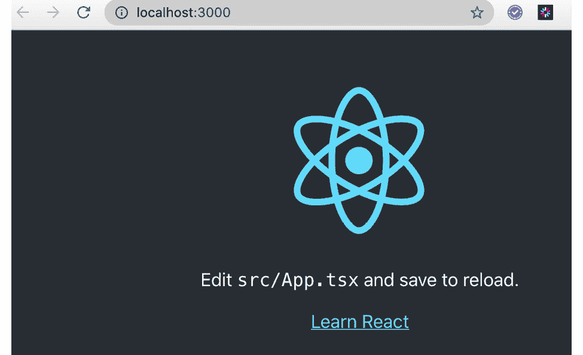
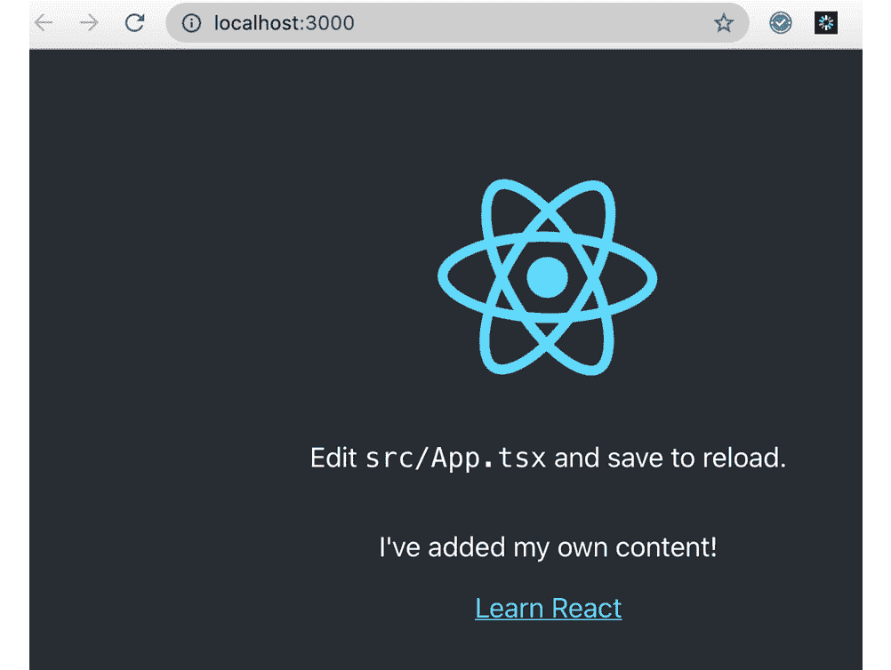
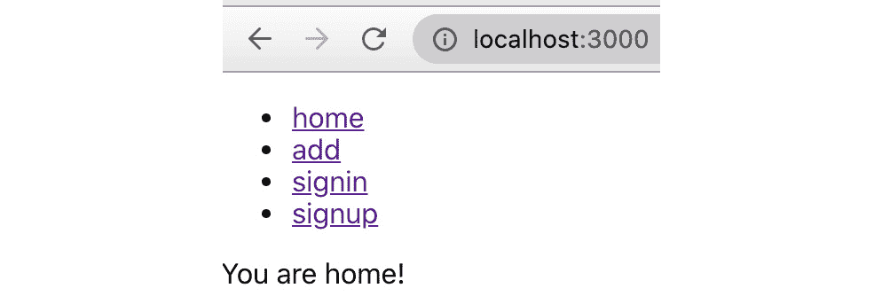
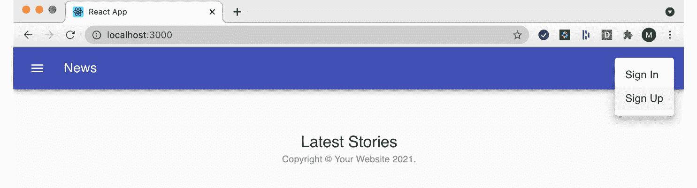
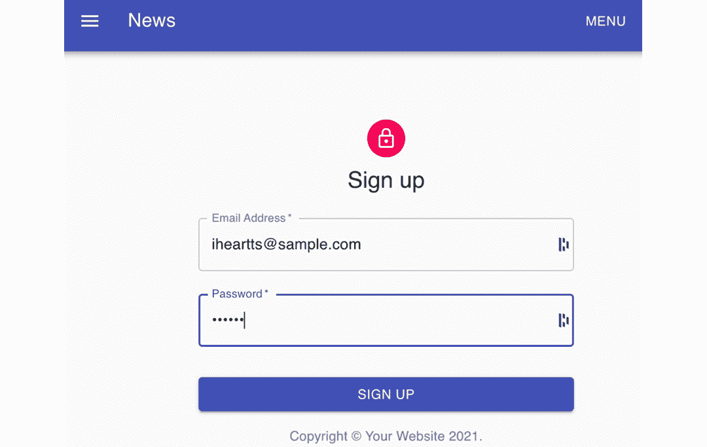
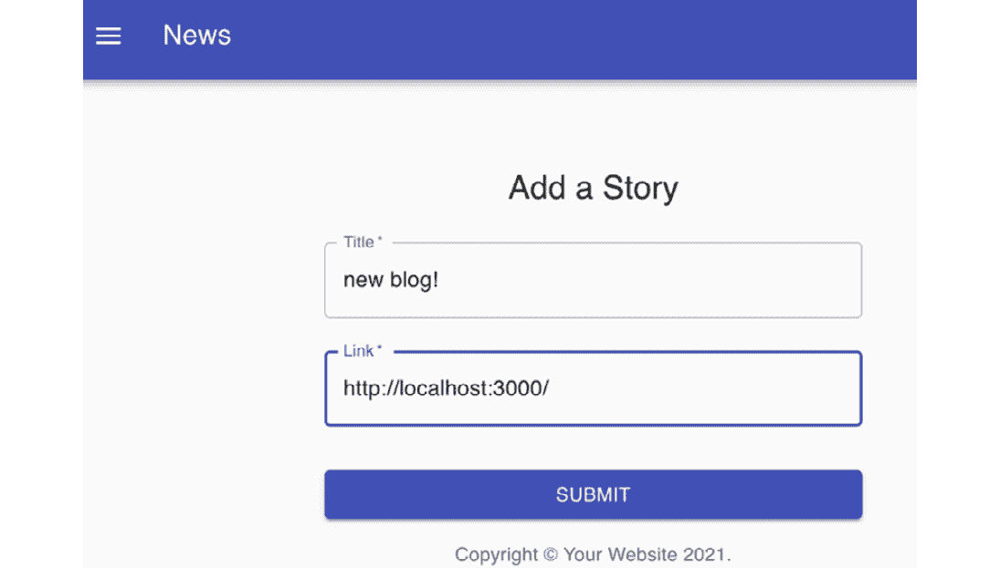
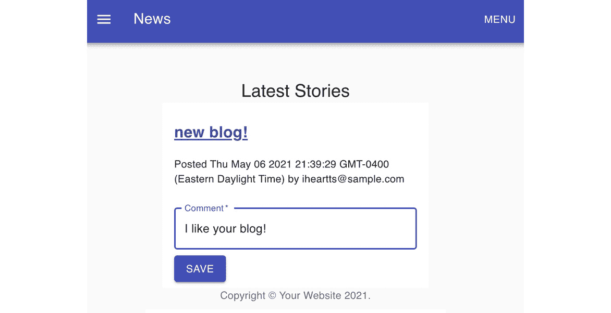
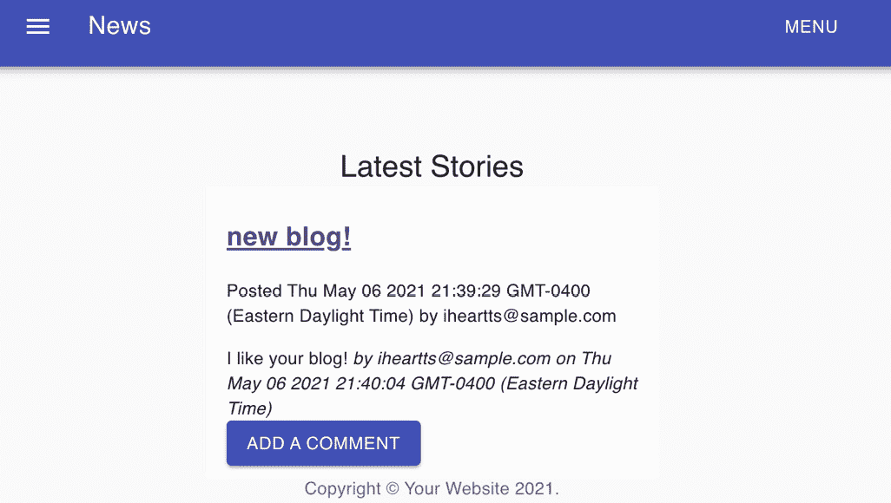

# 第十五章：14. TypeScript 和 React

概述

在本章中，我们将介绍 React 库以及如何使用 TypeScript 构建增强的用户界面。我们将探讨 React 应用程序的状态管理解决方案和样式解决方案。然后，我们将使用无服务器后端 Firebase 来构建一个 Hacker News 风格的应用程序。到本章结束时，您将能够使用 Create React App 命令行界面启动 React 应用程序。

# 简介

React 是网络和移动用户界面开发中的主导力量。尽管它自称是“*用于构建用户界面的 JavaScript 库*”，但我们通常所认为的 React 不仅限于核心库，还包括一个广泛的插件、组件和其他工具的生态系统。许多开发者选择专注于 React，并且它是代码学院的热门话题。与 Angular 不同，React 并非专为使用 TypeScript 而开发，实际上还有一些其他的一些开发者与 React 一起使用的类型系统。然而，React 和 TypeScript 的流行使得将两者结合在一起变得不可避免，使用 TypeScript 编写 React 已经成为用户界面开发的标准方法。

React 是由 Facebook 内部开发用于自身使用的，并于 2013 年开源。与一些功能更全面的框架相比，React 始终将自己定位为一个视图库，并且它依赖于其他库来实现必要的功能，例如状态管理、路由和 Web 请求。

React 使用声明式、基于组件的方法。开发者构建代表不同 UI 元素的组件。这些组件通常是可重用的，并且可以以不同的方式组装来构建 Web 视图。组件可以由其他组件组成，并且每个单独的组件应该相对简单。以小型、可重用组件为前提思考有助于 React 开发者编写干净、可维护的代码，并遵循 **不要重复自己**（**DRY**）原则。

# 为 React 类型化

在 TypeScript 的流行度急剧上升之前，React 程序员要么没有使用任何类型的系统，要么使用 Flow 或 PropTypes 这样的库。

Flow 是 Facebook 开发的另一个库，旨在为 JavaScript 添加类型。它具有与 TypeScript 类似的目标，但采取了不同的途径来实现。Flow 不是一个 JavaScript 的超集，它使用由语言服务器检查的注释和类型注解，然后由 Babel 这样的转换器移除。由于这两个库都是由 Facebook 开发的，因此通常将它们一起使用，但随着 TypeScript 成为网络开发者的首选类型系统，Flow 的流行度已经下降。

PropTypes 是另一个用于强制类型检查的库。在这种情况下，该库专门用于与 React 一起使用，并且其焦点是检查 React 的“props”，即与组件一起传递的参数。

## React 中的 TypeScript

虽然在技术上可以使用这些库与 TypeScript 一起使用，但这并不是一个好主意，因为它们本质上都在试图解决相同的问题。如果你正在使用 TypeScript，最好避免使用 Flow 和 PropTypes。

TypeScript 为 React 程序员提供了许多好处。我们可以通过使用接口来为 props 类型化，从而实现与 PropTypes 库相同的目标，并且我们还能获得完整的 IntelliSense 体验，这将让我们更深入地了解组件及其生命周期，甚至可以阅读开发者的注释、弃用通知等等。

TypeScript 将有助于确保我们组件的正确使用，并给我们提供那种使开发变得容易的早期反馈循环。

# 嗨，React

仅关于 React 的书籍就有很多。这本书关于 TypeScript 的这一章节无法涵盖与 React 相关的所有主题。对于那些已经不熟悉 React 但希望专业地使用 React 的读者，应该寻求本书以外的资源。尽管如此，为了简要概述 React 的工作原理，组件是用某种编译到 JavaScript 的语言编写的，例如 TypeScript、ReasonML，甚至是 JavaScript。编译后的脚本将被嵌入到网页中，连接到页面上的一个元素，例如 `div`：

```js
import React from 'react';
import ReactDOM from 'react-dom';
export interface HelloProps {
  name: string;
}
class HelloComponent extends React.Component<HelloProps, {}> {
  render() {
    return <div>Hello {this.props.name}</div>;
  }
}
ReactDOM.render(
  <HelloTypeScript name="Matt" />,
  document.getElementById('root')
);
```

此脚本将被加载到一个具有 `root` ID 的元素所在的页面上，然后会打印出 `Hello Matt`。React 应用程序的结构有很多种不同的方式。通常，它们将由许多组件组成，每个组件都放在一个单独的文件中。

React 通过在内存中保留一份 **文档对象模型**（**DOM**），即将 JavaScript 代码转换为渲染的浏览器页面的对象树，来工作。这个虚拟 DOM 会频繁更新，并将更改有选择地应用到实际网页的渲染中。虚拟 DOM 允许进行性能优化，并设计用来防止缓慢的渲染或低效的重渲染。

# 组件

继承模式自 JavaScript 诞生以来就存在了，最初是以原型继承的形式，然后是 ES2015 以来的类语法。一些编程范式建议利用继承作为构建复杂应用程序的主要工具。例如，如果我们正在构建一个包含宠物小猫个人主页的网站，你可能会考虑设置一个继承链，如`KittenProfilePage extends FelineProfilePage extends PetProfilePage extends ProfilePage extends Page`。确实，一些 UI 框架试图实现类似这样的模型。然而，在实践中，这种思维方式很快就会暴露出过于僵化、难以适应变化的需求，并迫使你进入奇怪的模式。例如，如果我们已经在`FelineProfilePage`中实现了`whiskerCount`，我们现在正在实现`RodentProfilePage`，我们是复制粘贴吗？`RodentProfilePage`是否从`FelineProfilePage`继承？我们应该在我们的模型中引入`WhiskeredPetProfilePage`到链中以共享`whiskerCount`吗？

这并不是说现代 Web 框架和库不使用继承。它们确实使用了！但通常，我们是从库提供的通用基组件继承，并且我们的继承链非常短。我们不是关注继承，而是关注组合。组合是从许多可重用组件中构建，其中大多数具有更通用目的的实践。这并不意味着每个组件都必须使用多次，但它们是以一种可以重复使用的方式构建的。

这种方法被 React 完全接受。任何 React 应用程序的基本构建块是组件。React 组件有几种类别。

## 有状态组件

有状态组件跟踪它们自己的状态。考虑一个跟踪是否打开并相应渲染的下拉菜单。有状态组件可能使用`this`关键字或包含其他变量以保持状态。在 React 中，有状态组件可以使用`setState`方法。有状态组件的状态可以在生命周期事件中设置。

通常，关于组件应该如何显示的信息可以保存在该组件内部。然而，更复杂的数据，如用户个人资料，通常需要一个超出组件范围的状态管理解决方案。请参阅本章后面的*React 中的状态管理*。

## 无状态组件

无状态组件从不使用`this`关键字或调用`setState`。它们可能根据传入的属性重新渲染，但不会跟踪任何数据。所有正常的生命周期方法都是可用的，无状态组件的声明方式与有状态组件相同，只是没有任何可能改变状态的内容。

如果我们决定在中央位置管理该状态，下拉或手风琴组件甚至可以是状态化的。我们通常不会为简单组件这样做，但可能会有某些原因，例如展开/折叠全部功能。

## 纯组件

纯组件是 React 的一个特殊优化。在如何使用它们方面，它们与无状态组件非常相似，但它们的声明方式不同（通过扩展 `PureComponent`）。纯组件只有在它们的 state 或 props 发生变化时才会重新渲染。这与大多数组件不同，这些组件在父组件重新渲染时也会重新渲染。

尝试使用纯组件是个好主意。它们可以显著加快 React 应用的渲染速度，但可能会给不习惯与它们一起工作的开发者带来一些意外的行为。

## 高阶组件

**高阶组件**（**HOCs**）不是一个库结构，而是一种将一个组件包裹在另一个组件中而不修改被包裹组件的模式。一个 HOC 的好例子是要求用户在交互我们的组件之前进行认证。

考虑一个只有单个登录页面和 99 页敏感信息的网站。按照组合模型，我们该如何实现呢？我们不希望将我们的认证细节注入到我们构建的每个组件中。这样做会显得杂乱无章且不切实际。我们不想不得不将每个渲染都包裹在 `isUserAuthenticated` 中。很容易遗漏一个。解决这个问题的一个更好的方案是使用 HOC。现在我们的组件可以独立于我们的认证模型来编写。

HOCs 经常被描述为 `PureComponent` 是 React 库的实际一部分。

HOCs 是组合优于继承概念的一个很好的例子。回到认证的例子，继承模型可能会让我们构建继承自 `RequiresAuthenticationComponent` 的组件，这是一个内置了我们的认证模型的基组件。然而，使用组合，我们可以独立于我们的认证系统构建我们的组件，然后在他们周围应用 HOC。许多程序员会认为这是一种更好的关注点分离。

# JSX 和 TSX

JSX 是 Facebook 的另一项创新。它指的是增强 XML 的 JavaScript，实际上它是在其中嵌入 HTML 模板的 JavaScript。以下是其使用的一个示例：

```js
render() {
  return <div>Hello {this.props.name}</div>;
}
```

这是一个返回 HTML 模板的函数。我们必须使用 JSX 来做这件事。通常，这会导致语法错误，因为这既不是引号字符串，也不是 TypeScript 中可识别的对象或语法。JSX 允许我们将 HTML 模板与我们的代码混合。一些早期的视图库会使用一个文件用于源代码，另一个用于模板。这对程序员来说通常很令人困惑，因为他们需要在两个文件之间来回切换。

有可能在不使用 JSX 的情况下编写 React，但这很少见，本书也不会涉及这一点。其他一些语言，如 Vue，也使用 JSX。

当我们想在 JSX 中编写 TypeScript 时，我们使用 `.tsx` 文件扩展名而不是 `.jsx`。技术上，这仍然是 JSX。为了在 JSX 中包含 TypeScript，我们只需要相应地设置文件扩展名，并在我们的 `tsconfig.json` 文件中将 `jsx` 属性设置为让 TypeScript 知道我们正在使用 JSX。该属性的合法值是 `react`、`react-native` 和 `preserve`。前两个用于针对网络浏览器或移动应用程序，最后一个意味着其他转换步骤将处理 JSX。

JSX 不是 JavaScript 或 TypeScript 语言的一部分，而是一种需要被转换的语言扩展。你无法在大多数网络浏览器中运行 JSX。

## 练习 14.01：使用 Create React App 搭建

Create React App (`create-react-app`) 是来自 Facebook 的一个库，它帮助开发者快速搭建新的 React 应用程序。它包含一个名为 `react-scripts` 的库，该库帮助抽象化了许多已成为网络开发标准的工具，如代码检查器、测试框架和打包器（webpack）。所有这些依赖项都由 Create React App 和 `react-scripts` 管理。

在这个练习中，我们将使用 Create React App 搭建一个新的 React 应用程序。我们将运行应用程序，检查开发者体验，进行一些小的编辑，然后看到组件重新加载。我们将查看生产构建，并了解它与开发构建的不同之处。然后我们将检查内置的测试：

注意

这个练习的代码可以在以下链接找到：[`packt.link/hMs3v`](https://packt.link/hMs3v)。

1.  Create React App 自带了一些选项，并且自 2018 年以来就包含了 TypeScript 选项。创建新应用程序非常简单。我们甚至不需要安装任何东西，只需使用 `npx` 运行最新版本的 Create React App 并启动应用程序。进入命令行，找到你想要创建应用程序的目录，并输入以下命令：

    ```js
    npx create-react-app my-app --template typescript
    ```

1.  Create React App 将从互联网上下载并设置你的应用程序，然后安装依赖项。如果你已经安装了 `yarn` 包管理器（也来自 Facebook），Create React App 将使用 `yarn`，否则它将使用 `npm`。对于本书的目的，你使用哪一个没有太大区别，因为它们提供了相同的功能。如果你安装了旧的 `yarn` 版本，你可能需要更新它（`npm i -g yarn`）。如果你不希望使用 `yarn`，所有这些练习在没有它的前提下也应该能正常工作：

    ```js
    npx create-react-app my-app --template typescript
    npx: installed 67 in 4.26s
    Creating a new React app in /Users/mattmorgan/mine/The-TypeScript-Workshop/Chapter14/Exercise01/my-app. 
    Installing packages. This might take a couple of minutes.
    Installing react, react-dom, and react-scripts with cra-template-typescript...
    yarn add v1.22.10
    [1/4] 🔍  Resolving packages...
    [2/4] 🚚  Fetching packages...
    // […]
    warning " > @testing-library/user-event@12.6.2" has unmet peer dependency "@testing-library/dom@>=7.21.4".
    success Uninstalled packages.
    ✨  Done in 10.28s.
    Success! Created my-app at /Users/mattmorgan/mine/The-TypeScript-Workshop/Chapter15/Exercise15.01/my-app
    Inside that directory, you can run several commands:
      yarn start - Starts the development server.
      yarn build - Bundles the app into static files for production.
      yarn test -    Starts the test runner.
      yarn eject    Removes this tool and copies build dependencies, configuration files and scripts into the app directory. If you do this, you can't go back!
    We suggest that you begin by typing:
      cd my-app
      yarn start
    Happy hacking!
    ```

    注意

    为了便于展示，这里只显示了输出的一部分。

1.  `npx create-react-app` 的输出将告诉你下一步该做什么。进入创建的目录，并输入 `yarn start` 或 `npm start`。你的应用程序将自动在一个浏览器窗口中打开：

    ```js
    cd my-app
    yarn start
    ```

    你将看到以下输出：

    ```js
    Compiled successfully! 
    You can now view my-app in the browser.
    Local:            http://localhost:3000
    On Your Network:  http://192.168.7.92:3000
    Note that the development build is not optimized.
    To create a production build, use yarn build.
    ```

1.  如果你导航到 `http://localhost:3000`，你会看到以下内容：

    图 14.1：浏览器中的 my-app 截图

1.  检查在你最喜欢的集成开发环境（IDE）中生成的源代码。你可以找到一个名为 `index.tsx` 的文件，它将 React 应用程序附加到一个 `dom` 节点，以及一个 `App.tsx` 文件，这是你应用程序到目前为止的主组件。尝试添加一条新消息或创建一些新的组件，如下所示：

    图 14.2：添加 App.tsx 后的 my-app 截图

1.  当你输入 `npm start` 时，你的应用程序将以开发模式运行，带有热重载（这意味着当你做出更改时页面会刷新）。对于在生产环境中运行，这显然是不必要的。你可以通过运行 `yarn build` 或 `npm run build` 来查看生产构建的样子。你会看到一些输出，告诉你确切发生了什么，并且转译后的 JavaScript 将被放在 `build` 目录中。打开该目录并查看那里的文件。这就是生产 React 应用程序的样子。

1.  使用 *Ctrl* + *C* 停止你的本地服务器，然后尝试 `yarn build` 或 `npm run build` 来运行生产构建。

1.  生产 React 应用程序通常运行在静态服务器上，但它们也可以运行在 Web 服务器上。React 中的服务器端渲染概念超出了本书的范围，但这也是你可能感兴趣的一个主题。你的构建应该生成一个缩短的 URL，该 URL 将带你到一个包含更多关于将 React 应用程序部署到生产环境的信息的文章：

    ```js
    yarn build
    yarn run v1.22.10
    react-scripts build
    Creating an optimized production build...
    Compiled successfully.
    ```

    `gzip` 压缩后的文件大小：

    ```js
      41.2 KB  build/static/js/2.311d60e9.chunk.js
      1.39 KB  build/static/js/3.73a1c5a5.chunk.js
      1.17 KB  build/static/js/runtime-main.f12bc2d0.js
      615 B    build/static/js/main.fe0fc6c6.chunk.js
      531 B    build/static/css/main.8c8b27cf.chunk.css
    ```

    项目假设托管在 `/`。你可以通过 `package.json` 中的 `homepage` 字段来控制这一点。

1.  `build` 文件夹已准备好部署。你可以使用静态服务器来提供服务：

    ```js
    yarn global add serve
    serve -s build
    Find out more about deployment here:https://cra.link/deployment
    ✨  Done in 7.88s.
    ```

1.  输入 `yarn test` 或 `npm t`（即 `npm test`）。Jest 框架将对你的应用程序运行一个测试。这个测试非常简单，但可以让你开始编写更多的测试。为你的组件编写测试是一个好主意，因为测试会给你信心，确保你的应用程序正在工作。编写可测试的代码可以培养良好的编程习惯：

    ```js
    PASS  src/App.test.tsx
      ✓ renders learn react link (23 ms)
    Test Suites: 1 passed, 1 total
    Tests:       1 passed, 1 total
    Snapshots:   0 total
    Time:        2.295 s
    Ran all test suites related to changed files.
    Watch Usage
     › Press a to run all tests.
     › Press f to run only failed tests.
     › Press q to quit watch mode.
     › Press p to filter by a filename regex pattern.
     › Press t to filter by a test name regex pattern.
     › Press Enter to trigger a test run.
    ```

    有了这些，我们已经涵盖了 Create React App 的基础知识。我们学习了如何快速启动一个新应用程序，了解了带有热重载的开发者体验，以及如何运行生产构建和测试。

虽然 Create React App 给你提供了很多东西，但实际上这只是我们将在接下来的章节中看到的内容的冰山一角。例如，我们的应用程序没有处理不同类型请求或不同页面的方法。我们没有路由。我们也没有存储数据的地方，也没有与任何后端交互的方式。我们将在接下来的章节中深入探讨这些概念。

# 路由

React 默认不包含路由解决方案。这是因为它的核心是一个视图库。一些应用程序可能不需要路由，但大多数至少会想要渲染多个页面的能力。一些应用程序可能有复杂的路由需求，可能涉及“深度链接”或直接链接到特定文档。URL 中的请求或查询变量可能包含一些与特定用户记录相关联的标识符。

虽然有一些替代方案，但大多数使用路由的 React 应用程序都使用 React-Router，这是官方的 Facebook 解决方案。

## 练习 14.02：React Router

在这个练习中，我们将使用 Create React App 启动另一个应用程序，然后使用 React Router 来增强它，以便能够支持多个视图并在它们之间进行导航：

注意

这个练习的代码可以在以下链接找到：[`packt.link/EYBcF`](https://packt.link/EYBcF)。

1.  首先，转到可以创建另一个应用程序的命令行：

    ```js
    npx create-react-app router-app --template typescript
    cd router-app
    ```

1.  要添加 React Router，让我们安装库和类型定义。如果你不使用 `yarn`，则可以将 `yarn add` 命令替换为 `npm install`：

    ```js
    yarn add react-router-dom
    yarn add -D @types/react-router-dom
    % yarn add react-router-dom
    yarn add v1.22.10
    [1/4] 🔍  Resolving packages...
    [2/4] 🚚  Fetching packages...
    [3/4] 🔗  Linking dependencies...
    warning " > @testing-library/user-event@12.6.2" has unmet peer dependency "@testing-library/dom@>=7.21.4".
    [4/4] 🔨  Building fresh packages...
    success Saved lockfile.
    success Saved 8 new dependencies.
    info Direct dependencies
    └─ react-router-dom@5.2.0
    info All dependencies
    ├─ hoist-non-react-statics@3.3.2
    ├─ mini-create-react-context@0.4.1
    ├─ path-to-regexp@1.8.0
    ├─ react-router-dom@5.2.0
    ├─ react-router@5.2.0
    ├─ resolve-pathname@3.0.0
    ├─ tiny-warning@1.0.3
    └─ value-equal@1.0.1
    ✨  Done in 4.86s.
    % yarn add -D @types/react-router-dom
    yarn add v1.22.10
    [1/4] 🔍  Resolving packages...
    [2/4] 🚚  Fetching packages...
    [3/4] 🔗  Linking dependencies...
    warning " > @testing-library/user-event@12.6.2" has unmet peer dependency "@testing-library/dom@>=7.21.4".
    [4/4] 🔨  Building fresh packages...
    success Saved lockfile.
    success Saved 2 new dependencies.
    info Direct dependencies
    └─ @types/react-router-dom@5.1.7
    info All dependencies
    ├─ @types/react-router-dom@5.1.7
    └─ @types/react-router@5.1.11
    ✨  Done in 4.59s.
    ```

    现在，我们可以使用 `yarn start` 或 `npm start` 启动应用程序。当我们添加这些路由并编辑文件时，我们的应用程序将自动重新启动，这为开发者提供了一个很好的体验。

    我们可以开始添加路由器，但我们目前没有任何路由目标，所以让我们先添加一些新的组件。由于组件是 React 应用程序的构建块，一个组件可以是一个页面。相同的组件也可以是另一个页面的组成部分。

1.  让我们在应用程序中创建一个 `/src/pages` 子目录来存放新的页面组件。在 `pages` 子目录中，创建 `Add.tsx`、`Home.tsx`、`SignIn.tsx` 和 `Signup.tsx`。

    首先，我们将创建一些非常简单的组件以在它们之间进行路由。在本章的后续部分，我们将讨论函数组件的创建。

1.  使用以下代码创建 `Add.tsx`:

    ```js
    import React from 'react';
    const Add = () => <div>Add a new story</div>;
    export default Add;
    ```

1.  使用以下代码创建 `Home.tsx`:

    ```js
    import React from 'react';
    const Home = () => <div>You are home!</div>;
    export default Home;
    ```

1.  使用以下代码创建 `SignIn.tsx`:

    ```js
    import React from 'react';
    const SignIn = () => <div>Sign in here</div>;
    export default SignIn;
    ```

1.  使用以下代码创建 `SignUp.tsx`:

    ```js
    import React from 'react';
    const SignUp = () => <div>Sign up here</div>;
    export default SignUp;
    ```

    这些基本组件只返回一些 JSX，但它们足以进行路由。请注意，如果没有路由器，我们可以在我们的主 `App.tsx` 中包含这些组件，但在传统网络应用程序的意义上，我们无法在页面之间进行导航。这是路由器的责任。

1.  因此，到目前为止，我们有一些我们尚不能与之交互的组件。让我们给我们的 `App.tsx` 添加路由。

    React Router 公开了几种不同的路由类型，它们大多有特定的用途。我们将关注 `BrowserRouter`。为了开始，我们将向 `App.tsx` 添加一些导入：

    ```js
    import { BrowserRouter as Router, Switch, Route } from 'react-router-dom';
    ```

    按照惯例，我们在导入时将 `BrowserRouter` 重命名为 `Router`。我们还将使用 `Switch`，它为我们提供了一个基于路由在不同组件之间切换的声明式方法，以及 `Route`，它允许我们定义组件路由。

    添加第一个（默认）路由非常简单。在这样做之前，请确保您的本地开发环境正在使用 `npm start` 运行。您应该在运行在 `http://localhost:3000` 的浏览器中看到一个旋转的 React 标志。

1.  现在让我们使用其他组件来构建第一个路由。我们将移除 `App.tsx` 组件当前返回的所有 JSX，并用路由替换它：

    ```js
    function App() {
      return (
        <Router>
          <Switch>
            <Route exact path="/" component={Home} />
          </Switch>
        </Router>
      );
    }
    ```

    您需要导入 `Home` 组件：

    ```js
    import Home from './pages/Home';
    ```

    您的 IDE 可能会在您输入时提示您自动导入 `Home`。

1.  如果一切设置正确，您的视图将刷新，您会看到 React 标志被替换为 `您已到家！`。

    让我们添加一些额外的路由：

    ```js
    <Route path="/add" component={Add} />
    <Route path="/signin" component={SignIn} />
    <Route path="/signup" component={SignUp} />
    ```

1.  我们的 `Home` 路由设置了 `exact` 属性。React 中的路由使用正则表达式从路径的最左侧部分开始匹配路径。这允许匹配变量查询和路由参数。`exact` 属性强制进行精确匹配，并确保 `"/add"` 不会匹配到 `"/"`。

1.  现在我们可以测试路由了。在浏览器中输入 `http://localhost:3000/add`。你应该会看到消息 `添加一个新故事`。尝试访问其他路由。

1.  当然，期望用户手动在浏览器中输入所有 URL 来导航您的网站并不自然。让我们添加一些链接。我们可以从 `react-router` 中导入 `Link`。这个组件将创建连接到您的应用程序路由的导航链接。因此，`Link` 必须始终在 `Router` 内部使用。

    `Link` 包裹一些文本，并有一个 `to` 属性，该属性应该有您想要链接到的路由：

    ```js
    <Link to="/">home</Link>
    ```

    这样一来，添加一些导航元素就非常简单了：

    ```js
    <nav>
      <ul>
        <li>
          <Link to="/">home</Link>
        </li>
        <li>
          <Link to="add">add</Link>
        </li>
        <li>
          <Link to="signin">signin</Link>
        </li>
        <li>
          <Link to="signup">signup</Link>
        </li>
      </ul>
    </nav>
    ```

    这应该会给我们一种在页面之间移动的好方法。然而，将大量额外的 JSX 粘贴到 `App.tsx` 中并不是编写 React 的好方法，所以让我们编写一个 `NavBar` 组件。

1.  在 `src` 下添加一个 `components` 目录。我们将使用这个目录来存放与路由无关的组件：

    ```js
    import React from 'react';
    import { Link } from 'react-router-dom';
    const NavBar = () => (
      <nav>
        <ul>
          <li>
            <Link to="/">home</Link>
          </li>
          <li>
            <Link to="add">add</Link>
          </li>
          <li>
            <Link to="signin">signin</Link>
          </li>
          <li>
            <Link to="signup">signup</Link>
          </li>
        </ul>
      </nav>
    );
    export default NavBar;
    ```

1.  现在，我们可以在 `App.tsx` 中简单地使用这个组件。这是完成的组件：

    ```js
    import './App.css';
    import React from 'react';
    import { BrowserRouter as Router, Route, Switch } from 'react-router-dom';
    import NavBar from './components/NavBar';
    import Add from './pages/Add';
    import Home from './pages/Home';
    import SignIn from './pages/SignIn';
    import SignUp from './pages/SignUp';
    function App() {
      return (
        <Router>
          <NavBar />
          <Switch>
            <Route exact path="/" component={Home} />
            <Route path="/add" component={Add} />
            <Route path="/signin" component={SignIn} />
            <Route path="/signup" component={SignUp} />
          </Switch>
        </Router>
      );
    }
    export default App;
    ```

1.  现在检查您的浏览器，你应该会看到简单的导航，并能够用它来切换视图：

图 14.3：完成组件中的文件夹列表

在 React 应用程序中添加路由很容易。在这个练习中，我们展示了如何添加路由、在它们之间导航，以及如何共享一个通用的组件跨多个路由。React 的一个真正优势是能够在其他组件之间共享组件，并创建重用模式，这使得组合应用程序的构建块变得容易。

路由还可以包括路径和查询参数。请务必阅读 React Router 文档，了解如何向您的路由添加参数。

# React 组件

现在我们来深入探讨这些组件是如何工作的。在 React 中声明组件有几种不同的方式。你甚至可以选择是否使用 JSX。本书将专注于使用函数表达式创建组件，但我们也会简要介绍其他一些模式，这样你就能在看到它们时识别出来。

## 类组件

这种组件风格遵循经典的（即，与编程概念中的类相关）组件声明模式。许多较老的例子会使用类组件，但由于它们比其他模式更冗长，所以已经很大程度上过时了。要创建一个类组件，我们需要从 React 中导入`Component`类并在创建自己的类时扩展它：

```js
import React, { Component } from 'react';
interface Comp1Props {
  text: string;
}
export default class Comp1 extends Component<Comp1Props> {
  render() {
    const { text } = this.props;
    return <div>{text}</div>;
  }
}
```

为属性创建自己的接口是个好主意，同样也可以为状态做同样的事情——例如：

```js
import React, { Component } from 'react';
interface Comp1Props {
  text: string;
}
interface Comp1State {
  value: boolean
}
export default class Comp1 extends Component<Comp1Props, Comp1State> {
  render() {
    ...
}
```

属性通过`this.props`访问，状态通过`this.state`和`this.setState`访问。这种编程风格对于那些有 Java 或 C++背景的人来说可能感觉舒适和熟悉，但`this`关键字在 TypeScript 中可能会带来麻烦，并且以类为中心的声明风格与 React 中的一些函数式编程概念不太匹配，因此近年来其他模式已经变得更加流行。有关`this`关键字的更多信息，请参阅*第三章*，*函数*。

## 函数组件（函数声明）

在 React 组件中，以函数组件的形式编写更为常见。上一节中的相同简单组件，重写为函数组件，可能看起来像这样：

```js
import React from 'react';
interface Comp2Props {
  text: string;
}
export default function Comp2({ text }: Comp2Props) {
  return <div>{text}</div>;
}
```

我们已经精简了几行代码，使其更接近函数式编程风格。在使用函数组件时，你不太会用到`this`，实际上也不需要真正导入`Component`类。属性只是传递给函数的参数。状态在这里不能直接处理，但下一节关于 React Hooks 的内容中我们会看到如何管理状态。

## 函数组件（使用箭头函数的表达式）

本书更倾向于这种模式，因为它是一种非常直观和声明式的创建组件的方式。你甚至可以创建一行代码的纯函数组件。首先，让我们再次编写相同的组件：

```js
import React from 'react';
interface Comp3Props {
  text: string;
}
const Comp3 = ({ text }: Comp3Props) => <div>{text}</div>;
export default Comp3;
```

作用域规则不允许`const`和`default`关键字在同一行上（避免像`export default const a=1, b=2, c=3;`这样的荒谬代码，否则这是允许的），因此我们需要在单独的一行上导出组件。

如果我们真的想进一步精简代码，可以写成这样：

```js
import React from 'react';
export const Comp3 = ({ text }:{ text: string }) => <div>{text}</div>;
```

这是一个无状态的纯函数组件，没有其他副作用。大多数程序员更喜欢使用属性接口，因为它有助于提高可读性，但如果我们真的想使组件更小，可以像前面的片段（`{ text: string }`）那样内联声明。

## 无 JSX

上述任何一种方法都可以使用`createElement`。这里有一个快速示例，说明你可能不想使用它的原因：

```js
import { createElement } from 'react';
interface Comp4Props {
  text: string;
}
const Comp4 = ({ text }: Comp4Props) => createElement('div', null, text);
export default Comp4;
```

`createElement` 的参数是要创建的元素标签、其属性和其子元素。很快就会意识到，使用 `createElement` 创建嵌套元素会比使用 JSX 难得多，所以 JSX 几乎总是被使用。如果我们决定不使用 JSX，我们可以使用 `.ts` 文件扩展名而不是 `.tsx`。这是一个非常小的好处！

## 函数组件中的状态

本书推荐使用函数组件而不是类组件。在函数组件中，我们不能直接访问状态，也没有可调用的 `setState` 方法。然而，我们确实可以访问优秀的 `useState`，所以我们几乎不会错过 `this` 或 `setState`。

`useState` 是 React Hooks 的一部分，自 React 版本 16.8 以来可用。React Hooks 引入了几种函数，这些函数极大地增强了与函数组件一起工作的能力。让我们从一个使用类构造函数、`this` 和 `setState` 的简单组件开始：

```js
import React, { Component } from 'react';
interface Comp1Props {
  text: string;
}
interface Comp1State {
  clicks: number;
}
export default class Comp1 extends Component<Comp1Props, Comp1State> {
  constructor(props: Comp1Props) {
    super(props);
    this.state = { clicks: 0 };
  }
  handleClick = () => {
    this.setState({ clicks: this.state.clicks + 1 });
  };
  render() {
    const { text } = this.props;
    return (
      <div>
        {text}
        <div>
          <button onClick={this.handleClick}>{this.state.clicks} clicks</button>
        </div>
      </div>
    );
  }
}
```

我们已经为属性、状态以及用于计数点击的事件处理程序定义了接口。我们正在使用 `setState` 在状态中增加计数器。`handleClick` 使用箭头函数而 `render` 不使用箭头函数，看起来有点奇怪，但它们都引用了 `this`。这是由于 TypeScript 中解释 `this` 引用时的奇怪之处。如果没有箭头函数，`handleClick` 在访问 `this` 时将找不到我们的组件，而会得到一个 `undefined` 引用。这种问题已经让许多开发者浪费了很多时间，因此框架作者寻求了简单避免许多开发者认为令人困惑的语言结构的解决方案。让我们将此组件重写为函数组件：

```js
import React, { useState } from 'react';
interface Comp2Props {
  text: string;
}
export default function Comp2({ text }: Comp2Props) {
  const [clicks, setClicks] = useState(0);
  const handleClick = () => setClicks(clicks + 1);
  return (
    <div>
      {text}
      <div>
        <button onClick={handleClick}>{clicks} clicks</button>
      </div>
    </div>
  );
}
```

这个函数组件与类组件执行完全相同的功能。让我们看看它们之间的差异。首先，我们在代码行数方面开始看到实质性的节省。函数组件有 18 行，而类组件有 30 行。

接下来，我们避免了麻烦的 `this` 关键字。我们还避免了需要为状态定义接口的需要。这看起来可能有些反直觉，但实际上这是一个好事。在类组件中，状态作为一个单一的对象，可能经常将几个不相关的东西组合成一个状态。状态实际上只是一个任何和所有局部变量的地方。通过独立声明这些变量，我们可以建立更好的编程范式。

`useState` 函数接受一个参数，即默认状态，并返回一个指向值和用于更新状态的方法的 `const` 数组。状态值是 `const` 的，因为它不能在不重新渲染我们的组件的情况下更新。如果我们调用 `setClicks`，组件将重新渲染，并使用新初始化的 `const clicks`。你可以在单个函数组件中调用多个 `useState`。每个 `useState` 都独立管理其状态的一部分。

当使用`useState`时，您的状态仍然可以是强类型的。在我们的例子中，TypeScript 根据我们如何用数字初始化它来推断点击的类型。然而，如果我们想的话，我们可以添加一个类型提示，例如`useState<number>(0)`或`useState<MyType>(0)`来处理更复杂类型。

# React 中的状态管理

在 UI 开发领域，“状态”这个词有点被过度使用了。到目前为止，我们所说的状态是组件内部的一个局部状态。回到点击的例子，虽然这个值可以通过通常的方式（作为一个 prop）传递给子组件，但没有简单的方法将这个值传递给父组件或 DOM 树中其他地方的某个“远亲”组件。

全局状态的管理是一个比 React 更老的问题。创建某种可以内部管理其自身数据的组件通常是非常简单的，但当引入新的要求将组件的数据与其他应用程序的部分连接起来时，这个组件会变得极其复杂。通常，应用程序是以命令式的方式编写的，使用手写的“事件”来尝试通过全局作用域传播数据。这种方法可能可行，但错误是常见的，管理变化可能非常困难。对状态管理采取临时方法的一个可能结果是难以维护的意大利面代码。

React 确实有一种“暴力”式的状态管理方法，即所有数据都存储在某个父组件中，并通过（连同更新数据所需的所有必要方法）传递给所有子组件及其所有后代。在复杂的应用程序中这样做可能会非常具有挑战性，需要传递的长列表的 props 总是必须传递。因此，大多数开发者会选择另一种解决方案。

Redux 是一个在 2015 年引入的流行库，旨在通过引入函数式编程概念（如 reducer）来解决状态管理问题。Redux 背后的概念是，不可变状态存储在应用程序的某个地方。应用程序的不同部分可以发出动作，这些动作将产生一个新的状态来替换旧的状态。因为每个不可变状态版本都可以存储并且是不可变的（这意味着框架外部的任何东西都不能改变它），所以可以穿越不同的应用程序状态，这在开发中非常有用，也可能在生产应用程序中有用，例如“撤销”功能。Redux 几乎可以与任何 Web 应用程序一起使用，并且不绑定到 React，但通常在应用程序中会发现两者同时存在。

Redux 功能强大，但因其过于复杂和大量使用样板代码而受到批评。它通常还需要额外的库（如`redux-saga`或`redux-thunk`）来对后端服务器进行异步调用。所有这些库都可能对新手来说非常令人畏惧，甚至对经验丰富的程序员来说使用起来也可能具有挑战性。

React Hooks 提供了一种更简单的方式，使用 React 上下文。React 上下文允许我们设置根级数据存储和操作，并将它们提供给 DOM 树中深处的组件，而无需将 props 传递到整个路径（有时称为“prop 传递”）。Redux 和上下文之间的区别相当于从类组件和 `setState` 转到函数组件和 `useState`。像先前的例子一样，我们是从一个单一的状态对象及其复杂性管理到多个可以更简单地管理的上下文。

## 练习 14.03：React 上下文

让我们通过上下文获得一些经验。对于这个练习，你可以启动一个新的 `create-react-app` 实例，或者使用上一节中的实例。在这个练习中，我们将创建两个新组件和一个提供者。技术上，提供者也是组件，但它们实际上是专门的 HOC：

注意

本练习的代码可以在以下链接找到：[`packt.link/rUfr4`](https://packt.link/rUfr4).

1.  让我们从提供者开始。在您的 `/src` 目录下创建 `/components` 和 `/providers` 子目录。在 `/providers` 目录下，创建一个名为 `ClickProvider.tsx` 的文件。此组件将管理我们的点击并提供其上下文给后代。

1.  与大多数组件不同，提供者将导出一个上下文和一个提供者。一些指南会创建 `Context` 然后导出 `Consumer` 和 `Provider`。我们不会使用 `Consumer`，而是使用另一个 React Hook，即 `useContext`。当使用 `useContext` 时，不会直接引用 `Consumer` 对象：

    ```js
    export const ClickContext = createContext();
    ```

1.  这是创建 `Context` 的基本签名。我们需要添加一个类型提示和一个默认值。让我们在添加 `Provider` 之后稍后再来处理这个问题：

    ```js
    export const ClickProvider = ({ children }) => {
      const [clicks, setClicks] = useState(0);
      return (
        <ClickContext.Provider value={{ clicks, setClicks }}>
          {children}
        </ClickContext.Provider>
      );
    };
    ```

    此组件接受一些属性，即子节点。它使用 `useState` 创建一个 `clicks` 值和一个 `update` 函数，然后返回带有值和函数的 `Provider`。

1.  这是我们需要的基本提供者，但它还不是好的 TypeScript。我们需要添加一些更多的类型：

    ```js
    interface Clicks {
      clicks: number;
      setClicks: Dispatch<SetStateAction<number>>;
    }
    interface ContextProps {
      children: ReactNode;
    }
    ```

1.  `ClickContext` 将是 `Provider` 返回的值的类型，而 `ContextProps` 作为任何具有子组件的 HOC 的基本 prop 类型。有了这些类型，我们可以填写 `Provider` 的其余部分：

    ```js
    import React, {
      createContext,
      Dispatch,
      ReactNode,
      SetStateAction,
      useState,
    } from 'react';
    interface Clicks {
      clicks: number;
      setClicks: Dispatch<SetStateAction<number>>;
    }
    interface ContextProps {
      children: ReactNode;
    }
    export const ClickContext = createContext<Clicks>({
      clicks: 0,
      setClicks: () => {},
    });
    export const ClickProvider = ({ children }: ContextProps) => {
      const [clicks, setClicks] = useState(0);
      return (
        <ClickContext.Provider value={{ clicks, setClicks }}>
          {children}
        </ClickContext.Provider>
      );
    };
    ```

1.  现在，让我们在 `components` 目录下添加 `Clicker.tsx` 和 `Display.tsx`：

    ```js
    import React, { useContext } from 'react';
    import { ClickContext } from '../providers/ClickProvider';
    const Clicker = () => {
      const { clicks, setClicks } = useContext(ClickContext);
      const handleClick = () => setClicks(clicks + 1);
      return <button onClick={handleClick}>Add a click</button>;
    };
    export default Clicker;
    ```

1.  此组件渲染一个按钮并使用 `Provider` 中的 `setClicks` 方法：

    ```js
    import React, { useContext } from 'react';
    import { ClickContext } from '../providers/ClickProvider';
    const Display = () => {
      const { clicks } = useContext(ClickContext);
      return <div>{clicks}</div>;
    };
    export default Display;
    ```

    `Display.tsx` 只是从上下文中获取 `clicks` 值并显示它。

1.  现在我们有几个与我们的提供者一起工作的简单组件，让我们将它们添加到 `App.tsx` 中，看看我们的应用看起来如何。

1.  从 `App.tsx` 中删除默认代码，并用 `Provider` 和新组件替换：

    ```js
    import './App.css';
    import React from 'react';
    import Clicker from './components/Clicker';
    import Display from './components/Display';
    import { ClickProvider } from './providers/ClickProvider';
    function App() {
      return (
        <ClickProvider>
          <Clicker />
          <Display />
        </ClickProvider>
      );
    }
    export default App;
    ```

    运行应用并多次点击按钮。计数器将增加。在网站上制作计数器增加并不那么令人惊叹，但我们的组件是很好地解耦的，并且这种方法可以很好地扩展到更大的应用：

    

图 14.4：显示点击计数的应用

在这个练习中，我们使用了 React 上下文来管理应用中的状态。我们展示了不同的组件如何与状态交互，以及如何在不需要嵌套属性的情况下将状态传递给组件。

React 应用可以包含多个上下文或单一的数据树。React 上下文甚至可以在开发模式下，当修改的组件重新加载时保持当前状态，这样你就可以在不中断应用流程的情况下继续编码。

# Firebase

Firebase 是由谷歌拥有的移动和 Web 开发平台。Firebase 包括一个 Web API，因此你可以向 Web 应用添加身份验证、分析、数据库等。Firebase 可以用作现代 Web 应用的后端，让开发者能够专注于用户体验。它包括一个免费层，我们将在以下练习中使用。

## 练习 14.04：开始使用 Firebase

在这个练习中，我们将使用 Firebase 设置数据库和身份验证。我们需要注册一个免费账户。我们还将获取在本书后面部分使用 Firebase 完成活动所需的必要有效载荷：

注意

这个练习的代码文件可以在以下链接找到：[`packt.link/bNMr5`](https://packt.link/bNMr5)。

1.  Firebase 需要谷歌账户，但使用它不需要信用卡或任何支付。要开始，导航到[`firebase.google.com/`](https://firebase.google.com/)并点击`开始使用`。

    你应该会出现在 Firebase 控制台中。点击`添加项目`并完成向导。你可以给你的项目命名任何你喜欢的名字——如果你不指定，Firebase 会自动生成一个唯一的名字。

1.  除非你已经有一个想要使用的账户，否则不要启用 Google Analytics。

    你需要等待一分钟，然后你将发现自己处于项目仪表板上。在那里，你会找到几个可以部署以帮助构建应用的服务。我们将只关注身份验证和 Firestore。

1.  首先，转到`身份验证`并点击`开始使用`。选择`电子邮件/密码`并启用它。所有其他身份验证方法都需要额外的设置步骤。如果你喜欢，可以继续完成这些步骤。Firebase 网站上的文档应该足够了。保存你的更改。

1.  现在点击`Firestore 数据库`并`创建数据库`。选择`以测试模式开始`选项，然后选择一个部署区域。区域实际上并不重要，但你可能希望选择一个离你较近的区域以获得更快的响应。完成创建数据库。

1.  在 Firebase 控制台中，我们最后需要做的一件事是找到我们的应用程序配置。Firebase 的工作方式是，一个包含多个 ID 的配置对象将存在于您的应用程序中，并管理对 Firebase 后端的连接；然而，控制哪些用户可以影响哪些数据的权限规则都是在控制台（或本书未涉及的 CLI）中设置的。这个配置实际上并不保密，因为如果您的应用程序设置正确，恶意用户无法执行您未允许的操作。

1.  要获取您的应用程序配置，您首先必须注册您的应用程序。您可以从“项目概览”（`</>` 符号）或通过“项目概览”旁边的齿轮添加应用程序。添加一个网络应用程序，您可以给它起任何名字，并跳过网络托管选项。进入您的应用程序配置（齿轮图标）并找到配置。使用通过 CDN（内容分发网络）的配置，您会找到类似以下的内容：

    ```js
    const firebaseConfig = {
      apiKey: "abc123",
      authDomain: "blog-xxx.firebaseapp.com",
      projectId: "blog-xxx",
      storageBucket: "blog-xxx.appspot.com",
      messagingSenderId: "999",
      appId: "1:123:web:123abc"
    };
    ```

    保留这个配置。我们稍后会用到它，但现在我们在 Firebase 控制台中已经完成了。您可能希望稍后返回查看您的数据库、管理您的用户，甚至升级或删除您的应用程序和项目，但在这个章节中您不需要再次这样做。

开始使用 Firebase 非常简单。我们将能够使用 Firebase 来注册、验证用户、跟踪用户并存储数据，而无需编写自己的后端服务。

# 样式化 React 应用

当谈到样式化应用程序时，现代 UI 开发者有很多不同的选择。创建几个 **层叠样式表**（**CSS**）文件并包含它们的传统方法对于扩展或构建统一的表示层来说并不理想。特别是现代网络应用程序和 React 提供了如此多的样式化选项，我们无法期望涵盖所有这些选项。以下是一些流行的技术。

## 主样式表

我们有一个包含所有样式的 `styles.css` 文件。样式是全局的，将影响所有组件。这对于小型应用程序来说可能效果很好，但随着您添加更多样式和组件，会存在一些严重的扩展问题。当添加新样式时，我们可能会看到现有组件因受新样式的影响而开始出现故障。

## 组件作用域样式

采用这种方法，我们为每个需要样式的组件创建一个样式，并使用 `import` 关键字将样式添加到您的组件中。像 webpack 这样的构建系统将为所有样式名称添加前缀，这样它们就不会“污染”全局作用域，并最终影响其他组件。这是 Create React App 默认提供的解决方案，它内部使用 webpack。

如果您能够有效地使用纯 CSS 或像 Sass 这样的样式表编译器，这种方法效果很好。一些开发者不喜欢它，因为显示元素分散在 CSS 和 JSX 文件中。

## CSS-in-JS

CSS-in-JS 是一种产生了诸如 Styled Components 和 Emotion 等流行库的方法。这种方法简单来说就是我们在 JavaScript（或 TypeScript，在我们的例子中，因为大多数这些库都发布了类型定义）中编写我们的 CSS，从而将我们的样式与显示层结合起来。

这种方法非常适合那些创建大量自定义组件的团队。但缺点是又增加了一个需要维护的构建依赖。

## 组件库

组件库提供完全可用的组件，可以直接插入到应用程序中。组件库非常适合快速构建一个外观漂亮的应用程序。许多组件库已经存在了很长时间。一些组件库的例子包括 Twitter Bootstrap、Semantic UI 和 Material-UI。所有这些库都发布了旨在与流行的 Web 系统（如 Angular、Vue 以及当然还有 React）一起工作的版本。

与组件库一起工作与使用自己的组件非常相似。你导入组件，就像使用任何其他组件一样使用它们。这样做可以真正加快你的开发周期，因为你有了现成的常用组件。有些团队发现组件库中的组件太不灵活，不喜欢处理额外的依赖。

即将进行的活动将使用 Material-UI 进行快速且吸引人的构建。

## 活动 14.01：博客

现在我们对 `create-react-app` 和 Firebase 有了一些经验，让我们创建一个博客！在这个活动中，我们将使用本章前面覆盖的所有工具和技术。我们将使用 `create-react-app` 快速创建一个 React 项目。我们将使用 Material-UI 设计一个吸引人的应用程序，并编写一些我们自己的函数组件。我们将使用 `react-router` 在应用程序的不同页面之间启用路由。我们将使用 React 上下文 API 来管理状态。最后，我们将使用 Firebase 来有一个后端服务，我们可以用它来验证用户并在博客访问之间保存和共享数据。

让我们通过创建这个博客的高级步骤来了解一下。听起来好像有很多步骤，但如果我们将其分解为单个任务，就不会那么具有挑战性：

注意

这个活动的代码文件可以在以下位置找到：[`packt.link/qqIXz`](https://packt.link/qqIXz)。

1.  使用 `create-react-app` 创建一个新的 React 应用程序，正如本章前面所述。你甚至可以重用本章前面开始的应用程序。启动你的应用程序，以便你可以亲眼看到实现过程。

1.  请参考 *第 14.04 节，Firebase 入门* 中的 Firebase 应用程序，或者如果你还没有完成，请完成该练习。在 Firebase 中找到你的配置数据，然后按照说明将 `firebase` 依赖项添加到你的 React 应用程序中，然后添加 Firebase 控制台中的应用程序特定配置。

1.  实现 Firebase 的 `auth` 和 `firestore` 服务，然后为每个服务添加 React 上下文和提供者以维护状态。

    安装 `react-router` 和 `material-ui` 来构建一些 UI 组件并创建一些路由。首先创建一个注册路由和页面：

    

    图 14.5：首页

    

    图 14.6：注册页面

1.  创建一个添加页面的路由，并添加 UI 组件以便能够设置新故事的标题和链接：

    图 14.7：添加故事页面

1.  使用你的 React 上下文和提供者以及 Firebase Firestore，将数据持久化到云端并实现其他功能，例如评论：

图 14.8：评论功能



图 14.9：发表评论

如果这项活动花费了一些时间，请不要担心。如果你需要在 GitHub 上检查解决方案，也无需担心。这个活动尤其具有挑战性，因为它包含了如此多的不同部分，但如果你设法将它们全部整合到一个可工作的应用中，那是一个巨大的进步。你已经构建了一个具有吸引力的 UI、身份验证和数据库的全栈应用。

注意

这个活动的解决方案可以通过这个链接找到。

# 摘要

TypeScript 正在成为编写 Web 应用的流行工具，尽管它过去在 React 中并不总是普遍使用，但现在它得到了很好的支持。开发者不再需要仅仅为 props 添加类型，而可以在应用的所有部分工作中获得类型安全和智能感知的好处。

React 拥有一个非常丰富和多样化的生态系统，但许多 TypeScript 兼容的解决方案，如 React Hooks 和 React 上下文，正成为保持应用简单但强大的首选。由于 `create-react-app` 支持 TypeScript，因此开始使用非常简单，你可以在几分钟内开始构建你的应用。

想要了解更多关于 React 的开发者需要的不只是这本书，但这一章节旨在展示为什么当你使用 React 编写应用时，你想要坚持使用 TypeScript。
