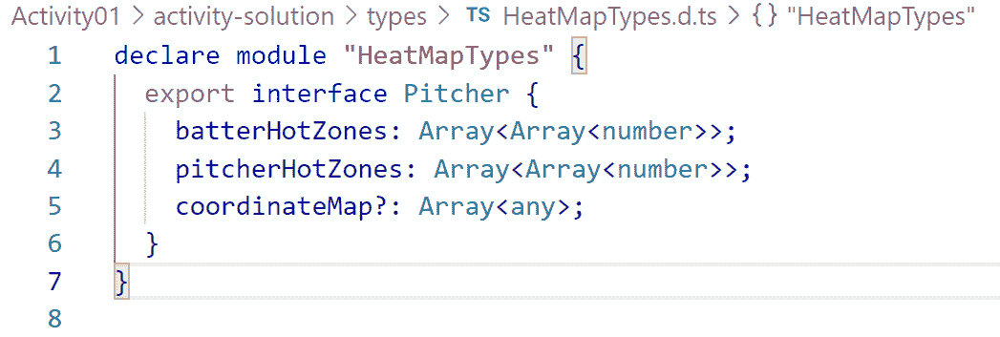
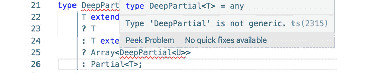
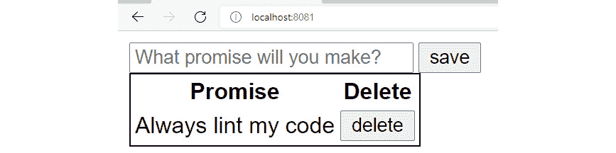
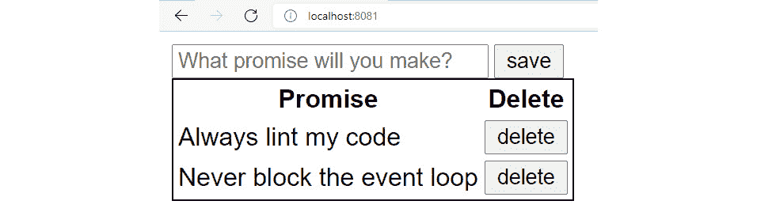
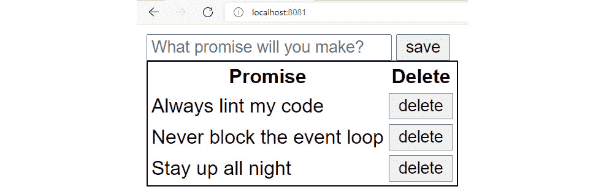
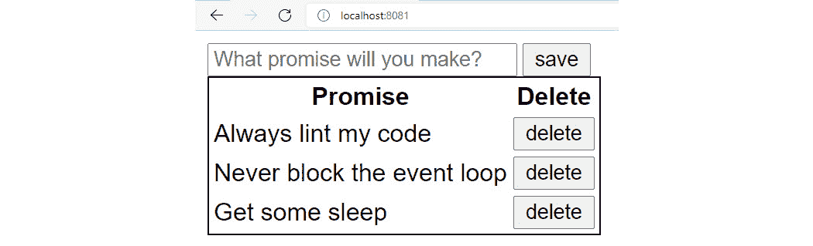

# 附录

# 1. TypeScript 基础

## 活动一.01：创建字符串操作库

**解决方案：**

这里是帮助你创建活动问题陈述中列出的所有函数的步骤。

### toTitleCase

`toTitleCase` 函数将处理一个字符串，并将每个单词的首字母转换为大写，但将所有其他字母转换为小写。

此函数的测试用例如下：

```js
"war AND peace" => "War And Peace"
"Catcher in the Rye" => "Catcher In The Rye"
 "tO kILL A mOCKINGBIRD" => "To Kill A MockingBird"
```

这里是帮助你编写这个函数的步骤：

1.  此函数将接受一个字符串参数并返回一个字符串：

    ```js
    function toTitleCase (input:string) : string {
    ```

1.  首先，我们将使用字符串分割方法将输入分割成字符串数组。我们将根据每个空格字符进行分割：

    ```js
        // split the string into an array on every occurrence of 
        //  the space character     const words = input.split(" ");
    ```

1.  接下来，我们将定义一个新的数组，用于存储我们将要转换为大写形式的每个单词，并使用 for..of 循环遍历单词数组：

    ```js
        const titleWords = [];    // loop through each word     for (const word of words) {
    ```

1.  对于每个单词，我们将使用字符串切片方法提取第一个字符和其余字符。我们将首字母转换为大写，其余字符转换为小写。然后，我们将它们重新组合成一个完整的单词，并将结果推送到存储数组中：

    ```js
        // take the first character using `slice` and convert it to uppercase     const initial = word.slice(0, 1).toLocaleUpperCase();    // take the rest of the character using `slice` and convert them to lowercase     const rest = word.slice(1).toLocaleLowerCase();    // join the initial and the rest and add them to the resulting array     titleWords.push(`${initial}${rest}`);
    ```

1.  最后，我们将所有处理过的单词连接起来，用空格分隔，我们就得到了结果：

    ```js
        // join all the processed words     const result = titleWords.join(" ");    return result;}
    ```

1.  接下来，我们可以测试该函数是否对给定的测试输入给出了预期的结果：

    ```js
    console.log(`toTitleCase("war AND peace"):`);console.log(toTitleCase("war AND peace")); console.log(`toTitleCase("Catcher in the Rye"):`);console.log(toTitleCase("Catcher in the Rye"));console.log(`toTitleCase("tO kILL A mOCKINGBIRD"):`);console.log(toTitleCase("tO kILL A mOCKINGBIRD"));
    ```

1.  我们应该收到以下结果：

    ```js
    toTitleCase("war AND peace"):War And Peace toTitleCase("Catcher in the Rye"):Catcher In The Rye toTitleCase("tO kILL A mOCKINGBIRD"):To Kill A Mockingbird
    ```

### countWords

这里是帮助你编写这个函数的步骤：

1.  `countWords` 函数将计算字符串中不同单词的数量。单词由空格、破折号（-）或下划线（_）分隔。此函数的测试用例如下：

    ```js
    "War and Peace" => 3 
    "catcher-in-the-rye" => 4 
    "for_whom the-bell-tolls" => 5
    ```

1.  使用以下代码创建 `countWords` 函数：

    ```js
    function countWords (input: string): number {
    ```

1.  使用匹配空格、下划线或破折号字符的正则表达式分割单词：

    ```js
        const words = input.split(/[ _-]/);
    ```

1.  返回分割结果数组的长度：

    ```js
        return words.length;
    }
    ```

1.  测试该函数并输出控制台结果：

    ```js
    console.log(`countWords("War and Peace"):`);
    console.log(countWords("War and Peace"));

    console.log(`countWords("catcher-in-the-rye"):`);
    console.log(countWords("catcher-in-the-rye"));
    console.log(`countWords("for_whom the-bell-tolls"):`);
    console.log(countWords("for_whom the-bell-tolls"));
    ```

### toWords

`toWords` 函数将返回字符串中的所有单词。单词由空格、破折号（`-`）或下划线（`_`）分隔。

此函数的测试用例如下：

```js
"War and Peace" => [War, and, peace]
"catcher-in-the-rye" => [catcher, in, the, rye]
"for_whom the-bell-tolls" => [for, whom, the, bell, tolls]
```

此函数与我们之前开发的函数非常相似。主要区别是我们需要返回的不仅是单词的数量，还有实际的单词本身。因此，此函数将返回一个字符串数组，而不是一个数字：

1.  这里是创建此函数的代码：

    ```js
    function toWords (input: string): string[] {
    ```

1.  再次，我们需要使用字符串分割方法将输入分割成字符串数组，使用正则表达式 `[ _-]`。使用匹配空格、下划线或破折号字符的正则表达式分割单词：

    ```js
       const words = input.split(/[ _-]/);
    ```

1.  一旦我们有了单词，我们就可以直接返回它们：

    ```js
        // return the words that were split     return words;}
    ```

1.  接下来，我们可以测试该函数是否对给定的测试输入给出了预期的结果：

    ```js
    console.log(`toWords("War and Peace"):`);console.log(toWords("War and Peace")); console.log(`toWords("catcher-in-the-rye"):`);console.log(toWords("catcher-in-the-rye"));console.log(`toWords("for_whom the-bell-tolls"):`);console.log(toWords("for_whom the-bell-tolls"));
    ```

1.  我们应该收到以下结果：

    ```js
    toWords("War and Peace"):[ 'War', 'and', 'Peace' ]toWords("catcher-in-the-rye"):[ 'catcher', 'in', 'the', 'rye' ]toWords("for_whom the-bell-tolls"):[ 'for', 'whom', 'the', 'bell', 'tolls' ]
    ```

### repeat

`repeat` 将接受一个字符串和一个数字，并返回该字符串重复指定次数的结果。

此函数的测试用例如下：

```js
„War", 3 => „WarWarWar"
„rye", 1 => „rye"
„bell", 0 => „"
```

这里有一些步骤可以帮助你编写这个函数：

1.  这个函数将接受两个参数，一个是字符串，另一个是数字，并返回一个字符串：

    ```js
    function repeat (input: string, times: number): string {
    ```

    实现这个函数有很多种方法，我们将展示一种方法。我们可以创建一个具有所需元素数量的数组，然后使用数组的 `fill` 方法用字符串的值填充它。这样，我们将有一个包含 `times` 个元素的数组，每个元素都将具有 `input` 值：

    ```js
        // create a new array that with length of `times`    // and set each element to the value of the `input` string     const instances = new Array(times).fill(input);
    ```

1.  接下来，我们只需要使用空字符串作为分隔符，将所有实例连接起来。这样，我们确保字符串之间没有插入空格或逗号：

    ```js
        // join the elements of the array together     const result = instances.join("");    return result;}
    ```

1.  接下来，我们可以测试该函数对于给定的测试输入是否给出预期的结果：

    ```js
    console.log(`repeat("War", 3 ):`);console.log(repeat("War", 3 )); console.log(`repeat("rye", 1):`);console.log(repeat("rye", 1));console.log(`repeat("bell", 0):`);console.log(repeat("bell", 0));
    ```

1.  我们应该收到以下结果：

    ```js
    repeat("War", 3 ):WarWarWar repeat("rye", 1):rye repeat("bell", 0):
    ```

### isAlpha

`isAlpha` 如果字符串只包含字母字符（即字母），则返回 `true`。这个函数的测试用例如下：

```js
"War and Peace" => false
"Atonement" => true
"1Q84" => false
```

这里有一些步骤可以帮助你编写这个函数：

1.  这个函数将接受一个字符串参数并返回一个布尔值：

    ```js
    function isAlpha (input: string): boolean {
    ```

1.  为了使这个函数工作，我们需要检查每个字符是下划线还是大写字母。确定这一点的一个最好的方法就是使用检查它的正则表达式。特别是，字符组 [a-z] 将检查单个字符，如果我们使用星号量词 (*)，我们可以告诉正则表达式检查所有字符。我们可以添加 i 修饰符到正则表达式，使其匹配不区分大小写，这样我们就不必担心字母的大小写：

    ```js
    // regex that will match any string that only has upper and  //lowercase letters     const alphaRegex = /^[a-z]*$/i
    ```

1.  接下来，我们需要实际测试我们的输入。由于我们只需要知道字符串是否匹配，我们可以使用正则表达式的测试方法并返回其结果：

    ```js
        // test our input using the regex     const result = alphaRegex.test(input);    return result;}
    ```

1.  接下来，我们可以测试该函数对于给定的测试输入是否给出预期的结果：

    ```js
    console.log(`isAlpha("War and Peace"):`);console.log(isAlpha("War and Peace")); console.log(`isAlpha("Atonement"):`);console.log(isAlpha("Atonement"));console.log(`isAlpha("1Q84"):`);console.log(isAlpha("1Q84"));
    ```

1.  我们应该收到以下结果：

    ```js
    isAlpha("War and Peace"):false isAlpha("Atonement"):true isAlpha("1Q84"):false
    ```

### isBlank

`isBlank` 如果字符串为空白，即只包含空白字符，则返回 `true`。

这个函数的测试用例如下：

```js
"War and Peace" => false
"       " => true
"" => true
```

这里有一些步骤可以帮助你编写这个函数：

1.  这个函数将接受一个字符串参数并返回一个布尔值：

    ```js
    function isBlank (input: string): boolean {
    ```

1.  为了使这个函数工作，我们需要检查字符串中的每个字符是否为空白字符。我们可以使用正则表达式来确定这一点，或者我们可以使用某种循环结构来遍历字符串。一种方法就是测试第一个字符是否为空格，如果是，就将其切掉：

    ```js
    // test if the first character of our input is an empty space     while (input[0] === " ") {// successively slice off the first character of the input         input = input.slice(1);    }
    ```

1.  这个循环将一直执行，直到遇到一个非空白字符。如果没有遇到，它将仅在字符串没有第一个元素时停止，也就是说，当字符串为空字符串时。如果是这种情况，我们的原始输入只包含空白字符，我们可以返回 true。否则，我们应该返回 false：

    ```js
    // the loop will stop on the first character that is not a //space.// if we're left with an empty string, we only have spaces in // the input     const result = input === "";    return result;
    ```

1.  接下来，我们可以测试该函数对于给定的测试输入是否给出预期的结果：

    ```js
    console.log(`isBlank("War and Peace"):`);console.log(isBlank("War and Peace")); console.log(`isBlank("       "):`);console.log(isBlank("       "));console.log(`isBlank(""):`);console.log(isBlank(""));
    ```

1.  我们应该收到以下结果：

    ```js
    isBlank("War and Peace"):false isBlank("       "):true isBlank(""):true
    ```

    注意，实现所有前面的函数有多种方式。显示的代码只是实现它们的一种方式，这些实现主要是为了说明目的。例如，一个合适的字符串实用程序库将需要更强大和广泛的测试套件。

# 2. 声明文件

## 活动 2.01：构建热图声明文件

**解决方案：**

在这个活动中，我们将构建一个名为 `heat map log system` 的 TypeScript 应用程序，该程序将跟踪棒球投球数据并确保数据的完整性。按照以下步骤实现此活动：

1.  访问以下 GitHub 仓库 [https://packt.link/dqDPk]，下载包含规范和配置元素的作业项目。

1.  打开 Visual Studio Code 编辑器，然后打开终端。

1.  在终端或命令提示符中切换到 `activity-starter` 目录，编写以下命令：

    ```js
    cd activity-starter
    ```

1.  运行以下命令来安装依赖项：

    ```js
    npm install
    ```

    你现在将在 `activity-starter` 目录中看到以下文件：

    

    图 2.19：启动项目文件

1.  在 `types/` 目录中的 `HeatMapTypes.d.ts` 声明文件中，定义一个名为 `HeatMapTypes` 的模块，并导出一个名为 `Pitcher` 的接口。为 `Pitcher` 定义三个属性：`batterHotZones`、`pitcherHotZones` 和 `coordinateMap`。所有三个属性的数据结构应该相同，为 `Array<Array<number>>`，但 `coordinateMap` 应该是可选的。编写以下代码来完成此操作：

    ```js
    declare module "HeatMapTypes" {
      export interface Pitcher {
        batterHotZones: Array<Array<number>>;
        pitcherHotZones: Array<Array<number>>;
        coordinateMap?: Array<any>;
      }
    }
    ```

    编辑器中前面的代码看起来是这样的：

    

    图 2.20：创建投手界面

1.  打开 `heat_map_data.ts` 并导入声明文件。创建并导出一个名为 `data` 的 `let` 变量，并将其分配给 `Pitcher` 类型。你需要导入在最初运行 `npm install` 时安装的 `lodash` 库。编写以下代码来完成此操作：

    ```js
    /// <reference path="./types/HeatMapTypes.d.ts"/>
    import hmt = require('HeatMapTypes');
    import _ = require('lodash');
    export let data: hmt.Pitcher;
    ```

1.  将符合声明规则的值添加到 `data` 变量中。将嵌套数组作为值分配给 `batterHotZones` 和 `pitcherHotZones` 属性。添加以下代码来完成此操作：

    ```js
    data = {
      batterHotZones: [[12.2, -3], [10.2, -5], [3, 2]],
      pitcherHotZones: [[3, 2], [-12.2, 3], [-10.2, 5]],
    };
    ```

1.  创建一个名为 `findMatch()` 的新函数，该函数接受 `batterHotZones` 和 `pitcherHotZones` 数组，并使用 `lodash` 函数 `intersectionWith()` 返回相同的嵌套数组。最后，将 `findMatch()` 函数的值存储在声明文件中定义的 `coordinateMap` 属性中。编写以下代码来完成此操作：

    ```js
    export const findMatch = (batterHotZones, pitcherHotZones) => {
      return _.intersectionWith(batterHotZones, pitcherHotZones, _.isEqual);
    };
    data.coordinateMap = findMatch(data.batterHotZones, data.pitcherHotZones);
    console.log(data.coordinateMap);
    ```

1.  现在，在终端中，键入以下命令以生成 JavaScript 代码并运行它：

    ```js
    tsc heat_map_data.ts
    node heat_map_data.js
    ```

    一旦我们运行前面的命令，终端会显示以下输出：

    ```js
    [[3,2]]
    ```

    在前面的输出中，从两个属性中获取了公共值，然后打印出来。在这种情况下，公共值是 `[3, 2]`。

1.  现在，更改这两个属性的值。编写以下代码：

    ```js
    data = {
      batterHotZones: [[12.2, -3], [10.2, -5], [3, 2]],
      pitcherHotZones: [[3, 2], [-12.2, 3], [10.2, -5]],
    };
    ```

1.  现在，在终端中输入以下命令以生成 JavaScript 代码并运行：

    ```js
    tsc heat_map_data.ts
    node heat_map_data.js
    ```

    运行前面的命令后，终端显示以下输出：

    ```js
    [[10.2, -5], [3, 2]]
    ```

在前面的输出中，公共值是 `[10.2, -5]` 和 `[3, 2]`。最后，我们构建了一个热图日志系统，该系统将跟踪棒球投球数据并确保数据的完整性。

# 3. 函数

## 活动 3.01：使用函数构建航班预订系统

**解决方案：**

1.  从代码示例中提供的存根开始。我们有三个文件：`index.ts`、`bookings.ts` 和 `flights.ts`。`index.ts` 文件相对抽象，将仅代表我们推入系统的一些交易。`bookings.ts` 处理用户界面的预订管理活动，而 `flights.ts` 是后台，负责填充航班并确保每个人都有座位。

1.  除非你想修改它并添加一些新场景，否则 `index.ts` 文件不会发生变化。让我们不加任何代码运行它：

    ```js
    npx ts-node index.ts Not implemented!
    ```

    因此我们还有工作要做。几个函数尚未实现。让我们先看看 `flights.ts`。那里有一个部分实现，因为我们有一个名为 `Flights` 的接口，它描述了航班的属性，一个实现了该接口的可用航班列表，甚至还有一个名为 `getDestinations` 的获取航班的方法。我们需要实现逻辑来检查我们想要预订的座位是否仍然可用，在确认预订时保留座位，以及在我们处理付款后，将这些保留的座位转换为已预订座位。

1.  为了检查可用性，我们应该查看我们请求的座位数量是否超过了剩余座位数量，同时保留任何已保留的座位。我们可以将这个表达式表示为 `seatsRequested <= seatsRemaining - seatsHeld`，这是一个布尔表达式，可以由函数返回。这可以在 `flights.ts` 文件中写成箭头函数：

    ```js
    export const checkAvailability = (
      flight: Flight,
      seatsRequested: number
    ): boolean => seatsRequested <= flight.seatsRemaining - flight.seatsHeld;
    ```

1.  `holdSeats` 函数应该确认请求的座位是否可用，如果可用则保留它们。如果剩余座位不足，我们需要抛出一个错误并中断流程：

    ```js
    export const holdSeats = (flight: Flight, seatsRequested: number): Flight => {
      if (flight.seatsRemaining - flight.seatsHeld < seatsRequested) {
        throw new Error('Not enough seats remaining!');
      }
      flight.seatsHeld += seatsRequested;
      return flight;
    };
    ```

1.  为了完善 `flights.ts`，我们有 `reserveSeats` 函数。这个函数与 `holdSeats` 函数类似，但它确认我们想要预留的座位已被保留，然后通过增加 `seatsHeld` 属性并减少相同数量的 `seatsRemaining` 属性，将它们转换为已预订座位：

    ```js
    export const reserveSeats = (
      flight: Flight,
      seatsRequested: number
    ): Flight => {
      if (flight.seatsHeld < seatsRequested) {
        throw new Error('Seats were not held!');
      }
      flight.seatsHeld -= seatsRequested;
      flight.seatsRemaining -= seatsRequested;
      return flight;
    };
    ```

    这样 `flights.ts` 就完成了。然而，我们的程序仍然无法运行，直到我们实现了 `bookings.ts`。

1.  首先，我们将使用工厂模式来创建预订。这意味着我们将有一个返回函数以创建预订的函数。我们将使用柯里化来创建闭包，以便我们可以用 `bookingNumber` 初始化 `createBooking` 函数，从而为每个预订提供一个唯一的标识符。工厂可能看起来像这样：

    ```js
    const bookingsFactory = (bookingNumber: number) => (
      flight: Flight,
      seatsHeld: number
    ): Booking => ({
      bookingNumber: bookingNumber++,
      flight,
      paid: false,
      seatsHeld,
      seatsReserved: 0,
    });
    ```

    我们的工厂接受 `bookingNumber` 作为参数来初始化这个值，然后在每次创建新的预订时增加这个数字。我们为预订分配一些默认值，以符合模块中已经提供的 `Booking` 接口。

1.  要调用工厂并获取一个已经将 `bookingNumber` 预先柯里化的 `createBooking` 函数，我们可以简单地写出以下代码：

    ```js
    const createBooking = bookingsFactory(1);
    ```

1.  我们还没有编写开始预订过程、处理支付和完成预订的函数，因此还没有预订座位。要开始预订，我们需要根据我们请求的座位数检查我们选择航班的可用性。如果这成功了，我们可以创建预订并保留座位。否则，我们可以抛出一个错误来提醒用户预订无法完成：

    ```js
      export const startBooking = (
      flight: Flight,
      seatsRequested: number
    ): Booking => {
      if (checkAvailability(flight, seatsRequested)) {
        holdSeats(flight, seatsRequested);
        return createBooking(flight, seatsRequested);
      }
      throw new Error('Booking not available!');
    };
    ```

1.  为了检查航班可用性和保留座位，我们需要从 `flights.ts` 中导入这些函数。这已经在 `bookings.ts` 模块的顶部完成。这些模块中使用了 `export` 关键字，以便将函数提供给其他模块。一些函数缺少 `export` 关键字，因此只能在模块内部调用，实际上使它们成为私有的。

1.  由于我们还没有实现支付系统，我们的 `processPayment` 函数会有一点欺骗性。我们只是将预订标记为已支付并返回它：

    ```js
    export const processPayment = (booking: Booking): Booking => {
      booking.paid = true;
      return booking;
    };
    ```

1.  要完成预订，我们在 `flights` 模块中调用 `reserveSeats`，然后更新我们的计数：

    ```js
    export const completeBooking = (booking: Booking): Booking => {
    reserveSeats(booking.flight, booking.seatsHeld);
    booking.seatsReserved = booking.seatsHeld;
    booking.seatsHeld = 0;
    return booking;
    };
    ```

1.  在所有函数实现之后，我们可以再次调用我们的程序并查看输出：

    ```js
    npx ts-node index.ts
    Booked to Lagos {
      bookingNumber: 1,
      flight: {
        destination: 'Lagos',
        flightNumber: 1,
        seatsHeld: 0,
        seatsRemaining: 29,
        time: '5:30'
      },
      paid: true,
      seatsHeld: 0,
      seatsReserved: 1
    }
    //...
    Istanbul flight {
      destination: 'Istanbul',
      flightNumber: 7,
      seatsHeld: 0,
      seatsRemaining: 0,
      time: '14:30'
    }
    Booking not available!
    ```

## 活动三.02：编写单元测试

**解决方案：**

1.  在 `describe` 块中，获取此场景的目的地，并将第一个目的地缓存为 `flight`。现在，我们可以编写一个简单的测试来测试是否返回了正确数量的目的地：

    ```js
      test('get destinations', () => {
        expect(destinations).toHaveLength(7);
      });
    ```

    我们还可以测试每个单独的目的地及其属性。

1.  检查几个目的地的可用性。我们可以引入各种场景。以下是一些例子：

    ```js
      test('checking availability', () => {
        const destinations = getDestinations();
        expect(checkAvailability(destinations[0], 3)).toBeTruthy();
        expect(checkAvailability(destinations[1], 5)).toBeFalsy();
        expect(checkAvailability(destinations[2], 300)).toBeFalsy();
        expect(checkAvailability(destinations[3], 3)).toBeTruthy();
      });
    ```

    第一个目的地至少有三个座位可用。第二个目的地没有五个座位可用，以此类推。

1.  在下一个测试中尝试保留一些座位。我们应该测试成功和失败的场景：

    ```js
      test('hold seats', () => {
        expect.assertions(3);
        flight = holdSeats(flight, 3);
        expect(flight.seatsHeld).toBe(3);
        flight = holdSeats(flight, 13);
        expect(flight.seatsHeld).toBe(16);
        try {
          holdSeats(flight, 15);
        } catch (e) {
          expect(e.message).toBe('Not enough seats remaining!');
        }
      });
    ```

    注意，为了确保 `catch` 块被到达，我们在这个测试中期望有三个断言。如果没有这些断言，即使由于某种原因 `holdSeats` 的最后调用没有抛出错误，测试仍然会变成绿色。

1.  使用单元测试完成航班测试以预订座位：

    ```js
      test('reserve seats', () => {
        expect.assertions(3);
        flight = reserveSeats(flight, 3);
        expect(flight.seatsRemaining).toBe(27);
        flight = reserveSeats(flight, 13);
        expect(flight.seatsRemaining).toBe(14);
        try {
          reserveSeats(flight, 1);
        } catch (e) {
          expect(e.message).toBe('Seats were not held!');
        }
      });
    ```

    此测试运行了几个场景，包括另一个错误条件。在某些情况下，将错误条件放在单独的测试中可能是合适的。这个规则的一个好方法是，每个测试都应该易于理解和维护。如果任何模块或函数变得太大，只需将其拆分。

1.  现在，使用相同的原则为预订编写一些测试：

    ```js
    describe('bookings tests', () => {
      test('create a booking', () => {
        const booking = startBooking(destinations[0], 3);
        expect(booking).toEqual({
          bookingNumber: 1,
          flight: destinations[0],
          paid: false,
          seatsHeld: 3,
          seatsReserved: 0,
        });
      });
      test('pay for a booking', () => {
        let booking = startBooking(destinations[0], 3);
        booking = processPayment(booking);
        expect(booking.paid).toBe(true);
      });
      test('complete a booking', () => {
        let booking = startBooking(destinations[0], 3);
        booking = processPayment(booking);
        booking = completeBooking(booking);
        expect(booking.paid).toBe(true);
        expect(booking.seatsReserved).toBe(3);
      });
    });
    ```

1.  现在我们尝试运行测试，看看结果如何：

    ```js
    npm test
    > jest --coverage --testRegex="^((?!-solution).)*\\.test\\.tsx?$"
     PASS  ./bookings.test.ts
     PASS  ./flights.test.ts
    -------------|---------|----------|---------|---------|-------------------
    File         | % Stmts | % Branch | % Funcs | % Lines | Uncovered Line #s
    -------------|---------|----------|---------|---------|-------------------
    All files    |   97.14 |    83.33 |     100 |   96.97 |
     bookings.ts |   94.74 |       50 |     100 |   94.44 | 34
     flights.ts  |     100 |      100 |     100 |     100 |
    -------------|---------|----------|---------|---------|-------------------
    Test Suites: 2 passed, 2 total
    Tests:       7 passed, 7 total
    Snapshots:   0 total
    Time:        1.782 s
    Ran all test suites.
    ```

    测试通过了！但我们还没有达到 100% 的行覆盖率。实际上，我们可以打开覆盖率报告，该报告位于项目根目录下的 `coverage/lcov-report` 目录中。与 Jest 一起捆绑的覆盖率工具（Istanbul）将生成一个 HTML 报告，我们可以在任何浏览器中打开它。这将显示未覆盖的确切代码片段：

    ![Figure 3.2：由工具生成的 HTML 报告

    ![img/B14508_03_02.jpg]

    图 3.2：由工具生成的 HTML 报告

1.  我们遗漏了一个错误场景。让我们添加一个新的 `describe` 块以避免进一步复杂化我们已编写的测试：

    ```js
    describe('error scenarios', () => {
      test('booking must have availability', () => {
        expect.assertions(1);
        try {
          startBooking(destinations[6], 8);
        } catch (e) {
          expect(e.message).toBe('Booking not available!');
        }
      });
    });
    ```

    没有特别需要一个新的 `describe` 块，但在这个情况下，它可能会使代码更整洁。使用 `describe` 和测试块来提高可读性和维护性。

1.  现在我们再次运行测试：

    ```js
    npm test
    > jest --coverage --testRegex="^((?!-solution).)*\\.test\\.tsx?$" PASS  ./bookings-solution.test.ts
     PASS  ./flights-solution.test.ts
    -------------|---------|----------|---------|---------|-------------------
    File         | % Stmts | % Branch | % Funcs | % Lines | Uncovered Line #s
    -------------|---------|----------|---------|---------|-------------------
    All files    |     100 |      100 |     100 |     100 |
     bookings.ts |     100 |      100 |     100 |     100 |
     flights.ts  |     100 |      100 |     100 |     100 |
    -------------|---------|----------|---------|---------|-------------------
    Test Suites: 2 passed, 2 total
    Tests:       8 passed, 8 total
    Snapshots:   0 total
    Time:        0.694 s, estimated 1 s
    Ran all test suites.
    ```

    我们达到了 100% 行覆盖率的目标！

# 4. 类和对象

## 活动四.01：使用类、对象和接口创建用户模型

**解决方案：**

在这个活动中，我们将构建一个用户认证系统，该系统将登录数据传递到后端 API 以注册和登录我们的棒球比分卡应用程序。按照以下步骤实现此活动：

1.  访问以下 GitHub 仓库并下载包含规范和配置元素的活动项目：[`packt.link/oaWbW`](https://packt.link/oaWbW)。

    `activity-solution` 目录包含完成后的解决方案代码，而 `activity-starter` 目录提供了基本起始代码以供工作使用。

1.  打开 Visual Studio Code 编辑器，然后打开终端。在终端或命令提示符中切换到 `activity-starter` 目录，并运行以下命令来安装依赖项：

    ```js
    npm install
    ```

    您现在将在 `activity-starter` 目录中看到以下文件：

    ![Figure 4.10：活动项目文件

    ![img/B14508_04_10.jpg]

    图 4.10：活动项目文件

1.  打开 `activity-starter` 文件夹内的 `auth.ts` 文件，创建一个名为 `ILogin` 的接口，包含两个字符串属性，即 `email` 和 `password`。编写以下代码来完成此操作：

    ```js
    interface ILogin{
        email: string;
        password:string;
    }
    ```

1.  创建一个 `Login` 类，它接受一个包含字符串属性 `email` 和 `password` 的对象。同时，将 `ILogin` 接口作为参数传递给 `Login` 类内部的 `constructor` 函数：

    ```js
    export class Login{
        email: string;
        password: string;
        constructor(args: ILogin){
            this.email = args.email;
            this.password = args.password;
        }
    }
    ```

1.  创建一个名为 `IAuth` 的接口，包含两个属性，`user` 和 `source`。在这里，`user` 属性的类型将是 `Login`，而 `source` 属性的类型将是 `string`。编写以下代码以实现此功能：

    ```js
    interface IAuth{
        user: Login;
        source: string;
    } 
    ```

1.  创建一个 `Auth` 类，它接受一个包含 `user` 和 `source` 属性的对象。同时，创建一个 `constructor` 函数，它将 `IAuth` 接口作为参数。编写以下代码以完成此操作：

    ```js
    export default class Auth{
        user: Login;
        source: string;
        constructor(args: IAuth){
            this.user = args.user;
            this.source = args.source;
        }
    }
    ```

1.  接下来，我们将在 `Auth` 类中添加一个 `validUser()` 方法，该方法在 `email` 等于 `admin@example.com` 且 `password` 等于 `secret123` 时返回表示用户已认证的字符串。如果这些值中的任何一个不匹配，函数将返回表示用户未认证的字符串。编写以下代码以定义此函数：

    ```js
    validUser(): string{
        const { email, password } = this.user;
        if(email === "admin@example.com"       && password === "secret123"){
            return `Validating user…User is authenticated: true`;
        } else {
            return `Validating user…User is authenticated: false`;
        }
    }
    ```

1.  创建两个 `Login` 类的实例，分别命名为 `goodUser` 和 `badUser`。对于 `goodUser` 对象，将 `email` 值设置为 `admin@example.com`，将 `password` 设置为 `secret123`。对于 `badUser` 对象，将 `email` 值设置为 `admin@example.com`，将 `password` 设置为 `whoops`。编写以下代码以完成此操作：

    ```js
    const goodUser = new Login({
        email: "admin@example.com",
        password: "secret123"
    });
    const badUser = new Login({
        email: "admin@example.com",
        password: "whoops"
    });
    ```

1.  创建两个 `Auth` 类的实例，分别命名为 `authAttemptFromGoodUser` 和 `authAttemptFromBadUser`。对于第一个对象，将 `Login` 类的 `goodUser` 对象分配给 `user` 属性，将 `Google` 分配给 `source` 属性。对于第二个对象，将 `Login` 类的 `badUser` 对象分配给 `user` 属性，将 `Google` 分配给 `source` 属性。一旦创建了这两个对象，就调用 `Auth` 类的 `validUser()` 函数，并在终端中打印结果。编写以下代码以完成此操作：

    ```js
    const authAttemptFromGoodUser = new Auth({
        user: goodUser,
        source: "Google"
    });
    console.log(authAttemptFromGoodUser.validUser());
    const authAttemptFromBadUser = new Auth({
        user: badUser,
        source: "Google"
    });
    console.log(authAttemptFromBadUser.validUser());
    ```

1.  现在，在终端中输入以下命令以生成 JavaScript 代码并运行它：

    ```js
    tsc auth.ts
    node auth.js
    ```

    一旦运行前面的命令，终端将显示以下输出：

    ```js
    Validating user…User is authenticated: true
    Validating user…User is authenticated: false
    ```

在前面的输出中，当传递正确的 `user` 和 `password` 详细信息时，`validUser()` 函数返回 `true` 值。当传递错误的信息时，函数返回 `false` 值。

# 5. 接口和继承

## 活动 5.01：使用接口构建用户管理组件

**解决方案**：

1.  创建一个具有以下属性的用户对象接口：`email : string`，`loginAt : number` 和 `token : string`。将 `loginAt` 和 `token` 设置为可选：

    ```js
    interface UserObj {
        email: string
        loginAt?: number
        token?: string
    }
    ```

1.  构建一个具有全局属性 `user` 的类接口，并使用在 *步骤 1* 中创建的接口应用用户对象规则。你需要定义一个 `getUser` 方法，该方法返回用户对象。使用接口确保返回的对象是用户对象。最后，定义一个 `login` 方法，该方法接受一个 `user` 对象和 `password(type string)` 作为参数。使用用户对象接口作为 `user` 参数类型：

    ```js
    interface UserClass {
        user: UserObj
        getUser(): UserObj
        login(user: UserObj, password: string):UserObj
    }
    ```

1.  声明一个名为`UserClass`的类，该类实现了*步骤 2*中的类接口。你的登录方法应将本地函数的`user`参数分配给全局用户属性并返回全局用户。`getUser`方法应返回全局用户：

    ```js
    class User implements UserClass {

        user:UserObj
        getUser(): UserObj {
            return this.user
        }
        login(user:  UserObj, password: string): UserObj {
            // set props user object
            return this.user = user
        }
    }
    ```

1.  创建一个实例，如*步骤 2*中声明的类：

    ```js
    const newUserClass:UserClass = new User()
    ```

1.  创建一个用户对象实例：

    ```js
    const newUser: UserObj = {
        email: "home@home.com",
        loginAt: new Date().getTime(),
        token: "123456"
    }
    ```

1.  输出我们的方法以确保它们按预期工作：

    ```js
    console.log(
        newUserClass.login(newUser, "password123")
    )
    console.log(
        newUserClass.getUser()
    )
    ```

    预期输出如下：

    ```js
    { email: 'home@home.com', loginAt: 1614068072515, token: '123456' }
    { email: 'home@home.com', loginAt: 1614068072515, token: '123456' }
    ```

    这个用户管理类是一个中心位置，你可以将所有应用程序的用户相关功能和规则隔离在这里。通过使用接口实现你的代码所制定的规则将确保你的代码得到更好的支持，更容易操作，并且无错误。

## 活动 5.02：使用继承在 TypeScript 中创建一个用于车辆展示厅的原型 Web 应用程序

**解决方案：**

1.  创建一个包含所有基础车辆公共方法和属性的父类，定义一个构造函数，允许你初始化这个类的基属性，并添加一个返回你的属性作为对象的方法。如果需要，添加访问修饰符来控制对属性和类方法的访问：

    ```js
    class Motor {
        private name: string
        wheels: number
        bodyType: string
        constructor(name: string, wheels: number, bodyType: string) {
            this.name = name
            this.wheels = wheels
            this.bodyType = bodyType
        }
        protected getName(): string {
            return this.name
        }
        buildMotor() {
            return {
                wheels: this.wheels,
                bodyType: this.bodyType,
                name: this.name
            }
        }
    }
    ```

1.  从你的父类派生两个子类，它们是车辆类型，例如`Car`和`Truck`。覆盖你的构造函数，根据车辆类型向子类添加一些独特的属性：

    ```js
    class Car extends Motor {
        rideHeight: number
        constructor(name: string, wheels: number, bodyType: string, rideHeight: number) {
            super(name, wheels, bodyType)
            this.rideHeight = rideHeight
        }
        _buildMotor() {
            return {
                ...super.buildMotor,
                rideHeight: this.rideHeight
            }
        }
    }
    class Truck extends Motor {
        offRoad: boolean
        constructor(name: string, wheels: number, bodyType: string, offRoad: boolean) {
            super(name, wheels, bodyType)
            this.offRoad = offRoad
        }
        _buildMotor() {
            return {
                wheels: this.wheels,
                bodyType: this.bodyType,
                offRoad: this.offRoad
            }
        }
    }
    ```

1.  从*步骤 3*中创建的子类之一派生一个类，例如`Suv`，它将具有卡车可能具有的一些东西，因此扩展`Truck`是合理的：

    ```js
    class Suv extends Truck {
        roofRack: boolean
        thirdRow: boolean
        constructor(name: string, wheels: number, bodyType: string, 
            offRoad: boolean, roofRack: boolean, thirdRow: boolean) {
            super(name, wheels, bodyType, offRoad)
            this.roofRack = roofRack;
            this.thirdRow = thirdRow
        }
    }
    ```

1.  实例化你的子类：

    ```js
    const car: Car = new Car('blueBird', 4, 'sedan', 14)
    const truck: Truck = new Truck('blueBird', 4, 'sedan', true)
    const suv: Suv = new Suv('xtrail', 4, 'box', true, true, true)
    ```

1.  输出我们的子类实例：

    ```js
    console.log(car)
    console.log(truck)
    console.log(suv)
    ```

    你将获得以下输出：

    ```js
    Car { name: 'blueBird', wheels: 4, bodyType: 'sedan', rideHeight: 14 }
    Truck { name: 'blueBird', wheels: 4, bodyType: 'sedan', offRoad: true }
    Suv {
      name: 'xtrail',
      wheels: 4,
      bodyType: 'box',
      offRoad: true,
      roofRack: true,
      thirdRow: true
    }
    ```

    在这个活动中，你创建了我们需要用于 Web 应用程序的最基本的类。我们已经展示了如何使用 TypeScript 中的继承来构建复杂性、重用和扩展应用程序代码。

# 6. 高级类型

## 活动 6.01：交集类型

**解决方案：**

1.  创建一个`Motor`类型，它将包含一些你可以单独或与其他类型组合使用的常见属性，以描述车辆对象。你可以使用以下属性作为起点：`color`、`doors`、`wheels`和`fourWheelDrive`：

    ```js
    type Motor = {
        color: string;
        doors: number;
        wheels: number;
        fourWheelDrive: boolean;
    }
    ```

1.  创建一个具有卡车常见属性的`Truck`类型，例如`doubleCab`和`winch`：

    ```js
    type Truck = {
        doubleCab: boolean;
        winch: boolean;
    } 
    ```

1.  交集这两个类型以创建一个`PickUpTruck`类型：

    ```js
    type PickUpTruck = Motor & Truck;
    ```

1.  构建`TruckBuilder`函数，它返回我们的`PickUpTruck`类型，并接受`PickUpTruck`作为参数：

    ```js
    function TruckBuilder (truck: PickUpTruck): PickUpTruck {
        return truck
    }
    const pickUpTruck: PickUpTruck = {
        color: 'red',
        doors: 4,
        doubleCab: true,
        wheels: 4,
        fourWheelDrive: true,
        winch: true
    }
    ```

1.  输出函数返回值：

    ```js
    console.log (
        TruckBuilder(pickUpTruck)
    )
    ```

    一旦运行文件，你应该看到以下输出：

    ```js
    {
      color: 'red',
      doors: 4,
      doubleCab: true,
      wheels: 4,
      fourWheelDrive: true,
      winch: true
    }
    ```

## 活动 6.02：联合类型

**解决方案：**

1.  构建`LandPack`和`AirPack`类型。确保有一个文字来识别包裹类型：

    ```js
    type LandPack = {
        height: number,
        weight: number,
        type: "land",
        label?: string };
    type AirPack = {
        height: number,
        weight: number,
        type : "air",
        label?: string };
    ```

1.  构造一个联合类型`ComboPack`，可以是`LandPack`或`AirPack`：

    ```js
    type ComboPack = LandPack | AirPack
    ```

1.  创建一个`Shipping`类来处理你的包裹。确保使用你的文字来识别你的包裹类型，并使用正确的标签修改你的包裹类型：

    ```js
    class Shipping {
        Process(pack: ComboPack) {
            // check package type
            if(pack.type === "land") {
                return this.ToLand(pack);
            } else {
                return this.ToAir(pack);
            }
        }
        ToAir(pack: AirPack): AirPack {
            pack.label = "air cargo"
            return pack;
        }
        ToLand(pack: LandPack): LandPack {
            pack.label = "land cargo"
            return pack;
        }
    }
    ```

1.  创建两个 `AirPack` 和 `LandPack` 类型的包装对象。然后，实例化您的 `Shipping` 类，处理您的新对象，并输出修改后的对象：

    ```js
    const airPack: AirPack = {
        height: 5,
        weight: 10,
        type: "air",
    };
    const landPack: LandPack = {
        height: 5,
        weight: 10,
        type: "land",
    };
    const shipping = new Shipping;
    console.log(
        shipping.Process(airPack)
    );
    console.log(
        shipping.Process(landPack)
    );
    ```

    一旦运行文件，您将获得以下输出：

    ```js
    { height: 5, weight: 10, type: 'air', label: 'air cargo' }
    { height: 5, weight: 10, type: 'land', label: 'land cargo' } 
    ```

## 活动六.03：索引类型

**解决方案：**

1.  使用具有 `status` 属性为 `string` 类型、值为 `Boolean` 类型的接口构建 `PackageStatus` 索引类型：

    ```js
    interface PackageStatus { 
        [status: string]: boolean;}
    ```

1.  创建一个包含 `PackageStatus` 类型属性和一些典型包装的常见属性的 `Package` 类型：

    ```js
    type Package = {
        packageStatus: PackageStatus,
        barcode:  number,
        weight: number
    }
    ```

1.  创建一个处理 `Package` 类型的类，该类在初始化时接受 `Package` 类型，有一个返回 `packageStatus` 属性的方法，以及一个更新并返回 `packageStatus` 属性的方法：

    ```js
    class PackageProcess {

        pack: Package
        constructor(pack: Package) {
            this.pack = pack;
        }

        Status () {
            return this.pack.packageStatus;
        }
        UpdateStatus(status: string, state: boolean) {
            this.pack.packageStatus[status] = state;
            return this.Status();}
    }
    ```

1.  创建一个名为 `pack` 的 `Package` 对象：

    ```js
    const pack: Package = {
        packageStatus: {"shipped": false, "packed": true, "delivered": true},
        barcode: 123456,
        weight: 28 
    };
    ```

1.  使用您新的 `pack` 对象实例化您的 `PackageProcess` 类：

    ```js
    const processPack = new PackageProcess(pack)
    ```

1.  输出您的 `pack` 状态：

    ```js
    console.log(processPack.Status());
    ```

1.  更新您的 `pack` 状态，并输出您的新 `pack` 状态：

    ```js
    console.log(
        processPack.UpdateStatus("shipped", true)
    );
    ```

    一旦运行文件，你应该获得以下输出：

    ```js
    { shipped: false, packed: true, delivered: true }
    { shipped: true, packed: true, delivered: true }
    ```

    前面的输出中的第一行显示原始的 `pack` 状态，而第二行显示更新的 `pack` 状态。

# 7. 装饰器

## 活动七.01：创建用于调用计数的装饰器

**解决方案：**

1.  创建一个名为 `Person` 的类，具有公共属性 `firstName`、`lastName` 和 `birthday`。

1.  添加一个构造函数，通过构造函数参数初始化属性：

    ```js
    class Person {
             constructor (public firstName: string, 
                         public lastName: string, 
                         public birthDate: Date) {
             }
    }
    ```

1.  添加一个名为 `_title` 的私有字段，并通过 `getter` 和 `setter` 作为名为 `title` 的属性公开它：

    ```js
        private _title: string;
        public get title() {
            return this._title;
        }
        public set title(value: string) {
            this._title = value;
        }
    ```

1.  添加一个名为 `getFullName` 的方法，该方法将返回人的全名：

    ```js
        public getFullName() {
            return `${this.firstName} ${this.lastName}`;
        }
    ```

1.  添加一个名为 `getAge` 的方法，该方法将返回人的当前年龄（通过从当前年份减去生日）：

    ```js
        public getAge() {
            // only sometimes accurate
            const now = new Date();
            return now.getFullYear() – this.birthDate.getFullYear();
        }
    ```

1.  创建一个名为 `count` 的全局对象，并将其初始化为空对象：

    ```js
    const count = {};
    ```

1.  创建一个名为 `CountClass` 的构造函数包装装饰器工厂，该工厂将接受一个名为 `counterName` 的字符串参数：

    ```js
    type Constructable = { new (...args: any[]): {} };
    function CountClass(counterName: string) {
        return function <T extends Constructable>(constructor: T) {
            // wrapping code here
        }
    }
    ```

1.  在包装代码内部，将 `count` 对象的 `counterName` 参数定义的属性增加 1，然后设置包装构造函数的原型链：

    ```js
        const wrappedConstructor: any = function (...args: any[]) {
            const result = new constructor(...args);
            if (count[counterName]) {
                count[counterName]+=1;
            } else {
                count[counterName]=1;
            }
            return result;
        };
        wrappedConstructor.prototype = constructor.prototype;
        return wrappedConstructor;
    ```

1.  创建一个名为 `CountMethod` 的方法包装装饰器工厂，该工厂将接受一个名为 `counterName` 的字符串参数：

    ```js
    function CountMethod(counterName: string) {
        return function (target: any, propertyName: string, 
                         descriptor: PropertyDescriptor) {
            // method wrapping code here
        }
    }
    ```

1.  添加对描述符参数是否具有 `value`、`get` 和 `set` 属性的检查：

    ```js
        if (descriptor.value) {
            // method decoration code
        }
        if (descriptor.get) {
            // get property accessor decoration code
        }
        if (descriptor.set) {
            // set property accessor decoration code
        }
    ```

1.  在每个相应的分支中，添加包装方法的代码：

    ```js
        // method decoration code
        const original = descriptor.value;
        descriptor.value = function (...args: any[]) {
            // counter management code here
            return original.apply(this, args);
        }
        // get property accessor decoration code
        const original = descriptor.get;
        descriptor.get = function () {
            // counter management code here
            return original.apply(this, []);
        }
        // set property accessor decoration code
        const original = descriptor.set;
        descriptor.set = function (value: any) {
            // counter management code here
            return original.apply(this, [value]);
        }
    ```

1.  在包装代码内部，将 `count` 对象的 `counterName` 参数定义的属性增加 1：

    ```js
            // counter management code
            if (count[counterName]) {
                count[counterName]+=1;
            } else {
                count[counterName]=1;
            }          
    ```

1.  使用 `CountClass` 装饰器装饰类，使用 `person` 参数：

    ```js
    @CountClass('person')
    class Person{
    ```

1.  使用 `CountMethod` 装饰器装饰 `getFullName`、`getAge` 和 `title` 属性获取器，分别使用 `person-full-name`、`person-age` 和 `person-title` 参数：

    ```js
        @CountMethod('person-full-name')
        public getFullName() {
        @CountMethod('person-age')
        public getAge() {
        @CountMethod('person-title')
        public get title() {
    ```

1.  在类外部编写代码，实例化三个 `person` 对象：

    ```js
    const first = new Person("Brendan", "Eich", new Date(1961,6,4));
    const second = new Person("Anders", "Hejlsberg ", new Date(1960,11,2));
    const third = new Person("Alan", "Turing", new Date(1912,5,23));
    ```

1.  编写代码以调用对象的 `getFullName` 和 `getAge` 方法：

    ```js
    const fname = first.getFullName();
    const sname = second.getFullName();
    const tname = third.getFullName();
    const fage = first.getAge();
    const sage = second.getAge();
    const tage = third.getAge();
    ```

1.  编写代码检查 `title` 属性是否为空，如果为空则设置它：

    ```js
    if (!first.title) {
        first.title = "Mr."
    }
    if (!second.title) {
        second.title = "Mr."
    }
    if (!third.title) {
        third.title = "Mr."
    }
    ```

1.  编写代码将 `count` 对象记录到控制台：

    ```js
    console.log(count);
    ```

    一旦运行文件，你将在控制台获得以下输出：

    ```js
    {
      person: 3,
      'person-full-name': 3,
      'person-age': 3,
      'person-title': 6
    }
    ```

## 活动 7.02：使用装饰器应用横切关注点

**解决方案：**

1.  创建 `BasketBallGame` 类的代码：

    ```js
        interface Team {
            score: number;
            name: string;
        }
        class BasketBallGame {
            private team1: Team;
            private team2: Team;
            constructor(teamName1: string, teamName2: string) {
                this.team1 = { score: 0, name: teamName1 };
                this.team2 = { score: 0, name: teamName2 };
            }
            getScore() {
                return `${this.team1.score}:${this.team2.score}`;
            }
            updateScore(byPoints: number, updateTeam1: boolean) {
                if (updateTeam1) {
                    this.team1.score += byPoints;
                } else {
                    this.team2.score += byPoints;
                }
            }
        }
    ```

1.  创建一个名为 `Authenticate` 的类装饰器工厂，它将接受一个 `permission` 参数并返回一个具有构造函数包装的类装饰器。类装饰器应加载 `permissions` 元数据属性（字符串数组），然后检查传递的参数是否为数组的元素。如果传递的参数不是数组的元素，则类装饰器应抛出错误；如果存在，则应继续进行类创建：

    ```js
        type Constructable = { new (...args: any[]): {} };
        function Authenticate(permission: string) {
            return function <T extends Constructable>(constructor: T) {
                const wrappedConstructor: any = function (...args: any[]) {
                    if (Reflect.hasMetadata("permissions", wrappedConstructor)) {
                        const permissions = Reflect.getMetadata("permissions", 
                                                         wrappedConstructor) as string[];
                        if (!permissions.includes(permission)) {
                            throw Error(`Permission ${permission} not present`);
                        }
                    }
                    const result = new constructor(...args);
                    return result;
                };
                wrappedConstructor.prototype = constructor.prototype;
                return wrappedConstructor;
            };
        }
    ```

1.  定义 `BasketBallGame` 类的一个名为 `permissions` 的元数据属性，其值为 ["`canUpdateScore`"]:

    ```js
        Reflect.defineMetadata("permissions", ["canUpdateScore"], BasketBallGame);
    ```

1.  在 `BasketBallGame` 类上应用类装饰器工厂，参数值为 "`canUpdateScore`":

    ```js
        @Authenticate("canUpdateScore")
        class BasketBallGame {
    ```

1.  创建一个名为 `MeasureDuration` 的方法装饰器，它将使用方法包装在方法体执行前启动计时器，并在完成后停止。你需要计算持续时间并将其推送到名为 `durations` 的方法元数据属性中：

    ```js
        function MeasureDuration() {
            return function (target: any, propertyName: string, 
                                         descriptor: PropertyDescriptor) {
                if (descriptor.value) {
                    const original = descriptor.value;
                    descriptor.value = function (...args: any[]) {
                        const start = Date.now();
                        const result = original.apply(this, args);
                        const end = Date.now();
                        const duration = end-start;
                        if (Reflect.hasMetadata("durations", target, propertyName)) {
                          const existing = Reflect.getMetadata("durations", 
                                                       target, propertyName) as number[];
                          Reflect.defineMetadata("durations", existing.concat(duration),
                                                       target, propertyName);
                        } else {
                          Reflect.defineMetadata("durations", [duration], 
                                                       target, propertyName)
                        }
                        return result;
                    }
                }
            }
        }
    ```

1.  在 `updateScore` 方法上应用 `MeasureDuration` 方法装饰器：

    ```js
        @MeasureDuration()
        updateScore(byPoints: number, updateTeam1: boolean) {
    ```

1.  创建一个名为 `Audit` 的方法装饰器工厂，它将接受一个消息参数并返回一个方法装饰器。该方法装饰器应使用方法包装来获取方法的参数和返回值。在原始方法成功执行后，它应在控制台显示审计日志：

    ```js
        function Audit(message: string) {
            return function (target: any, propertyName: string, 
                                          descriptor: PropertyDescriptor) {
              if (descriptor.value) {
                const original = descriptor.value;
                descriptor.value = function (...args: any[]) {
                  const result = original.apply(this, args);
                  console.log(`[AUDIT] ${message} (${propertyName}) called with:`)
                  console.log("[AUDIT]", args);
                  console.log("[AUDIT] and returned result:")
                  console.log("[AUDIT]", result);
                  return result;
                }
              }
           }
        }
    ```

1.  在 `updateScore` 方法上应用 `Audit` 方法装饰器工厂，参数值为 `Updated score`：

    ```js
        @MeasureDuration()
        @Audit("Updated score")
        updateScore(byPoints: number, updateTeam1: boolean) {
    ```

1.  创建一个名为 `OneTwoThree` 的参数装饰器，它将添加到 `one-two-three` 元数据属性中：

    ```js
        function OneTwoThree(target: any, propertyKey: string, 
                                          parameterIndex: number) {
            if (Reflect.hasMetadata("one-two-three", target, propertyKey)) {
                const existing = Reflect.getMetadata("one-two-three",
                                               target, propertyKey) as number[];
                Reflect.defineMetadata("one-two-three", 
                           existing.concat(parameterIndex), target, propertyKey);
            } else {
                Reflect.defineMetadata("one-two-three", 
                                          [parameterIndex], target, propertyKey);
            }
        }
    ```

1.  创建一个名为 `Validate` 的方法装饰器，它将使用方法包装来加载 `one-two-three` 元数据属性的所有值，并检查所有标记参数的值。如果值为 1、2 或 3，则应继续执行原始方法。如果不是，则应停止执行并显示错误：

    ```js
        function Validate() {
          return function (target: any, propertyKey:string, 
                                          descriptor: PropertyDescriptor) {
                const original = descriptor.value;
                descriptor.value = function (...args: any[]) {
                    // validate parameters
                    if (Reflect.hasMetadata("one-two-three", 
                                            target, propertyKey)) {
                        const markedParams = Reflect.getMetadata("one-two-three",
                                            target, propertyKey) as number[];
                        for (const marked of markedParams) {
                            if (![1,2,3].includes(args[marked])) {
                                throw Error(`The parameter at position ${marked} can only be 1, 2 or 3`);
                            }
                        }
                    }
                    return original.apply(this, args);
                }
            }
        }
    ```

1.  将 `OneTwoThree` 装饰器应用于 `updateScore` 的 `byPoints` 参数，并将 `Validate` 装饰器应用于 `updateScore` 方法。

    ```js
        @MeasureDuration()
        @Audit("Updated score")
        @Validate()
        updateScore(@OneTwoThree byPoints: number, updateTeam1: boolean) {
    ```

1.  创建一个 `game` 对象并更新其分数几次：

    ```js
    const game = new BasketBallGame("LA Lakers", "Boston Celtics");
    game.updateScore(3, true);
    game.updateScore(2, false);
    game.updateScore(2, true);
    game.updateScore(2, false);
    game.updateScore(2, false);
    game.updateScore(2, true);
    game.updateScore(2, false);
    ```

    当你运行文件时，控制台应反映所有装饰器的应用：

    ```js
    [AUDIT] Updated score (updateScore) called with arguments:
    [AUDIT] [ 3, true ]
    [AUDIT] and returned result:
    [AUDIT] undefined
    [AUDIT] Updated score (updateScore) called with arguments:
    [AUDIT] [ 2, false ]
    [AUDIT] and returned result:
    [AUDIT] undefined
    [AUDIT] Updated score (updateScore) called with arguments:
    [AUDIT] [ 2, true ]
    [AUDIT] and returned result:
    [AUDIT] undefined
    [AUDIT] Updated score (updateScore) called with arguments:
    [AUDIT] [ 2, false ]
    [AUDIT] and returned result:
    [AUDIT] undefined
    [AUDIT] Updated score (updateScore) called with arguments:
    [AUDIT] [ 2, false ]
    [AUDIT] and returned result:
    [AUDIT] undefined
    [AUDIT] Updated score (updateScore) called with arguments:
    [AUDIT] [ 2, true ]
    [AUDIT] and returned result:
    [AUDIT] undefined
    [AUDIT] Updated score (updateScore) called with arguments:
    [AUDIT] [ 2, false ]
    [AUDIT] and returned result:
    [AUDIT] undefined
    7:8
    ```

# 8. TypeScript 中的依赖注入

## 活动 8.01：基于 DI 的计算器

**解决方案：**

在这个活动中，我们将构建一个基本的计算器，该计算器利用依赖注入（DI）来评估数学表达式，并将输出记录到控制台或文件中：

1.  首先，定义我们计算器的基本构建块——一个操作符。这是通过一个接口定义的，实际的实现可以依赖于它：

    ```js
    export interface Operator {
        readonly symbol: string;
        evaluate(a: number, b: number): number;
    }
    ```

    您需要在`src/interfaces`文件夹中创建这个文件，并将其保存为`operator.interface.ts`。

1.  接下来，实现第一个操作符——加法操作符。这将是一个实现`Operator`接口的类：

    ```js
    import { Operator } from '../interfaces/operator.interface';
    export class AddOperator implements Operator {
        readonly symbol = '+';
        public evaluate(a: number, b: number) {
        return a + b;
        }
    }
    ```

    上述代码需要在一个名为`add.operator.ts`的文件中编写，位于`src\operators`文件夹中。

1.  通过在类中添加`@injectable`装饰器，使这个操作符可供 InversifyJS 注入：

    ```js
    import { injectable } from 'inversify';
    import { Operator } from '../interfaces/operator.interface';
    @injectable()
    export class AddOperator implements Operator {
        readonly symbol = '+';
        public evaluate(a: number, b: number) {
            return a + b;
        }
    }
    ```

1.  接下来，由于接口在运行时不存在，我们需要为`AddOperator`的抽象创建一些运行时表示。这通常是通过符号完成的，并将由 InversifyJS 在运行时用来理解需要注入的内容。我们将在`TYPES`常量下定义它，我们将在以后添加其他符号：

    ```js
    export const TYPES = {
        AddOperator: Symbol.for('AddOperator'),
    };
    ```

    这段代码需要在一个新的文件中编写，并保存到`src\types\`文件夹中。我们给这个文件命名为`index.ts`。

1.  现在，为我们的计算器构建一个初步草案，它将使用`AddOperator`通过 DI：

    ```js
    import { injectable, inject } from 'inversify';
    import { TYPES } from '../types';
    import { AddOperator } from '../operators/add.operator';
    @injectable()
    export class Calculator {
        constructor(@inject(TYPES.AddOperator) private addOperator: AddOperator) {}
        evaluate(expression: string) {
            const expressionParts = expression.match(/[\d\.]+|\D+/g);
            if (expressionParts === null) return null;
            // for now, we're only going to support basic expressions: X+Y
            const [operandA, operator, operandB] = expressionParts;
            if (operator !== this.addOperator.symbol) {
                throw new Error(`Unsupported operator. Expected ${this.addOperator.symbol}, received: ${operator}.`);
            }
            const result = this.addOperator.evaluate(Number(operandA), Number(operandB));
            return result;
        }
    }
    ```

    在这里，我们实现一个`Calculator`类，它只有一个方法——`evaluate`，该方法接收一个字符串形式的表达式，并返回该表达式的结果。这段代码需要在一个名为`index.ts`的新文件中编写，并保存在`src/calculator`文件夹中。

    注意

    当前实现仅支持 X+Y 形式的表达式（其中 X 和 Y 可以是任何数字）。我们将在活动后期修复这个问题。

    计算器通过 DI 获取`AddOperator`，为了评估表达式，它首先通过正则表达式按数字分割它，然后*解构*结果数组。最后，它使用`AddOperator`的`evaluate`方法执行最终的表达式评估。

    这意味着计算器的职责仅仅是将表达式解构为其各个部分，然后将其传递给`AddOperator`来处理数学评估逻辑。这展示了使用 DI 如何帮助保持 SOLID 原则中的单一职责原则。

1.  配置 IoC 容器（在`src/ioc.config.ts`文件中），以便当`Calculator`请求`TYPES.AddOperator`时，可以接收`AddOperator`：

    ```js
    import { Container } from 'inversify';
    import { Calculator } from './calculator/index';
    import { Operator } from './interfaces/operator.interface';
    import { AddOperator } from './operators/add.operator';
    import { TYPES } from './types';
    export const container = new Container();
    container.bind<Operator>(TYPES.AddOperator).to(AddOperator);
    container.bind(Calculator).toSelf();
    ```

1.  最后，我们的主文件（`src/main.ts`），当运行应用程序时启动，如下所示：

    ```js
    import 'reflect-metadata';
    import { Calculator } from './calculator/index';
    import { container } from './ioc.config';
    const calculator = container.get(Calculator);
    try {
        const result = calculator.evaluate('13+5');
        console.log('result is', result);
    } catch (err) {
        console.error(err);
    }
    ```

    这只是使用我们之前定义的 IoC 容器并请求一个`Calculator`实例。这是我们如何在 InversifyJS 的命令式 API 中显式请求符号实例的方式，在这里我们需要这样做，因为我们想启动一些事情。由于 InversifyJS 是创建`Calculator`的，它也会查看其构造函数，并看到我们请求了`TYPES.AddOperator`，然后它再次在 IoC 容器中查找以解析，并将其提供给`Calculator`的构造函数。

    一旦运行此文件，您应该获得以下输出：

    ```js
    result is 18
    ```

    注意，您可以通过在`activity-starter`文件夹中执行`npm start`或通过在`src`文件夹中执行`npx ts-node main.ts`来运行代码。

    注意

    如果 `AddOperator` 类也需要使用 `@inject` 来依赖注入，那么上述过程将再次重复以获取它们，依此类推，直到所有依赖项都得到解决。

1.  接下来，我们可以实现其他操作符，类似于我们实现 `AddOperator` 的方式——只需将符号替换为相关的符号（`-`、`*`、`/`）并将评估方法的实现替换为相关的数学运算：

1.  下面是 `SubtractOperator` 的代码 (`subtract.operator.ts`):

    ```js
    // operators/subtract.operator.ts
    import { injectable } from 'inversify';
    import { Operator } from '../interfaces/operator.interface';
    @injectable()
    export class SubtractOperator implements Operator {
        readonly symbol = '-';
        public evaluate(a: number, b: number) {
            return a - b;
        }
    }
    ```

1.  下面是 `MultiplyOperator` 的代码 (`multiply.operator.ts`):

    ```js
    // operators/multiply.operator.ts
    import { injectable } from 'inversify';
    import { Operator } from '../interfaces/operator.interface';
    @injectable()
    export class MultiplyOperator implements Operator {
        readonly symbol = '*';
        public evaluate(a: number, b: number) {
            return a * b;
        }
    }
    ```

1.  下面是 `DivideOperator` 的代码 (`divide.operator.ts`):

    ```js
    // operators/divide.operator.ts
    import { injectable } from 'inversify';
    import { Operator } from '../interfaces/operator.interface';
    @injectable()
    export class DivideOperator implements Operator {
        readonly symbol = '/';
        public evaluate(a: number, b: number) {
            return a / b;
        }
    }
    ```

    现在，我们不再为每个 `Operator` 创建一个注入令牌，将每个注入到 `Calculator` 中，然后对每个进行操作，而是可以借助 `@multiInject` 装饰器创建一个更通用的 `Calculator` 实现。这个装饰器允许指定一个注入令牌，并获取为该令牌注册的所有实现数组。这样，`Calculator` 就不再耦合到任何特定操作符的抽象，而只得到一个动态的操作符列表，只要它们符合 `Operator` 接口，就可以有任意的实现。

1.  更新 `types/index.ts` 文件，代码如下：

    ```js
    export const TYPES = {
        Operator: Symbol.for('Operator'),
    };
    ```

    这将替换我们之前使用的 `AddOperator` 符号，使用一个更通用的符号。

1.  更新计算器应用程序代码 (`src/calculator/index.ts`):

    ```js
    import { injectable, tryParseNumberString and tryParseOperatorSymbol. Both these functions are created in the math.ts file placed in the src/utils folder.
    ```

1.  更新 `ioc.config.ts` 文件：

    ```js
    import { Container } from 'inversify';
    import { Calculator } from './calculator';
    import { Operator } from './interfaces/operator.interface';
    import { AddOperator } from './operators/add.operator';
    import { DivideOperator } from './operators/divide.operator';
    import { MultiplyOperator } from './operators/multiply.operator';
    import { SubtractOperator } from './operators/subtract.operator';
    import { TYPES } from './types';
    export const container = new Container();
    container.bind<Operator>(TYPES.Operator).to(AddOperator);
    container.bind<Operator>(TYPES.Operator).to(SubtractOperator);
    container.bind<Operator>(TYPES.Operator).to(MultiplyOperator);
    container.bind<Operator>(TYPES.Operator).to(DivideOperator);
    container.bind(Calculator).toSelf();
    ```

1.  接下来，修复 `Calculator` 的简单 `evaluate` 方法，使其更加通用。首先，不再依赖于特定的标记，而是自己实现 `tryParseNumberString` 和 `tryParseOperatorSymbol`。然而，你可以参考 `utils/math.ts` 来帮助你完成这一步。

1.  然后，减少这个数组以获得我们的最终结果：

    ```js
    evaluate(expression: string) {
        // ...
        const { result } = parsedExpressionParts.reduce<{ result: number; queuedOperator: Operator | null }>((acc, part) => {
            if (typeof part === 'number') {
                // this is the first number we've encountered, just set the result to that.
                if (acc.queuedOperator === null) {
                    return { ...acc, result: part };
                }
                // there's a queued operator – evaluate the previous result with this and
                // clear the queued one.
                return {
                    queuedOperator: null,
                    result: acc.queuedOperator.evaluate(acc.result, part),
                  };
            }
            // this is an operator – queue it for later execution
            return {
                ...acc,
                queuedOperator: part,
            };
        }, { result: 0, queuedOperator: null });
        return result;
    }
    ```

1.  通过利用 barrels 进一步简化 `ioc.config.ts` 文件中的代码。创建 `operator/index.ts`，代码如下：

    ```js
    // operators/index.ts
    export * from './add.operator';
    export * from './divide.operator';
    export * from './multiply.operator';
    export * from './subtract.operator';
    ```

1.  更新 `ioc.config.ts` 文件：

    ```js
    // ioc.config.ts
    import { Container } from 'inversify';
    import { Calculator } from './calculator';
    import { Operator } from './interfaces/operator.interface';
    import * as Operators from './operators';
    import { TYPES } from './types';
    export const container = new Container();
    Object.values(Operators).forEach(Operator => {
        container.bind<Operator>(TYPES.Operator).to(Operator);
    });
    container.bind(Calculator).toSelf();
    ```

    这意味着我们现在从 barrel 文件中导入一个 `Operators` 对象，它包含了那里暴露的所有内容。我们取这个 barrel 对象的值，并将每个值绑定到 `TYPES.Operator`，实现通用化。

    这意味着添加另一个 `Operator` 对象只需要我们创建一个新的类来实现 `Operator` 接口，并将其添加到我们的 `operators/index.ts` 文件中。其余的代码应该无需任何更改即可正常工作。

1.  我们的 `main.ts` 文件被修改为一个稍微复杂一些的表达式：

    ```js
    import 'reflect-metadata';
    import { Calculator } from './calculator';
    import { container } from './ioc.config';
    const calculator = container.get(Calculator);
    try {
        const result = calculator.evaluate('13*10+20');
        console.log('result is', result);
    } catch (err) {
        console.error(err);
    }
    ```

    当你运行 `main.ts` 文件（使用 `npx ts-node main.ts`）时，你应该获得以下输出：

    ```js
    result is 150
    ```

### **Bonus:**

1.  作为奖励，假设我们想要对计算器中执行的操作进行一些报告。我们可以非常容易地添加日志记录，而无需太多更改。我们将创建两个报告实现，一个输出到控制台，另一个输出到文件系统：

    注意

    文件系统实现仅在 Node.js 环境中工作，因为它将使用仅对该环境可用的某些模块。

1.  定义 `Logger` 接口：

    ```js
    export interface Logger {
        log(message: string, ...args: any[]): void;
        warn(message: string, ...args: any[]): void;
        error(message: string, ...args: any[]): void;
    }
    ```

    这将作为想要使用日志记录器的消费者可以使用的公共 API，并且我们的实现需要遵循。

1.  首先创建基于控制台的`Logger`实现：

    ```js
    import { injectable } from 'inversify';
    import { Logger } from '../interfaces/logger.interface';
    @injectable()
    export class ConsoleLogger implements Logger {
        log(message: string, ...args: any[]) {
            console.log('[LOG]', message, ...args);
        }
        warn(message: string, ...args: any[]) {
            console.warn('[WARN]', message, ...args);
        }
        error(message: string, ...args: any[]) {
            console.error('[ERROR]', message, ...args);
        }
    }
    ```

    这是一个围绕浏览器引擎和 Node.js 中内置的`console`对象构建的简单包装类。它遵循我们的`Logger`接口，因此允许消费者依赖它。为了示例，我们还将在实际输出的开头添加消息类型。

1.  接下来，为它创建一个注入令牌，并在我们的容器中注册它。`types/index.ts`文件的更新代码如下：

    ```js
    // types/index.ts
    export const TYPES = {
        Operator: Symbol.for('Operator'),
        Logger: Symbol.for('Logger'),
    };
    ```

    `src/ioc.config.ts`文件的更新代码如下：

    ```js
    // ioc.config.ts
    import { Container } from 'inversify';
    import { Calculator } from './calculator';
    import { Logger } from './interfaces/logger.interface';
    import { Operator } from './interfaces/operator.interface';
    import { ConsoleLogger } from './logger/console.logger';
    import * as Operators from './operators';
    import { TYPES } from './types';
    export const container = new Container();
    Object.values(Operators).forEach(Operator => {
        container.bind<Operator>(TYPES.Operator).to(Operator);
    });
    container.bind(Calculator).toSelf();
    container.bind<Logger>(TYPES.Logger).to(ConsoleLogger);
    ```

1.  最后，在我们的`Calculator`类中使用该日志记录器：

    ```js
    import { injectable, multiInject, inject, optional } from 'inversify';
    import { Operator } from '../interfaces/operator.interface';
    import { TYPES } from '../types';
    import { tryParseNumberString, tryParseOperatorSymbol } from '../utils/math';
    import { Logger } from '../interfaces/logger.interface';
    @injectable()
    export class Calculator {
        constructor(
            @multiInject(TYPES.Operator) private operators: Operator[],
            @inject(TYPES.Logger) @optional() private logger?: Logger
        ) {}
        evaluate(expression: string) {
            // ...
            const { result } = parsedExpressionParts.reduce<{ result: number; queuedOperator: Operator | null }>( ... );
            this.logger && this.logger.log(`Calculated result of expression: ${expression} to be: ${result}`);
            return result;
        }
    }
    ```

    注意，我们使用`@optional`装饰器来告知 InversifyJS，`Calculator`不需要`Logger`来操作，但如果它有一个可以注入的`Logger`，`Calculator`可以使用它。这也是为什么它被标记为构造函数中的可选参数，以及为什么我们需要在调用`log`方法之前检查它是否存在。

    运行时的控制台输出应如下所示：

    ```js
    [LOG] Calculated result of expression:13*10+20 is 150
    ```

    现在，假设我们想要将我们的基于控制台的日志记录器替换为基于文件的，这样它就可以在运行之间持久化，以便我们可以跟踪计算器的评估历史。

1.  创建一个实现`Logger`的`FileLogger`类：

    ```js
    import fs from 'fs';
    import { injectable } from 'inversify';
    import { Logger } from '../interfaces/logger.interface';
    @injectable()
    export class FileLogger implements Logger {
        private readonly loggerPath: string = '/tmp/calculator.log';
        log(message: string, ...args: any[]) {
            this.logInternal('LOG', message, args);
        }
        warn(message: string, ...args: any[]) {
            this.logInternal('WARN', message, args);
        }
        error(message: string, ...args: any[]) {
            this.logInternal('ERROR', message, args);
        }
        private logInternal(level: string, message: string, ...args: any[]) {
            fs.appendFileSync(this.loggerPath, this.logLineFormatter(level, message, args));
        }
        private logLineFormatter(level: string, message: string, ...args: any[]) {
            return `[${level}]: ${message}${args}\n`;
        }
    }
    ```

1.  最后，为了将我们的基于控制台的日志记录器替换为基于文件的，我们只需要在 IoC 容器配置中进行单行更改。

    对于基于控制台的日志记录，使用以下命令：

    ```js
    container.bind<Logger>(TYPES.Logger).to(ConsoleLogger);
    ```

    对于基于文件的日志记录，使用以下命令：

    ```js
    container.bind<Logger>(TYPES.Logger).to(FileLogger);
    ```

    确保在`ioc.config.ts`文件中正确导入此日志记录器。

    最终的文件输出如下：

    

图 8.8：在 activity-starter/src//tmp/calculator.log 中基于文件的日志记录器的最终输出，在将应用程序更改为使用它之后

# 9. 泛型和条件类型

## 活动 9.01：创建 DeepPartial<T>类型

**解决方案：**

让我们逐步构建这个类型：

1.  首先，让我们创建一个`PartialPrimitive`类型：

    ```js
    type PartialPrimitive = string | number | boolean | symbol | bigint | Function | Date;
    ```

1.  然后，让我们首先定义一个基本的`DeepPartial<T>`类型：

    ```js
    type DeepPartial<T> = T extends PartialPrimitive ? T : Partial<T>;
    ```

    接下来，我们需要处理更复杂的数据结构，例如数组、集合和映射。这些需要使用`infer`关键字，并且对于这些类型中的每一个，还需要进行一些“手动连接”。

1.  让我们从添加对`Array`类型的处理开始：

    ```js
    type DeepPartial<T> =
         T extends PartialPrimitive
         ? T
         : T extends Array<infer U>
         ? Array<DeepPartial<U>>
         : Partial<T>;
    ```

    这本来可以工作，但由于在编写时 TypeScript 的限制，由于`DeepPartial<T>`循环引用自身，因此无法编译：

    

    ```js
    interface DeepPartialArray<T> extends Array<DeepPartial<T>> {}
    type DeepPartial<T> =
         T extends PartialPrimitive
         ? T
         : T extends Array<infer U>
         ? DeepPartialArray<U>
         : Partial<T>;
    ```

    这解决了问题，并且编译良好。

1.  接下来，为了支持 `Set`，我们需要采用与上一步类似的方法，因此我们将创建一个 `interface` 作为构建整个泛型类型的“中间人”：

    ```js
    interface DeepPartialArray<T> extends Array<DeepPartial<T>> {}
    interface DeepPartialSet<T> extends Set<DeepPartial<T>> {}
    type DeepPartial<T> = T extends PartialPrimitive
        ? T
        : T extends Array<infer U>
        ? DeepPartialArray<U>
        : T extends Set<infer U>
        ? DeepPartialSet<U>
        : Partial<T>;
    ```

1.  与数组和集合类似，映射也需要创建一个 `interface` 作为构建整个泛型类型的“中间人”：

    ```js
    interface DeepPartialArray<T> extends Array<DeepPartial<T>> {}
    interface DeepPartialSet<T> extends Set<DeepPartial<T>> {}
    interface DeepPartialMap<K, V> extends Map<DeepPartial<K>, DeepPartial<V>> {}
    type DeepPartial<T> = T extends PartialPrimitive
        ? T
        : T extends Array<infer U>
        ? DeepPartialArray<U>
        : T extends Map<infer K, infer V>
        ? DeepPartialMap<K, V>
        : T extends Set<infer U>
        ? DeepPartialSet<U>
        : Partial<T>;
    ```

    注意

    由于 TypeScript 3.7 的更新，此解决方案不再需要。

1.  最后，让我们让我们的 `DeepPartial<T>` 类型也支持对象：

    ```js
    type DeepPartial<T> = T extends PartialPrimitive
        ? T
        : T extends Array<infer U>
        ? DeepPartialArray<U>
        : T extends Map<infer K, infer V>
        ? DeepPartialMap<K, V>
        : T extends Set<infer U>
        ? DeepPartialSet<U>
        : T extends {}
        ? { [K in keyof T]?: DeepPartial<T[K]> }
        : Partial<T>;
    ```

    这完成了 `DeepPartial<T>` 的实现。

    `DeepPartial<T>` 类型的优秀用例是在服务器端的 `PATCH` 方法处理器中，它使用新数据更新给定的资源。在 `PATCH` 请求中，所有字段通常是可选的：

    ```js
    import express from 'express';
    const app = express();
    app.patch('/users/:userId', async (req, res) => {
        const userId = req.params.userId;
        const userUpdateData: DeepPartial<User> = req.body;
        const user = await User.getById(userId);
        await user.update(userUpdateData);
        await user.save();
        res.status(200).end(user);
    });
    ```

    注意，我们在将请求体传递给 `update` 方法之前，使用 `DeepPartial<User>` 正确地类型化请求体：

![图 9.18：正确类型化的请求体

![img/B14508_09_18.jpg]

图 9.18：正确类型化的请求体

如前图所示，由于使用了 `DeepPartial<T>`，请求的体被正确类型化，使得所有字段都是可选的，包括嵌套字段。

# 10. 事件循环和异步行为

## 活动 10.01：使用 XHR 和回调的影片浏览器

**解决方案：**

1.  在 `script.ts` 文件中，找到 `search` 函数并验证它接受一个字符串参数，并且其体为空。

1.  构造一个新的 `XMLHttpRequest` 对象：

    ```js
        const xhr = new XMLHttpRequest();
    ```

1.  使用 `getSearchUrl` 方法构造一个新的搜索结果 URL：

    ```js
        const url = getSearchUrl(value);
    ```

1.  调用 `xhr` 对象的 `open` 和 `send` 方法：

    ```js
        xhr.open('GET', url);    xhr.send();
    ```

1.  为 `xhr` 对象的 `onload` 事件添加事件处理器。将响应解析为 JSON 对象，并将其存储在 `SearchResultApi` 接口类型的变量中。这些数据将在 `results` 字段中包含我们的搜索结果。如果没有结果，这意味着我们的搜索失败：

    ```js
        xhr.onload = function() {        const data = JSON.parse(this.response) as SearchResultApi;    }
    ```

1.  如果搜索没有返回结果，调用 `clearResults` 方法：

    ```js
        if (data.results.length === 0) {        clearResults(value);    } 
    ```

1.  如果搜索返回了一些结果，只需取第一个并将其存储在一个变量中，忽略其他结果：

    ```js
        else {        const resultMovie = data.results[0];    }
    ```

1.  在 `onload` 处理器内部，在成功的搜索分支中，创建一个新的 `XMLHttpRequest` 对象：

    ```js
        const movieXhr = new XMLHttpRequest();
    ```

1.  使用 `getMovieUrl` 方法构造一个新的搜索结果 URL：

    ```js
        const movieUrl = getMovieUrl(resultMovie.id);
    ```

1.  再次调用构造的 `xhr` 对象的 `open` 和 `send` 方法：

    ```js
        movieXhr.open('GET', movieUrl);    movieXhr.send();
    ```

1.  为 `xhr` 对象的 `onload` 事件添加事件处理器。将响应解析为 JSON 对象，并将其存储在 `MovieResultApi` 接口类型的变量中。此响应将包含我们电影的通用数据，具体来说，是除了参与电影的人之外的所有内容。我们将需要另一个 API 调用来获取关于人的数据：

    ```js
        movieXhr.onload = function () {        const movieData: MovieResultApi = JSON.parse(this.response);
    ```

1.  在 `onload` 处理器内部，创建一个新的 `XMLHttpRequest` 对象：

    ```js
        const peopleXhr = new XMLHttpRequest();
    ```

1.  使用 `getPeopleUrl` 方法构造一个新的搜索结果 URL：

    ```js
        const peopleUrl = getPeopleUrl(resultMovie.id);
    ```

1.  调用构造的 `xhr` 对象的 `open` 和 `send` 方法：

    ```js
        peopleXhr.open('GET', peopleUrl);    peopleXhr.send();
    ```

1.  为`xhr`对象的`onload`事件添加事件处理器。获取响应，并将其解析为 JSON 对象。将结果存储在`PeopleResultApi`接口的变量中。此响应将包含有关参与电影的人员的数据：

    ```js
        const data = JSON.parse(this.response) as PeopleResultApi;
    ```

1.  现在我们实际上已经拥有了所有需要的数据，因此我们可以在人员`onload`处理器中创建自己的对象，该处理器位于电影`onload`处理器中，而电影`onload`处理器又位于搜索`onload`处理器中。

    人员数据具有`cast`和`crew`属性。我们只取前六个演员，所以首先根据演员的`order`属性对`cast`属性进行排序。然后从第一个六个演员中切出新的数组：

    ```js
        data.cast.sort((f, s) => f.order - s.order);    const mainActors = data.cast.slice(0, 6);
    ```

1.  将演员数据（`CastResultApi`对象）转换为您的`Character`对象。我们需要将`CastResultApi`的`character`字段映射到`Character`的`name`字段，将`name`字段映射到演员名字，将`profile_path`字段映射到`image`属性：

    ```js
        const characters: Character[] = mainActors.map(actor => ({        name: actor.character,        actor: actor.name,        image: actor.profile_path     }))
    ```

1.  从人员数据的`crew`属性中，我们只需要导演和编剧。由于可能有多个导演和编剧，我们将分别获取所有导演和编剧的名字并将它们连接起来。对于导演，从`crew`属性中筛选出具有`Directing`部门和`Director`职位的员工。对于这些对象，取`name`属性，并用`&`连接起来：

    ```js
        const directors = data.crew         .filter(person => person.department === "Directing" && person.job === "Director")        .map(person => person.name)    const directedBy = directors.join(" & ");
    ```

1.  对于编剧，从`crew`属性中筛选出具有`Writing`部门和`Writer`职位的员工。对于这些对象，取`name`属性，并用`&`连接起来：

    ```js
        const writers = data.crew         .filter(person => person.department === "Writing" && person.job === "Writer")        .map(person => person.name);    const writtenBy = writers.join(" & ");
    ```

1.  创建一个新的`Movie`对象（使用对象字面量语法）。使用我们迄今为止准备的电影和人员响应中的数据填写`Movie`对象的全部属性：

    ```js
        const movie: Movie = {        id: movieData.id,        title: movieData.title,        tagline: movieData.tagline,        releaseDate: new Date(movieData.release_date),        posterUrl: movieData.poster_path,        backdropUrl: movieData.backdrop_path,        overview: movieData.overview,        runtime: movieData.runtime,
            characters: characters,        directedBy: directedBy,        writenBy: writtenBy     }
    ```

1.  使用我们构建的电影调用`showResults`函数：

    ```js
        showResults(movie);
    ```

1.  在您的父目录（在这种情况下为`Activity01`）中，使用`npm i`安装依赖项。

1.  使用`tsc ./script.ts ./interfaces.ts ./display.ts`编译程序。

1.  验证编译是否成功结束。

1.  使用您选择的浏览器打开`index.html`。

    您应该在浏览器中看到以下内容：


图 10.5：最终网页

## 活动十.02：使用 fetch 和 Promises 的影片浏览器

**解决方案：**

1.  在`script.ts`文件中，找到`search`函数并验证它接受一个字符串参数，并且其主体为空。

1.  在`search`函数上方创建一个名为`getJsonData`的辅助函数。此函数将使用`fetch` API 从端点获取数据并将其格式化为 JSON。它应接受一个名为`url`的单个字符串参数，并且它应该返回一个 promise：

    ```js
    const getJsonData = (url: string):Promise<any> => {}
    ```

1.  在`getJsonData`函数的主体中，添加调用带有`url`参数的`fetch`函数的代码，然后调用返回响应的`json`方法：

    ```js
    const getJsonData = (url: string):Promise<any> => {    return fetch(url)        .then(response => response.json());}
    ```

1.  在 `search` 方法中，使用 `getSearchUrl` 方法为搜索结果 URL 构造一个新的字符串：

    ```js
        const searchUrl = getSearchUrl(value);
    ```

1.  使用 `searchUrl` 作为参数调用 `getJsonData` 函数：

    ```js
        return getJsonData(searchUrl)
    ```

1.  在从 `getJsonData` 返回的承诺中添加一个 `then` 处理器。该处理器接受一个类型为 `SearchResultApi` 的单个参数：

    ```js
        return getJsonData(url)        .then((data:SearchResultApi) => {        }
    ```

1.  在处理器的主体中，检查是否有任何结果，如果没有，则抛出错误。如果有结果，则返回第一个项目。请注意，处理器返回一个具有 `id` 和 `title` 属性的对象，但实际上 `then` 方法返回的是该数据的承诺。这意味着在处理器之后，我们可以链式调用其他 `then` 调用：

    ```js
        .then((data:SearchResultApi) => {        if (data.results.length === 0) {            throw Error("Not found");        }        return data.results[0];    })
    ```

1.  在先前的处理器中添加另一个 `then` 调用。这个处理器将接受一个包含电影 `id` 和 `title` 的 `movieResult` 参数。使用 `id` 属性调用 `getMovieUrl` 和 `getPeopleUrl` 方法，分别获取电影详情和演员阵容及制作团队的正确 URL：

    ```js
        })    .then(movieResult => {        const movieUrl = getMovieUrl(movieResult.id);        const peopleUrl = getPeopleUrl(movieResult.id);    })
    ```

1.  在获取到 URL 之后，使用这两个 URL 调用 `getJsonData` 函数，并将结果值赋给变量。请注意，`getJsonData(movieUrl)` 调用将返回 `MovieResultApi` 的承诺，而 `getJsonData(peopleUrl)` 将返回 `PeopleResultApi` 的承诺。将这些结果值赋给名为 `dataPromise` 和 `peoplePromise` 的变量：

    ```js
        const movieUrl = getMovieUrl(movieResult.id);    const peopleUrl = getPeopleUrl(movieResult.id);    const dataPromise: Promise<MovieResultApi> = getJsonData(movieUrl);    const peoplePromise: Promise<PeopleResultApi> = getJsonData(peopleUrl);
    ```

1.  使用 `dataPromise` 和 `peoplePromise` 作为参数调用静态 `Promise.all` 方法。这将基于这两个值创建另一个承诺，并且只有当包含在内的所有承诺都成功解决时，这个承诺才会成功解决。它的返回值将是一个包含结果的数组承诺：

    ```js
        const resultPromise = Promise.all([dataPromise, peoplePromise]);
    ```

1.  从处理器返回由 `Promise.all` 调用生成的承诺：

    ```js
            return resultPromise;    })
    ```

1.  在链中添加另一个 `then` 处理器。这个处理器将接受 `Promise.all` 返回的数组作为单个参数：

    ```js
        })    .then(dataResult => {    });
    ```

1.  将参数解构为两个变量。数组中的第一个元素应该是 `movieData` 变量，其类型为 `MovieResultApi`，而数组的第二个元素应该是 `peopleData` 变量，其类型为 `PeopleResultApi`：

    ```js
        const [movieData, peopleData] = dataResult // we can actually let TypeScripts type inference pick out the types
    ```

1.  人物数据有 `cast` 和 `crew` 属性。我们只取前六个演员，所以首先根据演员成员的 `order` 属性对 `cast` 属性进行排序。然后从数组中截取前六个演员成员到一个新的数组中：

    ```js
        peopleData.cast.sort((f, s) => f.order - s.order);    const mainActors = peopleData.cast.slice(0, 6);
    ```

1.  将演员数据（即 `CastResultApi` 对象）转换为我们自己的 `Character` 对象。我们需要将 `CastResultApi` 的 `character` 字段映射到 `Character` 的 `name` 字段，将 `name` 字段映射到演员名字，将 `profile_path` 字段映射到 `image` 属性：

    ```js
        const characters :Character[] = mainActors.map(actor => ({        name: actor.character,        actor: actor.name,        image: actor.profile_path     }))
    ```

1.  从人员数据的`crew`属性中，我们只需要导演和编剧。由于可能有多个导演和编剧，我们将分别获取所有导演和编剧的名字并将它们连接起来。对于导演，从`crew`属性中筛选出具有`department`为`Directing`和`job`为`Director`的人员。对于这些对象，取其`name`属性，并用`&`连接起来：

    ```js
        const directors = peopleData.crew         .filter(person => person.department === "Directing" && person.job === "Director")        .map(person => person.name)    const directedBy = directors.join(" & ");
    ```

1.  对于编剧，从`crew`属性中筛选出具有`department`为`Writing`和`job`为`Writer`的人员。对于这些对象，取其`name`属性，并用`&`连接起来：

    ```js
        const writers = peopleData.crew         .filter(person => person.department === "Writing" && person.job === "Writer")        .map(person => person.name);    const writtenBy = writers.join(" & ");
    ```

1.  创建一个新的`Movie`对象（使用对象字面量语法）。使用到目前为止我们从电影和人员响应中准备的数据填写`Movie`对象的全部属性：

    ```js
        const movie: Movie = {        id: movieData.id,        title: movieData.title,        tagline: movieData.tagline,        releaseDate: new Date(movieData.release_date),        posterUrl: movieData.poster_path,        backdropUrl: movieData.backdrop_path,        overview: movieData.overview,        runtime: movieData.runtime,        characters: characters,        directedBy: directedBy,        writenBy: writtenBy     }
    ```

1.  从处理程序中返回`Movie`对象：

    ```js
            return movie;    });
    ```

    注意，在我们的代码中我们没有进行任何 UI 交互。我们只是接收了一个字符串，进行了一些 promise 调用，并返回了一个值。现在可以在面向 UI 的代码中完成 UI 工作。在这种情况下，那就是在`search`按钮的`click`事件处理程序中。我们应该简单地向`search`调用添加一个`then`处理程序，该处理程序将调用`showResults`方法，并添加一个`catch`处理程序，该处理程序将调用`clearResults`方法：

    ```js
        search(movieTitle)        .then(movie => showResults(movie))        .catch(_ => clearResults(value));
    ```

输出应该与上一个活动相同。

## 活动十点零三：使用 fetch 和 async/await 的影片浏览器

**解决方案：**

1.  在`script.ts`文件中，定位到`search`函数并验证它是否接受一个字符串参数，并且其主体为空。注意，这个函数现在被标记为`async`关键字，这允许我们使用`await`运算符：

    ```js
    const getJsonData = (url: string):Promise<any> => {}
    ```

1.  在`getJsonData`函数的主体中，添加调用并`await``fetch`函数的`url`参数的代码，然后调用返回响应的`json`方法：

    ```js
    const getJsonData = (url: string):Promise<any> => {    const response = await fetch(url);    return response.json();}
    ```

1.  在`search`方法中，使用`getSearchUrl`方法构造一个新的搜索结果 URL 字符串：

    ```js
        const url = getSearchUrl(value);
    ```

1.  使用`searchUrl`作为参数调用`getJsonData`函数，并`await`结果。将结果放置在`SearchResultApi`变量中：

    ```js
        const data: SearchResultApi = await getJsonData(url);
    ```

1.  检查是否有任何结果，如果没有，则抛出错误。如果有结果，将`result`属性中的第一个项目设置到一个名为`movieResult`的变量中。这个对象将包含电影的`id`和`title`属性：

    ```js
        if (data.results.length === 0) {        throw Error("Not found");    }    const movieResult = data.results[0];
    ```

1.  使用`id`属性调用`getMovieUrl`和`getPeopleUrl`方法，分别获取电影详情和演员及工作人员的正确 URL：

    ```js
        const movieUrl = getMovieUrl(movieResult.id);    const peopleUrl = getPeopleUrl(movieResult.id);
    ```

1.  获取到 URL 后，调用`getJsonData`函数并将它们作为参数传递，并将结果值分配给变量。注意，`getJsonData(movieUrl)`调用将返回一个`MovieResultApi`的 promise，而`getJsonData(peopleUrl)`将返回一个`PeopleResultApi`的 promise。将这些结果值分配给名为`dataPromise`和`peoplePromise`的变量：

    ```js
        const dataPromise: Promise<MovieResultApi> = getJsonData(movieUrl);    const peoplePromise: Promise<PeopleResultApi> = getJsonData(peopleUrl);
    ```

1.  使用 `dataPromise` 和 `peoplePromise` 作为参数调用静态的 `Promise.all` 方法。这将基于这两个值创建另一个基于它们的承诺，并且只有当包含在内的所有承诺都成功解决时，这个承诺才会成功解决。它的返回值将是一个包含结果的数组承诺。`await` 这个承诺，并将其结果放入一个数组类型的变量中：

    ```js
        const dataArray = await Promise.all([dataPromise, peoplePromise]);
    ```

1.  将数组拆分为两个变量。数组中的第一个元素应该是 `movieData` 变量，其类型为 `MovieResultApi`，第二个元素是 `peopleData` 变量，其类型为 `PeopleResultApi`：

    ```js
         const [movieData, peopleData] = dataArray;
    ```

1.  人物数据有 `cast` 和 `crew` 属性。我们只取前六个演员，所以首先根据演员的 `order` 属性对 `cast` 属性进行排序。然后从第一个六位演员中切出一个新的数组：

    ```js
        peopleData.cast.sort((f, s) => f.order - s.order);    const mainActors = peopleData.cast.slice(0, 6);
    ```

1.  将演员数据（`CastResultApi` 对象）转换为我们的 `Character` 对象。我们需要将 `CastResultApi` 的 `character` 字段映射到 `Character` 的 `name` 字段，将 `name` 字段映射到演员名字，将 `profile_path` 字段映射到 `image` 属性：

    ```js
        const characters :Character[] = mainActors.map(actor => ({        name: actor.character,        actor: actor.name,        image: actor.profile_path     }))
    ```

1.  从人物数据的 `crew` 属性中，我们只需要导演和编剧。由于可能有多个导演和编剧，我们将获取所有导演和编剧的名字，并分别连接它们。对于导演，从 `crew` 属性中，过滤出具有 `Directing` 部门和 `Director` 职位的个人。对于这些对象，取 `name` 属性，并用 `&` 连接起来：

    ```js
        const directors = peopleData.crew         .filter(person => person.department === "Directing" && person.job === "Director")        .map(person => person.name)    const directedBy = directors.join(" & ");
    ```

1.  对于编剧，从 `crew` 属性中，过滤出具有 `Writing` 部门和 `Writer` 职位的个人。对于这些对象，取 `name` 属性，并用 `&` 连接起来：

    ```js
        const writers = peopleData.crew         .filter(person => person.department === "Writing" && person.job === "Writer")        .map(person => person.name);    const writtenBy = writers.join(" & ");
    ```

1.  创建一个新的 `Movie` 对象（使用对象字面量语法）。使用我们迄今为止准备的电影和人物响应数据，填写 `Movie` 对象的所有属性：

    ```js
        const movie: Movie = {        id: movieData.id,        title: movieData.title,        tagline: movieData.tagline,        releaseDate: new Date(movieData.release_date),        posterUrl: movieData.poster_path,        backdropUrl: movieData.backdrop_path,        overview: movieData.overview,        runtime: movieData.runtime,        characters: characters,        directedBy: directedBy,        writenBy: writtenBy     }
    ```

1.  从函数中返回 `Movie` 对象：

    ```js
        return movie; 
    ```

1.  注意，我们在代码中没有进行任何 UI 交互。我们只接收了一个字符串，进行了一些承诺调用，并返回了一个值。现在可以在面向 UI 的代码中完成 UI 工作。在这种情况下，是在 `search` 按钮的 `click` 事件处理器中。我们应该简单地 `await` `search` 调用的结果，然后用它调用 `showResults` 方法。我们可以使用标准的 `catch` 表达式来处理任何错误：

    ```js
        try {        const movie = await search(movieTitle);        showResults(movie);    } catch {        clearResults(movieTitle);    }
    ```

输出应该与上一个活动相同。

# 11. 高阶函数和回调

## 活动 11.01：高阶管道函数

**解决方案：**

在这个活动中，我们将构建一个高阶 `pipe` 函数，它接受函数作为参数，并从左到右组合它们，返回一个接受第一个函数参数并返回最后一个函数类型的函数。当返回的函数运行时，它遍历给定的函数，将每个函数的返回值传递给下一个函数：

1.  让我们先定义一个类型定义，用于组合支持的函数，一个接受类型为 `T` 的一个参数并返回类型为 `R` 的函数：

    ```js
    type UnaryFunction<T, R> = T extends void ? () => R : (arg: T) => R;
    ```

    如前所述，我们将只支持接受最多一个参数的函数，以简化问题。

    注意，为了处理 0 个参数的特殊情况，我们需要检查 `T extends void` 并返回一个无参数函数。

1.  接下来，让我们先编写一个简单的 `pipe` 函数实现，它只支持单个函数，使其本质上是一个恒等函数：

    ```js
    function pipe<R>(fn: UnaryFunction<void, R>): UnaryFunction<void, R>;
    function pipe<T, R = T>(fn: UnaryFunction<T, R>): UnaryFunction<T, R> {
        return fn;
    }
    ```

    注意，我们需要为函数提供两个重载，一个用于没有参数的特殊情况，另一个用于单参数函数。

1.  让我们通过添加另一个重载来扩展这个功能，以支持两个函数：

    ```js
    function pipe<R>(fn: UnaryFunction<void, R>): UnaryFunction<void, R>;
    function pipe<T, R = T>(fn: UnaryFunction<T, R>): UnaryFunction<T, R>;
    function pipe<T, A, R>(fn1: UnaryFunction<T, A>, fn2: UnaryFunction<A, R>): UnaryFunction<T, R>;
    function pipe<T, A, R>(fn1: UnaryFunction<T, A>, fn2?: UnaryFunction<A, R>) {
      // TODO: Support two functions
    }
    ```

    前一个实现不再有效，因为我们需要同时支持单个函数和多个函数，所以我们不能再只返回 `fn`。我们将现在添加一个简单的实现，并在下一步扩展到一个更通用的解决方案。

1.  支持两个函数的简单实现是简单地检查 `fn2` 是否为 `undefined` – 如果是，我们只有一个函数在手，可以简单地返回 `fn1`。否则，我们需要返回一个函数，该函数在给定的参数上组合 `fn1` 和 `fn2`：

    ```js
    function pipe<R>(fn: UnaryFunction<void, R>): UnaryFunction<void, R>;
    function pipe<T, R = T>(fn: UnaryFunction<T, R>): UnaryFunction<T, R>;
    function pipe<T, A, R>(fn1: UnaryFunction<T, A>, fn2: UnaryFunction<A, R>): UnaryFunction<T, R>;
    function pipe<T, A, R>(fn1: UnaryFunction<T, A>, fn2?: UnaryFunction<A, R>) {
      if (fn2 === undefined) {
        return fn1;
      }
      return (arg: T) => {
        return fn2(fn1(arg));
      };
    }
    ```

1.  我们可以继续使用前面的方法，但这很繁琐，支持更多函数意味着要改变实现。相反，我们可以让实际实现接受一个函数数组并对其进行归约，从 `arg` 作为初始值开始，并在累加器（前一个结果）上运行当前函数 `fn`。让我们这样做，同时仍然只支持最多两个函数：

    ```js
    function pipe<R>(fn: UnaryFunction<void, R>): UnaryFunction<void, R>;
    function pipe<T, R = T>(fn: UnaryFunction<T, R>): UnaryFunction<T, R>;
    function pipe<T, A, R>(fn1: UnaryFunction<T, A>, fn2: UnaryFunction<A, R>): UnaryFunction<T, R>;
    function pipe<T>(...fns: UnaryFunction<any, any>[]): UnaryFunction<any, any> {
      return (arg: T) => {
        return fns.reduce((prev, fn) => fn(prev), arg);
      };
    }
    ```

1.  最后，我们可以通过仅通过添加另一个具有正确类型的重载来更改函数声明来扩展我们对更多函数的支持：

    在三个函数的情况下：

    ```js
    function pipe<T, A, B, R>(
      fn1: UnaryFunction<T, A>,
      fn2: UnaryFunction<A, B>,
      fn3: UnaryFunction<B, R>,
    ): UnaryFunction<T, R>;
    ```

    在四个函数的情况下：

    ```js
    function pipe<T, A, B, C, R>(
      fn1: UnaryFunction<T, A>,
      fn2: UnaryFunction<A, B>,
      fn3: UnaryFunction<B, C>,
      fn4: UnaryFunction<C, R>,
    ): UnaryFunction<T, R>;
    ```

    在五个函数的情况下：

    ```js
    function pipe<T, A, B, C, D, R>(
      fn1: UnaryFunction<T, A>,
      fn2: UnaryFunction<A, B>,
      fn3: UnaryFunction<B, C>,
      fn4: UnaryFunction<C, D>,
      fn5: UnaryFunction<D, R>,
    ): UnaryFunction<T, R>;
    ```

    在每个重载中，我们都有第一个泛型 `T` – 这是返回函数将具有的参数类型，以及 `R` – 返回函数的返回类型。它们之间是 `A`、`B`、`C` 等等，作为第二、第二到最后一个函数的中间返回类型/参数类型。对于所有前面的步骤，确保通过在 `function` 关键字之前添加 `export` 来导出函数。

    最后，我们可以使用我们的 `pipe` 函数来组合任何我们想要的函数，同时保持完全的类型安全：

    ```js
    const composedFn = pipe(
      (x: string) => x.toUpperCase(),
      x => [x, x].join(','),
      x => x.length,
      x => x.toString(),
      x => Number(x),
    );
    console.log('result is:', composedFn('hello'))
    ```

    运行此代码应产生以下输出：

    ```js
    result is: 11
    ```

# 12. TypeScript 中 Promise 的指南

## 活动 12.01：构建 Promise 应用程序

**解决方案：**

1.  我们可以像从 GitHub 上的示例开始构建我们的 API 一样开始：

    ```js
    npm i
    ```

    我们在这里使用的唯一依赖项是`http-server`，用于为我们的 Web 应用程序提供动力，以及`typescript`，用于将我们的代码转换为 JavaScript。现在我们的项目已经设置好了，让我们快速创建一个`index.html`文件：

    ```js
    <html>
      <head>
        <title>The TypeScript Workshop - Activity 12.1</title>
        <link href="styles.css" rel="stylesheet"></link>
      </head>
      <body>
        <input type="text" placeholder="What promise will you make?" id="promise-input"> <button id="promise-save">save</button>
        <div>
            <table id="promise-table"></ul>
        </div>
      </body>
      <script type="module" src="img/app.js"></script>
    </html>
    ```

1.  然后是一个`styles.css`文件：

    ```js
    body {
      font-family: Arial, Helvetica, sans-serif;
      font-size: 12px;
    }
    input {
      width: 200;
    }
    table {
      border: 1px solid;
    }
    td {
      overflow: hidden;
      white-space: nowrap;
      text-overflow: ellipsis;
    }
    ```

    现在，我们将创建一个`app.ts`文件，并创建一个非常粗糙的客户端库，该库实现了类似于我们在*第三章，函数*中创建的`fetch`抽象。由于 TypeScript 不能在 Web 浏览器中本地运行，我们需要使用`tsc`将我们的 TypeScript 代码转换为 JavaScript。有一些高级工具，如 webpack 和 Parcel，可以帮助完成这项工作，但那些超出了本章的范围，所以我们将保持简单，只使用一个`app.ts`文件。

1.  我们将在我们的 Web 应用程序中再次使用`PromiseModel`接口，并使用柯里化创建一个`fetchClient`函数：

    ```js
    interface PromiseModel {
      id?: number;
      desc: string;
    }
    const fetchClient = (url: string) => (resource: string) => (method: string) => (
      body?: PromiseModel
    ) => {
      return fetch(`${url}/${resource}`, {
        body: body && JSON.stringify(body),
        headers: { "Content-Type": "application/json" },
        method,
      });
    };
    ```

1.  在柯里化`fetch`函数的模式基础上，让我们创建一些资源：

    ```js
    const api = fetchClient("http://localhost:3000");
    const resource = api("promise");
    const getAction = resource("get");
    const postAction = resource("post");
    ```

1.  这些函数处理调用资源和更新页面元素：

    ```js
    const deleteItem = (id: number) => {
      const resource = api(`promise/${id}`);
      resource("delete")().then(loadItems);
    };
    const loadItems = () => {
      getAction().then((res) => res.json().then(renderList));
    };
    const saveItem = () => {
      const input = document.getElementById("promise-input") as HTMLInputElement;
      if (input.value) {
        postAction({ desc: input.value }).then(loadItems);
        input.value = "";
      }
    };
    ```

1.  最后，我们将进行一些丑陋的 HTML 操作来更新 UI：

    ```js
    const renderList = (data: PromiseModel[]) => {
      const table = document.getElementById("promise-table");
      if (table) {
        table.innerHTML = "";
        let tr = document.createElement("tr");
        ["Promise", "Delete"].forEach((label) => {
          const th = document.createElement("th");
          th.innerText = label;
          tr.appendChild(th);
        });
        table.appendChild(tr);
        data.forEach((el) => {
          table.appendChild(renderRow(el));
        });
      }
    };
    const renderRow = (el: PromiseModel) => {
      const tr = document.createElement("tr");
      const td1 = document.createElement("td");
      td1.innerHTML = el.desc;
      tr.appendChild(td1);
      const td2 = document.createElement("td");
      const deleteButton = document.createElement("button");
      deleteButton.innerText = "delete";
      deleteButton.onclick = () => deleteItem(el.id!);
      td2.appendChild(deleteButton);
      tr.appendChild(td2);
      return tr;
    };
    document.getElementById("promise-save")?.addEventListener("click", saveItem);
    loadItems();
    ```

1.  总的来说，`app.ts`文件看起来是这样的：

    ```js
    interface PromiseModel {
      id?: number;
      desc: string;
    }
    const fetchClient = (url: string) => (resource: string) => (method: string) => (
      body?: PromiseModel
    ) => {
      return fetch(`${url}/${resource}`, {
        body: body && JSON.stringify(body),
        headers: { "Content-Type": "application/json" },
        method,
      });
    };
    const api = fetchClient("http://localhost:3000");
    const resource = api("promise");
    const getAction = resource("get");
    const postAction = resource("post");
    const deleteItem = (id: number) => {
      const resource = api(`promise/${id}`);
      resource("delete")().then(loadItems);
    };
    const loadItems = () => {
      getAction().then((res) => res.json().then(renderList));
    };
    const saveItem = () => {
      const input = document.getElementById("promise-input") as HTMLInputElement;
      if (input.value) {
        postAction({ desc: input.value }).then(loadItems);
        input.value = "";
      }
    };
    const renderList = (data: PromiseModel[]) => {
      const table = document.getElementById("promise-table");
      if (table) {
        table.innerHTML = "";
        let tr = document.createElement("tr");
        ["Promise", "Delete"].forEach((label) => {
          const th = document.createElement("th");
          th.innerText = label;
          tr.appendChild(th);
        });
        table.appendChild(tr);
        data.forEach((el) => {
          table.appendChild(renderRow(el));
        });
      }
    };
    const renderRow = (el: PromiseModel) => {
      const tr = document.createElement("tr");
      const td1 = document.createElement("td");
      td1.innerHTML = el.desc;
      tr.appendChild(td1);
      const td2 = document.createElement("td");
      const deleteButton = document.createElement("button");
      deleteButton.innerText = "delete";
      deleteButton.onclick = () => deleteItem(el.id!);
      td2.appendChild(deleteButton);
      tr.appendChild(td2);
      return tr;
    };
    document.getElementById("promise-save")?.addEventListener("click", saveItem);
    loadItems();
    ```

    很容易看出为什么视图框架很受欢迎；然而，这应该足以组合一个全栈应用程序。

1.  现在，让我们编译并运行我们的 Web 应用程序。在一个命令提示符窗口中，输入以下内容：

    ```js
    npx tsc -w. 
    ```

    这将在监视模式下转换 TypeScript 代码，以便在做出更改时重新启动。

1.  在另一个窗口中使用`npx http-server . -c-1`启动 HTTP 服务器，就像我们在*练习 12.03，Promise.allSettled*中所做的那样。

    现在，导航到 Web 浏览器中的`http://localhost:8080/`。你应该看到以下表单：

    

    图 12.10：初始加载

    注意

    如果你没有看到“Promise Delete”，那么可能是你的 API（在练习 6，使用 sqlite 实现 RESTful API）没有运行。返回该练习并遵循那里的步骤。

    你可以添加和删除承诺。以下是一些示例：

1.  添加承诺“始终检查我的代码”并保存。你应该看到以下内容：

    图 12.11：一个承诺已创建

1.  添加承诺“永远不要阻塞事件循环”并保存：

图 12.12：输入的文本

你应该看到以下承诺已保存：



图 12.13：文本已保存

*图 12.14*和*图 12.15*展示了更多示例：



图 12.14：另一个承诺已保存



图 12.15：另一个承诺已保存

尝试向应用程序添加内容，并使用 API 获取单个承诺或更新承诺。

# 13. TypeScript 中的 Async/Await

## 活动 13.01：将链式承诺重构为使用 await

**解决方案：**

让我们回顾一下为了使这个工作需要更改的内容：

1.  首先，`await` 关键字只能用于 `async` 函数中，因此我们必须将此关键字添加到函数声明中：

    ```js
    const renderAll = async () => {
    ```

1.  现在我们必须将 `then` 替换为 `await`。让我们再次看看 `render` 函数做了什么。在我们的简单情况下，它只是返回一个解析为字符串的承诺，但在现实世界中，它会在网页浏览器中渲染某些内容，然后解析为字符串。由于我们想要记录这个字符串，我们实际上可以在 `console.log` 语句中解析承诺。尽管 `console.log` 是一个同步操作，但在其中放置 `await` 将导致函数打印出解析的承诺值，正如我们所希望的那样。

    优化后的程序比原来短六行，并消除了嵌套：

    ```js
    export class El {
      constructor(private name: string) {}
      render = () => {
        return new Promise((resolve) =>
          setTimeout(
            () => resolve(`${this.name} is resolved`),
            Math.random() * 1000
          )
        );
      };
    }
    const e1 = new El('header');
    const e2 = new El('body');
    const e3 = new El('footer');
    const renderAll = async () => {
      console.log(await e1.render());
      console.log(await e2.render());
      console.log(await e3.render());
    };
    renderAll();
    ```

1.  使用 `npx` `ts-node` `refactor.ts` 运行文件。你应该得到以下输出：

    ```js
    header is resolved
    body is resolved
    footer is resolved
    ```

# 14. TypeScript 和 React

## 活动十四点零一：博客

**解决方案：**

1.  按照本章前面概述的步骤创建一个新的 React 应用程序。

1.  根据第 14.04 节“在 Firebase 中入门”中概述的步骤，在 Firebase 上准备一个具有身份验证的 Firestore 数据库。

1.  使用 `npm i firebase` 安装 Firebase 客户端。Firebase 包含类型定义，因此我们不需要单独安装它们。

1.  在 `src` 目录下创建一个名为 `services` 的目录，并在其中创建一个名为 `firebase.ts` 的文件。Firebase 集成可以相当基础：

    ```js
    import firebase from 'firebase';const config = {  apiKey: 'abc123',  authDomain: 'blog-xxx.firebaseapp.com',  projectId: 'https://blog-xxx.firebaseio.com',  storageBucket: 'blog-xxx.appspot.com',  messagingSenderId: '999',  appId: '1:123:web:123abc',};firebase.initializeApp(config);export const auth = firebase.auth();export const db = firebase.firestore();
    ```

1.  确保使用 Firebase 仪表板中的值。这将使 Firebase 的身份验证和数据库功能暴露给应用程序的其他部分。

1.  在 `src/providers` 下设置两个提供者，分别命名为 `StoriesProvider.ts` 和 `UserProvider.ts`。现在，`UserProvider.ts` 将更简单，所以让我们先做这个。像第 14.03 节“React Context”中的练习一样，我们将使用 `createContext` 和 `useState`，但我们还需要 `useEffect`：

    ```js
    import firebase from 'firebase';
    import React, { createContext, ReactNode, useEffect, useState } from 'react';
    import { auth } from '../services/firebase';
    interface ContextProps {
      children: ReactNode;
    }
    export const UserContext = createContext<Partial<firebase.User | undefined>>(
      {}
    );
    export const UserProvider = (props: ContextProps) => {
      const [user, setUser] = useState<firebase.User>();
      useEffect(() => {
        auth.onAuthStateChanged((userAuth) => {
          setUser(userAuth ?? undefined);
        });
      });
      return (
        <UserContext.Provider value={user}>{props.children}</UserContext.Provider>
      );
    };
    ```

1.  `StoriesProvider.ts` 负责持久化故事（博客链接）和故事上的评论。为了实现这一点，首先为评论和故事创建接口。评论应属于故事。以下是一个示例，说明如何实现：

    ```js
    export interface CommentModel {  comment: string;  timestamp: number;  user: string;}export interface StoryModel {  comments: CommentModel[];  id: string;  link: string;  title: string;  user: string;}
    ```

    创建了这些接口后，我们需要在我们的提供者中实现一些方法，即添加评论和故事的方法以及一个将获取所有故事的方法。为此，我们需要访问数据库中的集合。这可以通过一行代码完成：

    ```js
    const storiesDB = db.collection('stories');
    ```

    此代码将在不存在的情况下创建集合。我们创建的 `storiesDB` 对象具有从集合中获取、添加和更新文档的方法。实现这些方法后，我们将我们的故事数据和处理数据的方法添加到我们的提供者值中。这意味着使用 `StoriesContext` 的组件将能够调用这些方法或访问这些数据。

    再次强调，这个相对复杂的提供者的解决方案可以在 GitHub 上找到。

1.  原始文档数据有点难以处理，但 Firebase 有一个我们可以创建的转换器概念，这将告诉它如何将文档字段映射到我们的 TypeScript 对象。创建并导出一个实现 `fromFirestore` 和 `toFirestore` 方法的转换器。使用这些应该可以消除一些类型错误，并避免我们使用 `any`。

1.  安装 React Router (`react-dom` 和 `react-router-dom`)。设置默认路由为主页。然后创建 `Add`、`Signin` 和 `Signup` 页面。将这些页面放在 `src/pages` 下。只需在基本函数组件上放置一些文本以验证路由是否按预期工作。

1.  首先构建 `Signup` 页面，因为没有注册就无法登录。现在我们将使用 Material-UI。安装 `@material-ui/core` 和 `@material-ui/icons`，然后我们可以开始构建组件。

1.  我们的 `Signup` 页面可以使用 `Container`、`TextField` 和 `Button` 创建，这些都是 Material-UI 中的可用组件。页面最终的外观取决于你，但你需要两个 `TextField` 组件。其中一个应该有 `type` 和 `name` 都为 `"email"` 的属性，另一个应该为这两个属性都设置 `"password"`。

    我们将使用 `useState` 和 `onChange` 事件跟踪电子邮件和密码字段的状态。

    当按钮被点击时，我们应该调用我们之前从 Firebase 服务中导出的 `auth` 对象上的一个方法，使用给定的电子邮件地址和密码创建一个新用户。

1.  登录成功后，让我们使用 `useHistory` React 钩子将用户送回主页。

1.  `Signin` 页面将与 `Signup` 页面非常相似。它也需要捕获用户的电子邮件地址和密码，并有一个提交表单的按钮。这次我们应该在 `auth` 上调用一个方法，通过电子邮件和密码来登录用户。

1.  我们的 `Add` 页面为博客创建新帖子。我们将捕获帖子的标题和链接。如果你喜欢，可以添加额外的字段。这将与前面的两个页面类似，但现在我们将使用 `StoriesContext` 而不是 `UserContext` 来公开添加故事的方法。

1.  对于主页，我们可以加载所有故事并将其作为 Material-UI 的 `List` 显示。直接输出 `story` 对象并用 HTML 标签包裹以使其看起来更美观是可能的，但更好的解决方案是创建一个 `Story` 组件，它可以更好地封装对象。将 `Story` 组件添加到 `src/components` 中，并用于故事显示。

1.  为了管理评论，每个故事都应该有自己的评论。创建一个单独的组件，每个故事都将包含它是个好主意。`Comments` 组件可以包含每个单独评论的列表（另一个组件！）以及从 `StoriesContext` 获取添加评论方法的控件。

1.  到目前为止，一切运行得相当顺利，但我们应该添加一些导航元素，这样用户就不必输入不同的路由。我们可以使用 Material-UI 中的`AppBar`、`Toolbar`、`Menu`、`MenuItem`和`Button`组件来创建一些吸引人的导航选项。导航本身可以通过`useHistory` React Hook 来实现。


## 嘿！

我们是本书的作者本·格里豪斯（Ben Grynhaus）、乔丹·哈丁斯（Jordan Hudgens）、雷昂·亨特（Rayon Hunte）、马特·摩根（Matt Morgan）和韦科斯拉夫·斯坦福夫斯基（Wekoslav Stefanovski）。我们真心希望您喜欢阅读我们的书籍，并觉得它对学习 TypeScript 很有帮助。

如果您能在 Amazon 上留下对《TypeScript Workshop》的评论，分享您的想法，这将对我们（以及其他潜在读者！）非常有帮助。

访问链接 https://packt.link/r/1838828494。

或者

扫描二维码留下您的评论。


您的评论将帮助我们了解本书哪些地方做得好，哪些地方可以改进以供未来版本使用，所以这真的非常感谢。

祝好，

本·格里豪斯、乔丹·哈丁斯、雷昂·亨特、马特·摩根和韦科斯拉夫·斯坦福夫斯基


