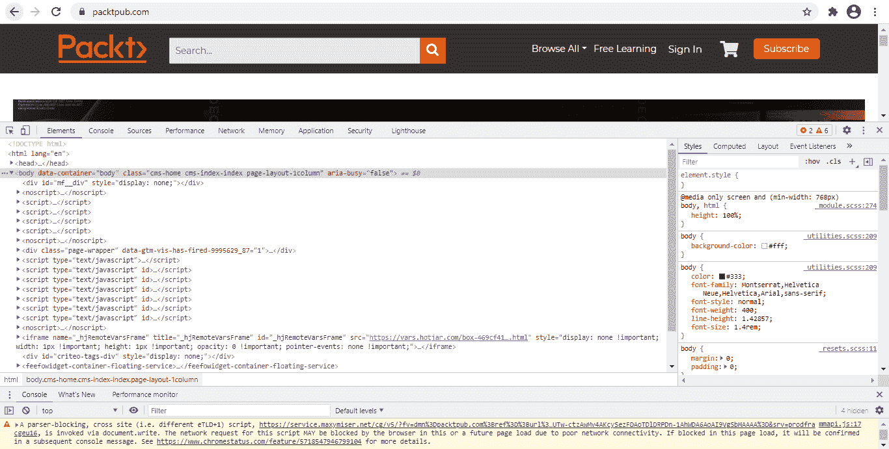
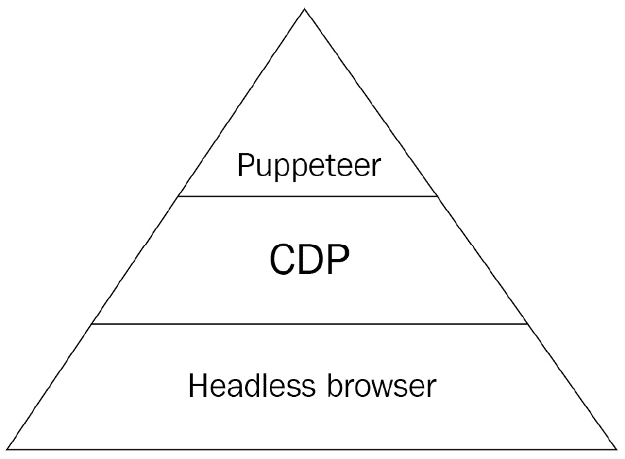
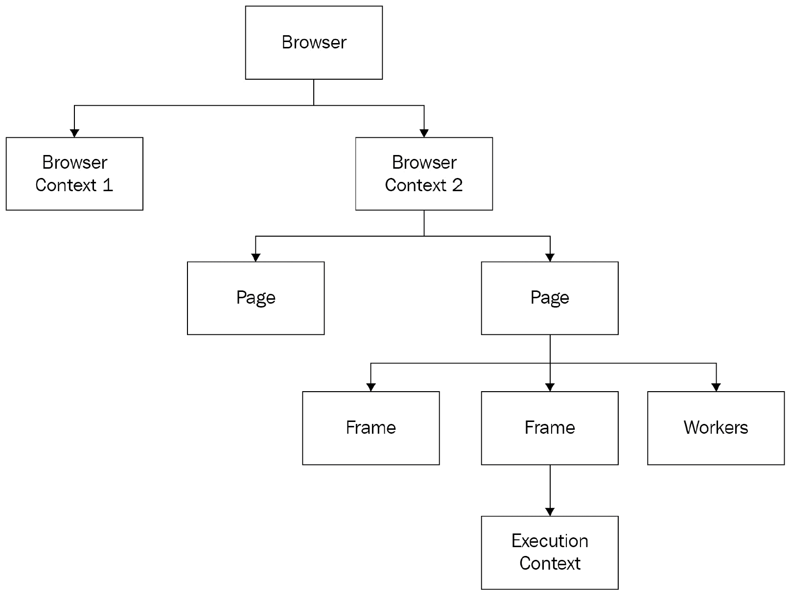
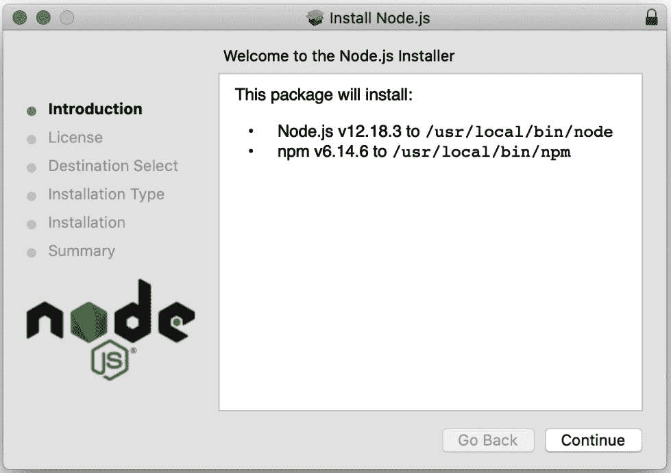
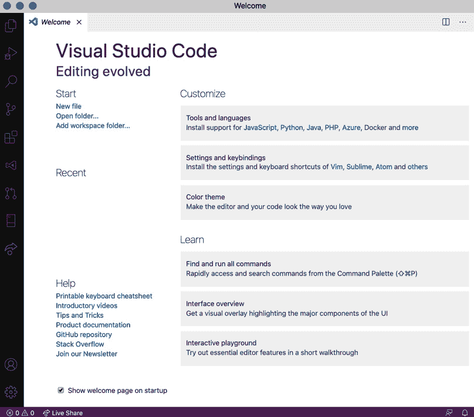
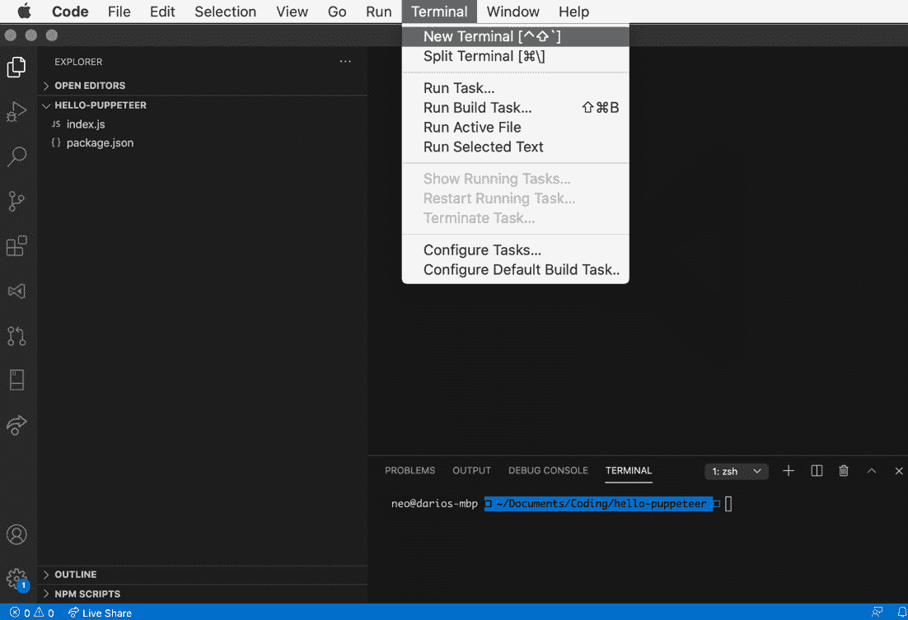
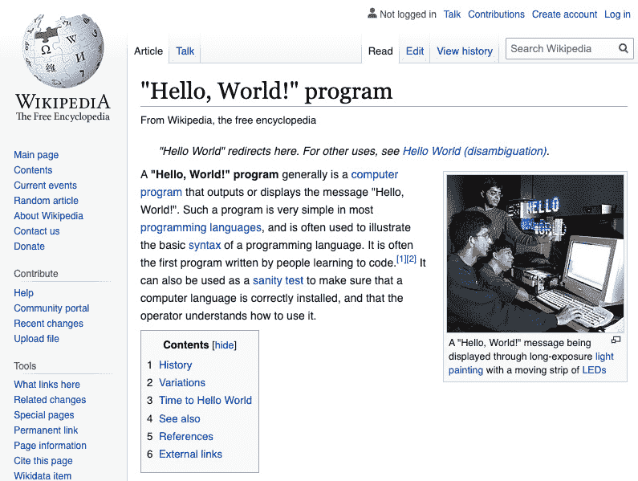
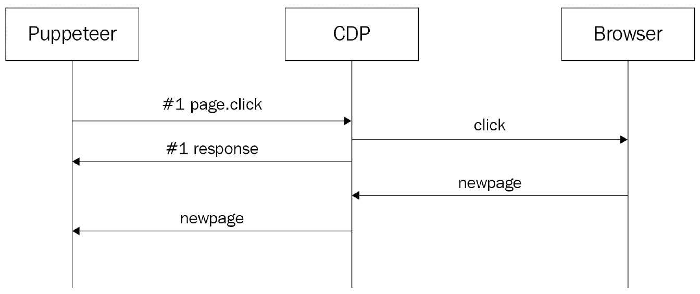

# 第一章：*第一章*：Puppeteer 入门

我记得第一次听说浏览器自动化。一个朋友告诉我，他们的 QA 团队正在使用“自动化”进行测试。这对我来说听起来很神奇。人们使用“自动化”测试网站。几年后，我了解到自动化并不是一种魔法药水，而是一种强大的工具，不仅适用于 QA，也适用于开发者，因为我们开发者喜欢自动化，对吧？

正因如此，在本章的第一部分，我想向你展示浏览器自动化是如何工作的，以及是什么让 Puppeteer 独一无二。在本章的后半部分，我们将回顾一些将在本书的其余部分以及你的自动化之旅中非常有用的异步技术。

本章将涵盖以下主题：

+   浏览器自动化是什么？

+   介绍无头浏览器

+   Puppeteer 用例

+   设置环境

+   我们的第一个 Puppeteer 代码

+   JavaScript 中的异步编程

# 浏览器自动化是什么？

如果你去维基百科上查找“自动化”这个词，它会告诉你它是指“一种需要最小人工辅助的过程或程序”。如果你是开发者，或者只是一个极客，我敢打赌你喜欢编写脚本来自动化任务。你也许还会创建环境变量，这样你就不必输入长的路径，甚至创建酷炫的 Git 命令，这样你就不需要记住创建新分支所需的所有步骤。

当我第一次得到我的 Mac 时，我发现了一个名为 Automator 的应用程序。我爱上了它。你可以通过拖放来自动化任务和连接应用程序。如果你使用 macOS 并且从未玩过 Automator，请尝试一下！但 Automator 并不是唯一的应用程序。市场上有很多工作流应用程序，例如 Hazel 或 Alfred。

自动化甚至存在于云中，并且对公众开放。例如，IFTTT 和 Zapier 这样的应用程序允许用户自动化日常任务。你可以创建自动化任务，比如“当我发布在 Instagram 上时，在 Twitter 上分享相同的图片”，这一切都可以通过你的手机完成。普通人进行自动化，这真是太棒了！

我们还有邮件规则。大多数邮件客户端，甚至是网页客户端，都允许你创建规则，这样你就可以根据条件标记邮件为已读，给它们贴标签，甚至删除它们。这也是自动化的一种。

也许你已经将它提升到了下一个层次，为你的日常任务编写了一个应用程序。你有一个每月需要发送给老板的报告。这个报告是许多 CSV 文件的结果。你只是写了一个小程序，使用你喜欢的语言为你生成这个报告。

简而言之，自动化意味着使用一个应用程序为我们执行重复性任务。正如我们所看到的，这并不一定涉及到编写该应用程序的代码。因此，现在我们可以这样说，**浏览器自动化就是告诉应用程序为我们自动在浏览器中执行重复性任务**。

好的，这是一个简单的声明。但这是如何实现的呢？当你自动化一个应用程序时，你将使用某种**应用程序程序接口**（**API**）来完成这个任务。例如，当你编写一个 bat/bash 文件时，你使用命令行参数作为接口。如果你使用 IFTTT，它使用 Twitter 和 Instagram 的 HTTP API 来获取图片并创建推文。你需要某种 API，某种与你要自动化的应用程序交互的方式。我们该如何与浏览器交互呢？这是一个好问题。

要使事情变得稍微复杂一些，我们还需要考虑我们有两个应用程序需要自动化：浏览器本身和网站。我们不仅想要打开浏览器，创建一个新标签页并导航到页面，我们还想要访问该页面并执行一些操作。我们想要点击按钮，或者在输入元素中输入一些文本。

自动化浏览器听起来很具挑战性。但幸运的是，我们有几位杰出的人士为我们做了出色的工作，并创建了像 Selenium 和 Puppeteer 这样的工具。

## Selenium 和 Puppeteer

在 Google 上快速搜索将显示，Selenium 是市场上最好的 UI 测试工具之一，如果不是**最好的**。我认为很多人可能会问的问题可能是：**为什么我应该选择 Puppeteer 而不是 Selenium？哪一个更好？**

你需要知道的第一件事是，Puppeteer 并不是为了与 Selenium 竞争而创建的。Selenium 是一个跨语言、跨浏览器的测试工具，而 Puppeteer 是为了作为一个多用途自动化工具而创建的，以利用 Chromium 的全部功能。我认为这两个都是伟大的自动化工具，但它们以两种不同的方式处理浏览器自动化。它们在两个重要的方面有所不同，这些方面定义了浏览器自动化库的目标受众：

+   工具与浏览器之间的接口

+   工具与用户之间的接口

让我们先来了解一下 Selenium 是如何工作的。

### Selenium 的方法

为了自动化市场上大多数浏览器，Selenium 编写了一个名为**WebDriver**的规范（一个 API），W3C 随后将其接受为标准（[`www.hardkoded.com/ui-testing-with-puppeteer/webdriver`](https://www.hardkoded.com/ui-testing-with-puppeteer/webdriver)），并要求浏览器实现该接口。Selenium 将使用这个 WebDriver API 与浏览器交互。如果你查看前一个 URL 上的论文，你会找到两个反复出现的词：**测试**和**简单**。换句话说，他们定义了一个专注于测试和简单的 API，并要求浏览器实现该接口。在我看来，跨浏览器测试是 Selenium 的主要功能。

什么是 API？

API 是一组类、函数、属性和事件，这些是我们可以使用库的方式。API 对于库的成功至关重要，因为它将决定你可以用它做什么以及与库交互的难易程度。

Selenium 向用户暴露的 API 也被视为 WebDriver 规范的一部分，它遵循相同的理念：专注于测试和简洁。这个 API 在用户和所有不同的浏览器之间提供了一个抽象层，并为开发者提供了一个易于使用的接口，以帮助他们编写测试。

### Puppeteer 的方法

Puppeteer 不需要考虑跨浏览器支持的问题。尽管有人尝试在 Firefox 上运行 Puppeteer，但重点在于获取 Chromium 的所有开发者工具并将其提供给用户。本着这个目标，Puppeteer 可以访问比 Selenium 使用的 WebDriver API 暴露的工具多得多的工具。

它们与浏览器通信的方式的差异也反映在 API 中。Puppeteer 提供了一个 API，将帮助我们充分利用 Chromium 的所有功能。我认为强调 Puppeteer 是用 JavaScript 创建的很重要，因此 API 会比来自跨语言哲学的 Selenium 的 API 感觉更自然。

Puppeteer 不需要请求任何人实现 API，因为它利用了 Chromium 的无头能力。现在让我们看看什么是无头浏览器。

# 介绍无头浏览器

什么是无头浏览器？不，它不是来自恐怖电影的东西。**无头浏览器是一种浏览器，你可以通过特定的协议和特定的通信传输启动并与之交互，而不涉及任何用户界面**。这意味着你将有一个活跃的进程（或者像我们今天所知道的，有多个进程），但将没有“窗口”供你与浏览器交互。我认为“无窗口浏览器”会更准确。

## 可用的无头浏览器

Chromium 和 Firefox 都支持无头浏览器模式。重要的是要提到，在撰写这本书的时候，Firefox 的无头模式仍然是实验性的。与 Selenium 提供的六个浏览器相比（[`www.hardkoded.com/ui-testing-with-puppeteer/selenium-browsers`](https://www.hardkoded.com/ui-testing-with-puppeteer/selenium-browsers)），这听起来可能不太好，但正如你可能已经注意到的，我没有说 Chrome，我说的是 Chromium。Chromium 是 Chrome 在底层使用的引擎。但 Chrome 并不是唯一使用 Chromium 的浏览器；在过去的几年里，许多浏览器开始使用 Chromium 引擎。以下是一些基于 Chromium 的浏览器的例子：

+   Google Chrome

+   微软 Edge，也称为 Edgium，为了避免与基于 Trident 的旧版微软 Edge 混淆

+   Opera

+   Brave

这要好得多。我们可以自动化至少五种浏览器。但是，有两个主要浏览器没有无头支持：Microsoft Internet Explorer 和 Safari。Safari 的情况很有趣。正如 Chromium 是 Chrome 背后的引擎一样，Webkit 是 Safari 的引擎，尽管 Safari 不支持无头模式，但为了测试目的，有一些带有无头支持的 Webkit 构建。Microsoft Playwright 有自己的 Webkit 构建以支持跨浏览器自动化。

你想第一次看到无头浏览器吗？

让我们试试这个：

如果你已安装 Chrome，请获取可执行文件的完整路径，并传递以下命令参数：`--headless --remote-debugging-port=9222 --crash-dumps-dir=/tmp`：

```js
~ % /Applications/Google\ Chrome.app/Contents/MacOS/Google\ Chrome --headless --remote-debugging-port=9222 --crash-dumps-dir=/tmp
```

小贴士

如果你是一名 macOS 用户，Chrome 可执行文件将位于“`Google Chrome.app`”伪文件中。正如你所见，它是：“`Google Chrome.app/Contents/MacOS/Google Chrome`”。

执行该命令后，你应在控制台得到类似以下内容：

```js
DevTools listening on ws://127.0.0.1:9222/devtools/browser/e7e52f93-8f1e-491c-b718-94ae7a8e81b7
```

现在，我们有一个通过 WebSocket 在`ws://127.0.0.1:9222`上等待命令的无头 Chrome 浏览器。

Firefox 也提供了无头模式：

```js
~ % /Applications/Firefox.app/Contents/MacOS/firefox --headless
*** You are running in headless mode.
```

它没有说太多，但请相信我，现在我们有一个在无头模式下运行的 Firefox 浏览器。

如我之前所述，无头浏览器没有用户界面。与浏览器交互的唯一方式是使用浏览器创建的传输方式，在本例中是 WebSocket，并通过某种协议发送消息。在 Chromium 和 Firefox 的情况下，它是 Chromium DevTools 协议。

## Chromium DevTools 协议

如果你是一名网页开发者，我 100%确信你已经使用过 Chrome DevTools。如果你不知道我在说什么，你可以通过点击右上角的三个点按钮打开 DevTools，然后转到“更多工具 > 开发者工具”。你将得到类似这样的东西：



Chrome DevTools

使用这个神奇的工具你可以完成的事情令人印象深刻：

+   检查 DOM。

+   评估 CSS 样式。

+   运行 JavaScript 代码。

+   调试 JavaScript 代码。

+   查看网络调用。

+   测量性能。

好消息是，是**Chromium 开发者协议**（从现在起我们将称之为**CDP**）驱动了大多数 DevTools 的功能。而且，同样的 CDP 也是无头浏览器用来与外界交互的协议。

CDP 听起来完美。我们可以与浏览器交互并完成我提到的所有事情。你可以创建一个 Node.JS 应用程序来启动浏览器，并通过 WebSocket 开始发送 CDP 消息，但这将相当复杂且难以维护。这就是 Puppeteer 发挥作用并提供与浏览器交互的人性化界面的地方。

## 介绍 Puppeteer

Puppeteer 不仅仅是一个知道如何打开浏览器、发送命令并响应来自该浏览器消息的 Node.js 包。在撰写本书时，Puppeteer 支持 Chromium 和 Firefox，但 Firefox 的支持仍被视为实验性的。我认为现在是时候去 Puppeteer 仓库 ([`www.hardkoded.com/ui-testing-with-puppeteer/puppeteer-repo`](https://www.hardkoded.com/ui-testing-with-puppeteer/puppeteer-repo)) 查看自那时以来是否有所变化了。

此外，还有一些社区项目在其他语言中实现了 Puppeteer。你可以找到 Puppeteer-Sharp ([`www.hardkoded.com/ui-testing-with-puppeteer/puppeteer-sharp`](https://www.hardkoded.com/ui-testing-with-puppeteer/puppeteer-sharp)) 用于 .NET 或 Pyppeteer ([`www.hardkoded.com/ui-testing-with-puppeteer/pypeteer`](https://www.hardkoded.com/ui-testing-with-puppeteer/pypeteer)) 用于 Python。

当你使用 Puppeteer 时，实际上你使用的不只是一个 JavaScript 库。许多人称之为“Puppeteer 雕像”：



Puppeteer 雕像

Puppeteer 雕像由三个组件组成：

+   无头浏览器是运行我们想要自动化的页面的引擎。

+   Chromium DevTools 协议允许任何外部用户与浏览器交互。

+   Puppeteer 提供了一个 JavaScript API，用于通过 CDP 与浏览器交互。

我认为 Puppeteer 价值所在的是其模型清楚地表示了浏览器结构：

## Puppeteer 对象模型



Puppeteer 模型

让我们看看这些对象在浏览器内部代表什么。

### 浏览器

浏览器是主要的类。它是 Puppeteer 连接到浏览器时创建的对象。这里的关键词是 **connect**。Puppeteer 将使用的浏览器可以由 Puppeteer 本身启动。但这也可能是已经运行在你本地机器上的浏览器，甚至可能是运行在云端的浏览器，如 Browserless.io ([`www.hardkoded.com/ui-testing-with-puppeteer/browserless`](https://www.hardkoded.com/ui-testing-with-puppeteer/browserless))。

### 浏览器上下文

一个浏览器可以包含多个上下文。上下文是一个浏览器会话（不要与浏览器窗口混淆）。最好的例子是隐身模式或私密模式，这取决于浏览器，它会在同一个浏览器进程中创建一个隔离的会话。

### 页面

页面是一个浏览器中的标签页，甚至是弹出页面。

### 框架

框架对象比看起来更重要。每个页面至少有一个框架，称为主框架。在这本书中我们将学习的大多数页面操作实际上是对主框架的调用；例如，`page.click` 调用 `mainframe.click`。

框架是一个树。一个页面只有一个主框架，但一个框架可以包含许多子框架。

### 工作者

工作者是与 Web Workers 交互的模型。这不是本书中我们将讨论的功能。

### 执行上下文

执行上下文是 Chromium 用来隔离页面和浏览器扩展的机制。每个框架都将有自己的执行上下文。内部，所有涉及执行 JavaScript 代码的框架函数都将使用执行上下文在浏览器内部运行代码。

涉及的其他对象还包括`ElementHandles`和`JSHandles`，但我们在本书的后面章节会讨论它们。

既然我们已经了解了一些 Selenium 和 Puppeteer 之间的区别，现在回顾 Puppeteer 的许多可能用例正是一个完美的时机。

# Puppeteer 用例

记住，Puppeteer 和 Selenium 之间的主要区别在于 Selenium 是为端到端测试设计的。相比之下，Puppeteer 被设计为一个 API，以利用 DevTools 的全部功能，这意味着除了端到端测试之外，还有其他可以使用 Puppeteer 的用例，正如我们现在将要看到的。

## 任务自动化

在网络上，我们做了许多可以自动化的工作。例如，你可以下载报告、填写表格或检查航班价格。你也可能想检查你网站的运行状况、监控其性能或检查你的网站是否运行正确。在*第六章**，执行和注入 JavaScript*中，我们将看到如何使用 Checkly 在生产环境中监控你的网站。

## 网络爬取

大多数库的作者可能不会愿意说你可以使用他们的库来进行网络爬取。网络爬取因其非法声誉而闻名。但在*第九章**，爬取工具*中，我们将看到如何正确地进行网络爬取，而不会遭到封禁或起诉。

## 内容生成

生成内容并不是如果你需要考虑可能的用例时，会想到的用例。但 Puppeteer 是一个生成两种类型内容的优秀工具：

+   **屏幕截图**：为什么你需要使用应用程序来截图呢？想想缩略图或预览。想象一下，你想创建一个付费墙，显示你网站内容的一部分，但以模糊图像的形式。你可以使用 Puppeteer 对你的网站进行截图，将其模糊处理，并使用那张图片。

+   **PDF 文件**：发票是 PDF 生成的绝佳例子。想象一下，你有一个电子商务网站。当用户完成购买时，你会向他们展示一个设计精美、布局合理的发票，但你需要通过电子邮件发送给他们那份确切的发票。你可以使用 Puppeteer 导航到那个发票页面并将其打印成 PDF。你也可以使用你的着陆页生成 PDF，并将其用作宣传册。

在*第七章**，使用 Puppeteer 生成内容*中，我们将讨论这个用例以及如何使用截图来编写 UI 回归测试。

## 端到端测试

我认为 Puppeteer 对于测试现代网络应用来说非常棒，因为它接近浏览器。API 感觉非常好，现代，并且是为 JavaScript 开发者设计的。它让你可以轻松执行 JavaScript 代码，并给你访问 Chromium 所有功能的权限。但我也必须说，Selenium 的端到端测试工具非常出色。Puppeteer 甚至无法与 Selenium Grid 提供的功能相提并论。选择哪个工具适合你取决于你自己。

理论已经足够了。现在是时候开始并设置我们的环境了。

# 设置环境

Node.js 和 Puppeteer 的好处是它们是跨平台的。我的本地环境是 macOS Catalina 10.15.6。但如果你使用 Windows 或 Linux 环境，你不会看到太大的区别。

时间是技术书籍的最大敌人。在撰写这本书的时候，我正在使用 Node.JS 12.18.3 和 Puppeteer 7。我非常确信，当你阅读这本书的时候，新的版本已经发布。但不要因此感到气馁；我们预期这种情况会发生。这就是为什么我鼓励你现在就去查看这本书的 GitHub 仓库（[`github.com/PacktPublishing/ui-testing-with-Puppeteer`](https://github.com/PacktPublishing/ui-testing-with-Puppeteer)）。如果你看到有什么东西不工作或者已经改变，请在那个仓库中创建一个 issue。我们将尽力保持其更新。

运行我们的第一个 Puppeteer 代码只需要两样东西：Node.JS 和 Puppeteer。让我们从 Node.JS 开始。

## Node.js

为了这本书的目的，你需要了解的关于 Node.js 的唯一一件事是，它是一个运行时，允许我们在浏览器之外运行 JavaScript 代码。

需要强调的是，我们想要自动化的网站不一定需要在 Node.js 上运行。你不需要知道编写网站的编程语言，也不需要知道网站运行的平台，但如果你能了解这些细节，这可能会给你一些编写更好的自动化代码的想法。例如，如果你知道该网站是一个 ASP.NET Webforms 项目，你就会知道它使用一些隐藏的输入来执行 postbacks。如果你了解客户端框架，如 Vue 或 React，这一点会更加明显。

如我之前提到的，我们将安装 Node.JS v12.18.3（或更高版本）。这个过程相当简单：

1.  前往官方网站：[`nodejs.org/`](https://nodejs.org/)。

1.  下载 LTS 版本。**LTS** 代表 **长期支持**。

1.  按照你通常在平台上安装的方式运行安装程序：




Node.js 安装

如果你想要查看安装是否成功，你可以在终端中执行 `node --version`：

```js
~ % node --version
v12.18.3
```

## Visual Studio Code

你不需要任何特殊的代码编辑器来编写 Node.js 应用程序。但 Visual Studio Code 是一个很好的编辑器。它是免费的，跨平台的，你不仅可以用它来编写 JavaScript 代码，还可以用它来编写许多其他语言的代码。

你可以在 [`code.visualstudio.com/`](https://code.visualstudio.com/) 下载它。它甚至不需要在 macOS 上运行设置。它只是一个你复制到 `Applications` 文件夹的应用程序：

![Visual Studio Code]



Visual Studio Code

现在我们已经安装了 Node.js 以及代码编辑器，我们可以创建我们的第一个应用程序。

# 我们的第一段 Puppeteer 代码

我们首先需要创建一个文件夹，我们的 `hello-puppeteer` 项目将位于该文件夹中。我将使用终端，但你可以使用你感到更舒适的方式。我们的项目将被称为 `hello-puppeteer`：

```js
> mkdir hello-puppeteer
> cd hello-puppeteer
```

我们现在需要初始化这个全新的 node.js 应用程序。在 node.js 中，我们使用 `npm init` 命令创建新应用程序。在这种情况下，我们将传递 `-y` 参数，这样它就会使用默认值创建我们的应用程序：

```js
> npm init -y
Wrote to /Users/neo/Documents/Coding/hello-puppeteer/package.json:
{
  "name": "hello-puppeteer",
  "version": "1.0.0",
  "description": "",
  "main": "index.js",
  "scripts": {
    "test": "echo \"Error: no test specified\" && exit 1"
  },
  "keywords": [],
  "author": "",
  "license": "ISC"
}
```

这个输出并没有说明太多。它显示它创建了一个包含一些默认值的 `package.json` 文件。现在，我将使用 `touch` 命令创建一个 `index.js` 文件。同样，你可以以你感到最舒适的方式执行此操作：

```js
> touch index.js
```

`touch` 应该已经创建了我们的应用程序的入口点。但在编码我们的应用程序之前，我们需要安装 Puppeteer。

## 安装 Puppeteer

大多数框架，如果不是所有框架，都有一种方式来发布和重用不同作者编写的组件。在 Node.js 中最流行的包管理器是 `npm init` 来创建我们的应用程序。由于 Puppeteer 是在 NPM 上发布的包，我们可以使用 `npm install` 命令下载和安装它。

如果你不想在应用程序之间跳转，你可以在 Visual Studio Code 内部打开一个终端。如果你还在终端中，你可以使用以下命令打开 Visual Studio Code：

```js
> code .
```

这将打开 Visual Studio Code。一旦进入，你将能够从 **终端** 菜单启动一个新的终端，如下面的截图所示：

![Visual Studio Code 内部的终端]



Visual Studio Code 内部的终端

打开终端后，我们可以使用 `npm install` 安装 Puppeteer：

```js
> npm install puppeteer@">=7.0.0 <8.0.0"
Downloading Chromium r848005 - 128 Mb [=========           ] 44% 5.3s
```

我想在这里强调两点。由于本书基于 `@">=7.0.0 <8.0.0"`，这意味着我们想要大于或等于 `7.0.0` 且小于版本 `8.0.0` 的最新 Puppeteer 版本。通过强制使用此版本，你将能够使用与我相同的版本来跟随本章中的示例。

Puppeteer 版本控制

Puppeteer 遵循 **语义化版本控制规范**（**SemVer**）来为其发布版本进行版本控制，这意味着版本号中的三个数字遵循一定的规则。主版本号（第一个数字）的变化意味着 API 中发生了重大变化。当一个包更改主版本号时，它会告诉你新版本可能会破坏你的代码。次版本号（第二个数字）的变化意味着他们添加了新功能，同时保持向后兼容。最后，修订号的变化意味着他们修复了一个错误，同时保持向后兼容。

如果你看到 Puppeteer 的版本是 8、9 或 10，这并不意味着这本书现在已经过时了。这意味着他们改变了某些东西，破坏了其他人的代码。例如，从版本 6 到版本 7 的变化只是他们在截图方式上做的一些改动。

在现实生活中，你可以使用可用的最新版本。其次，你可能已经注意到下载的包包含了一个特定的 Chromium 版本，在这个例子中是 `r848005`。这并不意味着你从互联网上下载的任何 Chromium 版本都无法与你的代码一起工作。但是，记住，Puppeteer 通过 Chrome DevTools 协议与浏览器交互，因此它需要一个 Puppeteer 预期的方式反应的 Chromium 版本。在 Puppeteer v7.0.1 的情况下，它需要 Chromium 90.0.4403.0，并且不能保证任何其他版本的 Chromium（无论是新版本还是旧版本）都能与你的当前 Puppeteer 版本一起工作。这并不意味着它不会工作。这意味着它没有保证。你需要进行实验并查看。你可以在 API 页面上检查每个 Puppeteer 版本应使用哪个 Chromium 版本（[`www.hardkoded.com/ui-testing-with-puppeteer/puppeteer-api`](https://www.hardkoded.com/ui-testing-with-puppeteer/puppeteer-api)）。

## Puppeteer 中的“Hello World”

每种语言都有自己的“Hello World”程序。Puppeteer 的“Hello World”程序将是导航到 [`en.wikipedia.org/wiki/%22Hello,_World!%22_program`](https://en.wikipedia.org/wiki/%22Hello,_World!%22_program) 并对页面进行截图。让我们看看它看起来会是什么样子：

```js
const puppeteer = require('puppeteer');
(async function() {
    const browser = await puppeteer.launch();
    const page = await browser.newPage();
    await page.goto('https://en.wikipedia.org/wiki/%22Hello,_World!%22_program');
    await page.screenshot({ path: './screenshot.png'});
    browser.close();
})();
```

这就是我们在这个小脚本中做的事情：

1.  我们使用 `require` 导入 Puppeteer 库。

1.  启动一个新的浏览器。

1.  在那个浏览器中打开一个新的页面（标签页）。

1.  导航到维基百科页面。

1.  捕获屏幕截图。

1.  关闭浏览器。

我喜欢 Puppeteer 开始使用起来既简单又容易。现在是时候运行它了。使用你用来运行 `npm install` 的相同终端，现在运行 `node index.js`：

```js
> node index.js
```

一个 Chromium 浏览器打开了，导航到维基百科，然后自行关闭。你没有看到它，因为这是一个无头浏览器，但它确实发生了。现在，如果你检查你的工作目录，你应该有一个名为 `screenshot.png` 的新文件：



屏幕截图

我们的代码按预期工作。我们从维基百科获得了我们的截图。

我敢打赌你注意到了在我们的小型 hello puppeteer 示例中使用了四个 **awaits**。异步编程在 Puppeteer 中扮演着重要角色。现在让我们来谈谈 JavaScript 中的异步编程。

# JavaScript 中的异步编程

通常，程序是同步运行的，这意味着每一行代码都是依次执行的。让我们以这两行代码为例：

```js
const x = 3 + 4;
console.log(x);
```

这两行代码将按顺序执行。`3 + 4` 的结果将被分配给 `x` 常量，然后使用 `console.log` 在屏幕上打印变量 `x`。`console.log` 函数必须在 `x` 被分配后才能开始执行。

但有些任务，比如网络请求、磁盘访问或任何其他 I/O 操作，可能需要很长时间，我们不一定想等待这些任务完成后再继续执行我们的代码。例如，我们可以开始下载一个文件，在文件加载的同时执行其他任务，然后在下载完成后检查该文件。异步编程将允许我们在不阻塞代码的情况下执行这些长时间运行的任务。

异步函数会立即返回一个 **Promise** 以避免在等待任务时阻塞你的代码。这个 Promise 是一个对象，它可以处于以下三种状态之一：

+   **Pending**：这意味着异步任务仍在进行中。

+   **Fulfilled**：这意味着异步任务成功完成了。

+   **Rejected**：这意味着异步任务失败了。

假设我们有一个名为 `downloadAFileFromTheInternet` 的函数。等待一个任务完成的常见方式是使用 `await` 关键字：

```js
await downloadAFileFromTheInternet();
```

需要强调的是，这里的 `await` 关键字并不是等待函数本身；它是在等待该函数返回的 `Promise`。这意味着你还可以将那个 `Promise` 赋值给一个变量，并在代码的稍后位置等待它：

```js
const promise = downloadAFileFromTheInternet();
// some code
await promise;
```

或者你也可以根本不等待这个 Promise：

```js
downloadAFileFromTheInternet();
```

如果你想了解更多关于异步 JavaScript 的知识，可以查看 Steven Hancock 的 *Asynchronous JavaScript Deep Dive* 视频教程（[`www.packtpub.com/product/asynchronous-javascript-deep-dive-video/9781800202665`](https://www.packtpub.com/product/asynchronous-javascript-deep-dive-video/9781800202665)）。

Puppeteer 依赖于异步编程技术，因为 Puppeteer 与 Chrome DevTools 之间的通信是异步的。毕竟，Chrome DevTools 与浏览器之间的通信也是异步的。想想当你点击一个链接时幕后会发生什么：



点击时间线

当你调用 `page.click` 时，该动作的结果不会立即出现。正如我们所见，幕后有许多事情在进行。当你调用 `page.click` 时，你需要做之前提到的事情之一：等待它；将承诺保存在变量中并在稍后等待它；或者根本不等待它。

现在我们对异步编程有了更多的了解，我想回顾一下本书中我们将使用的五个实用工具。

## Promise.all

`Promise.all` 是一个函数，它期望一个 promise 数组，并返回一个当 **所有** promise 都 **解决或拒绝** 时才会解决的 promise。是的，一个 promise 可以是解决的，成功完成，或者拒绝，这意味着它失败了。

一个常见的场景是点击一个链接，并等待页面导航到下一页：

```js
await Promise.all([
  page.click('a'), 
  page.waitForNavigation()
]);
```

这个 promise 将等待链接的点击和 `waitForNavigation` promise 被解决或拒绝。

## Promise.race

与 `Promise.all` 类似，`Promise.race` 期望一个承诺数组，但在这个情况下，只要**任何一个**承诺被解决，它就会解决。

典型用法是用于超时。我们想要截图，但只有当它少于 2 秒时：

```js
await Promise.race([
  page.screenshot(),
  new Promise((resolve,reject)=>{ 
    setTimeout(()=>{ 
      reject(new Error('Too long!!!'));},2000);
  })]);
```

在这种情况下，如果 `screenshot` 承诺超过 2,000 毫秒，数组中作为第二个元素的承诺将被**拒绝**，拒绝该承诺。

## 履行我们的承诺

你在我们的上一个例子中看到了如何创建一个承诺，返回那个承诺或将其分配给一个变量，然后履行它。

当你想要等待一个事件发生时，这很棒。我们可以创建一个承诺，当页面关闭时它将被解决：

```js
const promise = new Promise((x) => page.on('close', x));
// …
await promise;
```

这种 `await` 是相当危险的。如果承诺永远不会解决，你的代码将会挂起。我建议使用这些承诺与 `Promise.race` 和超时一起使用。

在这本书中，我们将看到许多承诺。也许现在一些像“履行我们的承诺”这样的食谱看起来很奇怪，但我们会大量使用它们。

# 摘要

在第一章中，我们涵盖了大量的内容。我们学习了浏览器自动化以及 Selenium 和 Puppeteer 之间的区别。然后我们看到 Puppeteer 不仅限于端到端测试，并回顾了一些用例场景。然后我们亲自动手编写了我们的第一个 Puppeteer 脚本。在章节的最后部分，我们介绍了许多我们将在本书中使用的异步技术。

在下一章中，我们将专注于端到端测试。我们将回顾市场上可用的工具，并考虑如何组织我们的代码以创建可靠的端到端测试。
