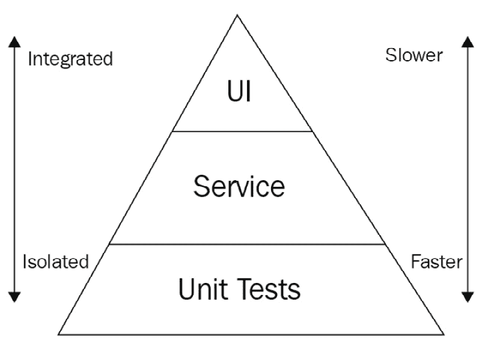
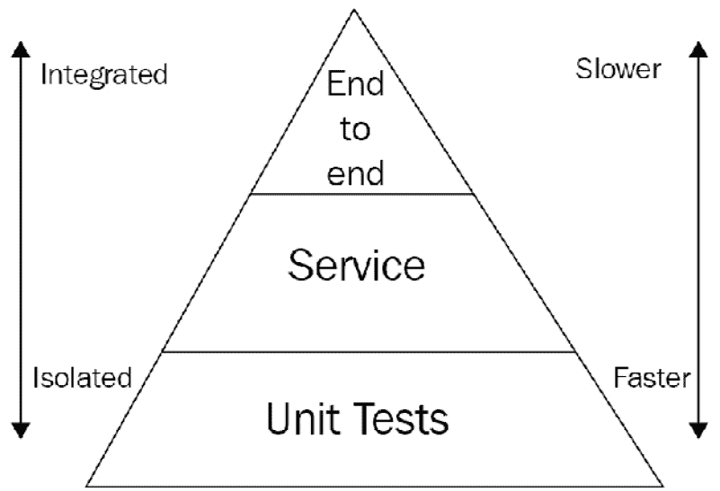
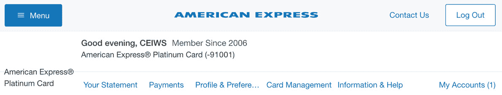
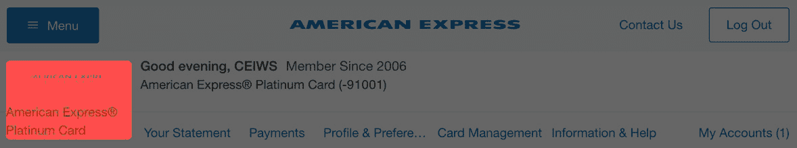
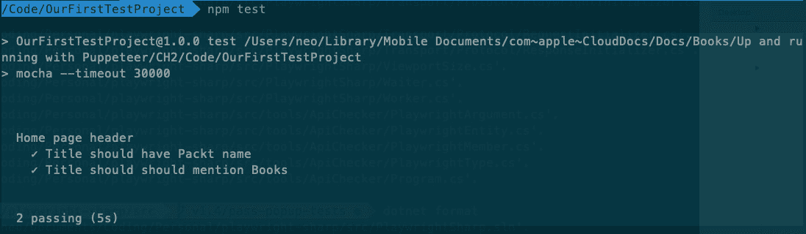

# 第二章：*第二章*：自动化测试和测试运行器

在 *第一章* *使用 Puppeteer 入门* 中，我们介绍了这本书的第一个基本支柱：浏览器自动化和无头浏览器。在本章中，我们将介绍第二个支柱：UI 测试。我们了解到 Puppeteer 不仅关于测试，但这并不意味着它不是一个出色的工具。

在本章中，我们将学习测试自动化的基础知识。我们将看到 UI 测试和端到端测试之间的区别。如果你之前尝试在 Node.js 中编写测试，你可能遇到过一些奇怪的名字：Mocha、Jest、Jasmine、AVA 或 Chai。如果你不习惯这些工具，这会感觉相当令人不知所措。我们将看到哪些工具适合我们。

本章我们将涵盖以下主题：

+   自动化测试简介

+   测试运行器主要功能

+   可用的测试运行器

+   创建我们的第一个测试项目

+   组织我们的代码

一旦我们理解了这些基础概念，并学习了测试运行器的工作原理，我们就能深入探索 Puppeteer API。

# 技术要求

你将在 GitHub 仓库（[`github.com/PacktPublishing/UI-Testing-with-Puppeteer`](https://github.com/PacktPublishing/UI-Testing-with-Puppeteer)）的 `Chapter2` 目录下找到本章的所有代码。

# 自动化测试简介

测试是软件开发中的基本任务。即使你认为自己是糟糕的测试员，或者甚至糟糕的开发者，当你编写你的应用程序时，你也会进行一些测试。至少，你会打开应用程序以查看它是否按预期工作。

可能你稍微有点条理性，你有一个测试计划，至少在你的脑海中。你知道当你编写表单时，你必须验证一些常见的场景：

+   尝试保存一个空字段的表单。

+   尝试使用良好数据保存。

+   尝试输入错误的数据。你可能会在数字字段中输入文本，无效的日期等等。

经验更丰富的开发者将涵盖所有可能的场景。他们将根据这些场景编写代码，然后相应地进行测试。

然后我们来到了这本书中推动性的词汇：我们**自动化**事物。我们希望自动化我们的测试。我们不想忘记任何场景或不得不反复测试同一件事。

正如你将注意到的，我还没有提到**质量保证**（**QA**）分析师，因为我想强调测试不是仅限于 QA 团队的事情。参与测试过程的人包括以下：

+   后端开发者

+   前端开发者

+   QA 分析师

+   经理（产品或项目经理）

我们需要知道存在不同类型的测试。某些类型的测试将由开发人员和 QA 分析师执行。其他测试将专门针对开发人员或 QA 分析师。

Mike Cohn 在他的书 *Succeeding with Agile*（Addison-Wesley Professional）中介绍了他非常受欢迎的测试金字塔：



Mike Cohn 的测试金字塔

尽管迈克的书籍已经超过 10 年了，但这个金字塔仍然有效。

这个金字塔基于三个特征：

+   测试数量

+   独立性

+   速度

我只有一件事反对这个金字塔：这个词**UI**。现代应用程序越来越依赖于客户端代码，“UI”代码。例如 React、Angular 和 Vue.js 这样的框架允许开发者编写可重用的组件。现在许多应用程序的大部分业务规则都在客户端运行。

前端开发者不应该局限于这个金字塔的顶端。他们应该能够为他们自己的 UI 代码编写单元测试和服务测试。这可能看起来是一个小的变化，但我认为这很重要。随着这种范式转变，我们得到了一个看起来是这样的金字塔：



新金字塔

现在我们有了更好的理解，让我们来谈谈这个金字塔的不同层级。

## 单元测试

单元测试是金字塔的基础。你在单元测试中覆盖的业务逻辑越多，你将需要覆盖的服务或 UI 测试的地面就越少。

正如我们在金字塔中可以看到的，单元测试需要**快速且独立**。这意味着一个好的单元测试不应该依赖于环境或任何其他功能。有时候说起来容易做起来难。例如，如果你想测试发票的总金额等于其项目的总和，你应该能够在代码中测试这个特定的功能，而不需要启动一个 web 服务器或从数据库获取数据。

### 哪些角色使用单元测试？

**后端开发者**：当然，单元测试是为他们准备的。如果可能的话，他们会遵循**测试驱动开发**（**TDD**）的过程。TDD 是软件开发中的一种技术，其中测试是在编写任何源代码之前编写的。一旦编写了测试，开发者将编写源代码以使它们通过。

**前端开发者**：在以前，编写单元测试几乎是不可行的。如果没有合适的工具，你就不能正确地完成你的工作。但现在，许多现代库支持单元测试。如果你使用 React 和 Redux，你会发现 Redux 有为你组件编写单元测试的方法（https://www.hardkoded.com/ui-testing-with-puppeteer/redux-unit-tests）。

这还不是全部。同样地，后端开发者需要考虑如何使他们的代码可测试，如果前端开发者使用现代框架开始创建小型且可测试的组件，**他们应该能够使用 Puppeteer 来编写 UI 单元测试**。这就是为什么测试金字塔顶部的“UI”不再有任何意义。现在我们可以编写**UI 单元测试**。

我们可以运行一个小测试，渲染一个组件并测试，例如，它“渲染一个文本框，当我输入一个值时，下面的标签会改变”，或者“如果我传递一个包含 10 个项目的列表，将渲染 10 个元素。”

*我们将 UI 测试移到了测试金字塔的底部。*

**质量分析师**目前还没有参与。单元测试是关于测试内部代码的。

那么关于**经理**呢？如果你是开发者，我相信你会把这段话展示给你的老板。经理不会编写单元测试，但他们需要知道编写单元测试和投入时间的重要性。

这些是你（或你的老板）需要了解的四个好处。

#### 单元测试展示了代码的工作方式

单元测试解释了代码的工作方式。当我审查代码时，我首先审查单元测试。如果我发现单元测试写着，例如，“*创建订单应该发送电子邮件*”。我可以先阅读这个测试，然后检查这个规则是如何实现的。

业务分析师或项目经理可以阅读这些测试，看看是否有任何未覆盖的场景或缺失的验证。

#### 单元测试使重构成为可能

我使用“可能”这个词是冒了点风险。但我相信这是真的。如果你没有单元测试来支持你的更改，你就不能重构你的代码。记住，重构是在不改变特定输入结果的情况下改变代码的实现。单元测试保证了这一点。

#### 单元测试防止回归

**回归是应用程序预期行为的不自觉变化**。如果我们有一套好的测试，它们将防止我们在实现新功能或修复错误时破坏应用程序的任何行为。

我如何确保其他开发者不会来破坏我刚刚编写的宝贵功能？通过编写单元测试。单元测试是你未来版本的自己，强制执行代码应该如何工作。“*创建订单应该发送电子邮件*”——没有人能够打破这个规则。

当我审查代码时，单元测试的变化对我来说是一个红旗。我并不是说单元测试不应该改变。但如果一个测试改变了，必须有解释。现在，“*创建和排序应该发送电子邮件*”显示发送的电子邮件计数为 2。这是正确的吗？我们还要发送另一封电子邮件吗？或者我们遇到了回归？请注意单元测试的变化。

测试金字塔上升的时间。

## 服务测试

服务测试也被称为**集成测试**。这些测试将检查你的代码如何与其他组件交互。当我们谈论组件时，我们指的是以下内容：

+   数据库

+   应用程序中的其他组件

+   外部服务

前端开发者还需要将他们的代码与以下内容集成：

+   其他 UI 组件

+   CSS 文件

+   REST API

正如我们之前提到的，当我们上升测试金字塔时，测试会变得**更慢且更不稳定**。这是应该的。你将连接到真实的数据库或与真实的 REST API 交互，这将使用真实的网络调用。这也意味着你的测试将期望环境以某种方式响应。例如，你期望数据库有一些数据集准备好使用，或者 REST API 可用。

这就是为什么在单元测试层有更多测试，你就不需要编写太多的集成测试。

让我们以发送电子邮件的类为例，你能为它编写一个集成测试吗？当然可以。你设置一个本地电子邮件服务器，它会将电子邮件写入一个临时文件夹，因此在你创建订单后，你可以检查那个文件夹，看看电子邮件服务器是否处理了你应用应该发送的电子邮件。但是，正如你所看到的，这类编排比小型单元测试更难编写。

为什么我们需要集成测试？为什么我们只编写单元测试而不编写集成测试？

好吧，你需要测试你的集成。你的代码不会在孤立的环境中运行。如果你正在测试后端，你需要看到数据库如何响应你插入的数据，或者一个 SQL 查询是否返回了你预期的数据。

如果你是一名前端开发者，你将在这里投入大部分时间，检查你的组件如何在页面上交互，或者生成的 HTML 如何影响 DOM 中的其他元素。你需要测试你的组件如何与真实的 REST 端点渲染，而不是使用虚拟的 JSON 文件。

### 哪些角色使用集成测试？

`CreateOrder`，我得到了一个新的`Order`对象。但现在，我需要测试当我向`/orders`发送`POST`请求时，数据库中是否创建了一个订单。

**前端开发者**将创建测试以检查页面上所有不同的组件如何相互交互。再次强调，这是在测试金字塔中的 UI 测试。

**质量保证分析师**将创建与后端和前端开发者创建的测试类似的测试，但视角不同。

*开发者和质量保证分析师创建相同类型的测试，但视角不同。*

开发者将创建测试以支持他们的工作，这样他们就可以检查是否破坏了任何东西。而且，正如我们之前提到的，他们需要测试以便将来能够重构代码。

*质量保证分析师将创建测试以确保应用程序质量符合利益相关者。*

质量保证分析师可以在这一层实现一种有趣的测试类型：**视觉回归测试**。这些测试在我们想要检查应用程序样式是否发生了任何视觉变化时使用。我们不想检查是否有按钮，或者那个按钮是否工作。我们想检查按钮看起来是否和之前一样。我们如何实现这一点？通过比较图像。这种技术基于以下四个步骤：

1.  我们截取一个作为基准的屏幕截图：

    基准图像

1.  我们在代码中进行了变更。

1.  我们再次截取屏幕截图：

    变更后的图像

1.  我们比较这两张图像：



差异

这种类型的测试可能相当不稳定。我敢打赌，你看到过页面在加载时有时会“移动”，所以你必须非常确定页面何时准备好截图。但这是可以做到的。另一个缺点是，对于你得到的每一个错误，你必须分析这个更改是否是回归（一个错误做出的更改）或者我们是否处于**新的基线**的存在。

**管理者**的角色仍然很重要。他们需要为开发者提供实施所需集成测试的工具和时间。他们还将帮助 QA 分析师确定要测试的集成。

因此，我们来到了金字塔的顶端，**端到端**测试。

## 端到端测试

你也可能发现这些测试被称为**E2E**测试。端到端测试的目标是确保应用程序在整个工作流程中按预期工作。大多数应用程序将会有多个工作流程。这意味着它将需要多个端到端测试来覆盖所有可能的工作流程或场景。

让我们以购物车应用为例。这些可能是我们的测试：

+   单元测试：

    a) 传递一个购物车对象，`AddToCart`组件渲染一个“查看购物车”链接，如果产品在数组中。

+   集成测试：

    a) 前往产品页面并点击“添加到购物车”。链接变为“查看购物车”。

    b) 前往结账页面。点击**结账**按钮后，它会被禁用。

+   一个测试购物车流程的端到端测试：

    a) 前往产品页面，点击**添加到购物车**，然后点击**查看购物车**。

    b) 你应该到达结账页面。点击**结账**。

    c) 你应该被重定向到收据页面。

    d) 收据应该显示添加到购物车的产品。

    e) 价格应该是产品价格。

我们处于金字塔的顶端。这意味着这将是最**慢**和最**不稳定**的测试。

为什么是最不稳定的？检查工作流程。那里可能会发生许多不好的事情。添加到购物车端点可能比预期的要花更多的时间。滚动到**结账**按钮可能因为仅仅几像素的失败而失败。您的数据库可能处于意外的状态。也许用户已经购买了该产品，所以**添加到购物车**按钮没有被启用。

关于角色呢？

这是**质量分析师**的领域。这是他们需要利用 Puppeteer 提供的所有功能来制作可靠测试的地方。但**开发者**也扮演着重要的角色，帮助 QA 团队高效地完成工作。正如我们将在下一章中看到的，开发者可以留下提示，以便 QA 团队能够找到他们需要的组件。

我希望金字塔的图片现在更清晰了。我们需要大量的小型和隔离的单元测试，许多集成测试来测试我们的页面，最后，一组良好的端到端测试，检查工作流程的健康状况。

这是著名的测试金字塔，但我们如何编写测试？在哪里编写它们？我们如何运行测试？

首先，我们需要了解测试运行器需要我们提供什么。

# 测试运行器功能

没有测试运行器，世界会是什么样子？假设你不知道什么是测试运行器，而你想编写一个单元测试。这可能吗？我认为是可能的。例如，假设我们有一个小的`Cart`类：

```js
class Cart {
    constructor() {
        this._cart = [];
    }
    total() {
        return this._cart.reduce((acc, v) => acc + v.price, 0);
    };
    addToCart(item) {
        this._cart.push(item);
    };
}
module.exports = Cart;
```

如果我们想测试它，我们可以运行一些像这样的代码：

```js
const Cart = require('./cart.js');
const c = new Cart();
c.addToCart({ productId: 10, price: 5.5});
c.addToCart({ productId: 15, price: 6.5});
if(c.total() !== 12)
    console.error('Nooo!!!');
else
    console.log('Yes!!!!!');

```

测试基本上是一段测试我们代码的代码。这会工作吗？是的。这是一个单元测试吗？是的。它会扩展吗？绝对不会。这个文件将变得巨大且难以维护。跟踪失败的任务将是不可能的。我们需要一个工具来帮助我们扩展，并帮助我们保持测试的可维护性。我们需要一个测试运行器。

在探索可能的测试运行器之前，我想回顾一下我们对测试运行器的期望。我们需要在测试运行器中具备哪些功能？

#### 易于学习和运行

我们有很多东西要学习。我们需要学习 Node 和 React；我们甚至不得不买一本关于 Puppeteer 的书。我们希望有一个简单易用的测试运行器。

#### 按功能分组测试

我们希望将测试按功能、组件或工作流程分开。大多数测试运行器都有一个`describe`函数，帮助我们分组测试。

#### 如有必要，忽略测试

如果测试变得嘈杂，我们希望跳过测试，但我们不想删除它。

#### 只运行一个测试

在调试时，能够只运行一个测试非常重要。想象一下，你有超过 1,000 个测试（是的，你将会有超过 1,000 个测试）。如果你想修复仅一个测试，你不想运行所有这些测试。你只想运行你正在工作的那个。

#### 断言

断言是必不可少的。断言是一个表达式，用于检查我们正在测试的程序是否按预期工作。你还记得我用来检查购物车是否按预期工作的`console.log`和`console.error`吗？嗯，断言比那要好得多。我们想用断言检查什么？这是一个可能的列表：

+   一个值是否等于测试值。

+   一个值是否为 null 或非 null。

+   字符串或列表是否包含一个值。我们可能有一个巨大的文本块，我们只想检查它是否包含某些字符串，或者数组中的某个项。

+   我们是否预期某些东西会失败，因为有时，我们可能会预期某些代码会失败。

#### 设置和清理环境的工具

在开始测试之前，我们需要确保我们的应用程序处于某种状态。例如，在购物车测试中，我们希望在开始测试之前确保客户尚未购买该产品。

还有一些可能需要执行的技术设置。在我们的案例中，我们需要在每个测试之前准备好 Puppeteer 和浏览器。

另一个重要的概念是，测试应该是独立的，并且彼此分离。这意味着一个测试的结果不能影响其他测试。这就是为什么，在大多数情况下，需要在每个或所有测试之后进行清理。

#### 报告

我们想查看哪些测试通过了，哪些测试失败了。我们期望测试运行器至少在终端中显示一份良好的报告。如果我们能够以其他格式获取结果，比如 JSON、XML 或 HTML，那就更好了。

我们还可以提到很多其他功能，但这些是我们开始之前需要了解的最重要功能。

现在我们来看看市场上有哪些测试运行器能够满足我们提出的要求。

# 可用的测试运行器

网球拍有很多种类型。有些拍子能给你更多的控制力。其他拍子能给你更多的力量。如果你刚开始学习如何打网球，你不会感觉到任何区别。如果你比较一把便宜的拍子和一把专业的拍子，你会有感觉。但你不会说出为什么一个比另一个好。你只能说它“感觉更好”。

测试运行器也是一样。有些测试运行器提供一些功能。其他运行器提供其他功能。但对我们来说，现在最重要的是找到一个提供所有必需功能的测试运行器，以便我们编写自动化测试。

另一个需要提到的重要事情是，这本书不是关于“使用 Puppeteer 与 X”。在这一章之后，我们将选择一个测试运行器，但这不需要是你使用的测试运行器。想法是你可以选择最适合你的，或者你团队目前正在使用的。也有可能在你阅读这本书的时候，一个更好的测试运行器已经变得流行。你应该能够将你在本书中学到的概念应用到那个测试运行器上。

这些是目前市场上最常见的测试运行器。

### Jest

根据 Jest 网站([`jestjs.io/`](https://jestjs.io/))的介绍，“*Jest 是一个简单易用的 JavaScript 测试框架，专注于简洁性*。”非常不错的介绍。Facebook 维护这个项目，目前在 GitHub 上拥有超过 32,000 个星标。我并不是说这是使一个项目成为好项目的因素，但了解一个项目背后的团队及其社区支持水平是一些需要考虑的事情。

Jest 拥有我们之前提到的所有功能，比如使用`describe`进行分组测试，每个测试都是一个`it`或`test`函数。你可以使用`describe.skip`、`it.skip`或`test.skip`来跳过测试。你可以使用`describe.only`、`it.only`或`test.only`来运行单个测试。你还有`beforeEach`、`afterEach`、`beforeAll`和`afterAll`，用于运行设置和清理代码。

它还有一些与其他运行器区分开来的特性。它有一个**快照**工具。快照工具会处理一个 React 组件，并以 JSON 的形式返回某种 DOM 表示，这将允许我们测试由组件创建的 DOM 是否发生了变化。这是不是一种 UI 测试？当然是的！

在评估测试运行器时，还需要考虑可用的插件。例如，有一个名为**jest-puppeteer**的包，它帮助我们集成测试与 Puppeteer。你不需要使用**jest-puppeteer**。它只是一个辅助工具。

还有一个名为**jest-image-snapshot**的包，由美国运通维护，它提供了一套工具来执行视觉回归测试。在这种情况下，如果你想编写视觉回归测试，我建议你使用这些包之一。管理所有的截图基线可能相当繁琐。

### Mocha

Mocha 是另一个流行的框架。它是一个拥有超过 19,000 颗星的社区项目。值得一提的是，Puppeteer 团队使用 Mocha。

Mocha 也有像 Jest 一样的函数。它有一个`describe`函数来分组测试。测试是`it`函数。你可以使用`describe.skip`或`it.skip`跳过函数，使用`describe.only`或`it.only`来运行单个测试。你还有`beforeEach`、`afterEach`、`beforeAll`和`afterAll`，来运行设置和清理代码。

你也会发现许多针对 Mocha 的插件。你可以找到**mocha-puppeteer**和**mocha-snapshots**。

你在网上会经常看到的一个食谱是 Mocha + Chai。**Chai**是一个断言库，它扩展了测试运行器提供的断言。它让你能够以非常具体的方式表达断言：

```js
foo.should.be.a('string');
foo.should.equal('bar');
foo.should.have.lengthOf(3);
tea.should.have.property('flavors').with.lengthOf(3);
```

还有许多其他的测试运行器，例如由 Pivotal Labs 开发的 Jasmine，拥有超过 15,000 颗星，AngularJS 团队开发的 Karma，拥有超过 11,000 颗星，还有社区项目 AVA，拥有超过 18,000 颗星，列表还在继续。

正如我在本节开头提到的，我们只需要一个好的网球拍，也就是说，一个好的测试运行器。当你成为专家时，你将能够从一个测试运行器切换到适合你需求的另一个测试运行器。为了本书的目的，我们将使用**Mocha + Chai**。

# 创建我们的第一个测试项目

我们将创建一个 Node 应用程序，就像我们在*第一章*中创建我们的第一个应用程序一样，*使用 Puppeteer 入门*。我们将创建一个名为`OurFirstTestProject`的文件夹（你将在*技术要求*部分提到的`Chapter2`目录中找到这个目录），然后在那个文件夹内执行`npm init -y`：

```js
> npm init -y
```

响应应该是这样的：

```js
{
  "name": "OurFirstTestProject",
  "version": "1.0.0",
  "description": "",
  "main": "index.js",
  "scripts": {
    "test": "echo \"Error: no test specified\" && exit 1"
  },
  "keywords": [],
  "author": "",
  "license": "ISC"
}
```

现在是时候安装我们将要使用的包了：

+   Puppeteer 7

+   Mocha（任何版本）

+   Chai（任何版本）

让我们运行以下命令：

```js
> npm install puppeteer@">=7.0.0 <8.0.0"
> npm install mocha
> npm install chai
```

对于这个第一个演示，我们将使用网站[`www.packtpub.com/`](https://www.packtpub.com/)作为测试用例。让我们保持我们的测试简单。我们想要测试页面标题是否为*Packt | Programming Books, eBooks & Videos for Developers*。

重要提示

我们用于此测试的网站可能已经改变。在测试此代码之前，请访问 [`www.packtpub.com/`](https://www.packtpub.com/) 并检查标题是否仍然相同。这就是为什么在接下来的章节中，我们将下载网站到本地，以避免这些可能的问题。

我们提到我们会使用 `describe` 来分组我们的测试。但将测试分离到不同的文件中也会帮助我们整理代码。你可以选择每个文件中有一个或多个 `describe` 函数。让我们创建一个名为 `home.tests.js` 的文件。我们将把所有与主页相关的测试放在那里。

虽然你可以在任何你想的地方创建文件，但 Mocha 默认会抓取 `test` 文件夹中的所有测试，所以我们将创建一个 `test` 文件夹，然后在其中创建 `home.test.js` 文件。

我们将会有以下内容：

+   `home.tests.js` 包含主页测试

+   一个带有标题测试的 `describe` 函数

+   一个测试 `"Title should have Packt name"` 的 `it` 函数。

+   另一个测试 `"Title mention the word Books"` 的 `it` 函数。

结构应该看起来像这样：

```js
const puppeteer = require('puppeteer');
const expect = require('chai').expect;
const should = require('chai').should();
describe('Home page header', () => {
    it('Title should have Packt name', async() => {
    });
    it('Title should mention Books', async() => {
    });
});
```

让我们分解这段代码：

1.  我们在第 1 行导入了 Puppeteer。

1.  第 2 行和第 3 行是关于导入不同类型的断言样式，`expect` 没有使用括号，而 `should` 使用了。我们现在不需要知道为什么。但为了清楚起见，这不是一个错误。

1.  那么 Mocha 呢？我们遗漏了 Mocha 吗？嗯，Mocha 是测试运行器。它将是我们在 `package.json` 中稍后要调用的可执行文件。我们不需要在我们的代码中使用它。

1.  很有趣地看到，`describe` 和 `it` 都只是接受两个参数的简单函数：一个字符串和一个函数。你能将一个函数作为参数传递吗？是的，你可以！

1.  我们传递给 `it` 函数的函数是 `async`。我们无法在未标记为 `async` 的函数中使用 `await` 关键字。记住，Puppeteer 很大程度上依赖于异步编程。

现在我们需要启动一个浏览器并设置所有这些测试需要运行的环境。我们可以这样做：

```js
it('Title should have Packt name', async() => {
    const browser = await puppeteer.launch();
    const page = await browser.newPage();
    await page.goto('https://www.packtpub.com/');
    // Our test code
    await browser.close();
});
```

小贴士

现在不要尝试学习 Puppeteer API。我们将解释所有这些命令是如何在 *第三章* *浏览网站* 中工作的。

这段代码将完美运行。然而，有两件事可以进行优化：

+   我们会一遍又一遍地重复相同的代码。

+   如果测试过程中出现失败，浏览器不会关闭，留下很多打开的浏览器。

为了避免这些问题，我们可以使用 `before`、`after`、`beforeEach` 和 `afterEach`。如果我们将这些函数添加到我们的测试中，这将是我们执行的顺序：

+   `before`

+   `beforeEach`

+   `it('Title should have Packt name')`

+   `afterEach`

+   `beforeEach`

+   `it('Title should mention Books')`

+   `afterEach`

+   `after`

这不是一个规则，但我们可以在这种情况下这样做：

1.  `before`：启动浏览器。

1.  `beforeEach`：打开一个页面并导航到 URL。

1.  运行测试。

1.  `afterEach`: 关闭页面。

1.  `after`: 关闭浏览器。

这些**钩子**，这就是 Mocha 称这些函数的方式，看起来是这样的：

```js
let browser;
let page;
before(async () => {
    browser = await puppeteer.launch();
});
beforeEach(async () => {
    page = await browser.newPage();
    await page.goto('https://www.packtpub.com/');
});
afterEach(async () => {
    await page.close();
});
after(async () => {
    await browser.close();
});
```

这里要提到的一点是，我们可以执行所谓的`await` `page.close()`或`browser.close()`的结果。所以，我们可以这样做：

```js
afterEach(() => page.close());
after(() => browser.close());
```

这不是我喜欢做的事情，因为如果某处失败，你希望知道在哪里以及为什么。但既然这只是测试的清理代码，不是生产代码，我们可以承担这个风险。

现在我们的测试已经打开了一个浏览器，读取了我们想要测试的 URL 的页面。我们只需要测试标题：

```js
it('Title should have Packt name', async() => {
    const title = await page.title();
    title.should.contain('Packt');
});
it('Title should should mention Books', async() => {
    expect((await page.title())).to.contain('Books');
});
```

我在这里使用了两种不同的风格。

在第一种情况下，我将`title`异步函数的结果赋值给一个变量，然后使用`should.contain`来检查标题是否包含单词*"Packt"*。在第二种情况下，我只是评估了`((await page.title())`。我在那里添加了一些额外的括号以供说明。你不会在最终的示例中看到它们。

第二个区别是，在第一种情况下，我使用的是**should**风格，而在第二种情况下，我使用的是**expect**风格。结果将是相同的。这仅仅关乎哪种风格让你感觉更舒适，或者对你来说更自然。甚至还有一个第三种风格：**assert**。

我们已经拥有了运行测试所需的一切。还记得`npm init`为我们创建了一个`package.json`文件吗？现在是时候使用它了。让我们设置`test`命令。你应该有类似这样的内容：

```js
"scripts": {
  "test": "echo \"Error: no test specified\" && exit 1"
},
```

我们需要告诉`npm`运行`npm test`：

```js
"scripts": {
  "test": "mocha"
},
```

是时候运行我们的测试了！在终端中运行`npm test`：

```js
npm test
```

我们应该会有第一个错误：

```js
  1) Home page header
       "before each" hook for "Title should have Packt name":
     Error: Timeout of 2000ms exceeded. For async tests and hooks, ensure "done()" is called; if returning a Promise, ensure it resolves.
```

这很糟糕，但还不算太糟糕。Mocha 默认会验证我们的测试应该少于 2,000 毫秒。对于一个独立的单元测试来说，这听起来是合理的。但 UI 测试可能需要超过 2 秒的时间。这并不意味着 UI 测试不应该有超时。在`package.config`文件中设置的启动设置中，我们设置了`--timeout`命令行参数。我认为 30 秒可以是一个合理的超时时间。因为它期望的值是毫秒，所以应该是`30000`。让我们在`package.config`文件中做出这个更改：

```js
"scripts": {
  "test": "mocha --timeout 30000"
},
```

小贴士

命令行参数不是设置超时的唯一方式。你可以在`describe`函数内部调用`this.Timeout (30000)`，或者使用配置文件配置超时（[`mochajs.org/#configuring-mocha-nodejs`](https://mochajs.org/#configuring-mocha-nodejs)）。

一旦我们设置了超时，我们可以通过再次运行`npm test`来尝试我们的测试：



测试结果

Mocha 不仅运行了我们的测试，还打印了一份相当不错的报告。在这里我们可以看到 Mocha 运行的所有测试、最终结果和耗时。这里提供了许多测试运行器的不同选项。例如，Mocha 有一个`--reporter`标志。如果你访问 https://mochajs.org/，你会看到所有可用的报告器。我们可以使用`list`报告器，它显示了每个测试的耗时。我们可以在`package.config`文件中添加它：

```js
"scripts": {
  "test": "mocha --timeout 30000 --reporter=list"
},
```

通过这个更改，我们可以得到更好的报告：

![使用列表报告器的测试结果

![图 2.07_B16113.jpg

使用列表报告器的测试结果

这个项目看起来不错。如果你只有几个测试，这已经足够了。但如果我们将要使用许多页面进行大量测试，这段代码就无法扩展。我们需要组织我们的代码，以便我们更高效，并且可以重用更多代码。

# 组织我们的代码

我们的第一项测试相当简单：我们只是检查页面标题。但让我们看看首页：

![Packtpub 首页

![图 2.08_B16113.jpg

Packtpub 首页

我们希望测试那里有许多操作：

+   搜索现有书籍。

+   搜索不存在的书籍。

+   当购物车为空时检查。

+   在我们添加产品时检查购物车。

以*搜索测试*为例。我们每次都会做同样的步骤：

1.  点击搜索框。

1.  输入文本。

1.  点击搜索按钮。

我们将在所有的搜索测试中重复做同样的事情。有时有一种误解，即测试代码不是生产代码，所以代码可以很乱。因此，人们会一遍又一遍地复制粘贴测试，重复代码并硬编码值。这最终导致难以维护的测试。当测试难以维护时，它们往往会降低优先级。开发者失去了，质量保证分析师失去了，最终，客户也失去了。

我们将看到两种改进测试代码的技术：**页面对象模型**（**POM**）和测试数据配置。

## 介绍页面对象模型

POM 是一种设计模式，它将帮助我们分离测试代码和测试将执行的交互实现。

一起构建我们的`HomePageModel`。该页面上可能有哪些交互？

+   **前往**（到页面）

+   **获取页面标题**

+   **搜索**

+   **登录**

+   **查看购物车**

+   **前往结账**

+   **订阅**

干得好！我们刚刚创建了我们的第一个页面模型。这就是它的样子：

```js
module.exports = class HomePageModel {
    go() {}
    title() {}
    search(searchValue) {}
    signIn() {}
    viewCart(){}
    gotoCheckout(){}
    subscribe(){}
}
```

让我们关注前两个函数：`go`函数，它将导航到首页，以及`title`函数，它将返回页面标题。

我们将在这里重用大量代码。如果我们想开始使用这个模型，我们需要做两件事：在这里实现标题获取，并将 Puppeteer 页面传递给这个模型：

```js
export default class HomePageModel {
    constructor(page) {
        this.page = page;
    }
    // Unused functions…
    async go() {
        await this.page.goto('https://www.packtpub.com/');
    }
    async title() {
        return await this.page.title();
    }
}
```

现在的问题是将这个类导入我们的测试中，使用`require`。我将把这个类放入测试文件夹内的**POM**（**页面对象模型**）文件夹中。一旦我们创建了文件，我们就导入它：

```js
const HomePageModel = require('./pom/HomePageModel.js');
```

我们在 describe 内部声明一个变量：

```js
let homePageModel;
```

我们在`beforeEach`钩子中创建这个类的实例：

```js
beforeEach(async () => {
    page = await browser.newPage();
    homePageModel = new HomePageModel(page);
    await homePageModel.go();
});
```

现在，我们只需简单地用`homePageModel.title`替换我们正在使用的`page.title`：

```js
(await homePageModel.title()).should.contain('Packt');
```

如我之前在本章中提到的，UI 测试帮助我们查看重构是否破坏了我们的代码。让我们再次运行`npm test`以确认我们没有破坏任何东西：

![第一次重构后的测试结果

![图 2.09_B16113.jpg

第一次重构后的测试结果

剩下的唯一一件事是我们可以为之自豪的第一个项目。我们需要消除我们的硬编码值。我们只写了两个测试，但我们有三个硬编码值：网站 URL 以及`Packt`和`Books`这两个词。

对于这些测试，我们可以保留这些硬编码的值。但如果你有不同的环境呢？你需要使 URL 动态。如果你的网站是一个通用的电子商务网站呢？品牌名称将取决于你正在导航的测试。

还有许多其他用例：

+   测试用户和密码

+   要测试的产品

+   要使用的关键词

我们可以创建一个`config.js`文件，包含所有环境设置，并只返回我们在环境变量中获取的设置。如果没有设置，我们返回本地版本：

```js
module.exports = ({
    local: {
        baseURL: 'https://www.packtpub.com/',
        brandName: 'Packt',
        mainProductName: 'Books'
    },
    test: {},
    prod: {},
})[process.env.TESTENV || 'local']
```

如果这看起来有点令人畏惧，不要担心，它并不那么复杂：

+   它返回一个包含三个属性的对象：`local`、`test`和`prod`。

+   在 JavaScript 中，你可以通过使用`object.property`或将对象视为字典：`object['local']`来访问属性。

+   `process.env`允许我们读取环境变量。在这本书中，我们不会使用环境变量，但我想要展示最终的解决方案。

+   最后，我们将根据`TESTENV`变量返回`local`、`test`或`prod`属性，如果没有设置环境变量，则返回`'local'`。

我敢打赌，到现在为止，你已经知道我们可以使用`require`调用访问这个对象：

```js
const config = require('./config');
```

从那里开始，使用`config`变量而不是硬编码的值。我们还需要将此配置传递给页面模型，因为我们那里有一个硬编码的 URL。

在进行所有这些更改后，我们的测试应该看起来像这样：

```js
const puppeteer = require('puppeteer');
const expect = require('chai').expect;
const should = require('chai').should();
const HomePageModel = require('./pom/HomePageModel.js');
const config = require('./config');
describe('Home page header', () => {
    let browser;
    let page;
    let homePageModel;
    before(async () => browser = await puppeteer.launch());
    beforeEach(async () => {
        page = await browser.newPage();
        homePageModel = new HomePageModel(page, config);
        await homePageModel.go();
    });
    afterEach(() => page.close());
    after(() => browser.close());
    it('Title should have Packt name', async() => {
        (await homePageModel.title()).should.contain(config.brandName);
    });
    it('Title should mention Books', async() => {
        expect(await homePageModel.title()).to.contain(config.mainProductName);
    });
});
```

如果我们移除所有未使用的函数，我们的最终页面模型将看起来像这样：

```js
module.exports = class HomePageModel {
    constructor(page, config) {
        this.page = page;
        this.config = config;
    }
    async go() {
        await this.page.goto(this.config.baseURL);
    }
    async title() {
        return await this.page.title();
    }
}
```

正如你所见，我们不需要实现复杂的设计模式来使我们的测试可重用且易于维护。我认为是时候开始我们的测试了，我们将在*第三章*“浏览网站”中这样做。

# 摘要

在本章中，我们从自动化测试的基础开始。Mike Cohn 的金字塔帮助我们理解了不同类型的测试。我们还为这个金字塔赋予了一个新的外观，展示了从前端开发者角度应该如何使用它。我们还明确指出，开发人员和 QA 分析师都是这个金字塔的一部分，但有不同的视角。

在本章的第二部分，我们变得更加实用，并探讨了测试运行器。这里的一个学习点是，我们使用了 Mocha 作为测试运行器，但本章中你学到的所有内容都应适用于任何测试运行器；也就是说，我们使用了 Mocha，但我们可以使用任何其他测试运行器。

在我们的测试中，我们使用了许多 Puppeteer API。在下一章中，我们将深入探讨这些 API，并看看我们如何在不同的场景中使用 Puppeteer。
