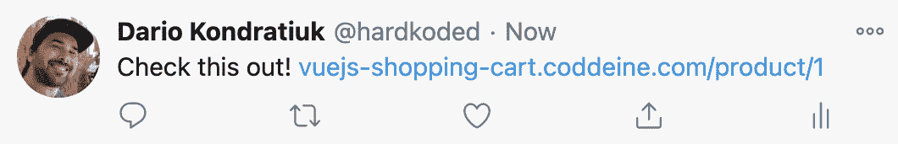
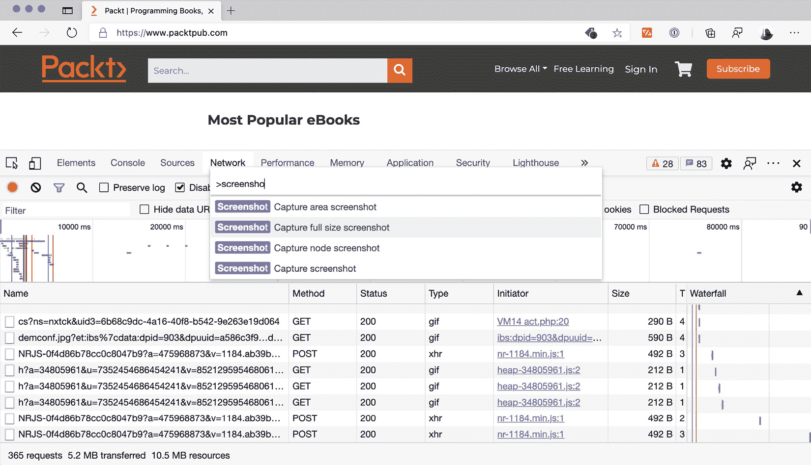
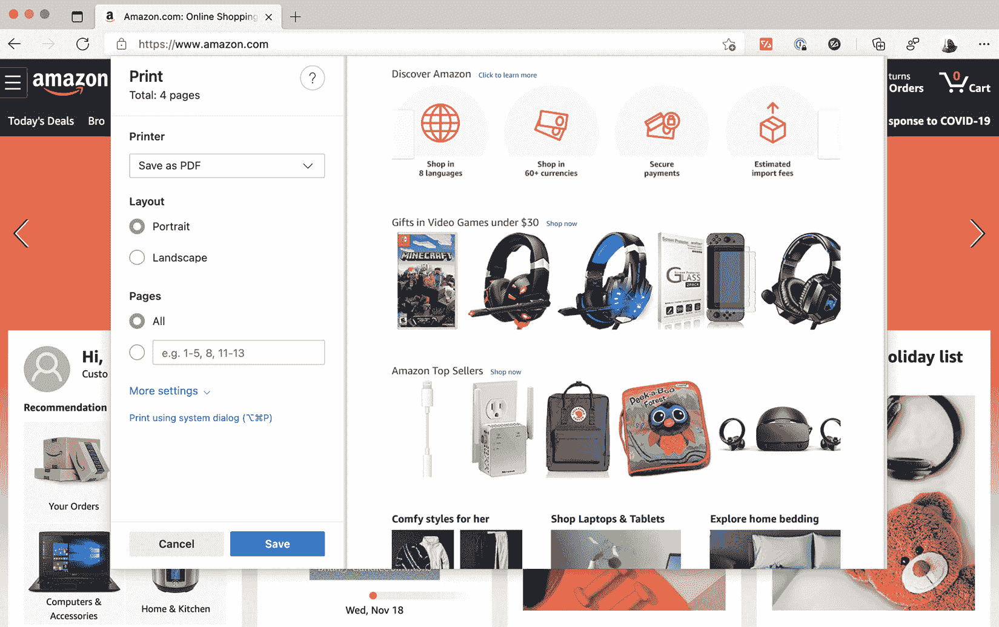
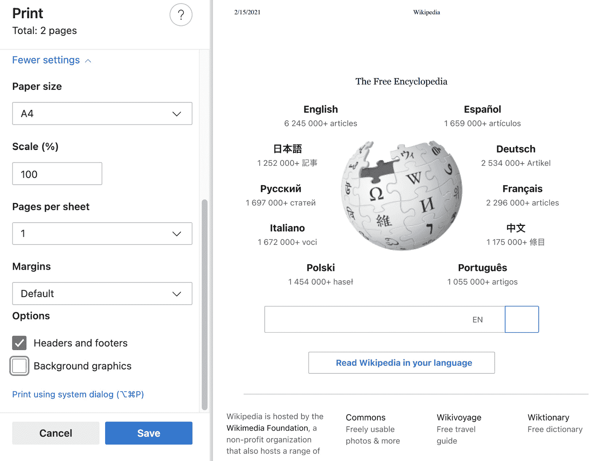
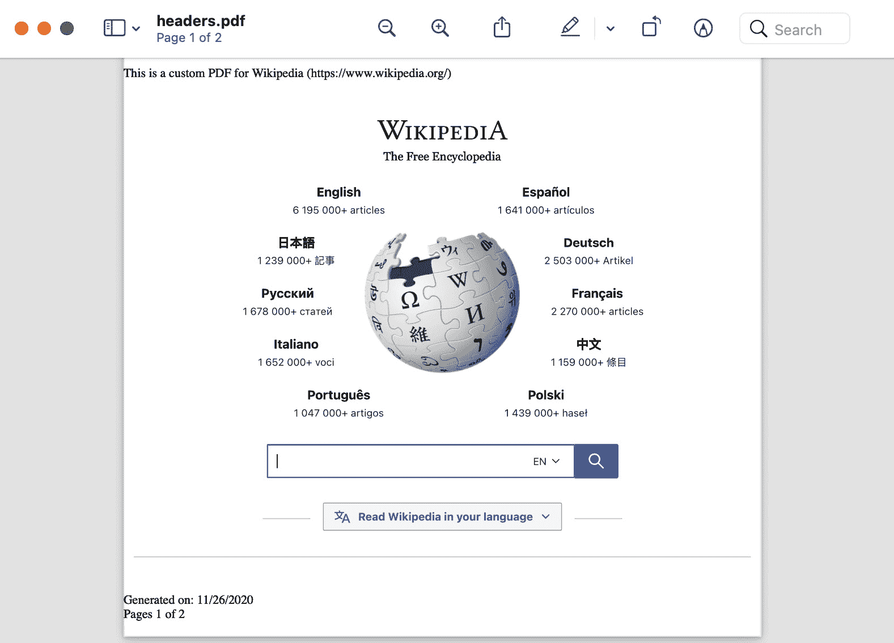

# 第七章：*第七章*: 使用 Puppeteer 生成内容

当我在 2019 年推出 Puppeteer-Sharp (https://github.com/hardkoded/puppeteer-sharp) 时，我惊讶地发现，两个主要的使用场景是内容生成和网页抓取。

在 Node.js 世界中，情况并没有太大不同。许多开发者也在 Node.js 中使用 Puppeteer 进行内容生成和网页抓取。

如果你是一名质量保证分析师，你将学习如何使用截图来创建回归测试。但请记住，不要止步于此；其他部分将为你展示使用 Puppeteer 在这个主题上可以完成的所有事情。如果你不太关注网页开发，请与你的开发团队分享这一章。不，不要分享——请他们购买这本书。那会更好。

网页开发者会喜欢这一章。我们将看到如何将 Puppeteer 作为内容生成工具用于你的网站。

在本章中，我们将涵盖以下主题：

+   拍摄截图

+   使用截图进行回归测试

+   生成 PDF 文件

+   创建 HTML 内容

到本章结束时，你将达到一个新的水平。你将学会如何将 Puppeteer 作为测试工具和内容生成器使用。

让我们开始吧。

# 技术要求

你可以在 GitHub 仓库 ([`github.com/PacktPublishing/UI-Testing-with-Puppeteer`](https://github.com/PacktPublishing/UI-Testing-with-Puppeteer)) 的 `Chapter7` 目录下找到本章的所有代码。请记住在那个目录下运行 `npm install`，然后进入 `Chapter7/vuejs-firebase-shopping-cart` 目录并再次运行 `npm install`。

# 拍摄截图

当我谈论 Puppeteer 或 Puppeteer-Sharp 时，我会首先提到截图功能。不要问我为什么，可能是因为我觉得使用它很有趣，或者可能是因为很难解释为什么我们需要截图。

作为一名网页开发者，你可以使用截图完成许多事情。你首先会发现的一个流行用例是改进你的 **Open Graph** 信息。

根据他们的网站 (https://ogp.me/)，“*Open Graph 协议使任何网页都能成为社交图中的丰富对象。例如，这被用于 Facebook，允许任何网页具有与 Facebook 上任何其他对象相同的功能。”*

Open Graph 是使社交媒体帖子（在 Twitter 或 Facebook 上）在人们分享你的网站 URL 时看起来很漂亮的东西。我们不会在这本书中讨论社交媒体上的产品定位。但你需要知道的是，如果你正在开发一个公共网站，用户想要在社交媒体上分享你的内容，有人会要求你改进 Open Graph 信息：



没有 Open Graph 信息的帖子

你不希望当你在社交媒体上分享你的产品时，你的网站看起来像前面的截图。你希望你的链接看起来像 Amazon，有一个好的描述和一张大图，就像以下截图所示：


社交媒体上的 Amazon 帖子

在你的帖子中添加图片就像在你的产品页面的 HTML 头部添加一个名为`og:image`的元属性一样简单：

```js
<head>
<title>The Rock (1996)</title>
<meta property="og:title" content="The Rock" />
<meta property="og:type" content="video.movie" />
<meta property="og:url" content="https://www.imdb.com/title/tt0117500/" />
<meta property="og:image" content="https://ia.media-imdb.com/images/rock.jpg" />
</head>
```

这几行代码会让你的帖子在社交媒体上看起来更美观。

这与截取屏幕截图有什么关系呢？嗯，有时候获取帖子的图片很简单。在购物车中，图片就是产品图片——小菜一碟。但有时候，获取 URL 的图片并不那么容易。让我们以这个来自伟大的 HolyJS 会议的帖子为例：


HolyJS 帖子

如果你访问那个帖子([`www.hardkoded.com/ui-testing-with-puppeteer/holyjs-post`](https://www.hardkoded.com/ui-testing-with-puppeteer/holyjs-post))，你不会找到那个推文中使用的图片。你会看到罗马的照片，但不会找到带有照片、会议标志或演讲标题的图片。他们可能已经手动创建了那张图片。你不需要有很棒的 Photoshop 技能来做这件事。但如果你要为 HolyJS 会议的所有演讲创建数百条推文，我敢打赌，用几分钟的时间编写一个 Puppeteer 脚本会更有生产力。

我们可以有一个内部页面，通过传递一个演讲 ID 来导航。一旦加载，我们截取一个屏幕截图，并将该图像保存在某种存储中。

但在深入 Puppeteer 的代码之前，让我先展示一个新工具。你知道你可以使用 Chromium 来截取全页屏幕截图吗？

如果你打开*Chrome*的开发者工具，然后在 macOS 上按*Cmd* + *Shift* + *P*或在 Windows 上按*Ctrl* + *Shift* + *P*，会弹出一个**命令菜单列表**，就像在 VS Code 中一样：



使用 Chromium 截取屏幕截图

你会在那里找到大量的命令。你想找点乐子吗？打开 3D 查看器。我会给你 3 分钟。

好的，回到工作。如果你在**命令菜单列表**中输入`screenshot`，你会得到四个选项。

第一个选项是**捕获区域截图**。这个选项的工作方式类似于在 macOS 中按*Cmd* + *Shift* + *4*或在 Windows 的截图工具中的**矩形截图**。当你选择这个选项时，光标会变成一个十字。你选择你想要截取屏幕截图的区域，然后释放鼠标，就可以下载图片了。

第二个选项是 **捕获全尺寸截图**。这个功能非常酷，我甚至想用大号字体、粗体、红色和斜体来强调这个选项，但我不认为我的编辑器会允许我这样做。**捕获全尺寸截图** 将捕获整个页面的截图，甚至包括屏幕外的部分。我记得其他工具试图通过在滚动页面时多次截图来完成这个任务，结果很糟糕。说实话，我听说有人对这个选项有问题，但总的来说，结果相当不错。你可以用这个工具进行市场营销或报告错误，以便你可以展示整个页面。

第三个选项也非常出色。现在我不知道哪一个是我最喜欢的。**捕获节点截图** 与 **元素** 选项卡一起使用。你转到 **元素** 选项卡，通过点击选择一个元素，然后选择 **捕获节点截图** 选项，你将得到该元素的截图。这比尝试使用捕获区域选项选择页面的一部分要好得多。

最后一个选项只是 **捕获截图**。它将捕获页面的可见部分。是的，我知道，与其他选项相比，这听起来很无聊，但它仍然很有用。

我认为我无需告诉你这个好消息，因为你已经知道了。我们可以使用 Puppeteer 的 `screenshot` 函数完成所有这些操作。

`Page` 类和 `ElementHandle` 类都具有这个功能。如果你在 `ElementHandle` 上调用 `screenshot` 函数，你将使用 Chrome 中的 **捕获节点截图** 选项。

函数的签名非常简单，只是 `screenshot([options])`，这意味着只需调用 `screenshot()` 就足够了。但 `options` 对象有许多有趣的属性。让我们来看看它们：

+   `path` 是你将最常使用的属性之一。如果你传递一个路径，你的截图将被保存在那里。无论你是否传递路径，结果图像都将由 `screenshot` 函数返回。

+   使用 `type` 选项，你可以确定你想要的是 `type`，Puppeteer 将从 `path` 推断类型。如果你既没有传递 `type` 也没有传递 `path`，它将默认为 **png**。

+   如果你将类型（无论是使用 `type` 选项还是 `path` 选项）设置为 `quality` 选项，它必须是一个从 0 到 100 的值。它将确定 **jpeg** 图像的质量。

+   然后我们有 `fullPage`。这个选项是一个布尔选项，它将帮助我们执行 **捕获全尺寸截图** 操作。

+   `clip` 属性是一个对象，它将帮助我们执行 x 坐标的 `x`，y 坐标的 `y`，然后使用 `width` 和 `height` 确定区域的大小。

+   使用 `omitBackground` 属性，你可以将页面的默认（白色）背景更改为透明。

    重要提示

    `omitBackground`更改页面的默认背景。如果页面有自定义背景，即使是使用`background-color: white`的白色背景或图像，此选项将不起作用。

+   最后一个可用的属性是`encoding`，它将确定`screenshot`函数的返回类型。如果你传递`base64`，它将返回一个 base64 字符串。如果你传递`binary`或未设置任何值，它将返回一个 Node.js `Buffer`对象。

是时候看看一些代码了。让我们创建一个脚本并尝试复制 Chrome 提供的四个选项。你还可以在`screenshots.js`文件中看到这段代码：

```js
const browser = await puppeteer.launch({headless: false, defaultViewport: null});
const page = await browser.newPage();
await page.goto('https://www.packtpub.com/');
await page.screenshot({ path: 'normal-only-viewport.png'});
await page.screenshot({ path: 'full-page.png', fullPage: true});
await page.screenshot({ 
    path: 'clip.png', 
    clip: { 
        x: 300, 
        y: 150, 
        width: 286, 
        height: 64
    }
});
const firstBook = await page.$('.tombstone');
await firstBook.screenshot({ path: 'first-book.png'});
```

我们可以看到代码中表达的四种操作。如果我们只传递`path`，将`fullPage`设置为 true，我们将得到`fullPage`，我们传递一个`clip`，我们将得到从`page.$('.tombstone')`获取的`ElementHandle`，我们得到**捕获节点截图**。

小贴士

找到正确的`clip`将会相当棘手。页面会根据窗口大小改变布局，这可能会破坏你试图使用的固定位置。我建议尝试捕获节点截图而不是使用`clip`。如果没有可用的元素，我会尝试根据其他元素的定位来构建`clip`。

我敢打赌，网络开发者会发现截图功能的更多用例。但如果你是 QA 分析师，我们现在将学习如何使用截图来执行 UI 回归测试。

# 使用截图进行回归测试

我们在*第二章*中简要讨论了 UI 回归测试，*自动化测试和测试运行器*。现在是我们变得实际的时候了。首先，让我们回顾一下**回归**的概念。当你看到错误报告时，你会经常听到这个词。如果一个用户说“我在 X 功能中发现了回归”，这意味着之前以某种方式工作的事物现在已经改变了。这可能是一个错误，应用程序中的错误，或者是一个未报告的行为变化。

我们可以说，UI 回归是我们检测到页面或组件在视觉上发生了变化。我想再次强调。它可能是因为错误或未报告的样式变化而改变的。

为了证明回归，你需要证据。到目前为止，我们一直在测试行为，我们的证据是代码：“如果我输入用户名、密码，然后点击登录按钮，我应该能够登录。”

为了证明 UI 回归，我们的证据将是**截图**。UI 回归测试将包括以下步骤：

1.  我们需要做的第一件事是截图当前状态。

1.  第一次运行测试时，我们没有可以比较截图的东西。我们没有历史，没有证据。我们没有可以测试的东西。但现在，我们有下一次运行的证据。

1.  如果我们有证据，我们将比较当前的截图与基线，如果图像不同，我们将失败。

就这些。很简单。但是当我们有差异时会发生什么？当我们进行端到端测试失败时，我们首先会看看这是否是我们测试中的错误。如果我们的测试按预期工作，那么这个失败最终会变成一个错误报告。

但是，与 UI 回归测试相比，这有点不同。我们需要评估结果，以检查是否发现了错误，或者**基线是否已改变**。我们总是在页面上得到 UI 更改，所以我们需要看看这些更改是否是期望的。如果更改是期望的，我们就需要删除我们的基线并创建一个新的基线图像。

那就是我们的蛋糕。现在，我们需要哪些工具来烘焙这个蛋糕？还有，我们对这些工具有什么要求？我们需要四个要素：

+   **一个测试运行器**。我们已经讨论了我们需要从测试运行器中得到什么，并且我们看到 Mocha 和 Jest 符合我们的期望。

+   **一个截图工具**。截图工具需要稳定。稳定的意思是，它需要在相同的情况下始终返回相同的截图。这听起来很显然，但 UI 回归测试是易变测试的王者。我们需要一个工具，它可以持续提供相同的截图。Puppeteer 在这方面做得很好。

+   **一个存储基线的位置**。这里我们不是在谈论一个工具。但我们需要文件组织得井井有条，这样就可以轻松地找到和删除基线，并找到结果比较。

+   **一个用于比较图像的工具**。这个工具与截图工具一样重要。我们不希望出现误报。我们不需要一个工具告诉我们，仅仅因为一个像素不是与基线完全相同的白色，就认为一切都不对。这个工具应该允许我们通过某种阈值来决定我们希望它对更改有多敏感。它还应该支持抗锯齿像素，以减少图像渲染中的差异。"Pixelmatch"([`www.hardkoded.com/ui-testing-with-puppeteer/pixelmatch`](https://www.hardkoded.com/ui-testing-with-puppeteer/pixelmatch))是 Node.js 中最受欢迎的图像比较包。

如您所见，实现这一点不应该很难。但是市场上许多工具为我们解决了所有这些样板代码。再次强调，这并不是关于我告诉你们哪个是最好的工具。你们必须寻找适合你们自己的工具。我发现*Project Awesome*([`www.hardkoded.com/ui-testing-with-puppeteer/awesome-regression-testing`](http://www.hardkoded.com/ui-testing-with-puppeteer/awesome-regression-testing))有一个巨大的回归测试工具列表。在那个网站上，我发现了*differencify*([`www.hardkoded.com/ui-testing-with-puppeteer/differencify`](https://www.hardkoded.com/ui-testing-with-puppeteer/differencify))。我喜欢它，因为它简单，并且涵盖了前面提到的所有要求。我不太喜欢它作为 Puppeteer 和我们的中间层，但它确实完成了工作；我可以忍受这一点。

我们可以创建一个名为 `"Should visually match"` 的测试，并在其中使用 differencify。你可以在 `homepage.tests.js` 文件中找到这个测试。让我们看看如何实现它：

```js
it ('Should visually match', async() => {
  const target = differencify.init({ 
    chain: false, 
    testName: 'Home' });
  await target.launch();
  const page = await target.newPage();
  await page.setViewport({ width: 1600, height: 1200 });
  await page.goto(config.baseURL);
  const image = await page.screenshot();
  const result = await target.toMatchSnapshot(image);
  await page.close();
  await target.close();
  expect(result).to.be.true;
});
```

它看起来几乎就像一个正常的 Puppeteer 测试。但是有一些区别。让我们看看它们：

它从声明一个名为 `target` 的变量并给它分配 `differencify.init` 的结果开始。我们不会深入探讨 *differencify* 的内部机制，因为我们不关心这些。在那个 `init` 调用中唯一重要的是我们在那里设置了测试名称，正如我们稍后将会看到的，这个名称将被用来命名图像。

之后，它看起来就像纯 Puppeteer 代码，除了我们调用 `target.launch();` 而不是 `puppeteer.launch();`。

在截取屏幕截图时，我们需要做的一件重要事情是设置 **视口**。视口将决定我们将使用的屏幕截图的大小。即使你截取了全页面的屏幕截图，视口也会决定那个图像的宽度。

除非你想要检查页面在特定动作之后的样式，否则 UI 回归测试将只访问一个页面，等待页面加载并稳定，然后截取屏幕截图。这里的稳定意味着你不想在资源加载一半时截取屏幕截图，例如，图片还在加载。

页面加载后，我们使用 `page.screenshot()` 截取屏幕截图，然后调用 `await target.toMatchSnapshot(image)`。这个函数将负责如果不存在则创建基线图像，如果存在，则进行图像比较。

当我们第一次运行测试时，测试将会通过，因为，再次强调，没有基线。我们将会注意到的一个重要事情是，*differencify* 在 `differencify_reports` 目录内创建了基线。你可以在 `Chapter7/differencify_reports` 目录内看到完整的目录结构。

现在，我们已经有了基线。希望这个测试将会显示绿色，除非那个页面上有变化。让我们尝试破坏它。我们将打开 `vuejs-firebase-shopping-cart/src/components/Header.vue` 文件并将 `color .navbar-btn` 元素改为蓝色：

```js
.navbar-btn {
  color: blue;
}
```

这是一个典型的 UI 回归测试场景。也许你想要改变登录页面上的按钮颜色，但你没有意识到 `navbar-btn` 类也被用于主页。

如果我们运行测试，我们会得到以下输出，告诉我们测试已经失败：

```js
  1) Home Page
       Should visually match:
      AssertionError: expected false to be true
      + expected - actual
      -false
      +true
```

这并没有说太多。它只是简单地说明图像并不相同。但如果我们去`differencify_reports`目录，我们会看到*differencify*创建了两个新文件：`Home 1.current.png`位于`differencify_reports/__image_snapshots__/__current_output__`下，显示了最新的截图。第二个图像是`Home 1.differencified.png`，位于`differencify_reports/__image_snapshots__/__differencified_output__`下。你可以在上述目录中查看差异化的图像，或者通过链接[`www.hardkoded.com/ui-testing-with-puppeteer/differencified`](https://www.hardkoded.com/ui-testing-with-puppeteer/differencified)查看检测到的更改位置。在这种情况下，你会看到它突出显示了单词"`__current_output__`目录并评估出了什么问题。

总结本节，UI 回归测试并不是每个项目都需要。如果你使用像**bootstrap**或**tailwindcss**这样的 CSS 框架，UI 回归的可能性很低。还有一些项目，页面样式不被视为错误。如果某个框比预期低几个像素，利益相关者不会在意。

我确实认为它是一个为使用自定义 CSS 的前端开发者提供的优秀工具。有了 UI 回归测试，前端开发者可以衡量他们更改的影响。这就像是 CSS 的单元测试。

在下一章中，我们将讨论设备模拟。通过设备模拟加上 UI 回归测试，你将能够检查你的网站在移动设备上的外观。

现在是时候学习另一种使用 Puppeteer 生成内容的方法了。现在是生成 PDF 文件的时候了。

# 生成 PDF 文件

我们已经离开了 QA 领域，将再次进入开发世界。

当我谈到 PDF 生成时，我遇到了我在截图部分提到过的同样的问题：“我为什么要使用 Puppeteer 生成 PDF？”

首先要提到的场景是将 PDF 作为网站输出格式。我不知道你是否经历过我经历过的。我不得不构建一个电子商务应用程序。我构建了产品列表、结账流程，甚至收据页面。然后出现了需求：“我们需要发送一个包含该收据的 PDF 格式的电子邮件。”这是一个估算破坏者。没有简单的方法从头开始创建 PDF 文件。

然后你找到一个生成 PDF 的库，你对它很满意。但利益相关者告诉你，它需要看起来完全像收据页面。你的估计再次被扔进了垃圾桶。应该有一个简单的方法来生成 PDF 文件。

也许它不是一个收据。你有没有收到过要求通过电子邮件发送每日报告作为 PDF 的请求？你可能会使用一些庞大、复杂且昂贵的报告工具，只是为了那个每日的电子邮件。

第二个场景是 PDF 文件作为独立的产品。你销售文档吗？财务报告？你可以使用 PDF 生成工具自动生成这些内容。

我敢打赌你已经知道你可以使用 Chrome 的打印工具将任何页面保存为 PDF 文件：



在 Chrome 中另存为 PDF

你可以转到任何页面，按 *Cmd* + *P* 或 *Ctrl* + *P*，然后选择 **另存为 PDF** 而不是选择真正的打印机。然后点击 **保存**，你就能得到你的 PDF。

我想我不用告诉你这一点，但正如你可能已经猜到的，Puppeteer 使用这个相同的工具来生成 PDF 文件。

有一些基本的知识你需要了解。如果你知道了这些，你将能够回答 Stack Overflow 上的许多问题。下面是关键点：**PDF 生成不是作为截图，而是作为打印操作**。

现在我们已经看到了 **打印** 对话框，这听起来可能很显然。但重要的是你要知道，视口（窗口大小）不会决定 PDF 的生成方式。页面大小将决定这一点。

设计师和前端开发者可以使用媒体查询打印 ([`www.hardkoded.com/ui-testing-with-puppeteer/mediaqueries`](https://www.hardkoded.com/ui-testing-with-puppeteer/mediaqueries)) 来确定页面应该如何打印。

让我们看看如何使用 `@media print` 来更改页面样式：

```js
<html>
    <head>
        <style>
            body {
                color: blue;
                font-size: 16px;
            }
            @media print {
                body{
                    color: black;
                    font-size: 32px;
                }
            }
        </style>
    </head>
    <body>
        Hello world;
    </body>
</html>
```

正如我们所看到的，如果你浏览这个 HTML 内容（你将在存储库中找到这个代码作为 `mediaprint.html`），你会发现 `Hello world` 以 16px 的大小渲染为蓝色。但如果你点击 `打印`，浏览器将添加来自 `@media print` 部分的所有 CSS 样式，将字体大小改为 32px 并将颜色改为黑色。在下一节中，我们将学习如何在页面没有打印样式的情况下添加打印样式。现在，你需要知道的是，我们正在打印内容。

如果页面中使用的 `@media print` 样式对你不起作用，有一种方法可以绕过这个功能。你可以使用以下代码强制使用媒体类型 `screen`：

```js
page.emulateMediaType('screen')
```

如果你在生成 PDF 之前调用 `emulateMediaType`，浏览器将忽略 `@media print`。

我认为我不用告诉你这一点，但我们将要使用的生成 PDF 文件的函数叫做 `page.pdf`。与 `screenshot` 不同，没有 `elementHandle.pdf`，因为你不能只打印一个元素。

签名很简单，就是 `page.pdf([options])`，但我们有很多可用的选项。让我们从在打印对话框中找到的设置映射的选项开始。

在选择 `landscape` 后，打印对话框中你将看到的第一个选项是一个布尔值，它将告诉浏览器你是否想要以横向方向生成 PDF。

下一个选项是 `pageRanges`。这是一个字符串，你可以传递类似 `'1-5, 8, 11-13'` 的内容。如果你不设置这个属性，它将像在打印对话框中设置了 **所有页面** 一样工作。

如果你点击 `格式`，这是一个接受以下选项的字符串：

+   `Letter`: 8.5 英寸 x 11 英寸

+   `Legal`: 8.5 英寸 x 14 英寸

+   `Tabloid`: 11 英寸 x 17 英寸

+   `Ledger`: 17 英寸 x 11 英寸

+   `A0`: 33.1 英寸 x 46.8 英寸

+   `A1`: 23.4 英寸 x 33.1 英寸

+   `A2`: 16.54 英寸 x 23.4 英寸

+   `A3`: 11.7 英寸 x 16.54 英寸

+   `A4`: 8.27 英寸 x 11.7 英寸

+   `A5`: 5.83 英寸 x 8.27 英寸

+   `A6`: 4.13 英寸 x 5.83 英寸

Puppeteer 还提供了两个额外的选项：`width` 和 `height`。如果你不满足于这些格式，你可以使用这两个属性设置自定义尺寸。这些属性接受一个数字或字符串。如果你使用字符串，你可以传递带有单位的值，例如 **px** 用于像素，**in** 用于英寸，**cm** 用于厘米，或 **mm** 用于毫米。

接下来是 `scale`，这是打印页面时使用的缩放比例。你会在打印对话框中看到它是一个从 10% 到 200% 的百分比。在这里，它将是一个从 0.1 到 2 的十进制值。

在 **缩放** 之后，你会找到 **每页页数**。在 Puppeteer 中我们没有这个设置。

在“页边距”选项中，下一个选项是一个具有四个属性的对象：

+   `top`

+   `right`

+   `bottom`

+   `left`

所有这些属性都接受一个数字或字符串，支持与 `width` 和 `height` 相同的单位。

在页边距之后，打印对话框提供了一组额外的选项。第一个是页眉和页脚。这是 Puppeteer 中一个非常有趣的功能。Puppeteer 不仅提供了一个 `displayHeaderFooter` 布尔属性，还提供了一个 `headerTemplate` 属性和一个 `footerTemplate` 属性。这意味着你可以设置你想要的页眉和页脚的样式。Puppeteer 甚至会使用以下类填充元素：

+   `date`: 格式化的打印日期

+   `title`: 文档标题

+   `url`: 文档位置

+   `pageNumber`: 当前页码

+   `totalPages`: 文档中的总页数

下一个选项是 `printBackground` 属性。它将告诉浏览器你想要打印背景图形。默认情况下这是 `false`，因为这个选项是为打印机设计的，你不想浪费你的墨粉在背景上。但是你应该考虑是否需要打开这个选项。让我们以维基百科为例：



Wikipedia without the background graphics checked

正如你所见，如果你没有检查 `SPAN` 元素，维基百科的标题就会缺失。如果你不知道这个标志，你可能需要花几分钟时间挠头，试图找出你的代码哪里出了问题。现在你知道你必须考虑 `printBackground`。

有一个选项你不会在打印对话框中看到，那就是 `preferCSSPageSize`。这个属性默认是 `false`，它会告诉浏览器在打印页面时优先考虑页面上的 `@page size` 声明，而不是 `width`/`height` 或页面 `format`。开发者可以使用 `@page size` ([`www.hardkoded.com/ui-testing-with-puppeteer/pagesize`](https://www.hardkoded.com/ui-testing-with-puppeteer/pagesize)) 来设置打印时首选的页面大小。

最后一个选项是最重要的。函数的输出与 `screenshot` 函数中的方式相同。如果你设置了 `path` 属性，将在该路径下生成一个文件。无论如何，函数的返回值将是一个包含 PDF 文件二进制表示的 Buffer（https://nodejs.org/api/buffer.html）。

现在来看看一些代码。在以下代码中，您可以在`pdfdemo.js`文件中看到，我们将使用我们学到的选项打印 www.wikipedia.org：

```js
const browser = await puppeteer.launch({
    headless: true,
    defaultViewport: null});
const page = await browser.newPage();
await page.goto('https://www.wikipedia.org/');
await page.pdf({
    path: './headers.pdf',
    printBackground : true,
    displayHeaderFooter : true,
    headerTemplate: `
        <span style="font-size: 12px;">
            This is a custom PDF for 
            <span class="title"></span> (<span class="url"></span>)
        </span>`,
    footerTemplate: `
        <span style="font-size: 12px;">
            Generated on: <span class="date"></span><br/>
            Pages <span class="pageNumber"></span> of <span class="totalPages"></span>
        </span>`,
    margin:{ 
        top:'100px', 
        bottom: '100px'
    }
});
await browser.close();
```

在这段代码中，首先要注意的是，`pdf`函数仅在无头模式下工作。如果您在完整模式下调用`pdf`，您将得到一个**错误：协议错误（Page.printToPDF）：PrintToPDF 未实现**。

第二件事要注意的是，如果您想使用页脚和页眉模板，您需要设置一个边距。根据我的个人经验，我不会在这里使用非常复杂的模板。事情可能会变得很糟糕，难以调试。

代码中最后要提到的是模板中使用的 CSS 类。如您所见，我留空了 SPAN，如`<span class="title"></span>`，以便浏览器可以用真实数据替换它们。

此代码将生成以下`headers.pdf`文件：



PDF 输出

如您所见，我们现在有一个带有标题和 URL 的自定义页眉，一个带有日期和页码的自定义页脚，并且由于我们设置了`printBackground`，我们得到了维基百科的标志。

您可能会认为这就结束了，但事实并非如此。我们还有另一种生成内容的方法。我们将实时构建我们的页面。

# 创建 HTML 内容

在本节中，我们将看到一些简单但很有用的功能。您将能够从本节中的`demohtml.js`文件中跟踪代码。大多数时候，您会使用 HTTP 协议导航页面，就像我们使用维基百科一样。如果您打开`mediaprint.html`文件，您就是使用伪协议“file”导航到该页面的。尽管它不是一个真正的协议，但您应该知道，使用 Puppeteer，您也可以使用类似 file:///some/folder/of/my/computer/mediaprint.html 的 URL 导航本地文件。

因此，如果您想生成一个社交图片，比如我们在第一部分看到的 HolyJS 会议图片，您可以在您的网站上创建一个页面，使用 Puppeteer 导航到该页面，截图，并在您的社交帖子中使用该图片。

您也可以将此文件存储在本地，并使用`file://`协议导航该文件。

我想在本节向您展示的是，您不一定需要在您的文件系统中有一个文件来生成那个社交图片。您可以在某些外部源中拥有所需的 HTML，例如内容数据库，将 HTML 加载到一个空页面中，然后截图。

我们可以使用`setContent`函数来做这件事。签名相当简单：`page.setContent(html[, options])`，其中`html`是要加载的 HTML，`options`对象支持您可能已经知道的两个选项：`timeout`和`waitUntil`。我们需要`timeout`和`waitUntil`属性，因为我们加载的 HTML 可能涉及网络请求，我们需要等待它们。

假设我们被分配了创建社交媒体帖子的任务。内容团队告诉我们需要使用来自`contentdb`组件的`socialPostTemplate`内容模板。我们可以这样做：

```js
const puppeteer = require('puppeteer');
const content = require('./contentdb');
(async () => {
    const browser = await puppeteer.launch({
    headless: true,
    defaultViewport: null});
    const page = await browser.newPage();
    await page.setContent(content.socialPostTemplate);
    await page.screenshot({path:'fromhtml.png'});
    await browser.close();
})();
```

我们使用`require`函数加载`contentdb`。然后我们调用`newPage`，这将给我们一个空白的画布，即`about:blank`页面。一旦我们有了空白的画布，我们使用`setContent`加载 HTML，然后截图并关闭页面。

一旦你调用`setContent`，页面将完全可用。这意味着你甚至可以调用`evaluate`函数来自定义和填充该模板的值。

需要考虑的一点是，`setContent`函数将覆盖所有页面内容。你将无法使用`setContent`来追加内容。

在创建新内容时，还有两个函数会很有用。第一个是`page.addScriptTag(options)`，它将允许你将脚本标签注入到任何页面中。这些是可用的选项：

+   你可以传递`url`，从 URL 注入 JavaScript 文件。

+   你也可以使用`path`来从本地文件注入 JavaScript 文件。

+   如果你将脚本存储在内存变量中，你可以使用`content`并将整个脚本设置在那里。

+   最后，你可以传递`type`，这是你可以设置到脚本元素的脚本类型（[`www.hardkoded.com/ui-testing-with-puppeteer/scriptelement`](https://www.hardkoded.com/ui-testing-with-puppeteer/scriptelement)）。

当你想注入新的功能，而这些功能不能仅通过`evaluate`函数调用解决时，你可以使用这两个函数。

我们还有`page.addStyleTag(options)`。它与`addScriptTag`类似，但不是注入脚本，而是可以注入 CSS 文件或内容。`addStyleTag`函数具有与`addScriptTag`相同的选项，除了`type`选项，这不是用于添加 CSS 文件的链接元素的合法选项。如果我们回到 PDF 生成，你可以使用以下代码在生成 PDF 文件之前注入 CSS 内容：

```js
await page.addStyleTag({
    content : `
    .search-input {
        display: none !important;
    }`
});
await page.pdf({…});
```

使用这段代码，我们在生成 PDF 之前隐藏了搜索输入框。这是一个相对简单的更改，但想象一下在现实场景中你能设置的所有事情。

# 摘要

在本章中，我们介绍了许多我最喜欢的功能。使用浏览器自动化工具创建内容是一个意外的用途。

我们学习了如何生成截图，用于 UI 回归测试，并为我们的网站生成内容。我们还学习了如何生成 PDF 文件以及所有可用的选项。到本章结束时，我们学习了如何动态生成页面。

在本章中，我们还看到了许多 Chrome 中可用的功能。我希望你在那里学到了一些新技巧。

在下一章中，我们将把我们的测试提升到新的水平。我们将学习如何通过模拟不同的移动设备和网络条件来测试我们的网站。
