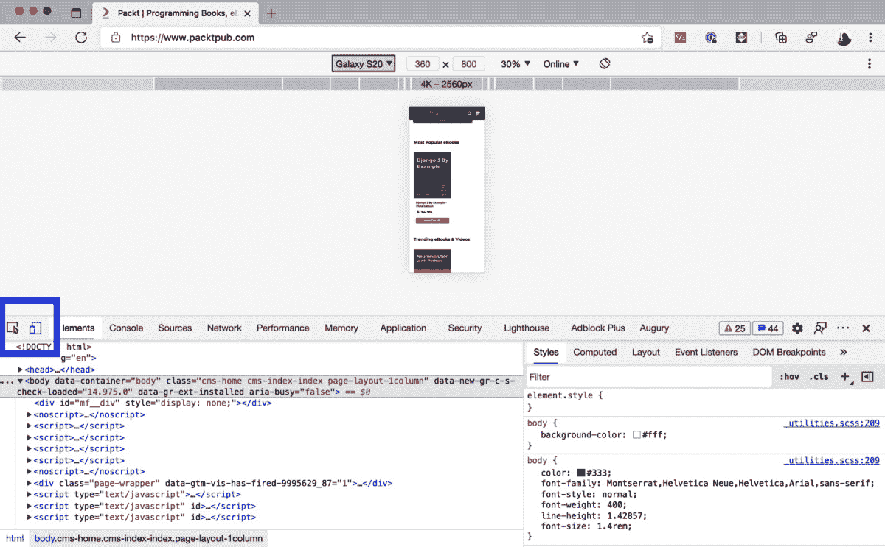
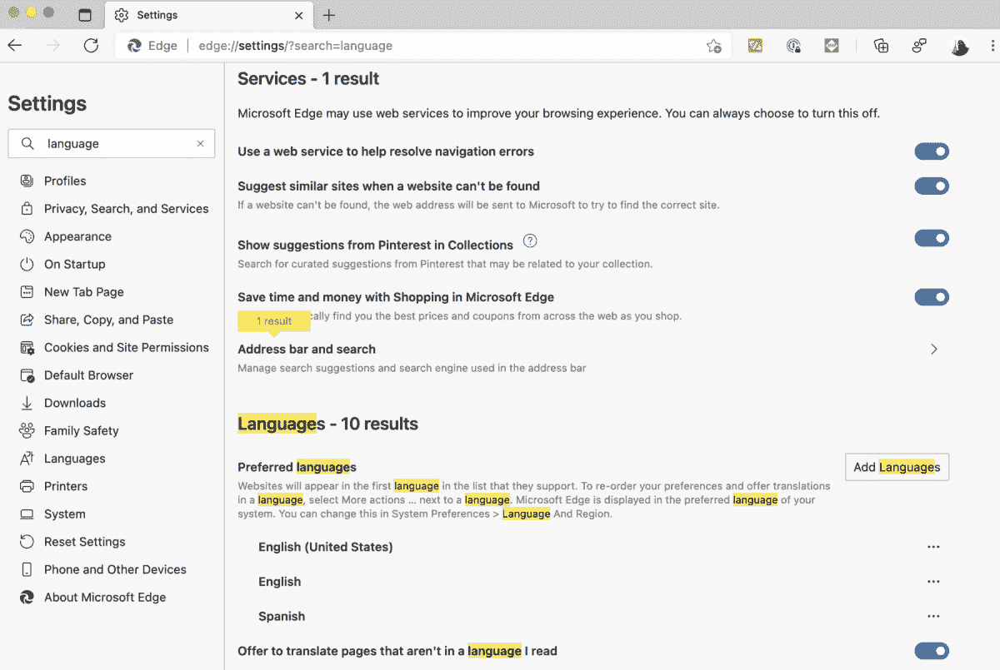

# 第八章：*第八章*：环境模拟

我很幸运在互联网变得流行之前就开始使用它了。当*Windows 95 Plus*上市时，我还是个青少年。大多数人可能记得*Windows 95 Plus*是因为它附带了一些酷炫的主题，甚至还有*太空飞行员弹球机*游戏。但这个版本的 Windows 带来了一款新的软件应用，这个名字至今仍被人们所熟知，有人喜欢有人讨厌。*Windows 95 Plus*附带的是*Internet Explorer 1.0 (IE 1.0)*。

我的第一次互联网连接是一个当地报纸与读者共享的免费电话号码。我设法说服我爸爸给我买了一个调制解调器。速度是 36.6 kbps。今天我的速度测试下载速度达到 150 Mbps，上传速度达到 30 Mbps，比我在青少年时期得到的速度快了超过 4,000 倍。

我不太记得我电脑的具体配置了。但我记得我使用过 15 英寸 800x600 分辨率的显示器，然后升级到了 17 英寸 1,024x768 分辨率。LED 显示器？不可能！那是什么？当时有一些体积庞大、刺眼的 CRT 显示器。

SEO？Google？当时没有人知道这些词。我记得我最喜欢的搜索引擎是*AltaVista*。

我为什么要告诉你这些？因为那时候，互联网体验是一致的。它很慢，非常慢，很丑，非常丑，而且有限，非常有限。但这对每个人来说都是一样的。如果你当时是开发者，你知道你必须为 IE 1.0 开发一个网站，以便在 800x600 的屏幕上显示，而且你的页面需要超过一分钟才能下载。但你不会考虑那么多。你会很高兴地用*Microsoft FrontPage*创建你的页面，将其推送到某个服务器，并让全世界都知道你的网站。

但现在情况不同了。生态系统比以往任何时候都更加多样化，我们需要准备好测试我们可能遇到的所有不同场景。最终，我们的工作是尊重所有客户，并努力了解他们的环境。

本章我们将涵盖以下主题：

+   理解浏览器市场份额

+   模拟移动设备

+   模拟网络条件

+   模拟本地化

+   其他模拟

到本章结束时，你将能够站在用户的角度，模拟他们体验你的网站的方式。

让我们开始吧。

# 技术要求

你可以在 GitHub 仓库([`github.com/PacktPublishing/UI-Testing-with-Puppeteer`](https://github.com/PacktPublishing/UI-Testing-with-Puppeteer))的`Chapter8`目录下找到本章的所有代码。请记住在那个目录下运行`npm install`，然后进入`Chapter8/vuejs-firebase-shopping-cart`目录再次运行`npm install`。

# 理解浏览器市场份额

在深入探讨 Puppeteer 提供的所有模拟功能之前，我想讨论一下现在浏览器市场份额的分布情况。我相信这将清楚地展示测试和模拟不同场景的重要性。

## 浏览器多年来的流行度

在过去的 25 年里，我们经历了许多变化。浏览器被大量采用和废弃。让我们看看 Nick Routley 在他的帖子《互联网浏览器市场份额（1996–2019）》中制作的这张表格（[`www.visualcapitalist.com/internet-browser-market-share/`](https://www.visualcapitalist.com/internet-browser-market-share/))）：


虽然我使用了*Netscape Navigator*，但我并没有在 1995 年的顶峰时期在那里。但我记得只有*Internet Explorer*才是当时唯一重要的浏览器的日子。

2008 年，当*Google Chrome*推出时，社区正经历着浏览器疲劳，这导致大量用户转向*Google Chrome*和*Firefox*，这两个浏览器在 2010 年达到了峰值。

如果你没有看 Nick 帖子上的视频，不要错过。我从视频到达 2013 年 Q1 的时刻截了一张图：


2013 年的市场份额

那年对开发者来说是一个挑战。你有了四种不同的浏览器引擎，它们的行为不同，处理 CSS 样式的方式不同，拥有不同的 JavaScript 功能。那是一团糟。但我认为那是一个健康的网络，没有明确的市场主导者。

### 2020 年浏览器的流行度

根据*StatCounter* ([`gs.statcounter.com/`](https://gs.statcounter.com/))，现在的形势非常不同：


根据 StatCounter，2020 年 12 月的浏览器市场份额

许多人称*Google Chrome*为**新**的 Internet Explorer。当你考虑到*Edge*和*Opera*使用 Chromium 引擎时，Chrome 的主导地位变得更加重要。当一个浏览器的市场份额达到这些水平时，这对开发者来说是个好事，但对网络来说却不是。

如果我们看看操作系统呢？

## 操作系统市场份额

操作系统在浏览器的工作中扮演着至关重要的角色。它们负责提供字体并与硬件交互，以及其他事情。大多数浏览器都是跨平台的，尽管它们试图在操作系统之间提供相同的使用体验，但它们并不总是以相同的方式工作。这就是为什么了解操作系统市场份额的分布如此重要的原因：


根据 StatCounter，2020 年 12 月的操作系统市场份额

我真的觉得这很令人惊讶。几乎 55%的互联网消费是在移动设备上，超过 39%是在 Android 上。这些值应该让我们重新思考我们开发和测试网站的方式。

我们可以最后看看屏幕分辨率。

## 屏幕分辨率分布

屏幕分辨率是我们试图理解整个网络生态系统时另一个重要的因素。在*第三章*“浏览网站”，我们讨论了开发者如何根据屏幕分辨率更改页面布局。让我们看看根据**StatCounter**的屏幕分辨率是如何分布的：


2020 年 12 月根据 StatCounter 的屏幕分辨率市场份额

屏幕分辨率的分布非常疯狂。不仅有各种各样的分辨率，我们还有一个占 41%的“**其他**”。我们远远没有达到 800x600 的标准。

我想留给你的信息是，互联网生态系统比以往任何时候都更加多样化。那个所有东西都是 IE、800x600、通过拨号连接的世界已经一去不复返了。尽管有一个主导的浏览器，但我们有许多可能的场景、移动设备和屏幕分辨率，我们还没有讨论网络速度。我们有 Wi-Fi、4G、3G 或 GPRS。

我们有时会犯错误，认为所有用户都有疯狂快速的互联网和 27'' 4K 显示器，我们无法理解他们为什么对我们网站感到沮丧。

你了解你的用户吗？你知道他们是否在街上用手机访问你的网站吗？你希望你的网站被全球使用吗？你知道有些国家是从右到左书写的，或者那里没有 4G 覆盖吗？

是时候换位思考移动用户了。让我们看看我们如何模拟移动设备。

# 模拟移动设备

我要介绍的第一种模拟类型是移动模拟。在本节中，我们将介绍 Puppeteer 可以模拟的三个元素：视口、触摸屏和用户代理。我们必须记住，这是一个试图**模拟**移动设备的浏览器。Puppeteer 和 Chromium 无法模拟任何硬件限制或某些手机提供的任何其他特定功能。幕后没有真正的设备；它只是一个试图向您展示该设备屏幕上网站外观的浏览器。

如我之前提到的，**55%的互联网流量来自移动设备**。我们之前章节中看到的大部分多样性都在移动世界。

让我们来看看移动世界的一些浏览器分布情况：


根据 StatCounter 的移动设备浏览器市场份额

移动市场主要被*Chrome*和*Safari*分割。你应该知道的是，在*iOS*中，唯一可用的浏览器引擎是*WebKit*/*Safari*。在*iOS*中，你可以使用*Chrome*、*Edge*或*Firefox*等浏览器，但它们不能提供自己的浏览器引擎。它们必须使用*WebKit*。他们唯一能提供的是在该引擎之上的功能。你会在那些浏览器中看到的主要功能是桌面和移动浏览器之间的同步。

让我们看看移动设备上的屏幕分辨率：


根据 StatCounter，移动设备上的屏幕分辨率

你需要 10 种屏幕分辨率才能达到 50%的市场份额，而在桌面上的分辨率只有三种，分别是 1,920x1,080、1,366x768 和 1,536x864。在移动世界中，屏幕分辨率高度多样化。在那个图表中，你应该注意到的另一件事是那些相当低的分辨率。谁会买一个分辨率为 360x640 的手机？没有人。我们将在下一节中找出那些 360x480 用户到底是谁。

因此，现在是时候讨论 Puppeteer 在模拟移动设备时考虑的元素了。

## 视口

在这本书中，我们已经讨论了很多关于视口的内容。现在是时候给出视口的明确定义了。

我喜欢通过解释它不是什么来解释视口。视口不是屏幕分辨率。它不是浏览器窗口的大小。最后，它也不是页面的大小。视口是浏览器用来渲染页面的屏幕的矩形部分。从用户的角度来看，视口是你可以看到的页面部分：


视口

我喜欢前面的可视化，不是因为我自己做了它，而是因为它清楚地显示了视口和屏幕尺寸之间的差异。页面可以非常大。它可以比你能看到的长得多。更重要的是，如果你是社交媒体用户，你也会知道页面可以有“无限”的高度，因为像*Facebook*和*Twitter*这样的网站会在你接近页面底部时加载新内容。尽管这种情况不常见，页面也可能比视口宽。当*Windows 8*发布时，曾经有一股水平滚动页面的潮流。Microsoft *Azure*门户仍然使用水平布局来显示其内容。

当你尝试模拟设备屏幕时，需要考虑的第二个元素是像素比。

## 像素比

如果我告诉你，三星 Galaxy S20，屏幕分辨率为 1,440x3,200，其视口为 360x800？

不，这并不是一个打字错误，也不是一个错误。这是那个美丽手机上的浏览器视口。这是怎么可能的？让我们看看在没有设置像素比率的 Samsung S20 上网页会如何显示：


没有像素比率的 Galaxy S20

想象一下，如果浏览器尊重屏幕的真实分辨率。这将难以阅读，因此你需要缩放分辨率。你需要告诉浏览器使用一个比例来缩放页面，使其更易于使用。在三星 Galaxy S20 的情况下，像素比率为 4，将视口设置为 360x800，这是一个简单的数学计算（1,440/4）x（3,200/4）。如果我们使用像素比率 4 来导航页面，我们会看到类似这样的内容：


携带正确像素比率的 Galaxy S20

现在我们有一个具有巨大分辨率的 S20，但页面渲染的方式使我们能够阅读它们。

如果你想知道我是如何模拟不同设备的，现在是时候使用工具了！

如果你打开了开发者工具（我希望到现在你不需要我再告诉你如何操作），你会找到一个名为**切换设备模拟**的按钮：



切换设备模拟选项

如果你点击那个按钮，你将激活设备模拟模式。从那里，你将能够选择任何设备进行模拟，或者创建新的设备。你还可以更改缩放。请注意，这个缩放不会影响视口；它只是用于缩放模拟器。最后，你将有一个选项来模拟不同的网络速度。我们将在*模拟网络条件*部分讨论这一点。

Puppeteer 考虑的下一个元素是触摸屏。

## 触摸屏

如果设备有触摸屏，浏览器将为开发者提供一套额外的工具，**触摸事件** ([`www.hardkoded.com/ui-testing-with-puppeteer/touchevents`](https://www.hardkoded.com/ui-testing-with-puppeteer/touchevents))。单次点击将被处理为点击事件。但浏览器提供了处理多指交互的机会。让我们看看 Chromium 如何显示触摸屏模拟：


触摸模拟

如果你使用设备模拟，你会看到 Chromium 会使用黑色圆圈来模拟点击。

这就带我们来到了 Puppeteer 用来模拟设备使用的最后一件事：用户代理。

## 用户代理

用户代理是网络中难以根除的糟糕决策之一。用户代理是一个字符串（文本），在每次请求中发送到服务器，用于标识浏览器/应用程序、操作系统、供应商及其版本。

根据 MDN ([`www.hardkoded.com/ui-testing-with-puppeteer/userAgent`](https://www.hardkoded.com/ui-testing-with-puppeteer/userAgent))，格式应该是这样的：

```js
User-Agent: <product> / <product-version> <comment>
```

如果你打开 Chrome 中的 DevTools 并输入`navigator.userAgent`，你会得到类似这样的内容：

```js
"Mozilla/5.0 (Macintosh; Intel Mac OS X 11_0_1) AppleWebKit/537.36 (KHTML, like Gecko) Chrome/87.0.4280.88 Safari/537.36"
```

在这里唯一明确的是，我正在使用 Mac，搭载英特尔处理器，操作系统版本为 `11_0_1`。同样真实的是，我正在使用 `Chrome/87.0.4280.88`。其余的都是补丁之后的补丁，所以用户不会收到“您的浏览器不兼容”的消息。因此，如果服务器检查 Mozilla，用户代理将匹配，但它不是 Mozilla。你能告诉我 *KHTML, like Gecko* 是什么吗？正如你所见，用户代理系统已经损坏了。

许多开发者会使用用户代理来确定另一端是哪种设备。以 iPad 上的用户代理为例：

```js
Mozilla/5.0 (iPad; CPU OS 11_0 like Mac OS X) AppleWebKit/604.1.34 (KHTML, like Gecko) Version/11.0 Mobile/15A5341f Safari/604.1
```

如果开发者想检查用户是否在使用 iPad，他们可以检查用户代理是否包含单词 **iPad**。但如果他们想检查用户是否使用 Safari 呢？如果他们寻找单词 **Safari**，在 iPad 上会起作用，但如果你查看 Chrome 的用户代理，它也有 Safari 这个词，所以我们可能会认为 Chromium 是 Safari。用户代理是一团糟。

如果 Puppeteer 想要正确地模拟设备，它需要在两个地方更改 User-Agent。首先，它需要更改发送到服务器的 User-Agent 请求头（[`www.hardkoded.com/ui-testing-with-puppeteer/userAgent`](https://www.hardkoded.com/ui-testing-with-puppeteer/userAgent)）。其次，因为开发者也可以通过 `navigator.userAgent` 属性从他们的 JavaScript 代码中访问 User-Agent，浏览器需要更改该属性的值。通过这些更改，服务器和客户端都将获得一个真实设备会发送的用户代理。

现在是时候看看我们如何在我们的 Puppeteer 代码中应用所有这些了。

## 使用 Puppeteer 模拟移动设备

你可以通过调用 `page.emulate(options)` 来切换模拟模式。我真心认为那里的名字 `options` 是错误的。与其他我们在本书中看到的选项相比，这个 `options` 参数是必需的。该对象将包含 Puppeteer 模拟设备所需的所有必要数据：

+   `viewport` 是第一个属性，它包括视口的定义和一些其他内容：

    a) `width`，表示视口宽度。

    b) `height`，表示视口高度。

    c) `deviceScaleFactor`，这是我们之前讨论过的像素比。

    d) `isMobile` 是一个布尔属性，将使浏览器考虑元视口标签。你可以在 MDN 网站上了解更多信息（[`www.hardkoded.com/ui-testing-with-puppeteer/viewportMetaTag`](https://www.hardkoded.com/ui-testing-with-puppeteer/viewportMetaTag)）。

    e) `hasTouch` 是一个布尔值，将启用触摸支持。

    f) `isLandscape` 是一个布尔值，将模拟横向模式的设备。

+   `userAgent` 属性将允许我们在请求头和 JavaScript 中更改用户代理，正如我们在上一节中看到的。

我有一些好消息和一些坏消息要告诉你。先说好消息。`puppeteer`类有一个名为`devices`的属性。它是一个包含 70 多个设备的字典。我们可以在代码中这样做：

```js
const iPhone = puppeteer.devices['iPhone 6'];
await page.emulate(iPhone);
```

这是好消息。坏消息是，你必须查看源代码才能知道可用的设备列表：[`www.hardkoded.com/ui-testing-with-puppeteer/DeviceDescriptors`](https://www.hardkoded.com/ui-testing-with-puppeteer/DeviceDescriptors)。这并不理想。另一种选择是获取你拥有的任何 Puppeteer 代码，并打印`devices`对象的键：

```js
console.log(Object.keys(puppeteer.devices));
```

如果你这样做，你将获得 Puppeteer 中包含的所有设备。另一个坏消息是，设备列表并没有像你预期的那样及时更新。但我认为这是有道理的。首先，因为每个月我们都会得到新的设备，保持该列表更新将是一项艰巨的任务。其次，你想要自动化的网站不需要在每台设备上测试。我认为你应该能够使用提供的设备获得良好的测试覆盖率。

如果你确实需要测试特定的设备，你可以在网上浏览规格，并手动传递设备设置。*yesviz.com*（https://yesviz.com/devices.php）有一个设备视口的良好列表。你可以在*DeviceAtlas*（https://deviceatlas.com/blog/list-of-user-agent-strings）找到用户代理列表。

如果我们想模拟一个不在设备列表中的 iPhone 12 设备，我们可以这样做：

```js
await page.emulate({
    userAgent:
        'Mozilla/5.0 (iPhone; CPU iPhone OS 12_0 like Mac OS X) AppleWebKit/605.1.15 (KHTML, like Gecko) Version/12.0 Mobile/15E148 Safari/604.1',
    viewport: {
        width: 360,
        height: 780,
        deviceScaleFactor: 3,
        isMobile: true,
        hasTouch: true,
        isLandscape: false,
    },
});
```

在撰写这本书的时候，我找不到 iPhone 12 发送的用户代理，所以我使用了 iPhone XR 的。但如果你将此用作测试工具，这将是询问你的开发团队他们正在检查哪些值的问题，这样你就可以测试团队使用的不同用户代理。

这就引出了下一个问题。我们如何应用所有这些新概念？我们应该如何测试移动模拟？

### 测试移动用户体验

首先，你需要检查**行为变化**。优秀的开发者会竭尽全力，根据他们推断你正在使用的设备，为你提供最佳体验。让我们看看[www.packtpub.com](http://www.packtpub.com)网站在移动设备上的样子：


iPhone X 上的 packtpub 网站

如我们所见，体验完全改变。顶部菜单变成了汉堡菜单，现在你需要点击放大镜来搜索书籍。

如果你关心 UI 回归，你需要识别不同的**布局变化**。网格可能变成列表，部分内容可能被完全删除以简化 UI，适应屏幕内容，并使用户体验更加出色。

你可能会想，“好吧，但我该如何测试所有这些？我应该测试哪些设备，全部吗？”为了知道应该测试哪些设备，我们需要了解一点关于**断点**的知识。不，不是调试断点，**媒体查询断点**。媒体查询断点是开发者可以使用它来根据视口宽度或高度应用不同 CSS 样式的地方。

你还记得我们讨论生成 PDF 文件时提到，开发者可以使用`@media print`来确定打印页面所使用的样式吗？嗯，`@media print`并不是我们唯一的选择。我们还可以做类似这样的事情：

```js
/* Extra small devices (phones, 600px and down) */
@media only screen and (max-width: 600px) {...}
/* Small devices (portrait tablets and large phones, 600px and up) */
@media only screen and (min-width: 600px) {...}
/* Medium devices (landscape tablets, 768px and up) */
@media only screen and (min-width: 768px) {...}
/* Large devices (laptops/desktops, 992px and up) */
@media only screen and (min-width: 992px) {...}
/* Extra large devices (large laptops and desktops, 1200px and up) */
@media only screen and (min-width: 1200px) {...}
```

这个例子是从*w3schools*网站（[`www.hardkoded.com/ui-testing-with-puppeteer/breakpoints`](https://www.hardkoded.com/ui-testing-with-puppeteer/breakpoints)）上取的。我们可以看到，开发者可以根据视口的宽度设置特定的样式。从功能上讲，如今我们谈论五种类型的设备类别：

+   竖向模式的移动电话（最多 600 px）

+   纵向模式的平板电脑（最多 900 px）

+   横向模式的平板电脑（最多 1,200 px）

+   桌面（最多 1,800 px）

+   大型桌面（大于 1,800 px）

这些数字是相对的，你应该与开发团队合作，了解他们使用的断点，并尝试使用这些断点测试边缘情况。

所以，也许你与开发团队会面后，你会发现，根据他们使用的断点，你应该测试以下设备：

+   iPhone 6

+   iPad

+   纵向模式的 iPad

+   一个视口为 1,280x1,080 的桌面

我们可以改进我们的 UI 回归测试，并测试这些设备：

```js
it('Should visually match', async() => {
  for(const device of ['iPhone 6', 'iPad', 'iPad landscape', ''])
  {
    const target = differencify.init({ chain: false, testName: 'Home ' + device });
    await target.launch();
    const page = await target.newPage();
    if(device) {
      await page.emulate(puppeteer.devices[device]);
    } else {
      await page.setViewport({ width: 1600, height: 1200 });
    }
    await page.goto(config.baseURL);
    const image = await page.screenshot();
    const result = await target.toMatchSnapshot(image)
    await page.close();
    await target.close();
    expect(result).to.be.true;
  }
});
```

这里，我抓取了前一章的相同代码，但将其包裹在一个`for`循环中，该循环将遍历我们选择的四个设备。我们将假设空字符串是默认值。如果我们得到循环中的设备，我们调用`emulate`函数。如果没有，我们设置我们之前的**视口**。

最后，如果你想模拟用户点击，你可以将`click`函数的调用替换为`tap`函数的调用。`tap`函数的工作方式与`click`函数类似，但它将使用触摸屏模拟而不是鼠标模拟。

现在我们有了针对移动设备的 UI 回归测试。

小贴士

设备模拟不仅用于 UI 测试。Web 开发者可以利用这个功能来检查页面在不同设备上的外观。就像我们编写这个测试一样，你可以创建一个小脚本，它可以遍历许多设备，导航页面，并截图。然后你可以检查是否有东西出错了。

如果你想要测试页面的移动设备行为，它将与我们之前编写的不同 Puppeteer 测试没有太大区别。你可以为移动设备创建一个新的测试文件，并将测试添加到那里。你可以创建一个`homepage.iPhone.tests.js`文件，并在`beforeEach`函数中做如下操作：

```js
beforeEach(async () => {
    page = await browser.newPage();
    await page.emulate(puppeteer.devices['iPhone 6']);
    page.setDefaultTimeout(config.timeout);
    pageModel = new LoginPageModel(page, config);
    await pageModel.go();
})
```

在这里唯一的新事物是对 `emulate` 函数的调用。从那里，就取决于您来评估您想要为 iPhone 编写的哪些测试，以及哪些测试不需要。例如，您可能想要测试布局变化，但像价格或库存检查这样的测试无论在什么设备上都应该保持一致。

在本节中，我们学习了如何模拟不同的视口、用户代理和触摸设备。但还有更多。让我们继续到带宽模拟。

# 模拟网络条件

网络是计算机科学中的一个具有挑战性的主题。如果您告诉一个网络工程师 Chromium 模拟了 4G 网络，他们会要求您向他们展示它如何模拟无线电塔和天气条件。Chromium 并不假装模拟网络，而是模拟网络条件。Chromium 将范围限制在影响 Web 开发的三个变量：下载速度、上传速度和延迟。仅此而已。

现在您可以在 Chromium 上执行模拟网络条件。您可以打开开发者工具并转到**网络**选项卡，您将找到一个名为**限制**的下拉列表，默认选中**在线**选项，如下面的截图所示：


在 Chromium 上模拟网络条件

如果您点击那个下拉列表，您将找到三个其他选项：**快速 3G**、**慢速 3G**和**离线**。另一个酷炫的功能是您将能够添加自定义配置文件。在那里，您将被询问我们之前提到的三个变量：下载、上传和延迟，以及提供一个名称，以便您能够识别您的新配置文件。

模拟不同的网络条件并不是您想要添加到每个 UI 测试中的东西。我们希望我们的测试尽可能快。但它是一个很好的工具，可以按需执行测试。例如，假设您的电子商务网站的一个用户报告说，当他们使用 4G 时无法完成结账流程。公司不希望让移动用户感到被排除在外，因此他们改进了网站以更好地在 4G 上运行。现在我们必须编写一个测试来确保页面将在 4G 上工作。

您可以通过调用 `page.networkConditions(networkConditions)` 来模拟不同的网络条件，其中 `networkConditions` 是一个具有以下属性的对象：

+   `download`: 下载速度（字节/秒）。-1 禁用下载限制。

+   `upload`: 上传速度（字节/秒）。-1 禁用上传限制。

+   `latency`: 从发送请求到接收到响应头部的最小延迟（毫秒）。

`puppeteer` 对象有一个名为 `networkConditions` 的属性，它提供了两个网络设置：`'Slow 3G'` 和 `'Fast 3G'`。这是您如何根据官方文档使用它们的示例：

```js
const puppeteer = require('puppeteer');
const slow3G = puppeteer.networkConditions['Slow 3G'];
(async () => {
  const browser = await puppeteer.launch();
  const page = await browser.newPage();
  await page.emulateNetworkConditions(slow3G);
  // other actions...
  await browser.close();
})();
```

但我们并不局限于 Puppeteer 提供的两个选项。我们可以创建自己的设置，或者在 GitHub 上找到示例。例如，*porchmark* 项目 ([`www.hardkoded.com/ui-testing-with-puppeteer/porchmark`](https://www.hardkoded.com/ui-testing-with-puppeteer/porchmark)) 有一个很棒的列表。该项目采用 MIT 许可证，因此我们可以自由使用它。

我们可以从那个项目中获取一些值，然后在我们自己的代码中使用它们来模拟不同的网络条件：

```js
const NETWORK_PRESETS = {
    GPRS: {
        download: 50 * 1024 / 8,
        upload: 20 * 1024 / 8,
        latency: 500,
    },
    Good3G: {
        download: 1.5 * 1024 * 1024 / 8,
        upload: 750 * 1024 / 8,
        latency: 40,
    },
    Regular4G: {
        download: 4 * 1024 * 1024 / 8,
        upload: 3 * 1024 * 1024 / 8,
        latency: 20,
    }
};
export default NETWORK_PRESETS;
```

在那个仓库中还有更多。你可以在这里看到完整的列表：[`www.hardkoded.com/ui-testing-with-puppeteer/porchmark-presets`](https://www.hardkoded.com/ui-testing-with-puppeteer/porchmark-presets)。如果你想合并那个文件，你需要将 `downloadThroughput` 属性重命名为 `download`，将 `uploadThroughput` 重命名为 `upload`，并删除 `offline` 属性。你还会在这个章节的项目中找到 `networkPresets.js` 文件，其中已经完成了所有替换。

我们可以用所有这些信息在我们的 “Good 3G” 网络上测试我们的登录。我们可以去我们的 `login.tests.js` 文件并添加这个测试：

```js
it('Should login on 3G', async() => {
  await page.emulateNetworkConditions(NetworkPresets.Good3G);
  await pageModel.login(config.username, config.password);
  await page.waitForSelector('.thumbnail.card');
});
```

这与 `emulateNetworkConditions` 函数的测试是相同的。如果我们不想使用 `NetworkPresets` 文件，我们可以硬编码我们的网络条件。让我们看看我们如何使用自己的设置调用 `page.emulateNetworkConditions`：

```js
it('Should login on 3G with custom settings', async() => {
    await page.emulateNetworkConditions(
    {
      download: 750 * 1024 / 8,
      upload: 250 * 1024 / 8,
      latency: 100,
    });
  await pageModel.login(config.username, config.password);
  await page.waitForSelector('.thumbnail.card');
});
```

最终结果将是相同的。你还可以有一个固定的预设，并将其添加到我们现有的 `config.js` 文件中。

我们在本章中已经覆盖了很多内容。在本节中，我们学习了如何模拟不同的网络条件。我们还学习了如何执行 DevTools 协议中的方法，这些方法在 Puppeteer API 中没有暴露。现在是时候学习本地化了。

# 模拟本地化

我喜欢这个话题。也许是因为英语不是我的母语，所以我看到并感受到了当一个网站未能尊重其他文化时的痛苦。

关于本地化是什么，国际化是什么，以及它们之间的区别，有很多争论。虽然我敢打赌，关于我是否应该将两者视为整体会有争论，但我们将把它们视为整体。

当我们谈论本地化时，我们是在说一个网站应该尊重其受众：

+   它应该尊重他们的语言。

+   它应该尊重他们的文化，例如他们如何阅读数字，如何排序信息，以及如何阅读内容。

+   它应该尊重他们的信仰。例如，绿色/好 红色/坏 在每个文化中可能都不适用。

本地化是一个特性。

理想情况下，网络上的每个网站都应该考虑本地化。但本地化可能是一个相当昂贵的特性来实现。有很大可能性，你的公司不是 Google 或 Amazon，你无法为每种文化本地化你的网站，所以你需要了解你的受众。

你可能会想：“我只是个 QA 分析师。我应该关心这个吗？”让我告诉你：你应该成为公司中捍卫和尊重客户文化的第一人。

让我分享一些关于明确受众范围的真实生活例子。

我发现很多次，在欧洲购买当地火车票可能会有困难。它们只使用当地语言，或者网站的英文版本非常糟糕。范围显而易见。这个网站是为当地人准备的。如果你是游客，就去*欧洲铁路*。

有一个来自美国的同事想在智利网站上购买机票。他去了那个网站，发现票价为 186.992 美元。他认为机票价格是 186 美元和 992 美分。实际上，那是十八万六千九百九十二智利比索。该网站没有考虑到我的朋友读数字的方式。他不是该网站受众的一部分。

从另一方面来看，如果你去[www.google.com](http://www.google.com)，你总是会得到你偏好的语言的网站。全世界都是他们的受众。

如果我访问[www.kayak.com](http://www.kayak.com)，我会得到以我本地货币的价格，因为我属于他们的受众。这是你将在 Kayak 网站上找到的完整国家列表：


Kayak 的受众

这可能看起来像是在 Kayak 上的一串国家列表。但实际上，这是他们受众的定义。

如果你不知道你网站的受众，就要求它，并在你的测试中捍卫它。

在进入代码之前，还有一件关于本地化的事情你需要知道。没有一种方法可以实施它，Puppeteer 也不会涵盖每个场景。但是，让我们看看我们能够用 Puppeteer 做什么。

## 模拟地理位置

使用 Puppeteer，我们将能够通过 Geolocation API（[`www.hardkoded.com/ui-testing-with-puppeteer/geolocalization`](https://www.hardkoded.com/ui-testing-with-puppeteer/geolocalization)）更改页面使用的地理位置。我仔细选择了这些词。你将无法完全模拟地理位置。大多数网站使用基于 IP 的地理位置。这意味着当网站从你的设备收到请求时，它会抓取 IP，并根据他们服务器上的 IP 到国家表推断出你的国家。换句话说，你无法在*Netflix.com*上更改国家。

那么，我们能效仿什么呢？你将能够模拟客户端地理位置，比如[maps.google.com](http://maps.google.com)或者甚至是[google.com](http://google.com)的搜索本身。

假设我们想让谷歌告诉我们在哪里吃饭，但是在巴黎。我们可以这样做：

```js
const browser = await puppeteer.launch({ headless: false, defaultViewport: null});
const page = await browser.newPage();
const context = browser.defaultBrowserContext();
await context.overridePermissions('https://www.google.com/', ['geolocation']);
await page.setGeolocation({latitude: 48.8578349, longitude: 2.3249841});
await page.goto('https://www.google.com/');
await page.type('[name="q"]', 'where to eat');
await page.keyboard.press('Enter');
await browser.close();
```

让我们来看看这段代码。你可以在这个`wheretoeat.js`文件中找到这个脚本。我们已经知道`puppeteer.launch`和`browser.newPage`的作用。第三行有一些新内容：`browser.defaultBrowserContext`。好吧，这对我们来说是个新词，但不是什么大问题。它将给我们之前一行获得的新页面的上下文。

下一行确实有一些有趣的内容：`context.overridePermissions`。这个函数允许我们绕过 Chromium 执行的许多权限检查。如果你第一次打开 Google 并搜索“在哪里吃饭”，你将得到类似以下的内容：


地理位置权限请求

那个窗口不是你可以用 Puppeteer 点击的。由于我们无法点击它，Puppeteer 提供了 `context.overridePermissions` 来告诉浏览器我们想要自动授予哪些权限。签名相当简单：`browserContext.overridePermissions(origin, permissions)`，其中 `origin` 是我们想要授予权限的页面（URL），而 `permissions` 是一个字符串数组，可以接受以下值之一：

+   geolocation

+   midi

+   midi-sysex

+   notifications

+   push

+   camera

+   microphone

+   background-sync

+   环境光传感器

+   accelerometer

+   gyroscope

+   magnetometer

+   accessibility-events

+   clipboard-read

+   clipboard-write

+   payment-handler

你不需要记住所有这些值；只需在你收到权限请求时查看此列表，并知道要使用哪个值。

下一行是一个有趣的内容：`await page.setGeolocation({latitude: 48.8578349, longitude: 2.3249841})`。这个函数也非常简单。它只期望一个包含三个属性的对象：`latitude`，这是一个介于 -90 和 90 之间的数字；`longitude`，这是一个介于 -180 和 180 之间的数字；以及 `accuracy`。

高级技巧

如果你想知道一个地方的坐标，你可以去 Google 地图 ([`www.google.com/maps`](https://www.google.com/maps)) 并搜索一个地方。生成的 URL 将给出坐标。例如，如果你搜索巴黎，URL 应该是 https://www.google.com/maps/search/Paris/@48.8590448,2.3257917,14.49z；`48.8590448` 将是纬度，`2.3257917` 是经度。

在设置地理位置后，我们可以导航到 Google，输入**在哪里吃饭**，结果将是巴黎的吃饭地点：


在巴黎哪里吃饭

Puppeteer 允许我们模拟不仅是一个位置，还是一个时区。让我们看看我们如何使用 Puppeteer 环游全球。

## 模拟时区

找到一个时区模拟的使用案例并不容易，但有一些。你可以模拟时区来测试某个特定时区的应用程序，即使你不在那里。在下一章讨论抓取时，这将很有帮助。

一个有趣的检查是测试你的应用程序是否正确保存数据，无论时区如何。

模拟时区的功能相当直接：`page.emulateTimezone(timezoneId)`，其中`timezoneId`是 ICU 时区。Chromium 在其源代码中也有一个 ICU 时区列表。你可以通过以下链接找到它：[`www.hardkoded.com/ui-testing-with-puppeteer/metazones`](https://source.chromium.org/chromium/chromium/deps/icu.git/+/faee8bc70570192d82d2978a71e2a615788597d1:source/data/misc/metaZones.txt)。

如果你想测试这个功能，你可以尝试更改你的时区，并访问一个显示你当前日期的网站。你可以在`timezones.js`文件中遵循以下脚本：

```js
const browser = await puppeteer.launch({ headless: false, defaultViewport: null});
const page = await browser.newPage();
await page.emulateTimezone('Europe/London')
await page.goto('https://www.unixtimestamp.com/');
await browser.close();
```

我们将时区设置为"Europe/London"，然后访问[`www.unixtimestamp.com/`](https://www.unixtimestamp.com/)，它以不同的格式显示日期和时间。这不是一个花哨的功能，但将来可能会有用。

我们在本本地化主题上要讨论的最后一件事是语言。

## 模拟语言

在实现本地化时，开发者首先考虑的是将网站以用户的语言提供。但我们的生态系统中有一个问题。让我们来谈谈开发者实现本地化的四种常见方法。

你会看到一些网站会根据你的 IP 地址显示内容。如果它检测到你的 IP 来自西班牙，它会显示西班牙语内容。如果你在法国，它会显示法语网站。如果你生活在一个有五种官方语言的国家怎么办？它只会选择一种。正如我们在讨论地理位置时提到的，我们无法模拟基于 IP 地址的语言更改。

开发者还可以提供**基于域**的解决方案。如果你访问[www.amazon.es](http://www.amazon.es)，你会看到西班牙语内容。如果你访问[www.amazon.fr](http://www.amazon.fr)，你会看到法语内容。这将很容易测试。你只需要创建一个语言域映射并在测试中使用它。

第三，开发者可能会提供一个**基于偏好的**解决方案。如果你访问[www.amazon.com](http://www.amazon.com)，你会看到英文内容，但会在某个地方看到一个下拉列表来更改你的语言。这个方案也容易测试。你可以在测试数据库中为每种语言设置一个用户，然后使用他们来测试网站在不同语言下的表现。

我要在这里讨论的最后一种选项，尽管可能还有更多，但我认为这是推断用户语言的正确方式：通过读取**Accept-Language 头信息**的值。根据 MDN (https://www.hardkoded.com/ui-testing-with-puppeteer/Accept-Language)，"*Accept-Language 请求 HTTP 头信息告知服务器客户端能够理解的语言以及首选的 locale 变体。（我们所说的语言是指自然语言，如英语，而不是编程语言。）然后服务器通过内容协商选择一个提议，使用它，并通过 Content-Language 响应头通知客户端其选择*。”

浏览器告诉服务器您更喜欢哪种语言。当您导航到一个页面，以及之后的每次请求，浏览器都会添加**Accept-Language**头，以便服务器可以相应地操作。

当您安装一个浏览器时，它将有一个默认的语言列表，基于您选择的下载选项或操作系统的语言。但您可以去偏好设置页面更改那个语言列表。如果您进入浏览器的偏好设置，您应该能够找到一个**语言**部分。您应该能够看到类似以下内容：



微软 Edge 的语言设置

在那里，我有三种语言：英语（美国）、英语和西班牙语。所有这三种语言都设置在`Accept-Language`头中。遗憾的是，根据 Paul Reinheimer（https://twitter.com/preinheimer）的说法，2017 年顶级 10,000 个网站中只有 7.2%支持`Accept-Language`（https://wonderproxy.com/blog/accept-language/）。这意味着尽管我们有根据用户偏好推断语言的工具，但大多数网站都不会使用它。我希望随着时间的推移，这种情况会有所改变。我们如何使用`Accept-Language`头测试语言？这并不难：

```js
const browser = await puppeteer.launch({headless: false, defaultViewport: null});
const page = await browser.newPage();
await page.setExtraHTTPHeaders({
    'Accept-Language': 'fr'
});
await page.goto('https://www.google.com/');
await browser.close();
```

这是一种您可以在法语中访问谷歌网站的方法。我们将在下一章中更多地讨论`page.setExtraHTTPHeaders`。但您需要知道的是，您将能够更改服务器收到的`Accept-Language`头。

我认为我们现在已经看到了 Puppeteer 提供的最相关的模拟功能。但我不想让您错过任何东西。让我简要地展示您一些更多的模拟工具。

# 其他模拟

为了总结本章，我想与您分享三个额外的模拟功能。

第一个与**无障碍性**相关。本地化和无障碍性是两个与人类相关的话题。它们谈论的是整合，关于不让任何人掉队，甚至不包括网络。我相信您的网站可能会排除某些文化（请根据上下文阅读这些话）。您可能会说：“我不打算向这个国家销售我的产品，所以我不需要将我的网站翻译成 X。”正如我们所说的，本地化可能会很昂贵。但我们确实需要设计网站以实现包容性。我认为，就像我们强制购物中心为轮椅提供斜坡一样，我们也应该强制网站实现无障碍。我可以写很多关于这个话题的页面，但这不是本书的目的。但我鼓励您在微软的网站上阅读关于包容性设计的内容：[`www.microsoft.com/design/inclusive/`](https://www.microsoft.com/design/inclusive/)。我将用该网站上的这句话作为结束语：

排除发生在我们使用自己的偏见解决问题时。

我花时间写这些段落在一个 UI 测试书中，因为我相信质量保证是保护并包括所有网络用户的最后一道防线。

Puppeteer 不会涵盖您应该做的每一个可访问性检查，但它将帮助您模拟不同的视觉缺陷。您可以通过调用 `page.emulateVisionDeficiency(type)` 函数来模拟以下视觉缺陷：**achromatopsia**（全色盲）、**deuteranopia**（绿色盲）、**protanopia**（红色盲）、**tritanopia**（蓝黄色盲）和 **blurredVision**，以检查模糊视觉。让我们看看我们如何使用这个新功能：

```js
const browser = await puppeteer.launch();
const page = await browser.newPage();
await page.goto('https://www.packtpub.com/');
await page.emulateVisionDeficiency('achromatopsia');
await page.screenshot({ path: 'achromatopsia.png' });
await page.emulateVisionDeficiency('blurredVision');
await page.screenshot({ path: 'blurred-vision.png' });
await browser.close();
```

如果您运行这个检查，您将得到以下结果：


Packtpub 在模糊视觉模拟下

您可以编写这样的检查，并在仪表板上共享它们，这样设计和开发团队都可以看到网站对视力障碍人士的易用性。

我接下来要分享的下一个模拟是关于模拟媒体功能。函数是 `page.emulateMediaFeatures(features)`。它接受一个您想要更改的 **name/value** 特性数组。这是 Puppeteer 支持的两个特性：

+   `prefers-colors-scheme`，这将帮助您在 `dark` 和 `light` 模式之间切换

+   `prefers-reduced-motion`，这将使用 `reduce` 选项或 `no-preference` 减少 CSS 动画

这可能几年前不是一个流行的功能。但现在，许多网站都在追逐暗黑模式的潮流。这是您如何测试暗黑模式的方法：

```js
const browser = await puppeteer.launch();
const page = await browser.newPage();
await page.goto('https://duckduckgo.com/');
await page.emulateMediaFeatures([{ name: 'prefers-color-scheme', value: 'dark' }]);
await page.screenshot({ path: 'dark.png' });
await browser.close();
```

如您所见，我们可以简单地导航到一个页面，并模拟 `prefers-color-scheme` 的值为 `dark`。

本章中我想分享的最后一种模拟是媒体类型模拟。我们在讨论 PDF 生成时谈到了媒体类型。我们有两种媒体类型：**screen** 和 **print**。如果您需要测试页面打印效果，这是一个非常出色的功能。您可以使用它来测试可能会被用户打印的收据页面。

函数是 `page.emulateMediaType(type)`，其中类型是一个字符串，可以是 `screen` 或 `print`：

```js
const browser = await puppeteer.launch();
const page = await browser.newPage();
await page.goto('https://github.com/puppeteer/puppeteer');
await page.emulateMediaType('print');
await page.screenshot({ path: 'print.png' });
await browser.close();
```

我们前往 Puppeteer 仓库，看看如果我们即将打印页面，它会是什么样子。

# 摘要

这又是一个内容丰富的章节。我希望您喜欢它，就像我喜欢写它一样。

我们以讨论互联网生态系统开始本章。我们讨论了世界如何向移动体验转变。这是一个很好的时机，去联系您公司负责分析的人，看看本章中我们看到的数据图表是否代表了您的网站用户。

然后我们转向移动模拟。在那里，我们学习了视口、像素比、移动分辨率的基本概念，触摸屏模拟和用户代理。

我们还学习了如何模拟不同的网络条件。我们将在 *第十章* 中看到，*评估和改进网站性能*，速度在移动体验中的重要性。

在本章的结尾，我们讨论了本地化模拟。我们学习了如何模拟地理位置、时区和语言。

我不想在本章中遗漏任何模拟内容。这就是为什么我们还学习了其他可用的模拟。我们涵盖了可访问性、暗黑模式和媒体类型模拟。在当前这个充满暗黑模式炒作的时代，测试暗黑模式将变得更加重要。

下一章将介绍爬取（Scraping）。我们将揭开爬取概念的神秘面纱，并学习一些新技巧，这样你就可以不仅用 Puppeteer 进行测试，还能用于其他有趣的事情。
