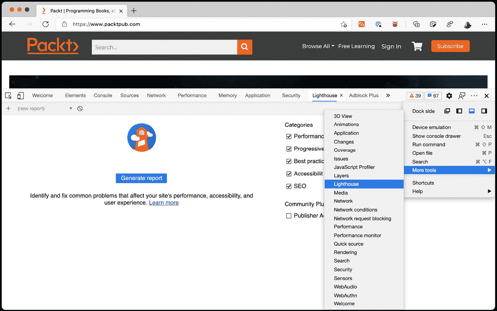
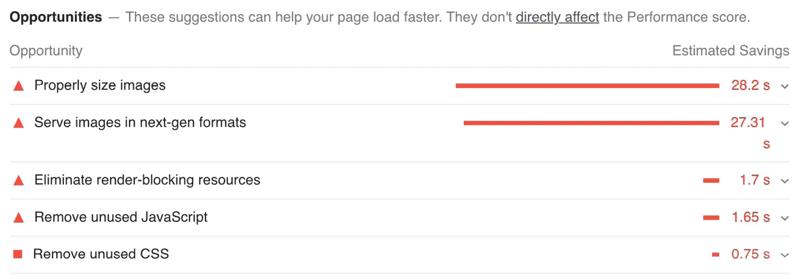
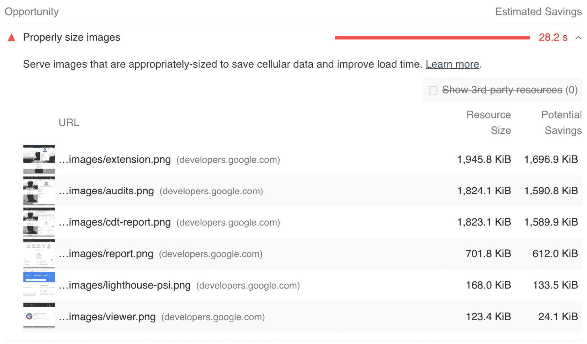
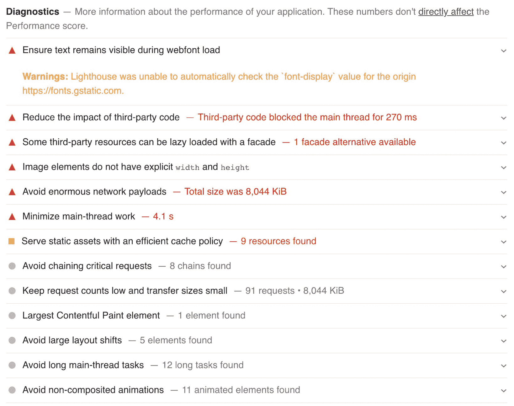
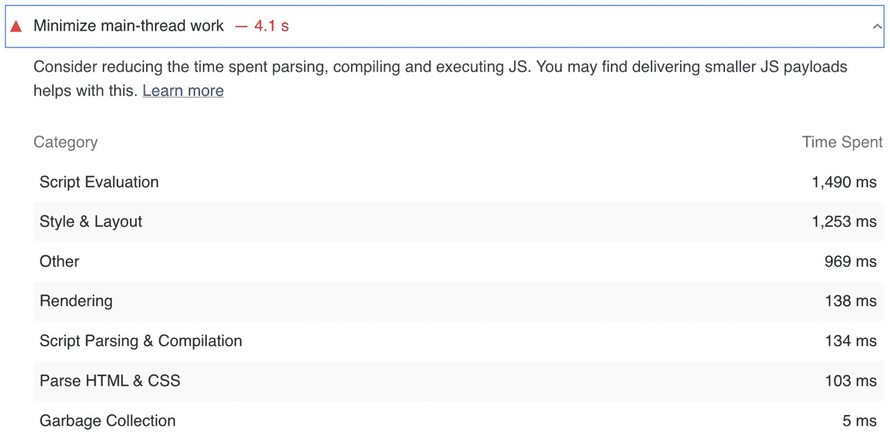
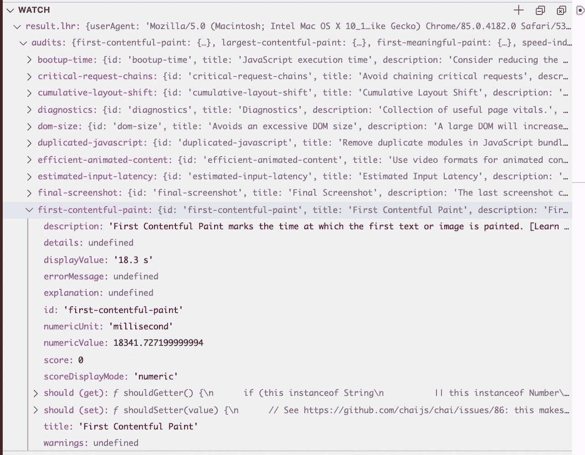
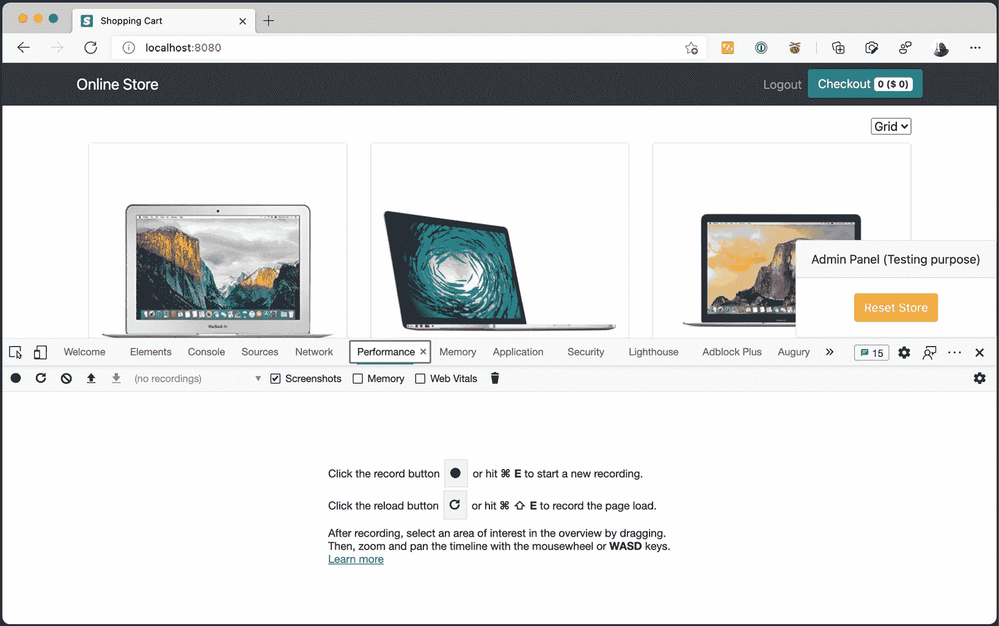
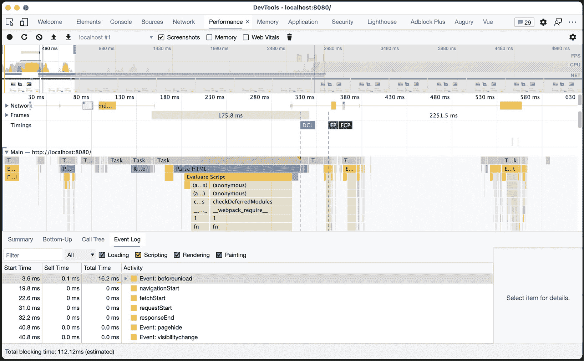
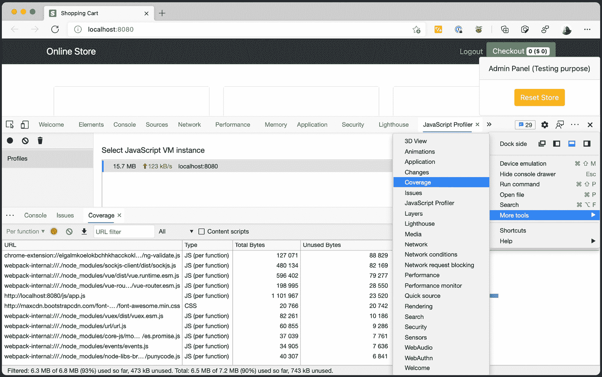

# 第十章：*第十章*：评估和改进网站性能

许多事情可以使一个网站成功或完全失败。在 *第九章* 中，我们讨论了没有内容就无法发布的房地产网站。在许多网站上，内容是排名第一的特性。[Amazon.com](http://Amazon.com) 可能是世界上最棒的网站，但如果它没有你要找的书，你将去其他地方。

对于其他网站，功能是排名第一的特性。像 [Trello.com](http://Trello.com) 这样的网站之所以成功，是因为你可以轻松直观地将卡片从一个列表移动到另一个列表。但功能不仅仅是关于丰富的网页。如果我们回到 Amazon 网站，该网站非常直接。它没有使用任何酷的 UI 框架，但它有一个出色的搜索和周密的导航规划。

网站设计也可以被视为一个特性。虽然一些网站，如 [www.google.com](http://www.google.com)，可能看起来简单且专注于内容传递，但你也可以看到其他网站，如 [www.apple.com](http://www.apple.com)，在设计上投入了大量资金。你可以在 [www.apple.com](http://www.apple.com) 上看到设计是排名第一的特性。

但大多数网站都会共享同一个特性：**速度**。**速度是一个特性**。在规划网站时，利益相关者可能会争论他们是否想要投资于丰富的客户端。他们可以讨论是否应该雇佣设计师。但如果你询问速度，只有一个答案：“我们需要网站快速。”

在本章中，我们将学习如何使用性能指标来解决可能出现在网站上的几个问题。我们将查看功能、速度，以及我们如何使用 Google Lighthouse 测量这些关键性能点。

我们将在本章中涵盖以下主题：

+   性能问题

+   开始使用 Google Lighthouse

+   追踪页面

+   分析代码覆盖率

到本章结束时，你将能够在你的网站上实施性能指标，并帮助开发团队提高网站的性能。

让我们开始吧。

# 技术要求

你将在 GitHub 仓库 ([`github.com/PacktPublishing/UI-Testing-with-Puppeteer`](https://github.com/PacktPublishing/UI-Testing-with-Puppeteer)) 的 `Chapter10` 目录下找到本章的所有代码。请记住在那个目录中运行 `npm install`，然后进入 `Chapter10/vuejs-firebase-shopping-cart` 目录并再次运行 `npm install`。

# 性能问题

如我在引言中提到的，速度是一个特性。你可能会被要求制作一个简单的网站，但没有人会要求你制作一个速度慢的网站。网站需要快速。**性能是成功的关键**。性能提升用户满意度；它导致高转化率和更高的收入。让我与你分享一些事实：

+   为了性能而重建 Pinterest 页面提高了 15%的转化率([`www.hardkoded.com/ui-testing-with-puppeteer/pinterest-case`](https://www.hardkoded.com/ui-testing-with-puppeteer/pinterest-case))。

+   通过减少显示评论所需的 JSON 响应大小，Instagram 看到了印象的增加([`www.hardkoded.com/ui-testing-with-puppeteer/instagram-case`](https://www.hardkoded.com/ui-testing-with-puppeteer/instagram-case))。

+   每次页面加载改善 100 毫秒，沃尔玛的收入就增加了 1%([`www.hardkoded.com/ui-testing-with-puppeteer/walmart-case`](https://www.hardkoded.com/ui-testing-with-puppeteer/walmart-case))。

正如你所见，性能把钱放进你的口袋。

还有另一件事，我相信你会同意我的观点：无论是什么网站，无论他们卖什么或提供什么，性能都是移动体验中的首要功能。当你在大街上时，你不会在乎风格；你不会在乎功能。你首先需要的是网站能够快速加载。你需要测量移动端的性能。

这个功能的问题在于，一般来说，人们不知道如何衡量速度。如果我们回到其他功能，它们很容易衡量。讨论内容很容易。内容很容易衡量：

+   我希望带着内容发布网站。

+   有多少项？

+   超过 1,000。

功能性通常是你可以在规范上写下来的东西：

+   我想要一个具有出色搜索体验的电子商务网站。

+   那是什么意思？

+   它应该支持拼写错误，我应该能够搜索单词的一部分。

设计关乎你是否愿意在外观和感觉上投入精力：

+   我们需要一个设计出色的网站。

+   好吧，我们需要三个设计师。

+   完美。

但速度很难讨论：

+   网站需要快。

+   多快？

+   我不知道……快？

+   但你认为它应该有多快？

+   我不知道……更快？

第二个问题是，我们倾向于对性能问题做出反应。直到我们意识到它很慢，我们才意识到需要快。

第三，速度是期望和比较的问题。用户会说网站很慢。他们也会说他们使用 Google Drive，而且它要快得多。开发者会回答说，在他们看来网站似乎很快，当然，他们也没有谷歌的预算。

最后一个问题是我们不知道如何测试网站的性能。我们会收到用户的错误报告，说网站很慢，质量保证分析师会抓取那个错误报告来验证它，但分析师用来验证那个问题的工具是什么？去网站检查它是否“感觉”慢。

那是灾难的完美鸡尾酒：没有衡量方法，没有计划——一切都关于感觉和不同的期望。

我们不可能在一本关于网络自动化的书中解决所有这些问题。但，我们将看到一些策略和工具，帮助你和你的团队测量和改进你网站的性能。让我与你分享一些开始的建议。

首先，**选择你需要测量的内容**。如果是整个网站，那也行。但我会从最受欢迎的页面开始。从主页开始。然后，继续进行网站的流程。例如，对于一个电子商务网站，你想要测试产品详情和结账页面。询问负责分析的人哪些页面带来更多的转化，并专注于这些页面。

其次，**定义页面最大加载时间**。你可以这样说，主页在任何情况下都不应超过 30 秒加载。这是一个很好的使用*Checkly*的例子，我们在*第六章*中看到的，*执行和注入 JavaScript*。你可以编写一个测试来检查页面在生产环境中是否不超过 30 秒加载，并在*Checkly*上持续进行该检查。我们将在本章后面看到如何实现这一点。一旦你设置了这项检查，你和你的团队可以设定更严格的目标。例如，搜索页面不应超过一秒加载。

第三，**测量性能下降**。很多时候，设定一个限制是困难的，它可能变成一场猜测游戏。你可以从测量性能随时间如何演变开始。网站是变快了还是变慢了？我们是变得更好还是更差了？这是一个很好的方法，但它需要做更多的工作。你需要开始存储随时间变化的数据，并构建一些可视化这些信息的东西。

最后，使用你在本书中学到的工具。我们谈到了 Checkly，但记得我们在*第八章*中学习的所有模拟技术吗？你可以为不同的网络速度设定不同的目标。

这就是你可以用来测量网站性能的所有方法。在本章中，我想向你展示你可以使用哪些工具来实现这些想法。让我们从 Google Lighthouse 开始，这是一个我们可以用来测量几个重要指标的工具。

# 开始使用 Google Lighthouse

正如我们在上一节中看到的，确定“快”有多快并不容易。谷歌想出了一个主意。他们开发了 Lighthouse，“*一个开源的、自动化的工具，用于提高网页质量。你可以对任何网页运行它，无论是公开的还是需要认证的。它有性能、可访问性、渐进式网页应用、SEO 等方面的审核*”([`www.hardkoded.com/ui-testing-with-puppeteer/lighthouse`](https://www.hardkoded.com/ui-testing-with-puppeteer/lighthouse))。

Lighthouse 将抓取你选择的网站，应用它认为重要的指标和推荐列表，并给你一个从 0 到 100 的评分。它将在五个类别下分析网站：

+   **性能**: 最受欢迎的类别。Lighthouse 将测量网站优化程度，即网站准备与用户交互的速度有多快。

+   **可访问性**: 我希望看到开发者更多地关注这个类别。在这里，Lighthouse 将评估网站的易访问性。

+   **最佳实践**: 这是另一个受欢迎的类别。Lighthouse 将评估一些良好的实践，并将其纳入网站中。

+   **SEO**: 这个类别常被负责营销的人士使用。一些公司甚至有 SEO 专家来关注这个。这个类别是关于网站对搜索引擎的优化程度。你可能会同意或不同意其他类别的测量方式，但在这里，谷歌告诉你：“这是我们衡量你网站的方式。”如果你想确保你的网站出现在谷歌的第一页，你希望得到 100 分的评分。

+   **渐进式 Web 应用**: 如果网站是渐进式 Web 应用，这个类别将评估该渐进式 Web 应用的各个方面。

    重要提示

    **渐进式 Web 应用**（**PWAs**）是准备作为原生应用程序安装的网站。许多 PWAs 具有离线功能，并试图接近原生应用程序的体验。

在这一章中，我们将只关注性能类别。但在深入了解性能类别之前，让我们看看我们如何运行这个工具。Lighthouse 有四种版本，我们将在接下来的章节中介绍。

## 作为 Chrome DevTools 的一部分

如果你打开 DevTools，你会找到一个**Lighthouse**标签。如果你找不到，你可以通过点击工具右上角的三个点，然后转到**更多工具**，再找到**Lighthouse**选项来添加它。你应该会看到类似这样的内容：



Lighthouse 在 DevTools 中

你现在应该有一个带有所有生成报告选项的标签页。这个过程将在本地运行 Lighthouse，这是好的，但这也意味着 Lighthouse 的结果将基于你的硬件、CPU、可用 RAM、网络速度等等。

## 使用 PageSpeed Insights

由于谷歌发现结果可能会根据你的硬件而波动，所以他们创建了一个 PageSpeed Insights（[`www.hardkoded.com/ui-testing-with-puppeteer/pagespeed`](https://www.hardkoded.com/ui-testing-with-puppeteer/pagespeed)），你可以在那里使用谷歌的硬件运行 Lighthouse。这将使其更加稳定，但即使使用谷歌的硬件，你可能会得到不同的结果。

## 使用命令行

你也可以从命令行使用 Lighthouse。一开始我对在命令行中拥有 Lighthouse 并不那么兴奋。但后来我意识到，从命令行使用它比打开浏览器、进入 DevTools 等要高效得多。

你可以这样安装 Lighthouse 的`-g`标志：

```js
npm install -g lighthouse
```

NPM 全局模块

当你使用`-g`标志运行`npm install`时，模块将被安装在共享目录中，而不是在`node_modules`文件夹中，并且任何应用程序都可以访问它。此外，如果模块提供了一个可执行命令，它将像这个 Lighthouse 模块一样可以从命令行访问。

安装完成后，你将能够从命令行启动`lighthouse`，传递 URL，以及额外的命令行参数，如`--view`，这将评估网站后在启动报告。

使用这一行代码，你将能够看到[www.packtpub.com](http://www.packtpub.com)的 Lighthouse 结果：

```js
lighthouse https://www.packtpub.com/ --view
```

想知道结果是什么？我们很快就会知道。

最后一个可用的选项是我们会大量使用的，那就是将节点模块作为我们代码的一部分来使用。

## 使用节点模块

我们将能够使用节点模块在我们的单元测试中使用 Lighthouse。让我们看看 Lighthouse 存储库中的示例([`www.hardkoded.com/ui-testing-with-puppeteer/lighthouse-programmatically`](https://www.hardkoded.com/ui-testing-with-puppeteer/lighthouse-programmatically))：

```js
const fs = require('fs');
const lighthouse = require('lighthouse');
const chromeLauncher = require('chrome-launcher');
(async () => {
  const chrome = await chromeLauncher.launch({chromeFlags: ['--headless']});
  const options = {logLevel: 'info', output: 'html', onlyCategories: ['performance'], port: chrome.port};
  const runnerResult = await lighthouse('https://example.com', options);
  const reportHtml = runnerResult.report;
  fs.writeFileSync('lhreport.html', reportHtml);
  console.log('Report is done for', runnerResult.lhr.finalUrl);
  console.log('Performance score was', runnerResult.lhr.categories.performance.score * 100);
  await chrome.kill();
})();
```

代码并不复杂。我们使用`chrome-launcher`模块启动 Chrome 浏览器。然后我们启动`lighthouse`，传递一个 URL 和一组选项。`lighthouse`函数将返回一个对象，我称之为`runnerResult`，它包含一个`report`属性，其中包含作为 HTML 的报告，还有一个名为`lhr`（Lighthouse 结果）的属性，其中包含所有结果作为一个对象。我们将使用该属性来断言我们想要得到的最低值。

现在我们知道了如何启动 Lighthouse，让我们看看报告看起来如何。为了避免伤害感情，我们将对同一个 Lighthouse 网站运行 Lighthouse：[`www.hardkoded.com/ui-testing-with-puppeteer/lighthouse`](https://www.hardkoded.com/ui-testing-with-puppeteer/lighthouse)。让我们看看它是否像他们说的那样快。正如我之前提到的，我对命令行工具感到非常舒适，所以我将运行以下命令：

```js
lighthouse https://developers.google.com/web/tools/lighthouse --view
```

运行之后，我在浏览器中打开了一个新标签页，以下是我得到的结果：

![Lighthouse 结果

![灯塔结果

灯塔结果

说实话，我故意选择了一个谷歌网站。正如你在截图中所见，结果可能很粗糙。55 分的评分并不意味着你的网站很糟糕。这只是意味着网站有很大的改进空间。

你还必须记住，这个评分系统是由一家公司制作的，尽管许多公司将其作为营销数字来展示分数有多高，但这并不是最终结论。这只是衡量你网站性能的一种方式。

另一件需要注意的事情是，尽管它衡量了许多事情，但它的重点是页面加载所需的时间，你应该知道性能不仅仅是这些。

让我们深入了解性能类别的细节。

## 性能类别

Lighthouse 中的每个类别都包含三个部分：指标、机会和诊断。尽管只有指标被用于类别评分，但通过实施机会和查看诊断，你将能够提高指标。

每个类别都有自己的指标、机会和诊断集合。特别是，性能类别有 6 个指标、17 个机会和 13 个诊断。

让我们来看看性能指标。

### 性能指标

第一个指标是**首次内容渲染**。它在整体性能评分中占 15%的权重。根据谷歌，这个指标“*衡量用户导航到你的页面后浏览器渲染第一块 DOM 内容所需的时间。页面上的图像、非白色<canvas>元素和 SVG 被认为是 DOM 内容；任何在 iframe 内的内容都不包括在内*。”如果这个指标低于 2 秒，你会得到一个绿色分数。你可以阅读更多关于这个指标以及如何提高分数的信息，请访问[`web.dev/first-contentful-paint/`](https://web.dev/first-contentful-paint/)。

第二个指标是**速度指数**。它在整体性能评分中占 15%的权重。根据谷歌，这个指标“*衡量内容在页面加载期间视觉显示的速度。Lighthouse 首先捕获浏览器中页面加载的视频，并计算帧之间的视觉进度。然后，Lighthouse 使用* Speedline Node.js 模块 *生成速度指数分数*。”如果这个指标低于 4.3 秒，你会得到一个绿色分数。你可以阅读更多关于这个指标以及如何提高分数的信息，请访问[`web.dev/speed-index/`](https://web.dev/speed-index/)。

第三个指标是**最大内容渲染**，权重为 25%，是最重要的指标之一。根据谷歌，这个指标“*衡量视口中可见的最大图像或文本块的渲染时间*。”如果这个指标低于 2.5 秒，你会得到一个绿色分数。如果你对如何确定“最大内容元素”感兴趣，可以查看他们的文章，请访问[`web.dev/lcp/`](https://web.dev/lcp/)。

第四个指标是**交互时间**。它在整体性能评分中占 15%的权重。根据谷歌，这个指标“*衡量页面完全交互所需的时间*。”如果这个指标低于 3.8 秒，你会得到一个绿色分数。你可以阅读更多关于这个指标以及如何提高分数的信息，请访问[`web.dev/interactive/`](https://web.dev/interactive/)。

第五个指标是**总阻塞时间**，这是在整体性能评分中权重为 25%的第二个指标。根据谷歌的说法，这个指标"*衡量页面从响应用户输入（如鼠标点击、屏幕触摸或键盘按键）被阻塞的总时间*"。如果这个指标低于 300 毫秒，你会得到一个绿色的分数。你可以阅读更多关于这个指标以及如何提高分数的信息，请访问[`web.dev/lighthouse-total-blocking-time/`](https://web.dev/lighthouse-total-blocking-time/)。

最后一个指标的权重仅为 5%，它是**累积布局偏移**。根据谷歌的说法，这个指标"*衡量在整个页面生命周期中发生的所有意外布局偏移的个别布局偏移分数的总和*"。如果分数低于 0.1，你会得到一个绿色的标记。你可以阅读更多关于这个指标以及如何提高分数的信息，请访问[`web.dev/cls`](https://web.dev/cls)。

在深入研究所有这些指标后，我得出了一些结论。首先，很明显，它们是由网络性能专业人士制作的。在我日常工作中构建所有这些指标是不可能的。这些指标背后的研究令人印象深刻。

从另一方面来看，当你查看权重和阈值时，虽然它们看起来经过深思熟虑，但可能听起来相当随意。为什么总阻塞时间比交互时间更重要？或者为什么我在小于 4.3 秒的速度指数上得到一个绿色的标记？为什么不选择 4.2 秒？为什么不选择 4.4 秒？但总比没有好。

你可能也感觉这太复杂或难以理解。一些概念，例如**最大内容渲染时间**，听起来像是火箭科学，至少对我来说是这样的。这就是为什么你可能觉得理解并遵循报告中的机会部分更容易。

### 性能机会

机会是行动的召唤。这不仅仅是简单的建议。在这里，灯塔会直接指出：“如果你这样做，你可能会获得这种性能提升。”

如我之前提到的，性能类别下有 17 个机会。我们不会涵盖所有这些。但我希望详细介绍其中几个，以便你了解这一部分的内容。

让我们只关注我们在处理 Lighthouse 网站时显示的机会。这些是我报告中得到的机会：



Lighthouse 网站的性能机会

这里，我们有五个机会。让我们逐一分析：

+   **正确调整图像大小**：灯塔发现了一些比页面上显示的大小更大的图像。

+   **以下一代格式提供图像**：在这里，灯塔会检查你是否正在使用 JPEG 或 PNG 文件而不是“下一代”格式，如 WebP。我并不是特别喜欢这个机会。尽管如今 WebP 在大多数流行的浏览器中都有支持，但它在一般意义上还不是一种流行的格式。

+   **消除渲染阻塞资源**：我认为这是一个关键的机会。在这里，Lighthouse 发现许多资源正在阻止页面的首次绘制。关注这个机会将大大提高你的指标。

+   **移除未使用的 JavaScript**：Lighthouse 发现了一些未被使用的 JavaScript 代码。尽管这个问题 Lighthouse 可以轻松检测到，但开发者解决这个问题的难度并不小。如今，开发者使用打包器将所有 JavaScript 代码打包在一起，将最终代码缩减到页面需要的代码可能具有挑战性。

+   **移除未使用的 CSS**：这个机会与上一个类似，但它与 CSS 样式相关。

我喜欢这个部分，因为 Lighthouse 不仅告诉你有哪些机会；它还提供了详细的说明，告诉你机会在哪里以及性能提升会是什么样子。让我们看看，例如，当我们点击**正确调整图片大小**这一行时，我们会得到什么：



正确调整图片大小部分

正如你所见，Lighthouse 向我们展示了哪些图片可以改进以及我们可能获得的潜在节省。你将在每个机会上获得相同类型的详细信息。

Lighthouse 类别中的最后一个部分是诊断部分。

### 性能诊断

我认为诊断部分是你应该考虑以提高你网站的一些事情列表。正如我之前提到的，性能类别有 13 个诊断，但你将看到这个数字会随着时间的推移而变化。

这就是诊断部分的外观：



Lighthouse 网站的性能诊断

正如你所见，你将获得与机会部分相同级别的详细信息，但这些诊断听起来更像是对你网站进行长期改进的建议。例如，让我们看看**最小化主线程工作**这一部分：



最小化主线程工作部分

正如你所见，诊断部分报告的内容似乎是有意义的。有一些脚本评估耗时 1,490 毫秒。但这听起来并不像是一个行动号召。它更像是在你需要提高网站性能时需要考虑的事情。

既然我们已经了解了 Lighthouse 是什么，让我们看看如何通过将 Lighthouse 添加到我们的测试中来测试我们网站的性能。

## 使用 Lighthouse 进行测试

让我们明确一点，Lighthouse 不是一个测试工具。它是一个开发者用来检查他们网站性能的工具。但是，正如我们在本书中多次提到的，QA 的角色是尊重客户。它的目的是确保客户得到团队可以提供的最佳产品。我们将使用 Lighthouse 来确保客户将获得我们能够提供的最快的网站。

我能想到三种测试 Lighthouse 报告的方法：

+   确保一个页面有最低的性能分数。

+   确保一个指标低于阈值。

+   确保不会找到机会。

让我们从检查性能分数开始。

### 确保一个页面有最低的性能分数

我们可以使用 Lighthouse 进行的第一个测试是确保我们的页面性能不会随着时间的推移而下降。我们将检查我们的页面永远不会低于特定的分数。我们如何选择最低分数？由于我们想要确保我们的网站不会随着时间的推移而退化，让我们查看当前的性能分数并强制执行。让我们转到`vuejs-firebase-shopping-cart`目录下的`repository`的`Chapter10`，然后我们将运行`npm run serve`并启动 Web 应用程序：

```js
npm run serve
```

这个命令应该启动网站。一旦启动，让我们打开另一个终端并在主页上运行 Lighthouse：

```js
lighthouse http://localhost:8080/--view
```

这个过程的得分结果是 30 分（性能）。我们可以将目标分数设置为 25。现在是时候编写我们的测试了。

重要提示

由于 Lighthouse 是本地运行的，你可能会在不同的机器上得到不同的结果。在选择你的分数目标时，你应该考虑这一点。

我们将在`homepage.tests.js`文件中添加我们的测试。但在创建测试之前，我们需要通过运行以下命令安装`lighthouse`模块：

```js
npm install lighthouse
```

这将使 Lighthouse 在我们的测试中可用。下一步是使用`require`函数导入 lighthouse 模块。让我们在文件顶部添加这一行：

```js
const lighthouse = require('lighthouse');
```

这将使 Lighthouse 在我们的测试中可用。现在，让我们看看我们的测试将是什么样子：

```js
it('Should have a good performance score', async() => {
  const result = await lighthouse(config.baseURL, {
    port: (new URL(browser.wsEndpoint())).port,
    onlyCategories: ['performance']
  });

  expect(result.lhr.categories.performance.score >= 0.25).to.be.true;
});
```

我们仅使用两条语句解决了这个测试。我们首先调用`lighthouse`，传递我们想要处理的 URL，在这个例子中，是`config.baseURL`，然后我们传递一个`options`对象。在那里我们传递它需要用来连接 Puppeteer 所使用的浏览器的`port`。我们通过`new URL(browser.wsEndpoint())).port`获取它，然后我们告诉 Lighthouse 我们只想处理`performance`类别。这里不会涵盖所有可用的选项。你可以查看完整的选项列表，请参阅[`www.hardkoded.com/ui-testing-with-puppeteer/lighthouse-configuration`](https://www.hardkoded.com/ui-testing-with-puppeteer/lighthouse-configuration)。

在下一行，我们只是断言性能类别的分数大于或等于 0.25。当你看到报告时，分数范围是 0 到 100。但在 JSON 对象中，范围是从 0 到 1。这就是为什么我们需要使用 0.25 而不是 25。

下一个测试是检查特定的指标。

### 确保一个指标低于阈值

我们也可以更加具体。例如，无论我们想要检查的性能分数如何，**首次内容渲染**的耗时不应超过 30 秒。我们的代码将与之前的测试类似：

```js
it('Should have a good first contentful paint metric', async() => {
  const result = await lighthouse(config.baseURL, {
    port: (new URL(browser.wsEndpoint())).port,
    onlyCategories: ['performance']
  });

  expect(result.lhr.audits['first-contentful-paint'].numericValue).lessThan(30000);
});
```

在这里，我们可以看到`lhr`对象也包含一个包含所有指标的`audits`字典。我们可以获取`first-contentful-paint`条目的调用，并检查`numericValue`（以毫秒为单位）是否低于 30,000（以毫秒表示的 30 秒）。

我们如何知道可用的指标有哪些？最简单的方法是在你的测试中添加一个断点，并添加一个监视器来查看`result.lhr`的值。你会看到类似以下的内容：



Result.lhr 内容

在那里，你将能够看到可用的条目，以及许多其他属性中的`numericUnit`。

根据这个例子，确保没有找到机会将会很容易。

### 确保没有找到机会

我认为这是使用 Lighthouse 最可靠的方法。我们在之前的例子中引入了一些任意数字，30 用于分数，30 秒用于指标。现在，假设我们不想获得某个机会；例如，我们不想有任何错误尺寸的图片。我们可以查看审核，尝试找到一个名为`user-responsive-images`的条目。有了这个条目，我们可以编写以下测试：

```js
it('Should have properly sized images', async() => {
  const result = await lighthouse(config.baseURL, {
    port: (new URL(browser.wsEndpoint())).port,
    onlyCategories: ['performance']
  });

  result.lhr.audits['uses-responsive-images'].numericValue.should.equal(0); 
});
```

代码与上一个例子相同，但在这里，我们断言指标值应该是 0。这意味着所有图片都正确设置了尺寸。

Lighthouse 所能做到的一切都令人印象深刻，但说实话，你不会看到很多团队将这些想法应用到他们的项目中。如果你能够使用 Lighthouse 测试你网站的性能，这将给你的团队带来很大的价值。

Lighthouse 有点像一个黑盒，你可以调用它，获取值，并做出响应。但如果你想要构建自己的指标呢？如果你想要以更细粒度的方式分析页面的性能呢？现在让我们探索 Puppeteer 提供的所有**跟踪**功能。

# 跟踪页面

在本节中，我们将介绍如何使用可以在**page.tracing**属性中找到的`tracing`对象来获取性能信息。我在 Stack Overflow 上看到过这个问题不止一次：我如何使用 Puppeteer 获取性能选项卡的信息？答案是：你可以从跟踪结果中获取所有这些信息。有很大可能性你会得到这样的回复：“是的，我这么说，但结果太复杂了。”是的，跟踪结果相当复杂。但我们将尝试在本节中看看我们能从这个对象中得到什么。

如果你打开开发者工具，你应该看到一个**性能**选项卡，如下所示：



性能选项卡

如你所见，**性能**选项卡并不是一直在处理信息，因为这是一个成本高昂的过程。你需要开始“记录”跟踪，Chrome 将开始从浏览器收集大量数据，然后你必须停止跟踪过程。

如果你点击第二个按钮，它看起来像是一个刷新按钮，它将自动刷新页面并开始跟踪。如果你点击该按钮并在页面加载时停止跟踪，你将得到类似这样的结果：



性能结果

该面板的详细程度令人印象深刻。你可以看到每一个绘制动作，每一个 HTML 解析，每一个 JavaScript 执行，浏览器为了渲染页面所做的一切。

我们可以使用 `tracing` 对象得到相同的结果。让我们在我们的 `homepage.tests.js` 文件中创建一个名为 `Should have a good first contentful paint metric using tracing` 的测试，但现在我们只添加跟踪调用：

```js
it('Should have a good first contentful paint metric using tracing', async() => {
  await page.tracing.start({ screenshots: true, path: './homepagetracing.json' });
  await page.goto(config.baseURL);
  await page.tracing.stop();
});
```

代码很简单。我们开始跟踪，我们转到页面，然后我们停止跟踪。

`start` 函数期望一个 `options` 对象，它有三个属性：

+   `screenshots` 属性将决定我们是否希望在跟踪期间让 Chromium 捕获屏幕截图。

+   如果你设置了 `path` 属性，跟踪结果将写入该 JSON 文件。

+   最后，你将找到一个 `categories` 属性，你可以在其中传递一个你想要跟踪的属性数组。

没有固定的类别列表，但这些都是我认为对我们更相关的类别：

+   在 **rail** 类别下，我们将找到许多有用的跟踪，例如 **domInteractive**、**firstPaint** 和 **firstContentfulPaint**。

+   如果你将 `screenshots` 设置为 `true`，你将在 **disabled-by-default-devtools.screenshot** 类别下找到所有屏幕截图。

+   你会发现很多条目都位于 **devtools.timeline** 类别下。这个类别代表你在性能时间线中看到的项目之一。

当你调用 `stop` 函数时，你将在你传递给 `start` 函数的文件中获取结果，无论你是否传递了路径，`stop` 函数都将返回一个 `Buffer` 类型的结果。

生成的 JSON 将是一个具有两个属性的对象：一个包含关于跟踪和浏览器信息的 `metadata` 对象，以及一个包含所有跟踪信息的 `traceEvents` 数组。

在我的简单测试示例中，`traceEvents` 给了我 `16,693`。那只是导航到页面的结果。我想你现在明白为什么这可能会让一些用户感到害怕。

每个跟踪事件的形状可能会根据类别而变化。但你会发现这些属性：

+   `cat` 将告诉你事件的类别，用逗号分隔。

+   `name` 将给你事件的名称，就像你在 **Performance** 选项卡中看到的那样。

+   `ts` 将为你提供跟踪时钟，以微秒为单位表示（1 微秒等于 0.000001 秒）。大多数事件都是相对于跟踪开始的时间。

+   `pid` 是进程 ID。我认为你不会关心那个。

+   `tid` 是线程 ID。你也不会关心那个。

+   `args`将为你提供一个对象，其中包含该事件类型的特定信息。例如，你将获得请求的 URL 和 HTTP 方法。对于截图，你将获得 Base64 格式的图像。

在所有这些信息的基础上，让我们使用跟踪值编写我们的第一个内容渲染测试。我们将编写一个测试，该测试将启动跟踪，导航到页面，然后评估结果。它可能看起来像这样：

```js
it('Should have a good first contentful paint metric using tracing', async() => {
  await page.tracing.start({ screenshots: true, path: './homepagetracing.json' });
  await page.goto(config.baseURL);
  const trace = await page.tracing.stop();
  const result = JSON.parse(trace);
  const baseEvent = result.traceEvents.filter(i=> i.name == 'TracingStartedInBrowser')[0].ts;
  const firstContentfulPaint =result.traceEvents.filter(i=> i.name == 'firstContentfulPaint')[0].ts;
  expect((firstContentfulPaint - baseEvent) / 1000).lessThan(500);
});
```

我们在这里有一些技巧要解释。在停止跟踪后，我们得到结果并解析它。这将给我们一个带有`traceEvents`属性的`result`。由于`ts`是基于跟踪的开始，我们需要找到名为`TracingStartedInBrowser`的事件的`baseEvent`。然后我们寻找名为`firstContentfulPaint`的事件，并最终计算差异。由于它是微秒级的，我们需要将其除以 1,000，以便我们可以将其与我们的目标 500 ms 进行比较。

注意，在这个例子中，我们的目标是 500 ms，而我们在 Lighthouse 示例中使用了 30 秒。这是因为，默认情况下，Lighthouse 会执行多次运行，模拟不同的条件。

我们还可以在这里做的一件事是导出跟踪工具生成的截图，以供以后分析。我们可以在测试的末尾添加类似的内容：

```js
const traceScreenshots = result.traceEvents.filter(x => (
    x.cat === 'disabled-by-default-devtools.screenshot' &&
    x.name === 'Screenshot' &&
    x.args  &&
    x.args.snapshot
));
traceScreenshots.forEach(function(snap) {
  fs.writeFile(`./hometrace-${snap.ts - baseEvent}.png`, snap.args.snapshot, 'base64', function(err) {});
});
```

在那里，我们正在通过有效的截图过滤截图事件，然后我们只需将所有这些 Base64 快照写入文件系统。有了这个，你将看到页面在加载过程中的渲染情况。你甚至可以用这些图像编写自己的第一个内容渲染算法。

现在你可能想知道你是否应该使用 Lighthouse 或 Puppeteer 的跟踪。我认为每种方法都有其优缺点。Lighthouse 易于使用，正如我们所见，它提供了我们花费大量努力才能构建的指标。使用 Lighthouse，你只需调用`lighthouse`函数并评估结果。但它可能很慢，即使你只选择一个类别。

另一方面，Puppeteer 的跟踪可能难以阅读和处理，但如果你知道如何从跟踪结果中获取所需的指标，它将比 Lighthouse 快得多。另一个重要的区别是，Lighthouse 只评估页面加载，而使用 Puppeteer 的跟踪，你可以在任何时刻开始跟踪。例如，你可以打开一个页面，开始跟踪，点击一个按钮，然后评估浏览器为了处理该点击所做的事情。最终，这关乎选择适合你工作的正确工具。

Lighthouse 还给我们提供了两个有趣的指标：**移除未使用的 JavaScript**和**移除未使用的 CSS**。让我们看看我们如何使用 Puppeteer 解决这些指标。

# 分析代码覆盖率

在本节的最后部分，我们将了解如何使用 Puppeteer 的 `Coverage` 类来获取代码覆盖率。代码覆盖率是一个可以应用于任何代码片段的指标。要获取某段代码的代码覆盖率，你需要某种工具来跟踪哪些代码行正在被执行，执行那段代码，并获取跟踪结果。这就像性能跟踪，但不是测量时间，而是测量执行的代码行数。

你可以在 Chrome 的 **Coverage** 选项卡中查看页面上的代码覆盖率。我默认没有那个选项卡，所以我需要使用 **更多工具** 选项来添加它，就像下面的截图所示：



Coverage 选项卡

**Coverage** 选项卡的工作方式类似于 **Performance** 选项卡。你需要开始跟踪，运行页面，或执行操作，然后停止跟踪以获取结果。

结果将类似于我们在前面的截图中所看到的那样：一个包含资源总字节数和未使用字节数的资源列表。在窗口底部，我们可以看到在跟踪过程中，超过 90%的代码被使用（执行）了。这相当不错。我们可以编写一个测试来确保我们始终拥有超过 90%的代码覆盖率。

Puppeteer 中 JavaScript 和 CSS 代码覆盖率有两套函数。如果你想获取 JavaScript 代码覆盖率，你需要运行 `startJSCoverage` 来开始覆盖率，并使用 `stopJSCoverage` 来停止它。`startJSCoverage` 支持一个带有两个属性的 `options` 参数：

+   `resetOnNavigation` 是一个布尔属性，我们可以用它来告诉 Puppeteer 如果检测到导航，则重新开始跟踪。

+   `reportAnonymousScripts` 是一个布尔属性，我们可以用它来告诉 Puppeteer 忽略或不禁用动态生成的 JavaScript 代码。

如果我们想获取 CSS 覆盖率，我们需要使用 `startCSSCoverage` 和 `stopCSSCoverage` 函数。`startCSSCoverage` 也期望一个 `options` 参数，但在这个情况下，它只有 `resetOnNavigation` 属性。

一旦我们运行覆盖率，`stopCSSCoverage` 和 `stopJSCoverage` 都将返回相同类型的值。它们都将返回一个具有这些属性的对象数组：

+   `url` 将给我们资源 URL。

+   `content` 将是 CSS 或脚本内容。

+   `ranges` 将包含一个对象数组，告诉我们哪些代码部分已被执行。每个条目将包含两个属性，`start` 和 `end`，告诉我们文本范围从哪里开始和结束。

现在我们已经拥有了所有这些信息，我们可以编写我们的代码覆盖率测试。让我们来看看：

```js
it('It should have good coverage', async() => {
  await Promise.all([page.coverage.startJSCoverage(), page.coverage.startCSSCoverage()]);
  await page.goto(config.baseURL);
  const [jsCoverage, cssCoverage] = await Promise.all([
      page.coverage.stopJSCoverage(),
      page.coverage.stopCSSCoverage()
  ]);
  let totalBytes = 0;
  let usedBytes = 0;
  const coverageTotals = [...jsCoverage, ...cssCoverage];
  for (const entry of coverageTotals) {
      totalBytes += entry.text.length;
      for (const range of entry.ranges) usedBytes += range.end - range.start - 1;
  }
  const percentUnused = parseInt((usedBytes / totalBytes) * 100, 10);
  expect(percentUnused).greaterThan(90);
});
```

我们开始测试是通过启动两个代码覆盖率。我们将 `startJSCoverage` 和 `startCSSCoverage` 放在 `Promise.all` 中，这样我们就可以等待两个覆盖率都得到确认。然后我们转到页面，之后停止两个覆盖率。这将给我们两个可以连接（因为它们具有相同的形状）的数组，使用 `[...jsCoverage, ...cssCoverage]`。

一旦我们有了两种覆盖率，我们就可以通过使用`entry.text.length`来获取资源的总大小，然后通过添加所有范围的长度来获取覆盖率的大小。

结果将给我们提供我们跟踪的总代码覆盖率，我们将检查它是否超过 90%。

与 Lighthouse 相比，这个解决方案的优缺点与我们在上一节看到的是相同的。一方面我们有 Lighthouse，它已经为我们准备好了所有数据。但在这里，我们对自己的测量内容有更多的控制。这个测试相当简单，但你可以通过过滤掉所有你不想测量的资源来改进它。如果测试失败，你还可以将结果下载到文件中并与你的团队分享。

现在是时候总结这一章和这本书了。

# 摘要

如果你能在你的团队中应用性能测试，你将进入一个全新的层次。

我们从讨论 Lighthouse 开始这一章。我们只覆盖了性能类别。但现在你已经知道了它是如何工作的，我鼓励你继续深入研究其他类别，并思考如何为它们创建测试。我很乐意看到更多关于无障碍性的测试。

我们还学习了如何在测试中使用 Lighthouse。这不是你经常能看到的事情。你将能够使用两行代码测试非常复杂的指标。

大多数开发者都会避开 Puppeteer 的跟踪结果。尽管你可以从那里得到的信息远比我们覆盖的要多，但我们在这章中学习了这样一个强大工具的基础。

页面的尺寸对性能至关重要；这就是为什么我们学习了代码覆盖率及其测量方法。

这也是这本书的结束。当我计划这本书的时候，我的目标是写一本涵盖整个 Puppeteer API 的书，而不只是一本参考书。我认为我们实现了这个目标。我们学习了如何使用 Puppeteer 编写高质量的端到端测试，同时我们也覆盖了 Puppeteer API 的大部分内容。

带着这个目标，我们涵盖了与单元测试严格无关的主题。我们讨论了 PDF 生成和 Web 抓取。我们还涵盖了很多人会避开的话题，比如跟踪模型。

如果你从头到尾阅读这本书，我可以向你保证，你将比这个库的普通用户对 Puppeteer 了解得多得多。

但我也希望你们不仅仅学到了一个 Node 包。在这本书中，我们还学习了网络的基础知识以及如何编写好的测试。我们讨论了互联网生态系统、抓取伦理和网络性能。你们也提升了你们的角色。质量保证（QA）不仅仅是测试网页。它关乎通过提供高质量的软件来尊重用户，让他们能够享受使用。
