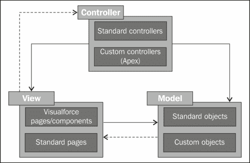

# 第一章. Visualforce 入门

云计算对 IT/软件开发行业产生了重大变革。云平台是云计算的重要方向之一。云平台允许开发者开发应用程序并在云上运行它们，包括用于构建按需应用程序和**平台即服务**（**PaaS**）的平台。Salesforce.com 推出了第一个按需平台，称为 Force.com。

本章将向您介绍 Visualforce。我们将探讨 MVC 架构和 Visualforce，并进一步了解 Visualforce 页面的架构。我们将定义 Visualforce 页面的优势，并对 Visualforce 开发工具有一个大致的了解。

本章涵盖以下主题：

+   MVC 模型

+   理解 Visualforce

+   Visualforce 架构

+   Visualforce 的优势

+   Visualforce 开发工具

让我们开始吧，进入 Visualforce 的世界。

# MVC 模型

Force.com 平台使用**模型-视图-控制器**（**MVC**）架构模式来开发应用程序。MVC 将应用程序开发工具分为以下几部分：

+   **模型**：这定义了数据结构。在 Force.com 中，对象定义了数据模型。Salesforce 通过将每个实体映射到某个对象来设计平台。

+   **视图**：这定义了数据是如何被表示的。在 Force.com 中，页面布局和 Visualforce 页面属于这一类别。

+   **控制器**：这定义了业务逻辑。操纵数据的规则和动作控制视图。在 Force.com 中，**Apex**类、触发器、工作流、审批和验证规则属于这一类别。

    MVC 架构

# 理解 Visualforce

在 Force.com 平台中，我们可以使用自定义对象和标准对象来开发 Force.com 应用程序。每个对象都有一个标准用户界面，包含一个或多个页面布局。但是，我们不能使用标准页面布局来满足复杂需求。在这里，Visualforce 就派上用场了。

Visualforce 是一个基于 Web 的 UI 框架，可用于构建复杂、吸引人和动态的自定义用户界面。Visualforce 允许开发者使用标准 Web 开发技术，如 jQuery、JavaScript、CSS 和 HTML5。因此，我们可以为任何应用程序（包括移动应用程序）构建丰富的 UI。我们将在后面更深入地讨论使用标准 Web 开发技术进行 Visualforce 开发以及 Visualforce 移动开发。类似于 HTML，Visualforce 框架包括基于标签的标记语言。

Visualforce 页面有两个主要元素，称为 Visualforce 标记和 Visualforce 控制器。Visualforce 标记由前缀为 `apex:` 的 Visualforce 标签组成，其中还可以包含 HTML 标签、JavaScript 或任何其他标准 Web 开发代码。Visualforce 控制器包含一组指令，用于通过用户交互操作数据和模式。它还控制界面。与对象一起创建的标准控制器可以用作 Visualforce 控制器。标准控制器具有与标准页面中使用的相同逻辑和功能。但是，当我们需要使用不同的逻辑或功能时，我们可以编写自己的 Apex 控制器类，也可以使用 Apex 语言编写标准控制器或自定义控制器的扩展。Visualforce 中还有 AJAX 组件、动作的表达式语言公式和组件绑定交互。

# Visualforce 架构

Visualforce 是一种类似于 HTML 的标记语言。Visualforce 页面在 Force.com 平台上运行，它可以与标准 Web 开发技术如 JavaScript、jQuery 以及通过 CSS 进行样式化集成。它允许我们构建更丰富和动态的用户界面。每个页面都可以通过一个唯一的页面名称来识别。因此，Visualforce 页面有一个唯一的 URL 用于访问页面。开发者可以通过在地址栏中输入页面名称来创建一个 Visualforce 页面，如下面的屏幕截图所示：

从 URL 创建 Visualforce 页面

创建页面后，我们可以使用相同的 URL 访问页面。Visualforce 标记具有一组特殊的组件，类似于其他标记的标签库系统。这些组件允许我们使用单个标签创建复杂的组件。这些组件在服务器上被处理和渲染，最终交付给客户端。与仅客户端方法相比，这种方法具有更高的性能和更丰富的功能。Visualforce 页面运行在以下图示所示的平台上：

在服务器上保存 Visualforce 时的执行流程

上述图示说明，每次开发者在平台上保存一个 Visualforce 页面时，平台都会编译标记和相关的控制器。在编译成功后，标记会被转换成 Visualforce 渲染器能够理解的一组抽象指令。如果有任何编译错误，则停止保存页面并返回错误给开发者。如果保存尝试成功完成，则指令会被保存到元数据仓库并发送到 Visualforce 渲染器。渲染器将指令转换为浏览器能够理解的 HTML，然后刷新页面，如下面的图示所示：

Visualforce 页面的执行流程

上述图示说明了当非开发者用户请求 Visualforce 页面时，应用程序服务器从元数据存储库检索页面，然后将其发送到 Visualforce 渲染器进行 HTML 转换。由于页面在开发期间已经被编译成指令，因此不需要编译。

# Visualforce 的优势

以下是 Visualforce 对开发者的优势：

+   **模型-视图-控制器开发风格**：Visualforce 通过在 Force.com 平台上提供应用程序的视图来遵循 MVC 模式。视图由用户界面和 Visualforce 标记定义。与 Visualforce 标记相关联的 Visualforce 控制器负责业务逻辑。因此，设计师和开发者可以分别工作，设计师专注于用户界面，开发者专注于业务逻辑。

+   **用户友好的开发**：具有管理员配置文件的开发者用户可以在每个 Visualforce 页面的底部拥有一个 Visualforce 编辑器面板。此编辑器面板由用户记录的**开发模式**选项控制。此功能允许我们同时在一个窗口中编辑和查看结果页面。此 Visualforce 编辑器具有代码保存功能，包括自动编译和语法高亮。

+   **一系列现成的 Visualforce 组件**：Visualforce 在几个类别中提供了一套标准组件。例如，有输出组件，如`<apex:outputPanel>`、`<apex:outputField>`、`<apex:outputText>`、`<apex:pageBlock>`等。还有输入组件，例如`<apex:inputFile>`、`<apex:inputField>`、`<apex:inputText>`、`<apex:selectList>`等。这些输入和输出组件具有一个称为数据驱动默认值的功能。例如，当我们在一个特定的 Visualforce 页面中指定`<apex:inputField>`组件时，`<apex:inputField>`标签为该字段提供与数据类型相关的编辑界面的小部件（例如，**日期**字段有日历，而电子邮件/电话字段有它们特定的验证）。还有 AJAX 组件，例如`<apex:actionStatus>`。AJAX 组件允许用户提高特定界面的交互性水平。

+   **与 Salesforce 紧密集成/扩展自定义组件**：一个 Visualforce 页面可以拥有自定义控制器以及标准控制器。标准控制器是在创建对象时创建的，可以用于 Visualforce 控制器。标准控制器具有与标准页面中使用的相同逻辑和功能。Visualforce 页面遵循这些标准化方法和功能。我们还可以使用自定义组件扩展标准组件。例如，我们可以使用扩展类来扩展特定 Visualforce 页面的标准控制器。我们可以创建自己的 Visualforce 自定义组件，而不是使用 Visualforce 内置组件，例如`<apex:inputFile>`、`<apex:inputField>`、`<apex:outputField>`等。在接下来的两章中，我们将讨论更多关于 Visualforce 控制器和 Visualforce 自定义组件的内容。

+   **使用 Web 技术灵活且可定制**：通过使用 Web 技术，例如 JavaScript、CSS、jQuery、Flash 等，Visualforce 标记更加灵活和可定制，因为最终它会被渲染成 HTML。设计师可以使用 Visualforce 标签与这些 Web 技术一起使用。

# Visualforce 开发工具

我们可以通过导航到**您的姓名** | **设置** | **开发** | **页面**来编辑和查看 Visualforce 页面。

但是，这并不是开发 Visualforce 页面的最佳方式。还有其他几种构建 Visualforce 页面的方法，具体如下：

+   **Visualforce 编辑器面板**：这将在 Visualforce 的优势部分进行讨论。

+   **Force.com IDE**：这个 IDE 用于创建和编辑 Visualforce 页面、自定义 Visualforce 组件、静态资源和控制器。

+   **Force.com 的 Eclipse 插件**：这与 Force.com IDE 相同，我们可以用它来创建和编辑 Visualforce 页面、自定义 Visualforce 组件、静态资源和控制器，这些都是 Force.com IDE 的主要功能之一。

# 概述

在本章中，我们熟悉了 MVC 模型和 Visualforce。我们了解了 Visualforce 架构和 Visualforce 的优势，以及各种 Visualforce 开发工具。
