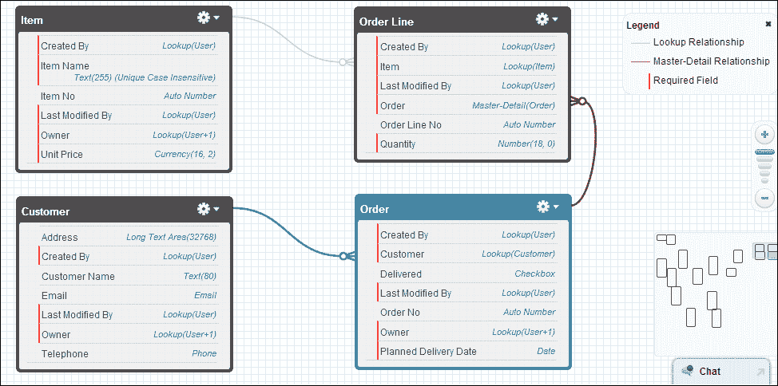
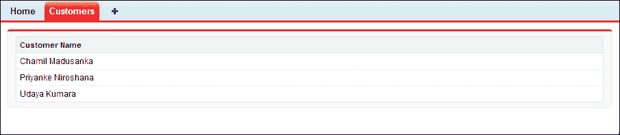
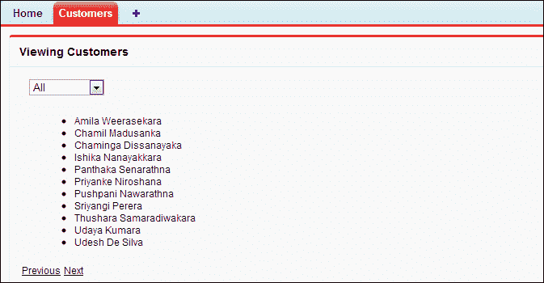
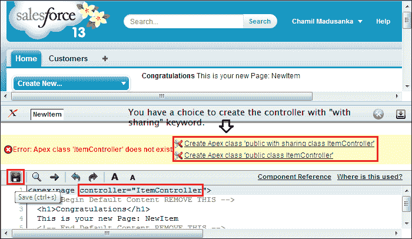
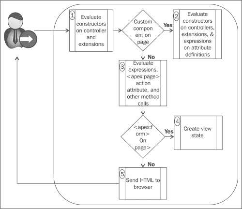
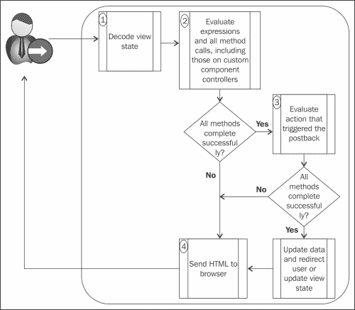

# 第二章 控制器和扩展

一组可以响应用户与 Visualforce 标记（例如，按钮点击或链接点击）交互的指令称为控制器。控制器可以控制页面的行为，并可以用来访问应在页面上显示的数据。

本章将向您介绍几种可用于 Visualforce 页面的控制器和扩展类型。我们将通过示例学习控制器的类型。

本章涵盖以下主题：

+   标准控制器

+   标准列表控制器

+   自定义控制器和控制器扩展

+   在 Visualforce 页面上处理大量数据

+   Visualforce 页面的执行顺序

+   验证规则和标准控制器或自定义控制器

+   使用 transient 关键字

+   创建自定义控制器和控制器扩展的注意事项

让我们更详细地看看控制器和扩展...

本章包含一系列示例，以解释 Visualforce 的重要元素和功能。从本章开始，我们将构建一个订单处理应用程序。该应用程序中有四个自定义对象（API 名称：`Customer__c`、`Item__c`、`Order__c`、`Order_Line__c`）。以下是我们将在 Force.com 平台上创建的订单处理应用程序的 E-R 图：



订单处理应用程序的 E-R 图

# 标准控制器

Force.com 平台提供了几种类型的控制器。第一种是标准控制器，每个**sObject**都有一个标准控制器。它们具有与它们最初在标准页面中使用的相同逻辑和功能。因此，我们可以使用标准控制器与 Visualforce 页面一起使用。例如，如果我们为 Visualforce 页面使用联系人标准控制器，我们可以实现联系人的标准`Save`方法，而无需编写任何额外的 Apex 代码。这种行为与在标准联系人编辑页面上实现`Save`方法的行为相同。

## 如何在 Visualforce 页面上使用标准控制器

`<apex:page>`标签有一个名为`standardController`的属性，用于将标准控制器与 Visualforce 页面关联。`standardController`属性的值将是 sObject 的 API 名称：

```js
<apex:page standardController="Customer__c">
</apex:page>
```

上一段代码显示了`standardController`属性的用法。

### 提示

您不能同时使用`standardController`和`controller`属性。

## 标准控制器操作

在 Visualforce 页面上，我们可以为以下标准 Visualforce 组件定义`action`属性：

+   `<apex:commandButton>`：此组件创建一个按钮，调用一个操作

+   `<apex:commandLink>`：此组件创建一个链接，调用一个操作

+   `<apex:actionPoller>`：此组件定期调用一个操作

+   `<apex:actionSupport>`：此组件在另一个命名的组件上触发事件（例如`onclick`、`onmouseover`等）并调用一个操作

+   `<apex:actionFunction>`: 此组件定义了一个新的 JavaScript 函数，该函数调用一个动作

+   `<apex:page>`: 此组件在页面加载时调用一个动作

可以使用{`!`}符号从页面调用动作方法。例如，如果您的动作方法名称是`MyFirstMethod`，则可以从页面标记中使用`{!MyFirstMethod}`符号来调用动作方法。

### 提示

此动作方法可以来自标准控制器、自定义控制器或控制器扩展。

标准控制器有几个标准动作方法，如下所示：

+   `save`: 此方法插入/更新一条记录。成功完成后，将重定向到标准详情页面或自定义 Visualforce 页面。

+   `quicksave`: 此方法插入/更新一条记录。没有重定向到详情页面或自定义 Visualforce 页面。

+   `edit`: 此方法将用户导航到当前记录的编辑页面。成功完成后，将返回调用动作的页面。

+   `delete`: 此方法删除当前记录。通过选择最近查看的列表过滤器将用户重定向到列表视图页面。

+   `cancel`: 此方法取消编辑操作。成功完成后，将返回调用编辑动作的页面。

+   `list`: 此方法通过选择最近查看的列表过滤器重定向到列表视图页面。

例如，以下页面允许我们插入新客户或更新现有客户记录。如果我们打算使用此页面来更新客户记录，则必须使用 ID 查询字符串参数指定 URL。每个标准控制器都有一个 getter 方法，该方法返回页面 URL 中指定的 ID 查询字符串参数指定的记录。当我们点击**保存**时，标准控制器上的`save`动作被触发，并更新客户详情。如果我们打算使用此页面来插入客户记录，则不得指定 URL 作为参数。在这种情况下，当我们点击**保存**时，标准控制器上的`save`动作被触发，并插入新的客户记录。

```js
<apex:page standardController="Customer__c">
    <apex:form >
        <apex:pageBlock title="New Customer" mode="edit">
            <apex:pageBlockButtons >
                <apex:commandButton action="{!save}" value="Save"/>
            </apex:pageBlockButtons>            
            <apex:pageBlockSection title="My Content Section" columns="2">
                <apex:inputField value="{!Customer__c.Name}"/>
                <apex:inputField value="{!Customer__c.Email__c}"/>
                <apex:inputField value="{!Customer__c.Address__c}"/>
                <apex:inputField value="{!Customer__c.Telephone__c}"/>
            </apex:pageBlockSection>
        </apex:pageBlock>
    </apex:form>
</apex:page>
```

### 提示

页面标记允许您通过使用`{!sObjectAPIName.FieldAPIName}`来访问特定 sObject 的字段。例如，如果您想访问`Customer`对象的`Email`字段，使用`Customer__c`标准控制器的页面可以使用`{!Customer__c.Email__c}`来返回当前上下文中客户的`Email`字段的值。

以下页面允许我们查看客户记录。在此页面中，也必须在 ID 查询字符串参数中指定 URL。`Customer__c`标准控制器的 getter 方法返回页面 URL 中指定的 ID 查询字符串参数指定的记录：

```js
<apex:page standardController="Customer__c">
    <apex:form >
        <apex:pageBlock title="Customer" mode="edit">
            <apex:pageBlockButtons >
                <apex:commandButton action="{!save}" value="Save"/>
            </apex:pageBlockButtons>            
            <apex:pageBlockSection title="Customer Details" columns="2">
                <apex:outputField value="{!Customer__c.Name}"/>
                <apex:outputField value="{!Customer__c.Email__c}"/>
                <apex:outputField value="{!Customer__c.Address__c}"/>
                <apex:outputField value="{!Customer__c.Telephone__c}"/>
            </apex:pageBlockSection>
        </apex:pageBlock>
    </apex:form>
</apex:page>
```

### 提示

要检查特定对象对登录用户的可访问性，您可以使用 `{!$ObjectType.objectname.accessible}` 语法。此表达式返回一个布尔值。例如，如果您想检查 `Customer` 对象的可访问性，您可以使用 `{!$ObjectType.Customer__c.accessible}`。

```js
<apex:page standardController="Customer__c">
    <apex:form >
        <apex:pageBlock title="New Customer" mode="edit">
            <apex:pageBlockButtons >
                <apex:commandButton rendered="{!$ObjectType.Customer__c.accessible}" action="{!save}" value="Save"/>
            </apex:pageBlockButtons>            
            <apex:pageBlockSection title="Customer Details" columns="2">
                <apex:inputField value="{!Customer__c.Name}"/>
                <apex:inputField value="{!Customer__c.Email__c}"/>
                <apex:inputField value="{!Customer__c.Address__c}"/>
                <apex:inputField value="{!Customer__c.Telephone__c}"/>
            </apex:pageBlockSection>
        </apex:pageBlock>
    </apex:form>
</apex:page>
```

以下代码解释了对象可访问性的用法。根据示例，您可以看到**保存**按钮，只有当特定用户具有访问客户记录的安全权限时才会显示。

# 标准列表控制器

第二种控制器类型是标准列表控制器，可用于显示或对一组记录（包括相关列表、列表页面和批量操作页面）执行操作。它允许我们在特定页面上过滤记录。我们可以使用标准列表控制器来处理账户、资产、活动、案例、联系人、合同、想法、潜在客户、机会、订单、产品 2、解决方案、用户以及所有自定义对象。

## 如何在 Visualforce 中使用标准列表控制器

与标准控制器类似，我们可以指定 `<apex:page>` 组件的 `standardController` 属性。此外，我们还需要指定 `<apex:page>` 组件的 `recordSetVar` 属性。

### 小贴士

`standardController` 属性指定了我们想要访问的记录类型。`recordSetVar` 属性表示页面使用列表控制器，以及记录集合的变量名（用于访问记录集合中的数据）。

以下标记解释了当页面与列表控制器相关联时，页面如何访问记录列表。在以下示例中，您可以引用客户记录列表。

```js
<apex:page standardController="Customer__c" recordSetVar="customers" sidebar="false">
    <apex:pageBlock >
        <apex:pageBlockTable value="{!customers}" var="a">
            <apex:column value="{!a.name}"/>
        </apex:pageBlockTable>
    </apex:pageBlock>
</apex:page>
```

以下截图展示了前述代码的结果：



客户列表示例的结果页面

## 标准列表控制器操作

所有具有 `action` 属性的标准 Visualforce 组件都可以与具有标准列表控制器的 Visualforce 页面一起使用。这些组件的使用方式与标准控制器相同。以下操作方法由所有标准列表控制器支持：

+   `save`：此操作方法插入/更新记录。在成功完成后，它将重定向到标准详情页面或自定义 Visualforce 页面。

+   `quicksave`：此方法插入/更新记录。没有重定向到详情页面或自定义 Visualforce 页面。

+   `List`：此方法在用户未指定筛选器 ID 时，通过选择最近查看的列表筛选器将重定向到列表视图页面。

+   `cancel`：此方法取消编辑操作。在成功完成后，它将返回到调用编辑操作的页面。

+   `first`：此方法显示集合中的第一页记录。

+   `last`：此方法显示集合中的最后一页记录。

+   `next`：此方法显示集合中的下一页记录。

+   `previous`：此方法显示集合中的上一页记录。

Salesforce 标准页面中的列表视图可用于过滤页面上的显示记录。例如，在客户主页上，您可以从列表视图下拉菜单中选择**以 c 开头的视图**，查看以字母 c 开头的客户。您可以在与列表控制器关联的页面上实现此功能。

可以向与列表控制器关联的页面添加分页功能。分页功能允许您实现下一页和上一页的操作。

例如，要创建一个包含列表视图和分页的简单客户列表页面，创建一个具有以下标记的页面：

```js
<apex:page standardController="Customer__c" recordSetvar="customers">
    <apex:form id="theForm"> 
        <apex:pageBlock title="Viewing Customers">               
            <apex:pageBlockSection >
                <apex:selectList value="{!filterid}" size="1">
                    <apex:selectOptions value="{!listviewoptions}"/>
                    <apex:actionSupport event="onchange" rerender="list"/>
                </apex:selectList>
            </apex:pageBlockSection>

            <apex:pageBlockSection id="list">
                <apex:dataList var="a" value="{!customers}" type="1">
                {!a.name}
                </apex:dataList>
            </apex:pageBlockSection>

            <apex:panelGrid columns="2">
                <apex:commandLink action="{!previous}" rerender="list">Previous</apex:commandlink>
                <apex:commandLink action="{!next}" rerender="list">Next</apex:commandlink>
            </apex:panelGrid>        
        </apex:pageBlock>
    </apex:form>
</apex:page>
```

以下截图显示了前面代码的结果：



使用分页查看客户列表

### 小贴士

默认情况下，列表控制器每页返回 20 条记录。要控制每页显示的记录数，请使用控制器扩展来设置`pageSize`属性。

# 自定义控制器和控制器扩展

自定义控制器用于实现逻辑和功能，而不使用标准控制器；控制器扩展用于扩展标准控制器或自定义控制器的逻辑和功能。自定义控制器和控制器扩展都是使用 Apex 编写的。

## 理解自定义控制器

自定义控制器用于实现逻辑和功能，而不使用标准控制器。自定义控制器使用 Apex 编写。以下是一些您可能想要使用自定义控制器的情况：

+   实现完全不同的功能，而不依赖于标准控制器的行为

+   覆盖现有功能

+   为页面创建新操作

+   自定义导航

+   使用 HTTP 调用或 Web 服务

+   使用向导

+   对页面上的信息访问有更大的控制权

+   在不应用权限的情况下运行页面

### 小贴士

每个页面只能使用一个控制器。

## 构建自定义控制器

您可以通过**设置**页面和 Visualforce 编辑器来构建自定义控制器。所有管理员和开发人员功能都包含在**设置**页面中，您可以从点击页面顶部的您的名字后出现的菜单中找到**设置**页面。

Visualforce 编辑器允许我们在同一窗口中编辑 Visualforce 页面的标记，并且我们可以看到页面的结果也将显示在同一页上。此编辑器具有自动完成、语法高亮、快速修复功能（开发者可以即时创建组件）以及使用以下方法在保存时编译：

+   通过**设置**页面：可以通过导航到**你的名字** | **设置** | **开发** | **Apex 类** | **新建**来完成此操作。

+   通过 Visualforce 编辑器：在创建页面后，您可以在 `<apex:page>` 标签的控制器属性中指定自定义控制器的名称，然后点击 **保存** 按钮。然后，如果您是开发者，页面将要求您创建一个与您输入的名称相同的类。然后，新创建的控制器将在 Visualforce 编辑器中显示，如图下截图所示。

    ### 小贴士

    您可以选择使用 `sharing` 或 `without sharing` 关键字编写控制器类，这会影响页面在系统模式或用户模式下运行。

    

    通过 Visualforce 编辑器创建自定义控制器

以下类是自定义控制器的一个示例。这个自定义控制器具有从 `Item__c` 自定义对象检索现有项目列表并添加新项目记录的功能。`insertNewItem` 是 `ItemController` 的动作方法。`ExistingITems` 是一个项目属性列表，用于检索现有项目记录。`ExistingITems` 属性有一个重写的 `get` 方法：

```js
public with sharing class ItemController {
  //public item property for new insertion
    public Item__c NewItem{get;set;}    
    public ItemController(){
        NewItem = new Item__c();
    }

    //get existing items to show in a table
    public List<Item__c> ExistingITems{
        get{
            ExistingITems = new List<Item__c>();
            ExistingITems = [SELECT Id, Name, Item_Name__c, Unit_Price__c FROM Item__c LIMIT 100];
            return ExistingITems;
        }
        set;
    }

    public PageReference insertNewItem() {
      try{
        insert NewItem;        
        //reset public property for new insert
        NewItem = new Item__c();
 }catch(DmlException ex){
            ApexPages.addMessages(ex);
        }
        return null;
    }
}
```

### 小贴士

自定义控制器使用非参数化构造函数。您不能为自定义控制器创建包含参数的构造函数。

上述控制器与以下 Visualforce 页面相关联。该页面有两个 `<apex:pageBlock>` 组件：一个用于显示现有项目记录表，另一个用于插入新项目：

```js
<apex:page controller="ItemController">
    <apex:form >
        <apex:pageBlock title="Existing Items">
            <apex:pageBlockTable value="{!ExistingITems}" var="oneItem" rendered="{!ExistingITems.size > 0}">
                <apex:column value="{!oneItem.Item_Name__c}"/>
                <apex:column value="{!oneItem.Unit_Price__c}"/>
            </apex:pageBlockTable> 
            <apex:outputText value="No records to display" rendered="{!ExistingITems.size == 0}"></apex:outputText>       
        </apex:pageBlock>
        <apex:pageBlock title="New Item">
<apex:pageMessages ></apex:pageMessages>
            <apex:pageBlockSection >                
                <apex:inputField value="{!NewItem.Item_Name__c}"/>                
                <apex:inputField value="{!NewItem.Unit_Price__c}"/>               
            </apex:pageBlockSection>            
            <apex:pageBlockButtons >
                <apex:commandButton action="{!insertNewItem}" value="save"/>
            </apex:pageBlockButtons>            
        </apex:pageBlock>
    </apex:form>
</apex:page>
```

## 理解控制器扩展

控制器扩展用于扩展标准控制器或自定义控制器的逻辑和功能。控制器扩展不能在没有标准控制器或自定义控制器的情况下存在于页面上。控制器扩展是用 Apex 编写的。当您想要：

+   保持标准或自定义控制器的大部分功能不变，并添加更多功能

+   构建一个根据用户权限运行的 Visualforce 页面

## 构建控制器扩展

我们可以像构建自定义控制器一样构建控制器扩展。

### 小贴士

扩展不能独立存在于页面上。它们可以用于带有自定义控制器或标准控制器的 Visualforce 页面。

以下类是控制器扩展的一个简单示例。这个控制器扩展用于扩展 `Order__c` 自定义对象的标准控制器的逻辑和功能。在这个扩展中，我们有一个参数化构造函数来从标准控制器获取订单记录。`getRecord()` 是从标准控制器获取记录的方法。`prepareFullOrder()` 是一个自定义方法，用于查询特定订单的订单行：

```js
public with sharing class OrderViewExtension{   
    public Order__c CurrentOrder{get;set;}
    public List<Order_Line__c> OrderLines{get;set;}

    public OrderViewExtension(ApexPages.StandardController controller){
        CurrentOrder = new Order__c();
        this.CurrentOrder = (Order__c)controller.getRecord();
        prepareFullOrder();
    }

    public void prepareFullOrder(){
        OrderLines = new List<Order_Line__c>();
        OrderLines = [SELECT Id, Name, Price__c, Item__c, Item__r.Unit_Price__c,Item__r.Item_Name__c, Order__c, Quantity__c FROM Order_Line__c WHERE Order__c =: this.CurrentOrder.Id];
    }  
}
```

### 小贴士

控制器扩展使用一个参数化构造函数，带有 `ApexPages.StandardController` 类型的参数或自定义控制器类型。

以下 Visualforce 页面使用了前面的控制器扩展。在页面上，我们有一个包含两个部分的页面块。第一部分显示了订单头部的详细信息。第二部分用于显示特定订单的订单行：

```js
<apex:page standardController="Order__c" extensions="OrderViewExtension">
  <apex:form >
      <apex:pageBlock >
          <apex:pageBlockSection title="Order Header">
              <apex:outputField value="{!Order__c.Name}"/>
              <apex:outputField value="{!Order__c.Customer__c}"/>
              <apex:outputField value="{!Order__c.Planned_Delivery_Date__c}"/>
          </apex:pageBlockSection>
          <apex:pageBlockSection title="Order Lines" columns="1">
              <apex:pageBlockTable value="{!OrderLines}" var="line">
                  <apex:column value="{!line.Name}"/>                  

                  <apex:column headerValue="Item">
                      <apex:outputLink value="/{!line.Item__c}" target="_blank">{!line.Item__r.Item_Name__c}</apex:outputLink>
                  </apex:column>
                  <apex:column value="{!line.Item__r.Unit_Price__c}"/>
                  <apex:column value="{!line.Quantity__c}"/>
                  <apex:column value="{!line.Price__c}"/>
              </apex:pageBlockTable>
          </apex:pageBlockSection>
      </apex:pageBlock>
  </apex:form>
</apex:page>
```

## 控制器方法

在自定义控制器或控制器扩展中可以使用三种类型的方法：

+   获取方法

+   设置方法

+   动作方法

### 获取方法

开发者可以使用获取方法在 Visualforce 标记中显示数据库或其他计算值。这意味着获取方法用于将数据从 Apex 控制器传递到 Visualforce 页面。定义获取方法有两种方式。

通常，获取方法命名为 `getVariable`，其中变量是获取方法返回的属性的名称：

```js
public class GetterSetterExample{
    String GetterVariable;

    public String getGetterVariable() {
        return GetterVariable;
   }

}
```

获取方法可以使用默认的获取和设置方法定义一个属性：

```js
public class GetterSetterExample{
    public String GetterVariableDefault{get;set;}
}
```

变量可以通过 `{!}` 表达式在 Visualforce 页面上访问。

### 设置方法

设置方法用于将用户定义的值传递到 Apex 控制器。设置方法与获取方法的定义方式相同。以下示例使用默认的获取和设置方法搜索数据库中已存在的项目：

```js
public with sharing class SearchItemController {

    public List<Item__c> ExistingItems{get;set;}
    public String Keyword{get;set;}

    public SearchItemController(){
        ExistingItems = new List<Item__c>();
    }
      public void SearchItems(){    
        ExistingItems = [SELECT Id, Name, Item_Name__c, Unit_Price__c FROM Item__c WHERE Item_Name__c LIKE: ('%'+Keyword+'%')];        
    }
}
```

以下是一个使用前面控制器的 Visualforce 页面。`Keyword` 属性具有 `<apex:inputText>` 组件的默认获取和设置方法，用于获取用户的输入。`ExistingItems` 列属性也有默认的获取和设置方法，用于搜索和显示搜索结果。当用户输入搜索关键字并点击 **搜索** 按钮时，`SearchItems()` 动作方法将被执行，这将获取关键字搜索文本并运行查询以搜索项目。在动作方法执行之前，将执行关键字设置方法。然后查询结果将被收集到 `ExistingItems` 列属性中，然后执行 `ExistingItems` 获取方法，页面将显示搜索结果：

```js
<apex:page controller="SearchItemController">
  <apex:form >
      <apex:pageBlock >
          <apex:pageBlockSection >
              <apex:pageBlockSectionItem >
                  <apex:outputLabel value="Item Name Or keyword"></apex:outputLabel>
                  <apex:inputText value="{!Keyword}"/>                 
              </apex:pageBlockSectionItem>  
               <apex:commandButton value="Search" action="{!SearchItems}"/>            
          </apex:pageBlockSection>
      </apex:pageBlock>

       <apex:pageBlock title="Search Result" id="searchResult">
            <apex:pageBlockTable value="{!ExistingItems}" var="oneItem" rendered="{!ExistingItems.size > 0}">
                <apex:column value="{!oneItem.Item_Name__c}"/>
                <apex:column value="{!oneItem.Unit_Price__c}"/>
            </apex:pageBlockTable> 
            <apex:outputText value="No records to display" rendered="{!ExistingItems.size == 0}"></apex:outputText>       
        </apex:pageBlock>
  </apex:form>
</apex:page>
```

### 动作方法

动作方法用于在自定义控制器或控制器扩展中实现我们的自定义或扩展逻辑和功能。动作方法可以在页面事件（如按钮点击或 JavaScript 事件）上触发。在 Visualforce 页面上，我们可以在许多标准 Visualforce 组件中定义 action 属性。这些组件是 `<apex:commandButton>`、`<apex:commandLink>`、`<apex:actionPoller>`、`<apex:actionSupport>`、`<apex:actionFunction>` 和 `<apex:page>`。前面的项目搜索示例有一个名为 `SearchItems` 的动作方法。`SearchItems` 用于根据用户输入的项目搜索条件查询项目。

# 在 Visualforce 页面上处理大量数据

在 Visualforce 页面上，我们不得不处理单个记录以及大量数据集。当我们处理大量数据集时，我们可以使用迭代组件，如 `<apex:pageBlockTable>`、`<apex:repeat>` 和 `<apex:dataTable>`。这些迭代组件在集合中的最大项目数限制为 1000 项。请参考迭代组件的使用示例。我们已经在之前的搜索项示例中使用了 `<apex:pageBlockTable>`。

### 提示

自定义控制器和控制器扩展遵循 Apex 管理员限制。

Visualforce 提供了“只读模式”功能，以克服单个请求中可查询的行数限制和页面中可迭代的集合项目数限制。设置 Visualforce 的只读模式功能有两种方法，如下所示：

+   **为控制器方法设置只读模式**：为此设置，我们可以使用 `@ReadOnly` 注解定义 Visualforce 控制器方法。这种只读模式将单个查询中查询的记录数从 50,000 增加到 1,000,000 行。只读模式的 `@ReadOnly` 注解在 JavaScript 远程调用中用作目标，用于加载 `<apex:chart>` 组件的数据集并在组件中显示一些值。

+   **为整个页面设置只读模式**：通过为 `<apex:page>` 上的 `readOnly` 属性添加 `true` 值，可以启用此只读模式。这种只读模式将单个查询中查询的记录数从 50,000 增加到 1,000,000。它还增加了迭代组件中集合项目的最大数量。由于这是一个只读模式，请注意，页面不能执行任何 DML 操作。

# Visualforce 页面的执行顺序

Visualforce 页面有一个生命周期或生存期。这个时间定义为页面创建与用户会话期间销毁之间的时间段。生命周期由 Visualforce 页面请求的类型和页面内容定义。有两种类型的 Visualforce 页面请求，如下所示：

+   Get 请求

+   Postback 请求

## Visualforce 页面的 get 请求执行顺序

当我们通过输入 URL 或点击按钮或链接来请求新页面时，会创建一个 get 请求。以下图表说明了 Visualforce 页面在 get 请求期间如何与自定义控制器或控制器扩展交互：



Visualforce 页面的 get 请求执行顺序

执行顺序如下：

1.  构造方法是通过初始化控制器对象来调用的。

1.  如果有任何自定义组件，它们将被创建，并且在其关联类上调用构造方法。如果组件中指定了任何使用表达式的属性，这些表达式也将被评估。

1.  任何 `assignTo` 属性和表达式都会被评估。之后，`<apex:page>` 组件上的 `action` 属性会被评估，并调用所有获取器或设置器方法。

1.  如果页面包含 `<apex:form>` 标签，那么表示数据库状态的全部信息都会被加密并保存在页面请求之间的视图状态中。每当页面更新时，该视图状态也会相应更新。

1.  最后，生成的 HTML 会被发送到浏览器。如果存在任何客户端技术（例如 JavaScript 和 CSS），浏览器将执行它们。

## Visualforce 页面回发请求的执行顺序

一些用户交互（例如，由用户点击按钮触发的 `save` 操作）需要页面更新，通常这些页面更新是通过回发请求来执行的。以下图表展示了在回发请求期间，Visualforce 页面如何与自定义控制器或控制器扩展进行交互：



Visualforce 页面回发请求的执行顺序

执行顺序如下：

1.  视图状态会被解码，并用作在回发请求期间更新页面值的依据。

1.  表达式会被评估，并执行设置器。

1.  执行操作。在成功完成后，数据会被更新。如果回发请求将用户重定向到同一页面，视图状态也会更新。

1.  结果会被发送到浏览器。

### 提示

如果我们想在页面不执行输入验证或数据更改的情况下执行操作，可以为特定组件使用具有 `true` 值的立即属性。

回发请求可以以页面重定向结束，有时自定义控制器或控制器扩展可能会在原始页面和重定向页面上共享。如果回发请求包含 `<apex:form>` 组件，则只返回 ID 查询参数。

### 提示

`<apex:page>` 组件的 `action` 属性仅在 get 请求期间被评估。一旦用户被重定向到另一个页面，视图状态和控制器对象就会被删除。

# 验证规则和标准控制器/自定义控制器

可以将验证规则应用于自定义或标准对象，以在插入和更新操作中验证数据。当我们对 Visualforce 页面执行此类操作时，它使用标准控制器或自定义控制器，该记录可能引起验证规则错误，我们可以在 Visualforce 页面上显示这些错误，就像在标准页面上做的那样。验证规则有两个选项来选择显示特定字段错误的位置。如果我们选择**页面顶部**，错误可以通过在`<apex:page>`组件内的`<apex:pageMessages>`或`<apex:messages>`组件中显示。如果我们选择**字段**选项，错误将显示在位于`<apex:inputField>`组件旁边的相关字段中。例如，你可以在*构建自定义控制器*部分中查看提供的示例页面。

你可以通过为**单价**字段输入非数字字符来尝试这个示例。将显示一个错误消息，位于`Unit_Price__c`字段附近，与`<apex:inputField>`组件相关。

# 使用 transient 关键字

`transient`关键字用于声明变量，并在 Apex 类中使用。将变量声明为 transient 可以减少视图状态的大小。带有`transient`关键字的变量不能被保存，不应作为特定 Visualforce 页面的视图状态的一部分传输。transient 变量仅在页面请求期间需要。

`transient`关键字用于可序列化的 Apex 类，这意味着实现`Batchable`或`Schedulable`接口的类。以下 Apex 对象被原生认为是`transient`：

+   `PageReference`

+   `XmlStreamClasses`

+   `Collections`（只有当它们持有的对象类型自动标记为`transient`时）

+   由系统方法如`Schema.getGlobalDescribe`生成的多数对象

+   静态变量

+   `JSONParser`类的实例

以下示例包含一个 transient `datatime`变量和一个非 transient `datatime`变量。这个示例展示了 transient 变量的主要特性，即它们不能被保存，不应成为视图状态的一部分。当我们点击**刷新**按钮时，transient 日期将被重新创建，但非 transient 日期将保持其原始值：

```js
<apex:page controller="TransientExampleController">
    Non Transient Date: {!t1} <br/>
    Transient Date    : {!t2} <br/>
    <apex:form >
        <apex:commandLink value="Refresh"/>
    </apex:form>
</apex:page>

public with sharing class TransientExampleController {
    DateTime t1;
    transient DateTime t2;
    public String getT1() {
        if (t1 == null) t1 = System.now();
        return '' + t1;
    }

    public String getT2() {
        if (t2 == null) t2 = System.now();
        return '' + t2;
    }
```

# 创建自定义控制器和控制器扩展时的注意事项

当你创建自定义控制器和控制器扩展时，请记住以下注意事项：

+   你需要牢记的是 Apex 限制器。

+   Apex 类可以通过使用`without sharing`和`with sharing`分别以系统模式和用户模式运行。在不共享控制器的情况下可以暴露敏感数据。

+   必须将`webservice`方法定义为全局的。所有其他方法都是公开的。

+   通过使用集合、映射或列表来尝试减少访问数据库的时间。这将提高你代码的效率。

+   Apex 方法和变量不是按照保证的顺序实例化的。

+   您不能在控制器构造方法中实现**数据操作语言（DML**）。

+   您不能为控制器中的任何 getter 方法、setter 方法或构造方法定义`@future`注解。

+   原始数据类型（如 String、Integer 等）是通过值传递的，而非原始 Apex 数据类型（如 list、maps、set、sObject 等）是通过引用传递到组件控制器的。

# 摘要

在本章中，我们熟悉了控制器的类型和扩展。我们学习了标准控制器、标准列表控制器、自定义控制器和控制器扩展之间的差异及其用法。我们学习了如何处理代码以便与大量数据一起工作。此外，我们还看到了 Visualforce 页面的执行顺序、transient 关键字的使用以及验证规则和控制器的相互连接。
