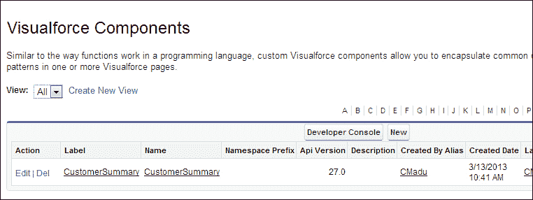
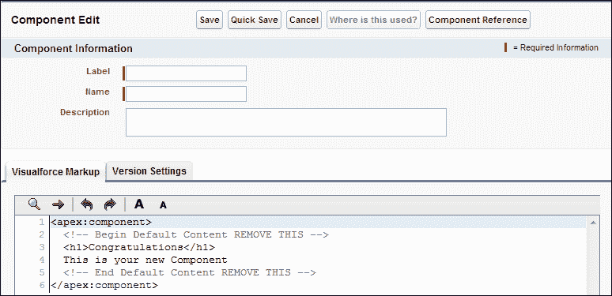
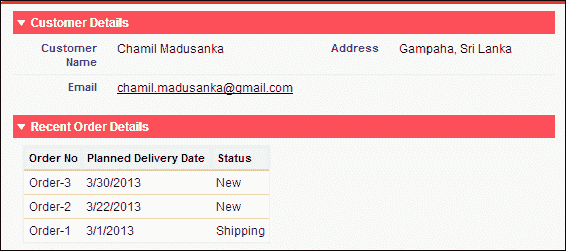

# 第四章：Visualforce 自定义组件

Salesforce 拥有一系列标准 Visualforce 组件，如 `<apex:detail>`、`<apex:pageBlock>`、`<apex:pageBlockTable>` 和 `<apex:relatedList>`。它们已准备好在 Visualforce 页面中使用，并且 Force.com 平台允许我们构建自己的 Visualforce 组件，这些组件可以在 Visualforce 页面中使用。

本章作为 Visualforce 自定义组件的概述，并进一步解释了如何创建自定义组件。本章涵盖了以下主题：

+   理解 Visualforce 自定义组件

+   如何在 Visualforce 页面中创建和使用自定义组件

+   自定义属性和自定义控制器

让我们构建自己的 Visualforce 自定义组件。

# 理解 Visualforce 自定义组件

有许多标准 Visualforce 组件（如 `<apex:detail>`、`<apex:pageBlock>`、`<apex:pageBlockTable>` 和 `<apex:relatedList>`），这些组件可以在 Visualforce 页面中重用。标准 Visualforce 组件是一个预构建的、封装的代码段。这些标准 Visualforce 组件是根据常见用法构建的。

Force.com 平台允许我们开发可在特定应用程序中重用的自定义 Visualforce 组件。自定义组件可以使用 Apex 和 Visualforce 进行开发。例如，假设我们想要创建一个包含最近订单的客户摘要，并且需要在我们的订单处理应用程序的不同位置使用此功能。我们还需要指定最近订单的数量。根据指定的数量，客户摘要中显示的最近订单数量将会改变。使用 Visualforce 自定义组件是实现此类特定要求的最优选择。

Visualforce 自定义组件可以具有零个或多个属性作为参数传递到组件中。具有属性的自定义组件类似于参数化的 Apex 方法。我们可以在最终使用级别（在 Visualforce 页面中）更改属性的值。

# 创建和使用自定义组件

我们可以创建一个 Visualforce 组件用于在 Visualforce 页面中使用。导航到以下路径以创建一个新的 Visualforce 组件：

**您的姓名** | **设置** | **开发** | **组件** | **新建**



创建新的 Visualforce 组件

在创建自定义组件时，我们需要指定以下属性：

+   **标签**：此自定义组件将通过标签在设置工具中识别。

+   **名称**：此自定义组件将通过 `name` 在 Visualforce 标记中识别。必须在组织内是唯一的。

+   **描述**：这给出了自定义组件的描述。

+   **主体**：Visualforce 标记必须放置在主体部分。

### 注意

自定义组件的名称应该以字母开头，并且不应该以下划线结尾。此外，名称中不应包含空格或连续的两个下划线。

自定义组件可以包含的最大数据量是 1 MB，或大约 1,000,000 个字符。

我们可以通过使用版本设置来指定与特定组件一起使用的 Visualforce 版本和 API。

自定义组件的主体可以定义如下：

```js
<apex:component 
  <!—Desire markup here-->
</apex:component>
```

### 提示

组件标记与其他 Visualforce 页面相同。它可以是由 Visualforce 和 HTML 标签组合而成的。我们还可以添加自定义 CSS 和 JavaScript。

所有标记都应该定义在`<apex:component>`标签内。我们的自定义组件示例是一个包含最近订单的客户摘要。假设我们的自定义组件名称是`customerSummary`，我们可以在多个 Visualforce 页面上使用此组件。使用方法如下：

```js
<apex:page>
  <c: customerSummary />
</apex:page>
```

# 自定义属性和自定义控制器

当我们创建复杂的自定义组件时，我们需要使用一些其他功能来构建自定义组件。主要的是，我们必须为自定义组件使用自定义属性和自定义控制器。属性可以在`<apex:component>`中定义，用于从 Visualforce 页面（使用组件的页面）传递值到自定义组件或组件的控制器。

我们已经实现了从本章开头解释的示例。以下是对组件标记的描述，它包含了属性和组件的定义。我们有两个要传递的属性，即客户 ID 和我们要在页面上显示的最近订单数量。这两个参数用于将值传递到组件的控制器：

```js
<apex:component controller="CustomerSummaryComponenetController">
    <!-- Attribute Definitions -->
    <apex:attribute name="customerId" Type="String" required="true" description="customer id" assignTo="{!CusID}"/>
    <apex:attribute name="noOfRecentOrders" Type="Integer" required="true" description="Number of recent orders" assignTo="{!RecentNo}"/>
    <!-- Attribute Definitions : End -->
    <!-- Component Definition -->
    <apex:componentBody >
        <apex:pageBlock >
            <apex:pageBlockSection title="Customer Details">
                <apex:outputField value="{!CurrentCustomer.Name}"/>
                <apex:outputField value="{!CurrentCustomer.Address__c}"/>
                <apex:outputField value="{!CurrentCustomer.Email__c}"/>
            </apex:pageBlockSection> 

            <apex:pageBlockSection title="Recent Order Details">
                <apex:pageBlockTable value="{!RecentOrderList}" var="order">
                    <apex:column value="{!order.Name}"/>
                    <apex:column value="{!order.Planned_Delivery_Date__c}"/>
                    <apex:column value="{!order.Status__c}"/>
                </apex:pageBlockTable>
            </apex:pageBlockSection>    
        </apex:pageBlock>
    </apex:componentBody>
    <!-- Component Definition : End -->

</apex:component>
```

以下代码片段显示了与`cutomerSummary`自定义组件关联的自定义控制器。此控制器用于操作属性值。在这个例子中，我们查询了特定客户的客户记录和最近订单详情。`CurrentCustomer`和`RecentOrderList`的查询结果取决于`CusID`和`RecentNo`的值：

```js
public class CustomerSummaryComponenetController{
    public String CusID{get;set;}
    public Integer RecentNo{get;set;}
    public Customer__c CurrentCustomer{
        get{
            CurrentCustomer = new Customer__c();
            CurrentCustomer = [SELECT Id, Name, Address__c, Email__c, Telephone__c FROM Customer__c WHERE Id =: CusID];
            return CurrentCustomer;
        }
        set;
    }      
    public List<Order__c> RecentOrderList{
        get{
            RecentOrderList = new List<Order__c>();
            RecentOrderList = [SELECT Id, Name, Customer__c, Delivered__c, Planned_Delivery_Date__c, Status__c FROM Order__c WHERE Customer__c =: CusID ORDER BY CreatedDate DESC LIMIT :RecentNo];
            return RecentOrderList;
        }
        set;        
    }
}
```

这就是使用我们的自定义组件的方法。在这里，我们传递了我们要看到的客户 ID 和最近订单数量的值：

```js
<apex:page StandardController="Customer__c">
  <c:CustomerSummary customerId="{!Customer__c.Id}" noOfRecentOrders="3"></c:CustomerSummary>
</apex:page>
```

以下截图显示了`customerSummary`自定义组件的结果：



# 摘要

在本章中，我们概述了 Visualforce 自定义组件。现在我们有了创建和使用 Visualforce 自定义组件的知识。通过使用 Visualforce 自定义组件，我们学习了在 Visualforce 中重用代码的机制。我们看到了如何通过使用自定义属性和自定义控制器来构建更可定制的自定义组件。
