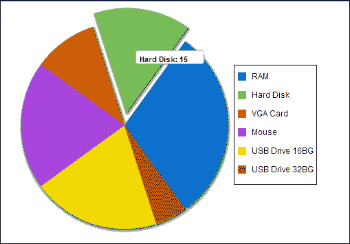
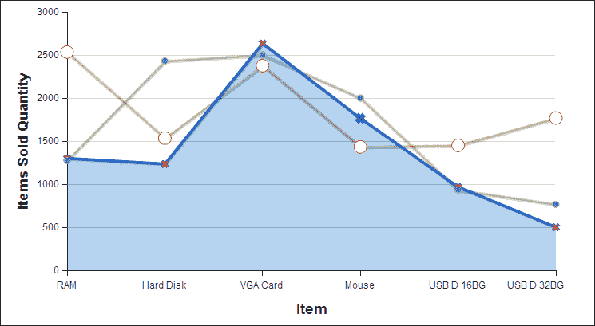

# 第六章. Visualforce 图表

Visualforce 图表是 Winter '13 版本中最好的特性之一。它是一组组件，提供了一种简单的方法来在我们的 Visualforce 页面上创建图表和 Visualforce 自定义组件。这个特性使我们能够根据我们的数据集（来自 SOQL 查询）自定义图表，并在我们的 Visualforce 页面上创建自定义图表（如饼图、柱状图和折线图）。我们可以使用 Visualforce 和 Apex 创建图表，图表组件会为我们处理所有的 JavaScript 代码。Visualforce 图表通过客户端的 JavaScript 渲染，这使我们能够在 Visualforce 页面上构建动画和视觉上令人兴奋的图表。

有时，标准的 Salesforce 图表和仪表板可能不足以满足我们的需求。这就是 Visualforce 图表发挥作用的地方。当我们无法使用 Visualforce 图表满足我们的需求时，我们可以在 Visualforce 中使用 Google 图表。

本章解释了 Visualforce 图表，它是一组组件，提供了一种简单直观的方法来在您的 Visualforce 页面上和自定义组件中创建图表。本章将涵盖以下主题：

+   Visualforce 图表的限制和注意事项

+   Visualforce 图表是如何工作的

+   使用 Visualforce 图表的复杂图表

让我们构建一些令人兴奋的 Visualforce 图表…

# Visualforce 图表的限制和注意事项

当 Force.com 发布 Visualforce 图表功能时，他们宣布了一些已知的使用 Visualforce 图表的限制和注意事项，如下所示：

+   Visualforce 图表只能在支持可伸缩矢量图形（**SVG**）的浏览器中渲染。

+   Visualforce 图表无法在渲染为 PDF 的页面上显示，因为 Visualforce 图表使用 JavaScript 来绘制图表。

+   Visualforce 图表不用于电子邮件消息或电子邮件模板，因为电子邮件客户端不支持在电子邮件消息中执行 JavaScript。

+   当我们使用 Visualforce 图表开发 Visualforce 页面时，我们需要使用 JavaScript 调试工具，如 Firebug，来跟踪从 Visualforce 图表返回到 JavaScript 控制台的错误和消息。

+   动态 Visualforce 图表（由 Apex 生成）截至 2013 年春季仍未被 Force.com 平台支持。然而，这个特性预计很快就会发布。

# Visualforce 图表是如何工作的

Visualforce 图表依赖于 Apex、Visualforce 和 JavaScript。当我们创建 Visualforce 图表时，我们需要一个 Apex 方法来准备或查询作为图表数据源的数据。然后我们需要使用 Visualforce 图表组件来定义我们的图表。在 Apex 方法中准备好的图表数据绑定到图表组件上，JavaScript 在浏览器中绘制图表。

Visualforce 图表需要一个至少包含一个数据系列组件的图表容器。我们有能力添加额外的系列、图表轴和标签组件（如图例、图表标签和数据点的工具提示）。

以下示例创建了一个简单的饼图，其中包含发送给客户的物品数量。在这个例子中，我们为图表数据源硬编码了值。以下是一个饼图示例的标记：

```js
<apex:page controller="VFChartController" title="Pie Chart">
    <apex:chart height="350" width="450" data="{!chartData}">
        <apex:pieSeries dataField="data" labelField="name"/>
        <apex:legend position="right"/>
    </apex:chart>
</apex:page>
```

这里是相关的自定义控制器，它为图表准备数据源。图表容器由`<apex:chart>`组件定义，数据绑定通过`getChartData()`控制器方法完成。`<apex:pieSeries>`组件根据返回的数据定义标签和数据字段，如下所示：

```js
public class VFChartController {

    public List<PieChartData> getChartData () {
        List<PieChartData> data = new List<PieChartData>();
        data.add(new PieChartData('RAM', 30));

        data.add(new PieChartData('Hard Disk', 15));
        data.add(new PieChartData('VGA Card', 10));
        data.add(new PieChartData('Mouse', 20));
        data.add(new PieChartData('USB Drive 16BG', 20));
        data.add(new PieChartData('USB Drive 32BG', 5));
        return data;
    }
    // Wrapper class
    public class PieChartData {
        public String name { get; set; }
        public Integer data { get; set; }

        public PieChartData(String name, Integer data) {
        this.name = name;
        this.data = data;
        }
    }
}
```

前一个示例的结果图表如下截图所示：



结果饼图

前一个示例说明了以下要点：

+   `PieChartData`: 这是一个内部类，它包含一组属性来定义图表的标签（`name`属性）和数据（`data`属性）。

+   `getChartData()`: 此方法返回一个`PieChartData`包装对象的列表。这些列表元素创建了图表的数据点。

+   `<apex:pieSeries>`: 此组件定义了从返回的数据（`PieChartData`对象）中获取的标签和数据字段。

## 提供图表数据

以下提供图表数据源的三种不同方式：

+   使用控制器方法

+   使用 JavaScript 函数

+   使用 JavaScript 数组

### 使用控制器方法

这种技术已在我们的简单饼图示例中说明。这是一个服务器端技术，在这里我们使用控制器方法返回一个对象列表。这个对象列表可以是我们的 Apex 包装对象（如前一个示例所示）、`AggregateResult`对象或`sObjects`。方法的结果在服务器端序列化为 JSON，并在客户端直接由`<apex:chart>`组件使用。有关此技术的更多信息，请参阅简单饼图示例。

### 使用 JavaScript 函数

提供图表组件数据还有另一种方式，即通过 JavaScript 函数。我们可以在`<apex:chart>`组件中使用 JavaScript 函数的名称。这个 JavaScript 函数是数据提供者，它可以在 Visualforce 页面中定义或链接到 Visualforce 页面。我们可以使用这个 JavaScript 函数在发送到`<apex:chart>`组件之前操纵数据。有关在 Visualforce 中使用 JavaScript Remoting 的更多信息，请参阅 Apex 控制器中的 JavaScript Remoting 部分。以下是一个带有`<apex:chart>`组件的简单 JavaScript 函数示例：

```js
<apex:page controller="VFRemoteChartController" title="Pie Chart">
  <script>
    function getRemoteChartData(callback) {
      VFRemoteChartController.getRemotePieChartData(function(result, event) {
        if(event.status && result && result.constructor === Array) {
          callback(result);
        }
      });
    }
  </script>
    <apex:chart height="350" width="450" data="getRemoteChartData">
        <apex:pieSeries dataField="data" labelField="name"/>
        <apex:legend position="right"/>
    </apex:chart>
</apex:page>
```

以下类是前一个页面的相关自定义控制器。我们使用`@RemoteAction`注解定义了远程方法。该远程方法将数据转换为图表组件：

```js
public class VFRemoteChartController {

  @RemoteAction
  public static List<PieChartData> getRemotePieChartData() {
    List<PieChartData> data = new List<PieChartData>();
        data.add(new PieChartData('RAM', 30));

        data.add(new PieChartData('Hard Disk', 15));
        data.add(new PieChartData('VGA Card', 10));
        data.add(new PieChartData('Mouse', 20));
        data.add(new PieChartData('USB Drive 16BG', 20));
        data.add(new PieChartData('USB Drive 32BG', 5));
        return data;
  }

  // Wrapper class
    public class PieChartData {
        public String name { get; set; }
        public Integer data { get; set; }

        public PieChartData(String name, Integer data) {
        this.name = name;
        this.data = data;
        }
    }
}
```

### 使用 JavaScript 数组

提供数据的另一种方式是使用 JavaScript 数组。我们可以通过使用 JavaScript 数组（可以是 Salesforce 数据或非 Salesforce 数据）来使用 Visualforce 图表，而无需使用任何自定义控制器。我们可以在 JavaScript 代码中使用 Ajax Toolkit API 查询 Salesforce 数据，该 API 是 API 的 JavaScript 包装器，我们可以在自己的 JavaScript 代码中使用 JavaScript 数组来构建非 Salesforce 数据源。然后我们可以通过将数组的名称提供给`<apex:chart>`组件来在图表组件中使用该数组。当数据源仅依赖于客户端而不依赖于服务器端时，这种方法很有用。以下示例说明了如何定义使用 JavaScript 数组的 Visualforce 图表：

```js
<apex:page >
    <script>
        // Build the chart data array in JavaScript
        var dataArray = new Array();
        dataArray.push({'data':15,'name':'Hard Disk'});
        dataArray.push({'data':10,'name':'VGA Card'});
        dataArray.push({'data':20,'name':'Mouse'});
        dataArray.push({'data':20,'name':'USB Drive 16BG'});
        dataArray.push({'data':5,'name':'USB Drive 32BG'});
    </script>
    <apex:chart height="350" width="450" data="dataArray">
        <apex:pieSeries dataField="data" labelField="name"/>
        <apex:legend position="right"/>
    </apex:chart>
</apex:page>
```

### 小贴士

Visualforce 图表更可定制。我们可以自定义元素的外观和感觉、标记、填充颜色/线条的不透明度，并且可以结合各种数据源。

# 使用 Visualforce 图表的复杂图表

我们可以使用 Visualforce 图表构建复杂的图表，这些图表在一个图表中代表多个数据系列。例如，我们可以构建一个包含多个数据系列的图表。以下示例显示了三年内销售的商品数量。代码显示了自定义控制器，自定义控制器中的`getComplexChartData()`方法为图表组件准备数据。此控制器还有一个`@RemoteAction`方法，用于将数据传递到图表组件。但此示例没有使用 JavaScript 远程调用。它说明了在服务器端和 JavaScript 远程调用方法中重用数据生成方法的方式。

```js
public class ComplexChartController{

    // Return a list of data points for a chart
    public List<ChartData> getVFChartData() {
        return ComplexChartController.getComplexChartData();
    }

    // Make the chart data available via JavaScript remoting
    @RemoteAction
    public static List<ChartData> getRemoteVFChartData() {
        return ComplexChartController.getComplexChartData();
    }

    //prepare data sources
    public static List<ChartData> getComplexChartData() {
        List<ChartData> data = new List<ChartData>();
        data.add(new ChartData('RAM', 1300, 1275, 2534));
        data.add(new ChartData('Hard Disk', 1234, 2431, 1534));
        data.add(new ChartData('VGA Card', 2634, 2500, 2376));
        data.add(new ChartData('Mouse', 1765, 2000, 1432));
        data.add(new ChartData('USB D 16BG', 967, 932, 1450));
        data.add(new ChartData('USB D 32BG', 500, 765, 1768));        
        return data;
    }
    // Wrapper class
    public class ChartData{
        public String name { get; set; }
        public Integer data1 { get; set; }
        public Integer data2 { get; set; }
        public Integer data3 { get; set; }

        public ChartData(String name, Integer data1, Integer data2, Integer data3) {
            this.name = name;
            this.data1 = data1;
            this.data2 = data2;
            this.data3 = data3;
        }
    }
}
```

以下截图表示一个包含三个线系列的图表。此图表说明了三年内销售的商品数量：



复杂图表示例的输出

### 小贴士

在折线图和柱状图中，需要定义 x 轴和 y 轴。

复杂图表示例的标记如下：

```js
<apex:page controller="ComplexChartController">
    <apex:chart height="400" width="700" data="{!vFChartData}">

    <apex:axis type="Numeric" position="left" fields="data1" title="Items Sold Quantity" grid="true"/>
    <apex:axis type="Category" position="bottom" fields="name" title="Item"> </apex:axis>
    <apex:lineSeries axis="left" fill="true" xField="name" yField="data1" markerType="cross" markerSize="4" markerFill="#FF0000"/>
    <apex:lineSeries axis="left" xField="name" yField="data2" markerType="circle" markerSize="4" markerFill="#8E35EF"/>
    <apex:lineSeries axis="left" xField="name" yField="data3" markerType="circle" markerSize="8" markerFill="#FFFFFF"/>
    </apex:chart>
</apex:page>
```

# 摘要

在本章中，我们熟悉了 Visualforce 图表，它允许我们根据我们的数据构建自定义图表。我们了解到 Visualforce 图表是一个基于 JavaScript 的功能。因此，我们学习了 Visualforce 图表的限制和注意事项。我们还看到了如何使用 Visualforce 图表组件创建简单和复杂的图表。
